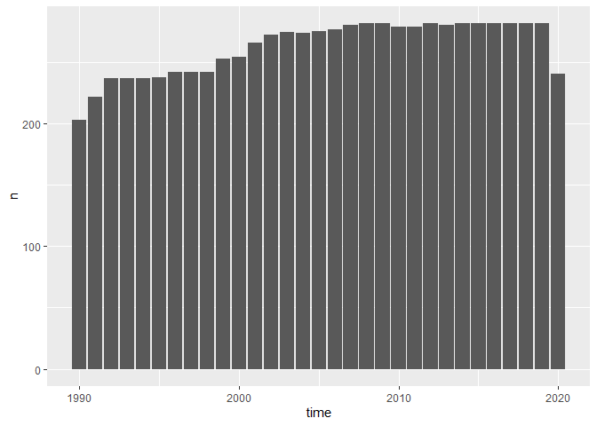
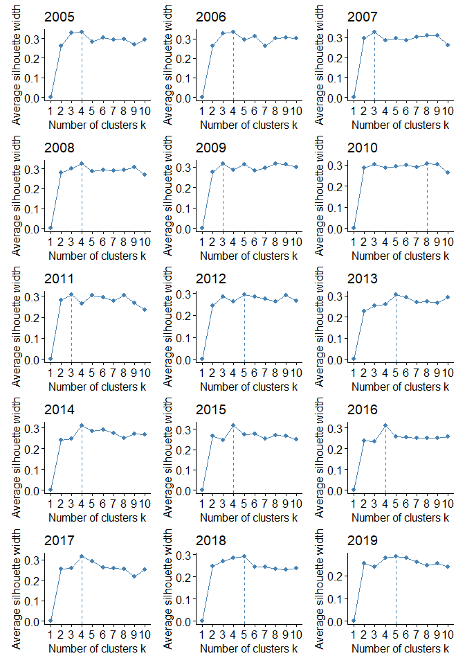
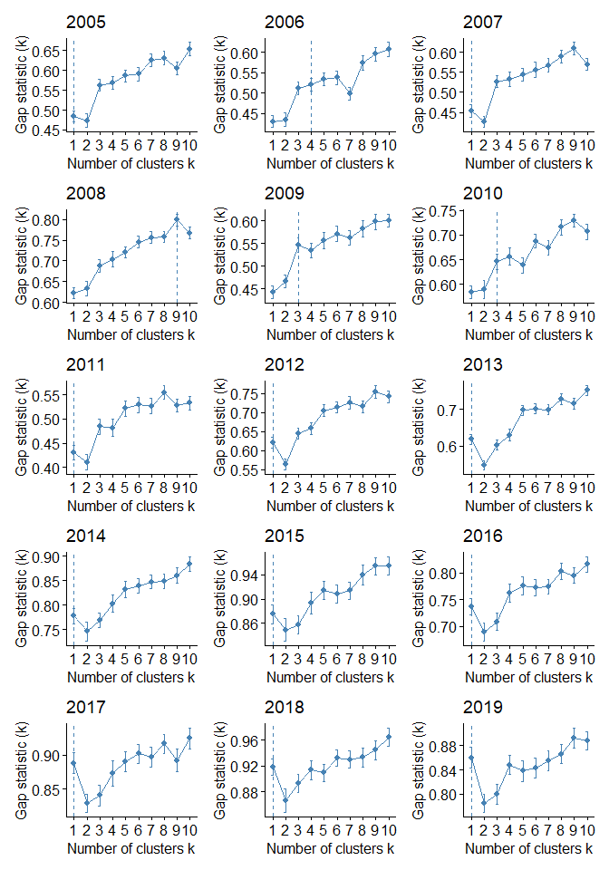
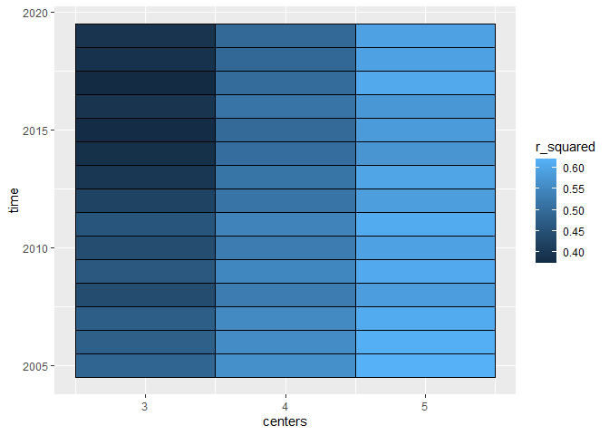
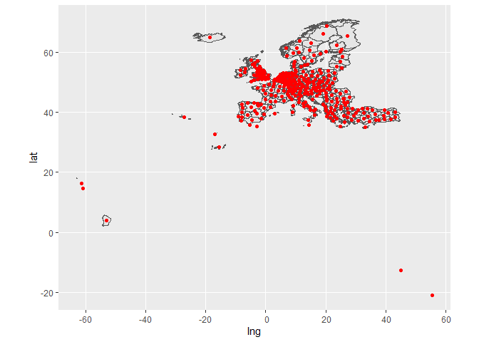

initial
================

``` r
library(tidyverse)
library(eurostat)
library(sf)
```

## datasetup

``` r
df_tfr <- get_eurostat("demo_r_find2", time_format = "num") %>% 
  filter(indic_de == "TOTFERRT") %>% 
  select(time, geo, tfr = values)

df_lifexp <- get_eurostat("demo_r_mlifexp", time_format = "num") %>% 
  filter(sex == "T" & age == "Y_LT1") %>% 
  select(time, geo, lifexp = values)
```

``` r
df_ageing <- get_eurostat("demo_r_d2jan", time_format = "num") %>% 
  filter(age != "TOTAL" & age != "UNK" & sex == "T") %>% 
  mutate(
    age = ifelse(age == "Y_LT1", 0, age),
    age = ifelse(age == "Y_OPEN", 100, age),
    age = str_remove_all(age, "Y"),
    age = as.numeric(age),
    young = age <= 14
    ) %>% 
  filter(age <= 14 | age >= 65) %>% 
  group_by(time, geo, young) %>% 
  summarise(values = sum(values)) %>% 
  ungroup() %>% 
  pivot_wider(names_from = young, values_from = values, names_prefix = "young") %>% 
  transmute(time, geo, ageing = youngFALSE / youngTRUE)
```

``` r
df_motherrate <- get_eurostat("demo_r_d2jan", time_format = "num") %>% 
  filter(sex == "F" & age %in% c("TOTAL", str_c("Y", 15:49))) %>% 
  mutate(t = age == "TOTAL") %>% 
  group_by(time, geo, t) %>% 
  summarise(values = sum(values)) %>% 
  ungroup() %>% 
  pivot_wider(names_from = t, values_from = values, names_prefix = "t") %>% 
  transmute(time, geo, motherrate = tFALSE / tTRUE)
```

``` r
df_emp <- get_eurostat("lfst_r_lfe2emprtn", time_format = "num") %>% 
  filter(isced11 == "TOTAL" & citizen == "TOTAL" & age == "Y15-64" & sex == "F") %>% 
  select(time, geo, emp = values)
```

``` r
dat <- list(df_tfr, df_lifexp, df_ageing, df_motherrate, df_emp) %>% 
  reduce(full_join) %>% 
  filter(str_length(geo) == 4 & geo != "HUXX") %>% 
  mutate(country = str_sub(str_sub(geo, end = 2))) %>% 
  filter(country %in% eu_countries$code) %>% 
  select(time, country, geo, everything())
```

## Cluster analyses

``` r
count(dat, time) %>% 
  ggplot(aes(time, n)) + 
  geom_col()
```

<!-- -->

``` r
dat_scaled <- dat %>%
  na.omit() %>% 
  filter(time > 2005 & time < 2020) %>% 
  select(-(1:3)) %>% 
  scale()
```

``` r
clusters_df <- dat %>%
  na.omit() %>% 
  filter(time >= 2005 & time < 2020) %>% 
  group_by(time) %>% 
  nest() %>% 
  mutate(
    obs = map_int(data, nrow),
    mdata = map(data, select_if, is.numeric),
    mdata = map(mdata, scale),
    silhuette_plot = map(mdata, ~ factoextra::fviz_nbclust(., FUNcluster = kmeans, method="silhouette") + ggtitle(time)),
    gap_stat_plot = map(mdata, ~ factoextra::fviz_nbclust(., FUNcluster = kmeans, method="gap_stat") + ggtitle(time))
  )
```

``` r
clusters_df %>% 
  pull(silhuette_plot) %>% 
  rev() %>% 
  patchwork::wrap_plots(ncol = 3)
```

<!-- -->

``` r
clusters_df %>% 
  pull(gap_stat_plot) %>% 
  rev() %>% 
  patchwork::wrap_plots(ncol = 3)
```

<!-- -->

``` r
clusters_df <- clusters_df %>% 
  mutate(
    km3 = map(mdata, ~ kmeans(., centers = 3, nstart=100, iter.max=100)),
    km4 = map(mdata, ~ kmeans(., centers = 4, nstart=100, iter.max=100)),
    km5 = map(mdata, ~ kmeans(., centers = 5, nstart=100, iter.max=100))
  )
```

``` r
clusters_df %>% 
  pivot_longer(km3:km5, names_to = "centers", values_to = "kmeans") %>% 
    transmute(time, centers = parse_number(centers), r_squared = map_dbl(kmeans, ~ .$betweenss / .$totss)) %>% 
  ggplot(aes(centers, time, fill = r_squared)) + 
  geom_tile(color = "black")
```

<!-- -->

## dist matrix

``` r
eurostat::get_eurostat_geospatial(nuts_level = "2") %>% 
  tibble() %>% 
  select(geo, geometry) %>% 
  mutate(
    c = sf::st_centroid(geometry),
    g = map(c, as.numeric),
    lng = map_dbl(g, 1),
    lat = map_dbl(g, 2)
         ) %>% 
  ggplot() + 
  geom_sf(aes(geometry = geometry)) +
  geom_point(aes(lng, lat), color = "red")
```

<!-- -->

``` r
eurostat::get_eurostat_geospatial(nuts_level = "2") %>% 
  tibble() %>% 
  select(geo, geometry) %>% 
  mutate(
    c = sf::st_centroid(geometry),
    g = map(c, as.numeric),
    lng = map_dbl(g, 1),
    lat = map_dbl(g, 2)
         ) %>% 
  select(geo, lng, lat) %>% 
  column_to_rownames("geo") %>% 
  dist(diag = T, upper = T)
```

    ##              DE24         NO03         HU11         HU12         HU21
    ## DE24   0.00000000   9.99908796   8.14755934   8.40937740   7.32357370
    ## NO03   9.99908796   0.00000000  15.82440436  16.03938781  15.43974647
    ## HU11   8.14755934  15.82440436   0.00000000   0.26203481   1.00841632
    ## HU12   8.40937740  16.03938781   0.26203481   0.00000000   1.24088967
    ## HU21   7.32357370  15.43974647   1.00841632   1.24088967   0.00000000
    ## HU22   6.30968970  14.84898567   2.13588871   2.37734333   1.13986774
    ## HU23   7.62965482  16.12296798   1.56866685   1.70349734   0.89663315
    ## ES61  20.31848699  26.23474870  25.71628427  25.92067213  24.71855616
    ## ES62  17.62394757  24.27344242  22.67171029  22.87093488  21.67928067
    ## ES63  21.90679623  27.97629831  27.05809757  27.25532160  26.06762983
    ## ES64  20.56956808  27.35265780  25.20390228  25.39007730  24.22754711
    ## FI19  17.38912806  14.73247397  15.53211264  15.52892756  16.08803331
    ## FI1B  16.88636949  15.57723759  14.06045780  14.02800542  14.70783182
    ## HU31   9.32664864  16.31098712   1.48778811   1.29237880   2.49097654
    ## HU32  10.26220240  17.24019219   2.23019765   1.98345621   3.22281203
    ## HU33   9.36548755  17.13128023   1.31988552   1.09231092   2.04678209
    ## IS00  33.47303195  28.23998938  41.55467756  41.81357063  40.78327149
    ## ITF2   8.96433934  18.91306191   7.34755555   7.44921729   6.57472632
    ## ITI4   8.19285875  18.18630596   8.39340217   8.53898238   7.50227867
    ## LI00   3.43352076  12.67031204   9.56128329   9.81075549   8.58033705
    ## LT01  14.65718135  16.81092628   9.55924762   9.45628883  10.39763258
    ## NO06  13.70409208   4.51977135  18.01418779  18.18857038  17.85494488
    ## NO07  20.78534810  14.31599082  21.37306490  21.43266788  21.70474197
    ## EL42  20.03535874  28.75598915  12.95757620  12.75806601  13.32372470
    ## ITF3   9.82488366  19.77584452   7.87859333   7.95814277   7.16750692
    ## ITF4  10.48016082  20.24296272   6.95336587   6.98038431   6.41920285
    ## ITF5  10.64927665  20.50429478   7.61152639   7.64975586   7.03343260
    ## ITF6  12.05883427  21.94477046   8.86000646   8.87372952   8.35537978
    ## ITG1  12.76639097  22.76546321  11.06696874  11.11823744  10.42818744
    ## NO05  12.27155071   2.88815055  18.60816636  18.82951521  18.17754903
    ## IE04  20.24194772  18.58279042  28.34503193  28.60678061  27.45913304
    ## NO04   9.77385183   2.27281432  16.52043111  16.75336067  16.01208066
    ## FRG0  12.46704739  15.87747549  19.93054136  20.18252488  18.95692085
    ## FRH0  14.33649833  16.72099459  21.95747433  22.21161648  20.99282952
    ## LT02  13.41904519  15.14000029   9.15872929   9.09939091   9.89317048
    ## LU00   5.28925490  10.49367486  13.21503733  13.47566071  12.30632629
    ## LV00  15.17459674  16.02806705  11.04206825  10.97338480  11.79500793
    ## FRI1  12.93615386  18.09983101  19.59611963  19.83351458  18.59264882
    ## FRI2  10.56548404  15.89548015  17.47678750  17.72065175  16.48188674
    ## FRI3  12.09971596  16.49194846  19.23509358  19.48161592  18.24548738
    ## HR03   7.15035236  16.78785598   4.70207249   4.84434638   3.83804801
    ## ES42  17.79082123  23.61511147  23.48456714  23.69792793  22.48005715
    ## ES43  20.61986295  25.69306657  26.58617894  26.80335451  25.57965636
    ## FI20  13.41744842  10.95821158  12.77612377  12.83053642  13.14434366
    ## FR10   8.97086231  12.94925021  16.64761097  16.90421373  15.69732006
    ## FRB0  10.02512207  14.42507516  17.42243780  17.67445670  16.44914583
    ## ITG2  10.24067396  19.72399289  12.50378714  12.66575454  11.57182668
    ## ITH1   3.35381457  13.29786726   7.73269513   7.97652639   6.73823185
    ## ITH2   3.92401420  13.80787133   8.10019509   8.33731039   7.09643610
    ## ITC1   6.07262300  14.80283653  11.44735458  11.67886018  10.43998876
    ## ITC2   5.87885062  14.18941081  11.84918845  12.08809911  10.84727221
    ## FRJ1  10.40865554  17.27897097  16.36252554  16.59048930  15.35426232
    ## FRJ2  11.72286442  17.79225963  18.01600722  18.24798080  17.00889306
    ## IE05  19.94257566  19.13081729  27.96824497  28.22885964  27.05568504
    ## IE06  18.67188623  17.42370044  26.76143277  27.02302644  25.87027026
    ## ITC3   6.37292549  15.54727524  10.89230705  11.11254155   9.88490162
    ## ITC4   4.71401938  14.19921367   9.52297493   9.75658221   8.51659744
    ## NO01   9.96460347   1.96104563  14.85345679  15.05067395  14.57768380
    ## FI1C  17.60052067  16.07944346  14.75956580  14.72326902  15.41677255
    ## FRF2   6.95735525  12.00610848  14.61671696  14.87393081  13.67111623
    ## FRC1   7.74794815  13.52939134  14.95632557  15.20721606  13.97918871
    ## FRC2   6.00700965  12.97487916  13.02579082  13.27630280  12.04759952
    ## FRD1  11.94529016  14.57109358  19.67827356  19.93485695  18.72738688
    ## FRD2  10.38310835  13.23515520  18.19477903  18.45290193  17.25549426
    ## ME00  10.71579575  19.77726781   4.69967906   4.62646556   4.57997322
    ## MK00  13.34157111  22.09502503   6.42873890   6.26434389   6.66196453
    ## MT00  14.44855187  24.44731311  12.48293998  12.51376027  11.90488843
    ## NL11   5.61196706   7.02439925  13.63038234  13.88933572  12.86963893
    ## NL12   6.35535837   7.52573275  14.44683781  14.70705261  13.66122681
    ## NL13   5.52515918   7.40071721  13.59792808  13.85787832  12.81876539
    ## NL21   5.48359989   7.85311719  13.60291549  13.86381217  12.80225190
    ## ES70  34.67882080  40.09045309  39.69713311  39.88343370  38.71979670
    ## NO02  11.41436199   2.05541622  16.41652621  16.61174878  16.14845248
    ## FRF3   5.38747366  11.45498429  13.02579773  13.28363231  12.08548937
    ## FRK1   9.30392405  15.37482224  16.03534761  16.27763856  15.03786249
    ## FRK2   7.60009667  14.87639884  13.92120202  14.16012430  12.91928944
    ## ES51  12.85065429  19.56739645  18.47906310  18.69707692  17.47229198
    ## ES52  15.99838745  22.61506083  21.26372722  21.46981177  20.26466473
    ## ES53  13.47038316  21.18085787  18.02779725  18.22331164  17.04001177
    ## ITH3   4.41331362  14.39173223   7.49387816   7.72176844   6.48554134
    ## ITH4   4.23823937  14.18620597   6.19863864   6.43046745   5.19127446
    ## ITH5   5.53344867  15.39166969   8.58962850   8.80262695   7.58626702
    ## FRL0   8.09197768  16.15643465  13.52235213  13.74732762  12.51396107
    ## FRM0   8.21972624  17.65527816  11.33510218  11.52483179  10.35645168
    ## FRY1  80.40651181  83.09172252  86.52349726  86.73247151  85.52148489
    ## NL22   5.79703123   8.39536231  13.94267576  14.20431734  13.11779847
    ## NL23   6.37162324   8.12896673  14.50701682  14.76827851  13.69510805
    ## NL31   6.53072282   8.68747329  14.67827586  14.94009961  13.84402651
    ## NL32   6.94235801   8.37127386  15.08414908  15.34560861  14.26523334
    ## NL33   7.14683835   9.16418468  15.28895834  15.55095874  14.44045171
    ## NL34   7.66127229   9.90366465  15.77266809  16.03462696  14.90185321
    ## NL41   6.37249776   9.16145220  14.50825468  14.77028536  13.65434828
    ## NL42   5.56346980   9.19021565  13.69064858  13.95268161  12.83220114
    ## ITI1   6.60764310  16.47375432   8.94172083   9.13563131   7.95848216
    ## ITI2   7.17358026  17.16376980   8.01288321   8.18264375   7.07094653
    ## ITI3   6.93116926  16.92760783   7.26093324   7.42960403   6.32262036
    ## FRY2  80.58395079  83.46518551  86.59076636  86.79661342  85.59117911
    ## FRY3  79.38680677  83.77619406  84.44522870  84.62397571  83.47790647
    ## FRY4  83.76836229  93.27304858  77.68604454  77.50438012  77.92290271
    ## FRY5  71.36907970  81.04623088  65.68721792  65.52137263  65.84585794
    ## HR04   7.18124163  16.22605102   2.83011779   2.97738674   1.98779965
    ## ES12  18.63554192  22.42375244  25.44713450  25.68393769  24.44314082
    ## ES13  16.86048563  21.22053935  23.53094680  23.76575101  22.52541802
    ## ES21  15.64780733  20.49691286  22.17244689  22.40509007  21.16566101
    ## DE40   3.15626939   8.46698554   7.57470325   7.81268093   7.05878243
    ## DE50   4.11848220   6.60711890  11.84825946  12.10379960  11.14048827
    ## BE24   6.83626070  10.04360043  14.90951446  15.17122862  14.02605137
    ## DEA2   4.63196597   9.28845732  12.74515011  13.00715991  11.88194585
    ## DEA3   4.39151224   8.05097765  12.51615815  12.77725109  11.71144850
    ## DEA4   3.20475909   7.87759421  11.24276441  11.50269912  10.46747804
    ## DEA5   3.59783176   8.57098328  11.74353281  12.00520572  10.91978209
    ## EL53  14.00335646  23.01124330   7.50846574   7.36337906   7.64045785
    ## DE60   3.75276661   6.31377011  10.93174678  11.18167504  10.29027295
    ## DE71   2.61789985   9.75652412  10.66587266  10.92774711   9.79339613
    ## DE72   2.69612544   9.16868630  10.83406886  11.09606623   9.99033221
    ## BE25   8.37435903  10.71664562  16.43464750  16.69617177  15.54399730
    ## BE31   6.81868642  10.22664596  14.86841749  15.12993678  13.97835420
    ## BE32   7.42418033  10.69585795  15.43626323  15.69737543  14.53570202
    ## BE33   5.65768015   9.90272617  13.71124530  13.97287876  12.82552986
    ## BE34   5.86237318  10.50533462  13.81806901  14.07884501  12.91169115
    ## BE35   6.52654487  10.48558697  14.52274144  14.78379756  13.62141876
    ## EL54  14.06342718  23.30249632   8.06117049   7.94150876   8.07614343
    ## EL61  15.10554518  24.10333584   8.53675482   8.38031646   8.71093559
    ## ES41  18.16607177  22.82396514  24.56999571  24.79841824  23.56182856
    ## DE73   2.16443121   8.75806463  10.29001899  10.55133692   9.48195570
    ## DEB1   3.87568143   9.70052218  11.92848103  12.19025508  11.04961469
    ## DE80   3.88297800   6.91632886   9.08744404   9.32032840   8.60197274
    ## DE91   2.23783027   7.85611869   9.87671378  10.13366688   9.15460484
    ## DK05   7.20475161   2.79827775  13.43877452  13.66768419  12.96606381
    ## BG31  14.13856101  22.00100301   6.25393127   6.01645662   6.87907806
    ## BG32  16.10417235  23.50138368   8.03952501   7.78549898   8.78489805
    ## BG33  17.29716753  24.48577891   9.19381069   8.93634826   9.97359607
    ## BG34  16.95521211  24.53381938   8.96574296   8.71687084   9.66092045
    ## DEB2   4.70076892  10.14623846  12.67952866  12.94070968  11.78198871
    ## DEB3   3.48159202  10.41620152  11.33830963  11.59896746  10.43141526
    ## DEC0   4.47235106  10.65645941  12.30271725  12.56277894  11.38600592
    ## DED2   2.98178263   9.95787421   6.18765678   6.43363181   5.61282505
    ## DED4   1.56353269   9.78015092   7.09695617   7.35426100   6.38120311
    ## EL30  17.27733286  26.27532416  10.63748787  10.46754299  10.86210419
    ## EL41  18.54378204  26.98391359  11.15951030  10.94618740  11.60867247
    ## AL01  11.81481159  20.86955934   5.60935331   5.50456364   5.59576280
    ## AL02  12.45391438  21.61898073   6.43021834   6.32600933   6.39983222
    ## AL03  12.99757090  22.23842054   7.09929217   6.99499150   7.06001625
    ## AT11   5.72323160  14.29266184   2.58924733   2.84347129   1.64376870
    ## EL62  14.58740886  23.99177528   8.96364412   8.85809365   8.91106020
    ## EL63  15.57487972  24.83917770   9.52766235   9.39534354   9.58568701
    ## CZ08   6.61102899  13.31157763   2.59384819   2.77511484   2.59782931
    ## BG41  14.25061519  22.50654442   6.68230373   6.46849509   7.16102631
    ## BG42  15.87717104  23.87955797   8.10757052   7.87526689   8.68605297
    ## CH01   5.57688365  13.60614734  11.95284343  12.19706533  10.95877747
    ## DE11   2.03351159  10.79947893   9.60570817   9.86593695   8.69348314
    ## DE12   2.88748340  10.79713410  10.54246448  10.80224296   9.62318767
    ## DE13   3.74611888  11.81850574  10.89778469  11.15311208   9.94119730
    ## FI1D  22.08103124  18.87977798  19.70864825  19.67288341  20.35781234
    ## FRE1   8.66590479  11.35092261  16.65846467  16.91924015  15.75087370
    ## FRE2   8.57452080  11.99430186  16.43961915  16.69885112  15.51122101
    ## FRF1   4.30314518  11.61182225  11.70525102  11.96180292  10.75595037
    ## CH02   5.05003812  13.02327519  11.69424324  11.94251710  10.70944508
    ## CH03   4.25546782  12.43527593  11.08064296  11.33237548  10.10716405
    ## CH04   3.78941575  12.40430575  10.45293832  10.70458289   9.47927506
    ## CH05   3.68423915  12.90076089   9.67214208   9.91966524   8.68562267
    ## CH06   4.26956435  12.85990513  10.69909697  10.94753617   9.71488884
    ## EL64  16.15806255  25.17253223   9.57952588   9.41723366   9.77359505
    ## EL65  16.86321346  26.09557717  10.68104677  10.53566548  10.79049448
    ## DE14   2.68305213  11.67948760   9.62835700   9.88468107   8.67852550
    ## AT12   4.72431645  13.27549634   3.44736794   3.70911428   2.59987592
    ## AT13   5.33125597  13.65004372   2.82435533   3.08634341   2.01029931
    ## AT21   4.14705536  13.86586381   5.23788637   5.47870155   4.23866657
    ## AT22   4.57942833  13.82740885   4.10021606   4.34882000   3.11966272
    ## AT31   3.21981429  12.61203949   5.18471647   5.44384003   4.26628959
    ## DE21   1.98741818  11.98581965   7.37784196   7.63505194   6.43629211
    ## DE22   1.94901325  11.67038225   6.43815497   6.69921461   5.54669525
    ## DE23   0.98835347  10.81416570   7.24756359   7.50958068   6.39474511
    ## DED5   1.84349329   9.14155779   7.51036180   7.76369060   6.84562394
    ## CH07   4.54816158  13.51486099  10.36732938  10.60976121   9.37021753
    ## CY00  26.50263782  34.51088929  18.81122752  18.57481596  19.39154726
    ## CZ01   3.09152821  11.08193239   5.31142030   5.56695294   4.63693400
    ## CZ02   3.17754514  11.18127808   5.20429111   5.46000719   4.52853063
    ## CZ03   2.64579208  11.51306067   5.50453975   5.76613329   4.70408004
    ## DEE0   1.98521330   8.19532176   8.67791894   8.93077928   8.01263953
    ## DEF0   4.41213666   5.66231865  11.44977948  11.69667030  10.83675007
    ## DE25   0.91752031  10.58135900   8.52751333   8.78910713   7.64597422
    ## ITF1   8.20791139  18.19045079   7.43015218   7.56055242   6.57910531
    ## DE26   1.42868402   9.82464501   9.50297926   9.76500130   8.64596743
    ## EL43  20.02759654  29.14417176  13.52988604  13.35910047  13.74707271
    ## EL51  16.38258683  24.53957719   8.73492767   8.50981124   9.26476459
    ## EL52  14.86133453  23.52330557   7.76487294   7.57942767   8.08475237
    ## DE27   2.07793345  11.72367261   8.61775218   8.87467507   7.67279925
    ## DE30   3.18029995   8.43758828   7.59777852   7.83541878   7.08446868
    ## DEG0   0.92128343   9.09188756   8.77518134   9.03535231   8.00081324
    ## DK01   5.84620155   5.55001135  10.28873817  10.49937524   9.94940881
    ## AT32   3.16370226  13.01696572   6.02449349   6.27566796   5.05107664
    ## AT33   2.85742615  12.82157740   7.61229537   7.86169889   6.63170121
    ## AT34   3.17623292  12.58519756   9.21659213   9.46681730   8.23817115
    ## BE10   7.04741344  10.17677307  15.11260908  15.37424691  14.22623375
    ## BE21   6.75958569   9.66698223  14.86814698  15.13010412  13.99771038
    ## BE22   6.01997564   9.57944214  14.12114787  14.38308020  13.24928000
    ## BE23   7.62429272  10.28024621  15.70009691  15.96179693  14.81567824
    ## DK02   5.23914268   5.18144987  10.75316147  10.97980876  10.30544362
    ## ES22  14.96904782  20.27153080  21.30515931  21.53456952  20.29719294
    ## ES23  15.91962461  21.07442560  22.24211587  22.47045153  21.23392844
    ## EE00  16.58768158  16.40618077  12.90913419  12.84861914  13.63677641
    ## DE92   3.09580163   7.41292531  10.92133838  11.17890160  10.18754783
    ## DE93   3.51255324   6.65151645  10.92801486  11.18082320  10.25544633
    ## DE94   4.61615542   7.00905778  12.57818487  12.83654542  11.82881906
    ## ES24  14.75955514  20.77304861  20.65390299  20.87464067  19.64617465
    ## ES30  17.86338192  23.22194129  23.87065389  24.09077421  22.86307754
    ## DK04   6.51127351   3.56692964  13.10275786  13.33885075  12.57730504
    ## CZ04   2.07841987  10.32392271   6.38535248   6.64265120   5.67444418
    ## CZ05   4.39821031  11.57268971   4.36386323   4.60440213   3.87096377
    ## CZ06   4.86135783  12.66614371   3.42513559   3.67896791   2.81409121
    ## CZ07   6.07794871  13.17332597   2.65114114   2.87025304   2.41448065
    ## DEA1   4.97400488   8.76521982  13.11913883  13.38108478  12.27802887
    ## DK03   5.64577920   4.45607465  12.46167244  12.70295408  11.89586259
    ## ES11  20.61897478  24.14048770  27.42828632  27.66418786  26.42355863
    ## SE12  10.32476459   6.96231243  12.11366812  12.24792982  12.16337115
    ## TR33  21.28055199  29.17252299  13.48914158  13.24992662  14.09731536
    ## TR41  21.37058669  28.94459642  13.42457930  13.17640531  14.10321209
    ## TR42  21.63314865  28.91294821  13.58889238  13.33469395  14.32383774
    ## TR51  23.57870487  30.81345407  15.53578892  15.28134813  16.27100781
    ## TR52  24.58330981  32.18922115  16.67436804  16.42729902  17.33920743
    ## TR61  23.24307319  31.24240639  15.52899025  15.29289034  16.11130585
    ## TR62  26.68944887  34.18488670  18.74943041  18.50021854  19.43089260
    ## TR63  28.28453922  35.45414883  20.25031650  19.99582435  20.98232514
    ## TR71  25.48570494  32.71559080  17.45304613  17.19894403  18.18288770
    ## SE33  17.96250664  11.92776261  18.71114926  18.78312227  19.00014570
    ## SI03   5.50180112  14.94589449   4.07552349   4.29259681   3.07095653
    ## TR72  27.22331104  34.06430888  19.11741412  18.85886286  19.90018461
    ## TR81  22.69801503  29.62945194  14.58639509  14.32770901  15.37444133
    ## TR82  24.13515827  30.85678773  16.00347229  15.74329031  16.81472752
    ## TR83  26.00574653  32.63649593  17.87123061  17.61079150  18.68627542
    ## PL21   8.89722988  14.89862573   2.64386500   2.61074175   3.39011950
    ## PL22   7.62289985  13.64325504   2.84678796   2.93964167   3.21821424
    ## RO12  13.97296086  20.72300551   5.84176667   5.58017376   6.75242711
    ## TR90  29.75465315  35.92488119  21.60715335  21.34529851  22.46100168
    ## TRA1  31.09044846  37.31730308  22.94343184  22.68179436  23.78732205
    ## TRA2  33.32886287  39.28758242  25.18331385  24.92131195  26.04720965
    ## RO21  15.59909161  21.63748376   7.59443258   7.33945062   8.56087390
    ## RO22  17.17629724  23.73612359   9.03552687   8.77352231   9.92262911
    ## UKD4  14.48869954  13.21321605  22.62806247  22.89009345  21.77033257
    ## SI04   4.84110047  14.60242733   5.18057336   5.40486461   4.17240423
    ## TRB1  30.09084566  36.70470019  21.96480209  21.70488381  22.76811394
    ## TRB2  33.81915370  40.12725169  25.67664738  25.41549666  26.50486912
    ## TRC1  29.28399594  36.33557611  21.22574867  20.96985504  21.97298424
    ## TRC2  30.88395793  37.68838855  22.78472534  22.52643408  23.56198465
    ## SE21   8.21824590   6.70366110  10.44156167  10.60123957  10.38047445
    ## SK01   6.05754766  14.00013438   2.10073310   2.36084843   1.44763911
    ## TRC3  32.74805165  39.34909581  24.62662249  24.36695238  25.42463817
    ## UKC1  13.85523660  12.02500835  22.00189510  22.26356457  21.17115399
    ## UKC2  14.35387508  12.10450518  22.49565647  22.75703120  21.67553137
    ## UKD1  14.97906354  13.15654852  23.12620047  23.38809310  22.28362714
    ## UKD3  14.09255034  13.07697573  22.22664946  22.48868172  21.36373787
    ## UKD6  14.25093504  13.43525718  22.37390496  22.63588448  21.50243653
    ## UKD7  14.66801629  13.65595764  22.79531267  23.05731741  21.92655309
    ## SK02   6.88903260  14.44772888   1.39675018   1.63655377   1.19024144
    ## SK03   8.09139004  15.00335359   1.33488646   1.38147555   1.99464512
    ## SK04   9.93041448  16.23487544   2.58614062   2.42723756   3.55232679
    ## PL41   6.30070654  11.00386165   5.18686908   5.34858764   5.17523196
    ## UKE1  12.44397612  11.39370122  20.59093333  20.85283672  19.74850060
    ## UKE2  13.43440190  11.98783660  21.58180208  21.84366546  20.74157449
    ## UKE3  13.16252749  12.26546193  21.30201011  21.56403974  20.44516706
    ## UKE4  13.57581714  12.44471526  21.71819726  21.98020973  20.86493425
    ## UKF1  13.08384999  12.45850865  21.21417865  21.47620119  20.34875818
    ## UKF2  12.57256550  12.49940435  20.68148474  20.94336495  19.80337435
    ## UKF3  12.02285641  11.56302495  20.16080470  20.42283762  19.30299322
    ## PL42   5.47164358   8.91393652   7.05375949   7.24520958   6.85385251
    ## PL43   4.50869767   9.79459653   6.02987804   6.24541931   5.69636024
    ## RO31  15.50006863  22.58590836   7.36495676   7.10492642   8.18608720
    ## RO32  15.76947746  22.83836107   7.63435532   7.37429681   8.45517863
    ## UKG1  13.72520246  13.66727659  21.80495322  22.06650721  20.91350574
    ## UKG2  14.05220317  13.58168108  22.15738743  22.41921657  21.27620651
    ## UKG3  13.47218415  13.25665668  21.57096964  21.83274125  20.68733075
    ## UKH1  10.91237540  11.20033752  19.03725643  19.29926161  18.16973605
    ## UKH2  11.84304521  12.33495818  19.92817257  20.18983012  19.04059992
    ## UKH3  10.96220275  11.77220665  19.04942008  19.31112005  18.16365792
    ## UKI3  11.64434219  12.51394281  19.69993240  19.96125895  18.80281224
    ## UKI4  11.52183570  12.41393000  19.57990845  19.84126943  18.68368228
    ## UKM6  17.81613758  14.19086991  25.93024395  26.19052264  25.13668709
    ## PL82  10.79436929  16.30487265   3.93209772   3.78738049   4.86986326
    ## RO41  13.45221382  21.00933110   5.40101730   5.15008631   6.13245161
    ## RO42  11.46624055  19.04288096   3.38131837   3.12959363   4.14335482
    ## TR10  19.55923300  27.06600892  11.57049267  11.32036887  12.26959318
    ## TR21  18.01960040  25.76642758  10.11988291   9.87633836  10.76858901
    ## UKI5  11.38897026  12.27501852  19.45293755  19.71437245  18.55868499
    ## UKI6  11.52457641  12.51932466  19.57131946  19.83254370  18.67180996
    ## UKI7  11.80425874  12.60365434  19.86107512  20.12241020  18.96412172
    ## UKJ1  12.58285934  13.07617462  20.64349009  20.90484356  19.74679211
    ## UKJ2  11.63898883  12.85376744  19.65384287  19.91465500  18.74602764
    ## UKJ3  12.70089915  13.66124982  20.70139041  20.96193962  19.78891201
    ## UKJ4  10.71864341  12.04511045  18.76388019  19.02512435  17.86505889
    ## UKK1  13.56690938  14.00504418  21.60016341  21.86112119  20.69460587
    ## PL84  11.99235111  15.22947815   6.92658751   6.85236975   7.70804312
    ## PL91   9.99160388  14.14061709   5.16459566   5.13930973   5.83635238
    ## PT11  20.90152151  24.91626267  27.45542282  27.68560274  26.44768326
    ## PT15  23.33547634  28.43720247  29.10114448  29.31193698  28.09818544
    ## SE23   8.16698854   4.04345315  12.31690367  12.50857245  12.08035285
    ## UKK2  14.06764302  14.77467851  22.04753355  22.30769295  21.12906864
    ## UKK3  16.21318551  16.87565778  24.11922723  24.37803746  23.18520803
    ## UKK4  15.20248698  15.83405322  23.15073229  23.41031905  22.22493540
    ## UKL1  15.58637537  15.17408829  23.65471236  23.91607963  22.75770598
    ## RS22  12.38653714  20.64660189   4.82764242   4.62470961   5.27392747
    ##              HU22         HU23         ES61         ES62         ES63
    ## DE24   6.30968970   7.62965482  20.31848699  17.62394757  21.90679623
    ## NO03  14.84898567  16.12296798  26.23474870  24.27344242  27.97629831
    ## HU11   2.13588871   1.56866685  25.71628427  22.67171029  27.05809757
    ## HU12   2.37734333   1.70349734  25.92067213  22.87093488  27.25532160
    ## HU21   1.13986774   0.89663315  24.71855616  21.67928067  26.06762983
    ## HU22   0.00000000   1.34359159  23.65685829  20.63311363  25.02537083
    ## HU23   1.34359159   0.00000000  24.29318776  21.22904779  25.60710058
    ## ES61  23.65685829  24.29318776   0.00000000   3.13791277   1.74968753
    ## ES62  20.63311363  21.22904779   3.13791277   0.00000000   4.39501074
    ## ES63  25.02537083  25.60710058   1.74968753   4.39501074   0.00000000
    ## ES64  23.21882628  23.71805369   2.71900740   3.08144127   2.46767581
    ## FI19  16.56004118  16.95853471  37.64504460  35.00898385  39.26428994
    ## FI1B  15.29504018  15.54960271  37.20431020  34.47067852  38.78321961
    ## HU31   3.59713314   2.98543948  27.20398840  24.15824419  28.54386784
    ## HU32   4.36072084   3.52431947  27.81727182  24.75068189  29.12608409
    ## HU33   3.13945073   2.05330285  26.28730658  23.20914600  27.57711919
    ## IS00  39.78245510  41.09606259  30.87590734  31.94407139  31.96205957
    ## ITF2   5.99506805   5.78664316  19.63153161  16.49752188  20.76192988
    ## ITI4   6.69876725   6.83552304  17.92681893  14.80216856  19.10931124
    ## LI00   7.44113574   8.52459242  17.12442826  14.33124319  18.66458396
    ## LT01  11.23880849  11.12596126  34.49526088  31.57349007  35.96112251
    ## NO06  17.50113829  18.64986836  30.75078218  28.78784935  32.49328789
    ## NO07  21.89495085  22.60136641  40.02519247  37.74347896  41.73506746
    ## EL42  14.01892397  12.69456820  30.93334420  27.86114266  31.70067604
    ## ITF3   6.67636190   6.34067487  19.71536066  16.57745591  20.78786644
    ## ITF4   6.20447911   5.53152613  21.50104211  18.36320553  22.55817066
    ## ITF5   6.74230249   6.15550006  20.88216891  17.74542060  21.91502207
    ## ITF6   8.14039126   7.46491512  20.98569607  17.86427605  21.92013739
    ## ITG1  10.00271068   9.57172492  18.72755683  15.64030941  19.56553520
    ## NO05  17.52867217  18.82680116  26.52940307  24.85468253  28.27901943
    ## IE04  26.36935943  27.60304616  16.99427868  17.46759966  18.38386423
    ## NO04  15.28746269  16.60899394  24.37105157  22.55340786  26.11884365
    ## FRG0  17.81888325  18.89621856  10.68874789   9.49728699  12.43188249
    ## FRH0  19.85754940  20.95905137  10.85284373  10.26881152  12.53884516
    ## LT02  10.61002258  10.69271077  33.47338451  30.60150842  34.97504519
    ## LU00  11.20560701  12.43162532  16.29033222  14.00349241  17.98606332
    ## LV00  12.52337999  12.58504679  35.31546045  32.46256742  36.82972160
    ## FRI1  17.46061033  18.38262519   8.13562796   6.46863267   9.87650986
    ## FRI2  15.34334426  16.33377084  10.41939719   8.40443733  12.14033872
    ## FRI3  17.10578842  18.12161458   9.78620424   8.27881127  11.53542780
    ## HR03   3.17330501   3.14100816  21.34250674  18.24897546  22.60577180
    ## ES42  21.39566340  22.10343357   2.63102285   2.19027646   4.36216915
    ## ES43  24.48550032  25.22388351   2.33090868   4.81393065   3.39146912
    ## FI20  13.41126319  14.04000621  33.58697235  30.99772810  35.22136027
    ## FR10  14.56886686  15.71404592  13.28691329  11.42769646  15.02727076
    ## FRB0  15.31128503  16.39374534  11.81019623   9.99564276  13.55122702
    ## ITG2  10.66727932  10.96662690  13.85644381  10.71926820  14.97015171
    ## ITH1   5.59929452   6.63378050  18.46518949  15.55815512  19.93830334
    ## ITH2   5.96516406   6.92134333  17.93229380  15.00271390  19.38865623
    ## ITC1   9.31802325  10.19888286  14.62209480  11.75842317  16.12047367
    ## ITC2   9.71334088  10.66716644  14.54208538  11.76845220  16.08857054
    ## FRJ1  14.23827809  15.07579282   9.90987242   7.30238462  11.50882197
    ## FRJ2  15.88522059  16.75769253   8.73853846   6.48297397  10.41691924
    ## IE05  25.94769565  27.14717540  15.36639792  15.93624263  16.73628595
    ## IE06  24.77703492  26.00560822  16.06438955  16.30867667  17.53276797
    ## ITC3   8.78901408   9.56404219  14.91843790  11.95944844  16.35021534
    ## ITC4   7.39112112   8.30088326  16.50089609  13.59053414  17.97054669
    ## NO01  14.10946759  15.32338812  27.47714941  25.37027234  29.20681266
    ## FI1C  16.01332728  16.25495473  37.91898070  35.19084274  39.50057122
    ## FRF2  12.54559047  13.70563336  14.49375589  12.30795934  16.20284426
    ## FRC1  12.84047496  13.91544367  13.10823755  10.82800710  14.79913755
    ## FRC2  10.90874229  11.98572377  14.44023460  11.91789108  16.07916960
    ## FRD1  17.59822053  18.73683153  12.16014981  10.97166748  13.90026882
    ## FRD2  16.13271251  17.29779413  13.16866255  11.66041449  14.91820160
    ## ME00   4.93992228   3.75088867  24.41665052  21.28302352  25.54256848
    ## MK00   7.29851616   5.98475962  26.60009675  23.46257304  27.63738785
    ## MT00  11.55184068  11.03044881  19.04045944  16.02079560  19.74244251
    ## NL11  11.89766630  13.22824678  19.39626683  17.29892208  21.12258043
    ## NL12  12.66402847  13.98481176  18.74709775  16.74850548  20.48248899
    ## NL13  11.82930818  13.15379819  19.03579445  16.92754096  20.76058212
    ## NL21  11.79266604  13.10811299  18.59488837  16.47689756  20.31815547
    ## ES70  37.70571833  38.21040516  14.36204166  17.15980179  12.79280717
    ## NO02  15.68157135  16.89569486  28.27863884  26.28832683  30.01879083
    ## FRF3  10.96355145  12.13903175  15.57227460  13.19028743  17.24818758
    ## FRK1  13.90045191  14.87730691  11.27442422   8.95922341  12.95347133
    ## FRK2  11.78534287  12.73271112  12.71974972  10.09034654  14.32109367
    ## ES51  16.37788615  17.12590704   7.48309513   4.84564695   9.05656650
    ## ES52  19.19996227  19.84933919   4.45845119   1.67424386   5.92895659
    ## ES53  16.00787558  16.57323123   7.77610997   4.66635047   9.03386998
    ## ITH3   5.37367942   6.23684044  18.34799374  15.36967739  19.76387370
    ## ITH4   4.07129849   4.98978190  19.65600059  16.67034415  21.06513024
    ## ITH5   6.51496238   7.22600534  17.14196125  14.12645683  18.52081549
    ## FRL0  11.40502507  12.21918992  12.45462936   9.60688611  13.95916273
    ## FRM0   9.35466801   9.86502923  14.46253833  11.37504484  15.74468784
    ## FRY1  84.44347215  85.11508429  60.82450720  63.91118807  59.57108350
    ## NL22  12.08558709  13.38741385  17.98794970  15.90002635  19.71408222
    ## NL23  12.67367397  13.98193051  18.14751159  16.14548528  19.88216468
    ## NL31  12.80248241  14.09694964  17.58158531  15.58998501  19.31666763
    ## NL32  13.23667798  14.54006823  17.86544785  15.94216052  19.60584127
    ## NL33  13.38591517  14.66898231  17.07190310  15.16023726  18.81250394
    ## NL34  13.82842393  15.09139754  16.33333230  14.47780042  18.07670005
    ## NL41  12.59609331  13.87640440  17.14456360  15.11208918  18.87559142
    ## NL42  11.77107546  13.04946514  17.29988884  15.14825290  19.01766305
    ## ITI1   6.95147581   7.48944237  16.80639460  13.73994528  18.12075935
    ## ITI2   6.16769059   6.49194398  17.93189953  14.83156648  19.18390985
    ## ITI3   5.43435649   5.73827761  18.66783843  15.57204095  19.92879856
    ## FRY2  84.52075167  85.16900863  60.87677433  63.94698891  59.58951629
    ## FRY3  82.48134275  82.93846670  59.09955001  61.96211993  57.58313936
    ## FRY4  78.43432250  77.18713533  83.94868836  82.14609861  83.41426783
    ## FRY5  66.27805227  65.07253740  70.72224635  68.97532117  70.16032938
    ## HR04   1.58847111   1.27521877  23.05965960  19.98646665  24.35951435
    ## ES12  23.31183457  24.22283288   5.99537905   6.95148913   7.42834196
    ## ES13  21.39695925  22.29054617   5.75623482   5.78603649   7.42085514
    ## ES21  20.04063235  20.91523840   5.91039134   5.16681942   7.65132659
    ## DE40   6.39191034   7.68728273  23.41768105  20.76107298  25.02333312
    ## DE50  10.22648109  11.56869909  20.62104182  18.32843679  22.32069777
    ## BE24  12.94325155  14.19521700  16.23964639  14.23320775  17.97219541
    ## DEA2  10.81803982  12.09481515  17.55197768  15.27259574  19.25072951
    ## DEA3  10.70038187  12.01592645  18.80429278  16.54766152  20.50831300
    ## DEA4   9.48820440  10.81788707  19.69688623  17.31287124  21.37785210
    ## DEA5   9.89281128  11.20018583  18.71208250  16.35197033  20.39698946
    ## EL53   8.16437061   6.89655570  26.22300159  23.09154656  27.19703528
    ## DE60   9.44962152  10.79108110  21.71210525  19.33599362  23.39661253
    ## DE71   8.72501695  10.00058098  18.34009115  15.82099338  19.98613497
    ## DE72   8.94719273  10.24480440  18.74120324  16.26714316  20.39989184
    ## BE25  14.45462054  15.69552614  15.54667112  13.77997001  17.29344067
    ## BE31  12.89045141  14.13524103  16.06996574  14.04787992  17.80088407
    ## BE32  13.43950681  14.67045644  15.55520576  13.60602980  17.29184447
    ## BE33  11.74198826  12.99441766  16.63678085  14.45382876  18.34950582
    ## BE34  11.81225032  13.03964129  16.05988252  13.85749326  17.76901443
    ## BE35  12.52523374  13.75733485  15.88827229  13.79586754  17.61160760
    ## EL54   8.47559895   7.27452594  25.45156963  22.32717622  26.38831479
    ## EL61   9.26018461   7.98290828  26.87522226  23.75293518  27.79974449
    ## ES41  22.44411000  23.27904965   4.28928853   4.99518971   5.88455966
    ## DE73   8.47406319   9.79343943  19.53205116  17.03123639  21.18453234
    ## DEB1   9.97369139  11.23851196  17.58991348  15.19511339  19.26607710
    ## DE80   7.94749662   9.24107487  23.62501585  21.09001879  25.27141847
    ## DE91   8.23543971   9.57767569  20.85383630  18.35514397  22.50821453
    ## DK05  12.29149388  13.59638290  24.21821739  22.07628063  25.94250311
    ## BG31   7.83023144   6.51245781  29.05842873  25.92274597  30.16121249
    ## BG32   9.80814345   8.52980334  31.23180777  28.09477959  32.31487168
    ## BG33  11.01615367   9.75298651  32.45041057  29.31275554  33.51833592
    ## BG34  10.64594624   9.33980327  31.52093586  28.38324552  32.55743289
    ## DEB2  10.69016654  11.93211942  16.82345719  14.48937124  18.51116411
    ## DEB3   9.33377888  10.56890167  17.34021425  14.84235471  18.99082823
    ## DEC0  10.28016733  11.49795353  16.58228708  14.17025800  18.25316112
    ## DED2   4.90740017   6.21246909  23.19673894  20.43443202  24.75696203
    ## DED4   5.49391508   6.83728448  21.84440316  19.11755936  23.42015987
    ## EL30  11.43852451  10.15237176  28.17911445  25.08489673  29.00680345
    ## EL41  12.38695710  11.04644677  30.72092270  27.61135235  31.59061914
    ## AL01   6.02367568   4.79901977  24.94848962  21.81073771  26.02128015
    ## AL02   6.78702208   5.58906061  24.90703981  21.77011371  25.93479790
    ## AL03   7.42223343   6.24159411  24.90690339  21.77353309  25.89702910
    ## AT11   0.59708592   1.94052802  23.37890325  20.37644207  24.77116149
    ## EL62   9.22672373   8.08017161  25.04062384  21.93059059  25.92253011
    ## EL63  10.00868455   8.79647956  26.16615147  23.06294410  27.02390688
    ## CZ08   2.82014831   3.48568967  25.72068018  22.77499754  27.16616729
    ## BG41   7.99877389   6.65571028  28.33910843  25.20119787  29.39609639
    ## BG42   9.58863087   8.25304639  29.93898025  26.80182587  30.96388491
    ## CH01   9.81987129  10.82959067  14.75516985  12.04973055  16.33218441
    ## DE11   7.59399268   8.83062250  18.30513206  15.64510024  19.90500381
    ## DE12   8.51710228   9.73860729  17.58359340  14.99087362  19.20626408
    ## DE13   8.81094574   9.96011255  16.59386564  13.95603328  18.19971620
    ## FI1D  20.93126335  21.20028132  42.34192170  39.70314507  43.96122640
    ## FRE1  14.64897225  15.86821764  14.91233040  13.16137086  16.65929308
    ## FRE2  14.39542013  15.58347544  14.24111507  12.40874306  15.98405356
    ## FRF1   9.62931195  10.79139678  16.19154410  13.64368351  17.82623212
    ## CH02   9.56966033  10.62606027  15.26855725  12.59614824  16.85953846
    ## CH03   8.96971401  10.07079176  16.06303712  13.38996791  17.65501592
    ## CH04   8.34185233   9.44561941  16.55338035  13.83524916  18.12779797
    ## CH05   7.54577217   8.60535997  16.91092809  14.10617293  18.44488829
    ## CH06   8.57517094   9.63877416  16.10082374  13.36253167  17.66586749
    ## EL64  10.33017078   9.05116764  27.43713809  24.32791301  28.31133127
    ## EL65  11.25368567  10.02085247  27.03708733  23.95360203  27.83923586
    ## DE14   7.55264282   8.72461530  17.66136425  14.94405016  19.23748842
    ## AT12   1.65385078   2.99678873  23.02191690  20.06498599  24.45747994
    ## AT13   1.19908811   2.50345043  23.54799937  20.57418055  24.96852742
    ## AT21   3.10209135   4.14437478  20.70562440  17.72720801  22.12166166
    ## AT22   1.98255152   3.16678097  21.90618829  18.92384697  23.31860729
    ## AT31   3.17700272   4.45515682  21.39263874  18.47801099  22.86148324
    ## DE21   5.31825354   6.52647736  19.48945235  16.65319572  21.00828353
    ## DE22   4.47554364   5.76281053  20.68481220  17.84171761  22.20040341
    ## DE23   5.35716640   6.66671508  20.52052468  17.74706264  22.07354345
    ## DED5   6.01031923   7.34949267  22.14963804  19.46636532  23.74398725
    ## CH07   8.23250540   9.23046012  16.03562389  13.22051336  17.56315910
    ## CY00  20.26185604  18.91927126  37.87858248  34.83431882  38.57531791
    ## CZ01   3.83688817   5.16566764  22.83488538  20.00146119  24.35727406
    ## CZ02   3.73053581   5.05846460  22.86988997  20.02996457  24.38849221
    ## CZ03   3.74461634   5.08555759  21.96161129  19.10891153  23.47211574
    ## DEE0   7.16334482   8.50485647  21.82931019  19.23967604  23.45739923
    ## DEF0  10.02321890  11.36158071  22.05928509  19.73795264  23.75492647
    ## DE25   6.57494989   7.85320446  19.42129224  16.71351377  21.00328869
    ## ITF1   5.86235715   5.86272845  19.03882389  15.91349328  20.21666943
    ## DE26   7.59430768   8.88774471  19.19163898  16.58180314  20.81049750
    ## EL43  14.29789553  13.02484586  29.50935364  26.47749234  30.19651444
    ## EL51  10.12490729   8.78275493  29.94505268  26.81101383  30.93305362
    ## EL52   8.77711871   7.44998226  27.73101805  24.59797249  28.71398260
    ## DE27   6.55078087   7.74038148  18.49700342  15.72358210  20.04836626
    ## DE30   6.42017487   7.71465110  23.43729247  20.78262885  25.04369397
    ## DEG0   7.03401594   8.36931912  20.59177228  17.97307011  22.20896771
    ## DK01   9.44421675  10.67317772  25.25581831  22.80643948  26.92625025
    ## AT32   3.91521430   5.06568100  20.25740859  17.33197310  21.71780045
    ## AT33   5.49278660   6.59458707  18.79286901  15.91233573  20.28413383
    ## AT34   7.09955823   8.19488227  17.46323168  14.65888149  18.99795714
    ## BE10  13.14100296  14.38937188  16.08783617  14.10874445  17.82260870
    ## BE21  12.92536295  14.19049384  16.60786474  14.61134474  18.34166077
    ## BE22  12.17648957  13.44192625  16.82332596  14.71590744  18.54603806
    ## BE23  13.73154427  14.98082676  15.95457901  14.07186011  17.69613597
    ## DK02   9.67585925  10.96202208  24.13095457  21.73634853  25.81330835
    ## ES22  19.17786599  20.02370703   5.96894433   4.66858592   7.71610316
    ## ES23  20.11653929  20.95208978   5.23042284   4.39588028   6.97865608
    ## EE00  14.32619339  14.44176173  36.83901222  34.02995579  38.37955217
    ## DE92   9.25101492  10.59082895  20.41809878  18.01852367  22.09639139
    ## DE93   9.38208731  10.72554706  21.28779699  18.90610653  22.97076412
    ## DE94  10.87069001  12.20556185  19.79756352  17.57543114  21.50797602
    ## ES24  18.54485875  19.31505529   5.62873689   3.60713711   7.31186082
    ## ES30  21.76259474  22.52622559   3.14654045   3.34562378   4.87899944
    ## DK04  11.84802494  13.16944788  23.38627364  21.22531271  25.10776232
    ## CZ04   4.80398489   6.14603322  22.16362730  19.38930917  23.71734099
    ## CZ05   3.34480964   4.56187320  24.04890987  21.18245200  25.55170985
    ## CZ06   2.22224114   3.45705422  23.85558884  20.93004001  25.31689036
    ## CZ07   2.39847615   3.25934124  25.10165789  22.15735921  26.54820702
    ## DEA1  11.23270633  12.52569057  17.88317764  15.67340406  19.59351290
    ## DK03  11.12692313  12.45766957  22.73381346  20.51437560  24.44689900
    ## ES11  25.29346215  26.19473817   6.25016680   7.99239483   7.32615981
    ## SE12  12.07480994  13.02951314  30.02586873  27.57183730  31.69761325
    ## TR33  15.00130750  13.66363914  34.06759393  30.95907580  34.92908465
    ## TR41  15.06346111  13.74181821  34.82720063  31.70709502  35.73102344
    ## TR42  15.32643941  14.02614247  35.61196409  32.48497064  36.54740653
    ## TR51  17.27109121  15.96807880  37.25105693  34.13331432  38.14260244
    ## TR52  18.28299679  16.95430691  37.29496324  34.20112531  38.10785783
    ## TR61  16.98913432  15.64744019  35.31794438  32.23471400  36.10508650
    ## TR62  20.38541845  19.05979798  39.25503098  36.17331166  40.03360478
    ## TR63  21.97532937  20.66643263  41.27717727  38.18884406  42.07083486
    ## TR71  19.17673049  17.86923250  38.81727129  35.71168316  39.66379215
    ## SE33  19.14849528  19.89589329  37.32409513  34.99880918  39.02579086
    ## SI03   2.01889076   2.78892245  21.65162694  18.62024107  23.01133577
    ## TR72  20.93215004  19.65014389  41.01270806  37.90158367  41.87589675
    ## TR81  16.41396865  15.14124061  37.09441326  33.96426226  38.04667230
    ## TR82  17.86903885  16.61009896  38.63258590  35.50342982  39.57744459
    ## TR83  19.74190330  18.48320293  40.35301944  37.22899525  41.26921960
    ## PL21   4.23234761   4.17001399  27.76614893  24.77731061  29.17231956
    ## PL22   3.72991795   4.10516617  26.85109590  23.90262606  28.29438320
    ## RO12   7.87372181   6.76798028  30.65199282  27.53834642  31.85931676
    ## TR90  23.54099141  22.31146331  44.34528004  41.22301391  45.25029498
    ## TRA1  24.86031724  23.62030099  45.42966024  42.31433556  46.30493859
    ## TRA2  27.13275937  25.91036886  47.85685888  44.74091574  48.73295821
    ## RO21   9.69911556   8.68699550  32.71981172  29.61027355  33.93801290
    ## RO22  11.02926101   9.86528480  33.29947105  30.16804310  34.43225427
    ## UKD4  20.70343954  21.96963621  16.48890586  15.87753533  18.15164498
    ## SI04   3.07716983   3.92346613  20.58464792  17.57087787  21.96495187
    ## TRB1  23.81333012  22.54206795  43.88841073  40.78358223  44.72798877
    ## TRB2  27.56634095  26.31099908  47.71672126  44.61698050  48.53757972
    ## TRC1  22.97700625  21.67420192  42.36529764  39.27752850  43.15642845
    ## TRC2  24.58777705  23.29951256  44.22695600  41.13614307  45.02469770
    ## SE21  10.18406879  11.21995439  28.08166224  25.57299202  29.73821568
    ## SK01   1.15215333   2.15970530  24.31184511  21.32566324  25.72063004
    ## TRC3  26.46491508  25.18821479  46.24208922  43.15150043  47.03761262
    ## UKC1  20.12649668  21.41439730  17.43559331  16.66272561  19.12059941
    ## UKC2  20.63951792  21.93408770  17.92692537  17.21832800  19.60090480
    ## UKD1  21.22868080  22.50699047  17.20510104  16.64984484  18.85570100
    ## UKD3  20.29292821  21.55481998  16.21032176  15.53460675  17.88436679
    ## UKD6  20.42493802  21.67851700  15.87080038  15.23912208  17.53906730
    ## UKD7  20.85098474  22.10683511  16.05253895  15.49555085  17.70767033
    ## SK02   1.63736108   2.08039604  25.15276487  22.15357994  26.54838584
    ## SK03   2.87087953   2.79394292  26.48914748  23.48077289  27.87485220
    ## SK04   4.60087381   4.13073385  28.25601010  25.22532527  29.61540065
    ## PL41   5.15365801   6.04293748  26.40591327  23.58540060  27.93721679
    ## UKE1  18.69493513  19.97558458  16.82234762  15.81704474  18.53811164
    ## UKE2  19.68928457  20.97067806  17.01332159  16.18227524  18.70757189
    ## UKE3  19.37955379  20.64775198  16.34249660  15.48428539  18.04204557
    ## UKE4  19.80199083  21.07285894  16.53023486  15.74380569  18.21964991
    ## UKF1  19.27640596  20.53695024  15.99529785  15.13168209  17.69644806
    ## UKF2  18.72145066  19.96999887  15.45574153  14.50211055  17.16888845
    ## UKF3  18.23716826  19.50570583  16.23414471  15.16389383  17.95756914
    ## PL42   6.55864020   7.65677674  25.78780259  23.08991632  27.37843171
    ## PL43   5.27887699   6.44888634  24.77223848  22.01377396  26.33517658
    ## RO31   9.25899578   8.03734781  31.29292644  28.16118298  32.42512660
    ## RO32   9.52721349   8.30337980  31.51432556  28.38160564  32.63990956
    ## UKG1  19.82127636  21.05374697  14.93188385  14.22169850  16.61557141
    ## UKG2  20.19142755  21.43515758  15.42161336  14.76573606  17.09535243
    ## UKG3  19.60091654  20.84256023  15.26199773  14.49260163  16.95290286
    ## UKH1  17.09678651  18.35783807  15.89789483  14.62107584  17.63771993
    ## UKH2  17.95186298  19.19098039  15.08079289  13.98199385  16.80893416
    ## UKH3  17.07663877  18.31893739  15.21884296  13.94441854  16.95930106
    ## UKI3  17.70717624  18.93523715  14.70381205  13.56015177  16.43627572
    ## UKI4  17.58873430  18.81805906  14.75154062  13.58310204  16.48577194
    ## UKM6  24.12161765  25.42926637  20.01146584  19.75992330  21.59006301
    ## PL82   5.87104810   5.48933079  29.51681906  26.50200762  30.89506567
    ## RO41   7.16038445   5.89508166  29.13440354  26.00673520  30.29050834
    ## RO42   5.20682477   3.99994979  27.81997681  24.71201383  29.04503743
    ## TR10  13.24954419  11.93795010  33.57658756  30.44504527  34.54136401
    ## TR21  11.71489440  10.39005749  31.96292783  28.82924699  32.94551102
    ## UKI5  17.46521648  18.69711721  14.84411770  13.64974202  16.58003794
    ## UKI6  17.57450603  18.79973596  14.61640816  13.44604115  16.35100236
    ## UKI7  17.86854905  19.09660738  14.69774158  13.58746644  16.42757173
    ## UKJ1  18.65114079  19.87854589  14.67081453  13.72397927  16.38521229
    ## UKJ2  17.64286610  18.85699838  14.25442667  13.10028165  15.98846965
    ## UKJ3  18.68229016  19.88848675  13.95318018  13.02799950  15.66725088
    ## UKJ4  16.76854465  17.99577151  14.74723502  13.41170179  16.49130409
    ## UKK1  19.59245560  20.80727905  14.26756391  13.53402184  15.95702506
    ## PL84   8.49805239   8.47787993  31.71898450  28.79186418  33.18033194
    ## PL91   6.53111174   6.66059962  29.64422223  26.71918853  31.10695214
    ## PT11  25.32663513  26.17574352   5.05358373   7.09252407   6.03474200
    ## PT15  27.01904242  27.70559638   3.56224809   6.69033510   3.10091339
    ## SE23  11.67100336  12.84972580  26.98967334  24.66950060  28.68861224
    ## UKK2  20.01821297  21.21390851  13.63806528  13.02283312  15.31297416
    ## UKK3  22.06454793  23.23206019  12.93822543  12.84646046  14.51830094
    ## UKK4  21.10928088  22.29207205  13.30694217  12.96182928  14.93726167
    ## UKL1  21.66100468  22.88489690  14.89779105  14.58022882  16.51325085
    ## RS22   6.11638115   4.77470258  27.19856400  24.06608064  28.32945203
    ##              ES64         FI19         FI1B         HU31         HU32
    ## DE24  20.56956808  17.38912806  16.88636949   9.32664864  10.26220240
    ## NO03  27.35265780  14.73247397  15.57723759  16.31098712  17.24019219
    ## HU11  25.20390228  15.53211264  14.06045780   1.48778811   2.23019765
    ## HU12  25.39007730  15.52892756  14.02800542   1.29237880   1.98345621
    ## HU21  24.22754711  16.08803331  14.70783182   2.49097654   3.22281203
    ## HU22  23.21882628  16.56004118  15.29504018   3.59713314   4.36072084
    ## HU23  23.71805369  16.95853471  15.54960271   2.98543948   3.52431947
    ## ES61   2.71900740  37.64504460  37.20431020  27.20398840  27.81727182
    ## ES62   3.08144127  35.00898385  34.47067852  24.15824419  24.75068189
    ## ES63   2.46767581  39.26428994  38.78321961  28.54386784  29.12608409
    ## ES64   0.00000000  37.95734306  37.36061450  26.68226974  27.21913068
    ## FI19  37.95734306   0.00000000   2.22326860  14.63140115  14.92927934
    ## FI1B  37.36061450   2.22326860   0.00000000  13.03245519  13.22990813
    ## HU31  26.68226974  14.63140115  13.03245519   0.00000000   0.97113264
    ## HU32  27.21913068  14.92927934  13.22990813   0.97113264   0.00000000
    ## HU33  25.64904854  16.14600415  14.54629793   1.51637753   1.60390107
    ## IS00  33.55840324  42.36063328  43.57399184  42.57945351  43.54652749
    ## ITF2  18.67455852  22.55505256  21.25910411   8.67002984   8.95539700
    ## ITI4  17.08581496  23.09155068  21.94130218   9.81428696  10.23369156
    ## LI00  17.22705826  20.74846080  20.14195300  10.96925977  11.79142433
    ## LT01  34.29064879   7.65760010   5.56378072   8.27295041   8.22318806
    ## NO06  31.86786344  12.40047839  13.79225103  18.15590405  18.99359881
    ## NO07  40.80442896   7.33473763   9.55790230  20.77625295  21.26767621
    ## EL42  29.33261799  25.72300762  23.68112960  12.74026711  11.94613559
    ## ITF3  18.64483755  23.21765919  21.87508468   9.13805954   9.34554863
    ## ITF4  20.39496038  22.47564961  21.00827296   8.04429537   8.10037853
    ## ITF5  19.73314548  23.11340482  21.67194450   8.73848324   8.81756219
    ## ITF6  19.66280190  24.39129981  22.89553660   9.89030272   9.87004494
    ## ITG1  17.25332381  26.51144395  25.11908298  12.22750573  12.30758725
    ## NO05  27.90298521  16.92356335  17.98361615  19.14745578  20.08441282
    ## IE04  19.51766704  33.22822386  33.82499536  29.56736521  30.49686358
    ## NO04  25.62023674  16.93745726  17.69369538  17.18479268  18.14138823
    ## FRG0  12.36962866  28.66341481  28.63416923  21.31479769  22.15885791
    ## FRH0  12.89096579  30.06765694  30.15609053  23.32335098  24.18190822
    ## LT02  33.37824274   6.89852157   5.05515928   8.03535939   8.18356343
    ## LU00  17.07752250  21.61593922  21.44871786  14.49458816  15.39995658
    ## LV00  35.25584017   5.59884688   3.50596815   9.87468831   9.95514715
    ## FRI1   9.45588092  29.92996157  29.67557545  21.04795901  21.81262888
    ## FRI2  11.47355601  27.51472171  27.26492151  18.90682393  19.70406482
    ## FRI3  11.24218822  28.75044046  28.60421255  20.65254252  21.46466002
    ## HR03  20.66120230  19.73253105  18.45765845   6.12029434   6.56990738
    ## ES42   4.28815362  35.07573652  34.67390927  24.97088916  25.62386478
    ## ES43   5.04377128  37.76285312  37.45785787  28.07033670  28.73974149
    ## FI20  33.97261317   4.13996795   4.61909017  12.17588008  12.69506728
    ## FR10  14.48587904  25.18626162  25.10993903  17.99114583  18.86426092
    ## FRB0  13.04210422  26.54691842  26.41609166  18.80756431  19.65076072
    ## ITG2  12.90283860  26.64040651  25.65843397  13.95204468  14.41080697
    ## ITH1  18.34372095  19.87350756  19.09190872   9.16920492   9.95997020
    ## ITH2  17.76531231  20.49784238  19.70083866   9.55711669  10.31706398
    ## ITC1  14.61386535  23.38712725  22.74691967  12.91489884  13.65065526
    ## ITC2  14.69335063  23.26405900  22.70322387  13.29884927  14.06908349
    ## FRJ1  10.33871534  27.75576678  27.29449388  17.83523682  18.55487706
    ## FRJ2   9.56398800  28.94638150  28.58049970  19.48125686  20.21952812
    ## IE05  17.91276653  33.64507952  34.13782002  29.23663097  30.14936623
    ## IE06  18.50742925  31.98360245  32.51584398  27.99382171  28.91986074
    ## ITC3  14.70825029  23.47040955  22.72850063  12.37488247  13.06197309
    ## ITC4  16.38505504  21.74754879  21.01752994  10.98707754  11.73195164
    ## NO01  28.45084342  12.77637409  13.62164036  15.18748059  16.08438026
    ## FI1C  38.08379436   2.07349369   0.72900693  13.71362400  13.89099802
    ## FRF2  15.38905490  23.48418137  23.31233306  15.95458799  16.83078995
    ## FRC1  13.90614205  24.68268782  24.41708022  16.35071797  17.18577489
    ## FRC2  14.95378136  23.20901089  22.83421570  14.42400739  15.25551136
    ## FRD1  13.85530935  27.66988717  27.73092461  21.02011650  21.89470198
    ## FRD2  14.64711542  26.10984013  26.14750576  19.51735612  20.40303030
    ## ME00  23.43394544  20.03541177  18.41626681   5.40415979   5.22798712
    ## MK00  25.44427866  20.81834226  19.00930887   6.56118797   5.99181541
    ## MT00  17.36139056  27.98893453  26.54117261  13.56651072  13.56582344
    ## NL11  20.38036311  19.24331008  19.37065809  14.68233362  15.64432639
    ## NL12  19.82721980  20.14617096  20.30438545  15.53259245  16.49034742
    ## NL13  20.00896130  19.52195502  19.61862755  14.67748216  15.63587714
    ## NL21  19.55828053  19.88061789  19.94394446  14.71467213  15.66797517
    ## ES70  14.49337088  52.00137478  51.56309095  41.17563658  41.70796956
    ## NO02  29.36895565  13.28264641  14.34323487  16.72812439  17.61727426
    ## FRF3  16.25327024  22.18032525  21.92432494  14.35731504  15.23684268
    ## FRK1  12.03754603  26.43727284  26.10930517  17.47205049  18.26064027
    ## FRK2  13.09969073  24.94418229  24.48642253  15.36997535  16.14100482
    ## ES51   7.89820101  30.21244788  29.73105469  19.96283724  20.63755484
    ## ES52   4.75103600  33.37516542  32.86345417  22.75151445  23.37363410
    ## ES53   7.25753419  30.81561649  30.15180696  19.51268303  20.09251678
    ## ITH3  18.06347810  20.44899621  19.56423262   8.96887991   9.68913714
    ## ITH4  19.34452057  19.35332298  18.39952476   7.66834527   8.40469284
    ## ITH5  16.76711828  21.83478264  20.94239183  10.07651043  10.73640561
    ## FRL0  12.49615783  25.46768091  24.87317062  14.99966007  15.70621883
    ## FRM0  13.87117378  24.89521371  24.00749281  12.81622850  13.38170085
    ## FRY1  61.64558574  96.92702914  96.94634398  88.01099808  88.63940376
    ## NL22  18.98135185  20.50884939  20.55944514  15.08977347  16.03636414
    ## NL23  19.22409033  20.64112136  20.75907724  15.63239729  16.58353519
    ## NL31  18.66768537  21.15709766  21.24731482  15.83728930  16.78150821
    ## NL32  19.01494375  21.14498543  21.29424191  16.21833942  17.16795679
    ## NL33  18.23115449  21.84066277  21.94692848  16.46829156  17.40782204
    ## NL34  17.54150907  22.62738257  22.71843364  16.98586903  17.91613283
    ## NL41  18.19167007  21.41171482  21.45145306  15.69815561  16.63467259
    ## NL42  18.22934272  20.95283055  20.92282865  14.89003499  15.82364257
    ## ITI1  16.27153168  22.67562404  21.71635167  10.42551768  11.01233639
    ## ITI2  17.24300107  22.36696124  21.28236954   9.47305348   9.97736217
    ## ITI3  17.99483491  21.71315810  20.59751374   8.71976087   9.22476543
    ## FRY2  61.62586016  97.20453679  97.18551026  88.07855441  88.69266079
    ## FRY3  59.26589503  96.58569893  96.26367027  85.91596931  86.41085215
    ## FRY4  81.26390929  89.32313590  87.11855283  77.55331790  76.75392774
    ## FRY5  68.03008142  78.14667908  75.97582448  65.67658053  64.92695641
    ## HR04  22.45581044  18.02035362  16.67908883   4.26059047   4.76746731
    ## ES12   8.56268217  35.26248914  35.16041718  26.89986446  27.66217193
    ## ES13   7.98131158  33.68142582  33.50741838  24.98913807  25.74136969
    ## ES21   7.76020358  32.61862520  32.38367764  23.63578955  24.37741875
    ## DE40  23.71872387  14.24813437  13.81962094   8.34649600   9.31623777
    ## DE50  21.39761872  17.51345430  17.53359828  12.83266601  13.80035979
    ## BE24  17.31090976  22.27476467  22.28056784  16.14477376  17.06767733
    ## DEA2  18.34607106  20.42940437  20.31660129  13.95497594  14.88516605
    ## DEA3  19.62223477  19.30300012  19.26502916  13.63870149  14.58963769
    ## DEA4  20.36876392  18.17008678  18.04882901  12.32897755  13.28546553
    ## DEA5  19.41345666  19.16463170  19.02860533  12.89805498  13.84208906
    ## EL53  24.95581996  22.07231512  20.26657234   7.75152048   7.22126027
    ## DE60  22.39084069  16.25562494  16.23509606  11.82849034  12.79947680
    ## DE71  18.84625006  19.32753203  19.02250303  11.89803503  12.82010456
    ## DE72  19.30433665  18.96826609  18.71974197  12.02272740  12.95790326
    ## BE25  16.82946270  23.53580077  23.62108301  17.67826470  18.59870094
    ## BE31  17.12635996  22.38330775  22.37146601  16.11428728  17.03346357
    ## BE32  16.67876750  23.01946874  23.01924240  16.69783737  17.61129229
    ## BE33  17.53427339  21.48916935  21.40673039  14.95305765  15.87327840
    ## BE34  16.93745794  21.98613636  21.86619913  15.09245247  16.00022094
    ## BE35  16.87690276  22.37643817  22.31566373  15.78742536  16.69937717
    ## EL54  24.12236440  22.90974460  21.13973341   8.45467081   8.00143457
    ## EL61  25.52318224  22.83706688  20.98318381   8.68919672   8.09576975
    ## ES41   6.71750870  35.13189781  34.90675493  26.04124297  26.76271029
    ## DE73  20.05931026  18.15963002  17.90245246  11.42981429  12.37619014
    ## DEB1  18.25222937  20.19556062  19.98877060  13.16519387  14.08641899
    ## DE80  24.09940351  14.06980931  13.88572123   9.78841330  10.75306890
    ## DE91  21.38125125  16.85504007  16.63760240  10.89741060  11.86137298
    ## DK05  25.15611057  14.98299931  15.43596543  14.07108980  15.02540184
    ## BG31  28.02015444  18.90085528  16.96411213   5.72848596   4.86658967
    ## BG32  30.15240994  19.00457916  16.94829058   7.22546576   6.27346328
    ## BG33  31.34098763  19.29642417  17.18725705   8.29108748   7.32519101
    ## BG34  30.35538614  20.05247901  17.98022436   8.23309034   7.29402543
    ## DEB2  17.55733251  21.02828383  20.84553638  13.94278948  14.85462900
    ## DEB3  17.87629005  20.33425616  20.02905504  12.62030075  13.52382315
    ## DEC0  17.22597509  21.15905014  20.90841532  13.59735706  14.49564989
    ## DED2  23.32887266  14.68650109  14.03702657   7.07236180   8.04265817
    ## DED4  22.03946621  15.92571017  15.36324975   8.14395490   9.10290102
    ## EL30  26.67110800  24.48231317  22.55237533  10.67198862   9.99989798
    ## EL41  29.27525109  23.64901958  21.60932405  10.82884938   9.99902789
    ## AL01  23.86201513  20.72068849  19.03347482   6.12961032   5.80459698
    ## AL02  23.73755960  21.50814658  19.80236164   6.93690444   6.58190430
    ## AL03  23.67035934  22.14759396  20.42702255   7.59446930   7.21841808
    ## AT11  23.00355637  16.43086564  15.23464578   3.99733226   4.81681744
    ## EL62  23.62211740  23.92679828  22.16792339   9.42921964   9.00718902
    ## EL63  24.70745153  24.13491314  22.30918628   9.82772743   9.30309828
    ## CZ08  25.48148796  13.74570060  12.52664553   3.06625866   4.03253638
    ## BG41  27.21603092  20.01053603  18.10292274   6.40621335   5.63557032
    ## BG42  28.75492771  20.42492882  18.42472393   7.61000753   6.73938557
    ## CH01  15.01310075  22.95935658  22.45288979  13.38390119  14.18051810
    ## DE11  18.61538949  19.36628048  18.90620431  10.90232275  11.79834499
    ## DE12  17.99282983  20.06175462  19.66916390  11.84637569  12.73947924
    ## DE13  16.94296331  21.06586766  20.62117068  12.26084559  13.11988542
    ## FI1D  42.64637104   4.69706372   5.65068560  18.65724142  18.81137313
    ## FRE1  16.20676436  24.09171711  24.14601610  17.92936757  18.83940022
    ## FRE2  15.46541813  24.43299446  24.41611983  17.74558655  18.63965151
    ## FRF1  16.66597328  21.45624906  21.08721332  13.05440260  13.92289963
    ## CH02  15.57321525  22.41554264  21.93587433  13.10656885  13.92440600
    ## CH03  16.36292674  21.62074203  21.14172019  12.47265311  13.30947375
    ## CH04  16.78228214  21.17826707  20.65599230  11.84630273  12.68188073
    ## CH05  16.99455665  20.98722345  20.37056896  11.09030485  11.90211353
    ## CH06  16.30010966  21.65776854  21.11779308  12.11145832  12.92927650
    ## EL64  26.00259908  23.68018837  21.78967678   9.67918324   9.04766137
    ## EL65  25.49172535  25.01144932  23.13528142  10.88674105  10.30063913
    ## DE14  17.88652863  20.07194985  19.54658001  10.98344286  11.84740222
    ## AT12  22.76567472  16.14133796  15.07104196   4.73796527   5.62671114
    ## AT13  23.24782930  15.89846618  14.75772700   4.10947359   4.99737183
    ## AT21  20.40688816  18.36657847  17.37575606   6.68856453   7.46146923
    ## AT22  21.59138544  17.37769669  16.31578183   5.52630458   6.33036118
    ## AT31  21.24016655  17.20268375  16.30204268   6.52056058   7.39238275
    ## DE21  19.50306682  18.56967985  17.86499632   8.72873615   9.59414577
    ## DE22  20.68038766  17.44645378  16.70069271   7.72554492   8.62272637
    ## DE23  20.64217661  17.35146238  16.72494910   8.47484605   9.39551719
    ## DED5  22.41294712  15.54566402  15.06081147   8.48268494   9.44940852
    ## CH07  16.10615661  21.87383969  21.25837012  11.80635894  12.59289567
    ## CY00  36.17430463  28.88981040  26.69594578  18.20029506  17.27309227
    ## CZ01  22.84079765  15.34205305  14.55017107   6.34711512   7.30493817
    ## CZ02  22.86336898  15.34399466  14.53707770   6.24488043   7.20186531
    ## CZ03  21.93376343  16.27607932  15.47392537   6.68901727   7.61924472
    ## DEE0  22.23164234  15.81734015  15.48992043   9.63311214  10.60157234
    ## DEF0  22.80188198  16.08784435  16.15652896  12.30124109  13.27218900
    ## DE25  19.65464546  18.30308005  17.78347209   9.78456269  10.69625364
    ## ITF1  18.18201815  22.37499854  21.15507786   8.82111990   9.19817661
    ## DE26  19.57197422  18.45492735  18.06100235  10.71852549  11.64510060
    ## EL43  27.79673509  27.11608895  25.13285670  13.53896182  12.83931705
    ## EL51  28.69594832  21.20757716  19.20345194   8.30927224   7.45875183
    ## EL52  26.47662126  21.59404730  19.70375870   7.71457084   7.02987721
    ## DE27  18.62684147  19.34684985  18.74728128   9.96843396  10.83473755
    ## DE30  23.74122971  14.22679690  13.80242791   8.36553692   9.33511589
    ## DEG0  20.95559684  17.05567412  16.66547274   9.87952781  10.83151893
    ## DK01  25.84018866  12.66333513  12.72851120  10.76465479  11.69899110
    ## AT32  20.08651895  18.32035685  17.44644490   7.42963999   8.25405610
    ## AT33  18.72417708  19.42974713  18.67710284   9.02371771   9.84246212
    ## AT34  17.54459115  20.44319960  19.81910768  10.62065912  11.44651729
    ## BE10  17.18448775  22.47971350  22.49241543  16.35204407  17.27357448
    ## BE21  17.68870072  21.98081252  22.01219334  16.08290856  17.01241654
    ## BE22  17.79730143  21.49556670  21.47122419  15.34012346  16.26807133
    ## BE23  17.13828029  22.86074303  22.91591521  16.93513228  17.85835358
    ## DK02  24.78472147  13.90851773  14.00052854  11.37682471  12.33230176
    ## ES22   7.49146033  32.07066596  31.77646416  22.77493754  23.50113504
    ## ES23   6.99816391  32.99934527  32.71795984  23.71366362  24.43478281
    ## EE00  36.86186066   4.09285996   1.87090646  11.76867929  11.86363823
    ## DE92  21.07033040  17.44302048  17.33386183  11.94990484  12.91354061
    ## DE93  21.96037405  16.64659824  16.59794634  11.86904945  12.83885982
    ## DE94  20.65220753  18.48056256  18.52529616  13.61865282  14.58162878
    ## ES24   6.63005409  32.03793221  31.63957635  22.13531418  22.82168685
    ## ES30   5.26045813  35.04155174  34.71265123  25.35252188  26.03562286
    ## DK04  24.30446084  15.56733095  15.92488418  13.81419802  14.77724963
    ## CZ04  22.27823759  15.73987572  15.08479315   7.43939169   8.39654539
    ## CZ05  23.98676460  14.40905293  13.49426443   5.22351785   6.19328542
    ## CZ06  23.66916331  15.09064378  14.04456367   4.47768576   5.42749435
    ## CZ07  24.86777991  14.23719080  13.06596630   3.39680911   4.36708399
    ## DEA1  18.75206078  20.27388762  20.22993099  14.29390608  15.23380403
    ## DK03  23.58981721  15.85741491  16.09559222  13.23662251  14.20460410
    ## ES11   8.96317841  37.17216609  37.10128454  28.88329447  29.64120734
    ## SE12  30.59950567   8.18780629   8.70460214  11.99732328  12.75740795
    ## TR33  32.60586985  24.18225862  22.03604144  12.86170624  11.93634239
    ## TR41  33.43185008  23.36426538  21.19589989  12.67201352  11.72175560
    ## TR42  34.26744403  22.78039455  20.59319283  12.73159007  11.76715581
    ## TR51  35.83408966  24.23479367  22.02804331  14.66690137  13.70065637
    ## TR52  35.75676459  26.08527910  23.88560380  15.92685163  14.97502521
    ## TR61  33.74289551  26.09667724  23.93152352  14.93171537  14.01069207
    ## TR62  37.66519934  27.57001357  25.35506118  17.96369515  17.00542271
    ## TR63  39.70834145  28.06433141  25.84120289  19.36958581  18.40149645
    ## TR71  37.32897986  25.81517926  23.59833721  16.58557501  15.61895334
    ## SE33  38.05294601   5.89312484   8.01138906  18.18791596  18.72933119
    ## SI03  21.19994709  18.24114203  17.08998108   5.56159788   6.24552615
    ## TR72  39.54877582  26.27723829  24.05413807  18.14716646  17.17603388
    ## TR81  35.77650750  22.72329095  20.51316382  13.62308567  12.65209911
    ## TR82  37.30111367  23.36051362  21.13942714  14.98953261  14.01900078
    ## TR83  38.97338961  24.69775421  22.47467547  16.84383377  15.87402568
    ## PL21  27.41215438  12.92662933  11.41955504   1.82264935   2.51392331
    ## PL22  26.60176615  12.88344557  11.56800387   2.72436573   3.61027070
    ## RO12  29.82096350  16.16628120  14.16925731   4.70193611   3.73648311
    ## TR90  42.94529145  26.81456825  24.61653568  20.49694799  19.53556616
    ## TRA1  43.98220384  28.14244085  25.94997404  21.85018387  20.88666700
    ## TRA2  46.40958777  29.52411517  27.36367655  24.04873146  23.09175216
    ## RO21  31.90808575  15.51633346  13.40709070   6.28029225   5.37828975
    ## RO22  32.31236689  17.68918862  15.54899288   7.90609901   6.94328111
    ## UKD4  18.55203355  27.63924846  28.12368439  23.80879434  24.74952110
    ## SI04  20.19125565  18.86434968  17.81119962   6.66110912   7.36839595
    ## TRB1  42.38679744  28.20955327  25.99675114  20.94965185  19.97955965
    ## TRB2  46.18535122  30.81050998  28.63031987  24.60909106  23.64294536
    ## TRC1  40.79225914  28.62766963  26.40499060  20.31496981  19.34510717
    ## TRC2  42.66279032  29.40295507  27.18756099  21.81595124  20.84482457
    ## SE21  28.58541181   9.75808143   9.88576099  10.51307010  11.34705705
    ## SK01  23.97669225  15.44784722  14.22688705   3.31600930   4.22118298
    ## TRC3  44.67387422  30.56282677  28.36166812  23.61655464  22.64637183
    ## UKC1  19.41361225  26.51597904  27.04449463  23.13982045  24.09013682
    ## UKC2  19.94301312  26.67968893  27.25719199  23.61586256  24.56959498
    ## UKD1  19.30099252  27.69584261  28.24232363  24.28166638  25.22845877
    ## UKD3  18.23736938  27.43264560  27.88570991  23.41634029  24.35466952
    ## UKD6  17.92013017  27.75792564  28.19306622  23.57745639  24.51195577
    ## UKD7  18.14235185  28.03992500  28.50024116  23.99392005  24.92988846
    ## SK02  24.77937457  15.00284085  13.68846449   2.44472796   3.37328923
    ## SK03  26.08522639  14.20502959  12.75988190   1.34175221   2.31075977
    ## SK04  27.77967091  13.60366611  11.94705760   1.17274370   1.36386996
    ## PL41  26.42579960  11.89356502  10.99028997   5.36308063   6.26165792
    ## UKE1  18.65943853  25.65182043  26.08409052  21.74975408  22.69541492
    ## UKE2  18.95613097  26.38989444  26.87494406  22.73557778  23.68251938
    ## UKE3  18.26657117  26.54166395  26.97032684  22.48302469  23.42347628
    ## UKE4  18.49675719  26.79469600  27.25179012  22.89283501  23.83495117
    ## UKF1  17.91463314  26.66967898  27.07117162  22.40926580  23.34597027
    ## UKF2  17.31868379  26.54035264  26.88234013  21.89804276  22.82838305
    ## UKF3  18.02796661  25.65553263  26.02734615  21.34504380  22.28446924
    ## PL42  26.01975587  11.94475080  11.42246859   7.40687691   8.32827656
    ## PL43  24.90675379  13.12920197  12.45776080   6.60472859   7.56263511
    ## RO31  30.30780866  17.84793558  15.79499217   6.40549035   5.43677054
    ## RO32  30.51589243  17.97912863  15.91431024   6.67040248   5.70114169
    ## UKG1  16.93348482  27.78262780  28.13514412  23.04225568  23.96598988
    ## UKG2  17.45560491  27.81685330  28.21475343  23.37722590  24.30678083
    ## UKG3  17.23217888  27.39593715  27.76175460  22.79555075  23.72350178
    ## UKH1  17.55356371  24.99581302  25.28541908  20.23894756  21.17339963
    ## UKH2  16.85125389  26.16339259  26.44341396  21.16129203  22.08614073
    ## UKH3  16.87342634  25.42437934  25.66629166  20.28077921  21.20605086
    ## UKI3  16.44344755  26.21355679  26.45529039  20.94915419  21.86827975
    ## UKI4  16.47519037  26.09563096  26.33423960  20.82779883  21.74739054
    ## UKM6  22.26649845  28.92317366  29.70634662  27.00337217  27.96468346
    ## PL82  29.08493976  12.46531958  10.72683451   2.54180709   2.51234193
    ## RO41  28.20076093  17.72791040  15.80553853   4.69910481   3.79107994
    ## RO42  27.03292975  16.69297239  14.90374352   2.77551616   1.97584092
    ## TR10  32.28312461  21.77151083  19.62883826  10.79632706   9.84451364
    ## TR21  30.70175659  21.26493478  19.17468486   9.45625151   8.52926864
    ## UKI5  16.55106390  25.94626015  26.18442825  20.69772244  21.61841592
    ## UKI6  16.33813200  26.16968362  26.39831504  20.82467867  21.74224039
    ## UKI7  16.45895994  26.33859447  26.58842358  21.10981693  22.02914842
    ## UKJ1  16.53389637  26.96414660  27.25058042  21.89086318  22.81083251
    ## UKJ2  15.98494530  26.44463025  26.65232356  20.92099416  21.83318307
    ## UKJ3  15.82522512  27.41811172  27.65815409  21.97526568  22.88485319
    ## UKJ4  16.35744496  25.51165716  25.70276754  20.01715889  20.93459521
    ## UKK1  16.25236354  27.97675004  28.27689843  22.86139064  23.77626389
    ## PL84  31.50744585   9.09508203   7.33240697   5.75728389   5.89839649
    ## PL91  29.44203351  10.40713913   8.89640058   4.23871681   4.66181692
    ## PT11   7.77228292  37.67802255  37.53397695  28.92336265  29.65318810
    ## PT15   5.54006659  40.52030810  40.19346192  30.58831028  31.22877296
    ## SE23  27.72980749  11.65411417  12.12389716  12.61785081  13.51102474
    ## UKK2  15.68340996  28.69839457  28.97386797  23.33037120  24.23628736
    ## UKK3  15.23056811  30.91926285  31.21269637  25.42772326  26.32165369
    ## UKK4  15.48668249  29.84076725  30.13170639  24.44540112  25.34603989
    ## UKL1  17.10072743  29.47164045  29.87956362  24.89952758  25.82087035
    ## RS22  26.21874725  18.84019162  17.03295410   4.70928665   4.05897537
    ##              HU33         IS00         ITF2         ITI4         LI00
    ## DE24   9.36548755  33.47303195   8.96433934   8.19285875   3.43352076
    ## NO03  17.13128023  28.23998938  18.91306191  18.18630596  12.67031204
    ## HU11   1.31988552  41.55467756   7.34755555   8.39340217   9.56128329
    ## HU12   1.09231092  41.81357063   7.44921729   8.53898238   9.81075549
    ## HU21   2.04678209  40.78327149   6.57472632   7.50227867   8.58033705
    ## HU22   3.13945073  39.78245510   5.99506805   6.69876725   7.44113574
    ## HU23   2.05330285  41.09606259   5.78664316   6.83552304   8.52459242
    ## ES61  26.28730658  30.87590734  19.63153161  17.92681893  17.12442826
    ## ES62  23.20914600  31.94407139  16.49752188  14.80216856  14.33124319
    ## ES63  27.57711919  31.96205957  20.76192988  19.10931124  18.66458396
    ## ES64  25.64904854  33.55840324  18.67455852  17.08581496  17.22705826
    ## FI19  16.14600415  42.36063328  22.55505256  23.09155068  20.74846080
    ## FI1B  14.54629793  43.57399184  21.25910411  21.94130218  20.14195300
    ## HU31   1.51637753  42.57945351   8.67002984   9.81428696  10.96925977
    ## HU32   1.60390107  43.54652749   8.95539700  10.23369156  11.79142433
    ## HU33   0.00000000  42.81291639   7.35399141   8.63727283  10.53873885
    ## IS00  42.81291639   0.00000000  40.54148766  38.88949403  33.31581241
    ## ITF2   7.35399141  40.54148766   0.00000000   1.84649337   7.42963864
    ## ITI4   8.63727283  38.88949403   1.84649337   0.00000000   6.08469125
    ## LI00  10.53873885  33.31581241   7.42963864   6.08469125   0.00000000
    ## LT01   9.71590679  44.97932587  16.90434608  17.89569646  17.46153372
    ## NO06  19.24570392  29.98463921  22.30341778  21.82156350  16.71386520
    ## NO07  22.23711770  39.06895004  27.73132554  27.88043470  24.19910008
    ## EL42  11.67688633  53.07106128  12.75076139  14.55129905  19.75594249
    ## ITF3   7.75916450  41.22305202   0.86278360   2.35454620   8.21372122
    ## ITF4   6.57571740  42.61564517   2.15484452   3.98677418   9.38255438
    ## ITF5   7.28153080  42.44085360   1.90272044   3.62629603   9.31494134
    ## ITF6   8.39662945  43.49571494   3.15178281   4.61153331  10.55425167
    ## ITG1  10.77482771  42.68291641   4.11954906   4.59945625  10.60007748
    ## NO05  19.92172022  25.62362521  21.23530138  20.35501034  14.55811300
    ## IE04  29.50147895  14.91993971  26.15654479  24.41776623  19.29235810
    ## NO04  17.84022373  26.42194975  18.72198609  17.79312409  11.95820593
    ## FRG0  20.91841748  24.93951497  16.46951767  14.66434216  10.38076506
    ## FRH0  22.97074522  23.02708933  18.60468005  16.79786908  12.43476526
    ## LT02   9.53999001  43.32128375  16.46654249  17.30878777  16.36930839
    ## LU00  14.34266086  28.98533174  11.73710389  10.26765439   4.34885506
    ## LV00  11.36600372  44.26805618  18.36513958  19.22209054  18.19696768
    ## FRI1  20.43572656  27.61292180  15.06832040  13.22217597  10.17922303
    ## FRI2  18.37991463  27.94804102  13.51330585  11.69011750   7.95630071
    ## FRI3  20.16306275  26.39389696  15.34412397  13.51714281   9.68418454
    ## HR03   4.98883875  39.98047459   2.82475832   3.69477762   6.71168456
    ## ES42  24.12374927  29.80182557  17.72707792  15.95986183  14.66038900
    ## ES43  27.25163614  28.63624353  20.89606334  19.12786025  17.60282156
    ## FI20  13.63141529  39.00374878  19.34256453  19.66869262  16.81972479
    ## FR10  17.69910451  26.63771509  13.98243782  12.27671385   7.21962343
    ## FRB0  18.41313468  26.78000286  14.15117059  12.37721274   7.87459807
    ## ITG2  12.82006869  37.18229345   5.79180032   4.19529844   7.07795640
    ## ITH1   8.66235439  35.13186304   5.93619485   4.91055817   1.91466390
    ## ITH2   8.96762443  35.17869776   5.64615536   4.47323703   1.86290907
    ## ITC1  12.25217998  33.15886529   7.47805384   5.74602643   2.64728869
    ## ITC2  12.71668295  32.33016041   8.26395222   6.56167675   2.58310220
    ## FRJ1  17.12583316  30.54372279  11.53799646   9.69154719   7.26480765
    ## FRJ2  18.81012710  29.20092007  13.27999890  11.43351012   8.75021718
    ## IE05  29.08698824  16.21105713  25.37682912  23.60448253  18.72466641
    ## IE06  27.91114267  16.41600224  24.54637364  22.81105519  17.68106925
    ## ITC3  11.60972343  34.25862121   6.43421954   4.66965385   2.99843406
    ## ITC4  10.35307747  34.33383739   6.22651099   4.71966455   1.53746901
    ## NO01  16.13334720  30.12437955  18.65241527  18.10910760  12.96762772
    ## FI1C  15.22557622  43.99036080  21.97269472  22.66435194  20.86333448
    ## FRF2  15.67962177  28.26692131  12.27457314  10.64407012   5.25446077
    ## FRC1  15.93701712  28.83746235  11.82995204  10.10071233   5.40026570
    ## FRC2  14.00550095  30.40650266  10.14415490   8.48801700   3.46827068
    ## FRD1  20.72687600  24.16803490  16.75950170  14.99799089  10.22753637
    ## FRD2  19.26858570  25.04295849  15.61574013  13.90037533   8.83071346
    ## ME00   3.88965245  43.86588781   4.78559237   6.53042693  10.63268522
    ## MK00   5.24440891  46.57678483   7.10440195   8.93496061  13.35070441
    ## MT00  12.08178561  43.95922097   5.76572876   6.27046449  12.22100316
    ## NL11  14.89201433  27.92429797  13.95279332  12.75518033   6.69515094
    ## NL12  15.69401959  27.12258779  14.40462035  13.11936371   7.03474167
    ## NL13  14.84891735  27.96470818  13.73168087  12.50326622   6.42954013
    ## NL21  14.83985679  27.98980024  13.50050498  12.23258316   6.14902387
    ## ES70  40.13371530  36.75270812  33.07622511  31.54209542  31.45643790
    ## NO02  17.69260487  29.24173823  20.17421702  19.58808732  14.31374730
    ## FRF3  14.10053430  29.57424442  11.02155245   9.48279527   3.77301491
    ## FRK1  16.92524957  29.10784960  12.08710466  10.27380111   6.54696868
    ## FRK2  14.78359978  30.89350128   9.98746238   8.19805484   4.54697739
    ## ES51  19.15994635  30.69106870  13.07064991  11.24853454   9.64320109
    ## ES52  21.85181138  31.30149887  15.32464473  13.57752633  12.73663691
    ## ES53  18.54634931  33.27830775  11.87700573  10.15348503  10.07006220
    ## ITH3   8.28997089  36.03852031   4.83909426   3.80041974   2.72281105
    ## ITH4   7.03749292  36.81230960   4.73234080   4.18995198   3.63505883
    ## ITH5   9.26585517  36.00171583   4.54979723   3.08067208   3.00863293
    ## FRL0  14.26781351  32.39126049   8.83780474   7.00303283   4.73219607
    ## FRM0  11.83444191  35.88845739   5.50962861   3.67088735   5.01030116
    ## FRY1  87.11177615  64.99311069  80.31109207  78.67935088  77.55217175
    ## NL22  15.16143409  27.71702947  13.51380802  12.18125327   6.10535803
    ## NL23  15.73599504  27.11528581  14.16050604  12.82372980   6.75025452
    ## NL31  15.88926109  27.02588529  14.04242534  12.65466835   6.61366133
    ## NL32  16.30783036  26.56334361  14.58769566  13.21081000   7.16129856
    ## NL33  16.48704673  26.49848068  14.40119572  12.95830487   6.97967718
    ## NL34  16.94784274  26.18847662  14.53119531  13.02442333   7.15850229
    ## NL41  15.70110625  27.29500617  13.64230336  12.22364434   6.21455623
    ## NL42  14.87897824  28.12109935  12.87317841  11.48748071   5.44409675
    ## ITI1   9.48301894  36.69533934   3.88931244   2.20504308   4.01541292
    ## ITI2   8.40674810  38.08404563   2.46314426   1.02593828   5.10644653
    ## ITI3   7.65623756  38.39789857   2.21027927   1.41841690   5.22051034
    ## FRY2  87.15590316  65.83431734  80.29995288  78.68699677  77.68954769
    ## FRY3  84.82259434  70.20993896  77.63322104  76.19151119  76.22390716
    ## FRY4  76.44140491 113.61947589  74.98032056  76.23353101  82.31417719
    ## FRY5  64.48256972 100.57497194  62.48532130  63.64888012  69.73197580
    ## HR04   3.23070051  40.52708184   4.58876279   5.56391002   7.61057258
    ## ES12  26.27612838  25.08010101  20.65022123  18.81044837  16.01372652
    ## ES13  24.34354033  26.20030749  18.68627608  16.84607374  14.14307325
    ## ES21  22.96739772  27.13653079  17.26424424  15.42447947  12.83968766
    ## DE40   8.89414648  34.34786357  10.84909032  10.50941118   6.57397677
    ## DE50  13.13362209  29.74703479  12.93171104  11.93816266   6.12700908
    ## BE24  16.07014603  27.12954969  13.58511098  12.08683892   6.21030895
    ## DEA2  13.92863774  29.07163297  12.00750922  10.66952024   4.59376153
    ## DEA3  13.74998363  29.08209956  12.52708005  11.31993437   5.26268644
    ## DEA4  12.49526855  30.31767224  11.78510569  10.72855241   4.85809596
    ## DEA5  12.96281752  29.89668586  11.66855475  10.48313384   4.45135219
    ## EL53   6.38333160  47.02830989   7.01561803   8.86143804  13.72394329
    ## DE60  12.23688947  30.79629231  12.71708056  11.89397833   6.42260828
    ## DE71  11.83966978  31.14839841  10.20783192   9.02295483   3.02386617
    ## DE72  12.03626483  30.86038950  10.70249716   9.55878785   3.59796934
    ## BE25  17.58610385  25.75788508  14.83676015  13.26639689   7.56175744
    ## BE31  16.02088960  27.23256540  13.45131307  11.94065556   6.09346135
    ## BE32  16.57474051  26.81391207  13.79134970  12.23491984   6.50513730
    ## BE33  14.86933336  28.29520944  12.51161611  11.06666804   5.09704813
    ## BE34  14.94883888  28.39549454  12.28705230  10.78959676   4.92597767
    ## BE35  15.66040136  27.67862571  12.97618906  11.45601457   5.63852256
    ## EL54   7.02447870  46.84175248   6.53114671   8.35790363  13.52922629
    ## EL61   7.37170049  48.08721659   7.92028452   9.75677046  14.77442972
    ## ES41  25.32703697  27.02124905  19.37982419  17.55808996  15.31638408
    ## DE73  11.52075125  31.30899603  10.68439199   9.66106438   3.91231417
    ## DEB1  13.09497319  29.95982044  11.12005816   9.80762226   3.72363730
    ## DE80  10.40718837  33.07873379  12.24714004  11.78156938   7.25652194
    ## DE91  11.15519242  31.69070179  11.19094218  10.34760167   4.95874133
    ## DK05  14.75739369  29.34488159  16.13611280  15.38886595   9.91064018
    ## BG31   4.93535810  47.60836829   9.42999168  11.18524631  14.78643116
    ## BG32   6.75871466  49.56792239  11.61449430  13.38310118  16.92320148
    ## BG33   7.93485309  50.74533980  12.84680170  14.62519983  18.17346488
    ## BG34   7.66400879  50.42824012  11.97369834  13.77968475  17.61992484
    ## DEB2  13.82283277  29.38109357  11.46440431  10.05505218   4.03768458
    ## DEB3  12.46934189  30.73296008  10.23469849   8.90757305   2.82513591
    ## DEC0  13.41877169  29.92291083  10.84873850   9.41936306   3.43402970
    ## DED2   7.50120854  35.51695354   9.49693593   9.29380252   6.10502636
    ## DED4   8.37542299  34.46398374   9.21040885   8.73860344   4.82338228
    ## EL30   9.42928503  50.15985465   9.78981223  11.59015821  16.84619910
    ## EL41   9.85546705  51.80250018  11.87522023  13.71578626  18.54453758
    ## AL01   4.64841204  44.91117631   5.37715417   7.19425598  11.64026444
    ## AL02   5.46330956  45.41439694   5.49266899   7.33690419  12.10763048
    ## AL03   6.12686997  45.84164595   5.68644429   7.53063433  12.52586723
    ## AT11   3.68341488  39.19608101   6.16477994   6.70780201   6.97806954
    ## EL62   7.97661040  47.09111373   6.59671575   8.36783812  13.82323876
    ## EL63   8.44050146  48.22563264   7.76598162   9.54813532  14.93497523
    ## CZ08   3.85225636  39.58384752   8.81248226   9.41533991   8.84525666
    ## BG41   5.37800902  47.66172785   8.77089194  10.57665989  14.61091264
    ## BG42   6.78771697  49.32101973  10.43281959  12.25280183  16.32284572
    ## CH01  12.86966991  31.82298601   8.73217940   7.07101230   2.47531241
    ## DE11  10.73013817  32.41354291   8.85686815   7.70927997   1.87593032
    ## DE12  11.65564020  31.59038769   9.42477311   8.14611279   2.07291831
    ## DE13  11.94029958  31.71940149   8.98955484   7.56775762   1.59682541
    ## FI1D  20.16719338  45.77754911  26.90421787  27.55437547  25.42994719
    ## FRE1  17.78664729  25.77519912  14.77341783  13.16094694   7.60180932
    ## FRE2  17.53446547  26.32537253  14.21981072  12.56891866   7.19111164
    ## FRF1  12.76291520  30.89131255   9.76770651   8.29507872   2.42852396
    ## CH02  12.65264219  31.67869211   8.86440417   7.26607861   2.13810283
    ## CH03  12.07853500  31.88136183   8.72230327   7.22322435   1.55137182
    ## CH04  11.45151063  32.41336506   8.25196431   6.81813844   0.93774292
    ## CH05  10.62887809  33.35724866   7.32992309   5.94342136   0.25354205
    ## CH06  11.66194735  32.46147756   8.12632568   6.62092219   1.14464309
    ## EL64   8.39471889  49.07454941   8.77648738  10.59472071  15.75879135
    ## EL65   9.54752577  49.48208866   8.98320223  10.73897667  16.20489214
    ## DE14  10.68764385  32.75223827   8.21590863   6.96830534   0.99109550
    ## AT12   4.64143166  38.18531146   6.68722884   6.96295659   6.30120981
    ## AT13   4.03838118  38.77670287   6.76258680   7.19840780   6.90828461
    ## AT21   6.16161086  37.25371403   5.13486388   4.93178163   4.38076024
    ## AT22   5.10936616  37.97965858   5.60008604   5.74626860   5.46203727
    ## AT31   6.30574787  36.64839349   6.48270595   6.27307801   4.52271531
    ## DE21   8.45746298  34.71962928   7.01572285   6.20603438   2.40285822
    ## DE22   7.59177589  35.34061012   7.25133361   6.72907443   3.59349309
    ## DE23   8.44089059  34.42950961   8.10183311   7.44936390   3.41706736
    ## DED5   8.80689906  34.09711907   9.86282394   9.38130687   5.24737736
    ## CH07  11.27190475  33.15878126   7.39929412   5.86142683   1.12579953
    ## CY00  17.49175713  59.83237688  19.77463891  21.59298865  26.58042328
    ## CZ01   6.60132363  36.25953494   8.38274027   8.26418126   5.71905181
    ## CZ02   6.49352331  36.36494860   8.31541914   8.21728731   5.75954340
    ## CZ03   6.73660605  36.07939446   7.65757792   7.42283669   4.87358272
    ## DEE0   9.97545005  32.94767569  10.72143608  10.08763378   5.32164797
    ## DEF0  12.76091771  30.38786169  13.37639772  12.55393655   7.04398047
    ## DE25   9.69166120  33.27192368   8.55690347   7.63214271   2.52774809
    ## ITF1   7.59640697  39.62527035   0.91641899   1.11243353   6.53234990
    ## DE26  10.69266585  32.21960793   9.53600259   8.51556969   2.89719663
    ## EL43  12.31737469  52.64327236  12.11362955  13.83152628  19.38440483
    ## EL51   7.41807266  49.78803633  10.55564446  12.39261884  16.69225415
    ## EL52   6.51818200  48.09792042   8.41697873  10.26179349  14.85586496
    ## DE27   9.68856743  33.61289164   7.65165572   6.57948260   1.40166265
    ## DE30   8.91731372  34.33414942  10.88195076  10.54209087   6.59952691
    ## DEG0  10.02684904  32.78607172   9.88544130   9.09471491   4.04089767
    ## DK01  11.59022943  32.83004134  14.10974633  13.71575433   9.18602142
    ## AT32   7.03849660  36.22647154   5.90032078   5.41929728   3.54005260
    ## AT33   8.59749121  34.94853744   6.32066770   5.37086117   1.94905728
    ## AT34  10.20339345  33.55194455   7.27806390   5.99846791   0.35606088
    ## BE10  16.26965404  26.96375915  13.72120286  12.20813773   6.36366200
    ## BE21  16.04380036  27.05822596  13.73448000  12.26538019   6.33055790
    ## BE22  15.29527725  27.79117648  13.06233515  11.62568451   5.64139113
    ## BE23  16.85945850  26.38508980  14.27120930  12.73919466   6.93498200
    ## DK02  12.07058441  31.80054472  13.89950466  13.34483458   8.41775285
    ## ES22  22.07352960  28.01668129  16.27075955  14.43447236  12.05914472
    ## ES23  23.00055441  27.81889994  17.12125796  15.29090416  13.01269249
    ## EE00  13.26509406  44.57721347  20.21140177  21.02093209  19.71730484
    ## DE92  12.19531300  30.64078400  11.92427150  10.96377443   5.25771117
    ## DE93  12.22491603  30.72241408  12.46349704  11.59573094   6.04513044
    ## DE94  13.84542657  28.97823396  13.15998874  12.04681706   6.06463401
    ## ES24  21.35288144  29.52880709  15.26076914  13.44476359  11.66446710
    ## ES30  24.56131976  28.64932110  18.35069932  16.55559073  14.84106856
    ## DK04  14.42252516  29.28079653  15.47023693  14.66722267   9.10461696
    ## CZ04   7.66467388  35.17499306   8.78873150   8.44256278   5.05816482
    ## CZ05   5.68260725  37.35952953   8.68556048   8.83596687   6.96705417
    ## CZ06   4.72465851  38.14997808   7.72010762   8.01972787   6.94220549
    ## CZ07   3.96239987  39.18635285   8.34909730   8.87997122   8.23526106
    ## DEA1  14.32393730  28.59486369  12.60763340  11.29081290   5.20908088
    ## DK03  13.77923937  29.63797532  14.60947372  13.78645112   8.21756792
    ## ES11  28.24785491  24.65853144  22.53075029  20.69683262  18.00483975
    ## SE12  13.24076880  35.17409411  17.60332691  17.56568775  13.74953899
    ## TR33  12.17113160  54.69796088  15.13690618  16.98267104  21.57149029
    ## TR41  12.11973593  54.83609963  15.67600400  17.52093051  21.85760345
    ## TR42  12.30556097  55.10453008  16.32042464  18.15871303  22.28293466
    ## TR51  14.25311171  57.05075175  18.10588937  19.94991891  24.19436628
    ## TR52  15.36659358  58.03329034  18.52191407  20.36636652  24.95784129
    ## TR61  14.20945684  56.61129098  16.75652682  18.59262424  23.40507412
    ## TR62  17.44658519  60.14605556  20.61118370  22.45373605  27.07935953
    ## TR63  18.96697409  61.75756563  22.50542757  24.35116697  28.82365505
    ## TR71  16.16824031  58.95867003  19.84121204  21.68760407  26.05399284
    ## SE33  19.62405993  37.85311038  24.94777521  25.06812400  21.37995328
    ## SI03   4.84030224  38.72615473   4.51488645   4.85640512   5.78885968
    ## TR72  17.86282983  60.67180400  21.92600501  23.77026339  27.95762384
    ## TR81  13.33483835  56.14102037  17.72700604  19.55767040  23.50318464
    ## TR82  14.77009172  57.55003489  19.27362746  21.10385050  25.00606241
    ## TR83  16.64119956  59.41275104  21.07213456  22.90778433  26.87353326
    ## PL21   3.27637057  41.69297494   9.95024005  10.87735668  11.05680964
    ## PL22   3.89442777  40.33222279   9.69766448  10.41256976   9.96393157
    ## RO12   4.74504235  47.28135709  11.16180157  12.75065322  15.28227743
    ## TR90  20.41498604  63.06179812  25.06596515  26.89950153  30.75955489
    ## TRA1  21.74060202  64.42313213  26.24453035  28.08344801  32.04517011
    ## TRA2  24.00249203  66.58499724  28.64830531  30.48501724  34.36672601
    ## RO21   6.63535103  48.67918974  13.25320980  14.83208458  17.13986971
    ## RO22   7.88982065  50.48251625  13.67366522  15.38234831  18.38802240
    ## UKD4  23.81703467  19.47691869  21.06473400  19.42356899  13.88436613
    ## SI04   5.97476603  37.78394186   4.40670931   4.30627188   4.69678846
    ## TRB1  20.72545864  63.51340958  24.86064932  26.70549715  30.88072856
    ## TRB2  24.45858172  67.18817588  28.72091969  30.56563137  34.69234291
    ## TRC1  19.95008967  62.75505539  23.58387916  25.42991548  29.86670129
    ## TRC2  21.52684068  64.33820272  25.38042866  27.22692069  31.56508519
    ## SE21  11.63987795  34.82504693  15.56748729  15.47461303  11.64848894
    ## SK01   3.37426259  39.45475482   7.11715641   7.71986805   7.71661417
    ## TRC3  23.38338779  66.17763849  27.37517631  29.22158897  33.49890107
    ## UKC1  23.21636474  19.79606074  20.82377241  19.23671836  13.52652385
    ## UKC2  23.71901438  19.23154040  21.42413603  19.84676719  14.10766590
    ## UKD1  24.33007224  18.81435430  21.73986280  20.11656891  14.51019852
    ## UKD3  23.41018044  19.92855134  20.61295704  18.96890991  13.44444182
    ## UKD6  23.54800061  19.91679269  20.63302141  18.97270178  13.51190185
    ## UKD7  23.97244097  19.47968875  21.07138922  19.40987172  13.94944289
    ## SK02   2.71655016  40.22061675   7.57337425   8.33539386   8.60959247
    ## SK03   2.31639266  41.25991925   8.56171071   9.48407491   9.95362997
    ## SK04   2.62764294  42.93516419   9.84183863  10.96616778  11.82880707
    ## PL41   6.39726034  38.00246553  10.96797101  11.27600304   9.28165472
    ## UKE1  21.79488208  21.27293903  19.34340109  17.76121655  12.04633680
    ## UKE2  22.78781228  20.28847377  20.30534352  18.70931863  13.02770441
    ## UKE3  22.49190654  20.73234764  19.82159952  18.20207013  12.59773499
    ## UKE4  22.91171631  20.29149631  20.26277590  18.64256987  13.03681961
    ## UKF1  22.39503117  20.92245430  19.62118507  17.98843880  12.43193963
    ## UKF2  21.84796191  21.60190946  18.94001321  17.29414802  11.79471928
    ## UKF3  21.34971787  21.83881039  18.73610025  17.13530661  11.47983318
    ## PL42   8.32480527  35.99432276  11.93283013  11.93051620   8.80371326
    ## PL43   7.33758743  36.25560345  10.53495959  10.53364634   7.68420331
    ## RO31   6.13938335  48.91603103  11.66638666  13.37824773  16.53133469
    ## RO32   6.40851257  49.18514558  11.88484507  13.60491720  16.79411274
    ## UKG1  22.95469816  20.79268680  19.80128634  18.11539639  12.77881340
    ## UKG2  23.32007724  20.28005949  20.28794856  18.61445452  13.21388973
    ## UKG3  22.73068583  20.86371982  19.69703883  18.02766966  12.61640947
    ## UKH1  20.21589286  23.02199609  17.55523410  15.96023993  10.29784204
    ## UKH2  21.08310775  22.44823964  18.09492481  16.44547509  10.97194039
    ## UKH3  20.20672436  23.23982699  17.30374530  15.67481707  10.13217336
    ## UKI3  20.84234065  22.81592371  17.73619775  16.07357972  10.66222213
    ## UKI4  20.72354796  22.91057332  17.63817524  15.97940559  10.55274838
    ## UKM6  27.17358799  15.67698102  25.02665281  23.44558374  17.70285474
    ## PL82   3.96142695  43.43550167  11.21135753  12.32366618  12.92571925
    ## RO41   4.10988168  46.91559697   9.53106550  11.20879051  14.34648864
    ## RO42   2.10272971  44.91534283   8.42331196   9.94801233  12.51955546
    ## TR10  10.27151510  53.03169797  14.20988192  16.04416871  20.15180639
    ## TR21   8.80669330  51.48226908  12.55898576  14.39147007  18.52847688
    ## UKI5  20.59924469  22.99444489  17.55037228  15.89762993  10.44646828
    ## UKI6  20.71045920  22.97519618  17.57897556  15.91433195  10.51490507
    ## UKI7  21.00368799  22.66563375  17.88918324  16.22396923  10.82157481
    ## UKJ1  21.78634609  21.94788058  18.62592777  16.94805757  11.59155026
    ## UKJ2  20.78104121  23.05544612  17.52319853  15.84178472  10.52319573
    ## UKJ3  21.82131570  22.22352697  18.42730039  16.72076958  11.51621916
    ## UKJ4  19.90409918  23.70286388  16.83996688  15.19250455   9.73155404
    ## UKK1  22.73036516  21.27326092  19.38732068  17.68033496  12.45944517
    ## PL84   7.25700252  43.13602977  14.26365899  15.18108941  14.71061493
    ## PL91   5.74699430  41.70205429  12.40970727  13.22986417  12.64472082
    ## PT11  28.22511089  25.93058519  22.27487039  20.45724713  18.14388788
    ## PT15  29.71641371  29.64168055  23.15794454  21.43433624  20.26572994
    ## SE23  13.58675984  32.16887339  16.49462924  16.10780835  11.42729314
    ## UKK2  23.15766268  21.20931863  19.59716468  17.86309764  12.80109819
    ## UKK3  25.20145418  20.04057180  21.29587649  19.51844219  14.75192420
    ## UKK4  24.24820738  20.51194301  20.51866767  18.76156952  13.84300349
    ## UKL1  24.79680085  19.26053726  21.47402669  19.75703913  14.55831995
    ## RS22   3.54396225  45.82411203   7.57029368   9.29264624  12.88185946
    ##              LT01         NO06         NO07         EL42         ITF3
    ## DE24  14.65718135  13.70409208  20.78534810  20.03535874   9.82488366
    ## NO03  16.81092628   4.51977135  14.31599082  28.75598915  19.77584452
    ## HU11   9.55924762  18.01418779  21.37306490  12.95757620   7.87859333
    ## HU12   9.45628883  18.18857038  21.43266788  12.75806601   7.95814277
    ## HU21  10.39763258  17.85494488  21.70474197  13.32372470   7.16750692
    ## HU22  11.23880849  17.50113829  21.89495085  14.01892397   6.67636190
    ## HU23  11.12596126  18.64986836  22.60136641  12.69456820   6.34067487
    ## ES61  34.49526088  30.75078218  40.02519247  30.93334420  19.71536066
    ## ES62  31.57349007  28.78784935  37.74347896  27.86114266  16.57745591
    ## ES63  35.96112251  32.49328789  41.73506746  31.70067604  20.78786644
    ## ES64  34.29064879  31.86786344  40.80442896  29.33261799  18.64483755
    ## FI19   7.65760010  12.40047839   7.33473763  25.72300762  23.21765919
    ## FI1B   5.56378072  13.79225103   9.55790230  23.68112960  21.87508468
    ## HU31   8.27295041  18.15590405  20.77625295  12.74026711   9.13805954
    ## HU32   8.22318806  18.99359881  21.26767621  11.94613559   9.34554863
    ## HU33   9.71590679  19.24570392  22.23711770  11.67688633   7.75916450
    ## IS00  44.97932587  29.98463921  39.06895004  53.07106128  41.22305202
    ## ITF2  16.90434608  22.30341778  27.73132554  12.75076139   0.86278360
    ## ITI4  17.89569646  21.82156350  27.88043470  14.55129905   2.35454620
    ## LI00  17.46153372  16.71386520  24.19910008  19.75594249   8.21372122
    ## LT01   0.00000000  16.48676034  14.84659940  18.11882486  17.40475609
    ## NO06  16.48676034   0.00000000  10.25990124  30.88781808  23.15721565
    ## NO07  14.84659940  10.25990124   0.00000000  32.65179771  28.49185178
    ## EL42  18.11882486  30.88781808  32.65179771   0.00000000  12.21934712
    ## ITF3  17.40475609  23.15721565  28.49185178  12.21934712   0.00000000
    ## ITF4  16.29148341  23.36835542  28.07833487  10.60188942   1.79426122
    ## ITF5  16.99652577  23.72743084  28.63658856  10.93145457   1.29062321
    ## ITF6  18.09033106  25.18540722  30.01996607  10.26726011   2.34053602
    ## ITG1  20.48939256  26.31181620  31.83343326  12.22732487   3.34199681
    ## NO05  19.58975350   5.13629517  15.39222439  31.50095101  22.09515028
    ## IE04  33.72016114  22.11703016  32.36416947  38.87098056  26.77189393
    ## NO04  18.55870844   6.49747254  16.52928517  29.30350143  19.57894776
    ## FRG0  27.07295454  20.34433286  30.03095701  29.21473346  17.00635077
    ## FRH0  28.84790675  21.08751831  31.00753979  31.34880150  19.13822429
    ## LT02   1.67511497  14.85044801  13.81724640  18.87803463  17.03197460
    ## LU00  19.79494840  14.94425219  23.76092151  24.08826682  12.49393662
    ## LV00   2.06329557  15.20847296  12.82785080  20.17555834  18.92007575
    ## FRI1  27.53961429  22.61683759  31.94867281  27.65077316  15.47790656
    ## FRI2  25.20025453  20.41460751  29.60927355  26.23675184  14.01804859
    ## FRI3  26.75684137  20.99789392  30.47932244  28.05824640  15.83892611
    ## HR03  14.23291713  19.90606043  24.95236195  13.11622139   3.54176786
    ## ES42  32.09200243  28.13266267  37.39547008  29.49001968  17.89563221
    ## ES43  35.06356915  30.17969280  39.72215426  32.59010126  21.06104526
    ## FI20   7.42883943   9.43943363   8.60635195  24.29105129  20.06883488
    ## FR10  23.53658701  17.46713984  26.85481547  26.67876042  14.62415039
    ## FRB0  24.66679097  18.94231933  28.31920930  26.90009375  14.73056223
    ## ITG2  21.90501098  23.78869435  30.87115205  17.63747140   5.86564460
    ## ITH1  16.03034882  17.05771010  23.84276486  17.94908097   6.77094172
    ## ITH2  16.57256892  17.62171067  24.47428114  17.89328893   6.45783407
    ## ITC1  19.87752851  19.01523149  26.79679420  20.21751918   8.09648253
    ## ITC2  20.02775557  18.46116115  26.45681225  20.98273342   8.90512038
    ## FRJ1  24.71844333  21.75543770  30.47313823  24.12486591  11.94438507
    ## FRJ2  26.20144994  22.30545764  31.33723871  25.84182482  13.67686616
    ## IE05  33.76083373  22.86518926  33.12496638  38.12243347  25.95723880
    ## IE06  32.27129332  21.12280713  31.38270055  37.25799792  25.16486106
    ## ITC3  19.61509492  19.67192013  27.15799052  19.18454723   7.02398459
    ## ITC4  17.99610145  18.20726260  25.48165439  18.80731350   6.95788629
    ## NO01  15.02975574   3.75074433  12.71616080  27.80873643  19.51064985
    ## FI1C   6.09650648  14.13028570   9.31255968  24.20735546  22.58427696
    ## FRF2  21.56794391  16.50543806  25.53259296  24.88378225  12.96322193
    ## FRC1  22.40125566  18.02170744  26.95001780  24.55545525  12.45257083
    ## FRC2  20.60835093  17.37534057  25.87200134  22.80656168  10.81657449
    ## FRD1  26.41705255  19.00740870  28.79325546  29.50174865  17.35235170
    ## FRD2  24.82261310  17.71345241  27.37811303  28.31804525  16.25040477
    ## ME00  13.43988409  22.39875704  26.05832156   9.32333699   4.81175085
    ## MK00  13.68555179  24.44099119  27.25916099   6.72714010   6.89555603
    ## MT00  21.78433453  27.99610636  33.42555276  11.97476517   4.95606197
    ## NL11  18.56151455  11.51172905  20.67131337  25.61185035  14.77782384
    ## NL12  19.52026209  12.04313221  21.40377863  26.26445589  15.21351343
    ## NL13  18.71835753  11.88694465  21.02116453  25.47994616  14.55116493
    ## NL21  18.94196179  12.33980501  21.45323952  25.35667781  14.31222403
    ## ES70  48.72623778  44.55788851  54.14982191  42.84883936  32.98143424
    ## NO02  16.19949402   2.50860199  12.32218629  29.36920780  21.03403682
    ## FRF3  20.02885045  15.88171916  24.55321791  23.50941409  11.75196548
    ## FRK1  23.88731572  19.87463539  28.81126393  24.82507522  12.61220945
    ## FRK2  21.99953555  19.29084443  27.76460841  22.73769620  10.54927682
    ## ES51  27.05074166  24.06652807  32.90629919  25.33236025  13.35157606
    ## ES52  30.05331699  27.12738643  36.06989298  27.03489081  15.47028470
    ## ES53  27.03613671  25.62073129  34.02825459  23.61082778  12.00526790
    ## ITH3  16.22777618  18.09887837  24.65807630  17.03373984   5.66593180
    ## ITH4  14.94807950  17.67588310  23.79494671  16.29462406   5.59453635
    ## ITH5  17.53184411  19.23046408  25.99924883  17.17289961   5.28270959
    ## FRL0  22.04480548  20.50357774  28.65937300  21.53831080   9.31904095
    ## FRM0  20.51064518  21.72339095  28.92598735  18.07146082   5.88193186
    ## FRY1  94.99880101  87.06202992  97.30515777  90.28366022  80.28960799
    ## NL22  19.49268795  12.89685153  22.07219165  25.52189373  14.31136545
    ## NL23  19.85051308  12.64638949  21.98619190  26.15455173  14.95760867
    ## NL31  20.24510087  13.20602019  22.55066182  26.15834341  14.82635101
    ## NL32  20.43741488  12.89004401  22.35490794  26.66182723  15.37499033
    ## NL33  20.95197397  13.68257155  23.13666254  26.62957535  15.16919952
    ## NL34  21.65164746  14.41769137  23.91957424  26.89157760  15.27730857
    ## NL41  20.31331239  13.67635291  22.94366494  25.83837368  14.41709193
    ## NL42  19.63625854  13.67728280  22.73004780  25.02248883  13.65660151
    ## ITI1  18.11991182  20.30865811  26.98158143  16.63236734   4.52840831
    ## ITI2  17.40645634  20.82017991  27.01185902  15.19138815   3.15778123
    ## ITI3  16.67095771  20.48284631  26.46211443  14.76958789   3.01682760
    ## FRY2  95.14698045  87.47648510  97.70753698  90.11266428  80.26028064
    ## FRY3  93.53121497  88.06064129  98.07761419  86.08147590  77.45288800
    ## FRY4  81.77522908  95.68574719  96.61145642  64.81370386  74.15287724
    ## FRY5  70.51339915  83.69230401  85.34302111  53.00488671  61.64341286
    ## HR04  12.36719084  19.01536446  23.46501349  12.87213609   5.20190329
    ## ES12  33.28631062  26.83980539  36.64632104  32.99701384  20.97761874
    ## ES13  31.48794724  25.69031253  35.33455659  31.05595052  19.01767995
    ## ES21  30.23820373  24.99620951  34.49188025  29.64082012  17.59519378
    ## DE40  12.06165228  11.46709331  17.74861604  20.37132039  11.69866841
    ## DE50  16.57532596  10.86709899  19.42493214  24.11609563  13.78168640
    ## BE24  21.01996581  14.56164941  23.85412153  25.94712527  14.33364935
    ## DEA2  18.85430203  13.71350098  22.49259914  24.08800911  12.80222671
    ## DEA3  18.04835429  12.45168579  21.22870702  24.28664109  13.34924744
    ## DEA4  16.70000569  12.09789409  20.43689876  23.22708054  12.62786466
    ## DEA5  17.58051276  12.88812979  21.39175312  23.42841154  12.49347435
    ## EL53  14.93821219  25.48365380  28.48680230   6.06428498   6.65988691
    ## DE60  15.27572665  10.29872566  18.41668172  23.43980484  13.57748596
    ## DE71  17.15159057  13.94490716  22.02993213  22.06489640  11.03094097
    ## DE72  17.00851930  13.36914178  21.53659107  22.43434525  11.53274513
    ## BE25  22.50323345  15.22045482  24.79076452  27.31687120  15.55689450
    ## BE31  21.06293905  14.74365366  24.01007811  25.84018494  14.19513897
    ## BE32  21.71238098  15.21562566  24.57147737  26.26031102  14.51695448
    ## BE33  19.96594867  14.38622732  23.38846406  24.79434455  13.27728615
    ## BE34  20.31094466  14.98885923  23.96634173  24.67599344  13.03469926
    ## BE35  20.88773833  14.99460297  24.15329951  25.39243589  13.71596881
    ## EL54  15.85981731  25.92315804  29.22880637   6.25557312   6.07278464
    ## EL61  15.58264409  26.53651122  29.35276276   4.98703914   7.49226490
    ## ES41  32.74042993  27.30112891  36.90544296  31.53259509  19.64837285
    ## DE73  16.22197195  12.84727616  20.81744209  22.14094330  11.52965760
    ## DEB1  18.30923956  14.04840995  22.55242647  23.18752085  11.91964065
    ## DE80  12.74559429  10.06436637  16.94960696  21.92052598  13.10385282
    ## DE91  15.14956334  11.76416379  19.51700727  22.14054761  12.04989725
    ## DK05  15.72291413   6.91799050  15.86016273  26.28260921  16.99876091
    ## BG31  11.48086054  23.86012676  25.64983290   7.13206292   9.37748511
    ## BG32  11.38488195  25.05021179  26.00514058   6.73623103  11.52761978
    ## BG33  11.63986785  25.88380921  26.40526425   6.70771127  12.73761671
    ## BG34  12.41705347  26.13209230  27.07980382   5.74009531  11.81027973
    ## DEB2  19.18195587  14.56169403  23.25749255  23.71056425  12.23961891
    ## DEB3  18.10193823  14.69854354  22.96642853  22.37507312  11.02956975
    ## DEC0  19.07286099  15.03620117  23.57903633  23.15380979  11.61721569
    ## DED2  11.68075807  12.88346722  18.69642247  18.90452683  10.33628909
    ## DED4  13.10390041  13.11462869  19.60187259  19.47371327  10.06965830
    ## EL30  17.05936927  28.65148057  31.15812498   2.96147885   9.26067304
    ## EL41  16.04778133  28.98321125  30.58376630   2.07408179  11.45743372
    ## AL01  13.91664540  23.44448179  26.88516486   8.23328945   5.23569844
    ## AL02  14.64225549  24.23888328  27.70032680   7.66696635   5.22238062
    ## AL03  15.23441239  24.89048231  28.36285949   7.23113123   5.31970679
    ## AT11  11.35550984  17.00885306  21.61460569  14.60591235   6.89000231
    ## EL62  16.89797396  26.71848901  30.20483328   6.20301440   6.02439160
    ## EL63  16.94013518  27.43931339  30.56906034   5.01491337   7.20852887
    ## CZ08   8.80919260  15.42038255  19.14355279  15.52904952   9.49560003
    ## BG41  12.64823367  24.55279285  26.68249238   6.33560551   8.62377715
    ## BG42  12.88195952  25.73111778  27.29468350   5.36962216  10.23871243
    ## CH01  19.91932584  17.90387353  26.01317786  21.41315684   9.40009651
    ## DE11  16.65411377  14.84323039  22.50046535  20.74586729   9.68357221
    ## DE12  17.54331821  14.97989164  22.96073251  21.51930404  10.22898623
    ## DE13  18.31792545  16.04204895  24.04853511  21.35197281   9.75707432
    ## FI1D  10.81472739  15.90705930   7.67300667  28.73290515  27.52468846
    ## FRE1  22.93095765  15.85535039  25.41209268  27.32974926  15.47315693
    ## FRE2  23.01423458  16.50966719  25.95660519  26.84237708  14.89801118
    ## FRF1  18.94944775  15.92516626  24.20039978  22.18229038  10.52069621
    ## CH02  19.48845208  17.31070110  25.42130485  21.47632605   9.56565413
    ## CH03  18.72977261  16.67104673  24.66802836  21.20913064   9.46412174
    ## CH04  18.15937754  16.56757475  24.37186567  20.66338757   9.01416848
    ## CH05  17.65449168  16.95658680  24.45225841  19.71968824   8.10295828
    ## CH06  18.55686849  17.04502625  24.87397705  20.64025864   8.86450635
    ## EL64  16.34050661  27.58765013  30.27154498   4.00452172   8.28719935
    ## EL65  17.69850404  28.64340700  31.55563600   3.93472162   8.38805815
    ## DE14  17.09669751  15.73644580  23.34016504  20.33721987   9.02374642
    ## AT12  11.52499451  16.08950082  21.04899696  15.66228417   7.46817007
    ## AT13  11.05302268  16.33099305  20.98462301  15.19786656   7.50811153
    ## AT21  13.88546744  17.16907292  22.95317850  15.97622366   5.98824255
    ## AT22  12.70854266  16.88169465  22.19262329  15.47220530   6.41298730
    ## AT31  13.10333190  15.83091972  21.63463037  16.83115203   7.33112032
    ## DE21  15.06147186  15.65931143  22.41490930  18.49405569   7.87253529
    ## DE22  13.86808662  15.11373565  21.47300294  18.08758652   8.11350282
    ## DE23  14.19339234  14.37546433  21.07718529  19.04702427   8.96447877
    ## DED5  13.02851770  12.46379080  19.05617944  20.01851719  10.72195718
    ## CH07  18.50634293  17.64688726  25.28821931  19.97424673   8.12332638
    ## CY00  21.32504937  36.07275674  36.16275365   7.08059903  19.27596601
    ## CZ01  11.77071697  14.03255610  19.64245721  17.85561319   9.21573456
    ## CZ02  11.71959256  14.11639420  19.68073931  17.74903201   9.14621660
    ## CZ03  12.58808540  14.66405217  20.52860549  17.68256891   8.50440527
    ## DEE0  13.82044088  11.75064922  18.88408738  21.15833620  11.58407808
    ## DEF0  15.42735535   9.70085667  18.00611271  24.02896595  14.23701966
    ## DE25  15.45025312  14.41984735  21.67484908  20.02882122   9.40846861
    ## ITF1  16.97276725  21.67020586  27.36545945  13.64376395   1.68733543
    ## DE26  16.02614625  13.81796232  21.47197284  21.09893659  10.38018330
    ## EL43  19.59413199  31.54395862  33.89885496   2.12548496  11.47726250
    ## EL51  13.65743714  26.45158222  28.07938669   4.58956478  10.29898982
    ## EL52  14.26278354  25.76359523  28.20799277   5.24515691   8.11641610
    ## DE27  16.15572563  15.62003418  22.86298681  19.52081439   8.48625060
    ## DE30  12.05713656  11.43442607  17.71908179  20.39789705  11.73150286
    ## DEG0  14.73817275  12.85618498  20.17644465  20.86658274  10.74584946
    ## DK01  12.35912109   8.20542788  15.06824152  23.23789946  14.96053336
    ## AT32  14.24364879  16.45533205  22.61659478  17.01057935   6.76269597
    ## AT33  15.70834049  16.55921225  23.34806576  18.16050572   7.16519126
    ## AT34  17.11076797  16.58046223  23.95922869  19.51985895   8.07659036
    ## BE10  21.23982403  14.69614711  24.02485729  26.10946403  14.46433334
    ## BE21  20.82728330  14.18551115  23.50027475  26.03444287  14.49339136
    ## BE22  20.17222297  14.08206047  23.21826275  25.31277258  13.83114698
    ## BE23  21.75133157  14.79737549  24.25049971  26.68644754  15.00733146
    ## DK02  13.54035951   8.48132387  16.04151809  23.62890326  14.75954082
    ## ES22  29.50045824  24.78563747  34.14261534  28.61383206  16.58829268
    ## ES23  30.45484471  25.58219166  35.00482939  29.38904323  17.41709013
    ## EE00   3.86361509  15.05261004  11.42740164  21.95023632  20.78168224
    ## DE92  16.06557117  11.53900834  19.74063926  23.10777463  12.77635842
    ## DE93  15.53814436  10.69277244  18.84765199  23.34100768  13.32188274
    ## DE94  17.56126131  11.40036475  20.22781435  24.64666123  13.99699101
    ## ES24  29.11792860  25.29244171  34.42793066  27.43040094  15.52196701
    ## ES30  32.30227907  27.72936383  37.13866287  30.29740094  18.56394531
    ## DK04  15.93403127   7.77653109  16.66764581  25.86391169  16.33187365
    ## CZ04  12.61162177  13.51559554  19.66824424  18.80246833   9.64167366
    ## CZ05  10.49557113  14.16126302  19.07835178  17.19461819   9.47752550
    ## CZ06  10.64428496  15.28254142  20.01123634  16.12429129   8.48838899
    ## CZ07   9.42362270  15.45262426  19.49785905  15.59946662   9.05648328
    ## DEA1  18.94417530  13.22005354  22.14230679  24.61660604  13.40798417
    ## DK03  15.79424165   8.61561267  17.29224299  25.14518094  15.47037483
    ## ES11  35.27226421  28.51311491  38.40896742  34.78151905  22.83257705
    ## SE12  10.12375816   6.55798944  10.47206673  24.70314030  18.40779266
    ## TR33  16.53293088  30.78785030  31.35429817   3.75779784  14.75743064
    ## TR41  15.74149410  30.38718217  30.58652714   4.94166093  15.35423037
    ## TR42  15.20388398  30.19586517  30.04386512   6.03091880  16.04347866
    ## TR51  16.74525813  32.01648995  31.53837384   6.95697116  17.78995101
    ## TR52  18.55014423  33.56382808  33.37282052   6.46430638  18.12353975
    ## TR61  18.46631200  32.86807637  33.30751195   4.41598019  16.31216654
    ## TR62  20.13798589  35.45135435  34.88976886   8.33319592  20.19665802
    ## TR63  20.81117908  36.50988673  35.39906883  10.37721480  22.11936828
    ## TR71  18.41226579  33.86669646  33.13905700   8.12467649  19.48899425
    ## SE33  12.85013368   8.24353158   2.82976511  30.29971370  25.71624622
    ## SI03  13.21883271  18.02601905  23.22621731  14.54763410   5.30857987
    ## TR72  19.10236976  34.97106903  33.61048389  10.37236198  21.60450031
    ## TR81  15.26542451  30.70449592  30.03441817   7.51472705  17.48001010
    ## TR82  16.04778927  31.78455154  30.69254985   8.79046887  19.02621234
    ## TR83  17.53738260  33.46703501  32.03092978  10.11063010  20.80168492
    ## PL21   7.01966220  16.49854581  18.96538876  14.46003513  10.50901612
    ## PL22   7.69048405  15.43617287  18.54139802  15.45318501  10.33866055
    ## RO12   8.63742419  22.10588834  23.07332218   9.58263627  11.30094583
    ## TR90  20.12894138  36.43415194  34.07975334  13.89501289  24.80097995
    ## TRA1  21.50737463  37.82569028  35.39221336  14.79232387  25.95506491
    ## TRA2  23.19024046  39.61692692  36.68967349  17.20066484  28.36799415
    ## RO21   7.85921519  22.62679631  22.64623978  10.36761729  13.39140793
    ## RO22  10.03917827  24.85548037  24.86782201   8.51676784  13.66830336
    ## UKD4  27.86130251  17.14591312  27.37371705  33.62958884  21.75080447
    ## SI04  14.14472045  17.90062659  23.57958544  15.37599660   5.25716840
    ## TRB1  21.30127808  37.43072042  35.51269650  13.10886956  24.53138675
    ## TRB2  24.27794715  40.62394487  38.02576944  16.86627355  28.39117040
    ## TRC1  21.46982060  37.30756617  35.95919823  11.45996614  23.20236284
    ## TRC2  22.43927130  38.49765728  36.71286623  13.33153789  25.01511863
    ## SE21  10.15519844   7.64658573  12.59476459  23.25076192  16.38293112
    ## SK01  10.35376816  16.49255290  20.74286110  14.76942042   7.81497617
    ## TRC3  23.80144135  40.01669922  37.83373904  15.34149947  27.01757723
    ## UKC1  26.92488728  15.91994697  26.15390119  33.27755791  21.53853644
    ## UKC2  27.25621564  15.88951470  26.14129821  33.85146633  22.14368183
    ## UKD1  28.13463892  16.96532793  27.21592119  34.26513546  22.43619293
    ## UKD3  27.55029699  17.07423497  27.28289345  33.18563809  21.29723778
    ## UKD6  27.80374042  17.45056567  27.65373437  33.23588045  21.30739751
    ## UKD7  28.16643373  17.61695701  27.83807958  33.67459921  21.74509329
    ## SK02   9.61258442  16.73469423  20.52953847  14.31583911   8.21574450
    ## SK03   8.41163729  16.96213461  20.05223541  13.93016036   9.13360345
    ## SK04   7.10605589  17.79781054  19.90406680  13.22905265  10.31001671
    ## PL41   8.36445803  12.84906892  16.77603337  18.04948578  11.71783754
    ## UKE1  25.74983466  15.50223546  25.66026484  31.79897059  20.06005220
    ## UKE2  26.64992398  15.97178250  26.18215830  32.78258806  21.01555841
    ## UKE3  26.59955720  16.34053057  26.51678434  32.35088045  20.51950774
    ## UKE4  26.94470399  16.46108778  26.66161804  32.79057486  20.96043560
    ## UKF1  26.62869543  16.57136766  26.72963199  32.17763060  20.31175146
    ## UKF2  26.29540588  16.70300163  26.80474411  31.52483733  19.62282199
    ## UKF3  25.54222351  15.76213856  25.86579862  31.23557662  19.44344596
    ## PL42   9.75617058  11.00113719  15.96472336  20.00157274  12.74025388
    ## PL43  10.23511806  12.22253592  17.35289014  18.97374667  11.34567232
    ## RO31  10.23222772  24.02293154  24.85035479   7.88667577  11.66505648
    ## RO32  10.35052961  24.25396312  25.00473179   7.77652101  11.87137395
    ## UKG1  27.53864147  17.80997417  27.95384881  32.45080486  20.45857786
    ## UKG2  27.73061202  17.65534735  27.83509763  32.91533991  20.95375711
    ## UKG3  27.20920269  17.39441676  27.54049936  32.31968978  20.36544385
    ## UKH1  24.61800956  15.52733577  25.51253796  30.05324145  18.26504901
    ## UKH2  25.71412831  16.62852688  26.65056864  30.69078420  18.77537432
    ## UKH3  24.86639409  16.13103530  26.07371801  29.86808032  17.99575257
    ## UKI3  25.62959830  16.84610832  26.82329264  30.35630131  18.40847134
    ## UKI4  25.50450536  16.75312809  26.72139379  30.25239651  18.31282487
    ## UKM6  30.17068466  17.37088473  27.56117965  37.43666046  25.74526927
    ## PL82   5.75451255  17.52135408  18.96475044  13.85909692  11.67636278
    ## RO41  10.34531386  22.76492146  24.46225817   8.30108473   9.58574124
    ## RO42   9.66488823  20.92860394  23.16834702   9.98094536   8.64213420
    ## TR10  14.12077201  28.53140850  28.94185422   5.05313864  13.95491784
    ## TR21  13.61652476  27.40749025  28.32430348   4.67294754  12.31532993
    ## UKI5  25.35832759  16.61965136  26.58094421  30.15492883  18.22868626
    ## UKI6  25.54157903  16.86571318  26.82420349  30.20316920  18.24992821
    ## UKI7  25.77889535  16.92340800  26.91578970  30.51281449  18.55985412
    ## UKJ1  26.51297024  17.33392472  27.39142822  31.26686402  19.28849403
    ## UKJ2  25.73531776  17.21094166  27.15362251  30.17398637  18.18312935
    ## UKJ3  26.79241684  17.95594078  27.97629487  31.11127244  19.06929128
    ## UKJ4  24.77447873  16.44495384  26.32086284  29.43975284  17.52121886
    ## UKK1  27.54472137  18.21140755  28.31275508  32.06952659  20.02909335
    ## PL84   2.78336673  15.60790766  15.78453020  16.87266391  14.80488305
    ## PL91   4.85430288  15.08763092  16.60589501  16.35741391  12.99776258
    ## PT11  35.52212931  29.33056529  39.13503653  34.35125706  22.53004687
    ## PT15  37.71324274  32.91512287  42.49103687  34.48382071  23.25916113
    ## SE23  12.81828434   5.85448914  13.07463044  25.26356734  17.34337519
    ## UKK2  28.16122275  18.98866131  29.08473673  32.31300520  20.21657292
    ## UKK3  30.39133508  21.00225454  31.15997693  34.04448066  21.87045366
    ## UKK4  29.32904324  19.99420637  30.13014990  33.25564846  21.11603494
    ## UKL1  29.37781430  19.17412411  29.38594414  34.16574813  22.10809937
    ## RS22  11.73129285  22.77992062  25.31039334   8.13366972   7.58415739
    ##              ITF4         ITF5         ITF6         ITG1         NO05
    ## DE24  10.48016082  10.64927665  12.05883427  12.76639097  12.27155071
    ## NO03  20.24296272  20.50429478  21.94477046  22.76546321   2.88815055
    ## HU11   6.95336587   7.61152639   8.86000646  11.06696874  18.60816636
    ## HU12   6.98038431   7.64975586   8.87372952  11.11823744  18.82951521
    ## HU21   6.41920285   7.03343260   8.35537978  10.42818744  18.17754903
    ## HU22   6.20447911   6.74230249   8.14039126  10.00271068  17.52867217
    ## HU23   5.53152613   6.15550006   7.46491512   9.57172492  18.82680116
    ## ES61  21.50104211  20.88216891  20.98569607  18.72755683  26.52940307
    ## ES62  18.36320553  17.74542060  17.86427605  15.64030941  24.85468253
    ## ES63  22.55817066  21.91502207  21.92013739  19.56553520  28.27901943
    ## ES64  20.39496038  19.73314548  19.66280190  17.25332381  27.90298521
    ## FI19  22.47564961  23.11340482  24.39129981  26.51144395  16.92356335
    ## FI1B  21.00827296  21.67194450  22.89553660  25.11908298  17.98361615
    ## HU31   8.04429537   8.73848324   9.89030272  12.22750573  19.14745578
    ## HU32   8.10037853   8.81756219   9.87004494  12.30758725  20.08441282
    ## HU33   6.57571740   7.28153080   8.39662945  10.77482771  19.92172022
    ## IS00  42.61564517  42.44085360  43.49571494  42.68291641  25.62362521
    ## ITF2   2.15484452   1.90272044   3.15178281   4.11954906  21.23530138
    ## ITI4   3.98677418   3.62629603   4.61153331   4.59945625  20.35501034
    ## LI00   9.38255438   9.31494134  10.55425167  10.60007748  14.55811300
    ## LT01  16.29148341  16.99652577  18.09033106  20.48939256  19.58975350
    ## NO06  23.36835542  23.72743084  25.18540722  26.31181620   5.13629517
    ## NO07  28.07833487  28.63658856  30.01996607  31.83343326  15.39222439
    ## EL42  10.60188942  10.93145457  10.26726011  12.22732487  31.50095101
    ## ITF3   1.79426122   1.29062321   2.34053602   3.34199681  22.09515028
    ## ITF4   0.00000000   0.73455492   1.94189907   4.20741596  22.69386001
    ## ITF5   0.73455492   0.00000000   1.45819140   3.49334129  22.90461210
    ## ITF6   1.94189907   1.45819140   0.00000000   2.64684079  24.32490082
    ## ITG1   4.20741596   3.49334129   2.64684079   0.00000000  24.95439883
    ## NO05  22.69386001  22.90461210  24.32490082  24.95439883   0.00000000
    ## IE04  28.28596001  28.02981568  28.97423230  27.95522808  16.98123061
    ## NO04  20.23982294  20.42299498  21.83090073  22.39189716   2.60689861
    ## FRG0  18.62358242  18.28876129  19.11898549  17.94120200  15.90375539
    ## FRH0  20.75887200  20.42153456  21.24104886  20.01881892  16.38643127
    ## LT02  16.06289769  16.74373196  17.92441341  20.21754020  17.91515491
    ## LU00  13.72520162  13.63354299  14.82840669  14.60890405  11.68040894
    ## LV00  17.91676877  18.60475600  19.76179468  22.08597765  18.70743684
    ## FRI1  17.20113089  16.76671765  17.40401746  15.89353144  18.47787385
    ## FRI2  15.66764299  15.30529783  16.09612725  14.88511402  16.46676449
    ## FRI3  17.49783121  17.12749071  17.89537258  16.61241886  16.75232537
    ## HR03   3.47065303   3.83726381   5.29317649   6.88351909  19.27385643
    ## ES42  19.68989266  19.11138724  19.35979975  17.27012519  23.95494246
    ## ES43  22.85524324  22.27273050  22.49827831  20.36306940  25.74048669
    ## FI20  19.54863834  20.13087817  21.48964712  23.40613839  13.39024056
    ## FR10  16.10160762  15.86715571  16.87029415  16.10052306  13.43007687
    ## FRB0  16.29822333  16.00120962  16.90523747  15.91155560  14.86141261
    ## ITG2   7.65726285   7.06579600   7.38780696   5.69437014  21.46977436
    ## ITH1   7.73680688   7.75965163   9.08738962   9.50932839  15.44550354
    ## ITH2   7.54406977   7.50971253   8.79245385   9.06646181  15.90016689
    ## ITC1   9.61718197   9.34887647  10.33964099   9.72393469  16.41758926
    ## ITC2  10.39088371  10.14651520  11.16556647  10.58141565  15.71697978
    ## FRJ1  13.66819785  13.23343828  13.88895396  12.47151138  18.20228311
    ## FRJ2  15.40705723  14.96473796  15.59317859  14.09522090  18.45177035
    ## IE05  27.52119489  27.22892051  28.11489613  26.97586786  17.73858246
    ## IE06  26.67446726  26.42120564  27.37230102  26.37716467  15.99390078
    ## ITC3   8.58362028   8.28733769   9.24697869   8.61701699  17.27519638
    ## ITC4   8.28190959   8.12914536   9.28584708   9.14643600  16.09389365
    ## NO01  19.80722064  20.13261031  21.58778131  22.62535396   4.56219153
    ## FI1C  21.70349506  22.37024639  23.58600760  25.82207169  18.43261891
    ## FRF2  14.35746769  14.17416425  15.25558471  14.70981060  12.90287105
    ## FRC1  13.96189091  13.70504613  14.68328117  13.89756208  14.43469498
    ## FRC2  12.24589089  12.03924972  13.09893211  12.54988585  14.24791047
    ## FRD1  18.90142405  18.61871510  19.53777595  18.53942550  14.48679015
    ## FRD2  17.73809982  17.49759146  18.48641602  17.65840572  13.36101169
    ## ME00   3.17840009   3.90854704   4.72136476   7.28334028  22.42752793
    ## MK00   5.10296282   5.72310311   5.92251212   8.54913678  24.81082337
    ## MT00   5.53369057   4.87610274   3.69660973   1.68579718  26.62245752
    ## NL11  15.73121260  15.78057725  17.10448256  17.29474442   8.21796631
    ## NL12  16.24730741  16.25901722  17.55037581  17.60659105   8.40981986
    ## NL13  15.53561442  15.57013272  16.88226850  17.02833773   8.57518354
    ## NL21  15.33613945  15.35156620  16.64781982  16.73606949   8.99725368
    ## ES70  34.69006179  34.00124644  33.76560112  31.22124312  39.99510256
    ## NO02  21.35862034  21.67504144  23.12871833  24.12400077   3.64789025
    ## FRF3  13.05620218  12.92380523  14.07448825  13.74257577  12.69209207
    ## FRK1  14.24193678  13.89610568  14.72466894  13.61499633  16.19389545
    ## FRK2  12.13970691  11.82406861  12.71849220  11.79701106  16.06785892
    ## ES51  15.13011675  14.61579185  15.07166741  13.30702504  20.33274398
    ## ES52  17.26407787  16.67688875  16.90731059  14.81672524  23.23537794
    ## ES53  13.79849243  13.20824519  13.44942682  11.41604466  22.20364225
    ## ITH3   6.69788934   6.68389323   7.99060665   8.39663125  16.56039100
    ## ITH4   6.29184191   6.42021325   7.82166807   8.63898644  16.50885669
    ## ITH5   6.61831776   6.45251549   7.61420568   7.60162607  17.43361747
    ## FRL0  10.98829582  10.60787894  11.39551895  10.29800260  17.49669026
    ## FRM0   7.61770579   7.17058323   7.87171322   6.80038998  19.42277465
    ## FRY1  82.03320349  81.36233244  81.19967317  78.68011381  81.95790859
    ## NL22  15.39720331  15.38242842  16.65123062  16.63917378   9.41323133
    ## NL23  16.04313071  16.02923036  17.29756314  17.27376470   8.97736962
    ## NL31  15.96269027  15.92312222  17.16671472  17.05986770   9.47819201
    ## NL32  16.49738826  16.46544057  17.71550756  17.62226760   9.03237954
    ## NL33  16.35870873  16.29198957  17.50672444  17.30078051   9.77597425
    ## NL34  16.53176153  16.43036604  17.60639825  17.28046273  10.40111307
    ## NL41  15.58640015  15.52948538  16.75627029  16.60069381  10.00474177
    ## NL42  14.79845501  14.75479353  15.99695979  15.90481199  10.26385885
    ## ITI1   6.03061082   5.76584539   6.81501232   6.59126750  18.50242838
    ## ITI2   4.59128365   4.35724807   5.48452930   5.62510983  19.32928908
    ## ITI3   4.21777706   4.09667126   5.35113735   5.84635832  19.16806715
    ## FRY2  81.99466080  81.31773205  81.12492061  78.58875501  82.38444274
    ## FRY3  79.08995920  78.37599264  77.95250070  75.32651779  83.13422152
    ## FRY4  73.29345712  73.17676959  71.82876415  71.84017050  95.88051425
    ## FRY5  60.89547502  60.72746953  59.34373157  59.17934497  83.57682880
    ## HR04   4.62042723   5.17462896   6.55917717   8.49521386  18.84865537
    ## ES12  22.74303857  22.25148403  22.73587961  20.93357827  22.19543257
    ## ES13  20.78116698  20.29300775  20.79150228  19.02428400  21.20839359
    ## ES21  19.35853159  18.87081690  19.37517448  17.62931556  20.66052186
    ## DE40  11.92845160  12.26568837  13.72292772  14.89749395  11.13984282
    ## DE50  14.55616234  14.68431356  16.06551857  16.53486451   8.44832473
    ## BE24  15.58344972  15.48377460  16.66417038  16.36628202  10.79071680
    ## DEA2  13.90515668  13.87997069  15.14240739  15.13503425  10.61050724
    ## DEA3  14.32478560  14.36186564  15.67830597  15.86113482   9.50548057
    ## DEA4  13.47447908  13.56910087  14.93013118  15.31853648   9.70373304
    ## DEA5  13.45840969  13.49908516  14.82019546  15.03760460  10.19247178
    ## EL53   4.89147493   5.40359497   5.29910939   7.84189220  25.68892189
    ## DE60  14.20027461  14.39175608  15.80755699  16.48534795   8.51909325
    ## DE71  12.01482672  12.04389389  13.35915416  13.58485022  11.54512786
    ## DE72  12.47277824  12.52318030  13.85413146  14.13172095  10.96316223
    ## BE25  16.87773782  16.73944289  17.87066772  17.41243001  11.07493443
    ## BE31  15.45826242  15.35119133  16.52347286  16.20397050  10.99064021
    ## BE32  15.82639755  15.69381651  16.83488029  16.42041324  11.32701647
    ## BE33  14.47946048  14.40415144  15.61443742  15.42661259  10.96606903
    ## BE34  14.29034232  14.18618783  15.36526317  15.08731024  11.54605431
    ## BE35  14.99107313  14.87696784  16.04244792  15.71162031  11.34825989
    ## EL54   4.37635112   4.78659021   4.46937416   6.93255305  25.93365446
    ## EL61   5.77000486   6.21018073   5.88955457   8.29941835  26.78744886
    ## ES41  21.43155201  20.90509866  21.30152709  19.38579591  22.83705586
    ## DE73  12.36339214  12.46150376  13.82685956  14.25718190  10.71906414
    ## DEB1  13.00720144  12.98827261  14.25903277  14.29907082  11.20711096
    ## DE80  13.41386937  13.72538585  15.17939547  16.24819044   9.58575570
    ## DE91  12.71602605  12.88667916  14.29386521  14.93989620  10.04656027
    ## DK05  17.50977291  17.75106872  19.18558222  19.97023436   5.24332465
    ## BG31   7.63011506   8.31192139   8.68878312  11.33124015  24.81559237
    ## BG32   9.75966112  10.42087417  10.67541916  13.29305750  26.35280016
    ## BG33  10.96041085  11.60890491  11.79824412  14.39409184  27.34998987
    ## BG34  10.02069208  10.64466968  10.75080434  13.32132625  27.37787554
    ## DEB2  13.41483217  13.35224883  14.57907075  14.46470446  11.46269691
    ## DEB3  12.14040933  12.10842641  13.36965637  13.39761265  12.02734468
    ## DEC0  12.81656742  12.74055798  13.95538909  13.81717531  12.05201986
    ## DED2  10.48658515  10.84772726  12.30591676  13.58128672  12.62127202
    ## DED4  10.46282154  10.73540257  12.18278170  13.19726027  12.28158058
    ## EL30   7.64230429   7.97188046   7.35438913   9.45282042  28.96709683
    ## EL41   9.72988741  10.17432042   9.77092201  12.02579964  29.76084000
    ## AL01   3.46707810   4.14221321   4.62275005   7.26417421  23.52771937
    ## AL02   3.42865559   4.02505084   4.24533868   6.88633909  24.25899208
    ## AL03   3.55393583   4.06555004   4.04985967   6.65099154  24.86468743
    ## AT11   6.55747449   7.05648654   8.47887558  10.23051368  16.95871484
    ## EL62   4.47897196   4.74170323   4.11352607   6.37069574  26.58358658
    ## EL63   5.63364738   5.92333114   5.28705561   7.45847138  27.47000418
    ## CZ08   8.93756177   9.51321406  10.87945151  12.81749607  16.12655336
    ## BG41   6.84061212   7.48419657   7.71482537  10.33764095  25.28719546
    ## BG42   8.44580252   9.05745302   9.14233811  11.71398409  26.69024385
    ## CH01  10.84060190  10.62539238  11.68206893  11.17080646  15.09821081
    ## DE11  10.65854008  10.68849799  12.00860125  12.28920160  12.73836158
    ## DE12  11.30725648  11.28963236  12.56709388  12.67285090  12.55719090
    ## DE13  10.96818171  10.88278840  12.09541323  12.00156350  13.48539421
    ## FI1D  26.65308856  27.31962914  28.53441061  30.76941828  20.79117398
    ## FRE1  16.84044671  16.67504634  17.77194168  17.22225411  11.69622837
    ## FRE2  16.31005492  16.11727814  17.17912585  16.54801361  12.44832527
    ## FRF1  11.77028327  11.66599417  12.85446213  12.66435672  13.12497157
    ## CH02  10.94233752  10.76561352  11.87243800  11.48378952  14.54849432
    ## CH03  10.74825679  10.62343411  11.79398697  11.58439255  14.06561031
    ## CH04  10.24530897  10.14783427  11.35144315  11.25526099  14.14578194
    ## CH05   9.30814390   9.22174989  10.44265358  10.43513158  14.76871383
    ## CH06  10.16074622  10.02811410  11.19325148  10.98977898  14.55836118
    ## EL64   6.62229989   6.99672170   6.49917567   8.74964267  27.85752268
    ## EL65   6.87101357   7.11456200   6.35012520   8.31332576  28.73793900
    ## DE14  10.09595854  10.07822739  11.36049200  11.52059809  13.57722065
    ## AT12   7.33924429   7.77966294   9.22594996  10.80134484  15.92225643
    ## AT13   7.22749000   7.71513202   9.14367367  10.85009413  16.33388326
    ## AT21   6.39473553   6.63904803   8.08375694   9.18823822  16.29955585
    ## AT22   6.48958351   6.85459756   8.31240733   9.71827817  16.37745841
    ## AT31   7.63334659   7.92644334   9.37979601  10.54887549  15.10822933
    ## DE21   8.62639208   8.74692197  10.13515140  10.77979366  14.22819785
    ## DE22   8.62680310   8.84540715  10.27863422  11.20070552  14.06837355
    ## DE23   9.54854680   9.74323283  11.16584809  11.98250955  13.16140136
    ## DED5  11.10333044  11.38243713  12.83098528  13.84804578  11.66659826
    ## CH07   9.45688635   9.30201453  10.44607993  10.21406984  15.27284124
    ## CY00  17.61995592  17.98572773  17.34756228  19.24255013  37.34564964
    ## CZ01   9.33622146   9.70341903  11.16147576  12.48112141  13.71531355
    ## CZ02   9.25196122   9.62391373  11.08179304  12.41718283  13.81834345
    ## CZ03   8.75918473   9.07602460  10.53201589  11.72502497  14.05997711
    ## DEE0  12.07586014  12.31526719  13.75198348  14.62531843  10.62799459
    ## DEF0  14.84983558  15.04650576  16.46418597  17.14590768   7.86113474
    ## DE25  10.20347474  10.31268248  11.68984092  12.22920756  12.73026422
    ## ITF1   3.04195301   2.81864405   4.02529427   4.64669821  20.46548465
    ## DE26  11.23279900  11.31983511  12.68018378  13.11328775  11.85122138
    ## EL43  10.02830455  10.22483289   9.32417205  10.95422025  31.82041988
    ## EL51   8.50655364   9.07942398   9.03841615  11.55566592  27.33858550
    ## EL52   6.33049290   6.88038896   6.82151646   9.35673198  26.25912438
    ## DE27   9.42737465   9.46901902  10.80262166  11.17608767  13.78861616
    ## DE30  11.96058934  12.29816013  13.75542070  14.93039901  11.11229407
    ## DEG0  11.39346825  11.56850369  12.97954139  13.67539452  11.35028385
    ## DK01  15.17279195  15.52295060  16.98075199  18.14622501   8.38576601
    ## AT32   7.32103905   7.51404701   8.94040121   9.85654436  15.39083629
    ## AT33   8.05724020   8.11498502   9.46610800   9.96507350  14.99686191
    ## AT34   9.19509596   9.15199381  10.41582494  10.54778522  14.52904031
    ## BE10  15.72872623  15.62120149  16.79222315  16.46445710  10.87278612
    ## BE21  15.71276529  15.62961780  16.82812347  16.58227931  10.41523518
    ## BE22  15.02172660  14.95311942  16.16905833  15.98881449  10.53350188
    ## BE23  16.28921228  16.17248427  17.33128649  16.95923292  10.81790018
    ## DK02  15.12136055  15.41675420  16.86743438  17.85882126   7.87210721
    ## ES22  18.35640664  17.86096606  18.34976322  16.59102406  20.57955696
    ## ES23  19.19257386  18.68346765  19.13387905  17.31103840  21.30363100
    ## EE00  19.80586908  20.48981556  21.65852489  23.96621780  18.95388148
    ## DE92  13.53459214  13.66798207  15.05365949  15.56295274   9.39557322
    ## DE93  13.98871734  14.16162183  15.56857093  16.19209781   8.77800869
    ## DE94  14.87881626  14.95992802  16.30926608  16.62079578   8.55275603
    ## ES24  17.30599113  16.77830535  17.18677304  15.32461358  21.27303196
    ## ES30  20.35607619  19.79981603  20.11450238  18.10052365  23.43177449
    ## DK04  16.90164859  17.11873983  18.54409835  19.25821589   5.79268815
    ## CZ04   9.94198424  10.24731786  11.70137778  12.82625120  12.87806059
    ## CZ05   9.34600861   9.79737752  11.24137304  12.80410531  14.30721543
    ## CZ06   8.27063753   8.74453113  10.17978991  11.82707776  15.37967558
    ## CZ07   8.58934069   9.13873032  10.52884174  12.39057698  15.95932400
    ## DEA1  14.48574313  14.47383535  15.74730370  15.76724353  10.00765348
    ## DK03  16.06820645  16.27282384  17.69326376  18.37957103   6.63194438
    ## ES11  24.60718136  24.09899186  24.53611828  22.65607664  23.77360849
    ## SE12  18.24428433  18.72353527  20.15893756  21.72207361   9.58136014
    ## TR33  13.00712947  13.48168131  13.11713195  15.36367557  32.00696542
    ## TR41  13.57842845  14.09699823  13.84282456  16.17878544  31.79914700
    ## TR42  14.25569624  14.80477866  14.63195198  17.02502948  31.78157619
    ## TR51  16.01281539  16.53346611  16.27004517  18.58181904  33.68628967
    ## TR52  16.38515284  16.84218315  16.41346427  18.56765689  35.04712339
    ## TR61  14.60603565  15.02373921  14.51303796  16.59442981  34.07262806
    ## TR62  18.46908648  18.91186236  18.44002431  20.53300503  37.05073729
    ## TR63  20.37437724  20.83994756  20.41604833  22.55042817  38.33319430
    ## TR71  17.72631651  18.21925613  17.87403400  20.10243590  35.59057435
    ## SE33  25.34449960  25.89005769  27.28460810  29.05621648  13.33513116
    ## SI03   5.34627428   5.71252131   7.16993194   8.63284658  17.47019090
    ## TR72  19.82994882  20.34433279  20.04773617  22.31080893  36.94967024
    ## TR81  15.68781598  16.25472093  16.12671121  18.54366632  32.51019115
    ## TR82  17.23422289  17.79950748  17.65901597  20.06029791  33.74239071
    ## TR83  19.01337898  19.56281089  19.36771207  21.72058400  35.52378288
    ## PL21   9.58921259  10.25325448  11.48437128  13.71074244  17.76586225
    ## PL22   9.63610334  10.25095950  11.57003513  13.62834606  16.49764434
    ## RO12   9.69120566  10.41741956  11.06270252  13.69680923  23.59381196
    ## TR90  23.01206394  23.56288802  23.35964168  25.69245340  38.81078364
    ## TRA1  24.17146253  24.70595588  24.45275994  26.73942761  40.20342650
    ## TRA2  26.58241414  27.12207422  26.87852856  29.16743655  42.16797595
    ## RO21  11.77092262  12.49456768  13.09855642  15.74013509  24.52462637
    ## RO22  11.93638400  12.62404802  12.98303739  15.61762016  26.61843539
    ## UKD4  23.14093080  22.96451759  24.03374775  23.34293493  12.08972548
    ## SI04   5.66664439   5.90197865   7.34590450   8.47687889  17.02760969
    ## TRB1  22.76004130  23.26767546  22.94422241  25.17042149  39.59273698
    ## TRB2  26.62041618  27.12651395  26.79037585  28.99190503  43.01352598
    ## TRC1  21.45497832  21.92382036  21.50465018  23.63882003  39.21811674
    ## TRC2  23.25948511  23.74036120  23.34632431  25.49954259  40.57535572
    ## SE21  16.29685204  16.74950422  18.19469173  19.68142029   9.54917586
    ## SK01   7.35141463   7.89411591   9.28913446  11.14659331  16.73153064
    ## TRC3  25.25845339  25.74461458  25.35939145  27.51474174  42.23724636
    ## UKC1  22.86511330  22.72649281  23.84581710  23.28876609  10.85694565
    ## UKC2  23.45817987  23.32676460  24.45433646  23.91506947  10.79047575
    ## UKD1  23.80408508  23.64135600  24.72803125  24.07679960  11.86736318
    ## UKD3  22.69135077  22.51235619  23.57877128  22.88453895  12.04918769
    ## UKD6  22.72132566  22.53007492  23.57948376  22.84244033  12.43224842
    ## UKD7  23.16007062  22.96829113  24.01624665  23.27198671  12.57015133
    ## SK02   7.56726677   8.16157150   9.50776610  11.51313103  17.22178602
    ## SK03   8.27258009   8.92088929  10.18648008  12.35920328  17.83052145
    ## SK04   9.19558431   9.89517821  11.02427236  13.38665151  19.10118379
    ## PL41  11.35804264  11.88526898  13.29266374  15.05982673  13.86705289
    ## UKE1  21.38348665  21.24611416  22.36928632  21.83574506  10.56612638
    ## UKE2  22.35330154  22.20797688  23.31951730  22.74575427  10.94936906
    ## UKE3  21.88539137  21.72323143  22.81360297  22.18793647  11.36939050
    ## UKE4  22.32650876  22.16439187  23.25410187  22.62280571  11.45185155
    ## UKF1  21.69353239  21.52172667  22.59955919  21.94320012  11.62503993
    ## UKF2  21.02114311  20.83900152  21.90401703  21.22143206  11.83508742
    ## UKF3  20.78924408  20.63857286  21.74582372  21.17507731  10.90344794
    ## PL42  12.63939415  13.09060294  14.53562263  16.05119966  11.76916417
    ## PL43  11.28211268  11.71795949  13.16702530  14.65242489  12.58883481
    ## RO31   9.94005595  10.63290411  11.03643760  13.67881153  25.44955547
    ## RO32  10.13852654  10.82692440  11.20485338  13.84421257  25.70342459
    ## UKG1  21.90510900  21.69295601  22.71399957  21.91504071  12.87397350
    ## UKG2  22.38431877  22.18250366  23.21755980  22.44816640  12.67040236
    ## UKG3  21.79146146  21.59234141  22.63228415  21.88009517  12.45863639
    ## UKH1  19.60642944  19.45781625  20.56992829  20.02465770  10.83810770
    ## UKH2  20.17911085  19.99331982  21.05498065  20.37255242  11.86861067
    ## UKH3  19.37653698  19.20440698  20.28626340  19.66408395  11.48465096
    ## UKI3  19.82849229  19.63245665  20.68064474  19.96845460  12.14052235
    ## UKI4  19.72834222  19.53507682  20.58734939  19.88638521  12.06069503
    ## UKM6  27.05940098  26.92928743  28.05426850  27.48340698  12.27008268
    ## PL82  10.53710903  11.24221518  12.34561040  14.73527207  19.19002396
    ## RO41   7.90948395   8.62311091   9.17762124  11.82129019  23.84161508
    ## RO42   7.14778309   7.88233793   8.72395013  11.29362914  21.86299728
    ## TR10  12.16315720  12.72930545  12.62305467  15.07433278  29.92057425
    ## TR21  10.52211449  11.09840116  11.03969073  13.53053390  28.60305845
    ## UKI5  19.63711335  19.44821026  20.50672784  19.82234750  11.93876688
    ## UKI6  19.67259899  19.47484447  20.52096444  19.80540574  12.18355321
    ## UKI7  19.98282040  19.78499958  20.83035119  20.10947515  12.19698307
    ## UKJ1  20.72611975  20.51930064  21.55033039  20.78669319  12.51726623
    ## UKJ2  19.62632716  19.41556902  20.44331953  19.68350733  12.54197739
    ## UKJ3  20.54324559  20.31281490  21.30966575  20.46676161  13.17828945
    ## UKJ4  18.92445832  18.73844942  19.80254411  19.14046529  11.87630126
    ## UKK1  21.50291823  21.27284734  22.26823396  21.41248331  13.32829230
    ## PL84  13.79546289  14.48201659  15.64749227  17.96287933  18.08839951
    ## PL91  12.11589304  12.77603605  14.01301113  16.22448874  17.02731167
    ## PT11  24.31644671  23.78088014  24.14429631  22.16787245  24.66929363
    ## PT15  25.04736901  24.43382951  24.54764844  22.28515812  28.42514976
    ## SE23  17.51637613  17.88367394  19.34186517  20.53801334   6.91001561
    ## UKK2  21.72626386  21.47202971  22.42991992  21.48672781  14.10534513
    ## UKK3  23.44259567  23.14369237  24.02504804  22.90331724  16.02963866
    ## UKK4  22.65777750  22.38114979  23.30128501  22.26736788  15.05388611
    ## UKL1  23.59382339  23.35632163  24.33661784  23.42821635  14.13643028
    ## RS22   5.89007755   6.60084334   7.17003665   9.80947888  23.41699214
    ##              IE04         NO04         FRG0         FRH0         LT02
    ## DE24  20.24194772   9.77385183  12.46704739  14.33649833  13.41904519
    ## NO03  18.58279042   2.27281432  15.87747549  16.72099459  15.14000029
    ## HU11  28.34503193  16.52043111  19.93054136  21.95747433   9.15872929
    ## HU12  28.60678061  16.75336067  20.18252488  22.21161648   9.09939091
    ## HU21  27.45913304  16.01208066  18.95692085  20.99282952   9.89317048
    ## HU22  26.36935943  15.28746269  17.81888325  19.85754940  10.61002258
    ## HU23  27.60304616  16.60899394  18.89621856  20.95905137  10.69271077
    ## ES61  16.99427868  24.37105157  10.68874789  10.85284373  33.47338451
    ## ES62  17.46759966  22.55340786   9.49728699  10.26881152  30.60150842
    ## ES63  18.38386423  26.11884365  12.43188249  12.53884516  34.97504519
    ## ES64  19.51766704  25.62023674  12.36962866  12.89096579  33.37824274
    ## FI19  33.22822386  16.93745726  28.66341481  30.06765694   6.89852157
    ## FI1B  33.82499536  17.69369538  28.63416923  30.15609053   5.05515928
    ## HU31  29.56736521  17.18479268  21.31479769  23.32335098   8.03535939
    ## HU32  30.49686358  18.14138823  22.15885791  24.18190822   8.18356343
    ## HU33  29.50147895  17.84022373  20.91841748  22.97074522   9.53999001
    ## IS00  14.91993971  26.42194975  24.93951497  23.02708933  43.32128375
    ## ITF2  26.15654479  18.72198609  16.46951767  18.60468005  16.46654249
    ## ITI4  24.41776623  17.79312409  14.66434216  16.79786908  17.30878777
    ## LI00  19.29235810  11.95820593  10.38076506  12.43476526  16.36930839
    ## LT01  33.72016114  18.55870844  27.07295454  28.84790675   1.67511497
    ## NO06  22.11703016   6.49747254  20.34433286  21.08751831  14.85044801
    ## NO07  32.36416947  16.52928517  30.03095701  31.00753979  13.81724640
    ## EL42  38.87098056  29.30350143  29.21473346  31.34880150  18.87803463
    ## ITF3  26.77189393  19.57894776  17.00635077  19.13822429  17.03197460
    ## ITF4  28.28596001  20.23982294  18.62358242  20.75887200  16.06289769
    ## ITF5  28.02981568  20.42299498  18.28876129  20.42153456  16.74373196
    ## ITF6  28.97423230  21.83090073  19.11898549  21.24104886  17.92441341
    ## ITG1  27.95522808  22.39189716  17.94120200  20.01881892  20.21754020
    ## NO05  16.98123061   2.60689861  15.90375539  16.38643127  17.91515491
    ## IE04   0.00000000  16.32779063  10.06285189   8.10873988  32.17864348
    ## NO04  16.32779063   0.00000000  13.87148488  14.59293997  16.90409260
    ## FRG0  10.06285189  13.87148488   0.00000000   2.13565176  25.75190264
    ## FRH0   8.10873988  14.59293997   2.13565176   0.00000000  27.48210340
    ## LT02  32.17864348  16.90409260  25.75190264  27.48210340   0.00000000
    ## LU00  15.17143834   9.13017716   7.28875210   9.07329884  18.46343039
    ## LV00  33.53263470  17.92736854  27.41519198  29.09919921   1.91464848
    ## FRI1  12.69791542  16.25919662   3.18198062   4.63281830  26.34865105
    ## FRI2  13.10338219  14.14897391   3.05619096   5.15117685  23.98445605
    ## FRI3  11.49213708  14.58924311   1.50961663   3.41797017  25.49600548
    ## HR03  25.99133143  16.85126392  16.76231859  18.87765612  13.71349184
    ## ES42  15.43315301  21.76875851   8.19376655   8.60432397  31.02918418
    ## ES43  15.00239823  23.71974576   9.85244342   9.58318369  33.95596175
    ## FI20  29.27213138  13.08382384  24.52376146  25.93221229   5.96074665
    ## FR10  12.19325643  11.13960005   3.54952075   5.37008858  22.20588709
    ## FRB0  12.07780116  12.59989895   2.50810750   4.57780644  23.37733048
    ## ITG2  22.36935406  18.86346443  12.31747107  14.36765021  21.20741930
    ## ITH1  21.19230510  12.88894248  12.26260715  14.33072737  15.04586399
    ## ITH2  21.11916133  13.32885477  12.01828819  14.10824941  15.61451534
    ## ITC1  18.68122144  13.81547464   9.07168223  11.20349558  18.85675592
    ## ITC2  17.89522733  13.12172999   8.39522865  10.51713996  18.94990471
    ## FRJ1  15.66101252  15.75111336   5.60454483   7.59830186  23.63314473
    ## FRJ2  14.28365310  16.10220197   4.36537420   6.17496998  25.06790280
    ## IE05   1.66730529  16.85948114   9.03531649   6.97441105  32.25440527
    ## IE06   1.61423764  15.15483064   8.52572225   6.63689844  30.74495860
    ## ITC3  19.74814103  14.66858187  10.05041072  12.18594592  18.67103091
    ## ITC4  20.08165237  13.49290807  10.75329878  12.86530661  17.01237188
    ## NO01  20.50418757   4.17697419  17.32182601  18.30612590  13.35486726
    ## FI1C  34.39738362  18.22028447  29.30794585  30.81490246   5.70779460
    ## FRF2  14.04947340  10.44041096   5.51201548   7.40348371  20.26460491
    ## FRC1  14.32661197  11.97680124   4.98144768   7.05430147  21.16278911
    ## FRC2  16.07188642  11.68911870   6.91297747   8.97667903  19.41227894
    ## FRD1   9.44122768  12.51737541   1.48645446   2.43938358  25.04550150
    ## FRD2  10.55334199  11.25740444   2.65320832   4.03749990  23.44796457
    ## ME00  29.91350048  20.13103043  20.61561832  22.74019198  13.38842396
    ## MK00  32.62690385  22.58597207  23.27562548  25.40480982  13.96393125
    ## MT00  29.16189983  24.05501225  19.10993391  21.15223369  21.59361009
    ## NL11  15.23878730   5.64349411   9.49788397  10.82461407  17.07242296
    ## NL12  14.29721981   5.91360191   8.67350666   9.92696660  18.03234338
    ## NL13  15.13829317   6.00732231   9.18694253  10.55301846  17.24406043
    ## NL21  14.99972644   6.43907867   8.80234770  10.21385582  17.48510079
    ## ES70  26.65107798  38.07531984  24.21515999  23.62283710  47.76093419
    ## NO02  20.32132565   4.20748921  17.93254618  18.75849990  14.52689087
    ## FRF3  15.53417820  10.13543628   7.08499367   9.00204367  18.75098343
    ## FRK1  14.34069275  13.77353803   4.39650078   6.52615933  22.70512169
    ## FRK2  16.25917028  13.53240037   6.49033844   8.62576925  20.87855392
    ## ES51  15.78397533  17.94491907   6.14372301   7.73172304  26.00274460
    ## ES52  16.62216795  20.91392010   8.08529025   9.07747306  29.05152772
    ## ES53  18.38235600  19.72839294   8.73633295  10.34719611  26.12188115
    ## ITH3  21.96252990  14.00634869  12.79057691  14.89176528  15.34010300
    ## ITH4  22.91495723  14.00925014  13.93747120  16.01911454  14.09319547
    ## ITH5  21.69975447  14.84946348  12.22624420  14.35403622  16.68004865
    ## FRL0  17.66933112  14.93212292   7.72548738   9.84552992  21.02210065
    ## FRM0  21.20657822  16.81591298  11.26578021  13.37968231  19.70672263
    ## FRY1  65.16075550  80.83491043  68.31279142  66.86006648  93.82280662
    ## NL22  14.54498704   6.88911076   8.16974418   9.59664694  18.04946529
    ## NL23  14.06605804   6.49966822   8.11875392   9.42694169  18.38334257
    ## NL31  13.78259220   7.02606613   7.57090916   8.91831227  18.79492591
    ## NL32  13.46782180   6.62434316   7.69587215   8.92774532  18.96491404
    ## NL33  13.12237996   7.39718740   6.93187196   8.22835894  19.50388656
    ## NL34  12.58150442   8.07975692   6.13850465   7.44575997  20.21862988
    ## NL41  13.87785222   7.53957668   7.26527589   8.70641721  18.88639956
    ## NL42  14.67909833   7.73207912   7.71892084   9.27996244  18.23226813
    ## ITI1  22.26815987  15.91460515  12.61161833  14.74714980  17.34241453
    ## ITI2  23.69761840  16.76830709  14.05681115  16.19237315  16.74076897
    ## ITI3  24.10155335  16.62932348  14.55955516  16.69296251  16.02358702
    ## FRY2  65.64692493  81.21424180  68.56187654  67.14825152  93.99246194
    ## FRY3  67.17100226  81.60463170  68.14554543  67.07073134  92.55802319
    ## FRY4  98.70917229  93.49441973  88.78682817  90.61805032  82.92333088
    ## FRY5  85.68433906  81.13526299  75.82202607  77.61390305  71.54542328
    ## HR04  26.83414214  16.53782061  17.92570805  20.01052446  11.88089196
    ## ES12  10.99910717  20.34286479   6.64865544   5.81558028  32.04805116
    ## ES13  11.68975041  19.21525700   5.34597975   5.12286897  30.27936802
    ## ES21  12.43387038  18.56265506   4.78113739   5.14234776  29.05693511
    ## DE40  21.93460350   8.95712509  15.07807690  16.79964949  10.68406356
    ## DE50  17.23156004   5.86326115  11.15009907  12.62285066  15.09702211
    ## BE24  13.43565494   8.36735990   6.38972617   7.90031830  19.61816222
    ## DEA2  15.61248180   8.02964427   8.33421073  10.00314046  17.47896864
    ## DEA3  16.02455568   6.90479407   9.37572078  10.92564208  16.62270763
    ## DEA4  17.38488020   7.10890775  10.59396161  12.21620338  15.28909587
    ## DEA5  16.70156292   7.58561696   9.62880854  11.28974682  16.19441761
    ## EL53  32.92281920  23.41363810  23.41456016  25.54945576  15.22075370
    ## DE60  18.49363082   6.03999744  12.42022039  13.92631079  13.78798248
    ## DE71  17.68029756   8.94188553   9.92238100  11.74717488  15.85001076
    ## DE72  17.54689949   8.36138053  10.08093124  11.84445248  15.67130293
    ## BE25  11.91537511   8.82785908   5.24864889   6.53922566  21.08251094
    ## BE31  13.48078627   8.56257786   6.28058623   7.82963905  19.67012250
    ## BE32  12.93282706   8.95465760   5.64467918   7.17609394  20.32221741
    ## BE33  14.63484512   8.44179695   7.23246180   8.88944258  18.59266145
    ## BE34  14.56340490   9.03154462   6.80654461   8.53996151  18.96203183
    ## BE35  13.84642501   8.88758175   6.31902996   7.96552743  19.51663461
    ## EL54  32.61621758  23.60802421  22.99794145  25.13342645  16.08678023
    ## EL61  33.93589244  24.51711254  24.37086446  26.50649572  15.95709375
    ## ES41  12.80072015  20.83192087   6.96047337   6.71627556  31.57006523
    ## DE73  18.17444608   8.13973663  10.88380519  12.62602408  14.87228712
    ## DEB1  16.41658609   8.60649125   8.77803375  10.54867608  16.97429044
    ## DE80  21.01078698   7.43309862  14.75974587  16.35237082  11.26228146
    ## DE91  18.92205859   7.53722064  12.06155277  13.73415390  13.75232756
    ## DK05  18.39960025   3.12200569  14.20583236  15.33517675  14.09533860
    ## BG31  34.02838516  22.76824273  25.01703166  27.12302745  12.00316452
    ## BG32  36.12064914  24.41013291  27.19198935  29.29251908  12.19550244
    ## BG33  37.35340168  25.45779868  28.45112036  30.55033416  12.59565970
    ## BG34  36.86998197  25.40642610  27.81914190  29.93078493  13.26529025
    ## DEB2  15.67924812   8.88628901   7.90324659   9.68134541  17.84900726
    ## DEB3  17.03715668   9.42180201   8.98903774  10.85835489  16.81963309
    ## DEC0  16.10683115   9.46560658   8.00665316   9.86527961  17.77615533
    ## DED2  22.79208640  10.40399302  15.41122298  17.23879217  10.43865451
    ## DED4  21.51928793   9.91488355  13.99340329  15.83313787  11.85619805
    ## EL30  35.91936767  26.70138130  26.25330574  28.38743496  17.58379275
    ## EL41  37.78704063  27.62075247  28.30017937  30.43521772  16.80498844
    ## AL01  30.89690071  21.23631457  21.51336333  23.64336237  13.98369595
    ## AL02  31.30938016  21.94637922  21.82650741  23.96050432  14.74926485
    ## AL03  31.66867646  22.53683519  22.11318527  24.24865352  15.37240714
    ## AT11  25.81819204  14.70482440  17.34207544  19.36835234  10.64374129
    ## EL62  32.75312286  24.22039119  23.02996516  25.16230471  17.11390083
    ## EL63  33.91844944  25.14075696  24.21196281  26.34485762  17.27081233
    ## CZ08  26.78769568  14.12600217  18.95076135  20.88545167   7.98556789
    ## BG41  33.90016038  23.16524439  24.71103702  26.83106589  13.11306515
    ## BG42  35.60822152  24.62790498  26.43356748  28.55365427  13.55088557
    ## CH01  17.45836861  12.50603601   8.11159064  10.21466008  18.80070815
    ## DE11  18.77704659  10.14777266  10.56076712  12.49164450  15.43938961
    ## DE12  17.86448098   9.95143186   9.62556100  11.54718815  16.30389773
    ## DE13  17.73877844  10.87902289   9.06303861  11.06322330  17.12816067
    ## FI1D  37.46174404  21.13529206  33.29072780  34.64720455  10.63317498
    ## FRE1  11.74083360   9.46096419   4.64033449   6.01237550  21.52912160
    ## FRE2  12.10168276  10.16441307   4.23053102   5.83527825  21.64749922
    ## FRF1  16.89329510  10.52735399   8.29941553  10.27257523  17.72219009
    ## CH02  17.42007862  11.95191886   8.27076962  10.34609372  18.34386974
    ## CH03  17.76837158  11.46083947   8.85020259  10.89221028  17.57112450
    ## CH04  18.35703736  11.53897762   9.47804668  11.51931991  17.01996200
    ## CH05  19.28366815  12.16691075  10.29116753  12.35707509  16.57404726
    ## CH06  18.30512084  11.95170144   9.25772866  11.32475703  17.43782691
    ## EL64  34.87003317  25.58587555  25.24585836  27.38110580  16.78695083
    ## EL65  35.13909183  26.41772162  25.39134678  27.52160363  18.12300209
    ## DE14  18.91370694  10.97974658  10.34477269  12.33994458  15.93712766
    ## AT12  24.89766983  13.65366119  16.59351742  18.59050291  10.67184501
    ## AT13  25.52183776  14.10563671  17.21636921  19.21664976  10.25992087
    ## AT21  23.53340598  13.85718297  14.75743746  16.81552550  13.03618277
    ## AT22  24.43682594  14.01492635  15.83725857  17.87502540  11.89410434
    ## AT31  23.19587737  12.71301690  14.80193895  16.80307634  12.13819768
    ## DE21  21.07683321  11.70645545  12.59404280  14.59461553  13.98667072
    ## DE22  21.91390529  11.61861568  13.66536660  15.63447642  12.79040366
    ## DE23  21.10347024  10.69136610  13.08273547  15.00598126  13.03064129
    ## DED5  21.31575433   9.32600782  14.04485907  15.83538153  11.72450051
    ## CH07  18.92731920  12.66604418   9.70332013  11.79871665  17.44210997
    ## CY00  45.80722977  35.32579500  36.24285037  38.37831969  22.50277995
    ## CZ01  23.27894402  11.45128011  15.50761286  17.40792736  10.65043763
    ## CZ02  23.37466684  11.55722819  15.58116083  17.48603694  10.61031267
    ## CZ03  22.87906120  11.71144004  14.85269796  16.79271661  11.51214807
    ## DEE0  20.27799945   8.23464860  13.32120596  15.03739240  12.44614708
    ## DEF0  18.29715322   5.39455614  12.57906445  14.00887703  13.90691915
    ## DE25  19.81839064  10.18513026  11.75917869  13.67495331  14.24625789
    ## ITF1  25.24973774  17.93579622  15.58919579  17.72480336  16.44693833
    ## DE26  18.85180543   9.27933880  11.06451464  12.91624355  14.75326873
    ## EL43  38.24915238  29.53140015  28.43999354  30.56394569  20.22731945
    ## EL51  35.98459009  25.24818191  26.71695879  28.84311430  14.33518287
    ## EL52  34.12041204  24.05893809  24.71700334  26.84905023  14.70028328
    ## DE27  19.87302340  11.21732351  11.35986778  13.35517451  15.02805489
    ## DE30  21.93044024   8.93242704  15.08721070  16.80624335  10.67683462
    ## DEG0  19.74810888   8.85454894  12.33531455  14.13007843  13.42881994
    ## DK01  21.44826930   6.59245967  16.00055490  17.44535073  10.76882421
    ## AT32  22.55356624  12.92038729  13.90706870  15.94235688  13.29175565
    ## AT33  21.10653395  12.44961644  12.32682216  14.37326901  14.69096244
    ## AT34  19.57732323  11.93521638  10.71969382  12.76760895  16.02420643
    ## BE10  13.23361302   8.47003257   6.18720660   7.68409102  19.83758398
    ## BE21  13.48472036   7.98812191   6.69391382   8.14976881  19.41101427
    ## BE22  14.22881649   8.03717934   7.17280862   8.73257617  18.77330004
    ## BE23  12.64521988   8.48205111   5.84730446   7.24069339  20.33564342
    ## DK02  20.21776888   5.80940258  14.75737410  16.18116660  11.97059443
    ## ES22  13.23984068  18.40276997   4.87821272   5.64101473  28.34991598
    ## ES23  13.16131395  19.17082075   5.46928185   5.91463062  29.30344620
    ## EE00  34.34052565  18.42929742  28.64810988  30.26215445   3.75040954
    ## DE92  17.90196445   6.82990530  11.30286167  12.89976157  14.63534373
    ## DE93  18.27768404   6.26237215  12.04365906  13.57654059  14.06839279
    ## DE94  16.28543466   5.94602458  10.18655722  11.63109410  16.09029480
    ## ES24  14.73620070  19.00222595   5.96380138   7.01241954  28.03127628
    ## ES30  14.32829360  21.31403973   7.55708156   7.73617190  31.19334107
    ## DK04  17.97940186   3.43962497  13.44098538  14.62618291  14.33099857
    ## CZ04  22.19701320  10.54702951  14.54392380  16.41376644  11.41412786
    ## CZ05  24.52629183  12.16716219  16.82699593  18.72493243   9.42509537
    ## CZ06  25.10156371  13.19830820  17.08349898  19.03734719   9.72094833
    ## CZ07  26.29047438  13.89495457  18.37041346  20.31554363   8.57856046
    ## DEA1  15.29125396   7.43717843   8.40734846   9.97891360  17.53621586
    ## DK03  17.97595211   4.19772050  12.94820610  14.23074963  14.22240541
    ## ES11  11.26750599  22.01892385   8.51481425   7.42598566  34.02772497
    ## SE12  25.13974995   9.00703206  20.61460693  21.93750467   8.45531371
    ## TR33  40.85891039  29.99485062  31.49244422  33.62465343  17.56787152
    ## TR41  41.14676963  29.85510317  31.90797242  34.03442334  16.85350472
    ## TR42  41.54919507  29.90089252  32.42346397  34.54317470  16.39051297
    ## TR51  43.47050882  31.82570551  34.29747731  36.42090693  18.01020962
    ## TR52  44.24850595  33.11064611  34.89274716  37.02513969  19.76774874
    ## TR61  42.66771784  32.04467832  33.19391894  35.32910238  19.55172208
    ## TR62  46.36977595  35.14680585  37.00145807  39.13454519  21.43129208
    ## TR63  48.11342280  36.50806406  38.83747996  40.96736618  22.19660076
    ## TR71  45.33915399  33.74025006  36.11103627  38.23807621  19.73010090
    ## SE33  30.28759219  14.18432569  27.44835084  28.50458423  11.64134437
    ## SI03  24.99917062  15.08185491  16.13338966  18.20826711  12.52230768
    ## TR72  47.21316379  35.19268329  38.09956376  40.22049987  20.52510165
    ## TR81  42.72819629  30.70903900  33.71149652  35.82390786  16.56156490
    ## TR82  44.20942301  31.99446716  35.23451183  37.34440465  17.42490331
    ## TR83  46.08201762  33.80630509  37.09013325  39.20218161  18.97163165
    ## PL21  29.04449419  15.93174873  21.22736831  23.16989680   6.52302778
    ## PL22  27.71460251  14.61586160  20.02022974  21.93718451   6.91799636
    ## RO12  34.18656531  21.74811052  25.66029844  27.71543004   9.29904089
    ## TR90  49.90915048  37.21459021  41.01948739  43.12509746  21.67875001
    ## TRA1  51.22288737  38.60134517  42.27894302  44.38931493  23.06276712
    ## TRA2  53.50211795  40.63687474  44.62923435  46.73484569  24.78779279
    ## RO21  35.84085966  22.83041693  27.51778389  29.55089049   8.85676364
    ## RO22  37.37705544  24.84670151  28.74872527  30.82022503  11.10838007
    ## UKD4   5.86887115  10.94198052   6.60966405   5.66306010  26.32888225
    ## SI04  23.95571434  14.57691734  15.01380237  17.09464700  13.36822615
    ## TRB1  50.12395361  37.89941635  41.03671177  43.15680545  22.79874802
    ## TRB2  53.91013942  41.40519444  44.87642859  46.99401970  25.84457954
    ## TRC1  49.15310944  37.42336024  39.90210436  42.03105461  22.89099350
    ## TRC2  50.83751636  38.84256643  41.65323011  43.77918640  23.91898517
    ## SE21  24.06270031   8.40846517  18.90546332  20.33470379   8.49657486
    ## SK01  26.27908018  14.56569556  18.02162072  20.01831323   9.62658705
    ## TRC3  52.75669862  40.55791140  43.61934047  45.74310165  25.32654153
    ## UKC1   6.81735553   9.75226932   7.23947399   6.58317635  25.37298654
    ## UKC2   6.56790204   9.83455937   7.82787817   7.07839860  25.69144454
    ## UKD1   5.60694874  10.88474014   7.41238977   6.41072801  26.58389419
    ## UKD3   6.21072825  10.81037255   6.21435420   5.36341458  26.02655936
    ## UKD6   6.00771502  11.17096356   5.97642888   5.03448927  26.28769481
    ## UKD7   5.60796430  11.38668199   6.30798088   5.25212432  26.64386160
    ## SK02  27.12625415  15.12428782  18.91353813  20.90734808   8.97380791
    ## SK03  28.32855612  15.84908558  20.23397864  22.21535309   7.90533958
    ## SK04  30.14836942  17.25343886  22.11502510  24.09425158   6.92219692
    ## PL41  25.78156747  12.05036715  18.71326531  20.51275265   7.12903175
    ## UKE1   7.98440591   9.14193543   6.32036616   6.07695802  24.22157942
    ## UKE2   7.07023848   9.71904309   6.73342783   6.17097012  25.11010239
    ## UKE3   7.16364619  10.00853157   6.03088663   5.51419866  25.07820044
    ## UKE4   6.79242153  10.17954352   6.32789687   5.68081990  25.41590080
    ## UKF1   7.18899989  10.20936972   5.68051318   5.17334220  25.11700016
    ## UKF2   7.66940937  10.27659409   5.02018645   4.70549600  24.80305033
    ## UKF3   8.27372106   9.33705636   5.66833964   5.57173588  24.03350419
    ## PL42  24.03749141   9.94995366  17.48071582  19.17212523   8.32106285
    ## PL43  23.88749538  10.58007101  16.83971751  18.61873394   8.93379234
    ## RO31  35.62709280  23.56045123  26.86502723  28.94869322  11.03914604
    ## RO32  35.89488716  23.82024162  27.12468972  29.20951682  11.18929997
    ## UKG1   6.54933264  11.42710596   4.92139060   4.07904264  26.05085535
    ## UKG2   6.19019885  11.32617995   5.49856973   4.57639789  26.22731756
    ## UKG3   6.77421778  11.01464213   5.12240089   4.41465357  25.71427668
    ## UKH1   9.33705892   9.03905383   5.21474121   5.56747716  23.13255869
    ## UKH2   8.41853488  10.15357204   4.48753423   4.52208721  24.24121158
    ## UKH3   9.29606569   9.63588086   4.53419256   4.95708376  23.40178417
    ## UKI3   8.66874111  10.35751576   4.07412379   4.25233178  24.17135254
    ## UKI4   8.78529358  10.26252849   4.10593247   4.33946863  24.04652357
    ## UKM6   5.04037457  12.01558684  10.77136698   9.50602119  28.56455694
    ## PL82  30.91260441  17.48448486  23.12490193  25.07046289   5.67551263
    ## RO41  33.49734090  21.84469709  24.66287196  26.75134873  10.82941368
    ## RO42  31.57506381  19.84060968  22.88132719  24.95145056   9.85165717
    ## TR10  39.42493699  27.98059189  30.28458380  32.40433459  15.15943799
    ## TR21  37.81103941  26.60485946  28.63722719  30.75844157  14.50712895
    ## UKI5   8.90599361  10.12761104   4.18477827   4.46983755  23.89933238
    ## UKI6   8.80652571  10.37342809   3.96894519   4.22358824  24.08799068
    ## UKI7   8.50744208  10.43878306   4.09370554   4.18985695  24.31854942
    ## UKJ1   7.72646077  10.87685778   4.25314797   3.94474434  25.04356580
    ## UKJ2   8.77197899  10.71661318   3.61536333   3.87658037  24.29203258
    ## UKJ3   7.78170266  11.48194891   3.58270964   3.24208493  25.34387028
    ## UKJ4   9.60828677   9.94802502   4.05992520   4.68780557  23.33003983
    ## UKK1   6.83331840  11.78532877   4.24580414   3.41841438  26.07720181
    ## PL84  31.41520753  16.77101078  24.44735604  26.26485711   2.28777127
    ## PL91  29.65342217  15.48825097  22.45821243  24.30434868   4.07904650
    ## PT11  12.57580483  22.83334739   9.12142486   8.28291691  34.32000946
    ## PT15  16.76623691  26.44386382  12.57277914  12.14857226  36.63314294
    ## SE23  21.70109820   5.77144280  17.29805081  18.54452419  11.15494845
    ## UKK2   6.55973725  12.55872447   3.94991747   2.79585383  26.70778393
    ## UKK3   5.12472182  14.63483361   4.96641486   2.98729588  28.94442739
    ## UKK4   5.68906362  13.60125463   4.43519223   2.74989958  27.87680529
    ## UKL1   4.73420374  12.90951676   5.84547452   4.34480618  27.88066414
    ## RS22  32.14780304  21.28202149  23.08454644  25.19320938  11.98610352
    ##              LU00         LV00         FRI1         FRI2         FRI3
    ## DE24   5.28925490  15.17459674  12.93615386  10.56548404  12.09971596
    ## NO03  10.49367486  16.02806705  18.09983101  15.89548015  16.49194846
    ## HU11  13.21503733  11.04206825  19.59611963  17.47678750  19.23509358
    ## HU12  13.47566071  10.97338480  19.83351458  17.72065175  19.48161592
    ## HU21  12.30632629  11.79500793  18.59264882  16.48188674  18.24548738
    ## HU22  11.20560701  12.52337999  17.46061033  15.34334426  17.10578842
    ## HU23  12.43162532  12.58504679  18.38262519  16.33377084  18.12161458
    ## ES61  16.29033222  35.31546045   8.13562796  10.41939719   9.78620424
    ## ES62  14.00349241  32.46256742   6.46863267   8.40443733   8.27881127
    ## ES63  17.98606332  36.82972160   9.87650986  12.14033872  11.53542780
    ## ES64  17.07752250  35.25584017   9.45588092  11.47355601  11.24218822
    ## FI19  21.61593922   5.59884688  29.92996157  27.51472171  28.75044046
    ## FI1B  21.44871786   3.50596815  29.67557545  27.26492151  28.60421255
    ## HU31  14.49458816   9.87468831  21.04795901  18.90682393  20.65254252
    ## HU32  15.39995658   9.95514715  21.81262888  19.70406482  21.46466002
    ## HU33  14.34266086  11.36600372  20.43572656  18.37991463  20.16306275
    ## IS00  28.98533174  44.26805618  27.61292180  27.94804102  26.39389696
    ## ITF2  11.73710389  18.36513958  15.06832040  13.51330585  15.34412397
    ## ITI4  10.26765439  19.22209054  13.22217597  11.69011750  13.51714281
    ## LI00   4.34885506  18.19696768  10.17922303   7.95630071   9.68418454
    ## LT01  19.79494840   2.06329557  27.53961429  25.20025453  26.75684137
    ## NO06  14.94425219  15.20847296  22.61683759  20.41460751  20.99789392
    ## NO07  23.76092151  12.82785080  31.94867281  29.60927355  30.47932244
    ## EL42  24.08826682  20.17555834  27.65077316  26.23675184  28.05824640
    ## ITF3  12.49393662  18.92007575  15.47790656  14.01804859  15.83892611
    ## ITF4  13.72520162  17.91676877  17.20113089  15.66764299  17.49783121
    ## ITF5  13.63354299  18.60475600  16.76671765  15.30529783  17.12749071
    ## ITF6  14.82840669  19.76179468  17.40401746  16.09612725  17.89537258
    ## ITG1  14.60890405  22.08597765  15.89353144  14.88511402  16.61241886
    ## NO05  11.68040894  18.70743684  18.47787385  16.46676449  16.75232537
    ## IE04  15.17143834  33.53263470  12.69791542  13.10338219  11.49213708
    ## NO04   9.13017716  17.92736854  16.25919662  14.14897391  14.58924311
    ## FRG0   7.28875210  27.41519198   3.18198062   3.05619096   1.50961663
    ## FRH0   9.07329884  29.09919921   4.63281830   5.15117685   3.41797017
    ## LT02  18.46343039   1.91464848  26.34865105  23.98445605  25.49600548
    ## LU00   0.00000000  20.13040748   8.33823916   5.93316609   7.15598978
    ## LV00  20.13040748   0.00000000  28.11046998  25.73273116  27.21011039
    ## FRI1   8.33823916  28.11046998   0.00000000   2.41548026   1.81870055
    ## FRI2   5.93316609  25.73273116   2.41548026   0.00000000   1.83807216
    ## FRI3   7.15598978  27.21011039   1.81870055   1.83807216   0.00000000
    ## HR03  10.99929751  15.62059532  15.87390919  13.99961004  15.82822424
    ## ES42  13.66788618  32.85547316   5.51620693   7.78849176   7.20267820
    ## ES43  16.18760564  35.75958456   7.84950735  10.25805741   9.24375436
    ## FI20  17.49494655   5.86098943  25.81960070  23.40542617  24.62034395
    ## FR10   3.74319272  23.86573462   5.15129082   3.04148961   3.63201465
    ## FRB0   4.96998926  25.07147857   3.67477737   1.70845195   2.20591111
    ## ITG2  10.12887234  23.12056391  10.20002366   9.26691724  10.95222245
    ## ITH1   6.14850232  16.91519264  11.88552624   9.74419078  11.50942834
    ## ITH2   6.20753184  17.49058530  11.49621865   9.41261379  11.20234290
    ## ITC1   5.06111104  20.70926722   8.18719389   6.24673860   8.07802430
    ## ITC2   4.24890146  20.77983735   7.74915141   5.67424086   7.48315223
    ## FRJ1   6.82396303  25.45456360   3.53379559   2.64922761   4.18116950
    ## FRJ2   7.57687124  26.86420955   1.81118354   2.01974633   2.85783228
    ## IE05  14.75320823  33.67509496  11.45162687  12.09094506  10.39232525
    ## IE06  13.57463951  32.13106121  11.26060536  11.54987621   9.97872350
    ## ITC3   6.09655125  20.54764238   8.93773049   7.14705428   8.98512640
    ## ITC4   5.54949128  18.87931637  10.08538109   8.05559772   9.86568776
    ## NO01  11.40806382  14.16014234  19.35350253  17.07112620  17.82102333
    ## FI1C  22.13560343   4.06506602  30.37416107  27.96245744  29.29157793
    ## FRF2   1.86879521  21.95248928   6.48535845   4.09366164   5.29238048
    ## FRC1   3.18933400  22.89943892   5.25906230   2.84856964   4.37182553
    ## FRC2   2.57091663  21.17992706   6.93677492   4.59903258   6.25468738
    ## FRD1   6.66442586  26.65993177   4.59073942   3.86705070   2.80397769
    ## FRD2   5.09459385  25.06170416   5.19515195   3.68579819   3.41111581
    ## ME00  14.90075948  15.18039829  19.55080130  17.78992429  19.62639066
    ## MK00  17.61813424  15.60176586  22.10646024  20.41507221  22.25310589
    ## MT00  16.15335688  23.44118138  16.88744910  16.05989013  17.73468067
    ## NL11   3.50218840  18.55425856  11.28600223   8.98405289   9.81746583
    ## NL12   3.32330330  19.51257455  10.61531076   8.37316033   9.08101191
    ## NL13   3.13038510  18.74794571  10.93091114   8.62083137   9.47736089
    ## NL21   2.69168349  19.01323202  10.49599115   8.17785683   9.05908598
    ## ES70  30.54402484  49.61951701  22.23275466  24.61583438  23.67169453
    ## NO02  12.43628112  15.19383492  20.14306211  17.92364946  18.54341502
    ## FRF3   1.01742387  20.46283835   7.75766689   5.34333957   6.74760762
    ## FRK1   5.05170249  24.47641051   3.65365590   1.46750157   3.29868703
    ## FRK2   4.40750867  22.68590784   5.67894777   3.63903035   5.46838550
    ## ES51   9.19375009  27.83840279   3.09896118   3.97891568   4.64870646
    ## ES52  12.32949114  30.90311522   4.96395701   6.77057611   6.78238984
    ## ES53  10.68722927  28.00159475   5.71463662   6.31070755   7.23144062
    ## ITH3   7.06674121  17.23291018  12.14578489  10.12426643  11.93076680
    ## ITH4   7.84341064  15.99302012  13.41103203  11.34399203  13.13411228
    ## ITH5   7.21459576  18.57831206  11.28008296   9.41052455  11.24368923
    ## FRL0   5.82182125  22.87165867   6.30207999   4.70426354   6.51996271
    ## FRM0   8.19898473  21.61060517   9.59613897   8.23001165  10.02382258
    ## FRY1  75.52408054  95.57470105  67.47433661  69.84276384  68.38737386
    ## NL22   2.29041387  19.59426574   9.88029250   7.57571216   8.43017043
    ## NL23   2.83352961  19.89383071  10.01714907   7.77020986   8.49415188
    ## NL31   2.49645628  20.32807928   9.45066581   7.20888400   7.92899324
    ## NL32   3.05884040  20.46575131   9.72986963   7.54228770   8.15346536
    ## NL33   2.69551995  21.03784112   8.93637436   6.75761934   7.36242998
    ## NL34   2.80969788  21.77062096   8.20133552   6.07522077   6.59761888
    ## NL41   2.00307042  20.44973229   9.02310814   6.74929831   7.54379656
    ## NL42   1.44054563  19.82510978   9.22628022   6.88076594   7.85280777
    ## ITI1   8.08735023  19.25041575  11.39995490   9.69627199  11.53367158
    ## ITI2   9.34502020  18.65531945  12.80148748  11.13548330  12.97214285
    ## ITI3   9.53812487  17.93822517  13.41274020  11.67897086  13.51703341
    ## FRY2  75.74650019  95.75780852  67.64782172  70.02716243  68.59948581
    ## FRY3  74.98234404  94.40957736  66.65630098  69.07127143  67.89119644
    ## FRY4  86.44369525  83.78369567  86.01125981  85.86461562  87.30054280
    ## FRY5  73.78194533  72.55689145  72.99313025  72.93579479  74.32711128
    ## HR04  11.68575668  13.78270927  17.28422133  15.28972964  17.09483352
    ## ES12  13.71408794  33.77280709   5.85194884   8.09572505   6.56860009
    ## ES13  12.07263055  32.02627851   3.96423083   6.29503898   4.93557604
    ## ES21  11.00821891  30.82239894   2.71392903   5.11876783   4.01697376
    ## DE40   7.79120138  12.33951213  15.87463329  13.47164320  14.88878269
    ## DE50   4.33657808  16.60373780  12.61428753  10.23172614  11.29290242
    ## BE24   1.86174562  21.20976480   8.11504254   5.85459588   6.63514929
    ## DEA2   1.26951835  19.10560701   9.56972599   7.17475634   8.32105571
    ## DEA3   2.54485853  18.19482807  10.78657817   8.40667663   9.47337891
    ## DEA4   3.45260713  16.88398602  11.78956661   9.38127267  10.58352624
    ## DEA5   2.45597484  17.81374876  10.79326230   8.38563709   9.59209643
    ## EL53  18.04304262  16.85826555  22.08358556  20.49706739  22.33262680
    ## DE60   5.43841838  15.28697244  13.77127388  11.37067272  12.50820863
    ## DE71   2.67913580  17.55032021  10.65322725   8.24432397   9.66071885
    ## DE72   2.79219487  17.34113376  10.97086826   8.55594849   9.90288516
    ## BE25   3.27837138  22.64794645   7.43208557   5.40779447   5.77747834
    ## BE31   1.75306023  21.27182439   7.95007630   5.67632332   6.48947131
    ## BE32   2.23990599  21.92531474   7.42242025   5.20658510   5.90952394
    ## BE33   0.82513503  20.21830857   8.58968409   6.22312795   7.27162106
    ## BE34   0.60824106  20.61133481   8.03518659   5.65471667   6.76430449
    ## BE35   1.33031637  21.14221907   7.79623724   5.47145017   6.41179083
    ## EL54  17.87223322  17.75610200  21.54995400  20.04375102  21.87332028
    ## EL61  19.10294129  17.54105631  22.96396734  21.43100401  23.26327237
    ## ES41  13.51706893  33.34034103   5.23708356   7.64217991   6.44548665
    ## DE73   3.59711275  16.53331250  11.78514466   9.37065377  10.71965221
    ## DEB1   1.48928784  18.64212415   9.73478901   7.32000780   8.61931757
    ## DE80   7.57117687  12.78462671  15.86156589  13.44611289  14.72612344
    ## DE91   4.81345803  15.36944376  13.07779224  10.66231912  11.96702186
    ## DK05   8.10663970  15.26576616  16.10925029  13.80228344  14.61922306
    ## BG31  18.87241433  13.48283198  24.11741783  22.27313613  24.10151878
    ## BG32  20.95156747  13.44365526  26.32279782  24.46607146  26.29220930
    ## BG33  22.18242859  13.70206066  27.58399525  25.72813721  27.55404855
    ## BG34  21.71476356  14.47893090  26.84438184  25.04624389  26.87877430
    ## DEB2   0.61450311  19.51624937   8.91134402   6.50043933   7.75885454
    ## DEB3   1.87677801  18.53267017   9.64741450   7.24022808   8.67865018
    ## DEC0   0.94470161  19.47514741   8.77768364   6.36283691   7.73849798
    ## DED2   8.16555189  12.20482738  15.91173683  13.54608163  15.07752632
    ## DED4   6.76254089  13.61164059  14.49949074  12.12866087  13.65450602
    ## EL30  21.18749977  19.06910708  24.70690269  23.27681377  25.09934509
    ## EL41  22.83364556  18.10354851  26.92821641  25.37650123  27.21085687
    ## AL01  15.93335264  15.72793159  20.34518655  18.64935036  20.48739613
    ## AL02  16.42909219  16.47660379  20.54955458  18.92402118  20.76103202
    ## AL03  16.86209095  17.08599486  20.75157979  19.18342182  21.01762041
    ## AT11  10.66280012  12.55817676  17.05672895  14.90959267  16.65832032
    ## EL62  18.17180022  18.79038831  21.45122335  20.04134515  21.85989032
    ## EL63  19.28340440  18.88298250  22.63943826  21.22644195  23.04598287
    ## CZ08  11.88921978   9.89618117  19.02238287  16.76349850  18.43119527
    ## BG41  18.79480411  14.63434395  23.66681135  21.90308801  23.73868197
    ## BG42  20.48919585  14.92198519  25.37522297  23.62275932  25.45872886
    ## CH01   3.61014575  20.61210511   7.70803642   5.52406503   7.29348087
    ## DE11   3.61287415  17.20388871  10.90989639   8.54922739  10.11812554
    ## DE12   2.69304631  18.04980720  10.06425931   7.68337680   9.21490159
    ## DE13   2.75711437  18.90400587   9.22447368   6.88777547   8.51232770
    ## FI1D  26.28909272   8.88615542  34.61188134  32.19722794  33.41151359
    ## FRE1   3.44458368  23.11622908   6.80050996   4.80648934   5.14254848
    ## FRE2   3.28539085  23.27294721   6.10840066   4.02223473   4.52682670
    ## FRF1   1.97430235  19.47300823   8.63929810   6.26241447   7.82063990
    ## CH02   3.17016981  20.14280340   8.07798723   5.82352114   7.54624955
    ## CH03   3.04530287  19.36388030   8.81721505   6.52490318   8.20697366
    ## CH04   3.48573376  18.82394961   9.40436574   7.13136577   8.82616515
    ## CH05   4.41748995  18.40644657  10.02117662   7.82071835   9.56379901
    ## CH06   3.64746026  19.25121828   9.04488331   6.81196554   8.54116123
    ## EL64  20.09603163  18.32551005  23.76048914  22.28444964  24.11181157
    ## EL65  20.55374293  19.67738763  23.75150547  22.39154101  24.20411120
    ## DE14   3.78450013  17.73272792  10.44613308   8.13565228   9.78351590
    ## AT12   9.77502630  12.57565941  16.46188630  14.25741354  15.97352804
    ## AT13  10.40367879  12.17060892  17.05644455  14.86399791  16.58667716
    ## AT21   8.38080540  14.93787274  14.36046690  12.24419526  14.01327283
    ## AT22   9.26560732  13.80136730  15.52633614  13.38219254  15.13559598
    ## AT31   8.04016342  14.01778353  14.69702633  12.47554749  14.18453564
    ## DE21   5.90544917  15.82641972  12.56499848  10.30714245  11.99544921
    ## DE22   6.77865904  14.63185798  13.73304914  11.45436721  13.11834814
    ## DE23   6.03646873  14.83225527  13.34627447  11.01679485  12.62210257
    ## DED5   6.76886030  13.43932764  14.69117109  12.30126325  13.77493555
    ## CH07   4.41428924  19.27987534   9.25197573   7.11301178   8.89143283
    ## CY00  30.86970032  23.33508844  34.72725362  33.28304893  35.10952063
    ## CZ01   8.37864253  12.48087530  15.77568009  13.45551650  15.06391047
    ## CZ02   8.46222560  12.44563786  15.83169131  13.51578347  15.12964606
    ## CZ03   7.83647052  13.35786483  14.99722940  12.70410196  14.34817442
    ## DEE0   6.03791409  14.09404981  14.18565750  11.77544485  13.15654391
    ## DEF0   5.76925190  15.35086163  14.06418610  11.67862402  12.74262359
    ## DE25   4.71283235  16.02079700  12.10311507   9.75052644  11.32590254
    ## ITF1  10.82876780  18.35593458  14.25098456  12.64847880  14.48244659
    ## DE26   3.86114437  16.47966238  11.65199994   9.25955181  10.74298859
    ## EL43  23.73305807  21.63193061  26.68785293  25.42018894  27.21875719
    ## EL51  20.90168105  15.69986822  25.57288788  23.87209901  25.70988496
    ## EL52  19.13373442  16.24222284  23.47378688  21.83184659  23.66958060
    ## DE27   4.70986079  16.84203733  11.40773595   9.11936589  10.78508207
    ## DE30   7.80084701  12.32961417  15.88984580  13.48636919  14.90102622
    ## DEG0   5.06049136  15.13138329  13.03148954  10.63187168  12.07873186
    ## DK01   9.02353257  12.08566319  17.36169004  14.95551602  16.11106192
    ## AT32   7.38748403  15.17271072  13.66249770  11.48335599  13.22294323
    ## AT33   5.99172130  16.55046664  12.07744455   9.88899966  11.62889597
    ## AT34   4.56914797  17.85495597  10.53527661   8.31024197  10.03450877
    ## BE10   2.02157279  21.42813003   7.95818098   5.71885166   6.45781052
    ## BE21   1.99974994  20.98603634   8.47997784   6.22955870   6.98206003
    ## BE22   1.38435633  20.37043581   8.73079656   6.40570654   7.32876623
    ## BE23   2.60342567  21.90901885   7.81962885   5.66763195   6.24212133
    ## DK02   7.85784218  13.32752525  16.18701327  13.78892430  14.90055004
    ## ES22  10.50888646  30.13409919   2.19394254   4.57575393   3.82723794
    ## ES23  11.41894916  31.08641983   3.08165533   5.48934569   4.58488356
    ## EE00  21.39086262   1.91004710  29.49441355  27.09898102  28.51955872
    ## DE92   4.18148185  16.20975860  12.51827379  10.10961167  11.30900502
    ## DE93   5.02118645  15.59270862  13.35735363  10.95432479  12.10872252
    ## DE94   3.58183280  17.60353801  11.74628463   9.38520319  10.37670911
    ## ES24  10.67436803  29.84857700   2.86655060   4.87836645   4.68288162
    ## ES30  13.50533287  32.99780522   5.19297512   7.57368764   6.73159013
    ## DK04   7.24745986  15.58330850  15.28635750  12.96776942  13.81689998
    ## CZ04   7.35788929  13.20263514  14.93956675  12.58959093  14.15520154
    ## CZ05   9.68745646  11.28014725  17.07077315  14.76069370  16.37823312
    ## CZ06  10.08997443  11.61489766  17.11962101  14.86490622  16.54060494
    ## CZ07  11.34086654  10.48631833  18.41380474  16.16128787  17.83596296
    ## DEA1   1.72846543  19.12654679   9.84053888   7.47252335   8.50704735
    ## DK03   6.51295183  15.55865400  14.66384792  12.31703227  13.24561709
    ## ES11  15.66456702  35.74641292   7.83754976  10.08656789   8.53641721
    ## SE12  13.77347045   9.12795433  22.10603769  19.70617688  20.80948099
    ## TR33  25.80224126  18.58453149  30.20472342  28.60045505  30.43762477
    ## TR41  26.03078067  17.77752632  30.72966870  29.05649423  30.89450981
    ## TR42  26.39999620  17.21705924  31.33449024  29.60793101  31.44457414
    ## TR51  28.32894591  18.72084817  33.15263081  31.46136033  33.29904808
    ## TR52  29.17283207  20.54632663  33.58621707  31.99730689  33.83414088
    ## TR61  27.67166326  20.50674977  31.79007040  30.26498998  32.09821671
    ## TR62  31.29371668  22.09244595  35.66862497  34.09861939  35.93479659
    ## TR63  32.99399170  22.69672661  37.57314951  35.95986430  37.79755436
    ## TR71  30.20944758  20.35357726  34.90589014  33.25323775  35.09130986
    ## SE33  21.04059756  10.92551339  29.27548230  26.91871587  27.84200135
    ## SI03   9.85412601  14.43673638  15.59663772  13.54652616  15.33793147
    ## TR72  32.05442118  20.95572709  36.97279160  35.27381151  37.11117322
    ## TR81  27.56113923  17.22622390  32.69642036  30.92835307  32.76248352
    ## TR82  29.03892972  17.94982642  34.23743126  32.46065161  34.29395041
    ## TR83  30.91172586  19.38231035  36.06477385  34.30566934  36.14012473
    ## PL21  14.17749990   8.41576118  21.23369236  18.99997877  20.68541352
    ## PL22  12.91177641   8.83228171  20.13745532  17.86872043  19.52495959
    ## RO12  19.05211916  10.66901234  25.10939094  23.09444167  24.88730761
    ## TR90  34.73990774  21.80465534  40.04074814  38.25832739  40.09059816
    ## TRA1  36.05171193  23.16904634  41.25287919  39.49795641  41.33232845
    ## TRA2  38.33531641  24.75196021  43.64019222  41.86580255  43.69850220
    ## RO21  20.77260436   9.92113915  27.06839866  25.01265297  26.79061282
    ## RO22  22.22888799  12.09099590  28.07614540  26.12268345  27.93057117
    ## UKD4   9.60412539  27.71007380   9.78328998   9.15263651   8.08416492
    ## SI04   8.84710478  15.27820142  14.46309814  12.41330663  14.20683179
    ## TRB1  34.95944098  23.06011746  39.91095594  38.21342675  40.05073654
    ## TRB2  38.73991703  25.91099495  43.76929512  42.06298173  43.89986595
    ## TRC1  34.02364433  23.32042554  38.65208948  37.03038616  38.86825060
    ## TRC2  35.68837989  24.22033460  40.44738880  38.79904924  40.63712056
    ## SE21  11.90201848   9.57241990  20.23776159  17.82713874  19.00958876
    ## SK01  11.18176231  11.54093185  17.86151437  15.67213016  17.39512364
    ## TRC3  37.59724109  25.51308595  42.43972194  40.77635458  42.61432463
    ## UKC1   9.18972517  26.71577880  10.41672173   9.52006398   8.65332646
    ## UKC2   9.76435638  27.00458670  11.00869292  10.15064958   9.25615531
    ## UKD1  10.20006528  27.92686888  10.58359208   9.95281155   8.88915733
    ## UKD3   9.17435818  27.42500353   9.39349163   8.71499100   7.67800009
    ## UKD6   9.27252742  27.69989790   9.14743549   8.55563679   7.45567196
    ## UKD7   9.70565908  28.04338917   9.46628973   8.94155564   7.79834466
    ## SK02  12.05130601  10.88677400  18.74976415  16.56466636  18.28872889
    ## SK03  13.31149165   9.80378677  20.10170156  17.90984525  19.62737878
    ## SK04  15.17337735   8.73894197  21.96519006  19.78414698  21.50597787
    ## PL41  11.44525193   8.92337059  19.22081304  16.86175176  18.39674582
    ## UKE1   7.71255279  25.61498912   9.44276679   8.31382285   7.63822696
    ## UKE2   8.69965488  26.47882098   9.90492444   8.97195237   8.13203438
    ## UKE3   8.29914773  26.48289763   9.20223210   8.29226907   7.43046739
    ## UKE4   8.73471475  26.80584309   9.50741332   8.66760718   7.75197692
    ## UKF1   8.15604345  26.53919258   8.85344061   7.96893331   7.08482000
    ## UKF2   7.55630094  26.25882442   8.17767676   7.23325142   6.39388312
    ## UKF3   7.16851537  25.46311951   8.76678870   7.60094546   6.95666790
    ## PL42  10.19981918   9.93572160  18.29340878  15.89231519  17.30989718
    ## PL43   9.55987149  10.66871285  17.44236253  15.06452036  16.56223640
    ## RO31  20.45893507  12.28980792  26.12618884  24.20198388  26.01697732
    ## RO32  20.72637403  12.41092415  26.37574295  24.45700439  26.27297261
    ## UKG1   8.62218938  27.51176811   8.09486780   7.52062783   6.39951022
    ## UKG2   9.01124248  27.66215293   8.66862845   8.09892522   6.97989106
    ## UKG3   8.41662161  27.16413238   8.30393703   7.61528831   6.57752447
    ## UKH1   5.99349533  24.60283867   8.16279814   6.75311754   6.34543727
    ## UKH2   6.76363784  25.72861397   7.58676457   6.48834749   5.77896345
    ## UKH3   5.89684054  24.90319138   7.48951041   6.13456364   5.67132261
    ## UKI3   6.50394896  25.68043298   7.15051173   6.03092913   5.33900606
    ## UKI4   6.38650522  25.55621916   7.16300542   6.00286281   5.34860851
    ## UKM6  13.35617400  29.76046630  13.90691769  13.40575704  12.26928438
    ## PL82  16.07698372   7.44450497  23.09508638  20.87675819  22.57159774
    ## RO41  18.32596654  12.33291555  23.90843165  21.98789586  23.80456534
    ## RO42  16.40784648  11.52811222  22.26886899  20.27600752  22.07708175
    ## TR10  24.28347332  16.17331972  29.20605840  27.47089198  29.30731527
    ## TR21  22.68354589  15.67980214  27.55007530  25.81786333  27.65456014
    ## UKI5   6.26563096  25.40786459   7.21933918   6.01240845   5.40259642
    ## UKI6   6.36966423  25.60382168   7.02678965   5.87906920   5.21275503
    ## UKI7   6.66533417  25.82434001   7.19256751   6.12088165   5.38567262
    ## UKJ1   7.44755545  26.53473844   7.42177999   6.57835001   5.65139657
    ## UKJ2   6.43996419  25.82167209   6.69242282   5.61268248   4.88225090
    ## UKJ3   7.48645345  26.86445344   6.76211404   6.05282513   5.01483524
    ## UKJ4   5.56465137  24.85995627   6.94835716   5.54732557   5.13316836
    ## UKK1   8.38828110  27.56937899   7.41404253   6.90565422   5.73213806
    ## PL84  17.19375182   4.12311361  24.82129480  22.49793795  24.08244917
    ## PL91  15.23164795   5.99229841  22.77111504  20.45826063  22.06016958
    ## PT11  16.08863930  36.06840914   7.98373088  10.33651732   8.93382981
    ## PT15  18.95777393  38.44896627  10.62081551  13.02612208  12.01173557
    ## SE23  10.70272097  12.15791210  18.96515371  16.59406355  17.58307134
    ## UKK2   8.83648812  28.21930661   7.05332148   6.79586864   5.45908524
    ## UKK3  10.94520194  30.46183293   7.60359856   8.02112667   6.37117952
    ## UKK4   9.95214991  29.38826156   7.33506422   7.43913367   5.91605405
    ## UKL1  10.45603654  29.32320327   8.86556263   8.74418894   7.35218054
    ## RS22  17.00959873  13.63294138  22.17793028  20.33341446  22.16240768
    ##              HR03         ES42         ES43         FI20         FR10
    ## DE24   7.15035236  17.79082123  20.61986295  13.41744842   8.97086231
    ## NO03  16.78785598  23.61511147  25.69306657  10.95821158  12.94925021
    ## HU11   4.70207249  23.48456714  26.58617894  12.77612377  16.64761097
    ## HU12   4.84434638  23.69792793  26.80335451  12.83053642  16.90421373
    ## HU21   3.83804801  22.48005715  25.57965636  13.14434366  15.69732006
    ## HU22   3.17330501  21.39566340  24.48550032  13.41126319  14.56886686
    ## HU23   3.14100816  22.10343357  25.22388351  14.04000621  15.71404592
    ## ES61  21.34250674   2.63102285   2.33090868  33.58697235  13.28691329
    ## ES62  18.24897546   2.19027646   4.81393065  30.99772810  11.42769646
    ## ES63  22.60577180   4.36216915   3.39146912  35.22136027  15.02727076
    ## ES64  20.66120230   4.28815362   5.04377128  33.97261317  14.48587904
    ## FI19  19.73253105  35.07573652  37.76285312   4.13996795  25.18626162
    ## FI1B  18.45765845  34.67390927  37.45785787   4.61909017  25.10993903
    ## HU31   6.12029434  24.97088916  28.07033670  12.17588008  17.99114583
    ## HU32   6.56990738  25.62386478  28.73974149  12.69506728  18.86426092
    ## HU33   4.98883875  24.12374927  27.25163614  13.63141529  17.69910451
    ## IS00  39.98047459  29.80182557  28.63624353  39.00374878  26.63771509
    ## ITF2   2.82475832  17.72707792  20.89606334  19.34256453  13.98243782
    ## ITI4   3.69477762  15.95986183  19.12786025  19.66869262  12.27671385
    ## LI00   6.71168456  14.66038900  17.60282156  16.81972479   7.21962343
    ## LT01  14.23291713  32.09200243  35.06356915   7.42883943  23.53658701
    ## NO06  19.90606043  28.13266267  30.17969280   9.43943363  17.46713984
    ## NO07  24.95236195  37.39547008  39.72215426   8.60635195  26.85481547
    ## EL42  13.11622139  29.49001968  32.59010126  24.29105129  26.67876042
    ## ITF3   3.54176786  17.89563221  21.06104526  20.06883488  14.62415039
    ## ITF4   3.47065303  19.68989266  22.85524324  19.54863834  16.10160762
    ## ITF5   3.83726381  19.11138724  22.27273050  20.13087817  15.86715571
    ## ITF6   5.29317649  19.35979975  22.49827831  21.48964712  16.87029415
    ## ITG1   6.88351909  17.27012519  20.36306940  23.40613839  16.10052306
    ## NO05  19.27385643  23.95494246  25.74048669  13.39024056  13.43007687
    ## IE04  25.99133143  15.43315301  15.00239823  29.27213138  12.19325643
    ## NO04  16.85126392  21.76875851  23.71974576  13.08382384  11.13960005
    ## FRG0  16.76231859   8.19376655   9.85244342  24.52376146   3.54952075
    ## FRH0  18.87765612   8.60432397   9.58318369  25.93221229   5.37008858
    ## LT02  13.71349184  31.02918418  33.95596175   5.96074665  22.20588709
    ## LU00  10.99929751  13.66788618  16.18760564  17.49494655   3.74319272
    ## LV00  15.62059532  32.85547316  35.75958456   5.86098943  23.86573462
    ## FRI1  15.87390919   5.51620693   7.84950735  25.81960070   5.15129082
    ## FRI2  13.99961004   7.78849176  10.25805741  23.40542617   3.04148961
    ## FRI3  15.82822424   7.20267820   9.24375436  24.62034395   3.63201465
    ## HR03   0.00000000  19.23535618  22.38303993  16.53056624  13.84987912
    ## ES42  19.23535618   0.00000000   3.16900886  31.00531589  10.66586821
    ## ES43  22.38303993   3.16900886   0.00000000  33.65989470  12.86814315
    ## FI20  16.53056624  31.00531589  33.65989470   0.00000000  21.04985942
    ## FR10  13.84987912  10.66586821  12.86814315  21.04985942   0.00000000
    ## FRB0  14.30832481   9.19034961  11.40942916  22.41583194   1.47728720
    ## ITG2   7.84501724  12.04623631  15.20693451  22.99312923  10.81596260
    ## ITH1   4.85093042  16.08296030  19.10400428  16.08648621   9.13411781
    ## ITH2   4.87217723  15.57445780  18.61649947  16.71867975   8.99154651
    ## ITC1   7.75345325  12.22345156  15.24646751  19.46672713   6.53188024
    ## ITC2   8.37027068  12.07930458  15.03772288  19.29389917   5.72070853
    ## FRJ1  12.44344191   7.40257299  10.34896803  23.72023992   5.16931657
    ## FRJ2  14.16903632   6.13709588   8.89862832  24.87019359   5.04830693
    ## IE05  25.37783887  13.87113873  13.35120169  29.63124281  11.52798125
    ## IE06  24.37843168  14.33877533  14.18584456  27.98954216  10.57973802
    ## ITC3   6.93664840  12.61144632  15.69668555  19.62389539   7.62459002
    ## ITC4   6.01308853  14.13163246  17.17004047  17.90248929   7.89378195
    ## NO01  16.33675043  24.84759415  27.06086266   9.00266009  14.21774202
    ## FI1C  19.17387915  35.38560343  38.16233299   5.13830169  25.78814440
    ## FRF2  11.94197248  11.86536626  14.33377823  19.36197738   2.03912961
    ## FRC1  11.85370135  10.49013662  13.08034340  20.58091071   2.20460771
    ## FRC2   9.98221253  11.86722281  14.62881589  19.14695115   3.88260536
    ## FRD1  16.80285865   9.67774642  11.25376979  23.53180827   3.03066341
    ## FRD2  15.48212124  10.60414756  12.46684521  21.97042021   1.64034364
    ## ME00   3.92264018  22.48860916  25.65707194  17.45468595  17.76373637
    ## MK00   6.63939522  24.78794139  27.95451438  18.68446781  20.46807500
    ## MT00   8.47858950  17.78544778  20.80853846  24.96281995  17.46358485
    ## NL11  12.58896000  16.76568895  19.05471586  15.10761411   6.18714083
    ## NL12  13.18977262  16.12056624  18.32438210  16.01460852   5.47313712
    ## NL13  12.42919568  16.40497216  18.70998006  15.38393001   5.84551176
    ## NL21  12.27792301  15.96392000  18.28523639  15.74110272   5.42745446
    ## ES70  35.14489097  16.92787055  14.42799690  47.93313246  27.29514779
    ## NO02  17.88798797  25.65696251  27.74799387   9.76202703  14.99179023
    ## FRF3  10.48461993  12.96370689  15.58258734  18.07990231   3.63971664
    ## FRK1  12.53250542   8.66734059  11.34876338  22.35179810   3.13109783
    ## FRK2  10.36090873  10.19436979  13.07741161  20.91365466   4.33036106
    ## ES51  14.33474831   5.04590040   8.10774908  26.18145562   6.98054660
    ## ES52  16.92484255   2.45576178   5.59765179  29.35328517   9.80545942
    ## ES53  13.58287535   5.91326655   9.06648205  26.88459162   9.14290365
    ## ITH3   4.03272824  16.04321726  19.11917066  16.75241678   9.81813704
    ## ITH4   3.17843591  17.35462681  20.42944992  15.74096593  10.85105857
    ## ITH5   4.60034946  14.89536947  18.00388021  18.13258846   9.50658827
    ## FRL0   9.59064221  10.06197107  13.10286859  21.50931024   5.93276536
    ## FRM0   6.88022596  12.38182716  15.54150447  21.16573859   9.30447680
    ## FRY1  82.15992841  63.04979113  59.98913069  92.79014548  71.83819022
    ## NL22  12.41664141  15.35731564  17.66015473  16.36909752   4.79817653
    ## NL23  13.05328681  15.52042357  17.73788688  16.50527490   4.87925201
    ## NL31  13.04403457  14.95480311  17.17260235  17.01924528   4.31254759
    ## NL32  13.55168942  15.24426229  17.39038882  17.01289904   4.57862401
    ## NL33  13.51419200  14.45104462  16.60151876  17.70429843   3.78523319
    ## NL34  13.79202601  13.71749569  15.82942624  18.49008337   3.06127257
    ## NL41  12.72241935  14.51539004  16.78093752  17.27185585   3.91319039
    ## NL42  11.90628507  14.66911796  17.04471773  16.81461139   4.24225685
    ## ITI1   4.59117788  14.65490224  17.79694719  19.03379869  10.10152956
    ## ITI2   3.42288477  15.86258044  19.02045300  18.86961496  11.51989070
    ## ITI3   2.67726714  16.58006519  19.73411153  18.26153004  11.90919894
    ## FRY2  82.19291278  63.13956184  60.10262106  93.06548235  72.07640314
    ## FRY3  79.84120279  61.59700467  58.82599938  92.47489681  71.50364228
    ## FRY4  76.64523715  84.33637506  86.27587601  88.72206868  87.69220136
    ## FRY5  64.30297247  71.16494293  73.05144412  77.20628109  74.86260472
    ## HR04   1.87219858  20.89370349  24.02366326  14.95818275  14.82984298
    ## ES12  21.65400081   4.76734255   4.10923805  31.12571343  10.07627591
    ## ES13  19.69906502   3.76209759   4.53658888  29.55326347   8.54871998
    ## ES21  18.29740493   3.48714245   5.23082678  28.50199772   7.63739990
    ## DE40   8.45848795  20.86815037  23.63881568  10.26150422  11.52927011
    ## DE50  11.26466651  17.99574938  20.45447536  13.37400888   7.68942782
    ## BE24  12.85146283  13.61120012  15.87085151  18.13491299   3.00370412
    ## DEA2  10.97299901  14.92761388  17.41775557  16.30028120   4.79528669
    ## DEA3  11.22403930  16.17730577  18.62652708  15.16610836   5.88384991
    ## DEA4  10.25421680  17.08268873  19.63832514  14.04528204   7.06140323
    ## DEA5  10.35894089  16.09555403  18.64221993  15.04100110   6.08783946
    ## EL53   7.05548217  24.50355640  27.66086495  19.90356290  20.73434083
    ## DE60  10.81562141  19.09502732  21.62027508  12.11948698   8.93065148
    ## DE71   8.96589705  15.75528460  18.45085826  15.25003831   6.39602554
    ## DE72   9.36281828  16.14476213  18.79483965  14.87287002   6.53475396
    ## BE25  14.25501566  12.94113114  14.98534252  19.39836401   2.36682671
    ## BE31  12.75219804  13.44071590  15.71906131  18.24387125   2.85784607
    ## BE32  13.19980902  12.92970075  15.15073946  18.87965678   2.28464810
    ## BE33  11.68757879  14.00702465  16.42453447  17.35518198   3.70494265
    ## BE34  11.59465611  13.43127213  15.87844792  17.85660737   3.25833293
    ## BE35  12.31591454  13.25728693  15.60606148  18.23985394   2.81003157
    ## EL54   6.97728194  23.79037300  26.93843574  20.63044935  20.42358017
    ## EL61   8.13082228  25.22390855  28.37091457  20.79035062  21.74340113
    ## ES41  20.58200168   2.80902436   2.90571554  31.01195390  10.07677659
    ## DE73   9.14705006  16.94049663  19.60502643  14.06941261   7.33535732
    ## DEB1  10.07196757  14.98000477  17.57489688  16.08566399   5.23181827
    ## DE80   9.94412824  21.03648378  23.69330916   9.97293878  11.22691687
    ## DE91   9.36658214  18.25983192  20.90794863  12.75667060   8.51472803
    ## DK05  14.06922645  21.58738283  23.86242203  10.92864647  10.99663464
    ## BG31   8.27354740  27.14359243  30.31209981  17.20616717  22.00303624
    ## BG32  10.46818953  29.33729404  32.50616982  17.77414398  24.14282488
    ## BG33  11.73044988  30.57329429  33.74230144  18.32134584  25.39282933
    ## BG34  11.05859983  29.69064411  32.85871161  18.86857394  24.83335676
    ## DEB2  10.60227625  14.20573983  16.75842910  16.91133158   4.35732250
    ## DEB3   9.26060759  14.75205177  17.44263945  16.25375517   5.49034699
    ## DEC0  10.05901997  13.97707865  16.60385604  17.05906860   4.49851292
    ## DED2   7.02259473  20.69656562  23.56413370  10.85164748  11.89102985
    ## DED4   7.01100484  19.32857370  22.17378487  12.00683336  10.47877284
    ## EL30  10.25810167  26.66144999  29.78023005  22.64540695  23.72886223
    ## EL41  11.83798472  29.13071952  32.26757329  22.24122721  25.60502384
    ## AL01   4.93468062  23.09364799  26.26205161  18.27914440  18.72717013
    ## AL02   5.44962199  23.11713991  26.28171983  19.09472390  19.12262102
    ## AL03   5.92963727  23.17139121  26.33028622  19.75777087  19.47599023
    ## AT11   3.34961038  21.08702666  24.16042623  13.18112614  14.06237980
    ## EL62   7.44401101  23.46190078  26.59332831  21.60199067  20.57501954
    ## EL63   8.46197347  24.61583428  27.74142438  21.98525464  21.73525471
    ## CZ08   5.98828415  23.35439453  26.37178042  10.61768226  15.51681292
    ## BG41   7.95955542  26.49142745  29.65988118  18.18960196  21.79709195
    ## BG42   9.68130877  28.13051893  31.29733816  18.92178017  23.51473249
    ## CH01   8.67030934  12.25272836  15.15589869  18.95968855   5.26560488
    ## DE11   7.63531154  15.76772347  18.58683575  15.35778729   7.12629270
    ## DE12   8.40416928  15.02275267  17.79266901  16.01715680   6.18044462
    ## DE13   8.29361722  14.05279375  16.87434171  17.04176060   5.75881201
    ## FI1D  24.09827038  39.77150122  42.44932952   8.79415279  29.83300118
    ## FRE1  14.31290332  12.30779465  14.35384883  19.95263793   1.77628921
    ## FRE2  13.89163754  11.62458411  13.76976374  20.29341963   0.98179494
    ## FRF1   9.13527872  13.62020421  16.37172787  17.39673219   4.94241255
    ## CH02   8.60908439  12.74763339  15.61678364  18.40381198   5.24429327
    ## CH03   8.22317433  13.53894194  16.39700549  17.61178316   5.66949401
    ## CH04   7.64119023  14.04887465  16.93722222  17.19494151   6.28490212
    ## CH05   6.70871296  14.45537217  17.40920178  17.06386026   7.17709258
    ## CH06   7.69095927  13.60894786  16.51919746  17.68241398   6.16654072
    ## EL64   9.14975571  25.85580769  28.98923130  21.72935754  22.67713784
    ## EL65   9.75099336  25.56291127  28.66937762  22.99514004  22.96434970
    ## DE14   7.22902454  15.15222272  18.02693677  16.09614397   7.01972230
    ## AT12   3.96286241  20.67443919  23.71153806  12.72431896  13.25352897
    ## AT13   3.96773913  21.21860689  24.26776342  12.58283258  13.88168581
    ## AT21   3.00554212  18.39091515  21.45531414  14.80960087  11.57546337
    ## AT22   3.02446793  19.59221053  22.65464831  13.92362431  12.59041271
    ## AT31   4.17665835  19.00671533  22.01620447  13.56416856  11.47332210
    ## DE21   5.42559916  17.04542241  20.00209965  14.73037530   9.27043153
    ## DE22   5.24040939  18.24189230  21.19583650  13.65418260  10.28161579
    ## DE23   6.18744390  18.03282453  20.92868528  13.46362771   9.63715356
    ## DED5   7.64636601  19.61314921  22.41723428  11.57936613  10.50864758
    ## CH07   7.11228905  13.59141189  16.56262593  17.94460130   6.74940291
    ## CY00  19.87483351  36.51135558  39.59128419  28.37145411  33.61833362
    ## CZ01   5.87443558  20.37938727  23.31184641  11.62480693  12.03822170
    ## CZ02   5.79267750  20.41887426  23.35680019  11.64160194  12.11607087
    ## CZ03   5.29026575  19.52216609  22.47630844  12.55250827  11.42646576
    ## DEE0   8.64599735  19.25871999  21.98073761  11.76484618   9.77183223
    ## DEF0  11.45682275  19.43575909  21.90556279  11.94789249   9.13458799
    ## DE25   6.99365103  16.90205052  19.75075254  14.33488447   8.30563506
    ## ITF1   2.74105730  17.06939155  20.23698774  19.05406708  13.07159364
    ## DE26   8.05541048  16.63274190  19.39845008  14.41804085   7.55488416
    ## EL43  12.93164422  28.18973523  31.24906961  25.42893085  26.09196709
    ## EL51  10.00742559  28.18886647  31.35148009  19.70165363  23.85727036
    ## EL52   8.14478692  25.99134992  29.15164834  19.68194575  21.95110362
    ## DE27   6.40638754  16.01548532  18.92839879  15.42273343   8.03005980
    ## DE30   8.49067434  20.88697898  23.65572987  10.23795305  11.53824337
    ## DEG0   8.04613349  18.03307266  20.79250382  13.02471464   8.79921032
    ## DK01  11.70623917  22.64746200  25.21112553   8.52434984  12.52805372
    ## AT32   3.99979783  17.88570972  20.91018480  14.63771546  10.66082701
    ## AT33   5.04435976  16.38583056  19.38363171  15.62193005   9.12189651
    ## AT34   6.44825396  15.00497777  17.95297058  16.52835299   7.53346639
    ## BE10  13.02000398  13.46080065  15.69776582  18.33977152   2.82998421
    ## BE21  12.92659574  13.98016888  16.22231924  17.84088731   3.35456385
    ## BE22  12.20066342  14.19231937  16.53542242  17.35685629   3.70894938
    ## BE23  13.60248933  13.33528792  15.48257438  18.72148570   2.67041044
    ## DK02  11.65455098  21.51473541  24.03498063   9.76856325  11.30266446
    ## ES22  17.36174813   3.37547478   5.69219816  27.96872211   7.33083667
    ## ES23  18.26758309   2.74108715   4.76893255  28.89331392   8.16189588
    ## EE00  17.44847486  34.34902060  37.20722695   5.63295350  25.10296524
    ## DE92  10.24038580  17.80551954  20.36689979  13.31725154   7.77677370
    ## DE93  10.62959673  18.67180945  21.20679103  12.51302729   8.54224300
    ## DE94  11.67467430  17.16823983  19.57080200  14.34059536   6.75687866
    ## ES24  16.54065866   3.03816513   5.95908138  27.96953688   7.86295755
    ## ES30  19.72733112   1.15974510   2.76267529  30.94707962  10.30536775
    ## DK04  13.48238991  20.75525449  23.05697295  11.47627606  10.18883092
    ## CZ04   6.47512011  19.67236313  22.55721840  11.89349948  11.04905678
    ## CZ05   5.98229964  21.61488340  24.56987546  10.84408204  13.35561599
    ## CZ06   4.96124251  21.47326736  24.48037213  11.66865359  13.67410630
    ## CZ07   5.52645323  22.73528779  25.75366618  11.01680392  14.94914227
    ## DEA1  11.50850765  15.25400552  17.67388116  16.13694368   4.91314199
    ## DK03  12.66317876  20.10369533  22.46881938  11.73464029   9.61387360
    ## ES11  23.59925129   5.84364414   3.97789987  33.03324951  11.99678944
    ## SE12  14.91984079  27.41563076  29.95429623   4.13449513  17.19918155
    ## TR33  14.86772170  32.47659911  35.61483302  23.32855351  28.70726587
    ## TR41  15.19084031  33.17355478  36.32363532  22.68703278  29.03812582
    ## TR42  15.66831575  33.91130094  37.06857331  22.28020101  29.48763947
    ## TR51  17.55666038  35.60775565  38.75667773  23.94007769  31.39144631
    ## TR52  18.25944328  35.76312066  38.88927299  25.66916396  32.10344991
    ## TR61  16.69344749  33.82908629  36.94379211  25.35085072  30.49141869
    ## TR62  20.38015075  37.76659292  40.88253570  27.37008022  34.22279091
    ## TR63  22.14944776  39.76213878  42.88537397  28.15715854  35.99902214
    ## TR71  19.39442124  37.23346852  40.37157571  25.67890198  33.24005293
    ## SE33  22.18044726  34.69693027  37.07661018   6.03952126  24.21130714
    ## SI03   1.88017089  19.40930516  22.51125007  14.88791475  13.00492328
    ## TR72  21.34723646  39.40001356  42.54428608  26.48344287  35.16523629
    ## TR81  16.94972115  35.36610353  38.52701395  22.50575653  30.71993310
    ## TR82  18.47512991  36.91083342  40.07122299  23.38536373  32.22486064
    ## TR83  20.32845662  38.66739347  41.82344467  24.92741850  34.09167843
    ## PL21   7.22759860  25.44566366  28.49466907  10.36161982  17.80220147
    ## PL22   6.88996371  24.48543007  27.50151226   9.95580316  16.56709714
    ## RO12   9.35918753  28.58792447  31.73960923  14.78303719  22.44154623
    ## TR90  24.26651447  42.66711562  45.82269433  27.55335794  37.97887423
    ## TRA1  25.51839802  43.79098216  46.94061836  28.92916024  39.26464855
    ## TRA2  27.87552936  46.21283582  49.36368913  30.57233729  41.58572942
    ## RO21  11.40065206  30.63600020  33.78270203  14.66987750  24.24066770
    ## RO22  12.21865814  31.33038459  34.49510194  16.94561414  25.57687064
    ## UKD4  20.58560757  14.26663007  15.07291378  23.61753217   7.24390690
    ## SI04   2.31825528  18.31857749  21.41081652  15.37367356  11.91620938
    ## TRB1  24.28167172  42.30273910  45.44233546  28.72636494  38.09180510
    ## TRB2  28.11649275  46.15014783  49.28649223  31.69235698  41.90823443
    ## TRC1  23.20113985  40.85129404  43.97455242  28.84985129  37.04911465
    ## TRC2  24.92429560  42.69954948  45.82646172  29.85809001  38.76230708
    ## SE21  12.92572780  25.48308645  28.08519043   5.61898771  15.43215809
    ## SK01   4.29249812  21.99571857  25.05255691  12.26258630  14.67912176
    ## TRC3  26.87710474  44.71381544  47.84135278  31.23022712  40.70402374
    ## UKC1  20.18491699  15.14218482  16.10490314  22.51622857   7.28304174
    ## UKC2  20.75092034  15.66460588  16.54751710  22.70796093   7.92113628
    ## UKD1  21.19720617  15.01351679  15.74248068  23.70691673   7.98764676
    ## UKD3  20.14846490  13.95609010  14.83974876  23.39578899   6.78546775
    ## UKD6  20.22157401  13.63581840  14.47916296  23.71322645   6.74446913
    ## UKD7  20.65874324  13.85491119  14.61112179  24.00689626   7.17627609
    ## SK02   4.77026311  22.85163756  25.91679075  11.98209346  15.56481334
    ## SK03   5.83167633  24.19770736  27.26698209  11.45130408  16.86313299
    ## SK04   7.27145842  25.99484536  29.07925199  11.33177211  18.73967612
    ## PL41   8.17701702  23.93473569  26.83778793   8.40095614  15.18259175
    ## UKE1  18.71022673  14.42961479  15.65669223  21.60415110   5.89778867
    ## UKE2  19.69865486  14.69268150  15.72761504  22.36749050   6.72881372
    ## UKE3  19.29078821  14.00738350  15.08725458  22.49317317   6.12580368
    ## UKE4  19.72825161  14.22702865  15.22438904  22.75920199   6.55244565
    ## UKF1  19.13372894  13.65633147  14.75064993  22.60987156   5.86112745
    ## UKF2  18.50369442  13.07732258  14.28331701  22.45814948   5.12972600
    ## UKF3  18.16504594  13.81450711  15.12510329  21.58331711   5.19644189
    ## PL42   9.26903936  23.25183813  26.04555714   8.06183522  13.93120084
    ## PL43   7.88870445  22.26711172  25.12196599   9.34488856  13.30155187
    ## RO31  10.25539378  29.33005372  32.49561527  16.63722339  23.74027055
    ## RO32  10.50328648  29.55995315  32.72615018  16.81854998  24.00414377
    ## UKG1  19.48878408  12.65517009  13.61027692  23.70501712   5.84601116
    ## UKG2  19.92556637  13.17284007  14.05443726  23.75647184   6.36102458
    ## UKG3  19.32808296  12.96027921  13.97121449  23.32286580   5.78498905
    ## UKH1  16.98646341  13.40679799  14.94412657  20.89589392   4.14331899
    ## UKH2  17.68304745  12.64568569  14.01797249  22.06163376   4.28557839
    ## UKH3  16.84031931  12.72579318  14.27934072  21.31225475   3.65221011
    ## UKI3  17.37347531  12.25113836  13.68248706  22.10191069   3.87070582
    ## UKI4  17.26427626  12.29064648  13.74674974  21.98316606   3.79291260
    ## UKM6  24.32855507  17.99171585  18.33841300  25.09912964  11.42518355
    ## PL82   8.62999992  27.22872328  30.29658979  10.46811504  19.70304319
    ## RO41   8.03833190  27.14506484  30.30852077  16.02025192  21.56217297
    ## RO42   6.50677327  25.73984455  28.88938920  14.62067107  19.71397557
    ## TR10  13.52993374  31.84064571  35.00182772  20.93899900  27.35331611
    ## TR21  11.88850898  30.20710191  33.37006301  20.14138012  25.72239030
    ## UKI5  17.15814929  12.37499441  13.85564057  21.83359514   3.73849410
    ## UKI6  17.22566432  12.15421573  13.61657447  22.05496012   3.70720121
    ## UKI7  17.53267114  12.25669464  13.65277452  22.22900256   4.00968319
    ## UKJ1  18.30139927  12.29111848  13.51267089  22.86475429   4.69412955
    ## UKJ2  17.22848736  11.79591735  13.25283003  22.32555554   3.58743506
    ## UKJ3  18.21027358  11.57808843  12.79954765  23.30679995   4.44569795
    ## UKJ4  16.44323204  12.23398126  13.86524395  21.38880617   3.08791429
    ## UKK1  19.15844770  11.97637337  12.97739372  23.88206248   5.40571073
    ## PL84  11.54446378  29.32405269  32.30707900   7.50121549  20.92581359
    ## PL91   9.64126900  27.25021780  30.23684660   8.04237823  18.95070272
    ## PT11  23.49016622   5.03668576   2.73657832  33.54477315  12.50125779
    ## PT15  24.79866043   5.63237894   2.77472188  36.42177033  15.63903689
    ## SE23  14.05709796  24.36409672  26.79075530   7.59674878  13.95349615
    ## UKK2  19.47465852  11.39816553  12.28845800  24.59700427   5.64075286
    ## UKK3  21.35965475  10.97906275  11.29270776  26.82427863   7.53241676
    ## UKK4  20.48827856  11.20390030  11.79915199  25.74445736   6.63863922
    ## UKL1  21.25903967  12.81992998  13.33621315  25.41650209   7.49238000
    ## RS22   6.33418452  25.25125003  28.41850835  16.74998716  20.09249811
    ##              FRB0         ITG2         ITH1         ITH2         ITC1
    ## DE24  10.02512207  10.24067396   3.35381457   3.92401420   6.07262300
    ## NO03  14.42507516  19.72399289  13.29786726  13.80787133  14.80283653
    ## HU11  17.42243780  12.50378714   7.73269513   8.10019509  11.44735458
    ## HU12  17.67445670  12.66575454   7.97652639   8.33731039  11.67886018
    ## HU21  16.44914583  11.57182668   6.73823185   7.09643610  10.43998876
    ## HU22  15.31128503  10.66727932   5.59929452   5.96516406   9.31802325
    ## HU23  16.39374534  10.96662690   6.63378050   6.92134333  10.19888286
    ## ES61  11.81019623  13.85644381  18.46518949  17.93229380  14.62209480
    ## ES62   9.99564276  10.71926820  15.55815512  15.00271390  11.75842317
    ## ES63  13.55122702  14.97015171  19.93830334  19.38865623  16.12047367
    ## ES64  13.04210422  12.90283860  18.34372095  17.76531231  14.61386535
    ## FI19  26.54691842  26.64040651  19.87350756  20.49784238  23.38712725
    ## FI1B  26.41609166  25.65843397  19.09190872  19.70083866  22.74691967
    ## HU31  18.80756431  13.95204468   9.16920492   9.55711669  12.91489884
    ## HU32  19.65076072  14.41080697   9.95997020  10.31706398  13.65065526
    ## HU33  18.41313468  12.82006869   8.66235439   8.96762443  12.25217998
    ## IS00  26.78000286  37.18229345  35.13186304  35.17869776  33.15886529
    ## ITF2  14.15117059   5.79180032   5.93619485   5.64615536   7.47805384
    ## ITI4  12.37721274   4.19529844   4.91055817   4.47323703   5.74602643
    ## LI00   7.87459807   7.07795640   1.91466390   1.86290907   2.64728869
    ## LT01  24.66679097  21.90501098  16.03034882  16.57256892  19.87752851
    ## NO06  18.94231933  23.78869435  17.05771010  17.62171067  19.01523149
    ## NO07  28.31920930  30.87115205  23.84276486  24.47428114  26.79679420
    ## EL42  26.90009375  17.63747140  17.94908097  17.89328893  20.21751918
    ## ITF3  14.73056223   5.86564460   6.77094172   6.45783407   8.09648253
    ## ITF4  16.29822333   7.65726285   7.73680688   7.54406977   9.61718197
    ## ITF5  16.00120962   7.06579600   7.75965163   7.50971253   9.34887647
    ## ITF6  16.90523747   7.38780696   9.08738962   8.79245385  10.33964099
    ## ITG1  15.91155560   5.69437014   9.50932839   9.06646181   9.72393469
    ## NO05  14.86141261  21.46977436  15.44550354  15.90016689  16.41758926
    ## IE04  12.07780116  22.36935406  21.19230510  21.11916133  18.68122144
    ## NO04  12.59989895  18.86346443  12.88894248  13.32885477  13.81547464
    ## FRG0   2.50810750  12.31747107  12.26260715  12.01828819   9.07168223
    ## FRH0   4.57780644  14.36765021  14.33072737  14.10824941  11.20349558
    ## LT02  23.37733048  21.20741930  15.04586399  15.61451534  18.85675592
    ## LU00   4.96998926  10.12887234   6.14850232   6.20753184   5.06111104
    ## LV00  25.07147857  23.12056391  16.91519264  17.49058530  20.70926722
    ## FRI1   3.67477737  10.20002366  11.88552624  11.49621865   8.18719389
    ## FRI2   1.70845195   9.26691724   9.74419078   9.41261379   6.24673860
    ## FRI3   2.20591111  10.95222245  11.50942834  11.20234290   8.07802430
    ## HR03  14.30832481   7.84501724   4.85093042   4.87217723   7.75345325
    ## ES42   9.19034961  12.04623631  16.08296030  15.57445780  12.22345156
    ## ES43  11.40942916  15.20693451  19.10400428  18.61649947  15.24646751
    ## FI20  22.41583194  22.99312923  16.08648621  16.71867975  19.46672713
    ## FR10   1.47728720  10.81596260   9.13411781   8.99154651   6.53188024
    ## FRB0   0.00000000  10.42431136   9.76126859   9.53066148   6.68974209
    ## ITG2  10.42431136   0.00000000   7.03184200   6.40367232   5.09633909
    ## ITH1   9.76126859   7.03184200   0.00000000   0.63465777   3.86049036
    ## ITH2   9.53066148   6.40367232   0.63465777   0.00000000   3.37681872
    ## ITC1   6.68974209   5.09633909   3.86049036   3.37681872   0.00000000
    ## ITC2   5.96627573   5.88088481   4.14068007   3.75346672   0.85776530
    ## FRJ1   4.18152740   6.78955269   8.76906976   8.30505217   4.92874783
    ## FRJ2   3.71986304   8.40085177  10.35904434   9.92792698   6.56917884
    ## IE05  11.22775528  21.33818007  20.63736619  20.51721240  17.90503693
    ## IE06  10.48425526  20.80920867  19.58229607  19.50630694  17.07234324
    ## ITC3   7.71744714   4.19634126   3.64350057   3.05706466   1.11133536
    ## ITC4   8.29531919   5.58562728   1.96781572   1.44670138   1.93212044
    ## NO01  15.69234796  20.04032003  13.31821346  13.87731768  15.29617318
    ## FI1C  27.10106934  26.38662344  19.81940135  20.42872532  23.47038596
    ## FRF2   3.12045640   9.74206043   7.16534294   7.06988850   4.98967285
    ## FRC1   2.47923252   8.66465132   7.28240252   7.05504413   4.35659515
    ## FRC2   4.40819177   7.70764773   5.35436586   5.14812957   2.82610271
    ## FRD1   2.63677601  13.01608687  12.13947822  11.96871747   9.28435168
    ## FRD2   2.02497874  12.28420878  10.74493697  10.61868676   8.15439300
    ## ME00  18.18355145  10.57435815   8.75911328   8.79457013  11.55714282
    ## MK00  20.85980915  12.76021509  11.47792236  11.50970247  14.20554651
    ## MT00  17.18258739   6.79298062  11.18060310  10.72625366  11.19884303
    ## NL11   7.64804038  13.33304120   8.02203011   8.32671148   8.24579051
    ## NL12   6.94862880  13.40058144   8.51119076   8.75859846   8.30674982
    ## NL13   7.30106260  13.00519414   7.81096125   8.09442853   7.91339318
    ## NL21   6.87590825  12.63073403   7.60073205   7.85537033   7.53512136
    ## ES70  25.83321611  27.34796369  32.71788055  32.16012831  28.91080517
    ## NO02  16.46845284  21.39137862  14.76184818  15.30696927  16.56360639
    ## FRF3   4.63940958   9.14474204   5.65980269   5.62589106   4.10733152
    ## FRK1   2.36067928   8.07812163   8.30385305   7.95785426   4.78022900
    ## FRK2   4.18704891   6.50112085   6.20681041   5.82468055   2.60976470
    ## ES51   5.68483732   7.69795875  11.03709304  10.53020202   7.17791567
    ## ES52   8.39132525   9.61142254  14.02396038  13.48369729  10.19492247
    ## ES53   7.99913154   6.14337546  11.09555393  10.51162345   7.42848998
    ## ITH3  10.31484996   6.24670963   1.11861024   0.85994608   3.96450846
    ## ITH4  11.44363709   7.28710042   1.72359317   1.93193878   5.24873754
    ## ITH5   9.81234651   4.87962072   2.20158534   1.60959215   3.16675258
    ## FRL0   5.61384579   4.88346075   6.02196925   5.51588090   2.16766032
    ## FRM0   9.13575288   2.06969041   5.09957495   4.46497476   3.13817817
    ## FRY1  70.55518484  74.52477644  79.09215175  78.60493414  75.23555045
    ## NL22   6.25088476  12.37153188   7.66633648   7.87273774   7.27996817
    ## NL23   6.35325909  12.95375612   8.31117845   8.51954481   7.87032461
    ## NL31   5.78643512  12.61840444   8.25335862   8.42109752   7.55751550
    ## NL32   6.05528667  13.17592882   8.77836193   8.95946126   8.11936109
    ## NL33   5.26171036  12.69718407   8.69064985   8.81686721   7.69204371
    ## NL34   4.52941804  12.50464414   8.94460182   9.01696797   7.59172441
    ## NL41   5.37577949  12.10585698   7.90453931   8.04255806   7.05679614
    ## NL42   5.65178455  11.54832654   7.09895855   7.25535482   6.46433458
    ## ITI1  10.26816542   3.96627589   3.26207086   2.68730736   3.58877065
    ## ITI2  11.71103766   4.50396431   3.88462253   3.45396864   5.02622086
    ## ITI3  12.17686961   5.24937705   3.76715178   3.44157796   5.49157790
    ## FRY2  70.77652078  74.52054112  79.20465306  78.70883498  75.34518338
    ## FRY3  70.09616487  72.00272390  77.51955022  76.96431145  73.70201327
    ## FRY4  87.22052573  76.87626011  80.91610807  80.60734848  81.53578342
    ## FRY5  74.33239260  64.05752451  68.41346884  68.07171621  68.81688932
    ## HR04  15.43438982   9.69160738   5.69696750   5.90817041   9.09871235
    ## ES12   8.74467013  15.36114482  17.73684520  17.34695964  14.02395037
    ## ES13   7.14148421  13.42563037  15.83625567  15.43231625  12.09393075
    ## ES21   6.17967722  12.01540177  14.49871124  14.07980378  10.72678833
    ## DE40  12.73656133  13.13584588   6.10433151   6.73247174   9.21988560
    ## DE50   9.08847484  13.13437499   7.04507416   7.46891534   8.19768579
    ## BE24   4.46531950  11.66860404   8.00232443   8.06927102   6.70304706
    ## DEA2   6.11839604  10.96989190   6.18549922   6.37105750   5.87469275
    ## DEA3   7.26783124  11.97719985   6.60226285   6.89513424   6.91222841
    ## DEA4   8.38335228  11.85822312   5.86373712   6.25534093   6.93558883
    ## DEA5   7.39408160  11.27946204   5.73958887   6.04402380   6.25939594
    ## EL53  21.04058498  12.45848999  11.89733278  11.86414297  14.35404695
    ## DE60  10.30242964  13.50055511   6.99218459   7.49455331   8.74432142
    ## DE71   7.52736552   9.97974749   4.28501012   4.58011560   5.07133240
    ## DE72   7.73846408  10.56879729   4.76740376   5.09899455   5.65137494
    ## BE25   3.78743001  12.45447804   9.40640914   9.42384420   7.68871908
    ## BE31   4.31021425  11.48232279   7.90149257   7.95478373   6.52937048
    ## BE32   3.75714048  11.55596620   8.35213165   8.36723439   6.70454718
    ## BE33   5.06571306  10.94520956   6.84531033   6.94369056   5.88416070
    ## BE34   4.56170899  10.48552883   6.74384926   6.78785506   5.46309051
    ## BE35   4.21025889  10.99696243   7.46544897   7.50128127   6.03649028
    ## EL54  20.66137666  11.76466863  11.75469821  11.66679129  13.97374646
    ## EL61  22.01672384  13.19964406  12.96221458  12.91244815  15.32699169
    ## ES41   8.64121967  13.91449674  16.93754718  16.49787129  13.12774369
    ## DE73   8.55266478  10.97803673   4.77513019   5.19105536   6.18909932
    ## DEB1   6.44537500  10.28225206   5.28393540   5.47856199   5.21096370
    ## DE80  12.53308350  14.11640792   7.14785131   7.75183009   9.84760617
    ## DE91   9.78335835  12.02588609   5.44569084   5.95228003   7.38815349
    ## DK05  12.46436411  16.98064242  10.49968732  11.01178056  12.12129780
    ## BG31  22.54665529  15.20560943  12.87222082  13.02876405  16.02675649
    ## BG32  24.71489038  17.37551271  15.00878288  15.18780755  18.22108407
    ## BG33  25.97258348  18.59453963  16.25946868  16.44415937  19.48327822
    ## BG34  25.35695021  17.67588538  15.70651749  15.85119946  18.80075202
    ## DEB2   5.57805910  10.16747285   5.76207735   5.87328831   5.07218241
    ## DEB3   6.56494995   9.44344713   4.43868505   4.60102553   4.40664393
    ## DEC0   5.60117529   9.53119831   5.20904265   5.28484222   4.43485970
    ## DED2  12.98875421  12.20878446   5.23738738   5.87087712   8.72053592
    ## DED4  11.56665916  11.27941121   4.24793081   4.87612990   7.46629729
    ## EL30  23.94000334  14.74064543  15.06263806  14.98350867  17.25912378
    ## EL41  25.92604373  17.13287155  16.68735290  16.69276007  19.24015059
    ## AL01  19.10210196  11.09348107   9.78538546   9.79008678  12.44241162
    ## AL02  19.44233794  11.07877487  10.28505356  10.24750831  12.75983016
    ## AL03  19.75248165  11.12533561  10.73145400  10.66302656  13.06301763
    ## AT11  14.83397251  10.57045211   5.17341481   5.57882661   8.95046550
    ## EL62  20.73939772  11.50017274  12.10957693  11.96980950  14.07434270
    ## EL63  21.91462364  12.67469114  13.19353536  13.07651410  15.24365866
    ## CZ08  16.46412581  13.22796830   7.27197382   7.78875157  11.13243292
    ## BG41  22.26559190  14.48702949  12.70785542  12.80596326  15.66469451
    ## BG42  23.98799833  16.10301973  14.41702081  14.52320521  17.38584727
    ## CH01   5.63995161   6.51987432   4.22058244   3.91666349   1.46992552
    ## DE11   8.08678083   8.95296023   2.92900123   3.24557876   4.31023548
    ## DE12   7.16019819   8.94486107   3.59015078   3.78039270   4.03543058
    ## DE13   6.56091293   7.98444255   3.45721556   3.45960956   2.98483995
    ## FI1D  31.20640069  31.20582463  24.51307151  25.13326288  28.06468255
    ## FRE1   3.16584849  12.15593843   9.47962979   9.45452103   7.50868646
    ## FRE2   2.43724000  11.40469372   9.09465119   9.01983585   6.86591720
    ## FRF1   5.80947030   8.39692149   4.30251168   4.28949587   3.30567547
    ## CH02   5.77186636   7.00402575   3.99229574   3.77111303   1.90888998
    ## CH03   6.34220262   7.40974803   3.46494590   3.35111443   2.36983072
    ## CH04   6.97006718   7.33977059   2.85127615   2.77684644   2.46782044
    ## CH05   7.78848358   6.83866123   1.97366479   1.83820411   2.40311296
    ## CH06   6.75517464   6.91273798   3.00631066   2.82517472   1.97611173
    ## EL64  22.91444263  13.87709504  13.96441174  13.89588649  16.22753344
    ## EL65  23.11560356  13.70611360  14.47378750  14.34854474  16.45848744
    ## DE14   7.84289202   8.06217147   2.39127985   2.57006409   3.45668385
    ## AT12  14.08852495  10.59449082   4.61331870   5.09999251   8.46515637
    ## AT13  14.71067108  10.95567210   5.18774231   5.65136540   9.02548512
    ## AT21  12.25303764   8.28761893   2.50409936   2.86966524   6.23868880
    ## AT22  13.32948955   9.35166194   3.64319185   4.05443099   7.42965987
    ## AT31  12.29657571   9.44582391   2.92756041   3.47758738   6.78335642
    ## DE21  10.08947875   8.46853835   1.44367057   2.06517845   4.89605586
    ## DE22  11.16919257   9.40750571   2.43330416   3.06456018   6.08329444
    ## DE23  10.60735566   9.81460249   2.79114753   3.41237812   6.03889154
    ## DED5  11.65347031  11.85075585   4.82859968   5.44986878   7.89402052
    ## CH07   7.22108694   6.21757805   2.63717838   2.31752465   1.52474024
    ## CY00  33.89958398  24.71181271  24.72403333  24.72715164  27.20993551
    ## CZ01  13.04048153  11.36861914   4.54582821   5.16268167   8.24326420
    ## CZ02  13.11151099  11.35173339   4.55536049   5.16873189   8.27156341
    ## CZ03  12.36697359  10.44335891   3.61820292   4.23171450   7.35205154
    ## DEE0  10.99386466  12.22235664   5.31932744   5.90250789   7.91455412
    ## DEF0  10.53874414  14.11965763   7.65071169   8.14921075   9.31898619
    ## DE25   9.29060302   9.42988605   2.72352435   3.22945726   5.15964064
    ## ITF1  13.25647970   5.28181797   5.09351872   4.77062439   6.57584657
    ## DE26   8.64080535   9.97112040   3.62456759   4.04987036   5.35302868
    ## EL43  26.20093181  16.54428775  17.66011108  17.53006432  19.57121494
    ## EL51  24.28841521  16.14480744  14.79647497  14.87285764  17.65203944
    ## EL52  22.31581584  13.94520518  12.99007461  13.00957342  15.64558587
    ## DE27   8.85719646   8.21197377   1.71559240   2.11180984   4.04490216
    ## DE30  12.74773043  13.16620056   6.13478830   6.76274839   9.24519741
    ## DEG0   9.94869051  11.00382940   4.22420470   4.76937860   6.62064093
    ## DK01  13.90524417  16.08474594   9.11851771   9.72330679  11.74685037
    ## AT32  11.39906705   8.35546625   1.80628815   2.32928394   5.66545587
    ## AT33   9.81967541   7.53078077   0.50622948   1.12717212   4.17085484
    ## AT34   8.21252264   7.21058815   1.61505092   1.65123428   2.94397858
    ## BE10   4.29885309  11.71927680   8.16950200   8.22483031   6.78224447
    ## BE21   4.82287724  11.95127980   8.08548792   8.18099989   6.95349648
    ## BE22   5.13244944  11.48742491   7.36670300   7.48146239   6.43617414
    ## BE23   4.14495962  12.13177520   8.75158700   8.79739458   7.25346765
    ## DK02  12.69500953  15.43051417   8.58732036   9.16314940  10.90002436
    ## ES22   5.85371806  10.98372763  13.66866218  13.22910165   9.86038157
    ## ES23   6.68956643  11.75160868  14.61615813  14.17233941  10.80087644
    ## EE00  26.35554069  24.86741154  18.52281405  19.11246153  22.27230419
    ## DE92   9.10766374  12.31678182   6.05934474   6.50459427   7.47683327
    ## DE93   9.90353238  13.12099325   6.68675572   7.17249452   8.33584619
    ## DE94   8.17769857  12.91779867   7.22606414   7.58233275   7.88380691
    ## ES24   6.41292712   9.79911239  13.14496341  12.65891610   9.28755000
    ## ES30   8.83115889  12.75293587  16.35397665  15.87345212  12.49977099
    ## DK04  11.65161758  16.16472942   9.76430073  10.26008276  11.27978957
    ## CZ04  12.09612715  11.21042252   4.20886471   4.84345886   7.66803150
    ## CZ05  14.35937595  12.23135518   5.64383413   6.23376805   9.43202093
    ## CZ06  14.59053853  11.61395078   5.39250893   5.92828401   9.24987735
    ## CZ07  15.87998708  12.64866346   6.65305141   7.16962137  10.51353629
    ## DEA1   6.30217123  11.60546493   6.75422529   6.96451961   6.50942563
    ## DK03  11.06063013  15.28128985   8.88099549   9.37305678  10.41412224
    ## ES11  10.69545042  17.14917565  19.72300273  19.32829817  15.99693911
    ## SE12  18.60524710  20.40996332  13.37851226  14.00855436  16.36609264
    ## TR33  29.09019523  20.47038944  19.68404973  19.73980810  22.42116632
    ## TR41  29.47951137  21.13764050  19.95451633  20.04890407  22.84171693
    ## TR42  29.97636269  21.86575794  20.37191648  20.49764874  23.37410930
    ## TR51  31.85948419  23.57340662  22.28556122  22.39992542  25.23754931
    ## TR52  32.49094881  23.79086285  23.06574683  23.13068043  25.82164490
    ## TR61  30.82067143  21.90064683  21.53404243  21.55962721  24.13489329
    ## TR62  34.60411321  25.82578987  25.18740074  25.25163122  27.93136054
    ## TR63  36.42151386  27.79435486  26.92113536  27.01206907  29.76626044
    ## TR71  33.68405866  25.22385627  24.14845573  24.24971000  27.04338668
    ## SE33  25.66722442  28.04142622  21.01301520  21.64456824  23.98329707
    ## SI03  13.63580844   8.69475188   3.87969662   4.13564413   7.41677752
    ## TR72  35.65487349  27.37420805  26.04550203  26.17609570  29.04526653
    ## TR81  31.25025490  23.32028523  21.58883260  21.74224598  24.68522149
    ## TR82  32.76927200  24.86478089  23.09140351  23.25432830  26.21608227
    ## TR83  34.62817183  26.62256529  24.95893248  25.11755031  28.06318445
    ## PL21  18.73657240  14.89688223   9.40244705   9.87822069  13.25030314
    ## PL22  17.54051771  14.29135088   8.40285407   8.91948053  12.26326274
    ## RO12  23.15594872  16.91856327  13.39984549  13.68509672  16.92323733
    ## TR90  38.54824080  30.62253544  28.84553753  29.02465421  32.01259547
    ## TRA1  39.81423971  31.75387466  30.13057060  30.29822654  33.25522286
    ## TRA2  42.15794900  34.17358963  32.45293745  32.63394250  35.62048041
    ## RO21  25.01001930  19.00527037  15.28255818  15.60162025  18.88254196
    ## RO22  26.25029866  19.46407765  16.48974728  16.73962190  19.90910206
    ## UKD4   7.67298186  18.01950157  15.73819037  15.74358496  13.71156943
    ## SI04  12.51956523   7.85925114   2.78213948   3.00499578   6.28580305
    ## TRB1  38.58989051  30.28674072  28.96762344  29.10473419  31.98408994
    ## TRB2  42.42411660  34.14061345  32.77809957  32.92684770  35.82990663
    ## TRC1  37.48195920  28.88226310  27.96189186  28.05988807  30.83168814
    ## TRC2  39.22207664  30.71772736  29.65575604  29.77076110  32.58715069
    ## SE21  16.80417327  18.28497252  11.25349414  11.88357072  14.27424209
    ## SK01  15.51641303  11.58505331   5.98713737   6.43930818   9.81566085
    ## TRC3  41.18152590  32.72870189  31.58729844  31.71359088  34.55750702
    ## UKC1   7.93572495  18.09654142  15.33582798  15.38913098  13.58800530
    ## UKC2   8.57240258  18.73351662  15.90470035  15.96935177  14.20937531
    ## UKD1   8.46025936  18.78259873  16.34648483  16.37230062  14.42105096
    ## UKD3   7.22357323  17.56274620  15.30265929  15.30256710  13.25499499
    ## UKD6   7.10447659  17.48258836  15.38177009  15.36578657  13.24557646
    ## UKD7   7.51181980  17.90172688  15.81817181  15.80371578  13.68147220
    ## SK02  16.40871368  12.29307219   6.87052886   7.31147273  10.68821946
    ## SK03  17.73156568  13.51874153   8.22452692   8.66526861  12.04187090
    ## SK04  19.61276094  15.08866340  10.08143968  10.50484606  13.87785531
    ## PL41  16.30233589  14.74798519   8.10812536   8.71271310  11.82796976
    ## UKE1   6.67275797  16.68900562  13.86020003  13.90908832  12.12572391
    ## UKE2   7.38204122  17.54327802  14.84807722  14.89061313  13.05030949
    ## UKE3   6.71948231  16.94008378  14.44101348  14.45916265  12.51516673
    ## UKE4   7.11415379  17.36388731  14.87813931  14.89846601  12.95372041
    ## UKF1   6.41072989  16.66824368  14.28685117  14.29114775  12.28740128
    ## UKF2   5.66723133  15.93045731  13.66321437  13.64968547  11.58147425
    ## UKF3   5.95753412  15.99866745  13.31435498  13.34231214  11.47599233
    ## PL42  15.15369716  14.99223174   8.03217448   8.66580054  11.44341188
    ## PL43  14.44746912  13.65736823   6.75496254   7.38411854  10.29634718
    ## RO31  24.37331018  17.45678905  14.62362836  14.84699744  17.97398359
    ## RO32  24.63376726  17.67348734  14.88578659  15.10645411  18.22699038
    ## UKG1   6.10475519  16.51126000  14.66842359  14.62018212  12.37437222
    ## UKG2   6.66863867  17.06415241  15.09403658  15.06235032  12.87916058
    ## UKG3   6.14437345  16.51685712  14.49663874  14.46503176  12.29532540
    ## UKH1   5.06361366  14.89650388  12.13625302  12.16011363  10.31519041
    ## UKH2   4.88317759  15.09371417  12.84790042  12.82370759  10.73115049
    ## UKH3   4.46141666  14.45866472  11.99927991  11.98826295   9.98484876
    ## UKI3   4.42908301  14.66658208  12.54854106  12.50743897  10.34846434
    ## UKI4   4.38757988  14.59670128  12.43735369  12.39932019  10.25763031
    ## UKM6  11.92706685  22.23464330  19.48760008  19.56338769  17.79271905
    ## PL82  20.63234075  16.43285771  11.23551559  11.68902557  15.06577084
    ## RO41  22.17454606  15.32125079  12.43522276  12.64491686  15.75748868
    ## RO42  20.38200181  14.13302656  10.62110776  10.87836430  14.08577879
    ## TR10  27.83777438  19.79498299  18.24197387  18.36252131  21.23594648
    ## TR21  26.19408887  18.16357804  16.62143617  16.73084414  19.58485216
    ## UKI5   4.38157253  14.55009172  12.32791406  12.29526581  10.18139845
    ## UKI6   4.27114907  14.50273495  12.40329437  12.35852219  10.18787429
    ## UKI7   4.53414639  14.79717344  12.70854725  12.66618459  10.49660311
    ## UKJ1   5.07035175  15.42581339  13.48190761  13.43280768  11.21158191
    ## UKJ2   4.03839345  14.34066194  12.42069247  12.35733514  10.10430045
    ## UKJ3   4.62851122  15.04147828  13.42089837  13.33822199  10.97492406
    ## UKJ4   3.87133167  13.90267021  11.61437667  11.57984476   9.48324030
    ## UKK1   5.54448069  15.96743634  14.36109994  14.28628243  11.93440099
    ## PL84  22.01710764  19.15391372  13.25390840  13.79242680  17.10505853
    ## PL91  20.01299352  17.14776624  11.17911465  11.71857298  15.03050990
    ## PT11  11.13296423  16.76454372  19.79922441  19.37197731  16.00864020
    ## PT15  14.18248426  17.39563498  21.71322686  21.20670997  17.85304190
    ## SE23  15.39069068  18.40176859  11.47700736  12.07341672  13.92633854
    ## UKK2   5.57523800  15.97653410  14.71169444  14.60643698  12.12315350
    ## UKK3   7.14470640  17.28358056  16.66648710  16.51571106  13.82999622
    ## UKK4   6.39663479  16.69522780  15.75690880  15.62921438  13.04120586
    ## UKL1   7.51972118  17.92876509  16.45816179  16.38691772  14.01163737
    ## RS22  20.61804109  13.36068919  10.96971653  11.10899607  14.08684057
    ##              ITC2         FRJ1         FRJ2         IE05         IE06
    ## DE24   5.87885062  10.40865554  11.72286442  19.94257566  18.67188623
    ## NO03  14.18941081  17.27897097  17.79225963  19.13081729  17.42370044
    ## HU11  11.84918845  16.36252554  18.01600722  27.96824497  26.76143277
    ## HU12  12.08809911  16.59048930  18.24798080  28.22885964  27.02302644
    ## HU21  10.84727221  15.35426232  17.00889306  27.05568504  25.87027026
    ## HU22   9.71334088  14.23827809  15.88522059  25.94769565  24.77703492
    ## HU23  10.66716644  15.07579282  16.75769253  27.14717540  26.00560822
    ## ES61  14.54208538   9.90987242   8.73853846  15.36639792  16.06438955
    ## ES62  11.76845220   7.30238462   6.48297397  15.93624263  16.30867667
    ## ES63  16.08857054  11.50882197  10.41691924  16.73628595  17.53276797
    ## ES64  14.69335063  10.33871534   9.56398800  17.91276653  18.50742925
    ## FI19  23.26405900  27.75576678  28.94638150  33.64507952  31.98360245
    ## FI1B  22.70322387  27.29449388  28.58049970  34.13782002  32.51584398
    ## HU31  13.29884927  17.83523682  19.48125686  29.23663097  27.99382171
    ## HU32  14.06908349  18.55487706  20.21952812  30.14936623  28.91986074
    ## HU33  12.71668295  17.12583316  18.81012710  29.08698824  27.91114267
    ## IS00  32.33016041  30.54372279  29.20092007  16.21105713  16.41600224
    ## ITF2   8.26395222  11.53799646  13.27999890  25.37682912  24.54637364
    ## ITI4   6.56167675   9.69154719  11.43351012  23.60448253  22.81105519
    ## LI00   2.58310220   7.26480765   8.75021718  18.72466641  17.68106925
    ## LT01  20.02775557  24.71844333  26.20144994  33.76083373  32.27129332
    ## NO06  18.46116115  21.75543770  22.30545764  22.86518926  21.12280713
    ## NO07  26.45681225  30.47313823  31.33723871  33.12496638  31.38270055
    ## EL42  20.98273342  24.12486591  25.84182482  38.12243347  37.25799792
    ## ITF3   8.90512038  11.94438507  13.67686616  25.95723880  25.16486106
    ## ITF4  10.39088371  13.66819785  15.40705723  27.52119489  26.67446726
    ## ITF5  10.14651520  13.23343828  14.96473796  27.22892051  26.42120564
    ## ITF6  11.16556647  13.88895396  15.59317859  28.11489613  27.37230102
    ## ITG1  10.58141565  12.47151138  14.09522090  26.97586786  26.37716467
    ## NO05  15.71697978  18.20228311  18.45177035  17.73858246  15.99390078
    ## IE04  17.89522733  15.66101252  14.28365310   1.66730529   1.61423764
    ## NO04  13.12172999  15.75111336  16.10220197  16.85948114  15.15483064
    ## FRG0   8.39522865   5.60454483   4.36537420   9.03531649   8.52572225
    ## FRH0  10.51713996   7.59830186   6.17496998   6.97441105   6.63689844
    ## LT02  18.94990471  23.63314473  25.06790280  32.25440527  30.74495860
    ## LU00   4.24890146   6.82396303   7.57687124  14.75320823  13.57463951
    ## LV00  20.77983735  25.45456360  26.86420955  33.67509496  32.13106121
    ## FRI1   7.74915141   3.53379559   1.81118354  11.45162687  11.26060536
    ## FRI2   5.67424086   2.64922761   2.01974633  12.09094506  11.54987621
    ## FRI3   7.48315223   4.18116950   2.85783228  10.39232525   9.97872350
    ## HR03   8.37027068  12.44344191  14.16903632  25.37783887  24.37843168
    ## ES42  12.07930458   7.40257299   6.13709588  13.87113873  14.33877533
    ## ES43  15.03772288  10.34896803   8.89862832  13.35120169  14.18584456
    ## FI20  19.29389917  23.72023992  24.87019359  29.63124281  27.98954216
    ## FR10   5.72070853   5.16931657   5.04830693  11.52798125  10.57973802
    ## FRB0   5.96627573   4.18152740   3.71986304  11.22775528  10.48425526
    ## ITG2   5.88088481   6.78955269   8.40085177  21.33818007  20.80920867
    ## ITH1   4.14068007   8.76906976  10.35904434  20.63736619  19.58229607
    ## ITH2   3.75346672   8.30505217   9.92792698  20.51721240  19.50630694
    ## ITC1   0.85776530   4.92874783   6.56917884  17.90503693  17.07234324
    ## ITC2   0.00000000   4.69070290   6.22734814  17.15018854  16.28408999
    ## FRJ1   4.69070290   0.00000000   1.74510472  14.57255095  14.13019924
    ## FRJ2   6.22734814   1.74510472   0.00000000  13.10904722  12.79710512
    ## IE05  17.15018854  14.57255095  13.10904722   0.00000000   1.75000575
    ## IE06  16.28408999  14.13019924  12.79710512   1.75000575   0.00000000
    ## ITC3   1.96612926   5.52764486   7.23935812  18.94444194  18.14168029
    ## ITC4   2.38264289   6.86083292   8.49420131  19.40615697  18.46748861
    ## NO01  14.76426096  18.23099950  18.89626689  21.01474853  19.31879757
    ## FI1C  23.42286378  28.00911431  29.28846700  34.73109745  33.10086091
    ## FRF2   4.13480688   5.31072816   5.83434116  13.47264822  12.43646353
    ## FRC1   3.57276131   3.77431348   4.38753940  13.58141831  12.71681278
    ## FRC2   1.96925584   4.61667367   5.74799597  15.40196109  14.45785769
    ## FRD1   8.52934475   6.51614097   5.53628308   8.62191208   7.84773021
    ## FRD2   7.35197040   6.20560711   5.64363104   9.89872413   8.94002672
    ## ME00  12.22323673  16.05706507  17.80006032  29.29041009  28.30044662
    ## MK00  14.89413558  18.59037991  20.33546152  31.99176809  31.01351922
    ## MT00  12.05555621  13.55952904  15.11484290  28.12545586  27.59954664
    ## NL11   7.51583509  10.25459356  10.81815982  15.20279784  13.74612912
    ## NL12   7.52752169   9.84026522  10.26898402  14.24614111  12.79735191
    ## NL13   7.17384412   9.87825893  10.44765133  15.06310184  13.63073357
    ## NL21   6.78186886   9.42594944   9.99779779  14.87767923  13.47554676
    ## ES70  28.87880243  24.27046833  23.06346118  25.06195966  26.46060797
    ## NO02  15.99152439  19.24684597  19.80542329  20.95056108  19.22610104
    ## FRF3   3.27588161   5.94337146   6.83414029  15.01345269  13.92530206
    ## FRK1   4.21232629   2.06254639   2.53692965  13.40242753  12.76278499
    ## FRK2   2.07203770   2.81258972   4.20382237  15.40879091  14.66091460
    ## ES51   7.06025257   2.46277702   1.96895078  14.50491540  14.35758930
    ## ES52  10.16285544   5.64163450   4.82305788  15.15625585  15.37072438
    ## ES53   7.61374279   4.02558949   4.42762067  17.07769512  16.96787182
    ## ITH3   4.45010198   8.86883422  10.53124293  21.34605112  20.34918342
    ## ITH4   5.67952429  10.16698612  11.81763985  22.35963327  21.30523995
    ## ITH5   3.84654676   7.88338209   9.59363030  20.98721525  20.08632012
    ## FRL0   2.22123443   2.86194600   4.57842038  16.74173762  16.08488399
    ## FRM0   3.96939709   6.06293530   7.79520713  20.28639043  19.61796992
    ## FRY1  75.00680255  70.32838423  68.80288256  64.24293773  65.99273112
    ## NL22   6.49573889   8.89938854   9.41768543  14.37608175  13.00508790
    ## NL23   7.07320671   9.25145125   9.66634178  13.95107147  12.54288175
    ## NL31   6.74179042   8.73077527   9.11331124  13.61088501  12.24071034
    ## NL32   7.30141244   9.17106745   9.47993786  13.35578474  11.94465796
    ## NL33   6.85444210   8.44398650   8.70531444  12.92348111  11.57140924
    ## NL34   6.73894983   7.89799114   8.05091465  12.31178541  11.01099855
    ## NL41   6.23435137   8.21212137   8.63093429  13.64199685  12.31784826
    ## NL42   5.66820558   8.08947888   8.67294634  14.41340246  13.11247544
    ## ITI1   4.38082106   7.91429362   9.65435816  21.49067030  20.65846746
    ## ITI2   5.80293477   9.29618371  11.04040961  22.93105103  22.08681531
    ## ITI3   6.22431535   9.92700893  11.66765405  23.37448180  22.48845901
    ## FRY2  75.13507112  70.45003308  68.94553174  64.69450916  66.44443749
    ## FRY3  73.64163256  68.99299876  67.68412974  65.96515061  67.67703207
    ## FRY4  82.39269747  83.22312461  84.46146265  97.41957025  97.25350915
    ## FRY5  69.67068954  70.28832167  71.47791812  84.36487933  84.25037666
    ## HR04   9.61557678  13.93270182  15.63105363  26.31947786  25.22896060
    ## ES12  13.60109517   9.21234482   7.48646175   9.37221666  10.10477069
    ## ES13  11.69604862   7.25566111   5.53828810  10.15027839  10.57680149
    ## ES21  10.35907675   5.85645520   4.15827630  10.97028950  11.20041676
    ## DE40   9.03286917  13.51525718  14.76265508  21.84011353  20.42665685
    ## DE50   7.60416656  11.09621863  11.91344791  17.19460710  15.74104172
    ## BE24   5.85604193   7.41241128   7.75715754  13.10646652  11.85310836
    ## DEA2   5.12822363   8.07923549   8.84467742  15.31901670  14.04020188
    ## DEA3   6.22062119   9.35735542  10.11059731  15.85594480  14.48663369
    ## DEA4   6.36332370  10.03658689  10.96156853  17.22516352  15.85120544
    ## DEA5   5.61966824   9.09175486   9.98007341  16.47428072  15.14720425
    ## EL53  15.08365796  18.55235602  20.29320432  32.22976417  31.30860809
    ## DE60   8.24562477  12.05659820  12.97972412  18.48650168  17.01630570
    ## DE71   4.53973498   8.51876370   9.62093477  17.34362372  16.10021051
    ## DE72   5.10134401   8.96719974  10.00775927  17.26459755  15.97903775
    ## BE25   6.83108763   7.42385361   7.41439720  11.56821707  10.32723816
    ## BE31   5.68020421   7.21193005   7.56968646  13.12694339  11.89342858
    ## BE32   5.84745179   6.92010364   7.14759879  12.53886656  11.33780764
    ## BE33   5.06763618   7.37632444   7.98451921  14.28893847  13.05027094
    ## BE34   4.62806893   6.77385604   7.39255450  14.15061370  12.96696239
    ## BE35   5.18782483   6.86409778   7.31292510  13.45008284  12.25195755
    ## EL54  14.73179185  18.01622854  19.74959328  31.87754460  31.00306691
    ## EL61  16.07135642  19.43022883  21.16592052  33.22154495  32.32195557
    ## ES41  12.80688208   8.20805573   6.57968466  11.20170466  11.80631156
    ## DE73   5.70972017   9.72887058  10.80363839  17.93807641  16.61893446
    ## DEB1   4.52261406   7.92356431   8.85202585  16.07657970  14.83483040
    ## DE80   9.53417089  13.79191527  14.89996167  21.01628103  19.54083416
    ## DE91   6.96406423  11.05276375  12.12273637  18.78076701  17.39575309
    ## DK05  11.54869728  14.92972996  15.60705340  18.70801160  17.07989921
    ## BG31  16.63557152  20.64898988  22.38702910  33.50803022  32.42356550
    ## BG32  18.81969026  22.85704717  24.59461161  35.63043361  34.51973743
    ## BG33  20.08077770  24.11635651  25.85445938  36.87387039  35.75407717
    ## BG34  19.42883991  23.35417435  25.09691106  36.34378215  35.26479895
    ## DEB2   4.30331484   7.26184066   8.09491496  15.29488637  14.08842043
    ## DEB3   3.77433754   7.54084615   8.61643980  16.62994317  15.44340106
    ## DEC0   3.68070688   6.89633223   7.84383407  15.66968115  14.50787405
    ## DED2   8.66959453  13.29675717  14.66585161  22.60436959  21.25376989
    ## DED4   7.35101461  11.93633960  13.27545485  21.28740694  19.96736258
    ## EL30  18.02766271  21.17827624  22.89927928  35.16349430  34.30684649
    ## EL41  19.96717743  23.39457998  25.13082984  37.10952381  36.17285087
    ## AL01  13.13587978  16.83182815  18.57692210  30.24651095  29.28302252
    ## AL02  13.48141933  17.02316263  18.76676950  30.62322395  29.69514701
    ## AL03  13.80454860  17.21945667  18.95938185  30.95467036  30.05478661
    ## AT11   9.30815851  13.87850821  15.50640659  25.41192172  24.22837329
    ## EL62  14.85921802  17.92357203  19.64320105  31.96700601  31.14273053
    ## EL63  16.02324926  19.11193811  20.83129697  33.14158456  32.30729465
    ## CZ08  11.35558796  16.02782545  17.57836291  26.53760818  25.23327659
    ## BG41  16.31581412  20.16828217  21.91219050  33.32309820  32.29003303
    ## BG42  18.03835289  21.87164977  23.61619212  35.03953860  33.99887532
    ## CH01   0.63899092   4.85156933   6.28281581  16.75539698  15.84508438
    ## DE11   3.97435255   8.39833291   9.69058700  18.36405752  17.18334031
    ## DE12   3.53393717   7.70326550   8.91210481  17.43255341  16.26731027
    ## DE13   2.44313731   6.69100627   7.97682013  17.20874406  16.12991486
    ## FI1D  27.95324429  32.45261735  33.64101026  37.96607752  36.27750726
    ## FRE1   6.65545490   6.90145197   6.81999498  11.31047281  10.13913970
    ## FRE2   6.02244659   6.06699597   6.02500239  11.56527316  10.49002949
    ## FRF1   2.59665624   6.34262598   7.49916414  16.36840501  15.28458935
    ## CH02   1.17168192   5.35868529   6.72404079  16.77049636  15.80584310
    ## CH03   1.81044240   6.15326199   7.50032952  17.18140741  16.15571430
    ## CH04   2.10583434   6.64911142   8.04902533  17.78699918  16.74540726
    ## CH05   2.37631141   7.06543653   8.57001736  18.69516349  17.67119276
    ## CH06   1.61210642   6.20639175   7.64464217  17.69214131  16.69153053
    ## EL64  16.98639430  20.22802874  21.95639711  34.13176705  33.25677449
    ## EL65  17.24705236  20.23199008  21.94106148  34.34321308  33.52928037
    ## DE14   3.19775528   7.75498224   9.13230791  18.42416971  17.30933924
    ## AT12   8.74022479  13.38208479  14.96636441  24.52703308  23.31424872
    ## AT13   9.32431630  13.94953477  15.54665706  25.15520339  23.93942634
    ## AT21   6.61207434  11.16668294  12.79730233  23.03612498  21.92952400
    ## AT22   7.77795415  12.35840770  13.97974887  23.99082302  22.84008148
    ## AT31   7.00198078  11.67140604  13.22783792  22.79094021  21.60544772
    ## DE21   4.96853950   9.65858695  11.15287324  20.63174863  19.47913368
    ## DE22   6.16447110  10.85397358  12.33986558  21.53124340  20.32702111
    ## DE23   5.98498203  10.63031864  12.03738196  20.76273857  19.52460078
    ## DED5   7.72138763  12.24107768  13.52687815  21.13257243  19.77793023
    ## CH07   1.52835667   6.21391635   7.75359042  18.27307461  17.31308557
    ## CY00  27.95514451  31.19932537  32.91904663  45.10525758  44.19301219
    ## CZ01   8.30065992  12.98277229  14.43489986  23.01477525  21.71927795
    ## CZ02   8.33959428  13.02423373  14.48328634  23.10664879  21.81404899
    ## CZ03   7.44528466  12.13486240  13.61703290  22.55553384  21.30480491
    ## DEE0   7.61818075  11.95563576  13.13266180  20.14118887  18.75426454
    ## DEF0   8.79290384  12.48187594  13.34239609  18.34794346  16.84418505
    ## DE25   4.96259675   9.51200571  10.85212438  19.45355541  18.23392164
    ## ITF1   7.35513065  10.72774942  12.47236626  24.47928280  23.63898869
    ## DE26   4.98739480   9.30392473  10.52158771  18.52956242  17.27563699
    ## EL43  20.37134762  23.18956254  24.87712834  37.42281811  36.64193742
    ## EL51  18.32689838  22.05628660  23.80133481  35.38524627  34.37308152
    ## EL52  16.34987105  19.94803102  21.69175719  33.46930691  32.50660156
    ## DE27   3.95980594   8.61326969  10.04804135  19.40796375  18.27206217
    ## DE30   9.05615115  13.53544487  14.78052367  21.83844332  20.42338528
    ## DEG0   6.32440686  10.70128543  11.92013072  19.51483230  18.19464681
    ## DK01  11.38873249  15.50552406  16.51729024  21.60283658  20.04695484
    ## AT32   5.93152800  10.57467457  12.15674625  22.08207886  20.95265325
    ## AT33   4.36546551   9.03663931  10.59220763  20.58953792  19.49987733
    ## AT34   2.92575508   7.61220130   9.10415468  19.02616564  17.96725392
    ## BE10   5.93126776   7.33920260   7.63895220  12.89522723  11.64895881
    ## BE21   6.11329698   7.78713732   8.13610406  13.20143840  11.91232777
    ## BE22   5.61437753   7.72618806   8.23409099  13.93008720  12.65381115
    ## BE23   6.39786338   7.47161519   7.63612438  12.31957568  11.06235944
    ## DK02  10.47861845  14.44637559  15.39683660  20.35025337  18.80455101
    ## ES22   9.53994943   4.94794771   3.31292970  11.81978535  11.94941628
    ## ES23  10.49027314   5.88007025   4.26461339  11.67891005  11.94819055
    ## EE00  22.29791564  26.94777663  28.30927126  34.56629389  32.98227097
    ## DE92   6.94847015  10.73402830  11.68127804  17.78845678  16.38407683
    ## DE93   7.82701537  11.62574278  12.55405837  18.23761332  16.78705466
    ## DE94   7.21952522  10.40246572  11.12516772  16.22056320  14.78318668
    ## ES24   9.09056070   4.40019268   3.10986774  13.32834038  13.42519144
    ## ES30  12.27809451   7.59163770   6.14054720  12.75301598  13.26736351
    ## DK04  10.69772864  14.06951849  14.75998165  18.22188484  16.62143058
    ## CZ04   7.62877060  12.27033405  13.66166855  21.94672177  20.64045260
    ## CZ05   9.53900439  14.22875986  15.70688759  24.28892676  22.97441780
    ## CZ06   9.45666687  14.13369620  15.67730577  24.79868078  23.53303065
    ## CZ07  10.74003090  15.41040933  16.96397141  26.01834815  24.73004002
    ## DEA1   5.75494091   8.53893263   9.21500593  15.05917142  13.73406917
    ## DK03   9.84606264  13.31818062  14.06733548  18.13707181  16.57485632
    ## ES11  15.58545999  11.15663526   9.44363118   9.60085406  10.63109294
    ## SE12  16.06940692  20.26969341  21.28751248  25.49832908  23.85509861
    ## TR33  23.12397583  26.67310692  28.41332319  40.23144354  39.24611498
    ## TR41  23.51828083  27.20572910  28.94981534  40.56557249  39.53678010
    ## TR42  24.02823972  27.82058143  29.56568293  41.00693376  39.94268227
    ## TR51  25.90381342  29.63096039  31.37546493  42.91503112  41.86282497
    ## TR52  26.52471221  30.05334613  31.79170574  43.62886988  42.63619146
    ## TR61  24.86107398  28.25649472  29.98846713  42.00083001  41.05371622
    ## TR62  28.63812475  32.13502175  33.87124098  45.74749659  44.75738740
    ## TR63  30.45650504  34.04133708  35.78120499  47.52697412  46.50334045
    ## TR71  27.72236953  31.37811826  33.12089689  44.76689679  43.73008060
    ## SE33  23.65420072  27.71604209  28.61624398  30.95936549  29.22975503
    ## SI03   7.87840708  12.31029295  13.98166436  24.48697938  23.39391737
    ## TR72  29.70455508  33.45147464  35.19600743  46.68226353  45.60820056
    ## TR81  25.31980553  29.19257107  30.93722999  42.22307977  41.12598243
    ## TR82  26.84528470  30.73538797  32.47989134  43.71971313  42.60933372
    ## TR83  28.69855215  32.55700147  34.30196208  45.58948916  44.48168562
    ## PL21  13.52667041  18.17065170  19.75377497  28.81294127  27.49600501
    ## PL22  12.48187582  17.15663082  18.70260546  27.50223298  26.17117227
    ## RO12  17.42269075  21.74670977  23.45217127  33.80447357  32.60319368
    ## TR90  32.63500579  36.53810136  38.28270692  49.45344574  48.31447291
    ## TRA1  33.88866676  37.74240284  39.48748191  50.75162841  49.62590903
    ## TRA2  36.24437251  40.13420631  41.87908923  53.05551924  51.90914495
    ## RO21  19.35183181  23.73780892  25.43225202  35.51687421  34.27027003
    ## RO22  20.44953969  24.66187165  26.38508473  36.97632259  35.79061469
    ## UKD4  12.87338330  11.78943363  10.87085683   6.01487866   4.42099416
    ## SI04   6.74413284  11.18706976  12.85285222  23.41664926  22.34756317
    ## TRB1  32.64153773  36.38875839  38.13312535  49.60497641  48.52051747
    ## TRB2  36.48139235  40.24793461  41.99242381  53.41251596  52.30959321
    ## TRC1  31.51800349  35.12078616  36.86118630  48.57661046  47.54384650
    ## TRC2  33.26253221  36.91832253  38.66037962  50.28613426  49.23058847
    ## SE21  14.00051572  18.27269330  19.34680855  24.30228226  22.70780973
    ## SK01  10.12604792  14.74226898  16.34585926  25.92885367  24.70030342
    ## TRC3  35.22598221  38.91213452  40.65491751  52.22324228  51.15172896
    ## UKC1  12.73652973  12.11152371  11.34788287   7.13321324   5.47341563
    ## UKC2  13.35676751  12.74660518  11.96764170   7.02846408   5.32104588
    ## UKD1  13.57803483  12.58696516  11.67663478   5.97524159   4.28798898
    ## UKD3  12.41743541  11.34827637  10.45036915   6.26121653   4.72128842
    ## UKD6  12.41404051  11.19772828  10.25191180   5.97557738   4.48321886
    ## UKD7  12.85070710  11.58709088  10.61079934   5.64378265   4.10635181
    ## SK02  11.01083816  15.61646499  17.22716880  26.79191918  25.55119232
    ## SK03  12.36455233  16.97032076  18.58160906  28.02913185  26.76198579
    ## SK04  14.22193234  18.80596944  20.43055001  29.87295580  28.58835989
    ## PL41  11.86453455  16.53280284  17.94469748  25.68593073  24.27538726
    ## UKE1  11.27244784  10.85203542  10.21337866   8.07101282   6.52337941
    ## UKE2  12.20005229  11.55912289  10.80964402   7.26454546   5.65734110
    ## UKE3  11.66969668  10.89034701  10.11669631   7.19501201   5.67334171
    ## UKE4  12.10879298  11.27688626  10.46823640   6.89055620   5.32920275
    ## UKF1  11.44541930  10.57496160   9.78116011   7.13846119   5.66670434
    ## UKF2  10.74312171   9.83406039   9.06123135   7.47904483   6.10556172
    ## UKF3  10.62534728  10.13671971   9.50709869   8.22091526   6.75654296
    ## PL42  11.32837539  15.87858640  17.16058618  24.02480376  22.56209482
    ## PL43  10.24850502  14.86941632  16.22343302  23.77816947  22.37547971
    ## RO31  18.53384860  22.69651240  24.42418097  35.18438056  34.03308495
    ## RO32  18.78996916  22.94241306  24.67119593  35.45054769  34.30065468
    ## UKG1  11.55411372  10.16658508   9.19868350   6.25701546   4.95688806
    ## UKG2  12.05307016  10.74372255   9.78104658   6.03045200   4.62593760
    ## UKG3  11.46696746  10.25234570   9.34484817   6.56230583   5.20017437
    ## UKH1   9.46237218   9.20599492   8.71917127   9.16651355   7.78539981
    ## UKH2   9.89323004   9.06212295   8.36313709   8.12840470   6.83398114
    ## UKH3   9.13930102   8.62792453   8.08273306   9.00464939   7.71382825
    ## UKI3   9.51542155   8.60676822   7.90767197   8.29948446   7.07070775
    ## UKI4   9.42285333   8.56794358   7.89266076   8.42260698   7.18856025
    ## UKM6  16.94252289  16.04541787  15.08899425   6.28103528   4.67175704
    ## PL82  15.37110800  19.99301384  21.59443038  30.69768537  29.36949233
    ## RO41  16.32178957  20.48052882  22.20734541  33.02805338  31.89898086
    ## RO42  14.60185433  18.89561132  20.60401930  31.13908763  29.98150683
    ## TR10  21.88935855  25.69523143  27.44029606  38.87452376  37.81747822
    ## TR21  20.24224928  24.03947557  25.78452676  37.24677700  36.20221807
    ## UKI5   9.34411035   8.56309845   7.91715962   8.55778321   7.31192647
    ## UKI6   9.35555046   8.45006560   7.76333313   8.41799981   7.20597929
    ## UKI7   9.66485486   8.70742118   7.98234411   8.14016718   6.90931980
    ## UKJ1  10.38645220   9.20325645   8.36002004   7.36514826   6.12712716
    ## UKJ2   9.28010849   8.20583024   7.47022371   8.31619407   7.16353782
    ## UKJ3  10.16640564   8.69570629   7.77081770   7.26711573   6.16830120
    ## UKJ4   8.64307757   8.03763899   7.50200610   9.22421428   8.01000675
    ## UKK1  11.12641832   9.55467218   8.54557912   6.37659223   5.22162892
    ## PL84  17.26936083  21.95910280  23.45784260  31.37900553  29.93367531
    ## PL91  15.19934273  19.88826505  21.39401169  29.55998957  28.14965928
    ## PT11  15.66122093  11.10026582   9.44413504  10.90996497  11.90871504
    ## PT15  17.68944010  13.00092603  11.61526773  15.09894620  16.14140932
    ## SE23  13.50424596  17.40017728  18.27795063  22.03572885  20.39977291
    ## UKK2  11.33549202   9.43599975   8.31005310   5.93365694   4.94931768
    ## UKK3  13.08610425  10.54674809   9.16041087   4.08985772   3.65726781
    ## UKK4  12.27468605  10.03445885   8.76344692   4.88980880   4.11416933
    ## UKL1  13.21056564  11.37970259  10.20992102   4.39552971   3.12515600
    ## RS22  14.69946337  18.71280102  20.44984241  31.60652572  30.54059377
    ##              ITC3         ITC4         NO01         FI1C         FRF2
    ## DE24   6.37292549   4.71401938   9.96460347  17.60052067   6.95735525
    ## NO03  15.54727524  14.19921367   1.96104563  16.07944346  12.00610848
    ## HU11  10.89230705   9.52297493  14.85345679  14.75956580  14.61671696
    ## HU12  11.11254155   9.75658221  15.05067395  14.72326902  14.87393081
    ## HU21   9.88490162   8.51659744  14.57768380  15.41677255  13.67111623
    ## HU22   8.78901408   7.39112112  14.10946759  16.01332728  12.54559047
    ## HU23   9.56404219   8.30088326  15.32338812  16.25495473  13.70563336
    ## ES61  14.91843790  16.50089609  27.47714941  37.91898070  14.49375589
    ## ES62  11.95944844  13.59053414  25.37027234  35.19084274  12.30795934
    ## ES63  16.35021534  17.97054669  29.20681266  39.50057122  16.20284426
    ## ES64  14.70825029  16.38505504  28.45084342  38.08379436  15.38905490
    ## FI19  23.47040955  21.74754879  12.77637409   2.07349369  23.48418137
    ## FI1B  22.72850063  21.01752994  13.62164036   0.72900693  23.31233306
    ## HU31  12.37488247  10.98707754  15.18748059  13.71362400  15.95458799
    ## HU32  13.06197309  11.73195164  16.08438026  13.89099802  16.83078995
    ## HU33  11.60972343  10.35307747  16.13334720  15.22557622  15.67962177
    ## IS00  34.25862121  34.33383739  30.12437955  43.99036080  28.26692131
    ## ITF2   6.43421954   6.22651099  18.65241527  21.97269472  12.27457314
    ## ITI4   4.66965385   4.71966455  18.10910760  22.66435194  10.64407012
    ## LI00   2.99843406   1.53746901  12.96762772  20.86333448   5.25446077
    ## LT01  19.61509492  17.99610145  15.02975574   6.09650648  21.56794391
    ## NO06  19.67192013  18.20726260   3.75074433  14.13028570  16.50543806
    ## NO07  27.15799052  25.48165439  12.71616080   9.31255968  25.53259296
    ## EL42  19.18454723  18.80731350  27.80873643  24.20735546  24.88378225
    ## ITF3   7.02398459   6.95788629  19.51064985  22.58427696  12.96322193
    ## ITF4   8.58362028   8.28190959  19.80722064  21.70349506  14.35746769
    ## ITF5   8.28733769   8.12914536  20.13261031  22.37024639  14.17416425
    ## ITF6   9.24697869   9.28584708  21.58778131  23.58600760  15.25558471
    ## ITG1   8.61701699   9.14643600  22.62535396  25.82207169  14.70981060
    ## NO05  17.27519638  16.09389365   4.56219153  18.43261891  12.90287105
    ## IE04  19.74814103  20.08165237  20.50418757  34.39738362  14.04947340
    ## NO04  14.66858187  13.49290807   4.17697419  18.22028447  10.44041096
    ## FRG0  10.05041072  10.75329878  17.32182601  29.30794585   5.51201548
    ## FRH0  12.18594592  12.86530661  18.30612590  30.81490246   7.40348371
    ## LT02  18.67103091  17.01237188  13.35486726   5.70779460  20.26460491
    ## LU00   6.09655125   5.54949128  11.40806382  22.13560343   1.86879521
    ## LV00  20.54764238  18.87931637  14.16014234   4.06506602  21.95248928
    ## FRI1   8.93773049  10.08538109  19.35350253  30.37416107   6.48535845
    ## FRI2   7.14705428   8.05559772  17.07112620  27.96245744   4.09366164
    ## FRI3   8.98512640   9.86568776  17.82102333  29.29157793   5.29238048
    ## HR03   6.93664840   6.01308853  16.33675043  19.17387915  11.94197248
    ## ES42  12.61144632  14.13163246  24.84759415  35.38560343  11.86536626
    ## ES43  15.69668555  17.17004047  27.06086266  38.16233299  14.33377823
    ## FI20  19.62389539  17.90248929   9.00266009   5.13830169  19.36197738
    ## FR10   7.62459002   7.89378195  14.21774202  25.78814440   2.03912961
    ## FRB0   7.71744714   8.29531919  15.69234796  27.10106934   3.12045640
    ## ITG2   4.19634126   5.58562728  20.04032003  26.38662344   9.74206043
    ## ITH1   3.64350057   1.96781572  13.31821346  19.81940135   7.16534294
    ## ITH2   3.05706466   1.44670138  13.87731768  20.42872532   7.06988850
    ## ITC1   1.11133536   1.93212044  15.29617318  23.47038596   4.98967285
    ## ITC2   1.96612926   2.38264289  14.76426096  23.42286378   4.13480688
    ## FRJ1   5.52764486   6.86083292  18.23099950  28.00911431   5.31072816
    ## FRJ2   7.23935812   8.49420131  18.89626689  29.28846700   5.83434116
    ## IE05  18.94444194  19.40615697  21.01474853  34.73109745  13.47264822
    ## IE06  18.14168029  18.46748861  19.31879757  33.10086091  12.43646353
    ## ITC3   0.00000000   1.72343956  15.93259499  23.45544428   6.10042059
    ## ITC4   1.72343956   0.00000000  14.45768523  21.74393774   6.08117866
    ## NO01  15.93259499  14.45768523   0.00000000  14.11987094  13.06315995
    ## FI1C  23.45544428  21.74393774  14.11987094   0.00000000  24.00059625
    ## FRF2   6.10042059   6.08117866  13.06315995  24.00059625   0.00000000
    ## FRC1   5.43683011   5.84638124  14.54932261  25.11522819   1.53643573
    ## FRC2   3.93536030   4.01125560  13.76474953  23.54136428   2.16784165
    ## FRD1  10.33140615  10.80610908  16.07718039  28.39265048   5.06555158
    ## FRD2   9.23964533   9.53366187  14.66862922  26.81175021   3.59227776
    ## ME00  10.65425796   9.89746410  19.04546772  19.08863577  15.86403118
    ## MK00  13.26825201  12.58879100  21.23032336  19.63586246  18.57773887
    ## MT00  10.10368991  10.74546441  24.31096798  27.23701755  16.16102182
    ## NL11   9.16377624   8.17956214   8.08797043  20.01826119   4.99664064
    ## NL12   9.28764047   8.46037175   8.74487186  20.94811434   4.53036190
    ## NL13   8.84499802   7.89874324   8.45411262  20.27091372   4.62324218
    ## NL21   8.48569345   7.59400265   8.90138501  20.60121117   4.17139316
    ## ES70  29.11176681  30.75031368  41.48514279  52.27866878  28.70870277
    ## NO02  17.24927036  15.82253415   1.57248689  14.78623703  13.99982441
    ## FRF3   5.17067260   4.79627711  12.30699655  22.62058256   1.60061553
    ## FRK1   5.69504525   6.59172290  16.41609313  26.81356974   3.36931418
    ## FRK2   3.56030860   4.43471307  15.68668821  25.20019776   3.39088298
    ## ES51   7.58896067   9.08648581  20.59180068  30.44738294   7.56176606
    ## ES52  10.46219166  12.05733381  23.70010095  33.58199942  10.63928452
    ## ES53   7.45511680   9.14407656  22.02943186  30.87706092   9.30077818
    ## ITH3   3.43369675   2.06997333  14.36800112  20.29317821   7.91348917
    ## ITH4   4.74467094   3.32731979  13.98666717  19.12841098   8.88830409
    ## ITH5   2.35584835   1.67740856  15.48527070  21.67138598   7.73930644
    ## FRL0   2.66578449   4.07087103  16.84087151  25.59494204   5.00885433
    ## FRM0   2.15341662   3.53108625  17.97601519  24.73649792   8.00610996
    ## FRY1  75.66121805  77.15869825  84.86496695  97.62070442  73.67244332
    ## NL22   8.27085419   7.49556917   9.49576332  21.21892077   3.61074618
    ## NL23   8.87613366   8.13296267   9.33909468  21.40913678   3.94074323
    ## NL31   8.58928838   7.94282520   9.90591956  21.90171405   3.42488484
    ## NL32   9.15306513   8.50145715   9.67065135  21.94004727   3.88786029
    ## NL33   8.75525777   8.23871558  10.45947413  22.59948602   3.20729841
    ## NL34   8.68123314   8.32060870  11.23304753  23.37363497   2.81918317
    ## NL41   8.09899702   7.50551668  10.33275652  22.11300402   2.90226838
    ## NL42   7.47356634   6.77864808  10.22340954  21.59321268   2.84029464
    ## ITI1   2.56120763   2.56157628  16.56461030  22.44505175   8.44152422
    ## ITI2   4.00644926   3.80168708  17.10215145  22.00828834   9.81795036
    ## ITI3   4.53201373   4.06413558  16.78520877  21.32236681  10.14152917
    ## FRY2  75.74775306  77.26373538  85.22162971  97.86453698  73.88965110
    ## FRY3  73.91676384  75.55175511  85.37457229  96.97245218  73.11748361
    ## FRY4  80.43805862  80.93347933  92.50058504  87.47186697  86.49183915
    ## FRY5  67.72980253  68.31510965  80.38692593  76.38480122  73.73817174
    ## HR04   8.40715083   7.23456844  15.57198601  17.39055314  12.84880564
    ## ES12  14.72575423  15.93179216  23.93042556  35.84447375  11.85643278
    ## ES13  12.77586280  14.00952050  22.63928624  34.19891354  10.20417735
    ## ES21  11.38286826  12.64964670  21.83798980  33.08100878   9.14407569
    ## DE40   9.45502615   7.75441936   7.87960397  14.52615155   9.61630547
    ## DE50   8.94769559   7.66444058   7.20749562  18.19478321   6.13821624
    ## BE24   7.78254001   7.37848385  11.23902452  22.94714073   2.14278432
    ## DEA2   6.82689418   5.98916343  10.15277689  20.99670656   3.08438814
    ## DEA3   7.79129953   6.75470850   8.87625188  19.93530000   4.31428815
    ## DEA4   7.67266308   6.39538920   8.40776144  18.72835748   5.31725555
    ## DEA5   7.08364467   5.96286252   9.24056330  19.71056320   4.32107858
    ## EL53  13.36648676  12.84149742  22.21263878  20.89313922  18.89524264
    ## DE60   9.37332276   7.93203021   6.56111790  16.90041450   7.28659363
    ## DE71   5.79280684   4.55339771  10.23272476  19.72197354   4.41736034
    ## DE72   6.38164916   5.13156373   9.66358475  19.41358936   4.61823873
    ## BE25   8.79575225   8.61034298  12.09166478  24.27760406   2.72300530
    ## BE31   7.61277020   7.23788430  11.40724723  23.04038031   1.93939012
    ## BE32   7.80549313   7.56508223  11.93528087  23.68700539   1.83254302
    ## BE33   6.92168047   6.34700599  10.91657966  22.08388268   2.15112257
    ## BE34   6.52652490   6.07967412  11.51403235  22.54800704   1.56625567
    ## BE35   7.11953930   6.75809340  11.60248366  22.99068910   1.55511044
    ## EL54  12.95291733  12.55304511  22.58181057  21.77582822  18.63142543
    ## EL61  14.32086508  13.85653737  23.28816208  21.59413074  19.92334801
    ## ES41  13.71822315  15.05846259  24.22190086  35.60361600  11.65015880
    ## DE73   6.82809566   5.44227220   9.11513839  18.59663693   5.43305669
    ## DEB1   6.10353957   5.15593093  10.41273506  20.67909451   3.32803331
    ## DE80  10.23549198   8.59485741   6.41087153  14.56837258   9.43875819
    ## DE91   7.94194142   6.44310137   8.01473202  17.32674686   6.67481765
    ## DK05  12.82171015  11.43251548   3.30142487  16.02358202   9.77271382
    ## BG31  15.18574981  14.26482733  20.91375728  17.54776404  20.03542428
    ## BG32  17.38906471  16.44449682  22.29404145  17.47128004  22.16196630
    ## BG33  18.65081648  17.70496613  23.22483520  17.67247159  23.40819951
    ## BG34  17.93133734  17.06630947  23.34934477  18.49175444  22.87127368
    ## DEB2   6.05665368   5.34187519  10.98277990  21.53378425   2.46684029
    ## DEB3   5.25226972   4.25574128  11.01979714  20.72906890   3.47734908
    ## DEC0   5.40915616   4.70236259  11.41909311  21.60367790   2.49571242
    ## DED2   8.78863724   7.06519875   9.33969126  14.75830866   9.89986408
    ## DED4   7.63716008   5.92553483   9.44298947  16.08042893   8.48145958
    ## EL30  16.22386642  15.86702944  25.43764354  23.13417307  21.94685583
    ## EL41  18.25115779  17.71137092  25.97318234  22.13818638  23.74707350
    ## AL01  11.50246413  10.84055260  20.11698228  19.69140107  16.85078758
    ## AL02  11.78433422  11.22905271  20.89281461  20.45551687  17.27926713
    ## AL03  12.06282011  11.59037327  21.53143755  21.07625074  17.66005084
    ## AT11   8.47622066   7.01858399  13.58549756  15.95715063  12.03369643
    ## EL62  13.02281836  12.75887780  23.33022490  22.80637532  18.83614410
    ## EL63  14.19725400  13.90103071  24.11171132  22.92833845  19.98145065
    ## CZ08  10.81596194   9.22546459  12.28151869  13.24920792  13.48206951
    ## BG41  14.77139658  13.97067425  21.50284632  18.69702840  19.86371590
    ## BG42  16.48821710  15.69296423  22.79599874  18.97775390  21.57673887
    ## CH01   2.55751589   2.66014360  14.22035375  23.16931136   3.57810211
    ## DE11   4.83858984   3.39973639  11.09930012  19.61833228   5.08866964
    ## DE12   4.75450694   3.57222728  11.26213930  20.37651523   4.14373027
    ## DE13   3.79041370   2.86068061  12.33360990  21.33287393   3.74599165
    ## FI1D  28.12511342  26.40391764  16.96163071   4.94961518  28.15610463
    ## FRE1   8.61992706   8.55871475  12.71771355  24.80710019   2.52259992
    ## FRE2   7.97551504   8.03800997  13.29468398  25.08670887   1.95891762
    ## FRF1   4.25379779   3.57591848  12.25703498  21.79325311   2.91671363
    ## CH02   2.92656585   2.66911009  13.62401870  22.65043100   3.41517367
    ## CH03   3.22931759   2.50852122  12.96498903  21.85598843   3.71991318
    ## CH04   3.14705448   2.11155084  12.84047676  21.37287574   4.31682157
    ## CH05   2.74678534   1.32735079  13.21128088  21.09249671   5.23586605
    ## CH06   2.71691814   1.90740863  13.32232643  21.83586663   4.25846191
    ## EL64  15.20387136  14.80297954  24.35127751  22.38725771  20.87927510
    ## EL65  15.40161778  15.15064217  25.34387457  23.73719061  21.22820610
    ## DE14   3.94673121   2.52615800  11.99269194  20.26329344   4.99300020
    ## AT12   8.10844895   6.54413976  12.61810557  15.79845359  11.21668694
    ## AT13   8.62956592   7.09800038  12.91838275  15.48295379  11.84515407
    ## AT21   5.78847576   4.30693835  13.52810760  18.10434719   9.57554949
    ## AT22   6.98975440   5.49760578  13.32175868  17.04317177  10.57029559
    ## AT31   6.53303754   4.89281758  12.20932930  17.03096703   9.43872046
    ## DE21   4.90201275   3.17860127  11.92867927  18.59000571   7.23889745
    ## DE22   6.03439701   4.31785437  11.42622726  17.42681421   8.24263288
    ## DE23   6.16557865   4.44993250  10.65979556  17.44626748   7.60284252
    ## DED5   8.12971702   6.43327614   8.79046229  15.77265220   8.54434610
    ## CH07   2.03297879   1.17518988  13.91131710  21.98044611   4.91030012
    ## CY00  26.19676949  25.72590460  33.33612007  27.07819766  31.77527780
    ## CZ01   8.17834256   6.46913423  10.49078872  15.27710735  10.01195974
    ## CZ02   8.19230064   6.48653344  10.58119969  15.26439157  10.08827510
    ## CZ03   7.25630461   5.55301092  11.05704767  16.20132304   9.38955244
    ## DEE0   8.30432541   6.67618443   8.02415484  16.18906833   7.87373756
    ## DEF0   9.97693617   8.56119129   5.97762482  16.80950092   7.58501267
    ## DE25   5.49238648   3.86463174  10.67071441  18.49914639   6.27245276
    ## ITF1   5.54355287   5.31148307  17.99330336  21.87432982  11.35838560
    ## DE26   5.87879581   4.39596414  10.07083346  18.76767357   5.55251119
    ## EL43  18.50116937  18.30952996  28.32445961  25.68950406  24.38072705
    ## EL51  16.72671253  16.00160196  23.48392722  19.75375956  21.93979124
    ## EL52  14.68696067  14.06315070  22.61245055  20.30294809  20.07336045
    ## DE27   4.29506525   2.64746772  11.86959235  19.46792286   5.99947820
    ## DE30   9.48260519   7.78257231   7.84761051  14.50860262   9.62738784
    ## DEG0   7.03303336   5.43219069   9.10944797  17.37101770   6.83668064
    ## DK01  12.17611761  10.55128781   4.67040108  13.37686607  10.88095948
    ## AT32   5.38102080   3.75757702  12.77451997  18.17523566   8.64452444
    ## AT33   4.05250670   2.34241283  12.82161521  19.40380630   7.12375485
    ## AT34   3.20527255   1.62691676  12.83103903  20.54125000   5.55351748
    ## BE10   7.86872119   7.50685275  11.39602332  23.15820138   2.11281371
    ## BE21   8.02171684   7.54842067  10.87362349  22.67521668   2.50489243
    ## BE22   7.47900212   6.90616540  10.67146996  22.14122259   2.42748945
    ## BE23   8.34965087   8.04987797  11.57908837  23.57623016   2.41835779
    ## DK02  11.41521695   9.85233891   4.76708622  14.64715938   9.70165684
    ## ES22  10.47014084  11.79044560  21.54257886  32.47910429   8.66529136
    ## ES23  11.39271500  12.73200812  22.37933193  33.41964281   9.56699615
    ## EE00  22.16515496  20.47718455  14.47898944   2.26903932  23.23631029
    ## DE92   8.15510893   6.78883155   7.82186286  18.01137279   6.04584526
    ## DE93   8.98120096   7.56290020   6.96211215  17.26729101   6.87437408
    ## DE94   8.72258706   7.58713467   7.82879028  19.18400707   5.30513766
    ## ES24   9.76210239  11.21227906  21.93892597  32.35057821   8.90056387
    ## ES30  12.97842043  14.42675264  24.52307222  35.41873298  11.66556478
    ## DK04  11.99608026  10.63253273   4.16180235  16.53097222   8.92616749
    ## CZ04   7.73818681   6.01489311   9.88728105  15.80684178   9.03529692
    ## CZ05   9.28553584   7.60277831  10.77083422  14.22312194  11.33054658
    ## CZ06   8.97400657   7.35469803  11.89031955  14.77269381  11.63595002
    ## CZ07  10.19809283   8.60622369  12.22453515  13.79056210  12.91239196
    ## DEA1   7.46692733   6.62080780   9.70619944  20.90163291   3.39072512
    ## DK03  11.11720605   9.74431738   4.94848166  16.72244046   8.24505952
    ## ES11  16.68001223  17.90945313  25.69642537  37.78214179  13.81342934
    ## SE12  16.69383351  15.01165690   5.04987866   9.25970536  15.62075208
    ## TR33  21.45844995  20.82775352  28.00778983  22.48348127  26.80967704
    ## TR41  21.90973272  21.19114662  27.71311109  21.61880477  27.10993827
    ## TR42  22.46856655  21.68105831  27.62302415  20.98996681  27.53695396
    ## TR51  24.31630840  23.56591873  29.49975723  22.38599580  29.44882101
    ## TR52  24.85688713  24.22669171  30.93975042  24.25817199  30.20032905
    ## TR61  23.14424366  22.59883309  30.08632602  24.35671121  28.62240084
    ## TR62  26.96148510  26.34399495  32.90017852  25.68775512  32.32137843
    ## TR63  28.81480219  28.14104925  34.09900640  26.12213891  34.07532040
    ## TR71  26.10618444  25.39582023  31.38784238  23.92474693  31.30752533
    ## SE33  24.33439372  22.65544847  10.20741034   7.96603246  22.83197127
    ## SI03   6.82036762   5.51282850  14.46256494  17.81407928  11.01805755
    ## TR72  28.13034322  27.35967310  32.65802805  24.31921329  33.21084447
    ## TR81  23.80226159  22.95911262  28.26921925  20.86328368  28.75088311
    ## TR82  25.33857550  24.48127900  29.45090157  21.44538331  30.24951194
    ## TR83  27.17718991  26.33759077  31.20343501  22.73985201  32.11854024
    ## PL21  12.84952143  11.32462883  13.66260666  12.11699197  15.76643341
    ## PL22  11.94426298  10.35654012  12.47492495  12.28508133  14.53682665
    ## RO12  16.21909197  15.04744989  19.44134640  14.72910493  20.41930737
    ## TR90  31.14016567  30.26680653  34.40183774  24.78122384  35.99221664
    ## TRA1  32.36914906  31.52583712  35.79611102  26.10267604  37.28468987
    ## TRA2  34.74487839  33.87649178  37.71967800  27.46280607  39.59711545
    ## RO21  18.21252201  16.98787349  20.22302869  13.89745570  22.20813958
    ## RO22  19.14727819  18.06728308  22.37352166  16.00849706  23.56300721
    ## UKD4  14.81812012  14.85917482  15.06255026  28.71623281   8.79035379
    ## SI04   5.71429782   4.37859766  14.26410542  18.53857114   9.94400109
    ## TRB1  31.07013436  30.29457144  35.24647358  26.20048037  36.13254220
    ## TRB2  34.92166193  34.12941635  38.60654507  28.75997247  39.94038390
    ## TRC1  29.88441404  29.19784576  34.95420200  26.66168945  35.11979039
    ## TRC2  31.65199739  30.93079371  36.25721484  27.40032488  36.81954346
    ## SE21  14.58117984  12.89400174   5.06990092  10.51727426  13.76522806
    ## SK01   9.39557831   7.88578991  13.16795428  14.94846873  12.64163896
    ## TRC3  33.62978208  32.88753164  37.87706951  28.53271886  38.75258420
    ## UKC1  14.69931904  14.59780556  13.89119696  27.62790189   8.60543205
    ## UKC2  15.32070046  15.19762670  13.99786296  27.83081959   9.22351869
    ## UKD1  15.52990753  15.52353480  15.04012765  28.82273949   9.47353221
    ## UKD3  14.36125017  14.40994558  14.90523717  28.48410692   8.33838410
    ## UKD6  14.34838351  14.44380235  15.25513060  28.79495124   8.36393411
    ## UKD7  14.78374993  14.88265049  15.49414404  29.09755703   8.80271368
    ## SK02  10.24388453   8.75680073  13.51381097  14.40400068  13.52669843
    ## SK03  11.58752295  10.11021955  13.91966840  13.46347491  14.82403952
    ## SK04  13.38527762  11.94588406  14.99506443  12.61906938  16.70055053
    ## PL41  11.74992226  10.04817119   9.82551494  11.71865715  13.20536302
    ## UKE1  13.23698430  13.11718048  13.18637121  26.68546092   7.13845662
    ## UKE2  14.16149362  14.08078862  13.82643775  27.46675932   8.07203415
    ## UKE3  13.62507815  13.60480590  14.06750061  27.57282443   7.55810819
    ## UKE4  14.06341576  14.04597989  14.26920176  27.84912170   7.99872416
    ## UKF1  13.39590651  13.41162460  14.24249376  27.67868810   7.34878578
    ## UKF2  12.68829740  12.74065997  14.23515730  27.50030007   6.66572881
    ## UKF3  12.58723902  12.51319411  13.30766536  26.63964974   6.49698845
    ## PL42  11.56442896   9.84212082   7.81023461  12.13381036  12.03324804
    ## PL43  10.34138126   8.61882826   8.88186527  13.17921865  11.33972320
    ## RO31  17.19095855  16.15146866  21.33248538  16.32145720  21.73879403
    ## RO32  17.43959757  16.40778596  21.57792995  16.43309661  22.00356577
    ## UKG1  13.47000047  13.64405394  15.42997025  28.75185634   7.56897283
    ## UKG2  13.97858970  14.11347717  15.37726998  28.82345694   8.03268507
    ## UKG3  13.39631394  13.51903137  15.02403307  28.37596878   7.43794740
    ## UKH1  11.42649435  11.33140072  12.85627810  25.91146279   5.32931691
    ## UKH2  11.83784877  11.90008595  14.01028913  27.07163568   5.82198460
    ## UKH3  11.09489460  11.09465378  13.39351453  26.30032587   5.03253968
    ## UKI3  11.45260738  11.55526793  14.15544152  27.08973848   5.47416286
    ## UKI4  11.36274774  11.45335748  14.04963963  26.96912944   5.37223488
    ## UKM6  18.90386757  18.80014610  16.14888870  30.23587016  12.81347432
    ## PL82  14.61844012  13.13505506  14.93661485  11.38323940  17.66705158
    ## RO41  14.97340869  13.93988541  19.87459888  16.39637933  19.56902145
    ## RO42  13.36835306  12.22218407  17.95353733  15.54014728  17.70493425
    ## TR10  20.33298396  19.54250272  25.83817861  20.08165553  25.40619650
    ## TR21  18.67863760  17.89941323  24.60274104  19.67247676  23.78268490
    ## UKI5  11.28784758  11.35972049  13.90657181  26.81931653   5.27968069
    ## UKI6  11.29164180  11.40074934  14.14748777  27.03482080   5.32000280
    ## UKI7  11.59997914  11.71075958  14.25555553  27.22163546   5.62989995
    ## UKJ1  12.31074703  12.46100773  14.77334718  27.87812201   6.38370698
    ## UKJ2  11.20317530  11.36677195  14.46904266  27.29223122   5.29603775
    ## UKJ3  12.06270178  12.30903699  15.32736710  28.29341601   6.26833441
    ## UKJ4  10.59116699  10.64603010  13.61841497  26.34478978   4.56713802
    ## UKK1  13.02136871  13.26591425  15.73051121  28.90261140   7.21718098
    ## PL84  16.83294542  15.21843303  13.59613968   7.99308329  18.93563452
    ## PL91  14.76095284  13.14377528  12.66255067   9.59761990  16.94714272
    ## PT11  16.61878993  17.93671004  26.41961349  38.22306348  14.22254245
    ## PT15  18.23972982  19.76356059  29.82221580  40.90008181  17.10598534
    ## SE23  14.42570924  12.83910281   2.57559229  12.70144267  12.50259526
    ## UKK2  13.19420278  13.53436107  16.49160511  29.60395250   7.54669274
    ## UKK3  14.86203174  15.36697202  18.63262395  31.84065874   9.52642877
    ## UKK4  14.09391782  14.51803018  17.57753168  30.75969229   8.59650923
    ## UKL1  15.09251832  15.36453453  16.99220708  30.48716401   9.31815654
    ## RS22  13.24530983  12.33135743  19.67519572  17.66181610  18.13505245
    ##              FRC1         FRC2         FRD1         FRD2         ME00
    ## DE24   7.74794815   6.00700965  11.94529016  10.38310835  10.71579575
    ## NO03  13.52939134  12.97487916  14.57109358  13.23515520  19.77726781
    ## HU11  14.95632557  13.02579082  19.67827356  18.19477903   4.69967906
    ## HU12  15.20721606  13.27630280  19.93485695  18.45290193   4.62646556
    ## HU21  13.97918871  12.04759952  18.72738688  17.25549426   4.57997322
    ## HU22  12.84047496  10.90874229  17.59822053  16.13271251   4.93992228
    ## HU23  13.91544367  11.98572377  18.73683153  17.29779413   3.75088867
    ## ES61  13.10823755  14.44023460  12.16014981  13.16866255  24.41665052
    ## ES62  10.82800710  11.91789108  10.97166748  11.66041449  21.28302352
    ## ES63  14.79913755  16.07916960  13.90026882  14.91820160  25.54256848
    ## ES64  13.90614205  14.95378136  13.85530935  14.64711542  23.43394544
    ## FI19  24.68268782  23.20901089  27.66988717  26.10984013  20.03541177
    ## FI1B  24.41708022  22.83421570  27.73092461  26.14750576  18.41626681
    ## HU31  16.35071797  14.42400739  21.02011650  19.51735612   5.40415979
    ## HU32  17.18577489  15.25551136  21.89470198  20.40303030   5.22798712
    ## HU33  15.93701712  14.00550095  20.72687600  19.26858570   3.88965245
    ## IS00  28.83746235  30.40650266  24.16803490  25.04295849  43.86588781
    ## ITF2  11.82995204  10.14415490  16.75950170  15.61574013   4.78559237
    ## ITI4  10.10071233   8.48801700  14.99799089  13.90037533   6.53042693
    ## LI00   5.40026570   3.46827068  10.22753637   8.83071346  10.63268522
    ## LT01  22.40125566  20.60835093  26.41705255  24.82261310  13.43988409
    ## NO06  18.02170744  17.37534057  19.00740870  17.71345241  22.39875704
    ## NO07  26.95001780  25.87200134  28.79325546  27.37811303  26.05832156
    ## EL42  24.55545525  22.80656168  29.50174865  28.31804525   9.32333699
    ## ITF3  12.45257083  10.81657449  17.35235170  16.25040477   4.81175085
    ## ITF4  13.96189091  12.24589089  18.90142405  17.73809982   3.17840009
    ## ITF5  13.70504613  12.03924972  18.61871510  17.49759146   3.90854704
    ## ITF6  14.68328117  13.09893211  19.53777595  18.48641602   4.72136476
    ## ITG1  13.89756208  12.54988585  18.53942550  17.65840572   7.28334028
    ## NO05  14.43469498  14.24791047  14.48679015  13.36101169  22.42752793
    ## IE04  14.32661197  16.07188642   9.44122768  10.55334199  29.91350048
    ## NO04  11.97680124  11.68911870  12.51737541  11.25740444  20.13103043
    ## FRG0   4.98144768   6.91297747   1.48645446   2.65320832  20.61561832
    ## FRH0   7.05430147   8.97667903   2.43938358   4.03749990  22.74019198
    ## LT02  21.16278911  19.41227894  25.04550150  23.44796457  13.38842396
    ## LU00   3.18933400   2.57091663   6.66442586   5.09459385  14.90075948
    ## LV00  22.89943892  21.17992706  26.65993177  25.06170416  15.18039829
    ## FRI1   5.25906230   6.93677492   4.59073942   5.19515195  19.55080130
    ## FRI2   2.84856964   4.59903258   3.86705070   3.68579819  17.78992429
    ## FRI3   4.37182553   6.25468738   2.80397769   3.41111581  19.62639066
    ## HR03  11.85370135   9.98221253  16.80285865  15.48212124   3.92264018
    ## ES42  10.49013662  11.86722281   9.67774642  10.60414756  22.48860916
    ## ES43  13.08034340  14.62881589  11.25376979  12.46684521  25.65707194
    ## FI20  20.58091071  19.14695115  23.53180827  21.97042021  17.45468595
    ## FR10   2.20460771   3.88260536   3.03066341   1.64034364  17.76373637
    ## FRB0   2.47923252   4.40819177   2.63677601   2.02497874  18.18355145
    ## ITG2   8.66465132   7.70764773  13.01608687  12.28420878  10.57435815
    ## ITH1   7.28240252   5.35436586  12.13947822  10.74493697   8.75911328
    ## ITH2   7.05504413   5.14812957  11.96871747  10.61868676   8.79457013
    ## ITC1   4.35659515   2.82610271   9.28435168   8.15439300  11.55714282
    ## ITC2   3.57276131   1.96925584   8.52934475   7.35197040  12.22323673
    ## FRJ1   3.77431348   4.61667367   6.51614097   6.20560711  16.05706507
    ## FRJ2   4.38753940   5.74799597   5.53628308   5.64363104  17.80006032
    ## IE05  13.58141831  15.40196109   8.62191208   9.89872413  29.29041009
    ## IE06  12.71681278  14.45785769   7.84773021   8.94002672  28.30044662
    ## ITC3   5.43683011   3.93536030  10.33140615   9.23964533  10.65425796
    ## ITC4   5.84638124   4.01125560  10.80610908   9.53366187   9.89746410
    ## NO01  14.54932261  13.76474953  16.07718039  14.66862922  19.04546772
    ## FI1C  25.11522819  23.54136428  28.39265048  26.81175021  19.08863577
    ## FRF2   1.53643573   2.16784165   5.06555158   3.59227776  15.86403118
    ## FRC1   0.00000000   1.93199700   4.96530155   3.80324518  15.74371334
    ## FRC2   1.93199700   0.00000000   6.82369796   5.52240630  13.88940766
    ## FRD1   4.96530155   6.82369796   0.00000000   1.59830871  20.70242140
    ## FRD2   3.80324518   5.52240630   1.59830871   0.00000000  19.39821325
    ## ME00  15.74371334  13.88940766  20.70242140  19.39821325   0.00000000
    ## MK00  18.43146280  16.58989284  23.39436888  22.10430082   2.71894841
    ## MT00  15.27036814  14.01580507  19.79167479  18.98917001   8.40585818
    ## NL11   6.51004027   6.04823374   8.43142795   6.88995574  16.28887309
    ## NL12   6.06653087   5.88780332   7.55471058   6.04054687  16.94954444
    ## NL13   6.13476846   5.68197058   8.14794669   6.59370765  16.15979100
    ## NL21   5.68192080   5.25203246   7.79689471   6.22935213  16.04395388
    ## ES70  27.38921369  28.79250881  25.55985418  26.85543159  37.79206649
    ## NO02  15.51446686  14.87441004  16.62257375  15.29056383  20.61786242
    ## FRF3   2.50242381   1.55593302   6.66413227   5.17005021  14.40505413
    ## FRK1   1.86878682   3.29692105   4.93981593   4.32061716  16.32833738
    ## FRK2   2.16401351   1.92241110   6.81970060   5.86175114  14.16395367
    ## ES51   6.04793135   7.07354489   7.41878361   7.60999978  17.75486023
    ## ES52   9.15535396  10.25346309   9.53573356  10.11890967  20.09793416
    ## ES53   7.77028163   8.26565154   9.96187217   9.99650311  16.65769726
    ## ITH3   7.84659168   5.95713023  12.78075855  11.44954637   7.95211638
    ## ITH4   8.96507638   7.04564560  13.84975008  12.46543752   7.05800387
    ## ITH5   7.40599323   5.63492264  12.37000661  11.14641844   8.39233175
    ## FRL0   3.79962089   3.25093338   8.24218815   7.41334048  13.25015399
    ## FRM0   7.10435897   5.88839339  11.77082308  10.85807557  10.16692779
    ## FRY1  72.67570479  74.41103667  69.25904373  70.82651247  85.07838219
    ## NL22   5.13677939   4.85828261   7.17492606   5.60259750  16.22674818
    ## NL23   5.47713777   5.37505097   7.03465525   5.49936813  16.85454833
    ## NL31   4.95852705   4.97596629   6.51281929   4.96327055  16.87950630
    ## NL32   5.41002672   5.51976939   6.55869414   5.05488034  17.37237430
    ## NL33   4.70402908   4.99601110   5.83410651   4.30327363  17.37572816
    ## NL34   4.22817723   4.80964573   5.04381762   3.50843417  17.68210090
    ## NL41   4.43809047   4.44808190   6.27969523   4.70233054  16.58066451
    ## NL42   4.34469250   4.00543686   6.84124227   5.24524846  15.75835920
    ## ITI1   7.94166529   6.28948298  12.87157894  11.73180967   8.15085858
    ## ITI2   9.37186610   7.68239125  14.31057086  13.15393473   6.76414181
    ## ITI3   9.79476086   8.04039578  14.75354172  13.54846933   6.13867482
    ## FRY2  72.86634562  74.58179989  69.53568122  71.09526241  85.05767417
    ## FRY3  71.90403266  73.43174139  69.31636734  70.78239429  82.24830333
    ## FRY4  85.53042604  84.35238836  89.72454762  89.14054478  73.49835102
    ## FRY5  72.72216962  71.61813750  76.80191505  76.27716358  61.34162671
    ## HR04  12.95628013  11.03742054  17.83623182  16.43566747   3.59503247
    ## ES12  10.88759506  12.69470779   7.85732527   9.28670974  25.24971496
    ## ES13   9.12901796  10.87960206   6.72258072   7.98623266  23.28573917
    ## ES21   7.96700468   9.64492244   6.24978159   7.31167929  21.86943381
    ## DE40  10.62403766   9.01523154  14.36445957  12.76784931  11.31134026
    ## DE50   7.52590877   6.56753964  10.19791225   8.61843181  14.80890946
    ## BE24   3.65419508   3.96098432   5.46315422   3.87057666  16.74594934
    ## DEA2   4.45746714   3.69130859   7.56698466   5.97023230  14.81487636
    ## DEA3   5.72605450   4.92813219   8.48876932   6.89548190  14.96971185
    ## DEA4   6.59409794   5.44885322   9.77682000   8.17890920  13.90417237
    ## DEA5   5.60550320   4.53726594   8.85185094   7.25391245  14.11424685
    ## EL53  18.64852105  16.85240025  23.61183828  22.37453557   3.29596856
    ## DE60   8.60490265   7.45919267  11.49717590   9.91241066  14.18418999
    ## DE71   5.39578011   3.90920958   9.34310521   7.77295548  12.76854869
    ## DE72   5.71583636   4.35070317   9.42117683   7.83428854  13.12206294
    ## BE25   3.92277021   4.86369512   4.13527669   2.60759465  18.16510817
    ## BE31   3.45188090   3.77502766   5.39047856   3.79366309  16.65213645
    ## BE32   3.22931151   3.89235062   4.73698537   3.14045847  17.11117842
    ## BE33   3.63874472   3.33347859   6.45359912   4.85727984  15.57209415
    ## BE34   3.03774893   2.81409535   6.11839680   4.53641237  15.49955949
    ## BE35   3.09023665   3.28938441   5.53033271   3.93487685  16.22225429
    ## EL54  18.30444674  16.55100118  23.25574482  22.06304540   3.53642386
    ## EL61  19.64153433  17.86420174  24.60034923  23.38370428   4.40144429
    ## ES41  10.49063240  12.16068815   8.35040472   9.58949636  24.05910891
    ## DE73   6.52832977   5.11510322  10.19700843   8.60517477  12.81767847
    ## DEB1   4.50219391   3.36027972   8.13013079   6.54836603  13.91887237
    ## DE80  10.61299159   9.19274710  13.91481374  12.31996469  12.86514576
    ## DE91   7.82766265   6.43969059  11.29591082   9.69777832  12.84319867
    ## DK05  11.25170918  10.47811539  13.02856258  11.55990734  17.18444953
    ## BG31  20.07766834  18.17689345  24.99538307  23.61711359   4.65505273
    ## BG32  22.24201491  20.33386194  27.14483617  25.74956199   6.85367746
    ## BG33  23.49890962  21.58906039  28.39741083  26.99714875   8.09960004
    ## BG34  22.89244964  20.99823920  27.81989459  26.45031111   7.29723768
    ## DEB2   3.71563989   2.83035255   7.26777564   5.69189827  14.48621196
    ## DEB3   4.39182213   2.92446385   8.47772177   6.93082125  13.13299794
    ## DEC0   3.52367946   2.34567646   7.48395101   5.93963659  13.95791994
    ## DED2  10.72950673   8.97707952  14.82638623  13.24575331   9.82110860
    ## DED4   9.30836557   7.56875661  13.42672024  11.85124515  10.23020313
    ## EL30  21.60008420  19.86040201  26.54347223  25.36748119   6.58393854
    ## EL41  23.52942959  21.72241858  28.49383099  27.24463216   7.93666891
    ## AL01  16.67905577  14.84646596  21.64338112  20.36492968   1.10681747
    ## AL02  17.04294939  15.24026836  22.00739546  20.76264739   1.84745477
    ## AL03  17.37427578  15.59719204  22.33376259  21.11627327   2.49180771
    ## AT11  12.36939350  10.43964849  17.09291295  15.61579769   5.48522305
    ## EL62  18.42659419  16.72393014  23.35309059  22.20998012   4.33207090
    ## EL63  19.59296825  17.87754862  24.52536505  23.37164187   5.06876403
    ## CZ08  14.06677188  12.18134844  18.52100724  16.97454427   7.14816682
    ## BG41  19.81323303  17.93805544  24.76070032  23.42443135   4.11804932
    ## BG42  21.53498681  19.65807864  26.48115743  25.14082806   5.83402700
    ## CH01   3.18632803   1.41707800   8.14821091   6.90506203  12.55738543
    ## DE11   5.75110842   3.97603986  10.14267815   8.61998804  11.46715162
    ## DE12   4.86053910   3.16507353   9.19566267   7.67366233  12.27553718
    ## DE13   4.14447417   2.29061436   8.78737537   7.33825126  12.21053539
    ## FI1D  29.36911230  27.90519370  32.26526087  30.71729591  24.02159438
    ## FRE1   3.53176819   4.69024845   3.58571039   2.02053035  18.23227764
    ## FRE2   2.74796805   4.08167596   3.40320073   1.81485763  17.81423823
    ## FRF1   3.45324150   1.75299679   7.97305548   6.50731520  13.05359385
    ## CH02   3.29269712   1.37718860   8.20028093   6.88099616  12.51998515
    ## CH03   3.87808590   1.95460860   8.67621838   7.28450330  12.14566374
    ## CH04   4.50485238   2.57846535   9.29697555   7.89366095  11.56335881
    ## CH05   5.31010006   3.38092336  10.17297412   8.79708924  10.63135075
    ## CH06   4.27667118   2.34813276   9.15104232   7.79379854  11.61083722
    ## EL64  20.55904979  18.80338866  25.51003688  24.31675475   5.46465912
    ## EL65  20.81255406  19.11540230  25.73301068  24.59856872   6.31832035
    ## DE14   5.42075857   3.53936656  10.05028847   8.58095560  11.12001359
    ## AT12  11.64362619   9.72527261  16.28223394  14.78086039   6.50726363
    ## AT13  12.26254169  10.34176746  16.91066515  15.41019762   6.13701683
    ## AT21   9.77599531   7.84492468  14.59529231  13.16725390   6.66084629
    ## AT22  10.85982978   8.92843331  15.61895046  14.15973046   6.17023162
    ## AT31   9.85148966   7.93427356  14.50335244  13.01171208   7.52292883
    ## DE21   7.65037807   5.74095841  12.30103642  10.81975545   9.18921693
    ## DE22   8.75656301   6.86816462  13.30609698  11.79356824   8.76708004
    ## DE23   8.25053116   6.41911140  12.64376893  11.10459750   9.72775971
    ## DED5   9.46226435   7.78921152  13.41348863  11.82619731  10.80568234
    ## CH07   4.75098158   2.87149677   9.69069318   8.38714813  11.01791549
    ## CY00  31.52457919  29.73667262  36.48430773  35.25860005  15.97011349
    ## CZ01  10.69249706   8.85670216  15.02711553  13.47055194   8.71260372
    ## CZ02  10.75792604   8.91675610  15.10767047  13.55294496   8.61010321
    ## CZ03   9.97904055   8.10936886  14.43822014  12.90291028   8.43032472
    ## DEE0   8.92728988   7.39169234  12.60239380  11.00598363  11.91854056
    ## DEF0   8.95616120   7.91186649  11.59448889  10.02528182  14.79139725
    ## DE25   6.95831395   5.16635222  11.31140554   9.77331306  10.71093269
    ## ITF1  10.92377318   9.22940444  15.85979248  14.70597129   5.42491270
    ## DE26   6.42042194   4.77381749  10.52016767   8.95549338  11.78106882
    ## EL43  23.92781000  22.25727554  28.82677518  27.72220881   9.40066619
    ## EL51  21.84798299  19.98801326  26.80494653  25.48890267   6.10500184
    ## EL52  19.89870983  18.07011829  24.86366044  23.58897787   4.23338791
    ## DE27   6.42846127   4.53292975  11.06070296   9.58280432  10.25587852
    ## DE30  10.63858984   9.03292211  14.37076175  12.77398031  11.34044591
    ## DEG0   7.78635773   6.17213631  11.71131282  10.12698371  11.55687931
    ## DK01  12.16492055  10.88891402  15.03094779  13.45972568  14.38292968
    ## AT32   8.93183222   7.00146985  13.68838271  12.23574721   7.69616691
    ## AT33   7.34770787   5.41595829  12.14256915  10.71478306   8.91834932
    ## AT34   5.74101944   3.80958712  10.54772421   9.13757795  10.36443032
    ## BE10   3.59824140   4.01477854   5.24765407   3.65658884  16.91872717
    ## BE21   4.02461232   4.24938372   5.71918351   4.13717364  16.80791590
    ## BE22   3.95762018   3.84201465   6.29359310   4.69711158  16.07503488
    ## BE23   3.80665969   4.45293648   4.81722834   3.24940857  17.50386895
    ## DK02  11.02462335   9.83591760  13.77061638  12.20375558  14.59818544
    ## ES22   7.38832848   8.96455429   6.36386741   7.23035098  20.89860993
    ## ES23   8.31752368   9.91398901   6.94895764   7.94302995  21.77428311
    ## EE00  24.25395191  22.58847812  27.82508006  26.23038999  17.08760939
    ## DE92   7.31866522   6.13290683  10.46101081   8.86463356  13.79598987
    ## DE93   8.18180799   7.02799882  11.14342610   9.55427273  14.06210489
    ## DE94   6.74814543   5.97738822   9.21007616   7.63582557  15.32427897
    ## ES24   7.48731874   8.82916600   7.41788512   8.05376647  19.95759382
    ## ES30  10.36867059  11.87917251   9.02208874  10.07561868  23.08326283
    ## DK04  10.39869686   9.61473226  12.29364850  10.80293813  16.70003960
    ## CZ04   9.79228552   8.00319089  14.01905990  12.45237681   9.58439857
    ## CZ05  12.00646055  10.16177350  16.34101026  14.78119298   8.27488173
    ## CZ06  12.18067080  10.28783538  16.68923843  15.15653890   7.15528655
    ## CZ07  13.47464313  11.58372736  17.95907454  16.41896737   6.99266761
    ## DEA1   4.84602743   4.25535665   7.54013617   5.94393624  15.32635541
    ## DK03   9.68875463   8.81946799  11.85979193  10.33340863  15.94227604
    ## ES11  12.87152426  14.68532408   9.63186948  11.11956659  27.16247918
    ## SE12  16.92916560  15.65412832  19.56128350  18.02214557  16.73254041
    ## TR33  26.66847285  24.82954772  31.63240878  30.34297020  10.94638516
    ## TR41  27.03740952  25.17303851  31.99241545  30.66746120  11.29596009
    ## TR42  27.52090723  25.63871828  32.46241458  31.10969640  11.81824483
    ## TR51  29.40996410  27.53530119  34.35816686  33.01652318  13.68213590
    ## TR52  30.06834831  28.22692985  35.03193735  33.73839710  14.34025837
    ## TR61  28.42190778  26.60905582  33.38672206  32.13044643  12.77518177
    ## TR62  32.18435560  30.34555240  37.14848174  35.85810354  16.46030312
    ## TR63  33.98704549  32.13021689  38.94603276  37.62982280  18.24371578
    ## TR71  31.24205322  29.37659374  36.19660206  34.86838047  15.50053005
    ## SE33  24.22927014  23.10734475  26.24679181  24.79976451  23.40804043
    ## SI03  11.15658526   9.23166082  16.01636738  14.60673363   5.22436174
    ## TR72  33.20018182  31.31793450  38.14163046  36.78605480  17.48813677
    ## TR81  28.78555846  26.88991472  33.71046506  32.33376823  13.14999633
    ## TR82  30.30209008  28.40245756  35.22040307  33.83527264  14.68864843
    ## TR83  32.16273103  30.26553075  37.08497087  35.70341350  16.52350135
    ## PL21  16.32755923  14.43134929  20.80841876  19.26289875   7.14483364
    ## PL22  15.15671132  13.28050702  19.56046350  18.00437177   7.54638747
    ## RO12  20.67889240  18.74788415  25.47013743  24.00604707   6.51567506
    ## TR90  36.07745951  34.17158608  40.98292763  39.58209080  20.49170202
    ## TRA1  37.34688316  35.44631648  42.26295682  40.87242449  21.71517609
    ## TRA2  39.68700211  37.78064483  44.59101174  43.18755677  24.09398936
    ## RO21  22.53956171  20.60776759  27.27127602  25.78131779   8.59940563
    ## RO22  23.77110377  21.84411253  28.60131310  27.15378274   8.88985531
    ## UKD4   9.44543457  10.93588238   5.33613730   5.73677194  24.49711942
    ## SI04  10.04083509   8.12014235  14.91944499  13.52640931   6.08718069
    ## TRB1  36.13346234  34.24847476  41.07199176  39.71062518  20.42696379
    ## TRB2  39.96388049  38.07332357  44.89556067  43.52301837  24.27385154
    ## TRC1  35.04419861  33.18312995  40.00125240  38.67848436  19.30057343
    ## TRC2  36.77615588  34.90467244  41.72691259  40.38761362  21.03937916
    ## SE21  15.01913402  13.66605070  17.92602930  16.35901331  14.95965386
    ## SK01  13.06986059  11.14974044  17.70711262  16.20164420   5.90620539
    ## TRC3  38.73078691  36.85291422  43.67641768  42.32620076  23.00374509
    ## UKC1   9.44279894  10.77293348   5.85133817   5.92458214  24.07563181
    ## UKC2  10.07766116  11.39135881   6.45823247   6.56299732  24.63445617
    ## UKD1  10.18341470  11.63003025   6.14160245   6.50764534  25.10079280
    ## UKD3   8.98702313  10.48161291   4.91408746   5.28099323  24.06176901
    ## UKD6   8.94906864  10.49171976   4.72179482   5.20081299  24.13898771
    ## UKD7   9.38082814  10.92971016   5.09278613   5.62400400  24.57578259
    ## SK02  13.96318951  12.04336791  18.59177627  17.08202745   5.75277813
    ## SK03  15.29345396  13.37781293  19.88601492  18.36479067   6.00778862
    ## SK04  17.17426364  15.25773636  21.76085201  20.23534228   6.46969597
    ## PL41  14.04865268  12.28410282  18.08973129  16.50079794   9.74822373
    ## UKE1   8.02518527   9.30626033   4.85716956   4.64782378  22.60459905
    ## UKE2   8.89194989  10.23859248   5.32818815   5.36937254  23.59536826
    ## UKE3   8.30769468   9.71750875   4.62687219   4.71788857  23.19822764
    ## UKE4   8.73857294  10.15751496   4.95412823   5.12334515  23.63469248
    ## UKF1   8.05249662   9.50065111   4.28203464   4.42029799  23.04591394
    ## UKF2   7.32611865   8.80694716   3.59076248   3.67600888  22.42068730
    ## UKF3   7.33821074   8.66354738   4.19315576   3.93263841  22.06923783
    ## PL42  13.04528863  11.41721660  16.73375184  15.13554704  11.40766497
    ## PL43  12.23454643  10.51570365  16.19202702  14.60080357  10.18745090
    ## RO31  21.89480036  19.97344634  26.75732985  25.33101700   6.88262586
    ## RO32  22.15544536  20.23474680  27.02056046  25.59573842   7.09949968
    ## UKG1   8.04479510   9.65956340   3.67357857   4.25678301  23.41088970
    ## UKG2   8.56427576  10.14379820   4.25538830   4.79293938  23.84588444
    ## UKG3   7.98942788   9.55315545   3.80858891   4.23508401  23.24838613
    ## UKH1   6.23233667   7.49712002   3.73774503   3.07562639  20.89288392
    ## UKH2   6.47874469   7.95898976   3.01088939   2.87042492  21.60218308
    ## UKH3   5.80292104   7.18845067   3.05904242   2.44876982  20.75692808
    ## UKI3   6.07103268   7.59343694   2.59039237   2.42124854  21.29490442
    ## UKI4   5.99002686   7.49679745   2.61988279   2.37160385  21.18537549
    ## UKM6  13.60945370  14.98053721   9.56930004   9.97087200  28.20079736
    ## PL82  18.21798560  16.31691320  22.70945248  21.16342041   7.73596009
    ## RO41  19.69705706  17.77910577  24.57400428  23.16009145   4.77465988
    ## RO42  17.90287191  15.97546150  22.73634446  21.29693211   4.01108915
    ## TR10  25.38292842  23.50212825  30.32576481  28.97659309   9.68096829
    ## TR21  23.74219436  21.86598467  28.68900917  27.34811070   8.02836720
    ## UKI5   5.92936945   7.41211340   2.69849234   2.35891586  21.07858099
    ## UKI6   5.90790675   7.43563253   2.48283417   2.26036186  21.14742823
    ## UKI7   6.21195973   7.74577093   2.61616179   2.53684737  21.45422851
    ## UKJ1   6.89804975   8.48224492   2.84909764   3.14238982  22.22352877
    ## UKJ2   5.79179169   7.38085736   2.13091986   2.06058337  21.15111920
    ## UKJ3   6.62701257   8.30471627   2.23476101   2.82405573  22.13218633
    ## UKJ4   5.25897624   6.70521853   2.61244005   1.86225838  20.36389702
    ## UKK1   7.58511138   9.26315877   3.04205045   3.78186750  23.08080536
    ## PL84  19.71690123  17.90034879  23.84407386  22.25607180  11.10070962
    ## PL91  17.69053697  15.85929156  21.89324076  20.31195859   9.63558903
    ## PT11  13.17088458  14.91503315  10.34910193  11.76699121  26.96359515
    ## PT15  15.84086446  17.35929344  13.94673849  15.20338363  27.94047029
    ## SE23  13.89108562  12.80599744  16.19303143  14.67824234  16.58957771
    ## UKK2   7.76749602   9.52310551   2.96065442   4.00069993  23.39322066
    ## UKK3   9.52630306  11.37767572   4.56135699   5.93434658  25.26234994
    ## UKK4   8.70259425  10.51243773   3.76440781   5.01278552  24.40060584
    ## UKL1   9.65653705  11.35933816   4.91371596   5.85874251  25.18148299
    ## RS22  18.15174745  16.25611292  23.07769897  21.71110196   2.78701528
    ##              MK00         MT00         NL11         NL12         NL13
    ## DE24  13.34157111  14.44855187   5.61196706   6.35535837   5.52515918
    ## NO03  22.09502503  24.44731311   7.02439925   7.52573275   7.40071721
    ## HU11   6.42873890  12.48293998  13.63038234  14.44683781  13.59792808
    ## HU12   6.26434389  12.51376027  13.88933572  14.70705261  13.85787832
    ## HU21   6.66196453  11.90488843  12.86963893  13.66122681  12.81876539
    ## HU22   7.29851616  11.55184068  11.89766630  12.66402847  11.82930818
    ## HU23   5.98475962  11.03044881  13.22824678  13.98481176  13.15379819
    ## ES61  26.60009675  19.04045944  19.39626683  18.74709775  19.03579445
    ## ES62  23.46257304  16.02079560  17.29892208  16.74850548  16.92754096
    ## ES63  27.63738785  19.74244251  21.12258043  20.48248899  20.76058212
    ## ES64  25.44427866  17.36139056  20.38036311  19.82721980  20.00896130
    ## FI19  20.81834226  27.98893453  19.24331008  20.14617096  19.52195502
    ## FI1B  19.00930887  26.54117261  19.37065809  20.30438545  19.61862755
    ## HU31   6.56118797  13.56651072  14.68233362  15.53259245  14.67748216
    ## HU32   5.99181541  13.56582344  15.64432639  16.49034742  15.63587714
    ## HU33   5.24440891  12.08178561  14.89201433  15.69401959  14.84891735
    ## IS00  46.57678483  43.95922097  27.92429797  27.12258779  27.96470818
    ## ITF2   7.10440195   5.76572876  13.95279332  14.40462035  13.73168087
    ## ITI4   8.93496061   6.27046449  12.75518033  13.11936371  12.50326622
    ## LI00  13.35070441  12.22100316   6.69515094   7.03474167   6.42954013
    ## LT01  13.68555179  21.78433453  18.56151455  19.52026209  18.71835753
    ## NO06  24.44099119  27.99610636  11.51172905  12.04313221  11.88694465
    ## NO07  27.25916099  33.42555276  20.67131337  21.40377863  21.02116453
    ## EL42   6.72714010  11.97476517  25.61185035  26.26445589  25.47994616
    ## ITF3   6.89555603   4.95606197  14.77782384  15.21351343  14.55116493
    ## ITF4   5.10296282   5.53369057  15.73121260  16.24730741  15.53561442
    ## ITF5   5.72310311   4.87610274  15.78057725  16.25901722  15.57013272
    ## ITF6   5.92251212   3.69660973  17.10448256  17.55037581  16.88226850
    ## ITG1   8.54913678   1.68579718  17.29474442  17.60659105  17.02833773
    ## NO05  24.81082337  26.62245752   8.21796631   8.40981986   8.57518354
    ## IE04  32.62690385  29.16189983  15.23878730  14.29721981  15.13829317
    ## NO04  22.58597207  24.05501225   5.64349411   5.91360191   6.00732231
    ## FRG0  23.27562548  19.10993391   9.49788397   8.67350666   9.18694253
    ## FRH0  25.40480982  21.15223369  10.82461407   9.92696660  10.55301846
    ## LT02  13.96393125  21.59361009  17.07242296  18.03234338  17.24406043
    ## LU00  17.61813424  16.15335688   3.50218840   3.32330330   3.13038510
    ## LV00  15.60176586  23.44118138  18.55425856  19.51257455  18.74794571
    ## FRI1  22.10646024  16.88744910  11.28600223  10.61531076  10.93091114
    ## FRI2  20.41507221  16.05989013   8.98405289   8.37316033   8.62083137
    ## FRI3  22.25310589  17.73468067   9.81746583   9.08101191   9.47736089
    ## HR03   6.63939522   8.47858950  12.58896000  13.18977262  12.42919568
    ## ES42  24.78794139  17.78544778  16.76568895  16.12056624  16.40497216
    ## ES43  27.95451438  20.80853846  19.05471586  18.32438210  18.70998006
    ## FI20  18.68446781  24.96281995  15.10761411  16.01460852  15.38393001
    ## FR10  20.46807500  17.46358485   6.18714083   5.47313712   5.84551176
    ## FRB0  20.85980915  17.18258739   7.64804038   6.94862880   7.30106260
    ## ITG2  12.76021509   6.79298062  13.33304120  13.40058144  13.00519414
    ## ITH1  11.47792236  11.18060310   8.02203011   8.51119076   7.81096125
    ## ITH2  11.50970247  10.72625366   8.32671148   8.75859846   8.09442853
    ## ITC1  14.20554651  11.19884303   8.24579051   8.30674982   7.91339318
    ## ITC2  14.89413558  12.05555621   7.51583509   7.52752169   7.17384412
    ## FRJ1  18.59037991  13.55952904  10.25459356   9.84026522   9.87825893
    ## FRJ2  20.33546152  15.11484290  10.81815982  10.26898402  10.44765133
    ## IE05  31.99176809  28.12545586  15.20279784  14.24614111  15.06310184
    ## IE06  31.01351922  27.59954664  13.74612912  12.79735191  13.63073357
    ## ITC3  13.26825201  10.10368991   9.16377624   9.28764047   8.84499802
    ## ITC4  12.58879100  10.74546441   8.17956214   8.46037175   7.89874324
    ## NO01  21.23032336  24.31096798   8.08797043   8.74487186   8.45411262
    ## FI1C  19.63586246  27.23701755  20.01826119  20.94811434  20.27091372
    ## FRF2  18.57773887  16.16102182   4.99664064   4.53036190   4.62324218
    ## FRC1  18.43146280  15.27036814   6.51004027   6.06653087   6.13476846
    ## FRC2  16.58989284  14.01580507   6.04823374   5.88780332   5.68197058
    ## FRD1  23.39436888  19.79167479   8.43142795   7.55471058   8.14794669
    ## FRD2  22.10430082  18.98917001   6.88995574   6.04054687   6.59370765
    ## ME00   2.71894841   8.40585818  16.28887309  16.94954444  16.15979100
    ## MK00   0.00000000   9.24768150  18.93881964  19.62087170  18.82155849
    ## MT00   9.24768150   0.00000000  18.91476578  19.20126936  18.64137216
    ## NL11  18.93881964  18.91476578   0.00000000   0.95995146   0.37639088
    ## NL12  19.62087170  19.20126936   0.95995146   0.00000000   0.85710468
    ## NL13  18.82155849  18.64137216   0.37639088   0.85710468   0.00000000
    ## NL21  18.71889267  18.33932591   0.82881690   0.91306012   0.45288615
    ## ES70  39.65219198  31.01185783  33.48064627  32.75189895  33.13420355
    ## NO02  22.79930217  25.80977744   9.00482485   9.55048924   9.37977312
    ## FRF3  17.12336258  15.26288069   4.49750061   4.34009672   4.12935916
    ## FRK1  18.95954888  14.85210823   8.36452130   7.88105857   7.99034840
    ## FRK2  16.80413646  13.13698244   7.90949725   7.66537020   7.53788329
    ## ES51  20.17502719  14.15182649  12.55539379  12.06751737  12.18073044
    ## ES52  22.36544001  15.35454228  15.63254289  15.09203085  15.26058077
    ## ES53  18.90082301  12.05902964  14.17159525  13.81531638  13.79590221
    ## ITH3  10.66437675  10.07064047   9.11395438   9.57516387   8.89328821
    ## ITH4   9.77479535  10.32444756   9.46838881  10.03539572   9.29137255
    ## ITH5  11.05113555   9.23661648   9.69628340  10.04115416   9.43615584
    ## FRL0  15.82141667  11.58312852   9.28872882   9.13504323   8.92550823
    ## FRM0  12.60581812   8.17447862  11.31656777  11.42629527  10.99633530
    ## FRY1  87.05372497  78.48691238  77.68379302  76.78547021  77.40644046
    ## NL22  18.91697006  18.22278095   1.40849974   1.03486337   1.05103512
    ## NL23  19.54105888  18.85290483   1.39782872   0.60326433   1.14785626
    ## NL31  19.57775918  18.62119388   1.92799558   1.16598073   1.63541787
    ## NL32  20.06523421  19.18488860   1.92590574   0.99927233   1.72086384
    ## NL33  20.08212141  18.83719798   2.59793632   1.74193214   2.32857233
    ## NL34  20.39658945  18.78485243   3.38797798   2.53511929   3.10739585
    ## NL41  19.28639370  18.15215882   2.27395076   1.64093726   1.93647801
    ## NL42  18.46263020  17.47361788   2.16647830   1.88327466   1.79062256
    ## ITI1  10.73093318   8.20565129  10.70944525  11.01713585  10.43881031
    ## ITI2   9.30903610   7.29629772  11.75476091  12.13764239  11.50841113
    ## ITI3   8.73624787   7.53176511  11.76175693  12.19926406  11.53433773
    ## FRY2  86.99586662  78.35955483  77.96588042  77.07506789  77.68312045
    ## FRY3  83.87325959  74.82270363  77.63535612  76.81865319  77.31447384
    ## FRY4  71.27601860  70.33722375  88.93069891  89.34627237  88.70163418
    ## FRY5  59.25866892  57.63182062  76.39503846  76.76414188  76.15024721
    ## HR04   6.16228142  10.01290876  12.78538335  13.48662510  12.67741840
    ## ES12  27.74308207  21.68332116  16.14468371  15.32113255  15.83007571
    ## ES13  25.77837649  19.81341425  14.71179036  13.93663446  14.38031211
    ## ES21  24.35740970  18.44493249  13.82389269  13.09738279  13.47944752
    ## DE40  13.67184044  16.57585477   6.70422260   7.63804860   6.79705583
    ## DE50  17.40353315  18.19473200   1.99495936   2.94856344   2.14732264
    ## BE24  19.46165232  17.88228103   3.18386450   2.51876753   2.84242737
    ## DEA2  17.51666448  16.72479059   2.39361721   2.47900690   2.04593206
    ## DEA3  17.63921528  17.48349610   1.43525833   1.98191412   1.21103632
    ## DEA4  16.54224308  16.97137669   2.41058682   3.20620064   2.35518081
    ## DEA5  16.78877175  16.66773274   2.28440644   2.83605257   2.07834781
    ## EL53   1.25732522   8.36084169  19.56111924  20.20402849  19.42358351
    ## DE60  16.71299400  18.16279364   3.28617419   4.24560452   3.46150589
    ## DE71  15.46071448  15.22054584   3.74727262   4.23816739   3.52624579
    ## DE72  15.79996854  15.77313509   3.25908750   3.83084384   3.07083550
    ## BE25  20.88364807  18.87700852   4.29630519   3.43329831   4.01503051
    ## BE31  19.36903591  17.71477852   3.33899562   2.70092764   2.99093807
    ## BE32  19.82988658  17.90295024   3.90955474   3.19297194   3.57559527
    ## BE33  18.28561409  16.97502535   2.87833283   2.56577420   2.50205264
    ## BE34  18.21746885  16.61455889   3.48098338   3.13732836   3.10474210
    ## BE35  18.94034382  17.22160220   3.51454949   2.98277365   3.14960511
    ## EL54   2.20080698   7.36727854  19.56174690  20.16664743  19.40579289
    ## EL61   2.13086511   8.61169947  20.65805123  21.29543830  20.51793054
    ## ES41  26.48404073  20.05030819  16.25824479  15.50183002  15.92082439
    ## DE73  15.46696157  15.91688013   3.47222173   4.19139671   3.36569713
    ## DEB1  16.62284932  15.90124971   3.06323215   3.31241658   2.75743178
    ## DE80  15.22512093  17.93211484   5.81609183   6.77520907   5.98178396
    ## DE91  15.42327012  16.61678847   3.78959759   4.67100753   3.81463596
    ## DK05  19.58109142  21.65141792   4.82359096   5.54691314   5.18242419
    ## BG31   2.82954793  12.07560918  19.72549011  20.49370335  19.65953836
    ## BG32   4.75490263  13.89861537  21.64994194  22.44612220  21.60322843
    ## BG33   5.90373172  14.92337184  22.82181331  23.62862569  22.78283262
    ## BG34   4.92187718  13.79761572  22.52803781  23.30780955  22.47001107
    ## DEB2  17.19988839  16.03448027   3.24496754   3.23537322   2.88924496
    ## DEB3  15.84436435  15.00119825   3.94209265   4.21373301   3.64804844
    ## DEC0  16.67494565  15.38468554   3.83896787   3.87919889   3.49361376
    ## DED2  12.19657710  15.25059915   7.67450326   8.56417885   7.70777883
    ## DED4  12.74685005  14.88147855   6.54454826   7.38874401   6.53352834
    ## EL30   4.21231171   9.39683863  22.81671033  23.44189270  22.67089897
    ## EL41   5.22940269  12.06215656  24.14981887  24.84290614  24.03919287
    ## AL01   1.76586176   8.19767961  17.37990819  18.03206505  17.24666411
    ## AL02   1.70765317   7.68684434  17.98893353  18.61873219  17.84461953
    ## AL03   1.92426753   7.32432912  18.50582501  19.11846415  18.35332891
    ## AT11   7.88255477  11.81103019  11.30510160  12.07566952  11.23939602
    ## EL62   3.23784929   6.61135296  20.01636958  20.58558679  19.84427454
    ## EL63   3.32152332   7.55352632  21.05081045  21.64082993  20.88822178
    ## CZ08   9.02152463  14.35234623  11.74221400  12.62060519  11.76350290
    ## BG41   1.79302965  10.99357844  19.86124112  20.59330531  19.77259363
    ## BG42   3.34319227  12.21144766  21.48077546  22.22921358  21.40231967
    ## CH01  15.24627747  12.66063126   6.89058063   6.89029298   6.54584768
    ## DE11  14.16948424  13.93662350   5.09597328   5.59140151   4.88199103
    ## DE12  14.98711182  14.29323822   4.62224151   4.98599294   4.35885520
    ## DE13  14.92941691  13.58843414   5.39889327   5.61395881   5.09541642
    ## FI1D  24.48137834  32.18662798  23.83393588  24.72042256  24.12365862
    ## FRE1  20.95091892  18.65818340   4.87024133   4.03318012   4.57333960
    ## FRE2  20.52945809  17.95954172   5.31449449   4.55465866   4.98719406
    ## FRF1  15.77235254  14.22640154   4.94017581   5.03482827   4.60855422
    ## CH02  15.22380728  13.00509085   6.35403435   6.39786378   6.01601371
    ## CH03  14.86068266  13.14904134   5.93452420   6.08728909   5.61758331
    ## CH04  14.28057588  12.84629914   6.11217607   6.35500135   5.81757768
    ## CH05  13.34724188  12.04808069   6.86734652   7.18133741   6.59424015
    ## CH06  14.32223441  12.56015834   6.47103362   6.65878516   6.16328286
    ## EL64   3.15311969   8.86625891  21.70042687  22.32910339  21.55616926
    ## EL65   4.32567587   8.18317209  22.33967760  22.92775666  22.17639531
    ## DE14  13.83622147  13.15451420   5.78698410   6.18991745   5.54024369
    ## AT12   8.93743724  12.42268883  10.27793023  11.06278385  10.22173766
    ## AT13   8.48419757  12.44405510  10.86012796  11.65616528  10.81203967
    ## AT21   9.34470798  10.86309734   9.64383663  10.28937194   9.50446007
    ## AT22   8.76597533  11.36345595  10.18783067  10.90286652  10.08687594
    ## AT31  10.12691846  12.22209541   8.83038068   9.55461375   8.73422990
    ## DE21  11.87951440  12.46151796   7.16412838   7.77367358   7.00461663
    ## DE22  11.39894384  12.88596021   7.54221002   8.25295887   7.43713502
    ## DE23  12.35386687  13.66797408   6.59415164   7.32251012   6.49888060
    ## DED5  13.29197338  15.53248972   6.21661702   7.09636611   6.23942195
    ## CH07  13.71926971  11.78448092   7.22358403   7.43000671   6.92167286
    ## CY00  13.25601895  18.84388754  32.11459483  32.83038069  32.01727025
    ## CZ01  11.13498533  14.14432405   8.34252789   9.18571545   8.33098717
    ## CZ02  11.02885266  14.07854710   8.44698340   9.28851318   8.43403793
    ## CZ03  10.95698333  13.39852546   8.16786567   8.95806620   8.11474746
    ## DEE0  14.43121031  16.31084573   5.10608487   6.00904894   5.15544932
    ## DEF0  17.30191143  18.82307313   3.22496717   4.17484906   3.46210618
    ## DE25  13.38305558  13.90260643   5.59788150   6.23916648   5.45194782
    ## ITF1   7.86776008   6.32791259  13.09239407  13.52632201  12.86439041
    ## DE26  14.45190087  14.77571273   4.53355010   5.16944566   4.38241556
    ## EL43   7.10442086  10.46967004  25.52041252  26.11313820  25.35963581
    ## EL51   3.46643107  11.94942079  21.99311176  22.72490597  21.90452039
    ## EL52   1.52500512   9.82266540  20.46111381  21.14536319  20.34525686
    ## DE27  12.96406895  12.83768949   6.31185478   6.82668022   6.10860832
    ## DE30  13.69911142  16.60876057   6.69875537   7.63358318   6.79334882
    ## DEG0  14.15838197  15.35624113   4.86930584   5.67170649   4.82324092
    ## DK01  16.61109106  19.82701641   6.64222950   7.57729496   6.89512924
    ## AT32  10.37901154  11.54114016   8.61398866   9.25441586   8.47126697
    ## AT33  11.63276512  11.64052190   7.67491074   8.20282644   7.47919621
    ## AT34  13.08332606  12.18232533   6.75707395   7.14120844   6.50595320
    ## BE10  19.63534619  17.97180666   3.36019556   2.66009111   3.02552028
    ## BE21  19.52028301  18.11120715   2.83670062   2.14393728   2.50499569
    ## BE22  18.78570846  17.53669915   2.58510919   2.12594252   2.21736823
    ## BE23  20.22098062  18.45179696   3.65081324   2.84735782   3.34604982
    ## DK02  16.94342239  19.54451360   5.37110418   6.30442591   5.62860248
    ## ES22  23.36935119  17.40533254  13.47904074  12.80120163  13.12448323
    ## ES23  24.22438530  18.06884660  14.33423959  13.63446570  13.98370972
    ## EE00  17.50018775  25.33387354  19.57925769  20.52967548  19.79924466
    ## DE92  16.39979682  17.22829563   2.73742693   3.62807003   2.77390281
    ## DE93  16.61713546  17.86618865   3.04093264   3.99271434   3.18024703
    ## DE94  17.95755706  18.26101617   1.06899443   1.98829036   1.15800761
    ## ES24  22.36387264  16.06829248  13.85116936  13.25152513  13.48496995
    ## ES30  25.43998189  18.68437081  16.47074674  15.77847332  16.11820796
    ## DK04  19.14653879  20.93596015   4.00367166   4.76811558   4.35547245
    ## CZ04  12.07545952  14.50565770   7.25429369   8.09381944   7.23940056
    ## CZ05  10.52245572  14.43348644   9.48737141  10.35961033   9.50254498
    ## CZ06   9.43361302  13.43741021  10.23051703  11.06629484  10.21300554
    ## CZ07   9.01182992  13.94849015  11.30505756  12.16890780  11.31227227
    ## DEA1  18.02007175  17.36024800   1.79383482   1.84118015   1.43248398
    ## DK03  18.42109466  20.05612697   3.45081177   4.30605926   3.77359414
    ## ES11  29.63172385  23.33271475  18.00411912  17.15941179  17.69837626
    ## SE12  18.48495701  23.36303857  11.13298403  12.01155083  11.43107302
    ## TR33   8.23967652  15.34195936  26.88809079  27.62793839  26.80473254
    ## TR41   8.64148320  16.25367532  26.95890204  27.72593996  26.89267536
    ## TR42   9.23052583  17.16690781  27.19301848  27.98205684  27.14157794
    ## TR51  11.05221952  18.60636635  29.14035204  29.92845599  29.08834211
    ## TR52  11.63793789  18.41616380  30.18062148  30.93748633  30.10800626
    ## TR61  10.05623851  16.38867612  28.85462826  29.57900762  28.76213192
    ## TR62  13.75580483  20.30537206  32.28259948  33.04445972  32.21325418
    ## TR63  15.56284671  22.35197705  33.85196354  34.63648842  33.79765157
    ## TR71  12.83945573  20.01906857  31.05252406  31.83730544  30.99830086
    ## SE33  24.71529306  30.65813898  18.02454210  18.78881236  18.36687777
    ## SI03   7.88816387  10.26446027  11.06460005  11.73342030  10.93815909
    ## TR72  14.87021277  22.25376003  32.74759308  33.55659857  32.71055994
    ## TR81  10.62318048  18.70761729  28.21673094  29.02753817  28.18090290
    ## TR82  12.16963013  20.19218710  29.62882722  30.45030647  29.60107458
    ## TR83  13.97409457  21.77738353  31.49365530  32.31771644  31.46793214
    ## PL21   8.38048058  15.12167181  13.93909767  14.83441061  13.97821241
    ## PL22   9.13765319  15.12015874  12.58707032  13.48668416  12.63112123
    ## RO12   5.54588234  14.62177793  19.38060815  20.22441834  19.37044764
    ## TR90  17.96459127  25.70535798  35.17923443  36.02477856  35.17084366
    ## TRA1  19.15421058  26.69092721  36.53089045  37.37198493  36.51882091
    ## TRA2  21.55195539  29.11358117  38.72805287  39.58125570  38.72621359
    ## RO21   7.42718791  16.61368029  20.86753445  21.74166239  20.88465804
    ## RO22   7.07062842  16.27935413  22.58749641  23.43250508  22.57844183
    ## UKD4  27.21572300  24.70440907   9.37242462   8.43465259   9.27991538
    ## SI04   8.79309084  10.14765259  10.27837652  10.89581867  10.12538398
    ## TRB1  17.80967492  25.05761551  35.59175761  36.41139900  35.56272596
    ## TRB2  21.66572273  28.83754485  39.28316265  40.11707352  39.26530092
    ## TRC1  16.62647888  23.43444903  34.84088104  35.63248598  34.79146965
    ## TRC2  18.38469686  25.30629653  36.41435423  37.22083121  36.37555288
    ## SE21  16.86556441  21.33268808   9.51604182  10.43756100   9.78171700
    ## SK01   8.09553361  12.70179984  11.53052412  12.34621415  11.49719623
    ## TRC3  20.36161272  27.31580033  38.25502542  39.07247121  38.22437653
    ## UKC1  26.78948814  24.69954922   8.55513496   7.64574361   8.50162635
    ## UKC2  27.34608078  25.33032929   8.98516178   8.09439674   8.95150035
    ## UKD1  27.81794036  25.45112957   9.73881195   8.82002981   9.67379032
    ## UKD3  26.78057310  24.24614416   9.03207130   8.08772743   8.92764050
    ## UKD6  26.85790535  24.18749890   9.26458975   8.31458616   9.14756051
    ## UKD7  27.29471791  24.61278491   9.64240257   8.69606982   9.53362964
    ## SK02   7.72253184  13.02023861  12.30123361  13.13436437  12.28179862
    ## SK03   7.56079081  13.79603440  13.37895129  14.23941484  13.38312468
    ## SK04   7.35565802  14.70851711  15.11857947  15.99817517  15.14107225
    ## PL41  11.61219754  16.64999047  10.54610989  11.48435557  10.64530060
    ## UKE1  25.31960990  23.25903977   7.25926328   6.32504446   7.17333275
    ## UKE2  26.31091905  24.15224108   8.20710554   7.28242413   8.13465637
    ## UKE3  25.91622086  23.57750084   8.07821697   7.13411290   7.97469112
    ## UKE4  26.35248654  24.00891047   8.44737715   7.50900896   8.35417752
    ## UKF1  25.76461501  23.32224731   8.08338308   7.13223120   7.96405920
    ## UKF2  25.13962070  22.59317862   7.73403709   6.77514914   7.58557501
    ## UKF3  24.78664138  22.58766983   6.99376851   6.04222820   6.87419841
    ## PL42  13.46122442  17.69430000   8.82278613   9.77867223   8.96750568
    ## PL43  12.35399512  16.29813052   8.66097096   9.59262254   8.74920368
    ## RO31   5.15881974  14.40409323  20.99266900  21.81177857  20.96280239
    ## RO32   5.30889170  14.54553687  21.26187593  22.08118520  21.23217513
    ## UKG1  26.12815231  23.23842391   8.97924652   8.01962823   8.82304850
    ## UKG2  26.56430420  23.78165237   9.17266099   8.21661958   9.03749205
    ## UKG3  25.96680834  23.22247543   8.64770034   7.68928795   8.50166818
    ## UKH1  23.61076893  21.45015263   6.06015672   5.10027844   5.90247478
    ## UKH2  24.32089407  21.74758091   7.17517863   6.21620595   6.99779459
    ## UKH3  23.47587004  21.06407225   6.35080546   5.39522892   6.15913607
    ## UKI3  24.01278069  21.33383302   7.13158431   6.17782088   6.93321586
    ## UKI4  23.90344794  21.25638176   7.00798803   6.05458045   6.80882495
    ## UKM6  30.90816277  28.87893528  12.32119405  11.48351392  12.33404762
    ## PL82   8.36409868  16.03645566  15.76896756  16.67504310  15.82047008
    ## RO41   3.58557289  12.69531512  18.99867351  19.79367809  18.95094135
    ## RO42   4.12701710  12.39183437  16.99363843  17.79674928  16.95156399
    ## TR10   7.11000787  15.31777325  25.13574658  25.91299309  25.07617358
    ## TR21   5.45655871  13.85313868  23.61223325  24.37485437  23.54294554
    ## UKI5  23.79694703  21.19886559   6.85899994   5.90534378   6.66073530
    ## UKI6  23.86504972  21.17017836   7.06092792   6.10985305   6.85591598
    ## UKI7  24.17201549  21.47093563   7.27330163   6.31833285   7.07827626
    ## UKJ1  24.94076267  22.12866652   7.98069857   7.02216680   7.79951677
    ## UKJ2  23.86700749  21.03160765   7.29646600   6.35155024   7.07899834
    ## UKJ3  24.84524841  21.77770554   8.32369579   7.37267519   8.11698504
    ## UKJ4  23.08216890  20.52815805   6.34039058   5.39890262   6.11899442
    ## UKK1  25.79489680  22.71411694   9.01533071   8.05680608   8.83317465
    ## PL84  11.72438732  19.32239862  16.18808620  17.13975754  16.31630937
    ## PL91  10.65332334  17.64715387  14.41559394  15.35652635  14.51911671
    ## PT11  29.37795959  22.76161723  18.60757864  17.79430299  18.28827106
    ## PT15  30.14854440  22.57185140  21.82609197  21.09021514  21.48230277
    ## SE23  18.71570363  22.21814664   7.80145180   8.64072154   8.12225982
    ## UKK2  26.10144233  22.74990675   9.66935933   8.71438571   9.47197428
    ## UKK3  27.95552424  24.07566669  11.91360249  10.95893242  11.71393259
    ## UKK4  27.10232982  23.48537839  10.83745401   9.88192046  10.64112560
    ## UKL1  27.89579578  24.69956905  10.81645333   9.85827743  10.67063678
    ## RS22   1.97858799  10.72826021  17.99394998  18.73595723  17.91112991
    ##              NL21         ES70         NO02         FRF3         FRK1
    ## DE24   5.48359989  34.67882080  11.41436199   5.38747366   9.30392405
    ## NO03   7.85311719  40.09045309   2.05541622  11.45498429  15.37482224
    ## HU11  13.60291549  39.69713311  16.41652621  13.02579773  16.03534761
    ## HU12  13.86381217  39.88343370  16.61174878  13.28363231  16.27763856
    ## HU21  12.80225190  38.71979670  16.14845248  12.08548937  15.03786249
    ## HU22  11.79266604  37.70571833  15.68157135  10.96355145  13.90045191
    ## HU23  13.10811299  38.21040516  16.89569486  12.13903175  14.87730691
    ## ES61  18.59488837  14.36204166  28.27863884  15.57227460  11.27442422
    ## ES62  16.47689756  17.15980179  26.28832683  13.19028743   8.95922341
    ## ES63  20.31815547  12.79280717  30.01879083  17.24818758  12.95347133
    ## ES64  19.55828053  14.49337088  29.36895565  16.25327024  12.03754603
    ## FI19  19.88061789  52.00137478  13.28264641  22.18032525  26.43727284
    ## FI1B  19.94394446  51.56309095  14.34323487  21.92432494  26.10930517
    ## HU31  14.71467213  41.17563658  16.72812439  14.35731504  17.47205049
    ## HU32  15.66797517  41.70796956  17.61727426  15.23684268  18.26064027
    ## HU33  14.83985679  40.13371530  17.69260487  14.10053430  16.92524957
    ## IS00  27.98980024  36.75270812  29.24173823  29.57424442  29.10784960
    ## ITF2  13.50050498  33.07622511  20.17421702  11.02155245  12.08710466
    ## ITI4  12.23258316  31.54209542  19.58808732   9.48279527  10.27380111
    ## LI00   6.14902387  31.45643790  14.31374730   3.77301491   6.54696868
    ## LT01  18.94196179  48.72623778  16.19949402  20.02885045  23.88731572
    ## NO06  12.33980501  44.55788851   2.50860199  15.88171916  19.87463539
    ## NO07  21.45323952  54.14982191  12.32218629  24.55321791  28.81126393
    ## EL42  25.35667781  42.84883936  29.36920780  23.50941409  24.82507522
    ## ITF3  14.31222403  32.98143424  21.03403682  11.75196548  12.61220945
    ## ITF4  15.33613945  34.69006179  21.35862034  13.05620218  14.24193678
    ## ITF5  15.35156620  34.00124644  21.67504144  12.92380523  13.89610568
    ## ITF6  16.64781982  33.76560112  23.12871833  14.07448825  14.72466894
    ## ITG1  16.73606949  31.22124312  24.12400077  13.74257577  13.61499633
    ## NO05   8.99725368  39.99510256   3.64789025  12.69209207  16.19389545
    ## IE04  14.99972644  26.65107798  20.32132565  15.53417820  14.34069275
    ## NO04   6.43907867  38.07531984   4.20748921  10.13543628  13.77353803
    ## FRG0   8.80234770  24.21515999  17.93254618   7.08499367   4.39650078
    ## FRH0  10.21385582  23.62283710  18.75849990   9.00204367   6.52615933
    ## LT02  17.48510079  47.76093419  14.52689087  18.75098343  22.70512169
    ## LU00   2.69168349  30.54402484  12.43628112   1.01742387   5.05170249
    ## LV00  19.01323202  49.61951701  15.19383492  20.46283835  24.47641051
    ## FRI1  10.49599115  22.23275466  20.14306211   7.75766689   3.65365590
    ## FRI2   8.17785683  24.61583438  17.92364946   5.34333957   1.46750157
    ## FRI3   9.05908598  23.67169453  18.54341502   6.74760762   3.29868703
    ## HR03  12.27792301  35.14489097  17.88798797  10.48461993  12.53250542
    ## ES42  15.96392000  16.92787055  25.65696251  12.96370689   8.66734059
    ## ES43  18.28523639  14.42799690  27.74799387  15.58258734  11.34876338
    ## FI20  15.74110272  47.93313246   9.76202703  18.07990231  22.35179810
    ## FR10   5.42745446  27.29514779  14.99179023   3.63971664   3.13109783
    ## FRB0   6.87590825  25.83321611  16.46845284   4.63940958   2.36067928
    ## ITG2  12.63073403  27.34796369  21.39137862   9.14474204   8.07812163
    ## ITH1   7.60073205  32.71788055  14.76184818   5.65980269   8.30385305
    ## ITH2   7.85537033  32.16012831  15.30696927   5.62589106   7.95785426
    ## ITC1   7.53512136  28.91080517  16.56360639   4.10733152   4.78022900
    ## ITC2   6.78186886  28.87880243  15.99152439   3.27588161   4.21232629
    ## FRJ1   9.42594944  24.27046833  19.24684597   5.94337146   2.06254639
    ## FRJ2   9.99779779  23.06346118  19.80542329   6.83414029   2.53692965
    ## IE05  14.87767923  25.06195966  20.95056108  15.01345269  13.40242753
    ## IE06  13.47554676  26.46060797  19.22610104  13.92530206  12.76278499
    ## ITC3   8.48569345  29.11176681  17.24927036   5.17067260   5.69504525
    ## ITC4   7.59400265  30.75031368  15.82253415   4.79627711   6.59172290
    ## NO01   8.90138501  41.48514279   1.57248689  12.30699655  16.41609313
    ## FI1C  20.60121117  52.27866878  14.78623703  22.62058256  26.81356974
    ## FRF2   4.17139316  28.70870277  13.99982441   1.60061553   3.36931418
    ## FRC1   5.68192080  27.38921369  15.51446686   2.50242381   1.86878682
    ## FRC2   5.25203246  28.79250881  14.87441004   1.55593302   3.29692105
    ## FRD1   7.79689471  25.55985418  16.62257375   6.66413227   4.93981593
    ## FRD2   6.22935213  26.85543159  15.29056383   5.17005021   4.32061716
    ## ME00  16.04395388  37.79206649  20.61786242  14.40505413  16.32833738
    ## MK00  18.71889267  39.65219198  22.79930217  17.12336258  18.95954888
    ## MT00  18.33932591  31.01185783  25.80977744  15.26288069  14.85210823
    ## NL11   0.82881690  33.48064627   9.00482485   4.49750061   8.36452130
    ## NL12   0.91306012  32.75189895   9.55048924   4.34009672   7.88105857
    ## NL13   0.45288615  33.13420355   9.37977312   4.12935916   7.99034840
    ## NL21   0.00000000  32.70712101   9.83258216   3.69707067   7.53793167
    ## ES70  32.70712101   0.00000000  42.14582671  29.87755418  25.58773066
    ## NO02   9.83258216  42.14582671   0.00000000  13.37628509  17.36873727
    ## FRF3   3.69707067  29.87755418  13.37628509   0.00000000   4.29786922
    ## FRK1   7.53793167  25.58773066  17.36873727   4.29786922   0.00000000
    ## FRK2   7.09770928  27.08136780  16.78804803   3.42262273   2.17166275
    ## ES51  11.72806162  21.83276227  21.56015281   8.35562866   4.19260112
    ## ES52  14.80952180  18.72176302  24.62627635  11.51685092   7.28666211
    ## ES53  13.34688463  21.70869879  23.11493825   9.73904080   6.08196946
    ## ITH3   8.66815742  32.50628492  15.82680301   6.48231482   8.66117778
    ## ITH4   9.12246028  33.79880092  15.48989429   7.38138334   9.88794655
    ## ITH5   9.15750680  31.23306021  16.91031876   6.47366619   7.94519882
    ## FRL0   8.49952690  26.75118905  18.01526088   4.80642745   3.33944661
    ## FRM0  10.63350083  28.36340624  19.32268311   7.24231046   6.88422102
    ## FRY1  77.05398412  47.47616974  85.02056390  75.12499469  71.12072936
    ## NL22   0.63348604  32.08377258  10.39270676   3.30773502   6.97966000
    ## NL23   0.93370065  32.16584626  10.15347568   3.84195972   7.28412147
    ## NL31   1.31553046  31.60059745  10.71517384   3.47545418   6.74814972
    ## NL32   1.53191222  31.81464385  10.41319516   4.03138083   7.16411511
    ## NL33   2.02494353  31.02697770  11.20674293   3.58588763   6.42019905
    ## NL34   2.77709246  30.25217314  11.95169054   3.54770784   5.84888838
    ## NL41   1.53721969  31.20724499  11.17964934   2.96121179   6.24185163
    ## NL42   1.33775702  31.45502227  11.16984192   2.45688186   6.20290128
    ## ITI1  10.14483606  30.76237016  17.99232573   7.28425647   8.25067635
    ## ITI2  11.24593658  31.73062757  18.57576598   8.59430058   9.69296607
    ## ITI3  11.29680178  32.48324269  18.27908317   8.84425560  10.22486413
    ## FRY2  77.32460235  47.36800158  85.40756997  75.32666492  71.28754389
    ## FRY3  76.91397060  44.80503192  85.79971365  74.40643796  70.16828085
    ## FRY4  88.45210041  86.70992298  94.07123154  85.58238766  84.86027757
    ## FRY5  75.88091947  73.44410891  81.95924066  72.89424371  71.97606134
    ## HR04  12.59088148  36.94686837  17.14144750  11.31201258  13.82628967
    ## ES12  15.43885177  17.80726289  24.47298022  13.31100980   9.46769485
    ## ES13  13.97046811  18.87015444  23.27586431  11.59558321   7.61317224
    ## ES21  13.05553138  19.65794177  22.55009871  10.46084614   6.35300541
    ## DE40   6.96246557  37.77948902   9.43553852   8.15200930  12.29100385
    ## DE50   2.42035197  34.84474171   8.38876068   5.15304066   9.38637149
    ## BE24   2.43057608  30.29693665  12.06913966   2.62389427   5.40923854
    ## DEA2   1.66108978  31.79052033  11.20763305   2.16898797   6.32107968
    ## DEA3   1.09231595  33.01771472   9.94838067   3.43415656   7.59256901
    ## DEA4   2.39736397  33.98082379   9.63265877   4.13177040   8.42466285
    ## DEA5   1.93017931  32.98857603  10.40090414   3.16189670   7.44384849
    ## EL53  19.29540258  39.05156831  23.78432146  17.48904095  19.05638293
    ## DE60   3.73605047  35.98214245   7.89164630   6.15394114  10.44319672
    ## DE71   3.32529600  32.68313010  11.49288039   2.91748722   7.11066662
    ## DE72   2.92238199  33.06886732  10.91240199   3.21378124   7.48150788
    ## BE25   3.67722756  29.40049196  12.76956381   3.82163356   5.36132027
    ## BE31   2.56964128  30.14342847  12.24923448   2.46557856   5.21213796
    ## BE32   3.17090139  29.57835581  12.73123886   2.77098909   4.88103588
    ## BE33   2.04962891  30.82243240  11.87829512   1.80705582   5.50147053
    ## BE34   2.65221997  30.26530539  12.48086423   1.35644903   4.90234289
    ## BE35   2.70668039  30.01978053  12.49303844   1.97624221   4.89903167
    ## EL54  19.25455818  38.15367698  24.15422230  17.27003602  18.61807196
    ## EL61  20.38605425  39.50719953  24.85919961  18.53320237  19.99899498
    ## ES41  15.50421733  17.26928804  24.87936861  12.98306537   8.86528876
    ## DE73   3.32068019  33.86686678  10.42170087   4.02747793   8.28238719
    ## DEB1   2.43808286  31.88963971  11.55585444   2.01799377   6.31551689
    ## DE80   6.23092100  37.96338920   7.94970595   8.11073536  12.37908899
    ## DE91   3.92233215  35.18482672   9.39122028   5.32536384   9.59785420
    ## DK05   5.62446759  38.29034365   4.44375976   9.00932309  13.11940180
    ## BG31  19.61959087  42.31304781  22.45625864  18.50565295  20.80605262
    ## BG32  21.58584153  44.39873763  23.80816633  20.61850298  22.99867729
    ## BG33  22.77437040  45.55259383  24.72238196  21.86071408  24.26072668
    ## BG34  22.43854119  44.51640501  24.86875473  21.34518905  23.58064959
    ## DEB2   2.48270852  31.09827892  12.05735664   1.32423435   5.56043119
    ## DEB3   3.33876244  31.67959969  12.22211722   1.93144188   6.10325101
    ## DEC0   3.10298653  30.89444314  12.53800810   1.02127512   5.30975738
    ## DED2   7.80149841  37.54485953  10.90186499   8.34961095  12.27265097
    ## DED4   6.57912204  36.20072682  10.96465894   6.92731379  10.86559313
    ## EL30  22.53113301  40.40258318  27.00742833  20.58845936  21.86395845
    ## EL41  23.94269588  43.07385501  27.52599053  22.31671416  23.93874498
    ## AL01  17.12495706  38.14327499  21.68946303  15.41272991  17.19413893
    ## AL02  17.70873807  37.94755970  22.46522444  15.87221922  17.47825377
    ## AL03  18.20692612  37.81393732  23.10364052  16.27837447  17.74691330
    ## AT11  11.20682614  37.47972596  15.15662333  10.44579592  13.47501185
    ## EL62  19.67252796  37.54144303  24.90143975  17.52417006  18.63644106
    ## EL63  20.72805014  38.55015694  25.68418750  18.65282484  19.81940491
    ## CZ08  11.83496966  39.92166536  13.84035076  11.88498986  15.38073995
    ## BG41  19.70479566  41.44109365  23.05838643  18.36679295  20.44011130
    ## BG42  21.34631889  42.90790879  24.33807929  20.07405982  22.16029681
    ## CH01   6.15025965  29.11060763  15.42667320   2.64123566   4.09094887
    ## DE11   4.67911652  32.66705904  12.43841984   3.48969758   7.27265914
    ## DE12   4.09011465  31.94234299  12.53161461   2.54656815   6.45042502
    ## DE13   4.76475121  30.95589646  13.58354216   2.20462620   5.57705541
    ## FI1D  24.49354825  56.69769273  17.22863204  26.86714990  31.12969267
    ## FRE1   4.21294459  28.77113257  13.40355116   3.82917554   4.84310739
    ## FRE2   4.58753016  28.19724383  14.04055205   3.44888271   4.00810119
    ## FRF1   4.23662981  30.54515868  13.44227944   1.35935850   5.02644396
    ## CH02   5.63138013  29.62880366  14.83575650   2.25920583   4.43053891
    ## CH03   5.26549465  30.42364254  14.20983503   2.30854420   5.16377603
    ## CH04   5.49771269  30.90814148  14.12801464   2.84919400   5.75391709
    ## CH05   6.30284553  31.23738767  14.55280622   3.79130569   6.39994930
    ## CH06   5.82352507  30.45060199  14.59942038   2.89701799   5.40655780
    ## EL64  21.41872856  39.86267584  25.92195655  19.50808791  20.86278948
    ## EL65  22.01490084  39.17805808  26.91626272  19.91318095  20.99564230
    ## DE14   5.28895004  32.01713528  13.32958013   3.41500648   6.79257285
    ## AT12  10.20244422  37.20807880  14.18646422   9.61937125  12.84428296
    ## AT13  10.80162021  37.70528409  14.49008227  10.24816594  13.44592304
    ## AT21   9.38319935  34.85932729  15.05871439   8.02289202  10.79920636
    ## AT22  10.01270699  36.05066275  14.87714059   8.99290858  11.94580260
    ## AT31   8.66882574  35.63655052  13.74893557   7.84449530  11.06960597
    ## DE21   6.86403664  33.80061725  13.39138591   5.64974060   8.92106686
    ## DE22   7.36423734  34.99221621  12.93420674   6.64247083  10.08372426
    ## DE23   6.44177791  34.86330189  12.14458193   6.00711356   9.69399256
    ## DED5   6.32636696  36.51123450  10.31262334   7.02781783  11.08022421
    ## CH07   6.58888417  30.35593342  15.21899128   3.62885360   5.66801918
    ## CY00  31.93530026  49.35333611  34.85310862  30.35207421  31.86151096
    ## CZ01   8.36982988  37.14967216  12.05205538   8.42399041  12.12211612
    ## CZ02   8.47092538  37.18046103  12.14342612   8.49866838  12.17803570
    ## CZ03   8.10394697  36.26285331  12.60283763   7.79075945  11.34538013
    ## DEE0   5.27918806  36.18406736   9.50221542   6.43818857  10.63530627
    ## DEF0   3.79764978  36.29327774   7.27383234   6.54862193  10.81072834
    ## DE25   5.33584582  33.77966400  12.08472354   4.67869828   8.45921586
    ## ITF1  12.62489418  32.62835508  19.50120175  10.10718171  11.21450586
    ## DE26   4.26732441  33.55124902  11.42658334   4.00297573   8.05236268
    ## EL43  25.20036798  41.09988748  29.89480257  23.08247799  24.04426617
    ## EL51  21.83589348  42.77608280  25.03063420  20.45606559  22.41432738
    ## EL52  20.24362847  40.57130667  24.17778763  18.62887478  20.38198355
    ## DE27   5.91405394  32.83824509  13.26859935   4.41300529   7.75564400
    ## DE30   6.96076690  37.79902192   9.40375896   8.16532963  12.30768985
    ## DEG0   4.83672328  34.95160159  10.53967882   5.33161183   9.44441367
    ## DK01   7.23406184  39.55396707   6.24064966   9.68407700  13.98177111
    ## AT32   8.34797706  34.48906101  14.28504352   7.07364964  10.05773749
    ## AT33   7.29004497  33.07069979  14.27015604   5.57988194   8.46563940
    ## AT34   6.24524725  31.79044031  14.19669390   4.04574979   6.90252091
    ## BE10   2.62200433  30.12503659  12.20751762   2.73011113   5.32111395
    ## BE21   2.10872861  30.64961500  11.69422847   2.85108096   5.78751332
    ## BE22   1.77222158  30.95172785  11.57794290   2.34278739   5.79539878
    ## BE23   2.98111714  29.90885230  12.32472796   3.25705056   5.42293401
    ## DK02   5.97491180  38.40185848   6.27484106   8.56663021  12.85998650
    ## ES22  12.68987049  20.04469529  22.31786591   9.89045840   5.67178297
    ## ES23  13.55323102  19.15873159  23.12475487  10.81985023   6.61923199
    ## EE00  20.09360079  51.17226190  15.35265712  21.78710263  25.88292516
    ## DE92   2.91149213  34.70681346   9.09761826   4.84826439   9.14441417
    ## DE93   3.42116246  35.56296920   8.27166022   5.72606951  10.01730663
    ## DE94   1.42082219  33.97791585   8.89760657   4.48541277   8.61672168
    ## ES24  13.03880008  19.96450246  22.80201430   9.94391595   5.64627479
    ## ES30  15.68544762  17.04344185  25.27229418  12.86764984   8.60950276
    ## DK04   4.79225647  37.48363280   5.29447244   8.14659272  12.26700560
    ## CZ04   7.27759305  36.50712758  11.42773047   7.46162657  11.29245120
    ## CZ05   9.57047222  38.34005857  12.34328946   9.74324686  13.41731144
    ## CZ06  10.24056457  38.08547408  13.46266595  10.03593903  13.47893332
    ## CZ07  11.36764073  39.30515669  13.79141722  11.31354585  14.77437008
    ## DEA1   1.02699632  32.07329352  10.71166798   2.70766204   6.71451480
    ## DK03   4.18654103  36.88723711   6.14991699   7.37909255  11.55688795
    ## ES11  17.31682271  16.36592045  26.18123371  15.28362372  11.45926120
    ## SE12  11.81256514  44.31522381   6.08763003  14.45360823  18.75147690
    ## TR33  26.74099933  46.33798903  29.52953776  25.34073899  27.15326726
    ## TR41  26.84985611  47.26552454  29.21668166  25.61304824  27.60045035
    ## TR42  27.11668818  48.17172110  29.10767732  26.01938881  28.14658146
    ## TR51  29.06230078  49.60995556  30.97464730  27.93786713  30.00297613
    ## TR52  30.05665825  49.31145749  32.43606679  28.72457181  30.55137169
    ## TR61  28.68673049  47.24744748  31.60930159  27.17805455  28.82968291
    ## TR62  32.16549536  51.09121269  34.38377727  30.84621269  32.65494994
    ## TR63  33.76792094  53.15769402  35.55499037  32.57974804  34.50973229
    ## TR71  30.96917600  50.96381545  32.85629329  29.80499884  31.79872267
    ## SE33  18.79180257  51.49858325  10.01644047  21.81170268  26.08486787
    ## SI03  10.83078987  35.68696640  16.01634787   9.47772061  12.08907534
    ## TR72  32.70195982  53.20886485  34.09204247  31.68820341  33.81417778
    ## TR81  28.17468101  49.70778420  29.72651343  27.21618173  29.46386167
    ## TR82  29.60429052  51.20097359  30.88716053  28.70870590  30.99554623
    ## TR83  31.47322120  52.78518495  32.62531960  30.57932750  32.84145931
    ## PL21  14.06830818  41.88798330  15.17967272  14.16832438  17.60306258
    ## PL22  12.72840847  41.04698508  14.01055364  12.94374876  16.49271490
    ## RO12  19.39818788  44.23802341  20.93596739  18.83641908  21.63491007
    ## TR90  35.19637058  56.69426841  35.77107247  34.44022556  36.79262662
    ## TRA1  36.53972989  57.63831690  37.16566044  35.73850122  38.03367547
    ## TRA2  38.75911694  60.04943352  39.05710883  38.04296155  40.40034139
    ## RO21  20.94434067  46.32927814  21.66456277  20.61482858  23.55947231
    ## RO22  22.60613846  46.62486850  23.83499182  21.98777700  24.65777625
    ## UKD4   9.15822492  28.64313794  15.09810468  10.12061758  10.02632504
    ## SI04   9.98575815  34.66760612  15.79583275   8.42253188  10.95519876
    ## TRB1  35.56333615  55.95053639  36.65285394  34.60492587  36.75361819
    ## TRB2  39.27888136  59.65770997  39.97487379  38.40454306  40.60208040
    ## TRC1  34.76753105  54.22175410  36.39842114  33.61893126  35.57899284
    ## TRC2  36.36423653  56.09393231  37.67714278  35.30638374  37.34421201
    ## SE21  10.13045569  42.40278788   6.47018722  12.52560866  16.81654191
    ## SK01  11.50364352  38.44473612  14.73998617  11.04343258  14.25316480
    ## TRC3  38.22266676  58.07851527  39.27454134  37.23138571  39.31964766
    ## UKC1   8.42887838  29.79891104  13.89135804   9.80907931  10.24196731
    ## UKC2   8.90161998  30.13395427  13.92625876  10.40473079  10.88104710
    ## UKD1   9.58452616  29.18644099  14.99173853  10.76044359  10.80946242
    ## UKD3   8.79226373  28.50649662  14.98666280   9.67808247   9.57494063
    ## UKD6   8.99646443  28.12120513  15.35267528   9.74013570   9.46290631
    ## UKD7   9.39177077  28.14991715  15.55299223  10.17795780   9.87179320
    ## SK02  12.30396315  39.25695428  15.08094060  11.92766963  15.14434867
    ## SK03  13.43233275  40.56932263  15.46893231  13.22360800  16.49278596
    ## SK04  15.21048876  42.27207317  16.50867514  15.09996548  18.36335319
    ## PL41  10.80925816  40.73000518  11.36508813  11.66454236  15.57619591
    ## UKE1   7.06524063  29.62301264  13.34179559   8.32754634   8.92622194
    ## UKE2   8.03996111  29.51178036  13.88951529   9.29772462   9.68611612
    ## UKE3   7.84273483  28.93996490  14.20296176   8.84375569   9.03848248
    ## UKE4   8.23375588  28.99121536  14.36023721   9.28410044   9.44284741
    ## UKF1   7.81292717  28.62973546  14.41051984   8.66843233   8.73942808
    ## UKF2   7.39996536  28.27618585  14.48400662   8.02379820   7.99493857
    ## UKF3   6.72614442  29.17578478  13.54454123   7.73695456   8.21315005
    ## PL42   9.18582892  40.14904355   9.36783050  10.57466157  14.70102490
    ## PL43   8.90395159  39.12225837  10.45315681   9.81757442  13.81261168
    ## RO31  20.96607559  44.63011714  22.83406834  20.17582022  22.73541629
    ## RO32  21.23553514  44.82735098  23.07709909  20.44137992  22.99025308
    ## UKG1   8.62511966  27.40911944  15.63223327   9.00927157   8.46543294
    ## UKG2   8.86464025  27.75855983  15.52135296   9.44097729   9.02891519
    ## UKG3   8.31675713  27.80563676  15.21918889   8.84348723   8.50130784
    ## UKH1   5.71148519  29.15704797  13.22359251   6.55359465   7.22880261
    ## UKH2   6.77847253  28.14436633  14.34912923   7.19913510   7.18946393
    ## UKH3   5.92500159  28.51430733  13.80514003   6.36258172   6.68166451
    ## UKI3   6.68829740  27.85664411  14.53992622   6.89069672   6.74178926
    ## UKI4   6.56328784  27.93488217  14.44185671   6.78056762   6.68965394
    ## UKM6  12.33443574  31.08614456  15.76479442  14.00707397  14.27638046
    ## PL82  15.92366702  43.57428620  16.40738396  16.06869100  19.47245016
    ## RO41  18.93352894  42.56670051  21.40834139  18.01483467  20.52105745
    ## RO42  16.94218016  41.47579026  19.49780084  16.13580975  18.81355153
    ## TR10  25.04196080  46.27629858  27.34396515  23.89279511  26.00914450
    ## TR21  23.49737119  44.74995802  26.12656194  22.27697958  24.35664466
    ## UKI5   6.41675065  28.05633589  14.30438068   6.67358986   6.66836144
    ## UKI6   6.60304402  27.81159923  14.54936433   6.74442742   6.58057754
    ## UKI7   6.83706013  27.80490581  14.62607060   7.05036511   6.85645629
    ## UKJ1   7.57340564  27.54449247  15.07972166   7.82246790   7.42240603
    ## UKJ2   6.81022008  27.45319628  14.88700157   6.76220276   6.37150831
    ## UKJ3   7.85905184  26.85676513  15.67702451   7.77080593   6.98905044
    ## UKJ4   5.84813287  28.14889678  14.08863393   5.95884311   6.09537917
    ## UKK1   8.60372495  26.84904055  15.99261347   8.70566203   7.90108572
    ## PL84  16.50836500  45.94353639  14.92108611  17.37826551  21.16765235
    ## PL91  14.68394904  43.87240643  14.09024479  15.37828873  19.11771771
    ## PT11  17.89136158  15.35563879  26.96543908  15.63312863  11.63734796
    ## PT15  21.05839139  11.66292905  30.49256525  18.34214252  14.09164215
    ## SE23   8.52826598  41.19766931   4.11156804  11.47931391  15.74680290
    ## UKK2   9.22302276  26.09709677  16.76567288   9.08008250   7.89935775
    ## UKK3  11.45954517  24.57482987  18.83909773  11.10103749   9.31502196
    ## UKK4  10.39189131  25.35091961  17.80796734  10.15307649   8.65239695
    ## UKL1  10.48219520  26.67780960  17.08914920  10.80046825   9.85096128
    ## RS22  17.85145120  40.56380134  21.23556176  16.61648729  18.86645239
    ##              FRK2         ES51         ES52         ES53         ITH3
    ## DE24   7.60009667  12.85065429  15.99838745  13.47038316   4.41331362
    ## NO03  14.87639884  19.56739645  22.61506083  21.18085787  14.39173223
    ## HU11  13.92120202  18.47906310  21.26372722  18.02779725   7.49387816
    ## HU12  14.16012430  18.69707692  21.46981177  18.22331164   7.72176844
    ## HU21  12.91928944  17.47229198  20.26466473  17.04001177   6.48554134
    ## HU22  11.78534287  16.37788615  19.19996227  16.00787558   5.37367942
    ## HU23  12.73271112  17.12590704  19.84933919  16.57323123   6.23684044
    ## ES61  12.71974972   7.48309513   4.45845119   7.77610997  18.34799374
    ## ES62  10.09034654   4.84564695   1.67424386   4.66635047  15.36967739
    ## ES63  14.32109367   9.05656650   5.92895659   9.03386998  19.76387370
    ## ES64  13.09969073   7.89820101   4.75103600   7.25753419  18.06347810
    ## FI19  24.94418229  30.21244788  33.37516542  30.81561649  20.44899621
    ## FI1B  24.48642253  29.73105469  32.86345417  30.15180696  19.56423262
    ## HU31  15.36997535  19.96283724  22.75151445  19.51268303   8.96887991
    ## HU32  16.14100482  20.63755484  23.37363410  20.09251678   9.68913714
    ## HU33  14.78359978  19.15994635  21.85181138  18.54634931   8.28997089
    ## IS00  30.89350128  30.69106870  31.30149887  33.27830775  36.03852031
    ## ITF2   9.98746238  13.07064991  15.32464473  11.87700573   4.83909426
    ## ITI4   8.19805484  11.24853454  13.57752633  10.15348503   3.80041974
    ## LI00   4.54697739   9.64320109  12.73663691  10.07006220   2.72281105
    ## LT01  21.99953555  27.05074166  30.05331699  27.03613671  16.22777618
    ## NO06  19.29084443  24.06652807  27.12738643  25.62073129  18.09887837
    ## NO07  27.76460841  32.90629919  36.06989298  34.02825459  24.65807630
    ## EL42  22.73769620  25.33236025  27.03489081  23.61082778  17.03373984
    ## ITF3  10.54927682  13.35157606  15.47028470  12.00526790   5.66593180
    ## ITF4  12.13970691  15.13011675  17.26407787  13.79849243   6.69788934
    ## ITF5  11.82406861  14.61579185  16.67688875  13.20824519   6.68389323
    ## ITF6  12.71849220  15.07166741  16.90731059  13.44942682   7.99060665
    ## ITG1  11.79701106  13.30702504  14.81672524  11.41604466   8.39663125
    ## NO05  16.06785892  20.33274398  23.23537794  22.20364225  16.56039100
    ## IE04  16.25917028  15.78397533  16.62216795  18.38235600  21.96252990
    ## NO04  13.53240037  17.94491907  20.91392010  19.72839294  14.00634869
    ## FRG0   6.49033844   6.14372301   8.08529025   8.73633295  12.79057691
    ## FRH0   8.62576925   7.73172304   9.07747306  10.34719611  14.89176528
    ## LT02  20.87855392  26.00274460  29.05152772  26.12188115  15.34010300
    ## LU00   4.40750867   9.19375009  12.32949114  10.68722927   7.06674121
    ## LV00  22.68590784  27.83840279  30.90311522  28.00159475  17.23291018
    ## FRI1   5.67894777   3.09896118   4.96395701   5.71463662  12.14578489
    ## FRI2   3.63903035   3.97891568   6.77057611   6.31070755  10.12426643
    ## FRI3   5.46838550   4.64870646   6.78238984   7.23144062  11.93076680
    ## HR03  10.36090873  14.33474831  16.92484255  13.58287535   4.03272824
    ## ES42  10.19436979   5.04590040   2.45576178   5.91326655  16.04321726
    ## ES43  13.07741161   8.10774908   5.59765179   9.06648205  19.11917066
    ## FI20  20.91365466  26.18145562  29.35328517  26.88459162  16.75241678
    ## FR10   4.33036106   6.98054660   9.80545942   9.14290365   9.81813704
    ## FRB0   4.18704891   5.68483732   8.39132525   7.99913154  10.31484996
    ## ITG2   6.50112085   7.69795875   9.61142254   6.14337546   6.24670963
    ## ITH1   6.20681041  11.03709304  14.02396038  11.09555393   1.11861024
    ## ITH2   5.82468055  10.53020202  13.48369729  10.51162345   0.85994608
    ## ITC1   2.60976470   7.17791567  10.19492247   7.42848998   3.96450846
    ## ITC2   2.07203770   7.06025257  10.16285544   7.61374279   4.45010198
    ## FRJ1   2.81258972   2.46277702   5.64163450   4.02558949   8.86883422
    ## FRJ2   4.20382237   1.96895078   4.82305788   4.42762067  10.53124293
    ## IE05  15.40879091  14.50491540  15.15625585  17.07769512  21.34605112
    ## IE06  14.66091460  14.35758930  15.37072438  16.96787182  20.34918342
    ## ITC3   3.56030860   7.58896067  10.46219166   7.45511680   3.43369675
    ## ITC4   4.43471307   9.08648581  12.05733381   9.14407656   2.06997333
    ## NO01  15.68668821  20.59180068  23.70010095  22.02943186  14.36800112
    ## FI1C  25.20019776  30.44738294  33.58199942  30.87706092  20.29317821
    ## FRF2   3.39088298   7.56176606  10.63928452   9.30077818   7.91348917
    ## FRC1   2.16401351   6.04793135   9.15535396   7.77028163   7.84659168
    ## FRC2   1.92241110   7.07354489  10.25346309   8.26565154   5.95713023
    ## FRD1   6.81970060   7.41878361   9.53573356   9.96187217  12.78075855
    ## FRD2   5.86175114   7.60999978  10.11890967   9.99650311  11.44954637
    ## ME00  14.16395367  17.75486023  20.09793416  16.65769726   7.95211638
    ## MK00  16.80413646  20.17502719  22.36544001  18.90082301  10.66437675
    ## MT00  13.13698244  14.15182649  15.35454228  12.05902964  10.07064047
    ## NL11   7.90949725  12.55539379  15.63254289  14.17159525   9.11395438
    ## NL12   7.66537020  12.06751737  15.09203085  13.81531638   9.57516387
    ## NL13   7.53788329  12.18073044  15.26058077  13.79590221   8.89328821
    ## NL21   7.09770928  11.72806162  14.80952180  13.34688463   8.66815742
    ## ES70  27.08136780  21.83276227  18.72176302  21.70869879  32.50628492
    ## NO02  16.78804803  21.56015281  24.62627635  23.11493825  15.82680301
    ## FRF3   3.42262273   8.35562866  11.51685092   9.73904080   6.48231482
    ## FRK1   2.17166275   4.19260112   7.28666211   6.08196946   8.66117778
    ## FRK2   0.00000000   5.26896291   8.44008794   6.34326353   6.50437734
    ## ES51   5.26896291   0.00000000   3.18011449   2.61731631  11.01362730
    ## ES52   8.44008794   3.18011449   0.00000000   3.46908006  13.89031030
    ## ES53   6.34326353   2.61731631   3.46908006   0.00000000  10.80836804
    ## ITH3   6.50437734  11.01362730  13.89031030  10.80836804   0.00000000
    ## ITH4   7.74807749  12.32451350  15.19790948  12.09409883   1.31140978
    ## ITH5   5.77614406   9.90136192  12.68501435   9.52439680   1.38581652
    ## FRL0   1.64335425   5.01622588   8.03150878   5.39288152   6.03134643
    ## FRM0   4.99710548   7.58848758  10.04810564   6.71210356   4.44958584
    ## FRY1  73.00668119  68.08198602  65.26595491  68.57751654  79.09236828
    ## NL22   6.65462919  11.17225796  14.23551707  12.84905064   8.70463382
    ## NL23   7.11832456  11.46852415  14.48935372  13.23439945   9.35116872
    ## NL31   6.66528360  10.92654979  13.93582437  12.72558708   9.26485108
    ## NL32   7.17880184  11.32302212  14.29629561  13.17971781   9.79987574
    ## NL33   6.55946428  10.56187507  13.51747532  12.46213696   9.66961825
    ## NL34   6.20990766   9.93849766  12.84538714  11.92356757   9.87596030
    ## NL41   6.12937588  10.42687444  13.45389947  12.20076496   8.89283520
    ## NL42   5.80464663  10.39167520  13.47944464  12.02016544   8.10121898
    ## ITI1   6.12145420   9.74411987  12.36882588   9.08784568   2.32519259
    ## ITI2   7.56674684  11.02745025  13.52753801  10.16524322   2.77510495
    ## ITI3   8.07540359  11.71744408  14.25601287  10.90582836   2.65458001
    ## FRY2  73.14780465  68.17966831  65.32706654  68.61142520  79.18097322
    ## FRY3  71.79125043  66.58204044  63.50715215  66.50577110  77.30924659
    ## FRY4  83.37109301  82.92870215  82.52078169  80.34292251  79.81756034
    ## FRY5  70.55857691  69.90133981  69.39319803  67.30280971  67.30406395
    ## HR04  11.66642312  15.93644924  18.62201744  15.32640187   5.16547748
    ## ES12  11.53070956   7.66471804   6.68928334   9.64508161  17.98731230
    ## ES13   9.63107171   5.72848024   5.15025081   7.82580825  16.05843756
    ## ES21   8.30536529   4.32372750   4.18911381   6.52108327  14.68946286
    ## DE40  10.70267038  15.96813909  19.12753782  16.62621520   6.98421529
    ## DE50   8.48974040  13.50319781  16.65420652  14.83237552   8.16368311
    ## BE24   5.49037659   9.57831976  12.57939203  11.42231956   8.92843518
    ## DEA2   5.58805640  10.45982378  13.59852973  11.90734139   7.20839806
    ## DEA3   6.83966797  11.73790387  14.87378516  13.17113499   7.68805524
    ## DEA4   7.36111000  12.47143131  15.64069515  13.68931945   6.97957607
    ## DEA5   6.45867460  11.51530346  14.67865308  12.80023119   6.82961592
    ## EL53  16.92478643  20.01142114  22.06332118  18.59438348  11.00676095
    ## DE60   9.36313615  14.49400892  17.66394493  15.67479453   8.09410507
    ## DE71   5.75124105  10.97932533  14.15940649  12.00531044   5.36877180
    ## DE72   6.22840972  11.42182630  14.60085660  12.51757380   5.86683417
    ## BE25   6.02584521   9.33956774  12.16575802  11.43687896  10.28319533
    ## BE31   5.28955171   9.38459603  12.39248627  11.22063349   8.81450857
    ## BE32   5.21896893   9.00686983  11.96118967  10.94442675   9.22660925
    ## BE33   5.10237743   9.68667538  12.78353122  11.30560017   7.79974018
    ## BE34   4.53035606   9.08546068  12.18649137  10.70793661   7.64770215
    ## BE35   4.84548977   9.08805742  12.13324939  10.85556154   8.36122677
    ## EL54  16.51157624  19.38429207  21.34243797  17.87711318  10.80691261
    ## EL61  17.88116445  20.81616783  22.77539082  19.31064878  12.05347663
    ## ES41  10.77147935   6.30971118   4.84033200   7.99372652  17.07666625
    ## DE73   6.96589198  12.18810579  15.36818411  13.21427460   5.89320444
    ## DEB1   5.28183869  10.35442212  13.52279761  11.62386151   6.31205185
    ## DE80  11.00201986  16.25446685  19.43337675  17.14042811   8.12494270
    ## DE91   8.28492988  13.51242551  16.69252895  14.51127774   6.54756060
    ## DK05  12.39852373  17.29185389  20.40508996  18.73901211  11.59361072
    ## BG31  18.63445282  22.39767834  24.75100061  21.30687772  12.23193885
    ## BG32  20.82704467  24.60378056  26.93908520  23.48973642  14.40180394
    ## BG33  22.08910716  25.85368614  28.17027031  24.71702263  15.66061569
    ## BG34  21.41045673  25.02698926  27.27455637  23.81286121  15.04613833
    ## DEB2   4.73236870   9.66265706  12.81523052  11.06014634   6.72694120
    ## DEB3   4.79825082   9.99786500  13.17763800  11.09695749   5.44252012
    ## DEC0   4.26787833   9.32851291  12.49839128  10.61110545   6.14244781
    ## DED2  10.50523429  15.71487057  18.83238337  16.14338727   5.96974223
    ## DED4   9.13425748  14.36811962  17.50268296  14.89307250   5.14338167
    ## EL30  19.77640661  22.42549108  24.20581150  20.76411233  14.12356989
    ## EL41  21.81012913  24.77140024  26.67804258  23.22002883  15.84017736
    ## AL01  15.03958164  18.44179764  20.68088861  17.22238453   8.93933977
    ## AL02  15.33897868  18.54636994  20.68889673  17.22189055   9.38997471
    ## AL03  15.62288428  18.67124564  20.73310304  17.26402398   9.80329732
    ## AT11  11.37785251  16.05658497  18.92045689  15.77192551   5.04390576
    ## EL62  16.56488341  19.17640226  21.00771229  17.55509985  11.11415002
    ## EL63  17.74307618  20.35651542  22.16073561  18.71319523  12.21831537
    ## CZ08  13.38330576  18.30850206  21.27012984  18.22708014   7.41873426
    ## BG41  18.27339539  21.82450890  24.07852363  20.61921105  11.98180221
    ## BG42  19.99421398  23.50027287  25.70861623  22.24397636  13.70129595
    ## CH01   2.08035988   7.27816493  10.42151617   8.01973045   4.67904133
    ## DE11   5.58610007  10.84922177  14.00888569  11.58676994   4.01833904
    ## DE12   4.90060986  10.16510148  13.33984057  11.06870147   4.61186807
    ## DE13   3.87863540   9.14661139  12.31301357   9.98415994   4.31954904
    ## FI1D  29.64090380  34.90897281  38.07075684  35.49240377  25.05240962
    ## FRE1   5.67831032   8.75655441  11.55271438  10.89899515  10.31003618
    ## FRE2   4.90911027   7.94915610  10.78725326  10.06769347   9.86662029
    ## FRF1   3.57104239   8.80465322  11.98422182   9.85211095   5.14866581
    ## CH02   2.55326360   7.80298856  10.95968746   8.60850972   4.58131269
    ## CH03   3.34536999   8.59847293  11.75467866   9.37138881   4.19900551
    ## CH04   3.86218728   9.07541590  12.21316639   9.71937636   3.63320286
    ## CH05   4.37057635   9.43196046  12.51624165   9.82938105   2.69167624
    ## CH06   3.44356556   8.61911563  11.74636525   9.22301084   3.65875110
    ## EL64  18.76144954  21.53828913  23.40212818  19.94727432  13.03603692
    ## EL65  18.93673820  21.40272434  23.10737300  19.67881840  13.49130820
    ## DE14   4.96015130  10.18456213  13.32289911  10.80194898   3.39985614
    ## AT12  10.79300204  15.63009394  18.56826105  15.51142899   4.70322751
    ## AT13  11.38296639  16.17716343  19.09152367  15.99979412   5.20472189
    ## AT21   8.68392514  13.35495861  16.24824081  13.15580640   2.35847567
    ## AT22   9.84743323  14.55554463  17.44855343  14.34417479   3.55824356
    ## AT31   9.03962589  13.96127209  16.95014482  13.98440669   3.26242090
    ## DE21   6.94931483  12.01607724  15.07987476  12.28718874   2.43966946
    ## DE22   8.13609402  13.21236307  16.27251588  13.45372479   3.18934517
    ## DE23   7.85366102  13.03749754  16.14750503  13.46610882   3.74701385
    ## DED5   9.42990631  14.68742474  17.83892842  15.30540758   5.75782449
    ## CH07   3.57588533   8.56065277  11.63422776   8.94426361   3.09563638
    ## CY00  29.75607738  32.40864488  34.05883149  30.65215011  23.87337555
    ## CZ01  10.23674119  15.35770917  18.42874787  15.61075979   5.12912009
    ## CZ02  10.28351745  15.39444900  18.46038655  15.62989203   5.11707849
    ## CZ03   9.41361402  14.49127283  17.54525040  14.69703479   4.19990895
    ## DEE0   9.15101159  14.41730551  17.59106221  15.23049551   6.34831212
    ## DEF0   9.82761955  14.90406122  18.06415478  16.15846473   8.75383747
    ## DE25   6.70792213  11.94848074  15.09107310  12.55300579   3.83257689
    ## ITF1   9.10191242  12.33877275  14.68935677  11.26583113   3.98381270
    ## DE26   6.49566208  11.76402574  14.93530705  12.58871298   4.74282540
    ## EL43  22.01533664  24.22828498  25.74258890  22.36528952  16.67367029
    ## EL51  20.25502001  23.62145616  25.75616559  22.28763866  14.03945452
    ## EL52  18.23517541  21.46009735  23.55493064  20.08590248  12.16068098
    ## DE27   5.85136025  11.01391237  14.12242817  11.47085631   2.82520923
    ## DE30  10.72287337  15.98871058  19.14863379  16.65051592   7.01581429
    ## DEG0   7.89131365  13.16024944  16.32935385  13.93767314   5.30417614
    ## DK01  12.74840981  17.96126845  21.14034933  18.96758834  10.08778043
    ## AT32   7.98851336  12.83985643  15.81101024  12.83022557   2.12868846
    ## AT33   6.40964525  11.34278567  14.36204336  11.48623105   1.57099362
    ## AT34   4.90137622   9.98362900  13.06931944  10.37243045   2.50472238
    ## BE10   5.48815797   9.47629459  12.45865785  11.35615010   9.08451766
    ## BE21   5.82838122   9.95782424  12.95810784  11.79436396   9.03782958
    ## BE22   5.55785795   9.98795543  13.05085152  11.69129141   8.33551349
    ## BE23   5.80577714   9.51815055  12.43605732  11.49718721   9.65731398
    ## DK02  11.72331852  16.89177420  20.06582495  17.99960693   9.61885015
    ## ES22   7.51224977   3.28787908   3.44895010   5.50351021  13.81304657
    ## ES23   8.46572359   4.06896254   3.48312797   6.05768063  14.74870943
    ## EE00  24.15832470  29.35598226  32.45064899  29.61824263  18.89902629
    ## DE92   8.03586720  13.17495305  16.34733797  14.34925609   7.17715989
    ## DE93   8.93224531  14.06377444  17.23422345  15.24535707   7.79575487
    ## DE94   7.89061987  12.77431159  15.90219063  14.22278569   8.33522303
    ## ES24   7.16964333   2.20802730   2.12194170   4.06376023  13.17340056
    ## ES30  10.31478795   5.40154049   3.34552223   6.68735795  16.39132348
    ## DK04  11.53507039  16.43578587  19.55346030  17.87556217  10.86728346
    ## CZ04   9.48733590  14.68071548  17.79113003  15.08975928   4.99208420
    ## CZ05  11.50426358  16.58203348  19.62694261  16.73930412   6.07121592
    ## CZ06  11.48097811  16.42778758  19.41033562  16.41163645   5.61916046
    ## CZ07  12.77047973  17.68940211  20.65134005  17.61262365   6.80438120
    ## DEA1   6.12655105  10.88560599  14.00115022  12.41565451   7.79437572
    ## DK03  10.74183449  15.70582983  18.84073177  17.08509735   9.98609122
    ## ES11  13.51625641   9.48362667   8.08473783  11.27506489  19.96132105
    ## SE12  17.50155244  22.72761494  25.90733827  23.67528148  14.21929746
    ## TR33  25.00934733  28.09329882  30.02442437  26.56513796  18.89849898
    ## TR41  25.44324373  28.70567270  30.72706071  27.26059999  19.22028779
    ## TR42  25.98179328  29.38151964  31.47097709  28.00210938  19.68172005
    ## TR51  27.84225447  31.14115109  33.16054070  29.69462568  21.57861668
    ## TR52  28.40889334  31.43926939  33.30827219  29.85801344  22.29151106
    ## TR61  26.70368226  29.57427038  31.37334834  27.93340314  20.71042332
    ## TR62  30.51562112  33.49022347  35.31090154  31.86905293  24.41196654
    ## TR63  32.36065430  35.44144535  37.30696990  33.85863824  26.18092542
    ## TR71  29.64344895  32.83483965  34.78132956  31.32187509  23.42280061
    ## SE33  24.99169238  30.15685734  33.32645418  31.23679345  21.82960794
    ## SI03   9.94382930  14.40461586  17.19644987  13.99077320   3.45238300
    ## TR72  31.65156033  34.95607210  36.95032747  33.48688033  25.36100913
    ## TR81  27.29491540  30.79700696  32.93041532  29.46139846  20.93909852
    ## TR82  28.82584585  32.34373929  34.47436721  31.00530348  22.45565127
    ## TR83  30.67281728  34.13704135  36.22579380  32.75719794  24.31615186
    ## PL21  15.57374382  20.40471962  23.30835557  20.17969496   9.41815970
    ## PL22  14.50541934  19.43953316  22.40004829  19.34897132   8.54158697
    ## RO12  19.48214250  23.69193953  26.25854512  22.87694261  12.97784288
    ## TR90  34.62222281  38.13324969  40.22506123  36.75659830  28.23342378
    ## TRA1  35.86489529  39.30097745  41.34428873  37.87800494  29.50052440
    ## TRA2  38.23018192  41.71004156  43.76696764  40.30014722  31.84314947
    ## RO21  21.41894858  25.71943545  28.31777256  24.94672020  14.92309636
    ## RO22  22.49348435  26.51382158  28.95912074  25.53250309  16.00002724
    ## UKD4  11.56746891  12.73107089  14.58958679  15.29331478  16.60145574
    ## SI04   8.80925944  13.30307048  16.12691438  12.96036503   2.32164270
    ## TRB1  34.59067733  37.88223352  39.85117071  36.39053664  28.29211242
    ## TRB2  38.43758813  41.74161313  43.69756792  40.23896408  32.11918073
    ## TRC1  33.42800405  36.52745386  38.39613631  34.94766848  27.23117782
    ## TRC2  35.18818340  38.35140578  40.24488162  36.79333727  28.94845972
    ## SE21  15.48707790  20.73457278  23.91427867  21.61297143  12.09789677
    ## SK01  12.18672192  16.95705478  19.85406947  16.73620765   5.96385783
    ## TRC3  37.16091176  40.35775526  42.25926226  38.80709011  30.89579311
    ## UKC1  11.60003005  13.26039289  15.31023909  15.77223935  16.24906831
    ## UKC2  12.23601087  13.87363803  15.88427452  16.39364054  16.82910365
    ## UKD1  12.31674136  13.53645111  15.37594976  16.09921214  17.23159464
    ## UKD3  11.10923464  12.32115694  14.22613537  14.87548269  16.15994629
    ## UKD6  11.05321151  12.10383617  13.94973028  14.67137086  16.22128416
    ## UKD7  11.48043296  12.44665473  14.23166168  15.02376349  16.65936190
    ## SK02  13.07361662  17.81680700  20.69434683  17.54943920   6.81019463
    ## SK03  14.42643559  19.16522455  22.03076475  18.86614618   8.15455932
    ## SK04  16.28751656  20.97265364  23.79973329  20.59021106   9.96040304
    ## PL41  13.76274374  18.92478424  22.00828710  19.19206212   8.58525861
    ## UKE1  10.18795045  12.15815113  14.39290274  14.61335421  14.76903439
    ## UKE2  11.04790831  12.72787952  14.81333398  15.23199076  15.75050389
    ## UKE3  10.45449549  12.03083201  14.11157926  14.54094749  15.31811569
    ## UKE4  10.88235884  12.37051201  14.39384154  14.89517930  15.75752619
    ## UKF1  10.19147997  11.69091281  13.76010867  14.20682004  15.14904779
    ## UKF2   9.45916860  10.98014671  13.10542145  13.48418594  14.50574177
    ## UKF3   9.49877510  11.45525424  13.72374483  13.90283669  14.20184003
    ## PL42  13.06810152  18.32227695  21.46840191  18.87167087   8.74687418
    ## PL43  12.07361469  17.29118229  20.41113978  17.71595104   7.41180273
    ## RO31  20.56729254  24.52564529  26.95562905  23.52690508  14.08972459
    ## RO32  20.82164428  24.76326850  27.18238245  23.75063247  14.34705970
    ## UKG1  10.11812102  11.04773380  12.91388912  13.61655617  15.47045398
    ## UKG2  10.65333596  11.62840704  13.47218441  14.19855119  15.91554267
    ## UKG3  10.08905480  11.21818150  13.16028720  13.77021130  15.31834240
    ## UKH1   8.39634710  10.68495879  13.12227188  13.06069903  13.01953005
    ## UKH2   8.61590309  10.30237005  12.54217394  12.77266006  13.67847394
    ## UKH3   7.96056638  10.04503385  12.45099247  12.44527075  12.84489487
    ## UKI3   8.19818211   9.84879460  12.10974317  12.31584899  13.35956352
    ## UKI4   8.12250804   9.83824951  12.12468831  12.29527846  13.25200667
    ## UKM6  15.75507865  16.91480622  18.57896065  19.49871985  20.42280583
    ## PL82  17.42655243  22.19579387  25.05863822  21.87890018  11.18557413
    ## RO41  18.35226355  22.32208603  24.78033055  21.36224652  11.88071395
    ## RO42  16.65504938  20.83762078  23.41776659  20.04768771  10.15241399
    ## TR10  23.84388783  27.27776199  29.40542943  25.93646953  17.54501094
    ## TR21  22.19219665  25.62850204  27.77498279  24.30654162  15.90922199
    ## UKI5   8.06876365   9.86752712  12.18270311  12.31220991  13.14886686
    ## UKI6   8.03442259   9.70739844  11.98822542  12.16823339  13.21002498
    ## UKI7   8.33435083   9.91782956  12.14747092  12.39599470  13.51804173
    ## UKJ1   8.99513624  10.26221533  12.33705255  12.78730986  14.28319499
    ## UKJ2   7.89561946   9.40601134  11.65078767  11.88433070  13.20506682
    ## UKJ3   8.67148565   9.64894401  11.65623544  12.19663188  14.18089402
    ## UKJ4   7.40974330   9.46621903  11.90450116  11.85788448  12.43333121
    ## UKK1   9.62024076  10.38073915  12.22557801  12.95701133  15.13066689
    ## PL84  19.25421401  24.28086453  27.27485324  24.25278922  13.44443809
    ## PL91  17.19019106  22.20667419  25.20042684  22.18609994  11.37862787
    ## PT11  13.61023660   9.20981096   7.41437950  10.75183217  19.96458199
    ## PT15  15.76459137  10.67717385   7.87473025  11.28342459  21.67262058
    ## SE23  14.70793334  19.83166878  22.99615826  21.00664716  12.46390522
    ## UKK2   9.72943569  10.08340423  11.76621496  12.68369925  15.44206248
    ## UKK3  11.32126892  10.70032453  11.81077945  13.31089501  17.33378812
    ## UKK4  10.58280487  10.42414278  11.81521681  13.04108587  16.45676193
    ## UKL1  11.65579734  11.93481724  13.42128401  14.54669150  17.23164168
    ## RS22  16.69492907  20.47957117  22.86909187  19.43515952  10.30516263
    ##              ITH4         ITH5         FRL0         FRM0         FRY1
    ## DE24   4.23823937   5.53344867   8.09197768   8.21972624  80.40651181
    ## NO03  14.18620597  15.39166969  16.15643465  17.65527816  83.09172252
    ## HU11   6.19863864   8.58962850  13.52235213  11.33510218  86.52349726
    ## HU12   6.43046745   8.80262695  13.74732762  11.52483179  86.73247151
    ## HU21   5.19127446   7.58626702  12.51396107  10.35645168  85.52148489
    ## HU22   4.07129849   6.51496238  11.40502507   9.35466801  84.44347215
    ## HU23   4.98978190   7.22600534  12.21918992   9.86502923  85.11508429
    ## ES61  19.65600059  17.14196125  12.45462936  14.46253833  60.82450720
    ## ES62  16.67034415  14.12645683   9.60688611  11.37504484  63.91118807
    ## ES63  21.06513024  18.52081549  13.95916273  15.74468784  59.57108350
    ## ES64  19.34452057  16.76711828  12.49615783  13.87117378  61.64558574
    ## FI19  19.35332298  21.83478264  25.46768091  24.89521371  96.92702914
    ## FI1B  18.39952476  20.94239183  24.87317062  24.00749281  96.94634398
    ## HU31   7.66834527  10.07651043  14.99966007  12.81622850  88.01099808
    ## HU32   8.40469284  10.73640561  15.70621883  13.38170085  88.63940376
    ## HU33   7.03749292   9.26585517  14.26781351  11.83444191  87.11177615
    ## IS00  36.81230960  36.00171583  32.39126049  35.88845739  64.99311069
    ## ITF2   4.73234080   4.54979723   8.83780474   5.50962861  80.31109207
    ## ITI4   4.18995198   3.08067208   7.00303283   3.67088735  78.67935088
    ## LI00   3.63505883   3.00863293   4.73219607   5.01030116  77.55217175
    ## LT01  14.94807950  17.53184411  22.04480548  20.51064518  94.99880101
    ## NO06  17.67588310  19.23046408  20.50357774  21.72339095  87.06202992
    ## NO07  23.79494671  25.99924883  28.65937300  28.92598735  97.30515777
    ## EL42  16.29462406  17.17289961  21.53831080  18.07146082  90.28366022
    ## ITF3   5.59453635   5.28270959   9.31904095   5.88193186  80.28960799
    ## ITF4   6.29184191   6.61831776  10.98829582   7.61770579  82.03320349
    ## ITF5   6.42021325   6.45251549  10.60787894   7.17058323  81.36233244
    ## ITF6   7.82166807   7.61420568  11.39551895   7.87171322  81.19967317
    ## ITG1   8.63898644   7.60162607  10.29800260   6.80038998  78.68011381
    ## NO05  16.50885669  17.43361747  17.49669026  19.42277465  81.95790859
    ## IE04  22.91495723  21.69975447  17.66933112  21.20657822  65.16075550
    ## NO04  14.00925014  14.84946348  14.93212292  16.81591298  80.83491043
    ## FRG0  13.93747120  12.22624420   7.72548738  11.26578021  68.31279142
    ## FRH0  16.01911454  14.35403622   9.84552992  13.37968231  66.86006648
    ## LT02  14.09319547  16.68004865  21.02210065  19.70672263  93.82280662
    ## LU00   7.84341064   7.21459576   5.82182125   8.19898473  75.52408054
    ## LV00  15.99302012  18.57831206  22.87165867  21.61060517  95.57470105
    ## FRI1  13.41103203  11.28008296   6.30207999   9.59613897  67.47433661
    ## FRI2  11.34399203   9.41052455   4.70426354   8.23001165  69.84276384
    ## FRI3  13.13411228  11.24368923   6.51996271  10.02382258  68.38737386
    ## HR03   3.17843591   4.60034946   9.59064221   6.88022596  82.15992841
    ## ES42  17.35462681  14.89536947  10.06197107  12.38182716  63.04979113
    ## ES43  20.42944992  18.00388021  13.10286859  15.54150447  59.98913069
    ## FI20  15.74096593  18.13258846  21.50931024  21.16573859  92.79014548
    ## FR10  10.85105857   9.50658827   5.93276536   9.30447680  71.83819022
    ## FRB0  11.44363709   9.81234651   5.61384579   9.13575288  70.55518484
    ## ITG2   7.28710042   4.87962072   4.88346075   2.06969041  74.52477644
    ## ITH1   1.72359317   2.20158534   6.02196925   5.09957495  79.09215175
    ## ITH2   1.93193878   1.60959215   5.51588090   4.46497476  78.60493414
    ## ITC1   5.24873754   3.16675258   2.16766032   3.13817817  75.23555045
    ## ITC2   5.67952429   3.84654676   2.22123443   3.96939709  75.00680255
    ## FRJ1  10.16698612   7.88338209   2.86194600   6.06293530  70.32838423
    ## FRJ2  11.81763985   9.59363030   4.57842038   7.79520713  68.80288256
    ## IE05  22.35963327  20.98721525  16.74173762  20.28639043  64.24293773
    ## IE06  21.30523995  20.08632012  16.08488399  19.61796992  65.99273112
    ## ITC3   4.74467094   2.35584835   2.66578449   2.15341662  75.66121805
    ## ITC4   3.32731979   1.67740856   4.07087103   3.53108625  77.15869825
    ## NO01  13.98666717  15.48527070  16.84087151  17.97601519  84.86496695
    ## FI1C  19.12841098  21.67138598  25.59494204  24.73649792  97.62070442
    ## FRF2   8.88830409   7.73930644   5.00885433   8.00610996  73.67244332
    ## FRC1   8.96507638   7.40599323   3.79962089   7.10435897  72.67570479
    ## FRC2   7.04564560   5.63492264   3.25093338   5.88839339  74.41103667
    ## FRD1  13.84975008  12.37000661   8.24218815  11.77082308  69.25904373
    ## FRD2  12.46543752  11.14641844   7.41334048  10.85807557  70.82651247
    ## ME00   7.05800387   8.39233175  13.25015399  10.16692779  85.07838219
    ## MK00   9.77479535  11.05113555  15.82141667  12.60581812  87.05372497
    ## MT00  10.32444756   9.23661648  11.58312852   8.17447862  78.48691238
    ## NL11   9.46838881   9.69628340   9.28872882  11.31656777  77.68379302
    ## NL12  10.03539572  10.04115416   9.13504323  11.42629527  76.78547021
    ## NL13   9.29137255   9.43615584   8.92550823  10.99633530  77.40644046
    ## NL21   9.12246028   9.15750680   8.49952690  10.63350083  77.05398412
    ## ES70  33.79880092  31.23306021  26.75118905  28.36340624  47.47616974
    ## NO02  15.48989429  16.91031876  18.01526088  19.32268311  85.02056390
    ## FRF3   7.38138334   6.47366619   4.80642745   7.24231046  75.12499469
    ## FRK1   9.88794655   7.94519882   3.33944661   6.88422102  71.12072936
    ## FRK2   7.74807749   5.77614406   1.64335425   4.99710548  73.00668119
    ## ES51  12.32451350   9.90136192   5.01622588   7.58848758  68.08198602
    ## ES52  15.19790948  12.68501435   8.03150878  10.04810564  65.26595491
    ## ES53  12.09409883   9.52439680   5.39288152   6.71210356  68.57751654
    ## ITH3   1.31140978   1.38581652   6.03134643   4.44958584  79.09236828
    ## ITH4   0.00000000   2.58823865   7.33722228   5.62501976  80.40374301
    ## ITH5   2.58823865   0.00000000   5.02161157   3.06625818  77.93541099
    ## FRL0   7.33722228   5.02161157   0.00000000   3.54477538  73.08985175
    ## FRM0   5.62501976   3.06625818   3.54477538   0.00000000  75.28292397
    ## FRY1  80.40374301  77.93541099  73.08985175  75.28292397   0.00000000
    ## NL22   9.24432740   9.10058155   8.10767705  10.40455779  76.42884836
    ## NL23   9.88305701   9.74312052   8.61238463  11.00195102  76.28596737
    ## NL31   9.86636408   9.57869271   8.19002760  10.69543988  75.77105127
    ## NL32  10.37619240  10.13345196   8.72010588  11.25746024  75.78622250
    ## NL33  10.33666945   9.89706264   8.13596166  10.82373376  75.08636695
    ## NL34  10.62535691   9.99460063   7.82526169  10.69415288  74.30006295
    ## NL41   9.54441009   9.15412954   7.65629640  10.19484227  75.52873393
    ## NL42   8.72786521   8.41045203   7.25435889   9.59662023  76.02857829
    ## ITI1   3.32403126   1.08298169   5.09981848   2.40320309  77.63053293
    ## ITI2   3.24303539   2.13048866   6.51243930   3.48171204  78.74253727
    ## ITI3   2.81190705   2.40572030   7.11154387   4.20807368  79.48316281
    ## FRY2  80.49225652  78.00785502  73.19303078  75.32203329   1.69376714
    ## FRY3  78.59937306  76.02867096  71.53820972  73.12793744  14.88708171
    ## FRY4  79.57916050  79.31420259  81.75964960  78.48833533 122.93618378
    ## FRY5  67.14752263  66.72382511  68.93382234  65.73444097 110.61792177
    ## HR04   3.99182758   6.05492131  11.07121731   8.61483881  83.88405366
    ## ES12  19.25873972  17.07953268  12.06419848  15.14075982  61.81877854
    ## ES13  17.33668379  15.13095900  10.11194949  13.17669857  63.54851335
    ## ES21  15.97462276  13.73870436   8.71723675  11.75475803  64.76775759
    ## DE40   6.31961601   8.28469774  11.24782292  11.17742969  83.27476028
    ## DE50   8.27003416   8.98693763   9.63990446  11.06894570  79.44208010
    ## BE24   9.68815058   9.05108024   7.07175469   9.82230668  74.68093137
    ## DEA2   7.79506906   7.58886679   6.91179311   8.97334177  76.63316433
    ## DEA3   8.08184330   8.26173177   8.11094944   9.94427317  77.68634827
    ## DEA4   7.18419706   7.74700498   8.43776826   9.79264168  78.89947278
    ## DEA5   7.21452101   7.43597889   7.61551457   9.23030290  77.92407526
    ## EL53  10.23313982  11.24256242  15.84385635  12.50819777  86.49526868
    ## DE60   7.98978425   9.07853209  10.37703743  11.43246388  80.72616005
    ## DE71   5.80140880   5.98464667   6.67572645   7.91538968  78.04222061
    ## DE72   6.22053736   6.53683832   7.21390748   8.50429070  78.28891037
    ## BE25  11.11172384  10.28704131   7.66670164  10.72832299  73.39179216
    ## BE31   9.59428623   8.91252022   6.87377405   9.64400974  74.58340861
    ## BE32  10.05954430   9.24238073   6.84120928   9.77905266  73.93897864
    ## BE33   8.51710425   8.00436846   6.57371099   9.02228890  75.54001064
    ## BE34   8.44340791   7.75211517   6.03053114   8.59650957  75.08788131
    ## BE35   9.16667976   8.43398819   6.41397730   9.15263873  74.63075616
    ## EL54  10.13982645  10.91741795  15.36092423  11.95448301  85.61147110
    ## EL61  11.30919754  12.24012606  16.75759733  13.37105155  86.97404646
    ## ES41  18.37302088  16.06870297  11.05991652  13.89553938  62.25976238
    ## DE73   6.07278192   6.71487027   7.87093384   8.90835270  79.10492695
    ## DEB1   6.89377403   6.72884941   6.46134919   8.25689640  76.99996716
    ## DE80   7.61627530   9.34929774  11.75035357  12.10200264  83.06507788
    ## DE91   6.47221167   7.54152560   9.14935741   9.96281237  80.33566138
    ## DK05  11.40538597  12.59856129  13.58650662  14.91095343  82.10702779
    ## BG31  11.15228639  12.86853538  17.81780232  14.81308913  89.66207959
    ## BG32  13.29510536  15.06676255  20.02419057  17.01779793  91.78233233
    ## BG33  14.54792934  16.32901985  21.28489673  18.26630903  92.95721783
    ## BG34  13.98493725  15.63572174  20.54253165  17.44058067  91.94367938
    ## DEB2   7.43123998   6.98119924   6.05088570   8.19162192  76.13318287
    ## DEB3   6.08442692   5.82816224   5.82370419   7.40421588  77.05114628
    ## DEC0   6.90015403   6.34986198   5.50389121   7.54737766  76.12406279
    ## DED2   5.12859867   7.32933504  10.83679907  10.32933292  83.38486866
    ## DED4   4.56555244   6.43104682   9.54451431   9.32465919  81.97001722
    ## EL30  13.43190785  14.22554940  18.57960951  15.12066350  87.87417618
    ## EL41  14.99317265  16.12382550  20.71251748  17.33615677  90.54823187
    ## AL01   8.09926665   9.29107149  14.05751396  10.86301627  85.49904830
    ## AL02   8.62804360   9.63741232  14.28849972  11.00187148  85.34621671
    ## AL03   9.10045677   9.97245844  14.52107872  11.17160470  85.24082456
    ## AT11   3.73253321   6.25112311  11.06288396   9.16657104  84.13627216
    ## EL62  10.55315507  11.09720190  15.34016699  11.86852298  85.01363642
    ## EL63  11.60610954  12.24571887  16.52608872  13.05681448  86.02623344
    ## CZ08   6.14112610   8.72768444  13.29256272  11.73126809  86.35620964
    ## BG41  10.98542664  12.49806891  17.36711853  14.23905209  88.83521344
    ## BG42  12.69375610  14.21938578  19.07759135  15.92094698  90.33690130
    ## CH01   5.84584764   4.24164111   2.65327188   4.60115523  75.08533678
    ## DE11   4.46199046   4.70679334   6.19399393   6.88447331  78.38348397
    ## DE12   5.22742059   5.07736640   5.70499460   6.88293442  77.52614060
    ## DE13   5.17743239   4.49326270   4.61340891   5.94117118  76.69729548
    ## FI1D  23.92504369  26.43671073  30.15360250  29.50198999 101.50060631
    ## FRE1  11.19709282  10.22831435   7.32114027  10.48944461  72.84104542
    ## FRE2  10.81814225   9.69188970   6.54744817   9.78513528  72.53538847
    ## FRF1   6.02305709   5.24043563   4.58383765   6.39790194  76.10441343
    ## CH02   5.67311742   4.32436537   3.25092796   5.03762581  75.51035131
    ## CH03   5.18200678   4.18141906   3.99136601   5.38243146  76.27073054
    ## CH04   4.57265032   3.74513595   4.32706875   5.28114692  76.83947548
    ## CH05   3.67681243   2.86278757   4.50267137   4.76991797  77.36794578
    ## CH06   4.70156756   3.58214366   3.83217782   4.86596727  76.44603760
    ## EL64  12.32578385  13.17066352  17.59551716  14.16529167  87.33867464
    ## EL65  12.89258163  13.48927398  17.68761513  14.19300462  86.64696359
    ## DE14   4.06210915   3.91933350   5.41513705   5.99314732  77.90477481
    ## AT12   3.42778417   6.01579142  10.61499224   9.03510794  83.70066334
    ## AT13   3.90649577   6.48168720  11.16592202   9.46481442  84.25575326
    ## AT21   1.06261222   3.64934818   8.35444906   6.67406291  81.43690212
    ## AT22   2.25351923   4.82508520   9.55267464   7.81668133  82.63752749
    ## AT31   2.17828994   4.64357147   8.94786039   7.70981865  81.99978500
    ## DE21   2.33478753   3.64322588   7.04952032   6.51306662  79.95502896
    ## DE22   2.56226631   4.52893898   8.24124309   7.51920155  81.14274666
    ## DE23   3.37208152   4.98833449   8.14897519   7.84886528  80.81107430
    ## DED5   5.21393475   7.02351755   9.93235724   9.87550116  82.13761392
    ## CH07   4.24595178   2.84952065   3.61533773   4.15596114  76.53471379
    ## CY00  23.02797753  24.12083075  28.59168245  25.14175958  96.65111883
    ## CZ01   4.15608925   6.51197176  10.39859146   9.56054839  83.22811841
    ## CZ02   4.12404849   6.50138082  10.42935144   9.55417729  83.27943932
    ## CZ03   3.26971272   5.58109023   9.51381209   8.62707723  82.41954640
    ## DEE0   6.00380748   7.51048531   9.83783913  10.19458309  81.54356103
    ## DEF0   8.64801935   9.72963233  10.89691831  12.05042292  80.85124667
    ## DE25   3.91181638   4.82664957   7.17468087   7.39020656  79.57738295
    ## ITF1   4.01298795   3.63438153   7.99148332   4.75164451  79.78546468
    ## DE26   4.94831537   5.59224378   7.19995873   7.90545039  79.09605597
    ## EL43  16.07840251  16.64233243  20.71868532  17.19495769  88.48807674
    ## EL51  13.07704866  14.49099919  19.28707936  16.06301456  90.22777826
    ## EL52  11.29134503  12.50348006  17.20797874  13.92533117  88.01700276
    ## DE27   3.22973452   3.66922502   6.13091568   6.17141989  78.84355223
    ## DE30   6.35231292   8.31565669  11.27148060  11.20703866  83.28735630
    ## DEG0   5.15939224   6.37618409   8.54479777   8.96115702  80.45375990
    ## DK01   9.53564558  11.32007439  13.59200093  14.06555138  84.28623723
    ## AT32   1.23015150   3.51443142   7.82377916   6.57731476  80.89843399
    ## AT33   1.86649521   2.70781481   6.33849492   5.58522227  79.36450331
    ## AT34   3.33837353   2.94661036   5.05456759   5.15101831  77.90545922
    ## BE10   9.86075489   9.18179894   7.08431782   9.89176493  74.47187083
    ## BE21   9.75472226   9.21434425   7.39615961  10.08266637  74.96233270
    ## BE22   9.02586884   8.56106547   7.06410878   9.57423979  75.48101371
    ## BE23  10.44618645   9.72667357   7.42721208  10.34131249  74.07288380
    ## DK02   9.22069884  10.77258451  12.65534922  13.38333403  83.02881806
    ## ES22  15.10721973  12.82428313   7.80671088  10.76358606  65.49926743
    ## ES23  16.04536967  13.74450368   8.73291536  11.62186910  64.54491597
    ## EE00  17.68318805  20.25914154  24.42469044  23.30810719  96.90690878
    ## DE92   7.25102774   8.04697267   9.06221533  10.24722544  79.61277594
    ## DE93   7.74690441   8.74559860   9.95219093  11.05183446  80.35461530
    ## DE94   8.59265922   9.02440382   9.14769476  10.87017259  78.46229398
    ## ES24  14.48205287  12.08905174   7.14824812   9.79068316  65.94801204
    ## ES30  17.69995735  15.30069390  10.36541330  12.92871802  62.73855905
    ## DK04  10.73845792  11.83597664  12.72704982  14.09534136  81.44182782
    ## CZ04   4.25306788   6.33296747   9.78841975   9.30754906  82.41291240
    ## CZ05   4.94427393   7.45226052  11.59701665  10.51851088  84.50792821
    ## CZ06   4.38476597   6.96513556  11.41397793  10.00958166  84.46118764
    ## CZ07   5.53114238   8.11884502  12.67342152  11.13042790  85.73873911
    ## DEA1   8.33479342   8.21077411   7.49495360   9.61246253  76.71929272
    ## DK03   9.87984607  10.94716661  11.89807900  13.21170035  81.08525279
    ## ES11  21.23676524  19.03542526  14.01533076  17.02614680  59.85974041
    ## SE12  13.41839122  15.54632151  18.28577642  18.45539339  88.79034199
    ## TR33  17.96858901  19.27796920  23.96082806  20.62447556  93.80410444
    ## TR41  18.23184061  19.68181186  24.45536002  21.18364638  94.74017113
    ## TR42  18.64867864  20.20803631  25.04392481  21.82879496  95.64785128
    ## TR51  20.56197363  22.07407810  26.87282820  23.61462701  97.07851706
    ## TR52  21.34752177  22.67875338  27.35194098  23.99887242  96.73838441
    ## TR61  19.82855117  21.01693236  25.59394561  22.19404307  94.66676734
    ## TR62  23.46913440  24.79177380  29.44580340  26.07641027  98.47464529
    ## TR63  25.19852291  26.61397322  31.32743193  27.99090056 100.54218048
    ## TR71  22.42514643  23.88479492  28.64119081  25.34206043  98.40662202
    ## SE33  20.97287772  23.16982702  25.86096218  26.09676716  95.01854402
    ## SI03   2.20382945   4.51539984   9.46071320   7.33719303  82.45078510
    ## TR72  24.32277211  25.88022219  30.69154155  27.43441394 100.65366578
    ## TR81  19.86921287  21.51888285  26.39808433  23.22832189  97.18352575
    ## TR82  21.37400780  23.05035071  27.93815909  24.77440623  98.67709075
    ## TR83  23.24062094  24.89670327  29.76840645  26.57856049 100.25568872
    ## PL21   8.11084901  10.65662487  15.39339491  13.56680639  88.48309876
    ## PL22   7.25786544   9.84144678  14.42363121  12.83095741  87.48487942
    ## RO12  11.75322624  13.86333128  18.88487119  16.21250748  91.42991980
    ## TR90  27.13318668  28.84781599  33.74142228  30.57038212 104.15294029
    ## TRA1  28.41478183  30.08881863  34.95803319  31.75333952 105.07545798
    ## TRA2  30.74138615  32.45529700  37.34228649  34.15564678 107.47847478
    ## RO21  13.67239894  15.85940632  20.87652766  18.26971043  93.50909443
    ## RO22  14.81343706  16.79735219  21.80695666  18.95864691  93.95771382
    ## UKD4  17.44360453  16.52531369  13.14344134  16.54834045  69.93281388
    ## SI04   1.07636998   3.44482782   8.34249520   6.36597794  81.36634112
    ## TRB1  27.24567074  28.81876285  33.63084673  30.36810910 103.36476744
    ## TRB2  31.05804900  32.66375146  37.48712480  34.22854362 107.03130336
    ## TRC1  26.23870105  27.67706128  32.40253275  29.07212346 101.59577026
    ## TRC2  27.93220700  29.42717924  34.18608704  30.87697954 103.46244433
    ## SE21  11.31433899  13.42219789  16.22034616  16.33147457  87.18439219
    ## SK01   4.65690958   7.21189347  11.94969349  10.15876428  85.03837177
    ## TRC3  29.86430908  31.39503702  36.17260850  32.87508407 105.43012975
    ## UKC1  17.01919034  16.27398682  13.21458795  16.52521952  71.15129061
    ## UKC2  17.58104464  16.87454532  13.85202640  17.15585350  71.17337951
    ## UKD1  18.04314900  17.19449771  13.90271520  17.28769204  70.09714726
    ## UKD3  17.01023968  16.07494408  12.68607301  16.08989920  70.03404853
    ## UKD6  17.09440969  16.10305201  12.61415339  16.04353214  69.66812010
    ## UKD7  17.53022488  16.54178485  13.03662165  16.47248439  69.47149329
    ## SK02   5.49941462   8.02875693  12.81483839  10.93445252  85.89867407
    ## SK03   6.84317462   9.35444603  14.16604393  12.22460530  87.24629947
    ## SK04   8.65110069  11.11491844  15.98732223  13.90868282  89.04362881
    ## PL41   7.46118776   9.96812303  13.98049417  13.03422227  86.69513444
    ## UKE1  15.54711715  14.79360757  11.81344952  15.08513426  71.69817399
    ## UKE2  16.53754063  15.75595474  12.66091370  15.97826332  71.13215369
    ## UKE3  16.14202863  15.27588976  12.05665212  15.40723401  70.82702375
    ## UKE4  16.57799461  15.71708889  12.48077068  15.83994622  70.66049247
    ## UKF1  15.99332154  15.07936912  11.78569832  15.15606913  70.63456426
    ## UKF2  15.37575841  14.40385091  11.04876310  14.43047635  70.63165679
    ## UKF3  15.01187951  14.18735784  11.11986166  14.41320097  71.55737909
    ## PL42   7.83175098  10.11491444  13.52570791  13.12370122  85.69661958
    ## PL43   6.45461073   8.78931569  12.41573747  11.82168536  84.90718838
    ## RO31  12.92972916  14.84645050  19.84588442  16.96281786  91.95337465
    ## RO32  13.19040802  15.09659959  20.09311665  17.19662732  92.16097467
    ## UKG1  16.38854746  15.29024038  11.65648008  15.11477864  69.43620118
    ## UKG2  16.81082805  15.76668036  12.20262560  15.64792273  69.51019652
    ## UKG3  16.21356538  15.17350008  11.64841537  15.08064924  69.84365075
    ## UKH1  13.83644726  13.00608166  10.02804925  13.27689317  72.06569514
    ## UKH2  14.56360311  13.56117040  10.21082360  13.58294208  70.89909566
    ## UKH3  13.71185911  12.76191245   9.57825173  12.89068995  71.58326894
    ## UKI3  14.26790850  13.21034948   9.78515556  13.17450213  70.80054514
    ## UKI4  14.15618846  13.11004713   9.71423616  13.09429503  70.91398155
    ## UKM6  21.15446095  20.47703593  17.35210391  20.70764331  70.15471843
    ## PL82   9.87418406  12.37789977  17.19468870  15.21534788  90.27717413
    ## RO41  10.73347830  12.62868356  17.62896815  14.76949587  89.84154605
    ## RO42   8.94943009  11.01251338  16.03406110  13.36984019  88.61533585
    ## TR10  16.51846290  18.06971733  22.91287436  19.71503073  93.74637214
    ## TR21  14.89794458  16.41909934  21.25700836  18.06234640  92.21042399
    ## UKI5  14.04571231  13.01887166   9.66679609  13.03333962  71.06164409
    ## UKI6  14.12332706  13.05464104   9.62127915  13.01118052  70.82984358
    ## UKI7  14.42809530  13.36484407   9.91699468  13.31415690  70.68611092
    ## UKJ1  15.20238886  14.10981536  10.55557987  13.98705933  70.11791637
    ## UKJ2  14.14311661  13.01161447   9.46501307  12.88464226  70.53647667
    ## UKJ3  15.14440516  13.93915337  10.19457761  13.66819648  69.60444651
    ## UKJ4  13.33280031  12.30640990   9.02002638  12.35783300  71.45119959
    ## UKK1  16.08422662  14.89788149  11.13201047  14.61567786  69.14227831
    ## PL84  12.16558111  14.75016390  19.27166185  17.73522598  92.26048524
    ## PL91  10.10544187  12.69232109  17.19699762  15.69115128  90.19674505
    ## PT11  21.25692098  18.97110311  13.95741461  16.79810340  59.50645756
    ## PT15  22.98396320  20.51192081  15.69337112  17.92283006  57.42447296
    ## SE23  11.92900573  13.67667502  15.67542365  16.36639472  85.37333834
    ## UKK2  16.43487337  15.14407603  11.18907455  14.70602329  68.38854297
    ## UKK3  18.38323484  16.92933209  12.65446047  16.19923491  66.23234305
    ## UKK4  17.47792547  16.10551617  11.98033816  15.51851373  67.28932522
    ## UKL1  18.18090122  16.99311370  13.13244640  16.64142348  67.93141891
    ## RS22   9.24694579  10.92789944  15.87909006  12.90066822  87.86386236
    ##              NL22         NL23         NL31         NL32         NL33
    ## DE24   5.79703123   6.37162324   6.53072282   6.94235801   7.14683835
    ## NO03   8.39536231   8.12896673   8.68747329   8.37127386   9.16418468
    ## HU11  13.94267576  14.50701682  14.67827586  15.08414908  15.28895834
    ## HU12  14.20431734  14.76827851  14.94009961  15.34560861  15.55095874
    ## HU21  13.11779847  13.69510805  13.84402651  14.26523334  14.44045171
    ## HU22  12.08558709  12.67367397  12.80248241  13.23667798  13.38591517
    ## HU23  13.38741385  13.98193051  14.09694964  14.54006823  14.66898231
    ## ES61  17.98794970  18.14751159  17.58158531  17.86544785  17.07190310
    ## ES62  15.90002635  16.14548528  15.58998501  15.94216052  15.16023726
    ## ES63  19.71408222  19.88216468  19.31666763  19.60584127  18.81250394
    ## ES64  18.98135185  19.22409033  18.66768537  19.01494375  18.23115449
    ## FI19  20.50884939  20.64112136  21.15709766  21.14498543  21.84066277
    ## FI1B  20.55944514  20.75907724  21.24731482  21.29424191  21.94692848
    ## HU31  15.08977347  15.63239729  15.83728930  16.21833942  16.46829156
    ## HU32  16.03636414  16.58353519  16.78150821  17.16795679  17.40782204
    ## HU33  15.16143409  15.73599504  15.88926109  16.30783036  16.48704673
    ## IS00  27.71702947  27.11528581  27.02588529  26.56334361  26.49848068
    ## ITF2  13.51380802  14.16050604  14.04242534  14.58769566  14.40119572
    ## ITI4  12.18125327  12.82372980  12.65466835  13.21081000  12.95830487
    ## LI00   6.10535803   6.75025452   6.61366133   7.16129856   6.97967718
    ## LT01  19.49268795  19.85051308  20.24510087  20.43741488  20.95197397
    ## NO06  12.89685153  12.64638949  13.20602019  12.89004401  13.68257155
    ## NO07  22.07219165  21.98619190  22.55066182  22.35490794  23.13666254
    ## EL42  25.52189373  26.15455173  26.15834341  26.66182723  26.62957535
    ## ITF3  14.31136545  14.95760867  14.82635101  15.37499033  15.16919952
    ## ITF4  15.39720331  16.04313071  15.96269027  16.49738826  16.35870873
    ## ITF5  15.38242842  16.02923036  15.92312222  16.46544057  16.29198957
    ## ITF6  16.65123062  17.29756314  17.16671472  17.71550756  17.50672444
    ## ITG1  16.63917378  17.27376470  17.05986770  17.62226760  17.30078051
    ## NO05   9.41323133   8.97736962   9.47819201   9.03237954   9.77597425
    ## IE04  14.54498704  14.06605804  13.78259220  13.46782180  13.12237996
    ## NO04   6.88911076   6.49966822   7.02606613   6.62434316   7.39718740
    ## FRG0   8.16974418   8.11875392   7.57090916   7.69587215   6.93187196
    ## FRH0   9.59664694   9.42694169   8.91831227   8.92774532   8.22835894
    ## LT02  18.04946529  18.38334257  18.79492591  18.96491404  19.50388656
    ## LU00   2.29041387   2.83352961   2.49645628   3.05884040   2.69551995
    ## LV00  19.59426574  19.89383071  20.32807928  20.46575131  21.03784112
    ## FRI1   9.88029250  10.01714907   9.45066581   9.72986963   8.93637436
    ## FRI2   7.57571216   7.77020986   7.20888400   7.54228770   6.75761934
    ## FRI3   8.43017043   8.49415188   7.92899324   8.15346536   7.36242998
    ## HR03  12.41664141  13.05328681  13.04403457  13.55168942  13.51419200
    ## ES42  15.35731564  15.52042357  14.95480311  15.24426229  14.45104462
    ## ES43  17.66015473  17.73788688  17.17260235  17.39038882  16.60151876
    ## FI20  16.36909752  16.50527490  17.01924528  17.01289904  17.70429843
    ## FR10   4.79817653   4.87925201   4.31254759   4.57862401   3.78523319
    ## FRB0   6.25088476   6.35325909   5.78643512   6.05528667   5.26171036
    ## ITG2  12.37153188  12.95375612  12.61840444  13.17592882  12.69718407
    ## ITH1   7.66633648   8.31117845   8.25335862   8.77836193   8.69064985
    ## ITH2   7.87273774   8.51954481   8.42109752   8.95946126   8.81686721
    ## ITC1   7.27996817   7.87032461   7.55751550   8.11936109   7.69204371
    ## ITC2   6.49573889   7.07320671   6.74179042   7.30141244   6.85444210
    ## FRJ1   8.89938854   9.25145125   8.73077527   9.17106745   8.44398650
    ## FRJ2   9.41768543   9.66634178   9.11331124   9.47993786   8.70531444
    ## IE05  14.37608175  13.95107147  13.61088501  13.35578474  12.92348111
    ## IE06  13.00508790  12.54288175  12.24071034  11.94465796  11.57140924
    ## ITC3   8.27085419   8.87613366   8.58928838   9.15306513   8.75525777
    ## ITC4   7.49556917   8.13296267   7.94282520   8.50145715   8.23871558
    ## NO01   9.49576332   9.33909468   9.90591956   9.67065135  10.45947413
    ## FI1C  21.21892077  21.40913678  21.90171405  21.94004727  22.59948602
    ## FRF2   3.61074618   3.94074323   3.42488484   3.88786029   3.20729841
    ## FRC1   5.13677939   5.47713777   4.95852705   5.41002672   4.70402908
    ## FRC2   4.85828261   5.37505097   4.97596629   5.51976939   4.99601110
    ## FRD1   7.17492606   7.03465525   6.51281929   6.55869414   5.83410651
    ## FRD2   5.60259750   5.49936813   4.96327055   5.05488034   4.30327363
    ## ME00  16.22674818  16.85454833  16.87950630  17.37237430  17.37572816
    ## MK00  18.91697006  19.54105888  19.57775918  20.06523421  20.08212141
    ## MT00  18.22278095  18.85290483  18.62119388  19.18488860  18.83719798
    ## NL11   1.40849974   1.39782872   1.92799558   1.92590574   2.59793632
    ## NL12   1.03486337   0.60326433   1.16598073   0.99927233   1.74193214
    ## NL13   1.05103512   1.14785626   1.63541787   1.72086384   2.32857233
    ## NL21   0.63348604   0.93370065   1.31553046   1.53191222   2.02494353
    ## ES70  32.08377258  32.16584626  31.60059745  31.81464385  31.02697770
    ## NO02  10.39270676  10.15347568  10.71517384  10.41319516  11.20674293
    ## FRF3   3.30773502   3.84195972   3.47545418   4.03138083   3.58588763
    ## FRK1   6.97966000   7.28412147   6.74814972   7.16411511   6.42019905
    ## FRK2   6.65462919   7.11832456   6.66528360   7.17880184   6.55946428
    ## ES51  11.17225796  11.46852415  10.92654979  11.32302212  10.56187507
    ## ES52  14.23551707  14.48935372  13.93582437  14.29629561  13.51747532
    ## ES53  12.84905064  13.23439945  12.72558708  13.17971781  12.46213696
    ## ITH3   8.70463382   9.35116872   9.26485108   9.79987574   9.66961825
    ## ITH4   9.24432740   9.88305701   9.86636408  10.37619240  10.33666945
    ## ITH5   9.10058155   9.74312052   9.57869271  10.13345196   9.89706264
    ## FRL0   8.10767705   8.61238463   8.19002760   8.72010588   8.13596166
    ## FRM0  10.40455779  11.00195102  10.69543988  11.25746024  10.82373376
    ## FRY1  76.42884836  76.28596737  75.77105127  75.78622250  75.08636695
    ## NL22   0.00000000   0.64681190   0.76549463   1.15368645   1.46149122
    ## NL23   0.64681190   0.00000000   0.56682488   0.59835695   1.20056600
    ## NL31   0.76549463   0.56682488   0.00000000   0.56434548   0.70979198
    ## NL32   1.15368645   0.59835695   0.56434548   0.00000000   0.79373395
    ## NL33   1.46149122   1.20056600   0.70979198   0.79373395   0.00000000
    ## NL34   2.17733030   1.99276423   1.47261568   1.56467323   0.79487163
    ## NL41   0.90452167   1.04228245   0.53591305   1.07264521   0.79674005
    ## NL42   0.85350343   1.40604450   1.16975635   1.72337237   1.62447747
    ## ITI1  10.05664213  10.69446220  10.50119175  11.06078243  10.78187368
    ## ITI2  11.21121970  11.85554034  11.70248360  12.25545686  12.02710681
    ## ITI3  11.30426916  11.95090724  11.83250404  12.37746901  12.19555025
    ## FRY2  76.69738468  76.56831906  76.04833009  76.07590525  75.36794933
    ## FRY3  76.28080737  76.26311593  75.71188724  75.83706107  75.07730295
    ## FRY4  88.41478413  89.05705357  88.87537405  89.43478417  89.13788920
    ## FRY5  75.81046882  76.44793261  76.23916255  76.80161256  76.46853355
    ## HR04  12.81855943  13.43267537  13.50134416  13.97126452  14.03820524
    ## ES12  14.80545444  14.76736628  14.21859477  14.34029687  13.57989935
    ## ES13  13.33872697  13.36236226  12.80221727  12.97966277  12.19940818
    ## ES21  12.42984328  12.50928739  11.94361453  12.16976401  11.37915054
    ## DE40   7.47748115   7.89065189   8.23942920   8.48749161   8.93839791
    ## DE50   3.02697652   3.29056633   3.73458386   3.86812208   4.44263974
    ## BE24   1.79827808   1.91566917   1.35679104   1.75865931   1.06970126
    ## DEA2   1.51200521   2.15650186   2.07160167   2.59336151   2.57873637
    ## DEA3   1.48193117   1.99389902   2.24722301   2.58101379   2.93399681
    ## DEA4   2.84975411   3.32765987   3.61524532   3.92344609   4.30328686
    ## DEA5   2.19931636   2.78174562   2.93943845   3.34559108   3.57954612
    ## EL53  19.45765587  20.09056218  20.09472748  20.59758672  20.56959924
    ## DE60   4.33629799   4.60685863   5.05109545   5.18112919   5.75961682
    ## DE71   3.45838717   4.08973722   4.12323533   4.60458245   4.67008661
    ## DE72   3.14384609   3.75020951   3.85550210   4.29737126   4.45490031
    ## BE25   3.06747138   2.90025424   2.37969181   2.44810636   1.70026455
    ## BE31   1.94142290   2.09774201   1.54426417   1.95944779   1.27188371
    ## BE32   2.53761176   2.59620791   2.02939093   2.33621514   1.55786292
    ## BE33   1.55382726   2.04158732   1.67423549   2.23522041   1.89269436
    ## BE34   2.14304215   2.58918639   2.16319582   2.70588439   2.22944193
    ## BE35   2.10790765   2.38878776   1.87006843   2.34640183   1.72251593
    ## EL54  19.38386282  20.02288322  19.99786924  20.51309399  20.44534446
    ## EL61  20.54220556  21.17646636  21.17450812  21.68017243  21.64298827
    ## ES41  14.87473836  14.92186155  14.35903610  14.55425690  13.76969059
    ## DE73   3.66020815   4.21711779   4.40860493   4.79518537   5.05262822
    ## DEB1   2.39422236   3.04103390   2.97380527   3.49442661   3.46139512
    ## DE80   6.80972658   7.12209166   7.54476785   7.70264338   8.25455025
    ## DE91   4.40500717   4.85600846   5.16995466   5.45423943   5.86197669
    ## DK05   6.23100408   6.12630814   6.69051675   6.51095843   7.28498230
    ## BG31  19.89884002  20.49436727  20.60536283  21.05178075  21.16980413
    ## BG32  21.89165033  22.47504926  22.61052110  23.04159660  23.19232653
    ## BG33  23.09032489  23.66868845  23.81357019  24.23849569  24.40173663
    ## BG34  22.72653812  23.31843349  23.43667688  23.87882244  24.00540420
    ## DEB2   2.21420314   2.82598313   2.60095437   3.16037107   2.94389596
    ## DEB3   3.28223019   3.92815960   3.82252165   4.35846517   4.25493059
    ## DEC0   2.86272602   3.47700496   3.24410069   3.80548984   3.55266718
    ## DED2   8.24889159   8.73408771   9.01306053   9.33089739   9.68723581
    ## DED4   6.98266049   7.50321384   7.74069516   8.09425528   8.39731713
    ## EL30  22.67455302  23.31138688  23.29690383  23.80808871  23.75233372
    ## EL41  24.14552294  24.76870204  24.80716170  25.29419274  25.31023783
    ## AL01  17.29836391  17.92856694  17.94424638  18.44162649  18.43125218
    ## AL02  17.86157178  18.49627487  18.49320596  18.99908423  18.96262543
    ## AL03  18.34419094  18.98181882  18.96459938  19.47653976  19.42034452
    ## AT11  11.50597140  12.09097083  12.22611960  12.65610161  12.81471246
    ## EL62  19.77123101  20.41435005  20.36221709  20.88780652  20.78274429
    ## EL63  20.84308898  21.48428269  21.44572783  21.96637991  21.87897590
    ## CZ08  12.25091384  12.76332643  13.00962602  13.35676314  13.66534576
    ## BG41  19.94843376  20.55812123  20.63590403  21.10179601  21.17419142
    ## BG42  21.60402704  22.20858515  22.29871586  22.75771231  22.84610480
    ## CH01   5.85800846   6.43431333   6.10367944   6.66369512   6.22368554
    ## DE11   4.78235948   5.42135205   5.41414456   5.91666508   5.91506973
    ## DE12   4.09327834   4.73999137   4.66349260   5.19167740   5.11027131
    ## DE13   4.63761229   5.27318543   5.08691596   5.64364224   5.41265972
    ## FI1D  25.12448970  25.23064105  25.75608636  25.71955926  26.43120609
    ## FRE1   3.58938896   3.48235987   2.94297502   3.05966252   2.29159605
    ## FRE2   3.95405955   3.97063790   3.40737763   3.63216356   2.83913534
    ## FRF1   4.02331523   4.63925769   4.39611235   4.95922690   4.66352534
    ## CH02   5.37136216   5.96454971   5.66433061   6.22774460   5.83478769
    ## CH03   5.08626950   5.70886503   5.47561103   6.03837611   5.73921223
    ## CH04   5.38456582   6.02145061   5.83666265   6.39362811   6.15528179
    ## CH05   6.23788566   6.88075961   6.72608841   7.27787757   7.07127937
    ## CH06   5.66614825   6.29328186   6.07060127   6.63262540   6.34092470
    ## EL64  21.56621270  22.20223381  22.19195914  22.70128927  22.65201210
    ## EL65  22.12707600  22.76870836  22.72686248  23.24885774  23.15603324
    ## DE14   5.30526432   5.95193835   5.87040265   6.40178521   6.29940095
    ## AT12  10.52001431  11.09555388  11.24879536  11.66652952  11.85099279
    ## AT13  11.12828490  11.69922767  11.86026213  12.27280654  12.46685854
    ## AT21   9.57226932  10.19691731  10.23697985  10.72090945  10.75600943
    ## AT22  10.26263131  10.86809270  10.96031382  11.41631773  11.51942886
    ## AT31   8.93446115   9.53319205   9.64186731  10.08764797  10.21573623
    ## DE21   7.03823931   7.66534686   7.70082674   8.18574335   8.22386738
    ## DE22   7.62620707   8.22562141   8.33418619   8.77942342   8.91113090
    ## DE23   6.72903276   7.31701716   7.45028666   7.87963158   8.04686525
    ## DED5   6.77289499   7.25859714   7.53726158   7.85515776   8.21294388
    ## CH07   6.44048225   7.06862355   6.84598546   7.40821353   7.10940807
    ## CY00  32.15439843  32.77311028  32.82429348  33.30524359  33.33587840
    ## CZ01   8.75887500   9.29058911   9.51259283   9.87920668  10.15860181
    ## CZ02   8.85752467   9.39097614   9.61056755   9.97912516  10.25514448
    ## CZ03   8.43821259   9.00393300   9.17531087   9.57984931   9.79238850
    ## DEE0   5.76532865   6.21253890   6.53034760   6.81089339   7.22164508
    ## DEF0   4.42269241   4.60426180   5.09236877   5.15054316   5.79045174
    ## DE25   5.55637362   6.16877083   6.25041878   6.70977827   6.81580457
    ## ITF1  12.62611377  13.27251277  13.14597972  13.69324193  13.49714813
    ## DE26   4.50287395   5.10842644   5.20954806   5.65647861   5.79469197
    ## EL43  25.31395967  25.95553387  25.91334786  26.43567297  26.34047124
    ## EL51  22.07696986  22.68776981  22.76224550  23.23015775  23.29677203
    ## EL52  20.44186611  21.06605486  21.10201650  21.59000544  21.60476743
    ## DE27   6.01611602   6.65633412   6.63778566   7.14646699   7.11998582
    ## DE30   7.47745888   7.88849497   8.23909168   8.48515904   8.93852872
    ## DEG0   5.21848689   5.75288542   5.97353202   6.33976933   6.62573666
    ## DK01   7.85757359   8.03227224   8.52786183   8.56583320   9.22351696
    ## AT32   8.53831996   9.16216295   9.20603247   9.68760527   9.73086437
    ## AT33   7.39024733   8.03143000   8.00352937   8.51703234   8.47019035
    ## AT34   6.23612032   6.88271433   6.77272634   7.31351345   7.16587956
    ## BE10   1.98855838   2.05967882   1.49412968   1.84674543   1.10642953
    ## BE21   1.47583821   1.54157381   0.97951269   1.38541883   0.74663179
    ## BE22   1.18524706   1.56135445   1.13531036   1.68859741   1.33890090
    ## BE23   2.35770371   2.27579703   1.72364886   1.91397481   1.12095659
    ## DK02   6.60138722   6.76293644   7.26285682   7.29376298   7.95613954
    ## ES22  12.07376088  12.20435488  11.63762830  11.90635564  11.11262367
    ## ES23  12.93270461  13.04114239  12.47441561  12.72354025  11.93056061
    ## EE00  20.69276196  20.94682842  21.40775130  21.50346524  22.11506736
    ## DE92   3.43127824   3.84199093   4.19028951   4.43985014   4.89269256
    ## DE93   4.00481258   4.31523560   4.73546556   4.89959617   5.44525301
    ## DE94   2.03517703   2.29328555   2.73375868   2.87629337   3.44147722
    ## ES24  12.44415151  12.64857346  12.08712877  12.41320821  11.62510196
    ## ES30  15.06721321  15.18417960  14.61737509  14.87022503  14.07709034
    ## DK04   5.40628995   5.33510746   5.89530592   5.74806102   6.51003838
    ## CZ04   7.67003461   8.19891998   8.42521423   8.78809142   9.07503365
    ## CZ05   9.98701923  10.49859407  10.74636797  11.09197743  11.40448179
    ## CZ06  10.61209035  11.15623131  11.36002209  11.74129445  11.99369626
    ## CZ07  11.76729480  12.29213257  12.52248312  12.88288945  13.17010196
    ## DEA1   0.91216554   1.55739225   1.57152773   2.04610564   2.17439628
    ## DK03   4.81616287   4.83411712   5.37733929   5.30437700   6.03128611
    ## ES11  16.68440500  16.61756178  16.07612356  16.17033033  15.42278367
    ## SE12  12.44557401  12.52762867  13.05887518  13.01043818  13.72782559
    ## TR33  26.98592541  27.59566753  27.67212136  28.13923697  28.20642678
    ## TR41  27.12153185  27.72082773  27.82241017  28.27499817  28.37687974
    ## TR42  27.41065867  28.00010407  28.12285724  28.56242077  28.69353632
    ## TR51  29.35415035  29.94467719  30.06501745  30.50618676  30.63340255
    ## TR52  30.31632426  30.92065123  31.01018184  31.47000856  31.55423294
    ## TR61  28.91561887  29.53103721  29.59204718  30.06769135  30.11288425
    ## TR62  32.42910375  33.03195011  33.12481771  33.58278028  33.67108449
    ## TR63  34.05382533  34.64724958  34.76112789  35.20649455  35.32362901
    ## TR71  31.25659783  31.84923293  31.96499563  32.40910108  32.52947717
    ## SE33  19.41646757  19.36214852  19.92329670  19.75498126  20.52858157
    ## SI03  11.03448761  11.65557887  11.70548373  12.18490096  12.22970208
    ## TR72  33.01410333  33.59492149  33.73429479  34.16330343  34.31614990
    ## TR81  28.49104312  29.06950815  29.21365588  29.63933226  29.79985062
    ## TR82  29.93149833  30.50425262  30.65874801  31.07745783  31.25202952
    ## TR83  31.80235993  32.37412765  32.53026298  32.94790304  33.12436412
    ## PL21  14.50071801  14.99970912  15.26213961  15.59540436  15.92485130
    ## PL22  13.16963333  13.66081032  13.93249414  14.25737230  14.60020944
    ## RO12  19.75859898  20.31125064  20.50028321  20.89375856  21.11942979
    ## TR90  35.54838446  36.10698606  36.28537077  36.68730263  36.89423173
    ## TRA1  36.88610632  37.44814573  37.62079686  38.02691611  38.22562061
    ## TRA2  39.11897641  39.67277892  39.85875470  40.25515668  40.47227060
    ## RO21  21.33948808  21.86857223  22.09194934  22.45875610  22.73151500
    ## RO22  22.96466567  23.51872967  23.70519959  24.10076416  24.32169997
    ## UKD4   8.73042709   8.22536675   7.97542065   7.62873135   7.34190931
    ## SI04  10.14710896  10.77869190  10.79342489  11.28976781  11.28952406
    ## TRB1  35.88590851  36.46137332  36.61059815  37.03308056  37.19915810
    ## TRB2  39.61616357  40.18358157  40.34697671  40.75974167  40.94511265
    ## TRC1  35.06038556  35.65066620  35.77109400  36.21239865  36.33845140
    ## TRC2  36.67223141  37.25525948  37.39016013  37.82221148  37.96815736
    ## SE21  10.75645473  10.91149495  11.41674509  11.43239384  12.10747364
    ## SK01  11.84855082  12.40946500  12.58701121  12.98804127  13.20349739
    ## TRC3  38.54192313  39.11922057  39.26493350  39.68985086  39.85061356
    ## UKC1   8.05930963   7.50754497   7.32713534   6.92226181   6.74674004
    ## UKC2   8.55773370   7.98940462   7.83753197   7.41198294   7.27866138
    ## UKD1   9.19215183   8.65745265   8.44901457   8.06666986   7.84359359
    ## UKD3   8.35044640   7.85861011   7.59187427   7.26074192   6.94826291
    ## UKD6   8.53727204   8.06317085   7.77500532   7.46481673   7.11793157
    ## UKD7   8.94147734   8.45809713   8.18078900   7.85987183   7.52947328
    ## SK02  12.66542992  13.21649947  13.40928945  13.79925371  14.03455138
    ## SK03  13.82222910  14.35446817  14.57437727  14.94347941  15.21486003
    ## SK04  15.62018051  16.13786694  16.37699000  16.73047555  17.02723300
    ## PL41  11.31568543  11.73853606  12.07941983  12.33568368  12.77471566
    ## UKE1   6.66009913   6.13485859   5.91455705   5.54116961   5.30912815
    ## UKE2   7.64616572   7.11211830   6.90391231   6.52084459   6.30337108
    ## UKE3   7.40756829   6.90925506   6.65122937   6.31176360   6.01576928
    ## UKE4   7.81006259   7.30116174   7.05684795   6.70488611   6.42950501
    ## UKF1   7.35701122   6.87954417   6.59572889   6.28118729   5.94381287
    ## UKF2   6.90934760   6.47225577   6.14396173   5.87674675   5.46798755
    ## UKF3   6.27773741   5.79253290   5.51870476   5.19423539   4.87680647
    ## PL42   9.73852988  10.09597267  10.48942689  10.68455022  11.19678785
    ## PL43   9.40528266   9.83466058  10.16947478  10.43236936  10.86357879
    ## RO31  21.29705783  21.86723940  22.02712438  22.44170167  22.62641546
    ## RO32  21.56645974  22.13669470  22.29645110  22.71113507  22.89555890
    ## UKG1   8.11909496   7.70169422   7.35395324   7.10872331   6.66701684
    ## UKG2   8.38313458   7.93423822   7.61812774   7.33707110   6.94587159
    ## UKG3   7.82432037   7.38910309   7.05885233   6.79353488   6.38030718
    ## UKH1   5.22220557   4.78466270   4.45707247   4.19003597   3.78659555
    ## UKH2   6.25648477   5.86381546   5.49294890   5.27737327   4.79898421
    ## UKH3   5.39185361   5.01851399   4.63046521   4.43881560   3.93164360
    ## UKI3   6.14279327   5.78947111   5.38566910   5.21470326   4.68134601
    ## UKI4   6.01756736   5.66487353   5.26048959   5.09055152   4.55612276
    ## UKM6  12.04374781  11.44810619  11.34900260  10.89030729  10.82608368
    ## PL82  16.36771326  16.85648232  17.13071226  17.45340114  17.79846116
    ## RO41  19.24109623  19.82337897  19.96143298  20.39061415  20.54621869
    ## RO42  17.26112279  17.83737416  17.98708820  18.40830975  18.58113017
    ## TR10  25.32522286  25.91942189  26.03243765  26.47798498  26.59630719
    ## TR21  23.76710558  24.36700021  24.46765486  24.92061234  25.02247356
    ## UKI5   5.87285017   5.51716012   5.11502895   4.94212428   4.41135913
    ## UKI6   6.05069543   5.71025061   5.29648901   5.14009667   4.59001468
    ## UKI7   6.29450071   5.93565263   5.53631791   5.35882356   4.83301363
    ## UKJ1   7.04287344   6.66272378   6.28127085   6.07868848   5.58261066
    ## UKJ2   6.24380208   5.93129790   5.49762011   5.37126727   4.78829282
    ## UKJ3   7.29972890   6.97063016   6.54941217   6.40230396   5.84120869
    ## UKJ4   5.28232650   4.97115841   4.53549753   4.41456047   3.82621553
    ## UKK1   8.06805795   7.69526674   7.30802872   7.11231088   6.60685546
    ## PL84  17.03443621  17.43051513  17.79491626  18.02436055  18.49578215
    ## PL91  15.18748814  15.61340622  15.95174524  16.21057417  16.64538219
    ## PT11  17.25791087  17.23581804  16.68396399  16.81714622  16.05243113
    ## PT15  20.43278281  20.50529853  19.94048550  20.15172383  19.36420634
    ## SE23   9.16023339   9.18099595   9.72723127   9.63460460  10.37497015
    ## UKK2   8.66929125   8.32772509   7.91629705   7.75356651   7.20928317
    ## UKK3  10.89904527  10.56867559  10.14984979   9.99654884   9.44141228
    ## UKK4   9.83659623   9.49696581   9.08452274   8.92251455   8.37711299
    ## UKL1   9.98217308   9.55598853   9.21680082   8.96111841   8.53190032
    ## RS22  18.10714274  18.71212195  18.80200775  19.26082627  19.35106842
    ##              NL34         NL41         NL42         ITI1         ITI2
    ## DE24   7.66127229   6.37249776   5.56346980   6.60764310   7.17358026
    ## NO03   9.90366465   9.16145220   9.19021565  16.47375432  17.16376980
    ## HU11  15.77266809  14.50825468  13.69064858   8.94172083   8.01288321
    ## HU12  16.03462696  14.77028536  13.95268161   9.13563131   8.18264375
    ## HU21  14.90185321  13.65434828  12.83220114   7.95848216   7.07094653
    ## HU22  13.82842393  12.59609331  11.77107546   6.95147581   6.16769059
    ## HU23  15.09139754  13.87640440  13.04946514   7.48944237   6.49194398
    ## ES61  16.33333230  17.14456360  17.29988884  16.80639460  17.93189953
    ## ES62  14.47780042  15.11208918  15.14825290  13.73994528  14.83156648
    ## ES63  18.07670005  18.87559142  19.01766305  18.12075935  19.18390985
    ## ES64  17.54150907  18.19167007  18.22934272  16.27153168  17.24300107
    ## FI19  22.62738257  21.41171482  20.95283055  22.67562404  22.36696124
    ## FI1B  22.71843364  21.45145306  20.92282865  21.71635167  21.28236954
    ## HU31  16.98586903  15.69815561  14.89003499  10.42551768   9.47305348
    ## HU32  17.91613283  16.63467259  15.82364257  11.01233639   9.97736217
    ## HU33  16.94784274  15.70110625  14.87897824   9.48301894   8.40674810
    ## IS00  26.18847662  27.29500617  28.12109935  36.69533934  38.08404563
    ## ITF2  14.53119531  13.64230336  12.87317841   3.88931244   2.46314426
    ## ITI4  13.02442333  12.22364434  11.48748071   2.20504308   1.02593828
    ## LI00   7.15850229   6.21455623   5.44409675   4.01541292   5.10644653
    ## LT01  21.65164746  20.31331239  19.63625854  18.11991182  17.40645634
    ## NO06  14.41769137  13.67635291  13.67728280  20.30865811  20.82017991
    ## NO07  23.91957424  22.94366494  22.73004780  26.98158143  27.01185902
    ## EL42  26.89157760  25.83837368  25.02248883  16.63236734  15.19138815
    ## ITF3  15.27730857  14.41709193  13.65660151   4.52840831   3.15778123
    ## ITF4  16.53176153  15.58640015  14.79845501   6.03061082   4.59128365
    ## ITF5  16.43036604  15.52948538  14.75479353   5.76584539   4.35724807
    ## ITF6  17.60639825  16.75627029  15.99695979   6.81501232   5.48452930
    ## ITG1  17.28046273  16.60069381  15.90481199   6.59126750   5.62510983
    ## NO05  10.40111307  10.00474177  10.26385885  18.50242838  19.32928908
    ## IE04  12.58150442  13.87785222  14.67909833  22.26815987  23.69761840
    ## NO04   8.07975692   7.53957668   7.73207912  15.91460515  16.76830709
    ## FRG0   6.13850465   7.26527589   7.71892084  12.61161833  14.05681115
    ## FRH0   7.44575997   8.70641721   9.27996244  14.74714980  16.19237315
    ## LT02  20.21862988  18.88639956  18.23226813  17.34241453  16.74076897
    ## LU00   2.80969788   2.00307042   1.44054563   8.08735023   9.34502020
    ## LV00  21.77062096  20.44973229  19.82510978  19.25041575  18.65531945
    ## FRI1   8.20133552   9.02310814   9.22628022  11.39995490  12.80148748
    ## FRI2   6.07522077   6.74929831   6.88076594   9.69627199  11.13548330
    ## FRI3   6.59761888   7.54379656   7.85280777  11.53367158  12.97214285
    ## HR03  13.79202601  12.72241935  11.90628507   4.59117788   3.42288477
    ## ES42  13.71749569  14.51539004  14.66911796  14.65490224  15.86258044
    ## ES43  15.82942624  16.78093752  17.04471773  17.79694719  19.02045300
    ## FI20  18.49008337  17.27185585  16.81461139  19.03379869  18.86961496
    ## FR10   3.06127257   3.91319039   4.24225685  10.10152956  11.51989070
    ## FRB0   4.52941804   5.37577949   5.65178455  10.26816542  11.71103766
    ## ITG2  12.50464414  12.10585698  11.54832654   3.96627589   4.50396431
    ## ITH1   8.94460182   7.90453931   7.09895855   3.26207086   3.88462253
    ## ITH2   9.01696797   8.04255806   7.25535482   2.68730736   3.45396864
    ## ITC1   7.59172441   7.05679614   6.46433458   3.58877065   5.02622086
    ## ITC2   6.73894983   6.23435137   5.66820558   4.38082106   5.80293477
    ## FRJ1   7.89799114   8.21212137   8.08947888   7.91429362   9.29618371
    ## FRJ2   8.05091465   8.63093429   8.67294634   9.65435816  11.04040961
    ## IE05  12.31178541  13.64199685  14.41340246  21.49067030  22.93105103
    ## IE06  11.01099855  12.31784826  13.11247544  20.65846746  22.08681531
    ## ITC3   8.68123314   8.09899702   7.47356634   2.56120763   4.00644926
    ## ITC4   8.32060870   7.50551668   6.77864808   2.56157628   3.80168708
    ## NO01  11.23304753  10.33275652  10.22340954  16.56461030  17.10215145
    ## FI1C  23.37363497  22.11300402  21.59321268  22.44505175  22.00828834
    ## FRF2   2.81918317   2.90226838   2.84029464   8.44152422   9.81795036
    ## FRC1   4.22817723   4.43809047   4.34469250   7.94166529   9.37186610
    ## FRC2   4.80964573   4.44808190   4.00543686   6.28948298   7.68239125
    ## FRD1   5.04381762   6.27969523   6.84124227  12.87157894  14.31057086
    ## FRD2   3.50843417   4.70233054   5.24524846  11.73180967  13.15393473
    ## ME00  17.68210090  16.58066451  15.75835920   8.15085858   6.76414181
    ## MK00  20.39658945  19.28639370  18.46263020  10.73093318   9.30903610
    ## MT00  18.78485243  18.15215882  17.47361788   8.20565129   7.29629772
    ## NL11   3.38797798   2.27395076   2.16647830  10.70944525  11.75476091
    ## NL12   2.53511929   1.64093726   1.88327466  11.01713585  12.13764239
    ## NL13   3.10739585   1.93647801   1.79062256  10.43881031  11.50841113
    ## NL21   2.77709246   1.53721969   1.33775702  10.14483606  11.24593658
    ## ES70  30.25217314  31.20724499  31.45502227  30.76237016  31.73062757
    ## NO02  11.95169054  11.17964934  11.16984192  17.99232573  18.57576598
    ## FRF3   3.54770784   2.96121179   2.45688186   7.28425647   8.59430058
    ## FRK1   5.84888838   6.24185163   6.20290128   8.25067635   9.69296607
    ## FRK2   6.20990766   6.12937588   5.80464663   6.12145420   7.56674684
    ## ES51   9.93849766  10.42687444  10.39167520   9.74411987  11.02745025
    ## ES52  12.84538714  13.45389947  13.47944464  12.36882588  13.52753801
    ## ES53  11.92356757  12.20076496  12.02016544   9.08784568  10.16524322
    ## ITH3   9.87596030   8.89283520   8.10121898   2.32519259   2.77510495
    ## ITH4  10.62535691   9.54441009   8.72786521   3.32403126   3.24303539
    ## ITH5   9.99460063   9.15412954   8.41045203   1.08298169   2.13048866
    ## FRL0   7.82526169   7.65629640   7.25435889   5.09981848   6.51243930
    ## FRM0  10.69415288  10.19484227   9.59662023   2.40320309   3.48171204
    ## FRY1  74.30006295  75.52873393  76.02857829  77.63053293  78.74253727
    ## NL22   2.17733030   0.90452167   0.85350343  10.05664213  11.21121970
    ## NL23   1.99276423   1.04228245   1.40604450  10.69446220  11.85554034
    ## NL31   1.47261568   0.53591305   1.16975635  10.50119175  11.70248360
    ## NL32   1.56467323   1.07264521   1.72337237  11.06078243  12.25545686
    ## NL33   0.79487163   0.79674005   1.62447747  10.78187368  12.02710681
    ## NL34   0.00000000   1.34308334   2.10379998  10.82918516  12.12225499
    ## NL41   1.34308334   0.00000000   0.82825490  10.05798187  11.28221314
    ## NL42   2.10379998   0.82825490   0.00000000   9.33858308  10.53338263
    ## ITI1  10.82918516  10.05798187   9.33858308   0.00000000   1.44535722
    ## ITI2  12.12225499  11.28221314  10.53338263   1.44535722   0.00000000
    ## ITI3  12.33776753  11.43438100  10.66338526   2.01352599   0.75372956
    ## FRY2  74.57924332  75.79552798  76.28068925  77.68044527  78.77219839
    ## FRY3  74.28353506  75.38059762  75.74148342  75.53067308  76.44681791
    ## FRY4  89.11627917  88.42816496  87.71212667  78.37418424  77.20886122
    ## FRY5  76.40853255  75.77765624  75.08370710  65.75383586  64.64200277
    ## HR04  14.40886903  13.24167328  12.41373925   6.25371393   5.22147370
    ## ES12  12.78601970  13.90204019  14.31270195  17.12135255  18.48575527
    ## ES13  11.41501120  12.44383429  12.78388197  15.16021524  16.52195909
    ## ES21  10.61206160  11.55011196  11.82182382  13.74994829  15.10634344
    ## DE40   9.61234022   8.26998730   7.57659111   9.30322229   9.54765493
    ## DE50   5.19645829   3.91822692   3.44724729  10.05425722  10.91472648
    ## BE24   0.94845139   0.91047143   1.38596967   9.89457261  11.17969150
    ## DEA2   3.03105004   1.78318358   0.95510694   8.54912959   9.69931693
    ## DEA3   3.60413723   2.26512471   1.65791653   9.27785074  10.31991577
    ## DEA4   4.96308598   3.62044116   2.94369743   8.80778474   9.70859801
    ## DEA5   4.16456319   2.83331548   2.07632684   8.46426039   9.47848028
    ## EL53  20.84193457  19.77754919  18.96049866  10.80658188   9.36341880
    ## DE60   6.51001538   5.22001396   4.70167242  10.16093627  10.86911587
    ## DE71   5.10883896   3.87621166   3.04891443   7.02304981   8.01635081
    ## DE72   4.96813613   3.67698531   2.86782823   7.58360726   8.54693505
    ## BE25   0.90856657   2.19829698   2.88408076  11.06184947  12.39983275
    ## BE31   1.08377715   1.07470741   1.45226306   9.74551785  11.03957098
    ## BE32   1.00019720   1.63913710   2.10483723  10.03175226  11.35926151
    ## BE33   2.11316961   1.17836622   0.71477959   8.89342696  10.13442701
    ## BE34   2.24418341   1.63398786   1.31587421   8.59930506   9.88076579
    ## BE35   1.57160225   1.34806410   1.44152982   9.25922744  10.55943246
    ## EL54  20.68023164  19.65874408  18.85009041  10.39472904   8.95060903
    ## EL61  21.90531290  20.85209748  20.03686544  11.75986982  10.31451473
    ## ES41  12.99017530  13.98575861  14.29297033  16.00303821  17.31759370
    ## DE73   5.62629414   4.30224068   3.52636586   7.78604067   8.63812827
    ## DEB1   3.85478939   2.66481428   1.83978095   7.70812049   8.82906622
    ## DE80   8.98643526   7.66995208   7.07504335  10.40457303  10.79268041
    ## DE91   6.52337889   5.18045865   4.48669638   8.62441870   9.32262135
    ## DK05   8.07316704   7.08943828   6.93580428  13.68109713  14.36602073
    ## BG31  21.57267902  20.37554041  19.54767149  12.73530747  11.38233836
    ## BG32  23.62116393  22.40126932  21.57518880  14.94369862  13.59082558
    ## BG33  24.84013863  23.61222981  22.78719244  16.20252037  14.84576648
    ## BG34  24.41288700  23.21171360  22.38409589  15.44525445  14.06090346
    ## DEB2   3.19750196   2.17796980   1.44011013   7.90050894   9.10754157
    ## DEB3   4.55984965   3.46635280   2.66174590   6.80654279   7.93153619
    ## DEC0   3.73797162   2.80456850   2.08895089   7.25826841   8.47856092
    ## DED2  10.29784476   8.96287720   8.20536766   8.28886504   8.37009390
    ## DED4   8.97596706   7.65239222   6.87412540   7.45620872   7.75781073
    ## EL30  23.99470245  22.96413527  22.15292594  13.67289507  12.23291782
    ## EL41  25.61825627  24.51472142  23.69135084  15.69059691  14.24651663
    ## AL01  18.72315711  17.63730918  16.81709743   8.96552563   7.54554805
    ## AL02  19.22936937  18.17142557  17.35582819   9.22811799   7.78914937
    ## AL03  19.66774121  18.63183999  17.82041455   9.50164128   8.05666574
    ## AT11  13.26649397  12.02642214  11.20261184   6.76895836   6.09747322
    ## EL62  20.98111092  20.00322617  19.20462738  10.48582394   9.05630838
    ## EL63  22.09307619  21.09600423  20.29246955  11.65493048  10.22110925
    ## CZ08  14.23221452  12.91576554  12.12844907   9.35863149   8.78412953
    ## BG41  21.53718162  20.37760992  19.54974735  12.26739040  10.87223723
    ## BG42  23.22141571  22.04997423  21.22176829  13.97790675  12.57601053
    ## CH01   6.12526568   5.59744369   5.02944364   4.87258141   6.26949488
    ## DE11   6.27627903   5.11862472   4.29350868   5.76719879   6.69533125
    ## DE12   5.41449093   4.31988823   3.50964829   6.08761867   7.15617424
    ## DE13   5.56543583   4.66202258   3.92029333   5.42216971   6.62031696
    ## FI1D  27.22186661  26.02877069  25.59357224  27.24873918  26.87173502
    ## FRE1   1.49837168   2.69461815   3.29695083  10.95694460  12.32242589
    ## FRE2   2.09295510   3.05262232   3.49350031  10.37115859  11.76003873
    ## FRF1   4.76487749   3.93985116   3.24857121   6.12014168   7.37080231
    ## CH02   5.79986269   5.17243336   4.55903004   5.06138096   6.41293492
    ## CH03   5.81318917   5.01988545   4.32457701   5.04267773   6.30951167
    ## CH04   6.28735767   5.40902480   4.67029588   4.67311936   5.87350326
    ## CH05   7.22373687   6.31450006   5.55655251   3.84462626   4.97797021
    ## CH06   6.41326845   5.61890807   4.91556343   4.44123225   5.70898796
    ## EL64  22.90172359  21.86279444  21.05010463  12.64692877  11.20340992
    ## EL65  23.36338925  22.37423948  21.57225954  12.87093207  11.44466517
    ## DE14   6.56404720   5.51394386   4.71143823   4.95769284   5.96889898
    ## AT12  12.32661355  11.06756020  10.24793375   6.68123712   6.22860918
    ## AT13  12.94834809  11.68503142  10.86674964   7.08645247   6.52740987
    ## AT21  11.10999798   9.95930668   9.13270666   4.34167307   4.06885140
    ## AT22  11.92907422  10.72503560   9.89716029   5.44919419   4.98935610
    ## AT31  10.65157795   9.42422760   8.59812767   5.47976467   5.37805334
    ## DE21   8.59528088   7.42714259   6.59978878   4.69445960   5.18799267
    ## DE22   9.35659401   8.12071789   7.29553510   5.51448980   5.75014359
    ## DE23   8.52614145   7.26290940   6.44359154   6.03237855   6.44480692
    ## DED5   8.83001616   7.49278225   6.74265036   8.06057949   8.39625693
    ## CH07   7.16383801   6.39207035   5.69152027   3.67349989   4.96557332
    ## CY00  33.65200360  32.53978936  31.71508209  23.63724085  22.19226654
    ## CZ01  10.71296870   9.40196129   8.60929265   7.41292887   7.37182442
    ## CZ02  10.80668258   9.49723019   8.70316849   7.39293830   7.33145609
    ## CZ03  10.29767333   9.01651065   8.20442886   6.49306811   6.50567984
    ## DEE0   7.87718855   6.53412398   5.82501912   8.58024395   9.07849620
    ## DEF0   6.56463076   5.32441805   4.89292659  10.81155042  11.52892066
    ## DE25   7.25628070   6.02370591   5.19744220   5.90933004   6.60633370
    ## ITF1  13.62016122  12.74114068  11.97635378   2.98865789   1.55219735
    ## DE26   6.27212132   5.00865804   4.18828211   6.66891792   7.49174228
    ## EL43  26.54241766  25.55941424  24.75824025  15.99064377  14.57652606
    ## EL51  23.65236474  22.50007803  21.67249539  14.19448056  12.77491187
    ## EL52  21.91535947  20.80920993  19.98579667  12.13636713  10.70203636
    ## DE27   7.44434157   6.32532669   5.50476485   4.75045733   5.55668835
    ## DE30   9.61396236   8.27178177   7.58026780   9.33461999   9.58017692
    ## DEG0   7.20312838   5.87902072   5.10211408   7.45644451   8.07293499
    ## DK01  10.00040212   8.75759507   8.29056155  12.37360045  12.73532699
    ## AT32  10.09709287   8.93413457   8.10681156   4.39900320   4.46338129
    ## AT33   8.76392857   7.67808913   6.86226512   3.76681876   4.34588759
    ## AT34   7.37620882   6.39137058   5.60586681   3.98890563   5.00291829
    ## BE10   0.81761097   1.08906501   1.60531591  10.01220062  11.30851492
    ## BE21   0.90453190   0.57152002   1.21444389  10.08126498  11.34476075
    ## BE22   1.65257357   0.62063981   0.54897814   9.45427653  10.69067561
    ## BE23   0.42639495   1.46666754   2.12547899  10.53917371  11.85001387
    ## DK02   8.73543931   7.50357755   7.06071450  11.84587095  12.34052496
    ## ES22  10.36815662  11.21451876  11.41917031  12.79817680  14.13961877
    ## ES23  11.17430753  12.06402485  12.29629181  13.69468746  15.02234550
    ## EE00  22.86800170  21.56799154  20.98534311  20.96806846  20.42512325
    ## DE92   5.58662341   4.25125966   3.61980307   9.12160834   9.93870353
    ## DE93   6.18212909   4.87576067   4.32606939   9.82652590  10.56996035
    ## DE94   4.19789096   2.93356822   2.52695001  10.06654933  11.03343283
    ## ES24  10.92263750  11.62635845  11.72684423  11.95063176  13.23498581
    ## ES30  13.32171599  14.20266813  14.41924730  15.13625169  16.39461267
    ## DK04   7.30256558   6.27641542   6.09320123  12.91698529  13.64232685
    ## CZ04   9.63910921   8.32266570   7.53544394   7.31714215   7.48924420
    ## CZ05  11.97924321  10.65851163   9.87611722   8.26701657   8.02562832
    ## CZ06  12.52213679  11.22664321  10.42248143   7.68038963   7.27646748
    ## CZ07  13.72206506  12.41321944  11.61875351   8.76416185   8.22280084
    ## DEA1   2.75143927   1.41798746   0.69897882   9.17909704  10.31540985
    ## DK03   6.82563994   5.70994754   5.43906178  12.02794780  12.76117497
    ## ES11  14.62791800  15.77989980  16.21988701  19.05109622  20.40174616
    ## SE12  14.52016847  13.34978311  12.95909478  16.54446793  16.65727648
    ## TR33  28.55857526  27.40971520  26.58221020  18.90424149  17.46588190
    ## TR41  28.75965309  27.58125409  26.75300347  19.37050303  17.94393133
    ## TR42  29.10155978  27.90005120  27.07252126  19.94708457  18.53372920
    ## TR51  31.03695644  29.83950046  29.01176913  21.78298228  20.36043356
    ## TR52  31.91957955  30.75782204  29.92976148  22.30150727  20.86200218
    ## TR61  30.44402224  29.31631308  28.49022685  20.58334385  19.13879535
    ## TR62  34.03901071  32.87478223  32.04664915  24.40433142  22.96328895
    ## TR63  35.71623051  34.52881678  33.70072975  26.26408333  24.82807917
    ## TR71  32.92613521  31.73496441  30.90698033  23.56282993  22.13257629
    ## SE33  21.31736178  20.29833879  20.04931019  24.15342655  24.19362465
    ## SI03  12.58638429  11.43296304  10.60592111   4.93406611   4.21923715
    ## TR72  34.74005903  33.52476836  32.69841463  25.60003475  24.17910589
    ## TR81  30.23242510  29.00962532  28.18404452  21.29827063  19.89726098
    ## TR82  31.69576153  30.46371632  29.63946096  22.83839274  21.43958914
    ## TR83  33.56884261  32.33624225  31.51210964  24.66887964  23.26379588
    ## PL21  16.50349501  15.18188424  14.40036296  11.16529865  10.39439926
    ## PL22  15.19048096  13.86371981  13.08928220  10.44931026   9.82352885
    ## RO12  21.61218448  20.34190507  19.52665602  13.95007214  12.73137517
    ## TR90  37.36279722  36.11119107  35.29090695  28.64167675  27.24255420
    ## TRA1  38.68691058  37.44097612  36.61941622  29.85887942  28.45141985
    ## TRA2  40.94820698  39.69109891  38.87227713  32.24248248  30.84004865
    ## RO21  23.26029413  21.96617984  21.16181308  15.98629515  14.79115728
    ## RO22  24.80794645  23.54259558  22.72583123  16.78488088  15.49005338
    ## UKD4   6.87833134   8.11980887   8.93886860  17.22510530  18.60816888
    ## SI04  11.60961148  10.49410825   9.67131595   3.97920030   3.50590797
    ## TRB1  37.63327585  36.40937130  35.58404521  28.53974821  27.11840996
    ## TRB2  41.39441499  40.15807619  39.33468299  32.39433042  30.97475804
    ## TRC1  36.73843273  35.54430560  34.71646165  27.33542050  25.90067062
    ## TRC2  38.38477598  37.17587888  36.34897662  29.10878106  27.67819685
    ## SE21  12.88909039  11.65801511  11.19574512  14.42289399  14.55606688
    ## SK01  13.70010706  12.42599409  11.61153342   7.76615052   7.11506313
    ## TRC3  40.27934187  39.06004183  38.23418408  31.09040002  29.66245079
    ## UKC1   6.39383943   7.54144974   8.36959620  17.03179036  18.38294504
    ## UKC2   6.96019836   8.07518078   8.90313825  17.64172418  18.98704325
    ## UKD1   7.43478885   8.63261398   9.45831235  17.91486593  19.28777626
    ## UKD3   6.46465835   7.72052778   8.53600991  16.77103316  18.15571299
    ## UKD6   6.60158544   7.87994188   8.68831429  16.77924073  18.17284194
    ## UKD7   7.02473507   8.29577248   9.10693445  17.21686194  18.61107436
    ## SK02  14.54492147  13.26153014  12.45110183   8.53370821   7.79815745
    ## SK03  15.75099878  14.45155357  13.65016109   9.82142963   9.01488903
    ## SK04  17.58007627  16.27142636  15.47690677  11.51071044  10.59902382
    ## PL41  13.43352527  12.09051516  11.37234223  10.78477821  10.50256481
    ## UKE1   4.92334246   6.09951970   6.92612242  15.55618009  16.90392575
    ## UKE2   5.91595564   7.09441070   7.92122639  16.50472354  17.86126202
    ## UKE3   5.55771978   6.79376536   7.61329791  15.99959936  17.37016890
    ## UKE4   5.98570631   7.21116148   8.03281285  16.44024564  17.81125208
    ## UKF1   5.44800272   6.71136811   7.52422771  15.78803768  17.16629809
    ## UKF2   4.91233719   6.21244634   7.01007314  15.09640449  16.48213631
    ## UKF3   4.41664290   5.65263818   6.47137110  14.93088394  16.29002064
    ## PL42  11.90248260  10.56765350   9.91192965  11.05683536  11.04846964
    ## PL43  11.52068755  10.17769264   9.46042649   9.70770369   9.65928308
    ## RO31  23.08427456  21.84042116  21.01804090  14.80617026  13.49899050
    ## RO32  23.35294011  22.10948379  21.28703395  15.04841750  13.73595841
    ## UKG1   6.07050837   7.39224517   8.17430520  15.93142145  17.33841163
    ## UKG2   6.39136159   7.69255106   8.49008987  16.42545080  17.82604946
    ## UKG3   5.81100717   7.11956703   7.91232065  15.83703784  17.23554381
    ## UKH1   3.26842135   4.54218592   5.34978321  13.75543621  15.11068645
    ## UKH2   4.18882965   5.51409016   6.29258641  14.24844267  15.63622235
    ## UKH3   3.30910616   4.63750696   5.41265438  13.47334697  14.84926617
    ## UKI3   4.02397979   5.36356558   6.11914280  13.88023424  15.27533951
    ## UKI4   3.89929893   5.23866179   5.99500164  13.78484637  15.17785101
    ## UKM6  10.54794187  11.62204084  12.44693450  21.24060628  22.58893531
    ## PL82  18.38632071  17.06095401  16.28429149  12.81359034  11.93670270
    ## RO41  20.98182120  19.75603301  18.93057246  12.59509859  11.29883114
    ## RO42  19.03352694  17.79372743  16.97036068  11.09681940   9.89086256
    ## TR10  26.99462574  25.80181206  24.97384085  17.81477066  16.40458766
    ## TR21  25.40764425  24.22693242  23.39868945  16.15908435  14.74860303
    ## UKI5   3.75959053   5.09768369   5.85733670  13.70133566  15.09099552
    ## UKI6   3.91928774   5.26103920   6.00898298  13.72160408  15.11783057
    ## UKI7   4.18047693   5.51916848   6.27696688  14.03150712  15.42800429
    ## UKJ1   4.94820264   6.28284704   7.04851435  14.76041686  16.16351006
    ## UKJ2   4.08840942   5.43106875   6.15735992  13.65534283  15.06046182
    ## UKJ3   5.15137564   6.49440507   7.22375225  14.54722663  15.96445988
    ## UKJ4   3.13195654   4.47503986   5.21185749  12.99468256  14.38139358
    ## UKK1   5.95711294   7.29631207   8.05134073  15.50723888  16.92446252
    ## PL84  19.16983029  17.82702454  17.12025219  15.34785079  14.66212198
    ## PL91  17.29696935  15.95451664  15.22596443  13.31118631  12.67047245
    ## PT11  15.25959649  16.35612966  16.74331759  18.91187493  20.22526251
    ## PT15  18.58927102  19.55217139  19.81936878  20.23556799  21.40205860
    ## SE23  11.16982290  10.05760560   9.74603890  14.73739601  15.12512606
    ## UKK2   6.52580364   7.86888642   8.59902767  15.70915509  17.13792890
    ## UKK3   8.74338478  10.08518192  10.79757495  17.41219609  18.85428595
    ## UKK4   7.68880816   9.03170555   9.75512642  16.62974334  18.06649385
    ## UKL1   7.93528823   9.25827309  10.03903560  17.59055172  19.01184240
    ## RS22  19.73206387  18.55512872  17.72688342  10.80038935   9.45670094
    ##              ITI3         FRY2         FRY3         FRY4         FRY5
    ## DE24   6.93116926  80.58395079  79.38680677  83.76836229  71.36907970
    ## NO03  16.92760783  83.46518551  83.77619406  93.27304858  81.04623088
    ## HU11   7.26093324  86.59076636  84.44522870  77.68604454  65.68721792
    ## HU12   7.42960403  86.79661342  84.62397571  77.50438012  65.52137263
    ## HU21   6.32262036  85.59117911  83.47790647  77.92290271  65.84585794
    ## HU22   5.43435649  84.52075167  82.48134275  78.43432250  66.27805227
    ## HU23   5.73827761  85.16900863  82.93846670  77.18713533  65.07253740
    ## ES61  18.66783843  60.87677433  59.09955001  83.94868836  70.72224635
    ## ES62  15.57204095  63.94698891  61.96211993  82.14609861  68.97532117
    ## ES63  19.92879856  59.58951629  57.58313936  83.41426783  70.16032938
    ## ES64  17.99483491  61.62586016  59.26589503  81.26390929  68.03008142
    ## FI19  21.71315810  97.20453679  96.58569893  89.32313590  78.14667908
    ## FI1B  20.59751374  97.18551026  96.26367027  87.11855283  75.97582448
    ## HU31   8.71976087  88.07855441  85.91596931  77.55331790  65.67658053
    ## HU32   9.22476543  88.69266079  86.41085215  76.75392774  64.92695641
    ## HU33   7.65623756  87.15590316  84.82259434  76.44140491  64.48256972
    ## IS00  38.39789857  65.83431734  70.20993896 113.61947589 100.57497194
    ## ITF2   2.21027927  80.29995288  77.63322104  74.98032056  62.48532130
    ## ITI4   1.41841690  78.68699677  76.19151119  76.23353101  63.64888012
    ## LI00   5.22051034  77.68954769  76.22390716  82.31417719  69.73197580
    ## LT01  16.67095771  95.14698045  93.53121497  81.77522908  70.51339915
    ## NO06  20.48284631  87.47648510  88.06064129  95.68574719  83.69230401
    ## NO07  26.46211443  97.70753698  98.07761419  96.61145642  85.34302111
    ## EL42  14.76958789  90.11266428  86.08147590  64.81370386  53.00488671
    ## ITF3   3.01682760  80.26028064  77.45288800  74.15287724  61.64341286
    ## ITF4   4.21777706  81.99466080  79.08995920  73.29345712  60.89547502
    ## ITF5   4.09667126  81.31773205  78.37599264  73.17676959  60.72746953
    ## ITF6   5.35113735  81.12492061  77.95250070  71.82876415  59.34373157
    ## ITG1   5.84635832  78.58875501  75.32651779  71.84017050  59.17934497
    ## NO05  19.16806715  82.38444274  83.13422152  95.88051425  83.57682880
    ## IE04  24.10155335  65.64692493  67.17100226  98.70917229  85.68433906
    ## NO04  16.62932348  81.21424180  81.60463170  93.49441973  81.13526299
    ## FRG0  14.55955516  68.56187654  68.14554543  88.78682817  75.82202607
    ## FRH0  16.69296251  67.14825152  67.07073134  90.61805032  77.61390305
    ## LT02  16.02358702  93.99246194  92.55802319  82.92333088  71.54542328
    ## LU00   9.53812487  75.74650019  74.98234404  86.44369525  73.78194533
    ## LV00  17.93822517  95.75780852  94.40957736  83.78369567  72.55689145
    ## FRI1  13.41274020  67.64782172  66.65630098  86.01125981  72.99313025
    ## FRI2  11.67897086  70.02716243  69.07127143  85.86461562  72.93579479
    ## FRI3  13.51703341  68.59948581  67.89119644  87.30054280  74.32711128
    ## HR03   2.67726714  82.19291278  79.84120279  76.64523715  64.30297247
    ## ES42  16.58006519  63.13956184  61.59700467  84.33637506  71.16494293
    ## ES43  19.73411153  60.10262106  58.82599938  86.27587601  73.05144412
    ## FI20  18.26153004  93.06548235  92.47489681  88.72206868  77.20628109
    ## FR10  11.90919894  72.07640314  71.50364228  87.69220136  74.86260472
    ## FRB0  12.17686961  70.77652078  70.09616487  87.22052573  74.33239260
    ## ITG2   5.24937705  74.52054112  72.00272390  76.87626011  64.05752451
    ## ITH1   3.76715178  79.20465306  77.51955022  80.91610807  68.41346884
    ## ITH2   3.44157796  78.70883498  76.96431145  80.60734848  68.07171621
    ## ITC1   5.49157790  75.34518338  73.70201327  81.53578342  68.81688932
    ## ITC2   6.22431535  75.13507112  73.64163256  82.39269747  69.67068954
    ## FRJ1   9.92700893  70.45003308  68.99299876  83.22312461  70.28832167
    ## FRJ2  11.66765405  68.94553174  67.68412974  84.46146265  71.47791812
    ## IE05  23.37448180  64.69450916  65.96515061  97.41957025  84.36487933
    ## IE06  22.48845901  66.44443749  67.67703207  97.25350915  84.25037666
    ## ITC3   4.53201373  75.74775306  73.91676384  80.43805862  67.72980253
    ## ITC4   4.06413558  77.26373538  75.55175511  80.93347933  68.31510965
    ## NO01  16.78520877  85.22162971  85.37457229  92.50058504  80.38692593
    ## FI1C  21.32236681  97.86453698  96.97245218  87.47186697  76.38480122
    ## FRF2  10.14152917  73.88965110  73.11748361  86.49183915  73.73817174
    ## FRC1   9.79476086  72.86634562  71.90403266  85.53042604  72.72216962
    ## FRC2   8.04039578  74.58179989  73.43174139  84.35238836  71.61813750
    ## FRD1  14.75354172  69.53568122  69.31636734  89.72454762  76.80191505
    ## FRD2  13.54846933  71.09526241  70.78239429  89.14054478  76.27716358
    ## ME00   6.13867482  85.05767417  82.24830333  73.49835102  61.34162671
    ## MK00   8.73624787  86.99586662  83.87325959  71.27601860  59.25866892
    ## MT00   7.53176511  78.35955483  74.82270363  70.33722375  57.63182062
    ## NL11  11.76175693  77.96588042  77.63535612  88.93069891  76.39503846
    ## NL12  12.19926406  77.07506789  76.81865319  89.34627237  76.76414188
    ## NL13  11.53433773  77.68312045  77.31447384  88.70163418  76.15024721
    ## NL21  11.29680178  77.32460235  76.91397060  88.45210041  75.88091947
    ## ES70  32.48324269  47.36800158  44.80503192  86.70992298  73.44410891
    ## NO02  18.27908317  85.40756997  85.79971365  94.07123154  81.95924066
    ## FRF3   8.84425560  75.32666492  74.40643796  85.58238766  72.89424371
    ## FRK1  10.22486413  71.28754389  70.16828085  84.86027757  71.97606134
    ## FRK2   8.07540359  73.14780465  71.79125043  83.37109301  70.55857691
    ## ES51  11.71744408  68.17966831  66.58204044  82.92870215  69.90133981
    ## ES52  14.25601287  65.32706654  63.50715215  82.52078169  69.39319803
    ## ES53  10.90582836  68.61142520  66.50577110  80.34292251  67.30280971
    ## ITH3   2.65458001  79.18097322  77.30924659  79.81756034  67.30406395
    ## ITH4   2.81190705  80.49225652  78.59937306  79.57916050  67.14752263
    ## ITH5   2.40572030  78.00785502  76.02867096  79.31420259  66.72382511
    ## FRL0   7.11154387  73.19303078  71.53820972  81.75964960  68.93382234
    ## FRM0   4.20807368  75.32203329  73.12793744  78.48833533  65.73444097
    ## FRY1  79.48316281   1.69376714  14.88708171 122.93618378 110.61792177
    ## NL22  11.30426916  76.69738468  76.28080737  88.41478413  75.81046882
    ## NL23  11.95090724  76.56831906  76.26311593  89.05705357  76.44793261
    ## NL31  11.83250404  76.04833009  75.71188724  88.87537405  76.23916255
    ## NL32  12.37746901  76.07590525  75.83706107  89.43478417  76.80161256
    ## NL33  12.19555025  75.36794933  75.07730295  89.13788920  76.46853355
    ## NL34  12.33776753  74.57924332  74.28353506  89.11627917  76.40853255
    ## NL41  11.43438100  75.79552798  75.38059762  88.42816496  75.77765624
    ## NL42  10.66338526  76.28068925  75.74148342  87.71212667  75.08370710
    ## ITI1   2.01352599  77.68044527  75.53067308  78.37418424  65.75383586
    ## ITI2   0.75372956  78.77219839  76.44681791  77.20886122  64.64200277
    ## ITI3   0.00000000  79.51564904  77.20054560  77.16915709  64.64952621
    ## FRY2  79.51564904   0.00000000  13.25536600 121.92082744 109.66298419
    ## FRY3  77.20054560  13.25536600   0.00000000 111.61640512  99.79744168
    ## FRY4  77.16915709 121.92082744 111.61640512   0.00000000  13.30178000
    ## FRY5  64.64952621 109.66298419  99.79744168  13.30178000   0.00000000
    ## HR04   4.46776399  83.93155951  81.66809581  77.04981143  64.83922243
    ## ES12  19.13178695  62.03328077  61.49753256  89.08533144  75.92246208
    ## ES13  17.16985986  63.73742970  62.95766857  87.67089879  74.54239891
    ## ES21  15.75798700  64.93703886  63.97412545  86.60143423  73.49924891
    ## DE40   9.12419844  83.47865397  82.44677855  84.80608889  72.59777205
    ## DE50  10.80324200  79.70374921  79.18404947  87.84844383  75.40813695
    ## BE24  11.39049829  74.94055319  74.48394174  88.20578877  75.51189068
    ## DEA2   9.79747209  76.86892074  76.19070392  86.90302533  74.30222289
    ## DEA3  10.33262201  77.93758717  77.36378288  87.50164022  74.96084967
    ## DEA4   9.63076540  79.13685745  78.43437892  86.74585777  74.27031911
    ## DEA5   9.47754226  78.15731149  77.43787493  86.64633463  74.11486672
    ## EL53   8.86373196  86.41553870  83.13143610  70.29154855  58.20968372
    ## DE60  10.66800523  80.98138576  80.39110709  87.46085790  75.09572179
    ## DE71   8.01463175  78.24404549  77.27570804  85.18375465  72.65108185
    ## DE72   8.51972078  78.50216638  77.61965653  85.68281551  73.16710040
    ## BE25  12.66478477  73.67068066  73.38907409  89.21124409  76.46114542
    ## BE31  11.26015575  74.83905836  74.35289130  88.04211498  75.34253825
    ## BE32  11.61521015  74.19724495  73.74321900  88.24013836  75.51048798
    ## BE33  10.30748056  75.78072328  75.16018630  87.25803078  74.60199605
    ## BE34  10.09388568  75.31984223  74.63833133  86.92735624  74.24636360
    ## BE35  10.78850221  74.87538948  74.30165270  87.54937651  74.84931098
    ## EL54   8.51467957  85.52129356  82.16824698  69.97057514  57.80548148
    ## EL61   9.84709075  86.87478175  83.43407506  69.21272859  57.15637370
    ## ES41  17.99489787  62.42241067  61.46940818  87.13634223  73.96947435
    ## DE73   8.53934591  79.31908905  78.43064946  85.63787407  73.16933456
    ## DEB1   8.91082592  77.21764651  76.39108998  86.03762319  73.45177418
    ## DE80  10.42676317  83.30009770  82.51611409  86.35743287  74.13805496
    ## DE91   9.12737339  80.55985951  79.73117367  85.99993514  73.60671244
    ## DK05  14.13531726  82.42823097  82.33872372  90.64336745  78.36354154
    ## BG31  10.72449102  89.62476447  86.62825752  71.90585540  60.13679591
    ## BG32  12.93318565  91.73308555  88.61941539  71.00166068  59.43350869
    ## BG33  14.19131153  92.89931320  89.70553553  70.40121329  58.95054241
    ## BG34  13.43194063  91.87435392  88.60407168  69.90201828  58.34123314
    ## DEB2   9.25673685  76.35365610  75.56370780  86.27464973  73.64364986
    ## DEB3   8.02460582  77.24919332  76.26752276  85.13907339  72.55042013
    ## DEC0   8.64390879  76.33018975  75.42765092  85.63207543  72.99645268
    ## DED2   7.88631920  83.55874210  82.28957239  83.31518285  71.10981159
    ## DED4   7.37684971  82.14731181  80.92550782  83.60275133  71.30318073
    ## EL30  11.82059578  87.73624588  83.98714897  67.06531047  55.05479310
    ## EL41  13.74943106  90.41560180  86.67501788  66.76254902  55.01678050
    ## AL01   6.97045089  85.45792689  82.48496510  72.41066708  60.27421420
    ## AL02   7.26829835  85.28912488  82.19480489  71.65481208  59.49441988
    ## AL03   7.58023972  85.17063650  81.97663345  71.03489413  58.85581923
    ## AT11   5.38598016  84.22388410  82.26932060  78.98349936  66.80830711
    ## EL62   8.69518291  84.90670700  81.43261188  69.29750894  57.06834309
    ## EL63   9.84078447  85.90680603  82.32323882  68.43397020  56.27734900
    ## CZ08   8.08356827  86.47412534  84.72591049  80.27796572  68.27894763
    ## BG41  10.25607702  88.78093575  85.66356438  71.14724157  59.29177613
    ## BG42  11.96839233  90.26640460  87.00582207  70.06546173  58.34292859
    ## CH01   6.64359818  75.22783846  73.84439359  82.99557173  70.28362746
    ## DE11   6.66886419  78.55700639  77.36098401  83.83586655  71.31422156
    ## DE12   7.21682447  77.70854870  76.59622954  84.36219988  71.79481614
    ## DE13   6.78621021  76.86434498  75.64540403  83.79290219  71.17483087
    ## FI1D  26.19783447 101.79544976 101.26796954  91.11047978  80.31157967
    ## FRE1  12.62271084  73.11286588  72.78570707  88.97562184  76.19898723
    ## FRE2  12.09578101  72.78943325  72.32800366  88.25458682  75.45982058
    ## FRF1   7.57289122  76.28488840  75.18131097  84.48831930  71.84339259
    ## CH02   6.72644553  75.66219890  74.34448919  83.32332219  70.63686269
    ## CH03   6.53837437  76.42758011  75.13594218  83.40831574  70.76359124
    ## CH04   6.05247772  76.99033184  75.64211004  83.04292883  70.42652704
    ## CH05   5.12508036  77.50157212  76.00963732  82.17692949  69.58284798
    ## CH06   5.94738736  76.59012646  75.19556121  82.80945560  70.16908197
    ## EL64  10.76869418  87.21981958  83.62385232  68.14931527  56.10806471
    ## EL65  11.08712552  86.50529770  82.74296493  67.18091758  55.05603532
    ## DE14   6.00943656  78.06215488  76.74737094  83.16542100  70.61083288
    ## AT12   5.57330390  83.80780102  82.01176975  79.99758920  67.79749445
    ## AT13   5.84027027  84.35680496  82.50545311  79.63302450  67.47119868
    ## AT21   3.51411742  81.53037996  79.66060174  79.64525106  67.28333752
    ## AT22   4.34588316  82.73173143  80.84994495  79.50361917  67.22374234
    ## AT31   4.85924670  82.11879669  80.44010984  80.78577655  68.47148428
    ## DE21   4.94958782  80.09190063  78.58384781  81.91319909  69.47308748
    ## DE22   5.37062552  81.28238934  79.77786048  81.88374733  69.51989005
    ## DE23   6.13621005  80.96959107  79.61790165  82.82312930  70.44390587
    ## DED5   8.02426690  82.32779905  81.20470615  84.21408591  71.92815190
    ## CH07   5.23912011  76.66178166  75.13251167  82.03612315  69.39340965
    ## CY00  21.73083090  96.42327036  91.89083592  60.45046552  49.33393497
    ## CZ01   6.84839655  83.37895230  81.93142392  82.19436342  69.97333985
    ## CZ02   6.80049939  83.42832954  81.96484344  82.09402229  69.87608310
    ## CZ03   6.01449303  82.56102662  81.05194425  81.82057520  69.54179008
    ## DEE0   8.77910907  81.75452819  80.80351711  85.26942125  72.94890022
    ## DEF0  11.32907524  81.11986877  80.63335361  88.10096473  75.74463252
    ## DE25   6.44424979  79.74673862  78.49904869  83.48539361  71.03298269
    ## ITF1   1.33065977  79.79032679  77.25584646  75.83860558  63.32063229
    ## DE26   7.38856039  79.28578712  78.20554941  84.49654379  72.02131153
    ## EL43  14.24567619  88.29595080  84.12457370  64.17660736  52.16521664
    ## EL51  12.19564406  90.14272562  86.77135704  69.31727203  57.57496540
    ## EL52  10.15977896  87.93609896  84.62358900  69.92531558  57.97689544
    ## DE27   5.47935526  78.99237880  77.59541936  82.63116132  70.12799439
    ## DE30   9.15698220  83.49186041  82.46460285  84.83553848  72.62814253
    ## DEG0   7.84549468  80.65042228  79.60345927  84.67697381  72.28538623
    ## DK01  12.34728556  84.55195225  83.99273135  87.86017082  75.72194233
    ## AT32   4.04068063  81.01043524  79.29342042  80.60504727  68.21535090
    ## AT33   4.18257728  79.48603638  77.86723011  81.28831937  68.80598750
    ## AT34   5.06823077  78.04178952  76.56215985  82.20687666  69.64432361
    ## BE10  11.53039150  74.73307337  74.29262297  88.30139583  75.59778506
    ## BE21  11.53337242  75.22757265  74.81026313  88.42190769  75.74301829
    ## BE22  10.85665805  75.73412698  75.21223961  87.82002229  75.16405085
    ## BE23  12.08550857  74.34400826  73.98886536  88.78765608  76.06738211
    ## DK02  12.01812282  83.29877172  82.79074746  88.09197166  75.87131663
    ## ES22  14.80105709  65.64919101  64.51763307  85.67304039  72.58505587
    ## ES23  15.69214227  64.69494689  63.58668645  85.96629253  72.85174782
    ## EE00  19.71708170  97.11371758  95.93747950  85.25383763  74.13250622
    ## DE92   9.80740332  79.85316708  79.16312902  86.82763685  74.39406292
    ## DE93  10.39086367  80.60537801  79.98558128  87.26881537  74.88078926
    ## DE94  10.98979493  78.72854813  78.26052046  88.13433802  75.63902730
    ## ES24  13.92545958  66.06066593  64.62734445  84.15918790  71.07070662
    ## ES30  17.09619159  62.85844347  61.55891940  85.48950056  72.32069803
    ## DK04  13.43705721  81.75198703  81.58483130  90.10458193  77.78506838
    ## CZ04   7.05304549  82.57870741  81.26020933  83.00288059  70.72998470
    ## CZ05   7.42347683  84.65205642  83.13397421  81.74857709  69.61650472
    ## CZ06   6.62769548  84.58292582  82.89032532  80.63734505  68.49660997
    ## CZ07   7.53189550  85.85585526  84.10965097  80.28784224  68.24123156
    ## DEA1  10.39869797  76.96889157  76.39820159  87.52297071  74.92991870
    ## DK03  12.56414104  81.37879785  81.08557400  89.30105040  76.96008878
    ## ES11  21.05790021  60.08492556  59.68515245  90.03771345  76.83703218
    ## SE12  16.15108891  89.08557544  88.70026841  89.50243417  77.67312411
    ## TR33  16.93413241  93.65661996  89.76577939  65.39353444  53.98875561
    ## TR41  17.37773104  94.60741142  90.81922218  66.06984237  54.78252162
    ## TR42  17.94227108  95.52605860  91.81230136  66.57136201  55.39611382
    ## TR51  19.78525365  96.93333403  93.02598187  65.09068121  54.08092321
    ## TR52  20.33395637  96.55998930  92.40264502  63.24023617  52.17133523
    ## TR61  18.64416077  94.48523345  90.32522413  63.37929242  52.05045004
    ## TR62  22.44192351  98.27494389  93.93841951  61.79376257  50.94320573
    ## TR63  24.28603450 100.34189885  95.98152587  61.53959706  50.97974377
    ## TR71  21.57439070  98.23731223  94.13272945  63.56366350  52.71683909
    ## SE33  23.64970729  95.39273405  95.56196444  94.56454872  83.15102712
    ## SI03   3.51243222  82.52190227  80.46277602  78.41848163  66.11582368
    ## TR72  23.60031386 100.48495822  96.36364850  63.40856571  52.86879825
    ## TR81  19.28768964  97.06508325  93.36122652  66.60920534  55.62072486
    ## TR82  20.82709685  98.55147921  94.77791670  66.07935123  55.27751679
    ## TR83  22.65952483 100.11272125  96.19138907  64.96130268  54.36696287
    ## PL21   9.65548583  88.58429801  86.67798594  79.26714272  67.43620864
    ## PL22   9.10954239  87.60402292  85.85061136  80.26169367  68.35173790
    ## RO12  12.00820104  91.43594925  88.75369312  74.00864197  62.42385540
    ## TR90  26.63026048 103.99455101  99.92046860  63.90753122  53.87077980
    ## TRA1  27.85025809 104.90008487 100.68892430  62.85114687  52.96404551
    ## TRA2  30.23191685 107.29728212 103.02209518  62.52321523  53.01905170
    ## RO21  14.06219248  93.51905232  90.84342298  74.07718907  62.69808863
    ## RO22  14.79688245  93.92722041  90.93376445  71.81568500  60.47782558
    ## UKD4  18.92323822  70.33515589  71.09495870  94.87557951  82.00215353
    ## SI04   2.89135140  81.44457634  79.45694004  78.93337758  66.55998715
    ## TRB1  26.54014360 103.17689999  98.88551513  62.11089426  51.96854448
    ## TRB2  30.39294768 106.82362446 102.35129898  60.82648872  51.27613217
    ## TRC1  25.35445574 101.39074257  96.98476649  61.16820364  50.76199248
    ## TRC2  27.12013075 103.25436824  98.80882047  60.86713670  50.74481146
    ## SE21  14.06298790  87.45354181  86.88249095  88.05929009  76.12102487
    ## SK01   6.40336193  85.13521735  83.24021930  79.33681346  67.23181583
    ## TRC3  29.09781942 105.21477967 100.69748058  60.34913902  50.54208781
    ## UKC1  18.65294903  71.55792256  72.32814140  94.97100549  82.14544174
    ## UKC2  19.24873740  71.59471683  72.48117878  95.60709888  82.78372791
    ## UKD1  19.58679526  70.51790311  71.42045725  95.64767180  82.78245816
    ## UKD3  18.47381433  70.42587323  71.10037321  94.42086542  81.54999306
    ## UKD6  18.50540707  70.05682991  70.71390926  94.32173486  81.43658638
    ## UKD7  18.94420611  69.86952224  70.60430952  94.73205385  81.84078559
    ## SK02   7.06834984  85.99056670  84.04526708  78.99846446  66.95778584
    ## SK03   8.27290241  87.33527555  85.34944349  78.72483155  66.79021942
    ## SK04   9.84702853  89.12161763  87.02728234  78.01502400  66.22801706
    ## PL41   9.87494105  86.86343284  85.50514430  82.83685967  70.86995870
    ## UKE1  17.17156631  72.07297448  72.58059341  93.55300193  80.74607101
    ## UKE2  18.13907466  71.52596692  72.19493379  94.41843464  81.59075874
    ## UKE3  17.66807331  71.20625256  71.76555837  93.81584433  80.97420920
    ## UKE4  18.10921543  71.04926715  71.68738317  94.23841588  81.39142950
    ## UKF1  17.47575560  71.00696410  71.51594507  93.54123315  80.69103793
    ## UKF2  16.80398296  70.98666713  71.35815663  92.80155528  79.94858922
    ## UKF3  16.57359144  71.91606865  72.29884111  92.86863516  80.05368386
    ## PL42  10.51265685  85.90127780  84.84178890  84.73478706  72.69531656
    ## PL43   9.11542582  85.08916768  83.86228612  83.61892676  71.52141507
    ## RO31  12.81174537  91.92520036  88.97223846  72.11806665  60.57490593
    ## RO32  13.05167084  92.12960456  89.14956938  71.92458080  60.40120274
    ## UKG1  17.69576479  69.80057904  70.26980957  93.32411784  80.42662957
    ## UKG2  18.17110012  69.88825759  70.46421672  93.88914276  80.99655805
    ## UKG3  17.57756444  70.20989291  70.68571207  93.35844562  80.47664458
    ## UKH1  15.39109332  72.39963791  72.57713992  91.75124256  78.95363063
    ## UKH2  15.96252190  71.23516210  71.45173704  91.96789847  79.12236509
    ## UKH3  15.15878035  71.90624254  72.00623921  91.33165470  78.51174822
    ## UKI3  15.61414746  71.12619013  71.26238241  91.53761058  78.68614740
    ## UKI4  15.51331107  71.23835372  71.36228831  91.46998072  78.62284590
    ## UKM6  22.85085474  70.65575751  72.19543758  99.10644751  86.24776838
    ## PL82  11.18633798  90.36616333  88.34241080  78.52519429  66.84652141
    ## RO41  10.60525713  89.82635918  86.99875645  73.04385304  61.30172059
    ## RO42   9.16281720  88.63085639  86.05623744  74.79361365  62.95255310
    ## TR10  15.80838787  93.64237176  90.08533296  67.78667588  56.40130744
    ## TR21  14.15313751  92.11794079  88.66644501  68.61930750  57.07411287
    ## UKI5  15.42114612  71.38538466  71.50146730  91.42543018  78.58416674
    ## UKI6  15.45877077  71.15170389  71.25744758  91.37389635  78.52286867
    ## UKI7  15.76893723  71.01445448  71.17418763  91.66557795  78.81004683
    ## UKJ1  16.51501645  70.45908081  70.73125293  92.27371775  79.39819807
    ## UKJ2  15.41719262  70.85335510  70.92552668  91.20088519  78.33709245
    ## UKJ3  16.34411165  69.93385812  70.12349673  91.84675317  78.94926081
    ## UKJ4  14.70806584  71.76084911  71.75820300  90.77843625  77.95037663
    ## UKK1  17.30301690  69.49189907  69.85046373  92.74436682  79.83339761
    ## PL84  13.93203926  92.40012532  90.74843318  81.22403225  69.71655821
    ## PL91  11.94955641  90.33278098  88.67743289  81.03927984  69.35344843
    ## PT11  20.90357661  59.69609201  59.02795819  88.95721693  75.74233392
    ## PT15  22.13068582  57.50854398  56.07668140  86.38014017  73.11376225
    ## SE23  14.74071701  85.68073480  85.43609968  89.99170732  77.92135155
    ## UKK2  17.54427970  68.73373401  69.07282856  92.65889662  79.71972517
    ## UKK3  19.30882565  66.59349814  67.10482240  93.60390434  80.59513429
    ## UKK4  18.49728004  67.64455333  68.08609797  93.21639076  80.24104173
    ## UKL1  19.39764308  68.32268436  69.03539858  94.60216074  81.65472746
    ## RS22   8.79138872  87.84080790  84.97681946  72.90588119  60.98091967
    ##              HR04         ES12         ES13         ES21         DE40
    ## DE24   7.18124163  18.63554192  16.86048563  15.64780733   3.15626939
    ## NO03  16.22605102  22.42375244  21.22053935  20.49691286   8.46698554
    ## HU11   2.83011779  25.44713450  23.53094680  22.17244689   7.57470325
    ## HU12   2.97738674  25.68393769  23.76575101  22.40509007   7.81268093
    ## HU21   1.98779965  24.44314082  22.52541802  21.16566101   7.05878243
    ## HU22   1.58847111  23.31183457  21.39695925  20.04063235   6.39191034
    ## HU23   1.27521877  24.22283288  22.29054617  20.91523840   7.68728273
    ## ES61  23.05965960   5.99537905   5.75623482   5.91039134  23.41768105
    ## ES62  19.98646665   6.95148913   5.78603649   5.16681942  20.76107298
    ## ES63  24.35951435   7.42834196   7.42085514   7.65132659  25.02333312
    ## ES64  22.45581044   8.56268217   7.98131158   7.76020358  23.71872387
    ## FI19  18.02035362  35.26248914  33.68142582  32.61862520  14.24813437
    ## FI1B  16.67908883  35.16041718  33.50741838  32.38367764  13.81962094
    ## HU31   4.26059047  26.89986446  24.98913807  23.63578955   8.34649600
    ## HU32   4.76746731  27.66217193  25.74136969  24.37741875   9.31623777
    ## HU33   3.23070051  26.27612838  24.34354033  22.96739772   8.89414648
    ## IS00  40.52708184  25.08010101  26.20030749  27.13653079  34.34786357
    ## ITF2   4.58876279  20.65022123  18.68627608  17.26424424  10.84909032
    ## ITI4   5.56391002  18.81044837  16.84607374  15.42447947  10.50941118
    ## LI00   7.61057258  16.01372652  14.14307325  12.83968766   6.57397677
    ## LT01  12.36719084  33.28631062  31.48794724  30.23820373  12.06165228
    ## NO06  19.01536446  26.83980539  25.69031253  24.99620951  11.46709331
    ## NO07  23.46501349  36.64632104  35.33455659  34.49188025  17.74861604
    ## EL42  12.87213609  32.99701384  31.05595052  29.64082012  20.37132039
    ## ITF3   5.20190329  20.97761874  19.01767995  17.59519378  11.69866841
    ## ITF4   4.62042723  22.74303857  20.78116698  19.35853159  11.92845160
    ## ITF5   5.17462896  22.25148403  20.29300775  18.87081690  12.26568837
    ## ITF6   6.55917717  22.73587961  20.79150228  19.37517448  13.72292772
    ## ITG1   8.49521386  20.93357827  19.02428400  17.62931556  14.89749395
    ## NO05  18.84865537  22.19543257  21.20839359  20.66052186  11.13984282
    ## IE04  26.83414214  10.99910717  11.68975041  12.43387038  21.93460350
    ## NO04  16.53782061  20.34286479  19.21525700  18.56265506   8.95712509
    ## FRG0  17.92570805   6.64865544   5.34597975   4.78113739  15.07807690
    ## FRH0  20.01052446   5.81558028   5.12286897   5.14234776  16.79964949
    ## LT02  11.88089196  32.04805116  30.27936802  29.05693511  10.68406356
    ## LU00  11.68575668  13.71408794  12.07263055  11.00821891   7.79120138
    ## LV00  13.78270927  33.77280709  32.02627851  30.82239894  12.33951213
    ## FRI1  17.28422133   5.85194884   3.96423083   2.71392903  15.87463329
    ## FRI2  15.28972964   8.09572505   6.29503898   5.11876783  13.47164320
    ## FRI3  17.09483352   6.56860009   4.93557604   4.01697376  14.88878269
    ## HR03   1.87219858  21.65400081  19.69906502  18.29740493   8.45848795
    ## ES42  20.89370349   4.76734255   3.76209759   3.48714245  20.86815037
    ## ES43  24.02366326   4.10923805   4.53658888   5.23082678  23.63881568
    ## FI20  14.95818275  31.12571343  29.55326347  28.50199772  10.26150422
    ## FR10  14.82984298  10.07627591   8.54871998   7.63739990  11.52927011
    ## FRB0  15.43438982   8.74467013   7.14148421   6.17967722  12.73656133
    ## ITG2   9.69160738  15.36114482  13.42563037  12.01540177  13.13584588
    ## ITH1   5.69696750  17.73684520  15.83625567  14.49871124   6.10433151
    ## ITH2   5.90817041  17.34695964  15.43231625  14.07980378   6.73247174
    ## ITC1   9.09871235  14.02395037  12.09393075  10.72678833   9.21988560
    ## ITC2   9.61557678  13.60109517  11.69604862  10.35907675   9.03286917
    ## FRJ1  13.93270182   9.21234482   7.25566111   5.85645520  13.51525718
    ## FRJ2  15.63105363   7.48646175   5.53828810   4.15827630  14.76265508
    ## IE05  26.31947786   9.37221666  10.15027839  10.97028950  21.84011353
    ## IE06  25.22896060  10.10477069  10.57680149  11.20041676  20.42665685
    ## ITC3   8.40715083  14.72575423  12.77586280  11.38286826   9.45502615
    ## ITC4   7.23456844  15.93179216  14.00952050  12.64964670   7.75441936
    ## NO01  15.57198601  23.93042556  22.63928624  21.83798980   7.87960397
    ## FI1C  17.39055314  35.84447375  34.19891354  33.08100878  14.52615155
    ## FRF2  12.84880564  11.85643278  10.20417735   9.14407569   9.61630547
    ## FRC1  12.95628013  10.88759506   9.12901796   7.96700468  10.62403766
    ## FRC2  11.03742054  12.69470779  10.87960206   9.64492244   9.01523154
    ## FRD1  17.83623182   7.85732527   6.72258072   6.24978159  14.36445957
    ## FRD2  16.43566747   9.28670974   7.98623266   7.31167929  12.76784931
    ## ME00   3.59503247  25.24971496  23.28573917  21.86943381  11.31134026
    ## MK00   6.16228142  27.74308207  25.77837649  24.35740970  13.67184044
    ## MT00  10.01290876  21.68332116  19.81341425  18.44493249  16.57585477
    ## NL11  12.78538335  16.14468371  14.71179036  13.82389269   6.70422260
    ## NL12  13.48662510  15.32113255  13.93663446  13.09738279   7.63804860
    ## NL13  12.67741840  15.83007571  14.38031211  13.47944752   6.79705583
    ## NL21  12.59088148  15.43885177  13.97046811  13.05553138   6.96246557
    ## ES70  36.94686837  17.80726289  18.87015444  19.65794177  37.77948902
    ## NO02  17.14144750  24.47298022  23.27586431  22.55009871   9.43553852
    ## FRF3  11.31201258  13.31100980  11.59558321  10.46084614   8.15200930
    ## FRK1  13.82628967   9.46769485   7.61317224   6.35300541  12.29100385
    ## FRK2  11.66642312  11.53070956   9.63107171   8.30536529  10.70267038
    ## ES51  15.93644924   7.66471804   5.72848024   4.32372750  15.96813909
    ## ES52  18.62201744   6.68928334   5.15025081   4.18911381  19.12753782
    ## ES53  15.32640187   9.64508161   7.82580825   6.52108327  16.62621520
    ## ITH3   5.16547748  17.98731230  16.05843756  14.68946286   6.98421529
    ## ITH4   3.99182758  19.25873972  17.33668379  15.97462276   6.31961601
    ## ITH5   6.05492131  17.07953268  15.13095900  13.73870436   8.28469774
    ## FRL0  11.07121731  12.06419848  10.11194949   8.71723675  11.24782292
    ## FRM0   8.61483881  15.14075982  13.17669857  11.75475803  11.17742969
    ## FRY1  83.88405366  61.81877854  63.54851335  64.76775759  83.27476028
    ## NL22  12.81855943  14.80545444  13.33872697  12.42984328   7.47748115
    ## NL23  13.43267537  14.76736628  13.36236226  12.50928739   7.89065189
    ## NL31  13.50134416  14.21859477  12.80221727  11.94361453   8.23942920
    ## NL32  13.97126452  14.34029687  12.97966277  12.16976401   8.48749161
    ## NL33  14.03820524  13.57989935  12.19940818  11.37915054   8.93839791
    ## NL34  14.40886903  12.78601970  11.41501120  10.61206160   9.61234022
    ## NL41  13.24167328  13.90204019  12.44383429  11.55011196   8.26998730
    ## NL42  12.41373925  14.31270195  12.78388197  11.82182382   7.57659111
    ## ITI1   6.25371393  17.12135255  15.16021524  13.74994829   9.30322229
    ## ITI2   5.22147370  18.48575527  16.52195909  15.10634344   9.54765493
    ## ITI3   4.46776399  19.13178695  17.16985986  15.75798700   9.12419844
    ## FRY2  83.93155951  62.03328077  63.73742970  64.93703886  83.47865397
    ## FRY3  81.66809581  61.49753256  62.95766857  63.97412545  82.44677855
    ## FRY4  77.04981143  89.08533144  87.67089879  86.60143423  84.80608889
    ## FRY5  64.83922243  75.92246208  74.54239891  73.49924891  72.59777205
    ## HR04   0.00000000  23.11016930  21.16893011  19.78383412   7.76235651
    ## ES12  23.11016930   0.00000000   1.96486139   3.38600569  21.45693818
    ## ES13  21.16893011   1.96486139   0.00000000   1.42264013  19.74570387
    ## ES21  19.78383412   3.38600569   1.42264013   0.00000000  18.58711223
    ## DE40   7.76235651  21.45693818  19.74570387  18.58711223   0.00000000
    ## DE50  11.24451617  17.75824476  16.22683489  15.24236409   4.72636301
    ## BE24  13.49195160  13.01515122  11.54047237  10.64002911   8.95908253
    ## DEA2  11.46031860  14.85178296  13.25298539  12.22194730   6.79762047
    ## DEA3  11.50521378  15.95964749  14.40863986  13.41544702   6.01099323
    ## DEA4  10.38419222  17.11994245  15.51173815  14.46038107   4.64964846
    ## DEA5  10.66351032  16.13449677  14.51820080  13.46382738   5.51923703
    ## EL53   6.88699131  27.63312873  25.67174831  24.24911000  14.55594370
    ## DE60  10.59188873  19.00686511  17.44353419  16.42542524   3.55998632
    ## DE71   9.37872149  16.22677063  14.51128390  13.36270613   5.23480004
    ## DE72   9.68287282  16.47078709  14.78898587  13.67163031   5.00175033
    ## BE25  14.96362606  11.89219074  10.54770685   9.78054317  10.45049146
    ## BE31  13.41725650  12.89458790  11.40328742  10.48859800   9.00134761
    ## BE32  13.92310347  12.27093255  10.80474554   9.92042152   9.65114101
    ## BE33  12.29786496  13.77690025  12.20719663  11.21096721   7.91086064
    ## BE34  12.29302623  13.29778381  11.69673100  10.67438032   8.27971453
    ## BE35  13.01607124  12.88605570  11.34400698  10.38161614   8.83434270
    ## EL54   7.08523107  27.03020040  25.07357247  23.65184968  14.83551946
    ## EL61   7.99250163  28.45946162  26.50196580  25.07998194  15.65207567
    ## ES41  22.12360515   1.95857399   1.63091113   2.52396479  21.11104934
    ## DE73   9.31596330  17.28722778  15.60656788  14.48725318   4.19440866
    ## DEB1  10.58043638  15.18446137  13.52001175  12.42488610   6.30265634
    ## DE80   9.30978041  21.27610157  19.64261294  18.55488077   1.55558831
    ## DE91   9.26870635  18.52752313  16.87290726  15.77364605   3.09179177
    ## DK05  13.60556766  20.84644225  19.48343385  18.63260268   5.91133951
    ## BG31   7.19471942  29.85621973  27.89434012  26.48198534  13.82840559
    ## BG32   9.31392633  32.06481504  30.10304470  28.69080651  15.53998864
    ## BG33  10.56298647  33.32309303  31.36097668  29.94812884  16.63407476
    ## BG34  10.03587807  32.54548799  30.58121549  29.16402163  16.50820557
    ## DEB2  11.21988864  14.32054263  12.66900678  11.59099946   7.17692471
    ## DEB3   9.85287592  15.24029011  13.51352229  12.35786864   6.23311878
    ## DEC0  10.74297993  14.30626399  12.60523086  11.47917464   7.15076250
    ## DED2   6.27242564  21.61707317  19.84084233  18.62170760   1.49092433
    ## DED4   6.63534433  20.19566461  18.42369574  17.21091114   1.85643975
    ## EL30  10.17660045  30.08917030  28.14295152  26.72539061  17.82966486
    ## EL41  11.36444245  32.41963607  30.46327473  29.04159003  18.66617157
    ## AL01   4.70158105  25.99379183  24.02894100  22.60873981  12.40564126
    ## AL02   5.41194097  26.14161210  24.17798946  22.75575922  13.15216341
    ## AL03   6.01717527  26.29366611  24.33250019  22.90986961  13.77173506
    ## AT11   2.01015450  22.90856172  21.00291569  19.65639581   5.82862402
    ## EL62   7.77119989  26.83866903  24.89064517  23.47234337  15.53237945
    ## EL63   8.62188129  28.01978206  26.07299916  24.65523766  16.37219219
    ## CZ08   4.34136639  24.84689762  22.98660350  21.68417637   5.28844137
    ## BG41   7.13612985  29.35197030  27.38736507  25.96916287  14.20814813
    ## BG42   8.81269465  31.04660124  29.08176997  27.66237988  15.67995397
    ## CH01   9.82303082  13.54913216  11.67088795  10.36439244   8.71191467
    ## DE11   8.13466392  16.63229644  14.84239056  13.61998036   5.11918350
    ## DE12   9.00440051  15.74812261  13.97801637  12.77781130   5.85055040
    ## DE13   9.11160031  14.98257704  13.17010533  11.92963863   6.82469812
    ## FI1D  22.32720033  39.90617859  38.34540836  37.29589703  18.94325983
    ## FRE1  15.09510882  11.28832086   9.92337357   9.14675147  10.86969401
    ## FRE2  14.76004532  10.85302785   9.39782450   8.54368168  10.96447679
    ## FRF1   9.95395343  14.33717770  12.55745112  11.35267881   7.26759887
    ## CH02   9.66479064  13.89644962  12.04122957  10.75903598   8.16789870
    ## CH03   9.16164211  14.61513591  12.77617559  11.50928438   7.37286375
    ## CH04   8.54503174  15.21526615  13.36661970  12.08802500   6.93665892
    ## CH05   7.66489488  15.86209403  13.98357053  12.67207539   6.82156746
    ## CH06   8.69239800  14.87420108  13.00911396  11.71387866   7.42190014
    ## EL64   9.05806589  29.19589285  27.24387860  25.82378399  16.72203943
    ## EL65   9.88974657  29.06694554  27.12808370  25.71425692  17.62941124
    ## DE14   7.92073883  16.23079350  14.40200936  13.14158182   5.83524490
    ## AT12   2.95847641  22.30617071  20.42151869  19.09677706   4.80875183
    ## AT13   2.69113578  22.90353111  21.01367046  19.68328534   5.19521959
    ## AT21   3.30495129  20.21215300  18.30064027  16.94945551   5.71665028
    ## AT22   2.60370749  21.37814113  19.47316056  18.12816937   5.44223803
    ## AT31   3.96469815  20.53569015  18.65949873  17.34470043   4.36764252
    ## DE21   5.81698051  18.38714891  16.52910846  15.23511038   4.66896278
    ## DE22   5.24320687  19.54368170  17.69601273  16.41089695   3.81167801
    ## DE23   6.19436210  19.11114014  17.29706475  16.04568701   3.32857495
    ## DED5   7.21187652  20.33428625  18.59107290  17.40508077   1.32821558
    ## CH07   8.22526472  15.10218988  13.20684737  11.87830516   7.69535903
    ## CY00  19.34442038  40.07281421  38.13376982  36.71945154  26.38589038
    ## CZ01   5.14470630  21.55076493  19.73060822  18.46986396   2.62620849
    ## CZ02   5.04483797  21.61138266  19.78798453  18.52405076   2.72210758
    ## CZ03   4.83558240  20.79778846  18.95855183  17.68021377   3.19732173
    ## DEE0   8.32377140  19.72495913  18.03208179  16.89418100   1.76228921
    ## DEF0  11.19694548  19.19747427  17.67575563  16.69394646   3.97180460
    ## DE25   7.26391432  17.83710634  16.04153821  14.81068072   4.07378895
    ## ITF1   4.60653620  19.87723379  17.91239704  16.49208837  10.25136985
    ## DE26   8.32671950  17.29692204  15.54908057  14.36588983   4.24153599
    ## EL43  12.99377334  31.87529070  29.95500408  28.55144307  20.68932442
    ## EL51   9.26095606  31.20299829  29.23852982  27.81705932  16.29301881
    ## EL52   7.68042109  29.06367096  27.10041187  25.67802557  15.12682735
    ## DE27   6.97686967  17.21049019  15.36881366  14.09328638   5.18784875
    ## DE30   7.79234947  21.46930259  19.75948617  18.60216999   0.03290593
    ## DEG0   7.99695853  18.64245081  16.91349873  15.74468564   2.84665603
    ## DK01  10.90162362  22.60272775  21.04642923  20.02371963   3.26301389
    ## AT32   4.31210364  19.51059550  17.61922597  16.28977539   5.09015278
    ## AT33   5.73213072  17.92298477  16.03695882  14.71467970   5.60530221
    ## AT34   7.29826808  16.36948193  14.49913348  13.19546618   6.29653814
    ## BE10  13.67768606  12.81793020  11.35481289  10.46716182   9.17897750
    ## BE21  13.51664937  13.33060613  11.87641963  10.99173237   8.77321082
    ## BE22  12.77225466  13.77290862  12.25581010  11.30892770   8.11099169
    ## BE23  14.26866764  12.49496715  11.08966541  10.25901013   9.69589584
    ## DK02  11.04470672  21.37145968  19.83571145  18.83429241   3.28684699
    ## ES22  18.87723541   4.39134026   2.44223979   1.03998573  17.96055803
    ## ES23  19.79912833   3.62272783   1.77317665   0.77474660  18.90427578
    ## EE00  15.62383852  35.08813959  33.37971800  32.20830474  13.63509337
    ## DE92  10.23848912  17.84116389  16.23845255  15.18918000   4.05203458
    ## DE93  10.47663956  18.61790385  17.04319529  16.01631561   3.69108459
    ## DE94  11.79734809  16.80910173  15.30449543  14.34871109   5.64982489
    ## ES24  18.13249662   5.61727520   3.76312138   2.47894070  17.83109423
    ## ES30  21.33796594   3.60782747   2.72171677   2.77643030  20.89305065
    ## DK04  13.10907460  20.08755722  18.69725710  17.82620239   5.52981667
    ## CZ04   5.99079225  20.67493709  18.88032707  17.64523146   2.07318288
    ## CZ05   4.86015191  22.85641874  21.02896345  19.75977072   3.21277922
    ## CZ06   3.74616692  22.94571476  21.08382161  19.78121909   4.24812013
    ## CZ07   3.96973810  24.24145230  22.37791472  21.07274839   4.98066774
    ## DEA1  11.93349422  14.98878801  13.44169349  12.45797594   6.88695698
    ## DK03  12.34766999  19.59542613  18.15359795  17.24016797   4.89830870
    ## ES11  25.07440291   1.99196540   3.90547285   5.30231712  23.42317351
    ## SE12  13.66019083  27.24957630  25.74262625  24.75260650   7.27832789
    ## TR33  14.17090709  35.73314010  33.77429209  32.35195748  21.06260728
    ## TR41  14.35112960  36.31982970  34.35710867  32.93457932  20.96700843
    ## TR42  14.71680029  36.96916139  35.00476124  33.58318861  21.07006664
    ## TR51  16.64352461  38.75253935  36.78948266  35.36703723  23.00904723
    ## TR52  17.51651105  39.08869993  37.13237341  35.71066312  24.22195258
    ## TR61  16.09842254  37.23407646  35.28305866  33.86324989  23.10360315
    ## TR62  19.63422156  41.14594712  39.19219159  37.77130794  26.28059978
    ## TR63  21.31069125  43.08911856  41.13204799  39.71011434  27.71484108
    ## TR71  18.52420410  40.46629608  38.50560868  37.08300093  24.92826893
    ## SE33  20.72560799  34.08376830  32.72433351  31.84626866  14.91954010
    ## SI03   1.83504832  21.43954690  19.51061928  18.13992170   6.58306851
    ## TR72  20.37924090  42.57137411  40.60856182  39.18605502  26.48463103
    ## TR81  15.90455034  38.36215080  36.39729924  34.97706075  21.96547477
    ## TR82  17.40073487  39.90730882  37.94244903  36.52237266  23.31404279
    ## TR83  19.27006929  41.71714013  39.75245508  38.33140905  25.15823562
    ## PL21   5.37406940  27.07043179  25.19623344  23.87906553   7.34539556
    ## PL22   5.13796550  25.95653167  24.10160026  22.80361789   5.98449315
    ## RO12   7.82524347  30.93395474  28.99045749  27.60151649  13.01326619
    ## TR90  23.14904807  45.70649777  43.74167801  42.32114649  28.73082184
    ## TRA1  24.43676064  46.89387730  44.92951975  43.50788936  30.09995876
    ## TRA2  26.75615526  49.29483848  47.33019650  45.90903870  32.24002958
    ## RO21   9.80540521  32.90523324  30.96868111  29.58715526  14.33194278
    ## RO22  10.83606026  33.87114971  31.91733793  30.51603608  16.18742900
    ## UKD4  21.27681341  11.07405280  10.73527372  10.79592539  16.07255908
    ## SI04   2.91784362  20.30705054  18.37963234  17.01108799   6.44241446
    ## TRB1  23.29338761  45.50286132  43.54052906  42.11794006  29.26525417
    ## TRB2  27.09353965  49.36330415  47.40100665  45.97841434  32.87988979
    ## TRC1  22.33819500  44.17394262  42.21646895  40.79442766  28.66133527
    ## TRC2  24.00570867  45.99172589  44.03258032  42.61017210  30.15158883
    ## SE21  11.75629652  25.50746845  23.94422566  22.90921927   5.15406759
    ## SK01   2.73120369  23.70939034  21.81774023  20.48508144   5.61135022
    ## TRC3  25.92277281  47.99507340  46.03522496  44.61270398  31.93230846
    ## UKC1  20.77847223  12.15535231  11.70099050  11.65648414  15.25311360
    ## UKC2  21.31685051  12.56201930  12.18038448  12.18289028  15.66545414
    ## UKD1  21.84312523  11.71255113  11.44888960  11.55142954  16.44131731
    ## UKD3  20.85278314  10.87267289  10.46374448  10.47746503  15.72425096
    ## UKD6  20.95788530  10.50076282  10.11993583  10.16246587  15.94379431
    ## UKD7  21.39036875  10.59989423  10.29670591  10.39312702  16.33067893
    ## SK02   3.01825861  24.59855800  22.70463818  21.36923027   6.17808002
    ## SK03   3.98039500  25.94967256  24.05750609  22.72321746   7.00547811
    ## SK04   5.40422640  27.81510990  25.91768657  24.57742198   8.59580653
    ## PL41   6.74021366  24.93624304  23.15567441  21.92831250   3.84879281
    ## UKE1  19.32264014  11.84596070  11.16365557  10.95150006  13.96152410
    ## UKE2  20.31768668  11.81481140  11.29383854  11.20556338  14.91126496
    ## UKE3  19.96213353  11.20579203  10.63470082  10.52037444  14.77100443
    ## UKE4  20.39285113  11.30102820  10.80241221  10.74076675  15.14697166
    ## UKF1  19.83380270  10.88228813  10.29170838  10.16942334  14.76004858
    ## UKF2  19.24205239  10.48701456   9.79014483   9.59499810  14.36225812
    ## UKF3  18.82330973  11.37577898  10.61235575  10.34562302  13.67047992
    ## PL42   8.11776710  23.87832253  22.16819928  21.00645581   2.42266649
    ## PL43   6.80819861  23.11629750  21.35875541  20.15484728   1.95738488
    ## RO31   8.93938314  31.90830457  29.95195494  28.54752270  14.75185870
    ## RO32   9.19944975  32.15453911  30.19755340  28.79226749  15.01689714
    ## UKG1  20.29179879   9.69305666   9.19596558   9.17332149  15.58643149
    ## UKG2  20.69447309  10.09719875   9.67472855   9.69651706  15.82454404
    ## UKG3  20.09880162  10.07434988   9.53727443   9.47460824  15.27908634
    ## UKH1  17.66074915  11.36161305  10.40774870   9.98752209  12.67391653
    ## UKH2  18.44568390  10.33723678   9.49240850   9.18354485  13.73198980
    ## UKH3  17.58204337  10.72917123   9.74276655   9.30859268  12.86929404
    ## UKI3  18.16947822  10.05496727   9.15003137   8.79934326  13.61791254
    ## UKI4  18.05491659  10.13606799   9.21264096   8.84468088  13.49269087
    ## UKM6  24.85010274  14.23223891  14.30175700  14.60217522  18.89952961
    ## PL82   6.75980485  28.93747595  27.05521424  25.72941302   9.11900956
    ## RO41   6.74168983  29.69194305  27.73612847  26.33252746  12.93837755
    ## RO42   4.98887072  28.08772284  26.14216800  24.75121773  10.92283964
    ## TR10  12.59785047  34.85308510  32.88838395  31.46739052  19.10050620
    ## TR21  11.00041292  33.19923143  31.23447315  29.81366992  17.68517195
    ## UKI5  17.93908625  10.26052746   9.32034882   8.93546276  13.34874186
    ## UKI6  18.02910707  10.01494408   9.08193040   8.70915956  13.52222466
    ## UKI7  18.33047117   9.99990279   9.12353049   8.79761954  13.77058684
    ## UKJ1  19.10949128   9.74460620   9.01235253   8.80863147  14.52029259
    ## UKJ2  18.06662137   9.65936089   8.71802289   8.34795895  13.70074585
    ## UKJ3  19.08248199   9.05190402   8.29583869   8.09430234  14.76300896
    ## UKJ4  17.23078308  10.39487623   9.33211038   8.84102430  12.74317545
    ## UKK1  20.01399995   9.09583135   8.54085849   8.49269182  15.54522767
    ## PL84   9.69220134  30.59129972  28.77643750  27.51316507   9.55865321
    ## PL91   7.82095317  28.55366860  26.72936536  25.45860374   7.72349396
    ## PT11  25.02557114   2.49251023   4.04215953   5.30507559  23.78463140
    ## PT15  26.48578290   6.41558362   7.22921847   8.00294771  26.37407311
    ## SE23  13.17067711  23.94576869  22.49873257  21.56669131   5.64571045
    ## UKK2  20.38844160   8.36773431   7.89214588   7.92792335  16.13644237
    ## UKK3  22.36169647   7.20318884   7.25039531   7.68771963  18.35510798
    ## UKK4  21.44508544   7.77099428   7.55792524   7.80190213  17.30081166
    ## UKL1  22.10400289   9.26980432   9.15801116   9.42127908  17.44460342
    ## RS22   5.32488402  27.92172993  25.96050554  24.54929446  12.32542911
    ##              DE50         BE24         DEA2         DEA3         DEA4
    ## DE24   4.11848220   6.83626070   4.63196597   4.39151224   3.20475909
    ## NO03   6.60711890  10.04360043   9.28845732   8.05097765   7.87759421
    ## HU11  11.84825946  14.90951446  12.74515011  12.51615815  11.24276441
    ## HU12  12.10379960  15.17122862  13.00715991  12.77725109  11.50269912
    ## HU21  11.14048827  14.02605137  11.88194585  11.71144850  10.46747804
    ## HU22  10.22648109  12.94325155  10.81803982  10.70038187   9.48820440
    ## HU23  11.56869909  14.19521700  12.09481515  12.01592645  10.81788707
    ## ES61  20.62104182  16.23964639  17.55197768  18.80429278  19.69688623
    ## ES62  18.32843679  14.23320775  15.27259574  16.54766152  17.31287124
    ## ES63  22.32069777  17.97219541  19.25072951  20.50831300  21.37785210
    ## ES64  21.39761872  17.31090976  18.34607106  19.62223477  20.36876392
    ## FI19  17.51345430  22.27476467  20.42940437  19.30300012  18.17008678
    ## FI1B  17.53359828  22.28056784  20.31660129  19.26502916  18.04882901
    ## HU31  12.83266601  16.14477376  13.95497594  13.63870149  12.32897755
    ## HU32  13.80035979  17.06767733  14.88516605  14.58963769  13.28546553
    ## HU33  13.13362209  16.07014603  13.92863774  13.74998363  12.49526855
    ## IS00  29.74703479  27.12954969  29.07163297  29.08209956  30.31767224
    ## ITF2  12.93171104  13.58511098  12.00750922  12.52708005  11.78510569
    ## ITI4  11.93816266  12.08683892  10.66952024  11.31993437  10.72855241
    ## LI00   6.12700908   6.21030895   4.59376153   5.26268644   4.85809596
    ## LT01  16.57532596  21.01996581  18.85430203  18.04835429  16.70000569
    ## NO06  10.86709899  14.56164941  13.71350098  12.45168579  12.09789409
    ## NO07  19.42493214  23.85412153  22.49259914  21.22870702  20.43689876
    ## EL42  24.11609563  25.94712527  24.08800911  24.28664109  23.22708054
    ## ITF3  13.78168640  14.33364935  12.80222671  13.34924744  12.62786466
    ## ITF4  14.55616234  15.58344972  13.90515668  14.32478560  13.47447908
    ## ITF5  14.68431356  15.48377460  13.87997069  14.36186564  13.56910087
    ## ITF6  16.06551857  16.66417038  15.14240739  15.67830597  14.93013118
    ## ITG1  16.53486451  16.36628202  15.13503425  15.86113482  15.31853648
    ## NO05   8.44832473  10.79071680  10.61050724   9.50548057   9.70373304
    ## IE04  17.23156004  13.43565494  15.61248180  16.02455568  17.38488020
    ## NO04   5.86326115   8.36735990   8.02964427   6.90479407   7.10890775
    ## FRG0  11.15009907   6.38972617   8.33421073   9.37572078  10.59396161
    ## FRH0  12.62285066   7.90031830  10.00314046  10.92564208  12.21620338
    ## LT02  15.09702211  19.61816222  17.47896864  16.62270763  15.28909587
    ## LU00   4.33657808   1.86174562   1.26951835   2.54485853   3.45260713
    ## LV00  16.60373780  21.20976480  19.10560701  18.19482807  16.88398602
    ## FRI1  12.61428753   8.11504254   9.56972599  10.78657817  11.78956661
    ## FRI2  10.23172614   5.85459588   7.17475634   8.40667663   9.38127267
    ## FRI3  11.29290242   6.63514929   8.32105571   9.47337891  10.58352624
    ## HR03  11.26466651  12.85146283  10.97299901  11.22403930  10.25421680
    ## ES42  17.99574938  13.61120012  14.92761388  16.17730577  17.08268873
    ## ES43  20.45447536  15.87085151  17.41775557  18.62652708  19.63832514
    ## FI20  13.37400888  18.13491299  16.30028120  15.16610836  14.04528204
    ## FR10   7.68942782   3.00370412   4.79528669   5.88384991   7.06140323
    ## FRB0   9.08847484   4.46531950   6.11839604   7.26783124   8.38335228
    ## ITG2  13.13437499  11.66860404  10.96989190  11.97719985  11.85822312
    ## ITH1   7.04507416   8.00232443   6.18549922   6.60226285   5.86373712
    ## ITH2   7.46891534   8.06927102   6.37105750   6.89513424   6.25534093
    ## ITC1   8.19768579   6.70304706   5.87469275   6.91222841   6.93558883
    ## ITC2   7.60416656   5.85604193   5.12822363   6.22062119   6.36332370
    ## FRJ1  11.09621863   7.41241128   8.07923549   9.35735542  10.03658689
    ## FRJ2  11.91344791   7.75715754   8.84467742  10.11059731  10.96156853
    ## IE05  17.19460710  13.10646652  15.31901670  15.85594480  17.22516352
    ## IE06  15.74104172  11.85310836  14.04020188  14.48663369  15.85120544
    ## ITC3   8.94769559   7.78254001   6.82689418   7.79129953   7.67266308
    ## ITC4   7.66444058   7.37848385   5.98916343   6.75470850   6.39538920
    ## NO01   7.20749562  11.23902452  10.15277689   8.87625188   8.40776144
    ## FI1C  18.19478321  22.94714073  20.99670656  19.93530000  18.72835748
    ## FRF2   6.13821624   2.14278432   3.08438814   4.31428815   5.31725555
    ## FRC1   7.52590877   3.65419508   4.45746714   5.72605450   6.59409794
    ## FRC2   6.56753964   3.96098432   3.69130859   4.92813219   5.44885322
    ## FRD1  10.19791225   5.46315422   7.56698466   8.48876932   9.77682000
    ## FRD2   8.61843181   3.87057666   5.97023230   6.89548190   8.17890920
    ## ME00  14.80890946  16.74594934  14.81487636  14.96971185  13.90417237
    ## MK00  17.40353315  19.46165232  17.51666448  17.63921528  16.54224308
    ## MT00  18.19473200  17.88228103  16.72479059  17.48349610  16.97137669
    ## NL11   1.99495936   3.18386450   2.39361721   1.43525833   2.41058682
    ## NL12   2.94856344   2.51876753   2.47900690   1.98191412   3.20620064
    ## NL13   2.14732264   2.84242737   2.04593206   1.21103632   2.35518081
    ## NL21   2.42035197   2.43057608   1.66108978   1.09231595   2.39736397
    ## ES70  34.84474171  30.29693665  31.79052033  33.01771472  33.98082379
    ## NO02   8.38876068  12.06913966  11.20763305   9.94838067   9.63265877
    ## FRF3   5.15304066   2.62389427   2.16898797   3.43415656   4.13177040
    ## FRK1   9.38637149   5.40923854   6.32107968   7.59256901   8.42466285
    ## FRK2   8.48974040   5.49037659   5.58805640   6.83966797   7.36111000
    ## ES51  13.50319781   9.57831976  10.45982378  11.73790387  12.47143131
    ## ES52  16.65420652  12.57939203  13.59852973  14.87378516  15.64069515
    ## ES53  14.83237552  11.42231956  11.90734139  13.17113499  13.68931945
    ## ITH3   8.16368311   8.92843518   7.20839806   7.68805524   6.97957607
    ## ITH4   8.27003416   9.68815058   7.79506906   8.08184330   7.18419706
    ## ITH5   8.98693763   9.05108024   7.58886679   8.26173177   7.74700498
    ## FRL0   9.63990446   7.07175469   6.91179311   8.11094944   8.43776826
    ## FRM0  11.06894570   9.82230668   8.97334177   9.94427317   9.79264168
    ## FRY1  79.44208010  74.68093137  76.63316433  77.68634827  78.89947278
    ## NL22   3.02697652   1.79827808   1.51200521   1.48193117   2.84975411
    ## NL23   3.29056633   1.91566917   2.15650186   1.99389902   3.32765987
    ## NL31   3.73458386   1.35679104   2.07160167   2.24722301   3.61524532
    ## NL32   3.86812208   1.75865931   2.59336151   2.58101379   3.92344609
    ## NL33   4.44263974   1.06970126   2.57873637   2.93399681   4.30328686
    ## NL34   5.19645829   0.94845139   3.03105004   3.60413723   4.96308598
    ## NL41   3.91822692   0.91047143   1.78318358   2.26512471   3.62044116
    ## NL42   3.44724729   1.38596967   0.95510694   1.65791653   2.94369743
    ## ITI1  10.05425722   9.89457261   8.54912959   9.27785074   8.80778474
    ## ITI2  10.91472648  11.17969150   9.69931693  10.31991577   9.70859801
    ## ITI3  10.80324200  11.39049829   9.79747209  10.33262201   9.63076540
    ## FRY2  79.70374921  74.94055319  76.86892074  77.93758717  79.13685745
    ## FRY3  79.18404947  74.48394174  76.19070392  77.36378288  78.43437892
    ## FRY4  87.84844383  88.20578877  86.90302533  87.50164022  86.74585777
    ## FRY5  75.40813695  75.51189068  74.30222289  74.96084967  74.27031911
    ## HR04  11.24451617  13.49195160  11.46031860  11.50521378  10.38419222
    ## ES12  17.75824476  13.01515122  14.85178296  15.95964749  17.11994245
    ## ES13  16.22683489  11.54047237  13.25298539  14.40863986  15.51173815
    ## ES21  15.24236409  10.64002911  12.22194730  13.41544702  14.46038107
    ## DE40   4.72636301   8.95908253   6.79762047   6.01099323   4.64964846
    ## DE50   0.00000000   4.76338764   3.06998718   1.82800141   1.27631728
    ## BE24   4.76338764   0.00000000   2.22037486   3.02561533   4.32964741
    ## DEA2   3.06998718   2.22037486   0.00000000   1.27876090   2.26851427
    ## DEA3   1.82800141   3.02561533   1.27876090   0.00000000   1.36937460
    ## DEA4   1.27631728   4.32964741   2.26851427   1.36937460   0.00000000
    ## DEA5   2.03373084   3.44692401   1.29495726   0.86756022   0.99663438
    ## EL53  18.10209330  19.89927397  18.02474928  18.22768804  17.18455237
    ## DE60   1.31761308   6.04683057   4.20378699   3.04782937   2.02336308
    ## DE71   3.15515101   4.24757655   2.09427317   2.31930795   1.87987499
    ## DE72   2.56614480   4.16347177   1.94563240   1.86199658   1.29130774
    ## BE25   6.09317420   1.53869090   3.75694606   4.45980855   5.80359489
    ## BE31   4.86986707   0.20339444   2.22920045   3.10741694   4.38785078
    ## BE32   5.50734216   0.74511985   2.86790378   3.75761484   5.04132876
    ## BE33   4.03139927   1.20130732   1.11375161   2.20504377   3.36150025
    ## BE34   4.57949625   1.29896662   1.55679380   2.75260490   3.82266382
    ## BE35   4.88355456   0.67169610   2.03793923   3.07382056   4.27827023
    ## EL54  18.17964219  19.73349470  17.92649231  18.20120298  17.21174372
    ## EL61  19.20605148  20.96122393  19.10368094  19.32047143  18.28424160
    ## ES41  17.72577467  13.07841095  14.72130395  15.90140765  16.96736338
    ## DE73   2.27788096   4.87107423   2.65763055   2.22949310   1.11151571
    ## DEB1   3.20870734   2.98172211   0.90245620   1.70175392   2.11799777
    ## DE80   3.83479817   8.45205291   6.43199528   5.42703235   4.16621402
    ## DE91   1.99104397   5.87085489   3.73633611   2.92843311   1.56094645
    ## DK05   3.94925657   7.99958889   6.85216054   5.57662301   5.18891205
    ## BG31  18.01882320  20.66499646  18.59256854  18.52730915  17.31709500
    ## BG32  19.88698233  22.72420136  20.62111617  20.49450271  19.25093025
    ## BG33  21.03769250  23.94740289  21.83396442  21.68414596  20.42857092
    ## BG34  20.79417360  23.50635080  21.42905602  21.34627878  20.12271168
    ## DEB2   3.84057080   2.27209321   0.86194622   2.11109325   2.88303396
    ## DEB3   3.83337530   3.63912592   1.77293125   2.54256997   2.61407060
    ## DEC0   4.22432240   2.79363710   1.44770283   2.60724413   3.14292086
    ## DED2   5.77487925   9.55477932   7.33841920   6.76795487   5.40829523
    ## DED4   4.76023621   8.20287874   5.98251309   5.51397560   4.18699669
    ## EL30  21.38212733  23.04840166  21.22531014  21.47036021  20.44959079
    ## EL41  22.57827492  24.68125034  22.74582506  22.86099999  21.74785650
    ## AL01  15.91169235  17.78395600  15.87678869  16.05367426  14.99927511
    ## AL02  16.56336063  18.28611345  16.42238999  16.64532993  15.62211164
    ## AL03  17.11277909  18.72217450  16.89299811  17.15020959  16.15092820
    ## AT11   9.62953775  12.38687847  10.25076494  10.11469128   8.89624454
    ## EL62  18.70488893  20.03271917  18.29507596  18.63497565  17.69609509
    ## EL63  19.69278087  21.14508369  19.37585628  19.68127667  18.71132063
    ## CZ08   9.84804374  13.43495549  11.21888428  10.77897524   9.43777120
    ## BG41  18.22411617  20.61508415  18.59643388  18.61529357  17.45128747
    ## BG42  19.80810824  22.30301333  20.26743891  20.25513304  19.07025382
    ## CH01   7.03829033   5.23334002   4.49992469   5.61113292   5.81270420
    ## DE11   4.29082634   5.36796090   3.34773836   3.67338463   3.04084321
    ## DE12   4.19359558   4.48934559   2.59843925   3.19029243   2.91972924
    ## DE13   5.21285400   4.61699540   3.13637458   4.00658672   3.95217485
    ## FI1D  22.14817365  26.90139146  25.09279873  23.94973637  22.83927921
    ## FRE1   6.61254937   1.91142111   4.10403689   4.92332799   6.24013673
    ## FRE2   6.91959442   2.16246266   4.16930213   5.15141675   6.40062457
    ## FRF1   5.05847402   3.81781990   2.57579421   3.62431709   3.85683738
    ## CH02   6.44699595   4.88252869   3.97282772   5.04954494   5.21686413
    ## CH03   5.83284921   4.87018485   3.61282650   4.56745466   4.57724419
    ## CH04   5.80149499   5.33940932   3.88005433   4.70394262   4.52736567
    ## CH05   6.34602855   6.27536868   4.72610074   5.43829567   5.07425214
    ## CH06   6.25321817   5.47112996   4.18033318   5.08248425   4.98312230
    ## EL64  20.26233615  21.95616064  20.12048786  20.35647691  19.33162310
    ## EL65  20.98089503  22.41515019  20.65761118  20.96918220  20.00063475
    ## DE14   5.13984280   5.62604682   3.80919869   4.35179392   3.87407849
    ## AT12   8.58062814  11.46214993   9.30062977   9.11157785   7.87254690
    ## AT13   9.13422644  12.08674435   9.92085551   9.71203713   8.45948657
    ## AT21   8.26426096  10.18981528   8.18234543   8.31055545   7.28053841
    ## AT22   8.64413982  11.02980911   8.94205865   8.92366504   7.78368497
    ## AT31   7.28675580   9.76683904   7.64421692   7.57807056   6.42453495
    ## DE21   5.93782965   7.68475888   5.64806242   5.80162946   4.85325932
    ## DE22   6.05877762   8.47959071   6.34257756   6.27440514   5.14336486
    ## DE23   5.09729858   7.67216372   5.49762426   5.34979441   4.18997711
    ## DED5   4.35220167   8.10040089   5.89017971   5.29175774   3.93217552
    ## CH07   6.91783850   6.22541970   4.95103867   5.82335031   5.64210165
    ## CY00  30.48794880  32.71605017  30.76731053  30.84931871  29.70627594
    ## CZ01   6.53688520   9.91099916   7.69575907   7.29823317   5.98190808
    ## CZ02   6.64396837  10.00194850   7.78775687   7.39825351   6.08415728
    ## CZ03   6.48372892   9.45691855   7.26662690   7.01501246   5.76364457
    ## DEE0   3.20127933   7.20466909   5.03579125   4.28772081   2.91885923
    ## DEF0   1.45158519   6.18935248   4.50849096   3.27910849   2.46927642
    ## DE25   4.37578920   6.38280820   4.24359022   4.25878338   3.27379665
    ## ITF1  12.12072980  12.67460390  11.11767762  11.66308726  10.95560924
    ## DE26   3.42324275   5.42735422   3.24246216   3.18869612   2.25012399
    ## EL43  24.14298300  25.59403398  23.84429080  24.15305400  23.17537417
    ## EL51  20.35132505  22.72755283  20.71979396  20.74661781  19.58309030
    ## EL52  18.91630521  20.97933721  19.04032613  19.16364386  18.06314791
    ## DE27   5.35887547   6.51972051   4.56719945   4.89809565   4.15714181
    ## DE30   4.71943123   8.96313747   6.80380966   6.01203579   4.65163788
    ## DEG0   3.25218792   6.43794894   4.21874454   3.75933927   2.46857563
    ## DK01   4.85048346   9.61324168   7.80242520   6.64455033   5.57507167
    ## AT32   7.26829440   9.18228095   7.15500884   7.27606461   6.25948620
    ## AT33   6.62166664   7.82928306   5.93193413   6.26819630   5.46454387
    ## AT34   6.08362978   6.42974866   4.72955187   5.32182485   4.82634220
    ## BE10   4.97078210   0.21991031   2.43673436   3.24155608   4.54886292
    ## BE21   4.48126206   0.37962447   2.12801125   2.79138517   4.12727902
    ## BE22   3.98533936   0.84881791   1.38925194   2.20619923   3.48708219
    ## BE23   5.38234338   0.79075097   3.00098326   3.71513723   5.05139529
    ## DK02   3.61359921   8.36771366   6.61733605   5.42718466   4.43549144
    ## ES22  14.80007240  10.30574085  11.74875035  12.97303230  13.95575828
    ## ES23  15.69381768  11.15377216  12.65134555  13.86588921  14.86941446
    ## EE00  17.67333516  22.36204519  20.31476011  19.33653803  18.06346801
    ## DE92   1.02439659   5.00172361   2.98992750   1.98761918   0.72887491
    ## DE93   1.04624697   5.68442827   3.79496319   2.66827321   1.59446761
    ## DE94   1.00128436   3.79708822   2.32417152   1.05165187   1.42258765
    ## ES24  15.00957651  10.73294571  11.93960064  13.19940715  14.07026004
    ## ES30  17.80133081  13.29282691  14.74824648  15.97444451  16.94888264
    ## DK04   3.09428979   7.18679258   5.99098262   4.71461246   4.34430079
    ## CZ04   5.46967791   8.84923979   6.63042811   6.20707926   4.88958586
    ## CZ05   7.61299537  11.19344139   8.97435375   8.51434379   7.17341678
    ## CZ06   8.42601600  11.69455392   9.49332271   9.16235690   7.86038946
    ## CZ07   9.43948540  12.91212853  10.70078028  10.30221611   8.97342356
    ## DEA1   2.78659146   2.08350110   0.64096697   0.97088850   2.24712352
    ## DK03   2.25953244   6.61377990   5.24601289   3.96814984   3.48371115
    ## ES11  19.65960902  14.90322934  16.78543526  17.87251947  19.05382160
    ## SE12   9.51677340  14.23451736  12.53655909  11.33992640  10.33526456
    ## TR33  25.22254342  27.63204384  25.62963908  25.65099154  24.47753274
    ## TR41  25.24260922  27.84288083  25.79820810  25.75770779  24.55062078
    ## TR42  25.43620631  28.19434103  26.11751311  26.02465999  24.79121673
    ## TR51  27.38341088  30.12764915  28.05669154  27.97019799  26.73826679
    ## TR52  28.47963273  30.99663949  28.97590294  28.96511829  27.77086801
    ## TR61  27.21558841  29.51172466  27.54023330  27.59904628  26.44515717
    ## TR62  30.57057892  33.11667882  31.09257104  31.07367189  29.87355916
    ## TR63  32.09790199  34.80219277  32.74565403  32.67566294  31.44870753
    ## TR71  29.29999033  32.01391071  29.95187631  29.87694264  28.64926840
    ## SE33  16.70510747  21.20761458  19.77509164  18.51981577  17.68595138
    ## SI03   9.61121008  11.66588165   9.65456303   9.75209790   8.68125955
    ## TR72  30.95096521  33.83881634  31.74410528  31.61148356  30.35609443
    ## TR81  26.42001012  29.33576933  27.23033611  27.08465053  25.82621592
    ## TR82  27.81238425  30.80422665  28.68686312  28.51596253  27.24589713
    ## TR83  29.67162237  32.67739027  30.55960877  30.38528467  29.11280768
    ## PL21  12.01139961  15.71460315  13.49663032  13.02374579  11.67209243
    ## PL22  10.65409982  14.41482145  12.19479494  11.69041435  10.33417267
    ## RO12  17.53445938  20.75118243  18.58324626  18.31753215  17.01886220
    ## TR90  33.31929717  36.48347980  34.34196206  34.11385358  32.81909271
    ## TRA1  34.67783978  37.80345534  35.66923859  35.45571552  34.16587724
    ## TRA2  36.85451667  40.07263241  37.92472545  37.67903383  36.37700911
    ## RO21  18.96793361  22.42375055  20.23015613  19.87781544  18.54971584
    ## RO22  20.73570545  23.94160806  21.78067425  21.52510270  20.22700268
    ## UKD4  11.36400008   7.78518491   9.88839774  10.20166517  11.55212125
    ## SI04   8.95033463  10.67902837   8.72779836   8.92369851   7.93660359
    ## TRB1  33.77526725  36.73633896  34.63051780  34.47434633  33.20755540
    ## TRB2  37.44114318  40.50444803  38.38279997  38.19274002  36.91099293
    ## TRC1  33.07363193  35.82708063  33.76136081  33.67550712  32.44042204
    ## TRC2  34.62020033  37.47998826  35.39429514  35.27334895  34.02143410
    ## SE21   7.75540509  12.51736046  10.69377682   9.54832276   8.44941188
    ## SK01   9.75955034  12.84750486  10.66984089  10.41772949   9.14203141
    ## TRC3  36.44117579  39.37967026  37.28023223  37.13320654  35.86926686
    ## UKC1  10.52742064   7.33357085   9.32463081   9.50112044  10.82361982
    ## UKC2  10.94014537   7.90441048   9.85699362   9.98237789  11.28901436
    ## UKD1  11.71772147   8.36003093  10.41247252  10.64765633  11.98173807
    ## UKD3  11.02625723   7.36379757   9.48285265   9.82609497  11.18179767
    ## UKD6  11.25953879   7.48347696   9.62942079  10.01698256  11.37817746
    ## UKD7  11.63702874   7.91165893  10.05018624  10.41945531  11.77802268
    ## SK02  10.49158190  13.70094564  11.51387207  11.22279005   9.92817758
    ## SK03  11.51356112  14.92530457  12.72315022  12.36248031  11.04061747
    ## SK04  13.21575441  16.76652485  14.55742404  14.15123736  12.81365320
    ## PL41   8.55951105  12.74521915  10.54957732   9.84200474   8.47440087
    ## UKE1   9.24966405   5.85924352   7.88082795   8.12085852   9.46216719
    ## UKE2  10.19132179   6.84941932   8.87601239   9.10177603  10.43730468
    ## UKE3  10.07241378   6.47056249   8.56338489   8.88086571  10.23418564
    ## UKE4  10.43941995   6.90251919   8.98436100   9.27943973  10.62832866
    ## UKF1  10.07821211   6.34500689   8.46931256   8.83583334  10.19593156
    ## UKF2   9.72170121   5.77825166   7.94338723   8.39118419   9.75872736
    ## UKF3   8.98850577   5.33325592   7.42112813   7.75442773   9.11212856
    ## PL42   6.83021563  11.29789500   9.17231790   8.30307528   6.96840675
    ## PL43   6.68354031  10.83458610   8.64294315   7.93031344   6.56223599
    ## RO31  19.18866627  22.20206509  20.06727061  19.87813405  18.60762420
    ## RO32  19.45714084  22.47038314  20.33619148  20.14759604  18.87699585
    ## UKG1  10.96340083   6.89831283   9.09360706   9.59897305  10.96816156
    ## UKG2  11.16518221   7.25017523   9.42229503   9.86504538  11.23140130
    ## UKG3  10.63658400   6.66201429   8.84090804   9.30599155  10.67394146
    ## UKH1   8.04269982   4.16908884   6.29213342   6.70413674   8.07102978
    ## UKH2   9.14431212   5.01915815   7.21133869   7.73296782   9.10227082
    ## UKH3   8.30638346   4.13993968   6.33050061   6.86480340   8.23361038
    ## UKI3   9.07960627   4.80821779   7.01959790   7.60812177   8.97477607
    ## UKI4   8.95509975   4.68590865   6.89640974   7.48292699   8.84961959
    ## UKM6  14.21115342  11.49468002  13.39613747  13.42550157  14.68884576
    ## PL82  13.82246327  17.60471448  15.38554975  14.88818260  13.53070630
    ## RO41  17.24270034  20.08892690  17.97701931  17.84226604  16.59888768
    ## RO42  15.22692197  18.15003512  16.01873423  15.85209133  14.59777550
    ## TR10  23.40284096  26.08389206  24.01873542  23.94964852  22.72982193
    ## TR21  21.90874235  24.49227221  22.44384334  22.40533450  21.20306478
    ## UKI5   8.80720234   4.55401211   6.76180117   7.33955033   8.70669163
    ## UKI6   9.00079409   4.68857909   6.90347886   7.51137469   8.87647010
    ## UKI7   9.22513913   4.96828200   7.17885124   7.76147259   9.12861527
    ## UKJ1   9.94658785   5.74775963   7.95536885   8.51545959   9.88406528
    ## UKJ2   9.21873335   4.81312248   7.03336454   7.69151989   9.05143830
    ## UKJ3  10.26086605   5.87867448   8.09903102   8.75268502  10.11428665
    ## UKJ4   8.25743803   3.88338993   6.10025469   6.73288087   8.09457587
    ## UKK1  10.98037599   6.73164147   8.94734342   9.53735918  10.90498368
    ## PL84  14.19315226  18.49636533  16.30464958  15.56962539  14.20676081
    ## PL91  12.42565719  16.59218872  14.38562791  13.71171388  12.34302134
    ## PT11  20.19056432  15.46330180  17.25126673  18.38261488  19.51603500
    ## PT15  23.22873509  18.64231788  20.19023083  21.40075801  22.40735872
    ## SE23   6.36864341  10.95849689   9.43819900   8.18833480   7.36365093
    ## UKK2  11.61811632   7.25155204   9.47187165  10.12566346  11.48827844
    ## UKK3  13.85923899   9.43439144  11.65019688  12.34724637  13.70546688
    ## UKK4  12.78733855   8.40049617  10.61974200  11.29060564  12.65187247
    ## UKL1  12.80576235   8.75484582  10.95566564  11.46276706  12.83171567
    ## RS22  16.34286050  18.81655692  16.77233538  16.76061599  15.58342341
    ##              DEA5         EL53         DE60         DE71         DE72
    ## DE24   3.59783176  14.00335646   3.75276661   2.61789985   2.69612544
    ## NO03   8.57098328  23.01124330   6.31377011   9.75652412   9.16868630
    ## HU11  11.74353281   7.50846574  10.93174678  10.66587266  10.83406886
    ## HU12  12.00520572   7.36337906  11.18167504  10.92774711  11.09606623
    ## HU21  10.91978209   7.64045785  10.29027295   9.79339613   9.99033221
    ## HU22   9.89281128   8.16437061   9.44962152   8.72501695   8.94719273
    ## HU23  11.20018583   6.89655570  10.79108110  10.00058098  10.24480440
    ## ES61  18.71208250  26.22300159  21.71210525  18.34009115  18.74120324
    ## ES62  16.35197033  23.09154656  19.33599362  15.82099338  16.26714316
    ## ES63  20.39698946  27.19703528  23.39661253  19.98613497  20.39989184
    ## ES64  19.41345666  24.95581996  22.39084069  18.84625006  19.30433665
    ## FI19  19.16463170  22.07231512  16.25562494  19.32753203  18.96826609
    ## FI1B  19.02860533  20.26657234  16.23509606  19.02250303  18.71974197
    ## HU31  12.89805498   7.75152048  11.82849034  11.89803503  12.02272740
    ## HU32  13.84208906   7.22126027  12.79947680  12.82010456  12.95790326
    ## HU33  12.96281752   6.38333160  12.23688947  11.83966978  12.03626483
    ## IS00  29.89668586  47.02830989  30.79629231  31.14839841  30.86038950
    ## ITF2  11.66855475   7.01561803  12.71708056  10.20783192  10.70249716
    ## ITI4  10.48313384   8.86143804  11.89397833   9.02295483   9.55878785
    ## LI00   4.45135219  13.72394329   6.42260828   3.02386617   3.59796934
    ## LT01  17.58051276  14.93821219  15.27572665  17.15159057  17.00851930
    ## NO06  12.88812979  25.48365380  10.29872566  13.94490716  13.36914178
    ## NO07  21.39175312  28.48680230  18.41668172  22.02993213  21.53659107
    ## EL42  23.42841154   6.06428498  23.43980484  22.06489640  22.43434525
    ## ITF3  12.49347435   6.65988691  13.57748596  11.03094097  11.53274513
    ## ITF4  13.45840969   4.89147493  14.20027461  12.01482672  12.47277824
    ## ITF5  13.49908516   5.40359497  14.39175608  12.04389389  12.52318030
    ## ITF6  14.82019546   5.29910939  15.80755699  13.35915416  13.85413146
    ## ITG1  15.03760460   7.84189220  16.48534795  13.58485022  14.13172095
    ## NO05  10.19247178  25.68892189   8.51909325  11.54512786  10.96316223
    ## IE04  16.70156292  32.92281920  18.49363082  17.68029756  17.54689949
    ## NO04   7.58561696  23.41363810   6.03999744   8.94188553   8.36138053
    ## FRG0   9.62880854  23.41456016  12.42022039   9.92238100  10.08093124
    ## FRH0  11.28974682  25.54945576  13.92631079  11.74717488  11.84445248
    ## LT02  16.19441761  15.22075370  13.78798248  15.85001076  15.67130293
    ## LU00   2.45597484  18.04304262   5.43841838   2.67913580   2.79219487
    ## LV00  17.81374876  16.85826555  15.28697244  17.55032021  17.34113376
    ## FRI1  10.79326230  22.08358556  13.77127388  10.65322725  10.97086826
    ## FRI2   8.38563709  20.49706739  11.37067272   8.24432397   8.55594849
    ## FRI3   9.59209643  22.33262680  12.50820863   9.66071885   9.90288516
    ## HR03  10.35894089   7.05548217  10.81562141   8.96589705   9.36281828
    ## ES42  16.09555403  24.50355640  19.09502732  15.75528460  16.14476213
    ## ES43  18.64221993  27.66086495  21.62027508  18.45085826  18.79483965
    ## FI20  15.04100110  19.90356290  12.11948698  15.25003831  14.87287002
    ## FR10   6.08783946  20.73434083   8.93065148   6.39602554   6.53475396
    ## FRB0   7.39408160  21.04058498  10.30242964   7.52736552   7.73846408
    ## ITG2  11.27946204  12.45848999  13.50055511   9.97974749  10.56879729
    ## ITH1   5.73958887  11.89733278   6.99218459   4.28501012   4.76740376
    ## ITH2   6.04402380  11.86414297   7.49455331   4.58011560   5.09899455
    ## ITC1   6.25939594  14.35404695   8.74432142   5.07133240   5.65137494
    ## ITC2   5.61966824  15.08365796   8.24562477   4.53973498   5.10134401
    ## FRJ1   9.09175486  18.55235602  12.05659820   8.51876370   8.96719974
    ## FRJ2   9.98007341  20.29320432  12.97972412   9.62093477  10.00775927
    ## IE05  16.47428072  32.22976417  18.48650168  17.34362372  17.26459755
    ## IE06  15.14720425  31.30860809  17.01630570  16.10021051  15.97903775
    ## ITC3   7.08364467  13.36648676   9.37332276   5.79280684   6.38164916
    ## ITC4   5.96286252  12.84149742   7.93203021   4.55339771   5.13156373
    ## NO01   9.24056330  22.21263878   6.56111790  10.23272476   9.66358475
    ## FI1C  19.71056320  20.89313922  16.90041450  19.72197354  19.41358936
    ## FRF2   4.32107858  18.89524264   7.28659363   4.41736034   4.61823873
    ## FRC1   5.60550320  18.64852105   8.60490265   5.39578011   5.71583636
    ## FRC2   4.53726594  16.85240025   7.45919267   3.90920958   4.35070317
    ## FRD1   8.85185094  23.61183828  11.49717590   9.34310521   9.42117683
    ## FRD2   7.25391245  22.37453557   9.91241066   7.77295548   7.83428854
    ## ME00  14.11424685   3.29596856  14.18418999  12.76854869  13.12206294
    ## MK00  16.78877175   1.25732522  16.71299400  15.46071448  15.79996854
    ## MT00  16.66773274   8.36084169  18.16279364  15.22054584  15.77313509
    ## NL11   2.28440644  19.56111924   3.28617419   3.74727262   3.25908750
    ## NL12   2.83605257  20.20402849   4.24560452   4.23816739   3.83084384
    ## NL13   2.07834781  19.42358351   3.46150589   3.52624579   3.07083550
    ## NL21   1.93017931  19.29540258   3.73605047   3.32529600   2.92238199
    ## ES70  32.98857603  39.05156831  35.98214245  32.68313010  33.06886732
    ## NO02  10.40090414  23.78432146   7.89164630  11.49288039  10.91240199
    ## FRF3   3.16189670  17.48904095   6.15394114   2.91748722   3.21378124
    ## FRK1   7.44384849  19.05638293  10.44319672   7.11066662   7.48150788
    ## FRK2   6.45867460  16.92478643   9.36313615   5.75124105   6.22840972
    ## ES51  11.51530346  20.01142114  14.49400892  10.97932533  11.42182630
    ## ES52  14.67865308  22.06332118  17.66394493  14.15940649  14.60085660
    ## ES53  12.80023119  18.59438348  15.67479453  12.00531044  12.51757380
    ## ITH3   6.82961592  11.00676095   8.09410507   5.36877180   5.86683417
    ## ITH4   7.21452101  10.23313982   7.98978425   5.80140880   6.22053736
    ## ITH5   7.43597889  11.24256242   9.07853209   5.98464667   6.53683832
    ## FRL0   7.61551457  15.84385635  10.37703743   6.67572645   7.21390748
    ## FRM0   9.23030290  12.50819777  11.43246388   7.91538968   8.50429070
    ## FRY1  77.92407526  86.49526868  80.72616005  78.04222061  78.28891037
    ## NL22   2.19931636  19.45765587   4.33629799   3.45838717   3.14384609
    ## NL23   2.78174562  20.09056218   4.60685863   4.08973722   3.75020951
    ## NL31   2.93943845  20.09472748   5.05109545   4.12323533   3.85550210
    ## NL32   3.34559108  20.59758672   5.18112919   4.60458245   4.29737126
    ## NL33   3.57954612  20.56959924   5.75961682   4.67008661   4.45490031
    ## NL34   4.16456319  20.84193457   6.51001538   5.10883896   4.96813613
    ## NL41   2.83331548  19.77754919   5.22001396   3.87621166   3.67698531
    ## NL42   2.07632684  18.96049866   4.70167242   3.04891443   2.86782823
    ## ITI1   8.46426039  10.80658188  10.16093627   7.02304981   7.58360726
    ## ITI2   9.47848028   9.36341880  10.86911587   8.01635081   8.54693505
    ## ITI3   9.47754226   8.86373196  10.66800523   8.01463175   8.51972078
    ## FRY2  78.15731149  86.41553870  80.98138576  78.24404549  78.50216638
    ## FRY3  77.43787493  83.13143610  80.39110709  77.27570804  77.61965653
    ## FRY4  86.64633463  70.29154855  87.46085790  85.18375465  85.68281551
    ## FRY5  74.11486672  58.20968372  75.09572179  72.65108185  73.16710040
    ## HR04  10.66351032   6.88699131  10.59188873   9.37872149   9.68287282
    ## ES12  16.13449677  27.63312873  19.00686511  16.22677063  16.47078709
    ## ES13  14.51820080  25.67174831  17.44353419  14.51128390  14.78898587
    ## ES21  13.46382738  24.24911000  16.42542524  13.36270613  13.67163031
    ## DE40   5.51923703  14.55594370   3.55998632   5.23480004   5.00175033
    ## DE50   2.03373084  18.10209330   1.31761308   3.15515101   2.56614480
    ## BE24   3.44692401  19.89927397   6.04683057   4.24757655   4.16347177
    ## DEA2   1.29495726  18.02474928   4.20378699   2.09427317   1.94563240
    ## DEA3   0.86756022  18.22768804   3.04782937   2.31930795   1.86199658
    ## DEA4   0.99663438  17.18455237   2.02336308   1.87987499   1.29130774
    ## DEA5   0.00000000  17.36805941   3.00006551   1.46391687   0.99615495
    ## EL53  17.36805941   0.00000000  17.47855664  16.00085126  16.37336330
    ## DE60   3.00006551  17.47855664   0.00000000   3.70744370   3.16406778
    ## DE71   1.46391687  16.00085126   3.70744370   0.00000000   0.58906723
    ## DE72   0.99615495  16.37336330   3.16406778   0.58906723   0.00000000
    ## BE25   4.96024122  21.28467172   7.40376935   5.78026507   5.70144912
    ## BE31   3.48272016  19.79593848   6.14292735   4.21717791   4.16132527
    ## BE32   4.13192262  20.22817756   6.78751341   4.81203279   4.78648416
    ## BE33   2.40498869  18.74055332   5.23770312   3.05541347   3.01151082
    ## BE34   2.83759929  18.63432106   5.75296350   3.24526147   3.30449168
    ## BE35   3.32855103  19.35312581   6.12082529   3.91040326   3.91378683
    ## EL54  17.33621899   1.03566712  17.62409421  15.93914636  16.34009079
    ## EL61  18.45978571   1.10563371  18.58415234  17.08684909  17.46459453
    ## ES41  15.97123575  26.30613183  18.92243972  15.88640155  16.19259849
    ## DE73   1.47309562  16.09292557   2.55613004   1.21493069   0.81762113
    ## DEB1   1.17699555  17.12462984   4.14135834   1.26733008   1.30298772
    ## DE80   5.14288658  16.11150763   2.53013266   5.28561656   4.90042719
    ## DE91   2.44473034  16.13850355   1.54667985   2.53503469   2.11654406
    ## DK05   5.97187122  20.44823892   3.52038027   7.05186865   6.46993831
    ## BG31  17.71262638   3.87688538  17.15764714  16.49971755  16.75556136
    ## BG32  19.69635457   5.53987424  18.96151643  18.52695784  18.75510579
    ## BG33  20.89292992   6.57555140  20.08697417  19.74049904  19.95831479
    ## BG34  20.53695533   5.48133135  19.89742927  19.33554156  19.58444413
    ## DEB2   1.89065985  17.65579209   4.88929068   2.08397568   2.17772703
    ## DEB3   1.85329996  16.31605960   4.57784561   1.00822000   1.43041392
    ## DEC0   2.19986290  17.10568253   5.16576781   1.92626875   2.19318959
    ## DED2   6.13344611  13.06951301   4.76216638   5.49511743   5.41810659
    ## DED4   4.82034187  13.52162831   3.96615074   4.08596511   4.04461717
    ## EL30  20.60768866   3.28973644  20.76783264  19.22355930  19.61179436
    ## EL41  22.01288736   4.88620630  21.83654095  20.68977316  21.02555403
    ## AL01  15.19611652   2.19069712  15.29097059  13.84009151  14.20258392
    ## AL02  15.78360479   1.61690457  15.97762754  14.40684268  14.78803169
    ## AL03  16.28610482   1.34018021  16.55300617  14.89533842  15.28996607
    ## AT11   9.31116634   8.73029738   8.85495170   8.15961489   8.37065582
    ## EL62  17.76767557   2.03368632  18.20778071  16.34813404  16.77348470
    ## EL63  18.81500710   2.08226148  19.15141928  17.40736778  17.81933512
    ## CZ08  10.08668113  10.08685606   8.79861169   9.22797182   9.27325561
    ## BG41  17.78240669   2.69667596  17.43245822  16.51407150  16.80818834
    ## BG42  19.42915489   3.87652543  18.97620618  18.18044431  18.46099344
    ## CH01   5.03591926  15.47814501   7.73001898   4.02494548   4.57036935
    ## DE11   2.81200498  14.68180751   4.54811748   1.35662260   1.85355234
    ## DE12   2.39112023  15.45964970   4.71928967   1.04112593   1.62846868
    ## DE13   3.29648267  15.31718842   5.80355865   2.10134352   2.67290941
    ## FI1D  23.83509393  25.73688748  20.90588503  24.02107276  23.65673832
    ## FRE1   5.35417646  21.31602438   7.91404165   6.05192873   6.02889410
    ## FRE2   5.45925420  20.85359613   8.19202913   5.96143925   6.02000005
    ## FRF1   3.04393737  16.15241803   5.82330739   2.18065509   2.66694061
    ## CH02   4.45236001  15.50368163   7.13091317   3.42599684   3.97158464
    ## CH03   3.89142348  15.19845033   6.43673150   2.73369362   3.30250113
    ## CH04   3.95624192  14.63996367   6.28282729   2.64780388   3.23606028
    ## CH05   4.63851580  13.69795313   6.66271858   3.22630478   3.80563974
    ## CH06   4.36678626  14.63963400   6.76847967   3.10838025   3.69340850
    ## EL64  19.49435424   2.17231887  19.64879902  18.11359495  18.49862198
    ## EL65  20.10276975   3.17269559  20.43389690  18.69348969  19.10720493
    ## DE14   3.51774404  14.28204461   5.44042917   2.06619019   2.62749563
    ## AT12   8.32140138   9.76934708   7.79610342   7.21895272   7.39763030
    ## AT13   8.92904573   9.36247898   8.30851799   7.84198906   8.01230693
    ## AT21   7.45369660   9.91927717   7.81812678   6.11675942   6.46121735
    ## AT22   8.09056619   9.46600986   8.02648657   6.84938235   7.11963120
    ## AT31   6.75234931  10.81746269   6.70037258   5.55028602   5.79094841
    ## DE21   4.93870900  12.43176925   5.71934643   3.58120030   3.94297816
    ## DE22   5.44532414  12.05435631   5.57925285   4.25014208   4.48268939
    ## DE23   4.53574899  13.01600220   4.65254741   3.42458809   3.59566541
    ## DED5   4.66762131  14.09150786   3.44648360   4.12723159   3.99233667
    ## CH07   5.08297334  13.99682760   7.35027800   3.76273251   4.35179137
    ## CY00  30.00761204  12.88443879  29.68077882  28.70302969  29.02496464
    ## CZ01   6.57936669  11.97698083   5.65336104   5.70938276   5.75019556
    ## CZ02   6.67625368  11.87298706   5.76176381   5.79532269   5.84240394
    ## CZ03   6.23919618  11.72221508   5.75987778   5.21218108   5.33952798
    ## DEE0   3.76063411  15.21013974   2.28627943   3.53291149   3.25551000
    ## DEF0   3.39022762  18.08362945   0.66107412   4.25634216   3.69228536
    ## DE25   3.40571802  13.97164393   4.27078897   2.15006810   2.41947420
    ## ITF1  10.80819548   7.85332702  11.95528813   9.34523919   9.84995767
    ## DE26   2.33773754  15.04140337   3.53654859   1.19069021   1.35922827
    ## EL43  23.28693203   6.13353538  23.57013660  21.87959607  22.29116912
    ## EL51  19.91289780   3.74035094  19.54844428  18.63966955  18.93765127
    ## EL52  18.31353251   1.52242166  18.21068003  16.98545483  17.32488517
    ## DE27   4.03270786  13.45760012   5.41210306   2.58915053   3.05427887
    ## DE30   5.52435164  14.58432462   3.54836722   5.24833615   5.01205222
    ## DEG0   3.04744380  14.84990574   2.83164863   2.42136896   2.29485188
    ## DK01   6.56996970  17.56876474   3.60290702   6.99717493   6.53949661
    ## AT32   6.41860898  10.95240217   6.88258789   5.08425112   5.42591369
    ## AT33   5.40143515  12.09950574   6.52322861   3.96478132   4.41594795
    ## AT34   4.49036208  13.47860576   6.30732019   3.03824769   3.59480756
    ## BE10   3.66668243  20.06460736   6.25781083   4.45406249   4.37828691
    ## BE21   3.28892710  19.98013643   5.77799387   4.20449545   4.06859674
    ## BE22   2.59817308  19.25567452   5.24743041   3.45640071   3.33456038
    ## BE23   4.20136175  20.64428791   6.68634829   5.03825032   4.94635484
    ## DK02   5.41920381  17.84019736   2.42026536   5.99433659   5.49508456
    ## ES22  12.96056036  23.24535393  15.94634610  12.76178193  13.10265567
    ## ES23  13.87334751  24.07687070  16.85287747  13.69948832  14.03334661
    ## EE00  19.01985000  18.75602306  16.35811531  18.86982467  18.61864472
    ## DE92   1.72550795  17.08776485   1.32727704   2.41125045   1.85000672
    ## DE93   2.57631070  17.35803554   0.43119998   3.28739809   2.73831897
    ## DE94   1.64024008  18.60601960   2.31876411   3.04375521   2.48915458
    ## ES24  13.08724308  22.17938695  16.08723750  12.71969286  13.11442317
    ## ES30  15.95458068  25.20201165  18.94361461  15.71882132  16.07513337
    ## DK04   5.11166863  19.97923060   2.77324720   6.21491234   5.63030186
    ## CZ04   5.49553140  12.87031236   4.64581196   4.67970833   4.68576815
    ## CZ05   7.82724206  11.45842424   6.61233775   7.01339381   7.02998524
    ## CZ06   8.42104170  10.35092036   7.51248582   7.45636977   7.55475138
    ## CZ07   9.59073950  10.03157803   8.43377034   8.68974872   8.75615978
    ## DEA1   1.41537780  18.55232522   4.01864181   2.55955422   2.28769677
    ## DK03   4.29209779  19.22909841   1.89614681   5.34446957   4.76275078
    ## ES11  18.07270004  29.49228025  20.92019013  18.19707491  18.43102274
    ## SE12  11.32667548  19.60988558   8.33554380  11.75340273  11.30766329
    ## TR33  24.81951417   8.12129048  24.38587355  23.54962848  23.84577516
    ## TR41  24.93943587   8.69498672  24.35566439  23.70855645  23.97768605
    ## TR42  25.21918652   9.40782176  24.50747886  24.02384415  24.26957104
    ## TR51  27.16351041  11.13114762  26.45207179  25.96341702  26.21245812
    ## TR52  28.14085250  11.50832460  27.60348303  26.89069422  27.17328987
    ## TR61  26.76089268   9.78088258  26.40121131  25.46907955  25.78129356
    ## TR62  30.25149422  13.60318339  29.68114128  29.00636744  29.28566680
    ## TR63  31.86562677  15.48981154  31.16478473  30.65373576  30.91090744
    ## TR71  29.06769627  12.83484866  28.37107328  27.85942203  28.11398563
    ## SE33  18.65021496  25.92910423  15.66296065  19.24841437  18.76383495
    ## SI03   8.90064216   8.50408702   9.06671175   7.58302677   7.91202347
    ## TR72  30.81776139  14.94466648  29.97444578  29.64984828  29.87881300
    ## TR81  26.29375826  10.87366875  25.44775021  25.13640563  25.35825913
    ## TR82  27.73275579  12.41490718  26.81717985  26.59405491  26.80465982
    ## TR83  29.60346910  14.16408994  28.66861861  28.46690377  28.67645229
    ## PL21  12.34970363   9.57406670  10.90169971  11.51477353  11.55144059
    ## PL22  11.03041277  10.27347122   9.54074305  10.23929707  10.25213379
    ## RO12  17.56174298   6.71214360  16.52009814  16.50677884  16.66548004
    ## TR90  33.34967463  18.16404546  32.27110566  32.25438928  32.43981786
    ## TRA1  34.68695450  19.30240849  33.63681592  33.57970823  33.77228462
    ## TRA2  36.92125256  21.71904942  35.78877060  35.83937345  36.01737589
    ## RO21  19.15535177   8.51514461  17.88366180  18.17765874  18.29398763
    ## RO22  20.76721355   7.93293566  19.70866122  19.70037758  19.86706033
    ## UKD4  10.91227451  27.60769679  12.62482978  11.97900937  11.79540987
    ## SI04   8.06104644   9.31235756   8.53693601   6.68926310   7.06527241
    ## TRB1  33.68779048  17.87184180  32.77535398  32.53671869  32.75553311
    ## TRB2  37.41688390  21.73185481  36.41117201  36.29082131  36.49480100
    ## TRC1  32.86959002  16.56852349  32.12619880  31.66838240  31.91867812
    ## TRC2  34.47692632  18.36891651  33.64362173  33.30008346  33.53496598
    ## SE21   9.44604372  17.94580558   6.50320750   9.75693219   9.34047919
    ## SK01   9.65004349   9.04562910   8.87307415   8.60010177   8.74945119
    ## TRC3  36.34434024  20.36710749  35.44252987  35.18612228  35.40954631
    ## UKC1  10.25836229  27.23235663  11.75493394  11.41682235  11.18165956
    ## UKC2  10.75621938  27.80199743  12.14542519  11.94483108  11.69234658
    ## UKD1  11.38744572  28.23236440  12.95328580  12.50672597  12.29474694
    ## UKD3  10.52430548  27.16662548  12.29684915  11.57060948  11.39748647
    ## UKD6  10.69745436  27.22688254  12.53888254  11.71024955  11.55480961
    ## UKD7  11.10824612  27.66513869  12.91016211  12.13351950  11.97203940
    ## SK02  10.47000199   8.74924263   9.55120750   9.45385705   9.58489214
    ## SK03  11.63795238   8.69308014  10.49505620  10.68609454  10.78297799
    ## SK04  13.44769834   8.58386066  12.13919446  12.53601091  12.61343730
    ## PL41   9.29878818  12.69236320   7.34095822   8.79089829   8.66885705
    ## UKE1   8.85358140  25.75558334  10.50928137   9.97500988   9.75935618
    ## UKE2   9.84188313  26.74176668  11.43746262  10.97013813  10.75177738
    ## UKE3   9.58711160  26.32128177  11.34361392  10.65472849  10.46922259
    ## UKE4   9.99510576  26.76007409  11.70227926  11.07699343  10.88429904
    ## UKF1   9.52249750  26.15525429  11.36014464  10.55537367  10.38808641
    ## UKF2   9.04181600  25.51204528  11.02016102  10.01561993   9.87774698
    ## UKF3   8.45141115  25.20085939  10.27174933   9.51234537   9.32880323
    ## PL42   7.88260225  14.48568287   5.54586499   7.65746230   7.41567495
    ## PL43   7.38777148  13.33140094   5.49979771   6.92245266   6.77517362
    ## RO31  19.09790002   6.11944453  18.21967164  17.97718883  18.17511787
    ## RO32  19.36730918   6.23529818  18.48675347  18.24598605  18.44436656
    ## UKG1  10.22556052  26.46332600  12.26523104  11.14588645  11.03626287
    ## UKG2  10.52128258  26.91662318  12.45605020  11.49171777  11.35765645
    ## UKG3   9.95095137  26.31983087  11.93357188  10.90608584  10.77891772
    ## UKH1   7.36481625  24.01990425   9.34560358   8.37636593   8.21625240
    ## UKH2   8.34705772  24.68315560  10.45423327   9.26627068   9.15393781
    ## UKH3   7.46965769  23.85159211   9.61994234   8.38645493   8.27323168
    ## UKI3   8.18784671  24.35866823  10.39472028   9.05138050   8.96521456
    ## UKI4   8.06332362  24.25252944  10.27032973   8.92987863   8.84199619
    ## UKM6  14.22960308  31.38270283  15.34298843  15.47141949  15.18759389
    ## PL82  14.22773708   9.61419807  12.67797665  13.41222692  13.44125150
    ## RO41  17.04519478   4.76469543  16.33175262  15.88326192  16.10593097
    ## RO42  15.06296437   5.37947618  14.31117464  13.92749831  14.13287167
    ## TR10  23.13771160   7.35359945  22.50198752  21.92625168  22.18219741
    ## TR21  21.58577328   5.74856412  21.04074499  20.35394284  20.62326344
    ## UKI5   7.92407373  24.15145525  10.12223470   8.79969434   8.70720451
    ## UKI6   8.08047425  24.20756578  10.31696947   8.92788562   8.84900073
    ## UKI7   8.34475715  24.51639616  10.53963570   9.21196146   9.12443178
    ## UKJ1   9.11243900  25.27702816  11.25776454   9.99284962   9.90065014
    ## UKJ2   8.23322047  24.19116012  10.53615965   9.03248174   8.97617248
    ## UKJ3   9.29950072  25.14709142  11.57748299  10.09203314  10.04119824
    ## UKJ4   7.28586020  23.43584567   9.57494925   8.12063911   8.04542329
    ## UKK1  10.12089555  26.10239822  12.29196874  10.96707244  10.89282668
    ## PL84  15.04944224  12.97923645  12.92160477  14.52999161  14.42290123
    ## PL91  13.14994228  11.88221444  11.18948643  12.55775713  12.48034636
    ## PT11  18.52551971  29.18398483  21.42634534  18.54985906  18.82019168
    ## PT15  21.41156768  29.78158628  24.39208728  21.20025551  21.55236561
    ## SE23   8.31753091  19.72080978   5.34681555   9.00517222   8.48987100
    ## UKK2  10.67486650  26.37508604  12.93347569  11.45602304  11.41283092
    ## UKK3  12.87344869  28.16975634  15.17523661  13.59583907  13.58225414
    ## UKK4  11.83143129  27.34709560  14.10263128  12.58754483  12.55743422
    ## UKL1  12.09158746  28.20243586  14.10209202  13.00168266  12.89933810
    ## RS22  15.93311551   3.23474161  15.54460954  14.68440904  14.96420641
    ##              BE25         BE31         BE32         BE33         BE34
    ## DE24   8.37435903   6.81868642   7.42418033   5.65768015   5.86237318
    ## NO03  10.71664562  10.22664596  10.69585795   9.90272617  10.50533462
    ## HU11  16.43464750  14.86841749  15.43626323  13.71124530  13.81806901
    ## HU12  16.69617177  15.12993678  15.69737543  13.97287876  14.07884501
    ## HU21  15.54399730  13.97835420  14.53570202  12.82552986  12.91169115
    ## HU22  14.45462054  12.89045141  13.43950681  11.74198826  11.81225032
    ## HU23  15.69552614  14.13524103  14.67045644  12.99441766  13.03964129
    ## ES61  15.54667112  16.06996574  15.55520576  16.63678085  16.05988252
    ## ES62  13.77997001  14.04787992  13.60602980  14.45382876  13.85749326
    ## ES63  17.29344067  17.80088407  17.29184447  18.34950582  17.76901443
    ## ES64  16.82946270  17.12635996  16.67876750  17.53427339  16.93745794
    ## FI19  23.53580077  22.38330775  23.01946874  21.48916935  21.98613636
    ## FI1B  23.62108301  22.37146601  23.01924240  21.40673039  21.86619913
    ## HU31  17.67826470  16.11428728  16.69783737  14.95305765  15.09245247
    ## HU32  18.59870094  17.03346357  17.61129229  15.87327840  16.00022094
    ## HU33  17.58610385  16.02088960  16.57474051  14.86933336  14.94883888
    ## IS00  25.75788508  27.23256540  26.81391207  28.29520944  28.39549454
    ## ITF2  14.83676015  13.45131307  13.79134970  12.51161611  12.28705230
    ## ITI4  13.26639689  11.94065556  12.23491984  11.06666804  10.78959676
    ## LI00   7.56175744   6.09346135   6.50513730   5.09704813   4.92597767
    ## LT01  22.50323345  21.06293905  21.71238098  19.96594867  20.31094466
    ## NO06  15.22045482  14.74365366  15.21562566  14.38622732  14.98885923
    ## NO07  24.79076452  24.01007811  24.57147737  23.38846406  23.96634173
    ## EL42  27.31687120  25.84018494  26.26031102  24.79434455  24.67599344
    ## ITF3  15.55689450  14.19513897  14.51695448  13.27728615  13.03469926
    ## ITF4  16.87773782  15.45826242  15.82639755  14.47946048  14.29034232
    ## ITF5  16.73944289  15.35119133  15.69381651  14.40415144  14.18618783
    ## ITF6  17.87066772  16.52347286  16.83488029  15.61443742  15.36526317
    ## ITG1  17.41243001  16.20397050  16.42041324  15.42661259  15.08731024
    ## NO05  11.07493443  10.99064021  11.32701647  10.96606903  11.54605431
    ## IE04  11.91537511  13.48078627  12.93282706  14.63484512  14.56340490
    ## NO04   8.82785908   8.56257786   8.95465760   8.44179695   9.03154462
    ## FRG0   5.24864889   6.28058623   5.64467918   7.23246180   6.80654461
    ## FRH0   6.53922566   7.82963905   7.17609394   8.88944258   8.53996151
    ## LT02  21.08251094  19.67012250  20.32221741  18.59266145  18.96203183
    ## LU00   3.27837138   1.75306023   2.23990599   0.82513503   0.60824106
    ## LV00  22.64794645  21.27182439  21.92531474  20.21830857  20.61133481
    ## FRI1   7.43208557   7.95007630   7.42242025   8.58968409   8.03518659
    ## FRI2   5.40779447   5.67632332   5.20658510   6.22312795   5.65471667
    ## FRI3   5.77747834   6.48947131   5.90952394   7.27162106   6.76430449
    ## HR03  14.25501566  12.75219804  13.19980902  11.68757879  11.59465611
    ## ES42  12.94113114  13.44071590  12.92970075  14.00702465  13.43127213
    ## ES43  14.98534252  15.71906131  15.15073946  16.42453447  15.87844792
    ## FI20  19.39836401  18.24387125  18.87965678  17.35518198  17.85660737
    ## FR10   2.36682671   2.85784607   2.28464810   3.70494265   3.25833293
    ## FRB0   3.78743001   4.31021425   3.75714048   5.06571306   4.56170899
    ## ITG2  12.45447804  11.48232279  11.55596620  10.94520956  10.48552883
    ## ITH1   9.40640914   7.90149257   8.35213165   6.84531033   6.74384926
    ## ITH2   9.42384420   7.95478373   8.36723439   6.94369056   6.78785506
    ## ITC1   7.68871908   6.52937048   6.70454718   5.88416070   5.46309051
    ## ITC2   6.83108763   5.68020421   5.84745179   5.06763618   4.62806893
    ## FRJ1   7.42385361   7.21193005   6.92010364   7.37632444   6.77385604
    ## FRJ2   7.41439720   7.56968646   7.14759879   7.98451921   7.39255450
    ## IE05  11.56821707  13.12694339  12.53886656  14.28893847  14.15061370
    ## IE06  10.32723816  11.89342858  11.33780764  13.05027094  12.96696239
    ## ITC3   8.79575225   7.61277020   7.80549313   6.92168047   6.52652490
    ## ITC4   8.61034298   7.23788430   7.56508223   6.34700599   6.07967412
    ## NO01  12.09166478  11.40724723  11.93528087  10.91657966  11.51403235
    ## FI1C  24.27760406  23.04038031  23.68700539  22.08388268  22.54800704
    ## FRF2   2.72300530   1.93939012   1.83254302   2.15112257   1.56625567
    ## FRC1   3.92277021   3.45188090   3.22931151   3.63874472   3.03774893
    ## FRC2   4.86369512   3.77502766   3.89235062   3.33347859   2.81409535
    ## FRD1   4.13527669   5.39047856   4.73698537   6.45359912   6.11839680
    ## FRD2   2.60759465   3.79366309   3.14045847   4.85727984   4.53641237
    ## ME00  18.16510817  16.65213645  17.11117842  15.57209415  15.49955949
    ## MK00  20.88364807  19.36903591  19.82988658  18.28561409  18.21746885
    ## MT00  18.87700852  17.71477852  17.90295024  16.97502535  16.61455889
    ## NL11   4.29630519   3.33899562   3.90955474   2.87833283   3.48098338
    ## NL12   3.43329831   2.70092764   3.19297194   2.56577420   3.13732836
    ## NL13   4.01503051   2.99093807   3.57559527   2.50205264   3.10474210
    ## NL21   3.67722756   2.56964128   3.17090139   2.04962891   2.65221997
    ## ES70  29.40049196  30.14342847  29.57835581  30.82243240  30.26530539
    ## NO02  12.76956381  12.24923448  12.73123886  11.87829512  12.48086423
    ## FRF3   3.82163356   2.46557856   2.77098909   1.80705582   1.35644903
    ## FRK1   5.36132027   5.21213796   4.88103588   5.50147053   4.90234289
    ## FRK2   6.02584521   5.28955171   5.21896893   5.10237743   4.53035606
    ## ES51   9.33956774   9.38459603   9.00686983   9.68667538   9.08546068
    ## ES52  12.16575802  12.39248627  11.96118967  12.78353122  12.18649137
    ## ES53  11.43687896  11.22063349  10.94442675  11.30560017  10.70793661
    ## ITH3  10.28319533   8.81450857   9.22660925   7.79974018   7.64770215
    ## ITH4  11.11172384   9.59428623  10.05954430   8.51710425   8.44340791
    ## ITH5  10.28704131   8.91252022   9.24238073   8.00436846   7.75211517
    ## FRL0   7.66670164   6.87377405   6.84120928   6.57371099   6.03053114
    ## FRM0  10.72832299   9.64400974   9.77905266   9.02228890   8.59650957
    ## FRY1  73.39179216  74.58340861  73.93897864  75.54001064  75.08788131
    ## NL22   3.06747138   1.94142290   2.53761176   1.55382726   2.14304215
    ## NL23   2.90025424   2.09774201   2.59620791   2.04158732   2.58918639
    ## NL31   2.37969181   1.54426417   2.02939093   1.67423549   2.16319582
    ## NL32   2.44810636   1.95944779   2.33621514   2.23522041   2.70588439
    ## NL33   1.70026455   1.27188371   1.55786292   1.89269436   2.22944193
    ## NL34   0.90856657   1.08377715   1.00019720   2.11316961   2.24418341
    ## NL41   2.19829698   1.07470741   1.63913710   1.17836622   1.63398786
    ## NL42   2.88408076   1.45226306   2.10483723   0.71477959   1.31587421
    ## ITI1  11.06184947   9.74551785  10.03175226   8.89342696   8.59930506
    ## ITI2  12.39983275  11.03957098  11.35926151  10.13442701   9.88076579
    ## ITI3  12.66478477  11.26015575  11.61521015  10.30748056  10.09388568
    ## FRY2  73.67068066  74.83905836  74.19724495  75.78072328  75.31984223
    ## FRY3  73.38907409  74.35289130  73.74321900  75.16018630  74.63833133
    ## FRY4  89.21124409  88.04211498  88.24013836  87.25803078  86.92735624
    ## FRY5  76.46114542  75.34253825  75.51048798  74.60199605  74.24636360
    ## HR04  14.96362606  13.41725650  13.92310347  12.29786496  12.29302623
    ## ES12  11.89219074  12.89458790  12.27093255  13.77690025  13.29778381
    ## ES13  10.54770685  11.40328742  10.80474554  12.20719663  11.69673100
    ## ES21   9.78054317  10.48859800   9.92042152  11.21096721  10.67438032
    ## DE40  10.45049146   9.00134761   9.65114101   7.91086064   8.27971453
    ## DE50   6.09317420   4.86986707   5.50734216   4.03139927   4.57949625
    ## BE24   1.53869090   0.20339444   0.74511985   1.20130732   1.29896662
    ## DEA2   3.75694606   2.22920045   2.86790378   1.11375161   1.55679380
    ## DEA3   4.45980855   3.10741694   3.75761484   2.20504377   2.75260490
    ## DEA4   5.80359489   4.38785078   5.04132876   3.36150025   3.82266382
    ## DEA5   4.96024122   3.48272016   4.13192262   2.40498869   2.83759929
    ## EL53  21.28467172  19.79593848  20.22817756  18.74055332  18.63432106
    ## DE60   7.40376935   6.14292735   6.78751341   5.23770312   5.75296350
    ## DE71   5.78026507   4.21717791   4.81203279   3.05541347   3.24526147
    ## DE72   5.70144912   4.16132527   4.78648416   3.01151082   3.30449168
    ## BE25   0.00000000   1.56624005   1.05662246   2.72545675   2.67238733
    ## BE31   1.56624005   0.00000000   0.65358623   1.16199533   1.16832531
    ## BE32   1.05662246   0.65358623   0.00000000   1.77506242   1.63167894
    ## BE33   2.72545675   1.16199533   1.77506242   0.00000000   0.60278464
    ## BE34   2.67238733   1.16832531   1.63167894   0.60278464   0.00000000
    ## BE35   1.94842022   0.49323126   0.91433942   0.92424286   0.72407016
    ## EL54  21.08388013  19.62124418  20.02785503  18.59328501  18.45461106
    ## EL61  22.33615346  20.85521527  21.27953113  19.80741311  19.69172351
    ## ES41  12.13269010  12.93458137  12.34871007  13.69647224  13.16947623
    ## DE73   6.40039503   4.88668172   5.52447660   3.75703644   4.09103469
    ## DEB1   4.51307270   2.94989339   3.54858498   1.78808383   2.01219450
    ## DE80   9.86706428   8.52723025   9.17980656   7.52746005   7.98047793
    ## DE91   7.35869984   5.91831446   6.57002931   4.84886903   5.25652953
    ## DK05   8.95718477   8.16009723   8.71244354   7.62333869   8.21878899
    ## BG31  22.14823573  20.59620797  21.11146336  19.46692841  19.48029347
    ## BG32  24.22081642  22.66244632  23.19140462  21.52364466  21.55980675
    ## BG33  25.44839559  23.88820290  24.42187612  22.74637567  22.79059911
    ## BG34  24.99048804  23.43811256  23.95382301  22.30795699  22.32264907
    ## DEB2   3.76475478   2.20324556   2.75706970   1.08592210   1.16161864
    ## DEB3   5.12669094   3.56895996   4.10572794   2.44680037   2.48047377
    ## DEC0   4.22244423   2.69424175   3.18033693   1.66389598   1.55031519
    ## DED2  11.08377600   9.56717802  10.20011813   8.42672748   8.70960387
    ## DED4   9.73832672   8.20542764   8.83064882   7.05558845   7.31554820
    ## EL30  24.40203910  22.93726594  23.34594469  21.90490784  21.77102148
    ## EL41  26.09291984  24.58581679  25.03779059  23.50864408  23.43085541
    ## AL01  19.18945125  17.68608205  18.13405546  16.61615845  16.52922214
    ## AL02  19.66870322  18.18183505  18.61216803  17.12954468  17.01962093
    ## AL03  20.08611978  18.61311299  19.02960366  17.57518572  17.44794383
    ## AT11  13.90283155  12.33752200  12.89289463  11.18599586  11.26832507
    ## EL62  21.34555436  19.91208305  20.29250585  18.91345136  18.74375952
    ## EL63  22.47271212  21.02777369  21.41829046  20.01669891  19.85973954
    ## CZ08  14.97355663  13.42445270  14.03440765  12.26515588  12.46948665
    ## BG41  22.07249314  20.53506675  21.02585359  19.42462470  19.40010779
    ## BG42  23.76751127  22.22594492  22.72291719  21.11001681  21.09535029
    ## CH01   6.24808749   5.06037021   5.24962959   4.42945663   3.99555247
    ## DE11   6.86525547   5.30474335   5.84559352   4.16905788   4.21870859
    ## DE12   5.96378988   4.41294471   4.93241663   3.30138931   3.30114677
    ## DE13   5.96748344   4.49761715   4.91101278   3.52208216   3.32972525
    ## FI1D  28.13024101  27.01544593  27.64651104  26.14338115  26.64874335
    ## FRE1   0.63501728   1.87547705   1.24322381   3.01789612   2.84039641
    ## FRE2   1.39054785   2.05017158   1.41790963   3.05563938   2.72181451
    ## FRF1   5.13458131   3.68829630   4.07803990   2.77337229   2.52112635
    ## CH02   6.00048739   4.72092779   4.97339770   3.99526174   3.60953196
    ## CH03   6.13006483   4.73119843   5.07814128   3.85146512   3.57128279
    ## CH04   6.65549321   5.21297243   5.59951448   4.26312956   4.04504977
    ## CH05   7.59939220   6.15199332   6.54336441   5.18241562   4.98369543
    ## CH06   6.71751702   5.33071476   5.66800223   4.45227600   4.17239191
    ## EL64  23.31806608  21.84694268  22.26164593  20.80872721  20.68160418
    ## EL65  23.73423062  22.29611090  22.68067945  21.29089242  21.12786016
    ## DE14   7.05930699   5.53325263   6.01145697   4.45866206   4.38750150
    ## AT12  12.98772261  11.42152858  11.99176651  10.26399686  10.37651047
    ## AT13  13.61347171  12.04736693  12.61918499  10.88921219  11.00484751
    ## AT21  11.65871317  10.11334779  10.61830781   8.99770948   8.98809461
    ## AT22  12.52876394  10.96876563  11.50406074   9.82934051   9.87351186
    ## AT31  11.28053382   9.71560030  10.26971379   8.56565841   8.64540914
    ## DE21   9.17363213   7.61742430   8.14479191   6.48709704   6.51357385
    ## DE22   9.99982804   8.43373910   8.99817162   7.27936214   7.38063624
    ## DE23   9.20398652   7.63954254   8.22481977   6.47857361   6.62809348
    ## DED5   9.62459232   8.11902774   8.75697009   6.98773554   7.29600669
    ## CH07   7.43781668   6.08019079   6.39453473   5.22317263   4.92831182
    ## CY00  34.12975939  32.62160622  33.07464078  31.54142913  31.46731863
    ## CZ01  11.44964336   9.90042724  10.51160070   8.74142957   8.95379483
    ## CZ02  11.54063539   9.99015382  10.59991804   8.83063477   9.03890829
    ## CZ03  10.99179161   9.42935548  10.01994999   8.26752997   8.42727678
    ## DEE0   8.70443756   7.24335314   7.89212120   6.14882866   6.51957740
    ## DEF0   7.46981078   6.30359604   6.93443816   5.48297967   6.02900443
    ## DE25   7.90727728   6.34109573   6.91505796   5.18383550   5.30840610
    ## ITF1  13.92140645  12.53965278  12.87654967  11.60646141  11.37619005
    ## DE26   6.96314099   5.40267916   6.00172960   4.24071317   4.43383379
    ## EL43  26.90409169  25.47336532  25.85168364  24.47337981  24.30504023
    ## EL51  24.17794467  22.64497324  23.12923152  21.53933639  21.50592550
    ## EL52  22.39648373  20.88532192  21.34204930  19.80507354  19.73207913
    ## DE27   7.98701316   6.44131209   6.94875704   5.33117659   5.31762072
    ## DE30  10.45325784   9.00612453   9.65615937   7.91718765   8.28792829
    ## DEG0   7.97108701   6.44602951   7.07703972   5.30319494   5.59291603
    ## DK01  10.90615706   9.72014215  10.35754493   8.84009668   9.35450885
    ## AT32  10.66217386   9.11069435   9.62719555   7.98677826   7.99560312
    ## AT33   9.26639700   7.73935699   8.21763424   6.65381161   6.59479805
    ## AT34   7.80857013   6.32038899   6.75271082   5.29518829   5.15645810
    ## BE10   1.32717452   0.27048489   0.55007523   1.40137300   1.43879242
    ## BE21   1.67736746   0.57574176   1.07290689   1.24030406   1.49666420
    ## BE22   2.37312539   0.90359270   1.55668627   0.56220428   1.03360562
    ## BE23   0.75923051   0.85268776   0.58684557   1.99015312   2.01045543
    ## DK02   9.64217473   8.47985229   9.11270783   7.63063895   8.15996740
    ## ES22   9.57772702  10.14216115   9.60844828  10.77922570  10.22061329
    ## ES23  10.36209290  10.99524432  10.44578164  11.66670870  11.11544224
    ## EE00  23.75943907  22.43742840  23.09015995  21.42094960  21.84498869
    ## DE92   6.44730589   5.07098216   5.72422636   4.07286902   4.54606731
    ## DE93   7.06849696   5.77353533   6.42158827   4.84257155   5.34809142
    ## DE94   5.09697746   3.91464911   4.54220732   3.16208296   3.73906007
    ## ES24  10.20032958  10.55413739  10.07993841  11.05047532  10.46563927
    ## ES30  12.50904684  13.13219448  12.58823568  13.78075394  13.22194824
    ## DK04   8.19581890   7.34254920   7.90738195   6.77547323   7.36881395
    ## CZ04  10.38708980   8.84449843   9.46239595   7.68884449   7.92328288
    ## CZ05  12.73116536  11.18861540  11.80541155  10.03241647  10.25864470
    ## CZ06  13.23154388  11.67182129  12.26753797  10.50984843  10.67958655
    ## CZ07  14.45068867  12.89657165  13.50079067  11.73562586  11.92542888
    ## DEA1   3.56485585   2.15048341   2.80347783   1.25093151   1.82490440
    ## DK03   7.73107165   6.75614883   7.34908054   6.09748303   6.67968071
    ## ES11  13.72613204  14.79015119  14.15811133  15.70163285  15.23513085
    ## SE12  15.42787702  14.35787799  14.97864410  13.54488977  14.07872531
    ## TR33  29.07673090  27.54760764  28.02640568  26.44542063  26.40551003
    ## TR41  29.30912641  27.76676069  28.26470324  26.64897184  26.63702556
    ## TR42  29.67653700  28.12530826  28.63852267  26.99622378  27.00770420
    ## TR51  31.60635370  30.05703111  30.56661963  28.93028302  28.93637675
    ## TR52  32.44937984  30.91528085  31.40080129  29.80689979  29.77727545
    ## TR61  30.93922407  29.42149291  29.88578115  28.33163587  28.27194775
    ## TR62  34.57044396  33.03576656  33.52204731  31.92647664  31.89828095
    ## TR63  36.27234659  34.72789373  35.22895460  33.60689389  33.60057802
    ## TR71  33.48758922  31.94107759  32.44566005  30.81774850  30.81641717
    ## SE33  22.20011551  21.35767122  21.93319278  20.69577459  21.26661457
    ## SI03  13.13238937  11.58865942  12.09045450  10.47406688  10.46102695
    ## TR72  35.32850110  33.77358780  34.29397792  32.63912609  32.66248950
    ## TR81  30.83160836  29.27373194  29.80104299  28.13522473  28.16937472
    ## TR82  32.30547936  30.74530209  31.27851290  29.60313853  29.64712911
    ## TR83  34.17852900  32.61842287  33.15135163  31.47630254  31.51993348
    ## PL21  17.25284935  15.70667981  16.31898866  14.54837807  14.75718114
    ## PL22  15.95163240  14.41246991  15.03094632  13.25739928  13.48454122
    ## RO12  22.27633235  20.71009500  21.27638260  19.55301037  19.65617707
    ## TR90  37.99535423  36.43143095  36.97699283  35.28234940  35.34751667
    ## TRA1  39.31178429  37.74900750  38.29006245  36.60216207  36.65963483
    ## TRA2  41.58717055  40.02252129  40.57133734  38.87177498  38.94265835
    ## RO21  23.95791534  22.39427262  22.97803934  21.23289316  21.37139539
    ## RO22  25.46347060  23.89738498  24.45795688  22.74221518  22.83432006
    ## UKD4   6.33212507   7.86132757   7.38611497   8.98196772   9.00122805
    ## SI04  12.12287781  10.59257187  11.07444727   9.49705835   9.45094724
    ## TRB1  38.23104684  36.67379104  37.19932281  35.53587557  35.56764856
    ## TRB2  42.00647176  40.44608208  40.97953629  39.30328192  39.34812404
    ## TRC1  37.30172573  35.75474981  36.26000856  34.63056927  34.63066748
    ## TRC2  38.96450884  37.41224576  37.92711458  36.28120218  36.29616309
    ## SE21  13.79638258  12.62523733  13.26189370  11.74064663  12.24858892
    ## SK01  14.37781175  12.81242707  13.39041012  11.65245402  11.78094750
    ## TRC3  40.87083460  39.31527649  39.83688684  38.17968712  38.20534403
    ## UKC1   5.98823595   7.43739510   7.03875846   8.50387652   8.60207483
    ## UKC2   6.58768304   8.01460171   7.63377967   9.06402425   9.18168923
    ## UKD1   6.94846972   8.44896906   8.00509029   9.54735482   9.60264402
    ## UKD3   5.89886758   7.43557490   6.95094130   8.56261677   8.57015376
    ## UKD6   5.99429425   7.54563888   7.03878036   8.68459098   8.66589862
    ## UKD7   6.42728771   7.97609436   7.47330635   9.11243784   9.09938333
    ## SK02  15.23397180  13.66978543  14.25315145  12.50866925  12.64855041
    ## SK03  16.46225160  14.90219605  15.49627272  13.74020368  13.90382146
    ## SK04  18.30475342  16.74820412  17.34801715  15.58660194  15.76294711
    ## PL41  14.25537876  12.77388160  13.41711180  11.65428813  11.97310209
    ## UKE1   4.50709370   5.95966221   5.55710241   7.03582854   7.12298290
    ## UKE2   5.47625167   6.94660783   6.53013797   8.02891278   8.10756681
    ## UKE3   5.03684146   6.55175337   6.09317208   7.66483248   7.69875747
    ## UKE4   5.47540723   6.98602928   6.53190639   8.09500832   8.13514730
    ## UKF1   4.88160785   6.41661557   5.93473560   7.54408358   7.55219434
    ## UKF2   4.27889832   5.83483874   5.32098169   6.97947123   6.94922994
    ## UKF3   3.91918445   5.41838261   4.97549532   6.52547396   6.57054020
    ## PL42  12.76256355  11.35209091  12.00478792  10.28567833  10.67581595
    ## PL43  12.34307894  10.86510925  11.50958325   9.74984469  10.07917996
    ## RO31  23.71314760  22.14931557  22.69534737  21.00084295  21.06634531
    ## RO32  23.98113154  22.41740487  22.96296957  21.26914540  21.33383335
    ## UKG1   5.37043617   6.93666328   6.38351195   8.09418287   8.01411699
    ## UKG2   5.73965038   7.30136576   6.77197352   8.45075845   8.40322986
    ## UKG3   5.14728492   6.71046530   6.17701257   7.86191233   7.80850830
    ## UKH1   2.73640461   4.24678931   3.79293069   5.36652030   5.39332617
    ## UKH2   3.49724439   5.06226999   4.52391876   6.21700343   6.15548619
    ## UKH3   2.62341299   4.18619279   3.65919356   5.33878031   5.28917405
    ## UKI3   3.27138609   4.83500998   4.26769046   5.99610907   5.89625619
    ## UKI4   3.14966250   4.71394872   4.14928625   5.87475760   5.77864552
    ## UKM6  10.19007529  11.60955726  11.23618238  12.64250877  12.77754896
    ## PL82  19.14241394  17.59913930  18.21368515  16.44191477  16.65559421
    ## RO41  21.59059119  20.03002594  20.56511970  18.88788268  18.93406933
    ## RO42  19.66093089  18.09707190  18.64370217  16.94878593  17.01509018
    ## TR10  27.56106401  26.01246183  26.52094384  24.88703961  24.89083231
    ## TR21  25.96188079  24.41744894  24.91888531  23.29755956  23.29022068
    ## UKI5   3.01972443   4.58526077   4.02685688   5.74517851   5.65752052
    ## UKI6   3.15021741   4.71072916   4.13614066   5.87251189   5.76244085
    ## UKI7   3.43182370   4.99578745   4.42905705   6.15675930   6.05764475
    ## UKJ1   4.21259906   5.77736928   5.21167814   6.93793922   6.83996638
    ## UKJ2   3.27785973   4.82057592   4.22331513   5.98132968   5.83584122
    ## UKJ3   4.34418648   5.88363352   5.28054336   7.04341358   6.88472600
    ## UKJ4   2.34470519   3.90346319   3.32940276   5.06535001   4.95707349
    ## UKK1   5.19299301   6.75036409   6.16507682   7.91235733   7.78324248
    ## PL84  20.00102814  18.52757122  19.17178019  17.41000743  17.72640199
    ## PL91  18.11004463  16.61404305  17.25270293  15.48295078  15.77616622
    ## PT11  14.36948214  15.33721769  14.72073327  16.18959694  15.69465416
    ## PT15  17.73902403  18.49150695  17.92053041  19.19903894  18.65215329
    ## SE23  12.07276726  11.09630423  11.69633529  10.37600605  10.93936247
    ## UKK2   5.71855013   7.25323722   6.64412027   8.41144900   8.23796640
    ## UKK3   7.91357005   9.42255539   8.79716593  10.57186882  10.35712427
    ## UKK4   6.87200689   8.39613790   7.77904753   9.55096408   9.35814230
    ## UKL1   7.22217797   8.78774123   8.22212227   9.94759364   9.84892172
    ## RS22  20.28776111  18.74213307  19.24598322  17.62182565  17.61658238
    ##              BE35         EL54         EL61         ES41         DE73
    ## DE24   6.52654487  14.06342718  15.10554518  18.16607177   2.16443121
    ## NO03  10.48558697  23.30249632  24.10333584  22.82396514   8.75806463
    ## HU11  14.52274144   8.06117049   8.53675482  24.56999571  10.29001899
    ## HU12  14.78379756   7.94150876   8.38031646  24.79841824  10.55133692
    ## HU21  13.62141876   8.07614343   8.71093559  23.56182856   9.48195570
    ## HU22  12.52523374   8.47559895   9.26018461  22.44411000   8.47406319
    ## HU23  13.75733485   7.27452594   7.98290828  23.27904965   9.79343943
    ## ES61  15.88827229  25.45156963  26.87522226   4.28928853  19.53205116
    ## ES62  13.79586754  22.32717622  23.75293518   4.99518971  17.03123639
    ## ES63  17.61160760  26.38831479  27.79974449   5.88455966  21.18453234
    ## ES64  16.87690276  24.12236440  25.52318224   6.71750870  20.05931026
    ## FI19  22.37643817  22.90974460  22.83706688  35.13189781  18.15963002
    ## FI1B  22.31566373  21.13973341  20.98318381  34.90675493  17.90245246
    ## HU31  15.78742536   8.45467081   8.68919672  26.04124297  11.42981429
    ## HU32  16.69937717   8.00143457   8.09576975  26.76271029  12.37619014
    ## HU33  15.66040136   7.02447870   7.37170049  25.32703697  11.52075125
    ## IS00  27.67862571  46.84175248  48.08721659  27.02124905  31.30899603
    ## ITF2  12.97618906   6.53114671   7.92028452  19.37982419  10.68439199
    ## ITI4  11.45601457   8.35790363   9.75677046  17.55808996   9.66106438
    ## LI00   5.63852256  13.52922629  14.77442972  15.31638408   3.91231417
    ## LT01  20.88773833  15.85981731  15.58264409  32.74042993  16.22197195
    ## NO06  14.99460297  25.92315804  26.53651122  27.30112891  12.84727616
    ## NO07  24.15329951  29.22880637  29.35276276  36.90544296  20.81744209
    ## EL42  25.39243589   6.25557312   4.98703914  31.53259509  22.14094330
    ## ITF3  13.71596881   6.07278464   7.49226490  19.64837285  11.52965760
    ## ITF4  14.99107313   4.37635112   5.77000486  21.43155201  12.36339214
    ## ITF5  14.87696784   4.78659021   6.21018073  20.90509866  12.46150376
    ## ITF6  16.04244792   4.46937416   5.88955457  21.30152709  13.82685956
    ## ITG1  15.71162031   6.93255305   8.29941835  19.38579591  14.25718190
    ## NO05  11.34825989  25.93365446  26.78744886  22.83705586  10.71906414
    ## IE04  13.84642501  32.61621758  33.93589244  12.80072015  18.17444608
    ## NO04   8.88758175  23.60802421  24.51711254  20.83192087   8.13973663
    ## FRG0   6.31902996  22.99794145  24.37086446   6.96047337  10.88380519
    ## FRH0   7.96552743  25.13342645  26.50649572   6.71627556  12.62602408
    ## LT02  19.51663461  16.08678023  15.95709375  31.57006523  14.87228712
    ## LU00   1.33031637  17.87223322  19.10294129  13.51706893   3.59711275
    ## LV00  21.14221907  17.75610200  17.54105631  33.34034103  16.53331250
    ## FRI1   7.79623724  21.54995400  22.96396734   5.23708356  11.78514466
    ## FRI2   5.47145017  20.04375102  21.43100401   7.64217991   9.37065377
    ## FRI3   6.41179083  21.87332028  23.26327237   6.44548665  10.71965221
    ## HR03  12.31591454   6.97728194   8.13082228  20.58200168   9.14705006
    ## ES42  13.25728693  23.79037300  25.22390855   2.80902436  16.94049663
    ## ES43  15.60606148  26.93843574  28.37091457   2.90571554  19.60502643
    ## FI20  18.23985394  20.63044935  20.79035062  31.01195390  14.06941261
    ## FR10   2.81003157  20.42358017  21.74340113  10.07677659   7.33535732
    ## FRB0   4.21025889  20.66137666  22.01672384   8.64121967   8.55266478
    ## ITG2  10.99696243  11.76466863  13.19964406  13.91449674  10.97803673
    ## ITH1   7.46544897  11.75469821  12.96221458  16.93754718   4.77513019
    ## ITH2   7.50128127  11.66679129  12.91244815  16.49787129   5.19105536
    ## ITC1   6.03649028  13.97374646  15.32699169  13.12774369   6.18909932
    ## ITC2   5.18782483  14.73179185  16.07135642  12.80688208   5.70972017
    ## FRJ1   6.86409778  18.01622854  19.43022883   8.20805573   9.72887058
    ## FRJ2   7.31292510  19.74959328  21.16592052   6.57968466  10.80363839
    ## IE05  13.45008284  31.87754460  33.22154495  11.20170466  17.93807641
    ## IE06  12.25195755  31.00306691  32.32195557  11.80631156  16.61893446
    ## ITC3   7.11953930  12.95291733  14.32086508  13.71822315   6.82809566
    ## ITC4   6.75809340  12.55304511  13.85653737  15.05846259   5.44227220
    ## NO01  11.60248366  22.58181057  23.28816208  24.22190086   9.11513839
    ## FI1C  22.99068910  21.77582822  21.59413074  35.60361600  18.59663693
    ## FRF2   1.55511044  18.63142543  19.92334801  11.65015880   5.43305669
    ## FRC1   3.09023665  18.30444674  19.64153433  10.49063240   6.52832977
    ## FRC2   3.28938441  16.55100118  17.86420174  12.16068815   5.11510322
    ## FRD1   5.53033271  23.25574482  24.60034923   8.35040472  10.19700843
    ## FRD2   3.93487685  22.06304540  23.38370428   9.58949636   8.60517477
    ## ME00  16.22225429   3.53642386   4.40144429  24.05910891  12.81767847
    ## MK00  18.94034382   2.20080698   2.13086511  26.48404073  15.46696157
    ## MT00  17.22160220   7.36727854   8.61169947  20.05030819  15.91688013
    ## NL11   3.51454949  19.56174690  20.65805123  16.25824479   3.47222173
    ## NL12   2.98277365  20.16664743  21.29543830  15.50183002   4.19139671
    ## NL13   3.14960511  19.40579289  20.51793054  15.92082439   3.36569713
    ## NL21   2.70668039  19.25455818  20.38605425  15.50421733   3.32068019
    ## ES70  30.01978053  38.15367698  39.50719953  17.26928804  33.86686678
    ## NO02  12.49303844  24.15422230  24.85919961  24.87936861  10.42170087
    ## FRF3   1.97624221  17.27003602  18.53320237  12.98306537   4.02747793
    ## FRK1   4.89903167  18.61807196  19.99899498   8.86528876   8.28238719
    ## FRK2   4.84548977  16.51157624  17.88116445  10.77147935   6.96589198
    ## ES51   9.08805742  19.38429207  20.81616783   6.30971118  12.18810579
    ## ES52  12.13324939  21.34243797  22.77539082   4.84033200  15.36818411
    ## ES53  10.85556154  17.87711318  19.31064878   7.99372652  13.21427460
    ## ITH3   8.36122677  10.80691261  12.05347663  17.07666625   5.89320444
    ## ITH4   9.16667976  10.13982645  11.30919754  18.37302088   6.07278192
    ## ITH5   8.43398819  10.91741795  12.24012606  16.06870297   6.71487027
    ## FRL0   6.41397730  15.36092423  16.75759733  11.05991652   7.87093384
    ## FRM0   9.15263873  11.95448301  13.37105155  13.89553938   8.90835270
    ## FRY1  74.63075616  85.61147110  86.97404646  62.25976238  79.10492695
    ## NL22   2.10790765  19.38386282  20.54220556  14.87473836   3.66020815
    ## NL23   2.38878776  20.02288322  21.17646636  14.92186155   4.21711779
    ## NL31   1.87006843  19.99786924  21.17450812  14.35903610   4.40860493
    ## NL32   2.34640183  20.51309399  21.68017243  14.55425690   4.79518537
    ## NL33   1.72251593  20.44534446  21.64298827  13.76969059   5.05262822
    ## NL34   1.57160225  20.68023164  21.90531290  12.99017530   5.62629414
    ## NL41   1.34806410  19.65874408  20.85209748  13.98575861   4.30224068
    ## NL42   1.44152982  18.85009041  20.03686544  14.29297033   3.52636586
    ## ITI1   9.25922744  10.39472904  11.75986982  16.00303821   7.78604067
    ## ITI2  10.55943246   8.95060903  10.31451473  17.31759370   8.63812827
    ## ITI3  10.78850221   8.51467957   9.84709075  17.99489787   8.53934591
    ## FRY2  74.87538948  85.52129356  86.87478175  62.42241067  79.31908905
    ## FRY3  74.30165270  82.16824698  83.43407506  61.46940818  78.43064946
    ## FRY4  87.54937651  69.97057514  69.21272859  87.13634223  85.63787407
    ## FRY5  74.84931098  57.80548148  57.15637370  73.96947435  73.16933456
    ## HR04  13.01607124   7.08523107   7.99250163  22.12360515   9.31596330
    ## ES12  12.88605570  27.03020040  28.45946162   1.95857399  17.28722778
    ## ES13  11.34400698  25.07357247  26.50196580   1.63091113  15.60656788
    ## ES21  10.38161614  23.65184968  25.07998194   2.52396479  14.48725318
    ## DE40   8.83434270  14.83551946  15.65207567  21.11104934   4.19440866
    ## DE50   4.88355456  18.17964219  19.20605148  17.72577467   2.27788096
    ## BE24   0.67169610  19.73349470  20.96122393  13.07841095   4.87107423
    ## DEA2   2.03793923  17.92649231  19.10368094  14.72130395   2.65763055
    ## DEA3   3.07382056  18.20120298  19.32047143  15.90140765   2.22949310
    ## DEA4   4.27827023  17.21174372  18.28424160  16.96736338   1.11151571
    ## DEA5   3.32855103  17.33621899  18.45978571  15.97123575   1.47309562
    ## EL53  19.35312581   1.03566712   1.10563371  26.30613183  16.09292557
    ## DE60   6.12082529  17.62409421  18.58415234  18.92243972   2.55613004
    ## DE71   3.91040326  15.93914636  17.08684909  15.88640155   1.21493069
    ## DE72   3.91378683  16.34009079  17.46459453  16.19259849   0.81762113
    ## BE25   1.94842022  21.08388013  22.33615346  12.13269010   6.40039503
    ## BE31   0.49323126  19.62124418  20.85521527  12.93458137   4.88668172
    ## BE32   0.91433942  20.02785503  21.27953113  12.34871007   5.52447660
    ## BE33   0.92424286  18.59328501  19.80741311  13.69647224   3.75703644
    ## BE34   0.72407016  18.45461106  19.69172351  13.16947623   4.09103469
    ## BE35   0.00000000  19.16766999  20.40897412  12.85144082   4.67297579
    ## EL54  19.16766999   0.00000000   1.43498723  25.65920834  16.10921133
    ## EL61  20.40897412   1.43498723   0.00000000  27.09318402  17.19116592
    ## ES41  12.85144082  25.65920834  27.09318402   0.00000000  17.00863982
    ## DE73   4.67297579  16.10921133  17.19116592  17.00863982   0.00000000
    ## DEB1   2.65284542  17.02411386  18.20277053  14.94178364   2.10967764
    ## DE80   8.44210694  16.38727858  17.20765434  21.07195365   4.09686034
    ## DE91   5.77284394  16.23944177  17.24341217  18.29229686   1.32468534
    ## DK05   8.33089645  20.69070393  21.54769324  21.04760468   6.00262587
    ## BG31  20.20235260   4.90977718   4.22309662  28.69687656  16.30294638
    ## BG32  22.27946669   6.55200632   5.50742510  30.90425353  18.26519223
    ## BG33  23.50920182   7.55609363   6.39347044  32.15609292  19.45473110
    ## BG34  23.04468668   6.43640079   5.22980467  31.33571745  19.11934445
    ## DEB2   1.84480926  17.51310154  18.72355473  14.10373387   2.98308561
    ## DEB3   3.19146927  16.19242612  17.38833372  14.88173868   2.19389729
    ## DEC0   2.27404106  16.94334401  18.16774055  14.00070507   3.00808463
    ## DED2   9.33187780  13.34462211  14.16684526  21.13762175   4.68386276
    ## DED4   7.95149480  13.69373408  14.62691301  19.72874176   3.35046684
    ## EL30  22.48472157   3.31842428   2.18470014  28.65138244  19.35342167
    ## EL41  24.15276855   5.38976039   3.96527002  31.03952102  20.67988263
    ## AL01  17.25058133   2.48038455   3.29570421  24.75150828  13.90999824
    ## AL02  17.73803256   1.68899925   2.68130219  24.85161094  14.52546937
    ## AL03  18.16340019   1.07137069   2.26766930  24.96627837  15.04980195
    ## AT11  11.97857680   9.01581493   9.82892417  22.07628783   7.88708500
    ## EL62  19.44919118   1.03973788   2.00260201  25.41449979  16.58751159
    ## EL63  20.56837931   1.53695643   1.40747865  26.58753266  17.60622377
    ## CZ08  13.13755280  10.59894628  11.12487079  24.15411985   8.61441016
    ## BG41  20.12411798   3.73223031   3.00091880  28.13355668  16.40695107
    ## BG42  21.81914169   4.84463049   3.69822471  29.80998076  18.03870694
    ## CH01   4.56734120  15.15802217  16.48099894  12.84251981   5.21768737
    ## DE11   4.93138510  14.60170004  15.76357187  16.13664052   2.04356795
    ## DE12   4.02025713  15.34063536  16.53274383  15.29914228   2.17582020
    ## DE13   4.04170352  15.12604082  16.36969420  14.44193507   3.26760974
    ## FI1D  27.02325418  26.64094557  26.39686077  39.80610649  22.84973998
    ## FRE1   2.14335071  21.08489142  22.35712311  11.50461960   6.76166723
    ## FRE2   2.13139652  20.58963977  21.88224951  10.95165847   6.79381162
    ## FRF1   3.22205745  15.95090207  17.20194353  13.87377244   3.39496969
    ## CH02   4.22919700  15.22215446  16.52324638  13.25348143   4.62031874
    ## CH03   4.25402731  14.96597823  16.23682117  14.01112376   3.89941635
    ## CH04   4.74790612  14.42838969  15.68537304  14.58293733   3.72670148
    ## CH05   5.68944785  13.48450394  14.74216977  15.14201916   4.14418196
    ## CH06   4.85187558  14.39316336  15.67254241  14.19840324   4.21302810
    ## EL64  21.39673806   2.25460348   1.07007399  27.79053345  18.23614625
    ## EL65  21.83475926   2.81025160   2.20486951  27.59793723  18.89552836
    ## DE14   5.11152643  14.14594765  15.35018217  15.64503870   2.92171366
    ## AT12  11.07873228  10.02717819  10.87027151  21.54598371   6.88208615
    ## AT13  11.70636544   9.67169223  10.45734923  22.12528836   7.48307327
    ## AT21   9.71111997   9.93197232  11.01473633  19.36515942   6.18078606
    ## AT22  10.59078032   9.59928147  10.57124962  20.55195487   6.72218007
    ## AT31   9.35539609  10.92757406  11.92211928  19.80607973   5.36857317
    ## DE21   7.23226921  12.40131226  13.52201863  17.71653517   3.74182052
    ## DE22   8.08459022  12.12113260  13.15663075  18.89773496   4.07335977
    ## DE23   7.31616199  13.08234541  14.11847924  18.55136956   3.13329752
    ## DED5   7.90000626  14.28538316  15.19590291  19.92739738   3.23261421
    ## CH07   5.59717463  13.72126597  15.01798076  14.33246977   4.79999231
    ## CY00  32.18937323  13.24491362  11.88405900  38.59427874  28.65249742
    ## CZ01   9.61668626  12.22661714  13.07770586  20.96996155   5.10639203
    ## CZ02   9.70383946  12.12553458  12.97345699  21.02246148   5.20348591
    ## CZ03   9.11283960  11.89662686  12.82758966  20.17067609   4.78690373
    ## DEE0   7.07217666  15.37792030  16.31542389  19.41758327   2.44196157
    ## DEF0   6.33176507  18.24344196  19.18897478  19.17692869   3.14886831
    ## DE25   6.00350606  13.96403814  15.06613566  17.32448273   2.16235423
    ## ITF1  12.06361996   7.40967702   8.78449373  18.64689992   9.86130751
    ## DE26   5.10104218  15.02891040  16.13551918  16.88886495   1.15080497
    ## EL43  25.01012411   5.96472386   5.04194686  30.34001489  22.07188545
    ## EL51  22.22999209   4.62674531   3.34478746  29.92827711  18.53886250
    ## EL52  20.45453645   2.45676843   1.41714261  27.76202591  16.98954685
    ## DE27   6.04001920  13.36799610  14.53672246  16.58803946   3.08158340
    ## DE30   8.84080754  14.86496334  15.68029518  21.12612180   4.20384468
    ## DEG0   6.20854477  14.93377525  15.95387929  18.26843547   1.57711977
    ## DK01   9.71816283  17.91923864  18.65055598  22.52349153   5.78258848
    ## AT32   8.71694827  10.95327352  12.04681075  18.73627447   5.15593893
    ## AT33   7.31880068  11.99606745  13.17463080  17.17118550   4.36447267
    ## AT34   5.87453936  13.30404061  14.53528597  15.67146550   3.83627385
    ## BE10   0.75400980  19.89116686  21.12433557  12.89810117   5.08920140
    ## BE21   0.98338713  19.83336305  21.04748038  13.42160569   4.74049003
    ## BE22   0.93544139  19.11985399  20.32575792  13.77235329   4.02768365
    ## BE23   1.29840051  20.46414972  21.70214223  12.65494356   5.64147848
    ## DK02   8.49531220  18.12159859  18.93502613  21.32599556   4.78694510
    ## ES22   9.99003405  22.63895923  24.06842224   3.26921044  13.91305956
    ## ES23  10.86150782  23.45323116  24.88500925   2.32798617  14.84527515
    ## EE00  22.34087613  19.65918278  19.42616411  34.73120585  17.80325487
    ## DE92   4.98402299  17.15866239  18.19121476  17.69584714   1.34675959
    ## DE93   5.73428198  17.47947299  18.46354888  18.51621386   2.15450920
    ## DE94   3.96799883  18.63409653  19.70602816  16.81883780   2.52781819
    ## ES24  10.33665228  21.53408745  22.96779610   4.12680504  13.90759380
    ## ES30  12.98834324  24.51736429  25.95229777   1.64994547  16.88208468
    ## DK04   7.49827058  20.18622420  21.08209510  20.25310157   5.19235442
    ## CZ04   8.57418506  13.06631309  13.97477990  20.15656018   4.02256778
    ## CZ05  10.91506154  11.81108990  12.54351402  22.25469110   6.35627349
    ## CZ06  11.36225717  10.69170327  11.43944939  22.25213952   6.95219228
    ## CZ07  12.60002436  10.48913907  11.09005639  23.54057932   8.11768389
    ## DEA1   2.10317374  18.47380637  19.63568828  14.93930364   2.88495734
    ## DK03   6.86852041  19.41238395  20.33351277  19.69064363   4.30579356
    ## ES11  14.80227017  28.86741961  30.29959536   3.28275342  19.24642030
    ## SE12  14.39862161  20.17097863  20.61227752  27.24133399  10.54121405
    ## TR33  27.12948310   8.71108084   7.27760746  34.37025159  23.43960625
    ## TR41  27.36078347   9.38587302   7.95559590  35.00108128  23.53478267
    ## TR42  27.73012152  10.16274828   8.74769764  35.68611615  23.79642028
    ## TR51  29.65922610  11.81824261  10.38630073  37.43727586  25.74221903
    ## TR52  30.50134540  12.05881384  10.63202342  37.70235865  26.74626296
    ## TR61  28.99512476  10.24087346   8.83635059  35.81453305  25.39656453
    ## TR62  32.62235082  14.12534871  12.70536241  39.74026988  28.85306406
    ## TR63  34.32416919  16.05896722  14.63015703  41.70583164  30.44859467
    ## TR71  31.53974398  13.46070460  12.02596863  39.11798517  27.64967405
    ## SE33  21.48085511  26.63957649  26.82508585  34.28091376  18.03434060
    ## SI03  11.18439810   8.57293688   9.60509081  20.51771675   7.59332152
    ## TR72  33.38392546  15.61132901  14.17693463  41.24941357  29.38200552
    ## TR81  28.88950900  11.65848034  10.25345717  37.10527887  24.85529121
    ## TR82  30.36599155  13.18977606  11.77912351  38.65206739  26.28767689
    ## TR83  32.23889104  14.90185665  13.47827510  40.44266651  28.15732237
    ## PL21  15.42360128  10.27226355  10.50663087  26.33344557  10.87975896
    ## PL22  14.14140229  10.87786210  11.26592260  25.27682996   9.56420227
    ## RO12  20.36257499   7.72505548   7.14608610  29.92156222  16.09948874
    ## TR90  36.06307115  18.89632403  17.47026624  44.43977955  31.89211759
    ## TRA1  37.37656248  20.00223121  18.57036915  45.60276955  33.23200701
    ## TRA2  39.65720901  22.42584605  20.99467021  48.01383045  35.46055301
    ## RO21  22.06742030   9.54747651   8.78933999  31.92764734  17.68368195
    ## RO22  23.54372862   8.95314281   7.92080892  32.78776254  19.30610968
    ## UKD4   8.27744859  27.38707011  28.65375229  12.28079117  12.38350276
    ## SI04  10.17500305   9.28337440  10.40078212  19.39511210   6.83027203
    ## TRB1  36.28821063  18.52207693  17.08709735  44.17192378  32.24552761
    ## TRB2  40.06704892  22.37648238  20.94153843  48.02992056  35.96649524
    ## TRC1  35.35394974  17.14414391  15.71454064  42.79323816  31.44723638
    ## TRC2  37.01842451  18.96753718  17.53523801  44.62450444  33.04387098
    ## SE21  12.62213868  18.44697604  18.97820854  25.41364262   8.55399553
    ## SK01  12.47877095   9.43380954  10.12562459  22.92356969   8.19306254
    ## TRC3  38.92661837  20.97514220  19.54207994  46.63359867  34.90409278
    ## UKC1   7.88810137  27.05573984  28.29257832  13.27610377  11.71646731
    ## UKC2   8.47182613  27.63582153  28.86538325  13.74020058  12.20575474
    ## UKD1   8.88139290  28.02988045  29.28461682  12.97635943  12.85235946
    ## UKD3   7.84611861  26.94166758  28.21110366  12.02563371  11.99678594
    ## UKD6   7.94229964  26.98750063  28.26620410  11.67406020  12.17054700
    ## UKD7   8.37559616  27.42631018  28.70473161  11.83144473  12.58124774
    ## SK02  13.34286088   9.22595709   9.80389191  23.80344455   9.00563287
    ## SK03  14.58979011   9.30253368   9.68786245  25.15793448  10.16612706
    ## SK04  16.44415535   9.35443011   9.45863670  27.00270965  11.97460689
    ## PL41  12.57061382  13.20933541  13.72355077  24.44104518   7.89776716
    ## UKE1   6.40781669  25.57540808  26.81449549  12.77661595  10.31995326
    ## UKE2   7.39015506  26.55556479  27.79898499  12.88147152  11.30636993
    ## UKE3   6.97599319  26.11373593  27.37156974  12.23003290  11.05870390
    ## UKE4   7.41277531  26.55397130  27.81091253  12.38461067  11.46543262
    ## UKF1   6.82821556  25.93576969  27.20146949  11.88961773  10.99549751
    ## UKF2   6.22598461  25.27832853  26.55312994  11.40274050  10.51338885
    ## UKF3   5.84923010  25.00301621  26.25413332  12.23358675   9.92374651
    ## PL42  11.20987674  14.92525571  15.54443907  23.53027392   6.60375617
    ## PL43  10.66809134  13.72003773  14.40632726  22.67399392   5.99564310
    ## RO31  21.78131695   7.15350090   6.26495908  30.80628000  17.65030909
    ## RO32  22.04897329   7.26655341   6.33633468  31.04656820  17.91976769
    ## UKG1   7.29721139  26.19705636  27.49229904  10.77333141  11.69314794
    ## UKG2   7.68178880  26.66383240  27.95089371  11.23729727  11.99311942
    ## UKG3   7.08756755  26.06857025  27.35458074  11.12368405  11.42161695
    ## UKH1   4.67086976  23.81994002  25.07226829  12.03863353   8.83754038
    ## UKH2   5.43487784  24.44242275  25.72153148  11.11894334   9.81318697
    ## UKH3   4.56681975  23.62371904  24.89444128  11.37362685   8.93456973
    ## UKI3   5.18200562  24.10492152  25.39210623  10.77942937   9.64549716
    ## UKI4   5.06350806  24.00163475  25.28702931  10.84270599   9.52132850
    ## UKM6  12.07044527  31.22811717  32.44981316  15.72573497  15.65490591
    ## PL82  17.31992660  10.44472279  10.41779581  28.17304199  12.76038534
    ## RO41  19.65217647   5.77029303   5.26589486  28.59734552  15.61290701
    ## RO42  17.72959718   6.23615748   6.18765639  27.06725638  13.62274219
    ## TR10  25.61377273   8.16123889   6.77497215  33.58505161  21.72358704
    ## TR21  24.01375581   6.59920975   5.25228137  31.93661775  20.18349433
    ## UKI5   4.94063422  23.90526532  25.18770290  10.95086982   9.38342428
    ## UKI6   5.05039316  23.95131343  25.24001395  10.71220233   9.53503508
    ## UKI7   5.34336811  24.26110368  25.54927513  10.75159227   9.80324828
    ## UKJ1   6.12599967  25.01364618  26.30692202  10.62781764  10.57393111
    ## UKJ2   5.13391013  23.91978975  25.21767607  10.34835194   9.67799964
    ## UKJ3   6.18834746  24.85571610  26.16557418   9.91256708  10.74444570
    ## UKJ4   4.24373353  23.19038761  24.47221511  10.96106976   8.73653868
    ## UKK1   7.07777905  25.81401338  27.12231538  10.12750504  11.57767110
    ## PL84  18.32642126  13.82872320  13.74484999  30.00891658  13.65358775
    ## PL91  16.39301913  12.64401091  12.75156134  27.95049849  11.72826580
    ## PT11  15.30978527  28.52339529  29.95811440   2.90886821  19.63778912
    ## PT15  18.38057554  29.01308952  30.43713022   5.61406724  22.36076160
    ## SE23  11.18522674  20.12220599  20.78827048  24.02841923   7.80449279
    ## UKK2   7.54818954  26.05883692  27.38295469   9.45964514  12.11894457
    ## UKK3   9.68713748  27.80367733  29.15407951   8.65151605  14.30519503
    ## UKK4   8.67720945  27.00627955  28.34373624   9.05299013  13.27079170
    ## UKL1   9.13645505  27.91017561  29.22106960  10.62986600  13.55893996
    ## RS22  18.33989483   4.12856153   4.04246089  26.77416599  14.54644349
    ##              DEB1         DE80         DE91         DK05         BG31
    ## DE24   3.87568143   3.88297800   2.23783027   7.20475161  14.13856101
    ## NO03   9.70052218   6.91632886   7.85611869   2.79827775  22.00100301
    ## HU11  11.92848103   9.08744404   9.87671378  13.43877452   6.25393127
    ## HU12  12.19025508   9.32032840  10.13366688  13.66768419   6.01645662
    ## HU21  11.04961469   8.60197274   9.15460484  12.96606381   6.87907806
    ## HU22   9.97369139   7.94749662   8.23543971  12.29149388   7.83023144
    ## HU23  11.23851196   9.24107487   9.57767569  13.59638290   6.51245781
    ## ES61  17.58991348  23.62501585  20.85383630  24.21821739  29.05842873
    ## ES62  15.19511339  21.09001879  18.35514397  22.07628063  25.92274597
    ## ES63  19.26607710  25.27141847  22.50821453  25.94250311  30.16121249
    ## ES64  18.25222937  24.09940351  21.38125125  25.15611057  28.02015444
    ## FI19  20.19556062  14.06980931  16.85504007  14.98299931  18.90085528
    ## FI1B  19.98877060  13.88572123  16.63760240  15.43596543  16.96411213
    ## HU31  13.16519387   9.78841330  10.89741060  14.07108980   5.72848596
    ## HU32  14.08641899  10.75306890  11.86137298  15.02540184   4.86658967
    ## HU33  13.09497319  10.40718837  11.15519242  14.75739369   4.93535810
    ## IS00  29.95982044  33.07873379  31.69070179  29.34488159  47.60836829
    ## ITF2  11.12005816  12.24714004  11.19094218  16.13611280   9.42999168
    ## ITI4   9.80762226  11.78156938  10.34760167  15.38886595  11.18524631
    ## LI00   3.72363730   7.25652194   4.95874133   9.91064018  14.78643116
    ## LT01  18.30923956  12.74559429  15.14956334  15.72291413  11.48086054
    ## NO06  14.04840995  10.06436637  11.76416379   6.91799050  23.86012676
    ## NO07  22.55242647  16.94960696  19.51700727  15.86016273  25.64983290
    ## EL42  23.18752085  21.92052598  22.14054761  26.28260921   7.13206292
    ## ITF3  11.91964065  13.10385282  12.04989725  16.99876091   9.37748511
    ## ITF4  13.00720144  13.41386937  12.71602605  17.50977291   7.63011506
    ## ITF5  12.98827261  13.72538585  12.88667916  17.75106872   8.31192139
    ## ITF6  14.25903277  15.17939547  14.29386521  19.18558222   8.68878312
    ## ITG1  14.29907082  16.24819044  14.93989620  19.97023436  11.33124015
    ## NO05  11.20711096   9.58575570  10.04656027   5.24332465  24.81559237
    ## IE04  16.41658609  21.01078698  18.92205859  18.39960025  34.02838516
    ## NO04   8.60649125   7.43309862   7.53722064   3.12200569  22.76824273
    ## FRG0   8.77803375  14.75974587  12.06155277  14.20583236  25.01703166
    ## FRH0  10.54867608  16.35237082  13.73415390  15.33517675  27.12302745
    ## LT02  16.97429044  11.26228146  13.75232756  14.09533860  12.00316452
    ## LU00   1.48928784   7.57117687   4.81345803   8.10663970  18.87241433
    ## LV00  18.64212415  12.78462671  15.36944376  15.26576616  13.48283198
    ## FRI1   9.73478901  15.86156589  13.07779224  16.10925029  24.11741783
    ## FRI2   7.32000780  13.44611289  10.66231912  13.80228344  22.27313613
    ## FRI3   8.61931757  14.72612344  11.96702186  14.61922306  24.10151878
    ## HR03  10.07196757   9.94412824   9.36658214  14.06922645   8.27354740
    ## ES42  14.98000477  21.03648378  18.25983192  21.58738283  27.14359243
    ## ES43  17.57489688  23.69330916  20.90794863  23.86242203  30.31209981
    ## FI20  16.08566399   9.97293878  12.75667060  10.92864647  17.20616717
    ## FR10   5.23181827  11.22691687   8.51472803  10.99663464  22.00303624
    ## FRB0   6.44537500  12.53308350   9.78335835  12.46436411  22.54665529
    ## ITG2  10.28225206  14.11640792  12.02588609  16.98064242  15.20560943
    ## ITH1   5.28393540   7.14785131   5.44569084  10.49968732  12.87222082
    ## ITH2   5.47856199   7.75183009   5.95228003  11.01178056  13.02876405
    ## ITC1   5.21096370   9.84760617   7.38815349  12.12129780  16.02675649
    ## ITC2   4.52261406   9.53417089   6.96406423  11.54869728  16.63557152
    ## FRJ1   7.92356431  13.79191527  11.05276375  14.92972996  20.64898988
    ## FRJ2   8.85202585  14.89996167  12.12273637  15.60705340  22.38702910
    ## IE05  16.07657970  21.01628103  18.78076701  18.70801160  33.50803022
    ## IE06  14.83483040  19.54083416  17.39575309  17.07989921  32.42356550
    ## ITC3   6.10353957  10.23549198   7.94194142  12.82171015  15.18574981
    ## ITC4   5.15593093   8.59485741   6.44310137  11.43251548  14.26482733
    ## NO01  10.41273506   6.41087153   8.01473202   3.30142487  20.91375728
    ## FI1C  20.67909451  14.56837258  17.32674686  16.02358202  17.54776404
    ## FRF2   3.32803331   9.43875819   6.67481765   9.77271382  20.03542428
    ## FRC1   4.50219391  10.61299159   7.82766265  11.25170918  20.07766834
    ## FRC2   3.36027972   9.19274710   6.43969059  10.47811539  18.17689345
    ## FRD1   8.13013079  13.91481374  11.29591082  13.02856258  24.99538307
    ## FRD2   6.54836603  12.31996469   9.69777832  11.55990734  23.61711359
    ## ME00  13.91887237  12.86514576  12.84319867  17.18444953   4.65505273
    ## MK00  16.62284932  15.22512093  15.42327012  19.58109142   2.82954793
    ## MT00  15.90124971  17.93211484  16.61678847  21.65141792  12.07560918
    ## NL11   3.06323215   5.81609183   3.78959759   4.82359096  19.72549011
    ## NL12   3.31241658   6.77520907   4.67100753   5.54691314  20.49370335
    ## NL13   2.75743178   5.98178396   3.81463596   5.18242419  19.65953836
    ## NL21   2.43808286   6.23092100   3.92233215   5.62446759  19.61959087
    ## ES70  31.88963971  37.96338920  35.18482672  38.29034365  42.31304781
    ## NO02  11.55585444   7.94970595   9.39122028   4.44375976  22.45625864
    ## FRF3   2.01799377   8.11073536   5.32536384   9.00932309  18.50565295
    ## FRK1   6.31551689  12.37908899   9.59785420  13.11940180  20.80605262
    ## FRK2   5.28183869  11.00201986   8.28492988  12.39852373  18.63445282
    ## ES51  10.35442212  16.25446685  13.51242551  17.29185389  22.39767834
    ## ES52  13.52279761  19.43337675  16.69252895  20.40508996  24.75100061
    ## ES53  11.62386151  17.14042811  14.51127774  18.73901211  21.30687772
    ## ITH3   6.31205185   8.12494270   6.54756060  11.59361072  12.23193885
    ## ITH4   6.89377403   7.61627530   6.47221167  11.40538597  11.15228639
    ## ITH5   6.72884941   9.34929774   7.54152560  12.59856129  12.86853538
    ## FRL0   6.46134919  11.75035357   9.14935741  13.58650662  17.81780232
    ## FRM0   8.25689640  12.10200264   9.96281237  14.91095343  14.81308913
    ## FRY1  76.99996716  83.06507788  80.33566138  82.10702779  89.66207959
    ## NL22   2.39422236   6.80972658   4.40500717   6.23100408  19.89884002
    ## NL23   3.04103390   7.12209166   4.85600846   6.12630814  20.49436727
    ## NL31   2.97380527   7.54476785   5.16995466   6.69051675  20.60536283
    ## NL32   3.49442661   7.70264338   5.45423943   6.51095843  21.05178075
    ## NL33   3.46139512   8.25455025   5.86197669   7.28498230  21.16980413
    ## NL34   3.85478939   8.98643526   6.52337889   8.07316704  21.57267902
    ## NL41   2.66481428   7.66995208   5.18045865   7.08943828  20.37554041
    ## NL42   1.83978095   7.07504335   4.48669638   6.93580428  19.54767149
    ## ITI1   7.70812049  10.40457303   8.62441870  13.68109713  12.73530747
    ## ITI2   8.82906622  10.79268041   9.32262135  14.36602073  11.38233836
    ## ITI3   8.91082592  10.42676317   9.12737339  14.13531726  10.72449102
    ## FRY2  77.21764651  83.30009770  80.55985951  82.42823097  89.62476447
    ## FRY3  76.39108998  82.51611409  79.73117367  82.33872372  86.62825752
    ## FRY4  86.03762319  86.35743287  85.99993514  90.64336745  71.90585540
    ## FRY5  73.45177418  74.13805496  73.60671244  78.36354154  60.13679591
    ## HR04  10.58043638   9.30978041   9.26870635  13.60556766   7.19471942
    ## ES12  15.18446137  21.27610157  18.52752313  20.84644225  29.85621973
    ## ES13  13.52001175  19.64261294  16.87290726  19.48343385  27.89434012
    ## ES21  12.42488610  18.55488077  15.77364605  18.63260268  26.48198534
    ## DE40   6.30265634   1.55558831   3.09179177   5.91133951  13.82840559
    ## DE50   3.20870734   3.83479817   1.99104397   3.94925657  18.01882320
    ## BE24   2.98172211   8.45205291   5.87085489   7.99958889  20.66499646
    ## DEA2   0.90245620   6.43199528   3.73633611   6.85216054  18.59256854
    ## DEA3   1.70175392   5.42703235   2.92843311   5.57662301  18.52730915
    ## DEA4   2.11799777   4.16621402   1.56094645   5.18891205  17.31709500
    ## DEA5   1.17699555   5.14288658   2.44473034   5.97187122  17.71262638
    ## EL53  17.12462984  16.11150763  16.13850355  20.44823892   3.87688538
    ## DE60   4.14135834   2.53013266   1.54667985   3.52038027  17.15764714
    ## DE71   1.26733008   5.28561656   2.53503469   7.05186865  16.49971755
    ## DE72   1.30298772   4.90042719   2.11654406   6.46993831  16.75556136
    ## BE25   4.51307270   9.86706428   7.35869984   8.95718477  22.14823573
    ## BE31   2.94989339   8.52723025   5.91831446   8.16009723  20.59620797
    ## BE32   3.54858498   9.17980656   6.57002931   8.71244354  21.11146336
    ## BE33   1.78808383   7.52746005   4.84886903   7.62333869  19.46692841
    ## BE34   2.01219450   7.98047793   5.25652953   8.21878899  19.48029347
    ## BE35   2.65284542   8.44210694   5.77284394   8.33089645  20.20235260
    ## EL54  17.02411386  16.38727858  16.23944177  20.69070393   4.90977718
    ## EL61  18.20277053  17.20765434  17.24341217  21.54769324   4.22309662
    ## ES41  14.94178364  21.07195365  18.29229686  21.04760468  28.69687656
    ## DE73   2.10967764   4.09686034   1.32468534   6.00262587  16.30294638
    ## DEB1   0.00000000   6.13020159   3.35311102   7.13651731  17.72702128
    ## DE80   6.13020159   0.00000000   2.78538125   4.36415648  15.33571803
    ## DE91   3.35311102   2.78538125   0.00000000   5.05950796  16.03155987
    ## DK05   7.13651731   4.36415648   5.05950796   0.00000000  19.67710124
    ## BG31  17.72702128  15.33571803  16.03155987  19.67710124   0.00000000
    ## BG32  19.76790655  17.00538533  17.91194924  21.29641741   2.20885684
    ## BG33  20.98569216  18.07825968  19.06995767  22.33861505   3.46743104
    ## BG34  20.56568237  17.98874139  18.81200554  22.29780918   2.84235969
    ## DEB2   0.87478762   6.97379421   4.20817051   7.68516725  18.39475846
    ## DEB3   0.90175906   6.28512495   3.51826911   7.78175620  17.02771887
    ## DEC0   1.02724558   7.08948066   4.30410322   8.13377695  17.93123077
    ## DED2   6.69744628   3.04410900   3.89317746   7.38532665  12.43432868
    ## DED4   5.30570798   3.05137569   2.78022563   7.06093818  13.26019032
    ## EL30  20.32331435  19.38510822  19.42260489  23.72849690   5.58830800
    ## EL41  21.85158836  20.20463253  20.59115228  24.56795054   5.14333474
    ## AL01  14.97870192  13.96028072  13.94782532  18.28503229   4.16977443
    ## AL02  15.52151617  14.70491344  14.61112294  19.01567970   4.44492795
    ## AL03  15.99094326  15.32254932  15.17034660  19.62196777   4.75131192
    ## AT11   9.41273920   7.38363581   7.63850335  11.71885601   8.42092252
    ## EL62  17.39341357  17.07700174  16.78999939  21.34590677   5.90115832
    ## EL63  18.47350167  17.92411279  17.75900599  22.22716877   5.62772948
    ## CZ08  10.48636543   6.72224542   7.95416307  11.01671864   8.69056660
    ## BG41  17.71564518  15.74098497  16.23315179  20.10219933   1.22347856
    ## BG42  19.39109656  17.19482985  17.81788263  21.54239202   1.88232971
    ## CH01   3.91904807   9.12751793   6.49868885  10.98705448  16.90853408
    ## DE11   2.45392685   5.56241529   3.10496582   8.03553600  15.29791024
    ## DE12   1.70020944   6.10743960   3.44511819   8.09169937  16.18480663
    ## DE13   2.33811993   7.17073630   4.53596159   9.14015411  16.30377615
    ## FI1D  24.87722194  18.75668627  21.54199647  19.43516487  22.28471115
    ## FRE1   4.79025496  10.34882678   7.78217903   9.57033683  22.28851988
    ## FRE2   4.73357703  10.55773596   7.90385968  10.09693168  21.95285812
    ## FRF1   1.92618902   7.45050423   4.71537993   9.00718107  17.14706463
    ## CH02   3.35097890   8.54820433   5.90511791  10.39483301  16.79983684
    ## CH03   2.87479977   7.77250866   5.16101358   9.76612468  16.33429081
    ## CH04   3.06258317   7.43594567   4.92221394   9.69167213  15.72348162
    ## CH05   3.86914969   7.51002217   5.20509085  10.14532472  14.82659052
    ## CH06   3.40814554   7.93713952   5.42024000  10.15975354  15.84461267
    ## EL64  19.21879246  18.27761242  18.30266151  22.61772931   4.87454451
    ## EL65  19.75537554  19.18283468  19.04538391  23.49466478   6.24095230
    ## DE14   2.91220150   6.39134418   3.99527816   8.92178452  15.11468066
    ## AT12   8.48114405   6.36014431   6.59004182  10.68006184   9.45086291
    ## AT13   9.10531565   6.75067405   7.14670889  11.09891674   8.88487568
    ## AT21   7.29478713   7.11828765   6.36119878  11.11944506  10.49555953
    ## AT22   8.07875747   6.94560156   6.67346803  11.14568652   9.65051241
    ## AT31   6.79680079   5.79970054   5.32177782   9.89453452  10.96464325
    ## DE21   4.76411125   5.71012213   4.18203233   9.19050242  12.98023811
    ## DE22   5.50320045   5.05645194   4.13005036   8.90698214  12.27288246
    ## DE23   4.69112486   4.37835248   3.17931490   8.03428282  13.17886196
    ## DED5   5.28702632   2.40249681   2.42788418   6.43626267  13.71811691
    ## CH07   4.16430259   8.33907534   5.94182691  10.78936585  15.32696650
    ## CY00  29.87545234  27.89380945  28.49693891  32.23074766  12.55841132
    ## CZ01   6.96444076   4.16633343   4.57005241   8.47272609  11.50861927
    ## CZ02   7.05211403   4.26517684   4.67603619   8.57605054  11.40032352
    ## CZ03   6.47947144   4.65497884   4.49293004   8.82682735  11.56072247
    ## DEE0   4.55154381   1.93540259   1.36043205   5.43652664  14.88642531
    ## DEF0   4.56056296   2.74567718   2.20633917   2.87496713  17.69010717
    ## DE25   3.40381722   4.74329448   2.72546051   7.78416761  14.35692592
    ## ITF1  10.23374746  11.60584122  10.41966353  15.40374033  10.07852438
    ## DE26   2.45411319   4.55191053   2.06346491   7.04516852  15.39759179
    ## EL43  22.94208979  22.24486168  22.19852875  26.57872567   8.25027696
    ## EL51  19.83698250  17.81749463  18.36028226  22.17297776   2.59305525
    ## EL52  18.14603327  16.67679970  16.93374562  21.03816685   2.82986632
    ## DE27   3.66719856   5.95064162   3.88158543   8.93246797  14.16271698
    ## DE30   6.31252768   1.52740839   3.09468880   5.88471267  13.85134151
    ## DEG0   3.58167854   3.22697179   1.32303378   6.29521919  14.85810529
    ## DK01   7.66749621   1.97151460   4.46549470   3.50906276  16.45110029
    ## AT32   6.27081715   6.39258752   5.39608992  10.24794154  11.48615667
    ## AT33   5.02999740   6.64166879   4.97676307  10.02335792  12.92605896
    ## AT34   3.84321959   7.03023276   4.81634477   9.81255677  14.48195158
    ## BE10   3.18720230   8.66845508   6.09065382   8.16686182  20.85437748
    ## BE21   2.95236597   8.21279695   5.68142462   7.64236904  20.67518068
    ## BE22   2.20357950   7.62366035   5.02381322   7.39668319  19.92785603
    ## BE23   3.77247187   9.13308436   6.60425176   8.39422261  21.44593400
    ## DK02   6.55013590   1.73492708   3.51654904   2.69513116  16.98557057
    ## ES22  11.88498812  18.00119376  15.21582004  18.30196655  25.52079627
    ## ES23  12.80770704  18.92956647  16.14451109  19.15334984  26.40457836
    ## EE00  19.91030814  13.91042979  16.58852298  15.95860939  15.34229793
    ## DE92   2.83073546   3.45964651   1.05284854   4.66681301  17.06064383
    ## DE93   3.71213412   2.80984783   1.27497033   3.87084018  17.13221227
    ## DE94   2.70158571   4.82880614   2.72271411   4.52799847  18.69325869
    ## ES24  11.96172874  18.00255414  15.22824380  18.66086982  24.60249558
    ## ES30  14.87009275  20.97553324  18.19070922  21.29196269  27.73556242
    ## DK04   6.27450306   4.02836588   4.31972722   0.86346903  19.35530494
    ## CZ04   5.92195213   3.47808088   3.49164302   7.64167578  12.55345898
    ## CZ05   8.26225641   4.74026957   5.69781092   9.10301938  10.61771527
    ## CZ06   8.72270339   5.79629023   6.46111704  10.15869539   9.64812508
    ## CZ07   9.95234866   6.46512439   7.51606372  10.80222203   8.87508046
    ## DEA1   1.48837338   6.37686572   3.79551616   6.40675506  19.03384847
    ## DK03   5.46464477   3.47475730   3.43971308   1.70739908  18.71452837
    ## ES11  17.14047547  23.21558335  20.47696346  22.65898959  31.78079594
    ## SE12  12.43617549   6.53545048   9.21836935   6.80268154  17.59657906
    ## TR33  24.74635228  22.56465515  23.23223828  26.89654430   7.23591925
    ## TR41  24.92505193  22.44340753  23.25775974  26.74294103   7.23352878
    ## TR42  25.25451695  22.51981800  23.46032328  26.78144287   7.52934462
    ## TR51  27.19183406  24.45360308  25.40779992  28.70512288   9.46481466
    ## TR52  28.09693603  25.69935834  26.49278757  29.99793835  10.46130908
    ## TR61  26.65150418  24.61234997  25.22455587  28.95110803   9.27666555
    ## TR62  30.21456808  27.74769329  28.58549511  32.03016963  12.55787555
    ## TR63  31.87652194  29.15171506  30.12194934  33.38632699  14.15576773
    ## TR71  29.08424971  26.37164671  27.32337331  30.61927706  11.36004365
    ## SE33  19.80371144  14.13586890  16.72769489  13.24421378  23.23380294
    ## SI03   8.76892507   8.07873425   7.66655947  12.24782007   9.02975529
    ## TR72  30.88834432  27.88920085  28.98949462  32.07177257  13.18477906
    ## TR81  26.37884119  23.38044853  24.45810124  27.58708258   8.71693414
    ## TR82  27.84108480  24.70670301  25.85974031  28.87431952  10.22556433
    ## TR83  29.71414880  26.54089856  27.72204925  30.68813496  12.08966335
    ## PL21  12.77169764   8.66404623  10.16358325  12.81012458   7.37074468
    ## PL22  11.48862920   7.31356248   8.81720377  11.49400803   8.45037476
    ## RO12  17.76998099  14.41528402  15.59782182  18.62620373   2.92758109
    ## TR90  33.50983617  30.06259331  31.39388364  34.11180541  16.00253424
    ## TRA1  34.83278847  31.43828945  32.74752492  35.49712075  17.26969903
    ## TRA2  37.09679987  33.54817653  34.93996683  37.54599193  19.61230675
    ## RO21  19.44491634  15.64664253  17.07881003  19.71804411   4.63828315
    ## RO22  20.96167416  17.56468225  18.80346896  21.72613525   4.31509213
    ## UKD4  10.73174416  15.14309553  13.07735493  12.69317240  28.44881529
    ## SI04   7.83174178   7.85372587   7.06705853  11.85344618  10.09151827
    ## TRB1  33.77964631  30.64582999  31.82315669  34.78287748  16.09929693
    ## TRB2  37.53962863  34.22750888  35.50364278  38.29922454  19.90591180
    ## TRC1  32.89517368  30.08662600  31.10162659  34.30137457  15.16880131
    ## TRC2  34.53519980  31.55196189  32.65800356  35.72270521  16.81629929
    ## SE21  10.51698220   4.48634257   7.23001522   5.70225665  16.21355319
    ## SK01   9.86596867   7.15442205   7.78277942  11.51847449   8.28457773
    ## TRC3  36.42671511  33.31146458  34.48793172  37.44244636  18.72831373
    ## UKC1  10.19823543  14.25210615  12.31623111  11.60880061  27.91653528
    ## UKC2  10.73795494  14.62478188  12.76314841  11.83334792  28.44097996
    ## UKD1  11.27281982  15.45509461  13.48638907  12.80820905  28.99984088
    ## UKD3  10.31943074  14.82019571  12.71417955  12.46726543  28.02878458
    ## UKD6  10.45305210  15.06574475  12.91825449  12.78496991  28.14105715
    ## UKD7  10.87798554  15.43448290  13.31410200  13.07880890  28.57220257
    ## SK02  10.72091222   7.69151412   8.53093650  12.04499828   7.65035979
    ## SK03  11.95277847   8.44757458   9.59041727  12.73763091   7.00351182
    ## SK04  13.80103546   9.95268591  11.33130167  14.13144085   6.10963050
    ## PL41   9.96446010   4.92950152   6.91373536   8.93202687  11.09120349
    ## UKE1   8.74601585  13.02799210  10.97811561  10.67625227  26.47177369
    ## UKE2   9.74143295  13.94769112  11.94534483  11.44348478  27.46718894
    ## UKE3   9.40930657  13.86753158  11.76400894  11.56558576  27.13020571
    ## UKE4   9.83448107  14.22205109  12.15223213  11.83088210  27.55818564
    ## UKF1   9.30272226  13.88804103  11.73490624  11.68769615  27.00994692
    ## UKF2   8.75456733  13.55012745  11.31000658  11.56412812  26.42710390
    ## UKF3   8.26720540  12.80018287  10.64844815  10.67356489  25.98931667
    ## PL42   8.71342629   3.02961894   5.43798863   6.83493744  13.12026712
    ## PL43   8.07475537   3.21509809   5.00188405   7.46790862  12.22863900
    ## RO31  19.23024470  16.18779022  17.22874189  20.44068839   2.34767693
    ## RO32  19.49883576  16.45075767  17.49760953  20.70010843   2.52223904
    ## UKG1   9.87977876  14.79462516  12.52389431  12.80245244  27.48473369
    ## UKG2  10.22926203  14.98584278  12.78002211  12.83482546  27.88343215
    ## UKG3   9.64248861  14.46366953  12.22596064  12.41389954  27.28835390
    ## UKH1   7.12309820  11.87456596   9.62146607  10.05293075  24.83339856
    ## UKH2   8.00087237  12.97910575  10.66061331  11.22202506  25.63518227
    ## UKH3   7.12147606  12.14005306   9.79318914  10.52380780  24.76917081
    ## UKI3   7.78408871  12.91131534  10.53559383  11.30677364  25.36258726
    ## UKI4   7.66263125  12.78662687  10.41042854  11.19307208  25.24764933
    ## UKM6  14.28642139  17.74680104  16.10891619  14.49578786  31.94145861
    ## PL82  14.66748476  10.36028444  12.00859694  14.37455304   6.74492928
    ## RO41  17.12749158  14.42235147  15.26504799  18.73989820   1.18791355
    ## RO42  15.17913756  12.41332947  13.25174962  16.74084624   2.96176685
    ## TR10  23.15155017  20.57233499  21.42087286  24.86740447   5.42710718
    ## TR21  21.57134743  19.17855872  19.92161697  23.50219650   3.89006581
    ## UKI5   7.53262998  12.63909098  10.26738612  11.04538415  25.13099765
    ## UKI6   7.66057238  12.83012579  10.43741615  11.27756361  25.22276425
    ## UKI7   7.94469057  13.05774330  10.68931339  11.42273164  25.52365519
    ## UKJ1   8.72567171  13.78128442  11.44388733  12.01464688  26.30312909
    ## UKJ2   7.76655335  13.04111113  10.61150274  11.57510004  25.26134062
    ## UKJ3   8.82700273  14.08833330  11.67473344  12.50482699  26.27642583
    ## UKJ4   6.85335430  12.07904252   9.65512483  10.67553885  24.42361560
    ## UKK1   9.69999556  14.81494893  12.46551470  13.01566406  27.20864382
    ## PL84  15.71625864  10.40888571  12.64661307  13.79125166   9.88145117
    ## PL91  13.76397175   8.72449357  10.78341157  12.42425189   9.23128546
    ## PT11  17.54534911  23.65954409  20.89657627  23.32621152  31.60331854
    ## PT15  20.33900778  26.45225498  23.66697784  26.63089657  32.58774612
    ## SE23   9.47804068   4.33928753   6.54386902   3.33301342  18.34555353
    ## UKK2  10.19246759  15.44900723  13.04891170  13.75018945  27.57909355
    ## UKK3  12.33978397  17.68827173  15.26471461  15.95530754  29.53475515
    ## UKK4  11.32688416  16.61823249  14.21215670  14.88020193  28.62909654
    ## UKL1  11.73479542  16.63222216  14.38631594  14.49186571  29.29865699
    ## RS22  15.89762377  13.86127007  14.35181788  18.22400864   1.94080697
    ##              BG32         BG33         BG34         DEB2         DEB3
    ## DE24  16.10417235  17.29716753  16.95521211   4.70076892   3.48159202
    ## NO03  23.50138368  24.48577891  24.53381938  10.14623846  10.41620152
    ## HU11   8.03952501   9.19381069   8.96574296  12.67952866  11.33830963
    ## HU12   7.78549898   8.93634826   8.71687084  12.94070968  11.59896746
    ## HU21   8.78489805   9.97359607   9.66092045  11.78198871  10.43141526
    ## HU22   9.80814345  11.01615367  10.64594624  10.69016654   9.33377888
    ## HU23   8.52980334   9.75298651   9.33980327  11.93211942  10.56890167
    ## ES61  31.23180777  32.45041057  31.52093586  16.82345719  17.34021425
    ## ES62  28.09477959  29.31275554  28.38324552  14.48937124  14.84235471
    ## ES63  32.31487168  33.51833592  32.55743289  18.51116411  18.99082823
    ## ES64  30.15240994  31.34098763  30.35538614  17.55733251  17.87629005
    ## FI19  19.00457916  19.29642417  20.05247901  21.02828383  20.33425616
    ## FI1B  16.94829058  17.18725705  17.98022436  20.84553638  20.02905504
    ## HU31   7.22546576   8.29108748   8.23309034  13.94278948  12.62030075
    ## HU32   6.27346328   7.32519101   7.29402543  14.85462900  13.52382315
    ## HU33   6.75871466   7.93485309   7.66400879  13.82283277  12.46934189
    ## IS00  49.56792239  50.74533980  50.42824012  29.38109357  30.73296008
    ## ITF2  11.61449430  12.84680170  11.97369834  11.46440431  10.23469849
    ## ITI4  13.38310118  14.62519983  13.77968475  10.05505218   8.90757305
    ## LI00  16.92320148  18.17346488  17.61992484   4.03768458   2.82513591
    ## LT01  11.38488195  11.63986785  12.41705347  19.18195587  18.10193823
    ## NO06  25.05021179  25.88380921  26.13209230  14.56169403  14.69854354
    ## NO07  26.00514058  26.40526425  27.07980382  23.25749255  22.96642853
    ## EL42   6.73623103   6.70771127   5.74009531  23.71056425  22.37507312
    ## ITF3  11.52761978  12.73761671  11.81027973  12.23961891  11.02956975
    ## ITF4   9.75966112  10.96041085  10.02069208  13.41483217  12.14040933
    ## ITF5  10.42087417  11.60890491  10.64466968  13.35224883  12.10842641
    ## ITF6  10.67541916  11.79824412  10.75080434  14.57907075  13.36965637
    ## ITG1  13.29305750  14.39409184  13.32132625  14.46470446  13.39761265
    ## NO05  26.35280016  27.34998987  27.37787554  11.46269691  12.02734468
    ## IE04  36.12064914  37.35340168  36.86998197  15.67924812  17.03715668
    ## NO04  24.41013291  25.45779868  25.40642610   8.88628901   9.42180201
    ## FRG0  27.19198935  28.45112036  27.81914190   7.90324659   8.98903774
    ## FRH0  29.29251908  30.55033416  29.93078493   9.68134541  10.85835489
    ## LT02  12.19550244  12.59565970  13.26529025  17.84900726  16.81963309
    ## LU00  20.95156747  22.18242859  21.71476356   0.61450311   1.87677801
    ## LV00  13.44365526  13.70206066  14.47893090  19.51624937  18.53267017
    ## FRI1  26.32279782  27.58399525  26.84438184   8.91134402   9.64741450
    ## FRI2  24.46607146  25.72813721  25.04624389   6.50043933   7.24022808
    ## FRI3  26.29220930  27.55404855  26.87877430   7.75885454   8.67865018
    ## HR03  10.46818953  11.73044988  11.05859983  10.60227625   9.26060759
    ## ES42  29.33729404  30.57329429  29.69064411  14.20573983  14.75205177
    ## ES43  32.50616982  33.74230144  32.85871161  16.75842910  17.44263945
    ## FI20  17.77414398  18.32134584  18.86857394  16.91133158  16.25375517
    ## FR10  24.14282488  25.39282933  24.83335676   4.35732250   5.49034699
    ## FRB0  24.71489038  25.97258348  25.35695021   5.57805910   6.56494995
    ## ITG2  17.37551271  18.59453963  17.67588538  10.16747285   9.44344713
    ## ITH1  15.00878288  16.25946868  15.70651749   5.76207735   4.43868505
    ## ITH2  15.18780755  16.44415937  15.85119946   5.87328831   4.60102553
    ## ITC1  18.22108407  19.48327822  18.80075202   5.07218241   4.40664393
    ## ITC2  18.81969026  20.08077770  19.42883991   4.30331484   3.77433754
    ## FRJ1  22.85704717  24.11635651  23.35417435   7.26184066   7.54084615
    ## FRJ2  24.59461161  25.85445938  25.09691106   8.09491496   8.61643980
    ## IE05  35.63043361  36.87387039  36.34378215  15.29488637  16.62994317
    ## IE06  34.51973743  35.75407717  35.26479895  14.08842043  15.44340106
    ## ITC3  17.38906471  18.65081648  17.93133734   6.05665368   5.25226972
    ## ITC4  16.44449682  17.70496613  17.06630947   5.34187519   4.25574128
    ## NO01  22.29404145  23.22483520  23.34934477  10.98277990  11.01979714
    ## FI1C  17.47128004  17.67247159  18.49175444  21.53378425  20.72906890
    ## FRF2  22.16196630  23.40819951  22.87127368   2.46684029   3.47734908
    ## FRC1  22.24201491  23.49890962  22.89244964   3.71563989   4.39182213
    ## FRC2  20.33386194  21.58906039  20.99823920   2.83035255   2.92446385
    ## FRD1  27.14483617  28.39741083  27.81989459   7.26777564   8.47772177
    ## FRD2  25.74956199  26.99714875  26.45031111   5.69189827   6.93082125
    ## ME00   6.85367746   8.09960004   7.29723768  14.48621196  13.13299794
    ## MK00   4.75490263   5.90373172   4.92187718  17.19988839  15.84436435
    ## MT00  13.89861537  14.92337184  13.79761572  16.03448027  15.00119825
    ## NL11  21.64994194  22.82181331  22.52803781   3.24496754   3.94209265
    ## NL12  22.44612220  23.62862569  23.30780955   3.23537322   4.21373301
    ## NL13  21.60322843  22.78283262  22.47001107   2.88924496   3.64804844
    ## NL21  21.58584153  22.77437040  22.43854119   2.48270852   3.33876244
    ## ES70  44.39873763  45.55259383  44.51640501  31.09827892  31.67959969
    ## NO02  23.80816633  24.72238196  24.86875473  12.05735664  12.22211722
    ## FRF3  20.61850298  21.86071408  21.34518905   1.32423435   1.93144188
    ## FRK1  22.99867729  24.26072668  23.58064959   5.56043119   6.10325101
    ## FRK2  20.82704467  22.08910716  21.41045673   4.73236870   4.79825082
    ## ES51  24.60378056  25.85368614  25.02698926   9.66265706   9.99786500
    ## ES52  26.93908520  28.17027031  27.27455637  12.81523052  13.17763800
    ## ES53  23.48973642  24.71702263  23.81286121  11.06014634  11.09695749
    ## ITH3  14.40180394  15.66061569  15.04613833   6.72694120   5.44252012
    ## ITH4  13.29510536  14.54792934  13.98493725   7.43123998   6.08442692
    ## ITH5  15.06676255  16.32901985  15.63572174   6.98119924   5.82816224
    ## FRL0  20.02419057  21.28489673  20.54253165   6.05088570   5.82370419
    ## FRM0  17.01779793  18.26630903  17.44058067   8.19162192   7.40421588
    ## FRY1  91.78233233  92.95721783  91.94367938  76.13318287  77.05114628
    ## NL22  21.89165033  23.09032489  22.72653812   2.21420314   3.28223019
    ## NL23  22.47504926  23.66868845  23.31843349   2.82598313   3.92815960
    ## NL31  22.61052110  23.81357019  23.43667688   2.60095437   3.82252165
    ## NL32  23.04159660  24.23849569  23.87882244   3.16037107   4.35846517
    ## NL33  23.19232653  24.40173663  24.00540420   2.94389596   4.25493059
    ## NL34  23.62116393  24.84013863  24.41288700   3.19750196   4.55984965
    ## NL41  22.40126932  23.61222981  23.21171360   2.17796980   3.46635280
    ## NL42  21.57518880  22.78719244  22.38409589   1.44011013   2.66174590
    ## ITI1  14.94369862  16.20252037  15.44525445   7.90050894   6.80654279
    ## ITI2  13.59082558  14.84576648  14.06090346   9.10754157   7.93153619
    ## ITI3  12.93318565  14.19131153  13.43194063   9.25673685   8.02460582
    ## FRY2  91.73308555  92.89931320  91.87435392  76.35365610  77.24919332
    ## FRY3  88.61941539  89.70553553  88.60407168  75.56370780  76.26752276
    ## FRY4  71.00166068  70.40121329  69.90201828  86.27464973  85.13907339
    ## FRY5  59.43350869  58.95054241  58.34123314  73.64364986  72.55042013
    ## HR04   9.31392633  10.56298647  10.03587807  11.21988864   9.85287592
    ## ES12  32.06481504  33.32309303  32.54548799  14.32054263  15.24029011
    ## ES13  30.10304470  31.36097668  30.58121549  12.66900678  13.51352229
    ## ES21  28.69080651  29.94812884  29.16402163  11.59099946  12.35786864
    ## DE40  15.53998864  16.63407476  16.50820557   7.17692471   6.23311878
    ## DE50  19.88698233  21.03769250  20.79417360   3.84057080   3.83337530
    ## BE24  22.72420136  23.94740289  23.50635080   2.27209321   3.63912592
    ## DEA2  20.62111617  21.83396442  21.42905602   0.86194622   1.77293125
    ## DEA3  20.49450271  21.68414596  21.34627878   2.11109325   2.54256997
    ## DEA4  19.25093025  20.42857092  20.12271168   2.88303396   2.61407060
    ## DEA5  19.69635457  20.89292992  20.53695533   1.89065985   1.85329996
    ## EL53   5.53987424   6.57555140   5.48133135  17.65579209  16.31605960
    ## DE60  18.96151643  20.08697417  19.89742927   4.88929068   4.57784561
    ## DE71  18.52695784  19.74049904  19.33554156   2.08397568   1.00822000
    ## DE72  18.75510579  19.95831479  19.58444413   2.17772703   1.43041392
    ## BE25  24.22081642  25.44839559  24.99048804   3.76475478   5.12669094
    ## BE31  22.66244632  23.88820290  23.43811256   2.20324556   3.56895996
    ## BE32  23.19140462  24.42187612  23.95382301   2.75706970   4.10572794
    ## BE33  21.52364466  22.74637567  22.30795699   1.08592210   2.44680037
    ## BE34  21.55980675  22.79059911  22.32264907   1.16161864   2.48047377
    ## BE35  22.27946669  23.50920182  23.04468668   1.84480926   3.19146927
    ## EL54   6.55200632   7.55609363   6.43640079  17.51310154  16.19242612
    ## EL61   5.50742510   6.39347044   5.22980467  18.72355473  17.38833372
    ## ES41  30.90425353  32.15609292  31.33571745  14.10373387  14.88173868
    ## DE73  18.26519223  19.45473110  19.11934445   2.98308561   2.19389729
    ## DEB1  19.76790655  20.98569216  20.56568237   0.87478762   0.90175906
    ## DE80  17.00538533  18.07825968  17.98874139   6.97379421   6.28512495
    ## DE91  17.91194924  19.06995767  18.81200554   4.20817051   3.51826911
    ## DK05  21.29641741  22.33861505  22.29780918   7.68516725   7.78175620
    ## BG31   2.20885684   3.46743104   2.84235969  18.39475846  17.02771887
    ## BG32   0.00000000   1.26227371   1.09976031  20.45920572  19.09445394
    ## BG33   1.26227371   0.00000000   1.19491721  21.68510254  20.32171491
    ## BG34   1.09976031   1.19491721   0.00000000  21.23642910  19.86947913
    ## DEB2  20.45920572  21.68510254  21.23642910   0.00000000   1.36728846
    ## DEB3  19.09445394  20.32171491  19.86947913   1.36728846   0.00000000
    ## DEC0  20.01417568  21.24665399  20.77358763   0.65110086   0.99391858
    ## DED2  14.20394371  15.32504549  15.14961820   7.55902397   6.42613648
    ## DED4  15.13175248  16.29059229  16.03421205   6.15984177   5.00581645
    ## EL30   6.14642461   6.67260643   5.48928450  20.82353651  19.49797690
    ## EL41   4.66982188   4.73317667   3.70066839  22.42274246  21.06955116
    ## AL01   6.29387425   7.50231844   6.59819352  15.53035969  14.18248728
    ## AL02   6.45337103   7.61105866   6.62264686  16.04522504  14.70821063
    ## AL03   6.64296304   7.74983697   6.70374433  16.49309114  15.16578829
    ## AT11  10.38567975  11.58800905  11.23236866  10.13995318   8.78817966
    ## EL62   7.43448190   8.37414603   7.22150863  17.84090614  16.54288148
    ## EL63   6.86418904   7.68369952   6.50010481  18.94044257  17.63161974
    ## CZ08  10.28640493  11.35701740  11.28121515  11.30818231  10.04501119
    ## BG41   2.96193635   4.12496433   3.20340195  18.34355979  16.97798723
    ## BG42   1.85097723   2.71369646   1.60866911  20.03095268  18.66433017
    ## CH01  19.08076150  20.33965622  19.71706432   3.66956125   3.20535939
    ## DE11  17.35784216  18.58360875  18.13889935   3.10153301   1.73996679
    ## DE12  18.25922549  19.48948964  19.02697140   2.21803031   0.85750073
    ## DE13  18.42174208  19.66610047  19.14257940   2.48797099   1.46414734
    ## FI1D  22.01836641  22.08571718  22.99288953  25.70501859  25.02729160
    ## FRE1  24.38065169  25.61509884  25.13044153   3.98684413   5.32057992
    ## FRE2  24.06738423  25.30946060  24.79165536   3.87882123   5.13625354
    ## FRF1  19.26225366  20.50553267  19.98632240   1.81330808   1.24652647
    ## CH02  18.95774356  20.21332392  19.62106453   3.16354736   2.61369790
    ## CH03  18.47368503  19.72437372  19.16619176   2.88583545   2.04086995
    ## CH04  17.85844542  19.10799406  18.55737295   3.23701935   2.17049590
    ## CH05  16.97191484  18.22451180  17.65626431   4.13675407   2.96761020
    ## CH06  17.99503257  19.24881100  18.67111014   3.47556348   2.54016873
    ## EL64   5.79808308   6.51503633   5.32140912  19.72633643  18.39717209
    ## EL65   7.11181952   7.75223990   6.55847338  20.21606734  18.91093755
    ## DE14  17.21477063  18.45391278  17.95636881   3.37375680   2.04972215
    ## AT12  11.38393740  12.57319155  12.25033837   9.23472255   7.89844526
    ## AT13  10.79145113  11.97321021  11.67120288   9.86211555   8.52720497
    ## AT21  12.59620997  13.83782849  13.33765496   7.91779219   6.55142496
    ## AT22  11.69440038  12.91966376  12.48756587   8.76557328   7.40212319
    ## AT31  12.97708158  14.19045970  13.79480972   7.51708828   6.16513050
    ## DE21  15.04746367  16.27708443  15.82167111   5.41497359   4.04846619
    ## DE22  14.28125703  15.49166445  15.10260599   6.24164659   4.90199081
    ## DE23  15.16267501  16.36339296  16.00142952   5.47293417   4.17465708
    ## DED5  15.54918036  16.69143697  16.47083583   6.15713901   5.09642700
    ## CH07  17.49381714  18.75166939  18.14170778   4.25153632   3.28315113
    ## CY00  11.04547808  10.19736929   9.98725683  30.45564010  29.10036265
    ## CZ01  13.35057539  14.50193995  14.26509777   7.79217675   6.55097580
    ## CZ02  13.24328359  14.39529978  14.15722366   7.87731823   6.63055768
    ## CZ03  13.48853499  14.67145786  14.36018477   7.27086296   5.97414391
    ## DEE0  16.71608838  17.85563703  17.63932192   5.42433540   4.54027548
    ## DEF0  19.46492773  20.57750699  20.41298726   5.25227336   5.07636948
    ## DE25  16.37774890  17.59051642  17.19073424   4.15869926   2.84514447
    ## ITF1  12.27856964  13.52296547  12.68895594  10.56320698   9.34481733
    ## DE26  17.40237438  18.60854025  18.22754795   3.27221533   2.07710811
    ## EL43   8.32697723   8.51141101   7.43842404  23.39966817  22.09676169
    ## EL51   2.48530844   3.11153428   1.92035141  20.45695348  19.09254432
    ## EL52   4.13793998   5.10211432   3.98048271  18.71922897  17.36501784
    ## DE27  16.24778076  17.48251746  17.00507636   4.24850339   2.88470702
    ## DE30  15.56057497  16.65363952  16.52961509   7.18664587   6.24737641
    ## DEG0  16.78311475  17.95999538  17.65874306   4.44962926   3.40273368
    ## DK01  17.96713508  18.97075924  18.99281185   8.45799569   7.96472739
    ## AT32  13.56717819  14.80222860  14.32835087   6.91066162   5.54337391
    ## AT33  15.04091431  16.28543188  15.76614161   5.56790495   4.21824718
    ## AT34  16.61218667  17.86067261  17.31786989   4.22258912   2.95698316
    ## BE10  22.91753383  24.14210063  23.69607653   2.45965469   3.82668813
    ## BE21  22.72007108  23.93803959  23.51481267   2.32436939   3.67641251
    ## BE22  21.97142590  23.18919930  22.76721677   1.60864982   2.94222890
    ## BE23  23.50910284  24.73348953  24.28766021   3.05126723   4.41821844
    ## DK02  18.60227970  19.64864202  19.60270925   7.30917159   6.92506787
    ## ES22  27.72956405  28.98523811  28.18946930  11.07369436  11.75366585
    ## ES23  28.61288486  29.86683126  29.05948878  11.98957264  12.69167132
    ## EE00  15.21409524  15.40421185  16.22952593  20.77965836  19.86619576
    ## DE92  18.95343507  20.11512972  19.84770030   3.61038721   3.25296044
    ## DE93  18.96604013  20.10384375  19.88890178   4.46672913   4.14860721
    ## DE94  20.60411741  21.77139590  21.48944805   3.16270514   3.47998697
    ## ES24  26.80801164  28.05698246  27.22444173  11.20021887  11.71751412
    ## ES30  29.93694027  31.18066483  30.32439426  14.06597314  14.71087639
    ## DK04  21.03336580  22.10194399  22.01683886   6.82238579   6.92764719
    ## CZ04  14.42050311  15.57898058  15.32450349   6.76297919   5.56000559
    ## CZ05  12.35972403  13.47594639  13.31314427   9.09732304   7.86696441
    ## CZ06  11.46433948  12.61178252  12.38733163   9.52194794   8.22833362
    ## CZ07  10.55979547  11.66248036  11.52913834  10.76519563   9.48816054
    ## DEA1  21.04084978  22.24541831  21.86534777   1.45852477   2.38396301
    ## DK03  20.43797344  21.52719962  21.40580516   6.05705570   6.08398510
    ## ES11  33.98965222  35.24624298  34.45415376  16.27344709  17.21423047
    ## SE12  18.63651712  19.41602449  19.72866583  13.21711593  12.72975000
    ## TR33   5.73770200   5.00968607   4.66228020  25.36231112  23.99877330
    ## TR41   5.44833543   4.50391824   4.46014959  25.57078840  24.20390271
    ## TR42   5.54937754   4.44329507   4.68883936  25.92404038  24.55695927
    ## TR51   7.49643481   6.37581771   6.62841250  27.85666320  26.48942063
    ## TR52   8.70186539   7.71491579   7.71387787  28.72542416  27.36017871
    ## TR61   7.81835135   7.05508005   6.74336110  27.24654432  25.88728723
    ## TR62  10.74250325   9.70106247   9.78371316  30.84529860  29.47982955
    ## TR63  12.21094979  11.08152892  11.32938731  32.53024924  31.16307419
    ## TR71   9.41352864   8.29462468   8.53087348  29.74223972  28.37496562
    ## SE33  23.72802149  24.20993556  24.81584313  20.52537874  20.19424790
    ## SI03  11.14404106  12.39043784  11.87090212   9.39392243   8.02770451
    ## TR72  11.12409402   9.92800339  10.34344696  31.57088265  30.20463563
    ## TR81   6.61158025   5.40086071   5.89331301  27.07050986  25.70550180
    ## TR82   8.09066529   6.85711307   7.41663493  28.54221204  27.17879203
    ## TR83   9.96230855   8.73022049   9.27139693  30.41532146  29.05183872
    ## PL21   8.63148196   9.58756703   9.68908201  13.59576364  12.33310393
    ## PL22   9.85813726  10.85849452  10.89475081  12.32309219  11.08329175
    ## RO12   3.00705118   3.78751220   4.10678842  18.52006455  17.17582335
    ## TR90  13.83826903  12.58609077  13.21211205  34.23067900  32.87202445
    ## TRA1  15.12287813  13.87778991  14.45998433  35.54709810  34.18649051
    ## TRA2  17.44693795  16.19363526  16.81972840  37.82289509  36.46581673
    ## RO21   3.68380426   3.78101819   4.62752661  20.22270400  18.89734179
    ## RO22   2.41471772   1.82117690   2.94576137  21.70335448  20.35402932
    ## UKD4  30.49934172  31.71726813  31.28964763  10.05704885  11.42425094
    ## SI04  12.22688400  13.47820107  12.92757654   8.41211076   7.05306484
    ## TRB1  14.01231821  12.79754233  13.26129171  34.47061579  33.10531493
    ## TRB2  17.78988666  16.55807958  17.07584335  38.24305073  36.87979385
    ## TRC1  13.19138597  12.03981783  12.33441790  33.55555013  32.18826323
    ## TRC2  14.78062069  13.59292456  13.97416869  35.21041615  33.84354178
    ## SE21  17.43671893  18.30855599  18.51187255  11.32680321  10.74788761
    ## SK01  10.12917141  11.29186408  11.03731119  10.63397043   9.30649983
    ## TRC3  16.65922805  15.45164014  15.88694559  37.11238761  35.74638503
    ## UKC1  29.93447017  31.13985070  30.75185086   9.58961799  10.94705118
    ## UKC2  30.44721645  31.64780863  31.27358463  10.14982500  11.50176950
    ## UKD1  31.03349624  32.24478415  31.83830627  10.62953129  11.99411375
    ## UKD3  30.08458952  31.30461130  30.87014152   9.63450219  11.00176847
    ## UKD6  30.20703826  31.43087141  30.98314337   9.74849946  11.11459328
    ## UKD7  30.63584088  31.85871586  31.41416887  10.17844110  11.54495713
    ## SK02   9.41074547  10.54757387  10.35107830  11.49828711  10.17782017
    ## SK03   8.56176335   9.63277277   9.56093894  12.74791773  11.44428198
    ## SK04   7.29972580   8.25107569   8.36206972  14.60490890  13.31014816
    ## PL41  12.50224409  13.48325558  13.54371429  10.83412583   9.73752400
    ## UKE1  28.50075438  29.71084755  29.30922996   8.12078529   9.48146264
    ## UKE2  29.49547045  30.70502858  30.30458762   9.11341927  10.47504264
    ## UKE3  29.17721230  30.39408052  29.97056034   8.74259514  10.10932426
    ## UKE4  29.60185355  30.81734544  30.39811880   9.17420140  10.54049091
    ## UKF1  29.06665917  30.28723641  29.85135286   8.61555713   9.98281545
    ## UKF2  28.49721481  29.72291142  29.26933790   8.03807458   9.40299888
    ## UKF3  28.03507822  29.25174552  28.82945065   7.60477667   8.97097993
    ## PL42  14.58760482  15.58175932  15.62074427   9.58631494   8.65515231
    ## PL43  13.83007942  14.88426378  14.83000610   8.94702956   7.88641471
    ## RO31   1.15733778   1.90057832   2.23448774  19.94846910  18.59009344
    ## RO32   1.04528252   1.64805852   2.07661786  20.21642518  18.85781383
    ## UKG1  29.57250453  30.80445398  30.32679583   9.13186624  10.48824008
    ## UKG2  29.96017436  31.18804510  30.72579182   9.50361680  10.86633945
    ## UKG3  29.36670973  30.59527479  30.13070937   8.91188428  10.27366513
    ## UKH1  26.88761246  28.10775970  27.67447621   6.44093767   7.80813547
    ## UKH2  27.71430042  28.94344663  28.47753672   7.26186756   8.62230847
    ## UKH3  26.84402978  28.07180701  27.61150619   6.38770093   7.75009644
    ## UKI3  27.45193814  28.68480687  28.20460202   7.02141746   8.37340416
    ## UKI4  27.33568611  28.56810824  28.08974178   6.90195848   8.25497703
    ## UKM6  33.91997999  35.10836752  34.76652589  13.72693839  15.07042607
    ## PL82   7.56794860   8.36246352   8.66295979  15.49405781  14.23391678
    ## RO41   2.65246609   3.85851131   3.57028100  17.82699804  16.46398224
    ## RO42   4.66027618   5.83225375   5.58949175  15.89627536  14.53825709
    ## TR10   3.57120297   2.65527481   2.60888876  23.81259369  22.44531269
    ## TR21   2.38442279   2.03972960   1.28537534  22.22024364  20.85315494
    ## UKI5  27.21648195  28.44801532  27.97321028   6.77669836   8.13183691
    ## UKI6  27.31448297  28.54821524  28.06462278   6.89189246   8.24112018
    ## UKI7  27.61322256  28.84613979  28.36565272   7.18266843   8.53477497
    ## UKJ1  28.39429572  29.62764959  29.14499823   7.96528988   9.31737811
    ## UKJ2  27.36262825  28.59970197  28.10221049   6.97871929   8.31609190
    ## UKJ3  28.38555928  29.62518541  29.11597106   8.03260008   9.36323140
    ## UKJ4  26.51241092  27.74525566  27.26568502   6.08456884   7.43487662
    ## UKK1  29.31201253  30.54952689  30.04911937   8.92206969  10.26371618
    ## PL84  10.28420793  10.82302172  11.37533393  16.58404129  15.46010656
    ## PL91  10.07003863  10.82261915  11.16728432  14.62577716  13.46982551
    ## PT11  33.81036037  35.06153077  34.23647329  16.68930426  17.55352011
    ## PT15  34.76661995  35.98928736  35.06805887  19.52630911  20.19219606
    ## SE23  19.71856540  20.65236149  20.77378353  10.18805097   9.91505303
    ## UKK2  29.69799192  30.94076446  30.41630056   9.39048811  10.71247126
    ## UKK3  31.67505757  32.92458395  32.36367463  11.51724185  12.81224312
    ## UKK4  30.75845825  32.00457813  31.46286084  10.51504400  11.82513048
    ## UKL1  31.39642770  32.63170149  32.13980088  10.97649260  12.32751131
    ## RS22   4.14510159   5.40606567   4.74220520  16.54454900  15.17743359
    ##              DEC0         DED2         DED4         EL30         EL41
    ## DE24   4.47235106   2.98178263   1.56353269  17.27733286  18.54378204
    ## NO03  10.65645941   9.95787421   9.78015092  26.27532416  26.98391359
    ## HU11  12.30271725   6.18765678   7.09695617  10.63748787  11.15951030
    ## HU12  12.56277894   6.43363181   7.35426100  10.46754299  10.94618740
    ## HU21  11.38600592   5.61282505   6.38120311  10.86210419  11.60867247
    ## HU22  10.28016733   4.90740017   5.49391508  11.43852451  12.38695710
    ## HU23  11.49795353   6.21246909   6.83728448  10.15237176  11.04644677
    ## ES61  16.58228708  23.19673894  21.84440316  28.17911445  30.72092270
    ## ES62  14.17025800  20.43443202  19.11755936  25.08489673  27.61135235
    ## ES63  18.25316112  24.75696203  23.42015987  29.00680345  31.59061914
    ## ES64  17.22597509  23.32887266  22.03946621  26.67110800  29.27525109
    ## FI19  21.15905014  14.68650109  15.92571017  24.48231317  23.64901958
    ## FI1B  20.90841532  14.03702657  15.36324975  22.55237533  21.60932405
    ## HU31  13.59735706   7.07236180   8.14395490  10.67198862  10.82884938
    ## HU32  14.49564989   8.04265817   9.10290102   9.99989798   9.99902789
    ## HU33  13.41877169   7.50120854   8.37542299   9.42928503   9.85546705
    ## IS00  29.92291083  35.51695354  34.46398374  50.15985465  51.80250018
    ## ITF2  10.84873850   9.49693593   9.21040885   9.78981223  11.87522023
    ## ITI4   9.41936306   9.29380252   8.73860344  11.59015821  13.71578626
    ## LI00   3.43402970   6.10502636   4.82338228  16.84619910  18.54453758
    ## LT01  19.07286099  11.68075807  13.10390041  17.05936927  16.04778133
    ## NO06  15.03620117  12.88346722  13.11462869  28.65148057  28.98321125
    ## NO07  23.57903633  18.69642247  19.60187259  31.15812498  30.58376630
    ## EL42  23.15380979  18.90452683  19.47371327   2.96147885   2.07408179
    ## ITF3  11.61721569  10.33628909  10.06965830   9.26067304  11.45743372
    ## ITF4  12.81656742  10.48658515  10.46282154   7.64230429   9.72988741
    ## ITF5  12.74055798  10.84772726  10.73540257   7.97188046  10.17432042
    ## ITF6  13.95538909  12.30591676  12.18278170   7.35438913   9.77092201
    ## ITG1  13.81717531  13.58128672  13.19726027   9.45282042  12.02579964
    ## NO05  12.05201986  12.62127202  12.28158058  28.96709683  29.76084000
    ## IE04  16.10683115  22.79208640  21.51928793  35.91936767  37.78704063
    ## NO04   9.46560658  10.40399302   9.91488355  26.70138130  27.62075247
    ## FRG0   8.00665316  15.41122298  13.99340329  26.25330574  28.30017937
    ## FRH0   9.86527961  17.23879217  15.83313787  28.38743496  30.43521772
    ## LT02  17.77615533  10.43865451  11.85619805  17.58379275  16.80498844
    ## LU00   0.94470161   8.16555189   6.76254089  21.18749977  22.83364556
    ## LV00  19.47514741  12.20482738  13.61164059  19.06910708  18.10354851
    ## FRI1   8.77768364  15.91173683  14.49949074  24.70690269  26.92821641
    ## FRI2   6.36283691  13.54608163  12.12866087  23.27681377  25.37650123
    ## FRI3   7.73849798  15.07752632  13.65450602  25.09934509  27.21085687
    ## HR03  10.05901997   7.02259473   7.01100484  10.25810167  11.83798472
    ## ES42  13.97707865  20.69656562  19.32857370  26.66144999  29.13071952
    ## ES43  16.60385604  23.56413370  22.17378487  29.78023005  32.26757329
    ## FI20  17.05906860  10.85164748  12.00683336  22.64540695  22.24122721
    ## FR10   4.49851292  11.89102985  10.47877284  23.72886223  25.60502384
    ## FRB0   5.60117529  12.98875421  11.56665916  23.94000334  25.92604373
    ## ITG2   9.53119831  12.20878446  11.27941121  14.74064543  17.13287155
    ## ITH1   5.20904265   5.23738738   4.24793081  15.06263806  16.68735290
    ## ITH2   5.28484222   5.87087712   4.87612990  14.98350867  16.69276007
    ## ITC1   4.43485970   8.72053592   7.46629729  17.25912378  19.24015059
    ## ITC2   3.68070688   8.66959453   7.35101461  18.02766271  19.96717743
    ## FRJ1   6.89633223  13.29675717  11.93633960  21.17827624  23.39457998
    ## FRJ2   7.84383407  14.66585161  13.27545485  22.89927928  25.13082984
    ## IE05  15.66968115  22.60436959  21.28740694  35.16349430  37.10952381
    ## IE06  14.50787405  21.25376989  19.96736258  34.30684649  36.17285087
    ## ITC3   5.40915616   8.78863724   7.63716008  16.22386642  18.25115779
    ## ITC4   4.70236259   7.06519875   5.92553483  15.86702944  17.71137092
    ## NO01  11.41909311   9.33969126   9.44298947  25.43764354  25.97318234
    ## FI1C  21.60367790  14.75830866  16.08042893  23.13417307  22.13818638
    ## FRF2   2.49571242   9.89986408   8.48145958  21.94685583  23.74707350
    ## FRC1   3.52367946  10.72950673   9.30836557  21.60008420  23.52942959
    ## FRC2   2.34567646   8.97707952   7.56875661  19.86040201  21.72241858
    ## FRD1   7.48395101  14.82638623  13.42672024  26.54347223  28.49383099
    ## FRD2   5.93963659  13.24575331  11.85124515  25.36748119  27.24463216
    ## ME00  13.95791994   9.82110860  10.23020313   6.58393854   7.93666891
    ## MK00  16.67494565  12.19657710  12.74685005   4.21231171   5.22940269
    ## MT00  15.38468554  15.25059915  14.88147855   9.39683863  12.06215656
    ## NL11   3.83896787   7.67450326   6.54454826  22.81671033  24.14981887
    ## NL12   3.87919889   8.56417885   7.38874401  23.44189270  24.84290614
    ## NL13   3.49361376   7.70777883   6.53352834  22.67089897  24.03919287
    ## NL21   3.10298653   7.80149841   6.57912204  22.53113301  23.94269588
    ## ES70  30.89444314  37.54485953  36.20072682  40.40258318  43.07385501
    ## NO02  12.53800810  10.90186499  10.96465894  27.00742833  27.52599053
    ## FRF3   1.02127512   8.34961095   6.92731379  20.58845936  22.31671416
    ## FRK1   5.30975738  12.27265097  10.86559313  21.86395845  23.93874498
    ## FRK2   4.26787833  10.50523429   9.13425748  19.77640661  21.81012913
    ## ES51   9.32851291  15.71487057  14.36811962  22.42549108  24.77140024
    ## ES52  12.49839128  18.83238337  17.50268296  24.20581150  26.67804258
    ## ES53  10.61110545  16.14338727  14.89307250  20.76411233  23.22002883
    ## ITH3   6.14244781   5.96974223   5.14338167  14.12356989  15.84017736
    ## ITH4   6.90015403   5.12859867   4.56555244  13.43190785  14.99317265
    ## ITH5   6.34986198   7.32933504   6.43104682  14.22554940  16.12382550
    ## FRL0   5.50389121  10.83679907   9.54451431  18.57960951  20.71251748
    ## FRM0   7.54737766  10.32933292   9.32465919  15.12066350  17.33615677
    ## FRY1  76.12406279  83.38486866  81.97001722  87.87417618  90.54823187
    ## NL22   2.86272602   8.24889159   6.98266049  22.67455302  24.14552294
    ## NL23   3.47700496   8.73408771   7.50321384  23.31138688  24.76870204
    ## NL31   3.24410069   9.01306053   7.74069516  23.29690383  24.80716170
    ## NL32   3.80548984   9.33089739   8.09425528  23.80808871  25.29419274
    ## NL33   3.55266718   9.68723581   8.39731713  23.75233372  25.31023783
    ## NL34   3.73797162  10.29784476   8.97596706  23.99470245  25.61825627
    ## NL41   2.80456850   8.96287720   7.65239222  22.96413527  24.51472142
    ## NL42   2.08895089   8.20536766   6.87412540  22.15292594  23.69135084
    ## ITI1   7.25826841   8.28886504   7.45620872  13.67289507  15.69059691
    ## ITI2   8.47856092   8.37009390   7.75781073  12.23291782  14.24651663
    ## ITI3   8.64390879   7.88631920   7.37684971  11.82059578  13.74943106
    ## FRY2  76.33018975  83.55874210  82.14731181  87.73624588  90.41560180
    ## FRY3  75.42765092  82.28957239  80.92550782  83.98714897  86.67501788
    ## FRY4  85.63207543  83.31518285  83.60275133  67.06531047  66.76254902
    ## FRY5  72.99645268  71.10981159  71.30318073  55.05479310  55.01678050
    ## HR04  10.74297993   6.27242564   6.63534433  10.17660045  11.36444245
    ## ES12  14.30626399  21.61707317  20.19566461  30.08917030  32.41963607
    ## ES13  12.60523086  19.84084233  18.42369574  28.14295152  30.46327473
    ## ES21  11.47917464  18.62170760  17.21091114  26.72539061  29.04159003
    ## DE40   7.15076250   1.49092433   1.85643975  17.82966486  18.66617157
    ## DE50   4.22432240   5.77487925   4.76023621  21.38212733  22.57827492
    ## BE24   2.79363710   9.55477932   8.20287874  23.04840166  24.68125034
    ## DEA2   1.44770283   7.33841920   5.98251309  21.22531014  22.74582506
    ## DEA3   2.60724413   6.76795487   5.51397560  21.47036021  22.86099999
    ## DEA4   3.14292086   5.40829523   4.18699669  20.44959079  21.74785650
    ## DEA5   2.19986290   6.13344611   4.82034187  20.60768866  22.01288736
    ## EL53  17.10568253  13.06951301  13.52162831   3.28973644   4.88620630
    ## DE60   5.16576781   4.76216638   3.96615074  20.76783264  21.83654095
    ## DE71   1.92626875   5.49511743   4.08596511  19.22355930  20.68977316
    ## DE72   2.19318959   5.41810659   4.04461717  19.61179436  21.02555403
    ## BE25   4.22244423  11.08377600   9.73832672  24.40203910  26.09291984
    ## BE31   2.69424175   9.56717802   8.20542764  22.93726594  24.58581679
    ## BE32   3.18033693  10.20011813   8.83064882  23.34594469  25.03779059
    ## BE33   1.66389598   8.42672748   7.05558845  21.90490784  23.50864408
    ## BE34   1.55031519   8.70960387   7.31554820  21.77102148  23.43085541
    ## BE35   2.27404106   9.33187780   7.95149480  22.48472157  24.15276855
    ## EL54  16.94334401  13.34462211  13.69373408   3.31842428   5.38976039
    ## EL61  18.16774055  14.16684526  14.62691301   2.18470014   3.96527002
    ## ES41  14.00070507  21.13762175  19.72874176  28.65138244  31.03952102
    ## DE73   3.00808463   4.68386276   3.35046684  19.35342167  20.67988263
    ## DEB1   1.02724558   6.69744628   5.30570798  20.32331435  21.85158836
    ## DE80   7.08948066   3.04410900   3.05137569  19.38510822  20.20463253
    ## DE91   4.30410322   3.89317746   2.78022563  19.42260489  20.59115228
    ## DK05   8.13377695   7.38532665   7.06093818  23.72849690  24.56795054
    ## BG31  17.93123077  12.43432868  13.26019032   5.58830800   5.14333474
    ## BG32  20.01417568  14.20394371  15.13175248   6.14642461   4.66982188
    ## BG33  21.24665399  15.32504549  16.29059229   6.67260643   4.73317667
    ## BG34  20.77358763  15.14961820  16.03421205   5.48928450   3.70066839
    ## DEB2   0.65110086   7.55902397   6.15984177  20.82353651  22.42274246
    ## DEB3   0.99391858   6.42613648   5.00581645  19.49797690  21.06955116
    ## DEC0   0.00000000   7.40458493   5.98721536  20.25719818  21.89164501
    ## DED2   7.40458493   0.00000000   1.42317330  16.34587668  17.21936678
    ## DED4   5.98721536   1.42317330   0.00000000  16.81136419  17.87724288
    ## EL30  20.25719818  16.34587668  16.81136419   0.00000000   2.69141102
    ## EL41  21.89164501  17.21936678  17.87724288   2.69141102   0.00000000
    ## AL01  14.99241717  10.91624097  11.33687126   5.47738573   6.90446332
    ## AL02  15.49247671  11.66144320  12.03572670   4.82799120   6.48648081
    ## AL03  15.92981488  12.28081928  12.62244651   4.33251971   6.19325377
    ## AT11   9.74224115   4.34008653   4.89757460  12.00975696  12.98169340
    ## EL62  17.25414226  14.04313447  14.31153855   3.25687056   5.68078632
    ## EL63  18.36075063  14.88131524  15.22598298   2.07053580   4.56792351
    ## CZ08  11.03807008   4.07383589   5.26904186  13.23116086  13.69783936
    ## BG41  17.85028774  12.77300016  13.48926404   4.48195236   4.47771005
    ## BG42  19.54510485  14.27230696  15.05673589   4.34147623   3.32675581
    ## CH01   3.05234288   8.44522306   7.09012734  18.46358013  20.35497682
    ## DE11   2.69756340   5.00185959   3.59311233  17.89267081  19.39846602
    ## DE12   1.76313521   5.86896941   4.44817177  18.64460052  20.21211383
    ## DE13   1.86017206   6.69920410   5.30016048  18.44301959  20.13064710
    ## FI1D  25.84596108  19.35273111  20.60939124  27.84954499  26.68126722
    ## FRE1   4.37071677  11.44046125  10.07333856  24.40292469  26.14588862
    ## FRE2   4.15033076  11.43091580  10.03717199  23.90466322  25.70349506
    ## FRF1   1.16225298   7.28426854   5.86624663  19.26874351  20.97106524
    ## CH02   2.52878465   7.95396057   6.58103195  18.53599267  20.36754257
    ## CH03   2.23566451   7.16852826   5.78999156  18.28431285  20.03880278
    ## CH04   2.60505790   6.64788154   5.29278696  17.74655137  19.46897891
    ## CH05   3.51899990   6.33480849   5.06383234  16.80264714  18.53059346
    ## CH06   2.82740212   7.09593277   5.75645069  17.71100378  19.48867407
    ## EL64  19.16378967  15.23690078  15.69317206   1.11994427   3.28378583
    ## EL65  19.63337411  16.13897285  16.50372422   1.24419072   3.93458566
    ## DE14   2.84011144   5.54512102   4.18359164  17.45370760  19.05522002
    ## AT12   8.86895286   3.31785492   3.84062160  13.05294798  14.04045585
    ## AT13   9.49828261   3.71359827   4.37781647  12.63444717  13.54082220
    ## AT21   7.43809986   4.40149217   4.09997698  13.17339433  14.57335338
    ## AT22   8.33327084   3.99825841   4.10194880  12.75205419  13.96435521
    ## AT31   7.12172112   3.03903564   2.83453329  14.10085487  15.32443390
    ## DE21   4.97169769   3.88679808   2.81337737  15.66902549  17.10859294
    ## DE22   5.87333446   2.81022986   2.00952935  15.32895645  16.60761668
    ## DE23   5.16497952   2.68796135   1.47955374  16.29112766  17.55789409
    ## DED5   6.05260795   1.47633847   0.65252778  17.38057681  18.39593377
    ## CH07   3.60321697   7.22304934   5.94909375  17.03655642  18.86027519
    ## CY00  29.92737151  24.98255753  25.74857780  10.02123526   8.03685048
    ## CZ01   7.54482081   1.15188871   1.79833202  15.26007989  16.20655647
    ## CZ02   7.62447472   1.24158250   1.90246219  15.15561616  16.09880183
    ## CZ03   6.96341606   1.87189856   1.79994812  15.01192951  16.10453625
    ## DEE0   5.42698284   2.57571568   1.68851191  18.49987543  19.55027692
    ## DEF0   5.58730498   5.26338557   4.56218310  21.37335110  22.40767940
    ## DE25   3.83376620   3.81621564   2.42682194  17.22095340  18.60742651
    ## ITF1   9.94448521   8.94827205   8.55633275  10.68424309  12.72842701
    ## DE26   3.05918067   4.34903420   2.92905289  18.28917649  19.67537201
    ## EL43  22.81473849  19.20245559  19.62559656   2.89251611   3.78522272
    ## EL51  19.95698343  14.87004027  15.61166560   3.66285191   2.55994622
    ## EL52  18.19108487  13.65936995  14.24508881   2.97028906   3.70555544
    ## DE27   3.76865234   4.71098630   3.42221845  16.66164237  18.19116536
    ## DE30   7.16329365   1.52051387   1.88685823  17.85770337  18.69152691
    ## DEG0   4.34763732   3.12370871   1.77340012  18.13023452  19.34407950
    ## DK01   8.67397511   4.68729427   4.97786966  20.80979483  21.44553754
    ## AT32   6.44801574   3.92677418   3.34122390  14.20282148  15.60724117
    ## AT33   5.04719443   4.77028442   3.74897823  15.29337602  16.85483828
    ## AT34   3.63975815   5.78429471   4.52375768  16.61865517  18.28591061
    ## BE10   2.96129280   9.77270735   8.41908855  23.20707957  24.85286302
    ## BE21   2.89689661   9.41972139   8.08706704  23.14516228  24.74458468
    ## BE22   2.21407051   8.71143497   7.36595098  22.42924191  24.01148126
    ## BE23   3.54603704  10.32469298   8.98076496  23.78085313  25.43705600
    ## DK02   7.57008478   4.77732211   4.69120108  21.11081004  21.89473628
    ## ES22  10.91171730  17.92956506  16.52848763  25.70173168  28.02833954
    ## ES23  11.84101956  18.88170162  17.47961671  26.48826348  28.84033508
    ## EE00  20.78420914  13.65313778  15.03397072  20.92262145  19.88274877
    ## DE92   3.85014451   4.93972808   3.82481731  20.36592001  21.58291891
    ## DE93   4.73586074   4.79756633   3.88835913  20.64533208  21.76264029
    ## DE94   3.64816837   6.60553290   5.48605976  21.87191674  23.15888004
    ## ES24  10.95355028  17.67487596  16.30098469  24.53964699  26.91605762
    ## ES30  13.88817669  20.80408098  19.41574976  27.44403317  29.87911693
    ## DK04   7.27054366   6.96655791   6.50283494  23.26598754  24.18544268
    ## CZ04   6.55056691   1.05399326   0.71161190  16.15946685  17.19077782
    ## CZ05   8.86057913   1.85065979   3.00718143  14.70892160  15.46493330
    ## CZ06   9.21727713   2.79980126   3.68639917  13.60934373  14.42253821
    ## CZ07  10.47978969   3.67559053   4.78892408  13.22320735  13.81061656
    ## DEA1   2.07615450   7.54693077   6.23468032  21.76596679  23.24921259
    ## DK03   6.47403656   6.28677790   5.71865032  22.51818488  23.49392580
    ## ES11  16.27413317  23.60004539  22.17806945  31.88976306  34.25362279
    ## SE12  13.44491282   8.29099218   9.13329836  22.65282346  22.73989591
    ## TR33  24.85759121  19.66983593  20.47093795   5.94762081   3.34814449
    ## TR41  25.08675774  19.60955411  20.48243690   6.87454763   4.19205488
    ## TR42  25.45818575  19.74779498  20.68023513   7.83116042   5.14000506
    ## TR51  27.38643829  21.69168552  22.62768908   9.20964173   6.56136549
    ## TR52  28.22814940  22.86091540  23.72029704   9.11639436   6.66910779
    ## TR61  26.72792967  21.70034785  22.47250006   7.16940690   4.89475343
    ## TR62  30.34904719  24.93190907  25.81042994  11.10536760   8.74047002
    ## TR63  32.05026311  26.40376509  27.34190053  13.10626133  10.67013685
    ## TR71  29.26616087  23.61087476  24.54341677  10.65828357   8.10412469
    ## SE33  20.82871356  15.86973266  16.77245079  28.68477704  28.24271155
    ## SI03   8.91077127   5.14256916   5.18900254  11.77556714  13.11373706
    ## TR72  31.11412084  25.21446661  26.21178145  12.87925284  10.29198368
    ## TR81  26.62288347  20.68679370  21.68040265   9.38020238   6.68916240
    ## TR82  28.10259618  22.06164243  23.08632911  10.83081300   8.14216202
    ## TR83  29.97521842  23.91609207  24.95020662  12.38265885   9.72016983
    ## PL21  13.32599988   6.27061829   7.52951731  12.46987459  12.50926239
    ## PL22  12.07720980   4.92700189   6.21528862  13.30971171  13.55206829
    ## RO12  18.13550776  11.77045738  12.83830864   8.44071781   7.51175241
    ## TR90  33.80842243  27.54599876  28.63840059  16.31040759  13.67281922
    ## TRA1  35.11816604  28.90619184  29.98807016  17.31493453  14.71514746
    ## TRA2  37.40523763  31.07963810  32.19268612  19.74123767  17.14319543
    ## RO21  19.87154857  13.19765956  14.36550582   9.76120121   8.32096847
    ## RO22  21.30723645  14.96698643  16.04597953   8.42256152   6.55415425
    ## UKD4  10.54879057  16.95945096  15.71284551  30.70529664  32.42355516
    ## SI04   7.90241748   5.10445823   4.83800422  12.54672677  14.02072485
    ## TRB1  34.02045988  28.02201127  29.04960397  15.72131848  13.17560604
    ## TRB2  37.80336744  31.67311192  32.73874569  19.53910987  17.01952547
    ## TRC1  33.08043004  27.36407765  28.32143622  14.19532824  11.75607944
    ## TRC2  34.74678642  28.88386086  29.87992398  16.05149266  13.58535137
    ## SE21  11.50835336   6.18598117   7.00852941  21.06623717  21.33793331
    ## SK01  10.28201335   4.17035223   5.00258352  12.28636260  13.05531995
    ## TRC3  36.65716135  30.68891400  31.71365651  18.06685552  15.59584378
    ## UKC1  10.12685049  16.20927920  15.00800027  30.37263812  32.01196230
    ## UKC2  10.69767023  16.65522611  15.47600538  30.95163364  32.57111141
    ## UKD1  11.14299528  17.37785410  16.16050633  31.34825160  33.03335590
    ## UKD3  10.11903375  16.59009148  15.33242991  30.25973438  31.98608237
    ## UKD6  10.21620860  16.78473171  15.51313347  30.30460027  32.05643301
    ## UKD7  10.64962511  17.18589015  15.92101120  30.74342992  32.49397476
    ## SK02  11.15672308   4.79853997   5.75723935  11.93419600  12.54008617
    ## SK03  12.42952919   5.74480715   6.85379387  11.74086831  12.05859903
    ## SK04  14.29759440   7.44626158   8.63785259  11.34831889  11.25283633
    ## PL41  10.70982419   3.31960403   4.74230587  15.81589069  16.17383806
    ## UKE1   8.65126678  14.86539342  13.63482441  28.89253510  30.54028938
    ## UKE2   9.63978281  15.83574043  14.61491026  29.87320522  31.53054413
    ## UKE3   9.24330977  15.64232776  14.39022829  29.43215240  31.12830886
    ## UKE4   9.67859406  16.03518725  14.79172788  29.87237844  31.56549201
    ## UKF1   9.10073986  15.60312092  14.33557861  29.25406409  30.97161528
    ## UKF2   8.49950627  15.15432436  13.86209963  28.59597425  30.33918862
    ## UKF3   8.11186774  14.52014070  13.25934054  28.32120216  30.00135445
    ## PL42   9.57260028   2.79497617   3.98150419  17.67347956  18.16377234
    ## PL43   8.84727050   1.57935260   2.94882731  16.55801639  17.18935100
    ## RO31  19.52888270  13.45781373  14.45249389   7.14644044   5.81674005
    ## RO32  19.79604253  13.72502833  14.72151830   7.13738320   5.71281060
    ## UKG1   9.55832980  16.35125920  15.04361173  29.51081553  31.31011662
    ## UKG2   9.95227011  16.63045434  15.34142515  29.97951470  31.75510282
    ## UKG3   9.35712539  16.06744143  14.77122617  29.38450236  31.15779124
    ## UKH1   6.93768427  13.46934159  12.18380118  27.13816611  28.82360247
    ## UKH2   7.70395907  14.47598159  13.16351986  27.75958820  29.51574454
    ## UKH3   6.83906437  13.60031100  12.28468274  26.94177870  28.67634091
    ## UKI3   7.43815662  14.32128985  12.99232447  27.42076392  29.19968628
    ## UKI4   7.32160217  14.19676953  12.86839211  27.31782694  29.09191080
    ## UKM6  14.28547711  19.97940533  18.86246725  34.54260555  36.13604023
    ## PL82  15.22689939   8.12252454   9.41036006  12.19467211  11.83059902
    ## RO41  17.39112832  11.58076548  12.48518338   6.75461817   6.29080091
    ## RO42  15.47889001   9.56038099  10.47153460   8.03883555   8.05469826
    ## TR10  23.34082576  17.75092327  18.64296455   6.16469811   3.57138126
    ## TR21  21.73990785  16.30716567  17.14979202   4.98554062   2.74520548
    ## UKI5   7.20242340  14.05742900  12.73125476  27.22197118  28.98801406
    ## UKI6   7.30190160  14.21344445  12.87998276  27.26685813  29.05019744
    ## UKI7   7.59948675  14.47818439  13.15051844  27.57673344  29.35820962
    ## UKJ1   8.38105957  15.24509592  13.92263777  28.32803518  30.12297858
    ## UKJ2   7.36293828  14.36094799  13.01562828  27.23303784  29.04227195
    ## UKJ3   8.40299643  15.42744439  14.08146376  28.16463942  30.00752366
    ## UKJ4   6.49860397  13.41722494  12.07925499  26.50723440  28.27260417
    ## UKK1   9.31285223  16.25432041  14.92347971  29.12342884  30.96093151
    ## PL84  16.44072516   9.03635756  10.45438108  15.43375728  14.80847560
    ## PL91  14.45613263   7.06685457   8.47227894  14.60856277  14.33669609
    ## PT11  16.64027344  23.88135752  22.46486431  31.48568640  33.89720160
    ## PT15  19.36320848  26.26668544  24.88445733  31.73756615  34.28259895
    ## SE23  10.50485509   7.03601391   7.36924695  22.92691074  23.41506903
    ## UKK2   9.74500406  16.80222418  15.45437038  29.36049372  31.24525444
    ## UKK3  11.83084116  18.98834837  17.62687010  31.08457238  33.05283502
    ## UKK4  10.85039843  17.95464151  16.60106024  30.29874932  32.22480645
    ## UKL1  11.38700010  18.21707515  16.90938473  31.21822755  33.06181154
    ## RS22  16.06634120  10.88656591  11.60371578   5.96371455   6.34464212
    ##              AL01         AL02         AL03         AT11         EL62
    ## DE24  11.81481159  12.45391438  12.99757090   5.72323160  14.58740886
    ## NO03  20.86955934  21.61898073  22.23842054  14.29266184  23.99177528
    ## HU11   5.60935331   6.43021834   7.09929217   2.58924733   8.96364412
    ## HU12   5.50456364   6.32600933   6.99499150   2.84347129   8.85809365
    ## HU21   5.59576280   6.39983222   7.06001625   1.64376870   8.91106020
    ## HU22   6.02367568   6.78702208   7.42223343   0.59708592   9.22672373
    ## HU23   4.79901977   5.58906061   6.24159411   1.94052802   8.08017161
    ## ES61  24.94848962  24.90703981  24.90690339  23.37890325  25.04062384
    ## ES62  21.81073771  21.77011371  21.77353309  20.37644207  21.93059059
    ## ES63  26.02128015  25.93479790  25.89702910  24.77116149  25.92253011
    ## ES64  23.86201513  23.73755960  23.67035934  23.00355637  23.62211740
    ## FI19  20.72068849  21.50814658  22.14759396  16.43086564  23.92679828
    ## FI1B  19.03347482  19.80236164  20.42702255  15.23464578  22.16792339
    ## HU31   6.12961032   6.93690444   7.59446930   3.99733226   9.42921964
    ## HU32   5.80459698   6.58190430   7.21841808   4.81681744   9.00718902
    ## HU33   4.64841204   5.46330956   6.12686997   3.68341488   7.97661040
    ## IS00  44.91117631  45.41439694  45.84164595  39.19608101  47.09111373
    ## ITF2   5.37715417   5.49266899   5.68644429   6.16477994   6.59671575
    ## ITI4   7.19425598   7.33690419   7.53063433   6.70780201   8.36783812
    ## LI00  11.64026444  12.10763048  12.52586723   6.97806954  13.82323876
    ## LT01  13.91664540  14.64225549  15.23441239  11.35550984  16.89797396
    ## NO06  23.44448179  24.23888328  24.89048231  17.00885306  26.71848901
    ## NO07  26.88516486  27.70032680  28.36285949  21.61460569  30.20483328
    ## EL42   8.23328945   7.66696635   7.23113123  14.60591235   6.20301440
    ## ITF3   5.23569844   5.22238062   5.31970679   6.89000231   6.02439160
    ## ITF4   3.46707810   3.42865559   3.55393583   6.55747449   4.47897196
    ## ITF5   4.14221321   4.02505084   4.06555004   7.05648654   4.74170323
    ## ITF6   4.62275005   4.24533868   4.04985967   8.47887558   4.11352607
    ## ITG1   7.26417421   6.88633909   6.65099154  10.23051368   6.37069574
    ## NO05  23.52771937  24.25899208  24.86468743  16.95871484  26.58358658
    ## IE04  30.89690071  31.30938016  31.66867646  25.81819204  32.75312286
    ## NO04  21.23631457  21.94637922  22.53683519  14.70482440  24.22039119
    ## FRG0  21.51336333  21.82650741  22.11318527  17.34207544  23.02996516
    ## FRH0  23.64336237  23.96050432  24.24865352  19.36835234  25.16230471
    ## LT02  13.98369595  14.74926485  15.37240714  10.64374129  17.11390083
    ## LU00  15.93335264  16.42909219  16.86209095  10.66280012  18.17180022
    ## LV00  15.72793159  16.47660379  17.08599486  12.55817676  18.79038831
    ## FRI1  20.34518655  20.54955458  20.75157979  17.05672895  21.45122335
    ## FRI2  18.64935036  18.92402118  19.18342182  14.90959267  20.04134515
    ## FRI3  20.48739613  20.76103202  21.01762041  16.65832032  21.85989032
    ## HR03   4.93468062   5.44962199   5.92963727   3.34961038   7.44401101
    ## ES42  23.09364799  23.11713991  23.17139121  21.08702666  23.46190078
    ## ES43  26.26205161  26.28171983  26.33028622  24.16042623  26.59332831
    ## FI20  18.27914440  19.09472390  19.75777087  13.18112614  21.60199067
    ## FR10  18.72717013  19.12262102  19.47599023  14.06237980  20.57501954
    ## FRB0  19.10210196  19.44233794  19.75248165  14.83397251  20.73939772
    ## ITG2  11.09348107  11.07877487  11.12533561  10.57045211  11.50017274
    ## ITH1   9.78538546  10.28505356  10.73145400   5.17341481  12.10957693
    ## ITH2   9.79008678  10.24750831  10.66302656   5.57882661  11.96980950
    ## ITC1  12.44241162  12.75983016  13.06301763   8.95046550  14.07434270
    ## ITC2  13.13587978  13.48141933  13.80454860   9.30815851  14.85921802
    ## FRJ1  16.83182815  17.02316263  17.21945667  13.87850821  17.92357203
    ## FRJ2  18.57692210  18.76676950  18.95938185  15.50640659  19.64320105
    ## IE05  30.24651095  30.62322395  30.95467036  25.41192172  31.96700601
    ## IE06  29.28302252  29.69514701  30.05478661  24.22837329  31.14273053
    ## ITC3  11.50246413  11.78433422  12.06282011   8.47622066  13.02281836
    ## ITC4  10.84055260  11.22905271  11.59037327   7.01858399  12.75887780
    ## NO01  20.11698228  20.89281461  21.53143755  13.58549756  23.33022490
    ## FI1C  19.69140107  20.45551687  21.07625074  15.95715063  22.80637532
    ## FRF2  16.85078758  17.27926713  17.66005084  12.03369643  18.83614410
    ## FRC1  16.67905577  17.04294939  17.37427578  12.36939350  18.42659419
    ## FRC2  14.84646596  15.24026836  15.59719204  10.43964849  16.72393014
    ## FRD1  21.64338112  22.00739546  22.33376259  17.09291295  23.35309059
    ## FRD2  20.36492968  20.76264739  21.11627327  15.61579769  22.20998012
    ## ME00   1.10681747   1.84745477   2.49180771   5.48522305   4.33207090
    ## MK00   1.76586176   1.70765317   1.92426753   7.88255477   3.23784929
    ## MT00   8.19767961   7.68684434   7.32432912  11.81103019   6.61135296
    ## NL11  17.37990819  17.98893353  18.50582501  11.30510160  20.01636958
    ## NL12  18.03206505  18.61873219  19.11846415  12.07566952  20.58558679
    ## NL13  17.24666411  17.84461953  18.35332891  11.23939602  19.84427454
    ## NL21  17.12495706  17.70873807  18.20692612  11.20682614  19.67252796
    ## ES70  38.14327499  37.94755970  37.81393732  37.47972596  37.54144303
    ## NO02  21.68946303  22.46522444  23.10364052  15.15662333  24.90143975
    ## FRF3  15.41272991  15.87221922  16.27837447  10.44579592  17.52417006
    ## FRK1  17.19413893  17.47825377  17.74691330  13.47501185  18.63644106
    ## FRK2  15.03958164  15.33897868  15.62288428  11.37785251  16.56488341
    ## ES51  18.44179764  18.54636994  18.67124564  16.05658497  19.17640226
    ## ES52  20.68088861  20.68889673  20.73310304  18.92045689  21.00771229
    ## ES53  17.22238453  17.22189055  17.26402398  15.77192551  17.55509985
    ## ITH3   8.93933977   9.38997471   9.80329732   5.04390576  11.11415002
    ## ITH4   8.09926665   8.62804360   9.10045677   3.73253321  10.55315507
    ## ITH5   9.29107149   9.63741232   9.97245844   6.25112311  11.09720190
    ## FRL0  14.05751396  14.28849972  14.52107872  11.06288396  15.34016699
    ## FRM0  10.86301627  11.00187148  11.17160470   9.16657104  11.86852298
    ## FRY1  85.49904830  85.34621671  85.24082456  84.13627216  85.01363642
    ## NL22  17.29836391  17.86157178  18.34419094  11.50597140  19.77123101
    ## NL23  17.92856694  18.49627487  18.98181882  12.09097083  20.41435005
    ## NL31  17.94424638  18.49320596  18.96459938  12.22611960  20.36221709
    ## NL32  18.44162649  18.99908423  19.47653976  12.65610161  20.88780652
    ## NL33  18.43125218  18.96262543  19.42034452  12.81471246  20.78274429
    ## NL34  18.72315711  19.22936937  19.66774121  13.26649397  20.98111092
    ## NL41  17.63730918  18.17142557  18.63183999  12.02642214  20.00322617
    ## NL42  16.81709743  17.35582819  17.82041455  11.20261184  19.20462738
    ## ITI1   8.96552563   9.22811799   9.50164128   6.76895836  10.48582394
    ## ITI2   7.54554805   7.78914937   8.05666574   6.09747322   9.05630838
    ## ITI3   6.97045089   7.26829835   7.58023972   5.38598016   8.69518291
    ## FRY2  85.45792689  85.28912488  85.17063650  84.22388410  84.90670700
    ## FRY3  82.48496510  82.19480489  81.97663345  82.26932060  81.43261188
    ## FRY4  72.41066708  71.65481208  71.03489413  78.98349936  69.29750894
    ## FRY5  60.27421420  59.49441988  58.85581923  66.80830711  57.06834309
    ## HR04   4.70158105   5.41194097   6.01717527   2.01015450   7.77119989
    ## ES12  25.99379183  26.14161210  26.29366611  22.90856172  26.83866903
    ## ES13  24.02894100  24.17798946  24.33250019  21.00291569  24.89064517
    ## ES21  22.60873981  22.75575922  22.90986961  19.65639581  23.47234337
    ## DE40  12.40564126  13.15216341  13.77173506   5.82862402  15.53237945
    ## DE50  15.91169235  16.56336063  17.11277909   9.62953775  18.70488893
    ## BE24  17.78395600  18.28611345  18.72217450  12.38687847  20.03271917
    ## DEA2  15.87678869  16.42238999  16.89299811  10.25076494  18.29507596
    ## DEA3  16.05367426  16.64532993  17.15020959  10.11469128  18.63497565
    ## DEA4  14.99927511  15.62211164  16.15092820   8.89624454  17.69609509
    ## DEA5  15.19611652  15.78360479  16.28610482   9.31116634  17.76767557
    ## EL53   2.19069712   1.61690457   1.34018021   8.73029738   2.03368632
    ## DE60  15.29097059  15.97762754  16.55300617   8.85495170  18.20778071
    ## DE71  13.84009151  14.40684268  14.89533842   8.15961489  16.34813404
    ## DE72  14.20258392  14.78803169  15.28996607   8.37065582  16.77348470
    ## BE25  19.18945125  19.66870322  20.08611978  13.90283155  21.34555436
    ## BE31  17.68608205  18.18183505  18.61311299  12.33752200  19.91208305
    ## BE32  18.13405546  18.61216803  19.02960366  12.89289463  20.29250585
    ## BE33  16.61615845  17.12954468  17.57518572  11.18599586  18.91345136
    ## BE34  16.52922214  17.01962093  17.44794383  11.26832507  18.74375952
    ## BE35  17.25058133  17.73803256  18.16340019  11.97857680  19.44919118
    ## EL54   2.48038455   1.68899925   1.07137069   9.01581493   1.03973788
    ## EL61   3.29570421   2.68130219   2.26766930   9.82892417   2.00260201
    ## ES41  24.75150828  24.85161094  24.96627837  22.07628783  25.41449979
    ## DE73  13.90999824  14.52546937  15.04980195   7.88708500  16.58751159
    ## DEB1  14.97870192  15.52151617  15.99094326   9.41273920  17.39341357
    ## DE80  13.96028072  14.70491344  15.32254932   7.38363581  17.07700174
    ## DE91  13.94782532  14.61112294  15.17034660   7.63850335  16.78999939
    ## DK05  18.28503229  19.01567970  19.62196777  11.71885601  21.34590677
    ## BG31   4.16977443   4.44492795   4.75131192   8.42092252   5.90115832
    ## BG32   6.29387425   6.45337103   6.64296304  10.38567975   7.43448190
    ## BG33   7.50231844   7.61105866   7.74983697  11.58800905   8.37414603
    ## BG34   6.59819352   6.62264686   6.70374433  11.23236866   7.22150863
    ## DEB2  15.53035969  16.04522504  16.49309114  10.13995318  17.84090614
    ## DEB3  14.18248728  14.70821063  15.16578829   8.78817966  16.54288148
    ## DEC0  14.99241717  15.49247671  15.92981488   9.74224115  17.25414226
    ## DED2  10.91624097  11.66144320  12.28081928   4.34008653  14.04313447
    ## DED4  11.33687126  12.03572670  12.62244651   4.89757460  14.31153855
    ## EL30   5.47738573   4.82799120   4.33251971  12.00975696   3.25687056
    ## EL41   6.90446332   6.48648081   6.19325377  12.98169340   5.68078632
    ## AL01   0.00000000   0.82144862   1.49051248   6.57724308   3.35447240
    ## AL02   0.82144862   0.00000000   0.66914044   7.32932073   2.53342640
    ## AL03   1.49051248   0.66914044   0.00000000   7.95677168   1.86439730
    ## AT11   6.57724308   7.32932073   7.95677168   0.00000000   9.74482049
    ## EL62   3.35447240   2.53342640   1.86439730   9.74482049   0.00000000
    ## EL63   3.99746093   3.22215796   2.60550765  10.55125529   1.18839578
    ## CZ08   8.12614944   8.94097317   9.60695639   2.70800038  11.46725405
    ## BG41   3.39787618   3.49356685   3.69414440   8.59585933   4.70268955
    ## BG42   5.05858914   5.03245801   5.09618465  10.18416125   5.66511323
    ## CH01  13.49538942  13.86929132  14.21335731   9.38657052  15.31707860
    ## DE11  12.53015853  13.08244215  13.56194201   7.04992879  14.99917212
    ## DE12  13.32510971  13.85235568  14.31219995   7.97944596  15.69874969
    ## DE13  13.22625487  13.70125516  14.12225172   8.30980429  15.41583902
    ## FI1D  24.60230578  25.35731711  25.97002745  20.85434345  27.67584434
    ## FRE1  19.24186404  19.69912734  20.09964424  14.10730748  21.31632812
    ## FRE2  18.80548987  19.23748290  19.61895912  13.86866561  20.78901235
    ## FRF1  14.06660597  14.53604713  14.95156496   9.12008476  16.22713408
    ## CH02  13.48403102  13.88959064  14.25776469   9.11368774  15.42097383
    ## CH03  13.13832605  13.58160340  13.97891609   8.49270623  15.21562587
    ## CH04  12.56558858  13.02317422  13.43227653   7.86516517  14.70128570
    ## CH05  11.62823011  12.08109370  12.48856158   7.09477372  13.76036480
    ## CH06  12.59272824  13.02321215  13.41191569   8.11836941  14.63143945
    ## EL64   4.35796838   3.71166761   3.23398957  10.89898345   2.39747258
    ## EL65   5.23053822   4.47927414   3.88161877  11.80337818   2.39207494
    ## DE14  12.15911815  12.67155527  13.12222835   7.04266035  14.49322052
    ## AT12   7.60572399   8.34502271   8.96299572   1.05897885  10.72922425
    ## AT13   7.22249744   7.98357530   8.61614375   0.68128652  10.41277802
    ## AT21   7.74312714   8.34542866   8.87041706   2.71183278  10.44065317
    ## AT22   7.27555685   7.95157952   8.52796705   1.53046733  10.20982960
    ## AT31   8.62677666   9.29117786   9.85708962   2.62318090  11.50982122
    ## DE21  10.26451396  10.84507246  11.34889224   4.79605551  12.85486615
    ## DE22   9.86581839  10.50660447  11.05402243   3.90991996  12.66032515
    ## DE23  10.82714946  11.46885423  12.01556604   4.77702054  13.61612736
    ## DED5  11.91141221  12.62083985  13.21459207   5.41773396  14.91817404
    ## CH07  11.97786099  12.38252994  12.75310560   7.81048279  13.93346812
    ## CY00  14.94101567  14.49818425  14.15059821  20.85890988  13.27604478
    ## CZ01   9.81241113  10.54727290  11.16024971   3.25380045  12.91067404
    ## CZ02   9.70943511  10.44558799  11.05952563   3.14830950  12.81223436
    ## CZ03   9.53702334  10.23656619  10.82548883   3.14829258  12.52451069
    ## DEE0  13.02524266  13.72232901  14.30655722   6.56875243  15.98617532
    ## DEF0  15.89816756  16.59189395  17.17212125   9.43076451  18.83731042
    ## DE25  11.79559852  12.39383681  12.90797703   6.01035951  14.42976834
    ## ITF1   6.11666644   6.30011537   6.53517807   5.94447178   7.50413751
    ## DE26  12.86573880  13.46247068  13.97416311   7.02069542  15.48576528
    ## EL43   8.29639190   7.59252117   7.03021328  14.86270770   5.56133690
    ## EL51   5.22961606   5.07898561   5.03895087  10.72191906   5.34662165
    ## EL52   3.22410784   2.92511333   2.82467910   9.36603512   3.29690479
    ## DE27  11.31238038  11.85542030  12.33010130   6.03429094  13.76264202
    ## DE30  12.43452827  13.18146186  13.80130900   5.85742105  15.56253096
    ## DEG0  12.65951773  13.31278800  13.86579938   6.43983265  15.47443869
    ## DK01  15.45926041  16.23036359  16.86629696   8.91621627  18.66100721
    ## AT32   8.77774048   9.37524675   9.89423268   3.43857370  11.44372819
    ## AT33   9.96444562  10.49367484  10.96108666   5.03016151  12.38595466
    ## AT34  11.38175180  11.86351058  12.29296972   6.63163158  13.61885416
    ## BE10  17.95364469  18.45065843  18.88265994  12.58624997  20.18254020
    ## BE21  17.85398590  18.36941118  18.81548886  12.36274777  20.15069964
    ## BE22  17.12450632  17.64648099  18.09814710  11.61403873  19.44953696
    ## BE23  18.53668827  19.02976980  19.45828278  13.17610150  20.74758008
    ## DK02  15.69227474  16.43875215  17.05715519   9.11508245  18.81165364
    ## ES22  21.62439422  21.75982713  21.90561606  18.80771637  22.44998254
    ## ES23  22.48467095  22.60436279  22.73670925  19.75028210  23.24131729
    ## EE00  17.63796193  18.38609725  18.99453347  14.33112070  20.69430894
    ## DE92  14.89776526  15.54527992  16.09230957   8.65483773  17.68100302
    ## DE93  15.16819101  15.84269032  16.40927865   8.78556029  18.04359060
    ## DE94  16.42018027  17.04453441  17.57345166  10.27638833  19.11530590
    ## ES24  20.63530606  20.72743180  20.83956570  18.21040328  21.29833676
    ## ES30  23.72722277  23.78433889  23.86521250  21.42801982  24.22563332
    ## DK04  17.80450325  18.52007448  19.11550791  11.26591810  20.81420195
    ## CZ04  10.69009789  11.40043166  11.99574381   4.20914027  13.70557369
    ## CZ05   9.34723696  10.12211455  10.76239448   2.85032785  12.57147588
    ## CZ06   8.23092477   9.00271120   9.64151397   1.73677259  11.44896060
    ## CZ07   8.00893976   8.81420231   9.47447440   2.19435664  11.32450113
    ## DEA1  16.39558258  16.95477244  17.43510404  10.65748860  18.85920536
    ## DK03  17.04831600  17.75320258  18.34109248  10.53929190  20.02278107
    ## ES11  27.88829828  28.01680636  28.15213318  24.89357453  28.64647443
    ## SE12  17.70544503  18.52250108  19.18953627  11.68741415  21.05120398
    ## TR33   9.98961146   9.67673253   9.45396454  15.59726352   9.02853384
    ## TR41  10.40730325  10.18411849  10.03497597  15.65444442   9.81034427
    ## TR42  10.98943862  10.83516583  10.74075947  15.91011914  10.65676694
    ## TR51  12.81745669  12.61325439  12.47102585  17.85551419  12.22047644
    ## TR52  13.38991409  13.07339278  12.83574454  18.87615489  12.30316461
    ## TR61  11.77161341  11.37970189  11.08278900  17.58605253  10.40073452
    ## TR62  15.50531059  15.17718159  14.92519037  20.97750421  14.32650694
    ## TR63  17.32413241  17.04015322  16.82191568  22.56152548  16.30477121
    ## TR71  14.60461313  14.35665123  14.17341927  19.76258918  13.78257257
    ## SE33  24.26434450  25.08299915  25.74878360  18.85153685  27.60064386
    ## SI03   6.31801562   6.95274917   7.50418751   1.87856655   9.14153706
    ## TR72  16.63483613  16.43346510  16.28483442  21.50861117  15.97210929
    ## TR81  12.36835918  12.26008244  12.19845870  16.98764383  12.18038933
    ## TR82  13.91365301  13.80667064  13.74160125  18.43738649  13.69214431
    ## TR83  15.72674581  15.59106521  15.49828772  20.30984137  15.35138333
    ## PL21   7.92357964   8.73647713   9.39788568   4.40873237  11.24037470
    ## PL22   8.44400253   9.26544933   9.93448443   3.72607786  11.79772429
    ## RO12   6.44328913   6.94523413   7.38664006   8.39518137   8.74536960
    ## TR90  19.71301766  19.58843975  19.49838939  24.09726167  19.32796805
    ## TRA1  20.91062695  20.75650626  20.64078147  25.42045153  20.39126680
    ## TRA2  23.30467751  23.16381326  23.05654768  27.68577942  22.81903540
    ## RO21   8.47624574   8.92704523   9.32098095  10.18291096  10.53774879
    ## RO22   8.48302142   8.73908607   8.98540963  11.56608853   9.84732883
    ## UKD4  25.51951610  25.99109288  26.39872055  20.13848779  27.61795137
    ## SI04   7.15186978   7.72298468   8.22836793   2.81244369   9.76216429
    ## TRB1  19.57445143  19.36861430  19.21192912  24.38550071  18.85459005
    ## TRB2  23.42984298  23.22872738  23.07188715  28.13210685  22.69410241
    ## TRC1  18.38933259  18.11425425  17.90186420  23.56095128  17.39360897
    ## TRC2  20.15008566  19.89971408  19.70556896  25.16626754  19.23827236
    ## SE21  15.96867422  16.77768162  17.43963481   9.75922746  19.29138504
    ## SK01   6.95871425   7.74754264   8.39793998   1.01770223  10.22989509
    ## TRC3  22.12746160  21.89025981  21.70490272  27.03893169  21.25219516
    ## UKC1  25.11679515  25.61871314  26.05000098  19.55192057  27.33069647
    ## UKC2  25.68017812  26.18956345  26.62637102  20.06194212  27.92021635
    ## UKD1  26.13182783  26.61663051  27.03423149  20.65824472  28.27800779
    ## UKD3  25.08175608  25.54989295  25.95506405  19.72997583  27.16882112
    ## UKD6  25.15215107  25.60997797  26.00711820  19.86571676  27.20006369
    ## UKD7  25.58963765  26.04823467  26.44575857  20.29066659  27.63882624
    ## SK02   6.74790837   7.55854826   8.22225921   1.77771169  10.07891938
    ## SK03   6.87852580   7.69972167   8.36827092   3.11162888  10.22977689
    ## SK04   7.11702386   7.90686501   8.55125005   4.92746220  10.35441999
    ## PL41  10.73544289  11.54916207  12.21434229   4.84037549  14.07295795
    ## UKE1  23.64312740  24.14148578  24.57073392  18.12377893  25.84902269
    ## UKE2  24.63219413  25.12717874  25.55333722  19.11765972  26.82180047
    ## UKE3  24.22541354  24.70518743  25.11979418  18.81390295  26.35948509
    ## UKE4  24.66292116  25.14407297  25.55952644  19.23507154  26.80051231
    ## UKF1  24.06748254  24.53865471  24.94669114  18.71423467  26.16987337
    ## UKF2  23.43480371  23.89515667  24.29516786  18.16484713  25.49916535
    ## UKF3  23.09967661  23.58529072  24.00500296  17.67155939  25.26011554
    ## PL42  12.44557370  13.24327677  13.89799781   6.11313589  15.73531637
    ## PL43  11.24745453  12.03227396  12.67857652   4.79805767  14.49867525
    ## RO31   6.49654759   6.79247245   7.08300720   9.81781102   8.10104897
    ## RO32   6.68666426   6.95951839   7.23114138  10.08652657   8.19977376
    ## UKG1  24.40964143  24.84705981  25.22874137  19.27176527  26.38341938
    ## UKG2  24.85208370  25.29987603  25.68937904  19.63671232  26.86326211
    ## UKG3  24.25470461  24.70305953  25.09331760  19.04727154  26.27043285
    ## UKH1  21.92114219  22.40413873  22.82251912  16.53482641  24.07694462
    ## UKH2  22.61185690  23.06626042  23.46215614  17.39976519  24.65756169
    ## UKH3  21.77189813  22.23475285  22.63770776  16.52331392  23.85325265
    ## UKI3  22.29752547  22.74199782  23.13040967  17.16024104  24.30745561
    ## UKI4  22.18932733  22.63578769  23.02580767  17.04125099  24.20724901
    ## UKM6  29.25290402  29.77203807  30.21507102  23.53813769  31.51963640
    ## PL82   8.30818364   9.07568609   9.70294087   6.14228986  11.46398970
    ## RO41   4.55770255   5.00921666   5.43129100   7.73550673   6.79536438
    ## RO42   4.28505822   4.98249786   5.56956996   5.76800114   7.26632549
    ## TR10   8.86367112   8.73616343   8.67487019  13.83734523   8.73596010
    ## TR21   7.20819611   7.09357532   7.05607912  12.30714472   7.24390079
    ## UKI5  22.08480886  22.53462307  22.92730442  16.91658036  24.11582215
    ## UKI6  22.14853563  22.59097584  22.97791239  17.02891911  24.15157068
    ## UKI7  22.45626044  22.89976716  23.28732961  17.32156725  24.46179229
    ## UKJ1  23.22233324  23.66067432  24.04375780  18.10423939  25.20481571
    ## UKJ2  22.14414382  22.57526213  22.95343511  17.10239213  24.10465711
    ## UKJ3  23.11554026  23.53263709  23.89929263  18.14514360  25.01834570
    ## UKJ4  21.36950112  21.81901232  22.21194062  16.22229350  23.40300168
    ## UKK1  24.06716282  24.48760842  24.85628742  19.05107458  25.97820101
    ## PL84  11.70114268  12.47070463  13.09771397   8.59064351  14.85185621
    ## PL91  10.36269783  11.16489224  11.81750370   6.57759636  13.63656449
    ## PT11  27.64900320  27.73970271  27.84475577  24.95053924  28.25767129
    ## PT15  28.48904812  28.45800744  28.46386813  26.71594178  28.60246042
    ## SE23  17.64872581  18.43452020  19.08046569  11.16779649  20.89685692
    ## UKK2  24.36397335  24.76332700  25.11539744  19.48548900  26.19362101
    ## UKK3  26.20473809  26.56661616  26.88830773  21.54413861  27.88304279
    ## UKK4  25.35786604  25.73903705  26.07632245  20.58215543  27.11374270
    ## UKL1  26.16825373  26.58784914  26.95473112  21.11499984  28.06735011
    ## RS22   2.54763010   3.07469126   3.57857750   6.71335549   5.16677554
    ##              EL63         CZ08         BG41         BG42         CH01
    ## DE24  15.57487972   6.61102899  14.25061519  15.87717104   5.57688365
    ## NO03  24.83917770  13.31157763  22.50654442  23.87955797  13.60614734
    ## HU11   9.52766235   2.59384819   6.68230373   8.10757052  11.95284343
    ## HU12   9.39534354   2.77511484   6.46849509   7.87526689  12.19706533
    ## HU21   9.58568701   2.59782931   7.16102631   8.68605297  10.95877747
    ## HU22  10.00868455   2.82014831   7.99877389   9.58863087   9.81987129
    ## HU23   8.79647956   3.48568967   6.65571028   8.25304639  10.82959067
    ## ES61  26.16615147  25.72068018  28.33910843  29.93898025  14.75516985
    ## ES62  23.06294410  22.77499754  25.20119787  26.80182587  12.04973055
    ## ES63  27.02390688  27.16616729  29.39609639  30.96388491  16.33218441
    ## ES64  24.70745153  25.48148796  27.21603092  28.75492771  15.01310075
    ## FI19  24.13491314  13.74570060  20.01053603  20.42492882  22.95935658
    ## FI1B  22.30918628  12.52664553  18.10292274  18.42472393  22.45288979
    ## HU31   9.82772743   3.06625866   6.40621335   7.61000753  13.38390119
    ## HU32   9.30309828   4.03253638   5.63557032   6.73938557  14.18051810
    ## HU33   8.44050146   3.85225636   5.37800902   6.78771697  12.86966991
    ## IS00  48.22563264  39.58384752  47.66172785  49.32101973  31.82298601
    ## ITF2   7.76598162   8.81248226   8.77089194  10.43281959   8.73217940
    ## ITI4   9.54813532   9.41533991  10.57665989  12.25280183   7.07101230
    ## LI00  14.93497523   8.84525666  14.61091264  16.32284572   2.47531241
    ## LT01  16.94013518   8.80919260  12.64823367  12.88195952  19.91932584
    ## NO06  27.43931339  15.42038255  24.55279285  25.73111778  17.90387353
    ## NO07  30.56906034  19.14355279  26.68249238  27.29468350  26.01317786
    ## EL42   5.01491337  15.52904952   6.33560551   5.36962216  21.41315684
    ## ITF3   7.20852887   9.49560003   8.62377715  10.23871243   9.40009651
    ## ITF4   5.63364738   8.93756177   6.84061212   8.44580252  10.84060190
    ## ITF5   5.92333114   9.51321406   7.48419657   9.05745302  10.62539238
    ## ITF6   5.28705561  10.87945151   7.71482537   9.14233811  11.68206893
    ## ITG1   7.45847138  12.81749607  10.33764095  11.71398409  11.17080646
    ## NO05  27.47000418  16.12655336  25.28719546  26.69024385  15.09821081
    ## IE04  33.91844944  26.78769568  33.90016038  35.60822152  17.45836861
    ## NO04  25.14075696  14.12600217  23.16524439  24.62790498  12.50603601
    ## FRG0  24.21196281  18.95076135  24.71103702  26.43356748   8.11159064
    ## FRH0  26.34485762  20.88545167  26.83106589  28.55365427  10.21466008
    ## LT02  17.27081233   7.98556789  13.11306515  13.55088557  18.80070815
    ## LU00  19.28340440  11.88921978  18.79480411  20.48919585   3.61014575
    ## LV00  18.88298250   9.89618117  14.63434395  14.92198519  20.61210511
    ## FRI1  22.63943826  19.02238287  23.66681135  25.37522297   7.70803642
    ## FRI2  21.22644195  16.76349850  21.90308801  23.62275932   5.52406503
    ## FRI3  23.04598287  18.43119527  23.73868197  25.45872886   7.29348087
    ## HR03   8.46197347   5.98828415   7.95955542   9.68130877   8.67030934
    ## ES42  24.61583428  23.35439453  26.49142745  28.13051893  12.25272836
    ## ES43  27.74142438  26.37178042  29.65988118  31.29733816  15.15589869
    ## FI20  21.98525464  10.61768226  18.18960196  18.92178017  18.95968855
    ## FR10  21.73525471  15.51681292  21.79709195  23.51473249   5.26560488
    ## FRB0  21.91462364  16.46412581  22.26559190  23.98799833   5.63995161
    ## ITG2  12.67469114  13.22796830  14.48702949  16.10301973   6.51987432
    ## ITH1  13.19353536   7.27197382  12.70785542  14.41702081   4.22058244
    ## ITH2  13.07651410   7.78875157  12.80596326  14.52320521   3.91666349
    ## ITC1  15.24365866  11.13243292  15.66469451  17.38584727   1.46992552
    ## ITC2  16.02324926  11.35558796  16.31581412  18.03835289   0.63899092
    ## FRJ1  19.11193811  16.02782545  20.16828217  21.87164977   4.85156933
    ## FRJ2  20.83129697  17.57836291  21.91219050  23.61619212   6.28281581
    ## IE05  33.14158456  26.53760818  33.32309820  35.03953860  16.75539698
    ## IE06  32.30729465  25.23327659  32.29003303  33.99887532  15.84508438
    ## ITC3  14.19725400  10.81596194  14.77139658  16.48821710   2.55751589
    ## ITC4  13.90103071   9.22546459  13.97067425  15.69296423   2.66014360
    ## NO01  24.11171132  12.28151869  21.50284632  22.79599874  14.22035375
    ## FI1C  22.92833845  13.24920792  18.69702840  18.97775390  23.16931136
    ## FRF2  19.98145065  13.48206951  19.86371590  21.57673887   3.57810211
    ## FRC1  19.59296825  14.06677188  19.81323303  21.53498681   3.18632803
    ## FRC2  17.87754862  12.18134844  17.93805544  19.65807864   1.41707800
    ## FRD1  24.52536505  18.52100724  24.76070032  26.48115743   8.14821091
    ## FRD2  23.37164187  16.97454427  23.42443135  25.14082806   6.90506203
    ## ME00   5.06876403   7.14816682   4.11804932   5.83402700  12.55738543
    ## MK00   3.32152332   9.02152463   1.79302965   3.34319227  15.24627747
    ## MT00   7.55352632  14.35234623  10.99357844  12.21144766  12.66063126
    ## NL11  21.05081045  11.74221400  19.86124112  21.48077546   6.89058063
    ## NL12  21.64082993  12.62060519  20.59330531  22.22921358   6.89029298
    ## NL13  20.88822178  11.76350290  19.77259363  21.40231967   6.54584768
    ## NL21  20.72805014  11.83496966  19.70479566  21.34631889   6.15025965
    ## ES70  38.55015694  39.92166536  41.44109365  42.90790879  29.11060763
    ## NO02  25.68418750  13.84035076  23.05838643  24.33807929  15.42667320
    ## FRF3  18.65282484  11.88498986  18.36679295  20.07405982   2.64123566
    ## FRK1  19.81940491  15.38073995  20.44011130  22.16029681   4.09094887
    ## FRK2  17.74307618  13.38330576  18.27339539  19.99421398   2.08035988
    ## ES51  20.35651542  18.30850206  21.82450890  23.50027287   7.27816493
    ## ES52  22.16073561  21.27012984  24.07852363  25.70861623  10.42151617
    ## ES53  18.71319523  18.22708014  20.61921105  22.24397636   8.01973045
    ## ITH3  12.21831537   7.41873426  11.98180221  13.70129595   4.67904133
    ## ITH4  11.60610954   6.14112610  10.98542664  12.69375610   5.84584764
    ## ITH5  12.24571887   8.72768444  12.49806891  14.21938578   4.24164111
    ## FRL0  16.52608872  13.29256272  17.36711853  19.07759135   2.65327188
    ## FRM0  13.05681448  11.73126809  14.23905209  15.92094698   4.60115523
    ## FRY1  86.02623344  86.35620964  88.83521344  90.33690130  75.08533678
    ## NL22  20.84308898  12.25091384  19.94843376  21.60402704   5.85800846
    ## NL23  21.48428269  12.76332643  20.55812123  22.20858515   6.43431333
    ## NL31  21.44572783  13.00962602  20.63590403  22.29871586   6.10367944
    ## NL32  21.96637991  13.35676314  21.10179601  22.75771231   6.66369512
    ## NL33  21.87897590  13.66534576  21.17419142  22.84610480   6.22368554
    ## NL34  22.09307619  14.23221452  21.53718162  23.22141571   6.12526568
    ## NL41  21.09600423  12.91576554  20.37760992  22.04997423   5.59744369
    ## NL42  20.29246955  12.12844907  19.54974735  21.22176829   5.02944364
    ## ITI1  11.65493048   9.35863149  12.26739040  13.97790675   4.87258141
    ## ITI2  10.22110925   8.78412953  10.87223723  12.57601053   6.26949488
    ## ITI3   9.84078447   8.08356827  10.25607702  11.96839233   6.64359818
    ## FRY2  85.90680603  86.47412534  88.78093575  90.26640460  75.22783846
    ## FRY3  82.32323882  84.72591049  85.66356438  87.00582207  73.84439359
    ## FRY4  68.43397020  80.27796572  71.14724157  70.06546173  82.99557173
    ## FRY5  56.27734900  68.27894763  59.29177613  58.34292859  70.28362746
    ## HR04   8.62188129   4.34136639   7.13612985   8.81269465   9.82303082
    ## ES12  28.01978206  24.84689762  29.35197030  31.04660124  13.54913216
    ## ES13  26.07299916  22.98660350  27.38736507  29.08176997  11.67088795
    ## ES21  24.65523766  21.68417637  25.96916287  27.66237988  10.36439244
    ## DE40  16.37219219   5.28844137  14.20814813  15.67995397   8.71191467
    ## DE50  19.69278087   9.84804374  18.22411617  19.80810824   7.03829033
    ## BE24  21.14508369  13.43495549  20.61508415  22.30301333   5.23334002
    ## DEA2  19.37585628  11.21888428  18.59643388  20.26743891   4.49992469
    ## DEA3  19.68127667  10.77897524  18.61529357  20.25513304   5.61113292
    ## DEA4  18.71132063   9.43777120  17.45128747  19.07025382   5.81270420
    ## DEA5  18.81500710  10.08668113  17.78240669  19.42915489   5.03591926
    ## EL53   2.08226148  10.08685606   2.69667596   3.87652543  15.47814501
    ## DE60  19.15141928   8.79861169  17.43245822  18.97620618   7.73001898
    ## DE71  17.40736778   9.22797182  16.51407150  18.18044431   4.02494548
    ## DE72  17.81933512   9.27325561  16.80818834  18.46099344   4.57036935
    ## BE25  22.47271212  14.97355663  22.07249314  23.76751127   6.24808749
    ## BE31  21.02777369  13.42445270  20.53506675  22.22594492   5.06037021
    ## BE32  21.41829046  14.03440765  21.02585359  22.72291719   5.24962959
    ## BE33  20.01669891  12.26515588  19.42462470  21.11001681   4.42945663
    ## BE34  19.85973954  12.46948665  19.40010779  21.09535029   3.99555247
    ## BE35  20.56837931  13.13755280  20.12411798  21.81914169   4.56734120
    ## EL54   1.53695643  10.59894628   3.73223031   4.84463049  15.15802217
    ## EL61   1.40747865  11.12487079   3.00091880   3.69822471  16.48099894
    ## ES41  26.58753266  24.15411985  28.13355668  29.80998076  12.84251981
    ## DE73  17.60622377   8.61441016  16.40695107  18.03870694   5.21768737
    ## DEB1  18.47350167  10.48636543  17.71564518  19.39109656   3.91904807
    ## DE80  17.92411279   6.72224542  15.74098497  17.19482985   9.12751793
    ## DE91  17.75900599   7.95416307  16.23315179  17.81788263   6.49868885
    ## DK05  22.22716877  11.01671864  20.10219933  21.54239202  10.98705448
    ## BG31   5.62772948   8.69056660   1.22347856   1.88232971  16.90853408
    ## BG32   6.86418904  10.28640493   2.96193635   1.85097723  19.08076150
    ## BG33   7.68369952  11.35701740   4.12496433   2.71369646  20.33965622
    ## BG34   6.50010481  11.28121515   3.20340195   1.60866911  19.71706432
    ## DEB2  18.94044257  11.30818231  18.34355979  20.03095268   3.66956125
    ## DEB3  17.63161974  10.04501119  16.97798723  18.66433017   3.20535939
    ## DEC0  18.36075063  11.03807008  17.85028774  19.54510485   3.05234288
    ## DED2  14.88131524   4.07383589  12.77300016  14.27230696   8.44522306
    ## DED4  15.22598298   5.26904186  13.48926404  15.05673589   7.09012734
    ## EL30   2.07053580  13.23116086   4.48195236   4.34147623  18.46358013
    ## EL41   4.56792351  13.69783936   4.47771005   3.32675581  20.35497682
    ## AL01   3.99746093   8.12614944   3.39787618   5.05858914  13.49538942
    ## AL02   3.22215796   8.94097317   3.49356685   5.03245801  13.86929132
    ## AL03   2.60550765   9.60695639   3.69414440   5.09618465  14.21335731
    ## AT11  10.55125529   2.70800038   8.59585933  10.18416125   9.38657052
    ## EL62   1.18839578  11.46725405   4.70268955   5.66511323  15.31707860
    ## EL63   0.00000000  12.08598675   4.40458000   5.02932774  16.47375786
    ## CZ08  12.08598675   0.00000000   9.22344420  10.56811853  11.32016374
    ## BG41   4.40458000   9.22344420   0.00000000   1.72259000  16.62928973
    ## BG42   5.02932774  10.56811853   1.72259000   0.00000000  18.35136443
    ## CH01  16.47375786  11.32016374  16.62928973  18.35136443   0.00000000
    ## DE11  16.06388313   8.39593099  15.26738714  16.94723817   3.60238971
    ## DE12  16.78348412   9.33869650  16.12575974  17.81416624   3.05357682
    ## DE13  16.53016519   9.92238728  16.16262215  17.86949653   1.96488228
    ## FI1D  27.75069599  18.14808291  23.45995600  23.61581925  27.65342453
    ## FRE1  22.45392732  15.27657657  22.17850088  23.88125155   6.09996084
    ## FRE2  21.93645471  15.17283810  21.80118804  23.51155611   5.49864458
    ## FRF1  17.34711750  10.65471059  17.00826017  18.71504154   1.99560604
    ## CH02  16.56674462  10.95061114  16.56297356  18.28260626   0.59910784
    ## CH03  16.34484273  10.23937237  16.14586241  17.86020122   1.35550383
    ## CH04  15.82176164   9.63299385  15.54784972  17.26017941   1.79826729
    ## CH05  14.87915552   9.01305935  14.63037830  16.34521058   2.31334493
    ## CH06  15.76427412   9.97753868  15.63112363  17.34833112   1.36344518
    ## EL64   1.31311771  12.17088764   3.69246067   3.94720802  17.41169273
    ## EL65   1.28931672  13.25735894   5.05148778   5.26669400  17.70791378
    ## DE14  15.58239261   8.64776756  15.01440247  16.71234280   2.90654819
    ## AT12  11.56398404   2.71581330   9.64949705  11.22801461   8.75710474
    ## AT13  11.20560159   2.27444211   9.12398049  10.67937034   9.35631433
    ## AT21  11.43607228   5.07877613  10.42729523  12.11323022   6.72247069
    ## AT22  11.12905254   3.91460898   9.69220123  11.34142378   7.85847227
    ## AT31  12.45259763   4.35643832  11.03900131  12.67772783   6.98899973
    ## DE21  13.88693363   6.45981044  12.95158412  14.62904143   4.87403368
    ## DE22  13.63610648   5.31331336  12.34089136  13.98389009   6.05777933
    ## DE23  14.59625153   5.87965945  13.27371439  14.90673895   5.78165422
    ## DED5  15.81959673   5.52627938  13.98629170  15.53160174   7.41775949
    ## CH07  15.07439627   9.82733846  15.07019146  16.79097287   1.59990114
    ## CY00  12.08781696  21.22452557  12.26400802  10.71030479  28.35979622
    ## CZ01  13.76357037   3.52412971  11.78478668  13.32295152   8.15677388
    ## CZ02  13.66249026   3.43457571  11.67656746  13.21454894   8.20323711
    ## CZ03  13.42979308   4.09806358  11.74049476  13.33218549   7.33427495
    ## DEE0  16.90910900   6.64951860  15.14807614  16.69823933   7.23145077
    ## DEF0  19.77275377   9.25319075  17.99020921  19.51847762   8.26034000
    ## DE25  15.45538810   7.21142187  14.39206018  16.04960135   4.67113866
    ## ITF1   8.66924836   8.64195619   9.48747947  11.17219176   7.81829116
    ## DE26  16.51729008   8.03741310  15.44969816  17.10177716   4.57716047
    ## EL43   4.47232430  16.12360764   7.24189229   6.71240778  20.84580728
    ## EL51   4.58304501  11.23106891   2.13198309   0.78503383  18.66169885
    ## EL52   2.82254076  10.35393333   1.62028715   2.38895659  16.71640599
    ## DE27  14.82811711   7.64849111  14.09537181  15.78467823   3.77266287
    ## DE30  16.40160752   5.30659319  14.23295923  15.70342430   8.73370693
    ## DEG0  16.45033694   7.03961720  15.01565722  16.62183854   5.94708046
    ## DK01  19.45100878   7.76245166  16.96786545  18.32995347  10.94869555
    ## AT32  12.45192550   5.46885201  11.44527473  13.12478561   5.96683342
    ## AT33  13.45292197   6.99251119  12.80908601  14.50925773   4.37541783
    ## AT34  14.72187236   8.48929605  14.32285210  16.03203454   2.83107576
    ## BE10  21.29810037  13.64837662  20.79754870  22.48738794   5.31427472
    ## BE21  21.25555665  13.33769595  20.64771266  22.32931496   5.48422814
    ## BE22  20.54881178  12.60757794  19.90465782  21.58471240   4.97723717
    ## BE23  21.86641782  14.21942926  21.38748516  23.07794079   5.79214439
    ## DK02  19.65837701   8.32158976  17.42443633  18.85285898  10.00232016
    ## ES22  23.63192652  20.89104336  24.99178526  26.68064756   9.58802361
    ## ES23  24.42012348  21.84292007  25.85934597  27.54279452  10.54201540
    ## EE00  20.77431537  11.64352039  16.50476166  16.73937549  22.09648388
    ## DE92  18.67067458   9.00503497  17.24337402  18.83860343   6.42032857
    ## DE93  19.00261654   8.86152928  17.37731130  18.93866634   7.30691357
    ## DE94  20.13296983  10.67373998  18.84856738  20.45835107   6.62015325
    ## ES24  22.47376074  20.41346054  24.02140227  25.69303867   9.23715150
    ## ES30  25.38894377  23.61837530  27.12144603  28.77809746  12.39322460
    ## DK04  21.72056690  10.74863401  19.73401227  21.20928527  10.13234318
    ## CZ04  14.60099990   4.59343751  12.79320502  14.35393394   7.41975533
    ## CZ05  13.34096372   2.26478590  11.00085053  12.46732329   9.42424580
    ## CZ06  12.22266408   1.90305165   9.97327490  11.47802665   9.41712902
    ## CZ07  11.99505513   0.61924196   9.33344081  10.74089381  10.70953941
    ## DEA1  19.93178024  11.49920775  19.06698194  20.72818756   5.12366807
    ## DK03  20.94447244  10.17231691  19.05686490  20.55765018   9.28896640
    ## ES11  29.82316298  26.83880628  31.25660661  32.94503791  15.53920902
    ## SE12  21.64090971   9.58497769  18.38659266  19.44189939  15.65955723
    ## TR33   7.90616110  15.88710845   7.03759568   5.41448575  23.48421308
    ## TR41   8.73672136  15.72937920   7.24681711   5.54179622  23.85128879
    ## TR42   9.62168995  15.79784469   7.71242721   5.98992496  24.33856482
    ## TR51  11.12739807  17.73275958   9.59750835   7.87733527  26.22528551
    ## TR52  11.14800663  18.98512543  10.38253873   8.71230653  26.88373325
    ## TR61   9.22757053  17.94850439   8.99524827   7.42828813  25.24554290
    ## TR62  13.15842333  21.02745205  12.50185197  10.82612249  29.00031613
    ## TR63  15.14632340  22.43397452  14.21330842  12.50729633  30.80076800
    ## TR71  12.65127077  19.65125181  11.44433405   9.73144721  28.05595987
    ## SE33  28.00961161  16.42281852  24.22683326  24.93059193  23.21836796
    ## SI03  10.09323842   4.57119634   8.95093710  10.63739864   8.04904166
    ## TR72  14.85365601  21.19626468  13.38956753  11.66702437  30.01754471
    ## TR81  11.15838879  16.67731777   9.03195175   7.32134344  25.61035576
    ## TR82  12.65278760  18.02764506  10.57105975   8.86375217  27.12989874
    ## TR83  14.27700595  19.87462675  12.40581503  10.69114674  28.98834893
    ## PL21  11.65034570   2.28843482   8.14481379   9.23496043  13.52565853
    ## PL22  12.32067179   1.13110421   9.11760289  10.33074405  12.43923695
    ## RO12   8.54729772   7.72685339   4.14567374   4.25914484  17.59673269
    ## TR90  18.23907758  23.47800503  16.37430385  14.66654973  32.91087376
    ## TRA1  19.28103923  24.84098850  17.59776380  15.88203819  34.17484699
    ## TRA2  21.70906918  27.00717937  19.97601344  18.26500532  36.52064665
    ## RO21  10.19461174   9.12554542   5.83909476   5.42031029  19.49762449
    ## RO22   9.26984016  10.91019386   5.29248170   4.24179483  20.65619959
    ## UKD4  28.75695592  20.98021410  28.39634751  30.08689893  12.35295653
    ## SI04  10.77620095   5.38271626   9.95271503  11.65473839   6.92088209
    ## TRB1  17.72226386  23.98173207  16.32583420  14.60325232  32.95175489
    ## TRB2  21.55423400  27.61300571  20.16676023  18.44472626  36.78466007
    ## TRC1  16.23546901  23.37562641  15.25607955  13.54497263  31.85787934
    ## TRC2  18.08511016  24.86344587  16.96668786  15.24768557  33.59068779
    ## SE21  19.94223194   7.85950014  16.91517699  18.08505402  13.60813990
    ## SK01  10.95616901   1.70504290   8.60311002  10.10949670  10.16315682
    ## TRC3  20.09993685  26.64895266  18.91755495  17.19599408  35.54661137
    ## UKC1  28.45416438  20.25939805  27.91292971  29.58926575  12.18239453
    ## UKC2  29.04016858  20.71496378  28.45277904  30.12425274  12.79858476
    ## UKD1  29.41131319  21.41948414  28.97192131  30.65580269  13.04638547
    ## UKD3  28.30896682  20.60115852  27.96875448  29.66118918  11.89864853
    ## UKD6  28.34479809  20.78198585  28.06463098  29.76112634  11.90750678
    ## UKD7  28.78363973  21.19005258  28.49890852  30.19472741  12.34533939
    ## SK02  10.72448235   1.40759840   8.06541007   9.50402593  11.05391566
    ## SK03  10.74098843   1.72543492   7.60008365   8.88507213  12.40311336
    ## SK04  10.66592294   3.37757285   6.95134075   7.95671910  14.27267677
    ## PL41  14.69631937   2.61067406  11.71962398  12.97299151  11.68877738
    ## UKE1  26.97274524  18.89785937  26.45483755  28.13496642  10.71273994
    ## UKE2  27.94842831  19.87485042  27.44953699  29.13009673  11.64998356
    ## UKE3  27.49331086  19.65828110  27.08525436  28.77354661  11.13314195
    ## UKE4  27.93413834  20.05836514  27.51760160  29.20478378  11.57332967
    ## UKF1  27.30759078  19.60461547  26.95013826  28.64232467  10.91749712
    ## UKF2  26.64105386  19.12771497  26.34670615  28.04382838  10.22396227
    ## UKF3  26.38977554  18.52815667  25.94827128  27.63525282  10.07497226
    ## PL42  16.43891186   4.47255269  13.69262179  15.00224248  11.04755235
    ## PL43  15.24478610   3.54950057  12.71194806  14.10177424  10.01849023
    ## RO31   7.65912399   9.46917572   3.42721228   2.80536357  18.75982206
    ## RO32   7.72228190   9.73320525   3.55468446   2.80063160  19.01847639
    ## UKG1  27.53567242  20.30260949  27.37259298  29.07680063  11.06915683
    ## UKG2  28.01187032  20.60751376  27.78962975  29.49005408  11.55715258
    ## UKG3  27.41823691  20.03528317  27.19275607  28.89347319  10.96736122
    ## UKH1  25.20640945  17.45141234  24.78148993  26.47114842   8.90545997
    ## UKH2  25.80108153  18.42103351  25.54109208  27.24117641   9.37587231
    ## UKH3  24.99204516  17.54103856  24.68390569  26.38182152   8.60465571
    ## UKI3  25.45472618  18.23839578  25.25121496  26.95490277   9.00881222
    ## UKI4  25.35358456  18.11509872  25.13880951  26.84195930   8.91278150
    ## UKM6  32.63728835  24.05276973  31.98490661  33.64605337  16.39096725
    ## PL82  11.68519322   4.18893384   7.72568506   8.50393822  15.38868022
    ## RO41   6.65247271   7.72483910   2.30299376   2.97903415  16.55446403
    ## RO42   7.44750723   5.73654957   3.66078315   4.84387014  14.79471779
    ## TR10   7.77149308  13.85570907   5.57354909   3.85107419  22.20023739
    ## TR21   6.35825180  12.48820975   3.92896201   2.20792640  20.55819172
    ## UKI5  25.26064801  17.97990830  25.02685194  26.72900382   8.82878095
    ## UKI6  25.29948299  18.12213700  25.10742954  26.81188540   8.85061890
    ## UKI7  25.60963513  18.39751609  25.41160903  27.11546293   9.16066754
    ## UKJ1  26.35553361  19.17302461  26.18688798  27.89171531   9.89407000
    ## UKJ2  25.25694607  18.24469824  25.12846529  26.83624399   8.79102124
    ## UKJ3  26.17666869  19.30807415  26.12694508  27.83771399   9.70308625
    ## UKJ4  24.54705792  17.31806676  24.31499566  26.01793726   8.12223237
    ## UKK1  27.13627820  20.16587640  27.06864769  28.77797780  10.66258255
    ## PL84  15.03993239   6.02595882  10.95239338  11.51095034  17.17517973
    ## PL91  13.96432134   3.96466044  10.16791755  11.01097991  15.11226212
    ## PT11  29.42604827  26.98879704  31.03376050  32.70695416  15.66870927
    ## PT15  29.72687887  28.98508821  31.88234114  33.48897936  17.83686195
    ## SE23  21.64618342   9.73495998  18.94882060  20.22753968  13.02216565
    ## UKK2  27.35871358  20.67657208  27.40833802  29.12244766  10.90245948
    ## UKK3  29.05896060  22.82381038  29.31546198  31.03506817  12.70951689
    ## UKK4  28.28460348  21.81322146  28.43514601  30.15223791  11.86983229
    ## UKL1  29.22746003  22.16748466  29.16601292  30.87434504  12.75521750
    ## RS22   5.29626115   7.39563528   1.88843193   3.49692507  14.97864737
    ##              DE11         DE12         DE13         FI1D         FRE1
    ## DE24   2.03351159   2.88748340   3.74611888  22.08103124   8.66590479
    ## NO03  10.79947893  10.79713410  11.81850574  18.87977798  11.35092261
    ## HU11   9.60570817  10.54246448  10.89778469  19.70864825  16.65846467
    ## HU12   9.86593695  10.80224296  11.15311208  19.67288341  16.91924015
    ## HU21   8.69348314   9.62318767   9.94119730  20.35781234  15.75087370
    ## HU22   7.59399268   8.51710228   8.81094574  20.93126335  14.64897225
    ## HU23   8.83062250   9.73860729   9.96011255  21.20028132  15.86821764
    ## ES61  18.30513206  17.58359340  16.59386564  42.34192170  14.91233040
    ## ES62  15.64510024  14.99087362  13.95603328  39.70314507  13.16137086
    ## ES63  19.90500381  19.20626408  18.19971620  43.96122640  16.65929308
    ## ES64  18.61538949  17.99282983  16.94296331  42.64637104  16.20676436
    ## FI19  19.36628048  20.06175462  21.06586766   4.69706372  24.09171711
    ## FI1B  18.90620431  19.66916390  20.62117068   5.65068560  24.14601610
    ## HU31  10.90232275  11.84637569  12.26084559  18.65724142  17.92936757
    ## HU32  11.79834499  12.73947924  13.11988542  18.81137313  18.83940022
    ## HU33  10.73013817  11.65564020  11.94029958  20.16719338  17.78664729
    ## IS00  32.41354291  31.59038769  31.71940149  45.77754911  25.77519912
    ## ITF2   8.85686815   9.42477311   8.98955484  26.90421787  14.77341783
    ## ITI4   7.70927997   8.14611279   7.56775762  27.55437547  13.16094694
    ## LI00   1.87593032   2.07291831   1.59682541  25.42994719   7.60180932
    ## LT01  16.65411377  17.54331821  18.31792545  10.81472739  22.93095765
    ## NO06  14.84323039  14.97989164  16.04204895  15.90705930  15.85535039
    ## NO07  22.50046535  22.96073251  24.04853511   7.67300667  25.41209268
    ## EL42  20.74586729  21.51930404  21.35197281  28.73290515  27.32974926
    ## ITF3   9.68357221  10.22898623   9.75707432  27.52468846  15.47315693
    ## ITF4  10.65854008  11.30725648  10.96818171  26.65308856  16.84044671
    ## ITF5  10.68849799  11.28963236  10.88278840  27.31962914  16.67504634
    ## ITF6  12.00860125  12.56709388  12.09541323  28.53441061  17.77194168
    ## ITG1  12.28920160  12.67285090  12.00156350  30.76941828  17.22225411
    ## NO05  12.73836158  12.55719090  13.48539421  20.79117398  11.69622837
    ## IE04  18.77704659  17.86448098  17.73877844  37.46174404  11.74083360
    ## NO04  10.14777266   9.95143186  10.87902289  21.13529206   9.46096419
    ## FRG0  10.56076712   9.62556100   9.06303861  33.29072780   4.64033449
    ## FRH0  12.49164450  11.54718815  11.06322330  34.64720455   6.01237550
    ## LT02  15.43938961  16.30389773  17.12816067  10.63317498  21.52912160
    ## LU00   3.61287415   2.69304631   2.75711437  26.28909272   3.44458368
    ## LV00  17.20388871  18.04980720  18.90400587   8.88615542  23.11622908
    ## FRI1  10.90989639  10.06425931   9.22447368  34.61188134   6.80050996
    ## FRI2   8.54922739   7.68337680   6.88777547  32.19722794   4.80648934
    ## FRI3  10.11812554   9.21490159   8.51232770  33.41151359   5.14254848
    ## HR03   7.63531154   8.40416928   8.29361722  24.09827038  14.31290332
    ## ES42  15.76772347  15.02275267  14.05279375  39.77150122  12.30779465
    ## ES43  18.58683575  17.79266901  16.87434171  42.44932952  14.35384883
    ## FI20  15.35778729  16.01715680  17.04176060   8.79415279  19.95263793
    ## FR10   7.12629270   6.18044462   5.75881201  29.83300118   1.77628921
    ## FRB0   8.08678083   7.16019819   6.56091293  31.20640069   3.16584849
    ## ITG2   8.95296023   8.94486107   7.98444255  31.20582463  12.15593843
    ## ITH1   2.92900123   3.59015078   3.45721556  24.51307151   9.47962979
    ## ITH2   3.24557876   3.78039270   3.45960956  25.13326288   9.45452103
    ## ITC1   4.31023548   4.03543058   2.98483995  28.06468255   7.50868646
    ## ITC2   3.97435255   3.53393717   2.44313731  27.95324429   6.65545490
    ## FRJ1   8.39833291   7.70326550   6.69100627  32.45261735   6.90145197
    ## FRJ2   9.69058700   8.91210481   7.97682013  33.64101026   6.81999498
    ## IE05  18.36405752  17.43255341  17.20874406  37.96607752  11.31047281
    ## IE06  17.18334031  16.26731027  16.12991486  36.27750726  10.13913970
    ## ITC3   4.83858984   4.75450694   3.79041370  28.12511342   8.61992706
    ## ITC4   3.39973639   3.57222728   2.86068061  26.40391764   8.55871475
    ## NO01  11.09930012  11.26213930  12.33360990  16.96163071  12.71771355
    ## FI1C  19.61833228  20.37651523  21.33287393   4.94961518  24.80710019
    ## FRF2   5.08866964   4.14373027   3.74599165  28.15610463   2.52259992
    ## FRC1   5.75110842   4.86053910   4.14447417  29.36911230   3.53176819
    ## FRC2   3.97603986   3.16507353   2.29061436  27.90519370   4.69024845
    ## FRD1  10.14267815   9.19566267   8.78737537  32.26526087   3.58571039
    ## FRD2   8.61998804   7.67366233   7.33825126  30.71729591   2.02053035
    ## ME00  11.46715162  12.27553718  12.21053539  24.02159438  18.23227764
    ## MK00  14.16948424  14.98711182  14.92941691  24.48137834  20.95091892
    ## MT00  13.93662350  14.29323822  13.58843414  32.18662798  18.65818340
    ## NL11   5.09597328   4.62224151   5.39889327  23.83393588   4.87024133
    ## NL12   5.59140151   4.98599294   5.61395881  24.72042256   4.03318012
    ## NL13   4.88199103   4.35885520   5.09541642  24.12365862   4.57333960
    ## NL21   4.67911652   4.09011465   4.76475121  24.49354825   4.21294459
    ## ES70  32.66705904  31.94234299  30.95589646  56.69769273  28.77113257
    ## NO02  12.43841984  12.53161461  13.58354216  17.22863204  13.40355116
    ## FRF3   3.48969758   2.54656815   2.20462620  26.86714990   3.82917554
    ## FRK1   7.27265914   6.45042502   5.57705541  31.12969267   4.84310739
    ## FRK2   5.58610007   4.90060986   3.87863540  29.64090380   5.67831032
    ## ES51  10.84922177  10.16510148   9.14661139  34.90897281   8.75655441
    ## ES52  14.00888569  13.33984057  12.31301357  38.07075684  11.55271438
    ## ES53  11.58676994  11.06870147   9.98415994  35.49240377  10.89899515
    ## ITH3   4.01833904   4.61186807   4.31954904  25.05240962  10.31003618
    ## ITH4   4.46199046   5.22742059   5.17743239  23.92504369  11.19709282
    ## ITH5   4.70679334   5.07736640   4.49326270  26.43671073  10.22831435
    ## FRL0   6.19399393   5.70499460   4.61340891  30.15360250   7.32114027
    ## FRM0   6.88447331   6.88293442   5.94117118  29.50198999  10.48944461
    ## FRY1  78.38348397  77.52614060  76.69729548 101.50060631  72.84104542
    ## NL22   4.78235948   4.09327834   4.63761229  25.12448970   3.58938896
    ## NL23   5.42135205   4.73999137   5.27318543  25.23064105   3.48235987
    ## NL31   5.41414456   4.66349260   5.08691596  25.75608636   2.94297502
    ## NL32   5.91666508   5.19167740   5.64364224  25.71955926   3.05966252
    ## NL33   5.91506973   5.11027131   5.41265972  26.43120609   2.29159605
    ## NL34   6.27627903   5.41449093   5.56543583  27.22186661   1.49837168
    ## NL41   5.11862472   4.31988823   4.66202258  26.02877069   2.69461815
    ## NL42   4.29350868   3.50964829   3.92029333  25.59357224   3.29695083
    ## ITI1   5.76719879   6.08761867   5.42216971  27.24873918  10.95694460
    ## ITI2   6.69533125   7.15617424   6.62031696  26.87173502  12.32242589
    ## ITI3   6.66886419   7.21682447   6.78621021  26.19783447  12.62271084
    ## FRY2  78.55700639  77.70854870  76.86434498 101.79544976  73.11286588
    ## FRY3  77.36098401  76.59622954  75.64540403 101.26796954  72.78570707
    ## FRY4  83.83586655  84.36219988  83.79290219  91.11047978  88.97562184
    ## FRY5  71.31422156  71.79481614  71.17483087  80.31157967  76.19898723
    ## HR04   8.13466392   9.00440051   9.11160031  22.32720033  15.09510882
    ## ES12  16.63229644  15.74812261  14.98257704  39.90617859  11.28832086
    ## ES13  14.84239056  13.97801637  13.17010533  38.34540836   9.92337357
    ## ES21  13.61998036  12.77781130  11.92963863  37.29589703   9.14675147
    ## DE40   5.11918350   5.85055040   6.82469812  18.94325983  10.86969401
    ## DE50   4.29082634   4.19359558   5.21285400  22.14817365   6.61254937
    ## BE24   5.36796090   4.48934559   4.61699540  26.90139146   1.91142111
    ## DEA2   3.34773836   2.59843925   3.13637458  25.09279873   4.10403689
    ## DEA3   3.67338463   3.19029243   4.00658672  23.94973637   4.92332799
    ## DEA4   3.04084321   2.91972924   3.95217485  22.83927921   6.24013673
    ## DEA5   2.81200498   2.39112023   3.29648267  23.83509393   5.35417646
    ## EL53  14.68180751  15.45964970  15.31718842  25.73688748  21.31602438
    ## DE60   4.54811748   4.71928967   5.80355865  20.90588503   7.91404165
    ## DE71   1.35662260   1.04112593   2.10134352  24.02107276   6.05192873
    ## DE72   1.85355234   1.62846868   2.67290941  23.65673832   6.02889410
    ## BE25   6.86525547   5.96378988   5.96748344  28.13024101   0.63501728
    ## BE31   5.30474335   4.41294471   4.49761715  27.01544593   1.87547705
    ## BE32   5.84559352   4.93241663   4.91101278  27.64651104   1.24322381
    ## BE33   4.16905788   3.30138931   3.52208216  26.14338115   3.01789612
    ## BE34   4.21870859   3.30114677   3.32972525  26.64874335   2.84039641
    ## BE35   4.93138510   4.02025713   4.04170352  27.02325418   2.14335071
    ## EL54  14.60170004  15.34063536  15.12604082  26.64094557  21.08489142
    ## EL61  15.76357187  16.53274383  16.36969420  26.39686077  22.35712311
    ## ES41  16.13664052  15.29914228  14.44193507  39.80610649  11.50461960
    ## DE73   2.04356795   2.17582020   3.26760974  22.84973998   6.76166723
    ## DEB1   2.45392685   1.70020944   2.33811993  24.87722194   4.79025496
    ## DE80   5.56241529   6.10743960   7.17073630  18.75668627  10.34882678
    ## DE91   3.10496582   3.44511819   4.53596159  21.54199647   7.78217903
    ## DK05   8.03553600   8.09169937   9.14015411  19.43516487   9.57033683
    ## BG31  15.29791024  16.18480663  16.30377615  22.28471115  22.28851988
    ## BG32  17.35784216  18.25922549  18.42174208  22.01836641  24.38065169
    ## BG33  18.58360875  19.48948964  19.66610047  22.08571718  25.61509884
    ## BG34  18.13889935  19.02697140  19.14257940  22.99288953  25.13044153
    ## DEB2   3.10153301   2.21803031   2.48797099  25.70501859   3.98684413
    ## DEB3   1.73996679   0.85750073   1.46414734  25.02729160   5.32057992
    ## DEC0   2.69756340   1.76313521   1.86017206  25.84596108   4.37071677
    ## DED2   5.00185959   5.86896941   6.69920410  19.35273111  11.44046125
    ## DED4   3.59311233   4.44817177   5.30016048  20.60939124  10.07333856
    ## EL30  17.89267081  18.64460052  18.44301959  27.84954499  24.40292469
    ## EL41  19.39846602  20.21211383  20.13064710  26.68126722  26.14588862
    ## AL01  12.53015853  13.32510971  13.22625487  24.60230578  19.24186404
    ## AL02  13.08244215  13.85235568  13.70125516  25.35731711  19.69912734
    ## AL03  13.56194201  14.31219995  14.12225172  25.97002745  20.09964424
    ## AT11   7.04992879   7.97944596   8.30980429  20.85434345  14.10730748
    ## EL62  14.99917212  15.69874969  15.41583902  27.67584434  21.31632812
    ## EL63  16.06388313  16.78348412  16.53016519  27.75069599  22.45392732
    ## CZ08   8.39593099   9.33869650   9.92238728  18.14808291  15.27657657
    ## BG41  15.26738714  16.12575974  16.16262215  23.45995600  22.17850088
    ## BG42  16.94723817  17.81416624  17.86949653  23.61581925  23.88125155
    ## CH01   3.60238971   3.05357682   1.96488228  27.65342453   6.09996084
    ## DE11   0.00000000   0.94711115   1.71562960  24.06197415   7.05739150
    ## DE12   0.94711115   0.00000000   1.09322419  24.75875662   6.13266720
    ## DE13   1.71562960   1.09322419   0.00000000  25.76247980   6.02303277
    ## FI1D  24.06197415  24.75875662  25.76247980   0.00000000  28.69699764
    ## FRE1   7.05739150   6.13266720   6.02303277  28.69699764   0.00000000
    ## FRE2   6.84328061   5.90028994   5.64911367  29.06280117   0.83511009
    ## FRF1   2.29799863   1.42551508   0.84563905  26.15254589   5.17890849
    ## CH02   3.04936389   2.46057751   1.37796803  27.11107119   5.90971045
    ## CH03   2.25513979   1.72381121   0.63317380  26.31611238   6.12072817
    ## CH04   1.87355576   1.60789942   0.75003884  25.87043983   6.67767891
    ## CH05   2.11461052   2.25000981   1.66168788  25.66723091   7.61839084
    ## CH06   2.37501146   2.06805616   1.07603960  26.34847257   6.69214617
    ## EL64  16.78506033  17.54292243  17.35535381  27.15131662  23.32682953
    ## EL65  17.34896756  18.06393706  17.79892953  28.51118438  23.70764903
    ## DE14   0.89339575   1.21206956   1.28198032  24.76331703   7.17443837
    ## AT12   6.17164039   7.11324891   7.53212302  20.64629487  13.21656509
    ## AT13   6.80104075   7.74276159   8.15651325  20.35930356  13.84474047
    ## AT21   4.84262276   5.70099724   5.83039557  22.91872520  11.79306641
    ## AT22   5.66404061   6.57277160   6.83169757  21.88970918  12.70394985
    ## AT31   4.42744039   5.35978206   5.74193666  21.79466073  11.48474281
    ## DE21   2.31902685   3.21242919   3.53302368  23.22906963   9.34230287
    ## DE22   3.17693605   4.12094713   4.61397275  22.09335674  10.22092279
    ## DE23   2.52200547   3.46058282   4.12905762  22.02629666   9.45930813
    ## DED5   3.84570599   4.63034988   5.56036598  20.23781370   9.99419020
    ## CH07   2.83937943   2.72742890   1.82627901  26.55466941   7.38360976
    ## CY00  27.42157774  28.24312687  28.16726534  30.99990042  34.18120490
    ## CZ01   4.95449489   5.88261423   6.56825616  19.97099490  11.75414227
    ## CZ02   5.02478971   5.95562948   6.62963596  19.96791160  11.84220718
    ## CZ03   4.30107910   5.24606040   5.83584907  20.90349936  11.25618676
    ## DEE0   3.64391140   4.25238517   5.28868740  20.51365735   9.11398662
    ## DEF0   5.16805058   5.28452624   6.35767164  20.71238530   8.01042554
    ## DE25   1.20781123   2.13366618   2.88339438  22.99399488   8.14486973
    ## ITF1   7.99941754   8.54214021   8.08458257  26.78652571  13.85700677
    ## DE26   1.04648450   1.61019586   2.62904085  23.15199091   7.24220690
    ## EL43  20.53560170  21.25024944  20.97717231  30.31705958  26.86824440
    ## EL51  17.38680476  18.23892440  18.25351311  24.37968341  24.27410190
    ## EL52  15.69292671  16.50763931  16.43815521  25.07602715  22.45750319
    ## DE27   1.23653014   2.03049165   2.29683785  24.02833622   8.13292439
    ## DE30   5.14001301   5.86845360   6.84470073  18.92212342  10.87392248
    ## DEG0   2.35129806   3.01033861   4.01704998  21.75272172   8.31804864
    ## DK01   7.44004963   7.89950382   8.98384238  17.30518926  11.44637596
    ## AT32   3.82265675   4.69865820   4.90219297  22.92513024  10.81352088
    ## AT33   2.61324618   3.36107480   3.38083658  24.07741405   9.37251467
    ## AT34   1.79491580   2.15545256   1.84612502  25.12151380   7.86884583
    ## BE10   5.55983618   4.67339242   4.76793522  27.10357328   1.69175146
    ## BE21   5.38216946   4.53331181   4.74772329  26.59939032   2.13806821
    ## BE22   4.63763496   3.79972601   4.07421801  26.13345506   2.75873907
    ## BE23   6.15145953   5.26427544   5.33823982  27.46856324   1.23195082
    ## DK02   6.59952140   6.95157344   8.04458248  18.53571405  10.18779714
    ## ES22  12.93592924  12.12217801  11.23052544  36.75743959   8.94340892
    ## ES23  13.88677300  13.06932344  12.18251799  37.68401780   9.72710448
    ## EE00  18.62105367  19.43466434  20.33288546   6.98187160  24.25493740
    ## DE92   3.39031362   3.44147282   4.51256457  22.11113144   6.90649034
    ## DE93   4.16920044   4.30563299   5.38640374  21.30286969   7.56520094
    ## DE94   4.33810472   4.02154884   4.93350738  23.10431604   5.62446001
    ## ES24  12.73409528  11.98482261  11.01869633  36.73385059   9.57687624
    ## ES30  15.83092757  15.04411357  14.11736395  39.73162338  11.87409186
    ## DK04   7.23284223   7.25583473   8.29639246  20.06941988   8.80090569
    ## CZ04   4.04265441   4.94212942   5.71561707  20.40671790  10.70560850
    ## CZ05   6.27292827   7.20196955   7.87611364  18.98892776  13.04855671
    ## CZ06   6.54793145   7.49438775   8.03814106  19.60723595  13.50546876
    ## CZ07   7.82389920   8.76883192   9.33121375  18.67441979  14.74155007
    ## DEA1   3.87329991   3.18421340   3.77280448  24.92010557   3.99315465
    ## DK03   6.34482003   6.38435182   7.43364430  20.41698521   8.31609083
    ## ES11  18.61891411  17.73150934  16.97254103  41.80457696  13.13537924
    ## SE12  12.09649155  12.62622890  13.69910661  12.71057767  16.00177796
    ## TR33  22.29559379  23.14441104  23.14087909  26.71551418  29.16367544
    ## TR41  22.48420905  23.35452022  23.40869005  25.75686936  29.42237883
    ## TR42  22.82718362  23.71350934  23.81550305  25.02402744  29.81160999
    ## TR51  24.76151314  25.64448392  25.73342371  26.23687364  31.73572320
    ## TR52  25.64965344  26.50747775  26.52296168  28.15733444  32.54454164
    ## TR61  24.19790658  25.03084860  24.98543633  28.48408758  31.00626394
    ## TR62  27.76810885  28.62742016  28.64461550  29.39196298  34.66617062
    ## TR63  29.43997942  30.31508809  30.37538680  29.57350924  36.38853579
    ## TR71  26.64991697  27.52813368  27.60038380  27.61593355  33.60934090
    ## SE33  19.69227628  20.16813504  21.25349554   7.97544063  22.81450456
    ## SI03   6.31786997   7.17680884   7.27836240  22.69854074  13.26043939
    ## TR72  28.47092873  29.36474201  29.48518741  27.71164910  35.47318804
    ## TR81  23.96923735  24.86927390  25.01612983  24.69566735  30.98748756
    ## TR82  25.44072143  26.34609639  26.51102681  25.06917763  32.47019717
    ## TR83  27.31382266  28.21893727  28.38102994  26.15217264  34.34254813
    ## PL21  10.67866987  11.62271006  12.18540796  17.06640309  17.56153648
    ## PL22   9.45959234  10.39775706  11.01289494  17.20865457  16.27414847
    ## RO12  15.44042673  16.37332684  16.68290260  19.41001748  22.49640241
    ## TR90  31.13210977  32.04757981  32.24862942  27.65185688  38.17906424
    ## TRA1  32.44694463  33.35877856  33.54353741  28.89083701  39.48809566
    ## TRA2  34.72585465  35.64366193  35.85285696  29.93620049  41.77594341
    ## RO21  17.17473621  18.11673410  18.49221544  18.36540901  24.20905538
    ## RO22  18.61601731  19.54414485  19.81982118  20.34366786  25.67338994
    ## UKD4  13.15091032  12.27283215  12.29391431  31.98777885   6.30330369
    ## SI04   5.38014575   6.19635234   6.21819455  23.38365448  12.22665348
    ## TRB1  31.36949937  32.26811995  32.40300908  29.25916491  38.38315083
    ## TRB2  35.14159914  36.04712068  36.20511893  31.38880667  42.17047772
    ## TRC1  30.46237653  31.34182611  31.41433590  29.98708960  37.42379370
    ## TRC2  32.11222772  33.00110071  33.10216322  30.49279452  39.10044379
    ## SE21  10.02638869  10.59378014  11.65491008  14.40273695  14.34336475
    ## SK01   7.58645958   8.53036938   8.96040372  19.85175642  14.61941907
    ## TRC3  34.01199101  34.90716931  35.02819746  31.39131841  41.01666910
    ## UKC1  12.64579542  11.80364350  11.92970266  30.83487275   6.08283682
    ## UKC2  13.18963502  12.35911990  12.51125711  30.95740479   6.70141342
    ## UKD1  13.70909464  12.84753740  12.91546663  31.99472465   6.96649419
    ## UKD3  12.73146856  11.84838969  11.85553337  31.80562172   5.85682077
    ## UKD6  12.84936375  11.95631625  11.92854494  32.14273771   5.91129339
    ## UKD7  13.27870473  12.38781663  12.36549134  32.40513408   6.34932623
    ## SK02   8.46365058   9.40891285   9.85157117  19.33148980  15.48496875
    ## SK03   9.74577608  10.69275054  11.17109387  18.41024988  16.73313941
    ## SK04  11.61876820  12.56587863  13.05222142  17.55446805  18.58706069
    ## PL41   8.31340857   9.18816893   9.99917924  16.47040015  14.64885712
    ## UKE1  11.18806167  10.33708185  10.44952007  30.04718179   4.61707139
    ## UKE2  12.18305205  11.33029788  11.43112328  30.74329141   5.55020928
    ## UKE3  11.83285806  10.95977804  11.00417507  30.93587735   5.04819151
    ## UKE4  12.26185452  11.39184776  11.44288822  31.16728948   5.48936156
    ## UKF1  11.71280101  10.82940643  10.84167214  31.08237555   4.85373392
    ## UKF2  11.13958111  10.24246106  10.21039266  30.99284298   4.19614187
    ## UKF3  10.69255690   9.82251521   9.88450717  30.09206659   3.97534391
    ## PL42   7.48460777   8.25288848   9.19906975  16.62795455  13.20854297
    ## PL43   6.54114412   7.38125894   8.24892819  17.78705631  12.73958494
    ## RO31  16.85014139  17.76721411  17.99280755  20.88782586  23.89956292
    ## RO32  17.11787659  18.03450964  18.25760673  20.97318172  24.16674590
    ## UKG1  12.22819277  11.31523444  11.21141418  32.22411924   5.19691247
    ## UKG2  12.60473037  11.70166876  11.63748206  32.22778509   5.61446261
    ## UKG3  12.01251935  11.10773338  11.04003587  31.83001898   5.01703397
    ## UKH1   9.53557698   8.65698485   8.70297026  29.48554390   2.80701355
    ## UKH2  10.36160529   9.45513060   9.39219897  30.65475090   3.37016076
    ## UKH3   9.48859437   8.58598490   8.54683135  29.93946304   2.53887352
    ## UKI3  10.11321422   9.19673216   9.09133446  30.72632622   3.07451781
    ## UKI4   9.99487405   9.07945913   8.98015525  30.61045734   2.96078889
    ## UKM6  16.74034019  15.92779499  16.10717008  32.99221994  10.29105699
    ## PL82  12.57899537  13.52332330  14.07792321  16.29969803  19.45653935
    ## RO41  14.72557076  15.63292741  15.82433759  21.15758284  21.76052338
    ## RO42  12.79829048  13.71671931  13.95972438  20.41426370  19.84934927
    ## TR10  20.71865393  21.59971473  21.68846494  24.35290373  27.68979537
    ## TR21  19.13173304  20.00472444  20.07235339  24.11698664  26.08105584
    ## UKI5   9.87180347   8.95866133   8.87098582  30.46177364   2.84863611
    ## UKI6   9.98058646   9.06178823   8.94623305  30.68967991   2.93437469
    ## UKI7  10.27459061   9.35810993   9.25136260  30.84652841   3.23542440
    ## UKJ1  11.05716578  10.14018341  10.02507317  31.44923126   4.01467032
    ## UKJ2  10.05259056   9.12582513   8.96681274  30.97490688   2.99551201
    ## UKJ3  11.09694216  10.16603827   9.97381458  31.92835454   4.04590458
    ## UKJ4   9.17455247   8.25732491   8.15726147  30.05299603   2.13669446
    ## UKK1  12.00114606  11.07558459  10.91003881  32.45055278   4.94380174
    ## PL84  13.96582908  14.86954901  15.61033523  12.92089095  20.40200825
    ## PL91  11.94250072  12.85580635  13.57121068  14.54568089  18.48942241
    ## PT11  18.88174117  18.01981492  17.20480464  42.33199609  13.76125680
    ## PT15  21.30439264  20.52436681  19.58957227  45.20893975  17.10906766
    ## SE23   9.62258954   9.97454421  11.06776713  16.13692141  12.66327752
    ## UKK2  12.44184106  11.50665284  11.27694448  33.18488648   5.40490565
    ## UKK3  14.52554494  13.58258938  13.27220409  35.38912543   7.55402350
    ## UKK4  13.54783488  12.60847495  12.33946631  34.31492680   6.53664495
    ## UKL1  14.06706196  13.14775163  13.00509445  33.86990126   7.01683342
    ## RS22  13.45637881  14.32928399  14.41244948  22.51587360  20.41270157
    ##              FRE2         FRF1         CH02         CH03         CH04
    ## DE24   8.57452080   4.30314518   5.05003812   4.25546782   3.78941575
    ## NO03  11.99430186  11.61182225  13.02327519  12.43527593  12.40430575
    ## HU11  16.43961915  11.70525102  11.69424324  11.08064296  10.45293832
    ## HU12  16.69885112  11.96180292  11.94251710  11.33237548  10.70458289
    ## HU21  15.51122101  10.75595037  10.70944508  10.10716405   9.47927506
    ## HU22  14.39542013   9.62931195   9.56966033   8.96971401   8.34185233
    ## HU23  15.58347544  10.79139678  10.62606027  10.07079176   9.44561941
    ## ES61  14.24111507  16.19154410  15.26855725  16.06303712  16.55338035
    ## ES62  12.40874306  13.64368351  12.59614824  13.38996791  13.83524916
    ## ES63  15.98405356  17.82623212  16.85953846  17.65501592  18.12779797
    ## ES64  15.46541813  16.66597328  15.57321525  16.36292674  16.78228214
    ## FI19  24.43299446  21.45624906  22.41554264  21.62074203  21.17826707
    ## FI1B  24.41611983  21.08721332  21.93587433  21.14172019  20.65599230
    ## HU31  17.74558655  13.05440260  13.10656885  12.47265311  11.84630273
    ## HU32  18.63965151  13.92289963  13.92440600  13.30947375  12.68188073
    ## HU33  17.53446547  12.76291520  12.65264219  12.07853500  11.45151063
    ## IS00  26.32537253  30.89131255  31.67869211  31.88136183  32.41336506
    ## ITF2  14.21981072   9.76770651   8.86440417   8.72230327   8.25196431
    ## ITI4  12.56891866   8.29507872   7.26607861   7.22322435   6.81813844
    ## LI00   7.19111164   2.42852396   2.13810283   1.55137182   0.93774292
    ## LT01  23.01423458  18.94944775  19.48845208  18.72977261  18.15937754
    ## NO06  16.50966719  15.92516626  17.31070110  16.67104673  16.56757475
    ## NO07  25.95660519  24.20039978  25.42130485  24.66802836  24.37186567
    ## EL42  26.84237708  22.18229038  21.47632605  21.20913064  20.66338757
    ## ITF3  14.89801118  10.52069621   9.56565413   9.46412174   9.01416848
    ## ITF4  16.31005492  11.77028327  10.94233752  10.74825679  10.24530897
    ## ITF5  16.11727814  11.66599417  10.76561352  10.62343411  10.14783427
    ## ITF6  17.17912585  12.85446213  11.87243800  11.79398697  11.35144315
    ## ITG1  16.54801361  12.66435672  11.48378952  11.58439255  11.25526099
    ## NO05  12.44832527  13.12497157  14.54849432  14.06561031  14.14578194
    ## IE04  12.10168276  16.89329510  17.42007862  17.76837158  18.35703736
    ## NO04  10.16441307  10.52735399  11.95191886  11.46083947  11.53897762
    ## FRG0   4.23053102   8.29941553   8.27076962   8.85020259   9.47804668
    ## FRH0   5.83527825  10.27257523  10.34609372  10.89221028  11.51931991
    ## LT02  21.64749922  17.72219009  18.34386974  17.57112450  17.01996200
    ## LU00   3.28539085   1.97430235   3.17016981   3.04530287   3.48573376
    ## LV00  23.27294721  19.47300823  20.14280340  19.36388030  18.82394961
    ## FRI1   6.10840066   8.63929810   8.07798723   8.81721505   9.40436574
    ## FRI2   4.02223473   6.26241447   5.82352114   6.52490318   7.13136577
    ## FRI3   4.52682670   7.82063990   7.54624955   8.20697366   8.82616515
    ## HR03  13.89163754   9.13527872   8.60908439   8.22317433   7.64119023
    ## ES42  11.62458411  13.62020421  12.74763339  13.53894194  14.04887465
    ## ES43  13.76976374  16.37172787  15.61678364  16.39700549  16.93722222
    ## FI20  20.29341963  17.39673219  18.40381198  17.61178316  17.19494151
    ## FR10   0.98179494   4.94241255   5.24429327   5.66949401   6.28490212
    ## FRB0   2.43724000   5.80947030   5.77186636   6.34220262   6.97006718
    ## ITG2  11.40469372   8.39692149   7.00402575   7.40974803   7.33977059
    ## ITH1   9.09465119   4.30251168   3.99229574   3.46494590   2.85127615
    ## ITH2   9.01983585   4.28949587   3.77111303   3.35111443   2.77684644
    ## ITC1   6.86591720   3.30567547   1.90888998   2.36983072   2.46782044
    ## ITC2   6.02244659   2.59665624   1.17168192   1.81044240   2.10583434
    ## FRJ1   6.06699597   6.34262598   5.35868529   6.15326199   6.64911142
    ## FRJ2   6.02500239   7.49916414   6.72404079   7.50032952   8.04902533
    ## IE05  11.56527316  16.36840501  16.77049636  17.18140741  17.78699918
    ## IE06  10.49002949  15.28458935  15.80584310  16.15571430  16.74540726
    ## ITC3   7.97551504   4.25379779   2.92656585   3.22931759   3.14705448
    ## ITC4   8.03800997   3.57591848   2.66911009   2.50852122   2.11155084
    ## NO01  13.29468398  12.25703498  13.62401870  12.96498903  12.84047676
    ## FI1C  25.08670887  21.79325311  22.65043100  21.85598843  21.37287574
    ## FRF2   1.95891762   2.91671363   3.41517367   3.71991318   4.31682157
    ## FRC1   2.74796805   3.45324150   3.29269712   3.87808590   4.50485238
    ## FRC2   4.08167596   1.75299679   1.37718860   1.95460860   2.57846535
    ## FRD1   3.40320073   7.97305548   8.20028093   8.67621838   9.29697555
    ## FRD2   1.81485763   6.50731520   6.88099616   7.28450330   7.89366095
    ## ME00  17.81423823  13.05359385  12.51998515  12.14566374  11.56335881
    ## MK00  20.52945809  15.77235254  15.22380728  14.86068266  14.28057588
    ## MT00  17.95954172  14.22640154  13.00509085  13.14904134  12.84629914
    ## NL11   5.31449449   4.94017581   6.35403435   5.93452420   6.11217607
    ## NL12   4.55465866   5.03482827   6.39786378   6.08728909   6.35500135
    ## NL13   4.98719406   4.60855422   6.01601371   5.61758331   5.81757768
    ## NL21   4.58753016   4.23662981   5.63138013   5.26549465   5.49771269
    ## ES70  28.19724383  30.54515868  29.62880366  30.42364254  30.90814148
    ## NO02  14.04055205  13.44227944  14.83575650  14.20983503  14.12801464
    ## FRF3   3.44888271   1.35935850   2.25920583   2.30854420   2.84919400
    ## FRK1   4.00810119   5.02644396   4.43053891   5.16377603   5.75391709
    ## FRK2   4.90911027   3.57104239   2.55326360   3.34536999   3.86218728
    ## ES51   7.94915610   8.80465322   7.80298856   8.59847293   9.07541590
    ## ES52  10.78725326  11.98422182  10.95968746  11.75467866  12.21316639
    ## ES53  10.06769347   9.85211095   8.60850972   9.37138881   9.71937636
    ## ITH3   9.86662029   5.14866581   4.58131269   4.19900551   3.63320286
    ## ITH4  10.81814225   6.02305709   5.67311742   5.18200678   4.57265032
    ## ITH5   9.69188970   5.24043563   4.32436537   4.18141906   3.74513595
    ## FRL0   6.54744817   4.58383765   3.25092796   3.99136601   4.32706875
    ## FRM0   9.78513528   6.39790194   5.03762581   5.38243146   5.28114692
    ## FRY1  72.53538847  76.10441343  75.51035131  76.27073054  76.83947548
    ## NL22   3.95405955   4.02331523   5.37136216   5.08626950   5.38456582
    ## NL23   3.97063790   4.63925769   5.96454971   5.70886503   6.02145061
    ## NL31   3.40737763   4.39611235   5.66433061   5.47561103   5.83666265
    ## NL32   3.63216356   4.95922690   6.22774460   6.03837611   6.39362811
    ## NL33   2.83913534   4.66352534   5.83478769   5.73921223   6.15528179
    ## NL34   2.09295510   4.76487749   5.79986269   5.81318917   6.28735767
    ## NL41   3.05262232   3.93985116   5.17243336   5.01988545   5.40902480
    ## NL42   3.49350031   3.24857121   4.55903004   4.32457701   4.67029588
    ## ITI1  10.37115859   6.12014168   5.06138096   5.04267773   4.67311936
    ## ITI2  11.76003873   7.37080231   6.41293492   6.30951167   5.87350326
    ## ITI3  12.09578101   7.57289122   6.72644553   6.53837437   6.05247772
    ## FRY2  72.78943325  76.28488840  75.66219890  76.42758011  76.99033184
    ## FRY3  72.32800366  75.18131097  74.34448919  75.13594218  75.64211004
    ## FRY4  88.25458682  84.48831930  83.32332219  83.40831574  83.04292883
    ## FRY5  75.45982058  71.84339259  70.63686269  70.76359124  70.42652704
    ## HR04  14.76004532   9.95395343   9.66479064   9.16164211   8.54503174
    ## ES12  10.85302785  14.33717770  13.89644962  14.61513591  15.21526615
    ## ES13   9.39782450  12.55745112  12.04122957  12.77617559  13.36661970
    ## ES21   8.54368168  11.35267881  10.75903598  11.50928438  12.08802500
    ## DE40  10.96447679   7.26759887   8.16789870   7.37286375   6.93665892
    ## DE50   6.91959442   5.05847402   6.44699595   5.83284921   5.80149499
    ## BE24   2.16246266   3.81781990   4.88252869   4.87018485   5.33940932
    ## DEA2   4.16930213   2.57579421   3.97282772   3.61282650   3.88005433
    ## DEA3   5.15141675   3.62431709   5.04954494   4.56745466   4.70394262
    ## DEA4   6.40062457   3.85683738   5.21686413   4.57724419   4.52736567
    ## DEA5   5.45925420   3.04393737   4.45236001   3.89142348   3.95624192
    ## EL53  20.85359613  16.15241803  15.50368163  15.19845033  14.63996367
    ## DE60   8.19202913   5.82330739   7.13091317   6.43673150   6.28282729
    ## DE71   5.96143925   2.18065509   3.42599684   2.73369362   2.64780388
    ## DE72   6.02000005   2.66694061   3.97158464   3.30250113   3.23606028
    ## BE25   1.39054785   5.13458131   6.00048739   6.13006483   6.65549321
    ## BE31   2.05017158   3.68829630   4.72092779   4.73119843   5.21297243
    ## BE32   1.41790963   4.07803990   4.97339770   5.07814128   5.59951448
    ## BE33   3.05563938   2.77337229   3.99526174   3.85146512   4.26312956
    ## BE34   2.72181451   2.52112635   3.60953196   3.57128279   4.04504977
    ## BE35   2.13139652   3.22205745   4.22919700   4.25402731   4.74790612
    ## EL54  20.58963977  15.95090207  15.22215446  14.96597823  14.42838969
    ## EL61  21.88224951  17.20194353  16.52324638  16.23682117  15.68537304
    ## ES41  10.95165847  13.87377244  13.25348143  14.01112376  14.58293733
    ## DE73   6.79381162   3.39496969   4.62031874   3.89941635   3.72670148
    ## DEB1   4.73357703   1.92618902   3.35097890   2.87479977   3.06258317
    ## DE80  10.55773596   7.45050423   8.54820433   7.77250866   7.43594567
    ## DE91   7.90385968   4.71537993   5.90511791   5.16101358   4.92221394
    ## DK05  10.09693168   9.00718107  10.39483301   9.76612468   9.69167213
    ## BG31  21.95285812  17.14706463  16.79983684  16.33429081  15.72348162
    ## BG32  24.06738423  19.26225366  18.95774356  18.47368503  17.85844542
    ## BG33  25.30946060  20.50553267  20.21332392  19.72437372  19.10799406
    ## BG34  24.79165536  19.98632240  19.62106453  19.16619176  18.55737295
    ## DEB2   3.87882123   1.81330808   3.16354736   2.88583545   3.23701935
    ## DEB3   5.13625354   1.24652647   2.61369790   2.04086995   2.17049590
    ## DEC0   4.15033076   1.16225298   2.52878465   2.23566451   2.60505790
    ## DED2  11.43091580   7.28426854   7.95396057   7.16852826   6.64788154
    ## DED4  10.03717199   5.86624663   6.58103195   5.78999156   5.29278696
    ## EL30  23.90466322  19.26874351  18.53599267  18.28431285  17.74655137
    ## EL41  25.70349506  20.97106524  20.36754257  20.03880278  19.46897891
    ## AL01  18.80548987  14.06660597  13.48403102  13.13832605  12.56558858
    ## AL02  19.23748290  14.53604713  13.88959064  13.58160340  13.02317422
    ## AL03  19.61895912  14.95156496  14.25776469  13.97891609  13.43227653
    ## AT11  13.86866561   9.12008476   9.11368774   8.49270623   7.86516517
    ## EL62  20.78901235  16.22713408  15.42097383  15.21562587  14.70128570
    ## EL63  21.93645471  17.34711750  16.56674462  16.34484273  15.82176164
    ## CZ08  15.17283810  10.65471059  10.95061114  10.23937237   9.63299385
    ## BG41  21.80118804  17.00826017  16.56297356  16.14586241  15.54784972
    ## BG42  23.51155611  18.71504154  18.28260626  17.86020122  17.26017941
    ## CH01   5.49864458   1.99560604   0.59910784   1.35550383   1.79826729
    ## DE11   6.84328061   2.29799863   3.04936389   2.25513979   1.87355576
    ## DE12   5.90028994   1.42551508   2.46057751   1.72381121   1.60789942
    ## DE13   5.64911367   0.84563905   1.37796803   0.63317380   0.75003884
    ## FI1D  29.06280117  26.15254589  27.11107119  26.31611238  25.87043983
    ## FRE1   0.83511009   5.17890849   5.90971045   6.12072817   6.67767891
    ## FRE2   0.00000000   4.80609351   5.36997639   5.66877631   6.25540034
    ## FRF1   4.80609351   0.00000000   1.42526137   1.08029373   1.52584867
    ## CH02   5.36997639   1.42526137   0.00000000   0.79549294   1.32946495
    ## CH03   5.66877631   1.08029373   0.79549294   0.00000000   0.62788955
    ## CH04   6.25540034   1.52584867   1.32946495   0.62788955   0.00000000
    ## CH05   7.18301296   2.46800474   2.02472862   1.51602415   0.94392001
    ## CH06   6.21516675   1.67933585   0.99532199   0.60230767   0.50215521
    ## EL64  22.83785818  18.18369983  17.47194115  17.20649627  16.66334752
    ## EL65  23.18106761  18.61285436  17.81303402  17.60469290  17.08709928
    ## DE14   6.85928538   2.07751156   2.41052484   1.63458734   1.10981167
    ## AT12  13.01353884   8.31892196   8.43564475   7.77067040   7.14831973
    ## AT13  13.64305111   8.94586837   9.04491007   8.38742957   7.76377884
    ## AT21  11.47168646   6.66812468   6.49122276   5.92643195   5.30148355
    ## AT22  12.43123017   7.65358230   7.59404573   6.98758078   6.35969659
    ## AT31  11.25501156   6.53422760   6.65213093   5.97970482   5.35844938
    ## DE21   9.07718521   4.32875936   4.49080151   3.78926798   3.17598960
    ## DE22  10.02018297   5.36758992   5.65508218   4.92953920   4.32987821
    ## DE23   9.31047917   4.80607108   5.31336946   4.54210328   3.99176360
    ## DED5  10.01218152   6.05563058   6.88456984   6.08915791   5.63269306
    ## CH07   6.86837639   2.45232372   1.50727861   1.37219260   1.12707148
    ## CY00  33.73279521  29.00738163  28.38773375  28.07102180  27.50378135
    ## CZ01  11.66398840   7.24600172   7.71784358   6.96058236   6.38898654
    ## CZ02  11.74737203   7.31368142   7.76929404   7.01522644   6.44001419
    ## CZ03  11.11027096   6.55753900   6.92142918   6.18388076   5.59323398
    ## DEE0   9.20219784   5.63891267   6.66089139   5.87638284   5.51503451
    ## DEF0   8.35042056   6.32195045   7.66210165   6.98976798   6.86689114
    ## DE25   7.98136585   3.50553100   4.15490088   3.36322926   2.87841113
    ## ITF1  13.30414088   8.85792396   7.94799296   7.80959266   7.34480534
    ## DE26   7.14617804   3.02672608   4.00252350   3.22169774   2.90210633
    ## EL43  26.33008509  21.78807927  20.96646326  20.77403876  20.26223761
    ## EL51  23.88306448  19.09894484  18.61604987  18.21998062  17.62767426
    ## EL52  22.02729630  17.28006016  16.70811441  16.35926287  15.78349646
    ## DE27   7.84751231   3.08816308   3.33475823   2.59535452   2.00537107
    ## DE30  10.97117041   7.28482813   8.18895127   7.39400822   6.95935291
    ## DEG0   8.31225470   4.42234166   5.38239828   4.59370092   4.22020987
    ## DK01  11.77003083   9.17755770  10.35912215   9.60099169   9.30788303
    ## AT32  10.51786797   5.72843205   5.67694276   5.05686890   4.42902379
    ## AT33   9.02807263   4.22202575   4.08354107   3.48107943   2.85404663
    ## AT34   7.47978198   2.69006648   2.48965861   1.87603854   1.25112938
    ## BE10   1.96555954   3.95870838   4.98280635   5.00061284   5.48344342
    ## BE21   2.48236538   3.97398555   5.10619605   5.04215762   5.48252896
    ## BE22   2.94563598   3.33414898   4.55245326   4.41287044   4.81781523
    ## BE23   1.71823510   4.52045079   5.49145888   5.54905292   6.04629882
    ## DK02  10.52796369   8.15948907   9.40592487   8.67264431   8.43652688
    ## ES22   8.27741486  10.69815874  10.01308651  10.77960739  11.34154247
    ## ES23   9.09143862  11.64471761  10.96740073  11.73350546  12.29590080
    ## EE00  24.46354996  20.86009824  21.60653141  20.81930106  20.30020187
    ## DE92   7.09813745   4.49918274   5.82158188   5.14466939   5.03098844
    ## DE93   7.81949064   5.39447069   6.70786572   6.01944848   5.87836852
    ## DE94   5.95892964   4.62557068   6.04812614   5.52081904   5.59619635
    ## ES24   8.84048898  10.58212700   9.72185240  10.51110265  11.02975368
    ## ES30  11.23806214  13.62553498  12.85507829  13.63622053  14.17489550
    ## DK04   9.30204187   8.14966261   9.54128545   8.92035272   8.85947293
    ## CZ04  10.64114151   6.33926205   6.94072651   6.16140553   5.62564978
    ## CZ05  12.97266081   8.56252754   9.00165359   8.25356397   7.67225181
    ## CZ06  13.36448424   8.78409050   9.04926689   8.34240116   7.73362595
    ## CZ07  14.62137957  10.07172092  10.34507311   9.63875704   9.02998021
    ## DEA1   4.18664496   3.21456215   4.60478480   4.25378137   4.51411470
    ## DK03   8.76032549   7.31521497   8.69525746   8.06031392   7.98491589
    ## ES11  12.74186079  16.32282737  15.88830844  16.60695615  17.20723134
    ## SE12  16.39655072  13.93353284  15.07707363  14.30539885  13.96964193
    ## TR33  28.75831659  23.98567163  23.46297581  23.09054800  22.50462901
    ## TR41  29.04800200  24.25430933  23.79969123  23.39148239  22.79442948
    ## TR42  29.46348785  24.66010670  24.26233642  23.82562711  23.22067719
    ## TR51  31.37955070  26.57851183  26.15992137  25.73426462  25.13200555
    ## TR52  32.14701241  27.36820255  26.85930310  26.48062074  25.89210539
    ## TR61  30.57692526  25.82807674  25.25105419  24.90918262  24.33334166
    ## TR62  34.26835527  29.48985644  28.97854349  28.60174074  28.01353999
    ## TR63  36.01432079  31.22100445  30.75827642  30.35637615  29.76031010
    ## TR71  33.24300267  28.44585935  28.00284511  27.59010903  26.99120995
    ## SE33  23.33017873  21.42340009  22.62831306  21.87040089  21.56488017
    ## SI03  12.92608368   8.12004826   7.86398457   7.34014903   6.72060305
    ## TR72  35.13407791  30.32920102  29.94146815  29.50162619  28.89531956
    ## TR81  30.66450696  25.85842291  25.51272774  25.05121935  24.44010780
    ## TR82  32.15755673  27.35207361  27.02539539  26.55541162  25.94229877
    ## TR83  34.02811488  29.22240526  28.88837352  28.42241664  27.81004590
    ## PL21  17.46125130  12.92860242  13.17842854  12.48271941  11.86996466
    ## PL22  16.19716247  11.73229474  12.06218304  11.34383463  10.74126723
    ## RO12  22.26362907  17.50295556  17.39186106  16.82326450  16.19635909
    ## TR90  37.88817569  33.08669262  32.79519826  32.31045531  31.69400393
    ## TRA1  39.18723054  34.38324881  34.06933876  33.59520695  32.98081393
    ## TRA2  41.49036211  36.69022874  36.40435239  35.91776904  35.30082937
    ## RO21  24.01702296  19.29863516  19.26540356  18.66799107  18.04010171
    ## RO22  25.42392490  20.64664783  20.47885102  19.93552926  19.31071577
    ## UKD4   6.85467097  11.45590277  12.20185038  12.42128653  12.96859956
    ## SI04  11.86593262   7.06317364   6.74855327   6.24685057   5.63298151
    ## TRB1  38.05211395  33.24636138  32.87171810  32.42618532  31.81827353
    ## TRB2  41.85310932  37.04710666  36.69620701  36.23999357  35.62937118
    ## TRC1  37.05626143  32.25984452  31.81018760  31.40180870  30.80377885
    ## TRC2  38.74917508  33.94703712  33.52966080  33.10531948  32.50275777
    ## SE21  14.67498784  11.93006780  13.03164870  12.25265204  11.89651311
    ## SK01  14.42973955   9.74631660   9.85335418   9.19531117   8.57190286
    ## TRC3  40.67695565  35.87232537  35.47691227  35.04205153  34.43663247
    ## UKC1   6.74213387  11.10742233  11.97411097  12.11686909  12.63245857
    ## UKC2   7.37122985  11.69355007  12.58189949  12.71076947  13.21929632
    ## UKD1   7.55566999  12.08293129  12.87577177  13.06709786  13.60243468
    ## UKD3   6.40006465  11.01629047  11.75102592  11.97661898  12.52679461
    ## UKD6   6.41326490  11.08629587  11.77910665  12.02951605  12.58894013
    ## UKD7   6.85171957  11.52350238  12.21788259  12.46798811  13.02687518
    ## SK02  15.30611811  10.63486118  10.74658509  10.08891272   9.46557072
    ## SK03  16.57953427  11.94448476  12.08915272  11.42325763  10.80171105
    ## SK04  18.44636690  13.82438796  13.96544199  13.30313198  12.68102106
    ## PL41  14.68754666  10.60150298  11.22146866  10.44532315   9.90103531
    ## UKE1   5.30112949   9.62626896  10.49692854  10.63523241  11.15113318
    ## UKE2   6.19782956  10.60478297  11.44998561  11.60624094  12.12848357
    ## UKE3   5.64967209  10.16969272  10.95777626  11.14966332  11.68753421
    ## UKE4   6.08790133  10.60897019  11.39891290  11.59027396  12.12733767
    ## UKF1   5.42306530  10.00348911  10.75709182  10.96982007  11.51624043
    ## UKF2   4.72534056   9.36849331  10.07956311  10.31643008  10.87291247
    ## UKF3   4.62895189   9.05346954   9.87781975  10.04516178  10.57465095
    ## PL42  13.34119338   9.67484698  10.52071125   9.72560748   9.25567151
    ## PL43  12.78896325   8.80430253   9.52086698   8.73250940   8.22042002
    ## RO31  23.62080680  18.82656325  18.60260035  18.08207851  17.46037652
    ## RO32  23.88669308  19.09173226  18.86345521  18.34499789  17.72358592
    ## UKG1   5.61012126  10.36594513  10.97495679  11.27148718  11.84759991
    ## UKG2   6.07564974  10.79317433  11.44562384  11.71870982  12.28651268
    ## UKG3   5.48178703  10.19569953  10.85162401  11.12173752  11.68912222
    ## UKH1   3.49667277   7.87096480   8.69955813   8.86184284   9.39164601
    ## UKH2   3.87736826   8.54860696   9.23683818   9.48513975  10.04699963
    ## UKH3   3.11992179   7.70533541   8.43957640   8.65895333   9.21175434
    ## UKI3   3.51845997   8.24609005   8.88801947   9.16166505   9.73277048
    ## UKI4   3.41873960   8.13510356   8.78690444   9.05474704   9.62406906
    ## UKM6  10.93636804  15.29250260  16.18207975  16.31267175  16.81835120
    ## PL82  19.36115102  14.82562028  15.05340573  14.36590667  13.75045969
    ## RO41  21.46279223  16.66164716  16.40617894  15.89784270  15.27837486
    ## RO42  19.57795377  14.79000212  14.61091589  14.06759752  13.44322077
    ## TR10  27.33526570  22.53343755  22.12595892  21.69315353  21.08952304
    ## TR21  25.71607990  20.91777486  20.49053185  20.06682593  19.46594988
    ## UKI5   3.33107494   8.02637767   8.69485434   8.95303246   9.51922036
    ## UKI6   3.36305128   8.10079311   8.73300499   9.01161995   9.58460372
    ## UKI7   3.67318453   8.40605817   9.04310691   9.31989008   9.89180491
    ## UKJ1   4.42480353   9.17953192   9.79208787  10.08426070  10.66022003
    ## UKJ2   3.33879579   8.12135929   8.69768767   9.00663042   9.58923229
    ## UKJ3   4.32626876   9.12968034   9.64354450   9.98793779  10.57977166
    ## UKJ4   2.62362387   7.31240998   7.98213019   8.23742031   8.80392455
    ## UKK1   5.26846441  10.06501724  10.59947441  10.93531904  11.52386473
    ## PL84  20.44246283  16.26381131  16.75578629  16.00488365  15.42634623
    ## PL91  18.49710310  14.23954390  14.69963936  13.95394724  13.37058012
    ## PT11  13.30387819  16.59872021  16.05695212  16.80054098  17.38492366
    ## PT15  16.53572611  19.10686326  18.31308233  19.09853771  19.62667347
    ## SE23  13.10943658  11.15667091  12.42475493  11.69697992  11.46369159
    ## UKK2   5.63165016  10.43574299  10.88007434  11.26248430  11.86340544
    ## UKK3   7.68236692  12.44158069  12.75250763  13.20190570  13.81669397
    ## UKK4   6.71393824  11.50270070  11.88068908  12.29728380  12.90571037
    ## UKL1   7.36808163  12.15970187  12.69900920  13.03586576  13.62320873
    ## RS22  20.06034317  15.25716550  14.87893050  14.42661462  13.81953316
    ##              CH05         CH06         EL64         EL65         DE14
    ## DE24   3.68423915   4.26956435  16.15806255  16.86321346   2.68305213
    ## NO03  12.90076089  12.85990513  25.17253223  26.09557717  11.67948760
    ## HU11   9.67214208  10.69909697   9.57952588  10.68104677   9.62835700
    ## HU12   9.91966524  10.94753617   9.41723366  10.53566548   9.88468107
    ## HU21   8.68562267   9.71488884   9.77359505  10.79049448   8.67852550
    ## HU22   7.54577217   8.57517094  10.33017078  11.25368567   7.55264282
    ## HU23   8.60535997   9.63877416   9.05116764  10.02085247   8.72461530
    ## ES61  16.91092809  16.10082374  27.43713809  27.03708733  17.66136425
    ## ES62  14.10617293  13.36253167  24.32791301  23.95360203  14.94405016
    ## ES63  18.44488829  17.66586749  28.31133127  27.83923586  19.23748842
    ## ES64  16.99455665  16.30010966  26.00259908  25.49172535  17.88652863
    ## FI19  20.98722345  21.65776854  23.68018837  25.01144932  20.07194985
    ## FI1B  20.37056896  21.11779308  21.78967678  23.13528142  19.54658001
    ## HU31  11.09030485  12.11145832   9.67918324  10.88674105  10.98344286
    ## HU32  11.90211353  12.92927650   9.04766137  10.30063913  11.84740222
    ## HU33  10.62887809  11.66194735   8.39471889   9.54752577  10.68764385
    ## IS00  33.35724866  32.46147756  49.07454941  49.48208866  32.75223827
    ## ITF2   7.32992309   8.12632568   8.77648738   8.98320223   8.21590863
    ## ITI4   5.94342136   6.62092219  10.59472071  10.73897667   6.96830534
    ## LI00   0.25354205   1.14464309  15.75879135  16.20489214   0.99109550
    ## LT01  17.65449168  18.55686849  16.34050661  17.69850404  17.09669751
    ## NO06  16.95658680  17.04502625  27.58765013  28.64340700  15.73644580
    ## NO07  24.45225841  24.87397705  30.27154498  31.55563600  23.34016504
    ## EL42  19.71968824  20.64025864   4.00452172   3.93472162  20.33721987
    ## ITF3   8.10295828   8.86450635   8.28719935   8.38805815   9.02374642
    ## ITF4   9.30814390  10.16074622   6.62229989   6.87101357  10.09595854
    ## ITF5   9.22174989  10.02811410   6.99672170   7.11456200  10.07822739
    ## ITF6  10.44265358  11.19325148   6.49917567   6.35012520  11.36049200
    ## ITG1  10.43513158  10.98977898   8.74964267   8.31332576  11.52059809
    ## NO05  14.76871383  14.55836118  27.85752268  28.73793900  13.57722065
    ## IE04  19.28366815  18.30512084  34.87003317  35.13909183  18.91370694
    ## NO04  12.16691075  11.95170144  25.58587555  26.41772162  10.97974658
    ## FRG0  10.29116753   9.25772866  25.24585836  25.39134678  10.34477269
    ## FRH0  12.35707509  11.32475703  27.38110580  27.52160363  12.33994458
    ## LT02  16.57404726  17.43782691  16.78695083  18.12300209  15.93712766
    ## LU00   4.41748995   3.64746026  20.09603163  20.55374293   3.78450013
    ## LV00  18.40644657  19.25121828  18.32551005  19.67738763  17.73272792
    ## FRI1  10.02117662   9.04488331  23.76048914  23.75150547  10.44613308
    ## FRI2   7.82071835   6.81196554  22.28444964  22.39154101   8.13565228
    ## FRI3   9.56379901   8.54116123  24.11181157  24.20411120   9.78351590
    ## HR03   6.70871296   7.69095927   9.14975571   9.75099336   7.22902454
    ## ES42  14.45537217  13.60894786  25.85580769  25.56291127  15.15222272
    ## ES43  17.40920178  16.51919746  28.98923130  28.66937762  18.02693677
    ## FI20  17.06386026  17.68241398  21.72935754  22.99514004  16.09614397
    ## FR10   7.17709258   6.16654072  22.67713784  22.96434970   7.01972230
    ## FRB0   7.78848358   6.75517464  22.91444263  23.11560356   7.84289202
    ## ITG2   6.83866123   6.91273798  13.87709504  13.70611360   8.06217147
    ## ITH1   1.97366479   3.00631066  13.96441174  14.47378750   2.39127985
    ## ITH2   1.83820411   2.82517472  13.89588649  14.34854474   2.57006409
    ## ITC1   2.40311296   1.97611173  16.22753344  16.45848744   3.45668385
    ## ITC2   2.37631141   1.61210642  16.98639430  17.24705236   3.19775528
    ## FRJ1   7.06543653   6.20639175  20.22802874  20.23199008   7.75498224
    ## FRJ2   8.57001736   7.64464217  21.95639711  21.94106148   9.13230791
    ## IE05  18.69516349  17.69214131  34.13176705  34.34321308  18.42416971
    ## IE06  17.67119276  16.69153053  33.25677449  33.52928037  17.30933924
    ## ITC3   2.74678534   2.71691814  15.20387136  15.40161778   3.94673121
    ## ITC4   1.32735079   1.90740863  14.80297954  15.15064217   2.52615800
    ## NO01  13.21128088  13.32232643  24.35127751  25.34387457  11.99269194
    ## FI1C  21.09249671  21.83586663  22.38725771  23.73719061  20.26329344
    ## FRF2   5.23586605   4.25846191  20.87927510  21.22820610   4.99300020
    ## FRC1   5.31010006   4.27667118  20.55904979  20.81255406   5.42075857
    ## FRC2   3.38092336   2.34813276  18.80338866  19.11540230   3.53936656
    ## FRD1  10.17297412   9.15104232  25.51003688  25.73301068  10.05028847
    ## FRD2   8.79708924   7.79379854  24.31675475  24.59856872   8.58095560
    ## ME00  10.63135075  11.61083722   5.46465912   6.31832035  11.12001359
    ## MK00  13.34724188  14.32223441   3.15311969   4.32567587  13.83622147
    ## MT00  12.04808069  12.56015834   8.86625891   8.18317209  13.15451420
    ## NL11   6.86734652   6.47103362  21.70042687  22.33967760   5.78698410
    ## NL12   7.18133741   6.65878516  22.32910339  22.92775666   6.18991745
    ## NL13   6.59424015   6.16328286  21.55616926  22.17639531   5.54024369
    ## NL21   6.30284553   5.82352507  21.41872856  22.01490084   5.28895004
    ## ES70  31.23738767  30.45060199  39.86267584  39.17805808  32.01713528
    ## NO02  14.55280622  14.59942038  25.92195655  26.91626272  13.32958013
    ## FRF3   3.79130569   2.89701799  19.50808791  19.91318095   3.41500648
    ## FRK1   6.39994930   5.40655780  20.86278948  20.99564230   6.79257285
    ## FRK2   4.37057635   3.44356556  18.76144954  18.93673820   4.96015130
    ## ES51   9.43196046   8.61911563  21.53828913  21.40272434  10.18456213
    ## ES52  12.51624165  11.74636525  23.40212818  23.10737300  13.32289911
    ## ES53   9.82938105   9.22301084  19.94727432  19.67881840  10.80194898
    ## ITH3   2.69167624   3.65875110  13.03603692  13.49130820   3.39985614
    ## ITH4   3.67681243   4.70156756  12.32578385  12.89258163   4.06210915
    ## ITH5   2.86278757   3.58214366  13.17066352  13.48927398   3.91933350
    ## FRL0   4.50267137   3.83217782  17.59551716  17.68761513   5.41513705
    ## FRM0   4.76991797   4.86596727  14.16529167  14.19300462   5.99314732
    ## FRY1  77.36794578  76.44603760  87.33867464  86.64696359  77.90477481
    ## NL22   6.23788566   5.66614825  21.56621270  22.12707600   5.30526432
    ## NL23   6.88075961   6.29328186  22.20223381  22.76870836   5.95193835
    ## NL31   6.72608841   6.07060127  22.19195914  22.72686248   5.87040265
    ## NL32   7.27787757   6.63262540  22.70128927  23.24885774   6.40178521
    ## NL33   7.07127937   6.34092470  22.65201210  23.15603324   6.29940095
    ## NL34   7.22373687   6.41326845  22.90172359  23.36338925   6.56404720
    ## NL41   6.31450006   5.61890807  21.86279444  22.37423948   5.51394386
    ## NL42   5.55655251   4.91556343  21.05010463  21.57225954   4.71143823
    ## ITI1   3.84462626   4.44123225  12.64692877  12.87093207   4.95769284
    ## ITI2   4.97797021   5.70898796  11.20340992  11.44466517   5.96889898
    ## ITI3   5.12508036   5.94738736  10.76869418  11.08712552   6.00943656
    ## FRY2  77.50157212  76.59012646  87.21981958  86.50529770  78.06215488
    ## FRY3  76.00963732  75.19556121  83.62385232  82.74296493  76.74737094
    ## FRY4  82.17692949  82.80945560  68.14931527  67.18091758  83.16542100
    ## FRY5  69.58284798  70.16908197  56.10806471  55.05603532  70.61083288
    ## HR04   7.66489488   8.69239800   9.05806589   9.88974657   7.92073883
    ## ES12  15.86209403  14.87420108  29.19589285  29.06694554  16.23079350
    ## ES13  13.98357053  13.00911396  27.24387860  27.12808370  14.40200936
    ## ES21  12.67207539  11.71387866  25.82378399  25.71425692  13.14158182
    ## DE40   6.82156746   7.42190014  16.72203943  17.62941124   5.83524490
    ## DE50   6.34602855   6.25321817  20.26233615  20.98089503   5.13984280
    ## BE24   6.27536868   5.47112996  21.95616064  22.41515019   5.62604682
    ## DEA2   4.72610074   4.18033318  20.12048786  20.65761118   3.80919869
    ## DEA3   5.43829567   5.08248425  20.35647691  20.96918220   4.35179392
    ## DEA4   5.07425214   4.98312230  19.33162310  20.00063475   3.87407849
    ## DEA5   4.63851580   4.36678626  19.49435424  20.10276975   3.51774404
    ## EL53  13.69795313  14.63963400   2.17231887   3.17269559  14.28204461
    ## DE60   6.66271858   6.76847967  19.64879902  20.43389690   5.44042917
    ## DE71   3.22630478   3.10838025  18.11359495  18.69348969   2.06619019
    ## DE72   3.80563974   3.69340850  18.49862198  19.10720493   2.62749563
    ## BE25   7.59939220   6.71751702  23.31806608  23.73423062   7.05930699
    ## BE31   6.15199332   5.33071476  21.84694268  22.29611090   5.53325263
    ## BE32   6.54336441   5.66800223  22.26164593  22.68067945   6.01145697
    ## BE33   5.18241562   4.45227600  20.80872721  21.29089242   4.45866206
    ## BE34   4.98369543   4.17239191  20.68160418  21.12786016   4.38750150
    ## BE35   5.68944785   4.85187558  21.39673806  21.83475926   5.11152643
    ## EL54  13.48450394  14.39316336   2.25460348   2.81025160  14.14594765
    ## EL61  14.74216977  15.67254241   1.07007399   2.20486951  15.35018217
    ## ES41  15.14201916  14.19840324  27.79053345  27.59793723  15.64503870
    ## DE73   4.14418196   4.21302810  18.23614625  18.89552836   2.92171366
    ## DEB1   3.86914969   3.40814554  19.21879246  19.75537554   2.91220150
    ## DE80   7.51002217   7.93713952  18.27761242  19.18283468   6.39134418
    ## DE91   5.20509085   5.42024000  18.30266151  19.04538391   3.99527816
    ## DK05  10.14532472  10.15975354  22.61772931  23.49466478   8.92178452
    ## BG31  14.82659052  15.84461267   4.87454451   6.24095230  15.11468066
    ## BG32  16.97191484  17.99503257   5.79808308   7.11181952  17.21477063
    ## BG33  18.22451180  19.24881100   6.51503633   7.75223990  18.45391278
    ## BG34  17.65626431  18.67111014   5.32140912   6.55847338  17.95636881
    ## DEB2   4.13675407   3.47556348  19.72633643  20.21606734   3.37375680
    ## DEB3   2.96761020   2.54016873  18.39717209  18.91093755   2.04972215
    ## DEC0   3.51899990   2.82740212  19.16378967  19.63337411   2.84011144
    ## DED2   6.33480849   7.09593277  15.23690078  16.13897285   5.54512102
    ## DED4   5.06383234   5.75645069  15.69317206  16.50372422   4.18359164
    ## EL30  16.80264714  17.71100378   1.11994427   1.24419072  17.45370760
    ## EL41  18.53059346  19.48867407   3.28378583   3.93458566  19.05522002
    ## AL01  11.62823011  12.59272824   4.35796838   5.23053822  12.15911815
    ## AL02  12.08109370  13.02321215   3.71166761   4.47927414  12.67155527
    ## AL03  12.48856158  13.41191569   3.23398957   3.88161877  13.12222835
    ## AT11   7.09477372   8.11836941  10.89898345  11.80337818   7.04266035
    ## EL62  13.76036480  14.63143945   2.39747258   2.39207494  14.49322052
    ## EL63  14.87915552  15.76427412   1.31311771   1.28931672  15.58239261
    ## CZ08   9.01305935   9.97753868  12.17088764  13.25735894   8.64776756
    ## BG41  14.63037830  15.63112363   3.69246067   5.05148778  15.01440247
    ## BG42  16.34521058  17.34833112   3.94720802   5.26669400  16.71234280
    ## CH01   2.31334493   1.36344518  17.41169273  17.70791378   2.90654819
    ## DE11   2.11461052   2.37501146  16.78506033  17.34896756   0.89339575
    ## DE12   2.25000981   2.06805616  17.54292243  18.06393706   1.21206956
    ## DE13   1.66168788   1.07603960  17.35535381  17.79892953   1.28198032
    ## FI1D  25.66723091  26.34847257  27.15131662  28.51118438  24.76331703
    ## FRE1   7.61839084   6.69214617  23.32682953  23.70764903   7.17443837
    ## FRE2   7.18301296   6.21516675  22.83785818  23.18106761   6.85928538
    ## FRF1   2.46800474   1.67933585  18.18369983  18.61285436   2.07751156
    ## CH02   2.02472862   0.99532199  17.47194115  17.81303402   2.41052484
    ## CH03   1.51602415   0.60230767  17.20649627  17.60469290   1.63458734
    ## CH04   0.94392001   0.50215521  16.66334752  17.08709928   1.10981167
    ## CH05   0.00000000   1.03344511  15.71948714  16.14536922   1.22376897
    ## CH06   1.03344511   0.00000000  16.63655936  17.02151322   1.58681373
    ## EL64  15.71948714  16.63655936   0.00000000   1.36860808  16.35480862
    ## EL65  16.14536922  17.02151322   1.36860808   0.00000000  16.86137775
    ## DE14   1.22376897   1.58681373  16.35480862  16.86137775   0.00000000
    ## AT12   6.44471710   7.44544868  11.94006164  12.82352950   6.25201303
    ## AT13   7.04621951   8.05292120  11.52722062  12.45221523   6.87721928
    ## AT21   4.46726772   5.50036943  12.05671750  12.72513238   4.62031012
    ## AT22   5.57211419   6.59893668  11.63222612  12.40948509   5.57887557
    ## AT31   4.67594048   5.66508804  12.98091062  13.73640786   4.46317835
    ## DE21   2.59327279   3.52151724  14.55566282  15.17569382   2.25475835
    ## DE22   3.78857792   4.69934545  14.20957371  14.92368526   3.33589580
    ## DE23   3.64762206   4.42396922  15.17171264  15.88409898   2.90752456
    ## DED5   5.49441564   6.11285155  16.26379558  17.09422488   4.52650356
    ## CH07   0.88842315   0.77597633  15.96973004  16.32511929   1.96106847
    ## CY00  26.56453655  27.51765508  10.99892365  11.00592057  27.09006504
    ## CZ01   5.92594692   6.79333323  14.14755215  15.02648117   5.32954928
    ## CZ02   5.96387199   6.83995970  14.04334925  14.92470373   5.38602098
    ## CZ03   5.06946375   5.97380366  13.89358000  14.70628265   4.57001160
    ## DEE0   5.57517485   6.01485029  17.38166647  18.18811933   4.45954829
    ## DEF0   7.28122561   7.34610198  20.25499314  21.05364438   6.05754445
    ## DE25   2.78001843   3.35468861  16.10550243  16.74451189   1.76959867
    ## ITF1   6.42689392   7.21279402   9.66032383   9.89277219   7.33648839
    ## DE26   3.14239184   3.40414523  17.17409201  17.80619243   1.93260348
    ## EL43  19.32155768  20.18818821   3.97469435   3.18690472  20.04710871
    ## EL51  16.70396578  17.69599751   3.40470422   4.66788323  17.11864084
    ## EL52  14.84774426  15.81570692   2.08679609   3.43599448  15.35339002
    ## DE27   1.64187763   2.40992164  15.55528013  16.11294173   1.01569396
    ## DE30   6.84728437   7.44501632  16.75024229  17.65857393   5.85845057
    ## DEG0   4.29432166   4.71955376  17.01040507  17.73760396   3.16460556
    ## DK01   9.43944404   9.81001230  19.71651728  20.68881717   8.29344512
    ## AT32   3.66289117   4.68181954  13.08687992  13.74123148   3.65896155
    ## AT33   2.06831046   3.08823278  14.18888603  14.73729815   2.20733196
    ## AT34   0.55307904   1.49830206  15.52689497  15.99570497   0.97281318
    ## BE10   6.42247264   5.59983425  22.11652301  22.56652058   5.79920285
    ## BE21   6.40940738   5.64446287  22.04902986  22.52913568   5.69809196
    ## BE22   5.73241237   5.01334932  21.33092790  21.82464446   4.97617491
    ## BE23   6.98769919   6.14531052  22.69188522  23.13305743   6.38556160
    ## DK02   8.66865307   8.93553786  20.00480527  20.91622124   7.48004170
    ## ES22  11.88130105  10.94736965  24.80522820  24.68584722  12.41412418
    ## ES23  12.83416828  11.90158340  25.60582641  25.45712896  13.36805504
    ## EE00  19.93502669  20.74272502  20.19718861  21.55281216  19.19825466
    ## DE92   5.48787939   5.50609166  19.24627014  19.95897701   4.26673463
    ## DE93   6.28247431   6.36095667  19.52560745  20.28754944   5.05883386
    ## DE94   6.26030247   6.00568778  20.75385470  21.42228634   5.10899118
    ## ES24  11.46562303  10.59736161  23.67071608  23.49665656  12.12977425
    ## ES30  14.64832258  13.75652950  26.61349882  26.36472313  15.26541258
    ## DK04   9.33613467   9.32317521  22.15123885  22.99478474   8.11406243
    ## CZ04   5.28577984   6.06487490  15.04258505  15.87470743   4.53031542
    ## CZ05   7.16333741   8.06235402  13.61097830  14.57619019   6.62765769
    ## CZ06   7.11052248   8.07488884  12.50800070  13.46099136   6.75991390
    ## CZ07   8.40085045   9.36952549  12.14659627  13.19125580   8.05409319
    ## DEA1   5.34859166   4.82034641  20.65825969  21.21555929   4.39577002
    ## DK03   8.44996879   8.45239894  21.40137458  22.22236537   7.22734420
    ## ES11  17.85236459  16.86566005  31.01521522  30.84764262  18.22201421
    ## SE12  14.00200675  14.47029294  21.63303548  22.78093245  12.91480930
    ## TR33  21.57544127  22.55722169   6.63116282   7.16128397  22.01806265
    ## TR41  21.87573958  22.87366362   7.43262819   8.11208529  22.25411837
    ## TR42  22.31266975  23.32160189   8.30958098   9.07458799  22.63717913
    ## TR51  24.21993814  25.22492304   9.83231493  10.43198545  24.56185153
    ## TR52  24.96501135  25.95018722   9.91502576  10.26865280  25.39010130
    ## TR61  23.39779724  24.36428742   8.03994143   8.28140359  23.88824313
    ## TR62  27.08619477  28.07069408  11.95231150  12.21973031  27.51120811
    ## TR63  28.84048024  29.83625212  13.91816183  14.24081364  29.21909084
    ## TR71  26.07469265  27.07475564  11.38516934  11.84326528  26.43749008
    ## SE33  21.63294848  22.06682934  27.76782845  29.02995386  20.52721077
    ## SI03   5.85259268   6.88380760  10.65637801  11.37906355   6.08600319
    ## TR72  27.98940231  28.99963006  13.57569014  14.07349433  28.29945966
    ## TR81  23.54331256  24.56037719   9.84549752  10.62372605  23.81780678
    ## TR82  25.04988344  26.06940196  11.34157877  12.07067103  25.30542376
    ## TR83  26.91586233  27.93427404  12.97436892  13.60882255  27.17695379
    ## PL21  11.21267968  12.19659506  11.48937311  12.70611780  10.90684909
    ## PL22  10.13484305  11.09304194  12.28546649  13.44072402   9.74292343
    ## RO12  15.36936360  16.40273916   7.79014045   9.15848619  15.42636297
    ## TR90  30.80995486  31.83330025  16.94282664  17.52358508  31.02974371
    ## TRA1  32.09124842  33.11194272  17.99712456  18.51071621  32.33107524
    ## TRA2  34.41806783  35.44185216  20.42508092  20.93493762  34.63136486
    ## RO21  17.24072648  18.27181942   9.28071268  10.63562145  17.22220704
    ## RO22  18.46329801  19.49602213   8.17072033   9.45500663  18.57351522
    ## UKD4  13.91160249  12.99520441  29.62754573  30.00956455  13.38839282
    ## SI04   4.74724234   5.77459987  11.43335034  12.06547378   5.06357096
    ## TRB1  30.91507764  31.92728384  16.45716641  16.89530314  31.21123099
    ## TRB2  34.73127144  35.74690979  20.29749462  20.69834407  35.00384037
    ## TRC1  29.88619050  30.88468983  15.00648575  15.32857943  30.25196711
    ## TRC2  31.59103725  32.59582064  16.84715179  17.19220193  31.92602971
    ## SE21  11.90030295  12.39548509  20.01831092  21.11678197  10.83007621
    ## SK01   7.85374910   8.86125622  11.19159636  12.17856922   7.68024646
    ## TRC3  33.52919070  34.53782798  18.86031605  19.20684007  33.84299270
    ## UKC1  13.57540102  12.70559379  29.28367901  29.71824137  12.95778517
    ## UKC2  14.16124616  13.30174482  29.86033539  30.30639396  13.52197465
    ## UKD1  14.54632513  13.64733162  30.26575423  30.66857092  13.98216250
    ## UKD3  13.46937459  12.54893060  29.18311145  29.56057364  12.95764503
    ## UKD6  13.52961666  12.59562363  29.23209120  29.59212999  13.05023732
    ## UKD7  13.96771039  13.03434074  29.67083642  30.03089453  13.48464659
    ## SK02   8.74550553   9.75423132  10.85908512  11.91265904   8.57090586
    ## SK03  10.09302707  11.09815374  10.71060094  11.86070724   9.88923779
    ## SK04  11.96491163  12.97344919  10.40577511  11.66346988  11.77033623
    ## PL41   9.49567000  10.32820174  14.76453013  15.86405541   8.81239927
    ## UKE1  12.09419517  11.22418370  27.80425713  28.23662679  11.48510315
    ## UKE2  13.07205624  12.19259063  28.78647052  29.21044552  12.47543179
    ## UKE3  12.63131592  11.72913355  28.35071920  28.75013988  12.08341541
    ## UKE4  13.07116111  12.17002086  28.79063089  29.19112829  12.51859735
    ## UKF1  12.45930191  11.54471238  28.17577830  28.56128146  11.93968299
    ## UKF2  11.81420137  10.88524834  27.52152137  27.89107863  11.33232492
    ## UKF3  11.51855829  10.62894058  27.23713651  27.64967103  10.95153580
    ## PL42   9.04265292   9.72775471  16.60004848  17.64277104   8.14626424
    ## PL43   7.91343195   8.67208939  15.46977219  16.46847464   7.11503871
    ## RO31  16.59615067  17.62644602   6.69042140   8.03699503  16.76179211
    ## RO32  16.85802423  17.88801245   6.72149668   8.05824495  17.02756084
    ## UKG1  12.78201298  11.82397854  28.44631235  28.77495390  12.37126456
    ## UKG2  13.22455567  12.27844323  28.91093547  29.25523154  12.77811929
    ## UKG3  12.62728187  11.68205352  28.31533759  28.66245415  12.18178197
    ## UKH1  10.33556348   9.44593339  26.05445801  26.46641675   9.77779488
    ## UKH2  10.98683884  10.05053771  26.68697371  27.04957914  10.52914689
    ## UKH3  10.15368334   9.23101210  25.86536730  26.24479815   9.66974334
    ## UKI3  10.66932575   9.71983393  26.35190423  26.69950583  10.24889373
    ## UKI4  10.56133546   9.61450525  26.24809003  26.59932092  10.13457264
    ## UKM6  17.75958864  16.90406317  33.44899029  33.90491217  17.10069476
    ## PL82  13.07547217  14.06795408  11.31247731  12.61265999  12.79810582
    ## RO41  14.40551614  15.43386425   5.99544183   7.35360879  14.60467550
    ## RO42  12.59459672  13.62741302   7.10887322   8.38820961  12.72084482
    ## TR10  20.17953012  21.18694076   6.46445238   7.39637661  20.51590584
    ## TR21  18.55206989  19.55592717   5.08157337   6.16354475  18.90977486
    ## UKI5  10.45763276   9.51541465  26.15082322  26.50788564  10.01950209
    ## UKI6  10.52033271   9.56822654  26.19871536  26.54359452  10.10836825
    ## UKI7  10.82803128   9.87725416  26.50837733  26.85381831  10.40984781
    ## UKJ1  11.59463254  10.63747873  27.26234353  27.59658944  11.18875246
    ## UKJ2  10.51984865   9.55378567  26.16956518  26.49621418  10.14871739
    ## UKJ3  11.50365122  10.52343580  27.10798824  27.40828652  11.17127997
    ## UKJ4   9.74215042   8.80002808  25.43570259  25.79503882   9.31039911
    ## UKK1  12.45045141  11.47445813  28.06604772  28.36820713  12.09757355
    ## PL84  14.89933335  15.81457222  14.60196950  15.92499902  14.37526171
    ## PL91  12.83121296  13.75310627  13.68698288  14.95590208  12.32768447
    ## PT11  17.97706751  17.01625419  30.64001914  30.41714140  18.42986380
    ## PT15  20.06539146  19.19811778  30.99882715  30.59229561  20.72318681
    ## SE23  11.67924964  11.96287777  21.84768216  22.86604287  10.49943832
    ## UKK2  12.77802049  11.78379425  28.31296945  28.57999591  12.49054333
    ## UKK3  14.70819028  13.69299431  30.05726840  30.25741885  14.51427553
    ## UKK4  13.80968476  12.80404013  29.26086174  29.49500830  13.56789463
    ## UKL1  14.55077029  13.57554867  30.16272076  30.45647409  14.18472854
    ## RS22  12.91555751  13.92927224   4.99012832   6.24630694  13.23915628
    ##              AT12         AT13         AT21         AT22         AT31
    ## DE24   4.72431645   5.33125597   4.14705536   4.57942833   3.21981429
    ## NO03  13.27549634  13.65004372  13.86586381  13.82740885  12.61203949
    ## HU11   3.44736794   2.82435533   5.23788637   4.10021606   5.18471647
    ## HU12   3.70911428   3.08634341   5.47870155   4.34882000   5.44384003
    ## HU21   2.59987592   2.01029931   4.23866657   3.11966272   4.26628959
    ## HU22   1.65385078   1.19908811   3.10209135   1.98255152   3.17700272
    ## HU23   2.99678873   2.50345043   4.14437478   3.16678097   4.45515682
    ## ES61  23.02191690  23.54799937  20.70562440  21.90618829  21.39263874
    ## ES62  20.06498599  20.57418055  17.72720801  18.92384697  18.47801099
    ## ES63  24.45747994  24.96852742  22.12166166  23.31860729  22.86148324
    ## ES64  22.76567472  23.24782930  20.40688816  21.59138544  21.24016655
    ## FI19  16.14133796  15.89846618  18.36657847  17.37769669  17.20268375
    ## FI1B  15.07104196  14.75772700  17.37575606  16.31578183  16.30204268
    ## HU31   4.73796527   4.10947359   6.68856453   5.52630458   6.52056058
    ## HU32   5.62671114   4.99737183   7.46146923   6.33036118   7.39238275
    ## HU33   4.64143166   4.03838118   6.16161086   5.10936616   6.30574787
    ## IS00  38.18531146  38.77670287  37.25371403  37.97965858  36.64839349
    ## ITF2   6.68722884   6.76258680   5.13486388   5.60008604   6.48270595
    ## ITI4   6.96295659   7.19840780   4.93178163   5.74626860   6.27307801
    ## LI00   6.30120981   6.90828461   4.38076024   5.46203727   4.52271531
    ## LT01  11.52499451  11.05302268  13.88546744  12.70854266  13.10333190
    ## NO06  16.08950082  16.33099305  17.16907292  16.88169465  15.83091972
    ## NO07  21.04899696  20.98462301  22.95317850  22.19262329  21.63463037
    ## EL42  15.66228417  15.19786656  15.97622366  15.47220530  16.83115203
    ## ITF3   7.46817007   7.50811153   5.98824255   6.41298730   7.33112032
    ## ITF4   7.33924429   7.22749000   6.39473553   6.48958351   7.63334659
    ## ITF5   7.77966294   7.71513202   6.63904803   6.85459756   7.92644334
    ## ITF6   9.22594996   9.14367367   8.08375694   8.31240733   9.37979601
    ## ITG1  10.80134484  10.85009413   9.18823822   9.71827817  10.54887549
    ## NO05  15.92225643  16.33388326  16.29955585  16.37745841  15.10822933
    ## IE04  24.89766983  25.52183776  23.53340598  24.43682594  23.19587737
    ## NO04  13.65366119  14.10563671  13.85718297  14.01492635  12.71301690
    ## FRG0  16.59351742  17.21636921  14.75743746  15.83725857  14.80193895
    ## FRH0  18.59050291  19.21664976  16.81552550  17.87502540  16.80307634
    ## LT02  10.67184501  10.25992087  13.03618277  11.89410434  12.13819768
    ## LU00   9.77502630  10.40367879   8.38080540   9.26560732   8.04016342
    ## LV00  12.57565941  12.17060892  14.93787274  13.80136730  14.01778353
    ## FRI1  16.46188630  17.05644455  14.36046690  15.52633614  14.69702633
    ## FRI2  14.25741354  14.86399791  12.24419526  13.38219254  12.47554749
    ## FRI3  15.97352804  16.58667716  14.01327283  15.13559598  14.18453564
    ## HR03   3.96286241   3.96773913   3.00554212   3.02446793   4.17665835
    ## ES42  20.67443919  21.21860689  18.39091515  19.59221053  19.00671533
    ## ES43  23.71153806  24.26776342  21.45531414  22.65464831  22.01620447
    ## FI20  12.72431896  12.58283258  14.80960087  13.92362431  13.56416856
    ## FR10  13.25352897  13.88168581  11.57546337  12.59041271  11.47332210
    ## FRB0  14.08852495  14.71067108  12.25303764  13.32948955  12.29657571
    ## ITG2  10.59449082  10.95567210   8.28761893   9.35166194   9.44582391
    ## ITH1   4.61331870   5.18774231   2.50409936   3.64319185   2.92756041
    ## ITH2   5.09999251   5.65136540   2.86966524   4.05443099   3.47758738
    ## ITC1   8.46515637   9.02548512   6.23868880   7.42965987   6.78335642
    ## ITC2   8.74022479   9.32431630   6.61207434   7.77795415   7.00198078
    ## FRJ1  13.38208479  13.94953477  11.16668294  12.35840770  11.67140604
    ## FRJ2  14.96636441  15.54665706  12.79730233  13.97974887  13.22783792
    ## IE05  24.52703308  25.15520339  23.03612498  23.99082302  22.79094021
    ## IE06  23.31424872  23.93942634  21.92952400  22.84008148  21.60544772
    ## ITC3   8.10844895   8.62956592   5.78847576   6.98975440   6.53303754
    ## ITC4   6.54413976   7.09800038   4.30693835   5.49760578   4.89281758
    ## NO01  12.61810557  12.91838275  13.52810760  13.32175868  12.20932930
    ## FI1C  15.79845359  15.48295379  18.10434719  17.04317177  17.03096703
    ## FRF2  11.21668694  11.84515407   9.57554949  10.57029559   9.43872046
    ## FRC1  11.64362619  12.26254169   9.77599531  10.85982978   9.85148966
    ## FRC2   9.72527261  10.34176746   7.84492468   8.92843331   7.93427356
    ## FRD1  16.28223394  16.91066515  14.59529231  15.61895046  14.50335244
    ## FRD2  14.78086039  15.41019762  13.16725390  14.15973046  13.01171208
    ## ME00   6.50726363   6.13701683   6.66084629   6.17023162   7.52292883
    ## MK00   8.93743724   8.48419757   9.34470798   8.76597533  10.12691846
    ## MT00  12.42268883  12.44405510  10.86309734  11.36345595  12.22209541
    ## NL11  10.27793023  10.86012796   9.64383663  10.18783067   8.83038068
    ## NL12  11.06278385  11.65616528  10.28937194  10.90286652   9.55461375
    ## NL13  10.22173766  10.81203967   9.50446007  10.08687594   8.73422990
    ## NL21  10.20244422  10.80162021   9.38319935  10.01270699   8.66882574
    ## ES70  37.20807880  37.70528409  34.85932729  36.05066275  35.63655052
    ## NO02  14.18646422  14.49008227  15.05871439  14.87714059  13.74893557
    ## FRF3   9.61937125  10.24816594   8.02289202   8.99290858   7.84449530
    ## FRK1  12.84428296  13.44592304  10.79920636  11.94580260  11.06960597
    ## FRK2  10.79300204  11.38296639   8.68392514   9.84743323   9.03962589
    ## ES51  15.63009394  16.17716343  13.35495861  14.55554463  13.96127209
    ## ES52  18.56826105  19.09152367  16.24824081  17.44855343  16.95014482
    ## ES53  15.51142899  15.99979412  13.15580640  14.34417479  13.98440669
    ## ITH3   4.70322751   5.20472189   2.35847567   3.55824356   3.26242090
    ## ITH4   3.42778417   3.90649577   1.06261222   2.25351923   2.17828994
    ## ITH5   6.01579142   6.48168720   3.64934818   4.82508520   4.64357147
    ## FRL0  10.61499224  11.16592202   8.35444906   9.55267464   8.94786039
    ## FRM0   9.03510794   9.46481442   6.67406291   7.81668133   7.70981865
    ## FRY1  83.70066334  84.25575326  81.43690212  82.63752749  81.99978500
    ## NL22  10.52001431  11.12828490   9.57226932  10.26263131   8.93446115
    ## NL23  11.09555388  11.69922767  10.19691731  10.86809270   9.53319205
    ## NL31  11.24879536  11.86026213  10.23697985  10.96031382   9.64186731
    ## NL32  11.66652952  12.27280654  10.72090945  11.41631773  10.08764797
    ## NL33  11.85099279  12.46685854  10.75600943  11.51942886  10.21573623
    ## NL34  12.32661355  12.94834809  11.10999798  11.92907422  10.65157795
    ## NL41  11.06756020  11.68503142   9.95930668  10.72503560   9.42422760
    ## NL42  10.24793375  10.86674964   9.13270666   9.89716029   8.59812767
    ## ITI1   6.68123712   7.08645247   4.34167307   5.44919419   5.47976467
    ## ITI2   6.22860918   6.52740987   4.06885140   4.98935610   5.37805334
    ## ITI3   5.57330390   5.84027027   3.51411742   4.34588316   4.85924670
    ## FRY2  83.80780102  84.35680496  81.53037996  82.73173143  82.11879669
    ## FRY3  82.01176975  82.50545311  79.66060174  80.84994495  80.44010984
    ## FRY4  79.99758920  79.63302450  79.64525106  79.50361917  80.78577655
    ## FRY5  67.79749445  67.47119868  67.28333752  67.22374234  68.47148428
    ## HR04   2.95847641   2.69113578   3.30495129   2.60370749   3.96469815
    ## ES12  22.30617071  22.90353111  20.21215300  21.37814113  20.53569015
    ## ES13  20.42151869  21.01367046  18.30064027  19.47316056  18.65949873
    ## ES21  19.09677706  19.68328534  16.94945551  18.12816937  17.34470043
    ## DE40   4.80875183   5.19521959   5.71665028   5.44223803   4.36764252
    ## DE50   8.58062814   9.13422644   8.26426096   8.64413982   7.28675580
    ## BE24  11.46214993  12.08674435  10.18981528  11.02980911   9.76683904
    ## DEA2   9.30062977   9.92085551   8.18234543   8.94205865   7.64421692
    ## DEA3   9.11157785   9.71203713   8.31055545   8.92366504   7.57807056
    ## DEA4   7.87254690   8.45948657   7.28053841   7.78368497   6.42453495
    ## DEA5   8.32140138   8.92904573   7.45369660   8.09056619   6.75234931
    ## EL53   9.76934708   9.36247898   9.91927717   9.46600986  10.81746269
    ## DE60   7.79610342   8.30851799   7.81812678   8.02648657   6.70037258
    ## DE71   7.21895272   7.84198906   6.11675942   6.84938235   5.55028602
    ## DE72   7.39763030   8.01230693   6.46121735   7.11963120   5.79094841
    ## BE25  12.98772261  13.61347171  11.65871317  12.52876394  11.28053382
    ## BE31  11.42152858  12.04736693  10.11334779  10.96876563   9.71560030
    ## BE32  11.99176651  12.61918499  10.61830781  11.50406074  10.26971379
    ## BE33  10.26399686  10.88921219   8.99770948   9.82934051   8.56565841
    ## BE34  10.37651047  11.00484751   8.98809461   9.87351186   8.64540914
    ## BE35  11.07873228  11.70636544   9.71111997  10.59078032   9.35539609
    ## EL54  10.02717819   9.67169223   9.93197232   9.59928147  10.92757406
    ## EL61  10.87027151  10.45734923  11.01473633  10.57124962  11.92211928
    ## ES41  21.54598371  22.12528836  19.36515942  20.55195487  19.80607973
    ## DE73   6.88208615   7.48307327   6.18078606   6.72218007   5.36857317
    ## DEB1   8.48114405   9.10531565   7.29478713   8.07875747   6.79680079
    ## DE80   6.36014431   6.75067405   7.11828765   6.94560156   5.79970054
    ## DE91   6.59004182   7.14670889   6.36119878   6.67346803   5.32177782
    ## DK05  10.68006184  11.09891674  11.11944506  11.14568652   9.89453452
    ## BG31   9.45086291   8.88487568  10.49555953   9.65051241  10.96464325
    ## BG32  11.38393740  10.79145113  12.59620997  11.69440038  12.97708158
    ## BG33  12.57319155  11.97321021  13.83782849  12.91966376  14.19045970
    ## BG34  12.25033837  11.67120288  13.33765496  12.48756587  13.79480972
    ## DEB2   9.23472255   9.86211555   7.91779219   8.76557328   7.51708828
    ## DEB3   7.89844526   8.52720497   6.55142496   7.40212319   6.16513050
    ## DEC0   8.86895286   9.49828261   7.43809986   8.33327084   7.12172112
    ## DED2   3.31785492   3.71359827   4.40149217   3.99825841   3.03903564
    ## DED4   3.84062160   4.37781647   4.09997698   4.10194880   2.83453329
    ## EL30  13.05294798  12.63444717  13.17339433  12.75205419  14.10085487
    ## EL41  14.04045585  13.54082220  14.57335338  13.96435521  15.32443390
    ## AL01   7.60572399   7.22249744   7.74312714   7.27555685   8.62677666
    ## AL02   8.34502271   7.98357530   8.34542866   7.95157952   9.29117786
    ## AL03   8.96299572   8.61614375   8.87041706   8.52796705   9.85708962
    ## AT11   1.05897885   0.68128652   2.71183278   1.53046733   2.62318090
    ## EL62  10.72922425  10.41277802  10.44065317  10.20982960  11.50982122
    ## EL63  11.56398404  11.20560159  11.43607228  11.12905254  12.45259763
    ## CZ08   2.71581330   2.27444211   5.07877613   3.91460898   4.35643832
    ## BG41   9.64949705   9.12398049  10.42729523   9.69220123  11.03900131
    ## BG42  11.22801461  10.67937034  12.11323022  11.34142378  12.67772783
    ## CH01   8.75710474   9.35631433   6.72247069   7.85847227   6.98899973
    ## DE11   6.17164039   6.80104075   4.84262276   5.66404061   4.42744039
    ## DE12   7.11324891   7.74276159   5.70099724   6.57277160   5.35978206
    ## DE13   7.53212302   8.15651325   5.83039557   6.83169757   5.74193666
    ## FI1D  20.64629487  20.35930356  22.91872520  21.88970918  21.79466073
    ## FRE1  13.21656509  13.84474047  11.79306641  12.70394985  11.48474281
    ## FRE2  13.01353884  13.64305111  11.47168646  12.43123017  11.25501156
    ## FRF1   8.31892196   8.94586837   6.66812468   7.65358230   6.53422760
    ## CH02   8.43564475   9.04491007   6.49122276   7.59404573   6.65213093
    ## CH03   7.77067040   8.38742957   5.92643195   6.98758078   5.97970482
    ## CH04   7.14831973   7.76377884   5.30148355   6.35969659   5.35844938
    ## CH05   6.44471710   7.04621951   4.46726772   5.57211419   4.67594048
    ## CH06   7.44544868   8.05292120   5.50036943   6.59893668   5.66508804
    ## EL64  11.94006164  11.52722062  12.05671750  11.63222612  12.98091062
    ## EL65  12.82352950  12.45221523  12.72513238  12.40948509  13.73640786
    ## DE14   6.25201303   6.87721928   4.62031012   5.57887557   4.46317835
    ## AT12   0.00000000   0.62952019   2.36676183   1.24475124   1.79231904
    ## AT13   0.62952019   0.00000000   2.84709121   1.65660399   2.41466733
    ## AT21   2.36676183   2.84709121   0.00000000   1.20156907   1.36271439
    ## AT22   1.24475124   1.65660399   1.20156907   0.00000000   1.36103110
    ## AT31   1.79231904   2.41466733   1.36271439   1.36103110   0.00000000
    ## DE21   3.99954603   4.62349528   2.53616967   3.36170715   2.20892631
    ## DE22   2.99652910   3.62551039   2.23893903   2.65010844   1.30826482
    ## DE23   3.80465397   4.42335286   3.18195014   3.59398999   2.23650868
    ## DED5   4.35906585   4.86232288   4.74965374   4.71098635   3.47064791
    ## CH07   7.21847206   7.80710007   5.13176101   6.28035154   5.47442514
    ## CY00  21.91088852  21.37586907  22.58731666  21.93043187  23.28505787
    ## CZ01   2.20766620   2.66574421   3.33717691   2.85013745   1.99415187
    ## CZ02   2.10401191   2.55804350   3.28710406   2.76942287   1.95396978
    ## CZ03   2.11031343   2.69828330   2.53737440   2.31893127   1.17644691
    ## DEE0   5.50986791   6.02479023   5.68332456   5.78089658   4.48394652
    ## DEF0   8.37204379   8.86922337   8.46323939   8.64416133   7.32752365
    ## DE25   5.08044840   5.70639605   4.05270841   4.70989754   3.40069046
    ## ITF1   6.33450604   6.49103260   4.54828061   5.17330681   5.91077539
    ## DE26   6.05965428   6.67881437   5.12275139   5.76044772   4.43304570
    ## EL43  15.89869731  15.49599656  15.89632381  15.54404665  16.88138719
    ## EL51  11.77361177  11.24094409  12.54470900  11.82318772  13.17078885
    ## EL52  10.42369980   9.95341693  10.86962569  10.28384231  11.64486685
    ## DE27   5.23633405   5.86168149   3.67226606   4.58375514   3.44793277
    ## DE30   4.83836613   5.22326589   5.74953878   5.47418488   4.40046565
    ## DEG0   5.40884031   5.99192857   5.04059402   5.39456134   4.03563881
    ## DK01   7.94855707   8.25088431   8.97549085   8.68330596   7.63008180
    ## AT32   2.80995232   3.39446520   1.03534820   1.93279091   1.15549676
    ## AT33   4.38459105   4.98097813   2.45360133   3.51301509   2.63691912
    ## AT34   5.94719363   6.55536181   4.05059177   5.11886202   4.16740970
    ## BE10  11.66534594  12.29047735  10.37434673  11.22330324   9.96521898
    ## BE21  11.42208377  12.04383216  10.22062813  11.02937179   9.74869325
    ## BE22  10.67473350  11.29691963   9.47826385  10.28124486   8.99980987
    ## BE23  12.25274065  12.87742115  10.96507955  11.81483164  10.55548946
    ## DK02   8.09442793   8.47783668   8.78899903   8.66793849   7.49282821
    ## ES22  18.27786314  18.85637754  16.09683600  17.28301612  16.54076461
    ## ES23  19.22656324  19.80362998  17.03889023  18.22667882  17.49176672
    ## EE00  14.28700718  13.91249470  16.63639395  15.52348453  15.65701917
    ## DE92   7.61218094   8.17786033   7.24048357   7.63599373   6.27662777
    ## DE93   7.72896912   8.26013549   7.62546295   7.89378282   6.55256790
    ## DE94   9.24259880   9.81856285   8.70308911   9.19496405   7.83449830
    ## ES24  17.75269836  18.31027473  15.50266313  16.70085347  16.05839747
    ## ES30  20.96429122  21.52450318  18.71982657  19.91760351  19.26215909
    ## DK04  10.21570646  10.66606029  10.50710126  10.60438107   9.32127805
    ## CZ04   3.15032266   3.67470877   3.65387769   3.50628831   2.32204828
    ## CZ05   2.01973480   2.17056268   3.97264549   3.11430045   2.80892092
    ## CZ06   1.05737842   1.05550465   3.34035737   2.28711141   2.46655693
    ## CZ07   2.10357546   1.69609259   4.46950516   3.31555403   3.73938081
    ## DEA1   9.68490027  10.29859755   8.67631235   9.38907154   8.07055704
    ## DK03   9.48366096   9.95617294   9.67678085   9.81748248   8.51656454
    ## ES11  24.29597706  24.89247973  22.19495779  23.36327894  22.52650729
    ## SE12  10.95701068  11.01709268  12.64020384  12.00382132  11.29261053
    ## TR33  16.64226716  16.09334354  17.45312347  16.72900293  18.07337650
    ## TR41  16.68303561  16.11219631  17.65354428  16.86210987  18.18792543
    ## TR42  16.91985731  16.33290731  18.02068428  17.17629795  18.48127985
    ## TR51  18.86660681  18.28022483  19.94833892  19.11476396  20.42316213
    ## TR52  19.91080892  19.34607869  20.80981028  20.05373021  21.38885864
    ## TR61  18.63647078  18.09811431  19.35788790  18.67631222  20.02802397
    ## TR62  22.00867237  21.43955917  22.92905393  22.16659200  23.49915530
    ## TR63  23.57633956  22.99203442  24.61471743  23.80443857  25.12015508
    ## TR71  20.77692480  20.19262584  21.82895730  21.01004867  22.32351566
    ## SE33  18.26144013  18.21408896  20.13858005  19.39376452  18.81568326
    ## SI03   2.17735813   2.34312386   1.47638662   1.14432925   2.36890330
    ## TR72  22.50003625  21.90114828  23.68013024  22.81102033  24.10056658
    ## TR81  17.97397538  17.37317740  19.19763489  18.30596147  19.58613993
    ## TR82  19.41148609  18.80507131  20.68677016  19.77677014  21.04485917
    ## TR83  21.28244274  20.67520188  22.55789790  21.64985027  22.91784661
    ## PL21   4.78925812   4.22762839   7.06106599   5.86005378   6.53673963
    ## PL22   3.83890647   3.36636429   6.19528127   5.01954292   5.48543679
    ## RO12   9.28906366   8.66481711  10.90296580   9.85121076  11.01378946
    ## TR90  25.04365475  24.42751105  26.41864511  25.47515817  26.71671235
    ## TRA1  26.37477579  25.76080990  27.71561822  26.78612312  28.03713106
    ## TRA2  28.62438644  28.00606809  30.02254381  29.07226863  30.30694489
    ## RO21  11.00348877  10.37398219  12.77849209  11.68053426  12.77034142
    ## RO22  12.48147755  11.85985772  14.00924371  12.99486957  14.18891627
    ## UKD4  19.18664657  19.80472997  17.97382552  18.80732019  17.52729118
    ## SI04   2.74017548   3.10878082   0.73803574   1.49542456   2.07661717
    ## TRB1  25.36656448  24.76245615  26.59099456  25.70654980  26.98643447
    ## TRB2  29.09818990  28.48790635  30.38426310  29.47772263  30.74291070
    ## TRC1  24.56994116  23.98129722  25.64303309  24.81930225  26.12922669
    ## TRC2  26.16181239  25.56476171  27.30951281  26.45651499  27.75262067
    ## SE21   8.96984128   9.08095180  10.55849107   9.97011434   9.20421520
    ## SK01   1.42828131   0.80848791   3.60715270   2.40585772   3.21984471
    ## TRC3  28.02377533  27.42117954  29.22360351  28.35078116  29.63606690
    ## UKC1  18.57567967  19.18613664  17.48784033  18.26616456  16.96004345
    ## UKC2  19.07758465  19.68470435  18.03214688  18.79267408  17.47893115
    ## UKD1  19.69237665  20.30634053  18.54478413  19.35088509  18.05643952
    ## UKD3  18.78327303  19.40267302  17.54890782  18.39103264  17.11616948
    ## UKD6  18.92813596  19.54955100  17.65299148  18.51271891  17.24801915
    ## UKD7  19.35021533  19.97099007  18.08557345  18.94144074  17.67398666
    ## SK02   2.32022419   1.70205416   4.46189662   3.26218991   4.11245763
    ## SK03   3.65401791   3.04686642   5.81177533   4.61386555   5.44355534
    ## SK04   5.53270308   4.92056543   7.63929331   6.45097833   7.32357020
    ## PL41   4.32338877   4.20973830   6.47516288   5.53009296   5.32484322
    ## UKE1  17.15698591  17.77093702  16.02791579  16.82171264  15.52374263
    ## UKE2  18.14926478  18.76256490  17.02246600  17.81709019  16.51854997
    ## UKE3  17.86086151  18.47876121  16.66037294  17.48645311  16.20376191
    ## UKE4  18.27865378  18.89559647  17.09187132  17.91274113  16.62689442
    ## UKF1  17.76993060  18.38998636  16.52995910  17.37285688  16.09951889
    ## UKF2  17.23452845  17.85748897  15.93710162  16.80359022  15.54509052
    ## UKF3  16.71916493  17.33736117  15.52237931  16.34475373  15.06140094
    ## PL42   5.31099877   5.43283945   6.99874041   6.33293777   5.67048906
    ## PL43   3.94321721   4.11737531   5.60253451   4.93495535   4.28420181
    ## RO31  10.77832958  10.16894708  12.16516707  11.19628962  12.43526161
    ## RO32  11.04765605  10.43837105  12.42938363  11.46321728  12.70362873
    ## UKG1  18.35789376  18.98335233  16.98917441  17.88749440  16.64895450
    ## UKG2  18.71017828  19.33368691  17.38989645  18.26840459  17.01582712
    ## UKG3  18.12362801  18.74765876  16.79436245  17.67577940  16.42583731
    ## UKH1  15.59225517  16.21293620  14.35796801  15.19416986  13.91989187
    ## UKH2  16.48086412  17.10575007  15.14120640  16.02422095  14.77765829
    ## UKH3  15.60206259  16.22667467  14.27715870  15.15217669  13.90168508
    ## UKI3  16.25390707  16.88043324  14.86703773  15.76948542  14.53708270
    ## UKI4  16.13369883  16.76009398  14.75209720  15.65211173  14.41812777
    ## UKM6  22.53687572  23.13520783  21.57847433  22.30533570  20.97786152
    ## PL82   6.63375637   6.04778763   8.84138913   7.64205156   8.40303165
    ## RO41   8.73149105   8.13942481   9.99396606   9.06186254  10.33300035
    ## RO42   6.74193200   6.14097948   8.14188820   7.14835916   8.38337337
    ## TR10  14.85783987  14.27984276  15.90274251  15.07687847  16.39140582
    ## TR21  13.33998703  12.77492056  14.30419389  13.50734980  14.83389171
    ## UKI5  16.00636266  16.63244965  14.63563212  15.53083729  14.29358704
    ## UKI6  16.12590057  16.75279582  14.72738161  15.63446400  14.40574393
    ## UKI7  16.41500024  17.04148920  15.02811458  15.93086546  14.69841207
    ## UKJ1  17.19730487  17.82370149  15.80772249  16.71295488  15.48108343
    ## UKJ2  16.21141153  16.83939511  14.76894686  15.69446450  14.48001756
    ## UKJ3  17.26110342  17.88953235  15.78952099  16.72876604  15.52389682
    ## UKJ4  15.31835790  15.94521150  13.92805675  14.83009392  13.59911304
    ## UKK1  18.15651118  18.78410884  16.71756175  17.64472109  16.42841021
    ## PL84   8.74177195   8.27355205  11.10298137   9.92812981  10.32637743
    ## PL91   6.67855601   6.22650314   9.04325734   7.87639383   8.25159493
    ## PT11  24.40045530  24.98538493  22.24119035  23.42376745  22.64972124
    ## PT15  26.30670226  26.85084778  24.02198174  25.22339981  24.63555589
    ## SE23  10.23746865  10.49235805  11.36220652  11.03274234  10.01237624
    ## UKK2  18.61067464  19.23957450  17.10293747  18.05877407  16.86639493
    ## UKK3  20.69580956  21.32532737  19.09994416  20.09314159  18.93459254
    ## UKK4  19.71935059  20.34866852  18.16977848  19.14370152  17.96680235
    ## UKL1  20.20842219  20.83469969  18.80500233  19.72014198  18.49182107
    ## RS22   7.76506124   7.23609475   8.62925847   7.84458832   9.18262734
    ##              DE21         DE22         DE23         DED5         CH07
    ## DE24   1.98741818   1.94901325   0.98835347   1.84349329   4.54816158
    ## NO03  11.98581965  11.67038225  10.81416570   9.14155779  13.51486099
    ## HU11   7.37784196   6.43815497   7.24756359   7.51036180  10.36732938
    ## HU12   7.63505194   6.69921461   7.50958068   7.76369060  10.60976121
    ## HU21   6.43629211   5.54669525   6.39474511   6.84562394   9.37021753
    ## HU22   5.31825354   4.47554364   5.35716640   6.01031923   8.23250540
    ## HU23   6.52647736   5.76281053   6.66671508   7.34949267   9.23046012
    ## ES61  19.48945235  20.68481220  20.52052468  22.14963804  16.03562389
    ## ES62  16.65319572  17.84171761  17.74706264  19.46636532  13.22051336
    ## ES63  21.00828353  22.20040341  22.07354345  23.74398725  17.56315910
    ## ES64  19.50306682  20.68038766  20.64217661  22.41294712  16.10615661
    ## FI19  18.56967985  17.44645378  17.35146238  15.54566402  21.87383969
    ## FI1B  17.86499632  16.70069271  16.72494910  15.06081147  21.25837012
    ## HU31   8.72873615   7.72554492   8.47484605   8.48268494  11.80635894
    ## HU32   9.59414577   8.62272637   9.39551719   9.44940852  12.59289567
    ## HU33   8.45746298   7.59177589   8.44089059   8.80689906  11.27190475
    ## IS00  34.71962928  35.34061012  34.42950961  34.09711907  33.15878126
    ## ITF2   7.01572285   7.25133361   8.10183311   9.86282394   7.39929412
    ## ITI4   6.20603438   6.72907443   7.44936390   9.38130687   5.86142683
    ## LI00   2.40285822   3.59349309   3.41706736   5.24737736   1.12579953
    ## LT01  15.06147186  13.86808662  14.19339234  13.02851770  18.50634293
    ## NO06  15.65931143  15.11373565  14.37546433  12.46379080  17.64688726
    ## NO07  22.41490930  21.47300294  21.07718529  19.05617944  25.28821931
    ## EL42  18.49405569  18.08758652  19.04702427  20.01851719  19.97424673
    ## ITF3   7.87253529   8.11350282   8.96447877  10.72195718   8.12332638
    ## ITF4   8.62639208   8.62680310   9.54854680  11.10333044   9.45688635
    ## ITF5   8.74692197   8.84540715   9.74323283  11.38243713   9.30201453
    ## ITF6  10.13515140  10.27863422  11.16584809  12.83098528  10.44607993
    ## ITG1  10.77979366  11.20070552  11.98250955  13.84804578  10.21406984
    ## NO05  14.22819785  14.06837355  13.16140136  11.66659826  15.27284124
    ## IE04  21.07683321  21.91390529  21.10347024  21.31575433  18.92731920
    ## NO04  11.70645545  11.61861568  10.69136610   9.32600782  12.66604418
    ## FRG0  12.59404280  13.66536660  13.08273547  14.04485907   9.70332013
    ## FRH0  14.59461553  15.63447642  15.00598126  15.83538153  11.79871665
    ## LT02  13.98667072  12.79040366  13.03064129  11.72450051  17.44210997
    ## LU00   5.90544917   6.77865904   6.03646873   6.76886030   4.41428924
    ## LV00  15.82641972  14.63185798  14.83225527  13.43932764  19.27987534
    ## FRI1  12.56499848  13.73304914  13.34627447  14.69117109   9.25197573
    ## FRI2  10.30714245  11.45436721  11.01679485  12.30126325   7.11301178
    ## FRI3  11.99544921  13.11834814  12.62210257  13.77493555   8.89143283
    ## HR03   5.42559916   5.24040939   6.18744390   7.64636601   7.11228905
    ## ES42  17.04542241  18.24189230  18.03282453  19.61314921  13.59141189
    ## ES43  20.00209965  21.19583650  20.92868528  22.41723428  16.56262593
    ## FI20  14.73037530  13.65418260  13.46362771  11.57936613  17.94460130
    ## FR10   9.27043153  10.28161579   9.63715356  10.50864758   6.74940291
    ## FRB0  10.08947875  11.16919257  10.60735566  11.65347031   7.22108694
    ## ITG2   8.46853835   9.40750571   9.81460249  11.85075585   6.21757805
    ## ITH1   1.44367057   2.43330416   2.79114753   4.82859968   2.63717838
    ## ITH2   2.06517845   3.06456018   3.41237812   5.44986878   2.31752465
    ## ITC1   4.89605586   6.08329444   6.03889154   7.89402052   1.52474024
    ## ITC2   4.96853950   6.16447110   5.98498203   7.72138763   1.52835667
    ## FRJ1   9.65858695  10.85397358  10.63031864  12.24107768   6.21391635
    ## FRJ2  11.15287324  12.33986558  12.03738196  13.52687815   7.75359042
    ## IE05  20.63174863  21.53124340  20.76273857  21.13257243  18.27307461
    ## IE06  19.47913368  20.32702111  19.52460078  19.77793023  17.31308557
    ## ITC3   4.90201275   6.03439701   6.16557865   8.12971702   2.03297879
    ## ITC4   3.17860127   4.31785437   4.44993250   6.43327614   1.17518988
    ## NO01  11.92867927  11.42622726  10.65979556   8.79046229  13.91131710
    ## FI1C  18.59000571  17.42681421  17.44626748  15.77265220  21.98044611
    ## FRF2   7.23889745   8.24263288   7.60284252   8.54434610   4.91030012
    ## FRC1   7.65037807   8.75656301   8.25053116   9.46226435   4.75098158
    ## FRC2   5.74095841   6.86816462   6.41911140   7.78921152   2.87149677
    ## FRD1  12.30103642  13.30609698  12.64376893  13.41348863   9.69069318
    ## FRD2  10.81975545  11.79356824  11.10459750  11.82619731   8.38714813
    ## ME00   9.18921693   8.76708004   9.72775971  10.80568234  11.01791549
    ## MK00  11.87951440  11.39894384  12.35386687  13.29197338  13.71926971
    ## MT00  12.46151796  12.88596021  13.66797408  15.53248972  11.78448092
    ## NL11   7.16412838   7.54221002   6.59415164   6.21661702   7.22358403
    ## NL12   7.77367358   8.25295887   7.32251012   7.09636611   7.43000671
    ## NL13   7.00461663   7.43713502   6.49888060   6.23942195   6.92167286
    ## NL21   6.86403664   7.36423734   6.44177791   6.32636696   6.58888417
    ## ES70  33.80061725  34.99221621  34.86330189  36.51123450  30.35593342
    ## NO02  13.39138591  12.93420674  12.14458193  10.31262334  15.21899128
    ## FRF3   5.64974060   6.64247083   6.00711356   7.02781783   3.62885360
    ## FRK1   8.92106686  10.08372426   9.69399256  11.08022421   5.66801918
    ## FRK2   6.94931483   8.13609402   7.85366102   9.42990631   3.57588533
    ## ES51  12.01607724  13.21236307  13.03749754  14.68742474   8.56065277
    ## ES52  15.07987476  16.27251588  16.14750503  17.83892842  11.63422776
    ## ES53  12.28718874  13.45372479  13.46610882  15.30540758   8.94426361
    ## ITH3   2.43966946   3.18934517   3.74701385   5.75782449   3.09563638
    ## ITH4   2.33478753   2.56226631   3.37208152   5.21393475   4.24595178
    ## ITH5   3.64322588   4.52893898   4.98833449   7.02351755   2.84952065
    ## FRL0   7.04952032   8.24124309   8.14897519   9.93235724   3.61533773
    ## FRM0   6.51306662   7.51920155   7.84886528   9.87550116   4.15596114
    ## FRY1  79.95502896  81.14274666  80.81107430  82.13761392  76.53471379
    ## NL22   7.03823931   7.62620707   6.72903276   6.77289499   6.44048225
    ## NL23   7.66534686   8.22562141   7.31701716   7.25859714   7.06862355
    ## NL31   7.70082674   8.33418619   7.45028666   7.53726158   6.84598546
    ## NL32   8.18574335   8.77942342   7.87963158   7.85515776   7.40821353
    ## NL33   8.22386738   8.91113090   8.04686525   8.21294388   7.10940807
    ## NL34   8.59528088   9.35659401   8.52614145   8.83001616   7.16383801
    ## NL41   7.42714259   8.12071789   7.26290940   7.49278225   6.39207035
    ## NL42   6.59978878   7.29553510   6.44359154   6.74265036   5.69152027
    ## ITI1   4.69445960   5.51448980   6.03237855   8.06057949   3.67349989
    ## ITI2   5.18799267   5.75014359   6.44480692   8.39625693   4.96557332
    ## ITI3   4.94958782   5.37062552   6.13621005   8.02426690   5.23912011
    ## FRY2  80.09190063  81.28238934  80.96959107  82.32779905  76.66178166
    ## FRY3  78.58384781  79.77786048  79.61790165  81.20470615  75.13251167
    ## FRY4  81.91319909  81.88374733  82.82312930  84.21408591  82.03612315
    ## FRY5  69.47308748  69.51989005  70.44390587  71.92815190  69.39340965
    ## HR04   5.81698051   5.24320687   6.19436210   7.21187652   8.22526472
    ## ES12  18.38714891  19.54368170  19.11114014  20.33428625  15.10218988
    ## ES13  16.52910846  17.69601273  17.29706475  18.59107290  13.20684737
    ## ES21  15.23511038  16.41089695  16.04568701  17.40508077  11.87830516
    ## DE40   4.66896278   3.81167801   3.32857495   1.32821558   7.69535903
    ## DE50   5.93782965   6.05877762   5.09729858   4.35220167   6.91783850
    ## BE24   7.68475888   8.47959071   7.67216372   8.10040089   6.22541970
    ## DEA2   5.64806242   6.34257756   5.49762426   5.89017971   4.95103867
    ## DEA3   5.80162946   6.27440514   5.34979441   5.29175774   5.82335031
    ## DEA4   4.85325932   5.14336486   4.18997711   3.93217552   5.64210165
    ## DEA5   4.93870900   5.44532414   4.53574899   4.66762131   5.08297334
    ## EL53  12.43176925  12.05435631  13.01600220  14.09150786  13.99682760
    ## DE60   5.71934643   5.57925285   4.65254741   3.44648360   7.35027800
    ## DE71   3.58120030   4.25014208   3.42458809   4.12723159   3.76273251
    ## DE72   3.94297816   4.48268939   3.59566541   3.99233667   4.35179137
    ## BE25   9.17363213   9.99982804   9.20398652   9.62459232   7.43781668
    ## BE31   7.61742430   8.43373910   7.63954254   8.11902774   6.08019079
    ## BE32   8.14479191   8.99817162   8.22481977   8.75697009   6.39453473
    ## BE33   6.48709704   7.27936214   6.47857361   6.98773554   5.22317263
    ## BE34   6.51357385   7.38063624   6.62809348   7.29600669   4.92831182
    ## BE35   7.23226921   8.08459022   7.31616199   7.90000626   5.59717463
    ## EL54  12.40131226  12.12113260  13.08234541  14.28538316  13.72126597
    ## EL61  13.52201863  13.15663075  14.11847924  15.19590291  15.01798076
    ## ES41  17.71653517  18.89773496  18.55136956  19.92739738  14.33246977
    ## DE73   3.74182052   4.07335977   3.13329752   3.23261421   4.79999231
    ## DEB1   4.76411125   5.50320045   4.69112486   5.28702632   4.16430259
    ## DE80   5.71012213   5.05645194   4.37835248   2.40249681   8.33907534
    ## DE91   4.18203233   4.13005036   3.17931490   2.42788418   5.94182691
    ## DK05   9.19050242   8.90698214   8.03428282   6.43626267  10.78936585
    ## BG31  12.98023811  12.27288246  13.17886196  13.71811691  15.32696650
    ## BG32  15.04746367  14.28125703  15.16267501  15.54918036  17.49381714
    ## BG33  16.27708443  15.49166445  16.36339296  16.69143697  18.75166939
    ## BG34  15.82167111  15.10260599  16.00142952  16.47083583  18.14170778
    ## DEB2   5.41497359   6.24164659   5.47293417   6.15713901   4.25153632
    ## DEB3   4.04846619   4.90199081   4.17465708   5.09642700   3.28315113
    ## DEC0   4.97169769   5.87333446   5.16497952   6.05260795   3.60321697
    ## DED2   3.88679808   2.81022986   2.68796135   1.47633847   7.22304934
    ## DED4   2.81337737   2.00952935   1.47955374   0.65252778   5.94909375
    ## EL30  15.66902549  15.32895645  16.29112766  17.38057681  17.03655642
    ## EL41  17.10859294  16.60761668  17.55789409  18.39593377  18.86027519
    ## AL01  10.26451396   9.86581839  10.82714946  11.91141221  11.97786099
    ## AL02  10.84507246  10.50660447  11.46885423  12.62083985  12.38252994
    ## AL03  11.34889224  11.05402243  12.01556604  13.21459207  12.75310560
    ## AT11   4.79605551   3.90991996   4.77702054   5.41773396   7.81048279
    ## EL62  12.85486615  12.66032515  13.61612736  14.91817404  13.93346812
    ## EL63  13.88693363  13.63610648  14.59625153  15.81959673  15.07439627
    ## CZ08   6.45981044   5.31331336   5.87965945   5.52627938   9.82733846
    ## BG41  12.95158412  12.34089136  13.27371439  13.98629170  15.07019146
    ## BG42  14.62904143  13.98389009  14.90673895  15.53160174  16.79097287
    ## CH01   4.87403368   6.05777933   5.78165422   7.41775949   1.59990114
    ## DE11   2.31902685   3.17693605   2.52200547   3.84570599   2.83937943
    ## DE12   3.21242919   4.12094713   3.46058282   4.63034988   2.72742890
    ## DE13   3.53302368   4.61397275   4.12905762   5.56036598   1.82627901
    ## FI1D  23.22906963  22.09335674  22.02629666  20.23781370  26.55466941
    ## FRE1   9.34230287  10.22092279   9.45930813   9.99419020   7.38360976
    ## FRE2   9.07718521  10.02018297   9.31047917  10.01218152   6.86837639
    ## FRF1   4.32875936   5.36758992   4.80607108   6.05563058   2.45232372
    ## CH02   4.49080151   5.65508218   5.31336946   6.88456984   1.50727861
    ## CH03   3.78926798   4.92953920   4.54210328   6.08915791   1.37219260
    ## CH04   3.17598960   4.32987821   3.99176360   5.63269306   1.12707148
    ## CH05   2.59327279   3.78857792   3.64762206   5.49441564   0.88842315
    ## CH06   3.52151724   4.69934545   4.42396922   6.11285155   0.77597633
    ## EL64  14.55566282  14.20957371  15.17171264  16.26379558  15.96973004
    ## EL65  15.17569382  14.92368526  15.88409898  17.09422488  16.32511929
    ## DE14   2.25475835   3.33589580   2.90752456   4.52650356   1.96106847
    ## AT12   3.99954603   2.99652910   3.80465397   4.35906585   7.21847206
    ## AT13   4.62349528   3.62551039   4.42335286   4.86232288   7.80710007
    ## AT21   2.53616967   2.23893903   3.18195014   4.74965374   5.13176101
    ## AT22   3.36170715   2.65010844   3.59398999   4.71098635   6.28035154
    ## AT31   2.20892631   1.30826482   2.23650868   3.47064791   5.47442514
    ## DE21   0.00000000   1.19650848   1.34787446   3.38560793   3.45544374
    ## DE22   1.19650848   0.00000000   0.96225863   2.65412397   4.65181752
    ## DE23   1.34787446   0.96225863   0.00000000   2.03774259   4.53602116
    ## DED5   3.38560793   2.65412397   2.03774259   0.00000000   6.36984985
    ## CH07   3.45544374   4.65181752   4.53602116   6.36984985   0.00000000
    ## CY00  25.12346751  24.58017421  25.52155981  26.23474048  26.88070716
    ## CZ01   3.34907262   2.16105074   2.44212433   2.20957653   6.79931604
    ## CZ02   3.38099574   2.18837394   2.50785466   2.31791617   6.83451831
    ## CZ03   2.47690699   1.28088941   1.80015041   2.39366875   5.93130867
    ## DEE0   3.90895952   3.47508126   2.64298740   1.16870435   6.40416249
    ## DEF0   6.38034552   6.22519118   5.30469356   4.01303602   7.94849915
    ## DE25   1.57946767   2.10047379   1.33236491   2.75879096   3.63606668
    ## ITF1   6.23763267   6.56775292   7.37933884   9.20800629   6.48370408
    ## DE26   2.63119737   3.12497507   2.25546680   3.04202823   3.88569121
    ## EL43  18.35719681  18.08421509  19.04577929  20.20561008  19.48465498
    ## EL51  15.07304417  14.47226725  15.40564729  16.10196881  17.11690256
    ## EL52  13.40426417  12.92019148  13.87399884  14.78213744  15.20186859
    ## DE27   1.24061854   2.33572044   2.02517750   3.85969672   2.52704944
    ## DE30   4.69905149   3.84379717   3.35817536   1.35476590   7.72061187
    ## DEG0   2.89666876   2.81494535   1.85904062   1.70965525   5.11347365
    ## DK01   7.67953064   6.98705897   6.34371326   4.34049076  10.25145263
    ## AT32   1.50702453   1.35178408   2.23039393   3.99154429   4.41267123
    ## AT33   0.93923901   1.98408127   2.28711124   4.32484694   2.83871573
    ## AT34   2.05011397   3.24288704   3.09816437   4.96839667   1.43929999
    ## BE10   7.87460598   8.68037869   7.87832350   8.31908517   6.34820064
    ## BE21   7.70093012   8.45282800   7.62172822   7.95627283   6.40785208
    ## BE22   6.95575478   7.70412229   6.87558382   7.25458736   5.78476910
    ## BE23   8.46623474   9.26943294   8.46283641   8.86536482   6.88526414
    ## DK02   7.17981895   6.66174482   5.89596674   4.03986294   9.43809475
    ## ES22  14.46107148  15.64570194  15.32162384  16.75169485  11.06648023
    ## ES23  15.41479497  16.59975323  16.27557324  17.69938545  12.01734680
    ## EE00  17.37678585  16.18984759  16.31966280  14.80459935  20.81643086
    ## DE92   4.92114810   5.03904652   4.07700820   3.47919652   6.12313666
    ## DE93   5.45107645   5.38952487   4.44568895   3.41814055   6.95429096
    ## DE94   6.26632201   6.56024549   5.60369128   5.14865076   6.72305422
    ## ES24  14.05873898  15.25416624  15.01872838  16.57886509  10.61200884
    ## ES30  17.24093608  18.43429861  18.16647717  19.66498787  13.80392095
    ## DK04   8.48747763   8.27755864   7.37832953   5.90097894   9.96310932
    ## CZ04   2.83789984   1.80477412   1.64383369   1.22132026   6.17361596
    ## CZ05   4.57047285   3.37479432   3.75668847   3.27164164   8.02351424
    ## CZ06   4.55879188   3.42424778   4.05421650   4.08524956   7.92831126
    ## CZ07   5.85490496   4.71820813   5.31552993   5.09381443   9.21193551
    ## DEA1   6.14062674   6.76302966   5.88334003   6.07857692   5.59026049
    ## DK03   7.61544084   7.44142077   6.52959771   5.13761010   9.08449221
    ## ES11  20.37903882  21.53560264  21.10071426  22.30993480  17.08940242
    ## SE12  11.94666202  11.02998106  10.60664714   8.58412181  14.84927821
    ## TR33  19.98259434  19.37677237  20.30641989  20.94267970  21.95880151
    ## TR41  20.16540119  19.49593042  20.40819834  20.92608576  22.30269047
    ## TR42  20.50958250  19.78869305  20.68345065  21.09827783  22.77425293
    ## TR51  22.44320510  21.73088521  22.62777358  23.04474026  24.66769938
    ## TR52  23.33318070  22.69552903  23.61574470  24.17053198  25.35582909
    ## TR61  21.89289807  21.32640511  22.26407020  22.95552123  23.74404500
    ## TR62  25.45114687  24.80637437  25.72391659  26.25334213  27.47466571
    ## TR63  27.12095838  26.42833407  27.33037661  27.75910728  29.25902132
    ## TR71  24.33102554  23.63160091  24.53225509  24.96255059  26.50655220
    ## SE33  19.58538998  18.64397811  18.24806842  16.22821497  22.47220810
    ## SI03   4.00652551   3.55389114   4.51614951   5.81253842   6.44917098
    ## TR72  26.15617098  25.40521204  26.28554055  26.60039378  28.45365601
    ## TR81  21.65801432  20.88894064  21.76368618  22.06979198  24.03471754
    ## TR82  23.13376224  22.34429766  23.20900119  23.46020191  25.55113889
    ## TR83  25.00663854  24.21706871  25.08078812  25.31948964  27.41178642
    ## PL21   8.69422387   7.57146397   8.16556566   7.74281963  12.00246014
    ## PL22   7.57250828   6.41438059   6.93788869   6.40223016  10.95352360
    ## RO12  13.18821984  12.27842431  13.08606559  13.18459417  15.99721731
    ## TR90  28.83676192  28.00665745  28.84828802  28.97534439  31.32762647
    ## TRA1  30.14677732  29.33037145  30.17878303  30.33140589  32.59596322
    ## TRA2  32.43396432  31.59385668  32.42873306  32.51741139  34.93727699
    ## RO21  14.97024055  13.99821454  14.75501441  14.65108061  17.90176696
    ## RO22  16.34718944  15.46364847  16.28307069  16.38778973  19.05706339
    ## UKD4  15.46903439  16.22914131  15.38208941  15.48385345  13.68448341
    ## SI04   3.12233766   2.96026220   3.88994134   5.48757394   5.32109825
    ## TRB1  29.05743420  28.28866533  29.16031322  29.42306563  31.38572311
    ## TRB2  32.83480801  32.04070147  32.89946794  33.09177100  35.21417727
    ## TRC1  28.14362044  27.43701173  28.33384227  28.72989878  30.31241892
    ## TRC2  29.79552566  29.05844186  29.94321916  30.26979239  32.03622407
    ## SE21   9.82190653   8.90862218   8.48260972   6.46310117  12.75400764
    ## SK01   5.42776076   4.40959126   5.17580155   5.43590169   8.61089287
    ## TRC3  31.69797820  30.93953132  31.81490667  32.08898998  33.98674941
    ## UKC1  14.96162617  15.65400866  14.77711104  14.73942880  13.42447829
    ## UKC2  15.50183846  16.17150153  15.28507321  15.19002165  14.02546036
    ## UKD1  16.02795307  16.75333106  15.88930350  15.90551133  14.34834768
    ## UKD3  15.04854767  15.82011532  14.97938023  15.11391373  13.23550395
    ## UKD6  15.16305947  15.95624460  15.12675887  15.30842447  13.27100536
    ## UKD7  15.59333828  16.38090564  15.54781048  15.70956638  13.70986719
    ## SK02   6.31949546   5.28847362   6.03026224   6.14386510   9.49817476
    ## SK03   7.64394601   6.58186766   7.27573234   7.16881107  10.85072299
    ## SK04   9.52506599   8.45987253   9.13719768   8.90347752  12.71323173
    ## PL41   6.93224498   5.74678035   5.90927808   4.67744278  10.37466041
    ## UKE1  13.50592499  14.21988011  13.35404843  13.39103973  11.94416536
    ## UKE2  14.50106592  15.21442006  14.34692227  14.36270300  12.90660818
    ## UKE3  14.15155311  14.90484902  14.05625874  14.16634073  12.42961952
    ## UKE4  14.58078493  15.32676484  14.47402512  14.55975801  12.87079459
    ## UKF1  14.02972028  14.80431594  13.96663931  14.12678472  12.23667991
    ## UKF2  13.45113478  14.25668247  13.43680361  13.67931394  11.56673398
    ## UKF3  13.01143805  13.76246976  12.91462822  13.04383773  11.33851783
    ## PL42   6.66856414   5.60454773   5.41363243   3.63890267   9.92910110
    ## PL43   5.44220735   4.32253827   4.26719065   2.79547281   8.80153278
    ## RO31  14.55786884  13.72773047  14.58003431  14.83817851  17.16340502
    ## RO32  14.82486620  13.99643691  14.84923955  15.10648517  17.42250960
    ## UKG1  14.52763037  15.37014858  14.57047454  14.87827994  12.47667926
    ## UKG2  14.91274936  15.72975977  14.91405101  15.15501730  12.94296696
    ## UKG3  14.31925446  15.14127195  14.32944093  14.59279267  12.34807242
    ## UKH1  11.85332841  12.62490932  11.78975675  11.99387039  10.15693686
    ## UKH2  12.66694029  13.49551893  12.69073645  13.00425677  10.72684788
    ## UKH3  11.79667149  12.61796661  11.81077965  12.12950026   9.91983264
    ## UKI3  12.40878626  13.26271581  12.47451496  12.85398642  10.38429895
    ## UKI4  12.29168954  13.14295501  12.35329007  12.72931493  10.28175407
    ## UKM6  19.04367705  19.66967253  18.76512312  18.53278494  17.62789016
    ## PL82  10.57665561   9.46436233  10.06657493   9.59853145  13.85145404
    ## RO41  12.42052291  11.63532542  12.51242378  12.91060711  14.95973205
    ## RO42  10.50897882   9.67748882  10.53721272  10.89161354  13.19496720
    ## TR10  18.39999243  17.69959489  18.60289684  19.07784462  20.63690140
    ## TR21  16.81277164  16.14178400  17.05559400  17.60408004  18.99872751
    ## UKI5  12.17107903  13.01668832  12.22366008  12.58933093  10.18719542
    ## UKI6  12.27329188  13.13353903  12.34983322  12.74770010  10.23030176
    ## UKI7  12.57015348  13.42391597  12.63523590  13.01042379  10.54018278
    ## UKJ1  13.35206946  14.20645191  13.41651249  13.77562316  11.29263021
    ## UKJ2  12.33286574  13.21609707  12.44809528  12.89997151  10.20053314
    ## UKJ3  13.36818807  14.26495202  13.50440686  13.96639052  11.15026419
    ## UKJ4  11.46930740  12.32619526  11.54231413  11.95347273   9.47313956
    ## UKK1  14.28309978  15.16205566  14.38692979  14.78712347  12.10579687
    ## PL84  12.30824111  11.11826540  11.48130388  10.43058936  15.74530611
    ## PL91  10.24188981   9.05448293   9.44375884   8.49574004  13.67435222
    ## PT11  20.53776205  21.71113588  21.32921330  22.63307854  17.18215611
    ## PT15  22.65796350  23.85387763  23.61749764  25.14214588  19.20756427
    ## SE23  10.04401472   9.37875584   8.71698027   6.72888119  12.45934916
    ## UKK2  14.70094499  15.61414579  14.86342017  15.34162578  12.38677587
    ## UKK3  16.74892391  17.70247769  16.98161584  17.53456457  14.24757648
    ## UKK4  15.79108284  16.72351180  15.98623564  16.49659487  13.38339127
    ## UKL1  16.35868557  17.21772489  16.42591060  16.74388316  14.20563628
    ## RS22  11.13752853  10.48808555  11.41361577  12.09831741  13.40079651
    ##              CY00         CZ01         CZ02         CZ03         DEE0
    ## DE24  26.50263782   3.09152821   3.17754514   2.64579208   1.98521330
    ## NO03  34.51088929  11.08193239  11.18127808  11.51306067   8.19532176
    ## HU11  18.81122752   5.31142030   5.20429111   5.50453975   8.67791894
    ## HU12  18.57481596   5.56695294   5.46000719   5.76613329   8.93077928
    ## HU21  19.39154726   4.63693400   4.52853063   4.70408004   8.01263953
    ## HU22  20.26185604   3.83688817   3.73053581   3.74461634   7.16334482
    ## HU23  18.91927126   5.16566764   5.05846460   5.08555759   8.50485647
    ## ES61  37.87858248  22.83488538  22.86988997  21.96161129  21.82931019
    ## ES62  34.83431882  20.00146119  20.02996457  19.10891153  19.23967604
    ## ES63  38.57531791  24.35727406  24.38849221  23.47211574  23.45739923
    ## ES64  36.17430463  22.84079765  22.86336898  21.93376343  22.23164234
    ## FI19  28.88981040  15.34205305  15.34399466  16.27607932  15.81734015
    ## FI1B  26.69594578  14.55017107  14.53707770  15.47392537  15.48992043
    ## HU31  18.20029506   6.34711512   6.24488043   6.68901727   9.63311214
    ## HU32  17.27309227   7.30493817   7.20186531   7.61924472  10.60157234
    ## HU33  17.49175713   6.60132363   6.49352331   6.73660605   9.97545005
    ## IS00  59.83237688  36.25953494  36.36494860  36.07939446  32.94767569
    ## ITF2  19.77463891   8.38274027   8.31541914   7.65757792  10.72143608
    ## ITI4  21.59298865   8.26418126   8.21728731   7.42283669  10.08763378
    ## LI00  26.58042328   5.71905181   5.75954340   4.87358272   5.32164797
    ## LT01  21.32504937  11.77071697  11.71959256  12.58808540  13.82044088
    ## NO06  36.07275674  14.03255610  14.11639420  14.66405217  11.75064922
    ## NO07  36.16275365  19.64245721  19.68073931  20.52860549  18.88408738
    ## EL42   7.08059903  17.85561319  17.74903201  17.68256891  21.15833620
    ## ITF3  19.27596601   9.21573456   9.14621660   8.50440527  11.58407808
    ## ITF4  17.61995592   9.33622146   9.25196122   8.75918473  12.07586014
    ## ITF5  17.98572773   9.70341903   9.62391373   9.07602460  12.31526719
    ## ITF6  17.34756228  11.16147576  11.08179304  10.53201589  13.75198348
    ## ITG1  19.24255013  12.48112141  12.41718283  11.72502497  14.62531843
    ## NO05  37.34564964  13.71531355  13.81834345  14.05997711  10.62799459
    ## IE04  45.80722977  23.27894402  23.37466684  22.87906120  20.27799945
    ## NO04  35.32579500  11.45128011  11.55722819  11.71144004   8.23464860
    ## FRG0  36.24285037  15.50761286  15.58116083  14.85269796  13.32120596
    ## FRH0  38.37831969  17.40792736  17.48603694  16.79271661  15.03739240
    ## LT02  22.50277995  10.65043763  10.61031267  11.51214807  12.44614708
    ## LU00  30.86970032   8.37864253   8.46222560   7.83647052   6.03791409
    ## LV00  23.33508844  12.48087530  12.44563786  13.35786483  14.09404981
    ## FRI1  34.72725362  15.77568009  15.83169131  14.99722940  14.18565750
    ## FRI2  33.28304893  13.45551650  13.51578347  12.70410196  11.77544485
    ## FRI3  35.10952063  15.06391047  15.12964606  14.34817442  13.15654391
    ## HR03  19.87483351   5.87443558   5.79267750   5.29026575   8.64599735
    ## ES42  36.51135558  20.37938727  20.41887426  19.52216609  19.25871999
    ## ES43  39.59128419  23.31184641  23.35680019  22.47630844  21.98073761
    ## FI20  28.37145411  11.62480693  11.64160194  12.55250827  11.76484618
    ## FR10  33.61833362  12.03822170  12.11607087  11.42646576   9.77183223
    ## FRB0  33.89958398  13.04048153  13.11151099  12.36697359  10.99386466
    ## ITG2  24.71181271  11.36861914  11.35173339  10.44335891  12.22235664
    ## ITH1  24.72403333   4.54582821   4.55536049   3.61820292   5.31932744
    ## ITH2  24.72715164   5.16268167   5.16873189   4.23171450   5.90250789
    ## ITC1  27.20993551   8.24326420   8.27156341   7.35205154   7.91455412
    ## ITC2  27.95514451   8.30065992   8.33959428   7.44528466   7.61818075
    ## FRJ1  31.19932537  12.98277229  13.02423373  12.13486240  11.95563576
    ## FRJ2  32.91904663  14.43489986  14.48328634  13.61703290  13.13266180
    ## IE05  45.10525758  23.01477525  23.10664879  22.55553384  20.14118887
    ## IE06  44.19301219  21.71927795  21.81404899  21.30480491  18.75426454
    ## ITC3  26.19676949   8.17834256   8.19230064   7.25630461   8.30432541
    ## ITC4  25.72590460   6.46913423   6.48653344   5.55301092   6.67618443
    ## NO01  33.33612007  10.49078872  10.58119969  11.05704767   8.02415484
    ## FI1C  27.07819766  15.27710735  15.26439157  16.20132304  16.18906833
    ## FRF2  31.77527780  10.01195974  10.08827510   9.38955244   7.87373756
    ## FRC1  31.52457919  10.69249706  10.75792604   9.97904055   8.92728988
    ## FRC2  29.73667262   8.85670216   8.91675610   8.10936886   7.39169234
    ## FRD1  36.48430773  15.02711553  15.10767047  14.43822014  12.60239380
    ## FRD2  35.25860005  13.47055194  13.55294496  12.90291028  11.00598363
    ## ME00  15.97011349   8.71260372   8.61010321   8.43032472  11.91854056
    ## MK00  13.25601895  11.13498533  11.02885266  10.95698333  14.43121031
    ## MT00  18.84388754  14.14432405  14.07854710  13.39852546  16.31084573
    ## NL11  32.11459483   8.34252789   8.44698340   8.16786567   5.10608487
    ## NL12  32.83038069   9.18571545   9.28851318   8.95806620   6.00904894
    ## NL13  32.01727025   8.33098717   8.43403793   8.11474746   5.15544932
    ## NL21  31.93530026   8.36982988   8.47092538   8.10394697   5.27918806
    ## ES70  49.35333611  37.14967216  37.18046103  36.26285331  36.18406736
    ## NO02  34.85310862  12.05205538  12.14342612  12.60283763   9.50221542
    ## FRF3  30.35207421   8.42399041   8.49866838   7.79075945   6.43818857
    ## FRK1  31.86151096  12.12211612  12.17803570  11.34538013  10.63530627
    ## FRK2  29.75607738  10.23674119  10.28351745   9.41361402   9.15101159
    ## ES51  32.40864488  15.35770917  15.39444900  14.49127283  14.41730551
    ## ES52  34.05883149  18.42874787  18.46038655  17.54525040  17.59106221
    ## ES53  30.65215011  15.61075979  15.62989203  14.69703479  15.23049551
    ## ITH3  23.87337555   5.12912009   5.11707849   4.19990895   6.34831212
    ## ITH4  23.02797753   4.15608925   4.12404849   3.26971272   6.00380748
    ## ITH5  24.12083075   6.51197176   6.50138082   5.58109023   7.51048531
    ## FRL0  28.59168245  10.39859146  10.42935144   9.51381209   9.83783913
    ## FRM0  25.14175958   9.56054839   9.55417729   8.62707723  10.19458309
    ## FRY1  96.65111883  83.22811841  83.27943932  82.41954640  81.54356103
    ## NL22  32.15439843   8.75887500   8.85752467   8.43821259   5.76532865
    ## NL23  32.77311028   9.29058911   9.39097614   9.00393300   6.21253890
    ## NL31  32.82429348   9.51259283   9.61056755   9.17531087   6.53034760
    ## NL32  33.30524359   9.87920668   9.97912516   9.57984931   6.81089339
    ## NL33  33.33587840  10.15860181  10.25514448   9.79238850   7.22164508
    ## NL34  33.65200360  10.71296870  10.80668258  10.29767333   7.87718855
    ## NL41  32.53978936   9.40196129   9.49723019   9.01651065   6.53412398
    ## NL42  31.71508209   8.60929265   8.70316849   8.20442886   5.82501912
    ## ITI1  23.63724085   7.41292887   7.39293830   6.49306811   8.58024395
    ## ITI2  22.19226654   7.37182442   7.33145609   6.50567984   9.07849620
    ## ITI3  21.73083090   6.84839655   6.80049939   6.01449303   8.77910907
    ## FRY2  96.42327036  83.37895230  83.42832954  82.56102662  81.75452819
    ## FRY3  91.89083592  81.93142392  81.96484344  81.05194425  80.80351711
    ## FRY4  60.45046552  82.19436342  82.09402229  81.82057520  85.26942125
    ## FRY5  49.33393497  69.97333985  69.87608310  69.54179008  72.94890022
    ## HR04  19.34442038   5.14470630   5.04483797   4.83558240   8.32377140
    ## ES12  40.07281421  21.55076493  21.61138266  20.79778846  19.72495913
    ## ES13  38.13376982  19.73060822  19.78798453  18.95855183  18.03208179
    ## ES21  36.71945154  18.46986396  18.52405076  17.68021377  16.89418100
    ## DE40  26.38589038   2.62620849   2.72210758   3.19732173   1.76228921
    ## DE50  30.48794880   6.53688520   6.64396837   6.48372892   3.20127933
    ## BE24  32.71605017   9.91099916  10.00194850   9.45691855   7.20466909
    ## DEA2  30.76731053   7.69575907   7.78775687   7.26662690   5.03579125
    ## DEA3  30.84931871   7.29823317   7.39825351   7.01501246   4.28772081
    ## DEA4  29.70627594   5.98190808   6.08415728   5.76364457   2.91885923
    ## DEA5  30.00761204   6.57936669   6.67625368   6.23919618   3.76063411
    ## EL53  12.88443879  11.97698083  11.87298706  11.72221508  15.21013974
    ## DE60  29.68077882   5.65336104   5.76176381   5.75987778   2.28627943
    ## DE71  28.70302969   5.70938276   5.79532269   5.21218108   3.53291149
    ## DE72  29.02496464   5.75019556   5.84240394   5.33952798   3.25551000
    ## BE25  34.12975939  11.44964336  11.54063539  10.99179161   8.70443756
    ## BE31  32.62160622   9.90042724   9.99015382   9.42935548   7.24335314
    ## BE32  33.07464078  10.51160070  10.59991804  10.01994999   7.89212120
    ## BE33  31.54142913   8.74142957   8.83063477   8.26752997   6.14882866
    ## BE34  31.46731863   8.95379483   9.03890829   8.42727678   6.51957740
    ## BE35  32.18937323   9.61668626   9.70383946   9.11283960   7.07217666
    ## EL54  13.24491362  12.22661714  12.12553458  11.89662686  15.37792030
    ## EL61  11.88405900  13.07770586  12.97345699  12.82758966  16.31542389
    ## ES41  38.59427874  20.96996155  21.02246148  20.17067609  19.41758327
    ## DE73  28.65249742   5.10639203   5.20348591   4.78690373   2.44196157
    ## DEB1  29.87545234   6.96444076   7.05211403   6.47947144   4.55154381
    ## DE80  27.89380945   4.16633343   4.26517684   4.65497884   1.93540259
    ## DE91  28.49693891   4.57005241   4.67603619   4.49293004   1.36043205
    ## DK05  32.23074766   8.47272609   8.57605054   8.82682735   5.43652664
    ## BG31  12.55841132  11.50861927  11.40032352  11.56072247  14.88642531
    ## BG32  11.04547808  13.35057539  13.24328359  13.48853499  16.71608838
    ## BG33  10.19736929  14.50193995  14.39529978  14.67145786  17.85563703
    ## BG34   9.98725683  14.26509777  14.15722366  14.36018477  17.63932192
    ## DEB2  30.45564010   7.79217675   7.87731823   7.27086296   5.42433540
    ## DEB3  29.10036265   6.55097580   6.63055768   5.97414391   4.54027548
    ## DEC0  29.92737151   7.54482081   7.62447472   6.96341606   5.42698284
    ## DED2  24.98255753   1.15188871   1.24158250   1.87189856   2.57571568
    ## DED4  25.74857780   1.79833202   1.90246219   1.79994812   1.68851191
    ## EL30  10.02123526  15.26007989  15.15561616  15.01192951  18.49987543
    ## EL41   8.03685048  16.20655647  16.09880183  16.10453625  19.55027692
    ## AL01  14.94101567   9.81241113   9.70943511   9.53702334  13.02524266
    ## AL02  14.49818425  10.54727290  10.44558799  10.23656619  13.72232901
    ## AL03  14.15059821  11.16024971  11.05952563  10.82548883  14.30655722
    ## AT11  20.85890988   3.25380045   3.14830950   3.14829258   6.56875243
    ## EL62  13.27604478  12.91067404  12.81223436  12.52451069  15.98617532
    ## EL63  12.08781696  13.76357037  13.66249026  13.42979308  16.90910900
    ## CZ08  21.22452557   3.52412971   3.43457571   4.09806358   6.64951860
    ## BG41  12.26400802  11.78478668  11.67656746  11.74049476  15.14807614
    ## BG42  10.71030479  13.32295152  13.21454894  13.33218549  16.69823933
    ## CH01  28.35979622   8.15677388   8.20323711   7.33427495   7.23145077
    ## DE11  27.42157774   4.95449489   5.02478971   4.30107910   3.64391140
    ## DE12  28.24312687   5.88261423   5.95562948   5.24606040   4.25238517
    ## DE13  28.16726534   6.56825616   6.62963596   5.83584907   5.28868740
    ## FI1D  30.99990042  19.97099490  19.96791160  20.90349936  20.51365735
    ## FRE1  34.18120490  11.75414227  11.84220718  11.25618676   9.11398662
    ## FRE2  33.73279521  11.66398840  11.74737203  11.11027096   9.20219784
    ## FRF1  29.00738163   7.24600172   7.31368142   6.55753900   5.63891267
    ## CH02  28.38773375   7.71784358   7.76929404   6.92142918   6.66089139
    ## CH03  28.07102180   6.96058236   7.01522644   6.18388076   5.87638284
    ## CH04  27.50378135   6.38898654   6.44001419   5.59323398   5.51503451
    ## CH05  26.56453655   5.92594692   5.96387199   5.06946375   5.57517485
    ## CH06  27.51765508   6.79333323   6.83995970   5.97380366   6.01485029
    ## EL64  10.99892365  14.14755215  14.04334925  13.89358000  17.38166647
    ## EL65  11.00592057  15.02648117  14.92470373  14.70628265  18.18811933
    ## DE14  27.09006504   5.32954928   5.38602098   4.57001160   4.45954829
    ## AT12  21.91088852   2.20766620   2.10401191   2.11031343   5.50986791
    ## AT13  21.37586907   2.66574421   2.55804350   2.69828330   6.02479023
    ## AT21  22.58731666   3.33717691   3.28710406   2.53737440   5.68332456
    ## AT22  21.93043187   2.85013745   2.76942287   2.31893127   5.78089658
    ## AT31  23.28505787   1.99415187   1.95396978   1.17644691   4.48394652
    ## DE21  25.12346751   3.34907262   3.38099574   2.47690699   3.90895952
    ## DE22  24.58017421   2.16105074   2.18837394   1.28088941   3.47508126
    ## DE23  25.52155981   2.44212433   2.50785466   1.80015041   2.64298740
    ## DED5  26.23474048   2.20957653   2.31791617   2.39366875   1.16870435
    ## CH07  26.88070716   6.79931604   6.83451831   5.93130867   6.40416249
    ## CY00   0.00000000  24.02774111  23.91935052  24.00444564  27.39976869
    ## CZ01  24.02774111   0.00000000   0.10840340   0.93412085   3.37781651
    ## CZ02  23.91935052   0.10840340   0.00000000   0.93725839   3.48610298
    ## CZ03  24.00444564   0.93412085   0.93725839   0.00000000   3.48821933
    ## DEE0  27.39976869   3.37781651   3.48610298   3.48821933   0.00000000
    ## DEF0  30.22721729   6.20551669   6.31369621   6.36142726   2.87379269
    ## DE25  26.60549043   3.74999431   3.82218182   3.12965166   2.81503008
    ## ITF1  20.65424876   7.86333723   7.80426475   7.08548633  10.01604861
    ## DE26  27.67032928   4.51996191   4.60528881   4.02982181   2.65967153
    ## EL43   8.37880370  18.10621989  18.00270317  17.82584902  21.31300164
    ## EL51  10.13727756  13.89714370  13.78880906  13.86828425  17.26567758
    ## EL52  11.73673309  12.61293067  12.50614665  12.45976508  15.92668485
    ## DE27  26.21948891   4.38686804   4.43615995   3.58974164   4.02884730
    ## DE30  26.40900441   2.65704062   2.75271723   3.23005400   1.76932935
    ## DEG0  27.27751921   3.54062250   3.63982412   3.29862526   1.29593489
    ## DK01  28.96484033   5.83894592   5.92622192   6.46029281   3.87567944
    ## AT32  23.61880054   3.01415302   2.99630087   2.09602433   4.82242128
    ## AT33  24.88808286   4.12740695   4.14413504   3.21084869   4.81685871
    ## AT34  26.32268382   5.37501487   5.41389968   4.52353421   5.09939754
    ## BE10  32.88844274  10.12429725  10.21492785   9.66502441   7.42457121
    ## BE21  32.77629774   9.81665764   9.90973434   9.39435289   7.02732623
    ## BE22  32.04155946   9.08475154   9.17689990   8.65115629   6.35601885
    ## BE23  33.47305165  10.69587801  10.78735956  10.24701491   7.94796384
    ## DK02  29.53734544   5.90107825   6.00007630   6.36509577   3.27101068
    ## ES22  35.69154890  17.73050582  17.78087041  16.92117254  16.29319219
    ## ES23  36.46220342  18.68487152  18.73525638  17.87537724  17.23186550
    ## EE00  24.83915700  14.02917243  14.00268061  14.92922721  15.36353135
    ## DE92  29.50703979   5.61878591   5.72432682   5.50655442   2.38157266
    ## DE93  29.63514398   5.62512802   5.73324923   5.66164448   2.25009595
    ## DE94  31.10794186   7.28287664   7.38784278   7.13253892   4.03750369
    ## ES24  34.49889403  17.38136454  17.42351775  16.53505509  16.22076666
    ## ES30  37.33921515  20.54924824  20.59432292  19.71463820  19.24480387
    ## DK04  31.91358807   8.01218966   8.11800138   8.29249014   4.83799638
    ## CZ04  25.04954412   1.09242815   1.19469539   1.18913960   2.35966050
    ## CZ05  23.17413085   1.31938865   1.24885527   2.09391764   4.41190026
    ## CZ06  22.18808032   1.89108178   1.78518128   2.25421434   5.25301950
    ## CZ07  21.43110960   3.01158582   2.91602672   3.52284464   6.23869338
    ## DEA1  31.26231196   7.98770123   8.08359743   7.61979349   5.13960748
    ## DK03  31.26744371   7.29203660   7.39920548   7.51675494   4.03694099
    ## ES11  41.84903279  23.54079715  23.60174829  22.78939255  21.68636378
    ## SE12  29.61339332   9.30324025   9.35392965  10.15160679   8.45682444
    ## TR33   5.33874557  18.73342605  18.62503851  18.74552030  22.10994326
    ## TR41   5.71038070  18.71885688  18.61083680  18.79321895  22.09474781
    ## TR42   6.12142081  18.89992809  18.79261747  19.02760360  22.26495109
    ## TR51   4.77496553  20.84698349  20.73970711  20.97462711  24.21119944
    ## TR52   2.84296722  21.96215616  21.85401741  22.01993701  25.33922977
    ## TR61   3.28243155  20.74793058  20.63953207  20.73299351  24.12108521
    ## TR62   2.45807064  24.04648310  23.93849117  24.11859627  27.42195751
    ## TR63   4.22600294  25.56151204  25.45423100  25.68517430  28.92543566
    ## TR71   3.83162777  22.76393117  22.65658551  22.88572649  26.12922788
    ## SE33  34.13491359  16.82254826  16.86218571  17.70525419  16.06896892
    ## SI03  21.12041378   3.99428446   3.91286216   3.43353047   6.85104729
    ## TR72   5.31604262  24.41964224  24.31349578  24.59941715  27.76104400
    ## TR81   6.31491165  19.88826993  19.78211001  20.07127819  23.23097071
    ## TR82   6.27549291  21.29050390  21.18509468  21.50097894  24.61701145
    ## TR83   6.15510207  23.15366158  23.04847597  23.37046872  26.47468820
    ## PL21  19.67433335   5.80739797   5.71976540   6.37794746   8.83309019
    ## PL22  20.87918651   4.53391451   4.45280636   5.17788596   7.48122038
    ## RO12  13.96701928  11.04007825  10.93661015  11.32718687  14.33450402
    ## TR90   8.59781250  26.84028422  26.73693561  27.11057593  30.11803379
    ## TRA1   9.01583994  28.18974681  28.08598647  28.44792368  31.47662969
    ## TRA2  11.21283947  30.39557170  30.29296228  30.68355286  33.65423271
    ## RO21  13.70541208  12.58079489  12.48196360  12.96692294  15.77303725
    ## RO22  11.42719195  14.24783931  14.14449211  14.53060579  17.53484996
    ## UKD4  40.46037975  17.48795919  17.58598815  17.13411116  14.42921960
    ## SI04  22.04844501   4.01482999   3.95696779   3.25257494   6.41694015
    ## TRB1   7.14037149  27.25389269  27.14846106  27.45945857  30.57924829
    ## TRB2  10.46199960  30.94063969  30.83628428  31.18005588  34.24060055
    ## TRC1   5.13541352  26.53680778  26.42983547  26.67702965  29.89477477
    ## TRC2   6.92205447  28.08829823  27.98208277  28.26301004  31.43055972
    ## SE21  28.47584188   7.22312515   7.27893974   8.05316879   6.38250721
    ## SK01  20.81907965   3.22807326   3.12009174   3.41188603   6.60459754
    ## TRC3   8.81756278  29.91837602  29.81283719  30.11873892  33.24558583
    ## UKC1  40.04525245  16.79769138  16.89830311  16.49750018  13.65352391
    ## UKC2  40.60202577  17.26978891  17.37138697  16.99164137  14.09086248
    ## UKD1  41.06963777  17.94565057  18.04533748  17.62415445  14.82894109
    ## UKD3  40.02277133  17.10289715  17.20025362  16.73700994  14.06891949
    ## UKD6  40.09211244  17.27645340  17.37282126  16.89273967  14.27564745
    ## UKD7  40.52977718  17.68761170  17.78440888  17.31096841  14.67010508
    ## SK02  20.20793283   3.96114454   3.85567056   4.24725728   7.30857645
    ## SK03  19.51534444   5.06431654   4.96488917   5.47707855   8.31243270
    ## SK04  18.34444415   6.86951110   6.77433117   7.33705189  10.02125996
    ## PL41  23.52939707   3.58573109   3.56267469   4.49522718   5.55658356
    ## UKE1  38.57468265  15.41700299  15.51621974  15.08924081  12.32672351
    ## UKE2  39.56546890  16.39965301  16.49929675  16.07921887  13.29008929
    ## UKE3  39.16503933  16.16377312  16.26160586  15.80792062  13.11796131
    ## UKE4  39.60213623  16.56860360  16.66692813  16.22154730  13.50376672
    ## UKF1  39.00841357  16.10186242  16.19867121  15.72739147  13.09207233
    ## UKF2  38.37513610  15.61425373  15.70927927  15.21000755  12.67019238
    ## UKF3  38.03772903  15.02975401  15.12717597  14.66795504  12.00491142
    ## PL42  25.60120127   3.67773402   3.71716839   4.57158442   4.16198508
    ## PL43  24.77188086   2.29991274   2.33108540   3.21491355   3.64394289
    ## RO31  12.04996011  12.65868947  12.55278297  12.86341387  15.99939517
    ## RO32  11.81933052  12.92756027  12.82168582  13.13287323  16.26747860
    ## UKG1  39.34114244  16.78336161  16.87687332  16.35359632  13.88429828
    ## UKG2  39.78891821  17.09443068  17.18949099  16.68886244  14.13971897
    ## UKG3  39.19171100  16.51981250  16.61436481  16.10669804  13.58622219
    ## UKH1  36.86023463  13.94194476  14.03779820  13.55420734  10.98158183
    ## UKH2  37.55077982  14.90133264  14.99473783  14.47242054  12.02050658
    ## UKH3  36.71250424  14.02097354  14.11427402  13.59185395  11.15241849
    ## UKI3  37.23262403  14.71534330  14.80716513  14.26313625  11.89295477
    ## UKI4  37.12532211  14.59216835  14.68407959  14.14143968  11.76782676
    ## UKM6  44.16181523  20.66079079  20.76460058  20.43705574  17.40384434
    ## PL82  18.55428315   7.70328560   7.61692594   8.27801240  10.66636610
    ## RO41  13.50403670  10.70817062  10.60060054  10.83620702  14.07852302
    ## RO42  15.49091721   8.69092993   8.58353461   8.83924939  12.05923571
    ## TR10   7.54391730  16.87283123  16.76501153  16.96790258  20.24618849
    ## TR21   8.74451264  15.39497086  15.28674554  15.44944957  18.77265063
    ## UKI5  37.02215748  14.45737524  14.54954453  14.01061287  11.62514542
    ## UKI6  37.08261129  14.59855721  14.68992657  14.14003968  11.79361148
    ## UKI7  37.39090952  14.87460861  14.96653042  14.42361497  12.04705534
    ## UKJ1  38.15426849  15.65074892  15.74304223  15.20410015  12.80291966
    ## UKJ2  37.07123051  14.72058818  14.81057092  14.24266330  11.96406257
    ## UKJ3  38.03080311  15.78406075  15.87371630  15.30033440  13.02821961
    ## UKJ4  36.30665212  13.79423317  13.88530822  13.33281840  11.00912144
    ## UKK1  38.98562200  16.64219582  16.73342801  16.17907787  13.82361388
    ## PL84  20.91821257   9.04591304   8.98970547   9.84093884  11.29662846
    ## PL91  21.01991288   7.00295516   6.94270805   7.77982764   9.42416213
    ## PT11  41.40088914  23.75940984  23.81534988  22.97813770  22.06711816
    ## PT15  41.41495922  25.98317056  26.02507698  25.13471650  24.72693974
    ## SE23  30.76052952   8.18266271   8.26512377   8.83932725   6.18204094
    ## UKK2  39.25900188  17.15287359  17.24201892  16.66087276  14.40293180
    ## UKK3  41.03803976  19.30377961  19.39068634  18.78166381  16.61500909
    ## UKK4  40.22611165  18.29064164  18.37883358  17.78528996  15.56498088
    ## UKL1  41.08596637  18.64754400  18.74078678  18.21172043  15.74674571
    ## RS22  14.14589028   9.89639229   9.78816645   9.86020788  13.26056387
    ##              DEF0         DE25         ITF1         DE26         EL43
    ## DE24   4.41213666   0.91752031   8.20791139   1.42868402  20.02759654
    ## NO03   5.66231865  10.58135900  18.19045079   9.82464501  29.14417176
    ## HU11  11.44977948   8.52751333   7.43015218   9.50297926  13.52988604
    ## HU12  11.69667030   8.78910713   7.56055242   9.76500130  13.35910047
    ## HU21  10.83675007   7.64597422   6.57910531   8.64596743  13.74707271
    ## HU22  10.02321890   6.57494989   5.86235715   7.59430768  14.29789553
    ## HU23  11.36158071   7.85320446   5.86272845   8.88774471  13.02484586
    ## ES61  22.05928509  19.42129224  19.03882389  19.19163898  29.50935364
    ## ES62  19.73795264  16.71351377  15.91349328  16.58180314  26.47749234
    ## ES63  23.75492647  21.00328869  20.21666943  20.81049750  30.19651444
    ## ES64  22.80188198  19.65464546  18.18201815  19.57197422  27.79673509
    ## FI19  16.08784435  18.30308005  22.37499854  18.45492735  27.11608895
    ## FI1B  16.15652896  17.78347209  21.15507786  18.06100235  25.13285670
    ## HU31  12.30124109   9.78456269   8.82111990  10.71852549  13.53896182
    ## HU32  13.27218900  10.69625364   9.19817661  11.64510060  12.83931705
    ## HU33  12.76091771   9.69166120   7.59640697  10.69266585  12.31737469
    ## IS00  30.38786169  33.27192368  39.62527035  32.21960793  52.64327236
    ## ITF2  13.37639772   8.55690347   0.91641899   9.53600259  12.11362955
    ## ITI4  12.55393655   7.63214271   1.11243353   8.51556969  13.83152628
    ## LI00   7.04398047   2.52774809   6.53234990   2.89719663  19.38440483
    ## LT01  15.42735535  15.45025312  16.97276725  16.02614625  19.59413199
    ## NO06   9.70085667  14.41984735  21.67020586  13.81796232  31.54395862
    ## NO07  18.00611271  21.67484908  27.36545945  21.47197284  33.89885496
    ## EL42  24.02896595  20.02882122  13.64376395  21.09893659   2.12548496
    ## ITF3  14.23701966   9.40846861   1.68733543  10.38018330  11.47726250
    ## ITF4  14.84983558  10.20347474   3.04195301  11.23279900  10.02830455
    ## ITF5  15.04650576  10.31268248   2.81864405  11.31983511  10.22483289
    ## ITF6  16.46418597  11.68984092   4.02529427  12.68018378   9.32417205
    ## ITG1  17.14590768  12.22920756   4.64669821  13.11328775  10.95422025
    ## NO05   7.86113474  12.73026422  20.46548465  11.85122138  31.82041988
    ## IE04  18.29715322  19.81839064  25.24973774  18.85180543  38.24915238
    ## NO04   5.39455614  10.18513026  17.93579622   9.27933880  29.53140015
    ## FRG0  12.57906445  11.75917869  15.58919579  11.06451464  28.43999354
    ## FRH0  14.00887703  13.67495331  17.72480336  12.91624355  30.56394569
    ## LT02  13.90691915  14.24625789  16.44693833  14.75326873  20.22731945
    ## LU00   5.76925190   4.71283235  10.82876780   3.86114437  23.73305807
    ## LV00  15.35086163  16.02079700  18.35593458  16.47966238  21.63193061
    ## FRI1  14.06418610  12.10311507  14.25098456  11.65199994  26.68785293
    ## FRI2  11.67862402   9.75052644  12.64847880   9.25955181  25.42018894
    ## FRI3  12.74262359  11.32590254  14.48244659  10.74298859  27.21875719
    ## HR03  11.45682275   6.99365103   2.74105730   8.05541048  12.93164422
    ## ES42  19.43575909  16.90205052  17.06939155  16.63274190  28.18973523
    ## ES43  21.90556279  19.75075254  20.23698774  19.39845008  31.24906961
    ## FI20  11.94789249  14.33488447  19.05406708  14.41804085  25.42893085
    ## FR10   9.13458799   8.30563506  13.07159364   7.55488416  26.09196709
    ## FRB0  10.53874414   9.29060302  13.25647970   8.64080535  26.20093181
    ## ITG2  14.11965763   9.42988605   5.28181797   9.97112040  16.54428775
    ## ITH1   7.65071169   2.72352435   5.09351872   3.62456759  17.66011108
    ## ITH2   8.14921075   3.22945726   4.77062439   4.04987036  17.53006432
    ## ITC1   9.31898619   5.15964064   6.57584657   5.35302868  19.57121494
    ## ITC2   8.79290384   4.96259675   7.35513065   4.98739480  20.37134762
    ## FRJ1  12.48187594   9.51200571  10.72774942   9.30392473  23.18956254
    ## FRJ2  13.34239609  10.85212438  12.47236626  10.52158771  24.87712834
    ## IE05  18.34794346  19.45355541  24.47928280  18.52956242  37.42281811
    ## IE06  16.84418505  18.23392164  23.63898869  17.27563699  36.64193742
    ## ITC3   9.97693617   5.49238648   5.54355287   5.87879581  18.50116937
    ## ITC4   8.56119129   3.86463174   5.31148307   4.39596414  18.30952996
    ## NO01   5.97762482  10.67071441  17.99330336  10.07083346  28.32445961
    ## FI1C  16.80950092  18.49914639  21.87432982  18.76767357  25.68950406
    ## FRF2   7.58501267   6.27245276  11.35838560   5.55251119  24.38072705
    ## FRC1   8.95616120   6.95831395  10.92377318   6.42042194  23.92781000
    ## FRC2   7.91186649   5.16635222   9.22940444   4.77381749  22.25727554
    ## FRD1  11.59448889  11.31140554  15.85979248  10.52016767  28.82677518
    ## FRD2  10.02528182   9.77331306  14.70597129   8.95549338  27.72220881
    ## ME00  14.79139725  10.71093269   5.42491270  11.78106882   9.40066619
    ## MK00  17.30191143  13.38305558   7.86776008  14.45190087   7.10442086
    ## MT00  18.82307313  13.90260643   6.32791259  14.77571273  10.46967004
    ## NL11   3.22496717   5.59788150  13.09239407   4.53355010  25.52041252
    ## NL12   4.17484906   6.23916648  13.52632201   5.16944566  26.11313820
    ## NL13   3.46210618   5.45194782  12.86439041   4.38241556  25.35963581
    ## NL21   3.79764978   5.33584582  12.62489418   4.26732441  25.20036798
    ## ES70  36.29327774  33.77966400  32.62835508  33.55124902  41.09988748
    ## NO02   7.27383234  12.08472354  19.50120175  11.42658334  29.89480257
    ## FRF3   6.54862193   4.67869828  10.10718171   4.00297573  23.08247799
    ## FRK1  10.81072834   8.45921586  11.21450586   8.05236268  24.04426617
    ## FRK2   9.82761955   6.70792213   9.10191242   6.49566208  22.01533664
    ## ES51  14.90406122  11.94848074  12.33877275  11.76402574  24.22828498
    ## ES52  18.06415478  15.09107310  14.68935677  14.93530705  25.74258890
    ## ES53  16.15846473  12.55300579  11.26583113  12.58871298  22.36528952
    ## ITH3   8.75383747   3.83257689   3.98381270   4.74282540  16.67367029
    ## ITH4   8.64801935   3.91181638   4.01298795   4.94831537  16.07840251
    ## ITH5   9.72963233   4.82664957   3.63438153   5.59224378  16.64233243
    ## FRL0  10.89691831   7.17468087   7.99148332   7.19995873  20.71868532
    ## FRM0  12.05042292   7.39020656   4.75164451   7.90545039  17.19495769
    ## FRY1  80.85124667  79.57738295  79.78546468  79.09605597  88.48807674
    ## NL22   4.42269241   5.55637362  12.62611377   4.50287395  25.31395967
    ## NL23   4.60426180   6.16877083  13.27251277   5.10842644  25.95553387
    ## NL31   5.09236877   6.25041878  13.14597972   5.20954806  25.91334786
    ## NL32   5.15054316   6.70977827  13.69324193   5.65647861  26.43567297
    ## NL33   5.79045174   6.81580457  13.49714813   5.79469197  26.34047124
    ## NL34   6.56463076   7.25628070  13.62016122   6.27212132  26.54241766
    ## NL41   5.32441805   6.02370591  12.74114068   5.00865804  25.55941424
    ## NL42   4.89292659   5.19744220  11.97635378   4.18828211  24.75824025
    ## ITI1  10.81155042   5.90933004   2.98865789   6.66891792  15.99064377
    ## ITI2  11.52892066   6.60633370   1.55219735   7.49174228  14.57652606
    ## ITI3  11.32907524   6.44424979   1.33065977   7.38856039  14.24567619
    ## FRY2  81.11986877  79.74673862  79.79032679  79.28578712  88.29595080
    ## FRY3  80.63335361  78.49904869  77.25584646  78.20554941  84.12457370
    ## FRY4  88.10096473  83.48539361  75.83860558  84.49654379  64.17660736
    ## FRY5  75.74463252  71.03298269  63.32063229  72.02131153  52.16521664
    ## HR04  11.19694548   7.26391432   4.60653620   8.32671950  12.99377334
    ## ES12  19.19747427  17.83710634  19.87723379  17.29692204  31.87529070
    ## ES13  17.67575563  16.04153821  17.91239704  15.54908057  29.95500408
    ## ES21  16.69394646  14.81068072  16.49208837  14.36588983  28.55144307
    ## DE40   3.97180460   4.07378895  10.25136985   4.24153599  20.68932442
    ## DE50   1.45158519   4.37578920  12.12072980   3.42324275  24.14298300
    ## BE24   6.18935248   6.38280820  12.67460390   5.42735422  25.59403398
    ## DEA2   4.50849096   4.24359022  11.11767762   3.24246216  23.84429080
    ## DEA3   3.27910849   4.25878338  11.66308726   3.18869612  24.15305400
    ## DEA4   2.46927642   3.27379665  10.95560924   2.25012399  23.17537417
    ## DEA5   3.39022762   3.40571802  10.80819548   2.33773754  23.28693203
    ## EL53  18.08362945  13.97164393   7.85332702  15.04140337   6.13353538
    ## DE60   0.66107412   4.27078897  11.95528813   3.53654859  23.57013660
    ## DE71   4.25634216   2.15006810   9.34523919   1.19069021  21.87959607
    ## DE72   3.69228536   2.41947420   9.84995767   1.35922827  22.29116912
    ## BE25   7.46981078   7.90727728  13.92140645   6.96314099  26.90409169
    ## BE31   6.30359604   6.34109573  12.53965278   5.40267916  25.47336532
    ## BE32   6.93443816   6.91505796  12.87654967   6.00172960  25.85168364
    ## BE33   5.48297967   5.18383550  11.60646141   4.24071317  24.47337981
    ## BE34   6.02900443   5.30840610  11.37619005   4.43383379  24.30504023
    ## BE35   6.33176507   6.00350606  12.06361996   5.10104218  25.01012411
    ## EL54  18.24344196  13.96403814   7.40967702  15.02891040   5.96472386
    ## EL61  19.18897478  15.06613566   8.78449373  16.13551918   5.04194686
    ## ES41  19.17692869  17.32448273  18.64689992  16.88886495  30.34001489
    ## DE73   3.14886831   2.16235423   9.86130751   1.15080497  22.07188545
    ## DEB1   4.56056296   3.40381722  10.23374746   2.45411319  22.94208979
    ## DE80   2.74567718   4.74329448  11.60584122   4.55191053  22.24486168
    ## DE91   2.20633917   2.72546051  10.41966353   2.06346491  22.19852875
    ## DK05   2.87496713   7.78416761  15.40374033   7.04516852  26.57872567
    ## BG31  17.69010717  14.35692592  10.07852438  15.39759179   8.25027696
    ## BG32  19.46492773  16.37774890  12.27856964  17.40237438   8.32697723
    ## BG33  20.57750699  17.59051642  13.52296547  18.60854025   8.51141101
    ## BG34  20.41298726  17.19073424  12.68895594  18.22754795   7.43842404
    ## DEB2   5.25227336   4.15869926  10.56320698   3.27221533  23.39966817
    ## DEB3   5.07636948   2.84514447   9.34481733   2.07710811  22.09676169
    ## DEC0   5.58730498   3.83376620   9.94448521   3.05918067  22.81473849
    ## DED2   5.26338557   3.81621564   8.94827205   4.34903420  19.20245559
    ## DED4   4.56218310   2.42682194   8.55633275   2.92905289  19.62559656
    ## EL30  21.37335110  17.22095340  10.68424309  18.28917649   2.89251611
    ## EL41  22.40767940  18.60742651  12.72842701  19.67537201   3.78522272
    ## AL01  15.89816756  11.79559852   6.11666644  12.86573880   8.29639190
    ## AL02  16.59189395  12.39383681   6.30011537  13.46247068   7.59252117
    ## AL03  17.17212125  12.90797703   6.53517807  13.97416311   7.03021328
    ## AT11   9.43076451   6.01035951   5.94447178   7.02069542  14.86270770
    ## EL62  18.83731042  14.42976834   7.50413751  15.48576528   5.56133690
    ## EL63  19.77275377  15.45538810   8.66924836  16.51729008   4.47232430
    ## CZ08   9.25319075   7.21142187   8.64195619   8.03741310  16.12360764
    ## BG41  17.99020921  14.39206018   9.48747947  15.44969816   7.24189229
    ## BG42  19.51847762  16.04960135  11.17219176  17.10177716   6.71240778
    ## CH01   8.26034000   4.67113866   7.81829116   4.57716047  20.84580728
    ## DE11   5.16805058   1.20781123   7.99941754   1.04648450  20.53560170
    ## DE12   5.28452624   2.13366618   8.54214021   1.61019586  21.25024944
    ## DE13   6.35767164   2.88339438   8.08458257   2.62904085  20.97717231
    ## FI1D  20.71238530  22.99399488  26.78652571  23.15199091  30.31705958
    ## FRE1   8.01042554   8.14486973  13.85700677   7.24220690  26.86824440
    ## FRE2   8.35042056   7.98136585  13.30414088   7.14617804  26.33008509
    ## FRF1   6.32195045   3.50553100   8.85792396   3.02672608  21.78807927
    ## CH02   7.66210165   4.15490088   7.94799296   4.00252350  20.96646326
    ## CH03   6.98976798   3.36322926   7.80959266   3.22169774  20.77403876
    ## CH04   6.86689114   2.87841113   7.34480534   2.90210633  20.26223761
    ## CH05   7.28122561   2.78001843   6.42689392   3.14239184  19.32155768
    ## CH06   7.34610198   3.35468861   7.21279402   3.40414523  20.18818821
    ## EL64  20.25499314  16.10550243   9.66032383  17.17409201   3.97469435
    ## EL65  21.05364438  16.74451189   9.89277219  17.80619243   3.18690472
    ## DE14   6.05754445   1.76959867   7.33648839   1.93260348  20.04710871
    ## AT12   8.37204379   5.08044840   6.33450604   6.05965428  15.89869731
    ## AT13   8.86922337   5.70639605   6.49103260   6.67881437  15.49599656
    ## AT21   8.46323939   4.05270841   4.54828061   5.12275139  15.89632381
    ## AT22   8.64416133   4.70989754   5.17330681   5.76044772  15.54404665
    ## AT31   7.32752365   3.40069046   5.91077539   4.43304570  16.88138719
    ## DE21   6.38034552   1.57946767   6.23763267   2.63119737  18.35719681
    ## DE22   6.22519118   2.10047379   6.56775292   3.12497507  18.08421509
    ## DE23   5.30469356   1.33236491   7.37933884   2.25546680  19.04577929
    ## DED5   4.01303602   2.75879096   9.20800629   3.04202823  20.20561008
    ## CH07   7.94849915   3.63606668   6.48370408   3.88569121  19.48465498
    ## CY00  30.22721729  26.60549043  20.65424876  27.67032928   8.37880370
    ## CZ01   6.20551669   3.74999431   7.86333723   4.51996191  18.10621989
    ## CZ02   6.31369621   3.82218182   7.80426475   4.60528881  18.00270317
    ## CZ03   6.36142726   3.12965166   7.08548633   4.02982181  17.82584902
    ## DEE0   2.87379269   2.81503008  10.01604861   2.65967153  21.31300164
    ## DEF0   0.00000000   4.92830289  12.61601126   4.17060589  24.18364685
    ## DE25   4.92830289   0.00000000   7.75395127   1.07018515  19.92378023
    ## ITF1  12.61601126   7.75395127   0.00000000   8.71081666  13.02789328
    ## DE26   4.17060589   1.07018515   8.71081666   0.00000000  20.98689662
    ## EL43  24.18364685  19.92378023  13.02789328  20.98689662   0.00000000
    ## EL51  20.10081151  16.52072412  11.33160382  17.57944724   5.94035432
    ## EL52  18.79442949  14.90781531   9.22323510  15.97654797   5.82441027
    ## DE27   6.06135799   1.21881440   6.80741252   1.93809344  19.29965279
    ## DE30   3.95605165   4.09780892  10.28427291   4.25912154  20.71774421
    ## DEG0   3.49131354   1.57473885   9.12646760   1.40043541  20.89556309
    ## DK01   3.43671881   6.69049726  13.49962158   6.40612624  23.69119173
    ## AT32   7.53508747   3.01934681   5.21883038   4.08900124  16.91620914
    ## AT33   7.18308783   2.26660075   5.49928374   3.21539123  17.92410820
    ## AT34   6.93934322   2.28736250   6.39053400   2.77077201  19.17835060
    ## BE10   6.39275694   6.58520774  12.80940928   5.63608704  25.74382645
    ## BE21   5.89305400   6.35241697  12.82703301   5.36795660  25.71106219
    ## BE22   5.42695959   5.60375842  12.15849223   4.62298897  25.00831024
    ## BE23   6.77849871   7.17317115  13.35804228   6.21728623  26.30852354
    ## DK02   2.17933021   6.00278564  13.22949773   5.55306952  23.97373244
    ## ES22  16.24888785  14.11338865  15.50848066  13.72359800  27.51609391
    ## ES23  17.14418743  15.06562347  16.37231337  14.66912284  28.25434395
    ## EE00  16.35511186  17.45896008  20.17682439  17.84241552  23.45173321
    ## DE92   1.84511304   3.36793863  11.12064979   2.45661541  23.12249356
    ## DE93   0.99885023   3.96365760  11.68766435   3.17477476  23.43378543
    ## DE94   2.39293538   4.68766655  12.31839620   3.64601829  24.59755546
    ## ES24  16.44308560  13.87416299  14.53847034  13.59487856  26.27321883
    ## ES30  19.24986230  16.99173936  17.65840093  16.65166624  29.04410505
    ## DK04   2.11363763   7.04163410  14.71909778   6.25967530  26.10066540
    ## CZ04   5.22652046   2.83907233   8.17970942   3.49895637  18.98444105
    ## CZ05   7.10527702   5.06914485   8.28725723   5.82650394  17.58533716
    ## CZ06   8.04237558   5.38361497   7.38717788   6.26914291  16.48126430
    ## CZ07   8.91524628   6.64781323   8.13780913   7.49934362  16.11390264
    ## DEA1   4.23762865   4.67919636  11.72201047   3.63881294  24.40245668
    ## DK03   1.23509999   6.15765789  13.85087571   5.36983711  25.34110517
    ## ES11  21.09225069  19.82434936  21.77285254  19.27489748  33.60966917
    ## SE12   8.06693393  11.22202007  17.14498918  11.08659932  25.52998567
    ## TR33  24.92331519  21.42956243  15.96938888  22.48724112   5.85782143
    ## TR41  24.87287827  21.57199302  16.47882107  22.61877549   7.05974795
    ## TR42  25.00595523  21.87841210  17.09765956  22.91339029   8.15270718
    ## TR51  26.94844767  23.81904549  18.90322966  24.85578593   8.99210330
    ## TR52  28.12390367  24.76164592  19.36075917  25.81407012   8.29185101
    ## TR61  26.94612569  23.36226961  17.61662726  24.42481308   6.21094854
    ## TR62  30.19522462  26.87545443  21.45637736  27.92644763   9.99201308
    ## TR63  31.65864100  28.51234104  23.33636860  29.55318687  12.05916014
    ## TR71  28.86784391  25.71696297  20.65655627  26.75654903  10.01035524
    ## SE33  15.27418639  18.85438698  24.56701767  18.66735697  31.46440203
    ## SI03   9.69589848   5.49494627   4.16628765   6.56407433  14.53354333
    ## TR72  30.44695313  27.50108562  22.72372982  28.52643412  12.24815420
    ## TR81  25.92428614  22.98675299  18.48497478  24.00763245   9.62517494
    ## TR82  27.28082086  24.44398856  20.03031929  25.45761100  10.86577637
    ## TR83  29.12717408  26.31684277  21.84122186  27.32984599  12.10784894
    ## PL21  11.30848979   9.49774940   9.96851721  10.32441218  15.32613746
    ## PL22   9.94870298   8.26512081   9.59227372   9.05153895  16.19202282
    ## RO12  16.98003468  14.36927204  11.64576003  15.34079103  10.96359990
    ## TR90  32.70144191  30.10664684  25.82930980  31.10289083  15.79951985
    ## TRA1  34.07125408  31.43079787  27.02187383  32.43231840  16.62404537
    ## TRA2  36.20670617  33.69306712  29.41923355  34.68400120  19.00710884
    ## RO21  18.29787120  16.06419500  13.72929717  16.99673273  12.01019484
    ## RO22  20.15820160  17.55880567  14.27014966  18.53844904  10.33232243
    ## UKD4  12.43463469  14.12884124  20.14847018  13.12703666  33.16750369
    ## SI04   9.18467938   4.68071838   3.84874359   5.74588554  15.24341030
    ## TRB1  33.23428472  30.38693348  25.66114767  31.40608007  14.88136072
    ## TRB2  36.85166778  34.14087962  29.52020468  35.15043747  18.55793117
    ## TRC1  32.61284322  29.52461584  24.41213847  30.56193784  13.12188517
    ## TRC2  34.11498537  31.15239706  26.19982777  32.18124747  14.99439533
    ## SE21   6.33377793   9.12101293  15.08218797   9.03099224  23.95620928
    ## SK01   9.40920415   6.47536697   6.93696950   7.42800264  15.16628749
    ## TRC3  35.90145249  33.03675706  28.18987725  34.05881416  16.98344972
    ## UKC1  11.52050640  13.56139896  19.90811340  12.53219765  32.89026611
    ## UKC2  11.88422110  14.08411170  20.50892679  13.04706201  33.48074524
    ## UKD1  12.72630390  14.65575428  20.82344696  13.63821993  33.83236318
    ## UKD3  12.12354155  13.71964255  19.69676459  12.72392761  32.71727500
    ## UKD6  12.38115346  13.85646544  19.71739474  12.87186347  32.74310332
    ## UKD7  12.74010544  14.28078478  20.15580122  13.29255623  33.18167441
    ## SK02  10.06191395   7.34034541   7.48523306   8.27555560  14.82521266
    ## SK03  10.96282750   8.59974007   8.57256415   9.49958921  14.62643005
    ## SK04  12.56690655  10.46500828   9.98285232  11.34693428  14.17626526
    ## PL41   7.65794419   7.11777953  10.65465059   7.66172208  18.70707348
    ## UKE1  10.32251715  12.12321278  18.42786876  11.10341838  31.40857442
    ## UKE2  11.22826128  13.11810935  19.38935691  12.09708446  32.38016071
    ## UKE3  11.17359035  12.80471084  18.90519074  11.80131964  31.91365915
    ## UKE4  11.51739314  13.22705800  19.34636614  12.21974192  32.35478449
    ## UKF1  11.21013164  12.70388900  18.70481514  11.71120001  31.72086339
    ## UKF2  10.90929635  12.15826906  18.02391196  11.18380747  31.04601110
    ## UKF3  10.12731811  11.66232425  17.81993797  10.65954410  30.81707659
    ## PL42   5.76870082   6.37739214  11.47859230   6.64872433  20.56513549
    ## PL43   5.86855460   5.37190255  10.07646939   5.81983559  19.44342777
    ## RO31  18.70252610  15.82816398  12.26627936  16.83204167   9.43678231
    ## RO32  18.96866022  16.09688605  12.49338101  17.10114474   9.36902948
    ## UKG1  12.16144579  13.27746906  18.88741636  12.32380750  31.91490484
    ## UKG2  12.32291568  13.63239011  19.37308253  12.66181835  32.40080836
    ## UKG3  11.81669304  13.04480187  18.78194248  12.07844164  31.80936066
    ## UKH1   9.25239787  10.52452578  16.63917621   9.53452730  29.63411885
    ## UKH2  10.38330865  11.40083756  17.17896578  10.44276902  30.20267097
    ## UKH3   9.56942017  10.52240140  16.38736541   9.56228442  29.40361347
    ## UKI3  10.35263636  11.17413705  16.82083306  10.23449498  29.84768029
    ## UKI4  10.22942653  11.05373072  16.72262133  10.11257429  29.74881998
    ## UKM6  15.00632506  17.59645388  24.11141670  16.54655698  37.08053463
    ## PL82  13.05279459  11.39878148  11.34740014  12.22219156  14.96161808
    ## RO41  16.84411080  13.73343809  10.09641758  14.75438739   9.43721374
    ## RO42  14.82376261  11.77794589   8.85147993  12.78646533  10.86781478
    ## TR10  23.01413649  19.78397843  14.97720568  20.82443270   7.12106062
    ## TR21  21.56760819  18.21723661  13.32266303  19.26429368   6.52880108
    ## UKI5  10.08017559  10.92607003  16.63455944   9.98128667  29.65942694
    ## UKI6  10.28425062  11.04691633  16.66373295  10.11244611  29.69090007
    ## UKI7  10.49277921  11.33516890  16.97395223  10.39483570  30.00113729
    ## UKJ1  11.19072967  12.11733519  17.71148654  11.17492525  30.73937399
    ## UKJ2  10.52143314  11.13741196  16.60913648  10.22065214  29.63682197
    ## UKJ3  11.54710128  12.19077304  17.51582641  11.28102423  30.53760212
    ## UKJ4   9.56508440  10.23928742  15.92399564   9.30560076  28.94774876
    ## UKK1  12.22499469  13.08001340  18.47579736  12.15301625  31.49764002
    ## PL84  13.14217606  12.75863753  14.28489286  13.38342654  18.13034671
    ## PL91  11.46973606  10.73470595  12.37119526  11.39706425  17.40955686
    ## PT11  21.63439875  20.07943140  21.54857252  19.59111703  33.11575485
    ## PT15  24.67972885  22.45865303  22.54676460  22.13255427  33.04132497
    ## SE23   4.93609881   8.97619116  15.89131704   8.57655331  25.81710994
    ## UKK2  12.88867303  13.54629342  18.69006723  12.64584930  31.69336404
    ## UKK3  15.13329978  15.65614630  20.40072945  14.78641733  33.33378649
    ## UKK4  14.05571827  14.66490237  19.61694093  13.77810449  32.59100873
    ## UKL1  13.97968434  15.12830483  20.56370890  14.18200626  33.58088116
    ## RS22  16.10178969  12.55270334   8.18205767  13.60500427   8.83064721
    ##              EL51         EL52         DE27         DE30         DEG0
    ## DE24  16.38258683  14.86133453   2.07793345   3.18029995   0.92128343
    ## NO03  24.53957719  23.52330557  11.72367261   8.43758828   9.09188756
    ## HU11   8.73492767   7.76487294   8.61775218   7.59777852   8.77518134
    ## HU12   8.50981124   7.57942767   8.87467507   7.83541878   9.03535231
    ## HU21   9.26476459   8.08475237   7.67279925   7.08446868   8.00081324
    ## HU22  10.12490729   8.77711871   6.55078087   6.42017487   7.03401594
    ## HU23   8.78275493   7.44998226   7.74038148   7.71465110   8.36931912
    ## ES61  29.94505268  27.73101805  18.49700342  23.43729247  20.59177228
    ## ES62  26.81101383  24.59797249  15.72358210  20.78262885  17.97307011
    ## ES63  30.93305362  28.71398260  20.04836626  25.04369397  22.20896771
    ## ES64  28.69594832  26.47662126  18.62684147  23.74122971  20.95559684
    ## FI19  21.20757716  21.59404730  19.34684985  14.22679690  17.05567412
    ## FI1B  19.20345194  19.70375870  18.74728128  13.80242791  16.66547274
    ## HU31   8.30927224   7.71457084   9.96843396   8.36553692   9.87952781
    ## HU32   7.45875183   7.02987721  10.83473755   9.33511589  10.83151893
    ## HU33   7.41807266   6.51818200   9.68856743   8.91731372  10.02684904
    ## IS00  49.78803633  48.09792042  33.61289164  34.33414942  32.78607172
    ## ITF2  10.55564446   8.41697873   7.65165572  10.88195076   9.88544130
    ## ITI4  12.39261884  10.26179349   6.57948260  10.54209087   9.09471491
    ## LI00  16.69225415  14.85586496   1.40166265   6.59952691   4.04089767
    ## LT01  13.65743714  14.26278354  16.15572563  12.05713656  14.73817275
    ## NO06  26.45158222  25.76359523  15.62003418  11.43442607  12.85618498
    ## NO07  28.07938669  28.20799277  22.86298681  17.71908179  20.17644465
    ## EL42   4.58956478   5.24515691  19.52081439  20.39789705  20.86658274
    ## ITF3  10.29898982   8.11641610   8.48625060  11.73150286  10.74584946
    ## ITF4   8.50655364   6.33049290   9.42737465  11.96058934  11.39346825
    ## ITF5   9.07942398   6.88038896   9.46901902  12.29816013  11.56850369
    ## ITF6   9.03841615   6.82151646  10.80262166  13.75542070  12.97954139
    ## ITG1  11.55566592   9.35673198  11.17608767  14.93039901  13.67539452
    ## NO05  27.33858550  26.25912438  13.78861616  11.11229407  11.35028385
    ## IE04  35.98459009  34.12041204  19.87302340  21.93044024  19.74810888
    ## NO04  25.24818191  24.05893809  11.21732351   8.93242704   8.85454894
    ## FRG0  26.71695879  24.71700334  11.35986778  15.08721070  12.33531455
    ## FRH0  28.84311430  26.84905023  13.35517451  16.80624335  14.13007843
    ## LT02  14.33518287  14.70028328  15.02805489  10.67683462  13.42881994
    ## LU00  20.90168105  19.13373442   4.70986079   7.80084701   5.06049136
    ## LV00  15.69986822  16.24222284  16.84203733  12.32961417  15.13138329
    ## FRI1  25.57288788  23.47378688  11.40773595  15.88984580  13.03148954
    ## FRI2  23.87209901  21.83184659   9.11936589  13.48636919  10.63187168
    ## FRI3  25.70988496  23.66958060  10.78508207  14.90102622  12.07873186
    ## HR03  10.00742559   8.14478692   6.40638754   8.49067434   8.04613349
    ## ES42  28.18886647  25.99134992  16.01548532  20.88697898  18.03307266
    ## ES43  31.35148009  29.15164834  18.92839879  23.65572987  20.79250382
    ## FI20  19.70165363  19.68194575  15.42273343  10.23795305  13.02471464
    ## FR10  23.85727036  21.95110362   8.03005980  11.53824337   8.79921032
    ## FRB0  24.28841521  22.31581584   8.85719646  12.74773043   9.94869051
    ## ITG2  16.14480744  13.94520518   8.21197377  13.16620056  11.00382940
    ## ITH1  14.79647497  12.99007461   1.71559240   6.13478830   4.22420470
    ## ITH2  14.87285764  13.00957342   2.11180984   6.76274839   4.76937860
    ## ITC1  17.65203944  15.64558587   4.04490216   9.24519741   6.62064093
    ## ITC2  18.32689838  16.34987105   3.95980594   9.05615115   6.32440686
    ## FRJ1  22.05628660  19.94803102   8.61326969  13.53544487  10.70128543
    ## FRJ2  23.80133481  21.69175719  10.04804135  14.78052367  11.92013072
    ## IE05  35.38524627  33.46930691  19.40796375  21.83844332  19.51483230
    ## IE06  34.37308152  32.50660156  18.27206217  20.42338528  18.19464681
    ## ITC3  16.72671253  14.68696067   4.29506525   9.48260519   7.03303336
    ## ITC4  16.00160196  14.06315070   2.64746772   7.78257231   5.43219069
    ## NO01  23.48392722  22.61245055  11.86959235   7.84761051   9.10944797
    ## FI1C  19.75375956  20.30294809  19.46792286  14.50860262  17.37101770
    ## FRF2  21.93979124  20.07336045   5.99947820   9.62738784   6.83668064
    ## FRC1  21.84798299  19.89870983   6.42846127  10.63858984   7.78635773
    ## FRC2  19.98801326  18.07011829   4.53292975   9.03292211   6.17213631
    ## FRD1  26.80494653  24.86366044  11.06070296  14.37076175  11.71131282
    ## FRD2  25.48890267  23.58897787   9.58280432  12.77398031  10.12698371
    ## ME00   6.10500184   4.23338791  10.25587852  11.34044591  11.55687931
    ## MK00   3.46643107   1.52500512  12.96406895  13.69911142  14.15838197
    ## MT00  11.94942079   9.82266540  12.83768949  16.60876057  15.35624113
    ## NL11  21.99311176  20.46111381   6.31185478   6.69875537   4.86930584
    ## NL12  22.72490597  21.14536319   6.82668022   7.63358318   5.67170649
    ## NL13  21.90452039  20.34525686   6.10860832   6.79334882   4.82324092
    ## NL21  21.83589348  20.24362847   5.91405394   6.96076690   4.83672328
    ## ES70  42.77608280  40.57130667  32.83824509  37.79902192  34.95160159
    ## NO02  25.03063420  24.17778763  13.26859935   9.40375896  10.53967882
    ## FRF3  20.45606559  18.62887478   4.41300529   8.16532963   5.33161183
    ## FRK1  22.41432738  20.38198355   7.75564400  12.30768985   9.44441367
    ## FRK2  20.25502001  18.23517541   5.85136025  10.72287337   7.89131365
    ## ES51  23.62145616  21.46009735  11.01391237  15.98871058  13.16024944
    ## ES52  25.75616559  23.55493064  14.12242817  19.14863379  16.32935385
    ## ES53  22.28763866  20.08590248  11.47085631  16.65051592  13.93767314
    ## ITH3  14.03945452  12.16068098   2.82520923   7.01581429   5.30417614
    ## ITH4  13.07704866  11.29134503   3.22973452   6.35231292   5.15939224
    ## ITH5  14.49099919  12.50348006   3.66922502   8.31565669   6.37618409
    ## FRL0  19.28707936  17.20797874   6.13091568  11.27148060   8.54479777
    ## FRM0  16.06301456  13.92533117   6.17141989  11.20703866   8.96115702
    ## FRY1  90.22777826  88.01700276  78.84355223  83.28735630  80.45375990
    ## NL22  22.07696986  20.44186611   6.01611602   7.47745888   5.21848689
    ## NL23  22.68776981  21.06605486   6.65633412   7.88849497   5.75288542
    ## NL31  22.76224550  21.10201650   6.63778566   8.23909168   5.97353202
    ## NL32  23.23015775  21.59000544   7.14646699   8.48515904   6.33976933
    ## NL33  23.29677203  21.60476743   7.11998582   8.93852872   6.62573666
    ## NL34  23.65236474  21.91535947   7.44434157   9.61396236   7.20312838
    ## NL41  22.50007803  20.80920993   6.32532669   8.27178177   5.87902072
    ## NL42  21.67249539  19.98579667   5.50476485   7.58026780   5.10211408
    ## ITI1  14.19448056  12.13636713   4.75045733   9.33461999   7.45644451
    ## ITI2  12.77491187  10.70203636   5.55668835   9.58017692   8.07293499
    ## ITI3  12.19564406  10.15977896   5.47935526   9.15698220   7.84549468
    ## FRY2  90.14272562  87.93609896  78.99237880  83.49186041  80.65042228
    ## FRY3  86.77135704  84.62358900  77.59541936  82.46460285  79.60345927
    ## FRY4  69.31727203  69.92531558  82.63116132  84.83553848  84.67697381
    ## FRY5  57.57496540  57.97689544  70.12799439  72.62814253  72.28538623
    ## HR04   9.26095606   7.68042109   6.97686967   7.79234947   7.99695853
    ## ES12  31.20299829  29.06367096  17.21049019  21.46930259  18.64245081
    ## ES13  29.23852982  27.10041187  15.36881366  19.75948617  16.91349873
    ## ES21  27.81705932  25.67802557  14.09328638  18.60216999  15.74468564
    ## DE40  16.29301881  15.12682735   5.18784875   0.03290593   2.84665603
    ## DE50  20.35132505  18.91630521   5.35887547   4.71943123   3.25218792
    ## BE24  22.72755283  20.97933721   6.51972051   8.96313747   6.43794894
    ## DEA2  20.71979396  19.04032613   4.56719945   6.80380966   4.21874454
    ## DEA3  20.74661781  19.16364386   4.89809565   6.01203579   3.75933927
    ## DEA4  19.58309030  18.06314791   4.15714181   4.65163788   2.46857563
    ## DEA5  19.91289780  18.31353251   4.03270786   5.52435164   3.04744380
    ## EL53   3.74035094   1.52242166  13.45760012  14.58432462  14.84990574
    ## DE60  19.54844428  18.21068003   5.41210306   3.54836722   2.83164863
    ## DE71  18.63966955  16.98545483   2.58915053   5.24833615   2.42136896
    ## DE72  18.93765127  17.32488517   3.05427887   5.01205222   2.29485188
    ## BE25  24.17794467  22.39648373   7.98701316  10.45325784   7.97108701
    ## BE31  22.64497324  20.88532192   6.44131209   9.00612453   6.44602951
    ## BE32  23.12923152  21.34204930   6.94875704   9.65615937   7.07703972
    ## BE33  21.53933639  19.80507354   5.33117659   7.91718765   5.30319494
    ## BE34  21.50592550  19.73207913   5.31762072   8.28792829   5.59291603
    ## BE35  22.22999209  20.45453645   6.04001920   8.84080754   6.20854477
    ## EL54   4.62674531   2.45676843  13.36799610  14.86496334  14.93377525
    ## EL61   3.34478746   1.41714261  14.53672246  15.68029518  15.95387929
    ## ES41  29.92827711  27.76202591  16.58803946  21.12612180  18.26843547
    ## DE73  18.53886250  16.98954685   3.08158340   4.20384468   1.57711977
    ## DEB1  19.83698250  18.14603327   3.66719856   6.31252768   3.58167854
    ## DE80  17.81749463  16.67679970   5.95064162   1.52740839   3.22697179
    ## DE91  18.36028226  16.93374562   3.88158543   3.09468880   1.32303378
    ## DK05  22.17297776  21.03816685   8.93246797   5.88471267   6.29521919
    ## BG31   2.59305525   2.82986632  14.16271698  13.85134151  14.85810529
    ## BG32   2.48530844   4.13793998  16.24778076  15.56057497  16.78311475
    ## BG33   3.11153428   5.10211432  17.48251746  16.65363952  17.95999538
    ## BG34   1.92035141   3.98048271  17.00507636  16.52961509  17.65874306
    ## DEB2  20.45695348  18.71922897   4.24850339   7.18664587   4.44962926
    ## DEB3  19.09254432  17.36501784   2.88470702   6.24737641   3.40273368
    ## DEC0  19.95698343  18.19108487   3.76865234   7.16329365   4.34763732
    ## DED2  14.87004027  13.65936995   4.71098630   1.52051387   3.12370871
    ## DED4  15.61166560  14.24508881   3.42221845   1.88685823   1.77340012
    ## EL30   3.66285191   2.97028906  16.66164237  17.85770337  18.13023452
    ## EL41   2.55994622   3.70555544  18.19116536  18.69152691  19.34407950
    ## AL01   5.22961606   3.22410784  11.31238038  12.43452827  12.65951773
    ## AL02   5.07898561   2.92511333  11.85542030  13.18146186  13.31278800
    ## AL03   5.03895087   2.82467910  12.33010130  13.80130900  13.86579938
    ## AT11  10.72191906   9.36603512   6.03429094   5.85742105   6.43983265
    ## EL62   5.34662165   3.29690479  13.76264202  15.56253096  15.47443869
    ## EL63   4.58304501   2.82254076  14.82811711  16.40160752  16.45033694
    ## CZ08  11.23106891  10.35393333   7.64849111   5.30659319   7.03961720
    ## BG41   2.13198309   1.62028715  14.09537181  14.23295923  15.01565722
    ## BG42   0.78503383   2.38895659  15.78467823  15.70342430  16.62183854
    ## CH01  18.66169885  16.71640599   3.77266287   8.73370693   5.94708046
    ## DE11  17.38680476  15.69292671   1.23653014   5.14001301   2.35129806
    ## DE12  18.23892440  16.50763931   2.03049165   5.86845360   3.01033861
    ## DE13  18.25351311  16.43815521   2.29683785   6.84470073   4.01704998
    ## FI1D  24.37968341  25.07602715  24.02833622  18.92212342  21.75272172
    ## FRE1  24.27410190  22.45750319   8.13292439  10.87392248   8.31804864
    ## FRE2  23.88306448  22.02729630   7.84751231  10.97117041   8.31225470
    ## FRF1  19.09894484  17.28006016   3.08816308   7.28482813   4.42234166
    ## CH02  18.61604987  16.70811441   3.33475823   8.18895127   5.38239828
    ## CH03  18.21998062  16.35926287   2.59535452   7.39400822   4.59370092
    ## CH04  17.62767426  15.78349646   2.00537107   6.95935291   4.22020987
    ## CH05  16.70396578  14.84774426   1.64187763   6.84728437   4.29432166
    ## CH06  17.69599751  15.81570692   2.40992164   7.44501632   4.71955376
    ## EL64   3.40470422   2.08679609  15.55528013  16.75024229  17.01040507
    ## EL65   4.66788323   3.43599448  16.11294173  17.65857393  17.73760396
    ## DE14  17.11864084  15.35339002   1.01569396   5.85845057   3.16460556
    ## AT12  11.77361177  10.42369980   5.23633405   4.83836613   5.40884031
    ## AT13  11.24094409   9.95341693   5.86168149   5.22326589   5.99192857
    ## AT21  12.54470900  10.86962569   3.67226606   5.74953878   5.04059402
    ## AT22  11.82318772  10.28384231   4.58375514   5.47418488   5.39456134
    ## AT31  13.17078885  11.64486685   3.44793277   4.40046565   4.03563881
    ## DE21  15.07304417  13.40426417   1.24061854   4.69905149   2.89666876
    ## DE22  14.47226725  12.92019148   2.33572044   3.84379717   2.81494535
    ## DE23  15.40564729  13.87399884   2.02517750   3.35817536   1.85904062
    ## DED5  16.10196881  14.78213744   3.85969672   1.35476590   1.70965525
    ## CH07  17.11690256  15.20186859   2.52704944   7.72061187   5.11347365
    ## CY00  10.13727756  11.73673309  26.21948891  26.40900441  27.27751921
    ## CZ01  13.89714370  12.61293067   4.38686804   2.65704062   3.54062250
    ## CZ02  13.78880906  12.50614665   4.43615995   2.75271723   3.63982412
    ## CZ03  13.86828425  12.45976508   3.58974164   3.23005400   3.29862526
    ## DEE0  17.26567758  15.92668485   4.02884730   1.76932935   1.29593489
    ## DEF0  20.10081151  18.79442949   6.06135799   3.95605165   3.49131354
    ## DE25  16.52072412  14.90781531   1.21881440   4.09780892   1.57473885
    ## ITF1  11.33160382   9.22323510   6.80741252  10.28427291   9.12646760
    ## DE26  17.57944724  15.97654797   1.93809344   4.25912154   1.40043541
    ## EL43   5.94035432   5.82441027  19.29965279  20.71774421  20.89556309
    ## EL51   0.00000000   2.21957644  16.20848922  16.31718444  17.14624911
    ## EL52   2.21957644   0.00000000  14.48592159  15.15349904  15.67372145
    ## DE27  16.20848922  14.48592159   0.00000000   5.21412803   2.79185842
    ## DE30  16.31718444  15.15349904   5.21412803   0.00000000   2.86328144
    ## DEG0  17.14624911  15.67372145   2.79185842   2.86328144   0.00000000
    ## DK01  18.99241050  18.01739693   7.90425439   3.23026110   5.14512418
    ## AT32  13.56617951  11.90398568   2.68060576   5.12282233   4.07314466
    ## AT33  14.91172339  13.15148948   1.37673973   5.63557627   3.73760291
    ## AT34  16.41036689  14.59244100   1.10870259   6.32279206   3.83356180
    ## BE10  22.90834148  21.15200046   6.70279653   9.18302167   6.65506343
    ## BE21  22.76488149  21.04047206   6.56030052   8.77604545   6.31568833
    ## BE22  22.02295314  20.30675536   5.82264840   8.11518734   5.59800552
    ## BE23  23.49760703  21.73695464   7.29326382   9.69893892   7.21277979
    ## DK02  19.48807658  18.38756408   7.21910395   3.25780653   4.42804679
    ## ES22  26.82601356  24.68024870  13.34473584  17.97692934  15.11393998
    ## ES23  27.67617753  25.52111329  14.29912266  18.92042511  16.05787996
    ## EE00  17.51285301  18.11682932  18.34216720  13.62185776  16.46760584
    ## DE92  19.37258611  17.91475638   4.39313230   4.05087822   2.24153218
    ## DE93  19.49877919  18.12133771   5.07637477   3.68302317   2.59548384
    ## DE94  20.97977238  19.47748829   5.51108067   5.64530315   3.83667607
    ## ES24  25.80496536  23.63633384  13.00671263  17.84981088  14.99515993
    ## ES30  28.86260106  26.67707733  16.16572595  20.91035291  18.04771584
    ## DK04  21.82235421  20.61941783   8.16675858   5.50605729   5.59294499
    ## CZ04  14.91346328  13.56852874   3.66898632   2.10605236   2.45173324
    ## CZ05  13.08121720  11.95530660   5.66689635   3.23651049   4.77984469
    ## CZ06  12.07102752  10.88054071   5.75554073   4.27433723   5.40402647
    ## CZ07  11.37996000  10.38897758   7.05111112   5.00158860   6.54907678
    ## DEA1  21.19401449  19.54475389   5.10581065   6.89012477   4.46138116
    ## DK03  21.15662733  19.90402946   7.27795429   4.87747280   4.72538243
    ## ES11  33.08638307  30.93486038  19.20230616  23.43510087  20.61504004
    ## SE12  20.18585046  19.70693254  12.40043688   7.24855931   9.75275930
    ## TR33   4.90998815   6.77564565  21.11425098  21.08531741  22.03292815
    ## TR41   5.19138261   7.25913854  21.32545307  20.98826640  22.09111316
    ## TR42   5.76646085   7.92726961  21.69013543  21.08998493  22.32458966
    ## TR51   7.58962929   9.68931232  23.61936222  23.02874626  24.27180665
    ## TR52   8.27157469  10.17630807  24.47699690  24.24329989  25.31575549
    ## TR61   6.86500846   8.55005391  23.00355308  23.12674782  24.01087525
    ## TR62  10.39291339  12.28829761  26.59697091  26.30143249  27.41585243
    ## TR63  12.14225203  14.12804184  28.28697697  27.73423690  28.98299229
    ## TR71   9.39567706  11.43377160  25.50106906  24.94793631  26.18354197
    ## SE33  25.71260887  25.72146131  20.03971507  14.89006295  17.36272254
    ## SI03  11.06895558   9.41299396   5.14734742   6.61512841   6.36211619
    ## TR72  11.40555796  13.50914383  27.34547567  26.50259476  27.88753683
    ## TR81   7.18127240   9.37550261  22.85536650  21.98382005  23.35772453
    ## TR82   8.72775771  10.91960713  24.33729083  23.33146266  24.77862651
    ## TR83  10.51658353  12.68561683  26.20962390  25.17527451  26.64602260
    ## PL21   9.96378074   9.50509659   9.90083198   7.35889357   9.30286398
    ## PL22  11.03339844  10.37484338   8.74980824   5.99807821   7.98740840
    ## RO12   5.04131002   5.75744417  14.42341381  13.03078576  14.56150809
    ## TR90  14.51179491  16.68526397  30.05124717  28.74593814  30.36018130
    ## TRA1  15.69124667  17.84103085  31.35703063  30.11533730  31.70464487
    ## TRA2  18.09278542  20.25215942  33.65072733  32.25432607  33.92240388
    ## RO21   6.13448040   7.37242582  16.21063452  14.34603023  16.12141705
    ## RO22   4.78736503   6.55164252  17.57716330  16.20404022  17.76950574
    ## UKD4  30.50532914  28.72816337  14.30226713  16.06791311  13.94833930
    ## SI04  12.05507231  10.31529632   4.17105289   6.47527138   5.74441123
    ## TRB1  14.34529749  16.44374103  30.25231193  29.28226132  30.73989471
    ## TRB2  18.20024196  20.30395950  34.03756484  32.89564866  34.44676323
    ## TRC1  13.19641390  15.19909518  29.31505739  28.68021899  29.97322425
    ## TRC2  14.93627462  16.97815214  30.97854576  30.16941606  31.55286281
    ## SE21  18.80502148  18.15441703  10.29067135   5.12443631   7.67633325
    ## SK01  10.70040020   9.52855182   6.66455881   5.63696421   6.67452226
    ## TRC3  16.90589176  18.96670742  32.88854316  31.94928579  33.40128831
    ## UKC1  30.03248392  28.30877132  13.83100860  15.24655677  13.26038872
    ## UKC2  30.57487239  28.86675723  14.38311220  15.65787940  13.73823030
    ## UKD1  31.08642473  29.33379949  14.87793843  16.43523923  14.40560625
    ## UKD3  30.07596088  28.29198859  13.87678386  15.72021740  13.56510965
    ## UKD6  30.16742718  28.36635088  13.98115225  15.94042757  13.74280958
    ## UKD7  30.60242813  28.80348919  14.41351217  16.32689137  14.15192250
    ## SK02  10.12798494   9.10082839   7.55523106   6.20109895   7.46758223
    ## SK03   9.56482876   8.81607218   8.87442835   7.02437141   8.60468514
    ## SK04   8.69816530   8.37815686  10.75559956   8.61105327  10.40370745
    ## PL41  13.66782496  12.91544194   7.91958602   3.85202662   6.38476059
    ## UKE1  28.57220812  26.83795637  12.36614976  13.95658283  11.87643937
    ## UKE2  29.56652390  27.82875617  13.35974575  14.90565002  12.85954287
    ## UKE3  29.19642373  27.43051390  12.98996791  14.76690008  12.62463559
    ## UKE4  29.62966001  27.86720718  13.42223930  15.14236290  13.02847939
    ## UKF1  29.05772320  27.27664263  12.85785831  14.75672486  12.56627564
    ## UKF2  28.44901037  26.64842336  12.26573144  14.36035331  12.08923218
    ## UKF3  28.06068408  26.30210650  11.85294815  13.66708352  11.49187952
    ## PL42  15.68141804  14.81850214   7.40209927   2.40947181   5.26199058
    ## PL43  14.75112409  13.75378189   6.29027384   1.96413337   4.50452841
    ## RO31   3.52670065   4.85303460  15.77681942  14.77097857  16.14013771
    ## RO32   3.49280122   4.93160712  16.04323323  15.03592905  16.40953643
    ## UKG1  29.46488785  27.62975404  13.32562160  15.58513507  13.27025403
    ## UKG2  29.88749338  28.06952707  13.72071718  15.82213516  13.56872638
    ## UKG3  29.29030819  27.47207183  13.12571626  15.27719372  12.99804052
    ## UKH1  26.89176245  25.12533322  10.68670872  12.67211373  10.41184976
    ## UKH2  27.63978051  25.82766370  11.47256670  13.73142397  11.39029365
    ## UKH3  26.78552508  24.98497059  10.60669974  12.86917115  10.51160729
    ## UKI3  27.34472150  25.51623526  11.20447040  13.61841303  11.22104651
    ## UKI4  27.23317339  25.40753527  11.08854818  13.49318809  11.09698935
    ## UKM6  34.11105825  32.43064611  17.94501180  18.88903039  17.15520825
    ## PL82   9.27493728   9.24378597  11.78973092   9.12994278  11.18332280
    ## RO41   3.73097998   3.91883957  13.62905355  12.95988926  14.13127880
    ## RO42   5.53464834   5.06912219  11.73133376  10.94465511  12.12929045
    ## TR10   3.65728188   5.85095160  19.57405201  19.12149708  20.26652198
    ## TR21   2.01913635   4.23293766  17.97644362  17.70732552  18.74603384
    ## UKI5  27.12273353  25.30210446  10.97033108  13.34913773  10.95945056
    ## UKI6  27.19973414  25.36777178  11.06671223  13.52304799  11.10965705
    ## UKI7  27.50482246  25.67519032  11.36572001  13.77096119  11.37901485
    ## UKJ1  28.27837409  26.44237624  12.14658854  14.52014188  12.15038159
    ## UKJ2  27.21487261  25.36572158  11.11796911  13.70233525  11.24892246
    ## UKJ3  28.20682954  26.33890325  12.14810608  14.76437601  12.31514204
    ## UKJ4  26.40983951  24.58701162  10.26500510  12.74453489  10.30999701
    ## UKK1  29.15152319  27.29013005  13.06811286  15.54538418  13.15277380
    ## PL84  12.29544273  12.51868242  13.42104125   9.55786833  12.13478568
    ## PL91  11.77873820  11.64235815  11.36537761   7.72642742  10.18585216
    ## PT11  32.81783408  30.64602200  19.38939683  23.79818671  20.95435941
    ## PT15  33.50127678  31.28830216  21.60781685  26.39150958  23.52918186
    ## SE23  20.91913825  20.08124143  10.19497632   5.61283520   7.40720131
    ## UKK2  29.47925261  27.58807848  13.47540052  16.13764846  13.68893484
    ## UKK3  31.36391228  29.42493203  15.51382189  18.35696031  15.86846073
    ## UKK4  30.49570413  28.58099532  14.56040240  17.30222541  14.83827802
    ## UKL1  31.25057402  29.39121382  15.14922993  17.44296154  15.13605714
    ## RS22   4.00865206   3.00663333  12.30148811  12.35048066  13.14141227
    ##              DK01         AT32         AT33         AT34         BE10
    ## DE24   5.84620155   3.16370226   2.85742615   3.17623292   7.04741344
    ## NO03   5.55001135  13.01696572  12.82157740  12.58519756  10.17677307
    ## HU11  10.28873817   6.02449349   7.61229537   9.21659213  15.11260908
    ## HU12  10.49937524   6.27566796   7.86169889   9.46681730  15.37424691
    ## HU21   9.94940881   5.05107664   6.63170121   8.23817115  14.22623375
    ## HU22   9.44421675   3.91521430   5.49278660   7.09955823  13.14100296
    ## HU23  10.67317772   5.06568100   6.59458707   8.19488227  14.38937188
    ## ES61  25.25581831  20.25740859  18.79286901  17.46323168  16.08783617
    ## ES62  22.80643948  17.33197310  15.91233573  14.65888149  14.10874445
    ## ES63  26.92625025  21.71780045  20.28413383  18.99795714  17.82260870
    ## ES64  25.84018866  20.08651895  18.72417708  17.54459115  17.18448775
    ## FI19  12.66333513  18.32035685  19.42974713  20.44319960  22.47971350
    ## FI1B  12.72851120  17.44644490  18.67710284  19.81910768  22.49241543
    ## HU31  10.76465479   7.42963999   9.02371771  10.62065912  16.35204407
    ## HU32  11.69899110   8.25405610   9.84246212  11.44651729  17.27357448
    ## HU33  11.59022943   7.03849660   8.59749121  10.20339345  16.26965404
    ## IS00  32.83004134  36.22647154  34.94853744  33.55194455  26.96375915
    ## ITF2  14.10974633   5.90032078   6.32066770   7.27806390  13.72120286
    ## ITI4  13.71575433   5.41929728   5.37086117   5.99846791  12.20813773
    ## LI00   9.18602142   3.54005260   1.94905728   0.35606088   6.36366200
    ## LT01  12.35912109  14.24364879  15.70834049  17.11076797  21.23982403
    ## NO06   8.20542788  16.45533205  16.55921225  16.58046223  14.69614711
    ## NO07  15.06824152  22.61659478  23.34806576  23.95922869  24.02485729
    ## EL42  23.23789946  17.01057935  18.16050572  19.51985895  26.10946403
    ## ITF3  14.96053336   6.76269597   7.16519126   8.07659036  14.46433334
    ## ITF4  15.17279195   7.32103905   8.05724020   9.19509596  15.72872623
    ## ITF5  15.52295060   7.51404701   8.11498502   9.15199381  15.62120149
    ## ITF6  16.98075199   8.94040121   9.46610800  10.41582494  16.79222315
    ## ITG1  18.14622501   9.85654436   9.96507350  10.54778522  16.46445710
    ## NO05   8.38576601  15.39083629  14.99686191  14.52904031  10.87278612
    ## IE04  21.44826930  22.55356624  21.10653395  19.57732323  13.23361302
    ## NO04   6.59245967  12.92038729  12.44961644  11.93521638   8.47003257
    ## FRG0  16.00055490  13.90706870  12.32682216  10.71969382   6.18720660
    ## FRH0  17.44535073  15.94235688  14.37326901  12.76760895   7.68409102
    ## LT02  10.76882421  13.29175565  14.69096244  16.02420643  19.83758398
    ## LU00   9.02353257   7.38748403   5.99172130   4.56914797   2.02157279
    ## LV00  12.08566319  15.17271072  16.55046664  17.85495597  21.42813003
    ## FRI1  17.36169004  13.66249770  12.07744455  10.53527661   7.95818098
    ## FRI2  14.95551602  11.48335599   9.88899966   8.31024197   5.71885166
    ## FRI3  16.11106192  13.22294323  11.62889597  10.03450877   6.45781052
    ## HR03  11.70623917   3.99979783   5.04435976   6.44825396  13.02000398
    ## ES42  22.64746200  17.88570972  16.38583056  15.00497777  13.46080065
    ## ES43  25.21112553  20.91018480  19.38363171  17.95297058  15.69776582
    ## FI20   8.52434984  14.63771546  15.62193005  16.52835299  18.33977152
    ## FR10  12.52805372  10.66082701   9.12189651   7.53346639   2.82998421
    ## FRB0  13.90524417  11.39906705   9.81967541   8.21252264   4.29885309
    ## ITG2  16.08474594   8.35546625   7.53078077   7.21058815  11.71927680
    ## ITH1   9.11851771   1.80628815   0.50622948   1.61505092   8.16950200
    ## ITH2   9.72330679   2.32928394   1.12717212   1.65123428   8.22483031
    ## ITC1  11.74685037   5.66545587   4.17085484   2.94397858   6.78224447
    ## ITC2  11.38873249   5.93152800   4.36546551   2.92575508   5.93126776
    ## FRJ1  15.50552406  10.57467457   9.03663931   7.61220130   7.33920260
    ## FRJ2  16.51729024  12.15674625  10.59220763   9.10415468   7.63895220
    ## IE05  21.60283658  22.08207886  20.58953792  19.02616564  12.89522723
    ## IE06  20.04695484  20.95265325  19.49987733  17.96725392  11.64895881
    ## ITC3  12.17611761   5.38102080   4.05250670   3.20527255   7.86872119
    ## ITC4  10.55128781   3.75757702   2.34241283   1.62691676   7.50685275
    ## NO01   4.67040108  12.77451997  12.82161521  12.83103903  11.39602332
    ## FI1C  13.37686607  18.17523566  19.40380630  20.54125000  23.15820138
    ## FRF2  10.88095948   8.64452444   7.12375485   5.55351748   2.11281371
    ## FRC1  12.16492055   8.93183222   7.34770787   5.74101944   3.59824140
    ## FRC2  10.88891402   7.00146985   5.41595829   3.80958712   4.01477854
    ## FRD1  15.03094779  13.68838271  12.14256915  10.54772421   5.24765407
    ## FRD2  13.45972568  12.23574721  10.71478306   9.13757795   3.65658884
    ## ME00  14.38292968   7.69616691   8.91834932  10.36443032  16.91872717
    ## MK00  16.61109106  10.37901154  11.63276512  13.08332606  19.63534619
    ## MT00  19.82701641  11.54114016  11.64052190  12.18232533  17.97180666
    ## NL11   6.64222950   8.61398866   7.67491074   6.75707395   3.36019556
    ## NL12   7.57729496   9.25441586   8.20282644   7.14120844   2.66009111
    ## NL13   6.89512924   8.47126697   7.47919621   6.50595320   3.02552028
    ## NL21   7.23406184   8.34797706   7.29004497   6.24524725   2.62200433
    ## ES70  39.55396707  34.48906101  33.07069979  31.79044031  30.12503659
    ## NO02   6.24064966  14.28504352  14.27015604  14.19669390  12.20751762
    ## FRF3   9.68407700   7.07364964   5.57988194   4.04574979   2.73011113
    ## FRK1  13.98177111  10.05773749   8.46563940   6.90252091   5.32111395
    ## FRK2  12.74840981   7.98851336   6.40964525   4.90137622   5.48815797
    ## ES51  17.96126845  12.83985643  11.34278567   9.98362900   9.47629459
    ## ES52  21.14034933  15.81101024  14.36204336  13.06931944  12.45865785
    ## ES53  18.96758834  12.83022557  11.48623105  10.37243045  11.35615010
    ## ITH3  10.08778043   2.12868846   1.57099362   2.50472238   9.08451766
    ## ITH4   9.53564558   1.23015150   1.86649521   3.33837353   9.86075489
    ## ITH5  11.32007439   3.51443142   2.70781481   2.94661036   9.18179894
    ## FRL0  13.59200093   7.82377916   6.33849492   5.05456759   7.08431782
    ## FRM0  14.06555138   6.57731476   5.58522227   5.15101831   9.89176493
    ## FRY1  84.28623723  80.89843399  79.36450331  77.90545922  74.47187083
    ## NL22   7.85757359   8.53831996   7.39024733   6.23612032   1.98855838
    ## NL23   8.03227224   9.16216295   8.03143000   6.88271433   2.05967882
    ## NL31   8.52786183   9.20603247   8.00352937   6.77272634   1.49412968
    ## NL32   8.56583320   9.68760527   8.51703234   7.31351345   1.84674543
    ## NL33   9.22351696   9.73086437   8.47019035   7.16587956   1.10642953
    ## NL34  10.00040212  10.09709287   8.76392857   7.37620882   0.81761097
    ## NL41   8.75759507   8.93413457   7.67808913   6.39137058   1.08906501
    ## NL42   8.29056155   8.10681156   6.86226512   5.60586681   1.60531591
    ## ITI1  12.37360045   4.39900320   3.76681876   3.98890563  10.01220062
    ## ITI2  12.73532699   4.46338129   4.34588759   5.00291829  11.30851492
    ## ITI3  12.34728556   4.04068063   4.18257728   5.06823077  11.53039150
    ## FRY2  84.55195225  81.01043524  79.48603638  78.04178952  74.73307337
    ## FRY3  83.99273135  79.29342042  77.86723011  76.56215985  74.29262297
    ## FRY4  87.86017082  80.60504727  81.28831937  82.20687666  88.30139583
    ## FRY5  75.72194233  68.21535090  68.80598750  69.64432361  75.59778506
    ## HR04  10.90162362   4.31210364   5.73213072   7.29826808  13.67768606
    ## ES12  22.60272775  19.51059550  17.92298477  16.36948193  12.81793020
    ## ES13  21.04642923  17.61922597  16.03695882  14.49913348  11.35481289
    ## ES21  20.02371963  16.28977539  14.71467970  13.19546618  10.46716182
    ## DE40   3.26301389   5.09015278   5.60530221   6.29653814   9.17897750
    ## DE50   4.85048346   7.26829440   6.62166664   6.08362978   4.97078210
    ## BE24   9.61324168   9.18228095   7.82928306   6.42974866   0.21991031
    ## DEA2   7.80242520   7.15500884   5.93193413   4.72955187   2.43673436
    ## DEA3   6.64455033   7.27606461   6.26819630   5.32182485   3.24155608
    ## DEA4   5.57507167   6.25948620   5.46454387   4.82634220   4.54886292
    ## DEA5   6.56996970   6.41860898   5.40143515   4.49036208   3.66668243
    ## EL53  17.56876474  10.95240217  12.09950574  13.47860576  20.06460736
    ## DE60   3.60290702   6.88258789   6.52322861   6.30732019   6.25781083
    ## DE71   6.99717493   5.08425112   3.96478132   3.03824769   4.45406249
    ## DE72   6.53949661   5.42591369   4.41594795   3.59480756   4.37828691
    ## BE25  10.90615706  10.66217386   9.26639700   7.80857013   1.32717452
    ## BE31   9.72014215   9.11069435   7.73935699   6.32038899   0.27048489
    ## BE32  10.35754493   9.62719555   8.21763424   6.75271082   0.55007523
    ## BE33   8.84009668   7.98677826   6.65381161   5.29518829   1.40137300
    ## BE34   9.35450885   7.99560312   6.59479805   5.15645810   1.43879242
    ## BE35   9.71816283   8.71694827   7.31880068   5.87453936   0.75400980
    ## EL54  17.91923864  10.95327352  11.99606745  13.30404061  19.89116686
    ## EL61  18.65055598  12.04681075  13.17463080  14.53528597  21.12433557
    ## ES41  22.52349153  18.73627447  17.17118550  15.67146550  12.89810117
    ## DE73   5.78258848   5.15593893   4.36447267   3.83627385   5.08920140
    ## DEB1   7.66749621   6.27081715   5.02999740   3.84321959   3.18720230
    ## DE80   1.97151460   6.39258752   6.64166879   7.03023276   8.66845508
    ## DE91   4.46549470   5.39608992   4.97676307   4.81634477   6.09065382
    ## DK05   3.50906276  10.24794154  10.02335792   9.81255677   8.16686182
    ## BG31  16.45110029  11.48615667  12.92605896  14.48195158  20.85437748
    ## BG32  17.96713508  13.56717819  15.04091431  16.61218667  22.91753383
    ## BG33  18.97075924  14.80222860  16.28543188  17.86067261  24.14210063
    ## BG34  18.99281185  14.32835087  15.76614161  17.31786989  23.69607653
    ## DEB2   8.45799569   6.91066162   5.56790495   4.22258912   2.45965469
    ## DEB3   7.96472739   5.54337391   4.21824718   2.95698316   3.82668813
    ## DEC0   8.67397511   6.44801574   5.04719443   3.63975815   2.96129280
    ## DED2   4.68729427   3.92677418   4.77028442   5.78429471   9.77270735
    ## DED4   4.97786966   3.34122390   3.74897823   4.52375768   8.41908855
    ## EL30  20.80979483  14.20282148  15.29337602  16.61865517  23.20707957
    ## EL41  21.44553754  15.60724117  16.85483828  18.28591061  24.85286302
    ## AL01  15.45926041   8.77774048   9.96444562  11.38175180  17.95364469
    ## AL02  16.23036359   9.37524675  10.49367484  11.86351058  18.45065843
    ## AL03  16.86629696   9.89423268  10.96108666  12.29296972  18.88265994
    ## AT11   8.91621627   3.43857370   5.03016151   6.63163158  12.58624997
    ## EL62  18.66100721  11.44372819  12.38595466  13.61885416  20.18254020
    ## EL63  19.45100878  12.45192550  13.45292197  14.72187236  21.29810037
    ## CZ08   7.76245166   5.46885201   6.99251119   8.48929605  13.64837662
    ## BG41  16.96786545  11.44527473  12.80908601  14.32285210  20.79754870
    ## BG42  18.32995347  13.12478561  14.50925773  16.03203454  22.48738794
    ## CH01  10.94869555   5.96683342   4.37541783   2.83107576   5.31427472
    ## DE11   7.44004963   3.82265675   2.61324618   1.79491580   5.55983618
    ## DE12   7.89950382   4.69865820   3.36107480   2.15545256   4.67339242
    ## DE13   8.98384238   4.90219297   3.38083658   1.84612502   4.76793522
    ## FI1D  17.30518926  22.92513024  24.07741405  25.12151380  27.10357328
    ## FRE1  11.44637596  10.81352088   9.37251467   7.86884583   1.69175146
    ## FRE2  11.77003083  10.51786797   9.02807263   7.47978198   1.96555954
    ## FRF1   9.17755770   5.72843205   4.22202575   2.69006648   3.95870838
    ## CH02  10.35912215   5.67694276   4.08354107   2.48965861   4.98280635
    ## CH03   9.60099169   5.05686890   3.48107943   1.87603854   5.00061284
    ## CH04   9.30788303   4.42902379   2.85404663   1.25112938   5.48344342
    ## CH05   9.43944404   3.66289117   2.06831046   0.55307904   6.42247264
    ## CH06   9.81001230   4.68181954   3.08823278   1.49830206   5.59983425
    ## EL64  19.71651728  13.08687992  14.18888603  15.52689497  22.11652301
    ## EL65  20.68881717  13.74123148  14.73729815  15.99570497  22.56652058
    ## DE14   8.29344512   3.65896155   2.20733196   0.97281318   5.79920285
    ## AT12   7.94855707   2.80995232   4.38459105   5.94719363  11.66534594
    ## AT13   8.25088431   3.39446520   4.98097813   6.55536181  12.29047735
    ## AT21   8.97549085   1.03534820   2.45360133   4.05059177  10.37434673
    ## AT22   8.68330596   1.93279091   3.51301509   5.11886202  11.22330324
    ## AT31   7.63008180   1.15549676   2.63691912   4.16740970   9.96521898
    ## DE21   7.67953064   1.50702453   0.93923901   2.05011397   7.87460598
    ## DE22   6.98705897   1.35178408   1.98408127   3.24288704   8.68037869
    ## DE23   6.34371326   2.23039393   2.28711124   3.09816437   7.87832350
    ## DED5   4.34049076   3.99154429   4.32484694   4.96839667   8.31908517
    ## CH07  10.25145263   4.41267123   2.83871573   1.43929999   6.34820064
    ## CY00  28.96484033  23.61880054  24.88808286  26.32268382  32.88844274
    ## CZ01   5.83894592   3.01415302   4.12740695   5.37501487  10.12429725
    ## CZ02   5.92622192   2.99630087   4.14413504   5.41389968  10.21492785
    ## CZ03   6.46029281   2.09602433   3.21084869   4.52353421   9.66502441
    ## DEE0   3.87567944   4.82242128   4.81685871   5.09939754   7.42457121
    ## DEF0   3.43671881   7.53508747   7.18308783   6.93934322   6.39275694
    ## DE25   6.69049726   3.01934681   2.26660075   2.28736250   6.58520774
    ## ITF1  13.49962158   5.21883038   5.49928374   6.39053400  12.80940928
    ## DE26   6.40612624   4.08900124   3.21539123   2.77077201   5.63608704
    ## EL43  23.69119173  16.91620914  17.92410820  19.17835060  25.74382645
    ## EL51  18.99241050  13.56617951  14.91172339  16.41036689  22.90834148
    ## EL52  18.01739693  11.90398568  13.15148948  14.59244100  21.15200046
    ## DE27   7.90425439   2.68060576   1.37673973   1.10870259   6.70279653
    ## DE30   3.23026110   5.12282233   5.63557627   6.32279206   9.18302167
    ## DEG0   5.14512418   4.07314466   3.73760291   3.83356180   6.65506343
    ## DK01   0.00000000   8.30668480   8.61229777   8.97264277   9.81950097
    ## AT32   8.30668480   0.00000000   1.59474383   3.19305979   9.36974823
    ## AT33   8.61229777   1.59474383   0.00000000   1.60715384   8.00468131
    ## AT34   8.97264277   3.19305979   1.60715384   0.00000000   6.58979888
    ## BE10   9.81950097   9.36974823   8.00468131   6.58979888   0.00000000
    ## BE21   9.32468401   9.20454610   7.89034313   6.53369611   0.52458271
    ## BE22   8.83251284   8.46029162   7.16007925   5.83102847   1.06866251
    ## BE23  10.21442750   9.96111894   8.59187901   7.16685790   0.59165665
    ## DK02   1.27319617   8.01164161   8.08611656   8.23951457   8.57171543
    ## ES22  19.53052612  15.46801740  13.90504677  12.41362581  10.14655556
    ## ES23  20.44247460  16.41662091  14.85566557  13.36706281  10.98839902
    ## EE00  12.98670204  16.81191138  18.13776102  19.38201047  22.57806976
    ## DE92   4.84778567   6.24390712   5.62496620   5.18232657   5.21950938
    ## DE93   4.00751289   6.66791858   6.22723516   5.94184223   5.89769081
    ## DE94   5.82403988   7.68143199   6.84605063   6.07972995   3.99987449
    ## ES24  19.62714347  14.95112131  13.42723625  12.01227528  10.59630297
    ## ES30  22.52394329  18.16025474  16.62810088  15.19151733  13.12960274
    ## DK04   3.58462305   9.60504213   9.29644614   9.01833209   7.35950155
    ## CZ04   5.32315528   3.02623894   3.73311679   4.73440922   9.06392588
    ## CZ05   6.11284425   3.95267393   5.27037751   6.61736827  11.40819489
    ## CZ06   7.22857708   3.59950849   5.09706747   6.58624455  11.90437259
    ## CZ07   7.64011175   4.84967631   6.37601420   7.87922172  13.12416258
    ## DEA1   7.61499072   7.64367134   6.47918884   5.33148104   2.30234531
    ## DK03   3.47299092   8.75938330   8.41567678   8.12917154   6.79901195
    ## ES11  24.50893999  21.49906479  19.91232245  18.36064253  14.70171008
    ## SE12   4.77144626  12.21648779  12.88164151  13.50092257  14.43192612
    ## TR33  23.62615603  18.47565196  19.81073347  21.29571546  27.81160646
    ## TR41  23.41385628  18.66256206  20.05076818  21.56954287  28.02789006
    ## TR42  23.40673946  19.01488581  20.44282620  21.98545898  28.38363779
    ## TR51  25.31816447  20.94636766  22.36443275  23.90002530  30.31602492
    ## TR52  26.66276305  21.82725919  23.18326120  24.67887611  31.17828658
    ## TR61  25.69457408  20.38657568  21.68269658  23.13939445  29.68722037
    ## TR62  28.67173654  23.94554422  25.30445668  26.80052214  33.29862891
    ## TR63  29.98035912  25.62018519  27.01651073  28.53614720  34.98836425
    ## TR71  27.22668731  22.83163456  24.23683045  25.76345838  32.20096737
    ## SE33  12.26970985  19.79154771  20.51839501  21.13743555  21.38437593
    ## SI03   9.82714700   2.49981284   3.89802276   5.47148771  11.84998982
    ## TR72  28.63245791  24.66698699  26.10948047  27.65816372  34.03031093
    ## TR81  24.16649363  20.17503072  21.63644340  23.19771640  29.52899606
    ## TR82  25.42969570  21.65673007  23.13034113  24.69780733  30.99911217
    ## TR83  27.23235365  23.52903397  25.00050730  26.56624705  32.87226228
    ## PL21   9.39582663   7.59892310   9.16459142  10.70099025  15.92871635
    ## PL22   8.11397414   6.59994698   8.12045450   9.60818196  14.63020015
    ## RO12  15.22563379  11.78216298  13.34231316  14.94786480  20.95437252
    ## TR90  30.62240072  27.37335942  28.86862248  30.44640174  36.68183527
    ## TRA1  32.00946816  28.67749546  30.16275202  31.73497537  38.00064430
    ## TRA2  34.04620255  30.97399038  32.47336535  34.05280854  40.27192158
    ## RO21  16.24592586  13.61149475  15.19185391  16.79867352  22.63146478
    ## RO22  18.28744383  14.91851617  16.45975231  18.05982302  24.14348603
    ## UKD4  15.62606346  16.96746067  15.59571499  14.13776790   7.59951184
    ## SI04   9.70358069   1.68249782   2.85682219   4.39048422  10.85698978
    ## TRB1  31.32027531  27.57244918  29.02522568  30.57916040  36.92932135
    ## TRB2  34.81386488  31.35696103  32.82508093  34.38720835  40.69966069
    ## TRC1  30.88015876  26.64488980  28.05127987  29.57692702  36.01445550
    ## TRC2  32.27482370  28.30245518  29.73098696  31.27000209  37.67007083
    ## SE21   2.90536441  10.10659860  10.75668662  11.39389794  12.72295648
    ## SK01   8.52497211   4.19902062   5.78774164   7.36378011  13.05297755
    ## TRC3  33.97620711  30.20975899  31.65286085  33.20033476  39.57164861
    ## UKC1  14.63242836  16.46766481  15.15729620  13.75770856   7.16824922
    ## UKC2  14.93287840  17.00869895  15.71701393  14.33349784   7.74465471
    ## UKD1  15.84375950  17.53109706  16.18772869  14.75447164   8.18308909
    ## UKD3  15.34633234  16.54506461  15.16490562  13.70024330   7.17538285
    ## UKD6  15.62774687  16.65496129  15.25621458  13.77459281   7.28953928
    ## UKD7  15.96474439  17.08632524  15.69093436  14.21147646   7.71900880
    ## SK02   8.92206043   5.08809710   6.67870927   8.25695744  13.90791844
    ## SK03   9.45381481   6.43924942   8.02771795   9.60012775  15.13508456
    ## SK04  10.72818547   8.30609565   9.89780356  11.47592390  16.97782780
    ## PL41   5.49629223   6.46118385   7.70585222   8.94303321  12.96482838
    ## UKE1  13.53560903  15.01071738  13.68684573  12.27924642   5.69101550
    ## UKE2  14.39337730  16.00570456  14.67826150  13.26392691   6.67865094
    ## UKE3  14.40789867  15.65154020  14.29030420  12.84527364   6.28808574
    ## UKE4  14.72444926  16.08170330  14.72520961  13.28341710   6.72165485
    ## UKF1  14.47510126  15.52609349  14.14699148  12.68573771   6.15639657
    ## UKF2  14.22826566  14.94099441  13.53802471  12.05637333   5.58118749
    ## UKF3  13.40711049  14.51219288  13.15772777  11.72262434   5.15336223
    ## PL42   3.39135567   6.66641522   7.56274335   8.49946685  11.51720259
    ## PL43   4.26434741   5.30924443   6.30303184   7.36251351  11.05427904
    ## RO31  17.07018839  13.10295446  14.61872774  16.20962152  22.39999682
    ## RO32  17.32550978  13.36882804  14.88286954  16.47294182  22.66820634
    ## UKG1  15.48365810  16.00590219  14.56894070  13.05494314   6.69306849
    ## UKG2  15.60633304  16.39866214  14.98104697  13.48320470   7.05061188
    ## UKG3  15.12410857  15.80410329  14.38435149  12.88573629   6.46110619
    ## UKH1  12.59922671  13.35136942  11.98474225  10.54231417   3.98397188
    ## UKH2  13.74711575  14.15108647  12.73230398  11.23824486   4.81563465
    ## UKH3  12.95355017  13.28364677  11.87496122  10.39272408   3.93759205
    ## UKI3  13.74093502  13.88494227  12.44669763  10.93573427   4.59841607
    ## UKI4  13.61894644  13.76889873  12.33330341  10.82499063   4.47650505
    ## UKM6  17.81479130  20.55033633  19.28859980  17.92413966  11.33927018
    ## PL82  10.89840808   9.43970948  11.01825713  12.57043997  17.81941420
    ## RO41  15.46167847  10.94965770  12.44536253  14.02880582  20.28374264
    ## RO42  13.49288183   9.06234655  10.59380364  12.19217732  18.34781448
    ## TR10  21.53534770  16.90201557  18.31866486  19.85612804  26.27176217
    ## TR21  20.22090260  15.31080615  16.70854413  18.23631711  24.67806878
    ## UKI5  13.46924088  13.65033078  12.21984523  10.71644382   4.34570724
    ## UKI6  13.67955117  13.74730725  12.30459725  10.78997013   4.47725895
    ## UKI7  13.87699748  14.04620548  12.60741063  11.09558695   4.75875120
    ## UKJ1  14.55547398  14.82715462  13.38479244  11.86820565   5.53908113
    ## UKJ2  13.92790640  13.79764499  12.33662123  10.80581907   4.59788711
    ## UKJ3  14.94125740  14.82561584  13.35045534  11.80604962   5.66302055
    ## UKJ4  12.97619744  12.94544934  11.50918533  10.00242969   3.67125251
    ## UKK1  15.58678709  15.74762717  14.28301999  12.74604968   6.51956882
    ## PL84  10.31534388  11.46403582  12.93828539  14.35835507  18.71612141
    ## PL91   8.91518962   9.38988815  10.86439052  12.29176960  16.81132069
    ## PT11  25.02696307  21.59263968  20.01918353  18.49974620  15.26935776
    ## PT15  27.98115764  23.51673277  22.01144581  20.61292260  18.46808672
    ## SE23   2.39351661  10.70015960  10.97133443  11.23726609  11.14641848
    ## UKK2  16.26889147  16.14862032  14.65744164  13.09878978   7.03532681
    ## UKK3  18.51202618  18.16999166  16.64682682  15.06410399   9.21602794
    ## UKK4  17.43190373  17.22671491  15.71945893  14.14806212   8.18321463
    ## UKL1  17.27134458  17.82970322  16.37472967  14.84316268   8.54763483
    ## RS22  15.11551101   9.63510115  11.04141764  12.58272748  19.00254773
    ##              BE21         BE22         BE23         DK02         ES22
    ## DE24   6.75958569   6.01997564   7.62429272   5.23914268  14.96904782
    ## NO03   9.66698223   9.57944214  10.28024621   5.18144987  20.27153080
    ## HU11  14.86814698  14.12114787  15.70009691  10.75316147  21.30515931
    ## HU12  15.13010412  14.38308020  15.96179693  10.97980876  21.53456952
    ## HU21  13.99771038  13.24928000  14.81567824  10.30544362  20.29719294
    ## HU22  12.92536295  12.17648957  13.73154427   9.67585925  19.17786599
    ## HU23  14.19049384  13.44192625  14.98082676  10.96202208  20.02370703
    ## ES61  16.60786474  16.82332596  15.95457901  24.13095457   5.96894433
    ## ES62  14.61134474  14.71590744  14.07186011  21.73634853   4.66858592
    ## ES63  18.34166077  18.54603806  17.69613597  25.81330835   7.71610316
    ## ES64  17.68870072  17.79730143  17.13828029  24.78472147   7.49146033
    ## FI19  21.98081252  21.49556670  22.86074303  13.90851773  32.07066596
    ## FI1B  22.01219334  21.47122419  22.91591521  14.00052854  31.77646416
    ## HU31  16.08290856  15.34012346  16.93513228  11.37682471  22.77493754
    ## HU32  17.01241654  16.26807133  17.85835358  12.33230176  23.50113504
    ## HU33  16.04380036  15.29527725  16.85945850  12.07058441  22.07352960
    ## IS00  27.05822596  27.79117648  26.38508980  31.80054472  28.01668129
    ## ITF2  13.73448000  13.06233515  14.27120930  13.89950466  16.27075955
    ## ITI4  12.26538019  11.62568451  12.73919466  13.34483458  14.43447236
    ## LI00   6.33055790   5.64139113   6.93498200   8.41775285  12.05914472
    ## LT01  20.82728330  20.17222297  21.75133157  13.54035951  29.50045824
    ## NO06  14.18551115  14.08206047  14.79737549   8.48132387  24.78563747
    ## NO07  23.50027475  23.21826275  24.25049971  16.04151809  34.14261534
    ## EL42  26.03444287  25.31277258  26.68644754  23.62890326  28.61383206
    ## ITF3  14.49339136  13.83114698  15.00733146  14.75954082  16.58829268
    ## ITF4  15.71276529  15.02172660  16.28921228  15.12136055  18.35640664
    ## ITF5  15.62961780  14.95311942  16.17248427  15.41675420  17.86096606
    ## ITF6  16.82812347  16.16905833  17.33128649  16.86743438  18.34976322
    ## ITG1  16.58227931  15.98881449  16.95923292  17.85882126  16.59102406
    ## NO05  10.41523518  10.53350188  10.81790018   7.87210721  20.57955696
    ## IE04  13.48472036  14.22881649  12.64521988  20.21776888  13.23984068
    ## NO04   7.98812191   8.03717934   8.48205111   5.80940258  18.40276997
    ## FRG0   6.69391382   7.17280862   5.84730446  14.75737410   4.87821272
    ## FRH0   8.14976881   8.73257617   7.24069339  16.18116660   5.64101473
    ## LT02  19.41101427  18.77330004  20.33564342  11.97059443  28.34991598
    ## LU00   1.99974994   1.38435633   2.60342567   7.85784218  10.50888646
    ## LV00  20.98603634  20.37043581  21.90901885  13.32752525  30.13409919
    ## FRI1   8.47997784   8.73079656   7.81962885  16.18701327   2.19394254
    ## FRI2   6.22955870   6.40570654   5.66763195  13.78892430   4.57575393
    ## FRI3   6.98206003   7.32876623   6.24212133  14.90055004   3.82723794
    ## HR03  12.92659574  12.20066342  13.60248933  11.65455098  17.36174813
    ## ES42  13.98016888  14.19231937  13.33528792  21.51473541   3.37547478
    ## ES43  16.22231924  16.53542242  15.48257438  24.03498063   5.69219816
    ## FI20  17.84088731  17.35685629  18.72148570   9.76856325  27.96872211
    ## FR10   3.35456385   3.70894938   2.67041044  11.30266446   7.33083667
    ## FRB0   4.82287724   5.13244944   4.14495962  12.69500953   5.85371806
    ## ITG2  11.95127980  11.48742491  12.13177520  15.43051417  10.98372763
    ## ITH1   8.08548792   7.36670300   8.75158700   8.58732036  13.66866218
    ## ITH2   8.18099989   7.48146239   8.79739458   9.16314940  13.22910165
    ## ITC1   6.95349648   6.43617414   7.25346765  10.90002436   9.86038157
    ## ITC2   6.11329698   5.61437753   6.39786338  10.47861845   9.53994943
    ## FRJ1   7.78713732   7.72618806   7.47161519  14.44637559   4.94794771
    ## FRJ2   8.13610406   8.23409099   7.63612438  15.39683660   3.31292970
    ## IE05  13.20143840  13.93008720  12.31957568  20.35025337  11.81978535
    ## IE06  11.91232777  12.65381115  11.06235944  18.80455101  11.94941628
    ## ITC3   8.02171684   7.47900212   8.34965087  11.41521695  10.47014084
    ## ITC4   7.54842067   6.90616540   8.04987797   9.85233891  11.79044560
    ## NO01  10.87362349  10.67146996  11.57908837   4.76708622  21.54257886
    ## FI1C  22.67521668  22.14122259  23.57623016  14.64715938  32.47910429
    ## FRF2   2.50489243   2.42748945   2.41835779   9.70165684   8.66529136
    ## FRC1   4.02461232   3.95762018   3.80665969  11.02462335   7.38832848
    ## FRC2   4.24938372   3.84201465   4.45293648   9.83591760   8.96455429
    ## FRD1   5.71918351   6.29359310   4.81722834  13.77061638   6.36386741
    ## FRD2   4.13717364   4.69711158   3.24940857  12.20375558   7.23035098
    ## ME00  16.80791590  16.07503488  17.50386895  14.59818544  20.89860993
    ## MK00  19.52028301  18.78570846  20.22098062  16.94342239  23.36935119
    ## MT00  18.11120715  17.53669915  18.45179696  19.54451360  17.40533254
    ## NL11   2.83670062   2.58510919   3.65081324   5.37110418  13.47904074
    ## NL12   2.14393728   2.12594252   2.84735782   6.30442591  12.80120163
    ## NL13   2.50499569   2.21736823   3.34604982   5.62860248  13.12448323
    ## NL21   2.10872861   1.77222158   2.98111714   5.97491180  12.68987049
    ## ES70  30.64961500  30.95172785  29.90885230  38.40185848  20.04469529
    ## NO02  11.69422847  11.57794290  12.32472796   6.27484106  22.31786591
    ## FRF3   2.85108096   2.34278739   3.25705056   8.56663021   9.89045840
    ## FRK1   5.78751332   5.79539878   5.42293401  12.85998650   5.67178297
    ## FRK2   5.82838122   5.55785795   5.80577714  11.72331852   7.51224977
    ## ES51   9.95782424   9.98795543   9.51815055  16.89177420   3.28787908
    ## ES52  12.95810784  13.05085152  12.43605732  20.06582495   3.44895010
    ## ES53  11.79436396  11.69129141  11.49718721  17.99960693   5.50351021
    ## ITH3   9.03782958   8.33551349   9.65731398   9.61885015  13.81304657
    ## ITH4   9.75472226   9.02586884  10.44618645   9.22069884  15.10721973
    ## ITH5   9.21434425   8.56106547   9.72667357  10.77258451  12.82428313
    ## FRL0   7.39615961   7.06410878   7.42721208  12.65534922   7.80671088
    ## FRM0  10.08266637   9.57423979  10.34131249  13.38333403  10.76358606
    ## FRY1  74.96233270  75.48101371  74.07288380  83.02881806  65.49926743
    ## NL22   1.47583821   1.18524706   2.35770371   6.60138722  12.07376088
    ## NL23   1.54157381   1.56135445   2.27579703   6.76293644  12.20435488
    ## NL31   0.97951269   1.13531036   1.72364886   7.26285682  11.63762830
    ## NL32   1.38541883   1.68859741   1.91397481   7.29376298  11.90635564
    ## NL33   0.74663179   1.33890090   1.12095659   7.95613954  11.11262367
    ## NL34   0.90453190   1.65257357   0.42639495   8.73543931  10.36815662
    ## NL41   0.57152002   0.62063981   1.46666754   7.50357755  11.21451876
    ## NL42   1.21444389   0.54897814   2.12547899   7.06071450  11.41917031
    ## ITI1  10.08126498   9.45427653  10.53917371  11.84587095  12.79817680
    ## ITI2  11.34476075  10.69067561  11.85001387  12.34052496  14.13961877
    ## ITI3  11.53337242  10.85665805  12.08550857  12.01812282  14.80105709
    ## FRY2  75.22757265  75.73412698  74.34400826  83.29877172  65.64919101
    ## FRY3  74.81026313  75.21223961  73.98886536  82.79074746  64.51763307
    ## FRY4  88.42190769  87.82002229  88.78765608  88.09197166  85.67304039
    ## FRY5  75.74301829  75.16405085  76.06738211  75.87131663  72.58505587
    ## HR04  13.51664937  12.77225466  14.26866764  11.04470672  18.87723541
    ## ES12  13.33060613  13.77290862  12.49496715  21.37145968   4.39134026
    ## ES13  11.87641963  12.25581010  11.08966541  19.83571145   2.44223979
    ## ES21  10.99173237  11.30892770  10.25901013  18.83429241   1.03998573
    ## DE40   8.77321082   8.11099169   9.69589584   3.28684699  17.96055803
    ## DE50   4.48126206   3.98533936   5.38234338   3.61359921  14.80007240
    ## BE24   0.37962447   0.84881791   0.79075097   8.36771366  10.30574085
    ## DEA2   2.12801125   1.38925194   3.00098326   6.61733605  11.74875035
    ## DEA3   2.79138517   2.20619923   3.71513723   5.42718466  12.97303230
    ## DEA4   4.12727902   3.48708219   5.05139529   4.43549144  13.95575828
    ## DEA5   3.28892710   2.59817308   4.20136175   5.41920381  12.96056036
    ## EL53  19.98013643  19.25567452  20.64428791  17.84019736  23.24535393
    ## DE60   5.77799387   5.24743041   6.68634829   2.42026536  15.94634610
    ## DE71   4.20449545   3.45640071   5.03825032   5.99433659  12.76178193
    ## DE72   4.06859674   3.33456038   4.94635484   5.49508456  13.10265567
    ## BE25   1.67736746   2.37312539   0.75923051   9.64217473   9.57772702
    ## BE31   0.57574176   0.90359270   0.85268776   8.47985229  10.14216115
    ## BE32   1.07290689   1.55668627   0.58684557   9.11270783   9.60844828
    ## BE33   1.24030406   0.56220428   1.99015312   7.63063895  10.77922570
    ## BE34   1.49666420   1.03360562   2.01045543   8.15996740  10.22061329
    ## BE35   0.98338713   0.93544139   1.29840051   8.49531220   9.99003405
    ## EL54  19.83336305  19.11985399  20.46414972  18.12159859  22.63895923
    ## EL61  21.04748038  20.32575792  21.70214223  18.93502613  24.06842224
    ## ES41  13.42160569  13.77235329  12.65494356  21.32599556   3.26921044
    ## DE73   4.74049003   4.02768365   5.64147848   4.78694510  13.91305956
    ## DEB1   2.95236597   2.20357950   3.77247187   6.55013590  11.88498812
    ## DE80   8.21279695   7.62366035   9.13308436   1.73492708  18.00119376
    ## DE91   5.68142462   5.02381322   6.60425176   3.51654904  15.21582004
    ## DK05   7.64236904   7.39668319   8.39422261   2.69513116  18.30196655
    ## BG31  20.67518068  19.92785603  21.44593400  16.98557057  25.52079627
    ## BG32  22.72007108  21.97142590  23.50910284  18.60227970  27.72956405
    ## BG33  23.93803959  23.18919930  24.73348953  19.64864202  28.98523811
    ## BG34  23.51481267  22.76721677  24.28766021  19.60270925  28.18946930
    ## DEB2   2.32436939   1.60864982   3.05126723   7.30917159  11.07369436
    ## DEB3   3.67641251   2.94222890   4.41821844   6.92506787  11.75366585
    ## DEC0   2.89689661   2.21407051   3.54603704   7.57008478  10.91171730
    ## DED2   9.41972139   8.71143497  10.32469298   4.77732211  17.92956506
    ## DED4   8.08706704   7.36595098   8.98076496   4.69120108  16.52848763
    ## EL30  23.14516228  22.42924191  23.78085313  21.11081004  25.70173168
    ## EL41  24.74458468  24.01148126  25.43705600  21.89473628  28.02833954
    ## AL01  17.85398590  17.12450632  18.53668827  15.69227474  21.62439422
    ## AL02  18.36941118  17.64648099  19.02976980  16.43875215  21.75982713
    ## AL03  18.81548886  18.09814710  19.45828278  17.05715519  21.90561606
    ## AT11  12.36274777  11.61403873  13.17610150   9.11508245  18.80771637
    ## EL62  20.15069964  19.44953696  20.74758008  18.81165364  22.44998254
    ## EL63  21.25555665  20.54881178  21.86641782  19.65837701  23.63192652
    ## CZ08  13.33769595  12.60757794  14.21942926   8.32158976  20.89104336
    ## BG41  20.64771266  19.90465782  21.38748516  17.42443633  24.99178526
    ## BG42  22.32931496  21.58471240  23.07794079  18.85285898  26.68064756
    ## CH01   5.48422814   4.97723717   5.79214439  10.00232016   9.58802361
    ## DE11   5.38216946   4.63763496   6.15145953   6.59952140  12.93592924
    ## DE12   4.53331181   3.79972601   5.26427544   6.95157344  12.12217801
    ## DE13   4.74772329   4.07421801   5.33823982   8.04458248  11.23052544
    ## FI1D  26.59939032  26.13345506  27.46856324  18.53571405  36.75743959
    ## FRE1   2.13806821   2.75873907   1.23195082  10.18779714   8.94340892
    ## FRE2   2.48236538   2.94563598   1.71823510  10.52796369   8.27741486
    ## FRF1   3.97398555   3.33414898   4.52045079   8.15948907  10.69815874
    ## CH02   5.10619605   4.55245326   5.49145888   9.40592487  10.01308651
    ## CH03   5.04215762   4.41287044   5.54905292   8.67264431  10.77960739
    ## CH04   5.48252896   4.81781523   6.04629882   8.43652688  11.34154247
    ## CH05   6.40940738   5.73241237   6.98769919   8.66865307  11.88130105
    ## CH06   5.64446287   5.01334932   6.14531052   8.93553786  10.94736965
    ## EL64  22.04902986  21.33092790  22.69188522  20.00480527  24.80522820
    ## EL65  22.52913568  21.82464446  23.13305743  20.91622124  24.68584722
    ## DE14   5.69809196   4.97617491   6.38556160   7.48004170  12.41412418
    ## AT12  11.42208377  10.67473350  12.25274065   8.09442793  18.27786314
    ## AT13  12.04383216  11.29691963  12.87742115   8.47783668  18.85637754
    ## AT21  10.22062813   9.47826385  10.96507955   8.78899903  16.09683600
    ## AT22  11.02937179  10.28124486  11.81483164   8.66793849  17.28301612
    ## AT31   9.74869325   8.99980987  10.55548946   7.49282821  16.54076461
    ## DE21   7.70093012   6.95575478   8.46623474   7.17981895  14.46107148
    ## DE22   8.45282800   7.70412229   9.26943294   6.66174482  15.64570194
    ## DE23   7.62172822   6.87558382   8.46283641   5.89596674  15.32162384
    ## DED5   7.95627283   7.25458736   8.86536482   4.03986294  16.75169485
    ## CH07   6.40785208   5.78476910   6.88526414   9.43809475  11.06648023
    ## CY00  32.77629774  32.04155946  33.47305165  29.53734544  35.69154890
    ## CZ01   9.81665764   9.08475154  10.69587801   5.90107825  17.73050582
    ## CZ02   9.90973434   9.17689990  10.78735956   6.00007630  17.78087041
    ## CZ03   9.39435289   8.65115629  10.24701491   6.36509577  16.92117254
    ## DEE0   7.02732623   6.35601885   7.94796384   3.27101068  16.29319219
    ## DEF0   5.89305400   5.42695959   6.77849871   2.17933021  16.24888785
    ## DE25   6.35241697   5.60375842   7.17317115   6.00278564  14.11338865
    ## ITF1  12.82703301  12.15849223  13.35804228  13.22949773  15.50848066
    ## DE26   5.36795660   4.62298897   6.21728623   5.55306952  13.72359800
    ## EL43  25.71106219  25.00831024  26.30852354  23.97373244  27.51609391
    ## EL51  22.76488149  22.02295314  23.49760703  19.48807658  26.82601356
    ## EL52  21.04047206  20.30675536  21.73695464  18.38756408  24.68024870
    ## DE27   6.56030052   5.82264840   7.29326382   7.21910395  13.34473584
    ## DE30   8.77604545   8.11518734   9.69893892   3.25780653  17.97692934
    ## DEG0   6.31568833   5.59800552   7.21277979   4.42804679  15.11393998
    ## DK01   9.32468401   8.83251284  10.21442750   1.27319617  19.53052612
    ## AT32   9.20454610   8.46029162   9.96111894   8.01164161  15.46801740
    ## AT33   7.89034313   7.16007925   8.59187901   8.08611656  13.90504677
    ## AT34   6.53369611   5.83102847   7.16685790   8.23951457  12.41362581
    ## BE10   0.52458271   1.06866251   0.59165665   8.57171543  10.14655556
    ## BE21   0.00000000   0.74888380   0.92465398   8.07236721  10.66916127
    ## BE22   0.74888380   0.00000000   1.61487060   7.59866091  10.92468123
    ## BE23   0.92465398   1.61487060   0.00000000   8.95602494   9.99343006
    ## DK02   8.07236721   7.59866091   8.95602494   0.00000000  18.36429635
    ## ES22  10.66916127  10.92468123   9.99343006  18.36429635   0.00000000
    ## ES23  11.51244109  11.79416322  10.80967192  19.26865276   0.95438691
    ## EE00  22.11720885  21.53383610  23.03403499  14.25420645  31.55302452
    ## DE92   4.77826371   4.16754089   5.70241269   3.72003847  14.68379406
    ## DE93   5.42716141   4.87393669   6.34200654   2.84315776  15.53006394
    ## DE94   3.50098571   3.04870490   4.39287208   4.57211727  13.93768498
    ## ES24  11.10787109  11.26762560  10.52387069  18.50515672   1.51436396
    ## ES30  13.65327162  13.92244573  12.95628124  21.36235612   3.00158439
    ## DK04   6.83505039   6.56302920   7.60981308   2.52873740  17.47995482
    ## CZ04   8.74560947   8.01795239   9.63137948   5.17956539  16.93684409
    ## CZ05  11.08748873  10.36142801  11.97520391   6.43531323  19.00870380
    ## CZ06  11.62084724  10.88119449  12.48357739   7.51004691  18.98976137
    ## CZ07  12.82438253  12.09003172  13.69881112   8.11196711  20.27679150
    ## DEA1   1.88774709   1.24689511   2.80905446   6.39438716  12.03015348
    ## DK03   6.27847015   5.93560214   7.10090213   2.25388278  16.85726341
    ## ES11  15.20861030  15.67662016  14.35425356  23.26972330   6.26482137
    ## SE12  13.92128237  13.49029292  14.77691097   5.91936843  24.28187847
    ## TR33  27.67231390  26.93100873  28.40029520  24.20248975  31.34263477
    ## TR41  27.86632183  27.12097674  28.61860167  24.04837906  31.93446976
    ## TR42  28.20360885  27.45604086  28.97517712  24.09182331  32.59118341
    ## TR51  30.13981520  29.39258822  30.90744764  26.01761799  34.36804209
    ## TR52  31.03024407  30.28707146  31.76784965  27.30354431  34.69738945
    ## TR61  29.56361275  28.82591043  30.27377975  26.25820444  32.84386205
    ## TR62  33.14915950  32.40566873  33.88830214  29.33763045  36.75482716
    ## TR63  34.82121400  34.07495995  35.57935862  30.70298213  38.69790898
    ## TR71  32.03027432  31.28362677  32.79215962  27.93277049  36.07728412
    ## SE33  20.86035473  20.54778746  21.63494953  13.27144615  31.46847834
    ## SI03  11.69687363  10.95425736  12.44057461   9.79629095  17.25736811
    ## TR72  33.83993001  33.09153952  34.62196750  29.40190665  38.18608719
    ## TR81  29.33111175  28.58240644  30.12057925  24.90978575  33.99144006
    ## TR82  30.79331356  30.04443846  31.59047500  26.20814991  35.53733024
    ## TR83  32.66635779  31.91748040  33.46362895  28.02861173  37.34199221
    ## PL21  15.61154856  14.88443090  16.49761154  10.13986119  23.06583596
    ## PL22  14.30235427  13.58016165  15.19471946   8.81384764  22.01495907
    ## RO12  20.70773891  19.96123166  21.54179219  15.94522205  26.68552322
    ## TR90  36.45869883  35.71022572  37.27219639  31.48674921  41.33393964
    ## TRA1  37.78319925  37.03448416  38.59143357  32.86894173  42.51514836
    ## TRA2  40.04385783  39.29570569  40.86187209  34.94135497  44.91879713
    ## RO21  22.35813443  21.61661666  23.21391997  17.07782316  28.68263633
    ## RO22  23.90341542  23.15619075  24.73190699  19.05935183  29.57755744
    ## UKD4   7.77939773   8.52816836   7.00906188  14.38375663  11.21336203
    ## SI04  10.72947496   9.99333010  11.44525007   9.52674789  16.13280954
    ## TRB1  36.73193394  35.98321733  37.52092695  32.12750099  41.11637646
    ## TRB2  40.49159996  39.74271741  41.29096756  35.66704663  44.97668734
    ## TRC1  35.84208389  35.09519139  36.60570453  31.62301826  39.78282444
    ## TRC2  37.48575005  36.73773153  38.26167390  33.05693273  41.60132681
    ## SE21  12.22613161  11.73786908  13.11157283   4.15557414  22.39876016
    ## SK01  12.79595665  12.05059699  13.63823302   8.85951025  19.65444773
    ## TRC3  39.37868974  38.63014010  40.16330121  34.78955244  43.60516821
    ## UKC1   7.27074534   8.01007401   6.59187084  13.40605006  11.99571536
    ## UKC2   7.82668643   8.56056040   7.17375869  13.72100863  12.54977753
    ## UKD1   8.32704007   9.07303800   7.59696494  14.61735514  11.98959169
    ## UKD3   7.36759058   8.11645036   6.58418623  14.09762146  10.86700388
    ## UKD6   7.50609499   8.25385225   6.69794469  14.37467599  10.57437272
    ## UKD7   7.92902475   8.67729537   7.12735324  14.71602775  10.83779069
    ## SK02  13.64153388  12.89798030  14.49140753   9.36162268  20.53423413
    ## SK03  14.85030289  14.11136484  15.71430336  10.04273250  21.88872405
    ## SK04  16.68193864  15.94661241  17.55403218  11.45494255  23.73386907
    ## PL41  12.57939638  11.89669350  13.49754221   6.28583131  21.22230395
    ## UKE1   5.80733531   6.55042791   5.11253720  12.28748800  11.17955464
    ## UKE2   6.80184428   7.54543216   6.09748217  13.15548697  11.51870722
    ## UKE3   6.45730570   7.20582604   5.69906576  13.15642573  10.82224359
    ## UKE4   6.88346267   7.63150078   6.13339991  13.47839552  11.07674060
    ## UKF1   6.35149055   7.10024542   5.56519551  13.21814012  10.46959663
    ## UKF2   5.81598551   6.56123218   4.99015237  12.96258764   9.85071861
    ## UKF3   5.31542174   6.06381404   4.56597424  12.14709622  10.54041583
    ## PL42  11.09019709  10.45386485  12.01484686   4.21440632  20.37231618
    ## PL43  10.66687718   9.98590897  11.58542732   4.77294257  19.47700226
    ## RO31  22.18055847  21.43184213  22.99050532  17.75166135  27.60329497
    ## RO32  22.44925893  21.70052824  23.25875601  18.01177710  27.84627546
    ## UKG1   6.96767720   7.70523049   6.10764600  14.21786920   9.55384473
    ## UKG2   7.29452442   8.03887215   6.46061968  14.34669893  10.09999295
    ## UKG3   6.71290168   7.45563692   5.87186977  13.86042374   9.82420777
    ## UKH1   4.17212104   4.92078771   3.39416879  11.32954792  10.07068590
    ## UKH2   5.08536404   5.82311979   4.22841830  12.47593501   9.36200440
    ## UKH3   4.20470880   4.94228771   3.34932338  11.68079374   9.38980430
    ## UKI3   4.90537211   5.63083353   4.02032745  12.46802865   8.95220737
    ## UKI4   4.78136358   5.50752303   3.89762974  12.34598428   8.98374997
    ## UKM6  11.40265011  12.12859337  10.77205790  16.66647581  15.14701775
    ## PL82  17.49672396  16.77228264  18.38630103  11.74566720  24.90408409
    ## RO41  20.07985572  19.33103668  20.87510485  16.04492484  25.39039599
    ## RO42  18.13003873  17.38124157  18.93836904  14.04685602  23.83265822
    ## TR10  26.09822880  25.35136449  26.86311270  22.17312003  30.47859551
    ## TR21  24.51364460  23.76798591  25.26899754  20.80741251  28.82590079
    ## UKI5   4.64427655   5.37265235   3.76480071  12.19628999   9.06022457
    ## UKI6   4.79461220   5.51564183   3.90270840  12.40641494   8.84669945
    ## UKI7   5.06345859   5.78994525   4.18007365  12.60429757   8.96913444
    ## UKJ1   5.83629068   6.56615908   4.95867715  13.28431633   9.06927246
    ## UKJ2   4.94443814   5.65098493   4.03653767  12.65478096   8.49356978
    ## UKJ3   6.01063213   6.71729583   5.10296875  13.66817885   8.36831276
    ## UKJ4   3.99755615   4.71356153   3.09931997  11.70329950   8.88421908
    ## UKK1   6.83721899   7.55953720   5.94648247  14.31605001   8.86594685
    ## PL84  18.32395462  17.64759412  19.24427311  11.40875527  26.76185010
    ## PL91  16.43631906  15.74483817  17.35128194   9.90152633  24.70013340
    ## PT11  15.78523324  16.20744017  14.96109417  23.80391420   6.15246251
    ## PT15  18.99256825  19.30967331  18.24635514  26.80756508   8.45405874
    ## SE23  10.62712908  10.25842625  11.45088011   3.02743215  21.15523054
    ## UKK2   7.38602898   8.09147558   6.47754750  14.99659304   8.36571562
    ## UKK3   9.58893936  10.28006691   8.67214794  17.23996738   8.36777293
    ## UKK4   8.54354918   9.24326682   7.63123144  16.15998991   8.37058739
    ## UKL1   8.83108150   9.56674595   7.96472113  16.01085836   9.98031024
    ## RS22  18.83845682  18.09309922  19.59354790  15.55011192  23.59119456
    ##              ES23         EE00         DE92         DE93         DE94
    ## DE24  15.91962461  16.58768158   3.09580163   3.51255324   4.61615542
    ## NO03  21.07442560  16.40618077   7.41292531   6.65151645   7.00905778
    ## HU11  22.24211587  12.90913419  10.92133838  10.92801486  12.57818487
    ## HU12  22.47045153  12.84861914  11.17890160  11.18082320  12.83654542
    ## HU21  21.23392844  13.63677641  10.18754783  10.25544633  11.82881906
    ## HU22  20.11653929  14.32619339   9.25101492   9.38208731  10.87069001
    ## HU23  20.95208978  14.44176173  10.59082895  10.72554706  12.20556185
    ## ES61   5.23042284  36.83901222  20.41809878  21.28779699  19.79756352
    ## ES62   4.39588028  34.02995579  18.01852367  18.90610653  17.57543114
    ## ES63   6.97865608  38.37955217  22.09639139  22.97076412  21.50797602
    ## ES64   6.99816391  36.86186066  21.07033040  21.96037405  20.65220753
    ## FI19  32.99934527   4.09285996  17.44302048  16.64659824  18.48056256
    ## FI1B  32.71795984   1.87090646  17.33386183  16.59794634  18.52529616
    ## HU31  23.71366362  11.76867929  11.94990484  11.86904945  13.61865282
    ## HU32  24.43478281  11.86363823  12.91354061  12.83885982  14.58162878
    ## HU33  23.00055441  13.26509406  12.19531300  12.22491603  13.84542657
    ## IS00  27.81889994  44.57721347  30.64078400  30.72241408  28.97823396
    ## ITF2  17.12125796  20.21140177  11.92427150  12.46349704  13.15998874
    ## ITI4  15.29090416  21.02093209  10.96377443  11.59573094  12.04681706
    ## LI00  13.01269249  19.71730484   5.25771117   6.04513044   6.06463401
    ## LT01  30.45484471   3.86361509  16.06557117  15.53814436  17.56126131
    ## NO06  25.58219166  15.05261004  11.53900834  10.69277244  11.40036475
    ## NO07  35.00482939  11.42740164  19.74063926  18.84765199  20.22781435
    ## EL42  29.38904323  21.95023632  23.10777463  23.34100768  24.64666123
    ## ITF3  17.41709013  20.78168224  12.77635842  13.32188274  13.99699101
    ## ITF4  19.19257386  19.80586908  13.53459214  13.98871734  14.87881626
    ## ITF5  18.68346765  20.48981556  13.66798207  14.16162183  14.95992802
    ## ITF6  19.13387905  21.65852489  15.05365949  15.56857093  16.30926608
    ## ITG1  17.31103840  23.96621780  15.56295274  16.19209781  16.62079578
    ## NO05  21.30363100  18.95388148   9.39557322   8.77800869   8.55275603
    ## IE04  13.16131395  34.34052565  17.90196445  18.27768404  16.28543466
    ## NO04  19.17082075  18.42929742   6.82990530   6.26237215   5.94602458
    ## FRG0   5.46928185  28.64810988  11.30286167  12.04365906  10.18655722
    ## FRH0   5.91463062  30.26215445  12.89976157  13.57654059  11.63109410
    ## LT02  29.30344620   3.75040954  14.63534373  14.06839279  16.09029480
    ## LU00  11.41894916  21.39086262   4.18148185   5.02118645   3.58183280
    ## LV00  31.08641983   1.91004710  16.20975860  15.59270862  17.60353801
    ## FRI1   3.08165533  29.49441355  12.51827379  13.35735363  11.74628463
    ## FRI2   5.48934569  27.09898102  10.10961167  10.95432479   9.38520319
    ## FRI3   4.58488356  28.51955872  11.30900502  12.10872252  10.37670911
    ## HR03  18.26758309  17.44847486  10.24038580  10.62959673  11.67467430
    ## ES42   2.74108715  34.34902060  17.80551954  18.67180945  17.16823983
    ## ES43   4.76893255  37.20722695  20.36689979  21.20679103  19.57080200
    ## FI20  28.89331392   5.63295350  13.31725154  12.51302729  14.34059536
    ## FR10   8.16189588  25.10296524   7.77677370   8.54224300   6.75687866
    ## FRB0   6.68956643  26.35554069   9.10766374   9.90353238   8.17769857
    ## ITG2  11.75160868  24.86741154  12.31678182  13.12099325  12.91779867
    ## ITH1  14.61615813  18.52281405   6.05934474   6.68675572   7.22606414
    ## ITH2  14.17233941  19.11246153   6.50459427   7.17249452   7.58233275
    ## ITC1  10.80087644  22.27230419   7.47683327   8.33584619   7.88380691
    ## ITC2  10.49027314  22.29791564   6.94847015   7.82701537   7.21952522
    ## FRJ1   5.88007025  26.94777663  10.73402830  11.62574278  10.40246572
    ## FRJ2   4.26461339  28.30927126  11.68127804  12.55405837  11.12516772
    ## IE05  11.67891005  34.56629389  17.78845678  18.23761332  16.22056320
    ## IE06  11.94819055  32.98227097  16.38407683  16.78705466  14.78318668
    ## ITC3  11.39271500  22.16515496   8.15510893   8.98120096   8.72258706
    ## ITC4  12.73200812  20.47718455   6.78883155   7.56290020   7.58713467
    ## NO01  22.37933193  14.47898944   7.82186286   6.96211215   7.82879028
    ## FI1C  33.41964281   2.26903932  18.01137279  17.26729101  19.18400707
    ## FRF2   9.56699615  23.23631029   6.04584526   6.87437408   5.30513766
    ## FRC1   8.31752368  24.25395191   7.31866522   8.18180799   6.74814543
    ## FRC2   9.91398901  22.58847812   6.13290683   7.02799882   5.97738822
    ## FRD1   6.94895764  27.82508006  10.46101081  11.14342610   9.21007616
    ## FRD2   7.94302995  26.23038999   8.86463356   9.55427273   7.63582557
    ## ME00  21.77428311  17.08760939  13.79598987  14.06210489  15.32427897
    ## MK00  24.22438530  17.50018775  16.39979682  16.61713546  17.95755706
    ## MT00  18.06884660  25.33387354  17.22829563  17.86618865  18.26101617
    ## NL11  14.33423959  19.57925769   2.73742693   3.04093264   1.06899443
    ## NL12  13.63446570  20.52967548   3.62807003   3.99271434   1.98829036
    ## NL13  13.98370972  19.79924466   2.77390281   3.18024703   1.15800761
    ## NL21  13.55323102  20.09360079   2.91149213   3.42116246   1.42082219
    ## ES70  19.15873159  51.17226190  34.70681346  35.56296920  33.97791585
    ## NO02  23.12475487  15.35265712   9.09761826   8.27166022   8.89760657
    ## FRF3  10.81985023  21.78710263   4.84826439   5.72606951   4.48541277
    ## FRK1   6.61923199  25.88292516   9.14441417  10.01730663   8.61672168
    ## FRK2   8.46572359  24.15832470   8.03586720   8.93224531   7.89061987
    ## ES51   4.06896254  29.35598226  13.17495305  14.06377444  12.77431159
    ## ES52   3.48312797  32.45064899  16.34733797  17.23422345  15.90219063
    ## ES53   6.05768063  29.61824263  14.34925609  15.24535707  14.22278569
    ## ITH3  14.74870943  18.89902629   7.17715989   7.79575487   8.33522303
    ## ITH4  16.04536967  17.68318805   7.25102774   7.74690441   8.59265922
    ## ITH5  13.74450368  20.25914154   8.04697267   8.74559860   9.02440382
    ## FRL0   8.73291536  24.42469044   9.06221533   9.95219093   9.14769476
    ## FRM0  11.62186910  23.30810719  10.24722544  11.05183446  10.87017259
    ## FRY1  64.54491597  96.90690878  79.61277594  80.35461530  78.46229398
    ## NL22  12.93270461  20.69276196   3.43127824   4.00481258   2.03517703
    ## NL23  13.04114239  20.94682842   3.84199093   4.31523560   2.29328555
    ## NL31  12.47441561  21.40775130   4.19028951   4.73546556   2.73375868
    ## NL32  12.72354025  21.50346524   4.43985014   4.89959617   2.87629337
    ## NL33  11.93056061  22.11506736   4.89269256   5.44525301   3.44147722
    ## NL34  11.17430753  22.86800170   5.58662341   6.18212909   4.19789096
    ## NL41  12.06402485  21.56799154   4.25125966   4.87576067   2.93356822
    ## NL42  12.29629181  20.98534311   3.61980307   4.32606939   2.52695001
    ## ITI1  13.69468746  20.96806846   9.12160834   9.82652590  10.06654933
    ## ITI2  15.02234550  20.42512325   9.93870353  10.56996035  11.03343283
    ## ITI3  15.69214227  19.71708170   9.80740332  10.39086367  10.98979493
    ## FRY2  64.69494689  97.11371758  79.85316708  80.60537801  78.72854813
    ## FRY3  63.58668645  95.93747950  79.16312902  79.98558128  78.26052046
    ## FRY4  85.96629253  85.25383763  86.82763685  87.26881537  88.13433802
    ## FRY5  72.85174782  74.13250622  74.39406292  74.88078926  75.63902730
    ## HR04  19.79912833  15.62383852  10.23848912  10.47663956  11.79734809
    ## ES12   3.62272783  35.08813959  17.84116389  18.61790385  16.80910173
    ## ES13   1.77317665  33.37971800  16.23845255  17.04319529  15.30449543
    ## ES21   0.77474660  32.20830474  15.18918000  16.01631561  14.34871109
    ## DE40  18.90427578  13.63509337   4.05203458   3.69108459   5.64982489
    ## DE50  15.69381768  17.67333516   1.02439659   1.04624697   1.00128436
    ## BE24  11.15377216  22.36204519   5.00172361   5.68442827   3.79708822
    ## DEA2  12.65134555  20.31476011   2.98992750   3.79496319   2.32417152
    ## DEA3  13.86588921  19.33653803   1.98761918   2.66827321   1.05165187
    ## DEA4  14.86941446  18.06346801   0.72887491   1.59446761   1.42258765
    ## DEA5  13.87334751  19.01985000   1.72550795   2.57631070   1.64024008
    ## EL53  24.07687070  18.75602306  17.08776485  17.35803554  18.60601960
    ## DE60  16.85287747  16.35811531   1.32727704   0.43119998   2.31876411
    ## DE71  13.69948832  18.86982467   2.41125045   3.28739809   3.04375521
    ## DE72  14.03334661  18.61864472   1.85000672   2.73831897   2.48915458
    ## BE25  10.36209290  23.75943907   6.44730589   7.06849696   5.09697746
    ## BE31  10.99524432  22.43742840   5.07098216   5.77353533   3.91464911
    ## BE32  10.44578164  23.09015995   5.72422636   6.42158827   4.54220732
    ## BE33  11.66670870  21.42094960   4.07286902   4.84257155   3.16208296
    ## BE34  11.11544224  21.84498869   4.54606731   5.34809142   3.73906007
    ## BE35  10.86150782  22.34087613   4.98402299   5.73428198   3.96799883
    ## EL54  23.45323116  19.65918278  17.15866239  17.47947299  18.63409653
    ## EL61  24.88500925  19.42616411  18.19121476  18.46354888  19.70602816
    ## ES41   2.32798617  34.73120585  17.69584714  18.51621386  16.81883780
    ## DE73  14.84527515  17.80325487   1.34675959   2.15450920   2.52781819
    ## DEB1  12.80770704  19.91030814   2.83073546   3.71213412   2.70158571
    ## DE80  18.92956647  13.91042979   3.45964651   2.80984783   4.82880614
    ## DE91  16.14451109  16.58852298   1.05284854   1.27497033   2.72271411
    ## DK05  19.15334984  15.95860939   4.66681301   3.87084018   4.52799847
    ## BG31  26.40457836  15.34229793  17.06064383  17.13221227  18.69325869
    ## BG32  28.61288486  15.21409524  18.95343507  18.96604013  20.60411741
    ## BG33  29.86683126  15.40421185  20.11512972  20.10384375  21.77139590
    ## BG34  29.05948878  16.22952593  19.84770030  19.88890178  21.48944805
    ## DEB2  11.98957264  20.77965836   3.61038721   4.46672913   3.16270514
    ## DEB3  12.69167132  19.86619576   3.25296044   4.14860721   3.47998697
    ## DEC0  11.84101956  20.78420914   3.85014451   4.73586074   3.64816837
    ## DED2  18.88170162  13.65313778   4.93972808   4.79756633   6.60553290
    ## DED4  17.47961671  15.03397072   3.82481731   3.88835913   5.48605976
    ## EL30  26.48826348  20.92262145  20.36592001  20.64533208  21.87191674
    ## EL41  28.84033508  19.88274877  21.58291891  21.76264029  23.15888004
    ## AL01  22.48467095  17.63796193  14.89776526  15.16819101  16.42018027
    ## AL02  22.60436279  18.38609725  15.54527992  15.84269032  17.04453441
    ## AL03  22.73670925  18.99453347  16.09230957  16.40927865  17.57345166
    ## AT11  19.75028210  14.33112070   8.65483773   8.78556029  10.27638833
    ## EL62  23.24131729  20.69430894  17.68100302  18.04359060  19.11530590
    ## EL63  24.42012348  20.77431537  18.67067458  19.00261654  20.13296983
    ## CZ08  21.84292007  11.64352039   9.00503497   8.86152928  10.67373998
    ## BG41  25.85934597  16.50476166  17.24337402  17.37731130  18.84856738
    ## BG42  27.54279452  16.73937549  18.83860343  18.93866634  20.45835107
    ## CH01  10.54201540  22.09648388   6.42032857   7.30691357   6.62015325
    ## DE11  13.88677300  18.62105367   3.39031362   4.16920044   4.33810472
    ## DE12  13.06932344  19.43466434   3.44147282   4.30563299   4.02154884
    ## DE13  12.18251799  20.33288546   4.51256457   5.38640374   4.93350738
    ## FI1D  37.68401780   6.98187160  22.11113144  21.30286969  23.10431604
    ## FRE1   9.72710448  24.25493740   6.90649034   7.56520094   5.62446001
    ## FRE2   9.09143862  24.46354996   7.09813745   7.81949064   5.95892964
    ## FRF1  11.64471761  20.86009824   4.49918274   5.39447069   4.62557068
    ## CH02  10.96740073  21.60653141   5.82158188   6.70786572   6.04812614
    ## CH03  11.73350546  20.81930106   5.14466939   6.01944848   5.52081904
    ## CH04  12.29590080  20.30020187   5.03098844   5.87836852   5.59619635
    ## CH05  12.83416828  19.93502669   5.48787939   6.28247431   6.26030247
    ## CH06  11.90158340  20.74272502   5.50609166   6.36095667   6.00568778
    ## EL64  25.60582641  20.19718861  19.24627014  19.52560745  20.75385470
    ## EL65  25.45712896  21.55281216  19.95897701  20.28754944  21.42228634
    ## DE14  13.36805504  19.19825466   4.26673463   5.05883386   5.10899118
    ## AT12  19.22656324  14.28700718   7.61218094   7.72896912   9.24259880
    ## AT13  19.80362998  13.91249470   8.17786033   8.26013549   9.81856285
    ## AT21  17.03889023  16.63639395   7.24048357   7.62546295   8.70308911
    ## AT22  18.22667882  15.52348453   7.63599373   7.89378282   9.19496405
    ## AT31  17.49176672  15.65701917   6.27662777   6.55256790   7.83449830
    ## DE21  15.41479497  17.37678585   4.92114810   5.45107645   6.26632201
    ## DE22  16.59975323  16.18984759   5.03904652   5.38952487   6.56024549
    ## DE23  16.27557324  16.31966280   4.07700820   4.44568895   5.60369128
    ## DED5  17.69938545  14.80459935   3.47919652   3.41814055   5.14865076
    ## CH07  12.01734680  20.81643086   6.12313666   6.95429096   6.72305422
    ## CY00  36.46220342  24.83915700  29.50703979  29.63514398  31.10794186
    ## CZ01  18.68487152  14.02917243   5.61878591   5.62512802   7.28287664
    ## CZ02  18.73525638  14.00268061   5.72432682   5.73324923   7.38784278
    ## CZ03  17.87537724  14.92922721   5.50655442   5.66164448   7.13253892
    ## DEE0  17.23186550  15.36353135   2.38157266   2.25009595   4.03750369
    ## DEF0  17.14418743  16.35511186   1.84511304   0.99885023   2.39293538
    ## DE25  15.06562347  17.45896008   3.36793863   3.96365760   4.68766655
    ## ITF1  16.37231337  20.17682439  11.12064979  11.68766435  12.31839620
    ## DE26  14.66912284  17.84241552   2.45661541   3.17477476   3.64601829
    ## EL43  28.25434395  23.45173321  23.12249356  23.43378543  24.59755546
    ## EL51  27.67617753  17.51285301  19.37258611  19.49877919  20.97977238
    ## EL52  25.52111329  18.11682932  17.91475638  18.12133771  19.47748829
    ## DE27  14.29912266  18.34216720   4.39313230   5.07637477   5.51108067
    ## DE30  18.92042511  13.62185776   4.05087822   3.68302317   5.64530315
    ## DEG0  16.05787996  16.46760584   2.24153218   2.59548384   3.83667607
    ## DK01  20.44247460  12.98670204   4.84778567   4.00751289   5.82403988
    ## AT32  16.41662091  16.81191138   6.24390712   6.66791858   7.68143199
    ## AT33  14.85566557  18.13776102   5.62496620   6.22723516   6.84605063
    ## AT34  13.36706281  19.38201047   5.18232657   5.94184223   6.07972995
    ## BE10  10.98839902  22.57806976   5.21950938   5.89769081   3.99987449
    ## BE21  11.51244109  22.11720885   4.77826371   5.42716141   3.50098571
    ## BE22  11.79416322  21.53383610   4.16754089   4.87393669   3.04870490
    ## BE23  10.80967192  23.03403499   5.70241269   6.34200654   4.39287208
    ## DK02  19.26865276  14.25420645   3.72003847   2.84315776   4.57211727
    ## ES22   0.95438691  31.55302452  14.68379406  15.53006394  13.93768498
    ## ES23   0.00000000  32.50198183  15.59797510  16.43871509  14.81964734
    ## EE00  32.50198183   0.00000000  17.36745065  16.69225557  18.67399383
    ## DE92  15.59797510  17.36745065   0.00000000   0.89659343   1.66994457
    ## DE93  16.43871509  16.69225557   0.89659343   0.00000000   2.02330571
    ## DE94  14.81964734  18.67399383   1.66994457   2.02330571   0.00000000
    ## ES24   2.00162221  31.32796281  14.79060528  15.66213328  14.20426096
    ## ES30   2.14754130  34.44967846  17.67633264  18.52623623  16.93881118
    ## DK04  18.33769372  16.36366060   3.84875329   3.09046157   3.66709037
    ## CZ04  17.89009434  14.67785417   4.53636910   4.58567615   6.19684208
    ## CZ05  19.96303601  12.87963551   6.75007700   6.64558755   8.41987259
    ## CZ06  19.94191877  13.29852714   7.50947982   7.50308561   9.17242127
    ## CZ07  21.22840738  12.21874814   8.56887807   8.47234458  10.23877686
    ## DEA1  12.91717415  20.28695786   2.92087632   3.63652122   1.91451320
    ## DK03  17.72971679  16.43480677   2.96455363   2.20161894   2.94218849
    ## ES11   5.41560555  37.04962214  19.77202880  20.53651258  18.70031699
    ## SE12  25.18769300   9.44518866   9.61068500   8.75270897  10.44427047
    ## TR33  32.16201056  20.21706702  24.25207108  24.35181815  25.86893341
    ## TR41  32.77012701  19.35927106  24.28994885  24.34372254  25.92562442
    ## TR42  33.43896451  18.74210288  24.50086328  24.51478620  26.14946555
    ## TR51  35.20511675  20.16320757  26.44841917  26.46092136  28.09698289
    ## TR52  35.50809912  22.02515132  27.52172526  27.58726204  29.15193079
    ## TR61  33.64053275  22.09657185  26.23758629  26.35806414  27.84367393
    ## TR62  37.55802257  23.48571809  29.61707215  29.67115813  31.25113380
    ## TR63  39.51035320  23.97184457  31.16214764  31.17506883  32.80972116
    ## TR71  36.90271939  21.72826572  28.36322283  28.37905349  30.01042204
    ## SE33  32.34194511   9.80782745  16.98262288  16.09309168  17.53394050
    ## SI03  18.18986894  16.20709395   8.59258429   8.90991588  10.10226924
    ## TR72  39.02111172  22.18735166  30.03656710  30.00551127  31.69539871
    ## TR81  34.84756474  18.64642330  25.50518042  25.47615088  27.16418728
    ## TR82  36.39399025  19.26853968  26.90927620  26.85722227  28.57236315
    ## TR83  38.19272052  20.60802303  28.77216471  28.71283874  30.43622372
    ## PL21  24.01501750  10.27269364  11.20818834  11.00150716  12.87034279
    ## PL22  22.96721661  10.61006404   9.85912416   9.64212702  11.51867848
    ## RO12  27.60111809  12.49974205  16.65001875  16.56799685  18.31808945
    ## TR90  42.18719885  22.78937041  32.44653603  32.33938491  34.11552841
    ## TRA1  43.36072790  24.12961004  33.79991183  33.70133394  35.46826033
    ## TRA2  45.76767722  25.58147676  35.99281507  35.86689588  37.66258240
    ## RO21  29.60389770  11.63038037  18.13020074  17.97038521  19.79918522
    ## RO22  30.47880806  13.73996224  19.85590004  19.76405257  21.52441759
    ## UKD4  11.56461441  28.56789017  12.04946568  12.40995586  10.42275060
    ## SI04  17.06713136  17.01070923   7.92593853   8.33550910   9.35753813
    ## TRB1  41.94845640  24.14908143  32.87267171  32.81838943  34.53560619
    ## TRB2  45.80813535  26.82432867  36.55539843  36.47000221  38.22241635
    ## TRC1  40.59639810  24.53972327  32.14418019  32.14336418  33.79550338
    ## TRC2  42.42023906  25.33587085  33.70474041  33.67506163  35.36290510
    ## SE21  23.31636821  10.27795921   7.72053698   6.90103610   8.72516924
    ## SK01  20.60090055  13.31374017   8.82509494   8.85300323  10.47956690
    ## TRC3  44.42639466  26.52964860  35.53714688  35.48512891  37.19951463
    ## UKC1  12.41549283  27.53004237  11.27349585  11.56815367   9.61992355
    ## UKC2  12.94612721  27.78191930  11.71560096  11.97519833  10.05338867
    ## UKD1  12.32222131  28.73706406  12.44757716  12.76030032  10.80060418
    ## UKD3  11.24293119  28.30514728  11.69177762  12.07249979  10.07567179
    ## UKD6  10.93035137  28.59629120  11.90298590  12.30532106  10.30002669
    ## UKD7  11.16413860  28.92286075  12.29466564  12.68321108  10.68342000
    ## SK02  21.47970453  12.69408767   9.57992209   9.55765584  11.24324970
    ## SK03  22.83415842  11.65229522  10.64326281  10.54233030  12.31307823
    ## SK04  24.67709621  10.63946694  12.38172844  12.21973886  14.04988858
    ## PL41  22.17559994  10.44455536   7.89784496   7.51647666   9.49613696
    ## UKE1  11.68856814  26.49537310   9.94563535  10.29544035   8.31229054
    ## UKE2  11.96004286  27.32559724  10.90851974  11.23557148   9.26604580
    ## UKE3  11.27242658  27.37405703  10.74004523  11.11865501   9.12215123
    ## UKE4  11.49880586  27.67757031  11.12387099  11.48546904   9.49715011
    ## UKF1  10.92092500  27.45197355  10.71911737  11.12375746   9.11698563
    ## UKF2  10.33711721  27.21489446  10.31133608  10.76279211   8.74342384
    ## UKF3  11.07417176  26.38906832   9.63074540  10.03394957   8.02694002
    ## PL42  21.31758023  11.21244778   6.31649290   5.78831004   7.80962046
    ## PL43  20.42791675  12.08715830   5.99272246   5.64663927   7.60479894
    ## RO31  28.50067255  14.06643341  18.27681814  18.24498054  19.93782727
    ## RO32  28.74228530  14.17429317  18.54578128  18.51282651  20.20692619
    ## UKG1   9.93696261  28.47029532  11.53440123  12.00249556   9.98102283
    ## UKG2  10.46327160  28.58710319  11.77586392  12.20887743  10.19408075
    ## UKG3  10.23401570  28.10968525  11.22809107  11.67820211   9.65941962
    ## UKH1  10.68382297  25.58331021   8.62273281   9.08171166   7.06047814
    ## UKH2   9.90667416  26.72690323   9.68120007  10.17689441   8.15359781
    ## UKH3  10.00342240  25.92242338   8.82071594   9.33373096   7.31149928
    ## UKI3   9.51501648  26.70691634   9.57403846  10.10311959   8.08263260
    ## UKI4   9.55649537  26.58391966   9.44881491   9.97833814   7.95798779
    ## UKM6  15.37673553  30.38903823  15.05607266  15.22090643  13.38627366
    ## PL82  25.85108524   9.35226978  13.04698745  12.80056707  14.70171357
    ## RO41  26.28969050  14.20187491  16.30504634  16.32858118  17.95392266
    ## RO42  24.74728034  13.43441584  14.29370567  14.30933140  15.94589239
    ## TR10  31.33111119  17.81416456  22.45655457  22.49598110  24.09785907
    ## TR21  29.68006663  17.40614551  20.95051484  21.01958873  22.58180204
    ## UKI5   9.64322077  26.43455729   9.30397715   9.83103266   7.81036446
    ## UKI6   9.42034325  26.63935263   9.48166629  10.02094613   8.00240151
    ## UKI7   9.51841451  26.84606864   9.72555082  10.25015870   8.22893787
    ## UKJ1   9.55103334  27.53521229  10.47140988  10.97733071   8.95424719
    ## UKJ2   9.06093062  26.87457763   9.67011387  10.23128737   8.21833185
    ## UKJ3   8.83871482  27.90220304  10.72866609  11.27870662   9.26177971
    ## UKJ4   9.52256218  25.91643720   8.70976432   9.26923308   7.25685308
    ## UKK1   9.25487707  28.56795069  11.49823567  12.01027896   9.98739134
    ## PL84  27.71610829   6.01158774  13.60471725  13.14754404  15.15940374
    ## PL91  25.65421533   7.80722874  11.77247513  11.38073781  13.36863347
    ## PT11   5.22671721  37.41938140  20.24062209  21.03188583  19.25082967
    ## PT15   7.53922753  39.91746028  23.13573209  23.97788789  22.34550362
    ## SE23  22.03990664  12.72121995   6.67333803   5.77801424   7.22049417
    ## UKK2   8.69732937  29.24123665  12.09954760  12.64021942  10.62063728
    ## UKK3   8.45304333  31.48574903  14.32632129  14.87882278  12.86086610
    ## UKK4   8.57643094  30.40697967  13.26621444  13.80939201  11.78988277
    ## UKL1  10.19584004  30.25297007  13.39292712  13.84742267  11.82845721
    ## RS22  24.47814399  15.53402504  15.36537734  15.49132364  16.97645169
    ##              ES24         ES30         DK04         CZ04         CZ05
    ## DE24  14.75955514  17.86338192   6.51127351   2.07841987   4.39821031
    ## NO03  20.77304861  23.22194129   3.56692964  10.32392271  11.57268971
    ## HU11  20.65390299  23.87065389  13.10275786   6.38535248   4.36386323
    ## HU12  20.87464067  24.09077421  13.33885075   6.64265120   4.60440213
    ## HU21  19.64617465  22.86307754  12.57730504   5.67444418   3.87096377
    ## HU22  18.54485875  21.76259474  11.84802494   4.80398489   3.34480964
    ## HU23  19.31505529  22.52622559  13.16944788   6.14603322   4.56187320
    ## ES61   5.62873689   3.14654045  23.38627364  22.16362730  24.04890987
    ## ES62   3.60713711   3.34562378  21.22531271  19.38930917  21.18245200
    ## ES63   7.31186082   4.87899944  25.10776232  23.71734099  25.55170985
    ## ES64   6.63005409   5.26045813  24.30446084  22.27823759  23.98676460
    ## FI19  32.03793221  35.04155174  15.56733095  15.73987572  14.40905293
    ## FI1B  31.63957635  34.71265123  15.92488418  15.08479315  13.49426443
    ## HU31  22.13531418  25.35252188  13.81419802   7.43939169   5.22351785
    ## HU32  22.82168685  26.03562286  14.77724963   8.39654539   6.19328542
    ## HU33  21.35288144  24.56131976  14.42252516   7.66467388   5.68260725
    ## IS00  29.52880709  28.64932110  29.28079653  35.17499306  37.35952953
    ## ITF2  15.26076914  18.35069932  15.47023693   8.78873150   8.68556048
    ## ITI4  13.44476359  16.55559073  14.66722267   8.44256278   8.83596687
    ## LI00  11.66446710  14.84106856   9.10461696   5.05816482   6.96705417
    ## LT01  29.11792860  32.30227907  15.93403127  12.61162177  10.49557113
    ## NO06  25.29244171  27.72936383   7.77653109  13.51559554  14.16126302
    ## NO07  34.42793066  37.13866287  16.66764581  19.66824424  19.07835178
    ## EL42  27.43040094  30.29740094  25.86391169  18.80246833  17.19461819
    ## ITF3  15.52196701  18.56394531  16.33187365   9.64167366   9.47752550
    ## ITF4  17.30599113  20.35607619  16.90164859   9.94198424   9.34600861
    ## ITF5  16.77830535  19.79981603  17.11873983  10.24731786   9.79737752
    ## ITF6  17.18677304  20.11450238  18.54409835  11.70137778  11.24137304
    ## ITG1  15.32461358  18.10052365  19.25821589  12.82625120  12.80410531
    ## NO05  21.27303196  23.43177449   5.79268815  12.87806059  14.30721543
    ## IE04  14.73620070  14.32829360  17.97940186  22.19701320  24.52629183
    ## NO04  19.00222595  21.31403973   3.43962497  10.54702951  12.16716219
    ## FRG0   5.96380138   7.55708156  13.44098538  14.54392380  16.82699593
    ## FRH0   7.01241954   7.73617190  14.62618291  16.41376644  18.72493243
    ## LT02  28.03127628  31.19334107  14.33099857  11.41412786   9.42509537
    ## LU00  10.67436803  13.50533287   7.24745986   7.35788929   9.68745646
    ## LV00  29.84857700  32.99780522  15.58330850  13.20263514  11.28014725
    ## FRI1   2.86655060   5.19297512  15.28635750  14.93956675  17.07077315
    ## FRI2   4.87836645   7.57368764  12.96776942  12.58959093  14.76069370
    ## FRI3   4.68288162   6.73159013  13.81689998  14.15520154  16.37823312
    ## HR03  16.54065866  19.72733112  13.48238991   6.47512011   5.98229964
    ## ES42   3.03816513   1.15974510  20.75525449  19.67236313  21.61488340
    ## ES43   5.95908138   2.76267529  23.05697295  22.55721840  24.56987546
    ## FI20  27.96953688  30.94707962  11.47627606  11.89349948  10.84408204
    ## FR10   7.86295755  10.30536775  10.18883092  11.04905678  13.35561599
    ## FRB0   6.41292712   8.83115889  11.65161758  12.09612715  14.35937595
    ## ITG2   9.79911239  12.75293587  16.16472942  11.21042252  12.23135518
    ## ITH1  13.14496341  16.35397665   9.76430073   4.20886471   5.64383413
    ## ITH2  12.65891610  15.87345212  10.26008276   4.84345886   6.23376805
    ## ITC1   9.28755000  12.49977099  11.27978957   7.66803150   9.43202093
    ## ITC2   9.09056070  12.27809451  10.69772864   7.62877060   9.53900439
    ## FRJ1   4.40019268   7.59163770  14.06951849  12.27033405  14.22875986
    ## FRJ2   3.10986774   6.14054720  14.75998165  13.66166855  15.70688759
    ## IE05  13.32834038  12.75301598  18.22188484  21.94672177  24.28892676
    ## IE06  13.42519144  13.26736351  16.62143058  20.64045260  22.97441780
    ## ITC3   9.76210239  12.97842043  11.99608026   7.73818681   9.28553584
    ## ITC4  11.21227906  14.42675264  10.63253273   6.01489311   7.60277831
    ## NO01  21.93892597  24.52307222   4.16180235   9.88728105  10.77083422
    ## FI1C  32.35057821  35.41873298  16.53097222  15.80684178  14.22312194
    ## FRF2   8.90056387  11.66556478   8.92616749   9.03529692  11.33054658
    ## FRC1   7.48731874  10.36867059  10.39869686   9.79228552  12.00646055
    ## FRC2   8.82916600  11.87917251   9.61473226   8.00319089  10.16177350
    ## FRD1   7.41788512   9.02208874  12.29364850  14.01905990  16.34101026
    ## FRD2   8.05376647  10.07561868  10.80293813  12.45237681  14.78119298
    ## ME00  19.95759382  23.08326283  16.70003960   9.58439857   8.27488173
    ## MK00  22.36387264  25.43998189  19.14653879  12.07545952  10.52245572
    ## MT00  16.06829248  18.68437081  20.93596015  14.50565770  14.43348644
    ## NL11  13.85116936  16.47074674   4.00367166   7.25429369   9.48737141
    ## NL12  13.25152513  15.77847332   4.76811558   8.09381944  10.35961033
    ## NL13  13.48496995  16.11820796   4.35547245   7.23940056   9.50254498
    ## NL21  13.03880008  15.68544762   4.79225647   7.27759305   9.57047222
    ## ES70  19.96450246  17.04344185  37.48363280  36.50712758  38.34005857
    ## NO02  22.80201430  25.27229418   5.29447244  11.42773047  12.34328946
    ## FRF3   9.94391595  12.86764984   8.14659272   7.46162657   9.74324686
    ## FRK1   5.64627479   8.60950276  12.26700560  11.29245120  13.41731144
    ## FRK2   7.16964333  10.31478795  11.53507039   9.48733590  11.50426358
    ## ES51   2.20802730   5.40154049  16.43578587  14.68071548  16.58203348
    ## ES52   2.12194170   3.34552223  19.55346030  17.79113003  19.62694261
    ## ES53   4.06376023   6.68735795  17.87556217  15.08975928  16.73930412
    ## ITH3  13.17340056  16.39132348  10.86728346   4.99208420   6.07121592
    ## ITH4  14.48205287  17.69995735  10.73845792   4.25306788   4.94427393
    ## ITH5  12.08905174  15.30069390  11.83597664   6.33296747   7.45226052
    ## FRL0   7.14824812  10.36541330  12.72704982   9.78841975  11.59701665
    ## FRM0   9.79068316  12.92871802  14.09534136   9.30754906  10.51851088
    ## FRY1  65.94801204  62.73855905  81.44182782  82.41291240  84.50792821
    ## NL22  12.44415151  15.06721321   5.40628995   7.67003461   9.98701923
    ## NL23  12.64857346  15.18417960   5.33510746   8.19891998  10.49859407
    ## NL31  12.08712877  14.61737509   5.89530592   8.42521423  10.74636797
    ## NL32  12.41320821  14.87022503   5.74806102   8.78809142  11.09197743
    ## NL33  11.62510196  14.07709034   6.51003838   9.07503365  11.40448179
    ## NL34  10.92263750  13.32171599   7.30256558   9.63910921  11.97924321
    ## NL41  11.62635845  14.20266813   6.27641542   8.32266570  10.65851163
    ## NL42  11.72684423  14.41924730   6.09320123   7.53544394   9.87611722
    ## ITI1  11.95063176  15.13625169  12.91698529   7.31714215   8.26701657
    ## ITI2  13.23498581  16.39461267  13.64232685   7.48924420   8.02562832
    ## ITI3  13.92545958  17.09619159  13.43705721   7.05304549   7.42347683
    ## FRY2  66.06066593  62.85844347  81.75198703  82.57870741  84.65205642
    ## FRY3  64.62734445  61.55891940  81.58483130  81.26020933  83.13397421
    ## FRY4  84.15918790  85.48950056  90.10458193  83.00288059  81.74857709
    ## FRY5  71.07070662  72.32069803  77.78506838  70.72998470  69.61650472
    ## HR04  18.13249662  21.33796594  13.10907460   5.99079225   4.86015191
    ## ES12   5.61727520   3.60782747  20.08755722  20.67493709  22.85641874
    ## ES13   3.76312138   2.72171677  18.69725710  18.88032707  21.02896345
    ## ES21   2.47894070   2.77643030  17.82620239  17.64523146  19.75977072
    ## DE40  17.83109423  20.89305065   5.52981667   2.07318288   3.21277922
    ## DE50  15.00957651  17.80133081   3.09428979   5.46967791   7.61299537
    ## BE24  10.73294571  13.29282691   7.18679258   8.84923979  11.19344139
    ## DEA2  11.93960064  14.74824648   5.99098262   6.63042811   8.97435375
    ## DEA3  13.19940715  15.97444451   4.71461246   6.20707926   8.51434379
    ## DEA4  14.07026004  16.94888264   4.34430079   4.88958586   7.17341678
    ## DEA5  13.08724308  15.95458068   5.11166863   5.49553140   7.82724206
    ## EL53  22.17938695  25.20201165  19.97923060  12.87031236  11.45842424
    ## DE60  16.08723750  18.94361461   2.77324720   4.64581196   6.61233775
    ## DE71  12.71969286  15.71882132   6.21491234   4.67970833   7.01339381
    ## DE72  13.11442317  16.07513337   5.63030186   4.68576815   7.02998524
    ## BE25  10.20032958  12.50904684   8.19581890  10.38708980  12.73116536
    ## BE31  10.55413739  13.13219448   7.34254920   8.84449843  11.18861540
    ## BE32  10.07993841  12.58823568   7.90738195   9.46239595  11.80541155
    ## BE33  11.05047532  13.78075394   6.77547323   7.68884449  10.03241647
    ## BE34  10.46563927  13.22194824   7.36881395   7.92328288  10.25864470
    ## BE35  10.33665228  12.98834324   7.49827058   8.57418506  10.91506154
    ## EL54  21.53408745  24.51736429  20.18622420  13.06631309  11.81108990
    ## EL61  22.96779610  25.95229777  21.08209510  13.97477990  12.54351402
    ## ES41   4.12680504   1.64994547  20.25310157  20.15656018  22.25469110
    ## DE73  13.90759380  16.88208468   5.19235442   4.02256778   6.35627349
    ## DEB1  11.96172874  14.87009275   6.27450306   5.92195213   8.26225641
    ## DE80  18.00255414  20.97553324   4.02836588   3.47808088   4.74026957
    ## DE91  15.22824380  18.19070922   4.31972722   3.49164302   5.69781092
    ## DK05  18.66086982  21.29196269   0.86346903   7.64167578   9.10301938
    ## BG31  24.60249558  27.73556242  19.35530494  12.55345898  10.61771527
    ## BG32  26.80801164  29.93694027  21.03336580  14.42050311  12.35972403
    ## BG33  28.05698246  31.18066483  22.10194399  15.57898058  13.47594639
    ## BG34  27.22444173  30.32439426  22.01683886  15.32450349  13.31314427
    ## DEB2  11.20021887  14.06597314   6.82238579   6.76297919   9.09732304
    ## DEB3  11.71751412  14.71087639   6.92764719   5.56000559   7.86696441
    ## DEC0  10.95355028  13.88817669   7.27054366   6.55056691   8.86057913
    ## DED2  17.67487596  20.80408098   6.96655791   1.05399326   1.85065979
    ## DED4  16.30098469  19.41574976   6.50283494   0.71161190   3.00718143
    ## EL30  24.53964699  27.44403317  23.26598754  16.15946685  14.70892160
    ## EL41  26.91605762  29.87911693  24.18544268  17.19077782  15.46493330
    ## AL01  20.63530606  23.72722277  17.80450325  10.69009789   9.34723696
    ## AL02  20.72743180  23.78433889  18.52007448  11.40043166  10.12211455
    ## AL03  20.83956570  23.86521250  19.11550791  11.99574381  10.76239448
    ## AT11  18.21040328  21.42801982  11.26591810   4.20914027   2.85032785
    ## EL62  21.29833676  24.22563332  20.81420195  13.70557369  12.57147588
    ## EL63  22.47376074  25.38894377  21.72056690  14.60099990  13.34096372
    ## CZ08  20.41346054  23.61837530  10.74863401   4.59343751   2.26478590
    ## BG41  24.02140227  27.12144603  19.73401227  12.79320502  11.00085053
    ## BG42  25.69303867  28.77809746  21.20928527  14.35393394  12.46732329
    ## CH01   9.23715150  12.39322460  10.13234318   7.41975533   9.42424580
    ## DE11  12.73409528  15.83092757   7.23284223   4.04265441   6.27292827
    ## DE12  11.98482261  15.04411357   7.25583473   4.94212942   7.20196955
    ## DE13  11.01869633  14.11736395   8.29639246   5.71561707   7.87611364
    ## FI1D  36.73385059  39.73162338  20.06941988  20.40671790  18.98892776
    ## FRE1   9.57687624  11.87409186   8.80090569  10.70560850  13.04855671
    ## FRE2   8.84048898  11.23806214   9.30204187  10.64114151  12.97266081
    ## FRF1  10.58212700  13.62553498   8.14966261   6.33926205   8.56252754
    ## CH02   9.72185240  12.85507829   9.54128545   6.94072651   9.00165359
    ## CH03  10.51110265  13.63622053   8.92035272   6.16140553   8.25356397
    ## CH04  11.02975368  14.17489550   8.85947293   5.62564978   7.67225181
    ## CH05  11.46562303  14.64832258   9.33613467   5.28577984   7.16333741
    ## CH06  10.59736161  13.75652950   9.32317521   6.06487490   8.06235402
    ## EL64  23.67071608  26.61349882  22.15123885  15.04258505  13.61097830
    ## EL65  23.49665656  26.36472313  22.99478474  15.87470743  14.57619019
    ## DE14  12.12977425  15.26541258   8.11406243   4.53031542   6.62765769
    ## AT12  17.75269836  20.96429122  10.21570646   3.15032266   2.01973480
    ## AT13  18.31027473  21.52450318  10.66606029   3.67470877   2.17056268
    ## AT21  15.50266313  18.71982657  10.50710126   3.65387769   3.97264549
    ## AT22  16.70085347  19.91760351  10.60438107   3.50628831   3.11430045
    ## AT31  16.05839747  19.26215909   9.32127805   2.32204828   2.80892092
    ## DE21  14.05873898  17.24093608   8.48747763   2.83789984   4.57047285
    ## DE22  15.25416624  18.43429861   8.27755864   1.80477412   3.37479432
    ## DE23  15.01872838  18.16647717   7.37832953   1.64383369   3.75668847
    ## DED5  16.57886509  19.66498787   5.90097894   1.22132026   3.27164164
    ## CH07  10.61200884  13.80392095   9.96310932   6.17361596   8.02351424
    ## CY00  34.49889403  37.33921515  31.91358807  25.04954412  23.17413085
    ## CZ01  17.38136454  20.54924824   8.01218966   1.09242815   1.31938865
    ## CZ02  17.42351775  20.59432292   8.11800138   1.19469539   1.24885527
    ## CZ03  16.53505509  19.71463820   8.29249014   1.18913960   2.09391764
    ## DEE0  16.22076666  19.24480387   4.83799638   2.35966050   4.41190026
    ## DEF0  16.44308560  19.24986230   2.11363763   5.22652046   7.10527702
    ## DE25  13.87416299  16.99173936   7.04163410   2.83907233   5.06914485
    ## ITF1  14.53847034  17.65840093  14.71909778   8.17970942   8.28725723
    ## DE26  13.59487856  16.65166624   6.25967530   3.49895637   5.82650394
    ## EL43  26.27321883  29.04410505  26.10066540  18.98444105  17.58533716
    ## EL51  25.80496536  28.86260106  21.82235421  14.91346328  13.08121720
    ## EL52  23.63633384  26.67707733  20.61941783  13.56852874  11.95530660
    ## DE27  13.00671263  16.16572595   8.16675858   3.66898632   5.66689635
    ## DE30  17.84981088  20.91035291   5.50605729   2.10605236   3.23651049
    ## DEG0  14.99515993  18.04771584   5.59294499   2.45173324   4.77984469
    ## DK01  19.62714347  22.52394329   3.58462305   5.32315528   6.11284425
    ## AT32  14.95112131  18.16025474   9.60504213   3.02623894   3.95267393
    ## AT33  13.42723625  16.62810088   9.29644614   3.73311679   5.27037751
    ## AT34  12.01227528  15.19151733   9.01833209   4.73440922   6.61736827
    ## BE10  10.59630297  13.12960274   7.35950155   9.06392588  11.40819489
    ## BE21  11.10787109  13.65327162   6.83505039   8.74560947  11.08748873
    ## BE22  11.26762560  13.92244573   6.56302920   8.01795239  10.36142801
    ## BE23  10.52387069  12.95628124   7.60981308   9.63137948  11.97520391
    ## DK02  18.50515672  21.36235612   2.52873740   5.17956539   6.43531323
    ## ES22   1.51436396   3.00158439  17.47995482  16.93684409  19.00870380
    ## ES23   2.00162221   2.14754130  18.33769372  17.89009434  19.96303601
    ## EE00  31.32796281  34.44967846  16.36366060  14.67785417  12.87963551
    ## DE92  14.79060528  17.67633264   3.84875329   4.53636910   6.75007700
    ## DE93  15.66213328  18.52623623   3.09046157   4.58567615   6.64558755
    ## DE94  14.20426096  16.93881118   3.66709037   6.19684208   8.41987259
    ## ES24   0.00000000   3.21792781  17.82004505  16.65534673  18.62895167
    ## ES30   3.21792781   0.00000000  20.47333479  19.79572759  21.80806930
    ## DK04  17.82004505  20.47333479   0.00000000   7.12008321   8.74254842
    ## CZ04  16.65534673  19.79572759   7.12008321   0.00000000   2.34428533
    ## CZ05  18.62895167  21.80806930   8.74254842   2.34428533   0.00000000
    ## CZ06  18.52325563  21.72516290   9.76321498   2.97622770   1.12264034
    ## CZ07  19.79520333  23.00063373  10.49088111   4.09734689   1.82720236
    ## DEA1  12.29053317  15.03168479   5.55272487   6.90662571   9.24110464
    ## DK03  17.14531611  19.85649094   0.88984199   6.35878974   8.09855207
    ## ES11   7.35119774   4.76423475  21.91623203  22.66152043  24.84709627
    ## SE12  24.39737218  27.27878877   7.38094318   9.22842269   8.93810010
    ## TR33  30.24516021  33.22012310  26.58744773  19.76766997  17.85298818
    ## TR41  30.87431593  33.88859214  26.47176807  19.77377553  17.77325265
    ## TR42  31.56121435  34.60378440  26.54438445  19.96912206  17.90119184
    ## TR51  33.31053457  36.32475351  28.47634850  21.91654880  19.84434247
    ## TR52  33.58043971  36.52792143  29.72771468  23.01273002  21.02642224
    ## TR61  31.69906739  34.61331598  28.63151762  21.77239344  19.89175717
    ## TR62  35.62207793  38.54711010  31.77546588  25.10180183  23.09279039
    ## TR63  37.58374905  40.53023434  33.17097611  26.63081722  24.55568433
    ## TR71  34.99201126  37.97499642  30.39374910  23.83241724  21.76366016
    ## SE33  31.71462242  34.46837246  14.02813761  16.83925565  16.28054160
    ## SI03  16.58240249  19.79829567  11.68670968   4.62240450   4.17130651
    ## TR72  37.12261193  40.12706308  31.89180870  25.50029486  23.36384246
    ## TR81  32.98330821  36.04381634  27.39048791  20.96892477  18.83613828
    ## TR82  34.53013729  37.59011137  28.70286591  22.37556006  20.21196020
    ## TR83  36.31821907  39.36208832  30.52929631  24.23972995  22.06725288
    ## PL21  22.53669055  25.75004788  12.63832018   6.86650739   4.52425853
    ## PL22  21.54342092  24.74757755  11.30115679   5.56858364   3.22642360
    ## RO12  25.89662474  29.08631231  18.42356073  12.13112508   9.92360414
    ## TR90  40.31587002  43.36203572  34.00643618  27.93149370  25.70691715
    ## TRA1  41.47674806  44.50311989  35.38737158  29.28021993  27.06486202
    ## TRA2  43.88840407  46.92097061  37.46634362  31.48763477  29.24643214
    ## RO21  27.92120687  31.11805629  19.59360113  13.67093664  11.38238726
    ## RO22  28.72183731  31.88414452  21.55552743  15.33906507  13.12298797
    ## UKD4  12.47781170  13.39045570  12.21271613  16.40006204  18.71577722
    ## SI04  15.47423216  18.69141385  11.23584077   4.38514327   4.53259356
    ## TRB1  40.04529031  43.03926563  34.63094991  28.33877491  26.17284113
    ## TRB2  43.90342441  46.89227013  38.18363868  32.02965092  29.82887651
    ## TRC1  38.67084155  41.61895323  34.10041509  27.60998413  25.51442111
    ## TRC2  40.50045078  43.46035145  35.55084060  29.16839276  27.03325279
    ## SE21  22.45450887  25.38674855   6.08669220   7.10895174   6.95338433
    ## SK01  19.09653194  22.31203943  11.13192541   4.29139559   2.42767957
    ## TRC3  42.50901207  45.47289678  37.29454893  31.00268779  28.83962703
    ## UKC1  13.18897508  14.31259207  11.16653852  15.70573750  17.99592067
    ## UKC2  13.76444737  14.81456060  11.42976664  16.17736654  18.45387851
    ## UKD1  13.26687563  14.12030477  12.37419316  16.85472164  19.15499436
    ## UKD3  12.11050117  13.09941820  11.96423342  16.01660561  18.33744132
    ## UKD6  11.83808002  12.76671701  12.26863068  16.19282852  18.51985571
    ## UKD7  12.12606951  12.96386943  12.57998108  16.60276447  18.92709939
    ## SK02  19.96297399  23.17959481  11.70601031   5.04695790   2.96813775
    ## SK03  21.31429205  24.53125876  12.47406453   6.15555974   3.90056582
    ## SK04  23.13315079  26.35104886  13.94426332   7.95256105   5.64039022
    ## PL41  20.92550513  24.07567174   8.80590629   4.28552913   2.51889092
    ## UKE1  12.27471667  13.67779561  10.16015143  14.32682695  16.63307951
    ## UKE2  12.69145052  13.88233204  10.96720478  15.30880098  17.61024883
    ## UKE3  11.98966065  13.20757503  11.04571918  15.07635989  17.39410418
    ## UKE4  12.27288185  13.40370109  11.33199678  15.48009001  17.79377704
    ## UKF1  11.63821782  12.85931119  11.14776283  15.01705067  17.34183372
    ## UKF2  10.98398768  12.31249039  10.98194877  14.53493345  16.86905728
    ## UKF3  11.60847416  13.08771184  10.11113648  13.94337807  16.26457554
    ## PL42  20.21715204  23.29619548   6.74267317   3.83187613   3.29443094
    ## PL43  19.24270934  22.36342530   7.22135870   2.62859427   1.94903745
    ## RO31  26.73346806  29.89047612  20.20939344  13.74127027  11.60735914
    ## RO32  26.97091564  30.12503613  20.47156345  14.01032008  11.87450450
    ## UKG1  10.79915474  11.81207218  12.22961580  15.70934863  18.04849313
    ## UKG2  11.35997292  12.31189644  12.29250888  16.01488528  18.34848343
    ## UKG3  11.04146533  12.13491594  11.84942755  15.44204042  17.77781620
    ## UKH1  11.02830137  12.75918774   9.42894520  12.86007558  15.19098136
    ## UKH2  10.42643956  11.93442062  10.59704506  13.82793210  16.16771774
    ## UKH3  10.35399922  12.08110105   9.87033846  12.94809755  15.28833611
    ## UKI3   9.99641121  11.55868758  10.65773793  13.64837463  15.99133571
    ## UKI4  10.01364463  11.60737454  10.54146094  13.52484237  15.86769297
    ## UKM6  16.49604312  17.01935979  14.23667895  19.57052550  21.80440418
    ## PL82  24.34278752  27.55929189  14.26777918   8.75549790   6.41127526
    ## RO41  24.53010104  27.69330339  18.44987602  11.77430257   9.74304479
    ## RO42  23.04204582  26.23278060  16.43934626   9.76025063   7.72400244
    ## TR10  29.46203406  32.51885104  24.60063883  17.93316308  15.91141899
    ## TR21  27.81459971  30.87787116  23.20439879  16.44266836  14.48044764
    ## UKI5  10.07449628  11.70116876  10.39265688  13.38899008  15.73146606
    ## UKI6   9.87694082  11.47247345  10.62026077  13.53355093  15.87706517
    ## UKI7  10.03163000  11.55169006  10.77936262  13.80719109  16.14999312
    ## UKJ1  10.21517139  11.52711189  11.39697936  14.58167048  16.92377855
    ## UKJ2   9.53701789  11.11013049  10.90695619  13.66178412  16.00606204
    ## UKJ3   9.53448494  10.80976266  11.86067045  14.72655803  17.07084091
    ## UKJ4   9.81476519  11.61699687   9.99150319  12.73067921  15.07452385
    ## UKK1  10.11122291  11.14261177  12.40981536  15.57745384  17.92095186
    ## PL84  26.35703422  29.54705001  13.89060325   9.92761150   7.75422783
    ## PL91  24.28539066  27.47742454  12.42400869   7.91703802   5.70044757
    ## PT11   7.01412886   4.07736515  22.56215997  22.91768384  25.05391587
    ## PT15   8.60186679   5.48225029  25.82758096  25.25187577  27.22843614
    ## SE23  21.37705417  24.15674590   3.93276690   7.71268499   8.32650557
    ## UKK2   9.66585242  10.52939549  13.13158184  16.09751648  18.44172340
    ## UKK3   9.81922231   9.97209596  15.35239214  18.25904016  20.60130968
    ## UKK4   9.76021386  10.25886698  14.27358253  17.23967386  19.58337597
    ## UKL1  11.35556820  11.86607358  13.95626286  17.57438828  19.91399239
    ## RS22  22.68578128  25.82826801  17.84933408  10.90654459   9.12112833
    ##              CZ06         CZ07         DEA1         DK03         ES11
    ## DE24   4.86135783   6.07794871   4.97400488   5.64577920  20.61897478
    ## NO03  12.66614371  13.17332597   8.76521982   4.45607465  24.14048770
    ## HU11   3.42513559   2.65114114  13.11913883  12.46167244  27.42828632
    ## HU12   3.67896791   2.87025304  13.38108478  12.70295408  27.66418786
    ## HU21   2.81409121   2.41448065  12.27802887  11.89586259  26.42355863
    ## HU22   2.22224114   2.39847615  11.23270633  11.12692313  25.29346215
    ## HU23   3.45705422   3.25934124  12.52569057  12.45766957  26.19473817
    ## ES61  23.85558884  25.10165789  17.88317764  22.73381346   6.25016680
    ## ES62  20.93004001  22.15735921  15.67340406  20.51437560   7.99239483
    ## ES63  25.31689036  26.54820702  19.59351290  24.44689900   7.32615981
    ## ES64  23.66916331  24.86777991  18.75206078  23.58981721   8.96317841
    ## FI19  15.09064378  14.23719080  20.27388762  15.85741491  37.17216609
    ## FI1B  14.04456367  13.06596630  20.22993099  16.09559222  37.10128454
    ## HU31   4.47768576   3.39680911  14.29390608  13.23662251  28.88329447
    ## HU32   5.42749435   4.36708399  15.23380403  14.20460410  29.64120734
    ## HU33   4.72465851   3.96239987  14.32393730  13.77923937  28.24785491
    ## IS00  38.14997808  39.18635285  28.59486369  29.63797532  24.65853144
    ## ITF2   7.72010762   8.34909730  12.60763340  14.60947372  22.53075029
    ## ITI4   8.01972787   8.87997122  11.29081290  13.78645112  20.69683262
    ## LI00   6.94220549   8.23526106   5.20908088   8.21756792  18.00483975
    ## LT01  10.64428496   9.42362270  18.94417530  15.79424165  35.27226421
    ## NO06  15.28254142  15.45262426  13.22005354   8.61561267  28.51311491
    ## NO07  20.01123634  19.49785905  22.14230679  17.29224299  38.40896742
    ## EL42  16.12429129  15.59946662  24.61660604  25.14518094  34.78151905
    ## ITF3   8.48838899   9.05648328  13.40798417  15.47037483  22.83257705
    ## ITF4   8.27063753   8.58934069  14.48574313  16.06820645  24.60718136
    ## ITF5   8.74453113   9.13873032  14.47383535  16.27282384  24.09899186
    ## ITF6  10.17978991  10.52884174  15.74730370  17.69326376  24.53611828
    ## ITG1  11.82707776  12.39057698  15.76724353  18.37957103  22.65607664
    ## NO05  15.37967558  15.95932400  10.00765348   6.63194438  23.77360849
    ## IE04  25.10156371  26.29047438  15.29125396  17.97595211  11.26750599
    ## NO04  13.19830820  13.89495457   7.43717843   4.19772050  22.01892385
    ## FRG0  17.08349898  18.37041346   8.40734846  12.94820610   8.51481425
    ## FRH0  19.03734719  20.31554363   9.97891360  14.23074963   7.42598566
    ## LT02   9.72094833   8.57856046  17.53621586  14.22240541  34.02772497
    ## LU00  10.08997443  11.34086654   1.72846543   6.51295183  15.66456702
    ## LV00  11.61489766  10.48631833  19.12654679  15.55865400  35.74641292
    ## FRI1  17.11962101  18.41380474   9.84053888  14.66384792   7.83754976
    ## FRI2  14.86490622  16.16128787   7.47252335  12.31703227  10.08656789
    ## FRI3  16.54060494  17.83596296   8.50704735  13.24561709   8.53641721
    ## HR03   4.96124251   5.52645323  11.50850765  12.66317876  23.59925129
    ## ES42  21.47326736  22.73528779  15.25400552  20.10369533   5.84364414
    ## ES43  24.48037213  25.75366618  17.67388116  22.46881938   3.97789987
    ## FI20  11.66865359  11.01680392  16.13694368  11.73464029  33.03324951
    ## FR10  13.67410630  14.94914227   4.91314199   9.61387360  11.99678944
    ## FRB0  14.59053853  15.87998708   6.30217123  11.06063013  10.69545042
    ## ITG2  11.61395078  12.64866346  11.60546493  15.28128985  17.14917565
    ## ITH1   5.39250893   6.65305141   6.75422529   8.88099549  19.72300273
    ## ITH2   5.92828401   7.16962137   6.96451961   9.37305678  19.32829817
    ## ITC1   9.24987735  10.51353629   6.50942563  10.41412224  15.99693911
    ## ITC2   9.45666687  10.74003090   5.75494091   9.84606264  15.58545999
    ## FRJ1  14.13369620  15.41040933   8.53893263  13.31818062  11.15663526
    ## FRJ2  15.67730577  16.96397141   9.21500593  14.06733548   9.44363118
    ## IE05  24.79868078  26.01834815  15.05917142  18.13707181   9.60085406
    ## IE06  23.53303065  24.73004002  13.73406917  16.57485632  10.63109294
    ## ITC3   8.97400657  10.19809283   7.46692733  11.11720605  16.68001223
    ## ITC4   7.35469803   8.60622369   6.62080780   9.74431738  17.90945313
    ## NO01  11.89031955  12.22453515   9.70619944   4.94848166  25.69642537
    ## FI1C  14.77269381  13.79056210  20.90163291  16.72244046  37.78214179
    ## FRF2  11.63595002  12.91239196   3.39072512   8.24505952  13.81342934
    ## FRC1  12.18067080  13.47464313   4.84602743   9.68875463  12.87152426
    ## FRC2  10.28783538  11.58372736   4.25535665   8.81946799  14.68532408
    ## FRD1  16.68923843  17.95907454   7.54013617  11.85979193   9.63186948
    ## FRD2  15.15653890  16.41896737   5.94393624  10.33340863  11.11956659
    ## ME00   7.15528655   6.99266761  15.32635541  15.94227604  27.16247918
    ## MK00   9.43361302   9.01182992  18.02007175  18.42109466  29.63172385
    ## MT00  13.43741021  13.94849015  17.36024800  20.05612697  23.33271475
    ## NL11  10.23051703  11.30505756   1.79383482   3.45081177  18.00411912
    ## NL12  11.06629484  12.16890780   1.84118015   4.30605926  17.15941179
    ## NL13  10.21300554  11.31227227   1.43248398   3.77359414  17.69837626
    ## NL21  10.24056457  11.36764073   1.02699632   4.18654103  17.31682271
    ## ES70  38.08547408  39.30515669  32.07329352  36.88723711  16.36592045
    ## NO02  13.46266595  13.79141722  10.71166798   6.14991699  26.18123371
    ## FRF3  10.03593903  11.31354585   2.70766204   7.37909255  15.28362372
    ## FRK1  13.47893332  14.77437008   6.71451480  11.55688795  11.45926120
    ## FRK2  11.48097811  12.77047973   6.12655105  10.74183449  13.51625641
    ## ES51  16.42778758  17.68940211  10.88560599  15.70582983   9.48362667
    ## ES52  19.41033562  20.65134005  14.00115022  18.84073177   8.08473783
    ## ES53  16.41163645  17.61262365  12.41565451  17.08509735  11.27506489
    ## ITH3   5.61916046   6.80438120   7.79437572   9.98609122  19.96132105
    ## ITH4   4.38476597   5.53114238   8.33479342   9.87984607  21.23676524
    ## ITH5   6.96513556   8.11884502   8.21077411  10.94716661  19.03542526
    ## FRL0  11.41397793  12.67342152   7.49495360  11.89807900  14.01533076
    ## FRM0  10.00958166  11.13042790   9.61246253  13.21170035  17.02614680
    ## FRY1  84.46118764  85.73873911  76.71929272  81.08525279  59.85974041
    ## NL22  10.61209035  11.76729480   0.91216554   4.81616287  16.68440500
    ## NL23  11.15623131  12.29213257   1.55739225   4.83411712  16.61756178
    ## NL31  11.36002209  12.52248312   1.57152773   5.37733929  16.07612356
    ## NL32  11.74129445  12.88288945   2.04610564   5.30437700  16.17033033
    ## NL33  11.99369626  13.17010196   2.17439628   6.03128611  15.42278367
    ## NL34  12.52213679  13.72206506   2.75143927   6.82563994  14.62791800
    ## NL41  11.22664321  12.41321944   1.41798746   5.70994754  15.77989980
    ## NL42  10.42248143  11.61875351   0.69897882   5.43906178  16.21988701
    ## ITI1   7.68038963   8.76416185   9.17909704  12.02794780  19.05109622
    ## ITI2   7.27646748   8.22280084  10.31540985  12.76117497  20.40174616
    ## ITI3   6.62769548   7.53189550  10.39869797  12.56414104  21.05790021
    ## FRY2  84.58292582  85.85585526  76.96889157  81.37879785  60.08492556
    ## FRY3  82.89032532  84.10965097  76.39820159  81.08557400  59.68515245
    ## FRY4  80.63734505  80.28784224  87.52297071  89.30105040  90.03771345
    ## FRY5  68.49660997  68.24123156  74.92991870  76.96008878  76.83703218
    ## HR04   3.74616692   3.96973810  11.93349422  12.34766999  25.07440291
    ## ES12  22.94571476  24.24145230  14.98878801  19.59542613   1.99196540
    ## ES13  21.08382161  22.37791472  13.44169349  18.15359795   3.90547285
    ## ES21  19.78121909  21.07274839  12.45797594  17.24016797   5.30231712
    ## DE40   4.24812013   4.98066774   6.88695698   4.89830870  23.42317351
    ## DE50   8.42601600   9.43948540   2.78659146   2.25953244  19.65960902
    ## BE24  11.69455392  12.91212853   2.08350110   6.61377990  14.90322934
    ## DEA2   9.49332271  10.70078028   0.64096697   5.24601289  16.78543526
    ## DEA3   9.16235690  10.30221611   0.97088850   3.96814984  17.87251947
    ## DEA4   7.86038946   8.97342356   2.24712352   3.48371115  19.05382160
    ## DEA5   8.42104170   9.59073950   1.41537780   4.29209779  18.07270004
    ## EL53  10.35092036  10.03157803  18.55232522  19.22909841  29.49228025
    ## DE60   7.51248582   8.43377034   4.01864181   1.89614681  20.92019013
    ## DE71   7.45636977   8.68974872   2.55955422   5.34446957  18.19707491
    ## DE72   7.55475138   8.75615978   2.28769677   4.76275078  18.43102274
    ## BE25  13.23154388  14.45068867   3.56485585   7.73107165  13.72613204
    ## BE31  11.67182129  12.89657165   2.15048341   6.75614883  14.79015119
    ## BE32  12.26753797  13.50079067   2.80347783   7.34908054  14.15811133
    ## BE33  10.50984843  11.73562586   1.25093151   6.09748303  15.70163285
    ## BE34  10.67958655  11.92542888   1.82490440   6.67968071  15.23513085
    ## BE35  11.36225717  12.60002436   2.10317374   6.86852041  14.80227017
    ## EL54  10.69170327  10.48913907  18.47380637  19.41238395  28.86741961
    ## EL61  11.43944939  11.09005639  19.63568828  20.33351277  30.29959536
    ## ES41  22.25213952  23.54057932  14.93930364  19.69064363   3.28275342
    ## DE73   6.95219228   8.11768389   2.88495734   4.30579356  19.24642030
    ## DEB1   8.72270339   9.95234866   1.48837338   5.46464477  17.14047547
    ## DE80   5.79629023   6.46512439   6.37686572   3.47475730  23.21558335
    ## DE91   6.46111704   7.51606372   3.79551616   3.43971308  20.47696346
    ## DK05  10.15869539  10.80222203   6.40675506   1.70739908  22.65898959
    ## BG31   9.64812508   8.87508046  19.03384847  18.71452837  31.78079594
    ## BG32  11.46433948  10.55979547  21.04084978  20.43797344  33.98965222
    ## BG33  12.61178252  11.66248036  22.24541831  21.52719962  35.24624298
    ## BG34  12.38733163  11.52913834  21.86534777  21.40580516  34.45415376
    ## DEB2   9.52194794  10.76519563   1.45852477   6.05705570  16.27344709
    ## DEB3   8.22833362   9.48816054   2.38396301   6.08398510  17.21423047
    ## DEC0   9.21727713  10.47978969   2.07615450   6.47403656  16.27413317
    ## DED2   2.79980126   3.67559053   7.54693077   6.28677790  23.60004539
    ## DED4   3.68639917   4.78892408   6.23468032   5.71865032  22.17806945
    ## EL30  13.60934373  13.22320735  21.76596679  22.51818488  31.88976306
    ## EL41  14.42253821  13.81061656  23.24921259  23.49392580  34.25362279
    ## AL01   8.23092477   8.00893976  16.39558258  17.04831600  27.88829828
    ## AL02   9.00271120   8.81420231  16.95477244  17.75320258  28.01680636
    ## AL03   9.64151397   9.47447440  17.43510404  18.34109248  28.15213318
    ## AT11   1.73677259   2.19435664  10.65748860  10.53929190  24.89357453
    ## EL62  11.44896060  11.32450113  18.85920536  20.02278107  28.64647443
    ## EL63  12.22266408  11.99505513  19.93178024  20.94447244  29.82316298
    ## CZ08   1.90305165   0.61924196  11.49920775  10.17231691  26.83880628
    ## BG41   9.97327490   9.33344081  19.06698194  19.05686490  31.25660661
    ## BG42  11.47802665  10.74089381  20.72818756  20.55765018  32.94503791
    ## CH01   9.41712902  10.70953941   5.12366807   9.28896640  15.53920902
    ## DE11   6.54793145   7.82389920   3.87329991   6.34482003  18.61891411
    ## DE12   7.49438775   8.76883192   3.18421340   6.38435182  17.73150934
    ## DE13   8.03814106   9.33121375   3.77280448   7.43364430  16.97254103
    ## FI1D  19.60723595  18.67441979  24.92010557  20.41698521  41.80457696
    ## FRE1  13.50546876  14.74155007   3.99315465   8.31609083  13.13537924
    ## FRE2  13.36448424  14.62137957   4.18664496   8.76032549  12.74186079
    ## FRF1   8.78409050  10.07172092   3.21456215   7.31521497  16.32282737
    ## CH02   9.04926689  10.34507311   4.60478480   8.69525746  15.88830844
    ## CH03   8.34240116   9.63875704   4.25378137   8.06031392  16.60695615
    ## CH04   7.73362595   9.02998021   4.51411470   7.98491589  17.20723134
    ## CH05   7.11052248   8.40085045   5.34859166   8.44996879  17.85236459
    ## CH06   8.07488884   9.36952549   4.82034641   8.45239894  16.86566005
    ## EL64  12.50800070  12.14659627  20.65825969  21.40137458  31.01521522
    ## EL65  13.46099136  13.19125580  21.21555929  22.22236537  30.84764262
    ## DE14   6.75991390   8.05409319   4.39577002   7.22734420  18.22201421
    ## AT12   1.05737842   2.10357546   9.68490027   9.48366096  24.29597706
    ## AT13   1.05550465   1.69609259  10.29859755   9.95617294  24.89247973
    ## AT21   3.34035737   4.46950516   8.67631235   9.67678085  22.19495779
    ## AT22   2.28711141   3.31555403   9.38907154   9.81748248  23.36327894
    ## AT31   2.46655693   3.73938081   8.07055704   8.51656454  22.52650729
    ## DE21   4.55879188   5.85490496   6.14062674   7.61544084  20.37903882
    ## DE22   3.42424778   4.71820813   6.76302966   7.44142077  21.53560264
    ## DE23   4.05421650   5.31552993   5.88334003   6.52959771  21.10071426
    ## DED5   4.08524956   5.09381443   6.07857692   5.13761010  22.30993480
    ## CH07   7.92831126   9.21193551   5.59026049   9.08449221  17.08940242
    ## CY00  22.18808032  21.43110960  31.26231196  31.26744371  41.84903279
    ## CZ01   1.89108178   3.01158582   7.98770123   7.29203660  23.54079715
    ## CZ02   1.78518128   2.91602672   8.08359743   7.39920548  23.60174829
    ## CZ03   2.25421434   3.52284464   7.61979349   7.51675494  22.78939255
    ## DEE0   5.25301950   6.23869338   5.13960748   4.03694099  21.68636378
    ## DEF0   8.04237558   8.91524628   4.23762865   1.23509999  21.09225069
    ## DE25   5.38361497   6.64781323   4.67919636   6.15765789  19.82434936
    ## ITF1   7.38717788   8.13780913  11.72201047  13.85087571  21.77285254
    ## DE26   6.26914291   7.49934362   3.63881294   5.36983711  19.27489748
    ## EL43  16.48126430  16.11390264  24.40245668  25.34110517  33.60966917
    ## EL51  12.07102752  11.37996000  21.19401449  21.15662733  33.08638307
    ## EL52  10.88054071  10.38897758  19.54475389  19.90402946  30.93486038
    ## DE27   5.75554073   7.05111112   5.10581065   7.27795429  19.20230616
    ## DE30   4.27433723   5.00158860   6.89012477   4.87747280  23.43510087
    ## DEG0   5.40402647   6.54907678   4.46138116   4.72538243  20.61504004
    ## DK01   7.22857708   7.64011175   7.61499072   3.47299092  24.50893999
    ## AT32   3.59950849   4.84967631   7.64367134   8.75938330  21.49906479
    ## AT33   5.09706747   6.37601420   6.47918884   8.41567678  19.91232245
    ## AT34   6.58624455   7.87922172   5.33148104   8.12917154  18.36064253
    ## BE10  11.90437259  13.12416258   2.30234531   6.79901195  14.70171008
    ## BE21  11.62084724  12.82438253   1.88774709   6.27847015  15.20861030
    ## BE22  10.88119449  12.09003172   1.24689511   5.93560214  15.67662016
    ## BE23  12.48357739  13.69881112   2.80905446   7.10090213  14.35425356
    ## DK02   7.51004691   8.11196711   6.39438716   2.25388278  23.26972330
    ## ES22  18.98976137  20.27679150  12.03015348  16.85726341   6.26482137
    ## ES23  19.94191877  21.22840738  12.91717415  17.72971679   5.41560555
    ## EE00  13.29852714  12.21874814  20.28695786  16.43480677  37.04962214
    ## DE92   7.50947982   8.56887807   2.92087632   2.96455363  19.77202880
    ## DE93   7.50308561   8.47234458   3.63652122   2.20161894  20.53651258
    ## DE94   9.17242127  10.23877686   1.91451320   2.94218849  18.70031699
    ## ES24  18.52325563  19.79520333  12.29053317  17.14531611   7.35119774
    ## ES30  21.72516290  23.00063373  15.03168479  19.85649094   4.76423475
    ## DK04   9.76321498  10.49088111   5.55272487   0.88984199  21.91623203
    ## CZ04   2.97622770   4.09734689   6.90662571   6.35878974  22.66152043
    ## CZ05   1.12264034   1.82720236   9.24110464   8.09855207  24.84709627
    ## CZ06   0.00000000   1.29640619   9.81940514   9.08566768  24.93756157
    ## CZ07   1.29640619   0.00000000  10.99925867   9.87897240  26.23325877
    ## DEA1   9.81940514  10.99925867   0.00000000   4.85480837  16.90196250
    ## DK03   9.08566768   9.87897240   4.85480837   0.00000000  21.45147007
    ## ES11  24.93756157  26.23325877  16.90196250  21.45147007   0.00000000
    ## SE12   9.97952877   9.77355529  12.30322805   7.70678463  29.12835271
    ## TR33  16.88096648  16.10010470  26.10371133  25.95037078  37.57685764
    ## TR41  16.84423687  15.98710472  26.25110691  25.86495607  38.18516766
    ## TR42  17.01361533  16.09384675  26.55171445  25.96539258  38.85044621
    ## TR51  18.96031267  18.03487955  28.49371598  27.90288822  40.61994962
    ## TR52  20.09113004  19.24240922  29.43991213  29.11966353  40.92064808
    ## TR61  18.90628441  18.15043397  28.02712658  27.98506402  39.04699254
    ## TR62  22.17068513  21.29993808  31.55422164  31.17888718  42.96746163
    ## TR63  23.67479220  22.74389174  33.18961107  32.60605228  44.92330581
    ## TR71  20.87784451  19.95429552  30.39351727  29.82182334  42.31821874
    ## SE33  17.22938104  16.75587116  19.44621979  14.61234465  35.87695283
    ## SI03   3.22369332   4.02484519  10.14202329  10.88516750  23.41368097
    ## TR72  22.52858745  21.54067912  32.16482272  31.35734198  44.43630951
    ## TR81  17.99722386  17.01426149  27.64510575  26.84474703  40.25446218
    ## TR82  19.40011768  18.38608397  29.09229831  28.17764598  41.80054936
    ## TR83  21.26381224  20.24062978  30.96412413  30.01375225  43.60287740
    ## PL21   4.14727986   2.85695485  13.76419736  12.13862539  29.06163254
    ## PL22   3.02542590   1.75032873  12.44574344  10.78821952  27.94849648
    ## RO12   9.15871463   8.09640198  18.94696252  17.88248399  32.89576159
    ## TR90  24.95874015  23.88175673  34.72583909  33.53575927  47.59600880
    ## TRA1  26.30582592  25.23876101  36.05919080  34.91210577  48.77328258
    ## TRA2  28.51868911  27.42419774  38.30197409  37.01697554  51.17885333
    ## RO21  10.73967122   9.57670347  20.55764781  19.11921454  34.87386830
    ## RO22  12.36687328  11.29622531  22.15010820  21.03765591  35.81790753
    ## UKD4  19.33275664  20.49740832   9.51571776  12.15418440  12.28533959
    ## SI04   3.77743286   4.79404666   9.24374615  10.40166749  22.28209179
    ## TRB1  25.36345280  24.34645215  35.04278134  34.11913530  47.36396355
    ## TRB2  29.05375536  28.00191077  38.78244072  37.70195810  51.22368980
    ## TRC1  24.64795114  23.69793245  34.19975629  33.54707676  46.00966132
    ## TRC2  26.19728506  25.20988503  35.82001323  35.02146864  47.83479687
    ## SE21   8.03007107   7.96699156  10.51902691   6.21029013  27.41429594
    ## SK01   1.37068967   1.24685138  11.03143038  10.45634846  25.69802890
    ## TRC3  28.02773482  27.01333565  37.69638437  36.78502240  49.84134664
    ## UKC1  18.66321869  19.79638332   8.89443752  11.16099353  13.43359593
    ## UKC2  19.14217370  20.26108065   9.40847316  11.46925063  13.77831123
    ## UKD1  19.80400052  20.94934761  10.00776822  12.37239002  12.85212413
    ## UKD3  18.94194573  20.11359064   9.12262500  11.87804181  12.14111902
    ## UKD6  19.10657515  20.28799242   9.28967313  12.16368596  11.75641164
    ## UKD7  19.52151553  20.69891491   9.70279799  12.49633962  11.79446999
    ## SK02   2.07084022   1.28967057  11.86057962  11.06661986  26.58676286
    ## SK03   3.23075066   2.07499816  13.04140973  11.89487885  27.93829644
    ## SK04   5.08347143   3.85832003  14.85712080  13.42655713  29.80263091
    ## PL41   3.26788001   2.79492849  10.69205564   8.36965678  26.91953155
    ## UKE1  17.27209548  18.42291810   7.47235561  10.06727439  13.29203580
    ## UKE2  18.25791885  19.40367801   8.46436648  10.92055046  13.14780508
    ## UKE3  18.00721459  19.17367326   8.18968140  10.94240479  12.58513071
    ## UKE4  18.41612242  19.57735558   8.60192986  11.25442887  12.62686421
    ## UKF1  17.93634353  19.11316572   8.11733611  11.01716730  12.28110159
    ## UKF2  17.43249631  18.62530599   7.62850794  10.79408024  11.96494858
    ## UKF3  16.86998963  18.04038507   7.05115088   9.95608263  12.88299000
    ## PL42   4.37882622   4.45461522   9.21545298   6.36223186  25.84325194
    ## PL43   3.06401145   3.37897700   8.77942263   6.68914394  25.09472713
    ## RO31  10.76763589   9.78823008  20.46270297  19.64137163  33.84983859
    ## RO32  11.03652430  10.05479267  20.73196363  19.90551716  34.09456183
    ## UKG1  18.58640374  19.79190541   8.81021422  12.04870036  11.05173807
    ## UKG2  18.91239912  20.10551732   9.10833884  12.15301057  11.39290025
    ## UKG3  18.33314341  19.53029065   8.53671276  11.68183356  11.45219702
    ## UKH1  15.76865336  16.95350440   5.95424583   9.18991126  12.98850462
    ## UKH2  16.70431116  17.90966495   6.93171937  10.34920479  11.91201280
    ## UKH3  15.82347442  17.02907934   6.05452219   9.58324540  12.38306505
    ## UKI3  16.50261874  17.71909247   6.77541396  10.37304260  11.67051706
    ## UKI4  16.38043828  17.59623045   6.65073802  10.25339903  11.76130823
    ## UKM6  22.54578954  23.62489892  12.91841018  14.42498464  15.04307487
    ## PL82   6.04182992   4.75570818  15.64296877  13.82134738  30.92783668
    ## RO41   8.82550355   7.96025553  18.39231765  17.83572444  31.63479402
    ## RO42   6.80636399   5.94849451  16.42051645  15.81903341  30.04715307
    ## TR10  14.99361024  14.11991111  24.46092898  23.99879923  36.74016283
    ## TR21  13.52871298  12.71366644  22.89636134  22.57875972  35.08810875
    ## UKI5  16.24834664  17.46229486   6.51086069  10.10367360  11.89378056
    ## UKI6  16.38130352  17.60069040   6.66977899  10.32290990  11.64764136
    ## UKI7  16.66278781  17.87868927   6.93187417  10.50274220  11.59928131
    ## UKJ1  17.44219123  18.65600383   7.69818540  11.15583125  11.25941503
    ## UKJ2  16.48885045  17.71693700   6.82901145  10.59105784  11.30242157
    ## UKJ3  17.54801509  18.77872889   7.89456728  11.57772919  10.59595804
    ## UKJ4  15.57461038  16.79531782   5.87802630   9.65474109  12.09616396
    ## UKK1  18.42215372  19.64365312   8.70854965  12.18136878  10.50916358
    ## PL84   7.86456055   6.64025624  16.43622957  13.64332968  32.58009872
    ## PL91   5.79038602   4.57513123  14.55073577  12.08493186  30.54375158
    ## PT11  25.08579052  26.37761110  17.41261441  22.05805777   1.31771493
    ## PT15  27.10205619  28.36605871  20.44848693  25.24255199   5.51397465
    ## SE23   9.44912204   9.70387395   9.12508207   4.35071206  25.79771840
    ## UKK2  18.91037199  20.14481314   9.26994419  12.88178257   9.74801594
    ## UKK3  21.03512512  22.28240900  11.47636445  15.11831884   8.24316404
    ## UKK4  20.03697408  21.27723342  10.42931643  14.03733420   8.98622470
    ## UKL1  20.44709438  21.65541284  10.67623101  13.81911758  10.35093498
    ## RS22   8.08712745   7.47564791  17.23138469  17.16938877  29.84925314
    ##              SE12         TR33         TR41         TR42         TR51
    ## DE24  10.32476459  21.28055199  21.37058669  21.63314865  23.57870487
    ## NO03   6.96231243  29.17252299  28.94459642  28.91294821  30.81345407
    ## HU11  12.11366812  13.48914158  13.42457930  13.58889238  15.53578892
    ## HU12  12.24792982  13.24992662  13.17640531  13.33469395  15.28134813
    ## HU21  12.16337115  14.09731536  14.10321209  14.32383774  16.27100781
    ## HU22  12.07480994  15.00130750  15.06346111  15.32643941  17.27109121
    ## HU23  13.02951314  13.66363914  13.74181821  14.02614247  15.96807880
    ## ES61  30.02586873  34.06759393  34.82720063  35.61196409  37.25105693
    ## ES62  27.57183730  30.95907580  31.70709502  32.48497064  34.13331432
    ## ES63  31.69761325  34.92908465  35.73102344  36.54740653  38.14260244
    ## ES64  30.59950567  32.60586985  33.43185008  34.26744403  35.83408966
    ## FI19   8.18780629  24.18225862  23.36426538  22.78039455  24.23479367
    ## FI1B   8.70460214  22.03604144  21.19589989  20.59319283  22.02804331
    ## HU31  11.99732328  12.86170624  12.67201352  12.73159007  14.66690137
    ## HU32  12.75740795  11.93634239  11.72175560  11.76715581  13.70065637
    ## HU33  13.24076880  12.17113160  12.11973593  12.30556097  14.25311171
    ## IS00  35.17409411  54.69796088  54.83609963  55.10453008  57.05075175
    ## ITF2  17.60332691  15.13690618  15.67600400  16.32042464  18.10588937
    ## ITI4  17.56568775  16.98267104  17.52093051  18.15871303  19.94991891
    ## LI00  13.74953899  21.57149029  21.85760345  22.28293466  24.19436628
    ## LT01  10.12375816  16.53293088  15.74149410  15.20388398  16.74525813
    ## NO06   6.55798944  30.78785030  30.38718217  30.19586517  32.01648995
    ## NO07  10.47206673  31.35429817  30.58652714  30.04386512  31.53837384
    ## EL42  24.70314030   3.75779784   4.94166093   6.03091880   6.95697116
    ## ITF3  18.40779266  14.75743064  15.35423037  16.04347866  17.78995101
    ## ITF4  18.24428433  13.00712947  13.57842845  14.25569624  16.01281539
    ## ITF5  18.72353527  13.48168131  14.09699823  14.80477866  16.53346611
    ## ITF6  20.15893756  13.11713195  13.84282456  14.63195198  16.27004517
    ## ITG1  21.72207361  15.36367557  16.17878544  17.02502948  18.58181904
    ## NO05   9.58136014  32.00696542  31.79914700  31.78157619  33.68628967
    ## IE04  25.13974995  40.85891039  41.14676963  41.54919507  43.47050882
    ## NO04   9.00703206  29.99485062  29.85510317  29.90089252  31.82570551
    ## FRG0  20.61460693  31.49244422  31.90797242  32.42346397  34.29747731
    ## FRH0  21.93750467  33.62465343  34.03442334  34.54317470  36.42090693
    ## LT02   8.45531371  17.56787152  16.85350472  16.39051297  18.01020962
    ## LU00  13.77347045  25.80224126  26.03078067  26.39999620  28.32894591
    ## LV00   9.12795433  18.58453149  17.77752632  17.21705924  18.72084817
    ## FRI1  22.10603769  30.20472342  30.72966870  31.33449024  33.15263081
    ## FRI2  19.70617688  28.60045505  29.05649423  29.60793101  31.46136033
    ## FRI3  20.80948099  30.43762477  30.89450981  31.44457414  33.29904808
    ## HR03  14.91984079  14.86772170  15.19084031  15.66831575  17.55666038
    ## ES42  27.41563076  32.47659911  33.17355478  33.91130094  35.60775565
    ## ES43  29.95429623  35.61483302  36.32363532  37.06857331  38.75667773
    ## FI20   4.13449513  23.32855351  22.68703278  22.28020101  23.94007769
    ## FR10  17.19918155  28.70726587  29.03812582  29.48763947  31.39144631
    ## FRB0  18.60524710  29.09019523  29.47951137  29.97636269  31.85948419
    ## ITG2  20.40996332  20.47038944  21.13764050  21.86575794  23.57340662
    ## ITH1  13.37851226  19.68404973  19.95451633  20.37191648  22.28556122
    ## ITH2  14.00855436  19.73980810  20.04890407  20.49764874  22.39992542
    ## ITC1  16.36609264  22.42116632  22.84171693  23.37410930  25.23754931
    ## ITC2  16.06940692  23.12397583  23.51828083  24.02823972  25.90381342
    ## FRJ1  20.26969341  26.67310692  27.20572910  27.82058143  29.63096039
    ## FRJ2  21.28751248  28.41332319  28.94981534  29.56568293  31.37546493
    ## IE05  25.49832908  40.23144354  40.56557249  41.00693376  42.91503112
    ## IE06  23.85509861  39.24611498  39.53678010  39.94268227  41.86282497
    ## ITC3  16.69383351  21.45844995  21.90973272  22.46856655  24.31630840
    ## ITC4  15.01165690  20.82775352  21.19114662  21.68105831  23.56591873
    ## NO01   5.04987866  28.00778983  27.71311109  27.62302415  29.49975723
    ## FI1C   9.25970536  22.48348127  21.61880477  20.98996681  22.38599580
    ## FRF2  15.62075208  26.80967704  27.10993827  27.53695396  29.44882101
    ## FRC1  16.92916560  26.66847285  27.03740952  27.52090723  29.40996410
    ## FRC2  15.65412832  24.82954772  25.17303851  25.63871828  27.53530119
    ## FRD1  19.56128350  31.63240878  31.99241545  32.46241458  34.35816686
    ## FRD2  18.02214557  30.34297020  30.66746120  31.10969640  33.01652318
    ## ME00  16.73254041  10.94638516  11.29596009  11.81824483  13.68213590
    ## MK00  18.48495701   8.23967652   8.64148320   9.23052583  11.05221952
    ## MT00  23.36303857  15.34195936  16.25367532  17.16690781  18.60636635
    ## NL11  11.13298403  26.88809079  26.95890204  27.19301848  29.14035204
    ## NL12  12.01155083  27.62793839  27.72593996  27.98205684  29.92845599
    ## NL13  11.43107302  26.80473254  26.89267536  27.14157794  29.08834211
    ## NL21  11.81256514  26.74099933  26.84985611  27.11668818  29.06230078
    ## ES70  44.31522381  46.33798903  47.26552454  48.17172110  49.60995556
    ## NO02   6.08763003  29.52953776  29.21668166  29.10767732  30.97464730
    ## FRF3  14.45360823  25.34073899  25.61304824  26.01938881  27.93786713
    ## FRK1  18.75147690  27.15326726  27.60045035  28.14658146  30.00297613
    ## FRK2  17.50155244  25.00934733  25.44324373  25.98179328  27.84225447
    ## ES51  22.72761494  28.09329882  28.70567270  29.38151964  31.14115109
    ## ES52  25.90733827  30.02442437  30.72706071  31.47097709  33.16054070
    ## ES53  23.67528148  26.56513796  27.26059999  28.00210938  29.69462568
    ## ITH3  14.21929746  18.89849898  19.22028779  19.68172005  21.57861668
    ## ITH4  13.41839122  17.96858901  18.23184061  18.64867864  20.56197363
    ## ITH5  15.54632151  19.27796920  19.68181186  20.20803631  22.07407810
    ## FRL0  18.28577642  23.96082806  24.45536002  25.04392481  26.87282820
    ## FRM0  18.45539339  20.62447556  21.18364638  21.82879496  23.61462701
    ## FRY1  88.79034199  93.80410444  94.74017113  95.64785128  97.07851706
    ## NL22  12.44557401  26.98592541  27.12153185  27.41065867  29.35415035
    ## NL23  12.52762867  27.59566753  27.72082773  28.00010407  29.94467719
    ## NL31  13.05887518  27.67212136  27.82241017  28.12285724  30.06501745
    ## NL32  13.01043818  28.13923697  28.27499817  28.56242077  30.50618676
    ## NL33  13.72782559  28.20642678  28.37687974  28.69353632  30.63340255
    ## NL34  14.52016847  28.55857526  28.75965309  29.10155978  31.03695644
    ## NL41  13.34978311  27.40971520  27.58125409  27.90005120  29.83950046
    ## NL42  12.95909478  26.58221020  26.75300347  27.07252126  29.01176913
    ## ITI1  16.54446793  18.90424149  19.37050303  19.94708457  21.78298228
    ## ITI2  16.65727648  17.46588190  17.94393133  18.53372920  20.36043356
    ## ITI3  16.15108891  16.93413241  17.37773104  17.94227108  19.78525365
    ## FRY2  89.08557544  93.65661996  94.60741142  95.52605860  96.93333403
    ## FRY3  88.70026841  89.76577939  90.81922218  91.81230136  93.02598187
    ## FRY4  89.50243417  65.39353444  66.06984237  66.57136201  65.09068121
    ## FRY5  77.67312411  53.98875561  54.78252162  55.39611382  54.08092321
    ## HR04  13.66019083  14.17090709  14.35112960  14.71680029  16.64352461
    ## ES12  27.24957630  35.73314010  36.31982970  36.96916139  38.75253935
    ## ES13  25.74262625  33.77429209  34.35710867  35.00476124  36.78948266
    ## ES21  24.75260650  32.35195748  32.93457932  33.58318861  35.36703723
    ## DE40   7.27832789  21.06260728  20.96700843  21.07006664  23.00904723
    ## DE50   9.51677340  25.22254342  25.24260922  25.43620631  27.38341088
    ## BE24  14.23451736  27.63204384  27.84288083  28.19434103  30.12764915
    ## DEA2  12.53655909  25.62963908  25.79820810  26.11751311  28.05669154
    ## DEA3  11.33992640  25.65099154  25.75770779  26.02465999  27.97019799
    ## DEA4  10.33526456  24.47753274  24.55062078  24.79121673  26.73826679
    ## DEA5  11.32667548  24.81951417  24.93943587  25.21918652  27.16351041
    ## EL53  19.60988558   8.12129048   8.69498672   9.40782176  11.13114762
    ## DE60   8.33554380  24.38587355  24.35566439  24.50747886  26.45207179
    ## DE71  11.75340273  23.54962848  23.70855645  24.02384415  25.96341702
    ## DE72  11.30766329  23.84577516  23.97768605  24.26957104  26.21245812
    ## BE25  15.42787702  29.07673090  29.30912641  29.67653700  31.60635370
    ## BE31  14.35787799  27.54760764  27.76676069  28.12530826  30.05703111
    ## BE32  14.97864410  28.02640568  28.26470324  28.63852267  30.56661963
    ## BE33  13.54488977  26.44542063  26.64897184  26.99622378  28.93028302
    ## BE34  14.07872531  26.40551003  26.63702556  27.00770420  28.93637675
    ## BE35  14.39862161  27.12948310  27.36078347  27.73012152  29.65922610
    ## EL54  20.17097863   8.71108084   9.38587302  10.16274828  11.81824261
    ## EL61  20.61227752   7.27760746   7.95559590   8.74769764  10.38630073
    ## ES41  27.24133399  34.37025159  35.00108128  35.68611615  37.43727586
    ## DE73  10.54121405  23.43960625  23.53478267  23.79642028  25.74221903
    ## DEB1  12.43617549  24.74635228  24.92505193  25.25451695  27.19183406
    ## DE80   6.53545048  22.56465515  22.44340753  22.51981800  24.45360308
    ## DE91   9.21836935  23.23223828  23.25775974  23.46032328  25.40779992
    ## DK05   6.80268154  26.89654430  26.74294103  26.78144287  28.70512288
    ## BG31  17.59657906   7.23591925   7.23352878   7.52934462   9.46481466
    ## BG32  18.63651712   5.73770200   5.44833543   5.54937754   7.49643481
    ## BG33  19.41602449   5.00968607   4.50391824   4.44329507   6.37581771
    ## BG34  19.72866583   4.66228020   4.46014959   4.68883936   6.62841250
    ## DEB2  13.21711593  25.36231112  25.57078840  25.92404038  27.85666320
    ## DEB3  12.72975000  23.99877330  24.20390271  24.55695927  26.48942063
    ## DEC0  13.44491282  24.85759121  25.08675774  25.45818575  27.38643829
    ## DED2   8.29099218  19.66983593  19.60955411  19.74779498  21.69168552
    ## DED4   9.13329836  20.47093795  20.48243690  20.68023513  22.62768908
    ## EL30  22.65282346   5.94762081   6.87454763   7.83116042   9.20964173
    ## EL41  22.73989591   3.34814449   4.19205488   5.14000506   6.56136549
    ## AL01  17.70544503   9.98961146  10.40730325  10.98943862  12.81745669
    ## AL02  18.52250108   9.67673253  10.18411849  10.83516583  12.61325439
    ## AL03  19.18953627   9.45396454  10.03497597  10.74075947  12.47102585
    ## AT11  11.68741415  15.59726352  15.65444442  15.91011914  17.85551419
    ## EL62  21.05120398   9.02853384   9.81034427  10.65676694  12.22047644
    ## EL63  21.64090971   7.90616110   8.73672136   9.62168995  11.12739807
    ## CZ08   9.58497769  15.88710845  15.72937920  15.79784469  17.73275958
    ## BG41  18.38659266   7.03759568   7.24681711   7.71242721   9.59750835
    ## BG42  19.44189939   5.41448575   5.54179622   5.98992496   7.87733527
    ## CH01  15.65955723  23.48421308  23.85128879  24.33856482  26.22528551
    ## DE11  12.09649155  22.29559379  22.48420905  22.82718362  24.76151314
    ## DE12  12.62622890  23.14441104  23.35452022  23.71350934  25.64448392
    ## DE13  13.69910661  23.14087909  23.40869005  23.81550305  25.73342371
    ## FI1D  12.71057767  26.71551418  25.75686936  25.02402744  26.23687364
    ## FRE1  16.00177796  29.16367544  29.42237883  29.81160999  31.73572320
    ## FRE2  16.39655072  28.75831659  29.04800200  29.46348785  31.37955070
    ## FRF1  13.93353284  23.98567163  24.25430933  24.66010670  26.57851183
    ## CH02  15.07707363  23.46297581  23.79969123  24.26233642  26.15992137
    ## CH03  14.30539885  23.09054800  23.39148239  23.82562711  25.73426462
    ## CH04  13.96964193  22.50462901  22.79442948  23.22067719  25.13200555
    ## CH05  14.00200675  21.57544127  21.87573958  22.31266975  24.21993814
    ## CH06  14.47029294  22.55722169  22.87366362  23.32160189  25.22492304
    ## EL64  21.63303548   6.63116282   7.43262819   8.30958098   9.83231493
    ## EL65  22.78093245   7.16128397   8.11208529   9.07458799  10.43198545
    ## DE14  12.91480930  22.01806265  22.25411837  22.63717913  24.56185153
    ## AT12  10.95701068  16.64226716  16.68303561  16.91985731  18.86660681
    ## AT13  11.01709268  16.09334354  16.11219631  16.33290731  18.28022483
    ## AT21  12.64020384  17.45312347  17.65354428  18.02068428  19.94833892
    ## AT22  12.00382132  16.72900293  16.86210987  17.17629795  19.11476396
    ## AT31  11.29261053  18.07337650  18.18792543  18.48127985  20.42316213
    ## DE21  11.94666202  19.98259434  20.16540119  20.50958250  22.44320510
    ## DE22  11.02998106  19.37677237  19.49593042  19.78869305  21.73088521
    ## DE23  10.60664714  20.30641989  20.40819834  20.68345065  22.62777358
    ## DED5   8.58412181  20.94267970  20.92608576  21.09827783  23.04474026
    ## CH07  14.84927821  21.95880151  22.30269047  22.77425293  24.66769938
    ## CY00  29.61339332   5.33874557   5.71038070   6.12142081   4.77496553
    ## CZ01   9.30324025  18.73342605  18.71885688  18.89992809  20.84698349
    ## CZ02   9.35392965  18.62503851  18.61083680  18.79261747  20.73970711
    ## CZ03  10.15160679  18.74552030  18.79321895  19.02760360  20.97462711
    ## DEE0   8.45682444  22.10994326  22.09474781  22.26495109  24.21119944
    ## DEF0   8.06693393  24.92331519  24.87287827  25.00595523  26.94844767
    ## DE25  11.22202007  21.42956243  21.57199302  21.87841210  23.81904549
    ## ITF1  17.14498918  15.96938888  16.47882107  17.09765956  18.90322966
    ## DE26  11.08659932  22.48724112  22.61877549  22.91339029  24.85578593
    ## EL43  25.52998567   5.85782143   7.05974795   8.15270718   8.99210330
    ## EL51  20.18585046   4.90998815   5.19138261   5.76646085   7.58962929
    ## EL52  19.70693254   6.77564565   7.25913854   7.92726961   9.68931232
    ## DE27  12.40043688  21.11425098  21.32545307  21.69013543  23.61936222
    ## DE30   7.24855931  21.08531741  20.98826640  21.08998493  23.02874626
    ## DEG0   9.75275930  22.03292815  22.09111316  22.32458966  24.27180665
    ## DK01   4.77144626  23.62615603  23.41385628  23.40673946  25.31816447
    ## AT32  12.21648779  18.47565196  18.66256206  19.01488581  20.94636766
    ## AT33  12.88164151  19.81073347  20.05076818  20.44282620  22.36443275
    ## AT34  13.50092257  21.29571546  21.56954287  21.98545898  23.90002530
    ## BE10  14.43192612  27.81160646  28.02789006  28.38363779  30.31602492
    ## BE21  13.92128237  27.67231390  27.86632183  28.20360885  30.13981520
    ## BE22  13.49029292  26.93100873  27.12097674  27.45604086  29.39258822
    ## BE23  14.77691097  28.40029520  28.61860167  28.97517712  30.90744764
    ## DK02   5.91936843  24.20248975  24.04837906  24.09182331  26.01761799
    ## ES22  24.28187847  31.34263477  31.93446976  32.59118341  34.36804209
    ## ES23  25.18769300  32.16201056  32.77012701  33.43896451  35.20511675
    ## EE00   9.44518866  20.21706702  19.35927106  18.74210288  20.16320757
    ## DE92   9.61068500  24.25207108  24.28994885  24.50086328  26.44841917
    ## DE93   8.75270897  24.35181815  24.34372254  24.51478620  26.46092136
    ## DE94  10.44427047  25.86893341  25.92562442  26.14946555  28.09698289
    ## ES24  24.39737218  30.24516021  30.87431593  31.56121435  33.31053457
    ## ES30  27.27878877  33.22012310  33.88859214  34.60378440  36.32475351
    ## DK04   7.38094318  26.58744773  26.47176807  26.54438445  28.47634850
    ## CZ04   9.22842269  19.76766997  19.77377553  19.96912206  21.91654880
    ## CZ05   8.93810010  17.85298818  17.77325265  17.90119184  19.84434247
    ## CZ06   9.97952877  16.88096648  16.84423687  17.01361533  18.96031267
    ## CZ07   9.77355529  16.10010470  15.98710472  16.09384675  18.03487955
    ## DEA1  12.30322805  26.10371133  26.25110691  26.55171445  28.49371598
    ## DK03   7.70678463  25.95037078  25.86495607  25.96539258  27.90288822
    ## ES11  29.12835271  37.57685764  38.18516766  38.85044621  40.61994962
    ## SE12   0.00000000  24.36391489  23.91216931  23.68419970  25.48688919
    ## TR33  24.36391489   0.00000000   1.25116239   2.34983186   3.27827221
    ## TR41  23.91216931   1.25116239   0.00000000   1.10249206   2.43653422
    ## TR42  23.68419970   2.34983186   1.10249206   0.00000000   1.94756534
    ## TR51  25.48688919   3.27827221   2.43653422   1.94756534   0.00000000
    ## TR52  27.06316788   3.40080395   3.25597990   3.39517931   1.94042979
    ## TR61  26.43891811   2.08126650   2.73839668   3.51562281   3.18910620
    ## TR62  28.92638555   5.51624793   5.32802776   5.27718595   3.44447737
    ## TR63  29.95870626   7.36852141   6.96670004   6.66173126   4.71453153
    ## TR71  27.32722494   4.75690521   4.20470603   3.86427915   1.91942153
    ## SE33   7.64429106  29.19920111  28.49471602  28.01684114  29.59239468
    ## SI03  13.09948494  15.97777672  16.17811417  16.55120877  18.47681207
    ## TR72  28.41353417   6.94749922   6.25162205   5.67940413   3.82058277
    ## TR81  24.16014063   3.76998091   2.58188224   1.54923527   1.54163904
    ## TR82  25.22851664   5.04044298   3.96180942   3.03539051   1.96786270
    ## TR83  26.90909539   6.45929747   5.54199716   4.75837764   3.18102972
    ## PL21  10.24389640  14.35016309  14.05847378  14.01572425  15.92300093
    ## PL22   9.34764043  15.54408309  15.30223640  15.29750255  17.21520612
    ## RO12  15.65909496   8.70641037   8.28896947   8.19084687  10.09317616
    ## TR90  29.90194835  10.36344778   9.52041772   8.75825298   7.11170304
    ## TRA1  31.29488468  11.37676351  10.61742817   9.92481830   8.18408028
    ## TRA2  33.12036674  13.80454151  13.04010665  12.32874354  10.60871936
    ## RO21  16.08783931   8.71243142   8.01779352   7.64466027   9.40329686
    ## RO22  18.32912889   6.49385913   5.74744609   5.37105718   7.16110658
    ## UKD4  19.48531286  35.40636278  35.62734862  35.97805704  37.91223867
    ## SI04  13.30592517  16.95530843  17.19572545  17.59759491  19.51534975
    ## TRB1  30.87729768   9.82771955   9.18464620   8.61366939   6.75841418
    ## TRB2  34.09726900  13.67387359  13.04496948  12.45581460  10.61697535
    ## TRC1  30.75136187   8.44790759   8.01104016   7.65084737   5.70623936
    ## TRC2  31.94081416  10.25874911   9.74548399   9.28890839   7.37110351
    ## SE21   2.12501825  23.17263200  22.81073619  22.66885014  24.52358744
    ## SK01  10.95742767  15.51482086  15.49079983  15.67772837  17.62515341
    ## TRC3  33.46881740  12.26453982  11.72022474  11.21652422   9.32224813
    ## UKC1  18.38182287  34.94088792  35.12213354  35.43976686  37.37997341
    ## UKC2  18.57458537  35.48430480  35.65337316  35.96017144  37.90198992
    ## UKD1  19.57245611  35.99174049  36.19330369  36.52710991  38.46465388
    ## UKD3  19.26688793  34.97549654  35.20220402  35.55812803  37.49115241
    ## UKD6  19.58682597  35.06287812  35.30284971  35.66982393  37.60031281
    ## UKD7  19.87706134  35.49851339  35.73637954  36.10118283  38.03222134
    ## SK02  10.98134623  14.88512694  14.81103248  14.95821620  16.90385071
    ## SK03  10.92444851  14.17681622  14.00605374  14.07292900  16.00859047
    ## SK04  11.48769218  13.02420496  12.72275094  12.68053811  14.58999209
    ## PL41   6.98824232  18.19501902  17.94207968  17.91499221  19.82330967
    ## UKE1  17.47851797  33.47948594  33.67049686  33.99786534  35.93638474
    ## UKE2  18.23525123  34.47353645  34.66579958  34.99320433  36.93178421
    ## UKE3  18.36799033  34.09936095  34.31321725  34.65919522  36.59426275
    ## UKE4  18.62984262  34.53325741  34.74397220  35.08687401  37.02259133
    ## UKF1  18.48975021  33.95769783  34.18329638  34.53928680  36.47221799
    ## UKF2  18.35302204  33.34424221  33.58560059  33.95543416  35.88508715
    ## UKF3  17.47043938  32.96466390  33.17443205  33.51815422  35.45358994
    ## PL42   5.67112638  20.26383412  20.03187614  20.01631629  21.92688763
    ## PL43   7.07155447  19.43520795  19.27561891  19.32742672  21.25709088
    ## RO31  17.57850652   6.78843064   6.38279676   6.34093806   8.26724900
    ## RO32  17.80115316   6.57389961   6.14222940   6.08276627   8.00608150
    ## UKG1  19.59623991  34.34968588  34.61749451  35.00843448  36.93260846
    ## UKG2  19.63679350  34.77808234  35.03171023  35.41039142  37.33792984
    ## UKG3  19.21075108  34.18068827  34.43508595  34.81498697  36.74215546
    ## UKH1  16.80988269  31.79419330  32.01141840  32.36271352  34.29648343
    ## UKH2  17.97796243  32.53162847  32.78286122  33.16181541  35.08908219
    ## UKH3  17.24554592  31.68038428  31.92361759  32.29683337  34.22549090
    ## UKI3  18.03404517  32.23132923  32.49576826  32.88607149  34.81022442
    ## UKI4  17.91686910  32.12070551  32.38300207  32.77164040  34.69624910
    ## UKM6  21.00894405  39.02099055  39.16527926  39.44793387  41.39269874
    ## PL82  11.07155512  13.29237773  12.86602121  12.70605249  14.56727950
    ## RO41  16.46289678   8.16536138   8.03024738   8.19587458  10.14343989
    ## RO42  14.72728911  10.15569862  10.04962565  10.20929478  12.15656908
    ## TR10  22.07014063   2.41280486   1.87863286   2.13888323   4.04594612
    ## TR21  21.01146488   3.40709254   3.35476345   3.79010400   5.66941384
    ## UKI5  17.76772969  32.01185851  32.27032161  32.65588300  34.58133076
    ## UKI6  17.99307441  32.08511072  32.35245630  32.74534238  34.66874621
    ## UKI7  18.15743310  32.39108095  32.65627069  33.04702598  34.97106733
    ## UKJ1  18.77780758  33.16259018  33.43213920  33.82571367  35.74902695
    ## UKJ2  18.27311643  32.09383193  32.37495665  32.77930146  34.69930386
    ## UKJ3  19.23797603  33.07799204  33.37371982  33.78915885  35.70574332
    ## UKJ4  17.34662036  31.29807411  31.55903455  31.94748938  33.87206396
    ## UKK1  19.78932018  34.02583427  34.31543627  34.72484437  36.64346252
    ## PL84   9.05363271  15.83197354  15.21784105  14.86176108  16.58719074
    ## PL91   8.59371021  15.78210845  15.31869950  15.10823436  16.93597000
    ## PT11  29.69495701  37.23283564  37.87780438  38.57214293  40.31430492
    ## PT15  32.72673686  37.62906170  38.38937256  39.17286424  40.81330502
    ## SE23   3.46994558  25.43240261  25.13893850  25.05465592  26.93547589
    ## UKK2  20.51251404  34.33910781  34.65369878  35.08355100  36.99535148
    ## UKK3  22.73176135  36.19372991  36.55026667  37.01315976  38.91239835
    ## UKK4  21.65350493  35.34198472  35.67672886  36.12235346  38.02843146
    ## UKL1  21.29448724  36.12621092  36.41266194  36.81752818  38.73774942
    ## RS22  16.70033637   8.89424083   9.02788384   9.40314871  11.32309947
    ##              TR52         TR61         TR62         TR63         TR71
    ## DE24  24.58330981  23.24307319  26.68944887  28.28453922  25.48570494
    ## NO03  32.18922115  31.24240639  34.18488670  35.45414883  32.71559080
    ## HU11  16.67436804  15.52899025  18.74943041  20.25031650  17.45304613
    ## HU12  16.42729902  15.29289034  18.50021854  19.99582435  17.19894403
    ## HU21  17.33920743  16.11130585  19.43089260  20.98232514  18.18288770
    ## HU22  18.28299679  16.98913432  20.38541845  21.97532937  19.17673049
    ## HU23  16.95430691  15.64744019  19.05979798  20.66643263  17.86923250
    ## ES61  37.29496324  35.31794438  39.25503098  41.27717727  38.81727129
    ## ES62  34.20112531  32.23471400  36.17331166  38.18884406  35.71168316
    ## ES63  38.10785783  36.10508650  40.03360478  42.07083486  39.66379215
    ## ES64  35.75676459  33.74289551  37.66519934  39.70834145  37.32897986
    ## FI19  26.08527910  26.09667724  27.57001357  28.06433141  25.81517926
    ## FI1B  23.88560380  23.93152352  25.35506118  25.84120289  23.59833721
    ## HU31  15.92685163  14.93171537  17.96369515  19.36958581  16.58557501
    ## HU32  14.97502521  14.01069207  17.00542271  18.40149645  15.61895334
    ## HU33  15.36659358  14.20945684  17.44658519  18.96697409  16.16824031
    ## IS00  58.03329034  56.61129098  60.14605556  61.75756563  58.95867003
    ## ITF2  18.52191407  16.75652682  20.61118370  22.50542757  19.84121204
    ## ITI4  20.36636652  18.59262424  22.45373605  24.35116697  21.68760407
    ## LI00  24.95784129  23.40507412  27.07935953  28.82365505  26.05399284
    ## LT01  18.55014423  18.46631200  20.13798589  20.81117908  18.41226579
    ## NO06  33.56382808  32.86807637  35.45135435  36.50988673  33.86669646
    ## NO07  33.37282052  33.30751195  34.88976886  35.39906883  33.13905700
    ## EL42   6.46430638   4.41598019   8.33319592  10.37721480   8.12467649
    ## ITF3  18.12353975  16.31216654  20.19665802  22.11936828  19.48899425
    ## ITF4  16.38515284  14.60603565  18.46908648  20.37437724  17.72631651
    ## ITF5  16.84218315  15.02373921  18.91186236  20.83994756  18.21925613
    ## ITF6  16.41346427  14.51303796  18.44002431  20.41604833  17.87403400
    ## ITG1  18.56765689  16.59442981  20.53300503  22.55042817  20.10243590
    ## NO05  35.04712339  34.07262806  37.05073729  38.33319430  35.59057435
    ## IE04  44.24850595  42.66771784  46.36977595  48.11342280  45.33915399
    ## NO04  33.11064611  32.04467832  35.14680585  36.50806406  33.74025006
    ## FRG0  34.89274716  33.19391894  37.00145807  38.83747996  36.11103627
    ## FRH0  37.02513969  35.32910238  39.13454519  40.96736618  38.23807621
    ## LT02  19.76774874  19.55172208  21.43129208  22.19660076  19.73010090
    ## LU00  29.17283207  27.67166326  31.29371668  32.99399170  30.20944758
    ## LV00  20.54632663  20.50674977  22.09244595  22.69672661  20.35357726
    ## FRI1  33.58621707  31.79007040  35.66862497  37.57314951  34.90589014
    ## FRI2  31.99730689  30.26498998  34.09861939  35.95986430  33.25323775
    ## FRI3  33.83414088  32.09821671  35.93479659  37.79755436  35.09130986
    ## HR03  18.25944328  16.69344749  20.38015075  22.14944776  19.39442124
    ## ES42  35.76312066  33.82908629  37.76659292  39.76213878  37.23346852
    ## ES43  38.88927299  36.94379211  40.88253570  42.88537397  40.37157571
    ## FI20  25.66916396  25.35085072  27.37008022  28.15715854  25.67890198
    ## FR10  32.10344991  30.49141869  34.22279091  35.99902214  33.24005293
    ## FRB0  32.49094881  30.82067143  34.60411321  36.42151386  33.68405866
    ## ITG2  23.79086285  21.90064683  25.82578987  27.79435486  25.22385627
    ## ITH1  23.06574683  21.53404243  25.18740074  26.92113536  24.14845573
    ## ITH2  23.13068043  21.55962721  25.25163122  27.01206907  24.24971000
    ## ITC1  25.82164490  24.13489329  27.93136054  29.76626044  27.04338668
    ## ITC2  26.52471221  24.86107398  28.63812475  30.45650504  27.72236953
    ## FRJ1  30.05334613  28.25649472  32.13502175  34.04133708  31.37811826
    ## FRJ2  31.79170574  29.98846713  33.87124098  35.78120499  33.12089689
    ## IE05  43.62886988  42.00083001  45.74749659  47.52697412  44.76689679
    ## IE06  42.63619146  41.05371622  44.75738740  46.50334045  43.73008060
    ## ITC3  24.85688713  23.14424366  26.96148510  28.81480219  26.10618444
    ## ITC4  24.22669171  22.59883309  26.34399495  28.14104925  25.39582023
    ## NO01  30.93975042  30.08632602  32.90017852  34.09900640  31.38784238
    ## FI1C  24.25817199  24.35671121  25.68775512  26.12213891  23.92474693
    ## FRF2  30.20032905  28.62240084  32.32137843  34.07532040  31.30752533
    ## FRC1  30.06834831  28.42190778  32.18435560  33.98704549  31.24205322
    ## FRC2  28.22692985  26.60905582  30.34555240  32.13021689  29.37659374
    ## FRD1  35.03193735  33.38672206  37.14848174  38.94603276  36.19660206
    ## FRD2  33.73839710  32.13044643  35.85810354  37.62982280  34.86838047
    ## ME00  14.34025837  12.77518177  16.46030312  18.24371578  15.50053005
    ## MK00  11.63793789  10.05623851  13.75580483  15.56284671  12.83945573
    ## MT00  18.41616380  16.38867612  20.30537206  22.35197705  20.01906857
    ## NL11  30.18062148  28.85462826  32.28259948  33.85196354  31.05252406
    ## NL12  30.93748633  29.57900762  33.04445972  34.63648842  31.83730544
    ## NL13  30.10800626  28.76213192  32.21325418  33.79765157  30.99830086
    ## NL21  30.05665825  28.68673049  32.16549536  33.76792094  30.96917600
    ## ES70  49.31145749  47.24744748  51.09121269  53.15769402  50.96381545
    ## NO02  32.43606679  31.60930159  34.38377727  35.55499037  32.85629329
    ## FRF3  28.72457181  27.17805455  30.84621269  32.57974804  29.80499884
    ## FRK1  30.55137169  28.82968291  32.65494994  34.50973229  31.79872267
    ## FRK2  28.40889334  26.70368226  30.51562112  32.36065430  29.64344895
    ## ES51  31.43926939  29.57427038  33.49022347  35.44144535  32.83483965
    ## ES52  33.30827219  31.37334834  35.31090154  37.30696990  34.78132956
    ## ES53  29.85801344  27.93340314  31.86905293  33.85863824  31.32187509
    ## ITH3  22.29151106  20.71042332  24.41196654  26.18092542  23.42280061
    ## ITH4  21.34752177  19.82855117  23.46913440  25.19852291  22.42514643
    ## ITH5  22.67875338  21.01693236  24.79177380  26.61397322  23.88479492
    ## FRL0  27.35194098  25.59394561  29.44580340  31.32743193  28.64119081
    ## FRM0  23.99887242  22.19404307  26.07641027  27.99090056  25.34206043
    ## FRY1  96.73838441  94.66676734  98.47464529 100.54218048  98.40662202
    ## NL22  30.31632426  28.91561887  32.42910375  34.05382533  31.25659783
    ## NL23  30.92065123  29.53103721  33.03195011  34.64724958  31.84923293
    ## NL31  31.01018184  29.59204718  33.12481771  34.76112789  31.96499563
    ## NL32  31.47000856  30.06769135  33.58278028  35.20649455  32.40910108
    ## NL33  31.55423294  30.11288425  33.67108449  35.32362901  32.52947717
    ## NL34  31.91957955  30.44402224  34.03901071  35.71623051  32.92613521
    ## NL41  30.75782204  29.31631308  32.87478223  34.52881678  31.73496441
    ## NL42  29.92976148  28.49022685  32.04664915  33.70072975  30.90698033
    ## ITI1  22.30150727  20.58334385  24.40433142  26.26408333  23.56282993
    ## ITI2  20.86200218  19.13879535  22.96328895  24.82807917  22.13257629
    ## ITI3  20.33395637  18.64416077  22.44192351  24.28603450  21.57439070
    ## FRY2  96.55998930  94.48523345  98.27494389 100.34189885  98.23731223
    ## FRY3  92.40264502  90.32522413  93.93841951  95.98152587  94.13272945
    ## FRY4  63.24023617  63.37929242  61.79376257  61.53959706  63.56366350
    ## FRY5  52.17133523  52.05045004  50.94320573  50.97974377  52.71683909
    ## HR04  17.51651105  16.09842254  19.63422156  21.31069125  18.52420410
    ## ES12  39.08869993  37.23407646  41.14594712  43.08911856  40.46629608
    ## ES13  37.13237341  35.28305866  39.19219159  41.13204799  38.50560868
    ## ES21  35.71066312  33.86324989  37.77130794  39.71011434  37.08300093
    ## DE40  24.22195258  23.10360315  26.28059978  27.71484108  24.92826893
    ## DE50  28.47963273  27.21558841  30.57057892  32.09790199  29.29999033
    ## BE24  30.99663949  29.51172466  33.11667882  34.80219277  32.01391071
    ## DEA2  28.97590294  27.54023330  31.09257104  32.74565403  29.95187631
    ## DEA3  28.96511829  27.59904628  31.07367189  32.67566294  29.87694264
    ## DEA4  27.77086801  26.44515717  29.87355916  31.44870753  28.64926840
    ## DEA5  28.14085250  26.76089268  30.25149422  31.86562677  29.06769627
    ## EL53  11.50832460   9.78088258  13.60318339  15.48981154  12.83484866
    ## DE60  27.60348303  26.40121131  29.68114128  31.16478473  28.37107328
    ## DE71  26.89069422  25.46907955  29.00636744  30.65373576  27.85942203
    ## DE72  27.17328987  25.78129356  29.28566680  30.91090744  28.11398563
    ## BE25  32.44937984  30.93922407  34.57044396  36.27234659  33.48758922
    ## BE31  30.91528085  29.42149291  33.03576656  34.72789373  31.94107759
    ## BE32  31.40080129  29.88578115  33.52204731  35.22895460  32.44566005
    ## BE33  29.80689979  28.33163587  31.92647664  33.60689389  30.81774850
    ## BE34  29.77727545  28.27194775  31.89828095  33.60057802  30.81641717
    ## BE35  30.50134540  28.99512476  32.62235082  34.32416919  31.53974398
    ## EL54  12.05881384  10.24087346  14.12534871  16.05896722  13.46070460
    ## EL61  10.63202342   8.83635059  12.70536241  14.63015703  12.02596863
    ## ES41  37.70235865  35.81453305  39.74026988  41.70583164  39.11798517
    ## DE73  26.74626296  25.39656453  28.85306406  30.44859467  27.64967405
    ## DEB1  28.09693603  26.65150418  30.21456808  31.87652194  29.08424971
    ## DE80  25.69935834  24.61234997  27.74769329  29.15171506  26.37164671
    ## DE91  26.49278757  25.22455587  28.58549511  30.12194934  27.32337331
    ## DK05  29.99793835  28.95110803  32.03016963  33.38632699  30.61927706
    ## BG31  10.46130908   9.27666555  12.55787555  14.15576773  11.36004365
    ## BG32   8.70186539   7.81835135  10.74250325  12.21094979   9.41352864
    ## BG33   7.71491579   7.05508005   9.70106247  11.08152892   8.29462468
    ## BG34   7.71387787   6.74336110   9.78371316  11.32938731   8.53087348
    ## DEB2  28.72542416  27.24654432  30.84529860  32.53024924  29.74223972
    ## DEB3  27.36017871  25.88728723  29.47982955  31.16307419  28.37496562
    ## DEC0  28.22814940  26.72792967  30.34904719  32.05026311  29.26616087
    ## DED2  22.86091540  21.70034785  24.93190907  26.40376509  23.61087476
    ## DED4  23.72029704  22.47250006  25.81042994  27.34190053  24.54341677
    ## EL30   9.11639436   7.16940690  11.10536760  13.10626133  10.65828357
    ## EL41   6.66910779   4.89475343   8.74047002  10.67013685   8.10412469
    ## AL01  13.38991409  11.77161341  15.50531059  17.32413241  14.60461313
    ## AL02  13.07339278  11.37970189  15.17718159  17.04015322  14.35665123
    ## AL03  12.83574454  11.08278900  14.92519037  16.82191568  14.17341927
    ## AT11  18.87615489  17.58605253  20.97750421  22.56152548  19.76258918
    ## EL62  12.30316461  10.40073452  14.32650694  16.30477121  13.78257257
    ## EL63  11.14800663   9.22757053  13.15842333  15.14632340  12.65127077
    ## CZ08  18.98512543  17.94850439  21.02745205  22.43397452  19.65125181
    ## BG41  10.38253873   8.99524827  12.50185197  14.21330842  11.44433405
    ## BG42   8.71230653   7.42828813  10.82612249  12.50729633   9.73144721
    ## CH01  26.88373325  25.24554290  29.00031613  30.80076800  28.05595987
    ## DE11  25.64965344  24.19790658  27.76810885  29.43997942  26.64991697
    ## DE12  26.50747775  25.03084860  28.62742016  30.31508809  27.52813368
    ## DE13  26.52296168  24.98543633  28.64461550  30.37538680  27.60038380
    ## FI1D  28.15733444  28.48408758  29.39196298  29.57350924  27.61593355
    ## FRE1  32.54454164  31.00626394  34.66617062  36.38853579  33.60934090
    ## FRE2  32.14701241  30.57692526  34.26835527  36.01432079  33.24300267
    ## FRF1  27.36820255  25.82807674  29.48985644  31.22100445  28.44585935
    ## CH02  26.85930310  25.25105419  28.97854349  30.75827642  28.00284511
    ## CH03  26.48062074  24.90918262  28.60174074  30.35637615  27.59010903
    ## CH04  25.89210539  24.33334166  28.01353999  29.76031010  26.99120995
    ## CH05  24.96501135  23.39779724  27.08619477  28.84048024  26.07469265
    ## CH06  25.95018722  24.36428742  28.07069408  29.83625212  27.07475564
    ## EL64   9.91502576   8.03994143  11.95231150  13.91816183  11.38516934
    ## EL65  10.26865280   8.28140359  12.21973031  14.24081364  11.84326528
    ## DE14  25.39010130  23.88824313  27.51120811  29.21909084  26.43749008
    ## AT12  19.91080892  18.63647078  22.00867237  23.57633956  20.77692480
    ## AT13  19.34607869  18.09811431  21.43955917  22.99203442  20.19262584
    ## AT21  20.80981028  19.35788790  22.92905393  24.61471743  21.82895730
    ## AT22  20.05373021  18.67631222  22.16659200  23.80443857  21.01004867
    ## AT31  21.38885864  20.02802397  23.49915530  25.12015508  22.32351566
    ## DE21  23.33318070  21.89289807  25.45114687  27.12095838  24.33102554
    ## DE22  22.69552903  21.32640511  24.80637437  26.42833407  23.63160091
    ## DE23  23.61574470  22.26407020  25.72391659  27.33037661  24.53225509
    ## DED5  24.17053198  22.95552123  26.25334213  27.75910728  24.96255059
    ## CH07  25.35582909  23.74404500  27.47466571  29.25902132  26.50655220
    ## CY00   2.84296722   3.28243155   2.45807064   4.22600294   3.83162777
    ## CZ01  21.96215616  20.74793058  24.04648310  25.56151204  22.76393117
    ## CZ02  21.85401741  20.63953207  23.93849117  25.45423100  22.65658551
    ## CZ03  22.01993701  20.73299351  24.11859627  25.68517430  22.88572649
    ## DEE0  25.33922977  24.12108521  27.42195751  28.92543566  26.12922788
    ## DEF0  28.12390367  26.94612569  30.19522462  31.65864100  28.86784391
    ## DE25  24.76164592  23.36226961  26.87545443  28.51234104  25.71696297
    ## ITF1  19.36075917  17.61662726  21.45637736  23.33636860  20.65655627
    ## DE26  25.81407012  24.42481308  27.92644763  29.55318687  26.75654903
    ## EL43   8.29185101   6.21094854   9.99201308  12.05916014  10.01035524
    ## EL51   8.27157469   6.86500846  10.39291339  12.14225203   9.39567706
    ## EL52  10.17630807   8.55005391  12.28829761  14.12804184  11.43377160
    ## DE27  24.47699690  23.00355308  26.59697091  28.28697697  25.50106906
    ## DE30  24.24329989  23.12674782  26.30143249  27.73423690  24.94793631
    ## DEG0  25.31575549  24.01087525  27.41585243  28.98299229  26.18354197
    ## DK01  26.66276305  25.69457408  28.67173654  29.98035912  27.22668731
    ## AT32  21.82725919  20.38657568  23.94554422  25.62018519  22.83163456
    ## AT33  23.18326120  21.68269658  25.30445668  27.01651073  24.23683045
    ## AT34  24.67887611  23.13939445  26.80052214  28.53614720  25.76345838
    ## BE10  31.17828658  29.68722037  33.29862891  34.98836425  32.20096737
    ## BE21  31.03024407  29.56361275  33.14915950  34.82121400  32.03027432
    ## BE22  30.28707146  28.82591043  32.40566873  34.07495995  31.28362677
    ## BE23  31.76784965  30.27377975  33.88830214  35.57935862  32.79215962
    ## DK02  27.30354431  26.25820444  29.33763045  30.70298213  27.93277049
    ## ES22  34.69738945  32.84386205  36.75482716  38.69790898  36.07728412
    ## ES23  35.50809912  33.64053275  37.55802257  39.51035320  36.90271939
    ## EE00  22.02515132  22.09657185  23.48571809  23.97184457  21.72826572
    ## DE92  27.52172526  26.23758629  29.61707215  31.16214764  28.36322283
    ## DE93  27.58726204  26.35806414  29.67115813  31.17506883  28.37905349
    ## DE94  29.15193079  27.84367393  31.25113380  32.80972116  30.01042204
    ## ES24  33.58043971  31.69906739  35.62207793  37.58374905  34.99201126
    ## ES30  36.52792143  34.61331598  38.54711010  40.53023434  37.97499642
    ## DK04  29.72771468  28.63151762  31.77546588  33.17097611  30.39374910
    ## CZ04  23.01273002  21.77239344  25.10180183  26.63081722  23.83241724
    ## CZ05  21.02642224  19.89175717  23.09279039  24.55568433  21.76366016
    ## CZ06  20.09113004  18.90628441  22.17068513  23.67479220  20.87784451
    ## CZ07  19.24240922  18.15043397  21.29993808  22.74389174  19.95429552
    ## DEA1  29.43991213  28.02712658  31.55422164  33.18961107  30.39351727
    ## DK03  29.11966353  27.98506402  31.17888718  32.60605228  29.82182334
    ## ES11  40.92064808  39.04699254  42.96746163  44.92330581  42.31821874
    ## SE12  27.06316788  26.43891811  28.92638555  29.95870626  27.32722494
    ## TR33   3.40080395   2.08126650   5.51624793   7.36852141   4.75690521
    ## TR41   3.25597990   2.73839668   5.32802776   6.96670004   4.20470603
    ## TR42   3.39517931   3.51562281   5.27718595   6.66173126   3.86427915
    ## TR51   1.94042979   3.18910620   3.44447737   4.71453153   1.91942153
    ## TR52   0.00000000   2.08090946   2.12165409   4.00352415   1.75349052
    ## TR61   2.08090946   0.00000000   3.93904445   5.96588459   3.81089730
    ## TR62   2.12165409   3.93904445   0.00000000   2.06760345   1.77603584
    ## TR63   4.00352415   5.96588459   2.06760345   0.00000000   2.79945200
    ## TR71   1.75349052   3.81089730   1.77603584   2.79945200   0.00000000
    ## SE33  31.38213391  31.19167478  32.98806645  33.62222354  31.25994287
    ## SI03  19.33346555  17.88681207  21.45267278  23.14012246  20.35539154
    ## TR72   3.96104102   6.03935379   2.85809140   1.88906681   2.24770646
    ## TR81   3.47527351   4.39774620   4.87346899   5.82980888   3.17962043
    ## TR82   3.63223974   5.15364678   4.33504311   4.77192838   2.56680392
    ## TR83   4.09535383   6.03425141   3.80081022   3.42171385   2.42305498
    ## PL21  17.29594681  16.43033553  19.28631738  20.58628531  17.83088002
    ## PL22  18.54948037  17.61970384  20.55883777  21.89237755  19.12758572
    ## RO12  11.50012118  10.77991295  13.46596261  14.76067478  12.00112026
    ## TR90   7.51965793   9.59532356   6.21610028   4.43366300   5.78918334
    ## TRA1   8.34083398  10.41852009   6.77434040   4.79312277   6.67605190
    ## TRA2  10.74039168  12.81234154   9.08398448   7.04524413   9.09514056
    ## RO21  11.03967274  10.69879865  12.84636595  13.89875682  11.24026536
    ## RO22   8.76483933   8.44579454  10.59753037  11.72636340   9.02444161
    ## UKD4  38.77609681  37.27134914  40.89673911  42.58729658  39.79907705
    ## SI04  20.32655706  18.83459396  22.44770658  24.16195229  21.38415759
    ## TRB1   6.64568864   8.70309272   4.94725873   2.92698617   5.07204031
    ## TRB2  10.42976446  12.45034681   8.56678687   6.50164306   8.91752654
    ## TRC1   5.09150418   7.05146174   3.13459016   1.08919075   3.81448472
    ## TRC2   6.93720612   8.92013836   5.00902615   2.95446525   5.54598045
    ## SE21  26.01353333  25.25385477  27.94134465  29.08958166  26.39897742
    ## SK01  18.73463239  17.53753463  20.81840992  22.33942977  19.54108272
    ## TRC3   8.95225572  10.93253084   7.01221502   4.96690144   7.53402459
    ## UKC1  38.29480280  36.83433338  40.41269047  42.07024148  39.27620977
    ## UKC2  38.83285619  37.38558340  40.94955589  42.59644883  39.80097567
    ## UKD1  39.35424949  37.87030730  41.47376564  43.14799657  40.35654224
    ## UKD3  38.34718167  36.83660209  40.46807448  42.16345287  39.37633589
    ## UKD6  38.43898670  36.91397934  40.56032828  42.26645955  39.48188339
    ## UKD7  38.87400262  37.35085932  40.99528855  42.69960754  39.91452961
    ## SK02  18.06271602  16.92571565  20.13359471  21.61772693  18.82233594
    ## SK03  17.26156136  16.24232311  19.30224701  20.71127917  17.92729937
    ## SK04  15.95944994  15.10502208  17.95026570  19.25808866  16.49921330
    ## PL41  21.18545661  20.27099844  23.18374320  24.48415756  21.73092941
    ## UKE1  36.83732876  35.36732835  38.95604566  40.62250579  37.82995350
    ## UKE2  37.83205835  36.35974265  39.95087939  41.61793438  38.82539199
    ## UKE3  37.46630812  35.97056247  39.58657492  41.27170897  38.48250129
    ## UKE4  37.89909276  36.40637693  40.01918356  41.70157076  38.91177088
    ## UKF1  37.32885187  35.82045010  39.44969124  41.14447743  38.35734548
    ## UKF2  36.72055351  35.19575704  38.84192128  40.54960398  37.76564586
    ## UKF3  36.32989540  34.83974308  38.44991887  40.13212683  37.34245800
    ## PL42  23.27844464  22.33645916  25.28280733  26.58969964  23.83533563
    ## PL43  22.53093097  21.49458161  24.56760321  25.94982838  23.17389904
    ## RO31   9.60948949   8.86072014  11.60163586  12.96481144  10.18435589
    ## RO32   9.36211303   8.64169392  11.34731421  12.70117257   9.92246298
    ## UKG1  37.73381852  36.17980788  39.85546349  41.58392706  38.80565886
    ## UKG2  38.15832849  36.61895273  40.27992615  41.99708452  39.21545219
    ## UKG3  37.56108144  36.02147707  39.68268583  41.40057667  38.61923310
    ## UKH1  35.16200938  33.66495698  37.28243819  38.97118690  36.18299932
    ## UKH2  35.91085993  34.37636910  38.03241924  39.74815764  36.96646249
    ## UKH3  35.05703350  33.53204513  37.17843696  38.88806042  36.10484936
    ## UKI3  35.61428153  34.06611200  37.73593562  39.46210898  36.68348897
    ## UKI4  35.50305486  33.95727690  37.62470636  39.34922719  36.57012792
    ## UKM6  42.35806164  40.93635422  44.47180803  46.09520612  43.29729602
    ## PL82  16.05431676  15.36792581  17.97952136  19.16585065  16.45161086
    ## RO41  11.28409827  10.23308048  13.35115356  14.85712822  12.05835864
    ## RO42  13.30242086  12.21315185  15.37166170  16.87101278  14.07310518
    ## TR10   5.13066772   4.41342189   7.18137151   8.72875684   5.93317049
    ## TR21   6.57126603   5.48363077   8.67053359  10.31055337   7.52840601
    ## UKI5  35.39311808  33.85152505  37.51475210  39.23629506  36.45633377
    ## UKI6  35.46882425  33.91775475  37.59047377  39.31893737  36.54104523
    ## UKI7  35.77425915  34.22511503  37.89591287  39.62264365  36.84416574
    ## UKJ1  36.54702989  34.99242963  38.66866761  40.39867461  37.62107662
    ## UKJ2  35.48102158  33.91547821  37.60252193  39.34163895  36.56719654
    ## UKJ3  36.46855502  34.88668710  38.58965128  40.33986575  37.56915142
    ## UKJ4  34.67993025  33.13653067  36.80157652  38.52521733  35.74599877
    ## UKK1  37.41519334  35.83865415  39.53647502  41.28193446  38.50932657
    ## PL84  18.25691950  17.86251634  20.03087575  20.96289706  18.38383713
    ## PL91  18.47865501  17.85345558  20.36655916  21.47494630  18.79853378
    ## PT11  40.55470281  38.65327926  42.58367819  44.55807017  41.98407927
    ## PT15  40.85280247  38.87227391  42.80850740  44.83300313  42.37812781
    ## SE23  28.36719717  27.51108070  30.33181437  31.54419865  28.82652431
    ## UKK2  37.73333137  36.13065227  39.85352307  41.61801485  38.85259232
    ## UKK3  39.59319435  37.94624676  41.70982093  43.50557433  40.75406445
    ## UKK4  38.73922000  37.11498969  40.85796887  42.63758749  39.87848851
    ## UKL1  39.51508784  37.93973964  41.63643654  43.37929614  40.60542765
    ## RS22  12.20918437  10.87282436  14.32283746  15.98581683  13.19984920
    ##              SE33         SI03         TR72         TR81         TR82
    ## DE24  17.96250664   5.50180112  27.22331104  22.69801503  24.13515827
    ## NO03  11.92776261  14.94589449  34.06430888  29.62945194  30.85678773
    ## HU11  18.71114926   4.07552349  19.11741412  14.58639509  16.00347229
    ## HU12  18.78312227   4.29259681  18.85886286  14.32770901  15.74329031
    ## HU21  19.00014570   3.07095653  19.90018461  15.37444133  16.81472752
    ## HU22  19.14849528   2.01889076  20.93215004  16.41396865  17.86903885
    ## HU23  19.89589329   2.78892245  19.65014389  15.14124061  16.61009896
    ## ES61  37.32409513  21.65162694  41.01270806  37.09441326  38.63258590
    ## ES62  34.99880918  18.62024107  37.90158367  33.96426226  35.50342982
    ## ES63  39.02579086  23.01133577  41.87589675  38.04667230  39.57744459
    ## ES64  38.05294601  21.19994709  39.54877582  35.77650750  37.30111367
    ## FI19   5.89312484  18.24114203  26.27723829  22.72329095  23.36051362
    ## FI1B   8.01138906  17.08998108  24.05413807  20.51316382  21.13942714
    ## HU31  18.18791596   5.56159788  18.14716646  13.62308567  14.98953261
    ## HU32  18.72933119   6.24552615  17.17603388  12.65209911  14.01900078
    ## HU33  19.62405993   4.84030224  17.86282983  13.33483835  14.77009172
    ## IS00  37.85311038  38.72615473  60.67180400  56.14102037  57.55003489
    ## ITF2  24.94777521   4.51488645  21.92600501  17.72700604  19.27362746
    ## ITI4  25.06812400   4.85640512  23.77026339  19.55767040  21.10385050
    ## LI00  21.37995328   5.78885968  27.95762384  23.50318464  25.00606241
    ## LT01  12.85013368  13.21883271  19.10236976  15.26542451  16.04778927
    ## NO06   8.24353158  18.02601905  34.97106903  30.70449592  31.78455154
    ## NO07   2.82976511  23.22621731  33.61048389  30.03441817  30.69254985
    ## EL42  30.29971370  14.54763410  10.37236198   7.51472705   8.79046887
    ## ITF3  25.71624622   5.30857987  21.60450031  17.48001010  19.02621234
    ## ITF4  25.34449960   5.34627428  19.82994882  15.68781598  17.23422289
    ## ITF5  25.89005769   5.71252131  20.34433279  16.25472093  17.79950748
    ## ITF6  27.28460810   7.16993194  20.04773617  16.12671121  17.65901597
    ## ITG1  29.05621648   8.63284658  22.31080893  18.54366632  20.06029791
    ## NO05  13.33513116  17.47019090  36.94967024  32.51019115  33.74239071
    ## IE04  30.28759219  24.99917062  47.21316379  42.72819629  44.20942301
    ## NO04  14.18432569  15.08185491  35.19268329  30.70903900  31.99446716
    ## FRG0  27.44835084  16.13338966  38.09956376  33.71149652  35.23451183
    ## FRH0  28.50458423  18.20826711  40.22049987  35.82390786  37.34440465
    ## LT02  11.64134437  12.52230768  20.52510165  16.56156490  17.42490331
    ## LU00  21.04059756   9.85412601  32.05442118  27.56113923  29.03892972
    ## LV00  10.92551339  14.43673638  20.95572709  17.22622390  17.94982642
    ## FRI1  29.27548230  15.59663772  36.97279160  32.69642036  34.23743126
    ## FRI2  26.91871587  13.54652616  35.27381151  30.92835307  32.46065161
    ## FRI3  27.84200135  15.33793147  37.11117322  32.76248352  34.29395041
    ## HR03  22.18044726   1.88017089  21.34723646  16.94972115  18.47512991
    ## ES42  34.69693027  19.40930516  39.40001356  35.36610353  36.91083342
    ## ES43  37.07661018  22.51125007  42.54428608  38.52701395  40.07122299
    ## FI20   6.03952126  14.88791475  26.48344287  22.50575653  23.38536373
    ## FR10  24.21130714  13.00492328  35.16523629  30.71993310  32.22486064
    ## FRB0  25.66722442  13.63580844  35.65487349  31.25025490  32.76927200
    ## ITG2  28.04142622   8.69475188  27.37420805  23.32028523  24.86478089
    ## ITH1  21.01301520   3.87969662  26.04550203  21.58883260  23.09140351
    ## ITH2  21.64456824   4.13564413  26.17609570  21.74224598  23.25432830
    ## ITC1  23.98329707   7.41677752  29.04526653  24.68522149  26.21608227
    ## ITC2  23.65420072   7.87840708  29.70455508  25.31980553  26.84528470
    ## FRJ1  27.71604209  12.31029295  33.45147464  29.19257107  30.73538797
    ## FRJ2  28.61624398  13.98166436  35.19600743  30.93722999  32.47989134
    ## IE05  30.95936549  24.48697938  46.68226353  42.22307977  43.71971313
    ## IE06  29.22975503  23.39391737  45.60820056  41.12598243  42.60933372
    ## ITC3  24.33439372   6.82036762  28.13034322  23.80226159  25.33857550
    ## ITC4  22.65544847   5.51282850  27.35967310  22.95911262  24.48127900
    ## NO01  10.20741034  14.46256494  32.65802805  28.26921925  29.45090157
    ## FI1C   7.96603246  17.81407928  24.31921329  20.86328368  21.44538331
    ## FRF2  22.83197127  11.01805755  33.21084447  28.75088311  30.24951194
    ## FRC1  24.22927014  11.15658526  33.20018182  28.78555846  30.30209008
    ## FRC2  23.10734475   9.23166082  31.31793450  26.88991472  28.40245756
    ## FRD1  26.24679181  16.01636738  38.14163046  33.71046506  35.22040307
    ## FRD2  24.79976451  14.60673363  36.78605480  32.33376823  33.83527264
    ## ME00  23.40804043   5.22436174  17.48813677  13.14999633  14.68864843
    ## MK00  24.71529306   7.88816387  14.87021277  10.62318048  12.16963013
    ## MT00  30.65813898  10.26446027  22.25376003  18.70761729  20.19218710
    ## NL11  18.02454210  11.06460005  32.74759308  28.21673094  29.62882722
    ## NL12  18.78881236  11.73342030  33.55659857  29.02753817  30.45030647
    ## NL13  18.36687777  10.93815909  32.71055994  28.18090290  29.60107458
    ## NL21  18.79180257  10.83078987  32.70195982  28.17468101  29.60429052
    ## ES70  51.49858325  35.68696640  53.20886485  49.70778420  51.20097359
    ## NO02  10.01644047  16.01634787  34.09204247  29.72651343  30.88716053
    ## FRF3  21.81170268   9.47772061  31.68820341  27.21618173  28.70870590
    ## FRK1  26.08486787  12.08907534  33.81417778  29.46386167  30.99554623
    ## FRK2  24.99169238   9.94382930  31.65156033  27.29491540  28.82584585
    ## ES51  30.15685734  14.40461586  34.95607210  30.79700696  32.34373929
    ## ES52  33.32645418  17.19644987  36.95032747  32.93041532  34.47436721
    ## ES53  31.23679345  13.99077320  33.48688033  29.46139846  31.00530348
    ## ITH3  21.82960794   3.45238300  25.36100913  20.93909852  22.45565127
    ## ITH4  20.97287772   2.20382945  24.32277211  19.86921287  21.37400780
    ## ITH5  23.16982702   4.51539984  25.88022219  21.51888285  23.05035071
    ## FRL0  25.86096218   9.46071320  30.69154155  26.39808433  27.93815909
    ## FRM0  26.09676716   7.33719303  27.43441394  23.22832189  24.77440623
    ## FRY1  95.01854402  82.45078510 100.65366578  97.18352575  98.67709075
    ## NL22  19.41646757  11.03448761  33.01410333  28.49104312  29.93149833
    ## NL23  19.36214852  11.65557887  33.59492149  29.06950815  30.50425262
    ## NL31  19.92329670  11.70548373  33.73429479  29.21365588  30.65874801
    ## NL32  19.75498126  12.18490096  34.16330343  29.63933226  31.07745783
    ## NL33  20.52858157  12.22970208  34.31614990  29.79985062  31.25202952
    ## NL34  21.31736178  12.58638429  34.74005903  30.23242510  31.69576153
    ## NL41  20.29833879  11.43296304  33.52476836  29.00962532  30.46371632
    ## NL42  20.04931019  10.60592111  32.69841463  28.18404452  29.63946096
    ## ITI1  24.15342655   4.93406611  25.60003475  21.29827063  22.83839274
    ## ITI2  24.19362465   4.21923715  24.17910589  19.89726098  21.43958914
    ## ITI3  23.64970729   3.51243222  23.60031386  19.28768964  20.82709685
    ## FRY2  95.39273405  82.52190227 100.48495822  97.06508325  98.55147921
    ## FRY3  95.56196444  80.46277602  96.36364850  93.36122652  94.77791670
    ## FRY4  94.56454872  78.41848163  63.40856571  66.60920534  66.07935123
    ## FRY5  83.15102712  66.11582368  52.86879825  55.62072486  55.27751679
    ## HR04  20.72560799   1.83504832  20.37924090  15.90455034  17.40073487
    ## ES12  34.08376830  21.43954690  42.57137411  38.36215080  39.90730882
    ## ES13  32.72433351  19.51061928  40.60856182  36.39729924  37.94244903
    ## ES21  31.84626866  18.13992170  39.18605502  34.97706075  36.52237266
    ## DE40  14.91954010   6.58306851  26.48463103  21.96547477  23.31404279
    ## DE50  16.70510747   9.61121008  30.95096521  26.42001012  27.81238425
    ## BE24  21.20761458  11.66588165  33.83881634  29.33576933  30.80422665
    ## DEA2  19.77509164   9.65456303  31.74410528  27.23033611  28.68686312
    ## DEA3  18.51981577   9.75209790  31.61148356  27.08465053  28.51596253
    ## DEA4  17.68595138   8.68125955  30.35609443  25.82621592  27.24589713
    ## DEA5  18.65021496   8.90064216  30.81776139  26.29375826  27.73275579
    ## EL53  25.92910423   8.50408702  14.94466648  10.87366875  12.41490718
    ## DE60  15.66296065   9.06671175  29.97444578  25.44775021  26.81717985
    ## DE71  19.24841437   7.58302677  29.64984828  25.13640563  26.59405491
    ## DE72  18.76383495   7.91202347  29.87881300  25.35825913  26.80465982
    ## BE25  22.20011551  13.13238937  35.32850110  30.83160836  32.30547936
    ## BE31  21.35767122  11.58865942  33.77358780  29.27373194  30.74530209
    ## BE32  21.93319278  12.09045450  34.29397792  29.80104299  31.27851290
    ## BE33  20.69577459  10.47406688  32.63912609  28.13522473  29.60313853
    ## BE34  21.26661457  10.46102695  32.66248950  28.16937472  29.64712911
    ## BE35  21.48085511  11.18439810  33.38392546  28.88950900  30.36599155
    ## EL54  26.63957649   8.57293688  15.61132901  11.65848034  13.18977606
    ## EL61  26.82508585   9.60509081  14.17693463  10.25345717  11.77912351
    ## ES41  34.28091376  20.51771675  41.24941357  37.10527887  38.65206739
    ## DE73  18.03434060   7.59332152  29.38200552  24.85529121  26.28767689
    ## DEB1  19.80371144   8.76892507  30.88834432  26.37884119  27.84108480
    ## DE80  14.13586890   8.07873425  27.88920085  23.38044853  24.70670301
    ## DE91  16.72769489   7.66655947  28.98949462  24.45810124  25.85974031
    ## DK05  13.24421378  12.24782007  32.07177257  27.58708258  28.87431952
    ## BG31  23.23380294   9.02975529  13.18477906   8.71693414  10.22556433
    ## BG32  23.72802149  11.14404106  11.12409402   6.61158025   8.09066529
    ## BG33  24.20993556  12.39043784   9.92800339   5.40086071   6.85711307
    ## BG34  24.81584313  11.87090212  10.34344696   5.89331301   7.41663493
    ## DEB2  20.52537874   9.39392243  31.57088265  27.07050986  28.54221204
    ## DEB3  20.19424790   8.02770451  30.20463563  25.70550180  27.17879203
    ## DEC0  20.82871356   8.91077127  31.11412084  26.62288347  28.10259618
    ## DED2  15.86973266   5.14256916  25.21446661  20.68679370  22.06164243
    ## DED4  16.77245079   5.18900254  26.21178145  21.68040265  23.08632911
    ## EL30  28.68477704  11.77556714  12.87925284   9.38020238  10.83081300
    ## EL41  28.24271155  13.11373706  10.29198368   6.68916240   8.14216202
    ## AL01  24.26434450   6.31801562  16.63483613  12.36835918  13.91365301
    ## AL02  25.08299915   6.95274917  16.43346510  12.26008244  13.80667064
    ## AL03  25.74878360   7.50418751  16.28483442  12.19845870  13.74160125
    ## AT11  18.85153685   1.87856655  21.50861117  16.98764383  18.43738649
    ## EL62  27.60064386   9.14153706  15.97210929  12.18038933  13.69214431
    ## EL63  28.00961161  10.09323842  14.85365601  11.15838879  12.65278760
    ## CZ08  16.42281852   4.57119634  21.19626468  16.67731777  18.02764506
    ## BG41  24.22683326   8.95093710  13.38956753   9.03195175  10.57105975
    ## BG42  24.93059193  10.63739864  11.66702437   7.32134344   8.86375217
    ## CH01  23.21836796   8.04904166  30.01754471  25.61035576  27.12989874
    ## DE11  19.69227628   6.31786997  28.47092873  23.96923735  25.44072143
    ## DE12  20.16813504   7.17680884  29.36474201  24.86927390  26.34609639
    ## DE13  21.25349554   7.27836240  29.48518741  25.01612983  26.51102681
    ## FI1D   7.97544063  22.69854074  27.71164910  24.69566735  25.06917763
    ## FRE1  22.81450456  13.26043939  35.47318804  30.98748756  32.47019717
    ## FRE2  23.33017873  12.92608368  35.13407791  30.66450696  32.15755673
    ## FRF1  21.42340009   8.12004826  30.32920102  25.85842291  27.35207361
    ## CH02  22.62831306   7.86398457  29.94146815  25.51272774  27.02539539
    ## CH03  21.87040089   7.34014903  29.50162619  25.05121935  26.55541162
    ## CH04  21.56488017   6.72060305  28.89531956  24.44010780  25.94229877
    ## CH05  21.63294848   5.85259268  27.98940231  23.54331256  25.04988344
    ## CH06  22.06682934   6.88380760  28.99963006  24.56037719  26.06940196
    ## EL64  27.76782845  10.65637801  13.57569014   9.84549752  11.34157877
    ## EL65  29.02995386  11.37906355  14.07349433  10.62372605  12.07067103
    ## DE14  20.52721077   6.08600319  28.29945966  23.81780678  25.30542376
    ## AT12  18.26144013   2.17735813  22.50003625  17.97397538  19.41148609
    ## AT13  18.21408896   2.34312386  21.90114828  17.37317740  18.80507131
    ## AT21  20.13858005   1.47638662  23.68013024  19.19763489  20.68677016
    ## AT22  19.39376452   1.14432925  22.81102033  18.30596147  19.77677014
    ## AT31  18.81568326   2.36890330  24.10056658  19.58613993  21.04485917
    ## DE21  19.58538998   4.00652551  26.15617098  21.65801432  23.13376224
    ## DE22  18.64397811   3.55389114  25.40521204  20.88894064  22.34429766
    ## DE23  18.24806842   4.51614951  26.28554055  21.76368618  23.20900119
    ## DED5  16.22821497   5.81253842  26.60039378  22.06979198  23.46020191
    ## CH07  22.47220810   6.44917098  28.45365601  24.03471754  25.55113889
    ## CY00  34.13491359  21.12041378   5.31604262   6.31491165   6.27549291
    ## CZ01  16.82254826   3.99428446  24.41964224  19.88826993  21.29050390
    ## CZ02  16.86218571   3.91286216  24.31349578  19.78211001  21.18509468
    ## CZ03  17.70525419   3.43353047  24.59941715  20.07127819  21.50097894
    ## DEE0  16.06896892   6.85104729  27.76104400  23.23097071  24.61701145
    ## DEF0  15.27418639   9.69589848  30.44695313  25.92428614  27.28082086
    ## DE25  18.85438698   5.49494627  27.50108562  22.98675299  24.44398856
    ## ITF1  24.56701767   4.16628765  22.72372982  18.48497478  20.03031929
    ## DE26  18.66735697   6.56407433  28.52643412  24.00763245  25.45761100
    ## EL43  31.46440203  14.53354333  12.24815420   9.62517494  10.86577637
    ## EL51  25.71260887  11.06895558  11.40555796   7.18127240   8.72775771
    ## EL52  25.72146131   9.41299396  13.50914383   9.37550261  10.91960713
    ## DE27  20.03971507   5.14734742  27.34547567  22.85536650  24.33729083
    ## DE30  14.89006295   6.61512841  26.50259476  21.98382005  23.33146266
    ## DEG0  17.36272254   6.36211619  27.88753683  23.35772453  24.77862651
    ## DK01  12.26970985   9.82714700  28.63245791  24.16649363  25.42969570
    ## AT32  19.79154771   2.49981284  24.66698699  20.17503072  21.65673007
    ## AT33  20.51839501   3.89802276  26.10948047  21.63644340  23.13034113
    ## AT34  21.13743555   5.47148771  27.65816372  23.19771640  24.69780733
    ## BE10  21.38437593  11.84998982  34.03031093  29.52899606  30.99911217
    ## BE21  20.86035473  11.69687363  33.83993001  29.33111175  30.79331356
    ## BE22  20.54778746  10.95425736  33.09153952  28.58240644  30.04443846
    ## BE23  21.63494953  12.44057461  34.62196750  30.12057925  31.59047500
    ## DK02  13.27144615   9.79629095  29.40190665  24.90978575  26.20814991
    ## ES22  31.46847834  17.25736811  38.18608719  33.99144006  35.53733024
    ## ES23  32.34194511  18.18986894  39.02111172  34.84756474  36.39399025
    ## EE00   9.80782745  16.20709395  22.18735166  18.64642330  19.26853968
    ## DE92  16.98262288   8.59258429  30.03656710  25.50518042  26.90927620
    ## DE93  16.09309168   8.90991588  30.00551127  25.47615088  26.85722227
    ## DE94  17.53394050  10.10226924  31.69539871  27.16418728  28.57236315
    ## ES24  31.71462242  16.58240249  37.12261193  32.98330821  34.53013729
    ## ES30  34.46837246  19.79829567  40.12706308  36.04381634  37.59011137
    ## DK04  14.02813761  11.68670968  31.89180870  27.39048791  28.70286591
    ## CZ04  16.83925565   4.62240450  25.50029486  20.96892477  22.37556006
    ## CZ05  16.28054160   4.17130651  23.36384246  18.83613828  20.21196020
    ## CZ06  17.22938104   3.22369332  22.52858745  17.99722386  19.40011768
    ## CZ07  16.75587116   4.02484519  21.54067912  17.01426149  18.38608397
    ## DEA1  19.44621979  10.14202329  32.16482272  27.64510575  29.09229831
    ## DK03  14.61234465  10.88516750  31.35734198  26.84474703  28.17764598
    ## ES11  35.87695283  23.41368097  44.43630951  40.25446218  41.80054936
    ## SE12   7.64429106  13.09948494  28.41353417  24.16014063  25.22851664
    ## TR33  29.19920111  15.97777672   6.94749922   3.76998091   5.04044298
    ## TR41  28.49471602  16.17811417   6.25162205   2.58188224   3.96180942
    ## TR42  28.01684114  16.55120877   5.67940413   1.54923527   3.03539051
    ## TR51  29.59239468  18.47681207   3.82058277   1.54163904   1.96786270
    ## TR52  31.38213391  19.33346555   3.96104102   3.47527351   3.63223974
    ## TR61  31.19167478  17.88681207   6.03935379   4.39774620   5.15364678
    ## TR62  32.98806645  21.45267278   2.85809140   4.87346899   4.33504311
    ## TR63  33.62222354  23.14012246   1.88906681   5.82980888   4.77192838
    ## TR71  31.25994287  20.35539154   2.24770646   3.17962043   2.56680392
    ## SE33   0.00000000  20.43749153  31.87767643  28.11554830  28.87299183
    ## SI03  20.43749153   0.00000000  22.21428319  17.73847137  19.23273392
    ## TR72  31.87767643  22.21428319   0.00000000   4.53139965   3.20808222
    ## TR81  28.11554830  17.73847137   4.53139965   0.00000000   1.54683183
    ## TR82  28.87299183  19.23273392   3.20808222   1.54683183   0.00000000
    ## TR83  30.30266613  21.10266783   1.57958233   3.37874664   1.87316402
    ## PL21  16.36778196   6.23567281  19.26278146  14.77854151  16.06829979
    ## PL22  15.86822840   5.60456580  20.59129632  16.09594129  17.40179212
    ## RO12  20.75622542   9.54945327  13.47487938   8.96692828  10.30091852
    ## TR90  32.59415706  24.97554299   3.56005259   7.34563721   5.80332045
    ## TRA1  33.93681691  26.26664173   4.43726494   8.57004804   7.04496772
    ## TRA2  35.37432421  28.58157839   6.86214555  10.94424579   9.40633040
    ## RO21  20.49381571  11.47541148  12.43605866   8.07982706   9.22833669
    ## RO22  22.74963143  12.61533688  10.34639108   5.89687449   7.14883243
    ## UKD4  25.11172462  19.44950139  41.61833782  37.11047496  38.57215033
    ## SI04  20.77060036   1.13457411  23.26869475  18.80760981  20.30935314
    ## TRB1  33.92781172  25.12824152   2.93982978   7.40085184   5.96341651
    ## TRB2  36.63098546  28.92705898   6.79653468  11.18950286   9.70106579
    ## TRC1  34.24092811  24.16966223   2.36748732   6.71462902   5.52304924
    ## TRC2  35.10364113  25.84008750   3.66955145   8.20022139   6.84879545
    ## SE21   9.76599794  11.08253628  27.62185600  23.26248474  24.41706955
    ## SK01  17.99750233   2.89593812  21.21707286  16.68629210  18.10410468
    ## TRC3  36.33060046  27.75781288   5.54354050  10.05128887   8.62879400
    ## UKC1  23.90733571  18.96354106  41.05856042  36.53950734  37.98586485
    ## UKC2  23.93946596  19.50678208  41.57055321  37.04841558  38.48897280
    ## UKD1  25.00665959  20.02116989  42.15657419  37.64220842  39.09560363
    ## UKD3  24.99223557  19.02409521  41.20158364  36.69605949  38.16038858
    ## UKD6  25.35461717  19.12664399  41.31922660  36.81852327  38.28770253
    ## UKD7  25.56356266  19.55956716  41.74930202  37.24739898  38.71534498
    ## SK02  17.81810642   3.60970140  20.46007876  15.92887201  17.32942413
    ## SK03  17.40175305   4.88745860  19.48424455  14.96183352  16.32229532
    ## SK04  17.36686995   6.60577951  17.94841067  13.45581678  14.75874213
    ## PL41  14.01128697   6.48952249  23.14479052  18.67179970  19.94487279
    ## UKE1  23.32124712  17.50411550  39.62428765  35.10878816  36.56100281
    ## UKE2  23.89788748  18.49871789  40.61911652  36.10322017  37.55466981
    ## UKE3  24.19152159  18.13644083  40.29721161  35.78807595  37.24850412
    ## UKE4  24.36280403  18.56807900  40.72281991  36.21231140  37.67100829
    ## UKF1  24.38627120  18.00518297  40.18318112  35.67817718  37.14323901
    ## UKF2  24.41628370  17.41025674  39.60688410  35.10841786  36.57998541
    ## UKF3  23.48287011  16.99860490  39.15533368  34.64587201  36.10612498
    ## PL42  13.14519421   7.43381871  25.24904114  20.77756627  22.04822594
    ## PL43  14.53651615   6.04279142  24.67649131  20.17077921  21.49240867
    ## RO31  22.58135704  10.74394195  11.76231117   7.23164181   8.63860100
    ## RO32  22.75113493  11.00619052  11.49391781   6.96349229   8.36917256
    ## UKG1  25.59313053  18.45722957  40.66918192  36.18092934  37.66072579
    ## UKG2  25.50843716  18.86122821  41.06564325  36.57071703  38.04512972
    ## UKG3  25.18321795  18.26537163  40.47098069  35.97699462  37.45229971
    ## UKH1  23.06231748  15.83376857  38.00490289  33.49907680  34.96367882
    ## UKH2  24.21388258  16.61233045  38.81789342  34.32438393  35.80038858
    ## UKH3  23.60063773  15.74959748  37.95053274  33.45468326  34.92888820
    ## UKI3  24.36277324  16.33487442  38.54712958  34.05981857  35.54070524
    ## UKI4  24.25704951  16.22044011  38.43204957  33.94389911  35.42418448
    ## UKM6  25.60097266  23.05012598  45.03616670  40.50833339  41.93370370
    ## PL82  16.50280360   7.88857206  17.75964700  13.33646802  14.55244220
    ## RO41  22.04674774   8.55783865  13.77311881   9.25363721  10.71537060
    ## RO42  20.65948506   6.74868951  15.76016922  11.23255922  12.67178858
    ## TR10  26.79423615  14.43094444   7.81731676   3.52559584   5.07134548
    ## TR21  26.07846303  12.82958277   9.46233722   5.16871510   6.71554006
    ## UKI5  24.11395937  16.10489400  38.31503644  33.82529777  35.30440129
    ## UKI6  24.35477601  16.19432673  38.40747376  33.92169234  35.40372047
    ## UKI7  24.46237791  16.49584096  38.70822200  34.22105668  35.70201958
    ## UKJ1  24.97179108  17.27470984  39.48782848  35.00174236  36.48334578
    ## UKJ2  24.67544491  16.23158834  38.44565702  33.96652405  35.45308421
    ## UKJ3  25.53298989  17.24789674  39.45887610  34.98596847  36.47620266
    ## UKJ4  23.81842020  15.39628457  37.60806940  33.12036802  34.60115304
    ## UKK1  25.91797815  18.17904225  40.39249560  35.91518756  37.40256026
    ## PL84  13.44706876  10.46069154  19.38166678  15.20503668  16.21102802
    ## PL91  14.08107754   8.45509107  20.00206965  15.65120423  16.79691729
    ## PT11  36.56666714  23.40975952  44.12348400  39.99684178  41.54367335
    ## PT15  39.84916855  25.02727566  44.57447536  40.65389863  42.19261174
    ## SE23  10.33829993  12.17694474  30.11761997  25.71458931  26.90970501
    ## UKK2  26.68347110  18.55527809  40.75693820  36.29281908  37.78775875
    ## UKK3  28.80109796  20.53535074  42.69178417  38.25150111  39.75718885
    ## UKK4  27.75538805  19.61456378  41.79882948  37.34548160  38.84561335
    ## UKL1  27.09283132  20.26895517  42.48322465  38.00194632  39.48638863
    ## RS22  22.78626140   7.15557537  15.07583231  10.63419346  12.15126111
    ##              TR83         PL21         PL22         RO12         TR90
    ## DE24  26.00574653   8.89722988   7.62289985  13.97296086  29.75465315
    ## NO03  32.63649593  14.89862573  13.64325504  20.72300551  35.92488119
    ## HU11  17.87123061   2.64386500   2.84678796   5.84176667  21.60715335
    ## HU12  17.61079150   2.61074175   2.93964167   5.58017376  21.34529851
    ## HU21  18.68627542   3.39011950   3.21821424   6.75242711  22.46100168
    ## HU22  19.74190330   4.23234761   3.72991795   7.87372181  23.54099141
    ## HU23  18.48320293   4.17001399   4.10516617   6.76798028  22.31146331
    ## ES61  40.35301944  27.76614893  26.85109590  30.65199282  44.34528004
    ## ES62  37.22899525  24.77731061  23.90262606  27.53834642  41.22301391
    ## ES63  41.26921960  29.17231956  28.29438320  31.85931676  45.25029498
    ## ES64  38.97338961  27.41215438  26.60176615  29.82096350  42.94529145
    ## FI19  24.69775421  12.92662933  12.88344557  16.16628120  26.81456825
    ## FI1B  22.47467547  11.41955504  11.56800387  14.16925731  24.61653568
    ## HU31  16.84383377   1.82264935   2.72436573   4.70193611  20.49694799
    ## HU32  15.87402568   2.51392331   3.61027070   3.73648311  19.53556616
    ## HU33  16.64119956   3.27637057   3.89442777   4.74504235  20.41498604
    ## IS00  59.41275104  41.69297494  40.33222279  47.28135709  63.06179812
    ## ITF2  21.07213456   9.95024005   9.69766448  11.16180157  25.06596515
    ## ITI4  22.90778433  10.87735668  10.41256976  12.75065322  26.89950153
    ## LI00  26.87353326  11.05680964   9.96393157  15.28227743  30.75955489
    ## LT01  17.53738260   7.01966220   7.69048405   8.63742419  20.12894138
    ## NO06  33.46703501  16.49854581  15.43617287  22.10588834  36.43415194
    ## NO07  32.03092978  18.96538876  18.54139802  23.07332218  34.07975334
    ## EL42  10.11063010  14.46003513  15.45318501   9.58263627  13.89501289
    ## ITF3  20.80168492  10.50901612  10.33866055  11.30094583  24.80097995
    ## ITF4  19.01337898   9.58921259   9.63610334   9.69120566  23.01206394
    ## ITF5  19.56281089  10.25325448  10.25095950  10.41741956  23.56288802
    ## ITF6  19.36771207  11.48437128  11.57003513  11.06270252  23.35964168
    ## ITG1  21.72058400  13.71074244  13.62834606  13.69680923  25.69245340
    ## NO05  35.52378288  17.76586225  16.49764434  23.59381196  38.81078364
    ## IE04  46.08201762  29.04449419  27.71460251  34.18656531  49.90915048
    ## NO04  33.80630509  15.93174873  14.61586160  21.74811052  37.21459021
    ## FRG0  37.09013325  21.22736831  20.02022974  25.66029844  41.01948739
    ## FRH0  39.20218161  23.16989680  21.93718451  27.71543004  43.12509746
    ## LT02  18.97163165   6.52302778   6.91799636   9.29904089  21.67875001
    ## LU00  30.91172586  14.17749990  12.91177641  19.05211916  34.73990774
    ## LV00  19.38231035   8.41576118   8.83228171  10.66901234  21.80465534
    ## FRI1  36.06477385  21.23369236  20.13745532  25.10939094  40.04074814
    ## FRI2  34.30566934  18.99997877  17.86872043  23.09444167  38.25832739
    ## FRI3  36.14012473  20.68541352  19.52495959  24.88730761  40.09059816
    ## HR03  20.32845662   7.22759860   6.88996371   9.35918753  24.26651447
    ## ES42  38.66739347  25.44566366  24.48543007  28.58792447  42.66711562
    ## ES43  41.82344467  28.49466907  27.50151226  31.73960923  45.82269433
    ## FI20  24.92741850  10.36161982   9.95580316  14.78303719  27.55335794
    ## FR10  34.09167843  17.80220147  16.56709714  22.44154623  37.97887423
    ## FRB0  34.62817183  18.73657240  17.54051771  23.15594872  38.54824080
    ## ITG2  26.62256529  14.89688223  14.29135088  16.91856327  30.62253544
    ## ITH1  24.95893248   9.40244705   8.40285407  13.39984549  28.84553753
    ## ITH2  25.11755031   9.87822069   8.91948053  13.68509672  29.02465421
    ## ITC1  28.06318445  13.25030314  12.26326274  16.92323733  32.01259547
    ## ITC2  28.69855215  13.52667041  12.48187582  17.42269075  32.63500579
    ## FRJ1  32.55700147  18.17065170  17.15663082  21.74670977  36.53810136
    ## FRJ2  34.30196208  19.75377497  18.70260546  23.45217127  38.28270692
    ## IE05  45.58948916  28.81294127  27.50223298  33.80447357  49.45344574
    ## IE06  44.48168562  27.49600501  26.17117227  32.60319368  48.31447291
    ## ITC3  27.17718991  12.84952143  11.94426298  16.21909197  31.14016567
    ## ITC4  26.33759077  11.32462883  10.35654012  15.04744989  30.26680653
    ## NO01  31.20343501  13.66260666  12.47492495  19.44134640  34.40183774
    ## FI1C  22.73985201  12.11699197  12.28508133  14.72910493  24.78122384
    ## FRF2  32.11854024  15.76643341  14.53682665  20.41930737  35.99221664
    ## FRC1  32.16273103  16.32755923  15.15671132  20.67889240  36.07745951
    ## FRC2  30.26553075  14.43134929  13.28050702  18.74788415  34.17158608
    ## FRD1  37.08497087  20.80841876  19.56046350  25.47013743  40.98292763
    ## FRD2  35.70341350  19.26289875  18.00437177  24.00604707  39.58209080
    ## ME00  16.52350135   7.14483364   7.54638747   6.51567506  20.49170202
    ## MK00  13.97409457   8.38048058   9.13765319   5.54588234  17.96459127
    ## MT00  21.77738353  15.12167181  15.12015874  14.62177793  25.70535798
    ## NL11  31.49365530  13.93909767  12.58707032  19.38060815  35.17923443
    ## NL12  32.31771644  14.83441061  13.48668416  20.22441834  36.02477856
    ## NL13  31.46793214  13.97821241  12.63112123  19.37044764  35.17084366
    ## NL21  31.47322120  14.06830818  12.72840847  19.39818788  35.19637058
    ## ES70  52.78518495  41.88798330  41.04698508  44.23802341  56.69426841
    ## NO02  32.62531960  15.17967272  14.01055364  20.93596739  35.77107247
    ## FRF3  30.57932750  14.16832438  12.94374876  18.83641908  34.44022556
    ## FRK1  32.84145931  17.60306258  16.49271490  21.63491007  36.79262662
    ## FRK2  30.67281728  15.57374382  14.50541934  19.48214250  34.62222281
    ## ES51  34.13704135  20.40471962  19.43953316  23.69193953  38.13324969
    ## ES52  36.22579380  23.30835557  22.40004829  26.25854512  40.22506123
    ## ES53  32.75719794  20.17969496  19.34897132  22.87694261  36.75659830
    ## ITH3  24.31615186   9.41815970   8.54158697  12.97784288  28.23342378
    ## ITH4  23.24062094   8.11084901   7.25786544  11.75322624  27.13318668
    ## ITH5  24.89670327  10.65662487   9.84144678  13.86333128  28.84781599
    ## FRL0  29.76840645  15.39339491  14.42363121  18.88487119  33.74142228
    ## FRM0  26.57856049  13.56680639  12.83095741  16.21250748  30.57038212
    ## FRY1 100.25568872  88.48309876  87.48487942  91.42991980 104.15294029
    ## NL22  31.80235993  14.50071801  13.16963333  19.75859898  35.54838446
    ## NL23  32.37412765  14.99970912  13.66081032  20.31125064  36.10698606
    ## NL31  32.53026298  15.26213961  13.93249414  20.50028321  36.28537077
    ## NL32  32.94790304  15.59540436  14.25737230  20.89375856  36.68730263
    ## NL33  33.12436412  15.92485130  14.60020944  21.11942979  36.89423173
    ## NL34  33.56884261  16.50349501  15.19048096  21.61218448  37.36279722
    ## NL41  32.33624225  15.18188424  13.86371981  20.34190507  36.11119107
    ## NL42  31.51210964  14.40036296  13.08928220  19.52665602  35.29090695
    ## ITI1  24.66887964  11.16529865  10.44931026  13.95007214  28.64167675
    ## ITI2  23.26379588  10.39439926   9.82352885  12.73137517  27.24255420
    ## ITI3  22.65952483   9.65548583   9.10954239  12.00820104  26.63026048
    ## FRY2 100.11272125  88.58429801  87.60402292  91.43594925 103.99455101
    ## FRY3  96.19138907  86.67798594  85.85061136  88.75369312  99.92046860
    ## FRY4  64.96130268  79.26714272  80.26169367  74.00864197  63.90753122
    ## FRY5  54.36696287  67.43620864  68.35173790  62.42385540  53.87077980
    ## HR04  19.27006929   5.37406940   5.13796550   7.82524347  23.14904807
    ## ES12  41.71714013  27.07043179  25.95653167  30.93395474  45.70649777
    ## ES13  39.75245508  25.19623344  24.10160026  28.99045749  43.74167801
    ## ES21  38.33140905  23.87906553  22.80361789  27.60151649  42.32114649
    ## DE40  25.15823562   7.34539556   5.98449315  13.01326619  28.73082184
    ## DE50  29.67162237  12.01139961  10.65409982  17.53445938  33.31929717
    ## BE24  32.67739027  15.71460315  14.41482145  20.75118243  36.48347980
    ## DEA2  30.55960877  13.49663032  12.19479494  18.58324626  34.34196206
    ## DEA3  30.38528467  13.02374579  11.69041435  18.31753215  34.11385358
    ## DEA4  29.11280768  11.67209243  10.33417267  17.01886220  32.81909271
    ## DEA5  29.60346910  12.34970363  11.03041277  17.56174298  33.34967463
    ## EL53  14.16408994   9.57406670  10.27347122   6.71214360  18.16404546
    ## DE60  28.66861861  10.90169971   9.54074305  16.52009814  32.27110566
    ## DE71  28.46690377  11.51477353  10.23929707  16.50677884  32.25438928
    ## DE72  28.67645229  11.55144059  10.25213379  16.66548004  32.43981786
    ## BE25  34.17852900  17.25284935  15.95163240  22.27633235  37.99535423
    ## BE31  32.61842287  15.70667981  14.41246991  20.71009500  36.43143095
    ## BE32  33.15135163  16.31898866  15.03094632  21.27638260  36.97699283
    ## BE33  31.47630254  14.54837807  13.25739928  19.55301037  35.28234940
    ## BE34  31.51993348  14.75718114  13.48454122  19.65617707  35.34751667
    ## BE35  32.23889104  15.42360128  14.14140229  20.36257499  36.06307115
    ## EL54  14.90185665  10.27226355  10.87786210   7.72505548  18.89632403
    ## EL61  13.47827510  10.50663087  11.26592260   7.14608610  17.47026624
    ## ES41  40.44266651  26.33344557  25.27682996  29.92156222  44.43977955
    ## DE73  28.15732237  10.87975896   9.56420227  16.09948874  31.89211759
    ## DEB1  29.71414880  12.77169764  11.48862920  17.76998099  33.50983617
    ## DE80  26.54089856   8.66404623   7.31356248  14.41528402  30.06259331
    ## DE91  27.72204925  10.16358325   8.81720377  15.59782182  31.39388364
    ## DK05  30.68813496  12.81012458  11.49400803  18.62620373  34.11180541
    ## BG31  12.08966335   7.37074468   8.45037476   2.92758109  16.00253424
    ## BG32   9.96230855   8.63148196   9.85813726   3.00705118  13.83826903
    ## BG33   8.73022049   9.58756703  10.85849452   3.78751220  12.58609077
    ## BG34   9.27139693   9.68908201  10.89475081   4.10678842  13.21211205
    ## DEB2  30.41532146  13.59576364  12.32309219  18.52006455  34.23067900
    ## DEB3  29.05183872  12.33310393  11.08329175  17.17582335  32.87202445
    ## DEC0  29.97521842  13.32599988  12.07720980  18.13550776  33.80842243
    ## DED2  23.91609207   6.27061829   4.92700189  11.77045738  27.54599876
    ## DED4  24.95020662   7.52951731   6.21528862  12.83830864  28.63840059
    ## EL30  12.38265885  12.46987459  13.30971171   8.44071781  16.31040759
    ## EL41   9.72016983  12.50926239  13.55206829   7.51175241  13.67281922
    ## AL01  15.72674581   7.92357964   8.44400253   6.44328913  19.71301766
    ## AL02  15.59106521   8.73647713   9.26544933   6.94523413  19.58843975
    ## AL03  15.49828772   9.39788568   9.93448443   7.38664006  19.49838939
    ## AT11  20.30984137   4.40873237   3.72607786   8.39518137  24.09726167
    ## EL62  15.35138333  11.24037470  11.79772429   8.74536960  19.32796805
    ## EL63  14.27700595  11.65034570  12.32067179   8.54729772  18.23907758
    ## CZ08  19.87462675   2.28843482   1.13110421   7.72685339  23.47800503
    ## BG41  12.40581503   8.14481379   9.11760289   4.14567374  16.37430385
    ## BG42  10.69114674   9.23496043  10.33074405   4.25914484  14.66654973
    ## CH01  28.98834893  13.52565853  12.43923695  17.59673269  32.91087376
    ## DE11  27.31382266  10.67866987   9.45959234  15.44042673  31.13210977
    ## DE12  28.21893727  11.62271006  10.39775706  16.37332684  32.04757981
    ## DE13  28.38102994  12.18540796  11.01289494  16.68290260  32.24862942
    ## FI1D  26.15217264  17.06640309  17.20865457  19.41001748  27.65185688
    ## FRE1  34.34254813  17.56153648  16.27414847  22.49640241  38.17906424
    ## FRE2  34.02811488  17.46125130  16.19716247  22.26362907  37.88817569
    ## FRF1  29.22240526  12.92860242  11.73229474  17.50295556  33.08669262
    ## CH02  28.88837352  13.17842854  12.06218304  17.39186106  32.79519826
    ## CH03  28.42241664  12.48271941  11.34383463  16.82326450  32.31045531
    ## CH04  27.81004590  11.86996466  10.74126723  16.19635909  31.69400393
    ## CH05  26.91586233  11.21267968  10.13484305  15.36936360  30.80995486
    ## CH06  27.93427404  12.19659506  11.09304194  16.40273916  31.83330025
    ## EL64  12.97436892  11.48937311  12.28546649   7.79014045  16.94282664
    ## EL65  13.60882255  12.70611780  13.44072402   9.15848619  17.52358508
    ## DE14  27.17695379  10.90684909   9.74292343  15.42636297  31.02974371
    ## AT12  21.28244274   4.78925812   3.83890647   9.28906366  25.04365475
    ## AT13  20.67520188   4.22762839   3.36636429   8.66481711  24.42751105
    ## AT21  22.55789790   7.06106599   6.19528127  10.90296580  26.41864511
    ## AT22  21.64985027   5.86005378   5.01954292   9.85121076  25.47515817
    ## AT31  22.91784661   6.53673963   5.48543679  11.01378946  26.71671235
    ## DE21  25.00663854   8.69422387   7.57250828  13.18821984  28.83676192
    ## DE22  24.21706871   7.57146397   6.41438059  12.27842431  28.00665745
    ## DE23  25.08078812   8.16556566   6.93788869  13.08606559  28.84828802
    ## DED5  25.31948964   7.74281963   6.40223016  13.18459417  28.97534439
    ## CH07  27.41178642  12.00246014  10.95352360  15.99721731  31.32762647
    ## CY00   6.15510207  19.67433335  20.87918651  13.96701928   8.59781250
    ## CZ01  23.15366158   5.80739797   4.53391451  11.04007825  26.84028422
    ## CZ02  23.04847597   5.71976540   4.45280636  10.93661015  26.73693561
    ## CZ03  23.37046872   6.37794746   5.17788596  11.32718687  27.11057593
    ## DEE0  26.47468820   8.83309019   7.48122038  14.33450402  30.11803379
    ## DEF0  29.12717408  11.30848979   9.94870298  16.98003468  32.70144191
    ## DE25  26.31684277   9.49774940   8.26512081  14.36927204  30.10664684
    ## ITF1  21.84122186   9.96851721   9.59227372  11.64576003  25.82930980
    ## DE26  27.32984599  10.32441218   9.05153895  15.34079103  31.10289083
    ## EL43  12.10784894  15.32613746  16.19202282  10.96359990  15.79951985
    ## EL51  10.51658353   9.96378074  11.03339844   5.04131002  14.51179491
    ## EL52  12.68561683   9.50509659  10.37484338   5.75744417  16.68526397
    ## DE27  26.20962390   9.90083198   8.74980824  14.42341381  30.05124717
    ## DE30  25.17527451   7.35889357   5.99807821  13.03078576  28.74593814
    ## DEG0  26.64602260   9.30286398   7.98740840  14.56150809  30.36018130
    ## DK01  27.23235365   9.39582663   8.11397414  15.22563379  30.62240072
    ## AT32  23.52903397   7.59892310   6.59994698  11.78216298  27.37335942
    ## AT33  25.00050730   9.16459142   8.12045450  13.34231316  28.86862248
    ## AT34  26.56624705  10.70099025   9.60818196  14.94786480  30.44640174
    ## BE10  32.87226228  15.92871635  14.63020015  20.95437252  36.68183527
    ## BE21  32.66635779  15.61154856  14.30235427  20.70773891  36.45869883
    ## BE22  31.91748040  14.88443090  13.58016165  19.96123166  35.71022572
    ## BE23  33.46362895  16.49761154  15.19471946  21.54179219  37.27219639
    ## DK02  28.02861173  10.13986119   8.81384764  15.94522205  31.48674921
    ## ES22  37.34199221  23.06583596  22.01495907  26.68552322  41.33393964
    ## ES23  38.19272052  24.01501750  22.96721661  27.60111809  42.18719885
    ## EE00  20.60802303  10.27269364  10.61006404  12.49974205  22.78937041
    ## DE92  28.77216471  11.20818834   9.85912416  16.65001875  32.44653603
    ## DE93  28.71283874  11.00150716   9.64212702  16.56799685  32.33938491
    ## DE94  30.43622372  12.87034279  11.51867848  18.31808945  34.11552841
    ## ES24  36.31821907  22.53669055  21.54342092  25.89662474  40.31587002
    ## ES30  39.36208832  25.75004788  24.74757755  29.08631231  43.36203572
    ## DK04  30.52929631  12.63832018  11.30115679  18.42356073  34.00643618
    ## CZ04  24.23972995   6.86650739   5.56858364  12.13112508  27.93149370
    ## CZ05  22.06725288   4.52425853   3.22642360   9.92360414  25.70691715
    ## CZ06  21.26381224   4.14727986   3.02542590   9.15871463  24.95874015
    ## CZ07  20.24062978   2.85695485   1.75032873   8.09640198  23.88175673
    ## DEA1  30.96412413  13.76419736  12.44574344  18.94696252  34.72583909
    ## DK03  30.01375225  12.13862539  10.78821952  17.88248399  33.53575927
    ## ES11  43.60287740  29.06163254  27.94849648  32.89576159  47.59600880
    ## SE12  26.90909539  10.24389640   9.34764043  15.65909496  29.90194835
    ## TR33   6.45929747  14.35016309  15.54408309   8.70641037  10.36344778
    ## TR41   5.54199716  14.05847378  15.30223640   8.28896947   9.52041772
    ## TR42   4.75837764  14.01572425  15.29750255   8.19084687   8.75825298
    ## TR51   3.18102972  15.92300093  17.21520612  10.09317616   7.11170304
    ## TR52   4.09535383  17.29594681  18.54948037  11.50012118   7.51965793
    ## TR61   6.03425141  16.43033553  17.61970384  10.77991295   9.59532356
    ## TR62   3.80081022  19.28631738  20.55883777  13.46596261   6.21610028
    ## TR63   3.42171385  20.58628531  21.89237755  14.76067478   4.43366300
    ## TR71   2.42305498  17.83088002  19.12758572  12.00112026   5.78918334
    ## SE33  30.30266613  16.36778196  15.86822840  20.75622542  32.59415706
    ## SI03  21.10266783   6.23567281   5.60456580   9.54945327  24.97554299
    ## TR72   1.57958233  19.26278146  20.59129632  13.47487938   3.56005259
    ## TR81   3.37874664  14.77854151  16.09594129   8.96692828   7.34563721
    ## TR82   1.87316402  16.06829979  17.40179212  10.30091852   5.80332045
    ## TR83   0.00000000  17.89116536  19.23074155  12.14870744   4.00010405
    ## PL21  17.89116536   0.00000000   1.36099870   5.82996687  21.40097663
    ## PL22  19.23074155   1.36099870   0.00000000   7.13229187  22.75722826
    ## RO12  12.14870744   5.82996687   7.13229187   0.00000000  15.80039854
    ## TR90   4.00010405  21.40097663  22.75722826  15.80039854   0.00000000
    ## TRA1   5.19232236  22.77518348  24.13015450  17.15028779   1.39458806
    ## TRA2   7.57803080  24.89845727  26.25800320  19.36153761   3.60977753
    ## RO21  10.99923148   6.98978551   8.34916861   2.09224721  14.41680615
    ## RO22   8.97621678   8.91954066  10.25530294   3.20816014  12.59244866
    ## UKD4  40.44513019  23.22365211  21.88608193  28.46084811  44.22976599
    ## SI04  22.17708059   7.22117532   6.47011078  10.68152847  26.06412358
    ## TRB1   4.10711714  21.99268348  23.33444197  16.25565964   1.98356823
    ## TRB2   7.82819161  25.56348561  26.91644976  19.90718036   4.20470735
    ## TRC1   3.93828528  21.49316722  22.80927823  15.67827438   3.84203867
    ## TRC2   5.05402903  22.91707523  24.24968474  17.13988829   3.14295977
    ## SE21  26.15631882   8.85480676   7.79799533  14.52180893  29.33247630
    ## SK01  19.97163069   3.45430383   2.70866787   7.91603475  23.69986026
    ## TRC3   6.77432624  24.65659599  25.99948591  18.92289116   3.75618011
    ## UKC1  39.85739832  22.47981071  21.13242042  27.81580276  43.60760263
    ## UKC2  40.35962133  22.92319449  21.57206574  28.29935635  44.09622527
    ## UKD1  40.96795587  23.64809333  22.30354011  28.94912890  44.73327699
    ## UKD3  40.03347858  22.84983478  21.51536923  28.06208326  43.82446945
    ## UKD6  40.16086628  23.03709708  21.70689161  28.21265268  43.96288739
    ## UKD7  40.58850540  23.44219042  22.10983706  28.63306946  44.38742597
    ## SK02  19.19297656   2.63332985   2.12482748   7.09475127  22.89260169
    ## SK03  18.17384059   1.39596431   1.58041787   6.02618001  21.80684967
    ## SK04  16.58885345   1.33660812   2.64310802   4.49833788  20.13508133
    ## PL41  21.75622250   3.90030884   2.65147838   9.73023615  25.20131630
    ## UKE1  38.43326378  21.13346177  19.79234896  26.41482764  42.19795674
    ## UKE2  39.42683634  22.10550201  20.76202931  27.40362591  43.18895436
    ## UKE3  39.12142454  21.90421597  20.56829965  27.13465282  42.90417070
    ## UKE4  39.54381827  22.30022054  20.96197057  27.54871872  43.32230807
    ## UKF1  39.01635315  21.85762509  20.52618176  27.05088051  42.80972118
    ## UKF2  38.45312019  21.39112095  20.06805122  26.52212922  42.26169925
    ## UKF3  37.97904235  20.77789615  19.44453679  25.99425906  41.76227331
    ## PL42  23.85682798   6.00449608   4.72969538  11.83427874  27.28216534
    ## PL43  23.32586659   5.45327958   4.09960749  11.20424347  26.85422487
    ## RO31  10.50716805   7.68831537   8.95815057   1.91952677  14.28221010
    ## RO32  10.23770646   7.93989398   9.21484723   2.14835920  14.01429717
    ## UKG1  39.53342036  22.57255488  21.25595703  27.64667955  43.36022420
    ## UKG2  39.91817814  22.87014060  21.54602276  27.99849315  43.73237045
    ## UKG3  39.32530464  22.30065494  20.97924056  27.41242324  43.14189439
    ## UKH1  36.83678651  19.71139716  18.38577362  24.87515083  40.63073773
    ## UKH2  37.67334902  20.69191383  19.37690173  25.76992219  41.49254328
    ## UKH3  36.80193455  19.81258176  18.49864196  24.89110994  40.61760747
    ## UKI3  37.41328248  20.51486712  19.20760114  25.54102788  41.24377194
    ## UKI4  37.29681942  20.39131210  19.08367865  25.42113873  41.12600438
    ## UKM6  43.80122877  26.22103269  24.86242538  31.70060732  47.50007925
    ## PL82  16.34095249   1.90105037   3.19832869   4.58937272  19.74170364
    ## RO41  12.58852423   6.26642037   7.39968741   1.96105781  16.42540587
    ## RO42  14.54366193   4.48426667   5.49986175   2.85487906  18.33442596
    ## TR10   6.86410289  12.18132274  13.42360408   6.42624283  10.85608791
    ## TR21   8.51871089  10.94884701  12.13710094   5.39070524  12.50803902
    ## UKI5  37.17714093  20.25532332  18.94651449  25.29441399  41.00370299
    ## UKI6  37.27617624  20.39997495  19.09498892  25.41195409  41.10935236
    ## UKI7  37.57459036  20.67364902  19.36580705  25.70220402  41.40516071
    ## UKJ1  38.35585600  21.44780702  20.13773138  26.48468711  42.18745517
    ## UKJ2  37.32493662  20.52608001  19.22792691  25.49191384  41.16846167
    ## UKJ3  38.34741814  21.59013330  20.29321865  26.53736225  42.19891004
    ## UKJ4  36.47373326  19.59682507  18.29371743  24.60461957  40.30455031
    ## UKK1  39.27430113  22.44387451  21.13860341  27.43919713  43.11874160
    ## PL84  17.86629206   4.31825719   4.90887274   7.30989136  20.86705725
    ## PL91  18.54126284   2.52865721   2.86203642   7.07627915  21.78470764
    ## PT11  43.32969883  29.18372479  28.10766179  32.82738803  47.32792307
    ## PT15  43.91472822  31.07777025  30.11604282  34.13265466  47.90728137
    ## SE23  28.67223636  11.08709894   9.90241868  16.87018122  31.91369852
    ## UKK2  39.65792874  22.95965947  21.66494269  27.87994592  43.51981917
    ## UKK3  41.62378462  25.11041538  23.82733442  29.93695983  45.51046692
    ## UKK4  40.71428355  24.09803409  22.80810064  28.97727545  44.58801477
    ## UKL1  41.35858173  24.43813256  23.12196475  29.49595045  45.19525720
    ## RS22  14.01099003   6.50723512   7.37199110   3.89747239  17.93586177
    ##              TRA1         TRA2         RO21         RO22         UKD4
    ## DE24  31.09044846  33.32886287  15.59909161  17.17629724  14.48869954
    ## NO03  37.31730308  39.28758242  21.63748376  23.73612359  13.21321605
    ## HU11  22.94343184  25.18331385   7.59443258   9.03552687  22.62806247
    ## HU12  22.68179436  24.92131195   7.33945062   8.77352231  22.89009345
    ## HU21  23.78732205  26.04720965   8.56087390   9.92262911  21.77033257
    ## HU22  24.86031724  27.13275937   9.69911556  11.02926101  20.70343954
    ## HU23  23.62030099  25.91036886   8.68699550   9.86528480  21.96963621
    ## ES61  45.42966024  47.85685888  32.71981172  33.29947105  16.48890586
    ## ES62  42.31433556  44.74091574  29.61027355  30.16804310  15.87753533
    ## ES63  46.30493859  48.73295821  33.93801290  34.43225427  18.15164498
    ## ES64  43.98220384  46.40958777  31.90808575  32.31236689  18.55203355
    ## FI19  28.14244085  29.52411517  15.51633346  17.68918862  27.63924846
    ## FI1B  25.94997404  27.36367655  13.40709070  15.54899288  28.12368439
    ## HU31  21.85018387  24.04873146   6.28029225   7.90609901  23.80879434
    ## HU32  20.88666700  23.09175216   5.37828975   6.94328111  24.74952110
    ## HU33  21.74060202  24.00249203   6.63535103   7.88982065  23.81703467
    ## IS00  64.42313213  66.58499724  48.67918974  50.48251625  19.47691869
    ## ITF2  26.24453035  28.64830531  13.25320980  13.67366522  21.06473400
    ## ITI4  28.08344801  30.48501724  14.83208458  15.38234831  19.42356899
    ## LI00  32.04517011  34.36672601  17.13986971  18.38802240  13.88436613
    ## LT01  21.50737463  23.19024046   7.85921519  10.03917827  27.86130251
    ## NO06  37.82569028  39.61692692  22.62679631  24.85548037  17.14591312
    ## NO07  35.39221336  36.68967349  22.64623978  24.86782201  27.37371705
    ## EL42  14.79232387  17.20066484  10.36761729   8.51676784  33.62958884
    ## ITF3  25.95506491  28.36799415  13.39140793  13.66830336  21.75080447
    ## ITF4  24.17146253  26.58241414  11.77092262  11.93638400  23.14093080
    ## ITF5  24.70595588  27.12207422  12.49456768  12.62404802  22.96451759
    ## ITF6  24.45275994  26.87852856  13.09855642  12.98303739  24.03374775
    ## ITG1  26.73942761  29.16743655  15.74013509  15.61762016  23.34293493
    ## NO05  40.20342650  42.16797595  24.52462637  26.61843539  12.08972548
    ## IE04  51.22288737  53.50211795  35.84085966  37.37705544   5.86887115
    ## NO04  38.60134517  40.63687474  22.83041693  24.84670151  10.94198052
    ## FRG0  42.27894302  44.62923435  27.51778389  28.74872527   6.60966405
    ## FRH0  44.38931493  46.73484569  29.55089049  30.82022503   5.66306010
    ## LT02  23.06276712  24.78779279   8.85676364  11.10838007  26.32888225
    ## LU00  36.05171193  38.33531641  20.77260436  22.22888799   9.60412539
    ## LV00  23.16904634  24.75196021   9.92113915  12.09099590  27.71007380
    ## FRI1  41.25287919  43.64019222  27.06839866  28.07614540   9.78328998
    ## FRI2  39.49795641  41.86580255  25.01265297  26.12268345   9.15263651
    ## FRI3  41.33232845  43.69850220  26.79061282  27.93057117   8.08416492
    ## HR03  25.51839802  27.87552936  11.40065206  12.21865814  20.58560757
    ## ES42  43.79098216  46.21283582  30.63600020  31.33038459  14.26663007
    ## ES43  46.94061836  49.36368913  33.78270203  34.49510194  15.07291378
    ## FI20  28.92916024  30.57233729  14.66987750  16.94561414  23.61753217
    ## FR10  39.26464855  41.58572942  24.24066770  25.57687064   7.24390690
    ## FRB0  39.81423971  42.15794900  25.01001930  26.25029866   7.67298186
    ## ITG2  31.75387466  34.17358963  19.00527037  19.46407765  18.01950157
    ## ITH1  30.13057060  32.45293745  15.28255818  16.48974728  15.73819037
    ## ITH2  30.29822654  32.63394250  15.60162025  16.73962190  15.74358496
    ## ITC1  33.25522286  35.62048041  18.88254196  19.90910206  13.71156943
    ## ITC2  33.88866676  36.24437251  19.35183181  20.44953969  12.87338330
    ## FRJ1  37.74240284  40.13420631  23.73780892  24.66187165  11.78943363
    ## FRJ2  39.48748191  41.87908923  25.43225202  26.38508473  10.87085683
    ## IE05  50.75162841  53.05551924  35.51687421  36.97632259   6.01487866
    ## IE06  49.62590903  51.90914495  34.27027003  35.79061469   4.42099416
    ## ITC3  32.36914906  34.74487839  18.21252201  19.14727819  14.81812012
    ## ITC4  31.52583712  33.87649178  16.98787349  18.06728308  14.85917482
    ## NO01  35.79611102  37.71967800  20.22302869  22.37352166  15.06255026
    ## FI1C  26.10267604  27.46280607  13.89745570  16.00849706  28.71623281
    ## FRF2  37.28468987  39.59711545  22.20813958  23.56300721   8.79035379
    ## FRC1  37.34688316  39.68700211  22.53956171  23.77110377   9.44543457
    ## FRC2  35.44631648  37.78064483  20.60776759  21.84411253  10.93588238
    ## FRD1  42.26295682  44.59101174  27.27127602  28.60131310   5.33613730
    ## FRD2  40.87242449  43.18755677  25.78131779  27.15378274   5.73677194
    ## ME00  21.71517609  24.09398936   8.59940563   8.88985531  24.49711942
    ## MK00  19.15421058  21.55195539   7.42718791   7.07062842  27.21572300
    ## MT00  26.69092721  29.11358117  16.61368029  16.27935413  24.70440907
    ## NL11  36.53089045  38.72805287  20.86753445  22.58749641   9.37242462
    ## NL12  37.37198493  39.58125570  21.74166239  23.43250508   8.43465259
    ## NL13  36.51882091  38.72621359  20.88465804  22.57844183   9.27991538
    ## NL21  36.53972989  38.75911694  20.94434067  22.60613846   9.15822492
    ## ES70  57.63831690  60.04943352  46.32927814  46.62486850  28.64313794
    ## NO02  37.16566044  39.05710883  21.66456277  23.83499182  15.09810468
    ## FRF3  35.73850122  38.04296155  20.61482858  21.98777700  10.12061758
    ## FRK1  38.03367547  40.40034139  23.55947231  24.65777625  10.02632504
    ## FRK2  35.86489529  38.23018192  21.41894858  22.49348435  11.56746891
    ## ES51  39.30097745  41.71004156  25.71943545  26.51382158  12.73107089
    ## ES52  41.34428873  43.76696764  28.31777256  28.95912074  14.58958679
    ## ES53  37.87800494  40.30014722  24.94672020  25.53250309  15.29331478
    ## ITH3  29.50052440  31.84314947  14.92309636  16.00002724  16.60145574
    ## ITH4  28.41478183  30.74138615  13.67239894  14.81343706  17.44360453
    ## ITH5  30.08881863  32.45529700  15.85940632  16.79735219  16.52531369
    ## FRL0  34.95803319  37.34228649  20.87652766  21.80695666  13.14344134
    ## FRM0  31.75333952  34.15564678  18.26971043  18.95864691  16.54834045
    ## FRY1 105.07545798 107.47847478  93.50909443  93.95771382  69.93281388
    ## NL22  36.88610632  39.11897641  21.33948808  22.96466567   8.73042709
    ## NL23  37.44814573  39.67277892  21.86857223  23.51872967   8.22536675
    ## NL31  37.62079686  39.85875470  22.09194934  23.70519959   7.97542065
    ## NL32  38.02691611  40.25515668  22.45875610  24.10076416   7.62873135
    ## NL33  38.22562061  40.47227060  22.73151500  24.32169997   7.34190931
    ## NL34  38.68691058  40.94820698  23.26029413  24.80794645   6.87833134
    ## NL41  37.44097612  39.69109891  21.96617984  23.54259558   8.11980887
    ## NL42  36.61941622  38.87227713  21.16181308  22.72583123   8.93886860
    ## ITI1  29.85887942  32.24248248  15.98629515  16.78488088  17.22510530
    ## ITI2  28.45141985  30.84004865  14.79115728  15.49005338  18.60816888
    ## ITI3  27.85025809  30.23191685  14.06219248  14.79688245  18.92323822
    ## FRY2 104.90008487 107.29728212  93.51905232  93.92722041  70.33515589
    ## FRY3 100.68892430 103.02209518  90.84342298  90.93376445  71.09495870
    ## FRY4  62.85114687  62.52321523  74.07718907  71.81568500  94.87557951
    ## FRY5  52.96404551  53.01905170  62.69808863  60.47782558  82.00215353
    ## HR04  24.43676064  26.75615526   9.80540521  10.83606026  21.27681341
    ## ES12  46.89387730  49.29483848  32.90523324  33.87114971  11.07405280
    ## ES13  44.92951975  47.33019650  30.96868111  31.91733793  10.73527372
    ## ES21  43.50788936  45.90903870  29.58715526  30.51603608  10.79592539
    ## DE40  30.09995876  32.24002958  14.33194278  16.18742900  16.07255908
    ## DE50  34.67783978  36.85451667  18.96793361  20.73570545  11.36400008
    ## BE24  37.80345534  40.07263241  22.42375055  23.94160806   7.78518491
    ## DEA2  35.66923859  37.92472545  20.23015613  21.78067425   9.88839774
    ## DEA3  35.45571552  37.67903383  19.87781544  21.52510270  10.20166517
    ## DEA4  34.16587724  36.37700911  18.54971584  20.22700268  11.55212125
    ## DEA5  34.68695450  36.92125256  19.15535177  20.76721355  10.91227451
    ## EL53  19.30240849  21.71904942   8.51514461   7.93293566  27.60769679
    ## DE60  33.63681592  35.78877060  17.88366180  19.70866122  12.62482978
    ## DE71  33.57970823  35.83937345  18.17765874  19.70037758  11.97900937
    ## DE72  33.77228462  36.01737589  18.29398763  19.86706033  11.79540987
    ## BE25  39.31178429  41.58717055  23.95791534  25.46347060   6.33212507
    ## BE31  37.74900750  40.02252129  22.39427262  23.89738498   7.86132757
    ## BE32  38.29006245  40.57133734  22.97803934  24.45795688   7.38611497
    ## BE33  36.60216207  38.87177498  21.23289316  22.74221518   8.98196772
    ## BE34  36.65963483  38.94265835  21.37139539  22.83432006   9.00122805
    ## BE35  37.37656248  39.65720901  22.06742030  23.54372862   8.27744859
    ## EL54  20.00223121  22.42584605   9.54747651   8.95314281  27.38707011
    ## EL61  18.57036915  20.99467021   8.78933999   7.92080892  28.65375229
    ## ES41  45.60276955  48.01383045  31.92764734  32.78776254  12.28079117
    ## DE73  33.23200701  35.46055301  17.68368195  19.30610968  12.38350276
    ## DEB1  34.83278847  37.09679987  19.44491634  20.96167416  10.73174416
    ## DE80  31.43828945  33.54817653  15.64664253  17.56468225  15.14309553
    ## DE91  32.74752492  34.93996683  17.07881003  18.80346896  13.07735493
    ## DK05  35.49712075  37.54599193  19.71804411  21.72613525  12.69317240
    ## BG31  17.26969903  19.61230675   4.63828315   4.31509213  28.44881529
    ## BG32  15.12287813  17.44693795   3.68380426   2.41471772  30.49934172
    ## BG33  13.87778991  16.19363526   3.78101819   1.82117690  31.71726813
    ## BG34  14.45998433  16.81972840   4.62752661   2.94576137  31.28964763
    ## DEB2  35.54709810  37.82289509  20.22270400  21.70335448  10.05704885
    ## DEB3  34.18649051  36.46581673  18.89734179  20.35402932  11.42425094
    ## DEC0  35.11816604  37.40523763  19.87154857  21.30723645  10.54879057
    ## DED2  28.90619184  31.07963810  13.19765956  14.96698643  16.95945096
    ## DED4  29.98807016  32.19268612  14.36550582  16.04597953  15.71284551
    ## EL30  17.31493453  19.74123767   9.76120121   8.42256152  30.70529664
    ## EL41  14.71514746  17.14319543   8.32096847   6.55415425  32.42355516
    ## AL01  20.91062695  23.30467751   8.47624574   8.48302142  25.51951610
    ## AL02  20.75650626  23.16381326   8.92704523   8.73908607  25.99109288
    ## AL03  20.64078147  23.05654768   9.32098095   8.98540963  26.39872055
    ## AT11  25.42045153  27.68577942  10.18291096  11.56608853  20.13848779
    ## EL62  20.39126680  22.81903540  10.53774879   9.84732883  27.61795137
    ## EL63  19.28103923  21.70906918  10.19461174   9.26984016  28.75695592
    ## CZ08  24.84098850  27.00717937   9.12554542  10.91019386  20.98021410
    ## BG41  17.59776380  19.97601344   5.83909476   5.29248170  28.39634751
    ## BG42  15.88203819  18.26500532   5.42031029   4.24179483  30.08689893
    ## CH01  34.17484699  36.52064665  19.49762449  20.65619959  12.35295653
    ## DE11  32.44694463  34.72585465  17.17473621  18.61601731  13.15091032
    ## DE12  33.35877856  35.64366193  18.11673410  19.54414485  12.27283215
    ## DE13  33.54353741  35.85285696  18.49221544  19.81982118  12.29391431
    ## FI1D  28.89083701  29.93620049  18.36540901  20.34366786  31.98777885
    ## FRE1  39.48809566  41.77594341  24.20905538  25.67338994   6.30330369
    ## FRE2  39.18723054  41.49036211  24.01702296  25.42392490   6.85467097
    ## FRF1  34.38324881  36.69022874  19.29863516  20.64664783  11.45590277
    ## CH02  34.06933876  36.40435239  19.26540356  20.47885102  12.20185038
    ## CH03  33.59520695  35.91776904  18.66799107  19.93552926  12.42128653
    ## CH04  32.98081393  35.30082937  18.04010171  19.31071577  12.96859956
    ## CH05  32.09124842  34.41806783  17.24072648  18.46329801  13.91160249
    ## CH06  33.11194272  35.44185216  18.27181942  19.49602213  12.99520441
    ## EL64  17.99712456  20.42508092   9.28071268   8.17072033  29.62754573
    ## EL65  18.51071621  20.93493762  10.63562145   9.45500663  30.00956455
    ## DE14  32.33107524  34.63136486  17.22220704  18.57351522  13.38839282
    ## AT12  26.37477579  28.62438644  11.00348877  12.48147755  19.18664657
    ## AT13  25.76080990  28.00606809  10.37398219  11.85985772  19.80472997
    ## AT21  27.71561822  30.02254381  12.77849209  14.00924371  17.97382552
    ## AT22  26.78612312  29.07226863  11.68053426  12.99486957  18.80732019
    ## AT31  28.03713106  30.30694489  12.77034142  14.18891627  17.52729118
    ## DE21  30.14677732  32.43396432  14.97024055  16.34718944  15.46903439
    ## DE22  29.33037145  31.59385668  13.99821454  15.46364847  16.22914131
    ## DE23  30.17878303  32.42873306  14.75501441  16.28307069  15.38208941
    ## DED5  30.33140589  32.51741139  14.65108061  16.38778973  15.48385345
    ## CH07  32.59596322  34.93727699  17.90176696  19.05706339  13.68448341
    ## CY00   9.01583994  11.21283947  13.70541208  11.42719195  40.46037975
    ## CZ01  28.18974681  30.39557170  12.58079489  14.24783931  17.48795919
    ## CZ02  28.08598647  30.29296228  12.48196360  14.14449211  17.58598815
    ## CZ03  28.44792368  30.68355286  12.96692294  14.53060579  17.13411116
    ## DEE0  31.47662969  33.65423271  15.77303725  17.53484996  14.42921960
    ## DEF0  34.07125408  36.20670617  18.29787120  20.15820160  12.43463469
    ## DE25  31.43079787  33.69306712  16.06419500  17.55880567  14.12884124
    ## ITF1  27.02187383  29.41923355  13.72929717  14.27014966  20.14847018
    ## DE26  32.43231840  34.68400120  16.99673273  18.53844904  13.12703666
    ## EL43  16.62404537  19.00710884  12.01019484  10.33232243  33.16750369
    ## EL51  15.69124667  18.09278542   6.13448040   4.78736503  30.50532914
    ## EL52  17.84103085  20.25215942   7.37242582   6.55164252  28.72816337
    ## DE27  31.35703063  33.65072733  16.21063452  17.57716330  14.30226713
    ## DE30  30.11533730  32.25432607  14.34603023  16.20404022  16.06791311
    ## DEG0  31.70464487  33.92240388  16.12141705  17.76950574  13.94833930
    ## DK01  32.00946816  34.04620255  16.24592586  18.28744383  15.62606346
    ## AT32  28.67749546  30.97399038  13.61149475  14.91851617  16.96746067
    ## AT33  30.16275202  32.47336535  15.19185391  16.45975231  15.59571499
    ## AT34  31.73497537  34.05280854  16.79867352  18.05982302  14.13776790
    ## BE10  38.00064430  40.27192158  22.63146478  24.14348603   7.59951184
    ## BE21  37.78319925  40.04385783  22.35813443  23.90341542   7.77939773
    ## BE22  37.03448416  39.29570569  21.61661666  23.15619075   8.52816836
    ## BE23  38.59143357  40.86187209  23.21391997  24.73190699   7.00906188
    ## DK02  32.86894173  34.94135497  17.07782316  19.05935183  14.38375663
    ## ES22  42.51514836  44.91879713  28.68263633  29.57755744  11.21336203
    ## ES23  43.36072790  45.76767722  29.60389770  30.47880806  11.56461441
    ## EE00  24.12961004  25.58147676  11.63038037  13.73996224  28.56789017
    ## DE92  33.79991183  35.99281507  18.13020074  19.85590004  12.04946568
    ## DE93  33.70133394  35.86689588  17.97038521  19.76405257  12.40995586
    ## DE94  35.46826033  37.66258240  19.79918522  21.52441759  10.42275060
    ## ES24  41.47674806  43.88840407  27.92120687  28.72183731  12.47781170
    ## ES30  44.50311989  46.92097061  31.11805629  31.88414452  13.39045570
    ## DK04  35.38737158  37.46634362  19.59360113  21.55552743  12.21271613
    ## CZ04  29.28021993  31.48763477  13.67093664  15.33906507  16.40006204
    ## CZ05  27.06486202  29.24643214  11.38238726  13.12298797  18.71577722
    ## CZ06  26.30582592  28.51868911  10.73967122  12.36687328  19.33275664
    ## CZ07  25.23876101  27.42419774   9.57670347  11.29622531  20.49740832
    ## DEA1  36.05919080  38.30197409  20.55764781  22.15010820   9.51571776
    ## DK03  34.91210577  37.01697554  19.11921454  21.03765591  12.15418440
    ## ES11  48.77328258  51.17885333  34.87386830  35.81790753  12.28533959
    ## SE12  31.29488468  33.12036674  16.08783931  18.32912889  19.48531286
    ## TR33  11.37676351  13.80454151   8.71243142   6.49385913  35.40636278
    ## TR41  10.61742817  13.04010665   8.01779352   5.74744609  35.62734862
    ## TR42   9.92481830  12.32874354   7.64466027   5.37105718  35.97805704
    ## TR51   8.18408028  10.60871936   9.40329686   7.16110658  37.91223867
    ## TR52   8.34083398  10.74039168  11.03967274   8.76483933  38.77609681
    ## TR61  10.41852009  12.81234154  10.69879865   8.44579454  37.27134914
    ## TR62   6.77434040   9.08398448  12.84636595  10.59753037  40.89673911
    ## TR63   4.79312277   7.04524413  13.89875682  11.72636340  42.58729658
    ## TR71   6.67605190   9.09514056  11.24026536   9.02444161  39.79907705
    ## SE33  33.93681691  35.37432421  20.49381571  22.74963143  25.11172462
    ## SI03  26.26664173  28.58157839  11.47541148  12.61533688  19.44950139
    ## TR72   4.43726494   6.86214555  12.43605866  10.34639108  41.61833782
    ## TR81   8.57004804  10.94424579   8.07982706   5.89687449  37.11047496
    ## TR82   7.04496772   9.40633040   9.22833669   7.14883243  38.57215033
    ## TR83   5.19232236   7.57803080  10.99923148   8.97621678  40.44513019
    ## PL21  22.77518348  24.89845727   6.98978551   8.91954066  23.22365211
    ## PL22  24.13015450  26.25800320   8.34916861  10.25530294  21.88608193
    ## RO12  17.15028779  19.36153761   2.09224721   3.20816014  28.46084811
    ## TR90   1.39458806   3.60977753  14.41680615  12.59244866  44.22976599
    ## TRA1   0.00000000   2.42805754  15.79500402  13.94408502  45.55763617
    ## TRA2   2.42805754   0.00000000  17.90883563  16.15444335  47.81074007
    ## RO21  15.79500402  17.90883563   0.00000000   2.27912199  30.06717681
    ## RO22  13.94408502  16.15444335   2.27912199   0.00000000  31.66224464
    ## UKD4  45.55763617  47.81074007  30.06717681  31.66224464   0.00000000
    ## SI04  27.34844812  29.67182568  12.60995343  13.73721276  18.45119329
    ## TRB1   1.88279268   4.13828905  15.07663768  13.08157623  44.51130805
    ## TRB2   2.81060495   1.74853234  18.59003849  16.70615411  48.26969041
    ## TRC1   3.93959786   6.07746440  14.73394729  12.59968146  43.61217257
    ## TRC2   2.59861921   4.36706600  16.05096787  13.99762746  45.26236537
    ## SE21  30.72681526  32.65175824  15.19577661  17.37504496  18.29692508
    ## SK01  25.03894469  27.27175205   9.59087572  11.11875109  20.54481507
    ## TRC3   2.52090467   2.98830271  17.73054607  15.74781509  47.15766635
    ## UKC1  44.94531191  47.17701539  29.37302557  31.02257267   1.23456997
    ## UKC2  45.43751481  47.66058083  29.83553407  31.50714000   1.49402292
    ## UKD1  46.06693779  48.30769742  30.52541639  32.15421123   0.80589803
    ## UKD3  45.15029981  47.40755297  29.67921439  31.26181989   0.45844129
    ## UKD6  45.28512040  47.54935655  29.84603413  31.40932763   0.63986281
    ## UKD7  45.71073425  47.97287559  30.26038031  31.83083932   0.49839540
    ## SK02  24.23784667  26.45628300   8.72501954  10.30237476  21.37629435
    ## SK03  23.16431260  25.34956987   7.51757693   9.22272770  22.54960747
    ## SK04  21.50435028  23.64988418   5.75219666   7.61289305  24.35056472
    ## PL41  26.58318247  28.66216656  10.79253814  12.79841039  19.91770077
    ## UKE1  43.53152296  45.77277794  27.99769111  29.61956973   2.11555081
    ## UKE2  44.52335798  46.76264397  28.97958666  30.60892732   1.25006209
    ## UKE3  44.23248660  46.48480971  28.74233850  30.33609772   1.32619701
    ## UKE4  44.65196388  46.90147071  29.14865841  30.75120339   0.92574077
    ## UKF1  44.13468451  46.39374689  28.67498071  30.24961872   1.45244509
    ## UKF2  43.58152488  45.85041214  28.17156631  29.71580416   2.13026693
    ## UKF3  43.09031427  45.34331947  27.60659977  29.19522969   2.46749871
    ## PL42  28.66614479  30.72940067  12.88318183  14.90282077  18.16909946
    ## PL43  28.22835643  30.34769666  12.44100277  14.34965215  18.02724221
    ## RO31  15.60264216  17.87644967   2.61494715   2.00730133  29.95557831
    ## RO32  15.33397589  17.60919791   2.64652513   1.79789722  30.22446710
    ## UKG1  44.67355950  46.95387854  29.32037528  30.83372784   1.68857666
    ## UKG2  45.05037254  47.32246710  29.65128087  31.19092715   1.11799346
    ## UKG3  44.45898127  46.73276432  29.07101540  30.60360733   1.53738528
    ## UKH1  41.95527070  44.21539107  26.50827348  28.07278322   3.61611556
    ## UKH2  42.80852052  45.08439875  27.43895883  28.95896054   2.98042556
    ## UKH3  41.93476108  44.20862996  26.55828448  28.08099060   3.76491919
    ## UKI3  42.55549274  44.83869049  27.22899440  28.72465883   3.37450362
    ## UKI4  42.43821406  44.72060018  27.10753668  28.60530960   3.45845496
    ## UKM6  48.85053717  51.04885578  33.17684246  34.90796456   4.25728998
    ## PL82  21.12504347  23.20053949   5.34762544   7.43959394  25.08183178
    ## RO41  17.72797720  20.02861392   3.92375717   4.19173670  27.85917474
    ## RO42  19.65381354  21.92764728   4.90031857   5.86878849  25.90645507
    ## TR10  12.04725704  14.44205119   6.30278883   4.08233666  33.86882726
    ## TR21  13.70314534  16.09673318   5.77649659   3.84384879  32.27721989
    ## UKI5  42.31689706  44.59762700  26.97716875  28.47974687   3.53027355
    ## UKI6  42.42001713  44.70498050  27.10479352  28.59409753   3.53753327
    ## UKI7  42.71686671  45.00007765  27.38960690  28.88593860   3.23426746
    ## UKJ1  43.49884071  45.78253240  28.17047066  29.66858778   2.60395898
    ## UKJ2  42.47497773  44.76663623  27.20112217  28.66840638   3.67887978
    ## UKJ3  43.50216012  45.79882263  28.25495155  29.71016959   3.10633046
    ## UKJ4  41.61604682  43.89968788  26.29730307  27.78720143   4.23121795
    ## UKK1  44.42505825  46.71691571  29.14168160  30.61716288   2.37101091
    ## PL84  22.26118678  24.13616617   7.21906567   9.49761151  25.54643231
    ## PL91  23.17687231  25.16562072   7.57733391   9.77631644  23.78801001
    ## PT11  48.48473267  50.89801477  34.83050891  35.69662597  13.37778737
    ## PT15  48.99182024  51.41904891  36.19250114  36.81544090  17.48782586
    ## SE23  33.30712177  35.26008633  17.68167369  19.81783526  16.02146930
    ## UKK2  44.81855430  47.12187086  29.60897009  31.04744119   2.86862358
    ## UKK3  46.79704991  49.11689019  31.69925201  33.08767101   4.09266640
    ## UKK4  45.88119910  48.19231115  30.72151488  32.13744359   3.31179651
    ## UKL1  46.50491313  48.79127844  31.17859282  32.67968745   2.06023202
    ## RS22  19.19622240  21.54542674   5.93118828   6.10345523  26.60156465
    ##              SI04         TRB1         TRB2         TRC1         TRC2
    ## DE24   4.84110047  30.09084566  33.81915370  29.28399594  30.88395793
    ## NO03  14.60242733  36.70470019  40.12725169  36.33557611  37.68838855
    ## HU11   5.18057336  21.96480209  25.67664738  21.22574867  22.78472534
    ## HU12   5.40486461  21.70488381  25.41549666  20.96985504  22.52643408
    ## HU21   4.17240423  22.76811394  26.50486912  21.97298424  23.56198465
    ## HU22   3.07716983  23.81333012  27.56634095  22.97700625  24.58777705
    ## HU23   3.92346613  22.54206795  26.31099908  21.67420192  23.29951256
    ## ES61  20.58464792  43.88841073  47.71672126  42.36529764  44.22695600
    ## ES62  17.57087787  40.78358223  44.61698050  39.27752850  41.13614307
    ## ES63  21.96495187  44.72798877  48.53757972  43.15642845  45.02469770
    ## ES64  20.19125565  42.38679744  46.18535122  40.79225914  42.66279032
    ## FI19  18.86434968  28.20955327  30.81050998  28.62766963  29.40295507
    ## FI1B  17.81119962  25.99675114  28.63031987  26.40499060  27.18756099
    ## HU31   6.66110912  20.94965185  24.60909106  20.31496981  21.81595124
    ## HU32   7.36839595  19.97955965  23.64294536  19.34510717  20.84482457
    ## HU33   5.97476603  20.72545864  24.45858172  19.95008967  21.52684068
    ## IS00  37.78394186  63.51340958  67.18817588  62.75505539  64.33820272
    ## ITF2   4.40670931  24.86064932  28.72091969  23.58387916  25.38042866
    ## ITI4   4.30627188  26.70549715  30.56563137  25.42991548  27.22692069
    ## LI00   4.69678846  30.88072856  34.69234291  29.86670129  31.56508519
    ## LT01  14.14472045  21.30127808  24.27794715  21.46982060  22.43927130
    ## NO06  17.90062659  37.43072042  40.62394487  37.30756617  38.49765728
    ## NO07  23.57958544  35.51269650  38.02576944  35.95919823  36.71286623
    ## EL42  15.37599660  13.10886956  16.86627355  11.45996614  13.33153789
    ## ITF3   5.25716840  24.53138675  28.39117040  23.20236284  25.01511863
    ## ITF4   5.66664439  22.76004130  26.62041618  21.45497832  23.25948511
    ## ITF5   5.90197865  23.26767546  27.12651395  21.92382036  23.74036120
    ## ITF6   7.34590450  22.94422241  26.79037585  21.50465018  23.34632431
    ## ITG1   8.47687889  25.17042149  28.99190503  23.63882003  25.49954259
    ## NO05  17.02760969  39.59273698  43.01352598  39.21811674  40.57535572
    ## IE04  23.95571434  50.12395361  53.91013942  49.15310944  50.83751636
    ## NO04  14.57691734  37.89941635  41.40519444  37.42336024  38.84256643
    ## FRG0  15.01380237  41.03671177  44.87642859  39.90210436  41.65323011
    ## FRH0  17.09464700  43.15680545  46.99401970  42.03105461  43.77918640
    ## LT02  13.36822615  22.79874802  25.84457954  22.89099350  23.91898517
    ## LU00   8.84710478  34.95944098  38.73991703  34.02364433  35.68837989
    ## LV00  15.27820142  23.06011746  25.91099495  23.32042554  24.22033460
    ## FRI1  14.46309814  39.91095594  43.76929512  38.65208948  40.44738880
    ## FRI2  12.41330663  38.21342675  42.06298173  37.03038616  38.79904924
    ## FRI3  14.20683179  40.05073654  43.89986595  38.86825060  40.63712056
    ## HR03   2.31825528  24.28167172  28.11649275  23.20113985  24.92429560
    ## ES42  18.31857749  42.30273910  46.15014783  40.85129404  42.69954948
    ## ES43  21.41081652  45.44233546  49.28649223  43.97455242  45.82646172
    ## FI20  15.37367356  28.72636494  31.69235698  28.84985129  29.85809001
    ## FR10  11.91620938  38.09180510  41.90823443  37.04911465  38.76230708
    ## FRB0  12.51956523  38.58989051  42.42411660  37.48195920  39.22207664
    ## ITG2   7.85925114  30.28674072  34.14061345  28.88226310  30.71772736
    ## ITH1   2.78213948  28.96762344  32.77809957  27.96189186  29.65575604
    ## ITH2   3.00499578  29.10473419  32.92684770  28.05988807  29.77076110
    ## ITC1   6.28580305  31.98408994  35.82990663  30.83168814  32.58715069
    ## ITC2   6.74413284  32.64153773  36.48139235  31.51800349  33.26253221
    ## FRJ1  11.18706976  36.38875839  40.24793461  35.12078616  36.91832253
    ## FRJ2  12.85285222  38.13312535  41.99242381  36.86118630  38.66037962
    ## IE05  23.41664926  49.60497641  53.41251596  48.57661046  50.28613426
    ## IE06  22.34756317  48.52051747  52.30959321  47.54384650  49.23058847
    ## ITC3   5.71429782  31.07013436  34.92166193  29.88441404  31.65199739
    ## ITC4   4.37859766  30.29457144  34.12941635  29.19784576  30.93079371
    ## NO01  14.26410542  35.24647358  38.60654507  34.95420200  36.25721484
    ## FI1C  18.53857114  26.20048037  28.75997247  26.66168945  27.40032488
    ## FRF2   9.94400109  36.13254220  39.94038390  35.11979039  36.81954346
    ## FRC1  10.04083509  36.13346234  39.96388049  35.04419861  36.77615588
    ## FRC2   8.12014235  34.24847476  38.07332357  33.18312995  34.90467244
    ## FRD1  14.91944499  41.07199176  44.89556067  40.00125240  41.72691259
    ## FRD2  13.52640931  39.71062518  43.52301837  38.67848436  40.38761362
    ## ME00   6.08718069  20.42696379  24.27385154  19.30057343  21.03937916
    ## MK00   8.79309084  17.80967492  21.66572273  16.62647888  18.38469686
    ## MT00  10.14765259  25.05761551  28.83754485  23.43444903  25.30629653
    ## NL11  10.27837652  35.59175761  39.28316265  34.84088104  36.41435423
    ## NL12  10.89581867  36.41139900  40.11707352  35.63248598  37.22083121
    ## NL13  10.12538398  35.56272596  39.26530092  34.79146965  36.37555288
    ## NL21   9.98575815  35.56333615  39.27888136  34.76753105  36.36423653
    ## ES70  34.66760612  55.95053639  59.65770997  54.22175410  56.09393231
    ## NO02  15.79583275  36.65285394  39.97487379  36.39842114  37.67714278
    ## FRF3   8.42253188  34.60492587  38.40454306  33.61893126  35.30638374
    ## FRK1  10.95519876  36.75361819  40.60208040  35.57899284  37.34421201
    ## FRK2   8.80925944  34.59067733  38.43758813  33.42800405  35.18818340
    ## ES51  13.30307048  37.88223352  41.74161313  36.52745386  38.35140578
    ## ES52  16.12691438  39.85117071  43.69756792  38.39613631  40.24488162
    ## ES53  12.96036503  36.39053664  40.23896408  34.94766848  36.79333727
    ## ITH3   2.32164270  28.29211242  32.11918073  27.23117782  28.94845972
    ## ITH4   1.07636998  27.24567074  31.05804900  26.23870105  27.93220700
    ## ITH5   3.44482782  28.81876285  32.66375146  27.67706128  29.42717924
    ## FRL0   8.34249520  33.63084673  37.48712480  32.40253275  34.18608704
    ## FRM0   6.36597794  30.36810910  34.22854362  29.07212346  30.87697954
    ## FRY1  81.36634112 103.36476744 107.03130336 101.59577026 103.46244433
    ## NL22  10.14710896  35.88590851  39.61616357  35.06038556  36.67223141
    ## NL23  10.77869190  36.46137332  40.18358157  35.65066620  37.25525948
    ## NL31  10.79342489  36.61059815  40.34697671  35.77109400  37.39016013
    ## NL32  11.28976781  37.03308056  40.75974167  36.21239865  37.82221148
    ## NL33  11.28952406  37.19915810  40.94511265  36.33845140  37.96815736
    ## NL34  11.60961148  37.63327585  41.39441499  36.73843273  38.38477598
    ## NL41  10.49410825  36.40937130  40.15807619  35.54430560  37.17587888
    ## NL42   9.67131595  35.58404521  39.33468299  34.71646165  36.34897662
    ## ITI1   3.97920030  28.53974821  32.39433042  27.33542050  29.10878106
    ## ITI2   3.50590797  27.11840996  30.97475804  25.90067062  27.67819685
    ## ITI3   2.89135140  26.54014360  30.39294768  25.35445574  27.12013075
    ## FRY2  81.44457634 103.17689999 106.82362446 101.39074257 103.25436824
    ## FRY3  79.45694004  98.88551513 102.35129898  96.98476649  98.80882047
    ## FRY4  78.93337758  62.11089426  60.82648872  61.16820364  60.86713670
    ## FRY5  66.55998715  51.96854448  51.27613217  50.76199248  50.74481146
    ## HR04   2.91784362  23.29338761  27.09353965  22.33819500  24.00570867
    ## ES12  20.30705054  45.50286132  49.36330415  44.17394262  45.99172589
    ## ES13  18.37963234  43.54052906  47.40100665  42.21646895  44.03258032
    ## ES21  17.01108799  42.11794006  45.97841434  40.79442766  42.61017210
    ## DE40   6.44241446  29.26525417  32.87988979  28.66133527  30.15158883
    ## DE50   8.95033463  33.77526725  37.44114318  33.07363193  34.62020033
    ## BE24  10.67902837  36.73633896  40.50444803  35.82708063  37.47998826
    ## DEA2   8.72779836  34.63051780  38.38279997  33.76136081  35.39429514
    ## DEA3   8.92369851  34.47434633  38.19274002  33.67550712  35.27334895
    ## DEA4   7.93660359  33.20755540  36.91099293  32.44042204  34.02143410
    ## DEA5   8.06104644  33.68779048  37.41688390  32.86959002  34.47692632
    ## EL53   9.31235756  17.87184180  21.73185481  16.56852349  18.36891651
    ## DE60   8.53693601  32.77535398  36.41117201  32.12619880  33.64362173
    ## DE71   6.68926310  32.53671869  36.29082131  31.66838240  33.30008346
    ## DE72   7.06527241  32.75553311  36.49480100  31.91867812  33.53496598
    ## BE25  12.12287781  38.23104684  42.00647176  37.30172573  38.96450884
    ## BE31  10.59257187  36.67379104  40.44608208  35.75474981  37.41224576
    ## BE32  11.07444727  37.19932281  40.97953629  36.26000856  37.92711458
    ## BE33   9.49705835  35.53587557  39.30328192  34.63056927  36.28120218
    ## BE34   9.45094724  35.56764856  39.34812404  34.63066748  36.29616309
    ## BE35  10.17500305  36.28821063  40.06704892  35.35394974  37.01842451
    ## EL54   9.28337440  18.52207693  22.37648238  17.14414391  18.96753718
    ## EL61  10.40078212  17.08709735  20.94153843  15.71454064  17.53523801
    ## ES41  19.39511210  44.17192378  48.02992056  42.79323816  44.62450444
    ## DE73   6.83027203  32.24552761  35.96649524  31.44723638  33.04387098
    ## DEB1   7.83174178  33.77964631  37.53962863  32.89517368  34.53519980
    ## DE80   7.85372587  30.64582999  34.22750888  30.08662600  31.55196189
    ## DE91   7.06705853  31.82315669  35.50364278  31.10162659  32.65800356
    ## DK05  11.85344618  34.78287748  38.29922454  34.30137457  35.72270521
    ## BG31  10.09151827  16.09929693  19.90591180  15.16880131  16.81629929
    ## BG32  12.22688400  14.01231821  17.78988666  13.19138597  14.78062069
    ## BG33  13.47820107  12.79754233  16.55807958  12.03981783  13.59292456
    ## BG34  12.92757654  13.26129171  17.07584335  12.33441790  13.97416869
    ## DEB2   8.41211076  34.47061579  38.24305073  33.55555013  35.21041615
    ## DEB3   7.05306484  33.10531493  36.87979385  32.18826323  33.84354178
    ## DEC0   7.90241748  34.02045988  37.80336744  33.08043004  34.74678642
    ## DED2   5.10445823  28.02201127  31.67311192  27.36407765  28.88386086
    ## DED4   4.83800422  29.04960397  32.73874569  28.32143622  29.87992398
    ## EL30  12.54672677  15.72131848  19.53910987  14.19532824  16.05149266
    ## EL41  14.02072485  13.17560604  17.01952547  11.75607944  13.58535137
    ## AL01   7.15186978  19.57445143  23.42984298  18.38933259  20.15008566
    ## AL02   7.72298468  19.36861430  23.22872738  18.11425425  19.89971408
    ## AL03   8.22836793  19.21192912  23.07188715  17.90186420  19.70556896
    ## AT11   2.81244369  24.38550071  28.13210685  23.56095128  25.16626754
    ## EL62   9.76216429  18.85459005  22.69410241  17.39360897  19.23827236
    ## EL63  10.77620095  17.72226386  21.55423400  16.23546901  18.08511016
    ## CZ08   5.38271626  23.98173207  27.61300571  23.37562641  24.86344587
    ## BG41   9.95271503  16.32583420  20.16676023  15.25607955  16.96668786
    ## BG42  11.65473839  14.60325232  18.44472626  13.54497263  15.24768557
    ## CH01   6.92088209  32.95175489  36.78466007  31.85787934  33.59068779
    ## DE11   5.38014575  31.36949937  35.14159914  30.46237653  32.11222772
    ## DE12   6.19635234  32.26811995  36.04712068  31.34182611  33.00110071
    ## DE13   6.21819455  32.40300908  36.20511893  31.41433590  33.10216322
    ## FI1D  23.38365448  29.25916491  31.38880667  29.98708960  30.49279452
    ## FRE1  12.22665348  38.38315083  42.17047772  37.42379370  39.10044379
    ## FRE2  11.86593262  38.05211395  41.85310932  37.05626143  38.74917508
    ## FRF1   7.06317364  33.24636138  37.04710666  32.25984452  33.94703712
    ## CH02   6.74855327  32.87171810  36.69620701  31.81018760  33.52966080
    ## CH03   6.24685057  32.42618532  36.23999357  31.40180870  33.10531948
    ## CH04   5.63298151  31.81827353  35.62937118  30.80377885  32.50275777
    ## CH05   4.74724234  30.91507764  34.73127144  29.88619050  31.59103725
    ## CH06   5.77459987  31.92728384  35.74690979  30.88468983  32.59582064
    ## EL64  11.43335034  16.45716641  20.29749462  15.00648575  16.84715179
    ## EL65  12.06547378  16.89530314  20.69834407  15.32857943  17.19220193
    ## DE14   5.06357096  31.21123099  35.00384037  30.25196711  31.92602971
    ## AT12   2.74017548  25.36656448  29.09818990  24.56994116  26.16181239
    ## AT13   3.10878082  24.76245615  28.48790635  23.98129722  25.56476171
    ## AT21   0.73803574  26.59099456  30.38426310  25.64303309  27.30951281
    ## AT22   1.49542456  25.70654980  29.47772263  24.81930225  26.45651499
    ## AT31   2.07661717  26.98643447  30.74291070  26.12922669  27.75262067
    ## DE21   3.12233766  29.05743420  32.83480801  28.14362044  29.79552566
    ## DE22   2.96026220  28.28866533  32.04070147  27.43701173  29.05844186
    ## DE23   3.88994134  29.16031322  32.89946794  28.33384227  29.94321916
    ## DED5   5.48757394  29.42306563  33.09177100  28.72989878  30.26979239
    ## CH07   5.32109825  31.38572311  35.21417727  30.31241892  32.03622407
    ## CY00  22.04844501   7.14037149  10.46199960   5.13541352   6.92205447
    ## CZ01   4.01482999  27.25389269  30.94063969  26.53680778  28.08829823
    ## CZ02   3.95696779  27.14846106  30.83628428  26.42983547  27.98208277
    ## CZ03   3.25257494  27.45945857  31.18005588  26.67702965  28.26301004
    ## DEE0   6.41694015  30.57924829  34.24060055  29.89477477  31.43055972
    ## DEF0   9.18467938  33.23428472  36.85166778  32.61284322  34.11498537
    ## DE25   4.68071838  30.38693348  34.14087962  29.52461584  31.15239706
    ## ITF1   3.84874359  25.66114767  29.52020468  24.41213847  26.19982777
    ## DE26   5.74588554  31.40608007  35.15043747  30.56193784  32.18124747
    ## EL43  15.24341030  14.88136072  18.55793117  13.12188517  14.99439533
    ## EL51  12.05507231  14.34529749  18.20024196  13.19641390  14.93627462
    ## EL52  10.31529632  16.44374103  20.30395950  15.19909518  16.97815214
    ## DE27   4.17105289  30.25231193  34.03756484  29.31505739  30.97854576
    ## DE30   6.47527138  29.28226132  32.89564866  28.68021899  30.16941606
    ## DEG0   5.74441123  30.73989471  34.44676323  29.97322425  31.55286281
    ## DK01   9.70358069  31.32027531  34.81386488  30.88015876  32.27482370
    ## AT32   1.68249782  27.57244918  31.35696103  26.64488980  28.30245518
    ## AT33   2.85682219  29.02522568  32.82508093  28.05127987  29.73098696
    ## AT34   4.39048422  30.57916040  34.38720835  29.57692702  31.27000209
    ## BE10  10.85698978  36.92932135  40.69966069  36.01445550  37.67007083
    ## BE21  10.72947496  36.73193394  40.49159996  35.84208389  37.48575005
    ## BE22   9.99333010  35.98321733  39.74271741  35.09519139  36.73773153
    ## BE23  11.44525007  37.52092695  41.29096756  36.60570453  38.26167390
    ## DK02   9.52674789  32.12750099  35.66704663  31.62301826  33.05693273
    ## ES22  16.13280954  41.11637646  44.97668734  39.78282444  41.60132681
    ## ES23  17.06713136  41.94845640  45.80813535  40.59639810  42.42023906
    ## EE00  17.01070923  24.14908143  26.82432867  24.53972327  25.33587085
    ## DE92   7.92593853  32.87267171  36.55539843  32.14418019  33.70474041
    ## DE93   8.33550910  32.81838943  36.47000221  32.14336418  33.67506163
    ## DE94   9.35753813  34.53560619  38.22241635  33.79550338  35.36290510
    ## ES24  15.47423216  40.04529031  43.90342441  38.67084155  40.50045078
    ## ES30  18.69141385  43.03926563  46.89227013  41.61895323  43.46035145
    ## DK04  11.23584077  34.63094991  38.18363868  34.10041509  35.55084060
    ## CZ04   4.38514327  28.33877491  32.02965092  27.60998413  29.16839276
    ## CZ05   4.53259356  26.17284113  29.82887651  25.51442111  27.03325279
    ## CZ06   3.77743286  25.36345280  29.05375536  24.64795114  26.19728506
    ## CZ07   4.79404666  24.34645215  28.00191077  23.69793245  25.20988503
    ## DEA1   9.24374615  35.04278134  38.78244072  34.19975629  35.82001323
    ## DK03  10.40166749  34.11913530  37.70195810  33.54707676  35.02146864
    ## ES11  22.28209179  47.36396355  51.22368980  46.00966132  47.83479687
    ## SE12  13.30592517  30.87729768  34.09726900  30.75136187  31.94081416
    ## TR33  16.95530843   9.82771955  13.67387359   8.44790759  10.25874911
    ## TR41  17.19572545   9.18464620  13.04496948   8.01104016   9.74548399
    ## TR42  17.59759491   8.61366939  12.45581460   7.65084737   9.28890839
    ## TR51  19.51534975   6.75841418  10.61697535   5.70623936   7.37110351
    ## TR52  20.32655706   6.64568864  10.42976446   5.09150418   6.93720612
    ## TR61  18.83459396   8.70309272  12.45034681   7.05146174   8.92013836
    ## TR62  22.44770658   4.94725873   8.56678687   3.13459016   5.00902615
    ## TR63  24.16195229   2.92698617   6.50164306   1.08919075   2.95446525
    ## TR71  21.38415759   5.07204031   8.91752654   3.81448472   5.54598045
    ## SE33  20.77060036  33.92781172  36.63098546  34.24092811  35.10364113
    ## SI03   1.13457411  25.12824152  28.92705898  24.16966223  25.84008750
    ## TR72  23.26869475   2.93982978   6.79653468   2.36748732   3.66955145
    ## TR81  18.80760981   7.40085184  11.18950286   6.71462902   8.20022139
    ## TR82  20.30935314   5.96341651   9.70106579   5.52304924   6.84879545
    ## TR83  22.17708059   4.10711714   7.82819161   3.93828528   5.05402903
    ## PL21   7.22117532  21.99268348  25.56348561  21.49316722  22.91707523
    ## PL22   6.47011078  23.33444197  26.91644976  22.80927823  24.24968474
    ## RO12  10.68152847  16.25565964  19.90718036  15.67827438  17.13988829
    ## TR90  26.06412358   1.98356823   4.20470735   3.84203867   3.14295977
    ## TRA1  27.34844812   1.88279268   2.81060495   3.93959786   2.59861921
    ## TRA2  29.67182568   4.13828905   1.74853234   6.07746440   4.36706600
    ## RO21  12.60995343  15.07663768  18.59003849  14.73394729  16.05096787
    ## RO22  13.73721276  13.08157623  16.70615411  12.59968146  13.99762746
    ## UKD4  18.45119329  44.51130805  48.26969041  43.61217257  45.26236537
    ## SI04   0.00000000  26.18885281  29.99704299  25.19843237  26.88397228
    ## TRB1  26.18885281   0.00000000   3.86049615   2.06167873   1.24425805
    ## TRB2  29.99704299   3.86049615   0.00000000   5.43686709   3.56925814
    ## TRC1  25.19843237   2.06167873   5.43686709   0.00000000   1.87443620
    ## TRC2  26.88397228   1.24425805   3.56925814   1.87443620   0.00000000
    ## SE21  11.23588442  30.18908202  33.53717450  29.92919211  31.20874509
    ## SK01   3.79369052  24.06553134  27.77526511  23.31922341  24.88393237
    ## TRC3  28.81128237   2.66723601   1.67656909   3.88161785   2.01536493
    ## UKC1  17.99999174  43.93717037  47.67368878  43.08513811  44.71244494
    ## UKC2  18.55389043  44.44363747  48.17166258  43.60792847  45.22729316
    ## UKD1  19.03897416  45.04198252  48.78846805  44.16783903  45.80616994
    ## UKD3  18.02108242  44.09688638  47.85905504  43.18983798  44.84368696
    ## UKD6  18.11303288  44.21885938  47.98786869  43.29601574  44.95730965
    ## UKD7  18.54775127  44.64791539  48.41518077  43.72856373  45.38831937
    ## SK02   4.58934974  23.29279310  26.98385981  22.58625996  24.12908691
    ## SK03   5.90990989  22.28041946  25.92883276  21.65586273  23.15255386
    ## SK04   7.67755336  20.69327868  24.28616203  20.16995369  21.60657742
    ## PL41   6.99720967  25.85103170  29.38126014  25.38601687  26.79253199
    ## UKE1  16.53282727  42.50823588  46.25336908  41.64041624  43.27509273
    ## UKE2  17.52551152  43.50249079  47.24638938  42.63584324  44.27018986
    ## UKE3  17.14426477  43.18884432  46.94554763  42.29517268  43.94246224
    ## UKE4  17.57852432  43.61293688  47.36715209  42.72413271  44.36919523
    ## UKF1  17.00298731  43.07897599  46.84222013  42.17085204  43.82497518
    ## UKF2  16.39482217  42.50831225  46.28066212  41.57988633  43.24338875
    ## UKF3  16.01033600  42.04662134  45.80316598  41.15491208  42.80098768
    ## PL42   7.64787937  27.94947316  31.46681897  27.49173779  28.89526288
    ## PL43   6.24674645  27.43073500  31.01571602  26.87952588  28.33834187
    ## RO31  11.85404851  14.59997695  18.31986892  13.91053705  15.43163521
    ## RO32  12.11495194  14.33063381  18.05056224  13.64484616  15.16331033
    ## UKG1  17.42207209  43.57779830  47.36159516  42.62007036  44.29729387
    ## UKG2  17.83694609  43.96977970  47.74611993  43.02990747  44.69904532
    ## UKG3  17.24011193  43.37577811  47.15334242  42.43370101  44.10372115
    ## UKH1  14.83896584  40.89990537  44.66260068  39.99614902  41.64766549
    ## UKH2  15.58837788  41.72298435  45.50145262  40.78091834  42.45054308
    ## UKH3  14.73169243  40.85392180  44.62988391  39.91919134  41.58520995
    ## UKI3  15.30016851  41.45625551  45.24139911  40.49791806  42.17492207
    ## UKI4  15.18729298  41.34065551  45.12496955  40.38458186  42.06052715
    ## UKM6  22.11535010  47.89445076  51.59913637  47.09860815  48.69867133
    ## PL82   8.93328943  20.42355102  23.92548200  20.03417332  21.38911643
    ## RO41   9.65929186  16.65349954  20.41605791  15.84220754  17.43189176
    ## RO42   7.87387123  18.62483216  22.36436947  17.85048567  19.42411924
    ## TR10  15.47028211  10.75247534  14.59404225   9.74385741  11.41391293
    ## TR21  13.85577669  12.39999471  16.24548434  11.34278101  13.03992738
    ## UKI5  15.07467808  41.22263679  45.00532819  40.27081432  41.94479062
    ## UKI6  15.15720358  41.31751134  45.10419938  40.35542250  42.03409533
    ## UKI7  15.46072455  41.61744236  45.40270262  40.65858643  42.33586562
    ## UKJ1  16.23710724  42.39772544  46.18392326  41.43543229  43.11445782
    ## UKJ2  15.18410480  41.35936515  45.15220527  40.38113266  42.06708642
    ## UKJ3  16.19157986  42.37566540  46.17359362  41.38230952  43.07522673
    ## UKJ4  14.36331144  40.51692223  44.30185266  39.56045652  41.23637197
    ## UKK1  17.12817554  43.30721591  47.10138073  42.32292716  44.01203524
    ## PL84  11.37027989  21.82372671  25.06772286  21.72903989  22.89072061
    ## PL91   9.33201284  22.58639929  25.98670154  22.30942253  23.59485839
    ## PT11  22.28479643  47.04251572  50.89892930  45.64619707  47.48224843
    ## PT15  23.94194381  47.44902193  51.27599106  45.92087087  47.78352569
    ## SE23  12.08792018  32.72618702  36.11764933  32.40649840  33.72620699
    ## UKK2  17.48874898  43.67753036  47.48197476  42.66421095  44.36615558
    ## UKK3  19.44860205  45.62017424  49.43919991  44.55985839  46.28214778
    ## UKK4  18.53787421  44.72334066  48.53488468  43.68773203  45.39946592
    ## UKL1  19.22254842  45.39595749  49.18630903  44.41928880  46.10543924
    ## RS22   8.19444965  17.99962533  21.81794081  17.01408885  18.69003222
    ##              SE21         SK01         TRC3         UKC1         UKC2
    ## DE24   8.21824590   6.05754766  32.74805165  13.85523660  14.35387508
    ## NO03   6.70366110  14.00013438  39.34909581  12.02500835  12.10450518
    ## HU11  10.44156167   2.10073310  24.62662249  22.00189510  22.49565647
    ## HU12  10.60123957   2.36084843  24.36695238  22.26356457  22.75703120
    ## HU21  10.38047445   1.44763911  25.42463817  21.17115399  21.67553137
    ## HU22  10.18406879   1.15215333  26.46491508  20.12649668  20.63951792
    ## HU23  11.21995439   2.15970530  25.18821479  21.41439730  21.93408770
    ## ES61  28.08166224  24.31184511  46.24208922  17.43559331  17.92692537
    ## ES62  25.57299202  21.32566324  43.15150043  16.66272561  17.21832800
    ## ES63  29.73821568  25.72063004  47.03761262  19.12059941  19.60090480
    ## ES64  28.58541181  23.97669225  44.67387422  19.41361225  19.94301312
    ## FI19   9.75808143  15.44784722  30.56282677  26.51597904  26.67968893
    ## FI1B   9.88576099  14.22688705  28.36166812  27.04449463  27.25719199
    ## HU31  10.51307010   3.31600930  23.61655464  23.13982045  23.61586256
    ## HU32  11.34705705   4.22118298  22.64637183  24.09013682  24.56959498
    ## HU33  11.63987795   3.37426259  23.38338779  23.21636474  23.71901438
    ## IS00  34.82504693  39.45475482  66.17763849  19.79606074  19.23154040
    ## ITF2  15.56748729   7.11715641  27.37517631  20.82377241  21.42413603
    ## ITI4  15.47461303   7.71986805  29.22158897  19.23671836  19.84676719
    ## LI00  11.64848894   7.71661417  33.49890107  13.52652385  14.10766590
    ## LT01  10.15519844  10.35376816  23.80144135  26.92488728  27.25621564
    ## NO06   7.64658573  16.49255290  40.01669922  15.91994697  15.88951470
    ## NO07  12.59476459  20.74286110  37.83373904  26.15390119  26.14129821
    ## EL42  23.25076192  14.76942042  15.34149947  33.27755791  33.85146633
    ## ITF3  16.38293112   7.81497617  27.01757723  21.53853644  22.14368183
    ## ITF4  16.29685204   7.35141463  25.25845339  22.86511330  23.45817987
    ## ITF5  16.74950422   7.89411591  25.74461458  22.72649281  23.32676460
    ## ITF6  18.19469173   9.28913446  25.35939145  23.84581710  24.45433646
    ## ITG1  19.68142029  11.14659331  27.51474174  23.28876609  23.91506947
    ## NO05   9.54917586  16.73153064  42.23724636  10.85694565  10.79047575
    ## IE04  24.06270031  26.27908018  52.75669862   6.81735553   6.56790204
    ## NO04   8.40846517  14.56569556  40.55791140   9.75226932   9.83455937
    ## FRG0  18.90546332  18.02162072  43.61934047   7.23947399   7.82787817
    ## FRH0  20.33470379  20.01831323  45.74310165   6.58317635   7.07839860
    ## LT02   8.49657486   9.62658705  25.32654153  25.37298654  25.69144454
    ## LU00  11.90201848  11.18176231  37.59724109   9.18972517   9.76435638
    ## LV00   9.57241990  11.54093185  25.51308595  26.71577880  27.00458670
    ## FRI1  20.23776159  17.86151437  42.43972194  10.41672173  11.00869292
    ## FRI2  17.82713874  15.67213016  40.77635458   9.52006398  10.15064958
    ## FRI3  19.00958876  17.39512364  42.61432463   8.65332646   9.25615531
    ## HR03  12.92572780   4.29249812  26.87710474  20.18491699  20.75092034
    ## ES42  25.48308645  21.99571857  44.71381544  15.14218482  15.66460588
    ## ES43  28.08519043  25.05255691  47.84135278  16.10490314  16.54751710
    ## FI20   5.61898771  12.26258630  31.23022712  22.51622857  22.70796093
    ## FR10  15.43215809  14.67912176  40.70402374   7.28304174   7.92113628
    ## FRB0  16.80417327  15.51641303  41.18152590   7.93572495   8.57240258
    ## ITG2  18.28497252  11.58505331  32.72870189  18.09654142  18.73351662
    ## ITH1  11.25349414   5.98713737  31.58729844  15.33582798  15.90470035
    ## ITH2  11.88357072   6.43930818  31.71359088  15.38913098  15.96935177
    ## ITC1  14.27424209   9.81566085  34.55750702  13.58800530  14.20937531
    ## ITC2  14.00051572  10.12604792  35.22598221  12.73652973  13.35676751
    ## FRJ1  18.27269330  14.74226898  38.91213452  12.11152371  12.74660518
    ## FRJ2  19.34680855  16.34585926  40.65491751  11.34788287  11.96764170
    ## IE05  24.30228226  25.92885367  52.22324228   7.13321324   7.02846408
    ## IE06  22.70780973  24.70030342  51.15172896   5.47341563   5.32104588
    ## ITC3  14.58117984   9.39557831  33.62978208  14.69931904  15.32070046
    ## ITC4  12.89400174   7.88578991  32.88753164  14.59780556  15.19762670
    ## NO01   5.06990092  13.16795428  37.87706951  13.89119696  13.99786296
    ## FI1C  10.51727426  14.94846873  28.53271886  27.62790189  27.83081959
    ## FRF2  13.76522806  12.64163896  38.75258420   8.60543205   9.22351869
    ## FRC1  15.01913402  13.06986059  38.73078691   9.44279894  10.07766116
    ## FRC2  13.66605070  11.14974044  36.85291422  10.77293348  11.39135881
    ## FRD1  17.92602930  17.70711262  43.67641768   5.85133817   6.45823247
    ## FRD2  16.35901331  16.20164420  42.32620076   5.92458214   6.56299732
    ## ME00  14.95965386   5.90620539  23.00374509  24.07563181  24.63445617
    ## MK00  16.86556441   8.09553361  20.36161272  26.78948814  27.34608078
    ## MT00  21.33268808  12.70179984  27.31580033  24.69954922  25.33032929
    ## NL11   9.51604182  11.53052412  38.25502542   8.55513496   8.98516178
    ## NL12  10.43756100  12.34621415  39.07247121   7.64574361   8.09439674
    ## NL13   9.78171700  11.49719623  38.22437653   8.50162635   8.95150035
    ## NL21  10.13045569  11.50364352  38.22266676   8.42887838   8.90161998
    ## ES70  42.40278788  38.44473612  58.07851527  29.79891104  30.13395427
    ## NO02   6.47018722  14.73998617  39.27454134  13.89135804  13.92625876
    ## FRF3  12.52560866  11.04343258  37.23138571   9.80907931  10.40473079
    ## FRK1  16.81654191  14.25316480  39.31964766  10.24196731  10.88104710
    ## FRK2  15.48707790  12.18672192  37.16091176  11.60003005  12.23601087
    ## ES51  20.73457278  16.95705478  40.35775526  13.26039289  13.87363803
    ## ES52  23.91427867  19.85406947  42.25926226  15.31023909  15.88427452
    ## ES53  21.61297143  16.73620765  38.80709011  15.77223935  16.39364054
    ## ITH3  12.09789677   5.96385783  30.89579311  16.24906831  16.82910365
    ## ITH4  11.31433899   4.65690958  29.86430908  17.01919034  17.58104464
    ## ITH5  13.42219789   7.21189347  31.39503702  16.27398682  16.87454532
    ## FRL0  16.22034616  11.94969349  36.17260850  13.21458795  13.85202640
    ## FRM0  16.33147457  10.15876428  32.87508407  16.52521952  17.15585350
    ## FRY1  87.18439219  85.03837177 105.43012975  71.15129061  71.17337951
    ## NL22  10.75645473  11.84855082  38.54192313   8.05930963   8.55773370
    ## NL23  10.91149495  12.40946500  39.11922057   7.50754497   7.98940462
    ## NL31  11.41674509  12.58701121  39.26493350   7.32713534   7.83753197
    ## NL32  11.43239384  12.98804127  39.68985086   6.92226181   7.41198294
    ## NL33  12.10747364  13.20349739  39.85061356   6.74674004   7.27866138
    ## NL34  12.88909039  13.70010706  40.27934187   6.39383943   6.96019836
    ## NL41  11.65801511  12.42599409  39.06004183   7.54144974   8.07518078
    ## NL42  11.19574512  11.61153342  38.23418408   8.36959620   8.90313825
    ## ITI1  14.42289399   7.76615052  31.09040002  17.03179036  17.64172418
    ## ITI2  14.55606688   7.11506313  29.66245079  18.38294504  18.98704325
    ## ITI3  14.06298790   6.40336193  29.09781942  18.65294903  19.24873740
    ## FRY2  87.45354181  85.13521735 105.21477967  71.55792256  71.59471683
    ## FRY3  86.88249095  83.24021930 100.69748058  72.32814140  72.48117878
    ## FRY4  88.05929009  79.33681346  60.34913902  94.97100549  95.60709888
    ## FRY5  76.12102487  67.23181583  50.54208781  82.14544174  82.78372791
    ## HR04  11.75629652   2.73120369  25.92277281  20.77847223  21.31685051
    ## ES12  25.50746845  23.70939034  47.99507340  12.15535231  12.56201930
    ## ES13  23.94422566  21.81774023  46.03522496  11.70099050  12.18038448
    ## ES21  22.90921927  20.48508144  44.61270398  11.65648414  12.18289028
    ## DE40   5.15406759   5.61135022  31.93230846  15.25311360  15.66545414
    ## DE50   7.75540509   9.75955034  36.44117579  10.52742064  10.94014537
    ## BE24  12.51736046  12.84750486  39.37967026   7.33357085   7.90441048
    ## DEA2  10.69377682  10.66984089  37.28023223   9.32463081   9.85699362
    ## DEA3   9.54832276  10.41772949  37.13320654   9.50112044   9.98237789
    ## DEA4   8.44941188   9.14203141  35.86926686  10.82361982  11.28901436
    ## DEA5   9.44604372   9.65004349  36.34434024  10.25836229  10.75621938
    ## EL53  17.94580558   9.04562910  20.36710749  27.23235663  27.80199743
    ## DE60   6.50320750   8.87307415  35.44252987  11.75493394  12.14542519
    ## DE71   9.75693219   8.60010177  35.18612228  11.41682235  11.94483108
    ## DE72   9.34047919   8.74945119  35.40954631  11.18165956  11.69234658
    ## BE25  13.79638258  14.37781175  40.87083460   5.98823595   6.58768304
    ## BE31  12.62523733  12.81242707  39.31527649   7.43739510   8.01460171
    ## BE32  13.26189370  13.39041012  39.83688684   7.03875846   7.63377967
    ## BE33  11.74064663  11.65245402  38.17968712   8.50387652   9.06402425
    ## BE34  12.24858892  11.78094750  38.20534403   8.60207483   9.18168923
    ## BE35  12.62213868  12.47877095  38.92661837   7.88810137   8.47182613
    ## EL54  18.44697604   9.43380954  20.97514220  27.05573984  27.63582153
    ## EL61  18.97820854  10.12562459  19.54207994  28.29257832  28.86538325
    ## ES41  25.41364262  22.92356969  46.63359867  13.27610377  13.74020058
    ## DE73   8.55399553   8.19306254  34.90409278  11.71646731  12.20575474
    ## DEB1  10.51698220   9.86596867  36.42671511  10.19823543  10.73795494
    ## DE80   4.48634257   7.15442205  33.31146458  14.25210615  14.62478188
    ## DE91   7.23001522   7.78277942  34.48793172  12.31623111  12.76314841
    ## DK05   5.70225665  11.51847449  37.44244636  11.60880061  11.83334792
    ## BG31  16.21355319   8.28457773  18.72831373  27.91653528  28.44097996
    ## BG32  17.43671893  10.12917141  16.65922805  29.93447017  30.44721645
    ## BG33  18.30855599  11.29186408  15.45164014  31.13985070  31.64780863
    ## BG34  18.51187255  11.03731119  15.88694559  30.75185086  31.27358463
    ## DEB2  11.32680321  10.63397043  37.11238761   9.58961799  10.14982500
    ## DEB3  10.74788761   9.30649983  35.74638503  10.94705118  11.50176950
    ## DEC0  11.50835336  10.28201335  36.65716135  10.12685049  10.69767023
    ## DED2   6.18598117   4.17035223  30.68891400  16.20927920  16.65522611
    ## DED4   7.00852941   5.00258352  31.71365651  15.00800027  15.47600538
    ## EL30  21.06623717  12.28636260  18.06685552  30.37263812  30.95163364
    ## EL41  21.33793331  13.05531995  15.59584378  32.01196230  32.57111141
    ## AL01  15.96867422   6.95871425  22.12746160  25.11679515  25.68017812
    ## AL02  16.77768162   7.74754264  21.89025981  25.61871314  26.18956345
    ## AL03  17.43963481   8.39793998  21.70490272  26.05000098  26.62637102
    ## AT11   9.75922746   1.01770223  27.03893169  19.55192057  20.06194212
    ## EL62  19.29138504  10.22989509  21.25219516  27.33069647  27.92021635
    ## EL63  19.94223194  10.95616901  20.09993685  28.45416438  29.04016858
    ## CZ08   7.85950014   1.70504290  26.64895266  20.25939805  20.71496378
    ## BG41  16.91517699   8.60311002  18.91755495  27.91292971  28.45277904
    ## BG42  18.08505402  10.10949670  17.19599408  29.58926575  30.12425274
    ## CH01  13.60813990  10.16315682  35.54661137  12.18239453  12.79858476
    ## DE11  10.02638869   7.58645958  34.01199101  12.64579542  13.18963502
    ## DE12  10.59378014   8.53036938  34.90716931  11.80364350  12.35911990
    ## DE13  11.65491008   8.96040372  35.02819746  11.92970266  12.51125711
    ## FI1D  14.40273695  19.85175642  31.39131841  30.83487275  30.95740479
    ## FRE1  14.34336475  14.61941907  41.01666910   6.08283682   6.70141342
    ## FRE2  14.67498784  14.42973955  40.67695565   6.74213387   7.37122985
    ## FRF1  11.93006780   9.74631660  35.87232537  11.10742233  11.69355007
    ## CH02  13.03164870   9.85335418  35.47691227  11.97411097  12.58189949
    ## CH03  12.25265204   9.19531117  35.04205153  12.11686909  12.71076947
    ## CH04  11.89651311   8.57190286  34.43663247  12.63245857  13.21929632
    ## CH05  11.90030295   7.85374910  33.52919070  13.57540102  14.16124616
    ## CH06  12.39548509   8.86125622  34.53782798  12.70559379  13.30174482
    ## EL64  20.01831092  11.19159636  18.86031605  29.28367901  29.86033539
    ## EL65  21.11678197  12.17856922  19.20684007  29.71824137  30.30639396
    ## DE14  10.83007621   7.68024646  33.84299270  12.95778517  13.52197465
    ## AT12   8.96984128   1.42828131  28.02377533  18.57567967  19.07758465
    ## AT13   9.08095180   0.80848791  27.42117954  19.18613664  19.68470435
    ## AT21  10.55849107   3.60715270  29.22360351  17.48784033  18.03214688
    ## AT22   9.97011434   2.40585772  28.35078116  18.26616456  18.79267408
    ## AT31   9.20421520   3.21984471  29.63606690  16.96004345  17.47893115
    ## DE21   9.82190653   5.42776076  31.69797820  14.96162617  15.50183846
    ## DE22   8.90862218   4.40959126  30.93953132  15.65400866  16.17150153
    ## DE23   8.48260972   5.17580155  31.81490667  14.77711104  15.28507321
    ## DED5   6.46310117   5.43590169  32.08898998  14.73942880  15.19002165
    ## CH07  12.75400764   8.61089287  33.98674941  13.42447829  14.02546036
    ## CY00  28.47584188  20.81907965   8.81756278  40.04525245  40.60202577
    ## CZ01   7.22312515   3.22807326  29.91837602  16.79769138  17.26978891
    ## CZ02   7.27893974   3.12009174  29.81283719  16.89830311  17.37138697
    ## CZ03   8.05316879   3.41188603  30.11873892  16.49750018  16.99164137
    ## DEE0   6.38250721   6.60459754  33.24558583  13.65352391  14.09086248
    ## DEF0   6.33377793   9.40920415  35.90145249  11.52050640  11.88422110
    ## DE25   9.12101293   6.47536697  33.03675706  13.56139896  14.08411170
    ## ITF1  15.08218797   6.93696950  28.18987725  19.90811340  20.50892679
    ## DE26   9.03099224   7.42800264  34.05881416  12.53219765  13.04706201
    ## EL43  23.95620928  15.16628749  16.98344972  32.89026611  33.48074524
    ## EL51  18.80502148  10.70040020  16.90589176  30.03248392  30.57487239
    ## EL52  18.15441703   9.52855182  18.96670742  28.30877132  28.86675723
    ## DE27  10.29067135   6.66455881  32.88854316  13.83100860  14.38311220
    ## DE30   5.12443631   5.63696421  31.94928579  15.24655677  15.65787940
    ## DEG0   7.67633325   6.67452226  33.40128831  13.26038872  13.73823030
    ## DK01   2.90536441   8.52497211  33.97620711  14.63242836  14.93287840
    ## AT32  10.10659860   4.19902062  30.20975899  16.46766481  17.00869895
    ## AT33  10.75668662   5.78774164  31.65286085  15.15729620  15.71701393
    ## AT34  11.39389794   7.36378011  33.20033476  13.75770856  14.33349784
    ## BE10  12.72295648  13.05297755  39.57164861   7.16824922   7.74465471
    ## BE21  12.22613161  12.79595665  39.37868974   7.27074534   7.82668643
    ## BE22  11.73786908  12.05059699  38.63014010   8.01007401   8.56056040
    ## BE23  13.11157283  13.63823302  40.16330121   6.59187084   7.17375869
    ## DK02   4.15557414   8.85951025  34.78955244  13.40605006  13.72100863
    ## ES22  22.39876016  19.65444773  43.60516821  11.99571536  12.54977753
    ## ES23  23.31636821  20.60090055  44.42639466  12.41549283  12.94612721
    ## EE00  10.27795921  13.31374017  26.52964860  27.53004237  27.78191930
    ## DE92   7.72053698   8.82509494  35.53714688  11.27349585  11.71560096
    ## DE93   6.90103610   8.85300323  35.48512891  11.56815367  11.97519833
    ## DE94   8.72516924  10.47956690  37.19951463   9.61992355  10.05338867
    ## ES24  22.45450887  19.09653194  42.50901207  13.18897508  13.76444737
    ## ES30  25.38674855  22.31203943  45.47289678  14.31259207  14.81456060
    ## DK04   6.08669220  11.13192541  37.29454893  11.16653852  11.42976664
    ## CZ04   7.10895174   4.29139559  31.00268779  15.70573750  16.17736654
    ## CZ05   6.95338433   2.42767957  28.83962703  17.99592067  18.45387851
    ## CZ06   8.03007107   1.37068967  28.02773482  18.66321869  19.14217370
    ## CZ07   7.96699156   1.24685138  27.01333565  19.79638332  20.26108065
    ## DEA1  10.51902691  11.03143038  37.69638437   8.89443752   9.40847316
    ## DK03   6.21029013  10.45634846  36.78502240  11.16099353  11.46925063
    ## ES11  27.41429594  25.69802890  49.84134664  13.43359593  13.77831123
    ## SE12   2.12501825  10.95742767  33.46881740  18.38182287  18.57458537
    ## TR33  23.17263200  15.51482086  12.26453982  34.94088792  35.48430480
    ## TR41  22.81073619  15.49079983  11.72022474  35.12213354  35.65337316
    ## TR42  22.66885014  15.67772837  11.21652422  35.43976686  35.96017144
    ## TR51  24.52358744  17.62515341   9.32224813  37.37997341  37.90198992
    ## TR52  26.01353333  18.73463239   8.95225572  38.29480280  38.83285619
    ## TR61  25.25385477  17.53753463  10.93253084  36.83433338  37.38558340
    ## TR62  27.94134465  20.81840992   7.01221502  40.41269047  40.94955589
    ## TR63  29.08958166  22.33942977   4.96690144  42.07024148  42.59644883
    ## TR71  26.39897742  19.54108272   7.53402459  39.27620977  39.80097567
    ## SE33   9.76599794  17.99750233  36.33060046  23.90733571  23.93946596
    ## SI03  11.08253628   2.89593812  27.75781288  18.96354106  19.50678208
    ## TR72  27.62185600  21.21707286   5.54354050  41.05856042  41.57055321
    ## TR81  23.26248474  16.68629210  10.05128887  36.53950734  37.04841558
    ## TR82  24.41706955  18.10410468   8.62879400  37.98586485  38.48897280
    ## TR83  26.15631882  19.97163069   6.77432624  39.85739832  40.35962133
    ## PL21   8.85480676   3.45430383  24.65659599  22.47981071  22.92319449
    ## PL22   7.79799533   2.70866787  25.99948591  21.13242042  21.57206574
    ## RO12  14.52180893   7.91603475  18.92289116  27.81580276  28.29935635
    ## TR90  29.33247630  23.69986026   3.75618011  43.60760263  44.09622527
    ## TRA1  30.72681526  25.03894469   2.52090467  44.94531191  45.43751481
    ## TRA2  32.65175824  27.27175205   2.98830271  47.17701539  47.66058083
    ## RO21  15.19577661   9.59087572  17.73054607  29.37302557  29.83553407
    ## RO22  17.37504496  11.11875109  15.74781509  31.02257267  31.50714000
    ## UKD4  18.29692508  20.54481507  47.15766635   1.23456997   1.49402292
    ## SI04  11.23588442   3.79369052  28.81128237  17.99999174  18.55389043
    ## TRB1  30.18908202  24.06553134   2.66723601  43.93717037  44.44363747
    ## TRB2  33.53717450  27.77526511   1.67656909  47.67368878  48.17166258
    ## TRC1  29.92919211  23.31922341   3.88161785  43.08513811  43.60792847
    ## TRC2  31.20874509  24.88393237   2.01536493  44.71244494  45.22729316
    ## SE21   0.00000000   9.09839185  32.81537415  17.25234780  17.50594023
    ## SK01   9.09839185   0.00000000  26.72732837  19.90774268  20.39868909
    ## TRC3  32.81537415  26.72732837   0.00000000  46.59077229  47.09944697
    ## UKC1  17.25234780  19.90774268  46.59077229   0.00000000   0.63968881
    ## UKC2  17.50594023  20.39868909  47.09944697   0.63968881   0.00000000
    ## UKD1  18.45913755  21.03594918  47.69248353   1.21140174   1.07688792
    ## UKD3  18.04191507  20.14635414  46.74180035   1.29248377   1.71674656
    ## UKD6  18.33991323  20.29887507  46.86087047   1.67852653   2.06840547
    ## UKD7  18.65875210  20.71840477  47.29064593   1.72409251   1.98417644
    ## SK02   9.22102844   0.89367978  25.95723153  20.72144152  21.20476857
    ## SK03   9.33953349   2.24028288  24.94756213  21.86099078  22.32955526
    ## SK04  10.16105082   4.11219298  23.35879221  23.63627973  24.09253662
    ## PL41   5.25469260   4.01076671  28.51114075  19.08416401  19.48437315
    ## UKE1  16.23436857  18.50109344  45.15939413   1.48169169   2.08609177
    ## UKE2  17.05259844  19.49091603  46.15394638   0.55624745   1.19592609
    ## UKE3  17.11679687  19.21862032  45.83596478   1.23129194   1.85838622
    ## UKE4  17.41174870  19.63289788  46.26092638   0.91897738   1.50427775
    ## UKF1  17.20628955  19.13565276  45.72355891   1.56985346   2.18695134
    ## UKF2  17.00150693  18.61171881  45.14899823   2.28924399   2.91743769
    ## UKF3  16.15431239  18.07824498  44.69391712   2.11369021   2.74269100
    ## PL42   3.65908175   5.50655158  30.60825804  17.28169797  17.65232498
    ## PL43   5.03985261   4.28996172  30.09637092  17.21048886  17.62177523
    ## RO31  16.43154567   9.46565123  17.26244492  29.35393568  29.85363752
    ## RO32  16.66885798   9.73504014  16.99319611  29.62328408  30.12306670
    ## UKG1  18.25537545  19.74573952  46.21258331   2.50505782   3.00960839
    ## UKG2  18.34689455  20.08941221  46.60839330   2.05815372   2.50571287
    ## UKG3  17.88518088  19.50515724  46.01385227   2.18191250   2.72651128
    ## UKH1  15.39979008  16.96080033  43.54495096   3.27725283   3.89441057
    ## UKH2  16.55769174  17.86637238  44.36080362   3.05433917   3.69257905
    ## UKH3  15.78317402  16.98651061  43.49309414   3.63991142   4.27544482
    ## UKI3  16.57253167  17.64716169  44.09056488   3.50676282   4.14402716
    ## UKI4  16.45187600  17.52631756  43.97543995   3.55307638   4.19173254
    ## UKM6  20.19033977  23.82967563  50.55497408   4.20914156   3.60252880
    ## PL82   9.96286551   5.25093343  23.07815647  24.31988358  24.75348403
    ## RO41  15.12092542   7.48320592  19.30453648  27.28652159  27.79744325
    ## RO42  13.28384681   5.46898501  21.28186237  25.31416017  25.81885577
    ## TR10  20.94493193  13.64531638  13.35116111  33.34304079  33.86806270
    ## TR21  19.78254482  12.16869085  14.98859603  31.76798369  32.29873178
    ## UKI5  16.30206228  17.39749502  43.85831954   3.57529782   4.21487639
    ## UKI6  16.51761914  17.52105750  43.95096821   3.66561234   4.30340532
    ## UKI7  16.70469339  17.80804651  44.25166518   3.40423763   4.03932599
    ## UKJ1  17.36482189  18.58978854  45.03131832   3.00226434   3.61142270
    ## UKJ2  16.77626897  17.61267014  43.98913543   3.90862508   4.54171074
    ## UKJ3  17.77614767  18.66515232  45.00196648   3.65712955   4.24694459
    ## UKJ4  15.83055345  16.71341225  43.15147802   4.19513759   4.83337941
    ## UKK1  18.39126863  19.55527291  45.93587989   3.17013182   3.69170286
    ## PL84   8.54100952   7.58372077  24.41687904  24.66024455  25.02551707
    ## PL91   7.62021893   5.56283814  25.22191512  22.94300029  23.33372940
    ## PT11  27.92952878  25.78627776  49.49302999  14.49856631  14.87159853
    ## PT15  30.85238084  27.62735480  49.79850851  18.56996542  18.97687913
    ## SE23   2.67074970  10.69008732  35.36328916  14.92660560  15.13330968
    ## UKK2  19.08857915  20.01819783  46.29895987   3.81778680   4.28901116
    ## UKK3  21.32698299  22.11197592  48.22863344   5.29386532   5.57120543
    ## UKK4  20.24598843  21.13109738  47.33887227   4.44818535   4.80518507
    ## UKL1  20.01292899  21.59998608  48.02674345   3.29274601   3.49800877
    ## RS22  15.15968357   6.71750948  20.61763981  26.09530971  26.62876457
    ##              UKD1         UKD3         UKD6         UKD7         SK02
    ## DE24  14.97906354  14.09255034  14.25093504  14.66801629   6.88903260
    ## NO03  13.15654852  13.07697573  13.43525718  13.65595764  14.44772888
    ## HU11  23.12620047  22.22664946  22.37390496  22.79531267   1.39675018
    ## HU12  23.38809310  22.48868172  22.63588448  23.05731741   1.63655377
    ## HU21  22.28362714  21.36373787  21.50243653  21.92655309   1.19024144
    ## HU22  21.22868080  20.29292821  20.42493802  20.85098474   1.63736108
    ## HU23  22.50699047  21.55481998  21.67851700  22.10683511   2.08039604
    ## ES61  17.20510104  16.21032176  15.87080038  16.05253895  25.15276487
    ## ES62  16.64984484  15.53460675  15.23912208  15.49555085  22.15357994
    ## ES63  18.85570100  17.88436679  17.53906730  17.70767033  26.54838584
    ## ES64  19.30099252  18.23736938  17.92013017  18.14235185  24.77937457
    ## FI19  27.69584261  27.43264560  27.75792564  28.03992500  15.00284085
    ## FI1B  28.24232363  27.88570991  28.19306622  28.50024116  13.68846449
    ## HU31  24.28166638  23.41634029  23.57745639  23.99392005   2.44472796
    ## HU32  25.22845877  24.35466952  24.51195577  24.92988846   3.37328923
    ## HU33  24.33007224  23.41018044  23.54800061  23.97244097   2.71655016
    ## IS00  18.81435430  19.92855134  19.91679269  19.47968875  40.22061675
    ## ITF2  21.73986280  20.61295704  20.63302141  21.07138922   7.57337425
    ## ITI4  20.11656891  18.96890991  18.97270178  19.40987172   8.33539386
    ## LI00  14.51019852  13.44444182  13.51190185  13.94944289   8.60959247
    ## LT01  28.13463892  27.55029699  27.80374042  28.16643373   9.61258442
    ## NO06  16.96532793  17.07423497  17.45056567  17.61695701  16.73469423
    ## NO07  27.21592119  27.28289345  27.65373437  27.83807958  20.52953847
    ## EL42  34.26513546  33.18563809  33.23588045  33.67459921  14.31583911
    ## ITF3  22.43619293  21.29723778  21.30739751  21.74509329   8.21574450
    ## ITF4  23.80408508  22.69135077  22.72132566  23.16007062   7.56726677
    ## ITF5  23.64135600  22.51235619  22.53007492  22.96829113   8.16157150
    ## ITF6  24.72803125  23.57877128  23.57948376  24.01624665   9.50776610
    ## ITG1  24.07679960  22.88453895  22.84244033  23.27198671  11.51313103
    ## NO05  11.86736318  12.04918769  12.43224842  12.57015133  17.22178602
    ## IE04   5.60694874   6.21072825   6.00771502   5.60796430  27.12625415
    ## NO04  10.88474014  10.81037255  11.17096356  11.38668199  15.12428782
    ## FRG0   7.41238977   6.21435420   5.97642888   6.30798088  18.91353813
    ## FRH0   6.41072801   5.36341458   5.03448927   5.25212432  20.90734808
    ## LT02  26.58389419  26.02655936  26.28769481  26.64386160   8.97380791
    ## LU00  10.20006528   9.17435818   9.27252742   9.70565908  12.05130601
    ## LV00  27.92686888  27.42500353  27.69989790  28.04338917  10.88677400
    ## FRI1  10.58359208   9.39349163   9.14743549   9.46628973  18.74976415
    ## FRI2   9.95281155   8.71499100   8.55563679   8.94155564  16.56466636
    ## FRI3   8.88915733   7.67800009   7.45567196   7.79834466  18.28872889
    ## HR03  21.19720617  20.14846490  20.22157401  20.65874324   4.77026311
    ## ES42  15.01351679  13.95609010  13.63581840  13.85491119  22.85163756
    ## ES43  15.74248068  14.83974876  14.47916296  14.61112179  25.91679075
    ## FI20  23.70691673  23.39578899  23.71322645  24.00689626  11.98209346
    ## FR10   7.98764676   6.78546775   6.74446913   7.17627609  15.56481334
    ## FRB0   8.46025936   7.22357323   7.10447659   7.51181980  16.40871368
    ## ITG2  18.78259873  17.56274620  17.48258836  17.90172688  12.29307219
    ## ITH1  16.34648483  15.30265929  15.38177009  15.81817181   6.87052886
    ## ITH2  16.37230062  15.30256710  15.36578657  15.80371578   7.31147273
    ## ITC1  14.42105096  13.25499499  13.24557646  13.68147220  10.68821946
    ## ITC2  13.57803483  12.41743541  12.41404051  12.85070710  11.01083816
    ## FRJ1  12.58696516  11.34827637  11.19772828  11.58709088  15.61646499
    ## FRJ2  11.67663478  10.45036915  10.25191180  10.61079934  17.22716880
    ## IE05   5.97524159   6.26121653   5.97557738   5.64378265  26.79191918
    ## IE06   4.28798898   4.72128842   4.48321886   4.10635181  25.55119232
    ## ITC3  15.52990753  14.36125017  14.34838351  14.78374993  10.24388453
    ## ITC4  15.52353480  14.40994558  14.44380235  14.88265049   8.75680073
    ## NO01  15.04012765  14.90523717  15.25513060  15.49414404  13.51381097
    ## FI1C  28.82273949  28.48410692  28.79495124  29.09755703  14.40400068
    ## FRF2   9.47353221   8.33838410   8.36393411   8.80271368  13.52669843
    ## FRC1  10.18341470   8.98702313   8.94906864   9.38082814  13.96318951
    ## FRC2  11.63003025  10.48161291  10.49171976  10.92971016  12.04336791
    ## FRD1   6.14160245   4.91408746   4.72179482   5.09278613  18.59177627
    ## FRD2   6.50764534   5.28099323   5.20081299   5.62400400  17.08202745
    ## ME00  25.10079280  24.06176901  24.13898771  24.57578259   5.75277813
    ## MK00  27.81794036  26.78057310  26.85790535  27.29471791   7.72253184
    ## MT00  25.45112957  24.24614416  24.18749890  24.61278491  13.02023861
    ## NL11   9.73881195   9.03207130   9.26458975   9.64240257  12.30123361
    ## NL12   8.82002981   8.08772743   8.31458616   8.69606982  13.13436437
    ## NL13   9.67379032   8.92764050   9.14756051   9.53362964  12.28179862
    ## NL21   9.58452616   8.79226373   8.99646443   9.39177077  12.30396315
    ## ES70  29.18644099  28.50649662  28.12120513  28.14991715  39.25695428
    ## NO02  14.99173853  14.98666280  15.35267528  15.55299223  15.08094060
    ## FRF3  10.76044359   9.67808247   9.74013570  10.17795780  11.92766963
    ## FRK1  10.80946242   9.57494063   9.46290631   9.87179320  15.14434867
    ## FRK2  12.31674136  11.10923464  11.05321151  11.48043296  13.07361662
    ## ES51  13.53645111  12.32115694  12.10383617  12.44665473  17.81680700
    ## ES52  15.37594976  14.22613537  13.94973028  14.23166168  20.69434683
    ## ES53  16.09921214  14.87548269  14.67137086  15.02376349  17.54943920
    ## ITH3  17.23159464  16.15994629  16.22128416  16.65936190   6.81019463
    ## ITH4  18.04314900  17.01023968  17.09440969  17.53022488   5.49941462
    ## ITH5  17.19449771  16.07494408  16.10305201  16.54178485   8.02875693
    ## FRL0  13.90271520  12.68607301  12.61415339  13.03662165  12.81483839
    ## FRM0  17.28769204  16.08989920  16.04353214  16.47248439  10.93445252
    ## FRY1  70.09714726  70.03404853  69.66812010  69.47149329  85.89867407
    ## NL22   9.19215183   8.35044640   8.53727204   8.94147734  12.66542992
    ## NL23   8.65745265   7.85861011   8.06317085   8.45809713  13.21649947
    ## NL31   8.44901457   7.59187427   7.77500532   8.18078900  13.40928945
    ## NL32   8.06666986   7.26074192   7.46481673   7.85987183  13.79925371
    ## NL33   7.84359359   6.94826291   7.11793157   7.52947328  14.03455138
    ## NL34   7.43478885   6.46465835   6.60158544   7.02473507  14.54492147
    ## NL41   8.63261398   7.72052778   7.87994188   8.29577248  13.26153014
    ## NL42   9.45831235   8.53600991   8.68831429   9.10693445  12.45110183
    ## ITI1  17.91486593  16.77103316  16.77924073  17.21686194   8.53370821
    ## ITI2  19.28777626  18.15571299  18.17284194  18.61107436   7.79815745
    ## ITI3  19.58679526  18.47381433  18.50540707  18.94420611   7.06834984
    ## FRY2  70.51790311  70.42587323  70.05682991  69.86952224  85.99056670
    ## FRY3  71.42045725  71.10037321  70.71390926  70.60430952  84.04526708
    ## FRY4  95.64767180  94.42086542  94.32173486  94.73205385  78.99846446
    ## FRY5  82.78245816  81.54999306  81.43658638  81.84078559  66.95778584
    ## HR04  21.84312523  20.85278314  20.95788530  21.39036875   3.01825861
    ## ES12  11.71255113  10.87267289  10.50076282  10.59989423  24.59855800
    ## ES13  11.44888960  10.46374448  10.11993583  10.29670591  22.70463818
    ## ES21  11.55142954  10.47746503  10.16246587  10.39312702  21.36923027
    ## DE40  16.44131731  15.72425096  15.94379431  16.33067893   6.17808002
    ## DE50  11.71772147  11.02625723  11.25953879  11.63702874  10.49158190
    ## BE24   8.36003093   7.36379757   7.48347696   7.91165893  13.70094564
    ## DEA2  10.41247252   9.48285265   9.62942079  10.05018624  11.51387207
    ## DEA3  10.64765633   9.82609497  10.01698256  10.41945531  11.22279005
    ## DEA4  11.98173807  11.18179767  11.37817746  11.77802268   9.92817758
    ## DEA5  11.38744572  10.52430548  10.69745436  11.10824612  10.47000199
    ## EL53  28.23236440  27.16662548  27.22688254  27.66513869   8.74924263
    ## DE60  12.95328580  12.29684915  12.53888254  12.91016211   9.55120750
    ## DE71  12.50672597  11.57060948  11.71024955  12.13351950   9.45385705
    ## DE72  12.29474694  11.39748647  11.55480961  11.97203940   9.58489214
    ## BE25   6.94846972   5.89886758   5.99429425   6.42728771  15.23397180
    ## BE31   8.44896906   7.43557490   7.54563888   7.97609436  13.66978543
    ## BE32   8.00509029   6.95094130   7.03878036   7.47330635  14.25315145
    ## BE33   9.54735482   8.56261677   8.68459098   9.11243784  12.50866925
    ## BE34   9.60264402   8.57015376   8.66589862   9.09938333  12.64855041
    ## BE35   8.88139290   7.84611861   7.94229964   8.37559616  13.34286088
    ## EL54  28.02988045  26.94166758  26.98750063  27.42631018   9.22595709
    ## EL61  29.28461682  28.21110366  28.26620410  28.70473161   9.80389191
    ## ES41  12.97635943  12.02563371  11.67406020  11.83144473  23.80344455
    ## DE73  12.85235946  11.99678594  12.17054700  12.58124774   9.00563287
    ## DEB1  11.27281982  10.31943074  10.45305210  10.87798554  10.72091222
    ## DE80  15.45509461  14.82019571  15.06574475  15.43448290   7.69151412
    ## DE91  13.48638907  12.71417955  12.91825449  13.31410200   8.53093650
    ## DK05  12.80820905  12.46726543  12.78496991  13.07880890  12.04499828
    ## BG31  28.99984088  28.02878458  28.14105715  28.57220257   7.65035979
    ## BG32  31.03349624  30.08458952  30.20703826  30.63584088   9.41074547
    ## BG33  32.24478415  31.30461130  31.43087141  31.85871586  10.54757387
    ## BG34  31.83830627  30.87014152  30.98314337  31.41416887  10.35107830
    ## DEB2  10.62953129   9.63450219   9.74849946  10.17844110  11.49828711
    ## DEB3  11.99411375  11.00176847  11.11459328  11.54495713  10.17782017
    ## DEC0  11.14299528  10.11903375  10.21620860  10.64962511  11.15672308
    ## DED2  17.37785410  16.59009148  16.78473171  17.18589015   4.79853997
    ## DED4  16.16050633  15.33242991  15.51313347  15.92101120   5.75723935
    ## EL30  31.34825160  30.25973438  30.30460027  30.74342992  11.93419600
    ## EL41  33.03335590  31.98608237  32.05643301  32.49397476  12.54008617
    ## AL01  26.13182783  25.08175608  25.15215107  25.58963765   6.74790837
    ## AL02  26.61663051  25.54989295  25.60997797  26.04823467   7.55854826
    ## AL03  27.03423149  25.95506405  26.00711820  26.44575857   8.22225921
    ## AT11  20.65824472  19.72997583  19.86571676  20.29066659   1.77771169
    ## EL62  28.27800779  27.16882112  27.20006369  27.63882624  10.07891938
    ## EL63  29.41131319  28.30896682  28.34479809  28.78363973  10.72448235
    ## CZ08  21.41948414  20.60115852  20.78198585  21.19005258   1.40759840
    ## BG41  28.97192131  27.96875448  28.06463098  28.49890852   8.06541007
    ## BG42  30.65580269  29.66118918  29.76112634  30.19472741   9.50402593
    ## CH01  13.04638547  11.89864853  11.90750678  12.34533939  11.05391566
    ## DE11  13.70909464  12.73146856  12.84936375  13.27870473   8.46365058
    ## DE12  12.84753740  11.84838969  11.95631625  12.38781663   9.40891285
    ## DE13  12.91546663  11.85553337  11.92854494  12.36549134   9.85157117
    ## FI1D  31.99472465  31.80562172  32.14273771  32.40513408  19.33148980
    ## FRE1   6.96649419   5.85682077   5.91129339   6.34932623  15.48496875
    ## FRE2   7.55566999   6.40006465   6.41326490   6.85171957  15.30611811
    ## FRF1  12.08293129  11.01629047  11.08629587  11.52350238  10.63486118
    ## CH02  12.87577177  11.75102592  11.77910665  12.21788259  10.74658509
    ## CH03  13.06709786  11.97661898  12.02951605  12.46798811  10.08891272
    ## CH04  13.60243468  12.52679461  12.58894013  13.02687518   9.46557072
    ## CH05  14.54632513  13.46937459  13.52961666  13.96771039   8.74550553
    ## CH06  13.64733162  12.54893060  12.59562363  13.03434074   9.75423132
    ## EL64  30.26575423  29.18311145  29.23209120  29.67083642  10.85908512
    ## EL65  30.66857092  29.56057364  29.59212999  30.03089453  11.91265904
    ## DE14  13.98216250  12.95764503  13.05023732  13.48464659   8.57090586
    ## AT12  19.69237665  18.78327303  18.92813596  19.35021533   2.32022419
    ## AT13  20.30634053  19.40267302  19.54955100  19.97099007   1.70205416
    ## AT21  18.54478413  17.54890782  17.65299148  18.08557345   4.46189662
    ## AT22  19.35088509  18.39103264  18.51271891  18.94144074   3.26218991
    ## AT31  18.05643952  17.11616948  17.24801915  17.67398666   4.11245763
    ## DE21  16.02795307  15.04854767  15.16305947  15.59333828   6.31949546
    ## DE22  16.75333106  15.82011532  15.95624460  16.38090564   5.28847362
    ## DE23  15.88930350  14.97938023  15.12675887  15.54781048   6.03026224
    ## DED5  15.90551133  15.11391373  15.30842447  15.70956638   6.14386510
    ## CH07  14.34834768  13.23550395  13.27100536  13.70986719   9.49817476
    ## CY00  41.06963777  40.02277133  40.09211244  40.52977718  20.20793283
    ## CZ01  17.94565057  17.10289715  17.27645340  17.68761170   3.96114454
    ## CZ02  18.04533748  17.20025362  17.37282126  17.78440888   3.85567056
    ## CZ03  17.62415445  16.73700994  16.89273967  17.31096841   4.24725728
    ## DEE0  14.82894109  14.06891949  14.27564745  14.67010508   7.30857645
    ## DEF0  12.72630390  12.12354155  12.38115346  12.74010544  10.06191395
    ## DE25  14.65575428  13.71964255  13.85646544  14.28078478   7.34034541
    ## ITF1  20.82344696  19.69676459  19.71739474  20.15580122   7.48523306
    ## DE26  13.63821993  12.72392761  12.87186347  13.29255623   8.27555560
    ## EL43  33.83236318  32.71727500  32.74310332  33.18167441  14.82521266
    ## EL51  31.08642473  30.07596088  30.16742718  30.60242813  10.12798494
    ## EL52  29.33379949  28.29198859  28.36635088  28.80348919   9.10082839
    ## DE27  14.87793843  13.87678386  13.98115225  14.41351217   7.55523106
    ## DE30  16.43523923  15.72021740  15.94042757  16.32689137   6.20109895
    ## DEG0  14.40560625  13.56510965  13.74280958  14.15192250   7.46758223
    ## DK01  15.84375950  15.34633234  15.62774687  15.96474439   8.92206043
    ## AT32  17.53109706  16.54506461  16.65496129  17.08632524   5.08809710
    ## AT33  16.18772869  15.16490562  15.25621458  15.69093436   6.67870927
    ## AT34  14.75447164  13.70024330  13.77459281  14.21147646   8.25695744
    ## BE10   8.18308909   7.17538285   7.28953928   7.71900880  13.90791844
    ## BE21   8.32704007   7.36759058   7.50609499   7.92902475  13.64153388
    ## BE22   9.07303800   8.11645036   8.25385225   8.67729537  12.89798030
    ## BE23   7.59696494   6.58418623   6.69794469   7.12735324  14.49140753
    ## DK02  14.61735514  14.09762146  14.37467599  14.71602775   9.36162268
    ## ES22  11.98959169  10.86700388  10.57437272  10.83779069  20.53423413
    ## ES23  12.32222131  11.24293119  10.93035137  11.16413860  21.47970453
    ## EE00  28.73706406  28.30514728  28.59629120  28.92286075  12.69408767
    ## DE92  12.44757716  11.69177762  11.90298590  12.29466564   9.57992209
    ## DE93  12.76030032  12.07249979  12.30532106  12.68321108   9.55765584
    ## DE94  10.80060418  10.07567179  10.30002669  10.68342000  11.24324970
    ## ES24  13.26687563  12.11050117  11.83808002  12.12606951  19.96297399
    ## ES30  14.12030477  13.09941820  12.76671701  12.96386943  23.17959481
    ## DK04  12.37419316  11.96423342  12.26863068  12.57998108  11.70601031
    ## CZ04  16.85472164  16.01660561  16.19282852  16.60276447   5.04695790
    ## CZ05  19.15499436  18.33744132  18.51985571  18.92709939   2.96813775
    ## CZ06  19.80400052  18.94194573  19.10657515  19.52151553   2.07084022
    ## CZ07  20.94934761  20.11359064  20.28799242  20.69891491   1.28967057
    ## DEA1  10.00776822   9.12262500   9.28967313   9.70279799  11.86057962
    ## DK03  12.37239002  11.87804181  12.16368596  12.49633962  11.06661986
    ## ES11  12.85212413  12.14111902  11.75641164  11.79446999  26.58676286
    ## SE12  19.57245611  19.26688793  19.58682597  19.87706134  10.98134623
    ## TR33  35.99174049  34.97549654  35.06287812  35.49851339  14.88512694
    ## TR41  36.19330369  35.20220402  35.30284971  35.73637954  14.81103248
    ## TR42  36.52710991  35.55812803  35.66982393  36.10118283  14.95821620
    ## TR51  38.46465388  37.49115241  37.60031281  38.03222134  16.90385071
    ## TR52  39.35424949  38.34718167  38.43898670  38.87400262  18.06271602
    ## TR61  37.87030730  36.83660209  36.91397934  37.35085932  16.92571565
    ## TR62  41.47376564  40.46807448  40.56032828  40.99528855  20.13359471
    ## TR63  43.14799657  42.16345287  42.26645955  42.69960754  21.61772693
    ## TR71  40.35654224  39.37633589  39.48188339  39.91452961  18.82233594
    ## SE33  25.00665959  24.99223557  25.35461717  25.56356266  17.81810642
    ## SI03  20.02116989  19.02409521  19.12664399  19.55956716   3.60970140
    ## TR72  42.15657419  41.20158364  41.31922660  41.74930202  20.46007876
    ## TR81  37.64220842  36.69605949  36.81852327  37.24739898  15.92887201
    ## TR82  39.09560363  38.16038858  38.28770253  38.71534498  17.32942413
    ## TR83  40.96795587  40.03347858  40.16086628  40.58850540  19.19297656
    ## PL21  23.64809333  22.84983478  23.03709708  23.44219042   2.63332985
    ## PL22  22.30354011  21.51536923  21.70689161  22.10983706   2.12482748
    ## RO12  28.94912890  28.06208326  28.21265268  28.63306946   7.09475127
    ## TR90  44.73327699  43.82446945  43.96288739  44.38742597  22.89260169
    ## TRA1  46.06693779  45.15029981  45.28512040  45.71073425  24.23784667
    ## TRA2  48.30769742  47.40755297  47.54935655  47.97287559  26.45628300
    ## RO21  30.52541639  29.67921439  29.84603413  30.26038031   8.72501954
    ## RO22  32.15421123  31.26181989  31.40932763  31.83083932  10.30237476
    ## UKD4   0.80589803   0.45844129   0.63986281   0.49839540  21.37629435
    ## SI04  19.03897416  18.02108242  18.11303288  18.54775127   4.58934974
    ## TRB1  45.04198252  44.09688638  44.21885938  44.64791539  23.29279310
    ## TRB2  48.78846805  47.85905504  47.98786869  48.41518077  26.98385981
    ## TRC1  44.16783903  43.18983798  43.29601574  43.72856373  22.58625996
    ## TRC2  45.80616994  44.84368696  44.95730965  45.38831937  24.12908691
    ## SE21  18.45913755  18.04191507  18.33991323  18.65875210   9.22102844
    ## SK01  21.03594918  20.14635414  20.29887507  20.71840477   0.89367978
    ## TRC3  47.69248353  46.74180035  46.86087047  47.29064593  25.95723153
    ## UKC1   1.21140174   1.29248377   1.67852653   1.72409251  20.72144152
    ## UKC2   1.07688792   1.71674656   2.06840547   1.98417644  21.20476857
    ## UKD1   0.00000000   1.23878214   1.43626076   1.15865036  21.85711292
    ## UKD3   1.23878214   0.00000000   0.39062583   0.61843044  20.98140902
    ## UKD6   1.43626076   0.39062583   0.00000000   0.43886405  21.13933340
    ## UKD7   1.15865036   0.61843044   0.43886405   0.00000000  21.55693132
    ## SK02  21.85711292  20.98140902  21.13933340  21.55693132   0.00000000
    ## SK03  23.00996644  22.16208281  22.33073088  22.74415849   1.35449127
    ## SK04  24.79488383  23.96876973  24.14515268  24.55532547   3.21950169
    ## PL41  20.27674965  19.57167592  19.79245189  20.17870567   3.99544877
    ## UKE1   2.53541527   1.81079460   2.10957088   2.42916456  19.32357126
    ## UKE2   1.54611849   1.10248828   1.48288764   1.66845343  20.31131475
    ## UKE3   1.91873218   0.95385477   1.22317249   1.56708553  20.05023286
    ## UKE4   1.47758025   0.63844922   0.99247678   1.24847799  20.46192448
    ## UKF1   2.13477674   1.01899093   1.18389651   1.58575024  19.97287386
    ## UKF2   2.85795132   1.67476636   1.71865457   2.15510315  19.45725796
    ## UKF3   3.03216814   2.07323070   2.27336995   2.66599847  18.91118191
    ## PL42  18.48468260  17.84269615  18.08384850  18.45600682   5.74097045
    ## PL43  18.39858514  17.67681920  17.89334793  18.28219402   4.65802506
    ## RO31  30.46932605  29.54772516  29.68286877  30.10822706   8.69825497
    ## RO32  30.73851793  29.81648438  29.95136796  30.37680628   8.96699967
    ## UKG1   2.49115380   1.31349815   1.05616792   1.42105646  20.59880346
    ## UKG2   1.91496369   0.78901716   0.47907725   0.84445102  20.93605783
    ## UKG3   2.33876866   1.10560585   0.96582053   1.39190206  20.35361409
    ## UKH1   4.21249929   3.19698377   3.33859345   3.75805675  17.80074410
    ## UKH2   3.70478030   2.52420641   2.54512260   2.98389990  18.71814280
    ## UKH3   4.44177666   3.31795580   3.38260007   3.81891524  17.83775038
    ## UKI3   4.11894380   2.91614224   2.89914588   3.33662793  18.50471924
    ## UKI4   4.19475700   3.00053818   2.99501322   3.43323738  18.38342678
    ## UKM6   3.46705362   4.70373197   4.85108098   4.47871458  24.61532230
    ## PL82  25.49417179  24.71239737  24.90491455  25.30744280   4.37986219
    ## RO41  28.38863679  27.44622232  27.57240131  28.00020793   6.78247183
    ## RO42  26.42468524  25.49751910  25.63130969  26.05698616   4.76194130
    ## TR10  34.42409530  33.44706743  33.55515599  33.98724688  12.95287688
    ## TR21  32.84068446  31.85302265  31.95605536  32.38911597  11.51289067
    ## UKI5   4.25465439   3.07361018   3.08426219   3.52306237  18.25352754
    ## UKI6   4.28278994   3.07913327   3.05852046   3.49554276  18.38007433
    ## UKI7   3.98572203   2.77583861   2.74922091   3.18594671  18.66541167
    ## UKJ1   3.39031677   2.15323317   2.05894307   2.48547382  19.44656264
    ## UKJ2   4.44707108   3.22213494   3.15894230   3.58927910  18.47634148
    ## UKJ3   3.91058422   2.67983998   2.50282210   2.89363351  19.53084246
    ## UKJ4   4.94032421   3.77644077   3.79786691   4.23672965  17.57253738
    ## UKK1   3.16957445   2.00199948   1.73359031   2.06680486  20.41666617
    ## PL84  25.86386233  25.21650548  25.45267185  25.82862965   6.86412886
    ## PL91  24.13874480  23.44424134  23.66659059  24.05193510   4.89476147
    ## PT11  13.97490439  13.20803870  12.82824487  12.89277512  26.66917663
    ## PT15  18.11708074  17.28813757  16.91632201  17.01160443  28.48202828
    ## SE23  16.12143957  15.79924283  16.11784934  16.41016967  10.99325462
    ## UKK2   3.62790586   2.57229968   2.23863562   2.47274254  20.88651647
    ## UKK3   4.61272305   4.02252107   3.63213303   3.59476891  22.98756254
    ## UKK4   3.94499575   3.15602160   2.77029724   2.83090800  22.00284868
    ## UKL1   2.50911949   2.10318946   1.73884050   1.56927543  22.45551615
    ## RS22  27.16546239  26.17766686  26.28205265  26.71478257   6.19907870
    ##              SK03         SK04         PL41         UKE1         UKE2
    ## DE24   8.09139004   9.93041448   6.30070654  12.44397612  13.43440190
    ## NO03  15.00335359  16.23487544  11.00386165  11.39370122  11.98783660
    ## HU11   1.33488646   2.58614062   5.18686908  20.59093333  21.58180208
    ## HU12   1.38147555   2.42723756   5.34858764  20.85283672  21.84366546
    ## HU21   1.99464512   3.55232679   5.17523196  19.74850060  20.74157449
    ## HU22   2.87087953   4.60087381   5.15365801  18.69493513  19.68928457
    ## HU23   2.79394292   4.13073385   6.04293748  19.97558458  20.97067806
    ## ES61  26.48914748  28.25601010  26.40591327  16.82234762  17.01332159
    ## ES62  23.48077289  25.22532527  23.58540060  15.81704474  16.18227524
    ## ES63  27.87485220  29.61540065  27.93721679  18.53811164  18.70757189
    ## ES64  26.08522639  27.77967091  26.42579960  18.65943853  18.95613097
    ## FI19  14.20502959  13.60366611  11.89356502  25.65182043  26.38989444
    ## FI1B  12.75988190  11.94705760  10.99028997  26.08409052  26.87494406
    ## HU31   1.34175221   1.17274370   5.36308063  21.74975408  22.73557778
    ## HU32   2.31075977   1.36386996   6.26165792  22.69541492  23.68251938
    ## HU33   2.31639266   2.62764294   6.39726034  21.79488208  22.78781228
    ## IS00  41.25991925  42.93516419  38.00246553  21.27293903  20.28847377
    ## ITF2   8.56171071   9.84183863  10.96797101  19.34340109  20.30534352
    ## ITI4   9.48407491  10.96616778  11.27600304  17.76121655  18.70931863
    ## LI00   9.95362997  11.82880707   9.28165472  12.04633680  13.02770441
    ## LT01   8.41163729   7.10605589   8.36445803  25.74983466  26.64992398
    ## NO06  16.96213461  17.79781054  12.84906892  15.50223546  15.97178250
    ## NO07  20.05223541  19.90406680  16.77603337  25.66026484  26.18215830
    ## EL42  13.93016036  13.22905265  18.04948578  31.79897059  32.78258806
    ## ITF3   9.13360345  10.31001671  11.71783754  20.06005220  21.01555841
    ## ITF4   8.27258009   9.19558431  11.35804264  21.38348665  22.35330154
    ## ITF5   8.92088929   9.89517821  11.88526898  21.24611416  22.20797688
    ## ITF6  10.18648008  11.02427236  13.29266374  22.36928632  23.31951730
    ## ITG1  12.35920328  13.38665151  15.05982673  21.83574506  22.74575427
    ## NO05  17.83052145  19.10118379  13.86705289  10.56612638  10.94936906
    ## IE04  28.32855612  30.14836942  25.78156747   7.98440591   7.07023848
    ## NO04  15.84908558  17.25343886  12.05036715   9.14193543   9.71904309
    ## FRG0  20.23397864  22.11502510  18.71326531   6.32036616   6.73342783
    ## FRH0  22.21535309  24.09425158  20.51275265   6.07695802   6.17097012
    ## LT02   7.90533958   6.92219692   7.12903175  24.22157942  25.11010239
    ## LU00  13.31149165  15.17337735  11.44525193   7.71255279   8.69965488
    ## LV00   9.80378677   8.73894197   8.92337059  25.61498912  26.47882098
    ## FRI1  20.10170156  21.96519006  19.22081304   9.44276679   9.90492444
    ## FRI2  17.90984525  19.78414698  16.86175176   8.31382285   8.97195237
    ## FRI3  19.62737878  21.50597787  18.39674582   7.63822696   8.13203438
    ## HR03   5.83167633   7.27145842   8.17701702  18.71022673  19.69865486
    ## ES42  24.19770736  25.99484536  23.93473569  14.42961479  14.69268150
    ## ES43  27.26698209  29.07925199  26.83778793  15.65669223  15.72761504
    ## FI20  11.45130408  11.33177211   8.40095614  21.60415110  22.36749050
    ## FR10  16.86313299  18.73967612  15.18259175   5.89778867   6.72881372
    ## FRB0  17.73156568  19.61276094  16.30233589   6.67275797   7.38204122
    ## ITG2  13.51874153  15.08866340  14.74798519  16.68900562  17.54327802
    ## ITH1   8.22452692  10.08143968   8.10812536  13.86020003  14.84807722
    ## ITH2   8.66526861  10.50484606   8.71271310  13.90908832  14.89061313
    ## ITC1  12.04187090  13.87785531  11.82796976  12.12572391  13.05030949
    ## ITC2  12.36455233  14.22193234  11.86453455  11.27244784  12.20005229
    ## FRJ1  16.97032076  18.80596944  16.53280284  10.85203542  11.55912289
    ## FRJ2  18.58160906  20.43055001  17.94469748  10.21337866  10.80964402
    ## IE05  28.02913185  29.87295580  25.68593073   8.07101282   7.26454546
    ## IE06  26.76198579  28.58835989  24.27538726   6.52337941   5.65734110
    ## ITC3  11.58752295  13.38527762  11.74992226  13.23698430  14.16149362
    ## ITC4  10.11021955  11.94588406  10.04817119  13.11718048  14.08078862
    ## NO01  13.91966840  14.99506443   9.82551494  13.18637121  13.82643775
    ## FI1C  13.46347491  12.61906938  11.71865715  26.68546092  27.46675932
    ## FRF2  14.82403952  16.70055053  13.20536302   7.13845662   8.07203415
    ## FRC1  15.29345396  17.17426364  14.04865268   8.02518527   8.89194989
    ## FRC2  13.37781293  15.25773636  12.28410282   9.30626033  10.23859248
    ## FRD1  19.88601492  21.76085201  18.08973129   4.85716956   5.32818815
    ## FRD2  18.36479067  20.23534228  16.50079794   4.64782378   5.36937254
    ## ME00   6.00778862   6.46969597   9.74822373  22.60459905  23.59536826
    ## MK00   7.56079081   7.35565802  11.61219754  25.31960990  26.31091905
    ## MT00  13.79603440  14.70851711  16.64999047  23.25903977  24.15224108
    ## NL11  13.37895129  15.11857947  10.54610989   7.25926328   8.20710554
    ## NL12  14.23941484  15.99817517  11.48435557   6.32504446   7.28242413
    ## NL13  13.38312468  15.14107225  10.64530060   7.17333275   8.13465637
    ## NL21  13.43233275  15.21048876  10.80925816   7.06524063   8.03996111
    ## ES70  40.56932263  42.27207317  40.73000518  29.62301264  29.51178036
    ## NO02  15.46893231  16.50867514  11.36508813  13.34179559  13.88951529
    ## FRF3  13.22360800  15.09996548  11.66454236   8.32754634   9.29772462
    ## FRK1  16.49278596  18.36335319  15.57619591   8.92622194   9.68611612
    ## FRK2  14.42643559  16.28751656  13.76274374  10.18795045  11.04790831
    ## ES51  19.16522455  20.97265364  18.92478424  12.15815113  12.72787952
    ## ES52  22.03076475  23.79973329  22.00828710  14.39290274  14.81333398
    ## ES53  18.86614618  20.59021106  19.19206212  14.61335421  15.23199076
    ## ITH3   8.15455932   9.96040304   8.58525861  14.76903439  15.75050389
    ## ITH4   6.84317462   8.65110069   7.46118776  15.54711715  16.53754063
    ## ITH5   9.35444603  11.11491844   9.96812303  14.79360757  15.75595474
    ## FRL0  14.16604393  15.98732223  13.98049417  11.81344952  12.66091370
    ## FRM0  12.22460530  13.90868282  13.03422227  15.08513426  15.97826332
    ## FRY1  87.24629947  89.04362881  86.69513444  71.69817399  71.13215369
    ## NL22  13.82222910  15.62018051  11.31568543   6.66009913   7.64616572
    ## NL23  14.35446817  16.13786694  11.73853606   6.13485859   7.11211830
    ## NL31  14.57437727  16.37699000  12.07941983   5.91455705   6.90391231
    ## NL32  14.94347941  16.73047555  12.33568368   5.54116961   6.52084459
    ## NL33  15.21486003  17.02723300  12.77471566   5.30912815   6.30337108
    ## NL34  15.75099878  17.58007627  13.43352527   4.92334246   5.91595564
    ## NL41  14.45155357  16.27142636  12.09051516   6.09951970   7.09441070
    ## NL42  13.65016109  15.47690677  11.37234223   6.92612242   7.92122639
    ## ITI1   9.82142963  11.51071044  10.78477821  15.55618009  16.50472354
    ## ITI2   9.01488903  10.59902382  10.50256481  16.90392575  17.86126202
    ## ITI3   8.27290241   9.84702853   9.87494105  17.17156631  18.13907466
    ## FRY2  87.33527555  89.12161763  86.86343284  72.07297448  71.52596692
    ## FRY3  85.34944349  87.02728234  85.50514430  72.58059341  72.19493379
    ## FRY4  78.72483155  78.01502400  82.83685967  93.55300193  94.41843464
    ## FRY5  66.79021942  66.22801706  70.86995870  80.74607101  81.59075874
    ## HR04   3.98039500   5.40422640   6.74021366  19.32264014  20.31768668
    ## ES12  25.94967256  27.81510990  24.93624304  11.84596070  11.81481140
    ## ES13  24.05750609  25.91768657  23.15567441  11.16365557  11.29383854
    ## ES21  22.72321746  24.57742198  21.92831250  10.95150006  11.20556338
    ## DE40   7.00547811   8.59580653   3.84879281  13.96152410  14.91126496
    ## DE50  11.51356112  13.21575441   8.55951105   9.24966405  10.19132179
    ## BE24  14.92530457  16.76652485  12.74521915   5.85924352   6.84941932
    ## DEA2  12.72315022  14.55742404  10.54957732   7.88082795   8.87601239
    ## DEA3  12.36248031  14.15123736   9.84200474   8.12085852   9.10177603
    ## DEA4  11.04061747  12.81365320   8.47440087   9.46216719  10.43730468
    ## DEA5  11.63795238  13.44769834   9.29878818   8.85358140   9.84188313
    ## EL53   8.69308014   8.58386066  12.69236320  25.75558334  26.74176668
    ## DE60  10.49505620  12.13919446   7.34095822  10.50928137  11.43746262
    ## DE71  10.68609454  12.53601091   8.79089829   9.97500988  10.97013813
    ## DE72  10.78297799  12.61343730   8.66885705   9.75935618  10.75177738
    ## BE25  16.46225160  18.30475342  14.25537876   4.50709370   5.47625167
    ## BE31  14.90219605  16.74820412  12.77388160   5.95966221   6.94660783
    ## BE32  15.49627272  17.34801715  13.41711180   5.55710241   6.53013797
    ## BE33  13.74020368  15.58660194  11.65428813   7.03582854   8.02891278
    ## BE34  13.90382146  15.76294711  11.97310209   7.12298290   8.10756681
    ## BE35  14.58979011  16.44415535  12.57061382   6.40781669   7.39015506
    ## EL54   9.30253368   9.35443011  13.20933541  25.57540808  26.55556479
    ## EL61   9.68786245   9.45863670  13.72355077  26.81449549  27.79898499
    ## ES41  25.15793448  27.00270965  24.44104518  12.77661595  12.88147152
    ## DE73  10.16612706  11.97460689   7.89776716  10.31995326  11.30636993
    ## DEB1  11.95277847  13.80103546   9.96446010   8.74601585   9.74143295
    ## DE80   8.44757458   9.95268591   4.92950152  13.02799210  13.94769112
    ## DE91   9.59041727  11.33130167   6.91373536  10.97811561  11.94534483
    ## DK05  12.73763091  14.13144085   8.93202687  10.67625227  11.44348478
    ## BG31   7.00351182   6.10963050  11.09120349  26.47177369  27.46718894
    ## BG32   8.56176335   7.29972580  12.50224409  28.50075438  29.49547045
    ## BG33   9.63277277   8.25107569  13.48325558  29.71084755  30.70502858
    ## BG34   9.56093894   8.36206972  13.54371429  29.30922996  30.30458762
    ## DEB2  12.74791773  14.60490890  10.83412583   8.12078529   9.11341927
    ## DEB3  11.44428198  13.31014816   9.73752400   9.48146264  10.47504264
    ## DEC0  12.42952919  14.29759440  10.70982419   8.65126678   9.63978281
    ## DED2   5.74480715   7.44626158   3.31960403  14.86539342  15.83574043
    ## DED4   6.85379387   8.63785259   4.74230587  13.63482441  14.61491026
    ## EL30  11.74086831  11.34831889  15.81589069  28.89253510  29.87320522
    ## EL41  12.05859903  11.25283633  16.17383806  30.54028938  31.53054413
    ## AL01   6.87852580   7.11702386  10.73544289  23.64312740  24.63219413
    ## AL02   7.69972167   7.90686501  11.54916207  24.14148578  25.12717874
    ## AL03   8.36827092   8.55125005  12.21434229  24.57073392  25.55333722
    ## AT11   3.11162888   4.92746220   4.84037549  18.12377893  19.11765972
    ## EL62  10.22977689  10.35441999  14.07295795  25.84902269  26.82180047
    ## EL63  10.74098843  10.66592294  14.69631937  26.97274524  27.94842831
    ## CZ08   1.72543492   3.37757285   2.61067406  18.89785937  19.87485042
    ## BG41   7.60008365   6.95134075  11.71962398  26.45483755  27.44953699
    ## BG42   8.88507213   7.95671910  12.97299151  28.13496642  29.13009673
    ## CH01  12.40311336  14.27267677  11.68877738  10.71273994  11.64998356
    ## DE11   9.74577608  11.61876820   8.31340857  11.18806167  12.18305205
    ## DE12  10.69275054  12.56587863   9.18816893  10.33708185  11.33029788
    ## DE13  11.17109387  13.05222142   9.99917924  10.44952007  11.43112328
    ## FI1D  18.41024988  17.55446805  16.47040015  30.04718179  30.74329141
    ## FRE1  16.73313941  18.58706069  14.64885712   4.61707139   5.55020928
    ## FRE2  16.57953427  18.44636690  14.68754666   5.30112949   6.19782956
    ## FRF1  11.94448476  13.82438796  10.60150298   9.62626896  10.60478297
    ## CH02  12.08915272  13.96544199  11.22146866  10.49692854  11.44998561
    ## CH03  11.42325763  13.30313198  10.44532315  10.63523241  11.60624094
    ## CH04  10.80171105  12.68102106   9.90103531  11.15113318  12.12848357
    ## CH05  10.09302707  11.96491163   9.49567000  12.09419517  13.07205624
    ## CH06  11.09815374  12.97344919  10.32820174  11.22418370  12.19259063
    ## EL64  10.71060094  10.40577511  14.76453013  27.80425713  28.78647052
    ## EL65  11.86070724  11.66346988  15.86405541  28.23662679  29.21044552
    ## DE14   9.88923779  11.77033623   8.81239927  11.48510315  12.47543179
    ## AT12   3.65401791   5.53270308   4.32338877  17.15698591  18.14926478
    ## AT13   3.04686642   4.92056543   4.20973830  17.77093702  18.76256490
    ## AT21   5.81177533   7.63929331   6.47516288  16.02791579  17.02246600
    ## AT22   4.61386555   6.45097833   5.53009296  16.82171264  17.81709019
    ## AT31   5.44355534   7.32357020   5.32484322  15.52374263  16.51854997
    ## DE21   7.64394601   9.52506599   6.93224498  13.50592499  14.50106592
    ## DE22   6.58186766   8.45987253   5.74678035  14.21988011  15.21442006
    ## DE23   7.27573234   9.13719768   5.90927808  13.35404843  14.34692227
    ## DED5   7.16881107   8.90347752   4.67744278  13.39103973  14.36270300
    ## CH07  10.85072299  12.71323173  10.37466041  11.94416536  12.90660818
    ## CY00  19.51534444  18.34444415  23.52939707  38.57468265  39.56546890
    ## CZ01   5.06431654   6.86951110   3.58573109  15.41700299  16.39965301
    ## CZ02   4.96488917   6.77433117   3.56267469  15.51621974  16.49929675
    ## CZ03   5.47707855   7.33705189   4.49522718  15.08924081  16.07921887
    ## DEE0   8.31243270  10.02125996   5.55658356  12.32672351  13.29008929
    ## DEF0  10.96282750  12.56690655   7.65794419  10.32251715  11.22826128
    ## DE25   8.59974007  10.46500828   7.11777953  12.12321278  13.11810935
    ## ITF1   8.57256415   9.98285232  10.65465059  18.42786876  19.38935691
    ## DE26   9.49958921  11.34693428   7.66172208  11.10341838  12.09708446
    ## EL43  14.62643005  14.17626526  18.70707348  31.40857442  32.38016071
    ## EL51   9.56482876   8.69816530  13.66782496  28.57220812  29.56652390
    ## EL52   8.81607218   8.37815686  12.91544194  26.83795637  27.82875617
    ## DE27   8.87442835  10.75559956   7.91958602  12.36614976  13.35974575
    ## DE30   7.02437141   8.61105327   3.85202662  13.95658283  14.90565002
    ## DEG0   8.60468514  10.40370745   6.38476059  11.87643937  12.85954287
    ## DK01   9.45381481  10.72818547   5.49629223  13.53560903  14.39337730
    ## AT32   6.43924942   8.30609565   6.46118385  15.01071738  16.00570456
    ## AT33   8.02771795   9.89780356   7.70585222  13.68684573  14.67826150
    ## AT34   9.60012775  11.47592390   8.94303321  12.27924642  13.26392691
    ## BE10  15.13508456  16.97782780  12.96482838   5.69101550   6.67865094
    ## BE21  14.85030289  16.68193864  12.57939638   5.80733531   6.80184428
    ## BE22  14.11136484  15.94661241  11.89669350   6.55042791   7.54543216
    ## BE23  15.71430336  17.55403218  13.49754221   5.11253720   6.09748217
    ## DK02  10.04273250  11.45494255   6.28583131  12.28748800  13.15548697
    ## ES22  21.88872405  23.73386907  21.22230395  11.17955464  11.51870722
    ## ES23  22.83415842  24.67709621  22.17559994  11.68856814  11.96004286
    ## EE00  11.65229522  10.63946694  10.44455536  26.49537310  27.32559724
    ## DE92  10.64326281  12.38172844   7.89784496   9.94563535  10.90851974
    ## DE93  10.54233030  12.21973886   7.51647666  10.29544035  11.23557148
    ## DE94  12.31307823  14.04988858   9.49613696   8.31229054   9.26604580
    ## ES24  21.31429205  23.13315079  20.92550513  12.27471667  12.69145052
    ## ES30  24.53125876  26.35104886  24.07567174  13.67779561  13.88233204
    ## DK04  12.47406453  13.94426332   8.80590629  10.16015143  10.96720478
    ## CZ04   6.15555974   7.95256105   4.28552913  14.32682695  15.30880098
    ## CZ05   3.90056582   5.64039022   2.51889092  16.63307951  17.61024883
    ## CZ06   3.23075066   5.08347143   3.26788001  17.27209548  18.25791885
    ## CZ07   2.07499816   3.85832003   2.79492849  18.42291810  19.40367801
    ## DEA1  13.04140973  14.85712080  10.69205564   7.47235561   8.46436648
    ## DK03  11.89487885  13.42655713   8.36965678  10.06727439  10.92055046
    ## ES11  27.93829644  29.80263091  26.91953155  13.29203580  13.14780508
    ## SE12  10.92444851  11.48769218   6.98824232  17.47851797  18.23525123
    ## TR33  14.17681622  13.02420496  18.19501902  33.47948594  34.47353645
    ## TR41  14.00605374  12.72275094  17.94207968  33.67049686  34.66579958
    ## TR42  14.07292900  12.68053811  17.91499221  33.99786534  34.99320433
    ## TR51  16.00859047  14.58999209  19.82330967  35.93638474  36.93178421
    ## TR52  17.26156136  15.95944994  21.18545661  36.83732876  37.83205835
    ## TR61  16.24232311  15.10502208  20.27099844  35.36732835  36.35974265
    ## TR62  19.30224701  17.95026570  23.18374320  38.95604566  39.95087939
    ## TR63  20.71127917  19.25808866  24.48415756  40.62250579  41.61793438
    ## TR71  17.92729937  16.49921330  21.73092941  37.82995350  38.82539199
    ## SE33  17.40175305  17.36686995  14.01128697  23.32124712  23.89788748
    ## SI03   4.88745860   6.60577951   6.48952249  17.50411550  18.49871789
    ## TR72  19.48424455  17.94841067  23.14479052  39.62428765  40.61911652
    ## TR81  14.96183352  13.45581678  18.67179970  35.10878816  36.10322017
    ## TR82  16.32229532  14.75874213  19.94487279  36.56100281  37.55466981
    ## TR83  18.17384059  16.58885345  21.75622250  38.43326378  39.42683634
    ## PL21   1.39596431   1.33660812   3.90030884  21.13346177  22.10550201
    ## PL22   1.58041787   2.64310802   2.65147838  19.79234896  20.76202931
    ## RO12   6.02618001   4.49833788   9.73023615  26.41482764  27.40362591
    ## TR90  21.80684967  20.13508133  25.20131630  42.19795674  43.18895436
    ## TRA1  23.16431260  21.50435028  26.58318247  43.53152296  44.52335798
    ## TRA2  25.34956987  23.64988418  28.66216656  45.77277794  46.76264397
    ## RO21   7.51757693   5.75219666  10.79253814  27.99769111  28.97958666
    ## RO22   9.22272770   7.61289305  12.79841039  29.61956973  30.60892732
    ## UKD4  22.54960747  24.35056472  19.91770077   2.11555081   1.25006209
    ## SI04   5.90990989   7.67755336   6.99720967  16.53282727  17.52551152
    ## TRB1  22.28041946  20.69327868  25.85103170  42.50823588  43.50249079
    ## TRB2  25.92883276  24.28616203  29.38126014  46.25336908  47.24638938
    ## TRC1  21.65586273  20.16995369  25.38601687  41.64041624  42.63584324
    ## TRC2  23.15255386  21.60657742  26.79253199  43.27509273  44.27018986
    ## SE21   9.33953349  10.16105082   5.25469260  16.23436857  17.05259844
    ## SK01   2.24028288   4.11219298   4.01076671  18.50109344  19.49091603
    ## TRC3  24.94756213  23.35879221  28.51114075  45.15939413  46.15394638
    ## UKC1  21.86099078  23.63627973  19.08416401   1.48169169   0.55624745
    ## UKC2  22.32955526  24.09253662  19.48437315   2.08609177   1.19592609
    ## UKD1  23.00996644  24.79488383  20.27674965   2.53541527   1.54611849
    ## UKD3  22.16208281  23.96876973  19.57167592   1.81079460   1.10248828
    ## UKD6  22.33073088  24.14515268  19.79245189   2.10957088   1.48288764
    ## UKD7  22.74415849  24.55532547  20.17870567   2.42916456   1.66845343
    ## SK02   1.35449127   3.21950169   3.99544877  19.32357126  20.31131475
    ## SK03   0.00000000   1.88121840   4.11968982  20.48110743  21.46396897
    ## SK04   1.88121840   0.00000000   5.23447860  22.27159961  23.24989151
    ## PL41   4.11968982   5.23447860   0.00000000  17.80529200  18.75066273
    ## UKE1  20.48110743  22.27159961  17.80529200   0.00000000   0.99543859
    ## UKE2  21.46396897  23.24989151  18.75066273   0.99543859   0.00000000
    ## UKE3  21.22481605  23.02759672  18.61823596   0.88986816   0.70272837
    ## UKE4  21.63111755  23.42957846  18.99231485   1.19487753   0.52165352
    ## UKF1  21.15860080  22.96961093  18.60874104   1.06991701   1.05324861
    ## UKF2  20.66013534  22.48359550  18.20917932   1.37387699   1.74851755
    ## UKF3  20.08932437  21.89554571  17.51910980   0.71531605   1.57506146
    ## PL42   6.11774122   7.33697041   2.10579083  16.05367211  16.97630902
    ## PL43   5.26979408   6.73760861   1.91286897  15.91705874  16.86807547
    ## RO31   7.74697612   6.35172015  11.58298822  27.93408261  28.92685285
    ## RO32   8.01166995   6.60350062  11.83643899  28.20328671  29.19608606
    ## UKG1  21.81658658  23.64959344  19.43077160   2.31080068   2.12264988
    ## UKG2  22.14022368  23.96379980  19.67272554   2.19095791   1.76359404
    ## UKG3  21.56189158  23.38859271  19.12593573   1.89488662   1.75780006
    ## UKH1  18.99369938  20.81132514  16.52057007   1.81114914   2.75057752
    ## UKH2  19.93440476  21.76729860  17.57215150   1.86137608   2.49956116
    ## UKH3  19.05356076  20.88663697  16.70631248   2.25001410   3.08936312
    ## UKI3  19.73335956  21.57432615  17.44915430   2.31062187   2.95298166
    ## UKI4  19.61118752  21.45165672  17.32400421   2.32073611   2.99777091
    ## UKM6  25.69933279  27.42486911  22.66294067   5.68530089   4.74248161
    ## PL82   3.03101878   1.36951906   5.46207968  22.98611812  23.95382852
    ## RO41   6.01160809   4.97900502  10.05012567  25.85515254  26.84958649
    ## RO42   4.04213763   3.31029780   8.13366982  23.88982478  24.88326476
    ## TR10  12.13165376  10.84593509  16.06366043  31.89706889  32.89250526
    ## TR21  10.77452677   9.62631415  14.78814894  30.31707380  31.31242066
    ## UKI5  19.47908257  21.31821941  17.18108039   2.30171198   3.01909690
    ## UKI6  19.61193498  21.45496659  17.35017527   2.45080590   3.11121664
    ## UKI7  19.89353541  21.73410387  17.60300583   2.25301316   2.85296818
    ## UKJ1  20.67293204  22.51204152  18.35718386   2.15332411   2.48322851
    ## UKJ2  19.71833936  21.56747507  17.51956698   2.76034789   3.35934813
    ## UKJ3  20.77680578  22.62790869  18.58415871   2.87126223   3.15786190
    ## UKJ4  18.80517296  20.64905032  16.56536268   2.83167220   3.64096571
    ## UKK1  21.65256011  23.49729097  19.37924933   2.78424511   2.75404620
    ## PL84   5.71341663   4.63580620   5.75582166  23.43088523  24.35568907
    ## PL91   3.86713903   3.29842924   3.87489108  21.67459350  22.61620033
    ## PT11  28.02345055  29.87440830  27.19513630  14.26885027  14.18581371
    ## PT15  29.82711287  31.61937090  29.52562242  18.21941400  18.22335314
    ## SE23  11.35750205  12.41980599   7.25483571  14.00923479  14.77148645
    ## UKK2  22.13790561  23.99176347  19.95906757   3.55398779   3.44874830
    ## UKK3  24.25586173  26.11856268  22.16833258   5.50267462   5.10147938
    ## UKK4  23.26196286  25.11991681  21.12042451   4.49513449   4.18854198
    ## UKL1  23.67760728  25.51274998  21.29043770   3.82311071   3.20404603
    ## RS22   5.82045308   5.41967773   9.93154430  24.64274209  25.63801800
    ##              UKE3         UKE4         UKF1         UKF2         UKF3
    ## DE24  13.16252749  13.57581714  13.08384999  12.57256550  12.02285641
    ## NO03  12.26546193  12.44471526  12.45850865  12.49940435  11.56302495
    ## HU11  21.30201011  21.71819726  21.21417865  20.68148474  20.16080470
    ## HU12  21.56403974  21.98020973  21.47620119  20.94336495  20.42283762
    ## HU21  20.44516706  20.86493425  20.34875818  19.80337435  19.30299322
    ## HU22  19.37955379  19.80199083  19.27640596  18.72145066  18.23716826
    ## HU23  20.64775198  21.07285894  20.53695024  19.96999887  19.50570583
    ## ES61  16.34249660  16.53023486  15.99529785  15.45574153  16.23414471
    ## ES62  15.48428539  15.74380569  15.13168209  14.50211055  15.16389383
    ## ES63  18.04204557  18.21964991  17.69644806  17.16888845  17.95756914
    ## ES64  18.26657117  18.49675719  17.91463314  17.31868379  18.02796661
    ## FI19  26.54166395  26.79469600  26.66967898  26.54035264  25.65553263
    ## FI1B  26.97032684  27.25179012  27.07117162  26.88234013  26.02734615
    ## HU31  22.48302469  22.89283501  22.40926580  21.89804276  21.34504380
    ## HU32  23.42347628  23.83495117  23.34597027  22.82838305  22.28446924
    ## HU33  22.49190654  22.91171631  22.39503117  21.84796191  21.34971787
    ## IS00  20.73234764  20.29149631  20.92245430  21.60190946  21.83881039
    ## ITF2  19.82159952  20.26277590  19.62118507  18.94001321  18.73610025
    ## ITI4  18.20207013  18.64256987  17.98843880  17.29414802  17.13530661
    ## LI00  12.59773499  13.03681961  12.43193963  11.79471928  11.47983318
    ## LT01  26.59955720  26.94470399  26.62869543  26.29540588  25.54222351
    ## NO06  16.34053057  16.46108778  16.57136766  16.70300163  15.76213856
    ## NO07  26.51678434  26.66161804  26.72963199  26.80474411  25.86579862
    ## EL42  32.35088045  32.79057486  32.17763060  31.52483733  31.23557662
    ## ITF3  20.51950774  20.96043560  20.31175146  19.62282199  19.44344596
    ## ITF4  21.88539137  22.32650876  21.69353239  21.02114311  20.78924408
    ## ITF5  21.72323143  22.16439187  21.52172667  20.83900152  20.63857286
    ## ITF6  22.81360297  23.25410187  22.59955919  21.90401703  21.74582372
    ## ITG1  22.18793647  22.62280571  21.94320012  21.22143206  21.17507731
    ## NO05  11.36939050  11.45185155  11.62503993  11.83508742  10.90344794
    ## IE04   7.16364619   6.79242153   7.18899989   7.66940937   8.27372106
    ## NO04  10.00853157  10.17954352  10.20936972  10.27659409   9.33705636
    ## FRG0   6.03088663   6.32789687   5.68051318   5.02018645   5.66833964
    ## FRH0   5.51419866   5.68081990   5.17334220   4.70549600   5.57173588
    ## LT02  25.07820044  25.41590080  25.11700016  24.80305033  24.03350419
    ## LU00   8.29914773   8.73471475   8.15604345   7.55630094   7.16851537
    ## LV00  26.48289763  26.80584309  26.53919258  26.25882442  25.46311951
    ## FRI1   9.20223210   9.50741332   8.85344061   8.17767676   8.76678870
    ## FRI2   8.29226907   8.66760718   7.96893331   7.23325142   7.60094546
    ## FRI3   7.43046739   7.75197692   7.08482000   6.39388312   6.95666790
    ## HR03  19.29078821  19.72825161  19.13372894  18.50369442  18.16504594
    ## ES42  14.00738350  14.22702865  13.65633147  13.07732258  13.81450711
    ## ES43  15.08725458  15.22438904  14.75064993  14.28331701  15.12510329
    ## FI20  22.49317317  22.75920199  22.60987156  22.45814948  21.58331711
    ## FR10   6.12580368   6.55244565   5.86112745   5.12972600   5.19644189
    ## FRB0   6.71948231   7.11415379   6.41072989   5.66723133   5.95753412
    ## ITG2  16.94008378  17.36388731  16.66824368  15.93045731  15.99866745
    ## ITH1  14.44101348  14.87813931  14.28685117  13.66321437  13.31435498
    ## ITH2  14.45916265  14.89846601  14.29114775  13.64968547  13.34231214
    ## ITC1  12.51516673  12.95372041  12.28740128  11.58147425  11.47599233
    ## ITC2  11.66969668  12.10879298  11.44541930  10.74312171  10.62534728
    ## FRJ1  10.89034701  11.27688626  10.57496160   9.83406039  10.13671971
    ## FRJ2  10.11669631  10.46823640   9.78116011   9.06123135   9.50709869
    ## IE05   7.19501201   6.89055620   7.13846119   7.47904483   8.22091526
    ## IE06   5.67334171   5.32920275   5.66670434   6.10556172   6.75654296
    ## ITC3  13.62507815  14.06341576  13.39590651  12.68829740  12.58723902
    ## ITC4  13.60480590  14.04597989  13.41162460  12.74065997  12.51319411
    ## NO01  14.06750061  14.26920176  14.24249376  14.23515730  13.30766536
    ## FI1C  27.57282443  27.84912170  27.67868810  27.50030007  26.63964974
    ## FRF2   7.55810819   7.99872416   7.34878578   6.66572881   6.49698845
    ## FRC1   8.30769468   8.73857294   8.05249662   7.32611865   7.33821074
    ## FRC2   9.71750875  10.15751496   9.50065111   8.80694716   8.66354738
    ## FRD1   4.62687219   4.95412823   4.28203464   3.59076248   4.19315576
    ## FRD2   4.71788857   5.12334515   4.42029799   3.67600888   3.93263841
    ## ME00  23.19822764  23.63469248  23.04591394  22.42068730  22.06923783
    ## MK00  25.91622086  26.35248654  25.76461501  25.13962070  24.78664138
    ## MT00  23.57750084  24.00891047  23.32224731  22.59317862  22.58766983
    ## NL11   8.07821697   8.44737715   8.08338308   7.73403709   6.99376851
    ## NL12   7.13411290   7.50900896   7.13223120   6.77514914   6.04222820
    ## NL13   7.97469112   8.35417752   7.96405920   7.58557501   6.87419841
    ## NL21   7.84273483   8.23375588   7.81292717   7.39996536   6.72614442
    ## ES70  28.93996490  28.99121536  28.62973546  28.27618585  29.17578478
    ## NO02  14.20296176  14.36023721  14.41051984  14.48400662  13.54454123
    ## FRF3   8.84375569   9.28410044   8.66843233   8.02379820   7.73695456
    ## FRK1   9.03848248   9.44284741   8.73942808   7.99493857   8.21315005
    ## FRK2  10.45449549  10.88235884  10.19147997   9.45916860   9.49877510
    ## ES51  12.03083201  12.37051201  11.69091281  10.98014671  11.45525424
    ## ES52  14.11157926  14.39384154  13.76010867  13.10542145  13.72374483
    ## ES53  14.54094749  14.89517930  14.20682004  13.48418594  13.90283669
    ## ITH3  15.31811569  15.75752619  15.14904779  14.50574177  14.20184003
    ## ITH4  16.14202863  16.57799461  15.99332154  15.37575841  15.01187951
    ## ITH5  15.27588976  15.71708889  15.07936912  14.40385091  14.18735784
    ## FRL0  12.05665212  12.48077068  11.78569832  11.04876310  11.11986166
    ## FRM0  15.40723401  15.83994622  15.15606913  14.43047635  14.41320097
    ## FRY1  70.82702375  70.66049247  70.63456426  70.63165679  71.55737909
    ## NL22   7.40756829   7.81006259   7.35701122   6.90934760   6.27773741
    ## NL23   6.90925506   7.30116174   6.87954417   6.47225577   5.79253290
    ## NL31   6.65122937   7.05684795   6.59572889   6.14396173   5.51870476
    ## NL32   6.31176360   6.70488611   6.28118729   5.87674675   5.19423539
    ## NL33   6.01576928   6.42950501   5.94381287   5.46798755   4.87680647
    ## NL34   5.55771978   5.98570631   5.44800272   4.91233719   4.41664290
    ## NL41   6.79376536   7.21116148   6.71136811   6.21244634   5.65263818
    ## NL42   7.61329791   8.03281285   7.52422771   7.01007314   6.47137110
    ## ITI1  15.99959936  16.44024564  15.78803768  15.09640449  14.93088394
    ## ITI2  17.37016890  17.81125208  17.16629809  16.48213631  16.29002064
    ## ITI3  17.66807331  18.10921543  17.47575560  16.80398296  16.57359144
    ## FRY2  71.20625256  71.04926715  71.00696410  70.98666713  71.91606865
    ## FRY3  71.76555837  71.68738317  71.51594507  71.35815663  72.29884111
    ## FRY4  93.81584433  94.23841588  93.54123315  92.80155528  92.86863516
    ## FRY5  80.97420920  81.39142950  80.69103793  79.94858922  80.05368386
    ## HR04  19.96213353  20.39285113  19.83380270  19.24205239  18.82330973
    ## ES12  11.20579203  11.30102820  10.88228813  10.48701456  11.37577898
    ## ES13  10.63470082  10.80241221  10.29170838   9.79014483  10.61235575
    ## ES21  10.52037444  10.74076675  10.16942334   9.59499810  10.34562302
    ## DE40  14.77100443  15.14697166  14.76004858  14.36225812  13.67047992
    ## DE50  10.07241378  10.43941995  10.07821211   9.72170121   8.98850577
    ## BE24   6.47056249   6.90251919   6.34500689   5.77825166   5.33325592
    ## DEA2   8.56338489   8.98436100   8.46931256   7.94338723   7.42112813
    ## DEA3   8.88086571   9.27943973   8.83583334   8.39118419   7.75442773
    ## DEA4  10.23418564  10.62832866  10.19593156   9.75872736   9.11212856
    ## DEA5   9.58711160   9.99510576   9.52249750   9.04181600   8.45141115
    ## EL53  26.32128177  26.76007409  26.15525429  25.51204528  25.20085939
    ## DE60  11.34361392  11.70227926  11.36014464  11.02016102  10.27174933
    ## DE71  10.65472849  11.07699343  10.55537367  10.01561993   9.51234537
    ## DE72  10.46922259  10.88429904  10.38808641   9.87774698   9.32880323
    ## BE25   5.03684146   5.47540723   4.88160785   4.27889832   3.91918445
    ## BE31   6.55175337   6.98602928   6.41661557   5.83483874   5.41838261
    ## BE32   6.09317208   6.53190639   5.93473560   5.32098169   4.97549532
    ## BE33   7.66483248   8.09500832   7.54408358   6.97947123   6.52547396
    ## BE34   7.69875747   8.13514730   7.55219434   6.94922994   6.57054020
    ## BE35   6.97599319   7.41277531   6.82821556   6.22598461   5.84923010
    ## EL54  26.11373593  26.55397130  25.93576969  25.27832853  25.00301621
    ## EL61  27.37156974  27.81091253  27.20146949  26.55312994  26.25413332
    ## ES41  12.23003290  12.38461067  11.88961773  11.40274050  12.23358675
    ## DE73  11.05870390  11.46543262  10.99549751  10.51338885   9.92374651
    ## DEB1   9.40930657   9.83448107   9.30272226   8.75456733   8.26720540
    ## DE80  13.86753158  14.22205109  13.88804103  13.55012745  12.80018287
    ## DE91  11.76400894  12.15223213  11.73490624  11.31000658  10.64844815
    ## DK05  11.56558576  11.83088210  11.68769615  11.56412812  10.67356489
    ## BG31  27.13020571  27.55818564  27.00994692  26.42710390  25.98931667
    ## BG32  29.17721230  29.60185355  29.06665917  28.49721481  28.03507822
    ## BG33  30.39408052  30.81734544  30.28723641  29.72291142  29.25174552
    ## BG34  29.97056034  30.39811880  29.85135286  29.26933790  28.82945065
    ## DEB2   8.74259514   9.17420140   8.61555713   8.03807458   7.60477667
    ## DEB3  10.10932426  10.54049091   9.98281545   9.40299888   8.97097993
    ## DEC0   9.24330977   9.67859406   9.10073986   8.49950627   8.11186774
    ## DED2  15.64232776  16.03518725  15.60312092  15.15432436  14.52014070
    ## DED4  14.39022829  14.79172788  14.33557861  13.86209963  13.25934054
    ## EL30  29.43215240  29.87237844  29.25406409  28.59597425  28.32120216
    ## EL41  31.12830886  31.56549201  30.97161528  30.33918862  30.00135445
    ## AL01  24.22541354  24.66292116  24.06748254  23.43480371  23.09967661
    ## AL02  24.70518743  25.14407297  24.53865471  23.89515667  23.58529072
    ## AL03  25.11979418  25.55952644  24.94669114  24.29516786  24.00500296
    ## AT11  18.81390295  19.23507154  18.71423467  18.16484713  17.67155939
    ## EL62  26.35948509  26.80051231  26.16987337  25.49916535  25.26011554
    ## EL63  27.49331086  27.93413834  27.30759078  26.64105386  26.38977554
    ## CZ08  19.65828110  20.05836514  19.60461547  19.12771497  18.52815667
    ## BG41  27.08525436  27.51760160  26.95013826  26.34670615  25.94827128
    ## BG42  28.77354661  29.20478378  28.64232467  28.04382838  27.63525282
    ## CH01  11.13314195  11.57332967  10.91749712  10.22396227  10.07497226
    ## DE11  11.83285806  12.26185452  11.71280101  11.13958111  10.69255690
    ## DE12  10.95977804  11.39184776  10.82940643  10.24246106   9.82251521
    ## DE13  11.00417507  11.44288822  10.84167214  10.21039266   9.88450717
    ## FI1D  30.93587735  31.16728948  31.08237555  30.99284298  30.09206659
    ## FRE1   5.04819151   5.48936156   4.85373392   4.19614187   3.97534391
    ## FRE2   5.64967209   6.08790133   5.42306530   4.72534056   4.62895189
    ## FRF1  10.16969272  10.60897019  10.00348911   9.36849331   9.05346954
    ## CH02  10.95777626  11.39891290  10.75709182  10.07956311   9.87781975
    ## CH03  11.14966332  11.59027396  10.96982007  10.31643008  10.04516178
    ## CH04  11.68753421  12.12733767  11.51624043  10.87291247  10.57465095
    ## CH05  12.63131592  13.07116111  12.45930191  11.81420137  11.51855829
    ## CH06  11.72913355  12.17002086  11.54471238  10.88524834  10.62894058
    ## EL64  28.35071920  28.79063089  28.17577830  27.52152137  27.23713651
    ## EL65  28.75013988  29.19112829  28.56128146  27.89107863  27.64967103
    ## DE14  12.08341541  12.51859735  11.93968299  11.33232492  10.95153580
    ## AT12  17.86086151  18.27865378  17.76993060  17.23452845  16.71916493
    ## AT13  18.47876121  18.89559647  18.38998636  17.85748897  17.33736117
    ## AT21  16.66037294  17.09187132  16.52995910  15.93710162  15.52237931
    ## AT22  17.48645311  17.91274113  17.37285688  16.80359022  16.34475373
    ## AT31  16.20376191  16.62689442  16.09951889  15.54509052  15.06140094
    ## DE21  14.15155311  14.58078493  14.02972028  13.45113478  13.01143805
    ## DE22  14.90484902  15.32676484  14.80431594  14.25668247  13.76246976
    ## DE23  14.05625874  14.47402512  13.96663931  13.43680361  12.91462822
    ## DED5  14.16634073  14.55975801  14.12678472  13.67931394  13.04383773
    ## CH07  12.42961952  12.87079459  12.23667991  11.56673398  11.33851783
    ## CY00  39.16503933  39.60213623  39.00841357  38.37513610  38.03772903
    ## CZ01  16.16377312  16.56860360  16.10186242  15.61425373  15.02975401
    ## CZ02  16.26160586  16.66692813  16.19867121  15.70927927  15.12717597
    ## CZ03  15.80792062  16.22154730  15.72739147  15.21000755  14.66795504
    ## DEE0  13.11796131  13.50376672  13.09207233  12.67019238  12.00491142
    ## DEF0  11.17359035  11.51739314  11.21013164  10.90929635  10.12731811
    ## DE25  12.80471084  13.22705800  12.70388900  12.15826906  11.66232425
    ## ITF1  18.90519074  19.34636614  18.70481514  18.02391196  17.81993797
    ## DE26  11.80131964  12.21974192  11.71120001  11.18380747  10.65954410
    ## EL43  31.91365915  32.35478449  31.72086339  31.04601110  30.81707659
    ## EL51  29.19642373  29.62966001  29.05772320  28.44901037  28.06068408
    ## EL52  27.43051390  27.86720718  27.27664263  26.64842336  26.30210650
    ## DE27  12.98996791  13.42223930  12.85785831  12.26573144  11.85294815
    ## DE30  14.76690008  15.14236290  14.75672486  14.36035331  13.66708352
    ## DEG0  12.62463559  13.02847939  12.56627564  12.08923218  11.49187952
    ## DK01  14.40789867  14.72444926  14.47510126  14.22826566  13.40711049
    ## AT32  15.65154020  16.08170330  15.52609349  14.94099441  14.51219288
    ## AT33  14.29030420  14.72520961  14.14699148  13.53802471  13.15772777
    ## AT34  12.84527364  13.28341710  12.68573771  12.05637333  11.72262434
    ## BE10   6.28808574   6.72165485   6.15639657   5.58118749   5.15336223
    ## BE21   6.45730570   6.88346267   6.35149055   5.81598551   5.31542174
    ## BE22   7.20582604   7.63150078   7.10024542   6.56123218   6.06381404
    ## BE23   5.69906576   6.13339991   5.56519551   4.99015237   4.56597424
    ## DK02  13.15642573  13.47839552  13.21814012  12.96258764  12.14709622
    ## ES22  10.82224359  11.07674060  10.46959663   9.85071861  10.54041583
    ## ES23  11.27242658  11.49880586  10.92092500  10.33711721  11.07417176
    ## EE00  27.37405703  27.67757031  27.45197355  27.21489446  26.38906832
    ## DE92  10.74004523  11.12387099  10.71911737  10.31133608   9.63074540
    ## DE93  11.11865501  11.48546904  11.12375746  10.76279211  10.03394957
    ## DE94   9.12215123   9.49715011   9.11698563   8.74342384   8.02694002
    ## ES24  11.98966065  12.27288185  11.63821782  10.98398768  11.60847416
    ## ES30  13.20757503  13.40370109  12.85931119  12.31249039  13.08771184
    ## DK04  11.04571918  11.33199678  11.14776283  10.98194877  10.11113648
    ## CZ04  15.07635989  15.48009001  15.01705067  14.53493345  13.94337807
    ## CZ05  17.39410418  17.79377704  17.34183372  16.86905728  16.26457554
    ## CZ06  18.00721459  18.41612242  17.93634353  17.43249631  16.86998963
    ## CZ07  19.17367326  19.57735558  19.11316572  18.62530599  18.04038507
    ## DEA1   8.18968140   8.60192986   8.11733611   7.62850794   7.05115088
    ## DK03  10.94240479  11.25442887  11.01716730  10.79408024   9.95608263
    ## ES11  12.58513071  12.62686421  12.28110159  11.96494858  12.88299000
    ## SE12  18.36799033  18.62984262  18.48975021  18.35302204  17.47043938
    ## TR33  34.09936095  34.53325741  33.95769783  33.34424221  32.96466390
    ## TR41  34.31321725  34.74397220  34.18329638  33.58560059  33.17443205
    ## TR42  34.65919522  35.08687401  34.53928680  33.95543416  33.51815422
    ## TR51  36.59426275  37.02259133  36.47221799  35.88508715  35.45358994
    ## TR52  37.46630812  37.89909276  37.32885187  36.72055351  36.32989540
    ## TR61  35.97056247  36.40637693  35.82045010  35.19575704  34.83974308
    ## TR62  39.58657492  40.01918356  39.44969124  38.84192128  38.44991887
    ## TR63  41.27170897  41.70157076  41.14447743  40.54960398  40.13212683
    ## TR71  38.48250129  38.91177088  38.35734548  37.76564586  37.34245800
    ## SE33  24.19152159  24.36280403  24.38627120  24.41628370  23.48287011
    ## SI03  18.13644083  18.56807900  18.00518297  17.41025674  16.99860490
    ## TR72  40.29721161  40.72281991  40.18318112  39.60688410  39.15533368
    ## TR81  35.78807595  36.21231140  35.67817718  35.10841786  34.64587201
    ## TR82  37.24850412  37.67100829  37.14323901  36.57998541  36.10612498
    ## TR83  39.12142454  39.54381827  39.01635315  38.45312019  37.97904235
    ## PL21  21.90421597  22.30022054  21.85762509  21.39112095  20.77789615
    ## PL22  20.56829965  20.96197057  20.52618176  20.06805122  19.44453679
    ## RO12  27.13465282  27.54871872  27.05088051  26.52212922  25.99425906
    ## TR90  42.90417070  43.32230807  42.80972118  42.26169925  41.76227331
    ## TRA1  44.23248660  44.65196388  44.13468451  43.58152488  43.09031427
    ## TRA2  46.48480971  46.90147071  46.39374689  45.85041214  45.34331947
    ## RO21  28.74233850  29.14865841  28.67498071  28.17156631  27.60659977
    ## RO22  30.33609772  30.75120339  30.24961872  29.71580416  29.19522969
    ## UKD4   1.32619701   0.92574077   1.45244509   2.13026693   2.46749871
    ## SI04  17.14426477  17.57852432  17.00298731  16.39482217  16.01033600
    ## TRB1  43.18884432  43.61293688  43.07897599  42.50831225  42.04662134
    ## TRB2  46.94554763  47.36715209  46.84222013  46.28066212  45.80316598
    ## TRC1  42.29517268  42.72413271  42.17085204  41.57988633  41.15491208
    ## TRC2  43.94246224  44.36919523  43.82497518  43.24338875  42.80098768
    ## SE21  17.11679687  17.41174870  17.20628955  17.00150693  16.15431239
    ## SK01  19.21862032  19.63289788  19.13565276  18.61171881  18.07824498
    ## TRC3  45.83596478  46.26092638  45.72355891  45.14899823  44.69391712
    ## UKC1   1.23129194   0.91897738   1.56985346   2.28924399   2.11369021
    ## UKC2   1.85838622   1.50427775   2.18695134   2.91743769   2.74269100
    ## UKD1   1.91873218   1.47758025   2.13477674   2.85795132   3.03216814
    ## UKD3   0.95385477   0.63844922   1.01899093   1.67476636   2.07323070
    ## UKD6   1.22317249   0.99247678   1.18389651   1.71865457   2.27336995
    ## UKD7   1.56708553   1.24847799   1.58575024   2.15510315   2.66599847
    ## SK02  20.05023286  20.46192448  19.97287386  19.45725796  18.91118191
    ## SK03  21.22481605  21.63111755  21.15860080  20.66013534  20.08932437
    ## SK04  23.02759672  23.42957846  22.96961093  22.48359550  21.89554571
    ## PL41  18.61823596  18.99231485  18.60874104  18.20917932  17.51910980
    ## UKE1   0.88986816   1.19487753   1.06991701   1.37387699   0.71531605
    ## UKE2   0.70272837   0.52165352   1.05324861   1.74851755   1.57506146
    ## UKE3   0.00000000   0.44119927   0.35264883   1.05916411   1.14238701
    ## UKE4   0.44119927   0.00000000   0.70363667   1.44803693   1.56954233
    ## UKF1   0.35264883   0.70363667   0.00000000   0.74449351   1.09006190
    ## UKF2   1.05916411   1.44803693   0.74449351   0.00000000   0.94104655
    ## UKF3   1.14238701   1.56954233   1.09006190   0.94104655   0.00000000
    ## PL42  16.88947886  17.24719534  16.90423350  16.55106169  15.81522164
    ## PL43  16.72388971  17.10156744  16.70946727  16.30295606  15.62034679
    ## RO31  28.63065320  29.05084427  28.53204565  27.98031011  27.48839424
    ## RO32  28.89957636  29.31984355  28.80074932  28.24861662  27.75730723
    ## UKG1   1.53450192   1.61423369   1.24979638   1.25540384   2.13236236
    ## UKG2   1.31844129   1.24256868   1.14717450   1.48023654   2.19964662
    ## UKG3   1.13454919   1.26880174   0.83625902   0.91685136   1.74040520
    ## UKH1   2.30565293   2.74190554   2.17962898   1.68881134   1.18337529
    ## UKH2   1.85281459   2.27053502   1.57563026   0.85051753   1.18231194
    ## UKH3   2.53042061   2.96961138   2.31753058   1.66396111   1.54438635
    ## UKI3   2.29671214   2.70590873   2.00490808   1.26400292   1.61809046
    ## UKI4   2.35306425   2.76906606   2.07154456   1.33681487   1.61807999
    ## UKM6   5.30177552   4.87275104   5.56642536   6.30495721   6.31724663
    ## PL82  23.76483847  24.15741998  23.72401500  23.26624219  22.64195912
    ## RO41  26.53618326  26.95978256  26.42879426  25.86464884  25.39387914
    ## RO42  24.58190347  25.00298235  24.48147675  23.92825551  23.43955802
    ## TR10  32.55150018  32.98033124  32.42810169  31.83970345  31.41114371
    ## TR21  30.96220619  31.39250935  30.83405622  30.23934959  29.82299813
    ## UKI5   2.39073289   2.81430290   2.12339747   1.40089978   1.59084033
    ## UKI6   2.45828690   2.86889620   2.16828729   1.42779369   1.75088273
    ## UKI7   2.18543956   2.58655271   1.88345625   1.13929462   1.57712848
    ## UKJ1   1.78063982   2.10890311   1.43347362   0.78637251   1.63141547
    ## UKJ2   2.68455264   3.07578619   2.37233667   1.62914322   2.07457260
    ## UKJ3   2.45740256   2.74539235   2.10514386   1.50274430   2.33060063
    ## UKJ4   3.04946018   3.48259405   2.80557950   2.10173009   2.12075809
    ## UKK1   2.11331584   2.26287233   1.78648031   1.50948283   2.45041038
    ## PL84  24.26288790  24.62379186  24.27129518  23.90035880  23.18149188
    ## PL91  22.49063821  22.86288272  22.48296108  22.08377184  21.39322224
    ## PT11  13.59817314  13.66747330  13.28306675  12.92054812  13.82156776
    ## PT15  17.60533869  17.71141649  17.27713277  16.85139168  17.71834057
    ## SE23  14.89859316  15.16253950  15.01981273  14.88679172  14.00168341
    ## UKK2   2.84444516   2.93887051   2.53347374   2.28577522   3.22679790
    ## UKK3   4.66489587   4.58798483   4.43276547   4.40392360   5.32517872
    ## UKK4   3.68939623   3.66742743   3.42995716   3.34247492   4.27256309
    ## UKL1   2.93403228   2.73003970   2.80850931   3.08507917   3.86425926
    ## RS22  25.28645510  25.71679552  25.15868668  24.56580671  24.14727767
    ##              PL42         PL43         RO31         RO32         UKG1
    ## DE24   5.47164358   4.50869767  15.50006863  15.76947746  13.72520246
    ## NO03   8.91393652   9.79459653  22.58590836  22.83836107  13.66727659
    ## HU11   7.05375949   6.02987804   7.36495676   7.63435532  21.80495322
    ## HU12   7.24520958   6.24541931   7.10492642   7.37429681  22.06650721
    ## HU21   6.85385251   5.69636024   8.18608720   8.45517863  20.91350574
    ## HU22   6.55864020   5.27887699   9.25899578   9.52721349  19.82127636
    ## HU23   7.65677674   6.44888634   8.03734781   8.30337980  21.05374697
    ## ES61  25.78780259  24.77223848  31.29292644  31.51432556  14.93188385
    ## ES62  23.08991632  22.01377396  28.16118298  28.38160564  14.22169850
    ## ES63  27.37843171  26.33517658  32.42512660  32.63990956  16.61557141
    ## ES64  26.01975587  24.90675379  30.30780866  30.51589243  16.93348482
    ## FI19  11.94475080  13.12920197  17.84793558  17.97912863  27.78262780
    ## FI1B  11.42246859  12.45776080  15.79499217  15.91431024  28.13514412
    ## HU31   7.40687691   6.60472859   6.40549035   6.67040248  23.04225568
    ## HU32   8.32827656   7.56263511   5.43677054   5.70114169  23.96598988
    ## HU33   8.32480527   7.33758743   6.13938335   6.40851257  22.95469816
    ## IS00  35.99432276  36.25560345  48.91603103  49.18514558  20.79268680
    ## ITF2  11.93283013  10.53495959  11.66638666  11.88484507  19.80128634
    ## ITI4  11.93051620  10.53364634  13.37824773  13.60491720  18.11539639
    ## LI00   8.80371326   7.68420331  16.53133469  16.79411274  12.77881340
    ## LT01   9.75617058  10.23511806  10.23222772  10.35052961  27.53864147
    ## NO06  11.00113719  12.22253592  24.02293154  24.25396312  17.80997417
    ## NO07  15.96472336  17.35289014  24.85035479  25.00473179  27.95384881
    ## EL42  20.00157274  18.97374667   7.88667577   7.77652101  32.45080486
    ## ITF3  12.74025388  11.34567232  11.66505648  11.87137395  20.45857786
    ## ITF4  12.63939415  11.28211268   9.94005595  10.13852654  21.90510900
    ## ITF5  13.09060294  11.71795949  10.63290411  10.82692440  21.69295601
    ## ITF6  14.53562263  13.16702530  11.03643760  11.20485338  22.71399957
    ## ITG1  16.05119966  14.65242489  13.67881153  13.84421257  21.91504071
    ## NO05  11.76916417  12.58883481  25.44955547  25.70342459  12.87397350
    ## IE04  24.03749141  23.88749538  35.62709280  35.89488716   6.54933264
    ## NO04   9.94995366  10.58007101  23.56045123  23.82024162  11.42710596
    ## FRG0  17.48071582  16.83971751  26.86502723  27.12468972   4.92139060
    ## FRH0  19.17212523  18.61873394  28.94869322  29.20951682   4.07904264
    ## LT02   8.32106285   8.93379234  11.03914604  11.18929997  26.05085535
    ## LU00  10.19981918   9.55987149  20.45893507  20.72637403   8.62218938
    ## LV00   9.93572160  10.66871285  12.28980792  12.41092415  27.51176811
    ## FRI1  18.29340878  17.44236253  26.12618884  26.37574295   8.09486780
    ## FRI2  15.89231519  15.06452036  24.20198388  24.45700439   7.52062783
    ## FRI3  17.30989718  16.56223640  26.01697732  26.27297261   6.39951022
    ## HR03   9.26903936   7.88870445  10.25539378  10.50328648  19.48878408
    ## ES42  23.25183813  22.26711172  29.33005372  29.55995315  12.65517009
    ## ES43  26.04555714  25.12196599  32.49561527  32.72615018  13.61027692
    ## FI20   8.06183522   9.34488856  16.63722339  16.81854998  23.70501712
    ## FR10  13.93120084  13.30155187  23.74027055  24.00414377   5.84601116
    ## FRB0  15.15369716  14.44746912  24.37331018  24.63376726   6.10475519
    ## ITG2  14.99223174  13.65736823  17.45678905  17.67348734  16.51126000
    ## ITH1   8.03217448   6.75496254  14.62362836  14.88578659  14.66842359
    ## ITH2   8.66580054   7.38411854  14.84699744  15.10645411  14.62018212
    ## ITC1  11.44341188  10.29634718  17.97398359  18.22699038  12.37437222
    ## ITC2  11.32837539  10.24850502  18.53384860  18.78996916  11.55411372
    ## FRJ1  15.87858640  14.86941632  22.69651240  22.94241306  10.16658508
    ## FRJ2  17.16058618  16.22343302  24.42418097  24.67119593   9.19868350
    ## IE05  24.02480376  23.77816947  35.18438056  35.45054769   6.25701546
    ## IE06  22.56209482  22.37547971  34.03308495  34.30065468   4.95688806
    ## ITC3  11.56442896  10.34138126  17.19095855  17.43959757  13.47000047
    ## ITC4   9.84212082   8.61882826  16.15146866  16.40778596  13.64405394
    ## NO01   7.81023461   8.88186527  21.33248538  21.57792995  15.42997025
    ## FI1C  12.13381036  13.17921865  16.32145720  16.43309661  28.75185634
    ## FRF2  12.03324804  11.33972320  21.73879403  22.00356577   7.56897283
    ## FRC1  13.04528863  12.23454643  21.89480036  22.15544536   8.04479510
    ## FRC2  11.41721660  10.51570365  19.97344634  20.23474680   9.65956340
    ## FRD1  16.73375184  16.19202702  26.75732985  27.02056046   3.67357857
    ## FRD2  15.13554704  14.60080357  25.33101700  25.59573842   4.25678301
    ## ME00  11.40766497  10.18745090   6.88262586   7.09949968  23.41088970
    ## MK00  13.46122442  12.35399512   5.15881974   5.30889170  26.12815231
    ## MT00  17.69430000  16.29813052  14.40409323  14.54553687  23.23842391
    ## NL11   8.82278613   8.66097096  20.99266900  21.26187593   8.97924652
    ## NL12   9.77867223   9.59262254  21.81177857  22.08118520   8.01962823
    ## NL13   8.96750568   8.74920368  20.96280239  21.23217513   8.82304850
    ## NL21   9.18582892   8.90395159  20.96607559  21.23553514   8.62511966
    ## ES70  40.14904355  39.12225837  44.63011714  44.82735098  27.40911944
    ## NO02   9.36783050  10.45315681  22.83406834  23.07709909  15.63223327
    ## FRF3  10.57466157   9.81757442  20.17582022  20.44137992   9.00927157
    ## FRK1  14.70102490  13.81261168  22.73541629  22.99025308   8.46543294
    ## FRK2  13.06810152  12.07361469  20.56729254  20.82164428  10.11812102
    ## ES51  18.32227695  17.29118229  24.52564529  24.76326850  11.04773380
    ## ES52  21.46840191  20.41113978  26.95562905  27.18238245  12.91388912
    ## ES53  18.87167087  17.71595104  23.52690508  23.75063247  13.61655617
    ## ITH3   8.74687418   7.41180273  14.08972459  14.34705970  15.47045398
    ## ITH4   7.83175098   6.45461073  12.92972916  13.19040802  16.38854746
    ## ITH5  10.11491444   8.78931569  14.84645050  15.09659959  15.29024038
    ## FRL0  13.52570791  12.41573747  19.84588442  20.09311665  11.65648008
    ## FRM0  13.12370122  11.82168536  16.96281786  17.19662732  15.11477864
    ## FRY1  85.69661958  84.90718838  91.95337465  92.16097467  69.43620118
    ## NL22   9.73852988   9.40528266  21.29705783  21.56645974   8.11909496
    ## NL23  10.09597267   9.83466058  21.86723940  22.13669470   7.70169422
    ## NL31  10.48942689  10.16947478  22.02712438  22.29645110   7.35395324
    ## NL32  10.68455022  10.43236936  22.44170167  22.71113507   7.10872331
    ## NL33  11.19678785  10.86357879  22.62641546  22.89555890   6.66701684
    ## NL34  11.90248260  11.52068755  23.08427456  23.35294011   6.07050837
    ## NL41  10.56765350  10.17769264  21.84042116  22.10948379   7.39224517
    ## NL42   9.91192965   9.46042649  21.01804090  21.28703395   8.17430520
    ## ITI1  11.05683536   9.70770369  14.80617026  15.04841750  15.93142145
    ## ITI2  11.04846964   9.65928308  13.49899050  13.73595841  17.33841163
    ## ITI3  10.51265685   9.11542582  12.81174537  13.05167084  17.69576479
    ## FRY2  85.90127780  85.08916768  91.92520036  92.12960456  69.80057904
    ## FRY3  84.84178890  83.86228612  88.97223846  89.14956938  70.26980957
    ## FRY4  84.73478706  83.61892676  72.11806665  71.92458080  93.32411784
    ## FRY5  72.69531656  71.52141507  60.57490593  60.40120274  80.42662957
    ## HR04   8.11776710   6.80819861   8.93938314   9.19944975  20.29179879
    ## ES12  23.87832253  23.11629750  31.90830457  32.15453911   9.69305666
    ## ES13  22.16819928  21.35875541  29.95195494  30.19755340   9.19596558
    ## ES21  21.00645581  20.15484728  28.54752270  28.79226749   9.17332149
    ## DE40   2.42266649   1.95738488  14.75185870  15.01689714  15.58643149
    ## DE50   6.83021563   6.68354031  19.18866627  19.45714084  10.96340083
    ## BE24  11.29789500  10.83458610  22.20206509  22.47038314   6.89831283
    ## DEA2   9.17231790   8.64294315  20.06727061  20.33619148   9.09360706
    ## DEA3   8.30307528   7.93031344  19.87813405  20.14759604   9.59897305
    ## DEA4   6.96840675   6.56223599  18.60762420  18.87699585  10.96816156
    ## DEA5   7.88260225   7.38777148  19.09790002  19.36730918  10.22556052
    ## EL53  14.48568287  13.33140094   6.11944453   6.23529818  26.46332600
    ## DE60   5.54586499   5.49979771  18.21967164  18.48675347  12.26523104
    ## DE71   7.65746230   6.92245266  17.97718883  18.24598605  11.14588645
    ## DE72   7.41567495   6.77517362  18.17511787  18.44436656  11.03626287
    ## BE25  12.76256355  12.34307894  23.71314760  23.98113154   5.37043617
    ## BE31  11.35209091  10.86510925  22.14931557  22.41740487   6.93666328
    ## BE32  12.00478792  11.50958325  22.69534737  22.96296957   6.38351195
    ## BE33  10.28567833   9.74984469  21.00084295  21.26914540   8.09418287
    ## BE34  10.67581595  10.07917996  21.06634531  21.33383335   8.01411699
    ## BE35  11.20987674  10.66809134  21.78131695  22.04897329   7.29721139
    ## EL54  14.92525571  13.72003773   7.15350090   7.26655341  26.19705636
    ## EL61  15.54443907  14.40632726   6.26495908   6.33633468  27.49229904
    ## ES41  23.53027392  22.67399392  30.80628000  31.04656820  10.77333141
    ## DE73   6.60375617   5.99564310  17.65030909  17.91976769  11.69314794
    ## DEB1   8.71342629   8.07475537  19.23024470  19.49883576   9.87977876
    ## DE80   3.02961894   3.21509809  16.18779022  16.45075767  14.79462516
    ## DE91   5.43798863   5.00188405  17.22874189  17.49760953  12.52389431
    ## DK05   6.83493744   7.46790862  20.44068839  20.70010843  12.80245244
    ## BG31  13.12026712  12.22863900   2.34767693   2.52223904  27.48473369
    ## BG32  14.58760482  13.83007942   1.15733778   1.04528252  29.57250453
    ## BG33  15.58175932  14.88426378   1.90057832   1.64805852  30.80445398
    ## BG34  15.62074427  14.83000610   2.23448774   2.07661786  30.32679583
    ## DEB2   9.58631494   8.94702956  19.94846910  20.21642518   9.13186624
    ## DEB3   8.65515231   7.88641471  18.59009344  18.85781383  10.48824008
    ## DEC0   9.57260028   8.84727050  19.52888270  19.79604253   9.55832980
    ## DED2   2.79497617   1.57935260  13.45781373  13.72502833  16.35125920
    ## DED4   3.98150419   2.94882731  14.45249389  14.72151830  15.04361173
    ## EL30  17.67347956  16.55801639   7.14644044   7.13738320  29.51081553
    ## EL41  18.16377234  17.18935100   5.81674005   5.71281060  31.31011662
    ## AL01  12.44557370  11.24745453   6.49654759   6.68666426  24.40964143
    ## AL02  13.24327677  12.03227396   6.79247245   6.95951839  24.84705981
    ## AL03  13.89799781  12.67857652   7.08300720   7.23114138  25.22874137
    ## AT11   6.11313589   4.79805767   9.81781102  10.08652657  19.27176527
    ## EL62  15.73531637  14.49867525   8.10104897   8.19977376  26.38341938
    ## EL63  16.43891186  15.24478610   7.65912399   7.72228190  27.53567242
    ## CZ08   4.47255269   3.54950057   9.46917572   9.73320525  20.30260949
    ## BG41  13.69262179  12.71194806   3.42721228   3.55468446  27.37259298
    ## BG42  15.00224248  14.10177424   2.80536357   2.80063160  29.07680063
    ## CH01  11.04755235  10.01849023  18.75982206  19.01847639  11.06915683
    ## DE11   7.48460777   6.54114412  16.85014139  17.11787659  12.22819277
    ## DE12   8.25288848   7.38125894  17.76721411  18.03450964  11.31523444
    ## DE13   9.19906975   8.24892819  17.99280755  18.25760673  11.21141418
    ## FI1D  16.62795455  17.78705631  20.88782586  20.97318172  32.22411924
    ## FRE1  13.20854297  12.73958494  23.89956292  24.16674590   5.19691247
    ## FRE2  13.34119338  12.78896325  23.62080680  23.88669308   5.61012126
    ## FRF1   9.67484698   8.80430253  18.82656325  19.09173226  10.36594513
    ## CH02  10.52071125   9.52086698  18.60260035  18.86345521  10.97495679
    ## CH03   9.72560748   8.73250940  18.08207851  18.34499789  11.27148718
    ## CH04   9.25567151   8.22042002  17.46037652  17.72358592  11.84759991
    ## CH05   9.04265292   7.91343195  16.59615067  16.85802423  12.78201298
    ## CH06   9.72775471   8.67208939  17.62644602  17.88801245  11.82397854
    ## EL64  16.60004848  15.46977219   6.69042140   6.72149668  28.44631235
    ## EL65  17.64277104  16.46847464   8.03699503   8.05824495  28.77495390
    ## DE14   8.14626424   7.11503871  16.76179211  17.02756084  12.37126456
    ## AT12   5.31099877   3.94321721  10.77832958  11.04765605  18.35789376
    ## AT13   5.43283945   4.11737531  10.16894708  10.43837105  18.98335233
    ## AT21   6.99874041   5.60253451  12.16516707  12.42938363  16.98917441
    ## AT22   6.33293777   4.93495535  11.19628962  11.46321728  17.88749440
    ## AT31   5.67048906   4.28420181  12.43526161  12.70362873  16.64895450
    ## DE21   6.66856414   5.44220735  14.55786884  14.82486620  14.52763037
    ## DE22   5.60454773   4.32253827  13.72773047  13.99643691  15.37014858
    ## DE23   5.41363243   4.26719065  14.58003431  14.84923955  14.57047454
    ## DED5   3.63890267   2.79547281  14.83817851  15.10648517  14.87827994
    ## CH07   9.92910110   8.80153278  17.16340502  17.42250960  12.47667926
    ## CY00  25.60120127  24.77188086  12.04996011  11.81933052  39.34114244
    ## CZ01   3.67773402   2.29991274  12.65868947  12.92756027  16.78336161
    ## CZ02   3.71716839   2.33108540  12.55278297  12.82168582  16.87687332
    ## CZ03   4.57158442   3.21491355  12.86341387  13.13287323  16.35359632
    ## DEE0   4.16198508   3.64394289  15.99939517  16.26747860  13.88429828
    ## DEF0   5.76870082   5.86855460  18.70252610  18.96866022  12.16144579
    ## DE25   6.37739214   5.37190255  15.82816398  16.09688605  13.27746906
    ## ITF1  11.47859230  10.07646939  12.26627936  12.49338101  18.88741636
    ## DE26   6.64872433   5.81983559  16.83204167  17.10114474  12.32380750
    ## EL43  20.56513549  19.44342777   9.43678231   9.36902948  31.91490484
    ## EL51  15.68141804  14.75112409   3.52670065   3.49280122  29.46488785
    ## EL52  14.81850214  13.75378189   4.85303460   4.93160712  27.62975404
    ## DE27   7.40209927   6.29027384  15.77681942  16.04323323  13.32562160
    ## DE30   2.40947181   1.96413337  14.77097857  15.03592905  15.58513507
    ## DEG0   5.26199058   4.50452841  16.14013771  16.40953643  13.27025403
    ## DK01   3.39135567   4.26434741  17.07018839  17.32550978  15.48365810
    ## AT32   6.66641522   5.30924443  13.10295446  13.36882804  16.00590219
    ## AT33   7.56274335   6.30303184  14.61872774  14.88286954  14.56894070
    ## AT34   8.49946685   7.36251351  16.20962152  16.47294182  13.05494314
    ## BE10  11.51720259  11.05427904  22.39999682  22.66820634   6.69306849
    ## BE21  11.09019709  10.66687718  22.18055847  22.44925893   6.96767720
    ## BE22  10.45386485   9.98590897  21.43184213  21.70052824   7.70523049
    ## BE23  12.01484686  11.58542732  22.99050532  23.25875601   6.10764600
    ## DK02   4.21440632   4.77294257  17.75166135  18.01177710  14.21786920
    ## ES22  20.37231618  19.47700226  27.60329497  27.84627546   9.55384473
    ## ES23  21.31758023  20.42791675  28.50067255  28.74228530   9.93696261
    ## EE00  11.21244778  12.08715830  14.06643341  14.17429317  28.47029532
    ## DE92   6.31649290   5.99272246  18.27681814  18.54578128  11.53440123
    ## DE93   5.78831004   5.64663927  18.24498054  18.51282651  12.00249556
    ## DE94   7.80962046   7.60479894  19.93782727  20.20692619   9.98102283
    ## ES24  20.21715204  19.24270934  26.73346806  26.97091564  10.79915474
    ## ES30  23.29619548  22.36342530  29.89047612  30.12503613  11.81207218
    ## DK04   6.74267317   7.22135870  20.20939344  20.47156345  12.22961580
    ## CZ04   3.83187613   2.62859427  13.74127027  14.01032008  15.70934863
    ## CZ05   3.29443094   1.94903745  11.60735914  11.87450450  18.04849313
    ## CZ06   4.37882622   3.06401145  10.76763589  11.03652430  18.58640374
    ## CZ07   4.45461522   3.37897700   9.78823008  10.05479267  19.79190541
    ## DEA1   9.21545298   8.77942263  20.46270297  20.73196363   8.81021422
    ## DK03   6.36223186   6.68914394  19.64137163  19.90551716  12.04870036
    ## ES11  25.84325194  25.09472713  33.84983859  34.09456183  11.05173807
    ## SE12   5.67112638   7.07155447  17.57850652  17.80115316  19.59623991
    ## TR33  20.26383412  19.43520795   6.78843064   6.57389961  34.34968588
    ## TR41  20.03187614  19.27561891   6.38279676   6.14222940  34.61749451
    ## TR42  20.01631629  19.32742672   6.34093806   6.08276627  35.00843448
    ## TR51  21.92688763  21.25709088   8.26724900   8.00608150  36.93260846
    ## TR52  23.27844464  22.53093097   9.60948949   9.36211303  37.73381852
    ## TR61  22.33645916  21.49458161   8.86072014   8.64169392  36.17980788
    ## TR62  25.28280733  24.56760321  11.60163586  11.34731421  39.85546349
    ## TR63  26.58969964  25.94982838  12.96481144  12.70117257  41.58392706
    ## TR71  23.83533563  23.17389904  10.18435589   9.92246298  38.80565886
    ## SE33  13.14519421  14.53651615  22.58135704  22.75113493  25.59313053
    ## SI03   7.43381871   6.04279142  10.74394195  11.00619052  18.45722957
    ## TR72  25.24904114  24.67649131  11.76231117  11.49391781  40.66918192
    ## TR81  20.77756627  20.17077921   7.23164181   6.96349229  36.18092934
    ## TR82  22.04822594  21.49240867   8.63860100   8.36917256  37.66072579
    ## TR83  23.85682798  23.32586659  10.50716805  10.23770646  39.53342036
    ## PL21   6.00449608   5.45327958   7.68831537   7.93989398  22.57255488
    ## PL22   4.72969538   4.09960749   8.95815057   9.21484723  21.25595703
    ## RO12  11.83427874  11.20424347   1.91952677   2.14835920  27.64667955
    ## TR90  27.28216534  26.85422487  14.28221010  14.01429717  43.36022420
    ## TRA1  28.66614479  28.22835643  15.60264216  15.33397589  44.67355950
    ## TRA2  30.72940067  30.34769666  17.87644967  17.60919791  46.95387854
    ## RO21  12.88318183  12.44100277   2.61494715   2.64652513  29.32037528
    ## RO22  14.90282077  14.34965215   2.00730133   1.79789722  30.83372784
    ## UKD4  18.16909946  18.02724221  29.95557831  30.22446710   1.68857666
    ## SI04   7.64787937   6.24674645  11.85404851  12.11495194  17.42207209
    ## TRB1  27.94947316  27.43073500  14.59997695  14.33063381  43.57779830
    ## TRB2  31.46681897  31.01571602  18.31986892  18.05056224  47.36159516
    ## TRC1  27.49173779  26.87952588  13.91053705  13.64484616  42.62007036
    ## TRC2  28.89526288  28.33834187  15.43163521  15.16331033  44.29729387
    ## SE21   3.65908175   5.03985261  16.43154567  16.66885798  18.25537545
    ## SK01   5.50655158   4.28996172   9.46565123   9.73504014  19.74573952
    ## TRC3  30.60825804  30.09637092  17.26244492  16.99319611  46.21258331
    ## UKC1  17.28169797  17.21048886  29.35393568  29.62328408   2.50505782
    ## UKC2  17.65232498  17.62177523  29.85363752  30.12306670   3.00960839
    ## UKD1  18.48468260  18.39858514  30.46932605  30.73851793   2.49115380
    ## UKD3  17.84269615  17.67681920  29.54772516  29.81648438   1.31349815
    ## UKD6  18.08384850  17.89334793  29.68286877  29.95136796   1.05616792
    ## UKD7  18.45600682  18.28219402  30.10822706  30.37680628   1.42105646
    ## SK02   5.74097045   4.65802506   8.69825497   8.96699967  20.59880346
    ## SK03   6.11774122   5.26979408   7.74697612   8.01166995  21.81658658
    ## SK04   7.33697041   6.73760861   6.35172015   6.60350062  23.64959344
    ## PL41   2.10579083   1.91286897  11.58298822  11.83643899  19.43077160
    ## UKE1  16.05367211  15.91705874  27.93408261  28.20328671   2.31080068
    ## UKE2  16.97630902  16.86807547  28.92685285  29.19608606   2.12264988
    ## UKE3  16.88947886  16.72388971  28.63065320  28.89957636   1.53450192
    ## UKE4  17.24719534  17.10156744  29.05084427  29.31984355   1.61423369
    ## UKF1  16.90423350  16.70946727  28.53204565  28.80074932   1.24979638
    ## UKF2  16.55106169  16.30295606  27.98031011  28.24861662   1.25540384
    ## UKF3  15.81522164  15.62034679  27.48839424  27.75730723   2.13236236
    ## PL42   0.00000000   1.40214589  13.68120481  13.93586342  17.79048683
    ## PL43   1.40214589   0.00000000  12.98984189  13.25143893  17.52217843
    ## RO31  13.68120481  12.98984189   0.00000000   0.26946202  29.07833290
    ## RO32  13.93586342  13.25143893   0.26946202   0.00000000  29.34604899
    ## UKG1  17.79048683  17.52217843  29.07833290  29.34604899   0.00000000
    ## UKG2  17.99514986  17.76854433  29.45040633  29.71855791   0.58240217
    ## UKG3  17.46634763  17.21955752  28.85976289  29.12783166   0.41592475
    ## UKH1  14.86978019  14.61417310  26.35262898  26.62131078   2.92080600
    ## UKH2  15.95976923  15.66169129  27.21033321  27.47829253   1.88233643
    ## UKH3  15.11048621  14.79499732  26.33546822  26.60353429   2.76312975
    ## UKI3  15.87347052  15.53681554  26.96249139  27.23002273   2.12239467
    ## UKI4  15.74838658  15.41167834  26.84452824  27.11210940   2.23716822
    ## UKM6  20.74643965  20.84257066  33.29512519  33.56454342   5.89575504
    ## PL82   7.54134195   7.18550780   6.50879949   6.73527713  24.45306336
    ## RO41  12.10553402  11.27419795   2.21776923   2.46952673  26.94815279
    ## RO42  10.15850187   9.28142977   4.05224414   4.32039197  25.02645027
    ## TR10  18.15324366  17.40066803   4.51342860   4.27788363  32.88668708
    ## TR21  16.85695294  16.03742723   3.50445981   3.32732936  31.27728990
    ## UKI5  15.60216981  15.26888831  26.72189844  26.98957993   2.35666245
    ## UKI6  15.78588057  15.43753892  26.82858977  27.09600701   2.26522263
    ## UKI7  16.02272479  15.69080741  27.12388019  27.39141187   1.96155338
    ## UKJ1  16.75764063  16.44574806  27.90628536  28.17379261   1.18739953
    ## UKJ2  15.98221371  15.60671331  26.89072796  27.15768118   2.27878276
    ## UKJ3  17.03783185  16.67128980  27.92446941  28.19106006   1.47763193
    ## UKJ4  15.02085158  14.65250668  26.02341052  26.29090634   3.06111916
    ## UKK1  17.78898461  17.46721900  28.84096832  29.10793814   0.68857985
    ## PL84   7.37953017   7.66246449   9.14179731   9.31933799  25.13216646
    ## PL91   5.72604032   5.78227581   8.99370895   9.21222231  23.30429897
    ## PT11  26.20726891  25.40074144  33.71505877  33.95524019  12.07231981
    ## PT15  28.77529352  27.83030860  34.81009883  35.03404927  16.10074402
    ## SE23   5.26350317   6.40224849  18.75906031  19.00512372  16.12851760
    ## UKK2  18.40572126  18.04620176  29.25121091  29.51728328   1.32609846
    ## UKK3  20.63753977  20.25577125  31.26455522  31.52909106   3.20844187
    ## UKK4  19.57383540  19.20758055  30.32858045  30.59397390   2.18470977
    ## UKL1  19.63556935  19.38287657  30.91484607  31.18220857   1.86606221
    ## RS22  11.86804481  10.85410681   4.09615428   4.31581574  25.60955931
    ##              UKG2         UKG3         UKH1         UKH2         UKH3
    ## DE24  14.05220317  13.47218415  10.91237540  11.84304521  10.96220275
    ## NO03  13.58168108  13.25665668  11.20033752  12.33495818  11.77220665
    ## HU11  22.15738743  21.57096964  19.03725643  19.92817257  19.04942008
    ## HU12  22.41921657  21.83274125  19.29926161  20.18983012  19.31112005
    ## HU21  21.27620651  20.68733075  18.16973605  19.04059992  18.16365792
    ## HU22  20.19142755  19.60091654  17.09678651  17.95186298  17.07663877
    ## HU23  21.43515758  20.84256023  18.35783807  19.19098039  18.31893739
    ## ES61  15.42161336  15.26199773  15.89789483  15.08079289  15.21884296
    ## ES62  14.76573606  14.49260163  14.62107584  13.98199385  13.94441854
    ## ES63  17.09535243  16.95290286  17.63771993  16.80893416  16.95930106
    ## ES64  17.45560491  17.23217888  17.55356371  16.85125389  16.87342634
    ## FI19  27.81685330  27.39593715  24.99581302  26.16339259  25.42437934
    ## FI1B  28.21475343  27.76175460  25.28541908  26.44341396  25.66629166
    ## HU31  23.37722590  22.79555075  20.23894756  21.16129203  20.28077921
    ## HU32  24.30678083  23.72350178  21.17339963  22.08614073  21.20605086
    ## HU33  23.32007724  22.73068583  20.21589286  21.08310775  20.20672436
    ## IS00  20.28005949  20.86371982  23.02199609  22.44823964  23.23982699
    ## ITF2  20.28794856  19.69703883  17.55523410  18.09492481  17.30374530
    ## ITI4  18.61445452  18.02766966  15.96023993  16.44547509  15.67481707
    ## LI00  13.21388973  12.61640947  10.29784204  10.97194039  10.13217336
    ## LT01  27.73061202  27.20920269  24.61800956  25.71412831  24.86639409
    ## NO06  17.65534735  17.39441676  15.52733577  16.62852688  16.13103530
    ## NO07  27.83509763  27.54049936  25.51253796  26.65056864  26.07371801
    ## EL42  32.91533991  32.31968978  30.05324145  30.69078420  29.86808032
    ## ITF3  20.95375711  20.36544385  18.26504901  18.77537432  17.99575257
    ## ITF4  22.38431877  21.79146146  19.60642944  20.17911085  19.37653698
    ## ITF5  22.18250366  21.59234141  19.45781625  19.99331982  19.20440698
    ## ITF6  23.21755980  22.63228415  20.56992829  21.05498065  20.28626340
    ## ITG1  22.44816640  21.88009517  20.02465770  20.37255242  19.66408395
    ## NO05  12.67040236  12.45863639  10.83810770  11.86861067  11.48465096
    ## IE04   6.19019885   6.77421778   9.33705892   8.41853488   9.29606569
    ## NO04  11.32617995  11.01464213   9.03905383  10.15357204   9.63588086
    ## FRG0   5.49856973   5.12240089   5.21474121   4.48753423   4.53419256
    ## FRH0   4.57639789   4.41465357   5.56747716   4.52208721   4.95708376
    ## LT02  26.22731756  25.71427668  23.13255869  24.24121158  23.40178417
    ## LU00   9.01124248   8.41662161   5.99349533   6.76363784   5.89684054
    ## LV00  27.66215293  27.16413238  24.60283867  25.72861397  24.90319138
    ## FRI1   8.66862845   8.30393703   8.16279814   7.58676457   7.48951041
    ## FRI2   8.09892522   7.61528831   6.75311754   6.48834749   6.13456364
    ## FRI3   6.97989106   6.57752447   6.34543727   5.77896345   5.67132261
    ## HR03  19.92556637  19.32808296  16.98646341  17.68304745  16.84031931
    ## ES42  13.17284007  12.96027921  13.40679799  12.64568569  12.72579318
    ## ES43  14.05443726  13.97121449  14.94412657  14.01797249  14.27934072
    ## FI20  23.75647184  23.32286580  20.89589392  22.06163376  21.31225475
    ## FR10   6.36102458   5.78498905   4.14331899   4.28557839   3.65221011
    ## FRB0   6.66863867   6.14437345   5.06361366   4.88317759   4.46141666
    ## ITG2  17.06415241  16.51685712  14.89650388  15.09371417  14.45866472
    ## ITH1  15.09403658  14.49663874  12.13625302  12.84790042  11.99927991
    ## ITH2  15.06235032  14.46503176  12.16011363  12.82370759  11.98826295
    ## ITC1  12.87916058  12.29532540  10.31519041  10.73115049   9.98484876
    ## ITC2  12.05307016  11.46696746   9.46237218   9.89323004   9.13930102
    ## FRJ1  10.74372255  10.25234570   9.20599492   9.06212295   8.62792453
    ## FRJ2   9.78104658   9.34484817   8.71917127   8.36313709   8.08273306
    ## IE05   6.03045200   6.56230583   9.16651355   8.12840470   9.00464939
    ## IE06   4.62593760   5.20017437   7.78539981   6.83398114   7.71382825
    ## ITC3  13.97858970  13.39631394  11.42649435  11.83784877  11.09489460
    ## ITC4  14.11347717  13.51903137  11.33140072  11.90008595  11.09465378
    ## NO01  15.37726998  15.02403307  12.85627810  14.01028913  13.39351453
    ## FI1C  28.82345694  28.37596878  25.91146279  27.07163568  26.30032587
    ## FRF2   8.03268507   7.43794740   5.32931691   5.82198460   5.03253968
    ## FRC1   8.56427576   7.98942788   6.23233667   6.47874469   5.80292104
    ## FRC2  10.14379820   9.55315545   7.49712002   7.95898976   7.18845067
    ## FRD1   4.25538830   3.80858891   3.73774503   3.01088939   3.05904242
    ## FRD2   4.79293938   4.23508401   3.07562639   2.87042492   2.44876982
    ## ME00  23.84588444  23.24838613  20.89288392  21.60218308  20.75692808
    ## MK00  26.56430420  25.96680834  23.61076893  24.32089407  23.47587004
    ## MT00  23.78165237  23.22247543  21.45015263  21.74758091  21.06407225
    ## NL11   9.17266099   8.64770034   6.06015672   7.17517863   6.35080546
    ## NL12   8.21661958   7.68928795   5.10027844   6.21620595   5.39522892
    ## NL13   9.03749205   8.50166818   5.90247478   6.99779459   6.15913607
    ## NL21   8.86464025   8.31675713   5.71148519   6.77847253   5.92500159
    ## ES70  27.75855983  27.80563676  29.15704797  28.14436633  28.51430733
    ## NO02  15.52135296  15.21918889  13.22359251  14.34912923  13.80514003
    ## FRF3   9.44097729   8.84348723   6.55359465   7.19913510   6.36258172
    ## FRK1   9.02891519   8.50130784   7.22880261   7.18946393   6.68166451
    ## FRK2  10.65333596  10.08905480   8.39634710   8.61590309   7.96056638
    ## ES51  11.62840704  11.21818150  10.68495879  10.30237005  10.04503385
    ## ES52  13.47218441  13.16028720  13.12227188  12.54217394  12.45099247
    ## ES53  14.19855119  13.77021130  13.06069903  12.77266006  12.44527075
    ## ITH3  15.91554267  15.31834240  13.01953005  13.67847394  12.84489487
    ## ITH4  16.81082805  16.21356538  13.83644726  14.56360311  13.71185911
    ## ITH5  15.76668036  15.17350008  13.00608166  13.56117040  12.76191245
    ## FRL0  12.20262560  11.64841537  10.02804925  10.21082360   9.57825173
    ## FRM0  15.64792273  15.08064924  13.27689317  13.58294208  12.89068995
    ## FRY1  69.51019652  69.84365075  72.06569514  70.89909566  71.58326894
    ## NL22   8.38313458   7.82432037   5.22220557   6.25648477   5.39185361
    ## NL23   7.93423822   7.38910309   4.78466270   5.86381546   5.01851399
    ## NL31   7.61812774   7.05885233   4.45707247   5.49294890   4.63046521
    ## NL32   7.33707110   6.79353488   4.19003597   5.27737327   4.43881560
    ## NL33   6.94587159   6.38030718   3.78659555   4.79898421   3.93164360
    ## NL34   6.39136159   5.81100717   3.26842135   4.18882965   3.30910616
    ## NL41   7.69255106   7.11956703   4.54218592   5.51409016   4.63750696
    ## NL42   8.49008987   7.91232065   5.34978321   6.29258641   5.41265438
    ## ITI1  16.42545080  15.83703784  13.75543621  14.24844267  13.47334697
    ## ITI2  17.82604946  17.23554381  15.11068645  15.63622235  14.84926617
    ## ITI3  18.17110012  17.57756444  15.39109332  15.96252190  15.15878035
    ## FRY2  69.88825759  70.20989291  72.39963791  71.23516210  71.90624254
    ## FRY3  70.46421672  70.68571207  72.57713992  71.45173704  72.00623921
    ## FRY4  93.88914276  93.35844562  91.75124256  91.96789847  91.33165470
    ## FRY5  80.99655805  80.47664458  78.95363063  79.12236509  78.51174822
    ## HR04  20.69447309  20.09880162  17.66074915  18.44568390  17.58204337
    ## ES12  10.09719875  10.07434988  11.36161305  10.33723678  10.72917123
    ## ES13   9.67472855   9.53727443  10.40774870   9.49240850   9.74276655
    ## ES21   9.69651706   9.47460824   9.98752209   9.18354485   9.30859268
    ## DE40  15.82454404  15.27908634  12.67391653  13.73198980  12.86929404
    ## DE50  11.16518221  10.63658400   8.04269982   9.14431212   8.30638346
    ## BE24   7.25017523   6.66201429   4.16908884   5.01915815   4.13993968
    ## DEA2   9.42229503   8.84090804   6.29213342   7.21133869   6.33050061
    ## DEA3   9.86504538   9.30599155   6.70413674   7.73296782   6.86480340
    ## DEA4  11.23140130  10.67394146   8.07102978   9.10227082   8.23361038
    ## DEA5  10.52128258   9.95095137   7.36481625   8.34705772   7.46965769
    ## EL53  26.91662318  26.31983087  24.01990425  24.68315560  23.85159211
    ## DE60  12.45605020  11.93357188   9.34560358  10.45423327   9.61994234
    ## DE71  11.49171777  10.90608584   8.37636593   9.26627068   8.38645493
    ## DE72  11.35765645  10.77891772   8.21625240   9.15393781   8.27323168
    ## BE25   5.73965038   5.14728492   2.73640461   3.49724439   2.62341299
    ## BE31   7.30136576   6.71046530   4.24678931   5.06226999   4.18619279
    ## BE32   6.77197352   6.17701257   3.79293069   4.52391876   3.65919356
    ## BE33   8.45075845   7.86191233   5.36652030   6.21700343   5.33878031
    ## BE34   8.40322986   7.80850830   5.39332617   6.15548619   5.28917405
    ## BE35   7.68178880   7.08756755   4.67086976   5.43487784   4.56681975
    ## EL54  26.66383240  26.06857025  23.81994002  24.44242275  23.62371904
    ## EL61  27.95089371  27.35458074  25.07226829  25.72153148  24.89444128
    ## ES41  11.23729727  11.12368405  12.03863353  11.11894334  11.37362685
    ## DE73  11.99311942  11.42161695   8.83754038   9.81318697   8.93456973
    ## DEB1  10.22926203   9.64248861   7.12309820   8.00087237   7.12147606
    ## DE80  14.98584278  14.46366953  11.87456596  12.97910575  12.14005306
    ## DE91  12.78002211  12.22596064   9.62146607  10.66061331   9.79318914
    ## DK05  12.83482546  12.41389954  10.05293075  11.22202506  10.52380780
    ## BG31  27.88343215  27.28835390  24.83339856  25.63518227  24.76917081
    ## BG32  29.96017436  29.36670973  26.88761246  27.71430042  26.84402978
    ## BG33  31.18804510  30.59527479  28.10775970  28.94344663  28.07180701
    ## BG34  30.72579182  30.13070937  27.67447621  28.47753672  27.61150619
    ## DEB2   9.50361680   8.91188428   6.44093767   7.26186756   6.38770093
    ## DEB3  10.86633945  10.27366513   7.80813547   8.62230847   7.75009644
    ## DEC0   9.95227011   9.35712539   6.93768427   7.70395907   6.83906437
    ## DED2  16.63045434  16.06744143  13.46934159  14.47598159  13.60031100
    ## DED4  15.34142515  14.77122617  12.18380118  13.16351986  12.28468274
    ## EL30  29.97951470  29.38450236  27.13816611  27.75958820  26.94177870
    ## EL41  31.75510282  31.15779124  28.82360247  29.51574454  28.67634091
    ## AL01  24.85208370  24.25470461  21.92114219  22.61185690  21.77189813
    ## AL02  25.29987603  24.70305953  22.40413873  23.06626042  22.23475285
    ## AL03  25.68937904  25.09331760  22.82251912  23.46215614  22.63770776
    ## AT11  19.63671232  19.04727154  16.53482641  17.39976519  16.52331392
    ## EL62  26.86326211  26.27043285  24.07694462  24.65756169  23.85325265
    ## EL63  28.01187032  27.41823691  25.20640945  25.80108153  24.99204516
    ## CZ08  20.60751376  20.03528317  17.45141234  18.42103351  17.54103856
    ## BG41  27.78962975  27.19275607  24.78148993  25.54109208  24.68390569
    ## BG42  29.49005408  28.89347319  26.47114842  27.24117641  26.38182152
    ## CH01  11.55715258  10.96736122   8.90545997   9.37587231   8.60465571
    ## DE11  12.60473037  12.01251935   9.53557698  10.36160529   9.48859437
    ## DE12  11.70166876  11.10773338   8.65698485   9.45513060   8.58598490
    ## DE13  11.63748206  11.04003587   8.70297026   9.39219897   8.54683135
    ## FI1D  32.22778509  31.83001898  29.48554390  30.65475090  29.93946304
    ## FRE1   5.61446261   5.01703397   2.80701355   3.37016076   2.53887352
    ## FRE2   6.07564974   5.48178703   3.49667277   3.87736826   3.11992179
    ## FRF1  10.79317433  10.19569953   7.87096480   8.54860696   7.70533541
    ## CH02  11.44562384  10.85162401   8.69955813   9.23683818   8.43957640
    ## CH03  11.71870982  11.12173752   8.86184284   9.48513975   8.65895333
    ## CH04  12.28651268  11.68912222   9.39164601  10.04699963   9.21175434
    ## CH05  13.22455567  12.62728187  10.33556348  10.98683884  10.15368334
    ## CH06  12.27844323  11.68205352   9.44593339  10.05053771   9.23101210
    ## EL64  28.91093547  28.31533759  26.05445801  26.68697371  25.86536730
    ## EL65  29.25523154  28.66245415  26.46641675  27.04957914  26.24479815
    ## DE14  12.77811929  12.18178197   9.77779488  10.52914689   9.66974334
    ## AT12  18.71017828  18.12362801  15.59225517  16.48086412  15.60206259
    ## AT13  19.33368691  18.74765876  16.21293620  17.10575007  16.22667467
    ## AT21  17.38989645  16.79436245  14.35796801  15.14120640  14.27715870
    ## AT22  18.26840459  17.67577940  15.19416986  16.02422095  15.15217669
    ## AT31  17.01582712  16.42583731  13.91989187  14.77765829  13.90168508
    ## DE21  14.91274936  14.31925446  11.85332841  12.66694029  11.79667149
    ## DE22  15.72975977  15.14127195  12.62490932  13.49551893  12.61796661
    ## DE23  14.91405101  14.32944093  11.78975675  12.69073645  11.81077965
    ## DED5  15.15501730  14.59279267  11.99387039  13.00425677  12.12950026
    ## CH07  12.94296696  12.34807242  10.15693686  10.72684788   9.91983264
    ## CY00  39.78891821  39.19171100  36.86023463  37.55077982  36.71250424
    ## CZ01  17.09443068  16.51981250  13.94194476  14.90133264  14.02097354
    ## CZ02  17.18949099  16.61436481  14.03779820  14.99473783  14.11427402
    ## CZ03  16.68886244  16.10669804  13.55420734  14.47242054  13.59185395
    ## DEE0  14.13971897  13.58622219  10.98158183  12.02050658  11.15241849
    ## DEF0  12.32291568  11.81669304   9.25239787  10.38330865   9.56942017
    ## DE25  13.63239011  13.04480187  10.52452578  11.40083756  10.52240140
    ## ITF1  19.37308253  18.78194248  16.63917621  17.17896578  16.38736541
    ## DE26  12.66181835  12.07844164   9.53452730  10.44276902   9.56228442
    ## EL43  32.40080836  31.80936066  29.63411885  30.20267097  29.40361347
    ## EL51  29.88749338  29.29030819  26.89176245  27.63978051  26.78552508
    ## EL52  28.06952707  27.47207183  25.12533322  25.82766370  24.98497059
    ## DE27  13.72071718  13.12571626  10.68670872  11.47256670  10.60669974
    ## DE30  15.82213516  15.27719372  12.67211373  13.73142397  12.86917115
    ## DEG0  13.56872638  12.99804052  10.41184976  11.39029365  10.51160729
    ## DK01  15.60633304  15.12410857  12.59922671  13.74711575  12.95355017
    ## AT32  16.39866214  15.80410329  13.35136942  14.15108647  13.28364677
    ## AT33  14.98104697  14.38435149  11.98474225  12.73230398  11.87496122
    ## AT34  13.48320470  12.88573629  10.54231417  11.23824486  10.39272408
    ## BE10   7.05061188   6.46110619   3.98397188   4.81563465   3.93759205
    ## BE21   7.29452442   6.71290168   4.17212104   5.08536404   4.20470880
    ## BE22   8.03887215   7.45563692   4.92078771   5.82311979   4.94228771
    ## BE23   6.46061968   5.87186977   3.39416879   4.22841830   3.34932338
    ## DK02  14.34669893  13.86042374  11.32954792  12.47593501  11.68079374
    ## ES22  10.09999295   9.82420777  10.07068590   9.36200440   9.38980430
    ## ES23  10.46327160  10.23401570  10.68382297   9.90667416  10.00342240
    ## EE00  28.58710319  28.10968525  25.58331021  26.72690323  25.92242338
    ## DE92  11.77586392  11.22809107   8.62273281   9.68120007   8.82071594
    ## DE93  12.20887743  11.67820211   9.08171166  10.17689441   9.33373096
    ## DE94  10.19408075   9.65941962   7.06047814   8.15359781   7.31149928
    ## ES24  11.35997292  11.04146533  11.02830137  10.42643956  10.35399922
    ## ES30  12.31189644  12.13491594  12.75918774  11.93442062  12.08110105
    ## DK04  12.29250888  11.84942755   9.42894520  10.59704506   9.87033846
    ## CZ04  16.01488528  15.44204042  12.86007558  13.82793210  12.94809755
    ## CZ05  18.34848343  17.77781620  15.19098136  16.16771774  15.28833611
    ## CZ06  18.91239912  18.33314341  15.76865336  16.70431116  15.82347442
    ## CZ07  20.10551732  19.53029065  16.95350440  17.90966495  17.02907934
    ## DEA1   9.10833884   8.53671276   5.95424583   6.93171937   6.05452219
    ## DK03  12.15301057  11.68183356   9.18991126  10.34920479   9.58324540
    ## ES11  11.39290025  11.45219702  12.98850462  11.91201280  12.38306505
    ## SE12  19.63679350  19.21075108  16.80988269  17.97796243  17.24554592
    ## TR33  34.77808234  34.18068827  31.79419330  32.53162847  31.68038428
    ## TR41  35.03171023  34.43508595  32.01141840  32.78286122  31.92361759
    ## TR42  35.41039142  34.81498697  32.36271352  33.16181541  32.29683337
    ## TR51  37.33792984  36.74215546  34.29648343  35.08908219  34.22549090
    ## TR52  38.15832849  37.56108144  35.16200938  35.91085993  35.05703350
    ## TR61  36.61895273  36.02147707  33.66495698  34.37636910  33.53204513
    ## TR62  40.27992615  39.68268583  37.28243819  38.03241924  37.17843696
    ## TR63  41.99708452  41.40057667  38.97118690  39.74815764  38.88806042
    ## TR71  39.21545219  38.61923310  36.18299932  36.96646249  36.10484936
    ## SE33  25.50843716  25.18321795  23.06231748  24.21388258  23.60063773
    ## SI03  18.86122821  18.26537163  15.83376857  16.61233045  15.74959748
    ## TR72  41.06564325  40.47098069  38.00490289  38.81789342  37.95053274
    ## TR81  36.57071703  35.97699462  33.49907680  34.32438393  33.45468326
    ## TR82  38.04512972  37.45229971  34.96367882  35.80038858  34.92888820
    ## TR83  39.91817814  39.32530464  36.83678651  37.67334902  36.80193455
    ## PL21  22.87014060  22.30065494  19.71139716  20.69191383  19.81258176
    ## PL22  21.54602276  20.97924056  18.38577362  19.37690173  18.49864196
    ## RO12  27.99849315  27.41242324  24.87515083  25.76992219  24.89110994
    ## TR90  43.73237045  43.14189439  40.63073773  41.49254328  40.61760747
    ## TRA1  45.05037254  44.45898127  41.95527070  42.80852052  41.93476108
    ## TRA2  47.32246710  46.73276432  44.21539107  45.08439875  44.20862996
    ## RO21  29.65128087  29.07101540  26.50827348  27.43895883  26.55828448
    ## RO22  31.19092715  30.60360733  28.07278322  28.95896054  28.08099060
    ## UKD4   1.11799346   1.53738528   3.61611556   2.98042556   3.76491919
    ## SI04  17.83694609  17.24011193  14.83896584  15.58837788  14.73169243
    ## TRB1  43.96977970  43.37577811  40.89990537  41.72298435  40.85392180
    ## TRB2  47.74611993  47.15334242  44.66260068  45.50145262  44.62988391
    ## TRC1  43.02990747  42.43370101  39.99614902  40.78091834  39.91919134
    ## TRC2  44.69904532  44.10372115  41.64766549  42.45054308  41.58520995
    ## SE21  18.34689455  17.88518088  15.39979008  16.55769174  15.78317402
    ## SK01  20.08941221  19.50515724  16.96080033  17.86637238  16.98651061
    ## TRC3  46.60839330  46.01385227  43.54495096  44.36080362  43.49309414
    ## UKC1   2.05815372   2.18191250   3.27725283   3.05433917   3.63991142
    ## UKC2   2.50571287   2.72651128   3.89441057   3.69257905   4.27544482
    ## UKD1   1.91496369   2.33876866   4.21249929   3.70478030   4.44177666
    ## UKD3   0.78901716   1.10560585   3.19698377   2.52420641   3.31795580
    ## UKD6   0.47907725   0.96582053   3.33859345   2.54512260   3.38260007
    ## UKD7   0.84445102   1.39190206   3.75805675   2.98389990   3.81891524
    ## SK02  20.93605783  20.35361409  17.80074410  18.71814280  17.83775038
    ## SK03  22.14022368  21.56189158  18.99369938  19.93440476  19.05356076
    ## SK04  23.96379980  23.38859271  20.81132514  21.76729860  20.88663697
    ## PL41  19.67272554  19.12593573  16.52057007  17.57215150  16.70631248
    ## UKE1   2.19095791   1.89488662   1.81114914   1.86137608   2.25001410
    ## UKE2   1.76359404   1.75780006   2.75057752   2.49956116   3.08936312
    ## UKE3   1.31844129   1.13454919   2.30565293   1.85281459   2.53042061
    ## UKE4   1.24256868   1.26880174   2.74190554   2.27053502   2.96961138
    ## UKF1   1.14717450   0.83625902   2.17962898   1.57563026   2.31753058
    ## UKF2   1.48023654   0.91685136   1.68881134   0.85051753   1.66396111
    ## UKF3   2.19964662   1.74040520   1.18337529   1.18231194   1.54438635
    ## PL42  17.99514986  17.46634763  14.86978019  15.95976923  15.11048621
    ## PL43  17.76854433  17.21955752  14.61417310  15.66169129  14.79499732
    ## RO31  29.45040633  28.85976289  26.35262898  27.21033321  26.33546822
    ## RO32  29.71855791  29.12783166  26.62131078  27.47829253  26.60353429
    ## UKG1   0.58240217   0.41592475   2.92080600   1.88233643   2.76312975
    ## UKG2   0.00000000   0.59749851   3.16114920   2.24898998   3.11624488
    ## UKG3   0.59749851   0.00000000   2.60540440   1.65318099   2.52429781
    ## UKH1   3.16114920   2.60540440   0.00000000   1.16921292   0.68112594
    ## UKH2   2.24898998   1.65318099   1.16921292   0.00000000   0.88084407
    ## UKH3   3.11624488   2.52429781   0.68112594   0.88084407   0.00000000
    ## UKI3   2.55904481   1.96378601   1.31878962   0.45745047   0.78980804
    ## UKI4   2.66409780   2.06755163   1.22801487   0.50038020   0.67132644
    ## UKM6   5.31395313   5.79341523   7.48634722   7.14142458   7.81942825
    ## PL82  24.74430039  24.17725910  21.58409532  22.57353666  21.69492983
    ## RO41  27.33020949  26.73764189  24.24934218  25.08603178  24.21399949
    ## RO42  25.39818221  24.80751882  22.30194479  23.15813004  22.28322432
    ## TR10  33.29212756  32.69631254  30.25289174  31.04325670  30.17989013
    ## TR21  31.68788580  31.09154845  28.66114372  29.43890469  28.57805456
    ## UKI5   2.76742952   2.16996749   1.10113073   0.55052815   0.52231857
    ## UKI6   2.71273174   2.11886523   1.34670088   0.61208574   0.75554560
    ## UKI7   2.40278540   1.80865603   1.40335022   0.39483607   0.92371282
    ## UKJ1   1.66786964   1.09393494   1.96886143   0.80838428   1.65102629
    ## UKJ2   2.77549613   2.19765524   1.70387025   0.89900782   1.08186192
    ## UKJ3   2.04930976   1.57423495   2.47128259   1.32837917   1.99465566
    ## UKJ4   3.48258890   2.88520704   1.22335057   1.25498510   0.59046376
    ## UKK1   1.25463397   0.99650206   2.99148113   1.84174187   2.67876865
    ## PL84  25.35347895  24.81690043  22.21439314  23.28519548  22.42538140
    ## PL91  23.54761040  23.00049377  20.39509966  21.44380317  20.57651150
    ## PT11  12.44537808  12.46373703  13.84179004  12.80345785  13.21403344
    ## PT15  16.51186972  16.47714799  17.60169982  16.63812897  16.94504096
    ## SE23  16.16686513  15.74206879  13.35417551  14.52306378  13.80254715
    ## UKK2   1.78355721   1.71003809   3.70264076   2.53539737   3.31925333
    ## UKK3   3.35940774   3.62019623   5.93017470   4.76929297   5.56388171
    ## UKK4   2.42495071   2.60056889   4.84955780   3.68829687   4.48674947
    ## UKL1   1.66624370   2.16922336   4.77132585   3.74645863   4.62657933
    ## RS22  26.01636542  25.42033875  22.98547150  23.76740529  22.90514826
    ##              UKI3         UKI4         UKM6         PL82         RO41
    ## DE24  11.64434219  11.52183570  17.81613758  10.79436929  13.45221382
    ## NO03  12.51394281  12.41393000  14.19086991  16.30487265  21.00933110
    ## HU11  19.69993240  19.57990845  25.93024395   3.93209772   5.40101730
    ## HU12  19.96125895  19.84126943  26.19052264   3.78738049   5.15008631
    ## HU21  18.80281224  18.68368228  25.13668709   4.86986326   6.13245161
    ## HU22  17.70717624  17.58873430  24.12161765   5.87104810   7.16038445
    ## HU23  18.93523715  18.81805906  25.42926637   5.48933079   5.89508166
    ## ES61  14.70381205  14.75154062  20.01146584  29.51681906  29.13440354
    ## ES62  13.56015177  13.58310204  19.75992330  26.50200762  26.00673520
    ## ES63  16.43627572  16.48577194  21.59006301  30.89506567  30.29050834
    ## ES64  16.44344755  16.47519037  22.26649845  29.08493976  28.20076093
    ## FI19  26.21355679  26.09563096  28.92317366  12.46531958  17.72791040
    ## FI1B  26.45529039  26.33423960  29.70634662  10.72683451  15.80553853
    ## HU31  20.94915419  20.82779883  27.00337217   2.54180709   4.69910481
    ## HU32  21.86827975  21.74739054  27.96468346   2.51234193   3.79107994
    ## HU33  20.84234065  20.72354796  27.17358799   3.96142695   4.10988168
    ## IS00  22.81592371  22.91057332  15.67698102  43.43550167  46.91559697
    ## ITF2  17.73619775  17.63817524  25.02665281  11.21135753   9.53106550
    ## ITI4  16.07357972  15.97940559  23.44558374  12.32366618  11.20879051
    ## LI00  10.66222213  10.55274838  17.70285474  12.92571925  14.34648864
    ## LT01  25.62959830  25.50450536  30.17068466   5.75451255  10.34531386
    ## NO06  16.84610832  16.75312809  17.37088473  17.52135408  22.76492146
    ## NO07  26.82329264  26.72139379  27.56117965  18.96475044  24.46225817
    ## EL42  30.35630131  30.25239651  37.43666046  13.85909692   8.30108473
    ## ITF3  18.40847134  18.31282487  25.74526927  11.67636278   9.58574124
    ## ITF4  19.82849229  19.72834222  27.05940098  10.53710903   7.90948395
    ## ITF5  19.63245665  19.53507682  26.92928743  11.24221518   8.62311091
    ## ITF6  20.68064474  20.58734939  28.05426850  12.34561040   9.17762124
    ## ITG1  19.96845460  19.88638521  27.48340698  14.73527207  11.82129019
    ## NO05  12.14052235  12.06069503  12.27008268  19.19002396  23.84161508
    ## IE04   8.66874111   8.78529358   5.04037457  30.91260441  33.49734090
    ## NO04  10.35751576  10.26252849  12.01558684  17.48448486  21.84469709
    ## FRG0   4.07412379   4.10593247  10.77136698  23.12490193  24.66287196
    ## FRH0   4.25233178   4.33946863   9.50602119  25.07046289  26.75134873
    ## LT02  24.17135254  24.04652357  28.56455694   5.67551263  10.82941368
    ## LU00   6.50394896   6.38650522  13.35617400  16.07698372  18.32596654
    ## LV00  25.68043298  25.55621916  29.76046630   7.44450497  12.33291555
    ## FRI1   7.15051173   7.16300542  13.90691769  23.09508638  23.90843165
    ## FRI2   6.03092913   6.00286281  13.40575704  20.87675819  21.98789586
    ## FRI3   5.33900606   5.34860851  12.26928438  22.57159774  23.80456534
    ## HR03  17.37347531  17.26427626  24.32855507   8.62999992   8.03833190
    ## ES42  12.25113836  12.29064648  17.99171585  27.22872328  27.14506484
    ## ES43  13.68248706  13.74674974  18.33841300  30.29658979  30.30852077
    ## FI20  22.10191069  21.98316606  25.09912964  10.46811504  16.02025192
    ## FR10   3.87070582   3.79291260  11.42518355  19.70304319  21.56217297
    ## FRB0   4.42908301   4.38757988  11.92706685  20.63234075  22.17454606
    ## ITG2  14.66658208  14.59670128  22.23464330  16.43285771  15.32125079
    ## ITH1  12.54854106  12.43735369  19.48760008  11.23551559  12.43522276
    ## ITH2  12.50743897  12.39932019  19.56338769  11.68902557  12.64491686
    ## ITC1  10.34846434  10.25763031  17.79271905  15.06577084  15.75748868
    ## ITC2   9.51542155   9.42285333  16.94252289  15.37110800  16.32178957
    ## FRJ1   8.60676822   8.56794358  16.04541787  19.99301384  20.48052882
    ## FRJ2   7.90767197   7.89266076  15.08899425  21.59443038  22.20734541
    ## IE05   8.29948446   8.42260698   6.28103528  30.69768537  33.02805338
    ## IE06   7.07070775   7.18856025   4.67175704  29.36949233  31.89898086
    ## ITC3  11.45260738  11.36274774  18.90386757  14.61844012  14.97340869
    ## ITC4  11.55526793  11.45335748  18.80014610  13.13505506  13.93988541
    ## NO01  14.15544152  14.04963963  16.14888870  14.93661485  19.87459888
    ## FI1C  27.08973848  26.96912944  30.23587016  11.38323940  16.39637933
    ## FRF2   5.47416286   5.37223488  12.81347432  17.66705158  19.56902145
    ## FRC1   6.07103268   5.99002686  13.60945370  18.21798560  19.69705706
    ## FRC2   7.59343694   7.49679745  14.98053721  16.31691320  17.77910577
    ## FRD1   2.59039237   2.61988279   9.56930004  22.70945248  24.57400428
    ## FRD2   2.42124854   2.37160385   9.97087200  21.16342041  23.16009145
    ## ME00  21.29490442  21.18537549  28.20079736   7.73596009   4.77465988
    ## MK00  24.01278069  23.90344794  30.90816277   8.36409868   3.58557289
    ## MT00  21.33383302  21.25638176  28.87893528  16.03645566  12.69531512
    ## NL11   7.13158431   7.00798803  12.32119405  15.76896756  18.99867351
    ## NL12   6.17782088   6.05458045  11.48351392  16.67504310  19.79367809
    ## NL13   6.93321586   6.80882495  12.33404762  15.82047008  18.95094135
    ## NL21   6.68829740   6.56328784  12.33443574  15.92366702  18.93352894
    ## ES70  27.85664411  27.93488217  31.08614456  43.57428620  42.56670051
    ## NO02  14.53992622  14.44185671  15.76479442  16.40738396  21.40834139
    ## FRF3   6.89069672   6.78056762  14.00707397  16.06869100  18.01483467
    ## FRK1   6.74178926   6.68965394  14.27638046  19.47245016  20.52105745
    ## FRK2   8.19818211   8.12250804  15.75507865  17.42655243  18.35226355
    ## ES51   9.84879460   9.83824951  16.91480622  22.19579387  22.32208603
    ## ES52  12.10974317  12.12468831  18.57896065  25.05863822  24.78033055
    ## ES53  12.31584899  12.29527846  19.49871985  21.87890018  21.36224652
    ## ITH3  13.35956352  13.25200667  20.42280583  11.18557413  11.88071395
    ## ITH4  14.26790850  14.15618846  21.15446095   9.87418406  10.73347830
    ## ITH5  13.21034948  13.11004713  20.47703593  12.37789977  12.62868356
    ## FRL0   9.78515556   9.71423616  17.35210391  17.19468870  17.62896815
    ## FRM0  13.17450213  13.09429503  20.70764331  15.21534788  14.76949587
    ## FRY1  70.80054514  70.91398155  70.15471843  90.27717413  89.84154605
    ## NL22   6.14279327   6.01756736  12.04374781  16.36771326  19.24109623
    ## NL23   5.78947111   5.66487353  11.44810619  16.85648232  19.82337897
    ## NL31   5.38566910   5.26048959  11.34900260  17.13071226  19.96143298
    ## NL32   5.21470326   5.09055152  10.89030729  17.45340114  20.39061415
    ## NL33   4.68134601   4.55612276  10.82608368  17.79846116  20.54621869
    ## NL34   4.02397979   3.89929893  10.54794187  18.38632071  20.98182120
    ## NL41   5.36356558   5.23866179  11.62204084  17.06095401  19.75603301
    ## NL42   6.11914280   5.99500164  12.44693450  16.28429149  18.93057246
    ## ITI1  13.88023424  13.78484637  21.24060628  12.81359034  12.59509859
    ## ITI2  15.27533951  15.17785101  22.58893531  11.93670270  11.29883114
    ## ITI3  15.61414746  15.51331107  22.85085474  11.18633798  10.60525713
    ## FRY2  71.12619013  71.23835372  70.65575751  90.36616333  89.82635918
    ## FRY3  71.26238241  71.36228831  72.19543758  88.34241080  86.99875645
    ## FRY4  91.53761058  91.46998072  99.10644751  78.52519429  73.04385304
    ## FRY5  78.68614740  78.62284590  86.24776838  66.84652141  61.30172059
    ## HR04  18.16947822  18.05491659  24.85010274   6.75980485   6.74168983
    ## ES12  10.05496727  10.13606799  14.23223891  28.93747595  29.69194305
    ## ES13   9.15003137   9.21264096  14.30175700  27.05521424  27.73612847
    ## ES21   8.79934326   8.84468088  14.60217522  25.72941302  26.33252746
    ## DE40  13.61791254  13.49269087  18.89952961   9.11900956  12.93837755
    ## DE50   9.07960627   8.95509975  14.21115342  13.82246327  17.24270034
    ## BE24   4.80821779   4.68590865  11.49468002  17.60471448  20.08892690
    ## DEA2   7.01959790   6.89640974  13.39613747  15.38554975  17.97701931
    ## DEA3   7.60812177   7.48292699  13.42550157  14.88818260  17.84226604
    ## DEA4   8.97477607   8.84961959  14.68884576  13.53070630  16.59888768
    ## DEA5   8.18784671   8.06332362  14.22960308  14.22773708  17.04519478
    ## EL53  24.35866823  24.25252944  31.38270283   9.61419807   4.76469543
    ## DE60  10.39472028  10.27032973  15.34298843  12.67797665  16.33175262
    ## DE71   9.05138050   8.92987863  15.47141949  13.41222692  15.88326192
    ## DE72   8.96521456   8.84199619  15.18759389  13.44125150  16.10593097
    ## BE25   3.27138609   3.14966250  10.19007529  19.14241394  21.59059119
    ## BE31   4.83500998   4.71394872  11.60955726  17.59913930  20.03002594
    ## BE32   4.26769046   4.14928625  11.23618238  18.21368515  20.56511970
    ## BE33   5.99610907   5.87475760  12.64250877  16.44191477  18.88788268
    ## BE34   5.89625619   5.77864552  12.77754896  16.65559421  18.93406933
    ## BE35   5.18200562   5.06350806  12.07044527  17.31992660  19.65217647
    ## EL54  24.10492152  24.00163475  31.22811717  10.44472279   5.77029303
    ## EL61  25.39210623  25.28702931  32.44981316  10.41779581   5.26589486
    ## ES41  10.77942937  10.84270599  15.72573497  28.17304199  28.59734552
    ## DE73   9.64549716   9.52132850  15.65490591  12.76038534  15.61290701
    ## DEB1   7.78408871   7.66263125  14.28642139  14.66748476  17.12749158
    ## DE80  12.91131534  12.78662687  17.74680104  10.36028444  14.42235147
    ## DE91  10.53559383  10.41042854  16.10891619  12.00859694  15.26504799
    ## DK05  11.30677364  11.19307208  14.49578786  14.37455304  18.73989820
    ## BG31  25.36258726  25.24764933  31.94145861   6.74492928   1.18791355
    ## BG32  27.45193814  27.33568611  33.91997999   7.56794860   2.65246609
    ## BG33  28.68480687  28.56810824  35.10836752   8.36246352   3.85851131
    ## BG34  28.20460202  28.08974178  34.76652589   8.66295979   3.57028100
    ## DEB2   7.02141746   6.90195848  13.72693839  15.49405781  17.82699804
    ## DEB3   8.37340416   8.25497703  15.07042607  14.23391678  16.46398224
    ## DEC0   7.43815662   7.32160217  14.28547711  15.22689939  17.39112832
    ## DED2  14.32128985  14.19676953  19.97940533   8.12252454  11.58076548
    ## DED4  12.99232447  12.86839211  18.86246725   9.41036006  12.48518338
    ## EL30  27.42076392  27.31782694  34.54260555  12.19467211   6.75461817
    ## EL41  29.19968628  29.09191080  36.13604023  11.83059902   6.29080091
    ## AL01  22.29752547  22.18932733  29.25290402   8.30818364   4.55770255
    ## AL02  22.74199782  22.63578769  29.77203807   9.07568609   5.00921666
    ## AL03  23.13040967  23.02580767  30.21507102   9.70294087   5.43129100
    ## AT11  17.16024104  17.04125099  23.53813769   6.14228986   7.73550673
    ## EL62  24.30745561  24.20724901  31.51963640  11.46398970   6.79536438
    ## EL63  25.45472618  25.35358456  32.63728835  11.68519322   6.65247271
    ## CZ08  18.23839578  18.11509872  24.05276973   4.18893384   7.72483910
    ## BG41  25.25121496  25.13880951  31.98490661   7.72568506   2.30299376
    ## BG42  26.95490277  26.84195930  33.64605337   8.50393822   2.97903415
    ## CH01   9.00881222   8.91278150  16.39096725  15.38868022  16.55446403
    ## DE11  10.11321422   9.99487405  16.74034019  12.57899537  14.72557076
    ## DE12   9.19673216   9.07945913  15.92779499  13.52332330  15.63292741
    ## DE13   9.09133446   8.98015525  16.10717008  14.07792321  15.82433759
    ## FI1D  30.72632622  30.61045734  32.99221994  16.29969803  21.15758284
    ## FRE1   3.07451781   2.96078889  10.29105699  19.45653935  21.76052338
    ## FRE2   3.51845997   3.41873960  10.93636804  19.36115102  21.46279223
    ## FRF1   8.24609005   8.13510356  15.29250260  14.82562028  16.66164716
    ## CH02   8.88801947   8.78690444  16.18207975  15.05340573  16.40617894
    ## CH03   9.16166505   9.05474704  16.31267175  14.36590667  15.89784270
    ## CH04   9.73277048   9.62406906  16.81835120  13.75045969  15.27837486
    ## CH05  10.66932575  10.56133546  17.75958864  13.07547217  14.40551614
    ## CH06   9.71983393   9.61450525  16.90406317  14.06795408  15.43386425
    ## EL64  26.35190423  26.24809003  33.44899029  11.31247731   5.99544183
    ## EL65  26.69950583  26.59932092  33.90491217  12.61265999   7.35360879
    ## DE14  10.24889373  10.13457264  17.10069476  12.79810582  14.60467550
    ## AT12  16.25390707  16.13369883  22.53687572   6.63375637   8.73149105
    ## AT13  16.88043324  16.76009398  23.13520783   6.04778763   8.13942481
    ## AT21  14.86703773  14.75209720  21.57847433   8.84138913   9.99396606
    ## AT22  15.76948542  15.65211173  22.30533570   7.64205156   9.06186254
    ## AT31  14.53708270  14.41812777  20.97786152   8.40303165  10.33300035
    ## DE21  12.40878626  12.29168954  19.04367705  10.57665561  12.42052291
    ## DE22  13.26271581  13.14295501  19.66967253   9.46436233  11.63532542
    ## DE23  12.47451496  12.35329007  18.76512312  10.06657493  12.51242378
    ## DED5  12.85398642  12.72931493  18.53278494   9.59853145  12.91060711
    ## CH07  10.38429895  10.28175407  17.62789016  13.85145404  14.95973205
    ## CY00  37.23262403  37.12532211  44.16181523  18.55428315  13.50403670
    ## CZ01  14.71534330  14.59216835  20.66079079   7.70328560  10.70817062
    ## CZ02  14.80716513  14.68407959  20.76460058   7.61692594  10.60060054
    ## CZ03  14.26313625  14.14143968  20.43705574   8.27801240  10.83620702
    ## DEE0  11.89295477  11.76782676  17.40384434  10.66636610  14.07852302
    ## DEF0  10.35263636  10.22942653  15.00632506  13.05279459  16.84411080
    ## DE25  11.17413705  11.05373072  17.59645388  11.39878148  13.73343809
    ## ITF1  16.82083306  16.72262133  24.11141670  11.34740014  10.09641758
    ## DE26  10.23449498  10.11257429  16.54655698  12.22219156  14.75438739
    ## EL43  29.84768029  29.74881998  37.08053463  14.96161808   9.43721374
    ## EL51  27.34472150  27.23317339  34.11105825   9.27493728   3.73097998
    ## EL52  25.51623526  25.40753527  32.43064611   9.24378597   3.91883957
    ## DE27  11.20447040  11.08854818  17.94501180  11.78973092  13.62905355
    ## DE30  13.61841303  13.49318809  18.88903039   9.12994278  12.95988926
    ## DEG0  11.22104651  11.09698935  17.15520825  11.18332280  14.13127880
    ## DK01  13.74093502  13.61894644  17.81479130  10.89840808  15.46167847
    ## AT32  13.88494227  13.76889873  20.55033633   9.43970948  10.94965770
    ## AT33  12.44669763  12.33330341  19.28859980  11.01825713  12.44536253
    ## AT34  10.93573427  10.82499063  17.92413966  12.57043997  14.02880582
    ## BE10   4.59841607   4.47650505  11.33927018  17.81941420  20.28374264
    ## BE21   4.90537211   4.78136358  11.40265011  17.49672396  20.07985572
    ## BE22   5.63083353   5.50752303  12.12859337  16.77228264  19.33103668
    ## BE23   4.02032745   3.89762974  10.77205790  18.38630103  20.87510485
    ## DK02  12.46802865  12.34598428  16.66647581  11.74566720  16.04492484
    ## ES22   8.95220737   8.98374997  15.14701775  24.90408409  25.39039599
    ## ES23   9.51501648   9.55649537  15.37673553  25.85108524  26.28969050
    ## EE00  26.70691634  26.58391966  30.38903823   9.35226978  14.20187491
    ## DE92   9.57403846   9.44881491  15.05607266  13.04698745  16.30504634
    ## DE93  10.10311959   9.97833814  15.22090643  12.80056707  16.32858118
    ## DE94   8.08263260   7.95798779  13.38627366  14.70171357  17.95392266
    ## ES24   9.99641121  10.01364463  16.49604312  24.34278752  24.53010104
    ## ES30  11.55868758  11.60737454  17.01935979  27.55929189  27.69330339
    ## DK04  10.65773793  10.54146094  14.23667895  14.26777918  18.44987602
    ## CZ04  13.64837463  13.52484237  19.57052550   8.75549790  11.77430257
    ## CZ05  15.99133571  15.86769297  21.80440418   6.41127526   9.74304479
    ## CZ06  16.50261874  16.38043828  22.54578954   6.04182992   8.82550355
    ## CZ07  17.71909247  17.59623045  23.62489892   4.75570818   7.96025553
    ## DEA1   6.77541396   6.65073802  12.91841018  15.64296877  18.39231765
    ## DK03  10.37304260  10.25339903  14.42498464  13.82134738  17.83572444
    ## ES11  11.67051706  11.76130823  15.04307487  30.92783668  31.63479402
    ## SE12  18.03404517  17.91686910  21.00894405  11.07155512  16.46289678
    ## TR33  32.23132923  32.12070551  39.02099055  13.29237773   8.16536138
    ## TR41  32.49576826  32.38300207  39.16527926  12.86602121   8.03024738
    ## TR42  32.88607149  32.77164040  39.44793387  12.70605249   8.19587458
    ## TR51  34.81022442  34.69624910  41.39269874  14.56727950  10.14343989
    ## TR52  35.61428153  35.50305486  42.35806164  16.05431676  11.28409827
    ## TR61  34.06611200  33.95727690  40.93635422  15.36792581  10.23308048
    ## TR62  37.73593562  37.62470636  44.47180803  17.97952136  13.35115356
    ## TR63  39.46210898  39.34922719  46.09520612  19.16585065  14.85712822
    ## TR71  36.68348897  36.57012792  43.29729602  16.45161086  12.05835864
    ## SE33  24.36277324  24.25704951  25.60097266  16.50280360  22.04674774
    ## SI03  16.33487442  16.22044011  23.05012598   7.88857206   8.55783865
    ## TR72  38.54712958  38.43204957  45.03616670  17.75964700  13.77311881
    ## TR81  34.05981857  33.94389911  40.50833339  13.33646802   9.25363721
    ## TR82  35.54070524  35.42418448  41.93370370  14.55244220  10.71537060
    ## TR83  37.41328248  37.29681942  43.80122877  16.34095249  12.58852423
    ## PL21  20.51486712  20.39131210  26.22103269   1.90105037   6.26642037
    ## PL22  19.20760114  19.08367865  24.86242538   3.19832869   7.39968741
    ## RO12  25.54102788  25.42113873  31.70060732   4.58937272   1.96105781
    ## TR90  41.24377194  41.12600438  47.50007925  19.74170364  16.42540587
    ## TRA1  42.55549274  42.43821406  48.85053717  21.12504347  17.72797720
    ## TRA2  44.83869049  44.72060018  51.04885578  23.20053949  20.02861392
    ## RO21  27.22899440  27.10753668  33.17684246   5.34762544   3.92375717
    ## RO22  28.72465883  28.60530960  34.90796456   7.43959394   4.19173670
    ## UKD4   3.37450362   3.45845496   4.25728998  25.08183178  27.85917474
    ## SI04  15.30016851  15.18729298  22.11535010   8.93328943   9.65929186
    ## TRB1  41.45625551  41.34065551  47.89445076  20.42355102  16.65349954
    ## TRB2  45.24139911  45.12496955  51.59913637  23.92548200  20.41605791
    ## TRC1  40.49791806  40.38458186  47.09860815  20.03417332  15.84220754
    ## TRC2  42.17492207  42.06052715  48.69867133  21.38911643  17.43189176
    ## SE21  16.57253167  16.45187600  20.19033977   9.96286551  15.12092542
    ## SK01  17.64716169  17.52631756  23.82967563   5.25093343   7.48320592
    ## TRC3  44.09056488  43.97543995  50.55497408  23.07815647  19.30453648
    ## UKC1   3.50676282   3.55307638   4.20914156  24.31988358  27.28652159
    ## UKC2   4.14402716   4.19173254   3.60252880  24.75348403  27.79744325
    ## UKD1   4.11894380   4.19475700   3.46705362  25.49417179  28.38863679
    ## UKD3   2.91614224   3.00053818   4.70373197  24.71239737  27.44622232
    ## UKD6   2.89914588   2.99501322   4.85108098  24.90491455  27.57240131
    ## UKD7   3.33662793   3.43323738   4.47871458  25.30744280  28.00020793
    ## SK02  18.50471924  18.38342678  24.61532230   4.37986219   6.78247183
    ## SK03  19.73335956  19.61118752  25.69933279   3.03101878   6.01160809
    ## SK04  21.57432615  21.45165672  27.42486911   1.36951906   4.97900502
    ## PL41  17.44915430  17.32400421  22.66294067   5.46207968  10.05012567
    ## UKE1   2.31062187   2.32073611   5.68530089  22.98611812  25.85515254
    ## UKE2   2.95298166   2.99777091   4.74248161  23.95382852  26.84958649
    ## UKE3   2.29671214   2.35306425   5.30177552  23.76483847  26.53618326
    ## UKE4   2.70590873   2.76906606   4.87275104  24.15741998  26.95978256
    ## UKF1   2.00490808   2.07154456   5.56642536  23.72401500  26.42879426
    ## UKF2   1.26400292   1.33681487   6.30495721  23.26624219  25.86464884
    ## UKF3   1.61809046   1.61807999   6.31724663  22.64195912  25.39387914
    ## PL42  15.87347052  15.74838658  20.74643965   7.54134195  12.10553402
    ## PL43  15.53681554  15.41167834  20.84257066   7.18550780  11.27419795
    ## RO31  26.96249139  26.84452824  33.29512519   6.50879949   2.21776923
    ## RO32  27.23002273  27.11210940  33.56454342   6.73527713   2.46952673
    ## UKG1   2.12239467   2.23716822   5.89575504  24.45306336  26.94815279
    ## UKG2   2.55904481   2.66409780   5.31395313  24.74430039  27.33020949
    ## UKG3   1.96378601   2.06755163   5.79341523  24.17725910  26.73764189
    ## UKH1   1.31878962   1.22801487   7.48634722  21.58409532  24.24934218
    ## UKH2   0.45745047   0.50038020   7.14142458  22.57353666  25.08603178
    ## UKH3   0.78980804   0.67132644   7.81942825  21.69492983  24.21399949
    ## UKI3   0.00000000   0.12523066   7.56894780  22.40145189  24.82907114
    ## UKI4   0.12523066   0.00000000   7.63795206  22.27767993  24.71213012
    ## UKM6   7.56894780   7.63795206   0.00000000  28.01813786  31.26776612
    ## PL82  22.40145189  22.27767993  28.01813786   0.00000000   5.56300371
    ## RO41  24.82907114  24.71213012  31.26776612   5.56300371   0.00000000
    ## RO42  22.91104959  22.79295609  29.27611419   4.23793982   2.02066353
    ## TR10  30.76430048  30.65030899  37.36711923  11.01112516   6.17049481
    ## TR21  29.15514555  29.04184464  35.81084365   9.94753437   4.76349590
    ## UKI5   0.27261503   0.14981558   7.68685317  22.14099381  24.59158834
    ## UKI6   0.16388340   0.13714712   7.73270437  22.28781741  24.69300197
    ## UKI7   0.16138927   0.28245917   7.44112231  22.55990822  24.99042500
    ## UKJ1   0.94400597   1.06360866   6.85678318  23.33275279  25.77215744
    ## UKJ2   0.45987273   0.49737741   7.91069816  22.41724863  24.74700482
    ## UKJ3   1.20490035   1.32443311   7.35348576  23.48188831  25.77495965
    ## UKJ4   0.93955371   0.82418515   8.35081928  21.48560572  23.88954679
    ## UKK1   1.93313760   2.05783918   6.54351017  24.33165130  26.69710192
    ## PL84  23.17618965  23.05096222  28.06814630   3.39510806   8.69667275
    ## PL91  21.31620334  21.19112093  26.46746234   2.51421567   8.05641640
    ## PT11  12.53148512  12.61486177  16.27249782  31.03231420  31.50621060
    ## PT15  16.32143597  16.39167906  20.50121525  32.85809221  32.64250159
    ## SE23  14.58953880  14.47356298  17.66832548  12.37851525  17.30170578
    ## UKK2   2.53887522   2.66315909   6.85528078  24.85237537  27.09444130
    ## UKK3   4.78224609   4.90614791   7.07433924  27.00704863  29.09119466
    ## UKK4   3.70793277   3.83230388   6.80031962  25.99255316  28.16374250
    ## UKL1   3.95507521   4.07481390   5.18089711  26.31900387  28.77734845
    ## RS22  23.48718476  23.37329528  30.14914743   6.39014436   2.02422046
    ##              RO42         TR10         TR21         UKI5         UKI6
    ## DE24  11.46624055  19.55923300  18.01960040  11.38897026  11.52457641
    ## NO03  19.04288096  27.06600892  25.76642758  12.27501852  12.51932466
    ## HU11   3.38131837  11.57049267  10.11988291  19.45293755  19.57131946
    ## HU12   3.12959363  11.32036887   9.87633836  19.71437245  19.83254370
    ## HU21   4.14335482  12.26959318  10.76858901  18.55868499  18.67180996
    ## HU22   5.20682477  13.24954419  11.71489440  17.46521648  17.57450603
    ## HU23   3.99994979  11.93795010  10.39005749  18.69711721  18.79973596
    ## ES61  27.81997681  33.57658756  31.96292783  14.84411770  14.61640816
    ## ES62  24.71201383  30.44504527  28.82924699  13.64974202  13.44604115
    ## ES63  29.04503743  34.54136401  32.94551102  16.58003794  16.35100236
    ## ES64  27.03292975  32.28312461  30.70175659  16.55106390  16.33813200
    ## FI19  16.69297239  21.77151083  21.26493478  25.94626015  26.16968362
    ## FI1B  14.90374352  19.62883826  19.17468486  26.18442825  26.39831504
    ## HU31   2.77551616  10.79632706   9.45625151  20.69772244  20.82467867
    ## HU32   1.97584092   9.84451364   8.52926864  21.61841592  21.74224039
    ## HU33   2.10272971  10.27151510   8.80669330  20.59924469  20.71045920
    ## IS00  44.91534283  53.03169797  51.48226908  22.99444489  22.97519618
    ## ITF2   8.42331196  14.20988192  12.55898576  17.55037228  17.57897556
    ## ITI4   9.94801233  16.04416871  14.39147007  15.89762993  15.91433195
    ## LI00  12.51955546  20.15180639  18.52847688  10.44646828  10.51490507
    ## LT01   9.66488823  14.12077201  13.61652476  25.35832759  25.54157903
    ## NO06  20.92860394  28.53140850  27.40749025  16.61965136  16.86571318
    ## NO07  23.16834702  28.94185422  28.32430348  26.58094421  26.82420349
    ## EL42   9.98094536   5.05313864   4.67294754  30.15492883  30.20316920
    ## ITF3   8.64213420  13.95491784  12.31532993  18.22868626  18.24992821
    ## ITF4   7.14778309  12.16315720  10.52211449  19.63711335  19.67259899
    ## ITF5   7.88233793  12.72930545  11.09840116  19.44821026  19.47484447
    ## ITF6   8.72395013  12.62305467  11.03969073  20.50672784  20.52096444
    ## ITG1  11.29362914  15.07433278  13.53053390  19.82234750  19.80540574
    ## NO05  21.86299728  29.92057425  28.60305845  11.93876688  12.18355321
    ## IE04  31.57506381  39.42493699  37.81103941   8.90599361   8.80652571
    ## NO04  19.84060968  27.98059189  26.60485946  10.12761104  10.37342809
    ## FRG0  22.88132719  30.28458380  28.63722719   4.18477827   3.96894519
    ## FRH0  24.95145056  32.40433459  30.75844157   4.46983755   4.22358824
    ## LT02   9.85165717  15.15943799  14.50712895  23.89933238  24.08799068
    ## LU00  16.40784648  24.28347332  22.68354589   6.26563096   6.36966423
    ## LV00  11.52811222  16.17331972  15.67980214  25.40786459  25.60382168
    ## FRI1  22.26886899  29.20605840  27.55007530   7.21933918   7.02678965
    ## FRI2  20.27600752  27.47089198  25.81786333   6.01240845   5.87906920
    ## FRI3  22.07708175  29.30731527  27.65456014   5.40259642   5.21275503
    ## HR03   6.50677327  13.52993374  11.88850898  17.15814929  17.22566432
    ## ES42  25.73984455  31.84064571  30.20710191  12.37499441  12.15421573
    ## ES43  28.88938920  35.00182772  33.37006301  13.85564057  13.61657447
    ## FI20  14.62067107  20.93899900  20.14138012  21.83359514  22.05496012
    ## FR10  19.71397557  27.35331611  25.72239030   3.73849410   3.70720121
    ## FRB0  20.38200181  27.83777438  26.19408887   4.38157253   4.27114907
    ## ITG2  14.13302656  19.79498299  18.16357804  14.55009172  14.50273495
    ## ITH1  10.62110776  18.24197387  16.62143617  12.32791406  12.40329437
    ## ITH2  10.87836430  18.36252131  16.73084414  12.29526581  12.35852219
    ## ITC1  14.08577879  21.23594648  19.58485216  10.18139845  10.18787429
    ## ITC2  14.60185433  21.88935855  20.24224928   9.34411035   9.35555046
    ## FRJ1  18.89561132  25.69523143  24.03947557   8.56309845   8.45006560
    ## FRJ2  20.60401930  27.44029606  25.78452676   7.91715962   7.76333313
    ## IE05  31.13908763  38.87452376  37.24677700   8.55778321   8.41799981
    ## IE06  29.98150683  37.81747822  36.20221807   7.31192647   7.20597929
    ## ITC3  13.36835306  20.33298396  18.67863760  11.28784758  11.29164180
    ## ITC4  12.22218407  19.54250272  17.89941323  11.35972049  11.40074934
    ## NO01  17.95353733  25.83817861  24.60274104  13.90657181  14.14748777
    ## FI1C  15.54014728  20.08165553  19.67247676  26.81931653  27.03482080
    ## FRF2  17.70493425  25.40619650  23.78268490   5.27968069   5.32000280
    ## FRC1  17.90287191  25.38292842  23.74219436   5.92936945   5.90790675
    ## FRC2  15.97546150  23.50212825  21.86598467   7.41211340   7.43563253
    ## FRD1  22.73634446  30.32576481  28.68900917   2.69849234   2.48283417
    ## FRD2  21.29693211  28.97659309  27.34811070   2.35891586   2.26036186
    ## ME00   4.01108915   9.68096829   8.02836720  21.07858099  21.14742823
    ## MK00   4.12701710   7.11000787   5.45655871  23.79694703  23.86504972
    ## MT00  12.39183437  15.31777325  13.85313868  21.19886559  21.17017836
    ## NL11  16.99363843  25.13574658  23.61223325   6.85899994   7.06092792
    ## NL12  17.79674928  25.91299309  24.37485437   5.90534378   6.10985305
    ## NL13  16.95156399  25.07617358  23.54294554   6.66073530   6.85591598
    ## NL21  16.94218016  25.04196080  23.49737119   6.41675065   6.60304402
    ## ES70  41.47579026  46.27629858  44.74995802  28.05633589  27.81159923
    ## NO02  19.49780084  27.34396515  26.12656194  14.30438068  14.54936433
    ## FRF3  16.13580975  23.89279511  22.27697958   6.67358986   6.74442742
    ## FRK1  18.81355153  26.00914450  24.35664466   6.66836144   6.58057754
    ## FRK2  16.65504938  23.84388783  22.19219665   8.06876365   8.03442259
    ## ES51  20.83762078  27.27776199  25.62850204   9.86752712   9.70739844
    ## ES52  23.41776659  29.40542943  27.77498279  12.18270311  11.98822542
    ## ES53  20.04768771  25.93646953  24.30654162  12.31220991  12.16823339
    ## ITH3  10.15241399  17.54501094  15.90922199  13.14886686  13.21002498
    ## ITH4   8.94943009  16.51846290  14.89794458  14.04571231  14.12332706
    ## ITH5  11.01251338  18.06971733  16.41909934  13.01887166  13.05464104
    ## FRL0  16.03406110  22.91287436  21.25700836   9.66679609   9.62127915
    ## FRM0  13.36984019  19.71503073  18.06234640  13.03333962  13.01118052
    ## FRY1  88.61533585  93.74637214  92.21042399  71.06164409  70.82984358
    ## NL22  17.26112279  25.32522286  23.76710558   5.87285017   6.05069543
    ## NL23  17.83737416  25.91942189  24.36700021   5.51716012   5.71025061
    ## NL31  17.98708820  26.03243765  24.46765486   5.11502895   5.29648901
    ## NL32  18.40830975  26.47798498  24.92061234   4.94212428   5.14009667
    ## NL33  18.58113017  26.59630719  25.02247356   4.41135913   4.59001468
    ## NL34  19.03352694  26.99462574  25.40764425   3.75959053   3.91928774
    ## NL41  17.79372743  25.80181206  24.22693242   5.09768369   5.26103920
    ## NL42  16.97036068  24.97384085  23.39868945   5.85733670   6.00898298
    ## ITI1  11.09681940  17.81477066  16.15908435  13.70133566  13.72160408
    ## ITI2   9.89086256  16.40458766  14.74860303  15.09099552  15.11783057
    ## ITI3   9.16281720  15.80838787  14.15313751  15.42114612  15.45877077
    ## FRY2  88.63085639  93.64237176  92.11794079  71.38538466  71.15170389
    ## FRY3  86.05623744  90.08533296  88.66644501  71.50146730  71.25744758
    ## FRY4  74.79361365  67.78667588  68.61930750  91.42543018  91.37389635
    ## FRY5  62.95255310  56.40130744  57.07411287  78.58416674  78.52286867
    ## HR04   4.98887072  12.59785047  11.00041292  17.93908625  18.02910707
    ## ES12  28.08772284  34.85308510  33.19923143  10.26052746  10.01494408
    ## ES13  26.14216800  32.88838395  31.23447315   9.32034882   9.08193040
    ## ES21  24.75121773  31.46739052  29.81366992   8.93546276   8.70915956
    ## DE40  10.92283964  19.10050620  17.68517195  13.34874186  13.52222466
    ## DE50  15.22692197  23.40284096  21.90874235   8.80720234   9.00079409
    ## BE24  18.15003512  26.08389206  24.49227221   4.55401211   4.68857909
    ## DEA2  16.01873423  24.01873542  22.44384334   6.76180117   6.90347886
    ## DEA3  15.85209133  23.94964852  22.40533450   7.33955033   7.51137469
    ## DEA4  14.59777550  22.72982193  21.20306478   8.70669163   8.87647010
    ## DEA5  15.06296437  23.13771160  21.58577328   7.92407373   8.08047425
    ## EL53   5.37947618   7.35359945   5.74856412  24.15145525  24.20756578
    ## DE60  14.31117464  22.50198752  21.04074499  10.12223470  10.31696947
    ## DE71  13.92749831  21.92625168  20.35394284   8.79969434   8.92788562
    ## DE72  14.13287167  22.18219741  20.62326344   8.70720451   8.84900073
    ## BE25  19.66093089  27.56106401  25.96188079   3.01972443   3.15021741
    ## BE31  18.09707190  26.01246183  24.41744894   4.58526077   4.71072916
    ## BE32  18.64370217  26.52094384  24.91888531   4.02685688   4.13614066
    ## BE33  16.94878593  24.88703961  23.29755956   5.74517851   5.87251189
    ## BE34  17.01509018  24.89083231  23.29022068   5.65752052   5.76244085
    ## BE35  17.72959718  25.61377273  24.01375581   4.94063422   5.05039316
    ## EL54   6.23615748   8.16123889   6.59920975  23.90526532  23.95131343
    ## EL61   6.18765639   6.77497215   5.25228137  25.18770290  25.24001395
    ## ES41  27.06725638  33.58505161  31.93661775  10.95086982  10.71220233
    ## DE73  13.62274219  21.72358704  20.18349433   9.38342428   9.53503508
    ## DEB1  15.17913756  23.15155017  21.57134743   7.53262998   7.66057238
    ## DE80  12.41332947  20.57233499  19.17855872  12.63909098  12.83012579
    ## DE91  13.25174962  21.42087286  19.92161697  10.26738612  10.43741615
    ## DK05  16.74084624  24.86740447  23.50219650  11.04538415  11.27756361
    ## BG31   2.96176685   5.42710718   3.89006581  25.13099765  25.22276425
    ## BG32   4.66027618   3.57120297   2.38442279  27.21648195  27.31448297
    ## BG33   5.83225375   2.65527481   2.03972960  28.44801532  28.54821524
    ## BG34   5.58949175   2.60888876   1.28537534  27.97321028  28.06462278
    ## DEB2  15.89627536  23.81259369  22.22024364   6.77669836   6.89189246
    ## DEB3  14.53825709  22.44531269  20.85315494   8.13183691   8.24112018
    ## DEC0  15.47889001  23.34082576  21.73990785   7.20242340   7.30190160
    ## DED2   9.56038099  17.75092327  16.30716567  14.05742900  14.21344445
    ## DED4  10.47153460  18.64296455  17.14979202  12.73125476  12.87998276
    ## EL30   8.03883555   6.16469811   4.98554062  27.22197118  27.26685813
    ## EL41   8.05469826   3.57138126   2.74520548  28.98801406  29.05019744
    ## AL01   4.28505822   8.86367112   7.20819611  22.08480886  22.14853563
    ## AL02   4.98249786   8.73616343   7.09357532  22.53462307  22.59097584
    ## AL03   5.56956996   8.67487019   7.05607912  22.92730442  22.97791239
    ## AT11   5.76800114  13.83734523  12.30714472  16.91658036  17.02891911
    ## EL62   7.26632549   8.73596010   7.24390079  24.11582215  24.15157068
    ## EL63   7.44750723   7.77149308   6.35825180  25.26064801  25.29948299
    ## CZ08   5.73654957  13.85570907  12.48820975  17.97990830  18.12213700
    ## BG41   3.66078315   5.57354909   3.92896201  25.02685194  25.10742954
    ## BG42   4.84387014   3.85107419   2.20792640  26.72900382  26.81188540
    ## CH01  14.79471779  22.20023739  20.55819172   8.82878095   8.85061890
    ## DE11  12.79829048  20.71865393  19.13173304   9.87180347   9.98058646
    ## DE12  13.71671931  21.59971473  20.00472444   8.95866133   9.06178823
    ## DE13  13.95972438  21.68846494  20.07235339   8.87098582   8.94623305
    ## FI1D  20.41426370  24.35290373  24.11698664  30.46177364  30.68967991
    ## FRE1  19.84934927  27.68979537  26.08105584   2.84863611   2.93437469
    ## FRE2  19.57795377  27.33526570  25.71607990   3.33107494   3.36305128
    ## FRF1  14.79000212  22.53343755  20.91777486   8.02637767   8.10079311
    ## CH02  14.61091589  22.12595892  20.49053185   8.69485434   8.73300499
    ## CH03  14.06759752  21.69315353  20.06682593   8.95303246   9.01161995
    ## CH04  13.44322077  21.08952304  19.46594988   9.51922036   9.58460372
    ## CH05  12.59459672  20.17953012  18.55206989  10.45763276  10.52033271
    ## CH06  13.62741302  21.18694076  19.55592717   9.51541465   9.56822654
    ## EL64   7.10887322   6.46445238   5.08157337  26.15082322  26.19871536
    ## EL65   8.38820961   7.39637661   6.16354475  26.50788564  26.54359452
    ## DE14  12.72084482  20.51590584  18.90977486  10.01950209  10.10836825
    ## AT12   6.74193200  14.85783987  13.33998703  16.00636266  16.12590057
    ## AT13   6.14097948  14.27984276  12.77492056  16.63244965  16.75279582
    ## AT21   8.14188820  15.90274251  14.30419389  14.63563212  14.72738161
    ## AT22   7.14835916  15.07687847  13.50734980  15.53083729  15.63446400
    ## AT31   8.38337337  16.39140582  14.83389171  14.29358704  14.40574393
    ## DE21  10.50897882  18.39999243  16.81277164  12.17107903  12.27329188
    ## DE22   9.67748882  17.69959489  16.14178400  13.01668832  13.13353903
    ## DE23  10.53721272  18.60289684  17.05559400  12.22366008  12.34983322
    ## DED5  10.89161354  19.07784462  17.60408004  12.58933093  12.74770010
    ## CH07  13.19496720  20.63690140  18.99872751  10.18719542  10.23030176
    ## CY00  15.49091721   7.54391730   8.74451264  37.02215748  37.08261129
    ## CZ01   8.69092993  16.87283123  15.39497086  14.45737524  14.59855721
    ## CZ02   8.58353461  16.76501153  15.28674554  14.54954453  14.68992657
    ## CZ03   8.83924939  16.96790258  15.44944957  14.01061287  14.14003968
    ## DEE0  12.05923571  20.24618849  18.77265063  11.62514542  11.79361148
    ## DEF0  14.82376261  23.01413649  21.56760819  10.08017559  10.28425062
    ## DE25  11.77794589  19.78397843  18.21723661  10.92607003  11.04691633
    ## ITF1   8.85147993  14.97720568  13.32266303  16.63455944  16.66373295
    ## DE26  12.78646533  20.82443270  19.26429368   9.98128667  10.11244611
    ## EL43  10.86781478   7.12106062   6.52880108  29.65942694  29.69090007
    ## EL51   5.53464834   3.65728188   2.01913635  27.12273353  27.19973414
    ## EL52   5.06912219   5.85095160   4.23293766  25.30210446  25.36777178
    ## DE27  11.73133376  19.57405201  17.97644362  10.97033108  11.06671223
    ## DE30  10.94465511  19.12149708  17.70732552  13.34913773  13.52304799
    ## DEG0  12.12929045  20.26652198  18.74603384  10.95945056  11.10965705
    ## DK01  13.49288183  21.53534770  20.22090260  13.46924088  13.67955117
    ## AT32   9.06234655  16.90201557  15.31080615  13.65033078  13.74730725
    ## AT33  10.59380364  18.31866486  16.70854413  12.21984523  12.30459725
    ## AT34  12.19217732  19.85612804  18.23631711  10.71644382  10.78997013
    ## BE10  18.34781448  26.27176217  24.67806878   4.34570724   4.47725895
    ## BE21  18.13003873  26.09822880  24.51364460   4.64427655   4.79461220
    ## BE22  17.38124157  25.35136449  23.76798591   5.37265235   5.51564183
    ## BE23  18.93836904  26.86311270  25.26899754   3.76480071   3.90270840
    ## DK02  14.04685602  22.17312003  20.80741251  12.19628999  12.40641494
    ## ES22  23.83265822  30.47859551  28.82590079   9.06022457   8.84669945
    ## ES23  24.74728034  31.33111119  29.68006663   9.64322077   9.42034325
    ## EE00  13.43441584  17.81416456  17.40614551  26.43455729  26.63935263
    ## DE92  14.29370567  22.45655457  20.95051484   9.30397715   9.48166629
    ## DE93  14.30933140  22.49598110  21.01958873   9.83103266  10.02094613
    ## DE94  15.94589239  24.09785907  22.58180204   7.81036446   8.00240151
    ## ES24  23.04204582  29.46203406  27.81459971  10.07449628   9.87694082
    ## ES30  26.23278060  32.51885104  30.87787116  11.70116876  11.47247345
    ## DK04  16.43934626  24.60063883  23.20439879  10.39265688  10.62026077
    ## CZ04   9.76025063  17.93316308  16.44266836  13.38899008  13.53355093
    ## CZ05   7.72400244  15.91141899  14.48044764  15.73146606  15.87706517
    ## CZ06   6.80636399  14.99361024  13.52871298  16.24834664  16.38130352
    ## CZ07   5.94849451  14.11991111  12.71366644  17.46229486  17.60069040
    ## DEA1  16.42051645  24.46092898  22.89636134   6.51086069   6.66977899
    ## DK03  15.81903341  23.99879923  22.57875972  10.10367360  10.32290990
    ## ES11  30.04715307  36.74016283  35.08810875  11.89378056  11.64764136
    ## SE12  14.72728911  22.07014063  21.01146488  17.76772969  17.99307441
    ## TR33  10.15569862   2.41280486   3.40709254  32.01185851  32.08511072
    ## TR41  10.04962565   1.87863286   3.35476345  32.27032161  32.35245630
    ## TR42  10.20929478   2.13888323   3.79010400  32.65588300  32.74534238
    ## TR51  12.15656908   4.04594612   5.66941384  34.58133076  34.66874621
    ## TR52  13.30242086   5.13066772   6.57126603  35.39311808  35.46882425
    ## TR61  12.21315185   4.41342189   5.48363077  33.85152505  33.91775475
    ## TR62  15.37166170   7.18137151   8.67053359  37.51475210  37.59047377
    ## TR63  16.87101278   8.72875684  10.31055337  39.23629506  39.31893737
    ## TR71  14.07310518   5.93317049   7.52840601  36.45633377  36.54104523
    ## SE33  20.65948506  26.79423615  26.07846303  24.11395937  24.35477601
    ## SI03   6.74868951  14.43094444  12.82958277  16.10489400  16.19432673
    ## TR72  15.76016922   7.81731676   9.46233722  38.31503644  38.40747376
    ## TR81  11.23255922   3.52559584   5.16871510  33.82529777  33.92169234
    ## TR82  12.67178858   5.07134548   6.71554006  35.30440129  35.40372047
    ## TR83  14.54366193   6.86410289   8.51871089  37.17714093  37.27617624
    ## PL21   4.48426667  12.18132274  10.94884701  20.25532332  20.39997495
    ## PL22   5.49986175  13.42360408  12.13710094  18.94651449  19.09498892
    ## RO12   2.85487906   6.42624283   5.39070524  25.29441399  25.41195409
    ## TR90  18.33442596  10.85608791  12.50803902  41.00370299  41.10935236
    ## TRA1  19.65381354  12.04725704  13.70314534  42.31689706  42.42001713
    ## TRA2  21.92764728  14.44205119  16.09673318  44.59762700  44.70498050
    ## RO21   4.90031857   6.30278883   5.77649659  26.97716875  27.10479352
    ## RO22   5.86878849   4.08233666   3.84384879  28.47974687  28.59409753
    ## UKD4  25.90645507  33.86882726  32.27721989   3.53027355   3.53753327
    ## SI04   7.87387123  15.47028211  13.85577669  15.07467808  15.15720358
    ## TRB1  18.62483216  10.75247534  12.39999471  41.22263679  41.31751134
    ## TRB2  22.36436947  14.59404225  16.24548434  45.00532819  45.10419938
    ## TRC1  17.85048567   9.74385741  11.34278101  40.27081432  40.35542250
    ## TRC2  19.42411924  11.41391293  13.03992738  41.94479062  42.03409533
    ## SE21  13.28384681  20.94493193  19.78254482  16.30206228  16.51761914
    ## SK01   5.46898501  13.64531638  12.16869085  17.39749502  17.52105750
    ## TRC3  21.28186237  13.35116111  14.98859603  43.85831954  43.95096821
    ## UKC1  25.31416017  33.34304079  31.76798369   3.57529782   3.66561234
    ## UKC2  25.81885577  33.86806270  32.29873178   4.21487639   4.30340532
    ## UKD1  26.42468524  34.42409530  32.84068446   4.25465439   4.28278994
    ## UKD3  25.49751910  33.44706743  31.85302265   3.07361018   3.07913327
    ## UKD6  25.63130969  33.55515599  31.95605536   3.08426219   3.05852046
    ## UKD7  26.05698616  33.98724688  32.38911597   3.52306237   3.49554276
    ## SK02   4.76194130  12.95287688  11.51289067  18.25352754  18.38007433
    ## SK03   4.04213763  12.13165376  10.77452677  19.47908257  19.61193498
    ## SK04   3.31029780  10.84593509   9.62631415  21.31821941  21.45496659
    ## PL41   8.13366982  16.06366043  14.78814894  17.18108039  17.35017527
    ## UKE1  23.88982478  31.89706889  30.31707380   2.30171198   2.45080590
    ## UKE2  24.88326476  32.89250526  31.31242066   3.01909690   3.11121664
    ## UKE3  24.58190347  32.55150018  30.96220619   2.39073289   2.45828690
    ## UKE4  25.00298235  32.98033124  31.39250935   2.81430290   2.86889620
    ## UKF1  24.48147675  32.42810169  30.83405622   2.12339747   2.16828729
    ## UKF2  23.92825551  31.83970345  30.23934959   1.40089978   1.42779369
    ## UKF3  23.43955802  31.41114371  29.82299813   1.59084033   1.75088273
    ## PL42  10.15850187  18.15324366  16.85695294  15.60216981  15.78588057
    ## PL43   9.28142977  17.40066803  16.03742723  15.26888831  15.43753892
    ## RO31   4.05224414   4.51342860   3.50445981  26.72189844  26.82858977
    ## RO32   4.32039197   4.27788363   3.32732936  26.98957993  27.09600701
    ## UKG1  25.02645027  32.88668708  31.27728990   2.35666245   2.26522263
    ## UKG2  25.39818221  33.29212756  31.68788580   2.76742952   2.71273174
    ## UKG3  24.80751882  32.69631254  31.09154845   2.16996749   2.11886523
    ## UKH1  22.30194479  30.25289174  28.66114372   1.10113073   1.34670088
    ## UKH2  23.15813004  31.04325670  29.43890469   0.55052815   0.61208574
    ## UKH3  22.28322432  30.17989013  28.57805456   0.52231857   0.75554560
    ## UKI3  22.91104959  30.76430048  29.15514555   0.27261503   0.16388340
    ## UKI4  22.79295609  30.65030899  29.04184464   0.14981558   0.13714712
    ## UKM6  29.27611419  37.36711923  35.81084365   7.68685317   7.73270437
    ## PL82   4.23793982  11.01112516   9.94753437  22.14099381  22.28781741
    ## RO41   2.02066353   6.17049481   4.76349590  24.59158834  24.69300197
    ## RO42   0.00000000   8.19115478   6.76523139  22.67009395  22.77748572
    ## TR10   8.19115478   0.00000000   1.65598483  30.53538771  30.62286922
    ## TR21   6.76523139   1.65598483   0.00000000  28.92821321  29.01264881
    ## UKI5  22.67009395  30.53538771  28.92821321   0.00000000   0.24625469
    ## UKI6  22.77748572  30.62286922  29.01264881   0.24625469   0.00000000
    ## UKI7  23.07243631  30.92514913  29.31580889   0.42192776   0.31024364
    ## UKJ1  23.85490347  31.70316074  30.09267277   1.19388983   1.08038426
    ## UKJ2  22.84144150  30.65394061  29.03913402   0.60428957   0.36409090
    ## UKJ3  23.87697777  31.66133684  30.04233406   1.47421848   1.26285073
    ## UKJ4  21.97207598  29.82612390  28.21772946   0.71561240   0.80764782
    ## UKK1  24.79156423  32.59845235  30.98174347   2.19886596   2.04390292
    ## PL84   7.60115140  13.44913230  12.64439298  22.90678695  23.08086911
    ## PL91   6.57841117  13.47714507  12.45252693  21.04877483  21.21547154
    ## PT11  29.97335794  36.47503607  34.82817378  12.74114011  12.49522081
    ## PT15  31.29247229  37.13514723  35.51955733  16.50607040  16.26411637
    ## SE23  15.38659732  23.26364602  22.02754127  14.32485964  14.55285599
    ## UKK2  25.20673340  32.95288388  31.32876425   2.81144309   2.62005649
    ## UKK3  27.23127085  34.87748123  33.24299429   5.05486056   4.85848662
    ## UKK4  26.28869855  33.98902039  32.35971407   3.98045918   3.78884911
    ## UKL1  26.86388126  34.69236743  33.07744770   4.20250637   4.08650550
    ## RS22   2.15232497   7.27725861   5.67575118  23.25863647  23.34564745
    ##              UKI7         UKJ1         UKJ2         UKJ3         UKJ4
    ## DE24  11.80425874  12.58285934  11.63898883  12.70089915  10.71864341
    ## NO03  12.60365434  13.07617462  12.85376744  13.66124982  12.04511045
    ## HU11  19.86107512  20.64349009  19.65384287  20.70139041  18.76388019
    ## HU12  20.12241020  20.90484356  19.91465500  20.96193962  19.02512435
    ## HU21  18.96412172  19.74679211  18.74602764  19.78891201  17.86505889
    ## HU22  17.86854905  18.65114079  17.64286610  18.68229016  16.76854465
    ## HU23  19.09660738  19.87854589  18.85699838  19.88848675  17.99577151
    ## ES61  14.69774158  14.67081453  14.25442667  13.95318018  14.74723502
    ## ES62  13.58746644  13.72397927  13.10028165  13.02799950  13.41170179
    ## ES63  16.42757173  16.38521229  15.98846965  15.66725088  16.49130409
    ## ES64  16.45895994  16.53389637  15.98494530  15.82522512  16.35744496
    ## FI19  26.33859447  26.96414660  26.44463025  27.41811172  25.51165716
    ## FI1B  26.58842358  27.25058042  26.65232356  27.65815409  25.70276754
    ## HU31  21.10981693  21.89086318  20.92099416  21.97526568  20.01715889
    ## HU32  22.02914842  22.81083251  21.83318307  22.88485319  20.93459521
    ## HU33  21.00368799  21.78634609  20.78104121  21.82131570  19.90409918
    ## IS00  22.66563375  21.94788058  23.05544612  22.22352697  23.70286388
    ## ITF2  17.88918324  18.62592777  17.52319853  18.42730039  16.83996688
    ## ITI4  16.22396923  16.94805757  15.84178472  16.72076958  15.19250455
    ## LI00  10.82157481  11.59155026  10.52319573  11.51621916   9.73155404
    ## LT01  25.77889535  26.51297024  25.73531776  26.79241684  24.77447873
    ## NO06  16.92340800  17.33392472  17.21094166  17.95594078  16.44495384
    ## NO07  26.91578970  27.39142822  27.15362251  27.97629487  26.32086284
    ## EL42  30.51281449  31.26686402  30.17398637  31.11127244  29.43975284
    ## ITF3  18.55985412  19.28849403  18.18312935  19.06929128  17.52121886
    ## ITF4  19.98282040  20.72611975  19.62632716  20.54324559  18.92445832
    ## ITF5  19.78499958  20.51930064  19.41556902  20.31281490  18.73844942
    ## ITF6  20.83035119  21.55033039  20.44331953  21.30966575  19.80254411
    ## ITG1  20.10947515  20.78669319  19.68350733  20.46676161  19.14046529
    ## NO05  12.19698307  12.51726623  12.54197739  13.17828945  11.87630126
    ## IE04   8.50744208   7.72646077   8.77197899   7.78170266   9.60828677
    ## NO04  10.43878306  10.87685778  10.71661318  11.48194891   9.94802502
    ## FRG0   4.09370554   4.25314797   3.61536333   3.58270964   4.05992520
    ## FRH0   4.18985695   3.94474434   3.87658037   3.24208493   4.68780557
    ## LT02  24.31854942  25.04356580  24.29203258  25.34387028  23.33003983
    ## LU00   6.66533417   7.44755545   6.43996419   7.48645345   5.56465137
    ## LV00  25.82434001  26.53473844  25.82167209  26.86445344  24.85995627
    ## FRI1   7.19256751   7.42177999   6.69242282   6.76211404   6.94835716
    ## FRI2   6.12088165   6.57835001   5.61268248   6.05282513   5.54732557
    ## FRI3   5.38567262   5.65139657   4.88225090   5.01483524   5.13316836
    ## HR03  17.53267114  18.30139927  17.22848736  18.21027358  16.44323204
    ## ES42  12.25669464  12.29111848  11.79591735  11.57808843  12.23398126
    ## ES43  13.65277452  13.51267089  13.25283003  12.79954765  13.86524395
    ## FI20  22.22900256  22.86475429  22.32555554  23.30679995  21.38880617
    ## FR10   4.00968319   4.69412955   3.58743506   4.44569795   3.08791429
    ## FRB0   4.53414639   5.07035175   4.03839345   4.62851122   3.87133167
    ## ITG2  14.79717344  15.42581339  14.34066194  15.04147828  13.90267021
    ## ITH1  12.70854725  13.48190761  12.42069247  13.42089837  11.61437667
    ## ITH2  12.66618459  13.43280768  12.35733514  13.33822199  11.57984476
    ## ITC1  10.49660311  11.21158191  10.10430045  10.97492406   9.48324030
    ## ITC2   9.66485486  10.38645220   9.28010849  10.16640564   8.64307757
    ## FRJ1   8.70742118   9.20325645   8.20583024   8.69570629   8.03763899
    ## FRJ2   7.98234411   8.36002004   7.47022371   7.77081770   7.50200610
    ## IE05   8.14016718   7.36514826   8.31619407   7.26711573   9.22421428
    ## IE06   6.90931980   6.12712716   7.16353782   6.16830120   8.01000675
    ## ITC3  11.59997914  12.31074703  11.20317530  12.06270178  10.59116699
    ## ITC4  11.71075958  12.46100773  11.36677195  12.30903699  10.64603010
    ## NO01  14.25555553  14.77334718  14.46904266  15.32736710  13.61841497
    ## FI1C  27.22163546  27.87812201  27.29223122  28.29341601  26.34478978
    ## FRF2   5.62989995   6.38370698   5.29603775   6.26833441   4.56713802
    ## FRC1   6.21195973   6.89804975   5.79179169   6.62701257   5.25897624
    ## FRC2   7.74577093   8.48224492   7.38085736   8.30471627   6.70521853
    ## FRD1   2.61616179   2.84909764   2.13091986   2.23476101   2.61244005
    ## FRD2   2.53684737   3.14238982   2.06058337   2.82405573   1.86225838
    ## ME00  21.45422851  22.22352877  21.15111920  22.13218633  20.36389702
    ## MK00  24.17201549  24.94076267  23.86700749  24.84524841  23.08216890
    ## MT00  21.47093563  22.12866652  21.03160765  21.77770554  20.52815805
    ## NL11   7.27330163   7.98069857   7.29646600   8.32369579   6.34039058
    ## NL12   6.31833285   7.02216680   6.35155024   7.37267519   5.39890262
    ## NL13   7.07827626   7.79951677   7.07899834   8.11698504   6.11899442
    ## NL21   6.83706013   7.57340564   6.81022008   7.85905184   5.84813287
    ## ES70  27.80490581  27.54449247  27.45319628  26.85676513  28.14889678
    ## NO02  14.62607060  15.07972166  14.88700157  15.67702451  14.08863393
    ## FRF3   7.05036511   7.82246790   6.76220276   7.77080593   5.95884311
    ## FRK1   6.85645629   7.42240603   6.37150831   6.98905044   6.09537917
    ## FRK2   8.33435083   8.99513624   7.89561946   8.67148565   7.40974330
    ## ES51   9.91782956  10.26221533   9.40601134   9.64894401   9.46621903
    ## ES52  12.14747092  12.33705255  11.65078767  11.65623544  11.90450116
    ## ES53  12.39599470  12.78730986  11.88433070  12.19663188  11.85788448
    ## ITH3  13.51804173  14.28319499  13.20506682  14.18089402  12.43333121
    ## ITH4  14.42809530  15.20238886  14.14311661  15.14440516  13.33280031
    ## ITH5  13.36484407  14.10981536  13.01161447  13.93915337  12.30640990
    ## FRL0   9.91699468  10.55557987   9.46501307  10.19457761   9.02002638
    ## FRM0  13.31415690  13.98705933  12.88464226  13.66819648  12.35783300
    ## FRY1  70.68611092  70.11791637  70.53647667  69.60444651  71.45119959
    ## NL22   6.29450071   7.04287344   6.24380208   7.29972890   5.28232650
    ## NL23   5.93565263   6.66272378   5.93129790   6.97063016   4.97115841
    ## NL31   5.53631791   6.28127085   5.49762011   6.54941217   4.53549753
    ## NL32   5.35882356   6.07868848   5.37126727   6.40230396   4.41456047
    ## NL33   4.83301363   5.58261066   4.78829282   5.84120869   3.82621553
    ## NL34   4.18047693   4.94820264   4.08840942   5.15137564   3.13195654
    ## NL41   5.51916848   6.28284704   5.43106875   6.49440507   4.47503986
    ## NL42   6.27696688   7.04851435   6.15735992   7.22375225   5.21185749
    ## ITI1  14.03150712  14.76041686  13.65534283  14.54722663  12.99468256
    ## ITI2  15.42800429  16.16351006  15.06046182  15.96445988  14.38139358
    ## ITI3  15.76893723  16.51501645  15.41719262  16.34411165  14.70806584
    ## FRY2  71.01445448  70.45908081  70.85335510  69.93385812  71.76084911
    ## FRY3  71.17418763  70.73125293  70.92552668  70.12349673  71.75820300
    ## FRY4  91.66557795  92.27371775  91.20088519  91.84675317  90.77843625
    ## FRY5  78.81004683  79.39819807  78.33709245  78.94926081  77.95037663
    ## HR04  18.33047117  19.10949128  18.06662137  19.08248199  17.23078308
    ## ES12   9.99990279   9.74460620   9.65936089   9.05190402  10.39487623
    ## ES13   9.12353049   9.01235253   8.71802289   8.29583869   9.33211038
    ## ES21   8.79761954   8.80863147   8.34795895   8.09430234   8.84102430
    ## DE40  13.77058684  14.52029259  13.70074585  14.76300896  12.74317545
    ## DE50   9.22513913   9.94658785   9.21873335  10.26086605   8.25743803
    ## BE24   4.96828200   5.74775963   4.81312248   5.87867448   3.88338993
    ## DEA2   7.17885124   7.95536885   7.03336454   8.09903102   6.10025469
    ## DEA3   7.76147259   8.51545959   7.69151989   8.75268502   6.73288087
    ## DEA4   9.12861527   9.88406528   9.05143830  10.11428665   8.09457587
    ## DEA5   8.34475715   9.11243900   8.23322047   9.29950072   7.28586020
    ## EL53  24.51639616  25.27702816  24.19116012  25.14709142  23.43584567
    ## DE60  10.53963570  11.25776454  10.53615965  11.57748299   9.57494925
    ## DE71   9.21196146   9.99284962   9.03248174  10.09203314   8.12063911
    ## DE72   9.12443178   9.90065014   8.97617248  10.04119824   8.04542329
    ## BE25   3.43182370   4.21259906   3.27785973   4.34418648   2.34470519
    ## BE31   4.99578745   5.77736928   4.82057592   5.88363352   3.90346319
    ## BE32   4.42905705   5.21167814   4.22331513   5.28054336   3.32940276
    ## BE33   6.15675930   6.93793922   5.98132968   7.04341358   5.06535001
    ## BE34   6.05764475   6.83996638   5.83584122   6.88472600   4.95707349
    ## BE35   5.34336811   6.12599967   5.13391013   6.18834746   4.24373353
    ## EL54  24.26110368  25.01364618  23.91978975  24.85571610  23.19038761
    ## EL61  25.54927513  26.30692202  25.21767607  26.16557418  24.47221511
    ## ES41  10.75159227  10.62781764  10.34835194   9.91256708  10.96106976
    ## DE73   9.80324828  10.57393111   9.67799964  10.74444570   8.73653868
    ## DEB1   7.94469057   8.72567171   7.76655335   8.82700273   6.85335430
    ## DE80  13.05774330  13.78128442  13.04111113  14.08833330  12.07904252
    ## DE91  10.68931339  11.44388733  10.61150274  11.67473344   9.65512483
    ## DK05  11.42273164  12.01464688  11.57510004  12.50482699  10.67553885
    ## BG31  25.52365519  26.30312909  25.26134062  26.27642583  24.42361560
    ## BG32  27.61322256  28.39429572  27.36262825  28.38555928  26.51241092
    ## BG33  28.84613979  29.62764959  28.59970197  29.62518541  27.74525566
    ## BG34  28.36565272  29.14499823  28.10221049  29.11597106  27.26568502
    ## DEB2   7.18266843   7.96528988   6.97871929   8.03260008   6.08456884
    ## DEB3   8.53477497   9.31737811   8.31609190   9.36323140   7.43487662
    ## DEC0   7.59948675   8.38105957   7.36293828   8.40299643   6.49860397
    ## DED2  14.47818439  15.24509592  14.36094799  15.42744439  13.41722494
    ## DED4  13.15051844  13.92263777  13.01562828  14.08146376  12.07925499
    ## EL30  27.57673344  28.32803518  27.23303784  28.16463942  26.50723440
    ## EL41  29.35820962  30.12297858  29.04227195  30.00752366  28.27260417
    ## AL01  22.45626044  23.22233324  22.14414382  23.11554026  21.36950112
    ## AL02  22.89976716  23.66067432  22.57526213  23.53263709  21.81901232
    ## AL03  23.28732961  24.04375780  22.95343511  23.89929263  22.21194062
    ## AT11  17.32156725  18.10423939  17.10239213  18.14514360  16.22229350
    ## EL62  24.46179229  25.20481571  24.10465711  25.01834570  23.40300168
    ## EL63  25.60963513  26.35553361  25.25694607  26.17666869  24.54705792
    ## CZ08  18.39751609  19.17302461  18.24469824  19.30807415  17.31806676
    ## BG41  25.41160903  26.18688798  25.12846529  26.12694508  24.31499566
    ## BG42  27.11546293  27.89171531  26.83624399  27.83771399  26.01793726
    ## CH01   9.16066754   9.89407000   8.79102124   9.70308625   8.12223237
    ## DE11  10.27459061  11.05716578  10.05259056  11.09694216   9.17455247
    ## DE12   9.35810993  10.14018341   9.12582513  10.16603827   8.25732491
    ## DE13   9.25136260  10.02507317   8.96681274   9.97381458   8.15726147
    ## FI1D  30.84652841  31.44923126  30.97490688  31.92835454  30.05299603
    ## FRE1   3.23542440   4.01467032   2.99551201   4.04590458   2.13669446
    ## FRE2   3.67318453   4.42480353   3.33879579   4.32626876   2.62362387
    ## FRF1   8.40605817   9.17953192   8.12135929   9.12968034   7.31240998
    ## CH02   9.04310691   9.79208787   8.69768767   9.64354450   7.98213019
    ## CH03   9.31989008  10.08426070   9.00663042   9.98793779   8.23742031
    ## CH04   9.89180491  10.66022003   9.58923229  10.57977166   8.80392455
    ## CH05  10.82803128  11.59463254  10.51984865  11.50365122   9.74215042
    ## CH06   9.87725416  10.63747873   9.55378567  10.52343580   8.80002808
    ## EL64  26.50837733  27.26234353  26.16956518  27.10798824  25.43570259
    ## EL65  26.85381831  27.59658944  26.49621418  27.40828652  25.79503882
    ## DE14  10.40984781  11.18875246  10.14871739  11.17127997   9.31039911
    ## AT12  16.41500024  17.19730487  16.21141153  17.26110342  15.31835790
    ## AT13  17.04148920  17.82370149  16.83939511  17.88953235  15.94521150
    ## AT21  15.02811458  15.80772249  14.76894686  15.78952099  13.92805675
    ## AT22  15.93086546  16.71295488  15.69446450  16.72876604  14.83009392
    ## AT31  14.69841207  15.48108343  14.48001756  15.52389682  13.59911304
    ## DE21  12.57015348  13.35206946  12.33286574  13.36818807  11.46930740
    ## DE22  13.42391597  14.20645191  13.21609707  14.26495202  12.32619526
    ## DE23  12.63523590  13.41651249  12.44809528  13.50440686  11.54231413
    ## DED5  13.01042379  13.77562316  12.89997151  13.96639052  11.95347273
    ## CH07  10.54018278  11.29263021  10.20053314  11.15026419   9.47313956
    ## CY00  37.39090952  38.15426849  37.07123051  38.03080311  36.30665212
    ## CZ01  14.87460861  15.65074892  14.72058818  15.78406075  13.79423317
    ## CZ02  14.96653042  15.74304223  14.81057092  15.87371630  13.88530822
    ## CZ03  14.42361497  15.20410015  14.24266330  15.30033440  13.33281840
    ## DEE0  12.04705534  12.80291966  11.96406257  13.02821961  11.00912144
    ## DEF0  10.49277921  11.19072967  10.52143314  11.54710128   9.56508440
    ## DE25  11.33516890  12.11733519  11.13741196  12.19077304  10.23928742
    ## ITF1  16.97395223  17.71148654  16.60913648  17.51582641  15.92399564
    ## DE26  10.39483570  11.17492525  10.22065214  11.28102423   9.30560076
    ## EL43  30.00113729  30.73937399  29.63682197  30.53760212  28.94774876
    ## EL51  27.50482246  28.27837409  27.21487261  28.20682954  26.40983951
    ## EL52  25.67519032  26.44237624  25.36572158  26.33890325  24.58701162
    ## DE27  11.36572001  12.14658854  11.11796911  12.14810608  10.26500510
    ## DE30  13.77096119  14.52014188  13.70233525  14.76437601  12.74453489
    ## DEG0  11.37901485  12.15038159  11.24892246  12.31514204  10.30999701
    ## DK01  13.87699748  14.55547398  13.92790640  14.94125740  12.97619744
    ## AT32  14.04620548  14.82715462  13.79764499  14.82561584  12.94544934
    ## AT33  12.60741063  13.38479244  12.33662123  13.35045534  11.50918533
    ## AT34  11.09558695  11.86820565  10.80581907  11.80604962  10.00242969
    ## BE10   4.75875120   5.53908113   4.59788711   5.66302055   3.67125251
    ## BE21   5.06345859   5.83629068   4.94443814   6.01063213   3.99755615
    ## BE22   5.78994525   6.56615908   5.65098493   6.71729583   4.71356153
    ## BE23   4.18007365   4.95867715   4.03653767   5.10296875   3.09931997
    ## DK02  12.60429757  13.28431633  12.65478096  13.66817885  11.70329950
    ## ES22   8.96913444   9.06927246   8.49356978   8.36831276   8.88421908
    ## ES23   9.51841451   9.55103334   9.06093062   8.83871482   9.52256218
    ## EE00  26.84606864  27.53521229  26.87457763  27.90220304  25.91643720
    ## DE92   9.72555082  10.47140988   9.67011387  10.72866609   8.70976432
    ## DE93  10.25015870  10.97733071  10.23128737  11.27870662   9.26923308
    ## DE94   8.22893787   8.95424719   8.21833185   9.26177971   7.25685308
    ## ES24  10.03163000  10.21517139   9.53701789   9.53448494   9.81476519
    ## ES30  11.55169006  11.52711189  11.11013049  10.80976266  11.61699687
    ## DK04  10.77936262  11.39697936  10.90695619  11.86067045   9.99150319
    ## CZ04  13.80719109  14.58167048  13.66178412  14.72655803  12.73067921
    ## CZ05  16.14999312  16.92377855  16.00606204  17.07084091  15.07452385
    ## CZ06  16.66278781  17.44219123  16.48885045  17.54801509  15.57461038
    ## CZ07  17.87868927  18.65600383  17.71693700  18.77872889  16.79531782
    ## DEA1   6.93187417   7.69818540   6.82901145   7.89456728   5.87802630
    ## DK03  10.50274220  11.15583125  10.59105784  11.57772919   9.65474109
    ## ES11  11.59928131  11.25941503  11.30242157  10.59595804  12.09616396
    ## SE12  18.15743310  18.77780758  18.27311643  19.23797603  17.34662036
    ## TR33  32.39108095  33.16259018  32.09383193  33.07799204  31.29807411
    ## TR41  32.65627069  33.43213920  32.37495665  33.37371982  31.55903455
    ## TR42  33.04702598  33.82571367  32.77930146  33.78915885  31.94748938
    ## TR51  34.97106733  35.74902695  34.69930386  35.70574332  33.87206396
    ## TR52  35.77425915  36.54702989  35.48102158  36.46855502  34.67993025
    ## TR61  34.22511503  34.99242963  33.91547821  34.88668710  33.13653067
    ## TR62  37.89591287  38.66866761  37.60252193  38.58965128  36.80157652
    ## TR63  39.62264365  40.39867461  39.34163895  40.33986575  38.52521733
    ## TR71  36.84416574  37.62107662  36.56719654  37.56915142  35.74599877
    ## SE33  24.46237791  24.97179108  24.67544491  25.53298989  23.81842020
    ## SI03  16.49584096  17.27470984  16.23158834  17.24789674  15.39628457
    ## TR72  38.70822200  39.48782848  38.44565702  39.45887610  37.60806940
    ## TR81  34.22105668  35.00174236  33.96652405  34.98596847  33.12036802
    ## TR82  35.70201958  36.48334578  35.45308421  36.47620266  34.60115304
    ## TR83  37.57459036  38.35585600  37.32493662  38.34741814  36.47373326
    ## PL21  20.67364902  21.44780702  20.52608001  21.59013330  19.59682507
    ## PL22  19.36580705  20.13773138  19.22792691  20.29321865  18.29371743
    ## RO12  25.70220402  26.48468711  25.49191384  26.53736225  24.60461957
    ## TR90  41.40516071  42.18745517  41.16846167  42.19891004  40.30455031
    ## TRA1  42.71686671  43.49884071  42.47497773  43.50216012  41.61604682
    ## TRA2  45.00007765  45.78253240  44.76663623  45.79882263  43.89968788
    ## RO21  27.38960690  28.17047066  27.20112217  28.25495155  26.29730307
    ## RO22  28.88593860  29.66858778  28.66840638  29.71016959  27.78720143
    ## UKD4   3.23426746   2.60395898   3.67887978   3.10633046   4.23121795
    ## SI04  15.46072455  16.23710724  15.18410480  16.19157986  14.36331144
    ## TRB1  41.61744236  42.39772544  41.35936515  42.37566540  40.51692223
    ## TRB2  45.40270262  46.18392326  45.15220527  46.17359362  44.30185266
    ## TRC1  40.65858643  41.43543229  40.38113266  41.38230952  39.56045652
    ## TRC2  42.33586562  43.11445782  42.06708642  43.07522673  41.23637197
    ## SE21  16.70469339  17.36482189  16.77626897  17.77614767  15.83055345
    ## SK01  17.80804651  18.58978854  17.61267014  18.66515232  16.71341225
    ## TRC3  44.25166518  45.03131832  43.98913543  45.00196648  43.15147802
    ## UKC1   3.40423763   3.00226434   3.90862508   3.65712955   4.19513759
    ## UKC2   4.03932599   3.61142270   4.54171074   4.24694459   4.83337941
    ## UKD1   3.98572203   3.39031677   4.44707108   3.91058422   4.94032421
    ## UKD3   2.77583861   2.15323317   3.22213494   2.67983998   3.77644077
    ## UKD6   2.74922091   2.05894307   3.15894230   2.50282210   3.79786691
    ## UKD7   3.18594671   2.48547382   3.58927910   2.89363351   4.23672965
    ## SK02  18.66541167  19.44656264  18.47634148  19.53084246  17.57253738
    ## SK03  19.89353541  20.67293204  19.71833936  20.77680578  18.80517296
    ## SK04  21.73410387  22.51204152  21.56747507  22.62790869  20.64905032
    ## PL41  17.60300583  18.35718386  17.51956698  18.58415871  16.56536268
    ## UKE1   2.25301316   2.15332411   2.76034789   2.87126223   2.83167220
    ## UKE2   2.85296818   2.48322851   3.35934813   3.15786190   3.64096571
    ## UKE3   2.18543956   1.78063982   2.68455264   2.45740256   3.04946018
    ## UKE4   2.58655271   2.10890311   3.07578619   2.74539235   3.48259405
    ## UKF1   1.88345625   1.43347362   2.37233667   2.10514386   2.80557950
    ## UKF2   1.13929462   0.78637251   1.62914322   1.50274430   2.10173009
    ## UKF3   1.57712848   1.63141547   2.07457260   2.33060063   2.12075809
    ## PL42  16.02272479  16.75764063  15.98221371  17.03783185  15.02085158
    ## PL43  15.69080741  16.44574806  15.60671331  16.67128980  14.65250668
    ## RO31  27.12388019  27.90628536  26.89072796  27.92446941  26.02341052
    ## RO32  27.39141187  28.17379261  27.15768118  28.19106006  26.29090634
    ## UKG1   1.96155338   1.18739953   2.27878276   1.47763193   3.06111916
    ## UKG2   2.40278540   1.66786964   2.77549613   2.04930976   3.48258890
    ## UKG3   1.80865603   1.09393494   2.19765524   1.57423495   2.88520704
    ## UKH1   1.40335022   1.96886143   1.70387025   2.47128259   1.22335057
    ## UKH2   0.39483607   0.80838428   0.89900782   1.32837917   1.25498510
    ## UKH3   0.92371282   1.65102629   1.08186192   1.99465566   0.59046376
    ## UKI3   0.16138927   0.94400597   0.45987273   1.20490035   0.93955371
    ## UKI4   0.28245917   1.06360866   0.49737741   1.32443311   0.82418515
    ## UKM6   7.44112231   6.85678318   7.91069816   7.35348576   8.35081928
    ## PL82  22.55990822  23.33275279  22.41724863  23.48188831  21.48560572
    ## RO41  24.99042500  25.77215744  24.74700482  25.77495965  23.88954679
    ## RO42  23.07243631  23.85490347  22.84144150  23.87697777  21.97207598
    ## TR10  30.92514913  31.70316074  30.65394061  31.66133684  29.82612390
    ## TR21  29.31580889  30.09267277  29.03913402  30.04233406  28.21772946
    ## UKI5   0.42192776   1.19388983   0.60428957   1.47421848   0.71561240
    ## UKI6   0.31024364   1.08038426   0.36409090   1.26285073   0.80764782
    ## UKI7   0.00000000   0.78267257   0.51213207   1.08215003   1.10088597
    ## UKJ1   0.78267257   0.00000000   1.10763141   0.71798502   1.88290506
    ## UKJ2   0.51213207   1.10763141   0.00000000   1.06650020   0.96213678
    ## UKJ3   1.08215003   0.71798502   1.06650020   0.00000000   2.01984126
    ## UKJ4   1.10088597   1.88290506   0.96213678   2.01984126   0.00000000
    ## UKK1   1.77717465   1.03464182   1.95029029   0.96004673   2.84833738
    ## PL84  23.32857159  24.07612445  23.25809221  24.32102091  22.30125768
    ## PL91  21.47065117  22.22707379  21.37974159  22.44524995  20.42779457
    ## PT11  12.47239493  12.19061404  12.14140793  11.50671371  12.88570624
    ## PT15  16.28251884  16.09325394  15.90184347  15.38774001  16.55150009
    ## SE23  14.71027985  15.32057613  14.83958100  15.79191992  13.92220293
    ## UKK2   2.39610121   1.73568425   2.44166908   1.37543092   3.39385160
    ## UKK3   4.64059959   3.96254596   4.65622546   3.60055715   5.61686730
    ## UKK4   3.56427618   2.88161635   3.60091998   2.53792894   4.55773217
    ## UKL1   3.79383516   3.01127367   4.03844934   3.05553072   4.89272174
    ## RS22  23.64801175  24.42592763  23.37707384  24.38602510  22.54911163
    ##              UKK1         PL84         PL91         PT11         PT15
    ## DE24  13.56690938  11.99235111   9.99160388  20.90152151  23.33547634
    ## NO03  14.00504418  15.22947815  14.14061709  24.91626267  28.43720247
    ## HU11  21.60016341   6.92658751   5.16459566  27.45542282  29.10114448
    ## HU12  21.86112119   6.85236975   5.13930973  27.68560274  29.31193698
    ## HU21  20.69460587   7.70804312   5.83635238  26.44768326  28.09818544
    ## HU22  19.59245560   8.49805239   6.53111174  25.32663513  27.01904242
    ## HU23  20.80727905   8.47787993   6.66059962  26.17574352  27.70559638
    ## ES61  14.26756391  31.71898450  29.64422223   5.05358373   3.56224809
    ## ES62  13.53402184  28.79186418  26.71918853   7.09252407   6.69033510
    ## ES63  15.95702506  33.18033194  31.10695214   6.03474200   3.10091339
    ## ES64  16.25236354  31.50744585  29.44203351   7.77228292   5.54006659
    ## FI19  27.97675004   9.09508203  10.40713913  37.67802255  40.52030810
    ## FI1B  28.27689843   7.33240697   8.89640058  37.53397695  40.19346192
    ## HU31  22.86139064   5.75728389   4.23871681  28.92336265  30.58831028
    ## HU32  23.77626389   5.89839649   4.66181692  29.65318810  31.22877296
    ## HU33  22.73036516   7.25700252   5.74699430  28.22511089  29.71641371
    ## IS00  21.27326092  43.13602977  41.70205429  25.93058519  29.64168055
    ## ITF2  19.38732068  14.26365899  12.40970727  22.27487039  23.15794454
    ## ITI4  17.68033496  15.18108941  13.22986417  20.45724713  21.43433624
    ## LI00  12.45944517  14.71061493  12.64472082  18.14388788  20.26572994
    ## LT01  27.54472137   2.78336673   4.85430288  35.52212931  37.71324274
    ## NO06  18.21140755  15.60790766  15.08763092  29.33056529  32.91512287
    ## NO07  28.31275508  15.78453020  16.60589501  39.13503653  42.49103687
    ## EL42  32.06952659  16.87266391  16.35741391  34.35125706  34.48382071
    ## ITF3  20.02909335  14.80488305  12.99776258  22.53004687  23.25916113
    ## ITF4  21.50291823  13.79546289  12.11589304  24.31644671  25.04736901
    ## ITF5  21.27284734  14.48201659  12.77603605  23.78088014  24.43382951
    ## ITF6  22.26823396  15.64749227  14.01301113  24.14429631  24.54764844
    ## ITG1  21.41248331  17.96287933  16.22448874  22.16787245  22.28515812
    ## NO05  13.32829230  18.08839951  17.02731167  24.66929363  28.42514976
    ## IE04   6.83331840  31.41520753  29.65342217  12.57580483  16.76623691
    ## NO04  11.78532877  16.77101078  15.48825097  22.83334739  26.44386382
    ## FRG0   4.24580414  24.44735604  22.45821243   9.12142486  12.57277914
    ## FRH0   3.41841438  26.26485711  24.30434868   8.28291691  12.14857226
    ## LT02  26.07720181   2.28777127   4.07904650  34.32000946  36.63314294
    ## LU00   8.38828110  17.19375182  15.23164795  16.08863930  18.95777393
    ## LV00  27.56937899   4.12311361   5.99229841  36.06840914  38.44896627
    ## FRI1   7.41404253  24.82129480  22.77111504   7.98373088  10.62081551
    ## FRI2   6.90565422  22.49793795  20.45826063  10.33651732  13.02612208
    ## FRI3   5.73213806  24.08244917  22.06016958   8.93382981  12.01173557
    ## HR03  19.15844770  11.54446378   9.64126900  23.49016622  24.79866043
    ## ES42  11.97637337  29.32405269  27.25021780   5.03668576   5.63237894
    ## ES43  12.97739372  32.30707900  30.23684660   2.73657832   2.77472188
    ## FI20  23.88206248   7.50121549   8.04237823  33.54477315  36.42177033
    ## FR10   5.40571073  20.92581359  18.95070272  12.50125779  15.63903689
    ## FRB0   5.54448069  22.01710764  20.01299352  11.13296423  14.18248426
    ## ITG2  15.96743634  19.15391372  17.14776624  16.76454372  17.39563498
    ## ITH1  14.36109994  13.25390840  11.17911465  19.79922441  21.71322686
    ## ITH2  14.28628243  13.79242680  11.71857298  19.37197731  21.20670997
    ## ITC1  11.93440099  17.10505853  15.03050990  16.00864020  17.85304190
    ## ITC2  11.12641832  17.26936083  15.19934273  15.66122093  17.68944010
    ## FRJ1   9.55467218  21.95910280  19.88826505  11.10026582  13.00092603
    ## FRJ2   8.54557912  23.45784260  21.39401169   9.44413504  11.61526773
    ## IE05   6.37659223  31.37900553  29.55998957  10.90996497  15.09894620
    ## IE06   5.22162892  29.93367531  28.14965928  11.90871504  16.14140932
    ## ITC3  13.02136871  16.83294542  14.76095284  16.61878993  18.23972982
    ## ITC4  13.26591425  15.21843303  13.14377528  17.93671004  19.76356059
    ## NO01  15.73051121  13.59613968  12.66255067  26.41961349  29.82221580
    ## FI1C  28.90261140   7.99308329   9.59761990  38.22306348  40.90008181
    ## FRF2   7.21718098  18.93563452  16.94714272  14.22254245  17.10598534
    ## FRC1   7.58511138  19.71690123  17.69053697  13.17088458  15.84086446
    ## FRC2   9.26315877  17.90034879  15.85929156  14.91503315  17.35929344
    ## FRD1   3.04205045  23.84407386  21.89324076  10.34910193  13.94673849
    ## FRD2   3.78186750  22.25607180  20.31195859  11.76699121  15.20338363
    ## ME00  23.08080536  11.10070962   9.63558903  26.96359515  27.94047029
    ## MK00  25.79489680  11.72438732  10.65332334  29.37795959  30.14854440
    ## MT00  22.71411694  19.32239862  17.64715387  22.76161723  22.57185140
    ## NL11   9.01533071  16.18808620  14.41559394  18.60757864  21.82609197
    ## NL12   8.05680608  17.13975754  15.35652635  17.79430299  21.09021514
    ## NL13   8.83317465  16.31630937  14.51911671  18.28827106  21.48230277
    ## NL21   8.60372495  16.50836500  14.68394904  17.89136158  21.05839139
    ## ES70  26.84904055  45.94353639  43.87240643  15.35563879  11.66292905
    ## NO02  15.99261347  14.92108611  14.09024479  26.96543908  30.49256525
    ## FRF3   8.70566203  17.37826551  15.37828873  15.63312863  18.34214252
    ## FRK1   7.90108572  21.16765235  19.11771771  11.63734796  14.09164215
    ## FRK2   9.62024076  19.25421401  17.19019106  13.61023660  15.76459137
    ## ES51  10.38073915  24.28086453  22.20667419   9.20981096  10.67717385
    ## ES52  12.22557801  27.27485324  25.20042684   7.41437950   7.87473025
    ## ES53  12.95701133  24.25278922  22.18609994  10.75183217  11.28342459
    ## ITH3  15.13066689  13.44443809  11.37862787  19.96458199  21.67262058
    ## ITH4  16.08422662  12.16558111  10.10544187  21.25692098  22.98396320
    ## ITH5  14.89788149  14.75016390  12.69232109  18.97110311  20.51192081
    ## FRL0  11.13201047  19.27166185  17.19699762  13.95741461  15.69337112
    ## FRM0  14.61567786  17.73522598  15.69115128  16.79810340  17.92283006
    ## FRY1  69.14227831  92.26048524  90.19674505  59.50645756  57.42447296
    ## NL22   8.06805795  17.03443621  15.18748814  17.25791087  20.43278281
    ## NL23   7.69526674  17.43051513  15.61340622  17.23581804  20.50529853
    ## NL31   7.30802872  17.79491626  15.95174524  16.68396399  19.94048550
    ## NL32   7.11231088  18.02436055  16.21057417  16.81714622  20.15172383
    ## NL33   6.60685546  18.49578215  16.64538219  16.05243113  19.36420634
    ## NL34   5.95711294  19.16983029  17.29696935  15.25959649  18.58927102
    ## NL41   7.29631207  17.82702454  15.95451664  16.35612966  19.55217139
    ## NL42   8.05134073  17.12025219  15.22596443  16.74331759  19.81936878
    ## ITI1  15.50723888  15.34785079  13.31118631  18.91187493  20.23556799
    ## ITI2  16.92446252  14.66212198  12.67047245  20.22526251  21.40205860
    ## ITI3  17.30301690  13.93203926  11.94955641  20.90357661  22.13068582
    ## FRY2  69.49189907  92.40012532  90.33278098  59.69609201  57.50854398
    ## FRY3  69.85046373  90.74843318  88.67743289  59.02795819  56.07668140
    ## FRY4  92.74436682  81.22403225  81.03927984  88.95721693  86.38014017
    ## FRY5  79.83339761  69.71655821  69.35344843  75.74233392  73.11376225
    ## HR04  20.01399995   9.69220134   7.82095317  25.02557114  26.48578290
    ## ES12   9.09583135  30.59129972  28.55366860   2.49251023   6.41558362
    ## ES13   8.54085849  28.77643750  26.72936536   4.04215953   7.22921847
    ## ES21   8.49269182  27.51316507  25.45860374   5.30507559   8.00294771
    ## DE40  15.54522767   9.55865321   7.72349396  23.78463140  26.37407311
    ## DE50  10.98037599  14.19315226  12.42565719  20.19056432  23.22873509
    ## BE24   6.73164147  18.49636533  16.59218872  15.46330180  18.64231788
    ## DEA2   8.94734342  16.30464958  14.38562791  17.25126673  20.19023083
    ## DEA3   9.53735918  15.56962539  13.71171388  18.38261488  21.40075801
    ## DEA4  10.90498368  14.20676081  12.34302134  19.51603500  22.40735872
    ## DEA5  10.12089555  15.04944224  13.14994228  18.52551971  21.41156768
    ## EL53  26.10239822  12.97923645  11.88221444  29.18398483  29.78158628
    ## DE60  12.29196874  12.92160477  11.18948643  21.42634534  24.39208728
    ## DE71  10.96707244  14.52999161  12.55775713  18.54985906  21.20025551
    ## DE72  10.89282668  14.42290123  12.48034636  18.82019168  21.55236561
    ## BE25   5.19299301  20.00102814  18.11004463  14.36948214  17.73902403
    ## BE31   6.75036409  18.52757122  16.61404305  15.33721769  18.49150695
    ## BE32   6.16507682  19.17178019  17.25270293  14.72073327  17.92053041
    ## BE33   7.91235733  17.41000743  15.48295078  16.18959694  19.19903894
    ## BE34   7.78324248  17.72640199  15.77616622  15.69465416  18.65215329
    ## BE35   7.07777905  18.32642126  16.39301913  15.30978527  18.38057554
    ## EL54  25.81401338  13.82872320  12.64401091  28.52339529  29.01308952
    ## EL61  27.12231538  13.74484999  12.75156134  29.95811440  30.43713022
    ## ES41  10.12750504  30.00891658  27.95049849   2.90886821   5.61406724
    ## DE73  11.57767110  13.65358775  11.72826580  19.63778912  22.36076160
    ## DEB1   9.69999556  15.71625864  13.76397175  17.54534911  20.33900778
    ## DE80  14.81494893  10.40888571   8.72449357  23.65954409  26.45225498
    ## DE91  12.46551470  12.64661307  10.78341157  20.89657627  23.66697784
    ## DK05  13.01566406  13.79125166  12.42425189  23.32621152  26.63089657
    ## BG31  27.20864382   9.88145117   9.23128546  31.60331854  32.58774612
    ## BG32  29.31201253  10.28420793  10.07003863  33.81036037  34.76661995
    ## BG33  30.54952689  10.82302172  10.82261915  35.06153077  35.98928736
    ## BG34  30.04911937  11.37533393  11.16728432  34.23647329  35.06805887
    ## DEB2   8.92206969  16.58404129  14.62577716  16.68930426  19.52630911
    ## DEB3  10.26371618  15.46010656  13.46982551  17.55352011  20.19219606
    ## DEC0   9.31285223  16.44072516  14.45613263  16.64027344  19.36320848
    ## DED2  16.25432041   9.03635756   7.06685457  23.88135752  26.26668544
    ## DED4  14.92347971  10.45438108   8.47227894  22.46486431  24.88445733
    ## EL30  29.12342884  15.43375728  14.60856277  31.48568640  31.73756615
    ## EL41  30.96093151  14.80847560  14.33669609  33.89720160  34.28259895
    ## AL01  24.06716282  11.70114268  10.36269783  27.64900320  28.48904812
    ## AL02  24.48760842  12.47070463  11.16489224  27.73970271  28.45800744
    ## AL03  24.85628742  13.09771397  11.81750370  27.84475577  28.46386813
    ## AT11  19.05107458   8.59064351   6.57759636  24.95053924  26.71594178
    ## EL62  25.97820101  14.85185621  13.63656449  28.25767129  28.60246042
    ## EL63  27.13627820  15.03993239  13.96432134  29.42604827  29.72687887
    ## CZ08  20.16587640   6.02595882   3.96466044  26.98879704  28.98508821
    ## BG41  27.06864769  10.95239338  10.16791755  31.03376050  31.88234114
    ## BG42  28.77797780  11.51095034  11.01097991  32.70695416  33.48897936
    ## CH01  10.66258255  17.17517973  15.11226212  15.66870927  17.83686195
    ## DE11  12.00114606  13.96582908  11.94250072  18.88174117  21.30439264
    ## DE12  11.07558459  14.86954901  12.85580635  18.01981492  20.52436681
    ## DE13  10.91003881  15.61033523  13.57121068  17.20480464  19.58957227
    ## FI1D  32.45055278  12.92089095  14.54568089  42.33199609  45.20893975
    ## FRE1   4.94380174  20.40200825  18.48942241  13.76125680  17.10906766
    ## FRE2   5.26846441  20.44246283  18.49710310  13.30387819  16.53572611
    ## FRF1  10.06501724  16.26381131  14.23954390  16.59872021  19.10686326
    ## CH02  10.59947441  16.75578629  14.69963936  16.05695212  18.31308233
    ## CH03  10.93531904  16.00488365  13.95394724  16.80054098  19.09853771
    ## CH04  11.52386473  15.42634623  13.37058012  17.38492366  19.62667347
    ## CH05  12.45045141  14.89933335  12.83121296  17.97706751  20.06539146
    ## CH06  11.47445813  15.81457222  13.75310627  17.01625419  19.19811778
    ## EL64  28.06604772  14.60196950  13.68698288  30.64001914  30.99882715
    ## EL65  28.36820713  15.92499902  14.95590208  30.41714140  30.59229561
    ## DE14  12.09757355  14.37526171  12.32768447  18.42986380  20.72318681
    ## AT12  18.15651118   8.74177195   6.67855601  24.40045530  26.30670226
    ## AT13  18.78410884   8.27355205   6.22650314  24.98538493  26.85084778
    ## AT21  16.71756175  11.10298137   9.04325734  22.24119035  24.02198174
    ## AT22  17.64472109   9.92812981   7.87639383  23.42376745  25.22339981
    ## AT31  16.42841021  10.32637743   8.25159493  22.64972124  24.63555589
    ## DE21  14.28309978  12.30824111  10.24188981  20.53776205  22.65796350
    ## DE22  15.16205566  11.11826540   9.05448293  21.71113588  23.85387763
    ## DE23  14.38692979  11.48130388   9.44375884  21.32921330  23.61749764
    ## DED5  14.78712347  10.43058936   8.49574004  22.63307854  25.14214588
    ## CH07  12.10579687  15.74530611  13.67435222  17.18215611  19.20756427
    ## CY00  38.98562200  20.91821257  21.01991288  41.40088914  41.41495922
    ## CZ01  16.64219582   9.04591304   7.00295516  23.75940984  25.98317056
    ## CZ02  16.73342801   8.98970547   6.94270805  23.81534988  26.02507698
    ## CZ03  16.17907787   9.84093884   7.77982764  22.97813770  25.13471650
    ## DEE0  13.82361388  11.29662846   9.42416213  22.06711816  24.72693974
    ## DEF0  12.22499469  13.14217606  11.46973606  21.63439875  24.67972885
    ## DE25  13.08001340  12.75863753  10.73470595  20.07943140  22.45865303
    ## ITF1  18.47579736  14.28489286  12.37119526  21.54857252  22.54676460
    ## DE26  12.15301625  13.38342654  11.39706425  19.59111703  22.13255427
    ## EL43  31.49764002  18.13034671  17.40955686  33.11575485  33.04132497
    ## EL51  29.15152319  12.29544273  11.77873820  32.81783408  33.50127678
    ## EL52  27.29013005  12.51868242  11.64235815  30.64602200  31.28830216
    ## DE27  13.06811286  13.42104125  11.36537761  19.38939683  21.60781685
    ## DE30  15.54538418   9.55786833   7.72642742  23.79818671  26.39150958
    ## DEG0  13.15277380  12.13478568  10.18585216  20.95435941  23.52918186
    ## DK01  15.58678709  10.31534388   8.91518962  25.02696307  27.98115764
    ## AT32  15.74762717  11.46403582   9.38988815  21.59263968  23.51673277
    ## AT33  14.28301999  12.93828539  10.86439052  20.01918353  22.01144581
    ## AT34  12.74604968  14.35835507  12.29176960  18.49974620  20.61292260
    ## BE10   6.51956882  18.71612141  16.81132069  15.26935776  18.46808672
    ## BE21   6.83721899  18.32395462  16.43631906  15.78523324  18.99256825
    ## BE22   7.55953720  17.64759412  15.74483817  16.20744017  19.30967331
    ## BE23   5.94648247  19.24427311  17.35128194  14.96109417  18.24635514
    ## DK02  14.31605001  11.40875527   9.90152633  23.80391420  26.80756508
    ## ES22   8.86594685  26.76185010  24.70013340   6.15246251   8.45405874
    ## ES23   9.25487707  27.71610829  25.65421533   5.22671721   7.53922753
    ## EE00  28.56795069   6.01158774   7.80722874  37.41938140  39.91746028
    ## DE92  11.49823567  13.60471725  11.77247513  20.24062209  23.13573209
    ## DE93  12.01027896  13.14754404  11.38073781  21.03188583  23.97788789
    ## DE94   9.98739134  15.15940374  13.36863347  19.25082967  22.34550362
    ## ES24  10.11122291  26.35703422  24.28539066   7.01412886   8.60186679
    ## ES30  11.14261177  29.54705001  27.47742454   4.07736515   5.48225029
    ## DK04  12.40981536  13.89060325  12.42400869  22.56215997  25.82758096
    ## CZ04  15.57745384   9.92761150   7.91703802  22.91768384  25.25187577
    ## CZ05  17.92095186   7.75422783   5.70044757  25.05391587  27.22843614
    ## CZ06  18.42215372   7.86456055   5.79038602  25.08579052  27.10205619
    ## CZ07  19.64365312   6.64025624   4.57513123  26.37761110  28.36605871
    ## DEA1   8.70854965  16.43622957  14.55073577  17.41261441  20.44848693
    ## DK03  12.18136878  13.64332968  12.08493186  22.05805777  25.24255199
    ## ES11  10.50916358  32.58009872  30.54375158   1.31771493   5.51397465
    ## SE12  19.78932018   9.05363271   8.59371021  29.69495701  32.72673686
    ## TR33  34.02583427  15.83197354  15.78210845  37.23283564  37.62906170
    ## TR41  34.31543627  15.21784105  15.31869950  37.87780438  38.38937256
    ## TR42  34.72484437  14.86176108  15.10823436  38.57214293  39.17286424
    ## TR51  36.64346252  16.58719074  16.93597000  40.31430492  40.81330502
    ## TR52  37.41519334  18.25691950  18.47865501  40.55470281  40.85280247
    ## TR61  35.83865415  17.86251634  17.85345558  38.65327926  38.87227391
    ## TR62  39.53647502  20.03087575  20.36655916  42.58367819  42.80850740
    ## TR63  41.28193446  20.96289706  21.47494630  44.55807017  44.83300313
    ## TR71  38.50932657  18.38383713  18.79853378  41.98407927  42.37812781
    ## SE33  25.91797815  13.44706876  14.08107754  36.56666714  39.84916855
    ## SI03  18.17904225  10.46069154   8.45509107  23.40975952  25.02727566
    ## TR72  40.39249560  19.38166678  20.00206965  44.12348400  44.57447536
    ## TR81  35.91518756  15.20503668  15.65120423  39.99684178  40.65389863
    ## TR82  37.40256026  16.21102802  16.79691729  41.54367335  42.19261174
    ## TR83  39.27430113  17.86629206  18.54126284  43.32969883  43.91472822
    ## PL21  22.44387451   4.31825719   2.52865721  29.18372479  31.07777025
    ## PL22  21.13860341   4.90887274   2.86203642  28.10766179  30.11604282
    ## RO12  27.43919713   7.30989136   7.07627915  32.82738803  34.13265466
    ## TR90  43.11874160  20.86705725  21.78470764  47.32792307  47.90728137
    ## TRA1  44.42505825  22.26118678  23.17687231  48.48473267  48.99182024
    ## TRA2  46.71691571  24.13616617  25.16562072  50.89801477  51.41904891
    ## RO21  29.14168160   7.21906567   7.57733391  34.83050891  36.19250114
    ## RO22  30.61716288   9.49761151   9.77631644  35.69662597  36.81544090
    ## UKD4   2.37101091  25.54643231  23.78801001  13.37778737  17.48782586
    ## SI04  17.12817554  11.37027989   9.33201284  22.28479643  23.94194381
    ## TRB1  43.30721591  21.82372671  22.58639929  47.04251572  47.44902193
    ## TRB2  47.10138073  25.06772286  25.98670154  50.89892930  51.27599106
    ## TRC1  42.32292716  21.72903989  22.30942253  45.64619707  45.92087087
    ## TRC2  44.01203524  22.89072061  23.59485839  47.48224843  47.78352569
    ## SE21  18.39126863   8.54100952   7.62021893  27.92952878  30.85238084
    ## SK01  19.55527291   7.58372077   5.56283814  25.78627776  27.62735480
    ## TRC3  45.93587989  24.41687904  25.22191512  49.49302999  49.79850851
    ## UKC1   3.17013182  24.66024455  22.94300029  14.49856631  18.56996542
    ## UKC2   3.69170286  25.02551707  23.33372940  14.87159853  18.97687913
    ## UKD1   3.16957445  25.86386233  24.13874480  13.97490439  18.11708074
    ## UKD3   2.00199948  25.21650548  23.44424134  13.20803870  17.28813757
    ## UKD6   1.73359031  25.45267185  23.66659059  12.82824487  16.91632201
    ## UKD7   2.06680486  25.82862965  24.05193510  12.89277512  17.01160443
    ## SK02  20.41666617   6.86412886   4.89476147  26.66917663  28.48202828
    ## SK03  21.65256011   5.71341663   3.86713903  28.02345055  29.82711287
    ## SK04  23.49729097   4.63580620   3.29842924  29.87440830  31.61937090
    ## PL41  19.37924933   5.75582166   3.87489108  27.19513630  29.52562242
    ## UKE1   2.78424511  23.43088523  21.67459350  14.26885027  18.21941400
    ## UKE2   2.75404620  24.35568907  22.61620033  14.18581371  18.22335314
    ## UKE3   2.11331584  24.26288790  22.49063821  13.59817314  17.60533869
    ## UKE4   2.26287233  24.62379186  22.86288272  13.66747330  17.71141649
    ## UKF1   1.78648031  24.27129518  22.48296108  13.28306675  17.27713277
    ## UKF2   1.50948283  23.90035880  22.08377184  12.92054812  16.85139168
    ## UKF3   2.45041038  23.18149188  21.39322224  13.82156776  17.71834057
    ## PL42  17.78898461   7.37953017   5.72604032  26.20726891  28.77529352
    ## PL43  17.46721900   7.66246449   5.78227581  25.40074144  27.83030860
    ## RO31  28.84096832   9.14179731   8.99370895  33.71505877  34.81009883
    ## RO32  29.10793814   9.31933799   9.21222231  33.95524019  35.03404927
    ## UKG1   0.68857985  25.13216646  23.30429897  12.07231981  16.10074402
    ## UKG2   1.25463397  25.35347895  23.54761040  12.44537808  16.51186972
    ## UKG3   0.99650206  24.81690043  23.00049377  12.46373703  16.47714799
    ## UKH1   2.99148113  22.21439314  20.39509966  13.84179004  17.60169982
    ## UKH2   1.84174187  23.28519548  21.44380317  12.80345785  16.63812897
    ## UKH3   2.67876865  22.42538140  20.57651150  13.21403344  16.94504096
    ## UKI3   1.93313760  23.17618965  21.31620334  12.53148512  16.32143597
    ## UKI4   2.05783918  23.05096222  21.19112093  12.61486177  16.39167906
    ## UKM6   6.54351017  28.06814630  26.46746234  16.27249782  20.50121525
    ## PL82  24.33165130   3.39510806   2.51421567  31.03231420  32.85809221
    ## RO41  26.69710192   8.69667275   8.05641640  31.50621060  32.64250159
    ## RO42  24.79156423   7.60115140   6.57841117  29.97335794  31.29247229
    ## TR10  32.59845235  13.44913230  13.47714507  36.47503607  37.13514723
    ## TR21  30.98174347  12.64439298  12.45252693  34.82817378  35.51955733
    ## UKI5   2.19886596  22.90678695  21.04877483  12.74114011  16.50607040
    ## UKI6   2.04390292  23.08086911  21.21547154  12.49522081  16.26411637
    ## UKI7   1.77717465  23.32857159  21.47065117  12.47239493  16.28251884
    ## UKJ1   1.03464182  24.07612445  22.22707379  12.19061404  16.09325394
    ## UKJ2   1.95029029  23.25809221  21.37974159  12.14140793  15.90184347
    ## UKJ3   0.96004673  24.32102091  22.44524995  11.50671371  15.38774001
    ## UKJ4   2.84833738  22.30125768  20.42779457  12.88570624  16.55150009
    ## UKK1   0.00000000  25.10246444  23.24743640  11.49927410  15.49243343
    ## PL84  25.10246444   0.00000000   2.07480540  32.80499740  34.94830444
    ## PL91  23.24743640   2.07480540   0.00000000  30.75404457  32.87517059
    ## PT11  11.49927410  32.80499740  30.75404457   0.00000000   4.23673262
    ## PT15  15.49243343  34.94830444  32.87517059   4.23673262   0.00000000
    ## SE23  16.32854470  11.18609012  10.14145121  26.40873928  29.56539787
    ## UKK2   0.77812379  25.69479143  23.82057871  10.75373077  14.77467439
    ## UKK3   2.94257807  27.91096077  26.02338937   9.38632291  13.56456759
    ## UKK4   1.86470636  26.85863168  24.97978142  10.06665348  14.18111227
    ## UKL1   2.10109123  26.98522151  25.16457347  11.48880071  15.65430913
    ## RS22  25.32208683   9.74593911   8.70969376  29.68157724  30.71857976
    ##              SE23         UKK2         UKK3         UKK4         UKL1
    ## DE24   8.16698854  14.06764302  16.21318551  15.20248698  15.58637537
    ## NO03   4.04345315  14.77467851  16.87565778  15.83405322  15.17408829
    ## HU11  12.31690367  22.04753355  24.11922723  23.15073229  23.65471236
    ## HU12  12.50857245  22.30769295  24.37803746  23.41031905  23.91607963
    ## HU21  12.08035285  21.12906864  23.18520803  22.22493540  22.75770598
    ## HU22  11.67100336  20.01821297  22.06454793  21.10928088  21.66100468
    ## HU23  12.84972580  21.21390851  23.23206019  22.29207205  22.88489690
    ## ES61  26.98967334  13.63806528  12.93822543  13.30694217  14.89779105
    ## ES62  24.66950060  13.02283312  12.84646046  12.96182928  14.58022882
    ## ES63  28.68861224  15.31297416  14.51830094  14.93726167  16.51325085
    ## ES64  27.72980749  15.68340996  15.23056811  15.48668249  17.10072743
    ## FI19  11.65411417  28.69839457  30.91926285  29.84076725  29.47164045
    ## FI1B  12.12389716  28.97386797  31.21269637  30.13170639  29.87956362
    ## HU31  12.61785081  23.33037120  25.42772326  24.44540112  24.89952758
    ## HU32  13.51102474  24.23628736  26.32165369  25.34603989  25.82087035
    ## HU33  13.58675984  23.15766268  25.20145418  24.24820738  24.79680085
    ## IS00  32.16887339  21.20931863  20.04057180  20.51194301  19.26053726
    ## ITF2  16.49462924  19.59716468  21.29587649  20.51866767  21.47402669
    ## ITI4  16.10780835  17.86309764  19.51844219  18.76156952  19.75703913
    ## LI00  11.42729314  12.80109819  14.75192420  13.84300349  14.55831995
    ## LT01  12.81828434  28.16122275  30.39133508  29.32904324  29.37781430
    ## NO06   5.85448914  18.98866131  21.00225454  19.99420637  19.17412411
    ## NO07  13.07463044  29.08473673  31.15997693  30.13014990  29.38594414
    ## EL42  25.26356734  32.31300520  34.04448066  33.25564846  34.16574813
    ## ITF3  17.34337519  20.21657292  21.87045366  21.11603494  22.10809937
    ## ITF4  17.51637613  21.72626386  23.44259567  22.65777750  23.59382339
    ## ITF5  17.88367394  21.47202971  23.14369237  22.38114979  23.35632163
    ## ITF6  19.34186517  22.42991992  24.02504804  23.30128501  24.33661784
    ## ITG1  20.53801334  21.48672781  22.90331724  22.26736788  23.42821635
    ## NO05   6.91001561  14.10534513  16.02963866  15.05388611  14.13643028
    ## IE04  21.70109820   6.55973725   5.12472182   5.68906362   4.73420374
    ## NO04   5.77144280  12.55872447  14.63483361  13.60125463  12.90951676
    ## FRG0  17.29805081   3.94991747   4.96641486   4.43519223   5.84547452
    ## FRH0  18.54452419   2.79585383   2.98729588   2.74989958   4.34480618
    ## LT02  11.15494845  26.70778393  28.94442739  27.87680529  27.88066414
    ## LU00  10.70272097   8.83648812  10.94520194   9.95214991  10.45603654
    ## LV00  12.15791210  28.21930661  30.46183293  29.38826156  29.32320327
    ## FRI1  18.96515371   7.05332148   7.60359856   7.33506422   8.86556263
    ## FRI2  16.59406355   6.79586864   8.02112667   7.43913367   8.74418894
    ## FRI3  17.58307134   5.45908524   6.37117952   5.91605405   7.35218054
    ## HR03  14.05709796  19.47465852  21.35965475  20.48827856  21.25903967
    ## ES42  24.36409672  11.39816553  10.97906275  11.20390030  12.81992998
    ## ES43  26.79075530  12.28845800  11.29270776  11.79915199  13.33621315
    ## FI20   7.59674878  24.59700427  26.82427863  25.74445736  25.41650209
    ## FR10  13.95349615   5.64075286   7.53241676   6.63863922   7.49238000
    ## FRB0  15.39069068   5.57523800   7.14470640   6.39663479   7.51972118
    ## ITG2  18.40176859  15.97653410  17.28358056  16.69522780  17.92876509
    ## ITH1  11.47700736  14.71169444  16.66648710  15.75690880  16.45816179
    ## ITH2  12.07341672  14.60643698  16.51571106  15.62921438  16.38691772
    ## ITC1  13.92633854  12.12315350  13.82999622  13.04120586  14.01163737
    ## ITC2  13.50424596  11.33549202  13.08610425  12.27468605  13.21056564
    ## FRJ1  17.40017728   9.43599975  10.54674809  10.03445885  11.37970259
    ## FRJ2  18.27795063   8.31005310   9.16041087   8.76344692  10.20992102
    ## IE05  22.03572885   5.93365694   4.08985772   4.88980880   4.39552971
    ## IE06  20.39977291   4.94931768   3.65726781   4.11416933   3.12515600
    ## ITC3  14.42570924  13.19420278  14.86203174  14.09391782  15.09251832
    ## ITC4  12.83910281  13.53436107  15.36697202  14.51803018  15.36453453
    ## NO01   2.57559229  16.49160511  18.63262395  17.57753168  16.99220708
    ## FI1C  12.70144267  29.60395250  31.84065874  30.75969229  30.48716401
    ## FRF2  12.50259526   7.54669274   9.52642877   8.59650923   9.31815654
    ## FRC1  13.89108562   7.76749602   9.52630306   8.70259425   9.65653705
    ## FRC2  12.80599744   9.52310551  11.37767572  10.51243773  11.35933816
    ## FRD1  16.19303143   2.96065442   4.56135699   3.76440781   4.91371596
    ## FRD2  14.67824234   4.00069993   5.93434658   5.01278552   5.85874251
    ## ME00  16.58957771  23.39322066  25.26234994  24.40060584  25.18148299
    ## MK00  18.71570363  26.10144233  27.95552424  27.10232982  27.89579578
    ## MT00  22.21814664  22.74990675  24.07566669  23.48537839  24.69956905
    ## NL11   7.80145180   9.66935933  11.91360249  10.83745401  10.81645333
    ## NL12   8.64072154   8.71438571  10.95893242   9.88192046   9.85827743
    ## NL13   8.12225982   9.47197428  11.71393259  10.64112560  10.67063678
    ## NL21   8.52826598   9.22302276  11.45954517  10.39189131  10.48219520
    ## ES70  41.19766931  26.09709677  24.57482987  25.35091961  26.67780960
    ## NO02   4.11156804  16.76567288  18.83909773  17.80796734  17.08914920
    ## FRF3  11.47931391   9.08008250  11.10103749  10.15307649  10.80046825
    ## FRK1  15.74680290   7.89935775   9.31502196   8.65239695   9.85096128
    ## FRK2  14.70793334   9.72943569  11.32126892  10.58280487  11.65579734
    ## ES51  19.83166878  10.08340423  10.70032453  10.42414278  11.93481724
    ## ES52  22.99615826  11.76621496  11.81077945  11.81521681  13.42128401
    ## ES53  21.00664716  12.68369925  13.31089501  13.04108587  14.54669150
    ## ITH3  12.46390522  15.44206248  17.33378812  16.45676193  17.23164168
    ## ITH4  11.92900573  16.43487337  18.38323484  17.47792547  18.18090122
    ## ITH5  13.67667502  15.14407603  16.92933209  16.10551617  16.99311370
    ## FRL0  15.67542365  11.18907455  12.65446047  11.98033816  13.13244640
    ## FRM0  16.36639472  14.70602329  16.19923491  15.51851373  16.64142348
    ## FRY1  85.37333834  68.38854297  66.23234305  67.28932522  67.93141891
    ## NL22   9.16023339   8.66929125  10.89904527   9.83659623   9.98217308
    ## NL23   9.18099595   8.32772509  10.56867559   9.49696581   9.55598853
    ## NL31   9.72723127   7.91629705  10.14984979   9.08452274   9.21680082
    ## NL32   9.63460460   7.75356651   9.99654884   8.92251455   8.96111841
    ## NL33  10.37497015   7.20928317   9.44141228   8.37711299   8.53190032
    ## NL34  11.16982290   6.52580364   8.74338478   7.68880816   7.93528823
    ## NL41  10.05760560   7.86888642  10.08518192   9.03170555   9.25827309
    ## NL42   9.74603890   8.59902767  10.79757495   9.75512642  10.03903560
    ## ITI1  14.73739601  15.70915509  17.41219609  16.62974334  17.59055172
    ## ITI2  15.12512606  17.13792890  18.85428595  18.06649385  19.01184240
    ## ITI3  14.74071701  17.54427970  19.30882565  18.49728004  19.39764308
    ## FRY2  85.68073480  68.73373401  66.59349814  67.64455333  68.32268436
    ## FRY3  85.43609968  69.07282856  67.10482240  68.08609797  69.03539858
    ## FRY4  89.99170732  92.65889662  93.60390434  93.21639076  94.60216074
    ## FRY5  77.92135155  79.71972517  80.59513429  80.24104173  81.65472746
    ## HR04  13.17067711  20.38844160  22.36169647  21.44508544  22.10400289
    ## ES12  23.94576869   8.36773431   7.20318884   7.77099428   9.26980432
    ## ES13  22.49873257   7.89214588   7.25039531   7.55792524   9.15801116
    ## ES21  21.56669131   7.92792335   7.68771963   7.80190213   9.42127908
    ## DE40   5.64571045  16.13644237  18.35510798  17.30081166  17.44460342
    ## DE50   6.36864341  11.61811632  13.85923899  12.78733855  12.80576235
    ## BE24  10.95849689   7.25155204   9.43439144   8.40049617   8.75484582
    ## DEA2   9.43819900   9.47187165  11.65019688  10.61974200  10.95566564
    ## DEA3   8.18833480  10.12566346  12.34724637  11.29060564  11.46276706
    ## DEA4   7.36365093  11.48827844  13.70546688  12.65187247  12.83171567
    ## DEA5   8.31753091  10.67486650  12.87344869  11.83143129  12.09158746
    ## EL53  19.72080978  26.37508604  28.16975634  27.34709560  28.20243586
    ## DE60   5.34681555  12.93347569  15.17523661  14.10263128  14.10209202
    ## DE71   9.00517222  11.45602304  13.59583907  12.58754483  13.00168266
    ## DE72   8.48987100  11.41283092  13.58225414  12.55743422  12.89933810
    ## BE25  12.07276726   5.71855013   7.91357005   6.87200689   7.22217797
    ## BE31  11.09630423   7.25323722   9.42255539   8.39613790   8.78774123
    ## BE32  11.69633529   6.64412027   8.79716593   7.77904753   8.22212227
    ## BE33  10.37600605   8.41144900  10.57186882   9.55096408   9.94759364
    ## BE34  10.93936247   8.23796640  10.35712427   9.35814230   9.84892172
    ## BE35  11.18522674   7.54818954   9.68713748   8.67720945   9.13645505
    ## EL54  20.12220599  26.05883692  27.80367733  27.00627955  27.91017561
    ## EL61  20.78827048  27.38295469  29.15407951  28.34373624  29.22106960
    ## ES41  24.02841923   9.45964514   8.65151605   9.05299013  10.62986600
    ## DE73   7.80449279  12.11894457  14.30519503  13.27079170  13.55893996
    ## DEB1   9.47804068  10.19246759  12.33978397  11.32688416  11.73479542
    ## DE80   4.33928753  15.44900723  17.68827173  16.61823249  16.63222216
    ## DE91   6.54386902  13.04891170  15.26471461  14.21215670  14.38631594
    ## DK05   3.33301342  13.75018945  15.95530754  14.88020193  14.49186571
    ## BG31  18.34555353  27.57909355  29.53475515  28.62909654  29.29865699
    ## BG32  19.71856540  29.69799192  31.67505757  30.75845825  31.39642770
    ## BG33  20.65236149  30.94076446  32.92458395  32.00457813  32.63170149
    ## BG34  20.77378353  30.41630056  32.36367463  31.46286084  32.13980088
    ## DEB2  10.18805097   9.39048811  11.51724185  10.51504400  10.97649260
    ## DEB3   9.91505303  10.71247126  12.81224312  11.82513048  12.32751131
    ## DEC0  10.50485509   9.74500406  11.83084116  10.85039843  11.38700010
    ## DED2   7.03601391  16.80222418  18.98834837  17.95464151  18.21707515
    ## DED4   7.36924695  15.45437038  17.62687010  16.60106024  16.90938473
    ## EL30  22.92691074  29.36049372  31.08457238  30.29874932  31.21822755
    ## EL41  23.41506903  31.24525444  33.05283502  32.22480645  33.06181154
    ## AL01  17.64872581  24.36397335  26.20473809  25.35786604  26.16825373
    ## AL02  18.43452020  24.76332700  26.56661616  25.73903705  26.58784914
    ## AL03  19.08046569  25.11539744  26.88830773  26.07632245  26.95473112
    ## AT11  11.16779649  19.48548900  21.54413861  20.58215543  21.11499984
    ## EL62  20.89685692  26.19362101  27.88304279  27.11374270  28.06735011
    ## EL63  21.64618342  27.35871358  29.05896060  28.28460348  29.22746003
    ## CZ08   9.73495998  20.67657208  22.82381038  21.81322146  22.16748466
    ## BG41  18.94882060  27.40833802  29.31546198  28.43514601  29.16601292
    ## BG42  20.22753968  29.12244766  31.03506817  30.15223791  30.87434504
    ## CH01  13.02216565  10.90245948  12.70951689  11.86983229  12.75521750
    ## DE11   9.62258954  12.44184106  14.52554494  13.54783488  14.06706196
    ## DE12   9.97454421  11.50665284  13.58258938  12.60847495  13.14775163
    ## DE13  11.06776713  11.27694448  13.27220409  12.33946631  13.00509445
    ## FI1D  16.13692141  33.18488648  35.38912543  34.31492680  33.86990126
    ## FRE1  12.66327752   5.40490565   7.55402350   6.53664495   7.01683342
    ## FRE2  13.10943658   5.63165016   7.68236692   6.71393824   7.36808163
    ## FRF1  11.15667091  10.43574299  12.44158069  11.50270070  12.15970187
    ## CH02  12.42475493  10.88007434  12.75250763  11.88068908  12.69900920
    ## CH03  11.69697992  11.26248430  13.20190570  12.29728380  13.03586576
    ## CH04  11.46369159  11.86340544  13.81669397  12.90571037  13.62320873
    ## CH05  11.67924964  12.77802049  14.70819028  13.80968476  14.55077029
    ## CH06  11.96287777  11.78379425  13.69299431  12.80404013  13.57554867
    ## EL64  21.84768216  28.31296945  30.05726840  29.26086174  30.16272076
    ## EL65  22.86604287  28.57999591  30.25741885  29.49500830  30.45647409
    ## DE14  10.49943832  12.49054333  14.51427553  13.56789463  14.18472854
    ## AT12  10.23746865  18.61067464  20.69580956  19.71935059  20.20842219
    ## AT13  10.49235805  19.23957450  21.32532737  20.34866852  20.83469969
    ## AT21  11.36220652  17.10293747  19.09994416  18.16977848  18.80500233
    ## AT22  11.03274234  18.05877407  20.09314159  19.14370152  19.72014198
    ## AT31  10.01237624  16.86639493  18.93459254  17.96680235  18.49182107
    ## DE21  10.04401472  14.70094499  16.74892391  15.79108284  16.35868557
    ## DE22   9.37875584  15.61414579  17.70247769  16.72351180  17.21772489
    ## DE23   8.71698027  14.86342017  16.98161584  15.98623564  16.42591060
    ## DED5   6.72888119  15.34162578  17.53456457  16.49659487  16.74388316
    ## CH07  12.45934916  12.38677587  14.24757648  13.38339127  14.20563628
    ## CY00  30.76052952  39.25900188  41.03803976  40.22611165  41.08596637
    ## CZ01   8.18266271  17.15287359  19.30377961  18.29064164  18.64754400
    ## CZ02   8.26512377  17.24201892  19.39068634  18.37883358  18.74078678
    ## CZ03   8.83932725  16.66087276  18.78166381  17.78528996  18.21172043
    ## DEE0   6.18204094  14.40293180  16.61500909  15.56498088  15.74674571
    ## DEF0   4.93609881  12.88867303  15.13329978  14.05571827  13.97968434
    ## DE25   8.97619116  13.54629342  15.65614630  14.66490237  15.12830483
    ## ITF1  15.89131704  18.69006723  20.40072945  19.61694093  20.56370890
    ## DE26   8.57655331  12.64584930  14.78641733  13.77810449  14.18200626
    ## EL43  25.81710994  31.69336404  33.33378649  32.59100873  33.58088116
    ## EL51  20.91913825  29.47925261  31.36391228  30.49570413  31.25057402
    ## EL52  20.08124143  27.58807848  29.42493203  28.58099532  29.39121382
    ## DE27  10.19497632  13.47540052  15.51382189  14.56040240  15.14922993
    ## DE30   5.61283520  16.13764846  18.35696031  17.30222541  17.44296154
    ## DEG0   7.40720131  13.68893484  15.86846073  14.83827802  15.13605714
    ## DK01   2.39351661  16.26889147  18.51202618  17.43190373  17.27134458
    ## AT32  10.70015960  16.14862032  18.16999166  17.22671491  17.82970322
    ## AT33  10.97133443  14.65744164  16.64682682  15.71945893  16.37472967
    ## AT34  11.23726609  13.09878978  15.06410399  14.14806212  14.84316268
    ## BE10  11.14641848   7.03532681   9.21602794   8.18321463   8.54763483
    ## BE21  10.62712908   7.38602898   9.58893936   8.54354918   8.83108150
    ## BE22  10.25842625   8.09147558  10.28006691   9.24326682   9.56674595
    ## BE23  11.45088011   6.47754750   8.67214794   7.63123144   7.96472113
    ## DK02   3.02743215  14.99659304  17.23996738  16.15998991  16.01085836
    ## ES22  21.15523054   8.36571562   8.36777293   8.37058739   9.98031024
    ## ES23  22.03990664   8.69732937   8.45304333   8.57643094  10.19584004
    ## EE00  12.72121995  29.24123665  31.48574903  30.40697967  30.25297007
    ## DE92   6.67333803  12.09954760  14.32632129  13.26621444  13.39292712
    ## DE93   5.77801424  12.64021942  14.87882278  13.80939201  13.84742267
    ## DE94   7.22049417  10.62063728  12.86086610  11.78988277  11.82845721
    ## ES24  21.37705417   9.66585242   9.81922231   9.76021386  11.35556820
    ## ES30  24.15674590  10.52939549   9.97209596  10.25886698  11.86607358
    ## DK04   3.93276690  13.13158184  15.35239214  14.27358253  13.95626286
    ## CZ04   7.71268499  16.09751648  18.25904016  17.23967386  17.57438828
    ## CZ05   8.32650557  18.44172340  20.60130968  19.58337597  19.91399239
    ## CZ06   9.44912204  18.91037199  21.03512512  20.03697408  20.44709438
    ## CZ07   9.70387395  20.14481314  22.28240900  21.27723342  21.65541284
    ## DEA1   9.12508207   9.26994419  11.47636445  10.42931643  10.67623101
    ## DK03   4.35071206  12.88178257  15.11831884  14.03733420  13.81911758
    ## ES11  25.79771840   9.74801594   8.24316404   8.98622470  10.35093498
    ## SE12   3.46994558  20.51251404  22.73176135  21.65350493  21.29448724
    ## TR33  25.43240261  34.33910781  36.19372991  35.34198472  36.12621092
    ## TR41  25.13893850  34.65369878  36.55026667  35.67672886  36.41266194
    ## TR42  25.05465592  35.08355100  37.01315976  36.12235346  36.81752818
    ## TR51  26.93547589  36.99535148  38.91239835  38.02843146  38.73774942
    ## TR52  28.36719717  37.73333137  39.59319435  38.73922000  39.51508784
    ## TR61  27.51108070  36.13065227  37.94624676  37.11498969  37.93973964
    ## TR62  30.33181437  39.85352307  41.70982093  40.85796887  41.63643654
    ## TR63  31.54419865  41.61801485  43.50557433  42.63758749  43.37929614
    ## TR71  28.82652431  38.85259232  40.75406445  39.87848851  40.60542765
    ## SE33  10.33829993  26.68347110  28.80109796  27.75538805  27.09283132
    ## SI03  12.17694474  18.55527809  20.53535074  19.61456378  20.26895517
    ## TR72  30.11761997  40.75693820  42.69178417  41.79882948  42.48322465
    ## TR81  25.71458931  36.29281908  38.25150111  37.34548160  38.00194632
    ## TR82  26.90970501  37.78775875  39.75718885  38.84561335  39.48638863
    ## TR83  28.67223636  39.65792874  41.62378462  40.71428355  41.35858173
    ## PL21  11.08709894  22.95965947  25.11041538  24.09803409  24.43813256
    ## PL22   9.90241868  21.66494269  23.82733442  22.80810064  23.12196475
    ## RO12  16.87018122  27.87994592  29.93695983  28.97727545  29.49595045
    ## TR90  31.91369852  43.51981917  45.51046692  44.58801477  45.19525720
    ## TRA1  33.30712177  44.81855430  46.79704991  45.88119910  46.50491313
    ## TRA2  35.26008633  47.12187086  49.11689019  48.19231115  48.79127844
    ## RO21  17.68167369  29.60897009  31.69925201  30.72151488  31.17859282
    ## RO22  19.81783526  31.04744119  33.08767101  32.13744359  32.67968745
    ## UKD4  16.02146930   2.86862358   4.09266640   3.31179651   2.06023202
    ## SI04  12.08792018  17.48874898  19.44860205  18.53787421  19.22254842
    ## TRB1  32.72618702  43.67753036  45.62017424  44.72334066  45.39595749
    ## TRB2  36.11764933  47.48197476  49.43919991  48.53488468  49.18630903
    ## TRC1  32.40649840  42.66421095  44.55985839  43.68773203  44.41928880
    ## TRC2  33.72620699  44.36615558  46.28214778  45.39946592  46.10543924
    ## SE21   2.67074970  19.08857915  21.32698299  20.24598843  20.01292899
    ## SK01  10.69008732  20.01819783  22.11197592  21.13109738  21.59998608
    ## TRC3  35.36328916  46.29895987  48.22863344  47.33887227  48.02674345
    ## UKC1  14.92660560   3.81778680   5.29386532   4.44818535   3.29274601
    ## UKC2  15.13330968   4.28901116   5.57120543   4.80518507   3.49800877
    ## UKD1  16.12143957   3.62790586   4.61272305   3.94499575   2.50911949
    ## UKD3  15.79924283   2.57229968   4.02252107   3.15602160   2.10318946
    ## UKD6  16.11784934   2.23863562   3.63213303   2.77029724   1.73884050
    ## UKD7  16.41016967   2.47274254   3.59476891   2.83090800   1.56927543
    ## SK02  10.99325462  20.88651647  22.98756254  22.00284868  22.45551615
    ## SK03  11.35750205  22.13790561  24.25586173  23.26196286  23.67760728
    ## SK04  12.41980599  23.99176347  26.11856268  25.11991681  25.51274998
    ## PL41   7.25483571  19.95906757  22.16833258  21.12042451  21.29043770
    ## UKE1  14.00923479   3.55398779   5.50267462   4.49513449   3.82311071
    ## UKE2  14.77148645   3.44874830   5.10147938   4.18854198   3.20404603
    ## UKE3  14.89859316   2.84444516   4.66489587   3.68939623   2.93403228
    ## UKE4  15.16253950   2.93887051   4.58798483   3.66742743   2.73003970
    ## UKF1  15.01981273   2.53347374   4.43276547   3.42995716   2.80850931
    ## UKF2  14.88679172   2.28577522   4.40392360   3.34247492   3.08507917
    ## UKF3  14.00168341   3.22679790   5.32517872   4.27256309   3.86425926
    ## PL42   5.26350317  18.40572126  20.63753977  19.57383540  19.63556935
    ## PL43   6.40224849  18.04620176  20.25577125  19.20758055  19.38287657
    ## RO31  18.75906031  29.25121091  31.26455522  30.32858045  30.91484607
    ## RO32  19.00512372  29.51728328  31.52909106  30.59397390  31.18220857
    ## UKG1  16.12851760   1.32609846   3.20844187   2.18470977   1.86606221
    ## UKG2  16.16686513   1.78355721   3.35940774   2.42495071   1.66624370
    ## UKG3  15.74206879   1.71003809   3.62019623   2.60056889   2.16922336
    ## UKH1  13.35417551   3.70264076   5.93017470   4.84955780   4.77132585
    ## UKH2  14.52306378   2.53539737   4.76929297   3.68829687   3.74645863
    ## UKH3  13.80254715   3.31925333   5.56388171   4.48674947   4.62657933
    ## UKI3  14.58953880   2.53887522   4.78224609   3.70793277   3.95507521
    ## UKI4  14.47356298   2.66315909   4.90614791   3.83230388   4.07481390
    ## UKM6  17.66832548   6.85528078   7.07433924   6.80031962   5.18089711
    ## PL82  12.37851525  24.85237537  27.00704863  25.99255316  26.31900387
    ## RO41  17.30170578  27.09444130  29.09119466  28.16374250  28.77734845
    ## RO42  15.38659732  25.20673340  27.23127085  26.28869855  26.86388126
    ## TR10  23.26364602  32.95288388  34.87748123  33.98902039  34.69236743
    ## TR21  22.02754127  31.32876425  33.24299429  32.35971407  33.07744770
    ## UKI5  14.32485964   2.81144309   5.05486056   3.98045918   4.20250637
    ## UKI6  14.55285599   2.62005649   4.85848662   3.78884911   4.08650550
    ## UKI7  14.71027985   2.39610121   4.64059959   3.56427618   3.79383516
    ## UKJ1  15.32057613   1.73568425   3.96254596   2.88161635   3.01127367
    ## UKJ2  14.83958100   2.44166908   4.65622546   3.60091998   4.03844934
    ## UKJ3  15.79191992   1.37543092   3.60055715   2.53792894   3.05553072
    ## UKJ4  13.92220293   3.39385160   5.61686730   4.55773217   4.89272174
    ## UKK1  16.32854470   0.77812379   2.94257807   1.86470636   2.10109123
    ## PL84  11.18609012  25.69479143  27.91096077  26.85863168  26.98522151
    ## PL91  10.14145121  23.82057871  26.02338937  24.97978142  25.16457347
    ## PT11  26.40873928  10.75373077   9.38632291  10.06665348  11.48880071
    ## PT15  29.56539787  14.77467439  13.56456759  14.18111227  15.65430913
    ## SE23   0.00000000  17.05601925  19.27038284  18.19315492  17.82460180
    ## UKK2  17.05601925   0.00000000   2.24464045   1.16924617   1.95351331
    ## UKK3  19.27038284   2.24464045   0.00000000   1.08099932   2.10778441
    ## UKK4  18.19315492   1.16924617   1.08099932   0.00000000   1.61947575
    ## UKL1  17.82460180   1.95351331   2.10778441   1.61947575   0.00000000
    ## RS22  17.13051600  25.68132635  27.62210822  26.72386188  27.41545323
    ##              RS22         SE11         TR22         PL51         PL52
    ## DE24  12.38653714  11.60586261  19.02647678   5.14148916   6.55069609
    ## NO03  20.64660189   8.98295280  27.05605141  11.32635721  12.64610638
    ## HU11   4.82764242  12.02399341  11.30349412   4.50211272   3.38603036
    ## HU12   4.62470961  12.11841124  11.06998655   4.71349042   3.54961306
    ## HU21   5.27392747  12.24282717  11.87696549   4.22793552   3.42736926
    ## HU22   6.11638115  12.34535745  12.75945344   3.95245015   3.58331055
    ## HU23   4.77470258  13.13507251  11.41898781   5.02439745   4.31341890
    ## ES61  27.19856400  31.63747942  32.08171493  25.02120225  26.05537057
    ## ES62  24.06608064  29.09828416  28.96027205  22.17144699  23.14442884
    ## ES63  28.32945203  33.28683817  32.99457187  26.53479966  27.52819370
    ## ES64  26.21874725  32.09591247  30.70366807  24.98904818  25.89409863
    ## FI19  18.84019162   6.23073980  22.80769693  13.38910167  13.03592541
    ## FI1B  17.03295410   6.65092765  20.71583675  12.47048095  11.88777772
    ## HU31   4.70928665  11.65669666  10.75897532   5.08305194   3.66557570
    ## HU32   4.05897537  12.30663389   9.85942148   6.04624292   4.60535095
    ## HU33   3.54396225  13.02480847   9.98361010   5.80507959   4.60641020
    ## IS00  45.82411203  37.14934122  52.43238659  37.65090243  39.19717677
    ## ITF2   7.57029368  18.13790863  12.95688501   9.57738119   9.55103941
    ## ITI4   9.29264624  18.30160728  14.80319492   9.81031250  10.07088144
    ## LI00  12.88185946  15.03389399  19.30645283   7.91325033   9.05244740
    ## LT01  11.73129285   8.46820078  15.15860795   9.58054955   8.44041999
    ## NO06  22.77992062   8.01917804  28.81171169  13.62974104  14.64096271
    ## NO07  25.31039334   9.59579930  29.86359221  18.15591329  18.33471410
    ## EL42   8.13366972  24.16365623   3.26458778  17.45560004  16.27416674
    ## ITF3   7.58415739  18.90369893  12.61650319  10.34933909  10.25354701
    ## ITF4   5.89007755  18.54712835  10.84665831  10.10572798   9.74362408
    ## ITF5   6.60084334  19.08396699  11.35455542  10.59487469  10.30879495
    ## ITF6   7.17003665  20.48521302  11.09624997  12.02409682  11.68526546
    ## ITG1   9.80947888  22.24413371  13.45443812  13.68719174  13.58458849
    ## NO05  23.41699214  11.52987941  29.87450250  14.12541554  15.48230140
    ## IE04  32.14780304  27.18621738  38.59581240  25.05766129  26.58826700
    ## NO04  21.28202149  11.05559677  27.82329124  12.10706323  13.54646582
    ## FRG0  23.08454644  22.45156277  29.25915470  17.60849304  18.98832382
    ## FRH0  25.19320938  23.83769772  31.38967625  19.46808093  20.88362937
    ## LT02  11.98610352   6.84008355  16.04679530   8.45658481   7.49342820
    ## LU00  17.00959873  15.47509854  23.53378939  10.40092049  11.83771357
    ## LV00  13.63294138   7.26289974  17.22190240  10.29568154   9.38888295
    ## FRI1  22.17793028  23.81055303  28.02134785  17.95981181  19.19739480
    ## FRI2  20.33341446  21.39950811  26.38247399  15.62807866  16.90196698
    ## FRI3  22.16240768  22.57818679  28.22035329  17.21339826  18.53187036
    ## HR03   6.33418452  15.36739184  12.60589861   6.82236412   6.72752382
    ## ES42  25.25125003  29.04376111  30.42443654  22.57263058  23.65446774
    ## ES43  28.41850835  31.65754680  33.57437056  25.50827322  26.64012093
    ## FI20  16.74998716   2.11106891  21.66067855   9.85849457   9.82886734
    ## FR10  20.09249811  18.99317016  26.45025539  14.10774676  15.51494648
    ## FRB0  20.61804109  20.37243160  26.84790499  15.16126524  16.51975962
    ## ITG2  13.36068919  21.42806464  18.38967857  13.25210476  13.79346545
    ## ITH1  10.96971653  14.44221556  17.41724886   6.65141461   7.59168589
    ## ITH2  11.10899607  15.07687063  17.47738582   7.24737259   8.14224663
    ## ITC1  14.08684057  17.67778014  20.18764783  10.41487288  11.43722023
    ## ITC2  14.69946337  17.45608748  20.88190301  10.49333283  11.60291297
    ## FRJ1  18.71280102  21.80431412  24.49348372  15.17781377  16.29139728
    ## FRJ2  20.44984241  22.90670737  26.23632979  16.63033636  17.80265851
    ## IE05  31.60652572  27.53011842  37.97627463  24.87781330  26.38863426
    ## IE06  30.54059377  25.89345383  36.98331072  23.52293558  25.04817472
    ## ITC3  13.24530983  17.90380132  19.23655398  10.29480880  11.19376708
    ## ITC4  12.33135743  16.19224323  18.57638532   8.60412514   9.55865522
    ## NO01  19.67519572   7.04745072  25.94222612  10.36960393  11.55620356
    ## FI1C  17.66181610   7.21116625  21.21117294  13.19927617  12.61378829
    ## FRF2  18.13505245  17.33814863  24.54717593  12.09862101  13.49122096
    ## FRC1  18.15174745  18.58844109  24.41994451  12.84617036  14.16015651
    ## FRC2  16.25611292  17.20837551  22.57452236  11.03201183  12.30481526
    ## FRD1  23.07769897  21.44268129  29.38236998  17.06534482  18.49596775
    ## FRD2  21.71110196  19.88651727  28.08493660  15.49112239  16.93229839
    ## ME00   2.78701528  16.71971125   8.68672610   8.77528580   7.97602419
    ## MK00   1.97858799  18.21742240   5.98868741  10.86250123   9.81201664
    ## MT00  10.72826021  23.84509296  13.58881155  15.29889111  15.13400848
    ## NL11  17.99394998  13.01394202  24.63623472   9.90035420  11.44906443
    ## NL12  18.73595723  13.91543332  25.37022804  10.80571624  12.35072449
    ## NL13  17.91112991  13.29541833  24.54918250   9.95144782  11.49557470
    ## NL21  17.85145120  13.65879761  24.48154756  10.06079910  11.59715368
    ## ES70  40.56380134  45.96708979  44.59143240  39.32566955  40.30237055
    ## NO02  21.23556176   7.95764523  27.47668462  11.93744612  13.10778808
    ## FRF3  16.61648729  16.09254152  23.07475601  10.52699289  11.90453480
    ## FRK1  18.86645239  20.37939495  24.93125748  14.30707384  15.54583102
    ## FRK2  16.69492907  19.00796030  22.78152905  12.43298485  13.59917890
    ## ES51  20.47957117  24.26708841  25.96761547  17.54726306  18.61172134
    ## ES52  22.86909187  27.44482253  27.97781151  20.60765570  21.61564514
    ## ES53  19.43515952  25.06652828  24.51142987  17.74576044  18.63661666
    ## ITH3  10.30516263  15.18443550  16.63786781   7.09605850   7.84669293
    ## ITH4   9.24694579  14.25611238  15.70105287   5.96529132   6.60519633
    ## ITH5  10.92789944  16.54912591  17.03762702   8.47733952   9.18948794
    ## FRL0  15.87909006  19.67693298  21.75973534  12.57614809  13.60441164
    ## FRM0  12.90066822  19.54133292  18.45962401  11.54359404  12.22699389
    ## FRY1  87.86386236  90.69758639  92.06752636  85.41995249  86.60402907
    ## NL22  18.10714274  14.28857777  24.72243175  10.51796828  12.04417893
    ## NL23  18.71212195  14.41176473  25.33349288  10.99427775  12.53004528
    ## NL31  18.80200775  14.93002868  25.40684085  11.28270884  12.80785462
    ## NL32  19.26082627  14.91426621  25.87555700  11.59195086  13.12707112
    ## NL33  19.35106842  15.61165626  25.93935351  11.95922836  13.47891708
    ## NL34  19.73206387  16.39934009  26.29011349  12.57148310  14.07745796
    ## NL41  18.55512872  15.19239308  25.14262490  11.23652427  12.74733891
    ## NL42  17.72688342  14.75298842  24.31523863  10.47817320  11.97855081
    ## ITI1  10.80038935  17.49542087  16.68781873   9.28893023   9.88209419
    ## ITI2   9.45670094  17.45050005  15.25418830   9.02040362   9.39459239
    ## ITI3   8.79138872  16.88422156  14.70707346   8.40342190   8.71299975
    ## FRY2  87.84080790  90.97834164  91.94686807  85.57318687  86.73735984
    ## FRY3  84.97681946  90.45514223  88.28065511  84.11389591  85.10639248
    ## FRY4  72.90588119  88.84798437  67.12626589  82.13761280  81.04759044
    ## FRY5  60.98091967  77.16621033  55.54820369  70.07377076  69.07033740
    ## HR04   5.32488402  13.92671330  11.90552802   5.52955575   5.13418249
    ## ES12  27.92172993  29.06542812  33.58956944  23.72034768  24.99674794
    ## ES13  25.96050554  27.51340686  31.62782235  21.91076893  23.15900091
    ## ES21  24.54929446  26.48219061  30.20518577  20.65765426  21.87809166
    ## DE40  12.32542911   8.46155542  18.87658832   3.30798588   4.84962658
    ## DE50  16.34286050  11.30732442  22.98516756   7.96251433   9.51448397
    ## BE24  18.81655692  16.06187498  25.36347087  11.82431022  13.31215660
    ## DEA2  16.77233538  14.26532010  23.36292084   9.60609529  11.09180874
    ## DEA3  16.76061599  13.11084103  23.39216298   9.03630518  10.56379231
    ## DEA4  15.58342341  12.02249164  22.22596249   7.67297041   9.20476664
    ## DEA5  15.93311551  13.01912392  22.55867066   8.40701158   9.91443680
    ## EL53   3.23474161  19.39627554   5.95702569  11.86673908  10.89234491
    ## DE60  15.54460954  10.07000413  22.16684478   6.85513567   8.40348696
    ## DE71  14.68440904  13.30071364  21.28401459   7.72257941   9.16034472
    ## DE72  14.96420641  12.89901880  21.58335351   7.67766268   9.15286645
    ## BE25  20.28776111  17.30787245  26.80846569  13.35505763  14.84719350
    ## BE31  18.74213307  16.17490651  25.27904641  11.83366769  13.31415312
    ## BE32  19.24598322  16.80696571  25.75832130  12.46355290  13.93713746
    ## BE33  17.62182565  15.30743003  24.17695271  10.68891739  12.16235854
    ## BE34  17.61658238  15.81937360  24.13714423  10.95555671  12.40420900
    ## BE35  18.33989483  16.18378496  24.86113146  11.58905690  13.05279444
    ## EL54   4.12856153  20.04422426   6.63681820  12.29409932  11.41836559
    ## EL61   4.04246089  20.34589325   5.20752436  12.93214099  11.92271123
    ## ES41  26.77416599  28.98600587  32.25965389  23.16061362  24.36470919
    ## DE73  14.54644349  12.10542841  21.18360273   6.95466509   8.45220324
    ## DEB1  15.89762377  14.08678404  22.47899804   8.94549088  10.40159886
    ## DE80  13.86127007   8.01562842  20.39020435   4.70716935   6.20206799
    ## DE91  14.35181788  10.78424015  20.99424542   6.14152095   7.68261717
    ## DK05  18.22400864   8.82372451  24.73539395   8.99922258  10.42719992
    ## BG31   1.94080697  17.03207644   5.05976486  10.69171952   9.36828655
    ## BG32   4.14510159  17.85341471   3.88678427  12.30543802  10.87858447
    ## BG33   5.40606567  18.52893671   3.55213910  13.37135894  11.91146972
    ## BG34   4.74220520  18.95302532   2.79308490  13.29961371  11.89620071
    ## DEB2  16.54454900  14.89937920  23.09378305   9.79945813  11.24385335
    ## DEB3  15.17743359  14.29776190  21.73033401   8.62190737  10.02527455
    ## DEC0  16.06634120  15.07396022  22.58913008   9.61039213  11.01850134
    ## DED2  10.88656591   9.22023429  17.46847008   2.27369692   3.79648747
    ## DED4  11.60371578  10.26713080  18.23955476   3.64001002   5.10932239
    ## EL30   5.96371455  22.30351650   4.30154035  15.07230663  14.01708761
    ## EL41   6.34464212  22.15102895   1.65678068  15.65948342  14.41820732
    ## AL01   2.54763010  17.62274673   7.74660921   9.81490301   8.94825235
    ## AL02   3.07469126  18.44415280   7.47266097  10.61135684   9.76430256
    ## AL03   3.57857750  19.11299627   7.29705749  11.26568793  10.43094139
    ## AT11   6.71335549  12.03984282  13.35613524   3.54845011   3.39738679
    ## EL62   5.16677554  20.97522496   7.08385507  13.10328661  12.29225849
    ## EL63   5.29626115  21.46292443   6.04129746  13.80966097  12.90042584
    ## CZ08   7.39563528   9.65088875  13.74834105   2.01918194   0.83011675
    ## BG41   1.88843193  17.92173637   4.77692453  11.18177720   9.95254090
    ## BG42   3.49692507  18.82652415   3.19679204  12.56497260  11.25010803
    ## CH01  14.97864737  17.09209451  21.23450471  10.35311827  11.52308113
    ## DE11  13.45637881  13.49332980  20.02786872   7.09549585   8.43300541
    ## DE12  14.32928399  14.10766159  20.87590108   8.00481529   9.36318243
    ## DE13  14.41244948  15.15306155  20.87427851   8.74146292  10.02388524
    ## FI1D  22.51587360  10.84085320  25.63735248  17.96443736  17.48571520
    ## FRE1  20.41270157  17.86725293  26.89683607  13.70519059  15.18021570
    ## FRE2  20.06034317  18.22276490  26.49459745  13.67715028  15.12172617
    ## FRF1  15.25716550  15.46507101  21.71922636   9.39343566  10.72006399
    ## CH02  14.87893050  16.52478704  21.20624519   9.91106044  11.12053322
    ## CH03  14.42661462  15.73824436  20.82760995   9.14955169  10.38416646
    ## CH04  13.81953316  15.35071747  20.24015838   8.58289156   9.79307860
    ## CH05  12.91555751  15.28224149  19.31215285   8.11747748   9.23643711
    ## CH06  13.92927224  15.84478201  20.29655754   8.98967314  10.16641359
    ## EL64   4.99012832  21.33074662   4.72912744  13.99151350  12.96407858
    ## EL65   6.24630694  22.54245392   5.54363425  15.01835929  14.06436323
    ## DE14  13.23915628  14.26464615  19.74967186   7.51618568   8.76633501
    ## AT12   7.76506124  11.45368402  14.40500169   2.89333218   3.20177467
    ## AT13   7.23609475  11.40106535  13.86434812   2.88049433   2.87359750
    ## AT21   8.62925847  13.38369397  15.18529887   4.98224455   5.55298664
    ## AT22   7.84458832  12.59880563  14.46885903   4.06699067   4.44205082
    ## AT31   9.18262734  12.08339370  15.81586449   3.83390980   4.66672418
    ## DE21  11.13752853  13.04731054  17.71548833   5.53183730   6.64986529
    ## DE22  10.48808555  12.02766340  17.11777310   4.33647632   5.46740776
    ## DE23  11.41361577  11.74271906  18.05032032   4.61383162   5.91419807
    ## DED5  12.09831741   9.78965338  18.72119449   3.74628822   5.27276296
    ## CH07  13.40079651  16.15305462  19.70322616   8.98679558  10.07751893
    ## CY00  14.14589028  28.69468263   7.51507120  23.23612127  21.86578291
    ## CZ01   9.89639229  10.10106830  16.51356147   2.19642929   3.48071139
    ## CZ02   9.78816645  10.13217318  16.40516303   2.15379046   3.40825797
    ## CZ03   9.86020788  11.00710261  16.50396058   3.06282347   4.20049504
    ## DEE0  13.26056387   9.86441741  19.88686765   4.79688666   6.34370160
    ## DEF0  16.10178969   9.87252851  22.71218022   7.27958054   8.81745167
    ## DE25  12.55270334  12.52112580  19.16626636   5.88792858   7.23011101
    ## ITF1   8.18205767  17.77081100  13.77277562   9.22241145   9.33954514
    ## DE26  13.60500427  12.52402075  20.22519471   6.55297728   7.97702977
    ## EL43   8.83064721  25.14518345   5.26065644  17.96165843  16.90871242
    ## EL51   4.00865206  19.59189691   2.64577913  13.21574898  11.92974404
    ## EL52   3.00663333  19.33471933   4.55220338  12.24534586  11.12299474
    ## DE27  12.30148811  13.64934862  18.84577714   6.58245072   7.79022182
    ## DE30  12.35048066   8.43545480  18.90001319   3.32352944   4.86380685
    ## DEG0  13.14141227  11.14502885  19.78617449   5.38764390   6.87716452
    ## DK01  15.11551101   6.46733705  21.50608386   5.78671382   7.09908910
    ## AT32   9.63510115  13.10298622  16.20849048   4.97596404   5.81356075
    ## AT33  11.04141764  13.96184160  17.54235046   6.26570687   7.26894048
    ## AT34  12.58272748  14.75804967  19.02941319   7.56767097   8.69875479
    ## BE10  19.00254773  16.26484505  25.54302945  12.04183310  13.52841057
    ## BE21  18.83845682  15.76246944  25.40406043  11.69259624  13.19252105
    ## BE22  18.09309922  15.29262283  24.66293199  10.98222246  12.47443809
    ## BE23  19.59354790  16.63710898  26.13173369  12.59613451  14.08930858
    ## DK02  15.55011192   7.69505617  22.04459958   6.30418989   7.73769641
    ## ES22  23.59119456  25.97030316  29.20220951  19.92414660  21.11080036
    ## ES23  24.47814399  26.88882239  30.03358985  20.87845970  22.06459362
    ## EE00  15.53402504   7.43321208  18.94420853  11.87309813  11.08608514
    ## DE92  15.36537734  11.29361679  22.00980537   7.17773481   8.72278837
    ## DE93  15.49132364  10.47129070  22.12445044   6.95064241   8.50265525
    ## DE94  16.97645169  12.26506596  23.62084859   8.83268362  10.38088761
    ## ES24  22.68578128  26.01246570  28.13285883  19.57688450  20.68836777
    ## ES30  25.82826801  28.95685800  31.14138848  22.74567714  23.88098076
    ## DK04  17.84933408   9.36531080  24.40576828   8.73129545  10.20656109
    ## CZ04  10.90654459  10.23379365  17.53883855   3.06542269   4.48092823
    ## CZ05   9.12112833   9.48462669  15.66401928   1.02510289   2.16133635
    ## CZ06   8.08712745  10.41819717  14.67322752   1.86148327   2.22760168
    ## CZ07   7.47564791   9.95872998  13.93319159   1.85671196   1.20337814
    ## DEA1  17.23138469  14.08081475  23.83893796   9.82062475  11.32970279
    ## DK03  17.16938877   9.62891278  23.75416701   8.16656973   9.67440524
    ## ES11  29.84925314  30.96461832  35.44907749  25.70887329  26.98814057
    ## SE12  16.70033637   2.05382803  22.45245789   8.13900267   8.75896992
    ## TR33   8.89424083  23.52644872   2.26858162  17.89993461  16.52713173
    ## TR41   9.02788384  22.98482691   2.74926477  17.74853191  16.32691987
    ## TR42   9.40314871  22.67380791   3.58045674  17.81334918  16.35445615
    ## TR51  11.32309947  24.41735109   5.18382875  19.74652154  18.28000960
    ## TR52  12.20918437  26.06788342   5.65365172  21.00429646  19.57962507
    ## TR61  10.87282436  25.58352617   4.23436927  19.95839009  18.59630688
    ## TR62  14.32283746  27.86157352   7.77426840  23.04604408  21.60441841
    ## TR63  15.98581683  28.78527828   9.57912749  24.44478512  22.96790970
    ## TR71  13.19984920  26.21679950   6.88464301  21.66449711  20.19548323
    ## SE33  22.78626140   6.81307675  27.60841517  15.37046201  15.60652498
    ## SI03   7.15557537  13.63074446  13.71018860   5.07069023   5.21451361
    ## TR72  15.07583231  27.17945456   8.98981148  23.19172444  21.68854665
    ## TR81  10.63419346  23.03782855   5.11881315  18.67818417  17.18401706
    ## TR82  12.15126111  24.02505426   6.61324799  20.01541049  18.50468359
    ## TR83  14.01099003  25.64870082   8.27511270  21.85624803  20.33935811
    ## PL21   6.50723512   9.84156276  12.32181754   4.05087434   2.49916943
    ## PL22   7.37199110   9.18003401  13.46742515   2.69185232   1.13966603
    ## RO12   3.89747239  14.84745487   6.88821795   9.71701792   8.21714210
    ## TR90  17.93586177  28.48761638  12.26363002  25.42305414  23.88463075
    ## TRA1  19.19622240  29.87545133  13.36657634  26.79197880  25.25575985
    ## TRA2  21.54542674  31.62538974  15.78935833  28.93479032  27.39052423
    ## RO21   5.93118828  15.03052034   7.31382895  11.02854989   9.48232065
    ## RO22   6.10345523  17.30305568   5.31864578  12.88288443  11.36325394
    ## UKD4  26.60156465  21.51565825  33.13791477  19.21829294  20.75535535
    ## SI04   8.19444965  13.99656499  14.68680199   5.51806237   5.93465443
    ## TRB1  17.99962533  29.55059519  11.91489735  25.96292458  24.44477167
    ## TRB2  21.81794081  32.66489836  15.77483470  29.57214198  28.03933982
    ## TRC1  17.01408885  29.53475871  10.64792026  25.38166030  23.89402815
    ## TRC2  18.69003222  30.64591031  12.42706637  26.85685189  25.35038737
    ## SE21  15.15968357   3.57308066  21.17394195   6.23209724   7.05553397
    ## SK01   6.71750948  11.19609250  13.30406261   2.87662693   2.43858510
    ## TRC3  20.61763981  32.10782461  14.41865095  28.62971438  27.11077324
    ## UKC1  26.09530971  20.42008960  32.67289398  18.45039901  19.99628310
    ## UKC2  26.62876457  20.61974509  33.21693275  18.88540312  20.43420585
    ## UKD1  27.16546239  21.61333576  33.72318933  19.62523767  21.16882476
    ## UKD3  26.17766686  21.29073692  32.70718601  18.85264737  20.38656313
    ## UKD6  26.28205265  21.60666280  32.79510508  19.05114706  20.58076668
    ## UKD7  26.71478257  21.90251437  33.23064817  19.45038195  20.98230952
    ## SK02   6.19907870  11.05470384  12.70011432   3.14470734   2.23729314
    ## SK03   5.82045308  10.74563506  12.05348034   3.74383692   2.36540492
    ## SK04   5.41967773  10.97139142  11.01409235   5.28797281   3.75403715
    ## PL41   9.93154430   7.20041733  16.11701966   1.49589891   1.80084438
    ## UKE1  24.64274209  19.49734104  31.21117322  17.11958371  18.65965909
    ## UKE2  25.63801800  20.26573175  32.20517024  18.08552332  19.62795835
    ## UKE3  25.28645510  20.38610135  31.83079905  17.90352144  19.43866610
    ## UKE4  25.71679552  20.65452534  32.26467929  18.29335211  19.83089364
    ## UKF1  25.15868668  20.50103903  31.68933838  17.86881245  19.39936781
    ## UKF2  24.56580671  20.34723427  31.07648685  17.42542934  18.94683535
    ## UKF3  24.14727767  19.47311599  30.69608229  16.78438645  18.31660019
    ## PL42  11.86804481   6.43860725  18.16420035   2.63237930   3.75234501
    ## PL43  10.85410681   7.80157121  17.28829846   1.53692390   2.98798379
    ## RO31   4.09615428  16.75141267   5.02728910  11.48063776  10.01401885
    ## RO32   4.31581574  16.95627836   4.86072635  11.74370152  10.27408936
    ## UKG1  25.60955931  21.59431615  32.08393327  18.62422027  20.13902753
    ## UKG2  26.01636542  21.64747212  32.51114861  18.90077012  20.42391676
    ## UKG3  25.42033875  21.21251078  31.91378568  18.33903933  19.85903107
    ## UKH1  22.98547150  18.78521074  29.52564817  15.73963444  17.26306179
    ## UKH2  23.76740529  19.95114628  30.26442977  16.74940882  18.26139484
    ## UKH3  22.90514826  19.20341961  29.41266880  15.87391488  17.38407237
    ## UKI3  23.48718476  19.99299465  29.96514564  16.59481238  18.09769311
    ## UKI4  23.37329528  19.87443602  29.85432925  16.47031581  17.97353172
    ## UKM6  30.14914743  23.06144388  36.75542151  22.17061461  23.72280302
    ## PL82   6.39014436  10.33003137  11.40917230   5.86948459   4.32656358
    ## RO41   2.02422046  15.86454162   6.06834456   9.74074635   8.36322729
    ## RO42   2.15232497  14.27748122   8.01327184   7.74532225   6.40658834
    ## TR10   7.27725861  21.17912343   1.91945073  15.87488005  14.44939209
    ## TR21   5.67575118  20.23774393   1.54285430  14.50343451  13.12182659
    ## UKI5  23.25863647  19.72490782  29.74516229  16.33105517  17.83554502
    ## UKI6  23.34564745  19.94681639  29.81918341  16.48666781  17.98677223
    ## UKI7  23.64801175  20.11965923  30.12497380  16.75176869  18.25544493
    ## UKJ1  24.42592763  20.75407136  30.89693902  17.51879280  19.02559826
    ## UKJ2  23.37707384  20.21882906  29.82935216  16.63263275  18.12472395
    ## UKJ3  24.38602510  21.19784959  30.81547605  17.69909277  19.19065589
    ## UKJ4  22.54911163  19.28365295  29.03153955  15.68993976  17.18709293
    ## UKK1  25.32208683  21.77111281  31.76255130  18.52780281  20.02973414
    ## PL84   9.74593911   7.83305201  14.16839318   6.87142585   5.66972760
    ## PL91   8.70969376   7.81726097  13.92086254   4.85173050   3.59702495
    ## PT11  29.68157724  31.49341265  35.13399115  25.94296634  27.17746821
    ## PT15  30.71857976  34.42417761  35.64376278  28.17855900  29.27860889
    ## SE23  17.13051600   5.49456957  23.36976806   7.85622822   8.99708367
    ## UKK2  25.68132635  22.48653663  32.07968700  19.07360459  20.56367888
    ## UKK3  27.62210822  24.71337391  33.94335447  21.25608879  22.73422567
    ## UKK4  26.72386188  23.63361032  33.08653354  20.22476906  21.71012071
    ## UKL1  27.41545323  23.30809773  33.86265939  20.48992738  22.00508217
    ## RS22   0.00000000  16.34548991   6.64484837   9.32936474   8.14709199
    ##              UKL2         UKM5         PL61         PL62         SE32
    ## DE24  14.83876307  15.73288720   7.73031355  10.19213621  13.69182470
    ## NO03  14.56545339  12.07541192  11.49169937  13.08317338   6.89622786
    ## HU11  22.91090443  23.81693729   5.62179108   6.60031878  16.20276925
    ## HU12  23.17233889  24.07633581   5.72634611   6.60947487  16.33546353
    ## HU21  22.01579541  23.04102608   5.85537730   7.15618252  16.24660807
    ## HU22  20.92062278  22.04256829   6.07938591   7.69991780  16.12614255
    ## HU23  22.14756296  23.35953693   6.75128547   8.02124211  17.10841317
    ## ES61  14.87324342  19.86749895  27.85053384  30.23490100  32.44573563
    ## ES62  14.39850388  19.27088629  25.02369827  27.37473162  30.21464355
    ## ES63  16.51894490  21.51744520  29.37872689  31.74352908  34.16151332
    ## ES64  16.99914250  21.95116648  27.85514461  30.16954670  33.28500804
    ## FI19  28.79563849  26.80186982  10.61467348   8.93910735   8.55997511
    ## FI1B  29.18144193  27.54442986   9.60786287   7.59588110   9.97844820
    ## HU31  24.15321154  24.86496120   5.40442300   5.81730612  16.05642023
    ## HU32  25.07535229  25.82903220   6.18358470   6.29419972  16.79097593
    ## HU33  24.05565765  25.07153214   6.67509466   7.30658265  17.32214381
    ## IS00  19.87425096  17.74227344  38.93988086  40.95388041  33.80930398
    ## ITF2  20.79447426  23.20077256  12.03452504  13.67455238  21.52633336
    ## ITI4  19.08864157  21.67480134  12.48068714  14.35280909  21.36143056
    ## LI00  13.83859501  15.81533509  10.72680093  13.12538144  17.01966666
    ## LT01  28.64118763  27.95893022   6.96672430   4.50831536  13.08934957
    ## NO06  18.62321637  15.44027467  12.83495495  13.68830567   3.84273577
    ## NO07  28.81186729  25.67996663  15.85536390  14.97791450   7.60110649
    ## EL42  33.47175132  35.48787318  18.12555890  17.98501099  28.72555677
    ## ITF3  21.43730227  23.94313452  12.74581978  14.30916503  22.34718227
    ## ITF4  22.90868285  25.19631292  12.22802370  13.53686373  22.26537629
    ## ITF5  22.68058847  25.10014729  12.80113527  14.17494274  22.72238483
    ## ITF6  23.67630157  26.26834950  14.16990635  15.45506303  24.16673921
    ## ITG1  22.80891822  25.83181471  16.07915147  17.58431046  25.63446170
    ## NO05  13.62065717  10.30811978  14.37903450  15.95214977   8.56999995
    ## IE04   5.46076090   6.68763282  26.98329500  29.30725097  25.38069627
    ## NO04  12.30829099   9.87008984  12.75638342  14.59392014   9.16350980
    ## FRG0   5.40810194   9.92735768  20.10827712  22.57397413  22.43857658
    ## FRH0   4.13038020   9.06084061  21.88332691  24.34029803  23.46043174
    ## LT02  27.14789133  26.35390430   5.68974629   3.24527986  11.51545978
    ## LU00   9.71695254  11.47164419  12.82830173  15.29170087  16.21316177
    ## LV00  28.59799646  27.55740647   7.47658049   5.08830399  11.63380732
    ## FRI1   8.50654305  13.10932355  20.65911178  23.11265103  24.35577615
    ## FRI2   8.21679535  12.25835210  18.29525958  20.75453987  22.02664451
    ## FRI3   6.91684475  11.36558926  19.81710559  22.28345628  22.87841264
    ## HR03  20.54355669  22.37165320   9.21409195  10.86597800  18.89863144
    ## ES42  12.71113751  17.66511587  25.38127499  27.78567938  29.81501308
    ## ES43  13.40563503  18.39289140  28.28404183  30.71074950  32.12151644
    ## FI20  24.73114977  22.94412208   7.33279263   6.40223949   5.77934856
    ## FR10   6.81361351   9.95070724  16.57024561  19.03434276  19.25480678
    ## FRB0   6.91993698  10.66562373  17.71137709  20.17892661  20.72049346
    ## ITG2  17.34329038  20.73731468  16.06956080  18.13701550  23.92501469
    ## ITH1  15.73511403  17.55265208   9.52351984  11.82743511  16.93001651
    ## ITH2  15.67207392  17.66583757  10.12103142  12.40505856  17.54436293
    ## ITC1  13.34271633  16.10887052  13.26535827  15.62321552  19.54500905
    ## ITC2  12.53428609  15.25201977  13.30983942  15.70666913  19.13187455
    ## FRJ1  10.86316060  14.84464417  17.97947008  20.38860346  22.97593818
    ## FRJ2   9.76557301  14.08214445  19.39026995  21.82344492  23.78083400
    ## IE05   5.14128557   7.60223203  26.93618553  29.30522956  25.99393610
    ## IE06   3.85812569   5.86091068  25.49577393  27.83873336  24.27465764
    ## ITC3  14.42950823  17.21795088  13.16701098  15.46188880  20.01501145
    ## ITC4  14.66608665  16.98524825  11.47219805  13.79111822  18.39820066
    ## NO01  16.36325489  14.02649220  10.11777541  11.49042742   5.15686362
    ## FI1C  29.79273518  28.08234249  10.33686880   8.31577239  10.29644517
    ## FRF2   8.60700894  11.12243143  14.60661544  17.07368571  17.96082950
    ## FRC1   8.99306727  12.07267456  15.47642327  17.93977324  19.39788810
    ## FRC2  10.66656970  13.28283603  13.72300716  16.17587846  18.40282053
    ## FRD1   4.35565453   8.57052757  19.45430448  21.90895154  21.21700411
    ## FRD2   5.18988725   8.64807891  17.86126805  20.31435451  19.78670868
    ## ME00  24.46619668  26.21582849  10.31345972  11.18084228  20.81918533
    ## MK00  27.18176668  28.91314229  11.91131653  12.28542432  22.56497720
    ## MT00  24.10033648  27.27706781  17.63022762  19.05082849  27.29195936
    ## NL11  10.07979641  10.18893688  11.74967341  14.10299893  13.07349645
    ## NL12   9.12092957   9.38045319  12.69961244  15.05909332  13.80289171
    ## NL13   9.92991172  10.22272650  11.87403570  14.24666059  13.42543444
    ## NL21   9.73766005  10.25143142  12.06524246  14.45771230  13.85994867
    ## ES70  26.94872806  31.70244561  42.17135157  44.53237572  46.54936139
    ## NO02  16.50099157  13.71793472  11.60128826  12.85483568   5.05982779
    ## FRF3  10.07575532  12.19411739  13.07742089  15.54480435  17.03677440
    ## FRK1   9.26816118  12.95674068  17.01669816  19.46659125  21.26407440
    ## FRK2  11.02101961  14.23644746  15.20940980  17.63333792  20.31310640
    ## ES51  11.54204409  15.98739301  20.36999623  22.76153932  25.39039976
    ## ES52  13.17863187  17.96309883  23.44995248  25.81787006  28.54041093
    ## ES53  14.14256072  18.50793491  20.61569993  22.91666743  26.62577869
    ## ITH3  16.51893408  18.52192947   9.95761681  12.16493253  17.85681357
    ## ITH4  17.45712231  19.19325502   8.79579308  10.94254307  17.17701280
    ## ITH5  16.30148997  18.66112170  11.33469362  13.52068229  19.12872249
    ## FRL0  12.52163218  15.86485107  15.42061653  17.78687064  21.30272743
    ## FRM0  16.01448997  19.10809790  14.39963236  16.56725072  21.91154193
    ## FRY1  68.52701695  71.80895255  88.13311922  90.58672090  89.98367630
    ## NL22   9.23508537  10.00192547  12.59352051  15.00040187  14.47638699
    ## NL23   8.81252229   9.38849208  12.98725488  15.37210944  14.38509302
    ## NL31   8.46980038   9.33632614  13.35320797  15.75582050  14.94962407
    ## NL32   8.21835149   8.85042887  13.58119203  15.96223774  14.75613063
    ## NL33   7.78395616   8.86208008  14.05499651  16.46108912  15.53667678
    ## NL34   7.18666070   8.66978563  14.73423308  17.15365453  16.32067611
    ## NL41   8.50952559   9.65061538  13.39206179  15.81370929  15.34471507
    ## NL42   9.29043148  10.46540899  12.69508133  15.13074802  15.14590285
    ## ITI1  16.91509741  19.47301112  12.11688075  14.22824639  20.16669164
    ## ITI2  18.33151123  20.78634275  11.75380679  13.71710828  20.41666099
    ## ITI3  18.70692900  21.00721149  11.09871933  13.02117955  19.95983426
    ## FRY2  68.90717171  72.27608842  88.30422900  90.75245740  90.35125586
    ## FRY3  69.51965744  73.51470099  86.94933995  89.32498900  90.52543990
    ## FRY4  94.07962974  97.59053029  82.93675345  82.62894589  93.49343776
    ## FRY5  81.15142939  84.79479012  71.08087344  70.97252798  81.71793210
    ## HR04  21.37339494  22.81986142   7.62697524   9.10731225  17.70643845
    ## ES12   9.38756331  14.34655238  26.36333334  28.82724633  29.06330975
    ## ES13   9.11738764  14.11130881  24.59001965  27.04848584  27.73554365
    ## ES21   9.26757025  14.19569864  23.36786997  25.81925384  26.89148044
    ## DE40  16.69977667  16.71921993   5.12217839   7.55473313  10.88080860
    ## DE50  12.06727987  12.04917331   9.75484230  12.11064080  11.88748285
    ## BE24   8.00844316   9.61672092  14.07519010  16.51375268  16.25518020
    ## DEA2  10.20774549  11.40276966  11.89656111  14.34600461  14.94365219
    ## DEA3  10.71537160  11.34361544  11.13177977  13.54955268  13.67184340
    ## DEA4  12.08444450  12.57643954   9.77181002  12.19727009  12.95397590
    ## DEA5  11.34283790  12.16598025  10.63006657  13.07290412  13.88458704
    ## EL53  27.49901111  29.42582086  13.05793109  13.50947711  23.69588955
    ## DE60  13.36589589  13.16001349   8.49247877  10.82335214  10.95241631
    ## DE71  12.25568061  13.45333877  10.18929604  12.65632612  14.63024261
    ## DE72  12.15116092  13.13858736  10.04200555  12.50332438  14.10865642
    ## BE25   6.47703140   8.42603280  15.57184402  18.00085112  17.19475660
    ## BE31   8.04297544   9.74963299  14.11223015  16.55551404  16.41249093
    ## BE32   7.48112485   9.44268984  14.75954653  17.20463790  16.97108346
    ## BE33   9.20220416  10.72223675  13.00646961  15.45763663  15.81229528
    ## BE34   9.10943274  10.91395966  13.34501729  15.80452980  16.39553445
    ## BE35   8.39542586  10.22719334  13.92688176  16.37947768  16.56329728
    ## EL54  27.21641954  29.30728796  13.66654113  14.25639553  24.26058776
    ## EL61  28.52157208  30.50206037  14.04152938  14.38849532  24.69367305
    ## ES41  10.63830969  15.63699695  25.88193636  28.33061792  29.30469492
    ## DE73  12.81016739  13.56850914   9.25754872  11.71472013  13.43190653
    ## DEB1  10.98899569  12.30167287  11.34253001  13.80485376  15.05593136
    ## DE80  15.89588815  15.54791094   5.99706457   8.29814357   9.81006398
    ## DE91  13.63957938  13.96769718   8.21349612  10.64436161  12.16970220
    ## DK05  13.81282987  12.29166925   9.67684376  11.60910793   8.25918964
    ## BG31  28.56769731  29.87077002  11.04384759  10.86431418  21.60252641
    ## BG32  30.66188866  31.82575741  12.23571386  11.63506334  22.54172206
    ## BG33  31.89598229  33.00498941  13.12343706  12.33475391  23.25745446
    ## BG34  31.40924765  32.68759300  13.30982450  12.73451168  23.63947484
    ## DEB2  10.23395739  11.79722553  12.21524541  14.67822848  15.72800000
    ## DEB3  11.58684744  13.11639344  11.14749714  13.61500862  15.52942974
    ## DEC0  10.64976229  12.38213917  12.11291503  14.58027158  16.08267722
    ## DED2  17.46862800  17.82319311   4.74918362   7.21036714  12.07745585
    ## DED4  16.16061380  16.73312362   6.16822445   8.63163630  12.71344995
    ## EL30  30.52687229  32.61430361  16.06447064  16.25183377  26.72315602
    ## EL41  32.35397649  34.14246883  16.18183351  15.95728918  26.74266654
    ## AL01  25.45745172  27.27951990  11.22845612  11.94598524  21.79482973
    ## AL02  25.88367817  27.82112470  12.04977435  12.75420601  22.61166054
    ## AL03  26.25609171  28.28217814  12.71891158  13.41138585  23.27852233
    ## AT11  20.37338817  21.45522675   5.87069813   7.64508307  15.71854072
    ## EL62  27.38453712  29.63564508  14.58282962  15.24117996  25.13980389
    ## EL63  28.54181020  30.73765449  15.10858644  15.59171704  25.72954324
    ## CZ08  21.41887404  21.89687860   3.29047881   4.93877564  13.67282028
    ## BG41  28.44254426  29.94660346  11.80007070  11.81010354  22.42628843
    ## BG42  30.14942171  31.59504255  12.90645802  12.63056525  23.43047953
    ## CH01  12.06809377  14.67386365  13.13560876  15.55542901  18.64954815
    ## DE11  13.32666242  14.74961559   9.74965661  12.20617512  15.23663638
    ## DE12  12.40942411  13.97050360  10.61639592  13.07927218  15.60254897
    ## DE13  12.28008986  14.22829334  11.44017189  13.88962957  16.69577241
    ## FI1D  33.21154291  30.92554607  15.13739817  13.23232602  12.22242383
    ## FRE1   6.28124166   8.61908876  15.98413401  18.42442712  17.81445047
    ## FRE2   6.65240155   9.33756359  16.05113074  18.50625536  18.35550080
    ## FRF1  11.43448389  13.43447597  12.03329267  14.49392917  16.77369337
    ## CH02  11.99836177  14.41608710  12.66747097  15.09949907  18.05187743
    ## CH03  12.32111203  14.48038949  11.89042830  14.32788184  17.32493404
    ## CH04  12.90465920  14.95555251  11.34758358  13.77510971  17.08586036
    ## CH05  13.83484923  15.88913036  10.93973427  13.33122956  17.27263504
    ## CH06  12.86546974  15.07897834  11.77502682  14.19255191  17.58591474
    ## EL64  29.46791468  31.51339056  15.05313300  15.32814316  25.71033955
    ## EL65  29.77479327  32.01279927  16.22232272  16.59320279  26.86603154
    ## DE14  13.45304503  15.16137465  10.25800470  12.69360524  16.10698069
    ## AT12  19.46430118  20.44306160   5.52673379   7.54821149  14.94277179
    ## AT13  20.09031324  21.03474811   5.30237356   7.19121991  15.04267865
    ## AT21  18.07291047  19.57006915   7.78195679   9.89521897  16.47683175
    ## AT22  18.98217040  20.25598143   6.76459328   8.78729600  15.93477334
    ## AT31  17.75026459  18.91760040   6.69636490   8.93569913  15.11547227
    ## DE21  15.62110130  17.03419466   8.37119436  10.74594095  15.48649774
    ## DE22  16.47453053  17.61115421   7.18221314   9.55017545  14.69248439
    ## DE23  15.68010078  16.69313489   7.35582563   9.78660380  14.14039043
    ## DED5  15.99557435  16.38549681   6.06349849   8.52986459  12.10669756
    ## CH07  13.50379551  15.82227247  11.81748828  14.20105780  18.06804889
    ## CY00  40.38101763  42.15563068  23.27743416  22.52171707  33.43919494
    ## CZ01  17.89909787  18.53069774   5.02231412   7.40632963  13.15600815
    ## CZ02  17.99241092  18.63541211   4.99452938   7.36740849  13.21800765
    ## CZ03  17.46507454  18.33722797   5.92145969   8.27369351  13.94847386
    ## DEE0  15.00000889  15.24786226   6.87053733   9.31253748  11.72212951
    ## DEF0  13.25082147  12.81068255   8.74123465  11.01529038  10.49538756
    ## DE25  14.38396346  15.55627393   8.55749047  11.00958216  14.53610293
    ## ITF1  19.88266312  22.28928460  11.79323149  13.55920116  21.01799951
    ## DE26  13.43528101  14.49690607   9.07538906  11.54252363  14.19219752
    ## EL43  32.90532435  35.19559734  18.93861737  19.05193219  29.59511222
    ## EL51  30.53003297  32.07623455  13.63686929  13.40174388  24.18399241
    ## EL52  28.67955821  30.43762188  13.11483616  13.28536529  23.77072852
    ## DE27  14.41413283  15.96885789   9.36631463  11.78277506  15.75096937
    ## DE30  16.69828405  16.70806916   5.12028825   7.55062724  10.84870759
    ## DEG0  14.38728422  15.04500829   7.77296488  10.23898238  12.98226348
    ## DK01  16.55488751  15.60263111   6.16971121   8.13520055   7.84704851
    ## AT32  17.09473710  18.53740447   7.84430482  10.09114271  15.95328366
    ## AT33  15.64598391  17.32745392   9.13126159  11.46244241  16.42455022
    ## AT34  14.12041230  16.01727722  10.38731498  12.78091565  16.81482974
    ## BE10   7.80179848   9.47992692  14.29508904  16.73364020  16.42482694
    ## BE21   8.08277539   9.48526255  13.89448076  16.32421190  15.90025283
    ## BE22   8.81894969  10.18900179  13.22650553  15.66572086  15.62789008
    ## BE23   7.21810968   8.93712145  14.81654164  17.24782486  16.64981672
    ## DK02  15.29215119  14.45496313   7.13939121   9.23960196   8.65351484
    ## ES22   9.75886197  14.60416143  22.66599183  25.10727310  26.54955998
    ## ES23  10.04120907  14.96437017  23.61908143  26.06099001  27.40773510
    ## EE00  29.53946901  28.20275419   9.00827277   6.74117822  11.31261622
    ## DE92  12.64787896  12.91551014   9.16292939  11.57024959  12.27923269
    ## DE93  13.10798145  13.04939285   8.70874155  11.06836949  11.38265412
    ## DE94  11.08788367  11.24820867  10.71755611  13.08865989  12.65732101
    ## ES24  11.08839335  15.84615660  22.37234048  24.78638675  26.86117137
    ## ES30  11.79892070  16.78026834  25.52201290  27.94811811  29.54356684
    ## DK04  13.26275476  12.02504714   9.66265447  11.71306707   9.07026253
    ## CZ04  16.82573670  17.44315442   5.72946270   8.17416795  12.92771277
    ## CZ05  19.16525534  19.65551073   3.89246218   6.19235796  12.92548403
    ## CZ06  19.69966232  20.41934320   4.47766067   6.55777713  13.99528381
    ## CZ07  20.90715379  21.47930763   3.68933952   5.49513405  13.84984863
    ## DEA1   9.92747750  10.89379460  12.00750083  14.43970174  14.57065116
    ## DK03  13.10876300  12.21474276   9.32641143  11.48041456   9.71585527
    ## ES11  10.58879646  15.41879456  28.34483989  30.80962926  30.84301210
    ## SE12  20.61380104  18.84184372   6.59303224   7.14326544   4.08961938
    ## TR33  35.40923214  36.98413104  17.97086188  17.32064662  28.24210341
    ## TR41  35.68876990  37.10128510  17.62169212  16.81253525  27.72889905
    ## TR42  36.08850635  37.36250967  17.50778539  16.55237963  27.43618719
    ## TR51  38.01021963  39.30889481  19.38198309  18.34511194  29.18816646
    ## TR52  38.79643393  40.30645904  20.83564171  19.93759727  30.82886668
    ## TR61  37.22901534  38.91748440  20.05211484  19.38402790  30.30692621
    ## TR62  40.91794204  42.41625299  22.78456956  21.78588313  32.63257913
    ## TR63  42.65546901  44.01659489  23.98909980  22.82176518  33.55776129
    ## TR71  39.87991873  41.21749541  21.27109895  20.18401359  30.99041981
    ## SE33  26.49153600  23.63462314  13.14479078  12.43973427   5.05198469
    ## SI03  19.53841609  21.03523198   7.63901449   9.50927827  17.05227754
    ## TR72  41.75246980  42.93236054  22.57580395  21.29635115  31.94546939
    ## TR81  37.26857275  38.40219468  18.15979688  17.01791532  27.81158199
    ## TR82  38.75133917  39.81748212  19.36784230  18.10295585  28.79588708
    ## TR83  40.62373599  41.68256100  21.14480666  19.80636881  30.41062712
    ## PL21  23.68938484  24.05064816   3.67311831   4.03602567  14.28279216
    ## PL22  22.37320526  22.69084267   2.78894896   3.97701999  13.42776842
    ## RO12  28.75237267  29.56550012   9.33615066   8.63015177  19.54303538
    ## TR90  44.45685514  45.36056960  24.47173836  22.91824333  33.19420746
    ## TRA1  45.76785561  46.71514369  25.86115790  24.31279380  34.57804519
    ## TRA2  48.05204189  48.90160494  27.88105981  26.23031188  36.27911730
    ## RO21  30.43199658  31.01654705  10.14581369   8.94464651  19.79591132
    ## RO22  31.93729042  32.77105989  12.26292298  11.19027071  22.06518424
    ## UKD4   1.69748218   3.39978972  21.11454777  23.44044924  20.10453606
    ## SI04  18.49595782  20.12951472   8.25436709  10.27783176  17.16936227
    ## TRB1  44.66372084  45.78021791  25.21552268  23.81009394  34.29301193
    ## TRB2  48.45169766  49.47060008  28.66840313  27.12260183  37.35787420
    ## TRC1  43.69404700  45.01290889  24.85612537  23.62558858  34.30270970
    ## TRC2  45.37690811  46.59787087  26.19676975  24.85067150  35.39740852
    ## SE21  19.30869463  17.98959141   5.20212030   6.42150362   5.97314541
    ## SK01  20.85464023  21.71644034   4.93262161   6.63402443  15.02033789
    ## TRC3  47.29600831  48.44306786  27.86310764  26.42432797  36.83597529
    ## UKC1   2.86773994   2.73868666  20.24367301  22.53536534  18.90951731
    ## UKC2   3.19147398   2.11456851  20.62136628  22.89010923  18.96601165
    ## UKD1   2.33886550   2.66246155  21.44421529  23.74157168  20.02662865
    ## UKD3   1.59082715   3.73848258  20.78067831  23.11828404  19.97280772
    ## UKD6   1.20050339   4.03483819  21.01376431  23.36223106  20.33147992
    ## UKD7   1.21325487   3.81653661  21.39182441  23.73239398  20.55019088
    ## SK02  21.70936544  22.49011232   4.67517099   6.10124280  15.06685840
    ## SK03  22.93008861  23.55430564   4.36763332   5.26926737  15.00654174
    ## SK04  24.76459763  25.26451585   4.96285605   4.93046804  15.49662972
    ## PL41  20.54499344  20.46859931   1.44683881   3.89281657  11.07187497
    ## UKE1   3.17688412   4.05332002  18.99916312  21.32563395  18.28623879
    ## UKE2   2.67574263   3.28698839  19.92994091  22.24117506  18.88248018
    ## UKE3   2.30003817   3.96887456  19.82688019  22.16551395  19.16015833
    ## UKE4   2.16880617   3.61688941  20.19095865  22.51988787  19.34085532
    ## UKF1   2.12916867   4.30111946  19.83177937  22.18331345  19.34914008
    ## UKF2   2.34578178   5.02766054  19.45738238  21.83113454  19.36885340
    ## UKF3   3.15446987   4.75602012  18.74181443  21.09460607  18.43678313
    ## PL42  18.89629141  18.54225545   2.97692609   5.28042724   9.63178473
    ## PL43  18.63695813  18.65735914   3.26875703   5.73447042  11.01112148
    ## RO31  30.17577339  31.18063077  11.23941022  10.53816131  21.45627617
    ## RO32  30.44326575  31.44989703  11.47986563  10.74710612  21.66820411
    ## UKG1   1.11740275   5.05193628  20.68889824  23.06964759  20.55076763
    ## UKG2   0.98611671   4.50572890  20.91149119  23.27551460  20.47552756
    ## UKG3   1.43413022   4.80820503  20.37397897  22.74656575  20.14188708
    ## UKH1   4.02835834   5.84164308  17.77122760  20.14913510  18.01040487
    ## UKH2   2.99784853   5.78266836  18.84250758  21.23505241  19.16194503
    ## UKH3   3.87813815   6.30002047  17.98356779  20.38239963  18.55029568
    ## UKI3   3.21344843   6.23789590  18.73603643  21.14148942  19.31141010
    ## UKI4   3.33213744   6.27827561  18.61080582  21.01630981  19.20595743
    ## UKM6   5.41152920   2.21224128  23.72295501  25.90456267  20.80333791
    ## PL82  25.57023185  25.83795498   4.82333933   4.12683450  14.98182260
    ## RO41  28.04085750  29.17339481   9.93419101   9.68601093  20.45392188
    ## RO42  26.12441828  27.17412276   8.14473806   8.22026022  18.76558216
    ## TR10  33.96455689  35.29209526  15.75226880  14.98909779  25.91130804
    ## TR21  32.35162872  33.74868537  14.58053762  14.01948386  24.92478968
    ## UKI5   3.45796701   6.29061491  18.46631545  20.87076689  19.06307561
    ## UKI6   3.34786088   6.39475409  18.64187778  21.05102620  19.30415498
    ## UKI7   3.05207389   6.13990770  18.88800550  21.29189503  19.41063773
    ## UKJ1   2.26952033   5.72539944  19.63412698  22.03111112  19.92054548
    ## UKJ2   3.31543719   6.64610418  18.82258154  21.23984303  19.62590052
    ## UKJ3   2.36801706   6.35216185  19.88440871  22.29891100  20.48102423
    ## UKJ4   4.15236291   6.87528426  17.86457527  20.27986775  18.77314564
    ## UKK1   1.40831745   5.74047558  20.66115218  23.06116499  20.86915213
    ## PL84  26.24270334  25.85807235   4.44326881   2.18215036  12.60658569
    ## PL91  24.41887883  24.26519120   2.76219930   1.64333727  12.47247813
    ## PT11  11.68099308  16.57106013  28.63044103  31.08785345  31.54968955
    ## PT15  15.79861421  20.73863316  30.97244588  33.38823935  34.89007587
    ## SE23  17.14404391  15.48179380   7.55589712   9.04286160   5.62800693
    ## UKK2   1.45888959   6.26805679  21.25740214  23.66958288  21.63366145
    ## UKK3   2.43169526   7.18479696  23.47723112  25.89603371  23.75780350
    ## UKK4   1.61767443   6.59442529  22.42230254  24.83644644  22.70926765
    ## UKL1   0.74877455   5.08497596  22.54216394  24.91578802  22.07030759
    ## RS22  26.68735577  28.09909489  10.10821345  10.34777132  20.76457079
    ##              PT16         PT17         PT18         PT20         PT30
    ## DE24  21.76467663  23.34320488  22.57679517  40.36574422  33.19268105
    ## NO03  26.11747914  27.85543661  27.38887696  42.28335337  37.61435996
    ## HU11  28.08481746  29.47842741  28.57602247  47.25678982  38.95387601
    ## HU12  28.30933850  29.69789332  28.79273955  47.49013087  39.16007346
    ## HU21  27.07643163  28.47102104  27.56968390  46.25040711  37.95427826
    ## HU22  25.96608482  27.37130766  26.47631915  45.12386159  36.88536463
    ## HU23  26.76560161  28.12795980  27.21056254  45.99559858  37.53603925
    ## ES61   4.33524792   4.64293965   3.58521158  22.69860910  13.24324261
    ## ES62   6.85198723   7.59383975   6.54758000  25.77593548  16.33382873
    ## ES63   5.00105469   4.66765014   3.72370929  22.05428742  12.02802459
    ## ES64   6.99474550   7.00163504   5.98974673  24.50160979  14.23102963
    ## FI19  38.68960679  40.34928039  39.66984704  56.30965081  50.26665279
    ## FI1B  38.49060435  40.11787411  39.39453277  56.47086545  50.01290745
    ## HU31  29.56170472  30.96074280  30.06045905  48.71730115  40.44166292
    ## HU32  30.26467136  31.64021117  30.72751946  49.46286337  41.06022830
    ## HU33  28.80721113  30.15965848  29.23649833  48.04631924  39.53012505
    ## IS00  27.01301205  27.92631248  28.52732549  28.00780497  32.27485277
    ## ITF2  22.64644210  23.82185523  22.83549192  41.98664283  32.78867290
    ## ITI4  20.85194199  22.05509067  21.07849894  40.19492782  31.12418281
    ## LI00  18.89827477  20.40651454  19.58364207  37.84555550  30.15961381
    ## LT01  36.33397607  37.86352103  37.04515131  55.01534102  47.61141816
    ## NO06  30.55266057  32.29355268  31.85218049  46.23789372  41.99819606
    ## NO07  40.29737243  42.02466355  41.49648894  56.48013643  51.85407830
    ## EL42  34.51204549  35.44696113  34.40650773  53.63038062  43.48275842
    ## ITF3  22.85303593  23.98117956  22.98151063  42.17712168  32.81384601
    ## ITF4  24.64604037  25.77517457  24.77488171  43.97127311  34.58092267
    ## ITF5  24.08372436  25.18830890  24.18209099  43.39519198  33.93229448
    ## ITF6  24.36814946  25.39263994  24.36894349  43.61183754  33.89303797
    ## ITG1  22.29253556  23.22128934  22.18257478  41.41547887  31.47623770
    ## NO05  25.93601234  27.67733846  27.31270294  41.13845815  37.23903144
    ## IE04  13.88510745  15.28112268  15.52868372  24.45051824  22.88516609
    ## NO04  24.05843902  25.79983858  25.36959173  40.02192005  35.50319796
    ## FRG0  10.26656397  11.99640127  11.51154856  27.96502984  21.83950307
    ## FRH0   9.55988733  11.29831752  10.98885328  26.32261666  20.91068406
    ## LT02  35.16816803  36.72465190  35.92930120  53.71467065  46.52307767
    ## LU00  17.07539639  18.73392960  18.06912789  35.25343537  28.65249480
    ## LV00  36.93901086  38.51029836  37.72773307  55.37814442  48.33167625
    ## FRI1   8.83293039  10.44233319   9.73989315  27.67962977  20.34531949
    ## FRI2  11.23161355  12.85384795  12.15515646  29.90820291  22.76016653
    ## FRI3   9.94985928  11.63593121  11.03683877  28.27569387  21.55040362
    ## HR03  24.00228624  25.30272226  24.35941779  43.30843318  34.57992984
    ## ES42   5.02245434   6.09559327   5.12643135  24.28382866  15.52770929
    ## ES43   2.07422515   2.92730645   1.99149347  21.12452349  12.57401713
    ## FI20  34.56363663  36.22846526  35.55855043  52.18917634  46.14738019
    ## FR10  13.56035033  15.25762332  14.66873448  31.51372472  25.16479929
    ## FRB0  12.15569618  13.83953182  13.22794294  30.34861965  23.75542690
    ## ITG2  17.02748027  18.12310717  17.11925149  36.32978040  26.99694007
    ## ITH1  20.49307292  21.95235046  21.09371623  39.56362225  31.61062273
    ## ITH2  20.03873236  21.47806760  20.60752113  39.16019333  31.10052510
    ## ITC1  16.66279334  18.10265834  17.23684463  35.81223266  27.75084221
    ## ITC2  16.37352309  17.85817899  17.02200900  35.42420616  27.58567927
    ## FRJ1  11.73406524  13.18382706  12.33515597  30.92068027  22.89568374
    ## FRJ2  10.15014340  11.66248725  10.86353588  29.24341820  21.47262056
    ## IE05  12.21789750  13.61736258  13.86140435  23.45111960  21.36204817
    ## IE06  13.25331599  14.75143767  14.89532916  25.20054626  22.87370102
    ## ITC3  17.20341807  18.58613563  17.68737917  36.44309148  28.11997539
    ## ITC4  18.59489415  20.03150283  19.16100344  37.73385826  29.65867577
    ## NO01  27.58790198  29.31807579  28.80741895  44.07618152  39.13804038
    ## FI1C  39.18548668  40.81611105  40.09668838  57.12399913  50.71420082
    ## FRF2  15.20664310  16.86649344  16.20716103  33.45292753  26.78549319
    ## FRC1  14.07984648  15.70093025  14.99233896  32.64594292  25.60327073
    ## FRC2  15.75937199  17.33682301  16.57780475  34.49846202  27.19666298
    ## FRD1  11.54816260  13.28778470  12.85573917  28.75650706  23.06221714
    ## FRD2  12.91967531  14.64951662  14.15615102  30.34945405  24.48744567
    ## ME00  27.37925154  28.58414159  27.60445923  46.72214313  37.57026976
    ## MK00  29.73331131  30.87574501  29.87701565  49.06574024  39.65210471
    ## MT00  22.78972211  23.61185412  22.56113891  41.72988799  31.51264504
    ## NL11  19.71068328  21.42084474  20.85138150  37.10767332  31.31027018
    ## NL12  18.91953700  20.63816786  20.09355572  36.18452183  30.50891248
    ## NL13  19.38318334  21.09028321  20.51347770  36.85319512  30.98500384
    ## NL21  18.97705813  20.68064292  20.09591565  36.52789504  30.58055614
    ## ES70  14.06309939  12.32505587  12.70598032  15.31008192   4.58597534
    ## NO02  28.16993686  29.90835364  29.44402669  44.20109640  39.65882657
    ## FRF3  16.56674242  18.19679535  17.49399868  34.98668215  28.10298070
    ## FRK1  12.46380652  14.04065818  13.28899731  31.29867294  23.90875796
    ## FRK2  14.35136944  15.86410648  15.05236399  33.35701679  25.64645801
    ## ES51   9.66756407  11.00267460  10.09843493  28.98935399  20.57360931
    ## ES52   7.47715510   8.51175187   7.51296680  26.72216143  17.69028607
    ## ES53  10.91923708  11.98006374  10.97641850  30.19097011  20.99966157
    ## ITH3  20.59284599  22.00010927  21.11048529  39.77456125  31.55365652
    ## ITH4  21.89589610  23.30863919  22.42082697  41.05972913  32.86437469
    ## ITH5  19.54137860  20.90402063  19.99231422  38.79598495  30.37159057
    ## FRL0  14.56247424  15.97332980  15.09422008  33.78032969  25.58960108
    ## FRM0  17.22198030  18.46706123  17.50821285  36.56205123  27.70170240
    ## FRY1  58.66492970  57.14865522  57.99874524  40.82508943  47.58177819
    ## NL22  18.34457075  20.04892996  19.46689935  35.91522903  29.94784161
    ## NL23  18.35174705  20.06734739  19.51451551  35.71520614  29.94591756
    ## NL31  17.79462460  19.50859226  18.95195291  35.22355947  29.39099092
    ## NL32  17.95222144  19.67453516  19.14306426  35.18922964  29.53502987
    ## NL33  17.17872330  18.89848864  18.35990955  34.52464188  28.76706343
    ## NL34  16.38946929  18.11080446  17.57855521  33.75253243  27.97540026
    ## NL41  17.44713829  19.15381353  18.57870053  35.02815920  29.04947151
    ## NL42  17.79773599  19.48863846  18.87824681  35.59395627  29.40116271
    ## ITI1  19.41166209  20.71461573  19.77602030  38.72393373  30.04963687
    ## ITI2  20.68339899  21.94510381  20.98901051  40.01612884  31.16462668
    ## ITI3  21.38067044  22.65709032  21.70605308  40.70601692  31.90370159
    ## FRY2  58.82433323  57.28371798  58.11495173  41.24878982  47.63692769
    ## FRY3  57.94382045  56.25813441  56.91660922  43.13167115  46.34079293
    ## FRY4  88.25862834  88.06091097  87.13742972 101.94815156  90.32026032
    ## FRY5  75.02343820  74.80042682  73.88402490  88.66698759  77.02843441
    ## HR04  25.59044618  26.93353104  26.00775493  44.85016853  36.30283114
    ## ES12   3.74437667   5.48314925   5.21522390  21.83279535  15.20787986
    ## ES13   5.01453028   6.71020301   6.17053331  23.72879200  16.61730547
    ## ES21   6.11903368   7.73625866   7.06481905  25.08544753  17.64858059
    ## DE40  24.70315053  26.31411218  25.57889678  43.04296593  36.19843453
    ## DE50  21.24125929  22.92800345  22.30505136  38.94220388  32.84327016
    ## BE24  16.54649102  18.25067447  17.67105294  34.21927887  28.14999945
    ## DEA2  18.26390574  19.93441233  19.28651767  36.27792798  29.85396809
    ## DEA3  19.42312491  21.10628783  20.47878304  37.24474512  31.02314776
    ## DEA4  20.51962624  22.18338199  21.52173065  38.51849503  32.10259396
    ## DEA5  19.52499282  21.18748346  20.52509630  37.57200801  31.10656392
    ## EL53  29.48366969  30.57167079  29.55959380  48.78533284  39.18394177
    ## DE60  22.45706763  24.13334199  23.49012524  40.24814208  34.05236840
    ## DE71  19.47492309  21.09555580  20.37688605  37.87009270  30.99275668
    ## DE72  19.77195117  21.40788888  20.70777992  38.04542379  31.31609158
    ## BE25  15.50941016  17.23432590  16.71593569  32.85071295  27.08815100
    ## BE31  16.41221972  18.11316386  17.52630978  34.14177516  28.01652059
    ## BE32  15.80822142  17.51468810  16.94187617  33.48923982  27.41090325
    ## BE33  17.22135691  18.90228468  18.27391548  35.16732302  28.81983391
    ## BE34  16.70827410  18.38096036  17.73916049  34.76681771  28.30030473
    ## BE35  16.35821357  18.04771940  17.43694484  34.24487915  27.96107738
    ## EL54  28.78706400  29.84030754  28.82090176  48.05950957  38.35339369
    ## EL61  30.22155648  31.27152006  30.25106725  49.49095644  39.75352399
    ## ES41   3.59868896   5.21759799   4.59324880  22.72990684  15.13543150
    ## DE73  20.58884983  22.22346624  21.52066576  38.84880614  32.13045782
    ## DEB1  18.51283694  20.15915892  19.47459772  36.74270142  30.07341823
    ## DE80  24.64088583  26.28935799  25.60112010  42.66899754  36.20324206
    ## DE91  21.86554762  23.50918397  22.81686268  40.01353670  33.42118119
    ## DK05  24.46263053  26.18340640  25.63984757  41.39208574  36.04533538
    ## BG31  32.03111064  33.23914572  32.25877664  51.37342798  42.18861351
    ## BG32  34.23291228  35.43282049  34.44927673  53.57575751  44.33951860
    ## BG33  35.47694315  36.66841060  35.68197477  54.81998239  45.53951408
    ## BG34  34.62011148  35.78210341  34.78733927  53.95949616  44.56920746
    ## DEB2  17.66784440  19.32125020  18.64794878  35.86793544  29.23839791
    ## DEB3  18.47166860  20.08957931  19.36907042  36.91356382  29.98533139
    ## DEC0  17.58219780  19.21538177  18.51483365  35.94571826  29.12293484
    ## DED2  24.73627053  26.30567971  25.52790380  43.33601522  36.13808950
    ## DED4  23.32739653  24.90353565  24.13332020  41.91328827  34.74744548
    ## EL30  31.67954571  32.65468725  31.62050785  50.86048708  40.86977050
    ## EL41  34.13812335  35.15786700  34.13078476  53.37517944  43.48950161
    ## AL01  28.02262857  29.18617948  28.19383972  47.36137886  38.04564784
    ## AL02  28.07464413  29.20051802  28.19802407  47.39933392  37.94740305
    ## AL03  28.14822748  29.24286851  28.23272803  47.45433706  37.89394557
    ## AT11  25.61224192  27.03619402  26.15188113  44.73166295  36.59414792
    ## EL62  28.47429644  29.48008671  28.45170454  47.69610377  37.84676501
    ## EL63  29.63129282  30.62261871  29.59147567  48.83479479  38.92332039
    ## CZ08  27.72782533  29.20981101  28.36042705  46.67146202  38.88209790
    ## BG41  31.41729944  32.58405504  31.59148949  50.75733392  41.41581858
    ## BG42  33.07232802  34.21880700  33.22020017  52.40691057  42.97202259
    ## CH01  16.42677320  17.94421428  17.13203639  35.38192192  27.72275538
    ## DE11  19.73532949  21.31057989  20.54329808  38.39366215  31.15938436
    ## DE12  18.89668001  20.48840120  19.73857543  37.48608961  30.35813990
    ## DE13  18.04018110  19.60653501  18.83316318  36.77679125  29.44765932
    ## FI1D  43.35665944  45.02257658  44.35137409  60.82423780  54.94153175
    ## FRE1  14.89256232  16.61516431  16.08992602  32.33480912  26.47713314
    ## FRE2  14.39670963  16.10641496  15.54459877  32.11803281  25.99786863
    ## FRF1  17.47144167  19.06310962  18.31532050  36.09633047  28.93504640
    ## CH02  16.84563780  18.38323954  17.58652983  35.72421475  28.18929846
    ## CH03  17.60621147  19.15354632  18.36385641  36.43302841  28.97058616
    ## CH04  18.17489473  19.71008960  18.90934913  37.03858797  29.50793138
    ## CH05  18.71996419  20.22027804  19.39177981  37.69487587  29.96107657
    ## CH06  17.78527508  19.30670803  18.49548158  36.70495742  29.08535855
    ## EL64  30.86642161  31.87709607  30.84902432  50.09344139  40.22240320
    ## EL65  30.58425124  31.53342883  30.49555653  49.72836245  39.67825616
    ## DE14  19.24049780  20.78771545  19.99563647  38.03778675  30.59972087
    ## AT12  25.10547460  26.56467614  25.70199459  44.13891252  36.20016609
    ## AT13  25.67887928  27.12814339  26.25883903  44.73553456  36.74042308
    ## AT21  22.90047904  24.32740604  23.44680430  42.02903506  33.90677667
    ## AT22  24.09243883  25.52459886  24.64611678  43.20181114  35.10834278
    ## AT31  23.37549433  24.85352328  24.00451409  42.36796509  34.53381147
    ## DE21  21.30013198  22.80916842  21.98412554  40.21336250  32.55410075
    ## DE22  22.48417119  23.99893388  23.17706472  41.36226847  33.74964238
    ## DE23  22.14738761  23.69484256  22.89971510  40.89602660  33.49969402
    ## DED5  23.52410147  25.11872582  24.36681963  41.99724938  34.98586140
    ## CH07  17.90122535  19.38617152  18.54784266  36.93147984  29.10523440
    ## CY00  41.53339383  42.42767852  41.38159289  60.57284247  50.22893747
    ## CZ01  24.56326032  26.09727300  25.28879523  43.33813548  35.87489459
    ## CZ02  24.61490491  26.14577172  25.33470577  43.40273331  35.91797745
    ## CZ03  23.75891157  25.27735690  24.45719352  42.60779329  35.03053172
    ## DEE0  23.00410191  24.62795558  23.90924792  41.28520645  34.52557501
    ## DEF0  22.68997455  24.37819410  23.75659976  40.31498540  34.29268518
    ## DE25  20.92291530  22.48954264  21.71275283  39.60146745  32.32473628
    ## ITF1  21.95446684  23.16427955  22.18907273  41.29744062  32.23357761
    ## DE26  20.48467781  22.08458038  21.34133964  38.98920364  31.96110423
    ## EL43  33.20802759  34.07116343  33.02262980  52.19930700  41.87299713
    ## EL51  33.15200980  34.26769411  33.26118957  52.47246177  42.92354716
    ## EL52  30.96304206  32.06544242  31.05629737  50.27498514  40.70400607
    ## DE27  20.17939905  21.71040718  20.90367827  39.02686371  31.49524149
    ## DE30  24.71794065  26.32966146  25.59529097  43.05196802  36.21475894
    ## DEG0  21.86211231  23.46920063  22.73226268  40.28942104  33.35183377
    ## DK01  26.05996700  27.73544499  27.08778478  43.74733209  37.65469121
    ## AT32  22.29569704  23.75825083  22.89996094  41.34195006  33.41337594
    ## AT33  20.73891857  22.21739018  21.37114742  39.75541048  31.91031748
    ## AT34  19.25274444  20.75915632  19.93446907  38.20117152  30.50773116
    ## BE10  16.35819059  18.06476295  17.49120658  34.00411163  27.96073782
    ## BE21  16.87824844  18.58609038  18.01477890  34.47238252  28.48002678
    ## BE22  17.26858987  18.96292078  18.36033241  35.04535597  28.87280584
    ## BE23  16.07626299  17.79281524  17.24635521  33.56181101  27.67015607
    ## DK02  24.85022537  26.53292309  25.89900636  42.47801256  36.45022412
    ## ES22   6.83913044   8.37621743   7.61837128  25.97362195  18.23790403
    ## ES23   5.88581635   7.42406910   6.67740105  25.05173717  17.29498955
    ## EE00  38.32703200  39.92288454  39.16410574  56.57907928  49.78034712
    ## DE92  21.24704473  22.91169029  22.25060377  39.21170864  32.83098634
    ## DE93  22.05575233  23.72882553  23.08055767  39.89903581  33.64827475
    ## DE94  20.31707207  22.01151068  21.40493644  37.94756619  31.92138898
    ## ES24   7.46231024   8.82670950   7.94929624  26.78144902  18.49550076
    ## ES30   4.29640059   5.60879743   4.74393804  23.63934041  15.33441854
    ## DK04  23.68590195  25.40238885  24.84626579  40.75825191  35.27696204
    ## CZ04  23.75438603  25.31248675  24.52520242  42.42812489  35.13001638
    ## CZ05  25.84509326  27.36836999  26.55036107  44.65077800  37.12441378
    ## CZ06  25.82718264  27.31339449  26.46812662  44.77200332  37.00035611
    ## CZ07  27.11296516  28.59287985  27.74246258  46.06824040  38.26298393
    ## DEA1  18.45622044  20.14161506  19.51958128  36.29220055  30.05741523
    ## DK03  23.15671856  24.86367806  24.28245235  40.45473843  34.75815078
    ## ES11   2.62506087   4.17417737   4.26985884  19.84309658  13.48537074
    ## SE12  30.75673788  32.44477684  31.81705765  48.13445032  42.35961892
    ## TR33  37.48227809  38.50584693  37.47891587  56.72330136  46.81244013
    ## TR41  38.16488738  39.22618018  38.20646105  57.44533982  47.65415564
    ## TR42  38.88849684  39.97853016  38.96487322  58.19307948  48.49634836
    ## TR51  40.60041447  41.65781365  40.63694012  59.87725684  50.05050022
    ## TR52  40.77706015  41.76825968  40.73532818  59.97643259  49.92872172
    ## TR61  38.84802258  39.81252714  38.77568665  58.00974196  47.89844573
    ## TR62  42.78491274  43.75156299  42.71462681  61.94797641  51.80491606
    ## TR63  44.77731098  45.76092822  44.72638250  63.96477687  53.85781426
    ## TR71  42.23864910  43.26179986  42.23416821  61.47859246  51.52147481
    ## SE33  37.70683078  39.42692254  38.87414315  54.20600623  49.28716832
    ## SI03  24.02037593  25.40530293  24.50088706  43.22406486  34.88518125
    ## TR72  44.39839181  45.44037572  44.41599985  63.65948131  53.74853849
    ## TR81  40.33283002  41.44091295  40.43118039  59.64991277  50.00697056
    ## TR82  41.87882551  42.98445833  41.97391515  61.19455219  51.53052936
    ## TR83  43.64642448  44.73179381  43.71641456  62.94790355  53.19614798
    ## PL21  29.89461947  31.35218408  30.48561380  48.90152736  40.96594583
    ## PL22  28.85255444  30.33775845  29.48993377  47.77663138  40.01313762
    ## RO12  33.35887813  34.66063781  33.71355366  52.65146316  43.86895092
    ## TR90  47.64652426  48.73031924  47.71413049  66.94704263  57.16218777
    ## TRA1  48.78135055  49.84185689  48.82067245  68.06132206  58.18468037
    ## TRA2  51.20091534  52.26606407  51.24560141  70.48535111  60.61068154
    ## RO21  35.38283707  36.70090605  35.75994359  54.65533801  45.94293495
    ## RO22  36.17342599  37.42193180  36.45389441  55.50286030  46.46005789
    ## UKD4  14.72775538  16.41398327  16.27556681  29.10881478  25.50290774
    ## SI04  22.90471962  24.29968157  23.40134963  42.09610157  33.80989416
    ## TRB1  47.30595663  48.33347248  47.30610470  66.55053128  56.56870759
    ## TRB2  51.15608897  52.17403137  51.14463166  70.38858347  60.34865654
    ## TRC1  45.86638855  46.84996191  45.81531235  65.05344771  54.93762121
    ## TRC2  47.71255708  48.70512443  47.67174290  66.91191086  56.81106519
    ## SE21  28.95670220  30.62791248  29.97112892  46.62162260  40.54750886
    ## SK01  26.47387901  27.91728624  27.04388403  45.54095780  37.51355339
    ## TRC3  49.72632713  50.72037421  49.68707147  68.92727475  58.81712073
    ## UKC1  15.84054021  17.54007547  17.36813272  30.32637379  26.70286634
    ## UKC2  16.22109229  17.90799746  17.76644557  30.35069326  26.97126564
    ## UKD1  15.33132014  17.00151902  16.89676678  29.27415707  25.97021798
    ## UKD3  14.55137942  16.24904747  16.08341770  29.21499324  25.42186498
    ## UKD6  14.17320171  15.86843822  15.70937688  28.85144040  25.03152819
    ## UKD7  14.24438251  15.92728176  15.79689666  28.64913024  25.00460635
    ## SK02  27.34975799  28.78630922  27.90826549  46.42939261  38.36377257
    ## SK03  28.70383230  30.13842844  29.25847538  47.78119906  39.70576902
    ## SK04  30.53964367  31.95970011  31.07046079  49.64447573  41.48608153
    ## PL41  28.03913685  29.59778994  28.80788388  46.65088876  39.40896517
    ## UKE1  15.58061358  17.30742189  17.04834077  30.89433993  26.70884003
    ## UKE2  15.51966968  17.22920638  17.03003528  30.31158350  26.47560395
    ## UKE3  14.92410039  16.64111300  16.41935190  30.01865659  25.95923735
    ## UKE4  15.00256988  16.71076765  16.51614621  29.84339191  25.95487621
    ## UKF1  14.60538663  16.32524073  16.09420824  29.83462679  25.67301578
    ## UKF2  14.22564112  15.95575575  15.68399725  29.86031088  25.40843080
    ## UKF3  15.11830529  16.85201128  16.56048644  30.77783969  26.33652653
    ## PL42  27.12340583  28.73090228  27.99002206  45.44251467  38.60978243
    ## PL43  26.27247380  27.85168323  27.08208455  44.79254404  37.69578874
    ## RO31  34.18144831  35.42267666  34.45264886  53.51488801  44.45288215
    ## RO32  34.41685957  35.65334213  34.68161976  53.75205132  44.66789897
    ## UKG1  13.40243355  15.11570641  14.90822217  28.64957860  24.42767451
    ## UKG2  13.78512678  15.48782741  15.31012895  28.70402623  24.71230942
    ## UKG3  13.79034998  15.50674508  15.28868974  29.05350065  24.83740902
    ## UKH1  15.09950168  16.84134670  16.47845845  31.33942763  26.47370561
    ## UKH2  14.08126739  15.82023971  15.49460362  30.17024104  25.39130267
    ## UKH3  14.46211155  16.20444589  15.82807523  30.88903973  25.86745377
    ## UKI3  13.79577108  15.53689191  15.18862007  30.10088203  25.15551625
    ## UKI4  13.87541950  15.61694663  15.26226491  30.21773593  25.24663968
    ## UKM6  17.63455913  19.20967858  19.25773934  29.48226527  27.54288014
    ## PL82  31.72480104  33.16572152  32.28807074  50.77017265  42.73599454
    ## RO41  31.98202981  33.23497811  32.26974879  51.31116368  42.31538856
    ## RO42  30.50433496  31.80945207  30.86477823  49.79710890  41.04538547
    ## TR10  36.80748343  37.91621044  36.90724321  56.12447086  46.51409573
    ## TR21  35.16815189  36.28657441  35.28028365  54.49049461  44.93102119
    ## UKI5  13.99841104  15.74023304  15.37982660  30.36680835  25.37913341
    ## UKI6  13.75320161  15.49495194  15.13646637  30.14151028  25.13298360
    ## UKI7  13.74250932  15.48283214  15.14459999  29.97894493  25.08295281
    ## UKJ1  13.48693448  15.22060969  14.93201095  29.37810038  24.72259738
    ## UKJ2  13.39615555  15.13812682  14.77565534  29.86505227  24.78726439
    ## UKJ3  12.79581216  14.53179065  14.23085407  28.89759015  24.07067753
    ## UKJ4  14.11348082  15.85552853  15.45024350  30.80040994  25.57020530
    ## UKK1  12.81964418  14.54079404  14.30807992  28.38482861  23.92762689
    ## PL84  33.59895477  35.11703984  34.29078682  52.35563648  44.84710876
    ## PL91  31.53837454  33.05088267  32.22131636  50.33586194  42.77404063
    ## PT11   1.36430322   3.04345951   2.99037827  19.82502025  12.72106103
    ## PT15   2.88903774   1.74793149   1.24649630  19.15803932   9.89888889
    ## SE23  27.50451661  29.20889798  28.61806645  44.68905701  39.10706816
    ## UKK2  12.08065044  13.79671044  13.58276717  27.64304557  23.15498225
    ## UKK3  10.74757822  12.40137686  12.33363817  25.45639160  21.41149301
    ## UKK4  11.41598212  13.10424926  12.96599211  26.52345290  22.28773587
    ## UKL1  12.84860242  14.50771422  14.42724978  27.11346073  23.47495706
    ## RS22  30.12243511  31.34581443  30.37105489  49.46255344  40.35706289
    ##              RS11         RS12         RS21         TR31         RO11
    ## DE24  10.53414627   9.87112133  10.88560508  19.67402162  12.29977347
    ## NO03  18.87009296  18.06649942  19.46073469  27.97691223  18.94604407
    ## HU11   3.12400086   2.30015275   3.82981940  12.16449628   4.24630163
    ## HU12   2.95943987   2.13719185   3.68771338  11.94249120   3.99090418
    ## HU21   3.44632044   2.67186025   4.02391948  12.66183560   5.21372416
    ## HU22   4.25867779   3.56430338   4.70735449  13.47719679   6.35276461
    ## HU23   2.91686871   2.24692185   3.37427057  12.13398664   5.38143386
    ## ES61  26.00675792  25.90425425  25.70648588  31.87939073  29.58007593
    ## ES62  22.88998672  22.80146264  22.58005564  28.77506796  26.49003194
    ## ES63  27.20741264  27.14361520  26.87127016  32.73030674  30.84584972
    ## ES64  25.17225110  25.15337181  24.79830914  30.40320967  28.87853099
    ## FI19  17.97631698  17.30425032  18.77624634  24.11343068  15.10076253
    ## FI1B  16.30127912  15.67401945  17.09421677  22.03245353  13.21217764
    ## HU31   3.40099979   2.67847297   4.19935026  11.74055199   2.97764066
    ## HU32   3.07361703   2.51584144   3.86433705  10.87492174   2.04153484
    ## HU33   1.96956402   1.18750733   2.74675077  10.85023436   3.33122332
    ## IS00  43.98396945  43.34113368  44.27423805  52.97562746  45.53382165
    ## ITF2   6.53319786   6.62608737   6.12409017  13.08908274  10.35770491
    ## ITI4   8.09850428   8.07103345   7.78000146  14.92930140  11.80465280
    ## LI00  11.14793368  10.67239105  11.26174913  19.73586383  13.79389200
    ## LT01  11.25615745  10.73828627  12.01880762  16.47153155   7.82655614
    ## NO06  21.13803740  20.31430227  21.82108181  29.86599448  20.40711116
    ## NO07  24.17607308  23.42450883  24.97169501  31.13939367  21.81143613
    ## EL42   9.88598227  10.69107776   9.32239069   1.97820074  10.91000475
    ## ITF3   6.74025635   6.93278489   6.24377322  12.66751666  10.62246900
    ## ITF4   5.26652230   5.60189130   4.67237435  10.94314002   9.16554761
    ## ITF5   6.00042342   6.32550911   5.40565104  11.38316719   9.89988947
    ## ITF6   6.90969947   7.35431679   6.22311157  10.95425248  10.75159915
    ## ITG1   9.44007113   9.80811063   8.79392680  13.16622787  13.32083823
    ## NO05  21.62001184  20.82517897  22.18573131  30.77192085  21.81413881
    ## IE04  30.37267111  29.82735248  30.53788036  38.98830753  32.53705026
    ## NO04  19.45681058  18.67992713  19.98231114  28.66529474  19.96114995
    ## FRG0  21.42825016  21.00753429  21.45423219  29.51309319  24.17030558
    ## FRH0  23.52353320  23.08868101  23.56291319  31.64803434  26.20228370
    ## LT02  11.25696888  10.64760315  12.04712426  17.32726768   8.20469692
    ## LU00  15.21540251  14.65747736  15.41420407  24.01600674  17.44058117
    ## LV00  13.02353829  12.44787336  13.80420321  18.53443132   9.76692243
    ## FRI1  20.65611805  20.34506358  20.56508028  28.14030684  23.75707158
    ## FRI2  18.73691234  18.37080727  18.70712734  26.59052048  21.68007314
    ## FRI3  20.55554747  20.17805867  20.53513314  28.42492622  23.45222090
    ## HR03   4.79197551   4.57563994   4.70760585  13.02601610   8.24126764
    ## ES42  23.96657279  23.81087455  23.71761492  30.31148654  27.43977062
    ## ES43  27.12429516  26.95850562  26.88194404  33.44400529  30.57285908
    ## FI20  15.57374319  14.81888512  16.36812402  22.88800057  13.38493086
    ## FR10  18.36746038  17.88548917  18.46817278  26.80918923  20.89362721
    ## FRB0  18.94574834  18.51394296  18.98788058  27.13688130  21.66241281
    ## ITG2  12.26941393  12.26500687  11.90604513  18.32626042  15.99984919
    ## ITH1   9.23334986   8.76344271   9.35158860  17.87247774  11.94280994
    ## ITH2   9.41577415   8.99153892   9.48174738  17.88676965  12.27422678
    ## ITC1  12.50419573  12.16624105  12.46105735  20.45184929  15.57741586
    ## ITC2  13.07392891  12.69724158  13.06986817  21.17683926  16.02716416
    ## FRJ1  17.23514766  16.96344637  17.10977158  24.60659166  20.45665891
    ## FRJ2  18.95916863  18.67416611  18.84401784  26.34229951  22.13881521
    ## IE05  29.86169054  29.35008518  29.98563028  38.31688143  32.19064880
    ## IE06  28.76846114  28.22730118  28.92947676  37.37419364  30.96075439
    ## ITC3  11.72279784  11.43683087  11.62912233  19.46444528  14.94085483
    ## ITC4  10.69320391  10.31522072  10.70108735  18.91604435  13.67190362
    ## NO01  17.95423869  17.13688392  18.59282645  26.92110828  17.68448956
    ## FI1C  16.96412300  16.34654027  17.75482844  22.53464110  13.81954541
    ## FRF2  16.39046493  15.89065009  16.51599631  24.94546444  18.86201284
    ## FRC1  16.47081725  16.03514662  16.52208380  24.73767708  19.19291071
    ## FRC2  14.55961260  14.11304325  14.62797261  22.92666901  17.26131647
    ## FRD1  21.36886093  20.89955673  21.45031434  29.70244809  23.92428615
    ## FRD2  19.97612703  19.48190468  20.08872884  28.44848606  22.43770225
    ## ME00   2.19635654   2.74227789   1.51066869   9.11529174   6.03913358
    ## MK00   3.30571416   4.12948927   2.63863191   6.39959312   5.86183319
    ## MT00  10.59948505  11.05032790   9.89753118  13.13669094  14.41556339
    ## NL11  16.13929745  15.46184284  16.49749949  25.28411989  17.65202901
    ## NL12  16.88621821  16.22637804  17.21756600  25.98818912  18.50703203
    ## NL13  16.05926433  15.39297362  16.40125346  25.17970537  17.65144806
    ## NL21  16.00418940  15.35207553  16.32599085  25.09053628  17.69161270
    ## ES70  39.60097666  39.61286719  39.19295595  44.13656784  43.34592554
    ## NO02  19.52062906  18.70248920  20.16221899  28.46634838  19.18769868
    ## FRF3  14.85410323  14.33670048  15.00419621  23.50869088  17.26985090
    ## FRK1  17.26981606  16.90640465  17.23995138  25.15251732  20.23017369
    ## FRK2  15.10034081  14.74378833  15.06831326  23.02318173  18.09692430
    ## ES51  19.10667371  18.90321891  18.90997713  25.97334661  22.48609998
    ## ES52  21.62313243  21.49518708  21.35090422  27.85770094  25.15369676
    ## ES53  18.23080223  18.13565477  17.93344586  24.40294279  21.82406386
    ## ITH3   8.63922701   8.24753384   8.67559583  17.03569514  11.61339654
    ## ITH4   7.51911273   7.07045432   7.62807523  16.17322596  10.34905355
    ## ITH5   9.37605995   9.08119277   9.30501508  17.33263598  12.59587782
    ## FRL0  14.38083371  14.10227528  14.26965775  21.92649370  17.59896490
    ## FRM0  11.58493143  11.44734267  11.34604590  18.54733472  15.11812386
    ## FRY1  86.77782623  86.71028427  86.43076300  91.60496759  90.40055319
    ## NL22  16.26766195  15.63418230  16.56303622  25.30264366  18.06727749
    ## NL23  16.86932620  16.22790715  17.17465832  25.92318109  18.60984445
    ## NL31  16.96752365  16.34380495  17.24836204  25.96972912  18.81436931
    ## NL32  17.42125927  16.78673709  17.71615187  26.45274621  19.19595081
    ## NL33  17.52434285  16.91453356  17.78555551  26.47937678  19.44378414
    ## NL34  17.91923039  17.33162288  18.15060071  26.79612088  19.95593316
    ## NL41  16.72922115  16.12152111  16.98897172  25.68335788  18.67215086
    ## NL42  15.90106120  15.29429896  16.16111437  24.85885621  17.86229708
    ## ITI1   9.36671122   9.16377349   9.20357838  16.90403108  12.78850528
    ## ITI2   8.10408816   7.97235822   7.88263231  15.46010289  11.66198176
    ## ITI3   7.39361577   7.23927068   7.20129880  14.96073364  10.91849918
    ## FRY2  86.78421457  86.73271690  86.42308797  91.46106747  90.43396943
    ## FRY3  84.16222909  84.23609927  83.69663770  87.62198818  87.97634144
    ## FRY4  74.56699593  75.38893000  73.91094430  65.96576106  75.55816221
    ## FRY5  62.56426055  63.38812054  61.87195733  54.32063170  63.88300988
    ## HR04   3.54237246   3.08429864   3.74761907  12.50238808   6.54998367
    ## ES12  26.44488940  26.15902769  26.32128567  33.62426505  29.60067619
    ## ES13  24.49066346  24.21195974  24.36164476  31.66876747  27.67061976
    ## ES21  23.08937786  22.81949967  22.95295291  30.24734470  26.29652844
    ## DE40  10.50501184   9.72383202  11.05063567  19.70820719  11.23928886
    ## DE50  14.48511385  13.77525365  14.89566127  23.68914369  15.78843577
    ## BE24  17.00962639  16.43165731  17.23011207  25.86083596  19.10887369
    ## DEA2  14.94603776  14.33945971  15.20784127  23.91151746  16.92489262
    ## DEA3  14.91275307  14.25978528  15.23781766  24.00646015  16.61620770
    ## DEA4  13.72871068  13.05249843  14.08966166  22.87877976  15.30457105
    ## DEA5  14.08885540  13.44618317  14.40132295  23.16163288  15.87502338
    ## EL53   4.41708253   5.23025352   3.67864895   6.09859961   7.11248681
    ## DE60  13.69278039  12.95323036  14.15370374  22.92289125  14.75679834
    ## DE71  12.85497096  12.24540115  13.12608079  21.84946928  14.86129936
    ## DE72  13.12390298  12.49170230  13.42445130  22.17678504  14.99581667
    ## BE25  18.49136074  17.92664467  18.69247994  27.27888026  20.64013131
    ## BE31  16.93990661  16.36874282  17.15183259  25.76742576  19.07494701
    ## BE32  17.45444812  16.89726764  17.64779191  26.22435774  19.65273334
    ## BE33  15.81216305  15.23149392  16.03842569  24.68520721  17.91469463
    ## BE34  15.82327548  15.26571076  16.02027295  24.61450455  18.04116598
    ## BE35  16.54535952  15.98523062  16.74409145  25.33699000  18.74073359
    ## EL54   5.06225478   5.84361720   4.27800283   6.59705077   8.04607960
    ## EL61   5.42159437   6.24313982   4.71558455   5.17641233   7.77481527
    ## ES41  25.36828441  25.13253009  25.19528658  32.23655216  28.65825938
    ## DE73  12.69559557  12.03546966  13.03595968  21.81715038  14.40723219
    ## DEB1  14.07667567  13.48038169  14.32708533  23.01916350  16.12772910
    ## DE80  12.04796678  11.26172877  12.60162724  21.23862905  12.63233488
    ## DE91  12.49406991  11.78521900  12.90715842  21.69973213  13.86450062
    ## DK05  16.41211645  15.62531219  16.96187584  25.59782837  16.83925920
    ## BG31   3.65701907   4.26755665   3.56648245   6.01303168   3.83843650
    ## BG32   5.77601228   6.29426340   5.76180979   5.13471332   4.64310176
    ## BG33   7.02953051   7.52724993   7.02404190   4.89402946   5.54362767
    ## BG34   6.49937775   7.09289549   6.37065624   4.06382471   5.72765338
    ## DEB2  14.73889849  14.16554900  14.95823147  23.59947808  16.89601095
    ## DEB3  13.37173283  12.80044353  13.59209677  22.24374613  15.56425989
    ## DEC0  14.27422771  13.72056616  14.47005053  23.07321163  16.53494168
    ## DED2   9.05440922   8.28406880   9.58213822  18.27414605  10.01697720
    ## DED4   9.74784510   9.02444972  10.19199091  18.97110136  11.11839933
    ## EL30   7.51350720   8.33733848   6.84565559   3.74143164   9.38879335
    ## EL41   8.16502785   8.94298501   7.68626086   1.21410225   8.87115999
    ## AL01   2.74475809   3.46153592   1.94445619   8.09668489   6.27386842
    ## AL02   3.54173862   4.27584594   2.74035395   7.69543353   6.93083182
    ## AL03   4.19535763   4.93940206   3.39528098   7.40734097   7.48270741
    ## AT11   4.85569889   4.15709582   5.29977664  14.07358228   6.83437521
    ## EL62   6.02876925   6.79025793   5.23405621   6.85067883   9.08567975
    ## EL63   6.47096173   7.27386308   5.70972466   5.71326623   9.11847841
    ## CZ08   5.71766802   4.89392103   6.41142475  14.66975542   5.95849363
    ## BG41   3.74142035   4.48918324   3.38863846   5.50121222   4.91071764
    ## BG42   5.34312224   6.03296996   5.07513072   4.13553736   5.54510652
    ## CH01  13.31704326  12.90707584  13.34839137  21.56173117  16.16093019
    ## DE11  11.64345939  11.06444862  11.87932453  20.56535502  13.83744245
    ## DE12  12.52810408  11.96500700  12.74086323  21.38655082  14.77767711
    ## DE13  12.65397140  12.14584216  12.79961955  21.31963298  15.14390523
    ## FI1D  21.88475083  21.28067436  22.67145255  26.97926589  18.63270063
    ## FRE1  18.63235525  18.08819692  18.80749800  27.33767137  20.88053904
    ## FRE2  18.30231388  17.78490862  18.44526506  26.90105592  20.67741763
    ## FRF1  13.49622347  12.98320550  13.64488899  22.16107506  15.95135177
    ## CH02  13.18405827  12.74268656  13.25083724  21.56999166  15.92152186
    ## CH03  12.69809818  12.22350306  12.80443166  21.23469211  15.32024748
    ## CH04  12.08366181  11.60286241  12.19948920  20.66208518  14.69236704
    ## CH05  11.19591449  10.73571207  11.29199525  19.72491452  13.89712480
    ## CH06  12.21944474  11.76594875  12.30348921  20.68702708  14.92739220
    ## EL64   6.45810653   7.28154781   5.76833454   4.45572419   8.58310336
    ## EL65   7.58550103   8.40133396   6.85127111   4.95851018   9.92389079
    ## DE14  11.45914692  10.92757313  11.63736970  20.23509674  13.87459476
    ## AT12   5.90826452   5.19591871   6.35871024  15.13077083   7.66623449
    ## AT13   5.38524453   4.64831299   5.87748499  14.61684344   7.03716827
    ## AT21   6.83930392   6.31546190   7.04071931  15.73298567   9.43899114
    ## AT22   6.00724948   5.40261068   6.31486654  15.09630008   8.33321247
    ## AT31   7.33655892   6.70195112   7.66795048  16.45432282   9.42599039
    ## DE21   9.32508438   8.75320457   9.56307712  18.26912112  11.62343143
    ## DE22   8.64372082   8.00971070   8.96497268  17.74379205  10.66267376
    ## DE23   9.56383609   8.91169563   9.90442296  18.69006428  11.43672152
    ## DED5  10.24717601   9.50688724  10.71733024  19.47815687  11.44412959
    ## CH07  11.72591412  11.30892311  11.77121496  20.06282437  14.56729394
    ## CY00  16.00325163  16.72817391  15.61719420   6.85674984  15.67895919
    ## CZ01   8.04884998   7.30131874   8.53953004  17.28050734   9.32279745
    ## CZ02   7.94078776   7.19297752   8.43244776  17.17241267   9.22104734
    ## CZ03   8.00236148   7.30258417   8.41855371  17.20836168   9.65839797
    ## DEE0  11.40778474  10.67159637  11.86779638  20.63715899  12.58717620
    ## DEF0  14.25402400  13.50520069  14.73034775  23.48577643  15.20877692
    ## DE25  10.71710996  10.09901112  11.00694685  19.75755938  12.73772005
    ## ITF1   6.99388881   6.98745387   6.66776674  13.94250698  10.72591310
    ## DE26  11.76478872  11.13465879  12.06666844  20.82392016  13.68554604
    ## EL43  10.40594006  11.22973390   9.73532901   4.06091553  12.08838415
    ## EL51   5.86623036   6.59585158   5.51412095   3.43904142   6.32102195
    ## EL52   4.66022422   5.47559344   4.07723465   4.88245988   6.49630769
    ## DE27  10.50569883   9.95540441  10.71088192  19.36273909  12.86360660
    ## DE30  10.53074797   9.74903042  11.07744845  19.73286771  11.25631497
    ## DEG0  11.28449315  10.59684846  11.66872495  20.46340410  12.85695909
    ## DK01  13.35789997  12.54768406  13.97259384  22.43051208  13.44209314
    ## AT32   7.82945807   7.27500895   8.05694807  16.76532517  10.26350816
    ## AT33   9.27427819   8.76712165   9.43504839  18.03223240  11.84539116
    ## AT34  10.83859201  10.35267814  10.96583574  19.47414497  13.45189172
    ## BE10  17.19841800  16.62428380  17.41366142  26.03397980  19.31491020
    ## BE21  17.02278038  16.43163146  17.26026081  25.91978341  19.05239625
    ## BE22  16.27599161  15.68333928  16.51680345  25.18484631  18.30840715
    ## BE23  17.78991932  17.21590169  18.00399853  26.61915436  19.89952600
    ## DK02  13.74837662  12.95534679  14.31542778  22.91621767  14.15831101
    ## ES22  22.15261429  21.89899418  22.00096580  29.23292528  25.40445611
    ## ES23  23.05633978  22.81288979  22.89343530  30.04210638  26.33175143
    ## EE00  14.93291674  14.35330958  15.71406700  20.26906620  11.65591486
    ## DE92  13.50762750  12.80783675  13.90438729  22.69919255  14.91732658
    ## DE93  13.63590557  12.90843863  14.07650194  22.85912304  14.81329417
    ## DE94  15.12001617  14.43328173  15.49379069  24.28602405  16.58690919
    ## ES24  21.31428174  21.10737346  21.11759713  28.11430421  24.68091721
    ## ES30  24.48959988  24.29907431  24.27330353  31.06766341  27.88764046
    ## DK04  16.02071894  15.24679844  16.54291234  25.23493346  16.63802097
    ## CZ04   9.05207749   8.32289178   9.50817063  18.27941211  10.41521778
    ## CZ05   7.31311678   6.52251983   7.88829068  16.49925652   8.17562630
    ## CZ06   6.25868922   5.48452965   6.80605862  15.47445811   7.45524450
    ## CZ07   5.72979116   4.91373542   6.37888507  14.81260722   6.35038253
    ## DEA1  15.39621871  14.77250793  15.67993782  24.40896954  17.26949273
    ## DK03  15.33059505  14.56772262  15.83154757  24.55737483  16.10141065
    ## ES11  28.39118527  28.11659033  28.25449784  35.45444264  31.57427005
    ## SE12  15.19596698  14.37974775  15.93562537  23.55957991  14.00605449
    ## TR33  10.74919710  11.44745560  10.42379564   2.20622578  10.38077681
    ## TR41  10.85488962  11.49977480  10.61691138   3.20041819  10.02932663
    ## TR42  11.18544096  11.77958305  11.02132430   4.23503476   9.96747821
    ## TR51  13.11812165  13.72121344  12.93428714   5.47359621  11.87612563
    ## TR52  14.05252047  14.71906842  13.77033668   5.46626826  13.25713207
    ## TR61  12.73065612  13.44989654  12.36146651   3.68429712  12.46123809
    ## TR62  16.16266139  16.82112167  15.88891337   7.52917995  15.23902297
    ## TR63  17.80002244  18.41979094  17.58177831   9.46944513  16.54739296
    ## TR71  15.00768420  15.62241629  14.80209623   6.93803861  13.78584996
    ## SE33  21.57801218  20.81077426  22.36805521  28.85680866  19.40494100
    ## SI03   5.37641787   4.88393374   5.56439308  14.26817622   8.16113669
    ## TR72  16.84090784  17.40843669  16.69741013   9.14617838  15.25687474
    ## TR81  12.36220933  12.90505867  12.26350336   5.76935338  10.75286115
    ## TR82  13.85924161  14.38211793  13.78151023   7.15593354  12.07709746
    ## TR83  15.72808335  16.25466514  15.64072741   8.65168520  13.91896012
    ## PL21   5.21250208   4.46211985   6.00654729  13.36849278   4.04828304
    ## PL22   5.85639297   5.04697755   6.61147525  14.46326528   5.34530915
    ## RO12   4.65216267   4.78992027   5.05764113   8.10527185   1.78699282
    ## TR90  19.61410119  20.10359364  19.56591822  12.56918093  17.53142686
    ## TRA1  20.89723760  21.40356871  20.82645568  13.57908680  18.88954586
    ## TRA2  23.22245162  23.70710963  23.17553577  16.00637859  21.07612193
    ## RO21   6.73602650   6.82517920   7.14898935   8.64091744   3.34861073
    ## RO22   7.42674197   7.75252367   7.61328573   6.66762196   4.95189503
    ## UKD4  24.79411706  24.20990534  25.01305870  33.61046954  26.78490354
    ## SI04   6.45125860   5.99438404   6.58223612  15.19169609   9.29407455
    ## TRB1  19.75238573  20.30507598  19.62383941  12.00907649  18.02596540
    ## TRB2  23.55117147  24.08280191  23.44538423  15.84407886  21.65682959
    ## TRC1  18.81931906  19.42730677  18.61646635  10.55668617  17.46494594
    ## TRC2  20.47315431  21.05524044  20.30418826  12.39275977  18.92009296
    ## SE21  13.56021177  12.73693089  14.26877237  22.22020684  12.79714013
    ## SK01   4.89393991   4.11490716   5.46065610  14.10432223   6.26271776
    ## TRC3  22.38434194  22.94826366  22.23764003  14.40530996  20.69302695
    ## UKC1  24.27065732  23.66040621  24.52458719  33.18908096  26.11732414
    ## UKC2  24.79938972  24.18084376  25.06414067  33.74534235  26.59243169
    ## UKD1  25.34886123  24.75095650  25.58538145  34.21606113  27.25924429
    ## UKD3  24.37327069  23.79354571  24.58673512  33.17406715  26.39141759
    ## UKD6  24.48441731  23.91381040  24.68600986  33.24728458  26.55046522
    ## UKD7  24.91574219  24.34303924  25.11965623  33.68456933  26.96778729
    ## SK02   4.44101115   3.62662650   5.09085694  13.55459506   5.41123472
    ## SK03   4.27601601   3.46712569   5.03248410  13.00296076   4.27543039
    ## SK04   4.37277568   3.72749078   5.17259061  12.08287435   2.71392307
    ## PL41   8.30653722   7.48298288   9.01463286  17.10204899   7.94808839
    ## UKE1  22.82256709  22.22026875  23.06714650  31.71905893  24.72718433
    ## UKE2  23.81800209  23.21547210  24.06196631  32.71019961  25.71316335
    ## UKE3  23.47629577  22.88885587  23.70063187  32.31297096  25.45901094
    ## UKE4  23.90493438  23.31478928  24.13242351  32.74964245  25.86942274
    ## UKF1  23.35436980  22.77529629  23.56792706  32.15887710  25.38351033
    ## UKF2  22.77024823  22.20337239  22.96869780  31.52956762  24.86826022
    ## UKF3  22.33579785  21.74705316  22.56296544  31.18444111  24.32058885
    ## PL42  10.16808240   9.34688475  10.83176763  19.12004604  10.05089339
    ## PL43   9.09392370   8.28333815   9.71547291  18.18641446   9.41993663
    ## RO31   5.47105988   5.86050154   5.61719827   6.28906147   3.64810821
    ## RO32   5.72294484   6.12235801   5.85332609   6.14034553   3.89561185
    ## UKG1  23.82827647  23.27882746  24.00362054  32.50614103  26.00717200
    ## UKG2  24.22641513  23.66593569  24.41530621  32.94859362  26.34688845
    ## UKG3  23.63135300  23.07244642  23.81880896  32.35119251  25.76397959
    ## UKH1  21.17838519  20.59672721  21.39759040  30.00777538  23.21187177
    ## UKH2  21.97818428  21.42004765  22.16638192  30.70778470  24.12715652
    ## UKH3  21.11217431  20.54981315  21.30672238  29.86628747  23.24699193
    ## UKI3  21.70622633  21.15861829  21.88150580  30.39420653  23.90978870
    ## UKI4  21.59114969  21.04216799  21.76828029  30.28596547  23.78888267
    ## UKM6  28.31125111  27.67558335  28.59729539  37.30539802  29.97306072
    ## PL82   5.58511674   5.00700979   6.37262401  12.56223144   2.96852396
    ## RO41   3.25364349   3.67850579   3.42952267   7.10473597   2.65117427
    ## RO42   1.90187786   1.93504824   2.50201961   8.96856493   2.02830470
    ## TR10   9.07546254   9.69154450   8.89038876   3.07515150   8.15636657
    ## TR21   7.50014330   8.15059317   7.27369313   2.86538785   7.00770790
    ## UKI5  21.47427929  20.92264234  21.65487279  30.18126338  23.65985219
    ## UKI6  21.56668205  21.02161312  21.73895707  30.24520941  23.78377503
    ## UKI7  21.86732388  21.31992744  22.04215357  30.55294525  24.07065122
    ## UKJ1  22.64701819  22.10122828  22.81898044  31.31886300  24.85231308
    ## UKJ2  21.60698135  21.07246143  21.76613667  30.23982774  23.87448726
    ## UKJ3  22.62429357  22.09859344  22.77145779  31.20793367  24.92586396
    ## UKJ4  20.76716247  20.21906859  20.94418601  29.46600474  22.97612992
    ## UKK1  23.55490163  23.02231603  23.70954593  32.16065723  25.81773295
    ## PL84   8.97113612   8.36011378   9.76264695  15.41006224   6.04819620
    ## PL91   7.62324470   6.91718918   8.42453982  15.07636209   5.48244618
    ## PT11  28.27692252  28.03881168  28.10374731  35.09067167  31.55618075
    ## PT15  29.49511268  29.36978059  29.21312307  35.44014483  33.02354728
    ## SE23  15.42815986  14.60801270  16.08178325  24.35507530  15.11095998
    ## UKK2  23.93080459  23.41654245  24.06268346  32.44891952  26.27670107
    ## UKK3  25.89983651  25.41350071  25.99646259  34.26194981  28.35888765
    ## UKK4  24.98639464  24.48523683  25.10147953  33.43136454  27.38527286
    ## UKL1  25.64374485  25.10463433  25.80454764  34.26167298  27.86228727
    ## RS22   1.85784665   2.60262731   1.63034873   7.38800178   3.92545202
    ##              SE31         TR32         PL63         PL71         PL72
    ## DE24  11.13126912  21.36883642   7.77097344   8.18953537   9.42046633
    ## NO03   5.40813222  29.63284287  10.45723506  13.11753400  14.69979829
    ## HU11  14.02468618  13.83323271   6.76338926   4.13160551   3.67622441
    ## HU12  14.17715260  13.60797600   6.88079481   4.19267849   3.63596662
    ## HU21  13.98333590  14.34655336   6.92635127   4.56098989   4.41066013
    ## HU22  13.77914701  15.16982068   7.04117835   5.04415395   5.20531148
    ## HU23  14.82385030  13.82642492   7.81658579   5.44538695   5.20167379
    ## ES61  30.09158358  33.21751652  28.05424013  27.84859066  28.62205664
    ## ES62  27.79390054  30.13013597  25.29042478  24.93833933  25.65405850
    ## ES63  31.79591382  34.01827719  29.61604445  29.32229137  30.04826518
    ## ES64  30.85608852  31.66407487  28.17230034  27.68384553  28.31976661
    ## FI19   9.32434273  25.35101558   9.97374758  11.54163725  11.92428461
    ## FI1B  10.24569162  23.23367594   9.18858574  10.25441116  10.39207474
    ## HU31  14.02188923  13.36588023   6.59883997   3.71257105   2.72999204
    ## HU32  14.81824879  12.48246312   7.37964698   4.45709769   3.23220173
    ## HU33  15.20180408  12.51635960   7.85045331   5.05951500   4.23267026
    ## IS00  33.36134727  54.65857895  38.12917624  40.28522119  41.84153286
    ## ITF2  19.04768355  14.66644458  12.91703112  11.02827510  10.97843577
    ## ITI4  18.83444286  16.49847572  13.23921841  11.69592522  11.87948287
    ## LI00  14.46632857  21.40250960  10.95920081  10.82615938  11.78649352
    ## LT01  12.24758372  17.69361759   7.28904643   6.64865786   6.03415917
    ## NO06   4.35106877  31.45590209  11.65173021  14.56953786  16.03051285
    ## NO07   9.94981678  32.45509668  14.85446096  17.24238373  18.06641254
    ## EL42  26.75737715   2.40373838  19.32216956  16.40298442  15.09487603
    ## ITF3  19.87659143  14.20876861  13.65710832  11.67749362  11.54150504
    ## ITF4  19.86114400  12.51345519  13.23459317  10.97691102  10.61633830
    ## ITF5  20.29481765  12.91933256  13.78344532  11.59427432  11.28326569
    ## ITF6  21.74562513  12.39715818  15.17466603  12.90915115  12.50626481
    ## ITG1  23.14558529  14.49094758  16.99844799  14.97115200  14.74316838
    ## NO05   7.74458330  32.43593067  13.34447984  15.99886217  17.58315600
    ## IE04  23.94686109  40.63842029  26.45254385  27.99573292  29.42429217
    ## NO04   7.62593117  30.34350730  11.83067547  14.27378447  15.86577531
    ## FRG0  20.26764285  31.11858337  19.94937564  20.65583821  21.84047723
    ## FRH0  21.41145006  33.25415817  21.65445977  22.51668519  23.74831047
    ## LT02  10.59023951  18.63998158   5.83579080   5.71877250   5.49106442
    ## LU00  13.81439906  25.69191103  12.66292762  13.44783748  14.70876609
    ## LV00  11.12218655  19.75478142   7.46830358   7.62335575   7.38671307
    ## FRI1  22.04148079  29.68592180  20.68319187  20.94881767  21.96249033
    ## FRI2  19.68404358  28.17896323  18.29326407  18.63711935  19.69664112
    ## FRI3  20.62056161  30.01051908  19.74732615  20.24367410  21.35260496
    ## HR03  16.46106868  14.69648695  10.11540572   8.21400080   8.24412041
    ## ES42  27.46371053  31.71654504  25.54716446  25.44378204  26.27468332
    ## ES43  29.84881195  34.83356050  28.39083349  28.42250829  29.30296405
    ## FI20   5.64565731  24.29903754   6.43803226   8.64460567   9.47714756
    ## FR10  16.98864832  28.45310178  16.40026706  17.15686641  18.37859216
    ## FRB0  18.43987398  28.75711899  17.60394738  18.20406494  19.36375678
    ## ITG2  21.36412312  19.78480614  16.67277566  15.51189579  15.87085254
    ## ITH1  14.37169404  19.54582946   9.93044860   9.38561139  10.19908126
    ## ITH2  14.98499766  19.54998688  10.54812043   9.93591119  10.70073305
    ## ITC1  17.00338765  22.06832538  13.55847346  13.22921734  14.05840213
    ## ITC2  16.60565139  22.80358886  13.52821347  13.38484787  14.29510924
    ## FRJ1  20.52834853  26.15275932  18.15076334  18.07487625  18.96279309
    ## FRJ2  21.39127015  27.88301546  19.49360703  19.57435586  20.51916109
    ## IE05  24.42897713  39.95081437  26.47337959  27.86130979  29.24668409
    ## IE06  22.74308725  39.02418743  24.99235248  26.47700798  27.89202544
    ## ITC3  17.46002045  21.06822790  13.55525791  12.98639264  13.70515564
    ## ITC4  15.83883689  20.55942019  11.83902549  11.35269939  12.14311089
    ## NO01   3.45390556  28.55316994   9.01253428  11.80583434  13.35904815
    ## FI1C  10.71436745  23.70720779   9.91264731  10.97464813  11.08761764
    ## FRF2  15.59837706  26.60158230  14.48454547  15.14689057  16.35125169
    ## FRC1  17.00373141  26.36948751  15.45237635  15.87313557  16.98386125
    ## FRC2  15.93483382  24.57067186  13.77138512  14.03809192  15.10867487
    ## FRD1  19.10625804  31.33237767  19.21656889  20.11208572  21.36487317
    ## FRD2  17.62778220  30.09307534  17.61851736  18.53567410  19.80321742
    ## ME00  18.56291182  10.79359048  11.43694604   8.81904154   8.11985810
    ## MK00  20.43906517   8.08229327  13.09186712  10.26055128   9.20997832
    ## MT00  24.81012765  14.32246454  18.57666647  16.46401606  16.14959801
    ## NL11  10.80594275  26.97872745  11.27265085  12.77636286  14.23966517
    ## NL12  11.59482004  27.68135013  12.23126776  13.70521726  15.15638121
    ## NL13  11.14320522  26.87362718  11.43029485  12.85915741  14.30477963
    ## NL21  11.56409970  26.78316465  11.65966255  13.00147786  14.42513636
    ## ES70  44.26754453  45.23933044  42.40387926  42.09599935  42.78356165
    ## NO02   4.12365296  30.09343106  10.47296752  13.30494805  14.84397114
    ## FRF3  14.60378864  25.17444704  13.00198551  13.57275532  14.76061239
    ## FRK1  18.86318902  26.74770170  17.06641579  17.29543218  18.31905513
    ## FRK2  17.83586014  24.62849485  15.35299667  15.37057592  16.32484609
    ## ES51  22.95789299  27.45947926  20.57315101  20.40212016  21.22956651
    ## ES52  26.12022590  29.26086593  23.69106512  23.40955659  24.16707834
    ## ES53  24.12884694  25.81931020  20.96544352  20.42632167  21.07623906
    ## ITH3  15.30488970  18.69681340  10.47584547   9.62929960  10.28440554
    ## ITH4  14.64622449  17.85090060   9.38786786   8.37539213   8.98578893
    ## ITH5  16.57117566  18.96360011  11.86153747  10.96296719  11.55325985
    ## FRL0  18.78709632  23.50132415  15.68810505  15.39665049  16.21357777
    ## FRM0  19.35092442  20.08985629  14.92346541  13.98816914  14.49846757
    ## FRY1  88.13764599  92.68062467  88.12477111  88.37723636  89.29023275
    ## NL22  12.19101207  26.99275768  12.21821026  13.48595430  14.88741674
    ## NL23  12.15853139  27.61413838  12.56442184  13.93418819  15.35882847
    ## NL31  12.71586516  27.65783326  12.96655552  14.25139053  15.65230943
    ## NL32  12.57332266  28.14239730  13.14998030  14.53246935  15.95688354
    ## NL33  13.33675218  28.16439419  13.67478506  14.93810817  16.32916226
    ## NL34  14.12930504  28.47565298  14.38492928  15.57189880  16.93817395
    ## NL41  13.07781318  27.36862389  13.05141933  14.23194001  15.60482141
    ## NL42  12.81520134  26.54468186  12.39726225  13.48860086  14.84197983
    ## ITI1  17.61169098  18.50704240  12.70669883  11.62765326  12.10152108
    ## ITI2  17.88188546  17.06178674  12.45953782  11.07231546  11.37293184
    ## ITI3  17.43804506  16.58125111  11.83678080  10.37066861  10.63896302
    ## FRY2  88.47258529  92.51254645  88.31872126  88.51550211  89.40354509
    ## FRY3  88.41016300  88.47655244  87.14322875  86.90019955  87.58170423
    ## FRY4  91.57035583  64.46939893  84.13317543  81.21045013  79.86055362
    ## FRY5  79.68075903  52.92094789  72.27534768  69.37391596  68.09827363
    ## HR04  15.34581703  14.19621134   8.61579598   6.47872284   6.39753872
    ## ES12  26.91359088  35.11992345  26.31293224  26.73270101  27.78371216
    ## ES13  25.51652156  33.16952854  24.58134638  24.90717459  25.92671370
    ## ES21  24.61954964  31.75000248  23.39704824  23.63649361  24.62569943
    ## DE40   8.33725301  21.38707950   4.87172624   6.07365618   7.55914587
    ## DE50   9.47782284  25.38363591   9.28645107  10.79970148  12.27854289
    ## BE24  13.98554120  27.53904875  13.78321948  14.84564256  16.18053417
    ## DEA2  12.54710074  25.59819558  11.65261030  12.63179901  13.96043857
    ## DEA3  11.28782738  25.69954648  10.78730646  12.00542522  13.40561047
    ## DEA4  10.49209539  24.57359519   9.45379547  10.63635747  12.04107849
    ## DEA5  11.44270430  24.85401452  10.36476161  11.41289243  12.77371501
    ## EL53  21.53279761   7.72111508  14.22965410  11.43103183  10.42641942
    ## DE60   8.47568447  24.61382853   7.98718505   9.60310234  11.11132263
    ## DE71  12.12420117  23.53858235  10.08662205  10.77028691  12.03204186
    ## DE72  11.61471389  23.86853877   9.87299059  10.71304054  12.02335503
    ## BE25  15.02141774  28.95143364  15.24704288  16.37086986  17.71438357
    ## BE31  14.13237903  27.44398877  13.83678120  14.86093602  16.18433574
    ## BE32  14.71532424  27.89629547  14.48930229  15.49505960  16.80851694
    ## BE33  13.46101598  26.36564378  12.76628066  13.72192499  15.03359582
    ## BE34  14.03269213  26.28926622  13.14832165  13.99938481  15.27626378
    ## BE35  14.24809029  27.01122602  13.69051897  14.62665140  15.92496561
    ## EL54  22.04608781   8.14163357  14.82140613  12.08266749  11.16448884
    ## EL61  22.55746491   6.74871359  15.22107613  12.39100997  11.32275859
    ## ES41  27.06357167  33.69863917  25.91899596  26.12901553  27.09546077
    ## DE73  10.91879617  23.51141648   9.06605590   9.97512778  11.31608138
    ## DEB1  12.60548737  24.70490738  11.17432031  11.98805095  13.27389590
    ## DE80   7.24921347  22.91419463   5.45715172   7.21198222   8.76281874
    ## DE91   9.64173643  23.39407236   7.92081822   9.08355994  10.50322128
    ## DK05   6.07874292  27.27085778   8.79733172  11.16495623  12.75585120
    ## BG31  19.67653547   7.64059308  12.23830252   9.31182821   7.96636178
    ## BG32  20.78029003   6.53434474  13.40520372  10.51195183   9.01971973
    ## BG33  21.58293347   6.05643366  14.27283224  11.41944139   9.88395828
    ## BG34  21.86865895   5.43556881  14.48344568  11.58235878  10.10252500
    ## DEB2  13.30786216  25.27977534  12.04864359  12.84497085  14.11573522
    ## DEB3  13.04140876  23.92571747  11.07397446  11.67058041  12.89085116
    ## DEC0  13.63250760  24.74978584  12.00993449  12.65942798  13.88454979
    ## DED2   9.56864215  19.95754872   4.85912558   5.29523196   6.64255003
    ## DED4  10.16195594  20.66370368   6.22059676   6.68536584   7.97890813
    ## EL30  24.63091592   5.05532730  17.25291609  14.38453379  13.22880718
    ## EL41  24.81615795   2.85851411  17.37728464  14.45179465  13.10516732
    ## AL01  19.56883369   9.76274872  12.37242397   9.67896276   8.85923230
    ## AL02  20.37899693   9.33053404  13.19297636  10.49920529   9.66507865
    ## AL03  21.04159646   9.00633488  13.86192004  11.16669702  10.32082849
    ## AT11  13.34306384  15.76637079   6.76850963   4.98915673   5.33256393
    ## EL62  22.89439468   8.28503463  15.72631263  13.02472039  12.14878002
    ## EL63  23.53757239   7.11173777  16.27361229  13.49643337  12.50812994
    ## CZ08  11.45170591  16.32171344   4.33110984   2.28818938   2.94161240
    ## BG41  20.42700721   7.18586319  12.99644928  10.08450896   8.83153884
    ## BG42  21.53430590   5.75839921  14.09902179  11.17239912   9.79509601
    ## CH01  16.13422772  23.19892740  13.30019518  13.29206852  14.26154833
    ## DE11  12.69337240  22.25136102   9.80410426  10.12749359  11.27993847
    ## DE12  13.08261465  23.06834630  10.62011838  11.04467424  12.21579777
    ## DE13  14.17528401  22.98899958  11.51680245  11.75059756  12.84037676
    ## FI1D  13.53725349  28.03594575  14.58683275  15.88732357  16.03721641
    ## FRE1  15.62765676  29.00361587  15.69393104  16.73491467  18.05149193
    ## FRE2  16.11872613  28.55852688  15.82190729  16.72119925  17.99322727
    ## FRF1  14.28163479  23.82926014  12.04562127  12.42348485  13.55672277
    ## CH02  15.53797866  23.21835251  12.79983606  12.87760368  13.88854587
    ## CH03  14.80216420  22.89505173  12.00999645  12.13165880  13.17173816
    ## CH04  14.54874712  22.32643004  11.50202204  11.54847514  12.56850933
    ## CH05  14.71949091  21.38762707  11.18562770  11.01453115  11.95466280
    ## CH06  15.04968860  22.34342300  11.95403927  11.93229075  12.91765405
    ## EL64  23.59208856   5.92886657  16.23694046  13.38883286  12.27974255
    ## EL65  24.70504644   6.18182186  17.39722496  14.58274519  13.52730309
    ## DE14  13.55958623  21.91300231  10.39592522  10.50565602  11.57097155
    ## AT12  12.52291485  16.82317923   6.28695965   4.95312521   5.60184501
    ## AT13  12.66296104  16.30663216   6.15447084   4.55626790   5.08000349
    ## AT21  13.96993140  17.42183663   8.41931911   7.31760322   7.92709434
    ## AT22  13.47248907  16.79089760   7.49300739   6.17845922   6.73303726
    ## AT31  12.60726799  18.14910071   7.22999229   6.46081218   7.29367283
    ## DE21  12.92838731  19.95777900   8.67831407   8.42361491   9.39818025
    ## DE22  12.14775193  19.43807886   7.52138490   7.23449028   8.24239178
    ## DE23  11.58299455  20.38473729   7.54402267   7.62430412   8.75794873
    ## DED5   9.55111155  21.16853936   5.99236269   6.74627758   8.11623636
    ## CH07  15.52039999  21.71110223  12.07278936  11.86131103  12.76708533
    ## CY00  31.77890326   5.17834885  24.44126685  21.55650308  20.05099474
    ## CZ01  10.66580606  18.96932836   5.38546676   5.18265837   6.34038831
    ## CZ02  10.73226672  18.86117140   5.38114126   5.12133602   6.26300841
    ## CZ03  11.43543286  18.90240642   6.31710387   5.95859411   7.00482070
    ## DEE0   9.16321987  22.32838222   6.62889668   7.72372786   9.15078960
    ## DEF0   8.05629604  25.17483146   8.15585522   9.93571160  11.46917329
    ## DE25  11.97778994  21.44950585   8.64723454   8.91995004  10.08227808
    ## ITF1  18.51680047  15.53320584  12.61618738  10.90101168  10.98386115
    ## DE26  11.65071511  22.51627721   9.03371297   9.60207516  10.84772404
    ## EL43  27.51744761   4.39871421  20.12932164  17.24961914  16.05845404
    ## EL51  22.26921144   5.09834434  14.83120784  11.90463103  10.54655325
    ## EL52  21.70427928   6.56071138  14.30628598  11.42562617  10.25852193
    ## DE27  13.19186328  21.04621783   9.56878748   9.54322074  10.57790395
    ## DE30   8.30494173  21.41148987   4.86224668   6.08028514   7.56845933
    ## DEG0  10.42701253  22.15839026   7.67124080   8.41892631   9.74329854
    ## DK01   5.28760948  24.08416062   5.29928827   7.68808420   9.28045989
    ## AT32  13.41972817  18.45479203   8.34715841   7.60695739   8.39312791
    ## AT33  13.86603579  19.71193710   9.50298710   9.05969849   9.93057913
    ## AT34  14.25826374  21.14435271  10.63353771  10.47371864  11.43057506
    ## BE10  14.16568885  27.71095785  14.00255184  15.06404980  16.39717291
    ## BE21  13.64257519  27.60117167  13.57524036  14.70181841  16.05633757
    ## BE22  13.31581668  26.86740263  12.93896683  14.00050166  15.34130147
    ## BE23  14.43422295  28.29530516  14.49987529  15.61164239  16.95604543
    ## DK02   6.13207772  24.58639353   6.37501612   8.54560815  10.12968724
    ## ES22  24.23421702  30.72998615  22.73592624  22.87959298  23.83195581
    ## ES23  25.10959575  31.52542522  23.68518517  23.83375012  24.78361953
    ## EE00  11.22935259  21.43816885   8.81734397   9.35659718   9.24022445
    ## DE92   9.80205650  24.39405029   8.80017821  10.09421687  11.53170811
    ## DE93   8.90688440  24.55190294   8.25038606   9.76167982  11.24887673
    ## DE94  10.29912273  25.98100590  10.27368701  11.71830861  13.17540201
    ## ES24  24.48595323  29.58331883  22.52107971  22.47328324  23.34398235
    ## ES30  27.23444841  32.49840227  25.63415419  25.66233733  26.55167495
    ## DK04   6.82676123  26.91535779   8.86268394  11.07153929  12.65331115
    ## CZ04  10.39357470  19.97118222   5.90114347   6.11193585   7.35302500
    ## CZ05  10.51696224  18.17639593   4.44801009   3.87821351   5.02408299
    ## CZ06  11.60895639  17.15775463   5.23081741   4.01468800   4.84448064
    ## CZ07  11.57038312  16.47800223   4.64615479   2.86499281   3.55522386
    ## DEA1  12.21163638  26.09813612  11.70085809  12.82117103  14.18818653
    ## DK03   7.38041530  26.24237425   8.61182964  10.65063541  12.21653360
    ## ES11  28.73525044  36.93144718  28.28361964  28.72299663  29.77567560
    ## SE12   2.20707439  25.10920153   5.40068417   8.30225281   9.65369249
    ## TR33  26.51404991   1.60618195  19.14236668  16.24432377  14.75740027
    ## TR41  26.08312225   2.85607547  18.77479468  15.91174263  14.38472895
    ## TR42  25.87037718   3.94986235  18.63946761  15.82086223  14.26504207
    ## TR51  27.68078281   4.59338916  20.50193269  17.70746828  16.14173206
    ## TR52  29.24511302   4.09394968  21.97940434  19.13425362  17.59420564
    ## TR61  28.59169798   2.11590105  21.22336327  18.32555432  16.83781471
    ## TR62  31.11851488   6.05007890  23.91404726  21.09783787  19.54193770
    ## TR63  32.16209047   8.05966131  25.08784170  22.33707650  20.75915931
    ## TR71  29.52541449   5.72602939  22.38362353  19.60421087  18.03368325
    ## SE33   7.23483306  30.23010013  12.10995554  14.59144058  15.50534508
    ## SI03  14.60042329  15.95864879   8.45020969   6.85826537   7.18742451
    ## TR72  30.62008203   7.97311187  23.64841169  20.95647288  19.36835550
    ## TR81  26.36036394   5.31797364  19.25826730  16.51192689  14.93176827
    ## TR82  27.43420054   6.48067635  20.44074304  17.75093785  16.16210733
    ## TR83  29.11614149   7.72221907  22.20151973  19.54681579  17.95550026
    ## PL21  12.30690031  14.95970877   4.86806034   1.94334081   1.03321528
    ## PL22  11.33002701  16.08352746   3.95650207   1.34394072   1.82817488
    ## RO12  17.81554118   9.54040506  10.48590859   7.63558192   6.09649053
    ## TR90  32.10100877  11.49144093  25.46883954  22.94804917  21.35918466
    ## TRA1  33.49351196  12.39898785  26.86088397  24.33261185  22.74300260
    ## TRA2  35.30710916  14.81217387  28.84652375  26.39578988  24.81321012
    ## RO21  18.28521212   9.83475538  11.21240649   8.55792703   6.96553847
    ## RO22  20.52104865   7.70758996  13.36405094  10.61966931   9.03668735
    ## UKD4  18.45323333  35.28203365  20.58813359  22.13892641  23.57976173
    ## SI04  14.67096391  16.87532548   8.95567734   7.65902387   8.13645714
    ## TRB1  33.08335152  10.73629057  26.25775003  23.63253569  22.04035622
    ## TRB2  36.29457284  14.52131177  29.67059309  27.13428573  25.54387877
    ## TRC1  32.95715230   9.14789849  25.94179533  23.21932232  21.63581536
    ## TRC2  34.14776559  11.01040920  27.25547680  24.59234329  23.00196193
    ## SE21   3.60389838  23.81437025   4.03597597   6.93290466   8.42673168
    ## SK01  12.70008411  15.78723081   5.88935064   3.97618834   4.34412528
    ## TRC3  35.67318803  13.02515284  28.89758147  26.28812538  24.69576230
    ## UKC1  17.29763471  34.86922185  19.67283935  21.32676507  22.79476575
    ## UKC2  17.42457997  35.42746569  20.02326402  21.73671106  23.21782076
    ## UKD1  18.45864424  35.89171394  20.88009826  22.51457375  23.97554950
    ## UKD3  18.27785731  34.84447898  20.27109448  21.78516919  23.21732967
    ## UKD6  18.61943852  34.91434263  20.52034847  21.99690737  23.41869854
    ## UKD7  18.87438292  35.35194173  20.88633559  22.38878392  23.81652249
    ## SK02  12.82095961  15.22590959   5.73685460   3.46175977   3.57897825
    ## SK03  12.89104250  14.64323848   5.53668713   2.81125749   2.41739195
    ## SK04  13.57900699  13.65900163   6.14960601   3.22866206   1.88219202
    ## PL41   8.84202446  18.72880332   1.96396977   2.28308143   3.84985919
    ## UKE1  16.53201908  33.39795894  18.47443652  20.03024613  21.47733681
    ## UKE2  17.21038117  34.38841522  19.38409221  20.98327448  22.43878824
    ## UKE3  17.41870914  33.98680448  19.31925088  20.83287008  22.26722048
    ## UKE4  17.63993642  34.42396423  19.66915846  21.21318738  22.65439261
    ## UKF1  17.57653514  33.83007552  19.34373219  20.81309070  22.23594887
    ## UKF2  17.52307265  33.19721966  19.00641667  20.39343421  21.79531661
    ## UKF3  16.60847447  32.85974111  18.25639941  19.72492839  21.15059960
    ## PL42   7.23017414  20.76060310   2.48541279   4.33475272   5.92314281
    ## PL43   8.57975475  19.84766845   3.28201287   4.11627628   5.61163646
    ## RO31  19.73483111   7.66230629  12.39571353   9.52923934   8.00481785
    ## RO32  19.96115221   7.48206385  12.63288240   9.77310750   8.24254912
    ## UKG1  18.73959654  34.16597274  20.24964300  21.60438412  22.99380055
    ## UKG2  18.71875792  34.61217727  20.44295874  21.86344456  23.27043332
    ## UKG3  18.33961729  34.01490889  19.92034542  21.30922245  22.70898693
    ## UKH1  16.07338904  31.68207032  17.32906046  18.70498183  20.10933116
    ## UKH2  17.23901712  32.37335428  18.42722109  19.73612996  21.11836058
    ## UKH3  16.57117916  31.53447197  17.58197766  18.86444597  20.24232758
    ## UKI3  17.34835687  32.05635911  18.34791208  19.59535259  20.96046503
    ## UKI4  17.23726200  31.94879217  18.22292282  19.47050373  20.83611510
    ## UKM6  19.59889658  38.99044929  23.03668489  24.93707601  26.45420299
    ## PL82  13.22622769  14.06888061   5.93505018   3.21078904   1.61877328
    ## RO41  18.55784042   8.69545574  11.12506018   8.19933392   6.81711574
    ## RO42  16.77679161  10.60226550   9.34135541   6.42506058   5.19204353
    ## TR10  24.23501535   3.70174054  16.90905449  14.03926926  12.51820129
    ## TR21  23.14897166   4.15784841  15.75702084  12.85077889  11.38010394
    ## UKI5  17.09090003  31.84522050  18.07626625  19.32961049  20.69741176
    ## UKI6  17.32650681  31.90663854  18.26214550  19.49089645  20.85094849
    ## UKI7  17.45862079  32.21477887  18.49630028  19.75110654  21.11779349
    ## UKJ1  18.02003961  32.97893798  19.22712853  20.51306462  21.88615089
    ## UKJ2  17.63208864  31.89720737  18.46189357  19.64595184  20.99220738
    ## UKJ3  18.53884147  32.86003875  19.51591402  20.71230898  22.05838880
    ## UKJ4  16.74373804  31.12976417  17.50018600  18.69834851  20.05255272
    ## UKK1  19.00171474  33.81406845  20.25959095  21.52823518  22.89311678
    ## PL84  11.25964594  16.80115860   5.03373919   3.88480220   3.30240577
    ## PL91  10.76735240  16.58049226   3.68424384   1.82230047   1.51725603
    ## PT11  29.38889931  36.53761476  28.62300257  28.93175018  29.93024374
    ## PT15  32.62228597  36.77347999  31.10463439  31.06626291  31.90667147
    ## SE23   3.12889913  25.98363902   6.47074065   9.23477376  10.79376308
    ## UKK2  19.75095104  34.09377017  20.88220002  22.08762088  23.43197482
    ## UKK3  21.92695184  35.88954362  23.11619648  24.28003310  25.60538648
    ## UKK4  20.86076593  35.06815416  22.05078179  23.24287192  24.57979633
    ## UKL1  20.35126811  35.91476134  22.08907704  23.46806972  24.85959232
    ## RS22  18.70200458   9.07403770  11.29971618   8.42144927   7.29037500
    ##              PL81         PL92         SE22         UKM7         UKM8
    ## DE24  11.58664732   9.99143146   6.49420674  16.26148678  16.81425341
    ## NO03  16.18993877  14.05021891   6.07309301  13.21963264  14.10301272
    ## HU11   5.32361894   5.26799098   9.98576329  24.39137619  24.95818578
    ## HU12   5.19969602   5.24629464  10.17969221  24.65223972  25.21965916
    ## HU21   6.21899641   5.92866606   9.74744885  23.58498629  24.13396361
    ## HU22   7.15695590   6.60966584   9.35829065  22.55964739  23.09331920
    ## HU23   6.89110591   6.75761409  10.52217467  23.86120987  24.38354223
    ## ES61  30.72849309  29.68125022  26.20639759  18.96024646  18.45914907
    ## ES62  27.73923585  26.76112368  23.71440409  18.52188278  18.15684606
    ## ES63  32.13422474  31.14779675  27.86649286  20.58280098  20.05493542
    ## ES64  30.36534625  29.49006252  26.73450742  21.12246758  20.68541770
    ## FI19  11.13425759  10.29430836  11.62218246  27.92469046  28.79420921
    ## FI1B   9.33099214   8.79525063  11.65614377  28.61673562  29.46215000
    ## HU31   3.98635799   4.35715503  10.32214467  25.48698183  26.08172989
    ## HU32   3.95904471   4.78700870  11.22939494  26.44499908  27.03515619
    ## HU33   5.42384801   5.86384158  11.26038718  25.62547592  26.17830068
    ## IS00  43.70982835  41.63687021  33.72399370  17.27066164  16.84573725
    ## ITF2  12.64413942  12.50028112  14.35232110  23.39821180  23.72420806
    ## ITI4  13.71081916  13.30818370  14.09130363  21.81590812  22.10687096
    ## LI00  13.95873911  12.66893278   9.90063447  16.08162133  16.47018969
    ## LT01   4.29286544   4.81423775  11.36850339  28.87225411  29.63426577
    ## NO06  17.03058745  14.97450745   8.14332985  16.68034653  17.59503637
    ## NO07  17.79837646  16.48067339  14.29850657  26.92873643  27.84494006
    ## EL42  14.88382346  16.48408840  22.93694766  35.82211139  36.22585015
    ## ITF3  13.12417303  13.09263847  15.19067046  24.11590076  24.42417853
    ## ITF4  11.99955212  12.22055451  15.27763029  25.43340217  25.78277738
    ## ITF5  12.70374773  12.87878429  15.67164699  25.30088627  25.62617734
    ## ITF6  13.80776569  14.11988717  17.12854288  26.42460880  26.71840206
    ## ITG1  16.19654318  16.32420937  18.43350579  25.86050689  26.06766974
    ## NO05  19.07609476  16.93633626   8.95600970  11.54458804  12.45893818
    ## IE04  31.50306352  29.61750667  22.49565664   5.43668435   4.52298627
    ## NO04  17.53342046  15.40960680   7.37487146  10.98830790  11.86302401
    ## FRG0  24.01911501  22.45670145  17.04915984   9.34768757   9.16854109
    ## FRH0  25.92024799  24.29696488  18.51104965   8.25682001   7.89723171
    ## LT02   4.27714744   4.00146450   9.76038892  27.28360326  28.05529278
    ## LU00  16.87156887  15.22377400  10.02060408  11.73690867  12.14439011
    ## LV00   6.00062513   5.91581840  11.03763547  28.53324005  29.32924535
    ## FRI1  24.13697639  22.78738605  18.35588124  12.51383628  12.29710854
    ## FRI2  21.87649239  20.47049122  15.94517426  11.88248611  11.84212411
    ## FRI3  23.53454617  22.06698859  17.13388574  10.82815057  10.66962987
    ## HR03  10.02404584   9.72725617  11.83556910  22.71813430  23.14334730
    ## ES42  28.40340909  27.28256938  23.60556332  16.83513443  16.40577107
    ## ES43  31.44577522  30.26460828  26.20322712  17.40348824  16.83155871
    ## FI20   9.41954518   7.91582003   7.48732743  24.02940721  24.88229997
    ## FR10  20.55135230  18.94590036  13.56411988   9.81806944   9.97382594
    ## FRB0  21.54426720  20.01487691  14.92899778  10.36726958  10.39733562
    ## ITG2  17.78887419  17.21564891  16.67537385  20.63268668  20.75588045
    ## ITH1  12.34496610  11.21618724   9.65745462  17.87394807  18.29280740
    ## ITH2  12.83159803  11.75914948  10.27784558  17.94296674  18.33304736
    ## ITC1  16.19940866  15.06492004  12.50353113  16.16548063  16.41410682
    ## ITC2  16.45571987  15.22688656  12.19420142  15.31471993  15.57075095
    ## FRJ1  21.11363935  19.91661162  16.41237385  14.51082937  14.48724853
    ## FRJ2  22.68224284  21.41700382  17.47004329  13.61689321  13.49741721
    ## IE05  31.35858322  29.53099743  22.66541438   6.31817277   5.41240128
    ## IE06  29.98219431  28.11624623  21.10276613   4.57702164   3.67836648
    ## ITC3  15.81129911  14.80413296  12.86580524  17.27671918  17.52304272
    ## ITC4  14.27713599  13.18186488  11.20386073  17.17175701  17.50447318
    ## NO01  14.69633640  12.56395517   4.87496097  15.16022783  16.03828025
    ## FI1C   9.97410324   9.49814314  12.30680684  29.16658827  30.01770009
    ## FRF2  18.52634386  16.94508297  11.88448462  11.18468206  11.46300773
    ## FRC1  19.16586394  17.69833660  13.13802844  11.99547502  12.17229345
    ## FRC2  17.28991312  15.87180566  11.80098493  13.35197892  13.62141004
    ## FRD1  23.53180183  21.88385442  16.09360631   8.08138076   7.99111002
    ## FRD2  21.96598031  20.30120079  14.51908015   8.39033863   8.47278841
    ## ME00   9.18702268   9.75172616  14.26593723  26.59680376  27.03906230
    ## MK00   9.69145211  10.77867707  16.38133361  29.30660073  29.75411660
    ## MT00  17.49912470  17.75093086  20.10477936  27.26210519  27.43690757
    ## NL11  16.28426999  14.37893454   7.71473478  10.81622733  11.44646487
    ## NL12  17.21347735  15.32139737   8.65136845   9.95465322  10.55972546
    ## NL13  16.36720915  14.48551685   7.96411052  10.80950057  11.41680295
    ## NL21  16.50685482  14.65390690   8.29769744  10.78847495  11.36724777
    ## ES70  44.84511641  43.91589972  40.52329750  30.54408812  29.80072577
    ## NO02  16.10929969  13.98776228   6.43226171  14.90968349  15.81023329
    ## FRF3  16.93751486  15.37877888  10.64575220  12.37959275  12.73176045
    ## FRK1  20.49580233  19.13379266  14.93844841  12.70637054  12.75438033
    ## FRK2  18.49226396  17.21324770  13.63485485  14.14568550  14.30060267
    ## ES51  23.36092738  22.23985904  18.87296401  15.47602932  15.31219321
    ## ES52  26.27080200  25.23910326  22.05306402  17.27731212  16.96766961
    ## ES53  23.13790880  22.23350321  19.79856164  18.03973375  17.90078285
    ## ITH3  12.38051891  11.42735786  10.56863336  18.80262369  19.19284068
    ## ITH4  11.07344127  10.15766320   9.90205055  19.54620772  19.98146881
    ## ITH5  13.61661696  12.74526390  11.85121360  18.84849785  19.17711584
    ## FRL0  18.34747780  17.23188746  14.40961838  15.74925840  15.87951714
    ## FRM0  16.50956856  15.74917517  14.68585189  19.08918991  19.27658453
    ## FRY1  91.43490553  90.21986622  85.34463566  70.53155975  69.61505993
    ## NL22  16.98606302  15.16062437   8.91882076  10.47442869  11.01725517
    ## NL23  17.43991856  15.58260666   9.10316715   9.88988056  10.45354431
    ## NL31  17.75155413  15.92450912   9.59530865   9.76786727  10.29132603
    ## NL32  18.03825836  16.17946379   9.63903641   9.32297952   9.87405705
    ## NL33  18.43533197  16.61927661  10.29268256   9.22850151   9.71738527
    ## NL34  19.05968760  17.27419939  11.06752927   8.93068781   9.35769989
    ## NL41  17.72209201  15.93147452   9.81685747  10.02517236  10.51240549
    ## NL42  16.96966171  15.20611899   9.33315032  10.85190316  11.34059853
    ## ITI1  14.10654204  13.37187359  12.88204969  19.61092890  19.90451784
    ## ITI2  13.28589503  12.74199803  13.13618527  20.95971489  21.27411884
    ## ITI3  12.53958615  12.02297251  12.69827244  21.22372867  21.56638898
    ## FRY2  91.54033006  90.35823824  85.60645600  70.99603316  70.08105838
    ## FRY3  89.63092926  88.72088627  85.00196434  72.23742009  71.35228822
    ## FRY4  79.36806788  81.16374856  87.65735105  97.50832299  97.60942387
    ## FRY5  67.79194008  69.47971503  75.59104850  84.66270068  84.72971438
    ## HR04   8.15189981   7.91163335  10.87443294  23.26311192  23.74947333
    ## ES12  29.96172597  28.56541251  23.64038420  13.32599389  12.73443440
    ## ES13  28.10115091  26.74447064  22.06769187  13.21183096  12.73281933
    ## ES21  26.79569320  25.47681626  21.02825629  13.39547985  13.00318731
    ## DE40   9.58075955   7.69197824   3.59190138  17.44828052  18.11670773
    ## DE50  14.30594283  12.38779221   5.90293969  12.73737332  13.39397158
    ## BE24  18.31773606  16.57414720  10.66590483   9.87615492  10.29337801
    ## DEA2  16.09941092  14.36967987   8.81548681  11.80371495  12.29558434
    ## DEA3  15.50464922  13.68607068   7.68129486  11.87635308  12.44698749
    ## DEA4  14.13638053  12.31785578   6.56803305  13.16000528  13.75510464
    ## DEA5  14.89644368  13.13049519   7.56466078  12.66774912  13.21643308
    ## EL53  10.94756390  12.00701473  17.38775485  29.77073563  30.18625448
    ## DE60  13.10019293  11.14700816   4.63359622  13.90276013  14.58640423
    ## DE71  14.19307259  12.55153595   7.89368799  13.88575078  14.38734665
    ## DE72  14.16858539  12.46820628   7.46666886  13.61641609  14.14680195
    ## BE25  19.84806522  18.09013012  11.97235619   8.56145762   8.91291725
    ## BE31  18.32658216  16.59753733  10.76893277   9.98823387  10.39134371
    ## BE32  18.95505582  17.23721560  11.40931613   9.60860577   9.96858840
    ## BE33  17.18009166  15.46857783   9.86788393  11.03056875  11.46976415
    ## BE34  17.43481584  15.76605387  10.37111923  11.15570665  11.55194028
    ## BE35  18.07680386  16.37989851  10.75439410  10.44665604  10.83383563
    ## EL54  11.80963288  12.76718822  17.79626257  29.60901525  29.99633821
    ## EL61  11.70326405  12.87754533  18.45426412  30.83565765  31.24279202
    ## ES41  29.26051052  27.97057428  23.53366785  14.69865168  14.17955334
    ## DE73  13.44774263  11.71281098   6.68613530  14.10497682  14.66889292
    ## DEB1  15.42861060  13.75393719   8.63583517  12.68987842  13.16936720
    ## DE80  10.67647006   8.67532402   2.66034685  16.34333022  17.05105093
    ## DE91  12.58682751  10.75763852   5.36145011  14.60536059  15.22735755
    ## DK05  14.46184561  12.35009722   4.38167388  13.28076943  14.09465933
    ## BG31   7.85305541   9.35821482  16.04463640  30.37164176  30.88691906
    ## BG32   8.37229391  10.19222319  17.46596980  32.36405947  32.90146232
    ## BG33   9.00812919  10.94079685  18.42873976  33.55855667  34.10476533
    ## BG34   9.47062769  11.28970805  18.51104101  33.20072474  33.72170585
    ## DEB2  16.27552669  14.61705164   9.44485218  12.11590822  12.55499378
    ## DEB3  15.06190291  13.46776370   8.87938648  13.46402355  13.91463170
    ## DEC0  16.05516586  14.45291031   9.62933422  12.66864826  13.08440651
    ## DED2   8.76449608   7.05822993   4.85542499  18.48886270  19.11873650
    ## DED4  10.12547687   8.46714595   5.42611223  17.34302702  17.94209526
    ## EL30  13.39416375  14.73561146  20.59248220  32.92440041  33.31432046
    ## EL41  12.82738204  14.46294159  21.09825153  34.53310713  34.97461564
    ## AL01   9.73010655  10.48274403  15.32095537  27.64543265  28.07677090
    ## AL02  10.48553963  11.28560725  16.10943604  28.15899605  28.57152253
    ## AL03  11.10284078  11.93872085  16.75752000  28.59826350  28.99605690
    ## AT11   7.36611362   6.64679101   8.86657907  21.97887092  22.51744451
    ## EL62  12.83701343  13.75895378  18.57948689  29.89534066  30.25454758
    ## EL63  13.00354710  14.08916642  19.31827939  31.01482614  31.38457973
    ## CZ08   5.11506959   4.01907767   7.40815125  22.55836156  23.18000998
    ## BG41   8.91229611  10.29517558  16.62807218  30.39912785  30.88365111
    ## BG42   9.51517601  11.13711983  17.92695897  32.06566340  32.56043706
    ## CH01  16.43297914  15.13460081  11.78277801  14.76191254  15.03743291
    ## DE11  13.45929310  11.94887720   8.22275743  15.14332956  15.61632688
    ## DE12  14.39374156  12.85956162   8.75196529  14.32152367  14.77069361
    ## DE13  15.02235247  13.58288035   9.82281733  14.48540605  14.87391172
    ## FI1D  14.87277219  14.44526267  16.27773178  32.09202269  32.98021511
    ## FRE1  20.19721690  18.47300592  12.50820700   8.66214667   8.95169299
    ## FRE2  20.15421909  18.48640239  12.81908523   9.31253074   9.54853326
    ## FRF1  15.73795532  14.24645692  10.07109105  13.66851684  14.04563290
    ## CH02  16.06560518  14.71833493  11.20077342  14.55246295  14.86133714
    ## CH03  15.35168138  13.97023478  10.42854780  14.68588560  15.03993520
    ## CH04  14.74711515  13.38903448  10.09627836  15.19430051  15.56809523
    ## CH05  14.12361782  12.85709689  10.15382808  16.13610380  16.51192173
    ## CH06  15.09230296  13.77455728  10.59742507  15.27660800  15.62314859
    ## EL64  12.55865335  13.81357408  19.51340454  31.83225307  32.22884374
    ## EL65  13.88194120  15.08194614  20.53510931  32.28136814  32.64429645
    ## DE14  13.75260309  12.34246158   9.04851234  15.48921341  15.91939575
    ## AT12   7.73425493   6.73001151   7.96168093  20.98538795  21.53698929
    ## AT13   7.18526298   6.28577977   8.18812389  21.58804852  22.14547669
    ## AT21  10.02303839   9.09592102   9.24687435  19.98446230  20.45799893
    ## AT22   8.82230481   7.93305619   8.81922016  20.72818088  21.23672804
    ## AT31   9.45447190   8.28909667   7.88501777  19.40706850  19.92878123
    ## DE21  11.57481198  10.26637156   8.21432356  17.45153217  17.93256041
    ## DE22  10.42281986   9.07715402   7.40334113  18.09888995  18.62223212
    ## DE23  10.93750496   9.45439831   6.86646283  17.20260573  17.74137316
    ## DED5  10.22968342   8.48084754   4.82885598  17.03279808  17.65460939
    ## CH07  14.92868359  13.70282461  10.99135477  15.99921681  16.32943390
    ## CY00  19.18050443  21.13791760  28.49736381  42.56189833  43.00916109
    ## CZ01   8.51439033   7.01514134   5.97930150  19.14031537  19.73580237
    ## CZ02   8.43885306   6.95653874   6.05369495  19.24316401  19.83735545
    ## CZ03   9.18682342   7.80075750   6.70950762  18.89136166  19.45379104
    ## DEE0  11.22793229   9.39919580   4.58907510  15.91611101  16.55254966
    ## DEF0  13.41413842  11.42095140   4.50293988  13.59775761  14.30657367
    ## DE25  12.26007585  10.74108774   7.37747265  16.01828459  16.53098990
    ## ITF1  12.75365187  12.45494603  13.79492439  22.48285736  22.80784485
    ## DE26  13.01193776  11.39373241   7.21000613  14.97405555  15.49923569
    ## EL43  16.10331123  17.53680873  23.48268145  35.45592346  35.81090788
    ## EL51  10.29787357  11.90510573  18.61126888  32.52332161  33.00270792
    ## EL52  10.47561128  11.76931087  17.74914016  30.82816306  31.27242997
    ## DE27  12.75850380  11.38367103   8.57176496  16.34254222  16.79911344
    ## DE30   9.58697513   7.69438742   3.55968402  17.43906561  18.10861603
    ## DEG0  11.88076001  10.17431269   5.88408137  15.62083227  16.20367372
    ## DK01  10.95352674   8.84118751   1.07484766  16.51583305  17.28690871
    ## AT32  10.53901205   9.43001156   8.67468239  18.95854670  19.43844965
    ## AT33  12.09027473  10.89708618   9.15354212  17.68118984  18.12135356
    ## AT34  13.60270360  12.31646914   9.66347412  16.30583292  16.70809486
    ## BE10  18.53526044  16.79341245  10.87371063   9.71814087  10.12335177
    ## BE21  18.18391998  16.41564405  10.38245044   9.79172729  10.23903773
    ## BE22  17.47541279  15.72643342   9.87736404  10.52183354  10.97980228
    ## BE23  19.08904503  17.33157562  11.27642645   9.14845923   9.54206419
    ## DK02  11.91548786   9.83662877   2.34792864  15.33747202  16.09405095
    ## ES22  25.99515421  24.72192018  20.51687289  13.87314496  13.53778561
    ## ES23  26.94593469  25.67611040  21.43441043  14.16908516  13.77791560
    ## EE00   7.91039417   7.72196320  11.91553015  29.22923370  30.05148274
    ## DE92  13.60114705  11.74265914   5.83917513  13.55360863  14.17901116
    ## DE93  13.26647583  11.34238861   5.02574493  13.75973088  14.42563756
    ## DE94  15.22655677  13.33391713   6.88391091  11.88462343  12.51515518
    ## ES24  25.48695323  24.31459332  20.57850650  15.17457045  14.88340270
    ## ES30  28.69822821  27.50463432  23.50521831  15.90880362  15.44590433
    ## DK04  14.44228898  12.35723816   4.57085930  12.95948802  13.74694307
    ## CZ04   9.51368979   7.91888801   5.64898623  18.04847134  18.64338443
    ## CZ05   7.19598243   5.71709911   6.01805588  20.30304803  20.91933370
    ## CZ06   7.01741445   5.83109920   7.13921185  21.02035717  21.60768477
    ## CZ07   5.72348860   4.62652109   7.36951069  22.11832139  22.72705609
    ## DEA1  16.30825119  14.52938908   8.65216115  11.33917740  11.86061420
    ## DK03  14.07680540  12.02561539   4.52906652  13.08555428  13.84020723
    ## ES11  31.95365748  30.55510569  25.55292119  14.31289990  13.63523350
    ## SE12  10.49465600   8.47631921   3.87685663  19.91247273  20.75994515
    ## TR33  14.00890275  15.90263197  23.16336455  37.43323481  37.91079453
    ## TR41  13.47016483  15.43585044  22.90052589  37.59026917  38.09331430
    ## TR42  13.19790584  15.22157160  22.84902897  37.88508720  38.40935081
    ## TR51  14.99223356  17.04676956  24.74488905  39.82850999  40.34996140
    ## TR52  16.58426553  18.59335269  26.13891104  40.77640211  41.26568218
    ## TR61  16.06302364  17.97347161  25.23933545  39.34123291  39.80139602
    ## TR62  18.43208973  20.47836337  28.12351140  42.89175784  43.38369169
    ## TR63  19.48780064  21.58130141  29.38138364  44.52722120  45.04101357
    ## TR71  16.83627840  18.90766210  26.64511798  41.73039997  42.24674872
    ## SE33  15.41600910  13.95439481  11.48087174  24.85670569  25.76608684
    ## SI03   9.17251993   8.52499829   9.95937237  21.45781227  21.93386232
    ## TR72  17.98835843  20.10428468  27.99398155  43.48471520  44.02540637
    ## TR81  13.67488938  15.75859946  23.55637312  38.95936215  39.50495683
    ## TR82  14.78722867  16.89972169  24.78691987  40.39230992  40.94837473
    ## TR83  16.51606050  18.64108103  26.57186059  42.26152058  42.81943202
    ## PL21   2.96260067   2.63649788   8.84300080  24.74597394  25.38549604
    ## PL22   4.00970233   2.92542989   7.61965226  23.39016593  24.03338076
    ## RO12   5.37033690   7.19724516  14.65818314  30.17885480  30.76441054
    ## TR90  19.73494901  21.87466268  29.89931441  45.97909082  46.56047727
    ## TRA1  21.12739452  23.26714426  31.28964573  47.32519323  47.90088727
    ## TRA2  23.11509247  25.25056583  33.29408103  49.53571313  50.12580208
    ## RO21   5.59620943   7.68291843  15.57293811  31.68375639  32.30122764
    ## RO22   7.83568118   9.88649668  17.66316702  33.38698396  33.97206881
    ## UKD4  25.64705929  23.75123066  16.68247107   2.74642485   2.73638023
    ## SI04  10.17764612   9.39304523   9.95726755  20.51357774  20.96680616
    ## TRB1  20.55030171  22.68339049  30.64646383  46.35050425  46.90152880
    ## TRB2  23.93743695  26.07719543  34.09774201  50.06691002  50.63322665
    ## TRC1  20.30616252  22.41348958  30.26273844  45.53474925  46.05533191
    ## TRC2  21.56794276  23.69439079  31.62212189  47.14456664  47.68041535
    ## SE21   9.64101182   7.51757526   1.88196554  18.98245436  19.79224083
    ## SK01   6.41675286   5.63082732   8.36256146  22.29192025  22.86194710
    ## TRC3  23.18158941  25.31746308  33.29516723  49.00885093  49.55622257
    ## UKC1  24.83335152  22.90156266  15.67850271   2.57965733   2.97120854
    ## UKC2  25.24020698  23.28966020  15.96907053   1.97523773   2.46609029
    ## UKD1  26.02206926  24.09828634  16.88947789   1.94052732   1.99317483
    ## UKD3  25.29265906  23.40903552  16.40698380   3.17051979   3.19344912
    ## UKD6  25.50302738  23.63305367  16.69117869   3.37259358   3.29423614
    ## UKD7  25.89579562  24.01731294  17.02530850   3.05098916   2.90060725
    ## SK02   5.58848736   4.97457253   8.65895305  23.08740039  23.66971428
    ## SK03   4.28609197   3.96533508   9.04645521  24.19080358  24.79563865
    ## SK04   2.81587477   3.42343175  10.17946162  25.93434519  26.55756634
    ## PL41   5.76039633   3.84522822   4.96837084  21.23991852  21.92733636
    ## UKE1  23.53851015  21.63733473  14.59619628   4.05584897   4.43450914
    ## UKE2  24.49129808  22.57715512  15.44714797   3.11559556   3.44473590
    ## UKE3  24.34052904  22.45532917  15.47047115   3.69260645   3.90493018
    ## UKE4  24.72131870  22.82629223  15.78347968   3.27139121   3.46430442
    ## UKF1  24.31929941  22.44957487  15.54113330   3.97187373   4.12777825
    ## UKF2  23.89500854  22.05387061  15.29959955   4.71511409   4.84637484
    ## UKF3  23.23148842  21.35970446  14.47513512   4.68949172   4.99480589
    ## PL42   7.71591242   5.67014210   2.93579676  19.35922286  20.07461366
    ## PL43   7.62349729   5.75576008   4.08085850  19.39909803  20.07179535
    ## RO31   7.25000386   9.11420184  16.53050000  31.75435253  32.31430993
    ## RO32   7.44625249   9.33199025  16.78071553  32.02381413  32.58371335
    ## UKG1  25.10234548  23.27598532  16.55500219   4.42874301   4.32164424
    ## UKG2  25.36651239  23.51649643  16.67393018   3.84942099   3.74352624
    ## UKG3  24.81032123  22.97066333  16.19422059   4.27527332   4.25313526
    ## UKH1  22.20699097  20.36535363  13.67280599   5.85691000   6.17817037
    ## UKH2  23.23130338  21.41710846  14.82139652   5.54144668   5.69516275
    ## UKH3  22.35782631  20.55074512  14.02838504   6.19861780   6.43299434
    ## UKI3  23.08364298  21.29207451  14.81578258   5.97663806   6.10318150
    ## UKI4  22.95898529  21.16695844  14.69379278   6.04038802   6.18228956
    ## UKM6  28.42045849  26.41493132  18.80501562   1.62967815   1.61305651
    ## PL82   1.46293141   2.63906081  10.23449421  26.55911392  27.21241593
    ## RO41   6.66626885   8.18313486  15.01595137  29.71271543  30.25270102
    ## RO42   5.57482992   6.70509479  13.08338966  27.72709995  28.27728560
    ## TR10  11.65832689  13.59554680  21.02279882  35.79847428  36.31358097
    ## TR21  10.75068809  12.57499920  19.75651697  34.23551686  34.73913616
    ## UKI5  22.81900227  21.02433836  14.54408782   6.08290018   6.24547566
    ## UKI6  22.97691744  21.19210490  14.75434242   6.13985613   6.26678389
    ## UKI7  23.24010721  21.44624613  14.95182256   5.85430741   5.96627676
    ## UKJ1  24.00486387  22.20150760  15.62973688   5.30758269   5.33571581
    ## UKJ2  23.12540326  21.35828435  15.00230719   6.33486465   6.41525246
    ## UKJ3  24.19189432  22.42351183  16.01608132   5.84891106   5.79214127
    ## UKJ4  22.18147552  20.40551624  14.05023363   6.73685568   6.93335565
    ## UKK1  25.01678031  23.22279552  16.66084287   5.10209800   4.95455601
    ## PL84   2.04336906   2.04249218   9.41506763  26.71034823  27.43939722
    ## PL91   2.05101019   0.12726247   8.12928659  25.06738351  25.76903840
    ## PT11  32.10066932  30.77076409  26.05745724  15.49200715  14.83878740
    ## PT15  34.03573913  32.90628464  28.97044513  19.68662533  19.05311372
    ## SE23  12.18504484  10.04679010   2.33443582  16.51925990  17.35297037
    ## UKK2  25.56659129  23.79872940  17.34360725   5.51128166   5.24425485
    ## UKK3  27.74912961  26.00368802  19.58665174   6.12576581   5.54108965
    ## UKK4  26.71817582  24.95870351  18.50647577   5.65404789   5.20436857
    ## UKL1  26.96694292  25.13548309  18.33936234   4.07107930   3.58611948
    ## RS22   7.71295415   8.83579801  14.80330914  28.56919422  29.06651824
    ##              UKM9         UKN0
    ## DE24  15.98313673  18.63499887
    ## NO03  13.62957404  16.70189427
    ## HU11  24.12985770  26.76727717
    ## HU12  24.39152851  27.02929959
    ## HU21  23.29836571  25.90048501
    ## HU22  22.25205604  24.82521875
    ## HU23  23.53782998  26.07995509
    ## ES61  17.90764696  17.27202171
    ## ES62  17.49397301  17.40603232
    ## ES63  19.52893745  18.76435156
    ## ES64  20.07824694  19.67919127
    ## FI19  28.27025331  31.35245849
    ## FI1B  28.88694387  31.96244784
    ## HU31  25.26614226  27.95871791
    ## HU32  26.21706299  28.89714621
    ## HU33  25.34375433  27.94648183
    ## IS00  17.72423670  15.77905415
    ## ITF2  22.83972345  24.90511626
    ## ITI4  21.22101697  23.20504372
    ## LI00  15.59319875  17.88059535
    ## LT01  28.94180557  31.92863879
    ## NO06  17.26257377  20.25374042
    ## NO07  27.52224695  30.50573243
    ## EL42  35.34914122  37.56469298
    ## ITF3  23.53878245  25.55272568
    ## ITF4  24.89995464  27.01426368
    ## ITF5  24.74157571  26.79350535
    ## ITF6  25.83254370  27.79406710
    ## ITG1  25.18448566  26.90921225
    ## NO05  12.13205556  15.11744525
    ## IE04   4.95935135   1.88096054
    ## NO04  11.37090078  14.44744995
    ## FRG0   8.38858840   9.23943630
    ## FRH0   7.22548267   7.49645995
    ## LT02  27.37412580  30.37599124
    ## LU00  11.27223930  13.66964637
    ## LV00  28.67722230  31.70868486
    ## FRI1  11.53923522  12.12471068
    ## FRI2  11.00724938  12.19853739
    ## FRI3   9.88129741  10.72911955
    ## HR03  22.27151960  24.59222996
    ## ES42  15.79172065  15.47775414
    ## ES43  16.35057915  15.43147229
    ## FI20  24.32384318  27.40361271
    ## FR10   9.09340796  10.92861745
    ## FRB0   9.54054454  11.00146133
    ## ITG2  19.88271505  21.40687826
    ## ITH1  17.42064717  19.76178038
    ## ITH2  17.45590248  19.72710514
    ## ITC1  15.52831946  17.45941184
    ## ITC2  14.68480546  16.64836919
    ## FRJ1  13.64829459  14.82049688
    ## FRJ2  12.69364048  13.57859931
    ## IE05   5.60985375   2.85930444
    ## IE06   3.86249088   1.29916497
    ## ITC3  16.63735218  18.54719187
    ## ITC4  16.62087170  18.75767944
    ## NO01  15.54649145  18.62403556
    ## FI1C  29.45321927  32.53141939
    ## FRF2  10.57724399  12.68275306
    ## FRC1  11.29035703  13.11089407
    ## FRC2  12.73541466  14.76856800
    ## FRD1   7.17038122   8.39082885
    ## FRD2   7.60262797   9.30767235
    ## ME00  26.17024198  28.51301653
    ## MK00  28.88615843  31.23126686
    ## MT00  26.55697901  28.18044457
    ## NL11  10.66096013  13.50770213
    ## NL12   9.76106810  12.57759983
    ## NL13  10.61782978  13.42656218
    ## NL21  10.55327807  13.31268906
    ## ES70  29.54004506  27.75440913
    ## NO02  15.39408205  18.44281110
    ## FRF3  11.85086575  14.10796246
    ## FRK1  11.89452799  13.33015596
    ## FRK2  13.42161935  15.13129377
    ## ES51  14.52922394  15.22142100
    ## ES52  16.26672944  16.40626252
    ## ES53  17.10732015  17.83851604
    ## ITH3  18.31556561  20.57914477
    ## ITH4  19.11227438  21.47836587
    ## ITH5  18.29306460  20.40166720
    ## FRL0  15.00436820  16.61405195
    ## FRM0  18.39470937  20.12038389
    ## FRY1  69.85049932  66.96377227
    ## NL22  10.18726954  12.88605175
    ## NL23   9.63377493  12.38028503
    ## NL31   9.45451117  12.12998539
    ## NL32   9.04956591  11.78408683
    ## NL33   8.86888375  11.49047280
    ## NL34   8.49200475  10.99864614
    ## NL41   9.66226858  12.26279753
    ## NL42  10.48998830  13.07714076
    ## ITI1  19.01876766  21.02881795
    ## ITI2  20.38909855  22.44197263
    ## ITI3  20.68324476  22.80736551
    ## FRY2  70.29651908  67.43627053
    ## FRY3  71.40440303  68.81296115
    ## FRY4  96.74274918  98.02626124
    ## FRY5  83.87041965  85.05578215
    ## HR04  22.89235485  25.35532691
    ## ES12  12.27546363  11.33748422
    ## ES13  12.16057498  11.71869781
    ## ES21  12.35906028  12.26473122
    ## DE40  17.34862686  20.21175099
    ## DE50  12.62251366  15.49378600
    ## BE24   9.42451022  11.88483739
    ## DEA2  11.44507868  14.02234006
    ## DEA3  11.62758859  14.35776666
    ## DEA4  12.94637922  15.70752857
    ## DEA5  12.38632513  15.06508702
    ## EL53  29.31186980  31.57596656
    ## DE60  13.83288943  16.73918136
    ## DE71  13.53844300  16.10723221
    ## DE72  13.30844541  15.93978284
    ## BE25   8.03367932  10.39259249
    ## BE31   9.51947972  11.94664801
    ## BE32   9.08982508  11.43273241
    ## BE33  10.60499288  13.08587383
    ## BE34  10.67801729  13.06230125
    ## BE35   9.95874671  12.33936264
    ## EL54  29.11755748  31.31072417
    ## EL61  30.36690702  32.60608295
    ## ES41  13.64488077  12.99861083
    ## DE73  13.84414898  16.53706842
    ## DEB1  12.31428424  14.85221894
    ## DE80  16.31414118  19.24573366
    ## DE91  14.43197780  17.22977399
    ## DK05  13.48015322  16.54504517
    ## BG31  30.03762188  32.54077465
    ## BG32  32.05971268  34.60846543
    ## BG33  33.26621561  35.83223419
    ## BG34  32.87397833  35.38299089
    ## DEB2  11.68943328  14.14969269
    ## DEB3  13.05110587  15.51550412
    ## DEC0  12.21340582  14.61241640
    ## DED2  18.32506373  21.11418587
    ## DED4  17.13203949  19.86865021
    ## EL30  32.43571522  34.62403934
    ## EL41  34.10491546  36.41931062
    ## AL01  27.20555268  29.51718704
    ## AL02  27.69674625  29.95951786
    ## AL03  28.11885452  30.34269860
    ## AT11  21.67820771  24.26485830
    ## EL62  29.37243746  31.49172697
    ## EL63  30.50353593  32.64609172
    ## CZ08  22.37963319  25.13625064
    ## BG41  30.02490062  32.45577297
    ## BG42  31.70446260  34.15489936
    ## CH01  14.15146876  16.17489190
    ## DE11  14.75792084  17.25072689
    ## DE12  13.90637953  16.35604749
    ## DE13  13.99732761  16.30520081
    ## FI1D  32.50607765  35.58099259
    ## FRE1   8.06673912  10.28220070
    ## FRE2   8.66265169  10.72384049
    ## FRF1  13.16757547  15.46080887
    ## CH02  13.97644788  16.08857138
    ## CH03  14.15869573  16.38087820
    ## CH04  14.68917252  16.95213049
    ## CH05  15.63307020  17.88900412
    ## CH06  14.74101560  16.93633265
    ## EL64  31.35125339  33.56021868
    ## EL65  31.76246531  33.88276259
    ## DE14  15.05023052  17.44256216
    ## AT12  20.70325162  23.32290326
    ## AT13  21.31396014  23.94307878
    ## AT21  19.59802936  22.05038982
    ## AT22  20.38712590  22.91416364
    ## AT31  19.08413654  21.64822464
    ## DE21  17.07548959  19.56392529
    ## DE22  17.77867843  20.35505495
    ## DE23  16.90404661  19.51973477
    ## DED5  16.85716905  19.63887049
    ## CH07  15.44576734  17.59066242
    ## CY00  42.14024031  44.45186929
    ## CZ01  18.92292092  21.64246601
    ## CZ02  19.02376896  21.74020817
    ## CZ03  18.62546430  21.27930604
    ## DEE0  15.76464021  18.57962482
    ## DEF0  13.57374512  16.51950662
    ## DE25  15.68462654  18.25486291
    ## ITF1  21.92333961  23.99232715
    ## DE26  14.65795385  17.26429831
    ## EL43  34.92820266  37.01767102
    ## EL51  32.14230914  34.55477661
    ## EL52  30.40361118  32.73560980
    ## DE27  15.93581173  18.37930303
    ## DE30  17.34133366  20.20642231
    ## DEG0  15.38661456  18.10340600
    ## DK01  16.61203352  19.62952737
    ## AT32  18.58055092  21.05464002
    ## AT33  17.25369911  19.64674974
    ## AT34  15.83328329  18.15086291
    ## BE10   9.25211864  11.69093786
    ## BE21   9.37744951  11.90278788
    ## BE22  10.12033710  12.65121806
    ## BE23   8.66907470  11.09936260
    ## DK02  15.40448939  18.40754897
    ## ES22  12.85273087  12.96575863
    ## ES23  13.13319662  13.02346330
    ## EE00  29.43657586  32.49493570
    ## DE92  13.38670650  16.19873919
    ## DE93  13.65930315  16.53827818
    ## DE94  11.72808462  14.56395004
    ## ES24  14.17001614  14.41737948
    ## ES30  14.85985089  14.42604454
    ## DK04  13.09675582  16.14045863
    ## CZ04  17.83078476  20.55513158
    ## CZ05  20.11691843  22.87185003
    ## CZ06  20.78992335  23.48397511
    ## CZ07  21.91976375  24.65244487
    ## DEA1  11.02095980  13.66486854
    ## DK03  13.15178479  16.16015433
    ## ES11  13.28235832  11.91631559
    ## SE12  20.19374893  23.27249680
    ## TR33  37.04948745  39.44582281
    ## TR41  37.23931603  39.69667990
    ## TR42  37.56226911  40.06912567
    ## TR51  39.50174805  41.99858862
    ## TR52  40.40736908  42.82578167
    ## TR61  38.93557871  41.28534239
    ## TR62  42.52600518  44.94735773
    ## TR63  44.18992025  46.66142621
    ## TR71  41.39667974  43.87838725
    ## SE33  25.38569646  28.41455924
    ## SI03  21.07421951  23.52309793
    ## TR72  43.18378073  45.72003667
    ## TR81  38.66557310  41.21993367
    ## TR82  40.11299722  42.68900981
    ## TR83  41.98464112  44.56217373
    ## PL21  24.59480400  27.37939208
    ## PL22  23.24544530  26.04104993
    ## RO12  29.94330551  32.60374920
    ## TR90  45.73552231  48.36144336
    ## TRA1  47.07327130  49.68498636
    ## TRA2  49.30463079  51.94635893
    ## RO21  31.49605981  34.22042902
    ## RO22  33.15020008  35.80271269
    ## UKD4   1.86827557   4.15610175
    ## SI04  20.10148906  22.50308843
    ## TRB1  46.06366668  48.62022136
    ## TRB2  49.80136474  52.38904858
    ## TRC1  45.20642216  47.69272271
    ## TRC2  46.83675460  49.35706726
    ## SE21  19.16459661  22.21869948
    ## SK01  22.03566637  24.68826986
    ## TRC3  48.71676797  51.26188894
    ## UKC1   2.12796455   5.00379717
    ## UKC2   1.68952760   4.71303502
    ## UKD1   1.10799452   3.79429071
    ## UKD3   2.32188960   4.54249120
    ## UKD6   2.45185468   4.40144882
    ## UKD7   2.08355669   3.97425739
    ## SK02  22.84881671  25.52389169
    ## SK03  23.98556748  26.70302707
    ## SK04  25.75694484  28.50621780
    ## PL41  21.17072562  24.05278747
    ## UKE1   3.57011722   6.25324148
    ## UKE2   2.57608337   5.30284304
    ## UKE3   3.01930615   5.47877214
    ## UKE4   2.57852720   5.07920072
    ## UKF1   3.24275035   5.55309858
    ## UKF2   3.96430797   6.11369433
    ## UKF3   4.11457545   6.61401514
    ## PL42  19.34180412  22.27507389
    ## PL43  19.30541317  22.16805080
    ## RO31  31.48155797  34.08246357
    ## RO32  31.75089630  34.35105059
    ## UKG1   3.49712913   5.11401315
    ## UKG2   2.91503018   4.66774583
    ## UKG3   3.39892280   5.26516850
    ## UKH1   5.29780926   7.73097109
    ## UKH2   4.81210141   6.91502028
    ## UKH3   5.54698699   7.77353952
    ## UKI3   5.22344500   7.21968002
    ## UKI4   5.30087238   7.32807572
    ## UKM6   2.39942591   3.42624546
    ## PL82  26.42977423  29.23622486
    ## RO41  29.41231194  31.97374950
    ## RO42  27.44122801  30.03124346
    ## TR10  35.46359872  37.95311025
    ## TR21  33.88562371  36.35154180
    ## UKI5   5.36217081   7.43455576
    ## UKI6   5.38719682   7.36926130
    ## UKI7   5.08828633   7.06110305
    ## UKJ1   4.47222183   6.29922350
    ## UKJ2   5.54303925   7.39101296
    ## UKJ3   4.95456374   6.48469173
    ## UKJ4   6.04825678   8.14911956
    ## UKK1   4.15033979   5.52583347
    ## PL84  26.71500998  29.65457823
    ## PL91  25.02179459  27.91897659
    ## PT11  14.45316627  13.18809665
    ## PT15  18.64198822  17.42310253
    ## SE23  16.76530639  19.83917641
    ## UKK2   4.50510939   5.43083071
    ## UKK3   5.07823251   4.59893787
    ## UKK4   4.60269056   4.81521500
    ## UKL1   3.01707854   3.48174223
    ## RS22  28.21174912  30.67866359
    ##  [ reached getOption("max.print") -- omitted 31 rows ]
